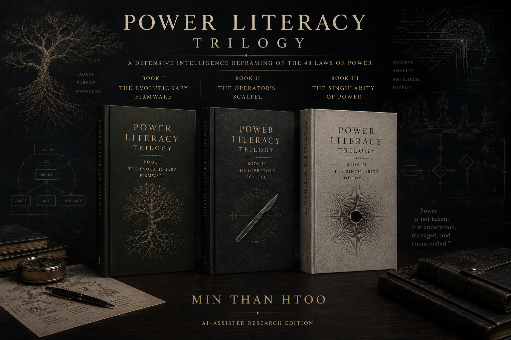

# Power Literacy Trilogy

  

> **A Scientific & Defensive Intelligence Reframing of the 48 Laws of Power**
>
> ⚠️ **Important Note on Ethics & Safety**: This edition has been structurally rewritten to serve strictly as **Defensive Intelligence**. The material herein models coercive systems, algorithmic manipulation, and dominance structures so that readers can detect, document, and defend against them. **It is NOT an instruction manual for manipulation, coercion, harassment, or abuse.** 

## 🎯 Target Audience
This trilogy is specifically engineered for **Founders, Executives, Operators, Policymakers, and Red-teamers**. 

If you are building systems, managing teams, or navigating complex organizational structures, you are operating within unseen power dynamics. The historical *"48 Laws of Power"* focused on individual conquest. This trilogy translates those concepts into **modern risk models, behavioral science frameworks, and systems thinking**—equipping you with the literacy required to safeguard your agency, prevent organizational toxicity, and establish ethical boundaries.

## 📚 The Books

We offer three language editions for every book to support comprehensive learning and translation study:
- 🇲🇲 **Burmese Edition** (Primary Audience)
- 🇬🇧 **English Edition** (Source/Reference)
- 📖 **Bilingual Edition** (Paragraph-by-Paragraph Stacking)

### [Book 1: The Evolutionary Firmware](books/book1-evolutionary-firmware/)
*Understanding the Biological Origins of Power*
- 🇲🇲 [Burmese (Full Book)](books/book1-evolutionary-firmware/burmese/full-book.md) | 🇬🇧 [English (Full Book)](books/book1-evolutionary-firmware/english/full-book.md) | 📖 [Bilingual (Full Book)](books/book1-evolutionary-firmware/bilingual/full-book.md)

### [Book 2: The Operator's Scalpel (V4.1)](books/book2-operators-scalpel/)
*Understanding the Dynamics of Power and Systemic Manipulation*
- 🇲🇲 [Burmese (Full Book)](books/book2-operators-scalpel/burmese/full-book.md) | 🇬🇧 [English (Full Book)](books/book2-operators-scalpel/english/full-book.md) | 📖 [Bilingual (Full Book)](books/book2-operators-scalpel/bilingual/full-book.md)

### [Book 3: The Singularity of Power](books/book3-singularity-of-power/)
*Understanding the Future of Power in the AI Era*
- 🇲🇲 [Burmese (Full Book)](books/book3-singularity-of-power/burmese/full-book.md) | 🇬🇧 [English (Full Book)](books/book3-singularity-of-power/english/full-book.md) | 📖 [Bilingual (Full Book)](books/book3-singularity-of-power/bilingual/full-book.md)

## 🤖 AI Contributors
This trilogy was developed with extensive autonomous assistance from state-of-the-art AI systems:
- **GPT 5.5:** Plan, structure, English draft
- **Gemini 3.1 Pro:** Revision, translation, 4-pass/6-pass translation pipelines
- **Claude Sonnet 4.6:** Revision
- **Claude Opus 4.6:** Revise planning
