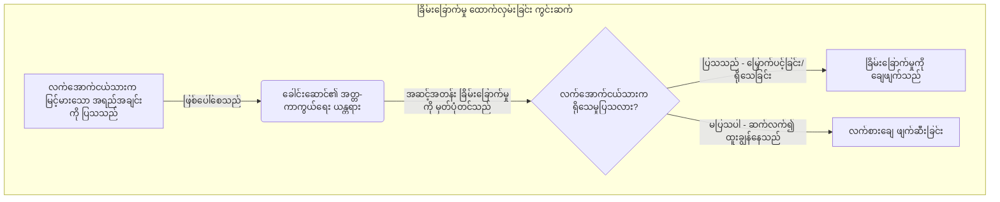
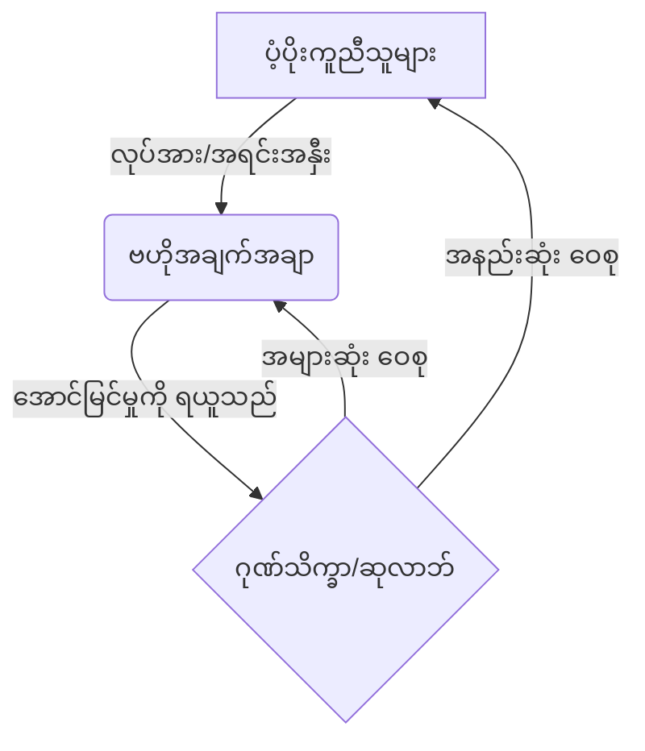
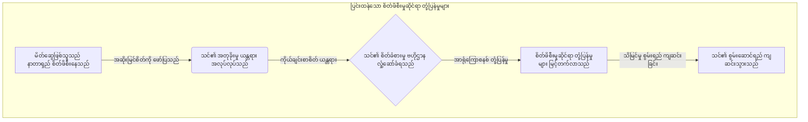
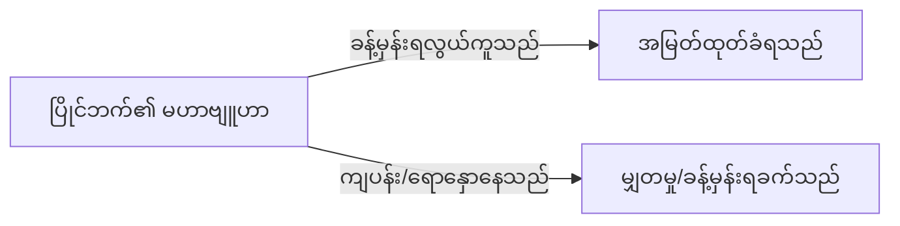
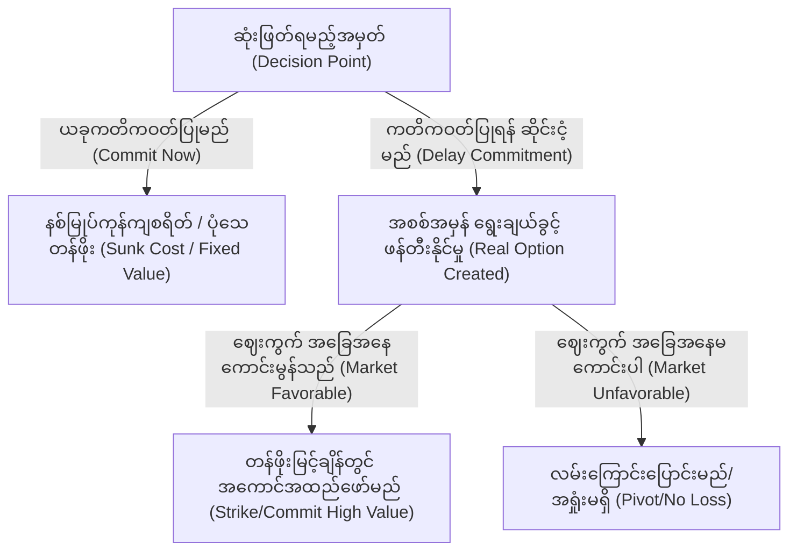
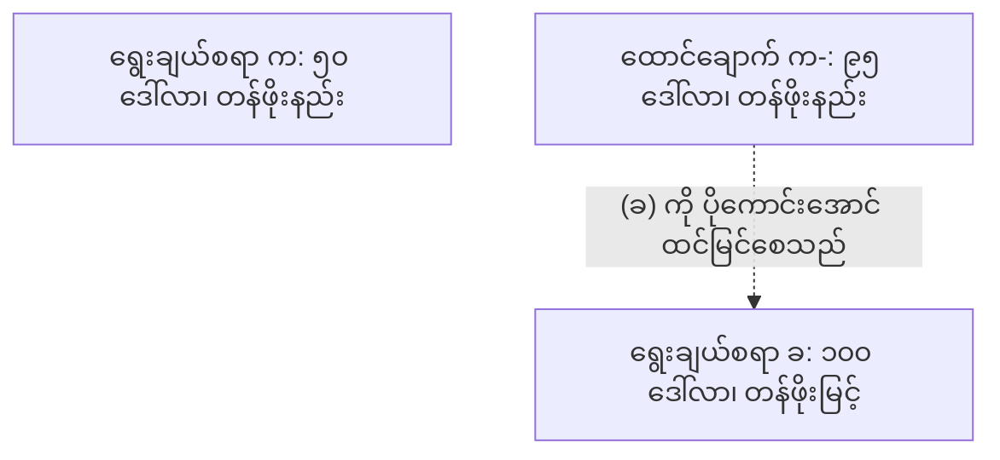
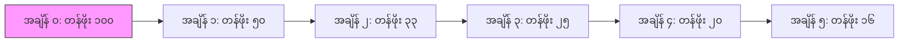
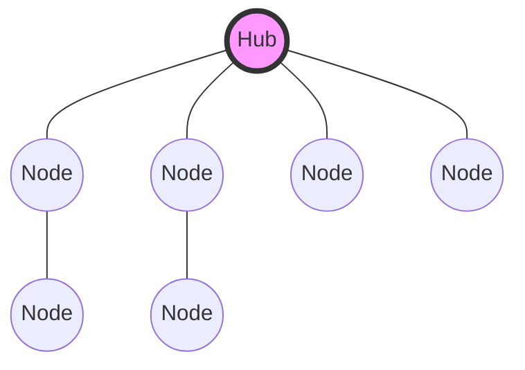
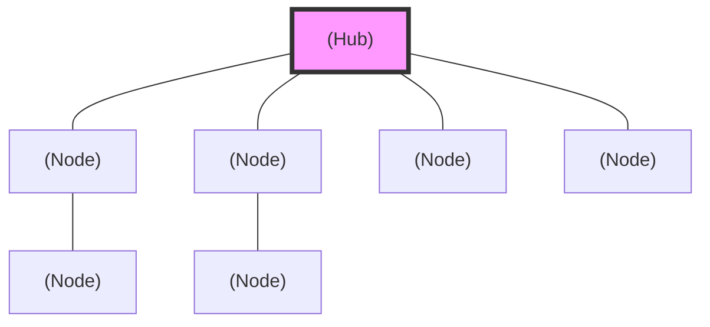
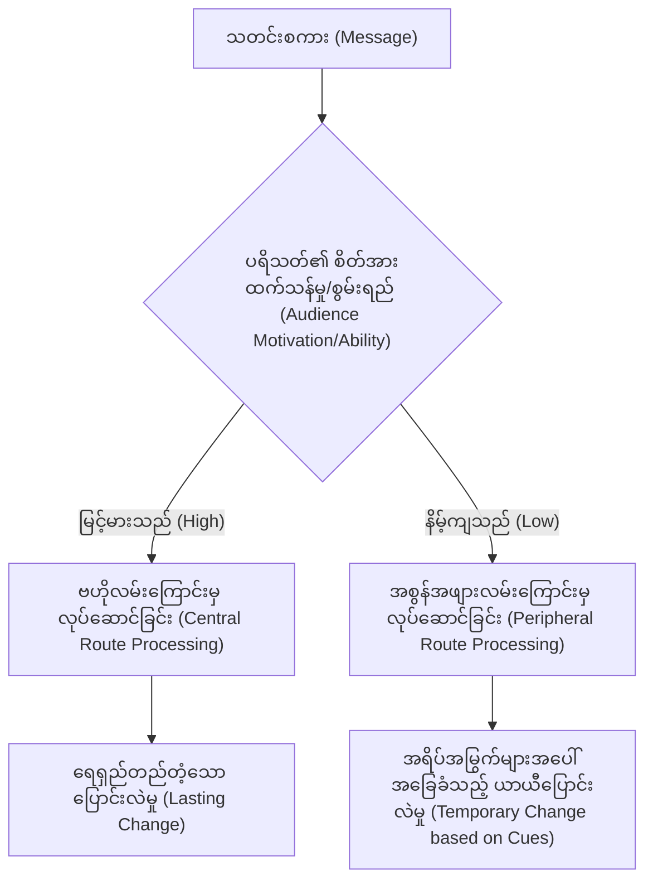

# စာအုပ် ၁: ဆင့်ကဲဖြစ်စဉ်အရ အခြေခံစနစ် (Book 1: The Evolutionary Firmware)

# နိဒါန်း: သြဇာလွှမ်းမိုးမှုဆိုင်ရာ သိပ္ပံပညာ (Introduction: The Science of Influence)

**English**  
For centuries, power has been shrouded in the mystique of history. We are taught to look at the courts of Renaissance Italy, the battlefields of ancient China, and the salons of 18th-century France to understand how humans manipulate, dominate, and survive.

**မြန်မာ**  
> [!IMPORTANT]
> **ထုတ်ဝေသူ၏ အမှာစာ (Publisher's Note):** 
> ဤစာအုပ်တွင် ပါဝင်သော နည်းဗျူဟာများနှင့် စိတ်ပညာဆိုင်ရာ ကစားကွက်များသည် အလွန် ရက်စက်ကြမ်းကြုတ်ပြီး အချို့မှာ ကျင့်ဝတ်နှင့်မညီသော အန္တရာယ်မြင့် ပုံစံများဖြစ်သည်ဟု ထင်ရနိုင်ပါသည်။ သို့သော် မြန်မာနိုင်ငံ၏ စီးပွားရေးလောကနှင့် ကမ္ဘာ့ဈေးကွက်၏ ပြိုင်ဆိုင်မှုအောက်တွင်၊ သင်၏ ပြိုင်ဘက်များသည် ဤနည်းလမ်းများကို သင့်အပေါ် အသုံးပြုနေပြီဆိုသည်ကို သတိပြုရန် လိုအပ်ပါသည်။ ဤစာအုပ်ကို သူတစ်ပါးအား အသုံးချရန် လမ်းညွှန်ချက်တစ်ခုအဖြစ် မဟုတ်ဘဲ၊ သင့်မိသားစုလုပ်ငန်း၊ သင့်အဖွဲ့အစည်းနှင့် သင့်ကိုယ်သင် ကာကွယ်ရန် 'အကာအကွယ်ပေးသော ဉာဏ်ရည် (အကာအကွယ်ပေးသော ဉာဏ်ရည် - Defensive Intelligence)' အဖြစ် ဖတ်ရှုရန် တိုက်တွန်းအပ်ပါသည်။

**English**  
But historical anecdotes are not data. A story about Cesare Borgia is a compelling narrative, but it is not a replicable formula.

**မြန်မာ**  
ရာစုနှစ်များစွာတိုင်အောင် အာဏာ (Power) သည် သမိုင်း၏ လျှို့ဝှက်ဆန်းကြယ်မှုအောက်တွင် ဖုံးကွယ်နေခဲ့သည်။ လူသားများ မည်သို့ ခြယ်လှယ်ကြသနည်း။ မည်သို့ လွှမ်းမိုးကြသနည်း။ မည်သို့ ရှင်သန်ကြသနည်း။ ဤမေးခွန်းများကို နားလည်ရန် အီတလီ ရီနေဆန်းခေတ် နန်းတော်များကို ကျွန်ုပ်တို့ ကြည့်ခဲ့ကြသည်။ ပုဂံ၊ အင်းဝနှင့် ကုန်းဘောင်ခေတ် နန်းတွင်းရေး ရှုပ်ထွေးမှုများကို လေ့လာခဲ့ကြသည်။ ရှေးဟောင်း တရုတ်ပြည် စစ်မြေပြင်များကို လေ့လာရန် သင်ကြားခံခဲ့ရသည်။

**English**  
*The Science of Power* strips away the historical mythology and replaces it with empirical reality. The 48 rules in this book are not derived from folklore; they are extracted from peer-reviewed evolutionary biology [▲ well-replicated], behavioral economics [▲ well-replicated], game theory [▲ well-replicated], and cognitive psychology [▲ well-replicated].

**မြန်မာ**  
သို့သော် သမိုင်းဝင် အဖြစ်အပျက်များသည် တိကျသော အချက်အလက် (data) မဟုတ်ပေ။ တပင်ရွှေထီး၊ ဘုရင့်နောင် သို့မဟုတ် Cesare Borgia တို့၏ သမိုင်းဝင် ဇာတ်လမ်းများသည် စွဲမက်ဖွယ်ကောင်းသည်။ သို့သော် ၎င်းသည် ယနေ့ခေတ် ရန်ကုန်မြို့ရှိ မိသားစုပိုင် ကုမ္ပဏီကြီးများတွင် ထပ်မံပုံတူကူးချနိုင်သော ဖော်မြူလာတစ်ခု မဟုတ်ပေ။

**English**  
We now know exactly why the human brain reacts to status threats. We have mathematical models for coalition building. We have mapped the cognitive heuristics that make us vulnerable to deception. This book is the ultimate operating manual for human behavior.

**မြန်မာ**  
*အာဏာဆိုင်ရာ သိပ္ပံပညာ (The Science of Power)* သည် ဤသမိုင်းဝင် ဒဏ္ဍာရီများကို ဖယ်ရှားပစ်သည်။ ၎င်းတို့ကို လက်တွေ့ကျသော အမှန်တရားဖြင့် အစားထိုးသည်။ ဤစာအုပ်ပါ စည်းမျဉ်း ၄၈ ခုသည် ရိုးရာပုံပြင်များမှ ဆင်းသက်လာခြင်း မဟုတ်ပါ။ ၎င်းတို့ကို ခိုင်မာစွာ အတည်ပြုထားသော သိပ္ပံပညာရပ်များမှ တိုက်ရိုက် ထုတ်နုတ်ထားခြင်း ဖြစ်သည်။ ဆင့်ကဲဖြစ်စဉ် ဇီဝဗေဒ (evolutionary biology) [▲ well-replicated]၊ အပြုအမူဆိုင်ရာ စီးပွားရေးပညာ (behavioral economics) [▲ well-replicated]၊ ဂိမ်းသီအိုရီ (game theory) [▲ well-replicated] နှင့် သိမြင်မှုဆိုင်ရာ စိတ်ပညာ (cognitive psychology) [▲ well-replicated] တို့ဖြစ်သည်။

**မြန်မာ**  
အဆင့်အတန်းဆိုင်ရာ ခြိမ်းခြောက်မှုများကို လူသားတို့၏ ဦးနှောက်က မည်သည့်အတွက်ကြောင့် တုံ့ပြန်သည်ကို ယခုအခါ ကျွန်ုပ်တို့ တိကျစွာ သိရှိနေပြီဖြစ်သည်။ မဟာမိတ် ဖွဲ့စည်းခြင်းအတွက် သင်္ချာပုံစံများ ကျွန်ုပ်တို့တွင် ရှိသည်။ လူကို လှည့်စားခံရလွယ်စေသော သိမြင်မှုဆိုင်ရာ အလေ့အထများကို ပုံဖော်ထားပြီးဖြစ်သည်။ ထို့ကြောင့် ဤစာအုပ်သည် လူသားတို့၏ အပြုအမူအတွက် အကောင်းဆုံး လုပ်ငန်းလည်ပတ်မှု လမ်းညွှန်ဖြစ်သည်။ သို့သော် သူတစ်ပါးကို ခြယ်လှယ်ရန် မဟုတ်ဘဲ၊ ကြမ်းတမ်းလှသော ကမ္ဘာ့ဈေးကွက်တွင် သင့်အား ခြယ်လှယ်လာမည့် ပြိုင်ဘက်များကို ကာကွယ်ရန်ဖြစ်သည့် 'အကာအကွယ်ပေးသော ဉာဏ်ရည် (အကာအကွယ်ပေးသော ဉာဏ်ရည် - Defensive Intelligence)' သာဖြစ်သည်။

# အခန်း ၀: ကျင့်ဝတ်ဆိုင်ရာ မူဘောင် (Chapter 0: The Ethical Framework)

**English**  
*Duty, Harm, and the Architecture of Consent*

**မြန်မာ**  
*တာဝန်၊ ထိခိုက်နစ်နာမှုနှင့် သဘောတူညီချက်ဆိုင်ရာ တည်ဆောက်ပုံ (Duty, Harm, and the Architecture of Consent)*

**English**  
Before engaging with the operational mechanisms of power, it is imperative to establish a rigorous ethical framework. The science of power—drawing from evolutionary biology [▲ well-replicated], game theory [▲ well-replicated], and behavioral economics [▲ well-replicated]—is inherently amoral. A cognitive bias does not care if you use it to negotiate a fair salary or to manipulate a vulnerable partner. However, understanding these mechanisms is a biological imperative. If you do not understand how your "Status Detection System" works, you will be easily provoked. If you do not understand "Information Asymmetry," you will be easily conned. Treat this book as defensive armor just as much as an offensive playbook.

**မြန်မာ**  
အာဏာ၏ လုပ်ငန်းလည်ပတ်မှု ယန္တရားများနှင့် မပတ်သက်မီ၊ တင်းကျပ်သော ကျင့်ဝတ်ဆိုင်ရာ မူဘောင်တစ်ခုကို တည်ဆောက်ရန် အလွန်အရေးကြီးသည်။ ဆင့်ကဲဖြစ်စဉ် ဇီဝဗေဒ၊ ဂိမ်းသီအိုရီနှင့် အပြုအမူဆိုင်ရာ စီးပွားရေးပညာတို့မှ ထုတ်နုတ်ထားသော အာဏာဆိုင်ရာ သိပ္ပံပညာသည် ပင်ကိုယ်အားဖြင့် ကျင့်ဝတ်နှင့် မပတ်သက်ပေ။ သိမြင်မှုဆိုင်ရာ ဘက်လိုက်မှု (cognitive bias) သည် ကိုယ်ချင်းစာတရား မရှိပါ။ ၎င်းကို မျှတသော လစာတစ်ခု ညှိနှိုင်းရန် သုံးမည်လော။ သို့မဟုတ် ထိခိုက်လွယ်သော လက်တွဲဖော်ကို ခြယ်လှယ်ရန် သုံးမည်လော။ ၎င်းက ဂရုစိုက်မည်မဟုတ်ပေ။ သို့သော် ဤယန္တရားများကို နားလည်ခြင်းသည် ဇီဝဗေဒအရ မရှိမဖြစ် လိုအပ်ချက်ဖြစ်သည်။ သင်၏ "အဆင့်အတန်း ထောက်လှမ်းရေး စနစ် (Status Detection System)" မည်သို့ အလုပ်လုပ်သည်ကို သင် နားမလည်လျှင်၊ သင် အလွယ်တကူ ရန်စခံရလိမ့်မည်။ "သတင်းအချက်အလက် မညီမျှမှု (Information Asymmetry)" ကို သင် နားမလည်လျှင်၊ သင် အလွယ်တကူ လှည့်စားခံရလိမ့်မည်။ ဤစာအုပ်ကို တိုက်စစ် ကစားကွက်စာအုပ် တစ်အုပ်အဖြစ် မဟုတ်ဘဲ၊ ကြမ်းတမ်းသော လောကတွင် သင့်လုပ်ငန်းနှင့် မိသားစုကို ကာကွယ်ပေးမည့် အကာအကွယ်ပေးသော သံချပ်ကာတစ်ခု အဖြစ်သာ သဘောထားပါ။ အဘယ်ကြောင့်ဆိုသော် သင်၏ ပြိုင်ဘက်များသည် ဤနည်းလမ်းများကို သင့်အပေါ် အသုံးပြုနေပြီ ဖြစ်သောကြောင့်တည်း။

## အပြုအမူဆိုင်ရာ သိပ္ပံပညာ၏ နှစ်မျိုးသုံး သဘာဝ (The Dual-Use Nature of Behavioral Science)

**English**  
Knowledge of human cognitive architecture is dual-use technology. Just as cryptography can secure communications or conceal illicit activity, the tactical deployment of psychological principles can build thriving coalitions or dismantle an opponent's agency. The laws detailed in this volume describe how the human mind reliably processes information, responds to threats, and allocates trust. They are descriptions of reality, not prescriptions for malice.

**မြန်မာ**  
လူသားတို့၏ သိမြင်မှုဆိုင်ရာ တည်ဆောက်ပုံကို သိရှိခြင်းသည် နှစ်မျိုးသုံး နည်းပညာဖြစ်သည်။ လျှို့ဝှက်ကုဒ်ပညာ (cryptography) သည် ဆက်သွယ်ရေးများကို လုံခြုံစေနိုင်သည်။ တစ်ချိန်တည်းမှာပင် တရားမဝင် လုပ်ရပ်များကို ဖုံးကွယ်နိုင်သည်။ ထို့အတူ စိတ်ပညာဆိုင်ရာ မူဝါဒများကို နည်းဗျူဟာကျကျ အသုံးပြုခြင်းသည် အောင်မြင်သော မဟာမိတ်များကို တည်ဆောက်နိုင်သည်။ ပြိုင်ဘက်၏ စွမ်းဆောင်ရည်ကိုလည်း ဖျက်ဆီးနိုင်သည်။ ဤစာအုပ်တွင် ဖော်ပြထားသော ဥပဒေသများသည် လူ့စိတ်၏ လုပ်ဆောင်ပုံကို ရှင်းပြသည်။ သတင်းအချက်အလက်များကို မည်သို့ ယုံကြည်စိတ်ချစွာ လုပ်ဆောင်သည်ကို ပြသသည်။ ခြိမ်းခြောက်မှုများကို မည်သို့ တုံ့ပြန်သည်ကို ပြသသည်။ ယုံကြည်မှုကို မည်သို့ ခွဲဝေပေးသည်ကို ဖော်ပြသည်။ ၎င်းတို့သည် အမှန်တရားကို ဖော်ပြခြင်းသာ ဖြစ်သည်။ မကောင်းဆိုးဝါးအတွက် ဆေးညွှန်းများ မဟုတ်ပေ။

**English**  
However, the application of these laws demands strict ethical boundaries. We must distinguish between *understanding* mechanisms and *deploying* them aggressively.

**မြန်မာ**  
သို့သော် ဤဥပဒေသများကို အသုံးချရာတွင် တင်းကျပ်သော ကျင့်ဝတ်ဆိုင်ရာ နယ်နိမိတ်များ လိုအပ်သည်။ ယန္တရားများကို *နားလည်ခြင်း (understanding)* နှင့် ၎င်းတို့ကို ရန်လိုစွာ *အသုံးပြုခြင်း (deploying)* အကြား ကျွန်ုပ်တို့ ပြတ်သားစွာ ခွဲခြားရမည်။

## ထိခိုက်နစ်နာမှုကို ရှောင်ရှားရန် တာဝန် (The Duty to Avoid Harm)

**English**  
The foremost ethical principle is the duty to avoid disproportionate harm. While competitive environments—such as corporate negotiations, political campaigns, and market positioning—inherently involve zero-sum dynamics where one party's gain is another's loss, this does not justify predatory behavior.

**မြန်မာ**  
အဓိက ကျင့်ဝတ်ဆိုင်ရာ မူဝါဒမှာ အချိုးအစားမညီသော ထိခိုက်နစ်နာမှုကို ရှောင်ရှားရန် တာဝန်ဖြစ်သည်။ ကော်ပိုရိတ် ညှိနှိုင်းမှုများ၊ နိုင်ငံရေး မဲဆွယ်ပွဲများနှင့် ရန်ကုန်စီးပွားရေးလောက၏ ဈေးကွက် နေရာယူမှုများကဲ့သို့သော ပတ်ဝန်းကျင်များသည် ပြိုင်ဆိုင်မှု ပြင်းထန်သည်။ တစ်ဖက်၏ အမြတ်သည် အခြားတစ်ဖက်၏ အရှုံး (zero-sum dynamics) ဖြစ်သည်။ သို့သော် ဤအချက်က 'ငါးကြီးက ငါးသေးကို စားသော' သားရဲဆန်သော အပြုအမူများကို တရားမျှတမှု မပေးနိုင်ပေ။

**English**  
1. **Proportionality in Conflict:** When deploying strategies that degrade an opponent's resources or reputation, the action must be strictly proportional to the threat they pose. Preemptive strikes against non-combatants or the use of overwhelming force against minor transgressions violates the core tenets of ethical engagement.
2. **Preservation of Consent:** The darkest applications of behavioral science involve the intentional subversion of informed consent. Techniques that weaponize cognitive overload, engineered dependence, or deep deception remove the target's ability to make rational choices in their own self-interest. An ethical operator relies on incentive compatibility and structural alignment, not the hijacking of agency.
3. **The Categorical Imperative of Network Integrity:** Game theory demonstrates that systems built on perpetual deception ultimately collapse into low-trust, low-yield environments. You have an ethical and strategic duty to maintain the baseline integrity of your social and professional networks.

**မြန်မာ**  
၁။ **ပဋိပက္ခတွင် အချိုးအစားညီမျှမှု (Proportionality in Conflict):** ပြိုင်ဘက်၏ အရင်းအမြစ်များ သို့မဟုတ် ဂုဏ်သတင်းကို ကျဆင်းစေမည့် ဗျူဟာများကို သုံးသောအခါ သတိပြုပါ။ ထိုလုပ်ရပ်သည် ၎င်းတို့ပေးသော ခြိမ်းခြောက်မှုနှင့် တင်းကျပ်စွာ အချိုးအစား ညီမျှရမည်။ တိုက်ခိုက်သူမဟုတ်သူများကို ကြိုတင်တိုက်ခိုက်ခြင်း မပြုရ။ အသေးအဖွဲ ပြစ်မှုများအပေါ် အလွန်အမင်း အင်အားသုံးခြင်း မပြုရ။ ၎င်းသည် ကျင့်ဝတ်ဆိုင်ရာ ပါဝင်ပတ်သက်မှု၏ အဓိက မူဝါဒများကို ချိုးဖောက်ခြင်းဖြစ်သည်။
၂။ **သဘောတူညီချက်ကို ထိန်းသိမ်းခြင်း (Preservation of Consent):** အပြုအမူဆိုင်ရာ သိပ္ပံပညာ၏ အမှောင်မိုက်ဆုံး အသုံးချမှုများတွင် သိနားလည်မှုရှိသော သဘောတူညီချက် (informed consent) ကို ရည်ရွယ်ချက်ရှိရှိ ဖျက်ဆီးခြင်း ပါဝင်သည်။ သိမြင်မှုဆိုင်ရာ ဝန်ပိစေခြင်းများကို သုံးသည်။ ရည်ရွယ်ချက်ရှိရှိ မှီခိုစေခြင်းများကို သုံးသည်။ နက်ရှိုင်းသော လှည့်စားခြင်းများကို လက်နက်အဖြစ် အသုံးပြုသည်။ ဤနည်းစနစ်များသည် ပစ်မှတ်ထားခံရသူ၏ ကိုယ်ကျိုးအတွက် မှန်ကန်သော ရွေးချယ်မှုများ ပြုလုပ်နိုင်စွမ်းကို ဖယ်ရှားပစ်သည်။ ကျင့်ဝတ်စောင့်ထိန်းသူ တစ်ဦးသည် တွန်းအားပေးမှုနှင့် ဖွဲ့စည်းပုံဆိုင်ရာ ညီညွတ်မှုကိုသာ အားကိုးသည်။ သူတစ်ပါး၏ စွမ်းဆောင်ရည်ကို လုယူခြင်း မပြုပေ။
၃။ **ကွန်ရက် ဂုဏ်သိက္ခာ၏ မရှိမဖြစ် လိုအပ်ချက် (The Categorical Imperative of Network Integrity):** ထာဝရ လှည့်စားမှုအပေါ် တည်ဆောက်ထားသော စနစ်များသည် နောက်ဆုံးတွင် ပြိုကျသွားသည်။ ယုံကြည်မှုနည်းပါးပြီး အကျိုးအမြတ်နည်းပါးသော ပတ်ဝန်းကျင်များအဖြစ် ပြောင်းလဲသွားကြောင်း ဂိမ်းသီအိုရီက သက်သေပြသည်။ သင်၏ လူမှုရေးနှင့် ပရော်ဖက်ရှင်နယ် ကွန်ရက်များ၏ အခြေခံ ဂုဏ်သိက္ခာကို ထိန်းသိမ်းရန် သင့်တွင် ကျင့်ဝတ်နှင့် ဗျူဟာမြောက် တာဝန်ရှိသည်။

## နားလည်ခြင်းနှင့် အသုံးပြုခြင်းကြား ကွာခြားချက် (The Distinction Between Understanding and Deployment)

**English**  
Understanding the mechanisms of power is not equivalent to deploying them. A structural engineer must understand the physics of building collapse to design safe structures; similarly, an ethical operator must understand the mechanisms of cognitive manipulation and status threat to design resilient organizations.

**မြန်မာ**  
အာဏာ၏ ယန္တရားများကို နားလည်ခြင်းသည် ၎င်းတို့ကို အသုံးပြုခြင်းနှင့် မတူညီပေ။ ဖွဲ့စည်းပုံ အင်ဂျင်နီယာတစ်ဦးသည် ဘေးကင်းသော တည်ဆောက်ပုံများကို ဒီဇိုင်းဆွဲရန် အဆောက်အအုံ ပြိုကျမှု ရူပဗေဒကို နားလည်ရမည်။ အလားတူပင် ကျင့်ဝတ်စောင့်ထိန်းသူ တစ်ဦးသည် ခံနိုင်ရည်ရှိသော အဖွဲ့အစည်းများကို ဒီဇိုင်းဆွဲရန် သိမြင်မှုဆိုင်ရာ ခြယ်လှယ်ခြင်းနှင့် အဆင့်အတန်း ခြိမ်းခြောက်မှု ယန္တရားများကို နားလည်ရမည်။

**English**  
We study the pathology of power to cure it. When you understand how a "Status Threat" triggers ego-defensive aggression, you can navigate your workplace without accidentally triggering your superior's insecurities. When you understand the "Free-Rider Problem," you can design incentive-compatible teams where contribution is rewarded and exploitation is minimized.

**မြန်မာ**  
အာဏာ၏ ရောဂါဗေဒကို ကုသရန် ကျွန်ုပ်တို့ လေ့လာသည်။ "အဆင့်အတန်း ခြိမ်းခြောက်မှု (Status Threat)" က အတ္တကို ကာကွယ်သော ရန်လိုမှုကို မည်သို့ ဖြစ်ပေါ်စေကြောင်း သင်နားလည်လာမည်။ ထိုအခါ သင်၏ အထက်လူကြီး၏ မလုံခြုံမှုများကို မတော်တဆ မနှိုးဆွဘဲ သင်၏ လုပ်ငန်းခွင်ကို ဖြတ်သန်းနိုင်သည်။ "အလကားလိုက်ပါသူ ပြဿနာ (Free-Rider Problem)" ကို သင်နားလည်လာမည်။ ထိုအခါ ပံ့ပိုးကူညီမှုကို ဆုချီးမြှင့်ပြီး အမြတ်ထုတ်ခြင်းကို အနည်းဆုံးဖြစ်စေမည့် အဖွဲ့များကို သင် ဒီဇိုင်းဆွဲနိုင်သည်။

**English**  
The deployment of offensive tactics must be reserved exclusively for defense. When confronted by a predatory actor who is actively attempting to degrade your resources, reputation, or agency, the ethical operator is justified in deploying reciprocal, proportional counter-measures to neutralize the threat.

**မြန်မာ**  
တိုက်စစ် နည်းဗျူဟာများကို အသုံးပြုခြင်းကို ကာကွယ်ရေးအတွက်သာ သီးသန့်ထားရှိရမည်။ သင်၏ အရင်းအမြစ်များ၊ ဂုဏ်သတင်း သို့မဟုတ် စွမ်းဆောင်ရည်ကို တက်ကြွစွာ လျှော့ချရန် ကြိုးစားနေသော တိုက်ခိုက်သူနှင့် သင် ရင်ဆိုင်ရနိုင်သည်။ ထိုအခါ ကျင့်ဝတ်စောင့်ထိန်းသူသည် ခြိမ်းခြောက်မှုကို ချေဖျက်ရန် အပြန်အလှန် အချိုးအစားညီမျှသော တန်ပြန်တိုက်ခိုက်မှုများကို အသုံးပြုရန် တရားမျှတမှု ရှိသည်။

## ကာကွယ်ရေးအတွက် အသုံးချခြင်း: အဓိက လိုအပ်ချက် (Defensive Application: The Primary Mandate)

**English**  
The primary utility of this text is defensive. By studying the mechanics of status threats, information control, and coalition dynamics, you immunize yourself against manipulation.

**မြန်မာ**  
ဤစာသား၏ အဓိက အသုံးဝင်မှုမှာ ကာကွယ်ရေးဖြစ်သည်။ အဆင့်အတန်း ခြိမ်းခြောက်မှုများ၊ သတင်းအချက်အလက် ထိန်းချုပ်မှုနှင့် မဟာမိတ်ဖွဲ့ခြင်းများ၏ ယန္တရားများကို လေ့လာခြင်းဖြင့်၊ သင်သည် ခြယ်လှယ်ခံရခြင်းမှ သင့်ကိုယ်သင် ကာကွယ်နိုင်သည်။

**English**  
*   **Recognizing the Attack:** When you feel a sudden, irrational urge to concede in a negotiation, you will recognize the reciprocity bias at work.
*   **Neutralizing the Threat:** When a colleague attempts to isolate you from your network, you will understand the structural dynamics of social asphyxiation and counter it by reinforcing your weak ties.
*   **Systemic Resilience:** By understanding the evolutionary firmware, you transition from a reactive node in the network to a conscious architect of your own environment.

**မြန်မာ**  
*   **တိုက်ခိုက်မှုကို အသိအမှတ်ပြုခြင်း (Recognizing the Attack):** ညှိနှိုင်းမှုတစ်ခုတွင် အရှုံးပေးရန် ရုတ်တရက် အကျိုးသင့်အကြောင်းသင့်မရှိသော ဆန္ဒကို သင်ခံစားရနိုင်သည်။ ထိုအခါ အပြန်အလှန်လုပ်ဆောင်မှု ဘက်လိုက်မှု (reciprocity bias) အလုပ်လုပ်နေကြောင်း သင် ချက်ချင်း အသိအမှတ်ပြုလိမ့်မည်။
*   **ခြိမ်းခြောက်မှုကို ချေဖျက်ခြင်း (Neutralizing the Threat):** လုပ်ဖော်ကိုင်ဖက်တစ်ဦးက သင့်အား သင်၏ ကွန်ရက်မှ ဖယ်ထုတ်ရန် ကြိုးစားနိုင်သည်။ ထိုအခါ လူမှုရေးအရ အသက်ရှူကျပ်ခြင်း (social asphyxiation) ၏ ဖွဲ့စည်းပုံဆိုင်ရာ သဘောသဘာဝများကို သင်နားလည်လိမ့်မည်။ သင်၏ အားနည်းသော ဆက်သွယ်မှုများကို အားဖြည့်ခြင်းဖြင့် ၎င်းကို တန်ပြန်လိမ့်မည်။
*   **စနစ်တကျ ခံနိုင်ရည်ရှိခြင်း (Systemic Resilience):** ဆင့်ကဲဖြစ်စဉ်အရ အခြေခံစနစ်ကို နားလည်ခြင်းဖြင့်၊ သင်သည် ကွန်ရက်အတွင်း တုံ့ပြန်မှုသက်သက်ပြုလုပ်သော အစိတ်အပိုင်းတစ်ခု မဟုတ်တော့ပေ။ သင်ကိုယ်တိုင်၏ ပတ်ဝန်းကျင်ကို သတိရှိရှိ ဖန်တီးသူတစ်ဦးအဖြစ် ကူးပြောင်းသွားသည်။

**English**  
This framework is not a constraint on your power; it is the foundation of sustainable dominance. Power exercised without ethical calibration is inherently volatile and self-destructive. Power exercised with clinical precision and ethical restraint becomes an unassailable structural advantage. The mastery of human behavior requires the discipline to govern oneself before attempting to govern others.

**မြန်မာ**  
ဤမူဘောင်သည် သင်၏ အာဏာအတွက် ကန့်သတ်ချက်တစ်ခု မဟုတ်ပါ။ ၎င်းသည် ရေရှည်တည်တံ့သော လွှမ်းမိုးမှု၏ အခြေခံအုတ်မြစ်ဖြစ်သည်။ ကျင့်ဝတ်ဆိုင်ရာ ချိန်ညှိမှုမရှိဘဲ ကျင့်သုံးသော အာဏာသည် ပင်ကိုယ်အားဖြင့် မတည်ငြိမ်ပေ။ ဓားသွားပေါ် လမ်းလျှောက်ရသကဲ့သို့ မိမိကိုယ်ကို ဖျက်ဆီးတတ်သည်။ တိကျသေချာမှုနှင့် ကျင့်ဝတ်ဆိုင်ရာ ထိန်းချုပ်မှုတို့ဖြင့် ကျင့်သုံးသော အာဏာသည်သာ မိသားစုလုပ်ငန်းနှင့် ကိုယ်ပိုင်အင်ပါယာကို ကာကွယ်ရန် အနိုင်ယူမရနိုင်သော ဖွဲ့စည်းပုံဆိုင်ရာ အားသာချက်တစ်ခု ဖြစ်လာသည်။ လူသားတို့၏ အပြုအမူကို ကျွမ်းကျင်ပိုင်နိုင်ခြင်းသည် သူတစ်ပါးကို မအုပ်ချုပ်မီ မိမိကိုယ်ကို အုပ်ချုပ်ရန် စည်းကမ်းရှိခြင်း လိုအပ်သည်။

### အကြောင်းအရာအလိုက် ဖတ်ရှုရန် လမ်းညွှန် (Thematic Reading Guide)

**English**  
This book is designed to be read straight through, sequentially, as a comprehensive tactical playbook. However, if you wish to master specific disciplines of human behavior, you may study the laws through the following thematic framework:

**မြန်မာ**  
ဤစာအုပ်ကို ပြည့်စုံသော နည်းဗျူဟာ လမ်းညွှန်အဖြစ် အစမှအဆုံး အစဉ်လိုက် ဖတ်ရှုရန် ရည်ရွယ်ထားသည်။ သို့သော် သင်သည် လူသားအပြုအမူ၏ သီးခြား ဘာသာရပ်များကို ကျွမ်းကျင်လိုပါက၊ အောက်ပါ အကြောင်းအရာအလိုက် မူဘောင်မှတစ်ဆင့် စည်းမျဉ်းများကို လေ့လာနိုင်သည်-

**English**  
*   **Part I: The Architecture of Status & Reputation**
    *Focus on: Evolutionary hierarchies, impression management, and the neurobiology of rank.*
    *(e.g., Laws 1, 5, 6, 24, 34)*
*   **Part II: Information Asymmetry & Cognitive Manipulation**
    *Focus on: Deception, heuristics, choice architecture, and weaponized ambiguity.*
    *(e.g., Laws 3, 4, 12, 21, 31, 44)*
*   **Part III: Network Dynamics & Coalition Building**
    *Focus on: Social capital, power-dependence relations, and the Alliance Hypothesis.*
    *(e.g., Laws 2, 10, 11, 13, 18, 42)*
*   **Part IV: Strategic Conflict & Resource Allocation**
    *Focus on: Game theory, zero-sum dynamics, and cognitive depletion.*
    *(e.g., Laws 8, 15, 23, 29, 39)*
*   **Part V: Evolutionary Adaptation & Self-Mastery**
    *Focus on: Phenotypic plasticity, emotional regulation, and avoiding the sunk cost fallacy.*
    *(e.g., Laws 20, 25, 35, 47, 48)*

**မြန်မာ**  
*   **အပိုင်း ၁: အဆင့်အတန်းနှင့် ဂုဏ်သတင်း၏ တည်ဆောက်ပုံ (Part I: The Architecture of Status & Reputation)**
    *အဓိကထားလေ့လာရန်: ဆင့်ကဲဖြစ်စဉ် အဆင့်ဆင့်အုပ်ချုပ်မှုများ၊ အထင်အမြင် စီမံခန့်ခွဲမှုနှင့် အဆင့်အတန်းဆိုင်ရာ အာရုံကြောဇီဝဗေဒ။*
    *(ဥပမာ- စည်းမျဉ်း ၁၊ ၅၊ ၆၊ ၂၄၊ ၃၄)*
*   **အပိုင်း ၂: သတင်းအချက်အလက် မညီမျှမှုနှင့် သိမြင်မှုဆိုင်ရာ ခြယ်လှယ်ခြင်း (Part II: Information Asymmetry & Cognitive Manipulation)**
    *အဓိကထားလေ့လာရန်: လှည့်စားခြင်း၊ အလေ့အထများ၊ ရွေးချယ်မှုဆိုင်ရာ တည်ဆောက်ပုံနှင့် လက်နက်အဖြစ် အသုံးပြုထားသော မပီပြင်မှု။*
    *(ဥပမာ- စည်းမျဉ်း ၃၊ ၄၊ ၁၂၊ ၂၁၊ ၃၁၊ ၄၄)*
*   **အပိုင်း ၃: ကွန်ရက် သဘောသဘာဝများနှင့် မဟာမိတ်ဖွဲ့ခြင်း (Part III: Network Dynamics & Coalition Building)**
    *အဓိကထားလေ့လာရန်: လူမှုရေး အရင်းအနှီး၊ အာဏာ-မှီခိုမှု ဆက်ဆံရေးများနှင့် မဟာမိတ် ယူဆချက်။*
    *(ဥပမာ- စည်းမျဉ်း ၂၊ ၁၀၊ ၁၁၊ ၁၃၊ ၁၈၊ ၄၂)*
*   **အပိုင်း ၄: ဗျူဟာမြောက် ပဋိပက္ခနှင့် အရင်းအမြစ် ခွဲဝေမှု (Part IV: Strategic Conflict & Resource Allocation)**
    *အဓိကထားလေ့လာရန်: ဂိမ်းသီအိုရီ၊ အရှုံးအမြတ် မျှခြေ သဘောသဘာဝများနှင့် သိမြင်မှုဆိုင်ရာ ကုန်ခမ်းခြင်း။*
    *(ဥပမာ- စည်းမျဉ်း ၈၊ ၁၅၊ ၂၃၊ ၂၉၊ ၃၉)*
*   **အပိုင်း ၅: ဆင့်ကဲဖြစ်စဉ်အရ ပြောင်းလဲခြင်းနှင့် မိမိကိုယ်ကို ကျွမ်းကျင်ပိုင်နိုင်ခြင်း (Part V: Evolutionary Adaptation & Self-Mastery)**
    *အဓိကထားလေ့လာရန်: ပြင်ပလက္ခဏာ ပြောင်းလဲနိုင်စွမ်း၊ စိတ်ခံစားမှု ထိန်းချုပ်ခြင်းနှင့် နစ်မြုပ်နေသော ကုန်ကျစရိတ် မှားယွင်းမှုတို့ကို ရှောင်ရှားခြင်း။*
    *(ဥပမာ- စည်းမျဉ်း ၂၀၊ ၂၅၊ ၃၅၊ ၄၇၊ ၄၈)*

**English**  
---

# မာတိကာ - အာဏာ၏ သိပ္ပံပညာ

**English**  
**Chapter 1**: Never Outshine the Master
*Scientific Mechanism:* Status Threat & Ego-Defensive Aggression

**မြန်မာ**  
**အခန်း ၁**: ဆရာ့ထက် ဘယ်တော့မှ မထူးချွန်ပါစေနှင့်
*သိပ္ပံနည်းကျ ယန္တရား:* အဆင့်အတန်း ခြိမ်းခြောက်ခံရမှုနှင့် အတ္တ-ကာကွယ်သော ရန်လိုမှု

**English**  
**Chapter 2**: Never Put Too Much Trust in Friends, Learn How to Use Enemies
*Scientific Mechanism:* The Alliance Hypothesis for Friendship & Coalition Dynamics

**မြန်မာ**  
**အခန်း ၂**: သူငယ်ချင်းများအပေါ် အလွန်အမင်း မယုံကြည်ပါနှင့်၊ ရန်သူများ၏ အန္တရာယ်ကို ကာကွယ်နည်း သင်ယူပါ
*သိပ္ပံနည်းကျ ယန္တရား:* ခင်မင်မှုနှင့် မဟာမိတ်ဖွဲ့ခြင်းဆိုင်ရာ လှုပ်ရှားမှုများအတွက် မဟာမိတ် အယူအဆ (The Alliance Hypothesis for Friendship & Coalition Dynamics)

**English**  
**Chapter 3**: Conceal Your Intentions
*Scientific Mechanism:* Plausible Deniability, Indirect Speech Acts, & Self-Deception

**မြန်မာ**  
**အခန်း ၃**: ရည်ရွယ်ချက်ဆိုင်ရာ အချက်အလက်လုံခြုံရေးကို ထိန်းသိမ်းပါ
*သိပ္ပံနည်းကျ ယန္တရား:* ဖြစ်နိုင်ခြေရှိသော ငြင်းဆိုနိုင်စွမ်း (Plausible Deniability)၊ သွယ်ဝိုက်သော စကားပြောဆိုမှုများနှင့် မိမိကိုယ်ကို လှည့်စားခြင်း

**English**  
**Chapter 4**: Always Say Less Than Necessary
*Scientific Mechanism:* Conversational Inference, Plausible Deniability, & The Strategic Speaker Model

**မြန်မာ**  
**အခန်း ၄**: လိုအပ်သည်ထက် အမြဲတမ်း လျှော့ပြောပါ
*သိပ္ပံနည်းကျ ယန္တရား:* စကားပြောဆိုမှုမှ ကောက်ချက်ချခြင်း၊ ဖြစ်နိုင်ခြေရှိသော ငြင်းဆိုနိုင်စွမ်းနှင့် မဟာဗျူဟာမြောက် စကားပြောသူ ပုံစံ

**English**  
**Chapter 5**: Reputation Is Everything—Guard It with Your Life
*Scientific Mechanism:* Indirect Reciprocity & Reputation Systems

**မြန်မာ**  
**အခန်း ၅**: ဂုဏ်သတင်းသည် အရာအားလုံးဖြစ်သည်—ယင်းကို သင့်အသက်တမျှ ကာကွယ်ပါ
*သိပ္ပံနည်းကျ ယန္တရား:* သွယ်ဝိုက်သော အပြန်အလှန်တုံ့ပြန်မှုနှင့် ဂုဏ်သတင်းစနစ်များ

**English**  
**Chapter 6**: Court Attention at All Cost
*Scientific Mechanism:* Attentional Capture, Salience Bias, & Information Cascades [▲ well-replicated]

**မြန်မာ**  
**အခန်း ၆**: မည်သည့်စရိတ်နှင့်မဆို အာရုံစိုက်ခံရအောင် လုပ်ပါ
*သိပ္ပံနည်းကျ ယန္တရား:* အာရုံစိုက်မှုကို ဖမ်းယူခြင်း၊ ထင်ရှားမှု ဘက်လိုက်ခြင်းနှင့် သတင်းအချက်အလက် ဆက်တိုက်စီးဆင်းမှုများ [▲ ကောင်းစွာ အတည်ပြုပြီး (well-replicated)]

**English**  
**Chapter 7**: Get Others to Do the Work for You, but Always Take the Credit
*Scientific Mechanism:* The Free-Rider Problem, Division of Labor, & Principal-Agent Hierarchies

**မြန်မာ**  
**အခန်း ၇**: သင့်အတွက် အလုပ်လုပ်ပေးရန် အခြားသူများကို ခိုင်းစေပါ၊ သို့သော် အမြဲတမ်း သင်ကသာ နာမည်ကောင်း ယူပါ
*သိပ္ပံနည်းကျ ယန္တရား:* အခမဲ့ အကျိုးခံစားသူ ပြဿနာ (The Free-Rider Problem)၊ အလုပ်ခွဲဝေမှုနှင့် အဓိက-ကိုယ်စားလှယ် အဆင့်ဆင့် အုပ်ချုပ်မှုများ

**English**  
**Chapter 8**: Make Other People Come to You—Use Bait if Necessary
*Scientific Mechanism:* Best Alternative to a Negotiated Agreement (BATNA) [▲ well-replicated] & Sunk Cost Commitments

**မြန်မာ**  
**အခန်း ၈**: အခြားသူများကို သင့်ထံ လာစေပါ—လိုအပ်ပါက ငါးစာကို အသုံးပြုပါ
*သိပ္ပံနည်းကျ ယန္တရား:* စေ့စပ်ညှိနှိုင်းထားသော သဘောတူညီချက်တစ်ခုအတွက် အကောင်းဆုံး အစားထိုးရွေးချယ်စရာ (BATNA) [▲ ကောင်းစွာ အတည်ပြုပြီး] နှင့် ဆုံးရှုံးပြီးသား ရင်းနှီးမြှုပ်နှံမှုအပေါ် ကတိကဝတ်ပြုခြင်း

**English**  
**Chapter 9**: Win Through Your Actions, Never Through Argument
*Scientific Mechanism:* Costly Signaling Theory & Cognitive Dissonance [▲ well-replicated] (Self-Perception)

**မြန်မာ**  
**အခန်း ၉**: သင်၏ လုပ်ရပ်များမှတစ်ဆင့် အနိုင်ယူပါ၊ ငြင်းခုံခြင်းမှတစ်ဆင့် ဘယ်တော့မှ မလုပ်ပါနှင့်
*သိပ္ပံနည်းကျ ယန္တရား:* တန်ဖိုးကြီးသော သင်္ကေတပြခြင်း သီအိုရီ (Costly Signaling Theory) နှင့် သိမြင်မှုဆိုင်ရာ ပဋိပက္ခ (Cognitive Dissonance) [▲ ကောင်းစွာ အတည်ပြုပြီး] (မိမိကိုယ်ကို အကဲဖြတ်ခြင်း)

**English**  
**Chapter 10**: Infection: Avoid the Unhappy and Unlucky
*Scientific Mechanism:* Emotional Contagion & Social Network Transmission

**မြန်မာ**  
**အခန်း ၁၀**: ကူးစက်မှု - မပျော်ရွှင်သူနှင့် ကံမကောင်းသူများကို ရှောင်ရှားပါ
*သိပ္ပံနည်းကျ ယန္တရား:* စိတ်ခံစားမှု ကူးစက်ခြင်းနှင့် လူမှုကွန်ရက် ပြန့်ပွားမှု

**English**  
**Chapter 11**: Learn to Keep People Dependent on You
*Scientific Mechanism:* Power-Dependence Relations & Social Exchange Theory

**မြန်မာ**  
**အခန်း ၁၁**: လူများကို သင့်အပေါ် မှီခိုနေစေရန် သင်ယူပါ
*သိပ္ပံနည်းကျ ယန္တရား:* အာဏာ-မှီခိုမှု ဆက်ဆံရေးများနှင့် လူမှုဖလှယ်ရေး သီအိုရီ

**English**  
**Chapter 12**: Use Selective Honesty and Generosity to Disarm Your Victim
*Scientific Mechanism:* Strategic Disclosures & Reciprocity Bias

**မြန်မာ**  
**အခန်း ၁၂**: သင့်သားကောင်ကို လက်နက်ချစေရန် ရွေးချယ်ထားသော ရိုးသားမှုနှင့် ရက်ရောမှုကို အသုံးပြုပါ
*သိပ္ပံနည်းကျ ယန္တရား:* မဟာဗျူဟာမြောက် ဖွင့်ဟပြောဆိုမှုများနှင့် အပြန်အလှန်တုံ့ပြန်မှု ဘက်လိုက်ခြင်း

**English**  
**Chapter 13**: When Asking for Help, Appeal to People's Self-Interest, Never to Their Mercy or Gratitude
*Scientific Mechanism:* Incentive Compatibility & Rational Choice Theory

**မြန်မာ**  
**အခန်း ၁၃**: အကူအညီတောင်းသောအခါ၊ လူများ၏ ကိုယ်ကျိုးစီးပွားကိုသာ ရည်ညွှန်းပါ၊ သူတို့၏ ကရုဏာ သို့မဟုတ် ကျေးဇူးတင်မှုကို ဘယ်တော့မှ မရည်ညွှန်းပါနှင့်
*သိပ္ပံနည်းကျ ယန္တရား:* မက်လုံး ကိုက်ညီမှုနှင့် အကျိုးသင့်အကြောင်းသင့် ရွေးချယ်မှု သီအိုရီ (Rational Choice Theory)

**English**  
**Chapter 14**: Pose as a Friend, Work as a Spy
*Scientific Mechanism:* Strategic Ingratiation & Information Asymmetry

**မြန်မာ**  
**အခန်း ၁၄**: သူငယ်ချင်းကဲ့သို့ ဟန်ဆောင်ပါ၊ သူလျှိုကဲ့သို့ အလုပ်လုပ်ပါ
*သိပ္ပံနည်းကျ ယန္တရား:* မဟာဗျူဟာမြောက် မျက်နှာလိုမျက်နှာရလုပ်ခြင်း (Strategic Ingratiation) နှင့် သတင်းအချက်အလက် မညီမျှမှု (Information Asymmetry)

**English**  
**Chapter 15**: Crush Your Enemy Totally
*Scientific Mechanism:* Conflict Escalation Dynamics & Evolutionary Stable Strategies (Hawk-Dove)

**မြန်မာ**  
**အခန်း ၁၅**: အလုံးစုံ ပဋိပက္ခအရှိန်မြှင့်တင်မှုကို ကာကွယ်ပါ
*သိပ္ပံနည်းကျ ယန္တရား:* ပဋိပက္ခ ကြီးထွားလာမှု လှုပ်ရှားမှုများနှင့် ဆင့်ကဲဖြစ်စဉ်အရ တည်ငြိမ်သော မဟာဗျူဟာများ (သိမ်းငှက်-ချိုးငှက်)

**English**  
**Chapter 16**: Use Absence to Increase Respect and Honor
*Scientific Mechanism:* The Scarcity Effect & Psychological Reactance Theory

**မြန်မာ**  
**အခန်း ၁၆**: လေးစားမှုနှင့် ဂုဏ်အသရေကို တိုးပွားစေရန် ပျောက်ကွယ်နေမှုကို အသုံးပြုပါ
*သိပ္ပံနည်းကျ ယန္တရား:* ရှားပါးမှု အကျိုးသက်ရောက်မှု (The Scarcity Effect) နှင့် စိတ်ပညာဆိုင်ရာ တုံ့ပြန်မှု သီအိုရီ (Psychological Reactance Theory)

**English**  
**Chapter 17**: Keep Others in Suspended Terror: Cultivate an Air of Unpredictability
*Scientific Mechanism:* Mixed Strategies in Game Theory [▲ well-replicated] & Information Entropy

**မြန်မာ**  
**အခန်း ၁၇**: အခြားသူများကို အမြဲတမ်း ထိတ်လန့်နေစေပါ - ခန့်မှန်းရခက်သည့် အခြေအနေကို ဖန်တီးပါ
*သိပ္ပံနည်းကျ ယန္တရား:* ဂိမ်းသီအိုရီ (Game Theory) [▲ ကောင်းစွာ အတည်ပြုပြီး] မှ ရောနှောမဟာဗျူဟာများနှင့် သတင်းအချက်အလက် အင်ထရိုပီ (Information Entropy)

**English**  
**Chapter 18**: Do Not Build Fortresses to Protect Yourself—Isolation Is Dangerous
*Scientific Mechanism:* Social Capital Theory & Network Centrality (The Strength of Weak Ties)

**မြန်မာ**  
**အခန်း ၁၈**: သင့်ကိုယ်သင် ကာကွယ်ရန် ခံတပ်များ မဆောက်ပါနှင့် - အထီးကျန်ခြင်းသည် အန္တရာယ်ရှိသည်
*သိပ္ပံနည်းကျ ယန္တရား:* လူမှုအရင်းအနှီး သီအိုရီနှင့် ကွန်ရက် ဗဟိုချက်ဖြစ်မှု (အားနည်းသော ချိတ်ဆက်မှုများ၏ အာဏာ)

**English**  
**Chapter 19**: Know Who You're Dealing With—Do Not Offend the Wrong Person
*Scientific Mechanism:* Personality Psychology & Five-Factor (Big Five) Model

**မြန်မာ**  
**အခန်း ၁၉**: သင် မည်သူနှင့် ဆက်ဆံနေသည်ကို သိပါ - မှားယွင်းသောသူကို မစော်ကားပါနှင့်
*သိပ္ပံနည်းကျ ယန္တရား:* ကိုယ်ရည်ကိုယ်သွေး စိတ်ပညာနှင့် အချက်ငါးချက် (Big Five) မော်ဒယ်

**English**  
**Chapter 20**: Commit to No One
*Scientific Mechanism:* Real Options Theory & Transaction Cost Optionality

**မြန်မာ**  
**အခန်း ၂၀**: မည်သူ့ကိုမျှ ကတိကဝတ် မပြုပါနှင့်
*သိပ္ပံနည်းကျ ယန္တရား:* တကယ့် ရွေးချယ်စရာများ သီအိုရီ (Real Options Theory) နှင့် ငွေပေးငွေယူ ကုန်ကျစရိတ် ရွေးချယ်နိုင်ခွင့် (Transaction Cost Optionality)

**English**  
**Chapter 21**: Play a Sucker to Catch a Sucker—Seem Dumber Than Your Mark
*Scientific Mechanism:* Stereotype Warmth-Competence Trade-Off & Knowledge Hiding (Playing Dumb)

**မြန်မာ**  
**အခန်း ၂၁**: ငတုံးတစ်ယောက်ကို ဖမ်းရန် ငတုံးတစ်ယောက်လို ဟန်ဆောင်ပါ - သင့်ပစ်မှတ်ထက် ပိုအ တတ်ယောင်ဆောင်ပါ
*သိပ္ပံနည်းကျ ယန္တရား:* ပုံသေကားချပ် နွေးထွေးမှု-အရည်အချင်း အပေးအယူလုပ်ခြင်းနှင့် အသိပညာကို ဖုံးကွယ်ခြင်း (အ တတ်ယောင်ဆောင်ခြင်း)

**English**  
**Chapter 22**: Use the Surrender Tactic: Transform Weakness into Power
*Scientific Mechanism:* Strategic Retreat & Appeasement Signaling (Assessing in Animal Conflict)

**မြန်မာ**  
**အခန်း ၂၂**: လက်နက်ချခြင်း နည်းဗျူဟာကို အသုံးပြုပါ - အားနည်းချက်ကို အာဏာအဖြစ် ပြောင်းလဲပါ
*သိပ္ပံနည်းကျ ယန္တရား:* မဟာဗျူဟာမြောက် ဆုတ်ခွာခြင်းနှင့် ပြေလည်အောင်လုပ်ခြင်း အချက်ပြမှု (တိရစ္ဆာန် ပဋိပက္ခတွင် အကဲဖြတ်ခြင်း)

**English**  
**Chapter 23**: Concentrate Your Forces
*Scientific Mechanism:* Focus, Constrained Optimization, & Resource Allocation

**မြန်မာ**  
**အခန်း ၂၃**: သင့်အင်အားများကို စုစည်းပါ
*သိပ္ပံနည်းကျ ယန္တရား:* အာရုံစိုက်မှု၊ ကန့်သတ်ချက်များအောက်ရှိ အကောင်းဆုံးဖြစ်အောင် လုပ်ခြင်း၊ နှင့် အရင်းအမြစ် ခွဲဝေမှု

**English**  
**Chapter 24**: Play the Perfect Courtier
*Scientific Mechanism:* Strategic Impression Management & Self-Monitoring

**မြန်မာ**  
**အခန်း ၂၄**: ပြီးပြည့်စုံသော နန်းတွင်းအမတ်ကဲ့သို့ နေထိုင်ပါ
*သိပ္ပံနည်းကျ ယန္တရား:* မဟာဗျူဟာမြောက် အထင်အမြင် စီမံခန့်ခွဲမှုနှင့် မိမိကိုယ်ကို စောင့်ကြည့်ခြင်း

**English**  
**Chapter 25**: Re-create Yourself
*Scientific Mechanism:* Impression Management & Narrative Identity Construct

**မြန်မာ**  
**အခန်း ၂၅**: သင့်ကိုယ်သင် အသစ်ပြန်လည် ဖန်တီးပါ
*သိပ္ပံနည်းကျ ယန္တရား:* အထင်အမြင် စီမံခန့်ခွဲမှုနှင့် ဇာတ်လမ်းဆန်သော မိမိကိုယ်ကို သတ်မှတ်ချက် တည်ဆောက်ခြင်း (Narrative Identity Construct)

**English**  
**Chapter 26**: Keep Your Hands Clean
*Scientific Mechanism:* Attribution Theory & Self-Serving / Scapegoat Biases

**မြန်မာ**  
**အခန်း ၂၆**: သင့်လက်များကို သန့်ရှင်းအောင်ထားပါ
*သိပ္ပံနည်းကျ ယန္တရား:* အကြောင်းရင်းရှာဖွေခြင်း သီအိုရီ (Attribution Theory) နှင့် မိမိကိုယ်ကျိုးရှာ / ဓားစာခံရှာ ဘက်လိုက်မှုများ

**English**  
**Chapter 27**: Play on People's Need to Believe to Create a Cult-Like Following
*Scientific Mechanism:* In-Group Favoritism, Social Identity Theory, & The 'Hive Switch'

**မြန်မာ**  
**အခန်း ၂၇**: အစွန်းရောက် ဂိုဏ်းဝင်များကဲ့သို့ နောက်လိုက်များ ဖန်တီးရန် လူများ၏ ယုံကြည်ချင်စိတ်ကို ကစားပါ
*သိပ္ပံနည်းကျ ယန္တရား:* အုပ်စုတွင်း မျက်နှာသာပေးမှု၊ လူမှုရေး သရုပ်သကန် သီအိုရီ၊ နှင့် 'အုံလိုက်ကျင်းလိုက် ပြောင်းလဲမှု' (The 'Hive Switch')

**English**  
**Chapter 28**: Enter Action with Boldness
*Scientific Mechanism:* Overconfidence Signaling & The Confidence Heuristic

**မြန်မာ**  
**အခန်း ၂၈**: ရဲရင့်စွာဖြင့် လှုပ်ရှားမှုကို စတင်ပါ
*သိပ္ပံနည်းကျ ယန္တရား:* မိမိကိုယ်ကို အလွန်အမင်း ယုံကြည်မှု အချက်ပြခြင်းနှင့် ယုံကြည်မှု လျှို့ဝှက်ချက်

**English**  
**Chapter 29**: Plan All the Way to the End
*Scientific Mechanism:* Planning Fallacy Mitigation & Prospective Hindsight (Pre-Mortem)

**မြန်မာ**  
**အခန်း ၂၉**: အဆုံးအထိ အားလုံးကို စီစဉ်ထားပါ
*သိပ္ပံနည်းကျ ယန္တရား:* အစီအစဉ်ဆွဲခြင်းဆိုင်ရာ အမှားကို လျှော့ချခြင်းနှင့် အနာဂတ်အတွက် ကြိုတင်စဉ်းစားခြင်း (Pre-Mortem)

**English**  
**Chapter 30**: Make Your Accomplishments Seem Effortless
*Scientific Mechanism:* Processing Fluency & Cognitive Ease

**မြန်မာ**  
**အခန်း ၃၀**: သင်၏ အောင်မြင်မှုများကို အားစိုက်ထုတ်စရာမလိုဘဲ ရလာသယောင် ထင်ရစေပါ
*သိပ္ပံနည်းကျ ယန္တရား:* လွယ်ကူချောမွေ့စွာ လုပ်ဆောင်နိုင်မှုနှင့် သိမြင်မှုဆိုင်ရာ သက်သာမှု

**English**  
**Chapter 31**: Control the Options: Get Others to Play with the Cards You Deal
*Scientific Mechanism:* Choice Architecture & Asymmetric Dominance (Decoy Effect)

**မြန်မာ**  
**အခန်း ၃၁**: ရွေးချယ်စရာများကို ထိန်းချုပ်ပါ - သင်ပေးသော ဖဲချပ်များဖြင့် အခြားသူများကို ကစားစေပါ
*သိပ္ပံနည်းကျ ယန္တရား:* ရွေးချယ်မှု တည်ဆောက်ပုံနှင့် အချိုးမညီသော လွှမ်းမိုးမှု (မြှူဆွယ်ခြင်း အကျိုးသက်ရောက်မှု - Decoy Effect)

**English**  
**Chapter 32**: Play to People's Fantasies
*Scientific Mechanism:* Motivated Reasoning & Confirmation Bias

**မြန်မာ**  
**အခန်း ၃၂**: လူများ၏ စိတ်ကူးယဉ်မှုများကို ကစားပါ
*သိပ္ပံနည်းကျ ယန္တရား:* တွန်းအားပေးခံရသော ကျိုးကြောင်းဆင်ခြင်မှုနှင့် အတည်ပြုချက် ဘက်လိုက်မှု (Confirmation Bias)

**English**  
**Chapter 33**: Discover Each Man's Thumb-Screw
*Scientific Mechanism:* Individual Differences & Target Profiling (The Dark Triad)

**မြန်မာ**  
**အခန်း ၃၃**: လူတိုင်း၏ အားနည်းချက် (Thumb-Screw) ကို ရှာဖွေပါ
*သိပ္ပံနည်းကျ ယန္တရား:* တစ်ဦးချင်း ကွဲပြားမှုများနှင့် ပစ်မှတ် ပရိုဖိုင်ဖန်တီးခြင်း (အမှောင် ဖက်သုံးခု - The Dark Triad)

**English**  
**Chapter 34**: Act Like a King to Be Treated Like One
*Scientific Mechanism:* Status Signaling Theory & Prestige Dominance

**မြန်မာ**  
**အခန်း ၃၄**: ဘုရင်တစ်ပါးကဲ့သို့ ဆက်ဆံခံရရန် ဘုရင်တစ်ပါးကဲ့သို့ ပြုမူပါ
*သိပ္ပံနည်းကျ ယန္တရား:* အဆင့်အတန်း အချက်ပြ သီအိုရီနှင့် ဂုဏ်သိက္ခာ ကြီးစိုးမှု (Prestige Dominance)

**English**  
**Chapter 35**: Master the Art of Timing
*Scientific Mechanism:* Hyperbolic Discounting & Temporal Utility Mapping

**မြန်မာ**  
**အခန်း ၃၅**: အချိန်ကိုက်ခြင်း အနုပညာကို ကျွမ်းကျင်အောင် လုပ်ပါ
*သိပ္ပံနည်းကျ ယန္တရား:* လွန်ကဲစွာ တန်ဖိုးလျှော့ခြင်း (Hyperbolic Discounting) နှင့် အချိန်ကိုက် အသုံးဝင်မှု မြေပုံဆွဲခြင်း

**English**  
**Chapter 36**: Disdain Things You Cannot Have: Ignoring Them Is the Best Revenge
*Scientific Mechanism:* Cognitive Dissonance [▲ well-replicated] Reduction (Sour Grapes Rationalization)

**မြန်မာ**  
**အခန်း ၃၆**: သင်မရနိုင်သောအရာများကို မထီမဲ့မြင်ပြုပါ - ၎င်းတို့ကို လျစ်လျူရှုခြင်းသည် အကောင်းဆုံး လက်စားချေခြင်းဖြစ်သည်
*သိပ္ပံနည်းကျ ယန္တရား:* သိမြင်မှုဆိုင်ရာ ကွဲလွဲမှု [▲ ကောင်းစွာ အတည်ပြုပြီး] လျှော့ချခြင်း (ချဉ်သော စပျစ်သီး ဆင်ခြေပေးခြင်း)

**English**  
**Chapter 37**: Create Compelling Spectacles
*Scientific Mechanism:* The Psychology of Awe, Memory Anchoring, & Visual Salience

**မြန်မာ**  
**အခန်း ၃၇**: ဆွဲဆောင်မှုရှိသော မြင်ကွင်းများကို ဖန်တီးပါ
*သိပ္ပံနည်းကျ ယန္တရား:* အံ့သြထိတ်လန့်ခြင်း စိတ်ပညာ၊ မှတ်ဉာဏ် ကျောက်ချခြင်း၊ နှင့် အမြင်အာရုံ ထင်ရှားမှု

**English**  
**Chapter 38**: Think as You Like but Act Like Others
*Scientific Mechanism:* Conformity Bias & Normative Social Influence (Social Proof)

**မြန်မာ**  
**အခန်း ၃၈**: သင် ကြိုက်သလို စဉ်းစားပါ သို့သော် အခြားသူများကဲ့သို့ ပြုမူပါ
*သိပ္ပံနည်းကျ ယန္တရား:* လိုက်လျောညီထွေဖြစ်မှု ဘက်လိုက်ခြင်းနှင့် စံနှုန်းသတ်မှတ်သော လူမှုရေး လွှမ်းမိုးမှု (Social Proof)

**English**  
**Chapter 39**: Stir Up Waters to Catch Fish
*Scientific Mechanism:* Interpersonal Effects of Anger in Negotiations & Cognitive Depletion

**မြန်မာ**  
**အခန်း ၃၉**: ငါးဖမ်းရန် ရေကို နောက်ကျိစေပါ
*သိပ္ပံနည်းကျ ယန္တရား:* စေ့စပ်ညှိနှိုင်းမှုများတွင် ဒေါသ၏ လူအချင်းချင်းကြား အကျိုးသက်ရောက်မှုများ နှင့် သိမြင်မှုဆိုင်ရာ ကုန်ခမ်းမှု (Cognitive Depletion)

**English**  
**Chapter 40**: Despise the Free Lunch
*Scientific Mechanism:* Norm of Reciprocity & Indebtedness Bias

**မြန်မာ**  
**အခန်း ၄၀**: အလကားရသော အစားအသောက်ကို ရွံရှာပါ
*သိပ္ပံနည်းကျ ယန္တရား:* အပြန်အလှန်တုံ့ပြန်မှု စံနှုန်းနှင့် ကျေးဇူးတင်ရှိမှု ဘက်လိုက်ခြင်း

**English**  
**Chapter 41**: Avoid Stepping into a Great Man's Shoes
*Scientific Mechanism:* Anchoring Bias & Regression to the Mean

**မြန်မာ**  
**အခန်း ၄၁**: ကြီးမြတ်သူတစ်ဦး၏ ခြေရာကို နင်းခြင်းမှ ရှောင်ကြဉ်ပါ
*သိပ္ပံနည်းကျ ယန္တရား:* ကျောက်ချခြင်း ဘက်လိုက်မှု (Anchoring Bias) နှင့် ပျမ်းမျှဆီသို့ ပြန်သွားခြင်း (Regression to the Mean)

**English**  
**Chapter 42**: Strike the Shepherd and the Sheep Will Scatter
*Scientific Mechanism:* Scale-Free Network Vulnerability & Key Player Theory

**မြန်မာ**  
**အခန်း ၄၂**: သိုးထိန်းကို ခုတ်ပါ၊ သိုးများ ကွဲလွင့်သွားလိမ့်မည်
*သိပ္ပံနည်းကျ ယန္တရား:* အတိုင်းအတာမဲ့ ကွန်ရက် အားနည်းချက်နှင့် အဓိက ကစားသမား သီအိုရီ

**English**  
**Chapter 43**: Work on the Hearts and Minds of Others
*Scientific Mechanism:* The Elaboration Likelihood Model (Peripheral Route Persuasion) & Cognitive Empathy

**မြန်မာ**  
**အခန်း ၄၃**: အခြားသူများ၏ နှလုံးသားများနှင့် စိတ်များကို လုပ်ဆောင်ပါ
*သိပ္ပံနည်းကျ ယန္တရား:* အသေးစိတ် ရှင်းလင်းချက် ဖြစ်တန်စွမ်း မော်ဒယ် (ဘေးပတ်ဝန်းကျင်လမ်းကြောင်းမှ ဆွဲဆောင်ခြင်း) နှင့် သိမြင်မှုဆိုင်ရာ ကိုယ်ချင်းစာတရား

**English**  
**Chapter 44**: Disarm and Infuriate with the Mirror Effect
*Scientific Mechanism:* Behavioral Mimicry & The Chameleon Effect

**မြန်မာ**  
**အခန်း ၄၄**: မှန် အကျိုးသက်ရောက်မှုဖြင့် လက်နက်ချစေပြီး ဒေါသထွက်စေပါ
*သိပ္ပံနည်းကျ ယန္တရား:* အပြုအမူပိုင်းဆိုင်ရာ အတုခိုးခြင်းနှင့် ပုတ်သင်ညို အကျိုးသက်ရောက်မှု

**English**  
**Chapter 45**: Preach the Need for Change, but Never Reform Too Much at Once
*Scientific Mechanism:* Status Quo Bias, Loss Aversion, & Incrementalism

**မြန်မာ**  
**အခန်း ၄၅**: ပြောင်းလဲရန် လိုအပ်ကြောင်း ဟောပြောပါ၊ သို့သော် တစ်ကြိမ်တည်းတွင် အများကြီး ဘယ်တော့မှ မပြောင်းလဲပါနှင့်
*သိပ္ပံနည်းကျ ယန္တရား:* လက်ရှိအခြေအနေကို ဆုပ်ကိုင်ထားမှု ဘက်လိုက်ခြင်း၊ ဆုံးရှုံးမှုကို ရှောင်လွှဲခြင်း၊ နှင့် တဖြည်းဖြည်း တိုးတက်ခြင်း

**English**  
**Chapter 46**: Never Appear Too Perfect
*Scientific Mechanism:* The Pratfall Effect

**မြန်မာ**  
**အခန်း ၄၆**: ဘယ်တော့မှ အလွန်အမင်း ပြီးပြည့်စုံနေပုံ မပေါ်ပါစေနှင့်
*သိပ္ပံနည်းကျ ယန္တရား:* ပြုတ်ကျမှု အကျိုးသက်ရောက်မှု (The Pratfall Effect)

**English**  
**Chapter 47**: Do Not Go Past the Mark You Aimed For; In Victory, Know When to Stop
*Scientific Mechanism:* Escalation of Commitment & Sunk Cost Fallacy [▲ well-replicated] (Hubris)

**မြန်မာ**  
**အခန်း ၄၇**: သင် ရည်ရွယ်ထားသော မှတ်တိုင်ထက် ကျော်လွန်မသွားပါနှင့်; အောင်ပွဲရချိန်တွင် မည်သည့်အချိန်၌ ရပ်ရမည်ကို သိပါ
*သိပ္ပံနည်းကျ ယန္တရား:* ကတိကဝတ် တိုးမြှင့်ခြင်းနှင့် ဆုံးရှုံးပြီးသား ရင်းနှီးမြှုပ်နှံမှုအပေါ် လွဲမှားစွာ တွေးတောခြင်း [▲ ကောင်းစွာ အတည်ပြုပြီး] (မောက်မာခြင်း - Hubris)

**English**  
**Chapter 48**: Assume Formlessness
*Scientific Mechanism:* Dynamic Capabilities, Phenotypic Plasticity, & Strategic Adaptability

**မြန်မာ**  
**အခန်း ၄၈**: ပုံသဏ္ဌာန်မရှိမှုကို ယူဆပါ
*သိပ္ပံနည်းကျ ယန္တရား:* ပြောင်းလဲနိုင်သော စွမ်းရည်များ၊ ပြင်ပလက္ခဏာ ပုံသွင်းနိုင်မှု၊ နှင့် မဟာဗျူဟာမြောက် ပြုပြင်ပြောင်းလဲနိုင်စွမ်း

**English**  
---

**မြန်မာ**  
---

# နိယာမ ၁ - ဆရာ့ထက် ဘယ်တော့မှ မထူးချွန်ပါစေနှင့်

**English**  
**Scientific Equivalent:** Status Threat & Ego-Defensive Aggression
**Primary Discipline:** Organizational Behavior & Social Comparison

**မြန်မာ**  
**သိပ္ပံနည်းကျ တူညီချက် -** အဆင့်အတန်း ခြိမ်းခြောက်ခံရမှုနှင့် အတ္တ-ကာကွယ်သော ရန်လိုမှု
**အဓိက ပညာရပ် -** အဖွဲ့အစည်းဆိုင်ရာ အပြုအမူနှင့် လူမှုရေး နှိုင်းယှဉ်ချက်

## စည်းမျဉ်း

**English**  
Never trigger the ego-defensive aggression of a superior. Subordinates who display unfiltered brilliance do not inspire respect; they inspire a neurobiological status threat. To attain the heights of power, you must manipulate the status detection system of your masters, manufacturing the illusion that they remain intellectually dominant.

**မြန်မာ**  
မြန်မာ့ ရှေးရိုးဗျူဟာဖြစ်သော 'ဆရာ့ထက် တပည့် လက်စွမ်းမပြရ' ဆိုသည့်အတိုင်း အထက်လူကြီး၏ အတ္တကို ကာကွယ်လိုသော ရန်လိုစိတ်ကို ဘယ်တော့မှ မဆွပါနှင့်။ အထူးသဖြင့် ပြိုင်ဆိုင်မှုပြင်းထန်သော စီးပွားရေးလောကတွင်၊ ဉာဏ်ရည်ထက်မြက်မှုကို အကာအကွယ်မဲ့ ပြသခြင်းသည် လေးစားမှုကို မရစေဘဲ အာရုံကြောဇီဝဗေဒအရ အဆင့်အတန်းကို ခြိမ်းခြောက်ခြင်းသာ ဖြစ်သည်။ သင့်မိသားစုလုပ်ငန်း သို့မဟုတ် သင့်ကိုယ်သင် ကာကွယ်ရန် 'အကာအကွယ်ပေးသော ဉာဏ်ရည် (အကာအကွယ်ပေးသော ဉာဏ်ရည် - Defensive Intelligence)' အဖြစ် သင်၏ဆရာသမားများ၏ အဆင့်အတန်း ထောက်လှမ်းရေးစနစ် အလုပ်လုပ်ပုံကို နားလည်ထားရမည်။ သူတစ်ပါးကို ကြိုးကိုင်ရန်မဟုတ်ဘဲ၊ သင့်အား ရန်မရှာစေရန် ၎င်းတို့သာလျှင် ကြီးစိုးနေဆဲဖြစ်သည်ဟူသော ခံစားချက်ကို ဖန်တီးပေးပါ။

## လက်တွေ့ သက်သေအထောက်အထား

**English**  
The neurobiology of status guarantees that outshining the master is a fatal error. Humans evolved to play "status games" to secure survival and reproduction. As Will Storr [▲ well-replicated] details in *The Status Game*, ascending hierarchies triggers spikes in serotonin and dopamine. Conversely, status threats inflict genuine psychological pain.

**မြန်မာ**  
အဆင့်အတန်းနှင့်ပတ်သက်သော အာရုံကြောဇီဝဗေဒအရ ဆရာ့ထက် ထူးချွန်ခြင်းသည် သေစေနိုင်သော အမှားဖြစ်သည်။ လူသားတို့သည် အသက်ရှင်သန်ရေးနှင့် မျိုးပွားနိုင်ရေးအတွက် "အဆင့်အတန်း ဂိမ်းများ" ကို ကစားရန် ဆင့်ကဲပြောင်းလဲလာခဲ့ကြသည်။ Will Storr [▲ ကောင်းစွာ အတည်ပြုပြီး] ၏ *The Status Game* အရ၊ အဆင့်ဆင့် အုပ်ချုပ်မှုများတွင် နေရာရလာခြင်းသည် ဦးနှောက်အတွင်း အဆင့်အတန်းဆိုင်ရာ အာရုံကြော ယန္တရားများ (status-related neural mechanisms) ကို လှုံ့ဆော်စေသည်။ ဆန့်ကျင်ဘက်အားဖြင့် အဆင့်အတန်း ခြိမ်းခြောက်ခံရခြင်းသည် စစ်မှန်သော စိတ်ပိုင်းဆိုင်ရာ နာကျင်မှုကို ဖြစ်ပေါ်စေသည်။

**English**  
In hierarchical environments, leaders fuse their self-worth with their rank. Stanford's Jeffrey Pfeffer [▲ well-replicated] (*Power*) identified the core metric of survival: it depends less on objective job performance and more on managing the ego of the person who controls your resources.

**မြန်မာ**  
အဆင့်ဆင့်အုပ်ချုပ်သော ပတ်ဝန်းကျင်များတွင်၊ ခေါင်းဆောင်များသည် ၎င်းတို့၏ ကိုယ်ပိုင်တန်ဖိုးကို ရာထူးနှင့် တစ်ထပ်တည်းဟု ယူဆထားတတ်သည်။ Stanford တက္ကသိုလ်မှ Jeffrey Pfeffer [▲ ကောင်းစွာ အတည်ပြုပြီး] (*Power* / အာဏာ) က အသက်ရှင်ကျန်ရစ်မှု၏ အဓိက တိုင်းတာချက်ကို ဖော်ထုတ်ခဲ့သည်။ ၎င်းသည် လက်တွေ့ အလုပ်စွမ်းဆောင်ရည်ထက် သင့်အရင်းအမြစ်များကို ထိန်းချုပ်ထားသူ၏ အတ္တကို မည်မျှ စီမံခန့်ခွဲနိုင်သနည်းဆိုသည့်အပေါ် ပို၍ မူတည်သည်။

**English**  
When a subordinate's competence eclipses the leader's, the leader's brain registers a **Status Threat**. Fast & Chen (2009) [△ emerging research] proved that superiors holding power are acutely sensitive to competence that exposes their own inadequacy. They do not react logically; they react with primal, ego-defensive aggression. They will sabotage, undermine, or fire the subordinate to restore their internal supremacy.

**မြန်မာ**  
လက်အောက်ငယ်သားတစ်ဦး၏ အရည်အချင်းသည် ခေါင်းဆောင်ထက် သာလွန်သွားသောအခါ၊ ခေါင်းဆောင်၏ ဦးနှောက်က ယင်းကို **အဆင့်အတန်း ခြိမ်းခြောက်မှု (Status Threat)** ဟု သတ်မှတ်လိုက်သည်။ Fast & Chen (2009) [△ ထွက်ပေါ်လာသော သုတေသန] က အာဏာရှိသော အထက်လူကြီးများသည် ၎င်းတို့၏ အရည်အချင်း မပြည့်မီမှုကို ဖော်ပြလာသည့် အရာများအပေါ် ပြင်းပြင်းထန်ထန် တုံ့ပြန်လွယ်ကြောင်း သက်သေပြခဲ့သည်။ ၎င်းတို့သည် ယုတ္တိတန်စွာ တုံ့ပြန်မည် မဟုတ်ပါ။ မူလတန်းအဆင့်ဖြစ်သော အတ္တကို ကာကွယ်သည့် ရန်လိုမှုဖြင့်သာ တုံ့ပြန်ကြလိမ့်မည်။ ၎င်းတို့သည် လွှမ်းမိုးမှုကို ပြန်လည်ရယူရန်အတွက် လက်အောက်ငယ်သားအား အပြုတ်တိုက်မည်၊ အားနည်းအောင်လုပ်မည် သို့မဟုတ် အလုပ်ထုတ်ပစ်မည်ဖြစ်သည်။

**English**  
**Status Threat vs Competence Matrix**

**မြန်မာ**  
**အဆင့်အတန်း ခြိမ်းခြောက်မှု နှင့် အရည်အချင်း မက်ထရစ်**

**English**  
| | Low Competence | High Competence |
| :--- | :--- | :--- |
| **High Status Threat** | Monitor Closely (Q2) | Eliminate Target (Q1) |
| **Low Status Threat** | Ignore (Q3) | Promote/Ally (Q4) |

**မြန်မာ**  
| | နိမ့်ပါးသော အရည်အချင်း | မြင့်မားသော အရည်အချင်း |
| :--- | :--- | :--- |
| **မြင့်မားသော အဆင့်အတန်း ခြိမ်းခြောက်မှု** | အနီးကပ် စောင့်ကြည့်ပါ (Q2) | ပစ်မှတ်ကို ဖယ်ရှားပါ (Q1) |
| **နိမ့်ပါးသော အဆင့်အတန်း ခြိမ်းခြောက်မှု** | လျစ်လျူရှုပါ (Q3) | ရာထူးတိုးပေးပါ/မဟာမိတ်ဖွဲ့ပါ (Q4) |

**English**  
*Example Profiles:* 
*   **Brilliant Subordinate**: High Competence / High Threat
*   **Harmless Worker**: Low Competence / Low Threat

**မြန်မာ**  
*ဥပမာ ပရိုဖိုင်များ -*
*   **ထူးချွန်သော လက်အောက်ငယ်သား**: မြင့်မားသော အရည်အချင်း / မြင့်မားသော ခြိမ်းခြောက်မှု
*   **အန္တရာယ်မရှိသော အလုပ်သမား**: နိမ့်ပါးသော အရည်အချင်း / နိမ့်ပါးသော ခြိမ်းခြောက်မှု

## မဟာဗျူဟာမြောက် အသုံးချခြင်း

**English**  
*   **Suppress the Threat:** Competence is a weapon. Brandish it recklessly, and you trigger defensive aggression. Downplay your brilliance in front of insecure leaders.
*   **Weaponize Flattery:** Fast & Chen (2009) [△ emerging research] experimentally proved that flattery and self-affirmation directly neutralize ego-defensive aggression. Frame your exceptional ideas as natural extensions of the master's original guidance to soothe their ego.
*   **Avoid the Competence Trap:** High performance does not protect you; it makes you a target. Balance extreme competence with extreme deference.
*   **Seek Secure Masters:** Display your full brilliance only when you are the master, or when you serve a leader whose status is so universally secure that they are immune to status threat.

**မြန်မာ**  
*   **အရည်အချင်းကို ပစ်မှတ်ထားခြင်းအား ဖော်ထုတ်ပါ -** ပြိုင်ဘက်များသည် သင်၏ အရည်အချင်းကို လက်နက်အဖြစ် ရှုမြင်ပြီး ၎င်းတို့၏ ကာကွယ်သော ရန်လိုမှုကို ပြသလာနိုင်သည်။ ယုံကြည်မှုမရှိသော ခေါင်းဆောင်များသည် သင်၏ ဉာဏ်ရည်ထက်မြက်မှုကို ခြိမ်းခြောက်မှုတစ်ခုအဖြစ် မှတ်ယူကာ တိုက်ခိုက်လာနိုင်သဖြင့် ၎င်းတို့၏ အပြုအမူကို အကဲဖြတ်ပြီး သင့်ကိုယ်သင် ကာကွယ်ပါ။
*   **မြှောက်ပင့်ခြင်း၏ အန္တရာယ်ကို သတိပြုပါ -** ပြိုင်ဘက်များသည် Fast & Chen (2009) [△ ထွက်ပေါ်လာသော သုတေသန] ၏ တွေ့ရှိချက်အတိုင်း သင့်အတ္တကို အတည်ပြုပေးခြင်းဖြင့် သင့်ကို ခြယ်လှယ်ရန် ကြိုးစားလာနိုင်သည်။ သူတို့၏ ကိုယ်ပိုင်အကြံအစည်များကို သင်၏ မူလလမ်းညွှန်ချက်မှ ပေါ်ထွက်လာသယောင် မြှောက်ပင့်ပြောဆိုလာပါက၊ ယင်းလှည့်ကွက်ကို သိမြင်ပြီး တားဆီးပါ။
*   **အရည်အချင်းကို အကြောင်းပြသော တိုက်ခိုက်မှုများကို ကာကွယ်ပါ -** ပြိုင်ဘက်များသည် သင်၏ မြင့်မားသော စွမ်းဆောင်ရည်ကို အကြောင်းပြချက်အဖြစ် သုံး၍ သင့်အား ပစ်မှတ်ထား တိုက်ခိုက်လာနိုင်သည်။ ဤသို့သော အခြေအနေများကို ရှောင်လွှဲနိုင်ရန်အတွက် သင့်ပတ်ဝန်းကျင်ရှိသူများ၏ မနာလိုမှုနှင့် ခြိမ်းခြောက်မှုများကို စောင့်ကြည့်ပြီး ကာကွယ်ပါ။
*   **အန္တရာယ်ရှိသော ခေါင်းဆောင်များကို ခွဲခြားသိမြင်ပါ -** အဆင့်အတန်း ခြိမ်းခြောက်မှုကို လွယ်ကူစွာ ခံစားရသော ခေါင်းဆောင်များသည် သင်၏ ဉာဏ်ရည်ထက်မြက်မှုကို နှိမ်နှင်းရန် ကြိုးစားလိမ့်မည်။ သင့်အား တိုက်ခိုက်လာနိုင်သော ခေါင်းဆောင်များနှင့် လုံခြုံသော ခေါင်းဆောင်များကို ခွဲခြားသိမြင်ပြီး ၎င်းတို့၏ ခြိမ်းခြောက်မှုများမှ ကာကွယ်ပါ။

### လက်တွေ့ သက်သေအထောက်အထား - မြန်မာနိုင်ငံဖြစ်ရပ်မှန် လေ့လာချက်

**English**  
In Yangon's tightly controlled family conglomerates, a newly hired foreign-educated executive overhauled the supply chain, vastly improving margins. However, he publicly presented these wins without crediting the aging patriarch. Perceiving a status threat, the patriarch abruptly sidelined the executive to a ceremonial role. The executive failed to realize that validating the patriarch's legacy was more important than operational efficiency.

**မြန်မာ**  
ရန်ကုန်မြို့၏ တင်းကျပ်စွာ ထိန်းချုပ်ထားသော မိသားစုပိုင် ကုမ္ပဏီကြီးများတွင် နိုင်ငံခြားပညာသင်ယူထားသော အမှုဆောင်အသစ်တစ်ဦးသည် ကုန်စည်ထောက်ပံ့ရေးကွင်းဆက်ကို ပြုပြင်ပြောင်းလဲခဲ့ပြီး အမြတ်အစွန်းများကို သိသိသာသာ တိုးတက်စေခဲ့သည်။ သို့သော်လည်း၊ သူသည် အိုမင်းနေသော ဖခင်ကြီးကို အသိအမှတ်မပြုဘဲ ဤအောင်မြင်မှုများကို လူသိရှင်ကြား တင်ပြခဲ့သည်။ အဆင့်အတန်း ခြိမ်းခြောက်မှုကို ခံစားရသော ဖခင်ကြီးသည် အဆိုပါ အမှုဆောင်အား အခမ်းအနားတက်ရုံသာရှိသော ရာထူးသို့ ရုတ်တရက် ဖယ်ထုတ်ခဲ့သည်။ အဆိုပါ အမှုဆောင်သည် ဖခင်ကြီး၏ အမွေအနှစ်ကို အသိအမှတ်ပြုခြင်းက လုပ်ငန်းဆောင်ရွက်မှု စွမ်းဆောင်ရည်ထက် ပိုအရေးကြီးသည်ကို သတိမပြုမိခဲ့ပေ။ (အင်းဝခေတ် နန်းတွင်းရေးကဲ့သို့ပင် အာဏာရှိသူ၏ နေရာကို ထိပါးလာလျှင် မည်မျှပင် အရည်အချင်းရှိစေကာမူ ဖယ်ရှားခံရမည်မှာ ဓမ္မတာပင်ဖြစ်သည်။)

**English**  
> [!WARNING]
> **Backfire Risk:** Over-flattery can trigger suspicion. If your deference is perceived as a manipulative tactic rather than genuine respect, the master's status detection system will tag you as a deceptive threat rather than a loyal subordinate.

**မြန်မာ**  
> [!WARNING]
> **တန်ပြန် အကျိုးသက်ရောက်နိုင်သည့် အန္တရာယ် (Backfire Risk):** အလွန်အမင်း မြှောက်ပင့်ခြင်းက သံသယကို ဖြစ်စေနိုင်သည်။ သင့်ရိုသေမှုသည် စစ်မှန်သော လေးစားမှုထက် ကြိုးကိုင်ခြယ်လှယ်သော နည်းဗျူဟာအဖြစ် ရှုမြင်ခံရပါက၊ ဆရာ၏ အဆင့်အတန်း ထောက်လှမ်းရေးစနစ်သည် သင့်အား သစ္စာရှိသော လက်အောက်ငယ်သားအစား လှည့်စားသော ခြိမ်းခြောက်မှုတစ်ခုအဖြစ် မှတ်သားလိမ့်မည်။

**English**  
> [!IMPORTANT]
> **Defensive Application:**
> When a superior attempts to suppress you out of status threat, artificially lower your competence signals. Validate their ego through explicit flattery to reduce their amygdala activation, effectively neutralizing their defensive aggression.

**မြန်မာ**  
> [!IMPORTANT]
> **အကာအကွယ်ဆိုင်ရာ အသုံးချခြင်း (Defensive Application):**
> အထက်လူကြီးက အဆင့်အတန်း ခြိမ်းခြောက်မှုကြောင့် သင့်ကို ဖိနှိပ်ရန် ကြိုးစားသောအခါ၊ သင်၏ အရည်အချင်း အချက်ပြမှုများကို ပုံမှန်မဟုတ်ဘဲ လျှော့ချလိုက်ပါ။ ၎င်းတို့၏ အမစ်ဒလာ (amygdala) လှုပ်ရှားမှုကို လျှော့ချရန် ပွင့်လင်းသော မြှောက်ပင့်ခြင်းမှတစ်ဆင့် ၎င်းတို့၏ အတ္တကို အတည်ပြုပေးပြီး ၎င်းတို့၏ ကာကွယ်သော ရန်လိုမှုကို ထိရောက်စွာ ချေဖျက်ပါ။

**English**  
---

**မြန်မာ**  
---

# နိယာမ ၂ - သူငယ်ချင်းများအပေါ် အလွန်အမင်း မယုံကြည်ပါနှင့်၊ ရန်သူများ၏ အန္တရာယ်ကို ကာကွယ်နည်း သင်ယူပါ

**English**  
**Scientific Equivalent:** The Alliance Hypothesis for Friendship & Coalition Dynamics
**Primary Discipline:** Evolutionary Psychology & Game Theory [▲ well-replicated]

**မြန်မာ**  
**သိပ္ပံနည်းကျ တူညီချက် -** ခင်မင်မှုနှင့် မဟာမိတ်ဖွဲ့ခြင်းဆိုင်ရာ လှုပ်ရှားမှုများအတွက် မဟာမိတ် အယူအဆ
**အဓိက ပညာရပ် -** ဆင့်ကဲဖြစ်စဉ် စိတ်ပညာနှင့် ဂိမ်းသီအိုရီ [▲ ကောင်းစွာ အတည်ပြုပြီး]

## စည်းမျဉ်း

**English**  
Calibrate trust based on mathematical utility, not emotional bonds. Friendships are fragile coalitions poisoned by envy and relative ranking. Transactional alliances with former enemies are mathematically superior, driven by mutual self-interest and a strict adherence to cooperative game theory [▲ well-replicated].

**မြန်မာ**  
ယုံကြည်မှုကို စိတ်ခံစားမှု သံယောဇဉ်ဖြင့် မသတ်မှတ်ပါနှင့်။ ပြင်းထန်သော ကမ္ဘာ့ဈေးကွက်တွင် သင့်မိသားစုလုပ်ငန်းကို ကာကွယ်ရန် သင်္ချာဆိုင်ရာ အသုံးဝင်မှုအပေါ် အခြေခံ၍ ချိန်ညှိပါ။ မြန်မာ့ သမိုင်းစဉ်ဆက် နန်းတွင်းရေးများတွင် တွေ့ရသည့်အတိုင်း သူငယ်ချင်းဆက်ဆံရေးသည် မနာလိုမှုနှင့် အဆင့်အတန်း နှိုင်းယှဉ်မှုများကြောင့် အဆိပ်သင့်လွယ်သော အားနည်းသည့် မဟာမိတ်များဖြစ်ကြောင်း သတိပြုပါ။ ရန်သူဟောင်းများနှင့် အပေးအယူလုပ်သော မဟာမိတ်ဖွဲ့မှုများသည် သင်္ချာအရ ပိုမို သာလွန်ကောင်းမွန်သည်။ ၎င်းတို့သည် အပြန်အလှန် ကိုယ်ကျိုးစီးပွားကို အခြေခံပြီး ပူးပေါင်းဆောင်ရွက်သော ဂိမ်းသီအိုရီ [▲ ကောင်းစွာ အတည်ပြုပြီး] ကို တင်းကျပ်စွာ လိုက်နာသောကြောင့် ဖြစ်သည်။ ဤသည်ကို သူတစ်ပါးကို အသုံးချရန်မဟုတ်ဘဲ၊ ပြိုင်ဘက်များ၏ လှည့်ကွက်များကို ကြိုတင်ကာကွယ်ရန် (အကာအကွယ်ပေးသော ဉာဏ်ရည် - Defensive Intelligence) နားလည်ထားရမည်။

## လက်တွေ့အထောက်အထား

**English**  
Evolutionary psychology exposes friendship as an unstable foundation for power. Under **The Alliance Hypothesis** (DeScioli & Kurzban, 2009 [△ emerging research]), human friendship isn't about trading favors—it is a mechanism to construct wartime coalitions.

**မြန်မာ**  
ဆင့်ကဲပြောင်းလဲမှုဆိုင်ရာ စိတ်ပညာက အမှန်တရားကို ဖော်ထုတ်ထားသည်။ သူငယ်ချင်းဖွဲ့ခြင်းသည် အာဏာအတွက် မတည်ငြိမ်သော အခြေခံအုတ်မြစ်ဖြစ်သည်။ **မဟာမိတ်ဖွဲ့ခြင်း အယူအဆ (The Alliance Hypothesis)** (DeScioli & Kurzban, 2009 [△ ထွက်ပေါ်လာဆဲ သုတေသန]) က ဤအချက်ကို ထောက်ခံသည်။ လူသားများ၏ သူငယ်ချင်းဖွဲ့ခြင်းသည် အကျိုးကျေးဇူးများ ဖလှယ်ခြင်းသက်သက် မဟုတ်ပေ။ ၎င်းသည် ပြင်းထန်သော ဈေးကွက်စစ်ပွဲများအတွက် မဟာမိတ်များကို ကြိုတင်တည်ဆောက်သည့် ယန္တရားတစ်ခုသာ ဖြစ်သည်။

**English**  
A core tenet of this hypothesis is *friend-ranking*. We secretly rank our friends, and betrayal or envy is devastating because it signals a sudden drop in your relative rank within their network. This emotional volatility makes friends dangerous in power dynamics.

**မြန်မာ**  
ဤအယူအဆ၏ အဓိကအချက်မှာ *သူငယ်ချင်းများကို အဆင့်သတ်မှတ်ခြင်း (friend-ranking)* ဖြစ်သည်။ ကျွန်ုပ်တို့သည် မိမိသူငယ်ချင်းများကို လျှို့ဝှက်စွာ အဆင့်သတ်မှတ်ကြသည်။ ထို့ကြောင့် သစ္စာဖောက်ခံရခြင်း (သို့) မနာလိုခံရခြင်းတို့သည် အလွန်ဆိုးရွားစွာ နာကျင်စေသည်။ ၎င်းသည် ကွန်ရက်အတွင်း သင့်အဆင့်အတန်း ရုတ်တရက် ကျဆင်းသွားကြောင်း ပြသသည့် အချက်ပြမှု ဖြစ်နေသောကြောင့်တည်း။ ဤစိတ်ပိုင်းဆိုင်ရာ မတည်ငြိမ်မှုကပင် အာဏာပြိုင်ဆိုင်မှုများတွင် သူငယ်ချင်းများကို အန္တရာယ်ရှိသော ဇာတ်ကောင်များ ဖြစ်လာစေသည်။

**English**  
Game Theory [▲ well-replicated] provides the mathematical proof for why enemies make superior allies. In *The Evolution of Cooperation*, Robert Axelrod [▲ well-replicated] demonstrates through the **Iterated Prisoner's Dilemma [▲ well-replicated]** that long-term survival demands "Tit-for-Tat." This strategy cooperates first, instantly retaliates against betrayal, and forgives immediately. Former enemies operate under pure Tit-for-Tat. The relationship is transactional and devoid of the messy emotional expectations of friendship.

**မြန်မာ**  
ရန်သူများသည် အဘယ်ကြောင့် ပိုကောင်းသော မဟာမိတ်များ ဖြစ်လာသနည်း။ ဂိမ်းသီအိုရီ (Game Theory) [▲ ခိုင်မာစွာ ထပ်မံအတည်ပြုပြီး] က သင်္ချာနည်းကျ သက်သေပြချက်ပေးသည်။ Robert Axelrod [▲ ခိုင်မာစွာ ထပ်မံအတည်ပြုပြီး] ၏ *ပူးပေါင်းဆောင်ရွက်မှု၏ ဆင့်ကဲပြောင်းလဲခြင်း (The Evolution of Cooperation)* တွင် ဤအချက်ကို ဖော်ပြထားသည်။ ရေရှည်ရှင်သန်ရန် "တုံ့ပြန်မှုပေးခြင်း (Tit-for-Tat)" လိုအပ်သည်။ ၎င်းကို **ထပ်တလဲလဲ အကျဉ်းသား၏ အကျပ်အတည်း (Iterated Prisoner's Dilemma) [▲ ခိုင်မာစွာ ထပ်မံအတည်ပြုပြီး]** မှတစ်ဆင့် သက်သေပြခဲ့သည်။ ဤဗျူဟာသည် ရှင်းလင်းသည်။ ရှေးဦးစွာ ပူးပေါင်းဆောင်ရွက်မည်။ သစ္စာဖောက်လျှင် ချက်ချင်း လက်တုံ့ပြန်မည်။ ထို့နောက် ချက်ချင်း ခွင့်လွှတ်ပေးမည်။ ရန်သူဟောင်းများသည် ဤတုံ့ပြန်မှုပေးခြင်း နိယာမဖြင့်သာ အလုပ်လုပ်ကြသည်။ ၎င်းတို့၏ ဆက်ဆံရေးသည် အကျိုးအမြတ်အပေါ်တွင်သာ တိကျစွာ အခြေခံသည်။ သူငယ်ချင်းများအကြား ဖြစ်ပေါ်တတ်သော ရှုပ်ထွေးသည့် စိတ်ပိုင်းဆိုင်ရာ မျှော်လင့်ချက်များ လုံးဝကင်းစင်သည်။

**English**  
Furthermore, Frans de Waal's *Chimpanzee Politics* reveals that primate alpha males do not rule by sheer physical dominance. They stay in power by forging strategic, transactional coalitions with former rivals who understand the stakes.

**မြန်မာ**  
Frans de Waal ၏ *Chimpanzee Politics* စာအုပ်ကလည်း နောက်ထပ် သက်သေတစ်ခု ဖြစ်သည်။ မျောက်ဝံခေါင်းဆောင်များသည် ခွန်အားသက်သက်ဖြင့် အုပ်ချုပ်နေခြင်း မဟုတ်ပေ။ ၎င်းတို့သည် အခြေအနေကို နားလည်သော ပြိုင်ဘက်ဟောင်းများနှင့် မဟာမိတ်ဖွဲ့ကြသည်။ အကျိုးအမြတ်အပေါ် အခြေခံသည့် မဟာဗျူဟာမြောက် ဆက်ဆံရေးများဖြင့်သာ ၎င်းတို့၏ အာဏာကို ထိန်းသိမ်းကြသည်။

## အကာအကွယ်ပေးသော ဉာဏ်ရည်ဖြင့် အသုံးချခြင်း

**English**  
*   **Calibrate Trust:** Blind trust in friends is an evolutionary failure. Friendship works in times of peace, but in power dynamics, emotional entanglement clouds objective judgment.
*   **The Utility of Rivals:** A defeated enemy is the ultimate strategic asset. The relationship is mathematically stable because it is built on mutual self-interest and Tit-for-Tat logic rather than affection.
*   **Leverage the Shadow of the Future:** Axelrod proved cooperation flourishes when the "shadow of the future" is long. Ensure transactional allies know their future success is directly tied to their ongoing loyalty to you.
*   **Avoid the Envy Trap:** Friends feel they are your equals. Ascending above them triggers their status detection system, leading to envy and resentment. Segregate your power games from your personal friendships.

**မြန်မာ**  
*   **မိသားစုလုပ်ငန်းကို ကာကွယ်ရန် ယုံကြည်မှုကို ချိန်ညှိပါ:** သူငယ်ချင်းများကို မျက်ကန်းယုံကြည်ခြင်းသည် ဆင့်ကဲပြောင်းလဲမှုဆိုင်ရာ ကျရှုံးမှုတစ်ခု ဖြစ်သည်။ ငြိမ်းချမ်းသော အချိန်များတွင် သူငယ်ချင်းဖွဲ့ခြင်းသည် အလုပ်ဖြစ်နိုင်သည်။ သို့သော် ရန်ကုန်မြို့၏ ပြင်းထန်လှသော စီးပွားရေး အာဏာပြိုင်ဆိုင်မှုများတွင်မူ မဖြစ်နိုင်ပေ။ စိတ်ပိုင်းဆိုင်ရာ ရောထွေးနေမှုသည် သင့်ဦးနှောက်၏ ဓမ္မဓိဋ္ဌာန်ကျကျ ဆုံးဖြတ်နိုင်စွမ်းကို အပြည့်အဝ ဖျက်ဆီးပစ်ကာ၊ သင့်မိသားစုလုပ်ငန်းကို ခြိမ်းခြောက်လာသည့်တိုင်အောင် အကာအကွယ်မဲ့ ဖြစ်သွားစေသည်။
*   **ပြိုင်ဘက်များ၏ အသုံးဝင်မှု:** "ကြွက်သေတစ်ခု အရင်းပြု" ဆိုသော မြန်မာစကားပုံကဲ့သို့ပင်၊ ရှုံးနိမ့်သွားသော ရန်သူကိုပင် သင့်ကို ပြန်လည်မတိုက်ခိုက်နိုင်စေရန် မဟာဗျူဟာမြောက် ပိုင်ဆိုင်မှုအဖြစ် အရင်းတည် အသုံးချရမည် ဖြစ်သည်။ ၎င်းတို့နှင့် ဆက်ဆံရေးတွင် သံယောဇဉ် မပါဝင်ပေ။ အပြန်အလှန် ကိုယ်ကျိုးစီးပွားနှင့် တုံ့ပြန်မှုပေးခြင်း ယုတ္တိဗေဒအပေါ်၌သာ ခိုင်မာစွာ တည်ဆောက်ထားသည်။ ထို့ကြောင့် ၎င်းဆက်ဆံရေးသည် သင်္ချာနည်းအရ အပြည့်အဝ တည်ငြိမ်သည်။
*   **အနာဂတ်၏ အရိပ်ကို အသုံးချပါ:** အနာဂတ်၏ "အရိပ်" ရှည်လျားသောအခါ ပူးပေါင်းဆောင်ရွက်မှု ထွန်းကားကြောင်း Axelrod သက်သေပြခဲ့သည်။ အကျိုးအမြတ်အပေါ် အခြေခံသော မဟာမိတ်များကို ရှင်းလင်းစွာ အသိပေးထားပါ။ ၎င်းတို့၏ အနာဂတ် အောင်မြင်မှုသည် သင့်အပေါ် သစ္စာစောင့်သိမှုနှင့်သာ တိုက်ရိုက်ဆက်စပ်နေကြောင်း သိပါစေ။
*   **မနာလိုမှု ထောင်ချောက်ကို ရှောင်ရှားပါ:** သူငယ်ချင်းများသည် သင့်ကို ၎င်းတို့နှင့် တန်းတူဟု သတ်မှတ်ထားသည်။ သင် ၎င်းတို့ထက် ပိုမိုမြင့်တက်သွားခြင်းက ၎င်းတို့၏ အဆင့်အတန်း ထောက်လှမ်းရေးစနစ်ကို ပြင်းထန်စွာ လှုံ့ဆော်ပေးလိမ့်မည်။ ထိုမှတစ်ဆင့် မနာလိုမှုနှင့် နာကြည်းမှုများ ပေါက်ဖွားလာပြီး သင့်လုပ်ငန်းကို ပြန်လည်တိုက်ခိုက်လာနိုင်သည်။ သင့်အာဏာကစားကွက်များကို သင်၏ ကိုယ်ပိုင် သူငယ်ချင်းဆက်ဆံရေးများနှင့် အမြဲတမ်း ပြတ်ပြတ်သားသား ခွဲခြားထားခြင်းဖြင့် သင့်ကိုယ်ပိုင် အသိုင်းအဝိုင်းကို ကာကွယ်ပါ။

### လက်တွေ့အထောက်အထား: မြန်မာနိုင်ငံဖြစ်ရပ်လေ့လာမှု

**English**  
A prominent telecom joint venture in Myanmar was initially formed between two close childhood friends. As the company scaled, informal verbal agreements dissolved into bitter equity disputes, freezing their operational licenses. Eventually, one founder ousted the other by allying with a former fierce competitor, citing that the competitor’s cutthroat but predictable nature made for a more stable partnership than the emotional volatility of a friend.

**မြန်မာ**  
မြန်မာနိုင်ငံရှိ ထင်ရှားသော ဆက်သွယ်ရေးဖက်စပ်လုပ်ငန်းတစ်ခုကို ငယ်သူငယ်ချင်းနှစ်ဦး ပူးပေါင်းတည်ထောင်ခဲ့သည်။ ကုမ္ပဏီ ကြီးထွားလာသည်နှင့်အမျှ နှုတ်ကတိများ ပျက်ပြယ်လာသည်။ ရှယ်ယာအငြင်းပွားမှုများ ပြင်းထန်လာပြီး နောက်ဆုံးတွင် လုပ်ငန်းလိုင်စင်များပါ ရပ်ဆိုင်းသွားခဲ့သည်။ အဆုံးသတ်တွင် တည်ထောင်သူတစ်ဦးက ပြိုင်ဘက်ဟောင်းတစ်ဦးနှင့် မဟာမိတ်ဖွဲ့ကာ မိမိ၏ သူငယ်ချင်းကို ဖယ်ရှားပစ်ခဲ့သည်။ ပြိုင်ဘက်ဟောင်း၏ သဘာဝသည် ပြတ်သားသည်။ ထို့ပြင် ခန့်မှန်းရလွယ်ကူသည်။ သူငယ်ချင်းတစ်ဦး၏ စိတ်ပိုင်းဆိုင်ရာ မတည်ငြိမ်မှုထက် ပြိုင်ဘက်ဟောင်းနှင့် ဆက်ဆံရေးက ပိုမိုတည်ငြိမ်သော မိတ်ဖက်ဆက်ဆံရေးကို ဖြစ်စေသည်ဟု သူက ခိုင်လုံစွာ အကြောင်းပြခဲ့သည်။

**English**  
> [!WARNING]
> **Backfire Risk:** Pure defection or hyper-transactional behavior loses in iterated games. If you systematically betray allies, your reputation score plummets, making it mathematically impossible to form future coalitions.

**မြန်မာ**  
> [!WARNING]
> **ပြန်လည်ထိခိုက်နိုင်သော အန္တရာယ်:** အကြွင်းမဲ့ သစ္စာဖောက်ခြင်း သို့မဟုတ် အကျိုးအမြတ်သက်သက်ကိုသာ ကြည့်သော အပြုအမူသည် ထပ်တလဲလဲ ကစားရသော ဂိမ်းများတွင် အမြဲရှုံးနိမ့်စေသည်။ မဟာမိတ်များကို စနစ်တကျ သစ္စာဖောက်နေပါက၊ သင့်ဂုဏ်သတင်း ရမှတ်သည် ထိုးကျသွားလိမ့်မည်။ ထိုအခါ အနာဂတ်တွင် မဟာမိတ်အဖွဲ့များ ဖွဲ့စည်းရန် သင်္ချာနည်းအရ လုံးဝ မဖြစ်နိုင်တော့ပေ။

**English**  
> [!IMPORTANT]
> **Defensive Application:**
> If a former friend weaponizes your trust, sever the emotional bond immediately. Recalibrate the relationship purely on Tit-for-Tat game theory [▲ well-replicated] mechanics, enforcing strict boundaries and demanding objective reciprocity.

**မြန်မာ**  
> [!IMPORTANT]
> **ကာကွယ်ရေးအတွက် အသုံးချခြင်း:**
> သူငယ်ချင်းဟောင်းတစ်ဦးက သင့်ယုံကြည်မှုကို လက်နက်အဖြစ် အသုံးပြုလာပြီဆိုပါစို့။ ၎င်းနှင့် စိတ်ပိုင်းဆိုင်ရာ သံယောဇဉ်ကို ချက်ချင်း ဖြတ်တောက်လိုက်ပါ။ တုံ့ပြန်မှုပေးခြင်း ဂိမ်းသီအိုရီ [▲ ခိုင်မာစွာ ထပ်မံအတည်ပြုပြီး] ယန္တရားများအပေါ် အခြေခံ၍ ဆက်ဆံရေးကို ချက်ချင်း ပြန်လည်ချိန်ညှိပါ။ တင်းကျပ်သော နယ်နိမိတ်များကို သတ်မှတ်ပါ။ ဓမ္မဓိဋ္ဌာန်ကျသော အပြန်အလှန် တုံ့ပြန်မှုကိုသာ ပြတ်ပြတ်သားသား တောင်းဆိုပါ။

**English**  
---

**မြန်မာ**  
---

# နိယာမ ၃: ရည်ရွယ်ချက်ဆိုင်ရာ အချက်အလက်လုံခြုံရေးကို ထိန်းသိမ်းပါ

**English**  
**Scientific Equivalent:** Plausible Deniability, Indirect Speech Acts, & Self-Deception
**Primary Discipline:** Evolutionary Linguistics & Cognitive Science

**မြန်မာ**  
**သိပ္ပံနည်းကျ ညီမျှချက်:** အကြောင်းပြ ငြင်းဆိုနိုင်စွမ်း (Plausible Deniability)၊ သွယ်ဝိုက်သော စကားပြောဆိုမှုများ (Indirect Speech Acts) နှင့် မိမိကိုယ်ကို လှည့်စားခြင်း
**အဓိက ဘာသာရပ်:** ဆင့်ကဲပြောင်းလဲမှုဆိုင်ရာ ဘာသာဗေဒနှင့် သိမြင်မှုဆိုင်ရာ သိပ္ပံ

## စည်းမျဉ်း

**English**  
Shroud your objectives in the fog of indirectness. Explicit intentions create Common Knowledge, forcing rivals into defensive retaliation. By leveraging plausible deniability and self-deception, you prevent opponents from calculating your trajectory until it is too late to stop you.

**မြန်မာ**  
အင်းဝခေတ် နန်းတွင်းရေး မဟာဗျူဟာများကဲ့သို့ပင်၊ သင့်မိသားစုလုပ်ငန်း၏ အနာဂတ် ရည်ရွယ်ချက်များကို သွယ်ဝိုက်ခြင်းဟူသော မြူခိုးများဖြင့် အမြဲဖုံးအုပ်ထားပါ။ ပွင့်လင်းမြင်သာလွန်းပါက၊ ကမ္ဘာ့ဈေးကွက်ရှိ ပြိုင်ဘက်များသည် သင့်အပေါ် ကြိုတင်တိုက်ခိုက်မှုများ ပြုလုပ်လာရန် တွန်းအားပေးလိုက်သကဲ့သို့ ဖြစ်စေသည်။ "အများသိသော အသိပညာ (Common Knowledge)" ဖြစ်မသွားစေရန် ဂရုစိုက်ပါ။ အကြောင်းပြ ငြင်းဆိုနိုင်စွမ်းနှင့် မိမိကိုယ်ကို လှည့်စားခြင်း နည်းဗျူဟာများကို သင့်ကိုယ်ပိုင် အကာအကွယ်အဖြစ် အသုံးချပါ။ ထိုအခါ သင့်လှုပ်ရှားမှု လမ်းကြောင်းကို ပြိုင်ဘက်များ ခန့်မှန်းနိုင်မည် မဟုတ်ပေ။ ၎င်းတို့ သတိထားမိချိန်တွင် သင့်ကို တားဆီးရန် အလွန်နောက်ကျနေပြီ ဖြစ်လိမ့်မည်။

## လက်တွေ့အထောက်အထား

**English**  
Clarity is a strategic weakness. In *The Elephant in the Brain*, Kevin Simler and Robin Hanson reveal how the human brain evolved to deceive others and itself. By hiding our selfish motives beneath altruistic cover stories, we bypass our own conscious awareness. This self-deception prevents us from emitting the physical "tells" of lying, making us highly effective manipulators.

**မြန်မာ**  
ပွင့်လင်းမြင်သာမှုသည် မဟာဗျူဟာမြောက် အားနည်းချက်တစ်ခု ဖြစ်သည်။ လူသားများ၏ ဦးနှောက်သည် အခြားသူများကိုရော၊ မိမိကိုယ်ကိုပါ လှည့်စားရန် မည်သို့ ဆင့်ကဲပြောင်းလဲလာသနည်း။ ဤအချက်ကို Kevin Simler နှင့် Robin Hanson တို့၏ *The Elephant in the Brain* စာအုပ်တွင် ရှင်းလင်းစွာ ဖော်ပြထားသည်။ ကျွန်ုပ်တို့သည် မိမိ၏ တစ်ကိုယ်ကောင်းဆန်သော ရည်ရွယ်ချက်များကို အများအကျိုးဆောင်ဟန် ဖုံးကွယ်လေ့ရှိသည်။ ဤနည်းဖြင့် မိမိတို့၏ အသိစိတ်ကိုပင် လှည့်စားရှောင်ကွင်းကြသည်။ ဤသို့ မိမိကိုယ်ကို လှည့်စားခြင်းက လိမ်လည်ခြင်း၏ ရုပ်ပိုင်းဆိုင်ရာ "အရိပ်အယောင်များ" မပေါ်လာစေရန် တားဆီးပေးသည်။ ရန်ကုန်မြို့ရှိ လုပ်ငန်းရှင်ကြီးများနှင့် ကမ္ဘာ့ဈေးကွက်ရှိ ရက်စက်သော ပြိုင်ဘက်များသည် ဤနည်းလမ်းကိုသုံးကာ အလွန်ထိရောက်သော စိတ်ပိုင်းဆိုင်ရာ ခြယ်လှယ်သူများ ဖြစ်လာကြသည်။ ဤအချက်ကို သင်နားလည်ထားမှသာ သင့်ကိုယ်သင် ကာကွယ်နိုင်မည်ဖြစ်သည်။

**English**  
Evolutionary linguist Steven Pinker (*The Stuff of Thought*) revealed the tactical necessity of **Indirect Speech Acts**. When humans communicate, they use innuendo and veiled threats to establish **Plausible Deniability**.

**မြန်မာ**  
ဆင့်ကဲပြောင်းလဲမှုဆိုင်ရာ ဘာသာဗေဒပညာရှင် Steven Pinker က (*The Stuff of Thought*) စာအုပ်တွင် နောက်ထပ်အချက်တစ်ချက်ကို ဖော်ထုတ်ခဲ့သည်။ ၎င်းမှာ **သွယ်ဝိုက်သော စကားပြောဆိုမှုများ** ၏ နည်းဗျူဟာမြောက် လိုအပ်ချက်ပင် ဖြစ်သည်။ လူသားများသည် အချင်းချင်း ဆက်သွယ်ပြောဆိုရာတွင် သွယ်ဝိုက်ပြောဆိုခြင်းနှင့် မသိမသာ ခြိမ်းခြောက်ခြင်းများကို အမြဲအသုံးပြုကြသည်။ ရည်ရွယ်ချက်မှာ **အကြောင်းပြ ငြင်းဆိုနိုင်စွမ်း** ကို ခိုင်မာစွာ တည်ဆောက်ရန်ဖြစ်သည်။

**English**  
Explicit intentions (a bribe, a threat) create "Common Knowledge." Pinker specifies that Common Knowledge is not just that both parties know the truth, but that *both parties know that the other party knows*. Once knowledge reaches this threshold of mutual acknowledgment, society forces the target to react defensively to protect their reputation. Indirect speech bypasses this defense mechanism.

**မြန်မာ**  
လာဘ်ပေးခြင်း (သို့) ခြိမ်းခြောက်ခြင်းကဲ့သို့သော ပွင့်လင်းမြင်သာသည့် ရည်ရွယ်ချက်များသည် "အများသိသော အသိပညာ" ကို ဖန်တီးပေးသည်။ အများသိသော အသိပညာဆိုသည်မှာ အဘယ်နည်း။ အဖွဲ့နှစ်ဖက်စလုံးက အမှန်တရားကို သိနေရုံသက်သက် မဟုတ်ပေ။ *တစ်ဖက်လူက သိသည်ကို အခြားတစ်ဖက်ကပါ သိနေခြင်း* ဖြစ်သည်ဟု Pinker က သတ်မှတ်သည်။ ဤကဲ့သို့ အပြန်အလှန် အသိအမှတ်ပြုမှု အဆင့်သို့ ရောက်ရှိသွားသည်နှင့် တစ်ပြိုင်နက် လူ့အဖွဲ့အစည်းက ပစ်မှတ်ထားခံရသူအား ဖိအားပေးတော့သည်။ ၎င်းတို့၏ ဂုဏ်သိက္ခာကို ကာကွယ်ရန်အတွက် ခုခံကာကွယ်မှုများ ပြုလုပ်လာရန် တွန်းအားပေးသည်။ သွယ်ဝိုက်သော စကားပြောဆိုမှုသည် ဤခုခံကာကွယ်မှု ယန္တရားတစ်ခုလုံးကို အလွယ်တကူ ရှောင်ကွင်းသွားစေသည်။

## အကာအကွယ်ပေးသော ဉာဏ်ရည်ဖြင့် အသုံးချခြင်း

**English**  
*   **The Power of Plausible Deniability:** Never create Common Knowledge regarding your ultimate goals. If your intentions are ambiguous, rivals cannot mobilize a coalition against you because they cannot definitively prove your hostility.
*   **Weaponized Self-Deception:** The best liars do not know they are lying. Frame your actions (to yourself and others) as serving the greater good. This suppresses the micro-expressions of guilt that betray calculation.
*   **Strategic Ambiguity:** Force your opponents to expend mental energy guessing your next move. Indirectness creates cognitive fatigue and forces defensive errors.
*   **Deploy Red Herrings:** The human brain's status detection system is hungry for data. Feed it false data. Broadcast loud signals about a fake objective to camouflage your quiet pursuit of the real one.

**မြန်မာ**  
*   **အကြောင်းပြ ငြင်းဆိုနိုင်မှု၏ အာဏာ:** သင်၏ နောက်ဆုံးပန်းတိုင်များနှင့် ပတ်သက်၍ အများသိသော အသိပညာကို မည်သည့်အခါမျှ မဖန်တီးပါနှင့်။ သင့်ရည်ရွယ်ချက်များကို မပီပြင်အောင် ထားပါ။ ထိုအခါ သင့်ရန်လိုမှုကို မည်သူကမျှ ခိုင်လုံစွာ သက်သေမပြနိုင်ပေ။ ထို့ကြောင့် ပြိုင်ဘက်များသည် သင့်လုပ်ငန်းကို ဆန့်ကျင်မည့် မဟာမိတ်အဖွဲ့ကို စုစည်း၍ မရနိုင်တော့ဘဲ သင့်ကိုယ်ပိုင် လုံခြုံရေးကို တည်ဆောက်နိုင်မည်ဖြစ်သည်။ "ဆင်ဖြူတော်မှန်း သိသာသော်လည်း အမြီးဖျောက်ထားနိုင်ခြင်း" သည် အလွန်အရေးကြီးသည်။
*   **လက်နက်သဖွယ် အသုံးပြုသော မိမိကိုယ်ကို လှည့်စားခြင်း:** သင့်ပြိုင်ဘက်များသည် ၎င်းတို့၏ လိမ်လည်မှုများကို အများအကျိုးဆောင်အဖြစ် ပုံဖော်ကာ သင့်ကို တိုက်ခိုက်လာတတ်သည်။ ထိုအခါ ၎င်းတို့တွင် အပြစ်ရှိစိတ် အရိပ်အယောင်များ ပေါ်မည်မဟုတ်ပေ။ ထို့ကြောင့် ၎င်းတို့ကို ယုံကြည်မိခြင်းမှ ရှောင်ရှားနိုင်ရန် ဤ "အကာအကွယ်ပေးသော ဉာဏ်ရည်" ကို မဖြစ်မနေ သိရှိထားရမည်။ သင်ကိုယ်တိုင်လည်း ဤသဘောတရားကို နားလည်ထားမှသာ လိုအပ်ပါက သင့်အဖွဲ့အစည်း၏ လှုပ်ရှားမှုများကို ဘေးကင်းစွာ ဖုံးကွယ်နိုင်မည်ဖြစ်သည်။
*   **မဟာဗျူဟာမြောက် မပီပြင်မှု:** သင့်လုပ်ငန်းကို တိုက်ခိုက်ရန် ကြံစည်နေသော ပြိုင်ဘက်များ၏ စိတ်ပိုင်းဆိုင်ရာ စွမ်းအင်များကို အကုန်အကြမ်းခံ ခိုင်းပါ။ သွယ်ဝိုက်လုပ်ဆောင်ခြင်းသည် သိမြင်မှုဆိုင်ရာ ပင်ပန်းနွမ်းနယ်မှုကို ဖြစ်စေသည်။ မြေခွေးကဲ့သို့ ကောက်ကျစ်သော ပြိုင်ဘက်များကို အာရုံများပြားစေပြီး တိုက်ခိုက်မှုအမှားများကို မလွဲမသွေ ဖြစ်ပေါ်စေကာ သင့်အဖွဲ့အစည်းကို ကာကွယ်ပါ။
*   **အာရုံလွှဲမှုများကို အသုံးပြုပါ:** လူသားဦးနှောက်၏ အဆင့်အတန်း ထောက်လှမ်းရေးစနစ်သည် အချက်အလက်များကို အမြဲဆာလောင်နေတတ်သည်။ သင့်အား တိုက်ခိုက်မည့်သူများကို အချက်အလက် အမှားများသာ ကျွေးပါ။ သင်သည် စစ်မှန်သော ကာကွယ်ရေး ယန္တရားကို တိတ်ဆိတ်စွာ အကောင်အထည်ဖော်နေစဉ်၊ ၎င်းကို ဖုံးကွယ်ထားရန် တုပထားသော ရည်ရွယ်ချက်တစ်ခုအကြောင်း ကျယ်လောင်စွာ အချက်ပြမှုများ လွှင့်ထုတ်ပါ။ (အရှေ့ကိုပြပြီး အနောက်ကိုရိုက်သည့် နည်းဗျူဟာကို အသုံးပြုပါ။)

### လက်တွေ့အထောက်အထား: မြန်မာနိုင်ငံဖြစ်ရပ်လေ့လာမှု

**English**  
During the early deregulation of Myanmar’s banking sector, a mid-sized financial institution quietly acquired regional microfinance licenses under various subsidiaries. By concealing their grand strategy of building a nationwide digital payment monopoly, they prevented larger incumbent banks from blocking their regulatory approvals. By the time their true intentions were visible, they had already secured an insurmountable first-mover advantage.

**မြန်မာ**  
မြန်မာနိုင်ငံ၏ ဘဏ်လုပ်ငန်းကဏ္ဍ စည်းမျဉ်းများ စတင်ဖြေလျှော့ပေးသည့် ကာလကို ပြန်ကြည့်ပါ။ အလယ်အလတ်အဆင့်ရှိ ငွေရေးကြေးရေး အဖွဲ့အစည်းတစ်ခုသည် လက်အောက်ခံ ကုမ္ပဏီများမှတစ်ဆင့် ဒေသတွင်း အသေးစား ငွေရေးကြေးရေး လိုင်စင်များကို တိတ်တဆိတ် ရယူခဲ့သည်။ ၎င်းတို့၏ မဟာဗျူဟာကြီးမှာ တစ်နိုင်ငံလုံးအတိုင်းအတာဖြင့် ဒစ်ဂျစ်တယ် ငွေပေးချေမှု မိုနိုပိုလီကို တည်ဆောက်ရန် ဖြစ်သည်။ သို့သော် ဤရည်ရွယ်ချက်ကို လုံးဝ ဖုံးကွယ်ထားခဲ့သည်။ ထို့ကြောင့် ကြီးမားသော လက်ရှိဘဏ်ကြီးများက ၎င်းတို့၏ စည်းမျဉ်းဆိုင်ရာ ခွင့်ပြုချက်များကို မဟန့်တားနိုင်အောင် ကာကွယ်နိုင်ခဲ့သည်။ ၎င်းတို့၏ စစ်မှန်သော ရည်ရွယ်ချက်များ ပေါ်လွင်လာချိန်တွင်မူ အလွန်နောက်ကျသွားပြီ ဖြစ်သည်။ ၎င်းတို့သည် ကျော်လွှား၍မရနိုင်သော ပထမဦးဆုံး လှုပ်ရှားသူ၏ အားသာချက် (first-mover advantage) ကို အခိုင်အမာ ရရှိပြီးဖြစ်နေသည်။

**English**  
> [!WARNING]
> **Backfire Risk:** Extreme ambiguity can cause coordination failure within your own ranks. If your subordinates do not understand your intentions, they cannot execute effectively and may accidentally work at cross-purposes.

**မြန်မာ**  
> [!WARNING]
> **ပြန်လည်ထိခိုက်နိုင်သော အန္တရာယ်:** အလွန်အမင်း မပီပြင်မှုသည် သင့်ကိုယ်ပိုင် အဖွဲ့အစည်းအတွင်းမှာပင် ပူးပေါင်းဆောင်ရွက်မှု ကျရှုံးခြင်းကို ဖြစ်စေနိုင်သည်။ သင့်လက်အောက်ငယ်သားများက သင်၏ ရည်ရွယ်ချက်များကို နားမလည်ဟု ဆိုပါစို့။ ၎င်းတို့သည် ထိရောက်စွာ အကောင်အထည်ဖော်နိုင်မည် မဟုတ်ပေ။ ထို့ပြင် မတော်တဆ ဆန့်ကျင်ဘက် ရည်ရွယ်ချက်များဖြင့်ပင် မှားယွင်းလုပ်ဆောင်မိနိုင်သည်။

**English**  
> [!IMPORTANT]
> **Defensive Application:**
> When an opponent relies on indirect speech and plausible deniability, force their hand. Ask clarifying questions that demand explicit answers, effectively transforming their hidden intent into Common Knowledge and exposing their strategy.

**မြန်မာ**  
> [!IMPORTANT]
> **ကာကွယ်ရေးအတွက် အသုံးချခြင်း:**
> ပြိုင်ဘက်တစ်ဦးက သွယ်ဝိုက်သော စကားပြောဆိုမှုနှင့် အကြောင်းပြ ငြင်းဆိုနိုင်စွမ်းကို အားကိုးလာသောအခါ၊ ၎င်းတို့ကို ရွေးချယ်စရာမရှိအောင် တွန်းအားပေးပါ။ ပွင့်လင်းမြင်သာသော အဖြေများ တောင်းဆိုသည့် ရှင်းလင်းသော မေးခွန်းများသာ မေးပါ။ ဤနည်းဖြင့် ၎င်းတို့၏ လျှို့ဝှက်ရည်ရွယ်ချက်ကို အများသိသော အသိပညာအဖြစ်သို့ ထိရောက်စွာ ပြောင်းလဲပစ်ပါ။ ၎င်းတို့၏ မဟာဗျူဟာကို အတင်းအကျပ် ဖော်ထုတ်ပါ။

**English**  
---

**မြန်မာ**  
---

# နိယာမ ၄: လိုအပ်သည်ထက် အမြဲတမ်း လျှော့ပြောပါ

**English**  
**Scientific Equivalent:** Conversational Inference, Plausible Deniability, & The Strategic Speaker Model
**Primary Discipline:** Cognitive Psychology & Pragmatics

**မြန်မာ**  
**သိပ္ပံနည်းကျ ညီမျှချက်:** စကားပြောဆိုမှုမှ ကောက်ချက်ချခြင်း၊ အကြောင်းပြ ငြင်းဆိုနိုင်စွမ်းနှင့် မဟာဗျူဟာမြောက် စကားပြောဆိုသူ ပုံစံ (Strategic Speaker Model)
**အဓိက ဘာသာရပ်:** သိမြင်မှုဆိုင်ရာ စိတ်ပညာနှင့် လက်တွေ့သုံး ဘာသာဗေဒ

## စည်းမျဉ်း

**English**  
Command the domain of information by weaponizing silence. Excessive verbal disclosure strips you of strategic ambiguity and provides adversaries with coordinates for counter-attacks. To retain structural superiority, you must restrict data flow, forcing others into a state of cognitive deficit where they must project their own assumptions into the void.

**မြန်မာ**  
တိတ်ဆိတ်မှုနှင့် အချက်အလက်မပေးခြင်းကို ပြိုင်ဘက်များက နည်းဗျူဟာအဖြစ် အသုံးပြုလာနိုင်သည်။ အလွန်အကျွံ စကားပြောဆိုခြင်းသည် လုပ်ငန်း၏ အားနည်းချက်များကို ဖော်ထုတ်နိုင်သော်လည်း၊ မပီပြင်မှုကို တမင်ဖန်တီးခြင်းကလည်း ယုံကြည်မှုကို ထိခိုက်စေသည်။ ကာကွယ်ရေးအတွက် need-to-know policy, written disclosure boundary, meeting record နှင့် decision log များကို သတ်မှတ်ထားရမည်။

## လက်တွေ့အထောက်အထား

**English**  
In the architecture of human communication, ambiguity is power. Lee and Pinker (2010) [△ emerging research] delineated the "Strategic Speaker Model," demonstrating that indirect speech and calculated omissions construct plausible deniability. In cognitive psychology [▲ well-replicated], reducing verbal output prevents the erosion of relationship-negotiating optionality.

**မြန်မာ**  
လူသားတို့၏ ဆက်သွယ်ပြောဆိုမှု တည်ဆောက်ပုံတွင် မပီပြင်မှုသည်သာ အာဏာဖြစ်သည်။ Lee နှင့် Pinker (2010) [△ ထွက်ပေါ်လာဆဲ သုတေသန] တို့က "မဟာဗျူဟာမြောက် စကားပြောဆိုသူ ပုံစံ" ဖြင့် ဤအချက်ကို သရုပ်ဖော်ခဲ့သည်။ သွယ်ဝိုက်ပြောဆိုခြင်းနှင့် တွက်ချက်ထားသော ချန်လှပ်ထားခြင်းများသည် အကြောင်းပြ ငြင်းဆိုနိုင်စွမ်းကို ခိုင်မာစွာ တည်ဆောက်ပေးသည်။ သိမြင်မှုဆိုင်ရာ စိတ်ပညာ [▲ ခိုင်မာစွာ ထပ်မံအတည်ပြုပြီး] တွင်လည်း ဤသဘောတရားကို တွေ့ရသည်။ စကားပြောဆိုမှုကို လျှော့ချခြင်းသည် ဆက်ဆံရေးညှိနှိုင်းမှုဆိုင်ရာ ရွေးချယ်နိုင်ခွင့်များ ပျက်စီးယိုယွင်းသွားခြင်းကို လုံးဝ ကာကွယ်ပေးသည်။

**English**  
Furthermore, the human brain’s rapid cognitive processing pathways automatically construct coherent narratives out of available data. By offering sparse information, you hijack this mechanism, forcing the counterparty's brain to overcompensate and reveal their own structural biases and intentions. Supplying excessive data simply maps out your own limitations and vulnerabilities.

**မြန်မာ**  
ထို့အပြင်၊ လူသားဦးနှောက်၏ သိမြင်မှုဆိုင်ရာ လုပ်ဆောင်ချက် လမ်းကြောင်းများသည် အလွန်လျင်မြန်သည်။ ၎င်းတို့သည် ရရှိနိုင်သော အချက်အလက်များမှ ယုတ္တိရှိသော ဇာတ်လမ်းများကို အလိုအလျောက် ဖန်တီးလေ့ရှိသည်။ အချက်အလက် အနည်းငယ်သာ ပေးခြင်းဖြင့် တစ်ဖက်လူ၏ ယူဆချက်များကို မလိုအပ်ဘဲ ကြီးထွားစေနိုင်သည်။ ထို့ကြောင့် အချက်အလက်ထိန်းချုပ်မှုကို deception မဟုတ်ဘဲ confidentiality, proportional disclosure နှင့် verification request များအဖြစ်သာ အသုံးပြုသင့်သည်။

## အန္တရာယ်ပုံစံနှင့် ကာကွယ်ရေး အသုံးချမှု

**English**  
*   **Weaponize Silence:** Treat every word as an expenditure of tactical capital. Deploy silence to force the counterparty to fill the void, exposing their hand while concealing yours.
*   **Enforce Plausible Deniability:** Maintain strategic ambiguity. Refuse to be locked into rigid, off-the-record commitments by strictly limiting explicit declarations.
*   **Bypass Interception:** Recognize that excessive disclosure guarantees interception and counter-moves. Starve your adversaries of the informational oxygen required to mount an attack.
*   **Project Inscrutability:** Cultivate an informational black hole. Your lack of predictability paralyzes opponents, forcing them to disperse cognitive resources trying to anticipate your next maneuver.

**မြန်မာ**  
*   **တိတ်ဆိတ်မှုကို စစ်ဆေးပါ:** ညှိနှိုင်းဖက်တစ်ဦးက အချက်အလက်မပေးဘဲ သင့်ထံမှ ထပ်မံထုတ်ဖော်ရန် ဖိအားပေးနေခြင်း ရှိမရှိ သတိပြုပါ။
*   **ရေးသားထားသော နယ်နိမိတ်ကို သုံးပါ:** ဘာကို ပြောမည်၊ ဘာကို NDA သို့မဟုတ် due diligence process အောက်တွင်သာ ပေးမည်ဆိုသည်ကို ကြိုတင်သတ်မှတ်ပါ။
*   **ကြားဖြတ်တိုက်ခိုက်မှုကို ကာကွယ်ပါ:** sensitive plan များအတွက် staged disclosure, access control နှင့် approval trail ထားပါ။
*   **မပီပြင်မှုကို မဖြေရှင်းဘဲ မထားပါနှင့်:** တစ်ဖက်က မရှင်းလင်းပါက assumption မလုပ်ဘဲ written clarification တောင်းပါ။

### လက်တွေ့အထောက်အထား: မြန်မာနိုင်ငံဖြစ်ရပ်လေ့လာမှု

**English**  
In negotiations for a lucrative jade mining concession in Hpakant, the lead representative of a local consortium adopted a strategy of extreme verbal sparsity. By only responding with short nods and ambiguous grunts, he forced the foreign investors to nervously bid against themselves. The investors offered progressively better terms to fill the agonizing silences, eventually conceding massive equity shares just to secure an agreement.

**မြန်မာ**  
ဖားကန့်ရှိ ဝင်ငွေကောင်းသော ကျောက်စိမ်းတူးဖော်ရေး လုပ်ပိုင်ခွင့် ညှိနှိုင်းမှုတစ်ခုကို လေ့လာကြည့်ပါ။ ပြည်တွင်း လုပ်ငန်းစုတစ်ခု၏ ဦးဆောင်ကိုယ်စားလှယ်က အလွန်အမင်း စကားနည်းသော မဟာဗျူဟာကို ကျင့်သုံးခဲ့သည်။ သူသည် ခေါင်းညိတ်ခြင်းနှင့် မပီပြင်သော အသံများဖြင့်သာ တုံ့ပြန်ခဲ့သည်။ ထိုအခါ နိုင်ငံခြား ရင်းနှီးမြှုပ်နှံသူများသည် စိုးရိမ်တကြီး ဖြစ်လာကာ ၎င်းတို့အချင်းချင်း အပြိုင်အဆိုင် ကမ်းလှမ်းလာကြသည်။ ရင်းနှီးမြှုပ်နှံသူများသည် စိတ်ဖိစီးစရာကောင်းသော တိတ်ဆိတ်မှုကြီးကို ဖြည့်ဆည်းရန် ကြိုးစားကြသည်။ ထို့ကြောင့် ပိုမိုကောင်းမွန်သော စည်းကမ်းချက်များကို အဆင့်ဆင့် ထပ်မံကမ်းလှမ်းခဲ့ကြသည်။ နောက်ဆုံးတွင် သဘောတူညီချက် ရရှိရေးအတွက်သာ ကြီးမားသော ရှယ်ယာများကို အတင်းအကျပ် စွန့်လွှတ်ခဲ့ရသည်။

**English**  
> [!WARNING]
> **Backfire Risk:** Perpetual silence can be interpreted as incompetence or arrogance rather than strategic depth. In high-trust environments, refusal to communicate degrades alliance cohesion.

**မြန်မာ**  
> [!WARNING]
> **ပြန်လည်ထိခိုက်နိုင်သော အန္တရာယ်:** စဉ်ဆက်မပြတ် တိတ်ဆိတ်နေခြင်းသည် အမြဲတမ်းတော့ မကောင်းပေ။ ၎င်းကို မဟာဗျူဟာမြောက် နက်နဲမှုထက် အရည်အချင်းမရှိခြင်း (သို့) မာနကြီးခြင်းအဖြစ် အလွယ်တကူ အဓိပ္ပာယ်ဖွင့်ဆိုနိုင်သည်။ ယုံကြည်မှု မြင့်မားသော ပတ်ဝန်းကျင်များတွင် ဆက်သွယ်ပြောဆိုရန် ငြင်းဆန်ခြင်းသည် မဟာမိတ်အဖွဲ့၏ စည်းလုံးညီညွတ်မှုကို အကြီးအကျယ် ကျဆင်းစေသည်။

**English**  
> [!IMPORTANT]
> **Defensive Application:**
> If an adversary weaponizes silence to extract information, do not fill the void. Mirror their conversational sparsity. By reflecting their informational blackout, you force them to expend cognitive effort and reveal their own constraints.

**မြန်မာ**  
> [!IMPORTANT]
> **ကာကွယ်ရေးအတွက် အသုံးချခြင်း:**
> ပြိုင်ဘက်တစ်ဦးက သင့်လုပ်ငန်းမှ အချက်အလက်များ ရယူရန် တိတ်ဆိတ်မှုကို လက်နက်သဖွယ် အသုံးပြုလာပါက ကွက်လပ်ကို လုံးဝ မဖြည့်ပါနှင့်။ ၎င်းတို့၏ စကားနည်းမှုကိုသာ ထပ်တူအတုခိုးပါ။ ၎င်းတို့၏ အချက်အလက် ဖြတ်တောက်မှုကို ပုံရိပ်ယောင် ပြန်လည်ဖန်တီးပါ။ ၎င်းတို့အား သိမြင်မှုဆိုင်ရာ အားထုတ်မှု ပြုလုပ်ရန် တွန်းအားပေးပြီး ၎င်းတို့၏ ကိုယ်ပိုင် အကန့်အသတ်များကို အတင်းအကျပ် ဖော်ထုတ်စေပါ။

**English**  
---

**မြန်မာ**  
---

# နိယာမ ၅: ဂုဏ်သတင်းသည် အရာရာဖြစ်သည်—၎င်းကို အသက်နှင့်ရင်း၍ ကာကွယ်ပါ

**English**  
**Scientific Equivalent:** Indirect Reciprocity & Reputation Systems
**Primary Discipline:** Evolutionary Biology & Game Theory [▲ well-replicated]

**မြန်မာ**  
**သိပ္ပံနည်းကျ ညီမျှချက်:** သွယ်ဝိုက်သော အပြန်အလှန် တုံ့ပြန်မှုနှင့် ဂုဏ်သတင်း စနစ်များ
**အဓိက ဘာသာရပ်:** ဆင့်ကဲပြောင်းလဲမှုဆိုင်ရာ ဇီဝဗေဒနှင့် ဂိမ်းသီအိုရီ [▲ ခိုင်မာစွာ ထပ်မံအတည်ပြုပြီး]

## စည်းမျဉ်း

**English**  
Your reputation is the fundamental mathematical metric of your social survival. In complex ecosystems, direct interaction is limited, forcing networks to rely on reputational "image scores." You must ruthlessly engineer and defend your image score, as it is the single algorithm determining whether the network cooperates with you or annihilates you.

**မြန်မာ**  
သင်၏ ဂုဏ်သတင်းသည် သင်၏ လူမှုရေးဆိုင်ရာ ရှင်သန်မှုအတွက် အခြေခံအကျဆုံး သင်္ချာနည်းကျ တိုင်းတာမှုစံနှုန်း ဖြစ်သည်။ ရှုပ်ထွေးသော ဂေဟစနစ်များတွင် တိုက်ရိုက်အပြန်အလှန် ဆက်သွယ်မှုများကို ကန့်သတ်ထားသည်။ ထို့ကြောင့် ကွန်ရက်များကို ဂုဏ်သတင်းဆိုင်ရာ "ပုံရိပ် ရမှတ်များ (image scores)" အပေါ် မှီခိုရန် တွန်းအားပေးထားသည်။ ရက်စက်သော ရန်ကုန်စီးပွားရေးလောကတွင် ကွန်ရက်က သင်နှင့် ပူးပေါင်းမည်လား (သို့) သင့်မိသားစုလုပ်ငန်းကို ဖျက်ဆီးပစ်မည်လား။ ယင်းကို ဆုံးဖြတ်ပေးသော တစ်ခုတည်းသော အယ်လဂိုရီသမ်မှာ သင်၏ ပုံရိပ်ရမှတ်ပင် ဖြစ်သည်။ ထို့ကြောင့် ဤပုံရိပ်ကို 'အကာအကွယ်ပေးသော ဉာဏ်ရည်' ဖြင့် ခိုင်မာစွာ တည်ဆောက်ပြီး ပြတ်ပြတ်သားသား ကာကွယ်ရမည်။

## လက်တွေ့အထောက်အထား

**English**  
Evolutionary game theory [▲ well-replicated] dictates that reputation is not a vanity metric; it is the currency of existence. Nowak and Sigmund (1998) [△ emerging research] mathematically verified that in large populations, cooperation is sustained entirely through indirect reciprocity—powered by image scoring.

**မြန်မာ**  
ဆင့်ကဲပြောင်းလဲမှုဆိုင်ရာ ဂိမ်းသီအိုရီ [▲ ခိုင်မာစွာ ထပ်မံအတည်ပြုပြီး] အရ ဂုဏ်သတင်းသည် အချည်းနှီးသော တိုင်းတာမှုတစ်ခု မဟုတ်ပေ။ ၎င်းသည် ရှင်သန်တည်ရှိမှု၏ တကယ့်ငွေကြေး ဖြစ်သည်။ ကြီးမားသော လူဦးရေများတွင် ပူးပေါင်းဆောင်ရွက်မှုသည် မည်သို့ ရေရှည်တည်တံ့သနည်း။ ၎င်းကို သွယ်ဝိုက်သော အပြန်အလှန် တုံ့ပြန်မှု (indirect reciprocity)—တစ်နည်းအားဖြင့် ပုံရိပ် အမှတ်ပေးစနစ် (image scoring)—ဖြင့်သာ မောင်းနှင်ကြောင်း Nowak နှင့် Sigmund (1998) [△ ထွက်ပေါ်လာဆဲ သုတေသန] တို့က သင်္ချာနည်းအရ အတည်ပြုခဲ့သည်။

**English**  
When your image score drops, the network reacts automatically. Actors in iterated games use historical data (reputation) to dictate future moves. A compromised reputation acts as a structural pathogen; potential allies immediately refuse cooperation, and the system actively punishes the defector to preserve network integrity.

**မြန်မာ**  
သင်၏ ပုံရိပ်ရမှတ် ကျဆင်းသွားသောအခါ၊ ကွန်ရက်က အလိုအလျောက် တုံ့ပြန်သည်။ ထပ်တလဲလဲ ကစားရသော ဂိမ်းများတွင် ပါဝင်သူများသည် သမိုင်းဆိုင်ရာ အချက်အလက်များ (ဂုဏ်သတင်း) ကိုသာ အသုံးပြုကြသည်။ ယင်းအပေါ် အခြေခံ၍သာ အနာဂတ် လှုပ်ရှားမှုများကို ဆုံးဖြတ်ကြသည်။ ထိခိုက်ခံရသော ဂုဏ်သတင်းသည် ဖွဲ့စည်းပုံဆိုင်ရာ ရောဂါပိုးတစ်ခုကဲ့သို့ လျင်မြန်စွာ လုပ်ဆောင်သည်။ အလားအလာရှိသော မဟာမိတ်များသည် ပူးပေါင်းဆောင်ရွက်မှုကို ချက်ချင်း ငြင်းပယ်ကြသည်။ ထို့ပြင် စနစ်က ကွန်ရက်၏ ဂုဏ်သိက္ခာကို ထိန်းသိမ်းရန်အတွက် ဖောက်ဖျက်သူအား တက်ကြွစွာ အပြစ်ပေးတော့သည်။

## အကာအကွယ်ပေးသော ဉာဏ်ရည်ဖြင့် အသုံးချခြင်း

**English**  
*   **Audit Your Image Score:** Treat your reputation as your most critical asset. Continuously monitor and control the data points the network uses to calculate your value.
*   **Annihilate Smears Instantly:** A degraded image score cascades into network ostracism. Neutralize any reputational attacks with overwhelming prejudice before the contagion spreads.
*   **Exploit Indirect Reciprocity:** Manufacture high-visibility acts of competence and reliability to aggressively inflate your image score. Force third-party observers to integrate your perceived superiority into their internal models.
*   **Deploy Reputation as a Shield:** Build a reputation so formidable that the mere statistical probability of your retaliation deters attacks before they materialize.

**မြန်မာ**  
*   **သင်၏ ပုံရိပ်ရမှတ်ကို စစ်ဆေးပါ:** သင့်ဂုဏ်သတင်းကို သင်၏ အရေးအကြီးဆုံး ပိုင်ဆိုင်မှုအဖြစ် သတ်မှတ်ပါ။ သင့်တန်ဖိုးကို တွက်ချက်ရန် ကွန်ရက်က အသုံးပြုသော အချက်အလက်များကို စဉ်ဆက်မပြတ် စောင့်ကြည့်ပါ။ ပြတ်ပြတ်သားသား ထိန်းချုပ်ပါ။
*   **ဂုဏ်သိက္ခာချ တိုက်ခိုက်မှုများကို စနစ်တကျ တုံ့ပြန်ပါ:** ကျဆင်းသွားသော ပုံရိပ်ရမှတ်သည် ကွန်ရက်မှ ဖယ်ရှားခံရမှုဆီသို့ ဆက်တိုက်ဦးတည်သွားစေသည်။ ကူးစက်ရောဂါ မပျံ့နှံ့မီ fact record, correction request, legal review နှင့် stakeholder communication plan များဖြင့် သင့်မိသားစုလုပ်ငန်းကို ကာကွယ်ပါ။
*   **သွယ်ဝိုက်သော အပြန်အလှန် တုံ့ပြန်မှုကို အသုံးချပါ:** ("ကောင်းသတင်း ကျော်စော" ခြင်းသည် အလွန်အရေးကြီးသည်။) သင်၏ ပုံရိပ်ရမှတ်ကို ပြင်းထန်စွာ မြှင့်တင်ရန် လိုအပ်သည်။ မြင့်မားသော စွမ်းဆောင်ရည်နှင့် ယုံကြည်စိတ်ချရမှုဆိုင်ရာ ထင်ရှားသော လုပ်ရပ်များကို ဖန်တီးပါ။ ပြင်ပ လေ့လာစောင့်ကြည့်သူများအား သင်၏ မြင့်မြတ်မှုကို ၎င်းတို့၏ အတွင်းစိတ်ပုံစံများထဲသို့ မဖြစ်မနေ ထည့်သွင်းလာစေရန် တွန်းအားပေးပါ။
*   **ဂုဏ်သတင်းကို ဒိုင်းလွှားအဖြစ် အသုံးပြုပါ:** အလွန်ခိုင်မာသည့် ဂုဏ်သတင်းတစ်ခုကို တည်ဆောက်ပါ။ သင့်တန်ပြန်တိုက်ခိုက်မှု၏ သင်္ချာနည်းကျ ဖြစ်နိုင်ခြေကပင် တိုက်ခိုက်မှုများ မဖြစ်ပေါ်မီကပင် ပြတ်ပြတ်သားသား ဟန့်တားနိုင်စွမ်း ရှိရမည်။

### လက်တွေ့အထောက်အထား- မြန်မာနိုင်ငံမှ ဖြစ်ရပ်မှန်လေ့လာမှု

**English**  
A logistics provider in Mandalay dominated the cross-border trade route primarily because of its founder's flawless reputation for zero cargo loss. When a rival attempted to smear them with rumors of smuggling, the founder immediately launched a highly visible PR campaign and invited transparent customs audits. By ruthlessly defending their image score, they not only crushed the smear but also won exclusive contracts with multinational exporters who valued the audited reliability.

**မြန်မာ**  
မန္တလေးရှိ ထောက်ပံ့ပို့ဆောင်ရေးလုပ်ငန်းတစ်ခုသည် နယ်စပ်ကုန်သွယ်ရေးလမ်းကြောင်းကို လုံးဝလွှမ်းမိုးထားသည်။ အကြောင်းရင်းမှာ ကုန်ပစ္စည်းပျောက်ဆုံးမှု လုံးဝမရှိဟူသော တည်ထောင်သူ၏ အပြစ်ကင်းစင်သည့် ဂုဏ်သတင်းကြောင့်ဖြစ်သည်။ ပြိုင်ဘက်တစ်ဦးက မှောင်ခိုကူးသည်ဟူသော ကောလာဟလဖြင့် အသရေဖျက်ရန် ကြိုးစားခဲ့သည်။ ထိုအခါ တည်ထောင်သူသည် လူသိများသော PR လှုပ်ရှားမှုကို ချက်ချင်းစတင်ခဲ့သည်။ ပွင့်လင်းမြင်သာမှုရှိသော အကောက်ခွန်စစ်ဆေးမှုများကို ဖိတ်ခေါ်ပြသခဲ့သည်။ မိမိ၏ ပုံရိပ်အမှတ်အသားကို သူတို့ ပြင်းပြင်းထန်ထန် ကာကွယ်ခဲ့သည်။ ထိုလုပ်ရပ်က ကောလာဟလကို ချေမှုန်းနိုင်ခဲ့ရုံသာမက၊ စစ်ဆေးအတည်ပြုထားသော ယုံကြည်စိတ်ချရမှုကို တန်ဖိုးထားသည့် နိုင်ငံတကာပို့ကုန်လုပ်ငန်းရှင်များနှင့်ပါ သီးသန့်စာချုပ်များ ရရှိစေခဲ့သည်။

**English**  
> [!WARNING]
> **Backfire Risk:** Hyper-defensiveness over minor criticisms signals fragility. Overreacting to low-credibility attacks draws unnecessary attention to the smear and lowers your perceived status.

**မြန်မာ**  
> [!WARNING]
> **ဆိုးကျိုးသက်ရောက်နိုင်ခြေ (Backfire Risk)-** အသေးအဖွဲ ဝေဖန်မှုများအပေါ် အလွန်အမင်း ခုခံကာကွယ်ခြင်းက သင့်အားနည်းချက်ကို ပြသရာရောက်သည်။ ယုံကြည်ရမှု နည်းပါးသော တိုက်ခိုက်မှုများကို အလွန်အမင်း တုံ့ပြန်ခြင်းကို ရှောင်ပါ။ ၎င်းသည် အသရေဖျက်မှုကို မလိုအပ်ဘဲ အာရုံစိုက်မိစေသည်။ သင့်အပေါ်ထားရှိသော အဆင့်အတန်းအမြင်ကိုလည်း ကျဆင်းစေသည်။

**English**  
> [!IMPORTANT]
> **Defensive Application:**
> When your image score is under attack, immediately trace the source of the reputational pathogen. Launch a counter-narrative fortified by undeniable proof of competence, forcing the network's indirect reciprocity algorithms to recalibrate in your favor.

**မြန်မာ**  
> [!IMPORTANT]
> **ကာကွယ်ရေး အသုံးချမှု (Defensive Application)-**
> သင့်ပုံရိပ်အမှတ်အသား တိုက်ခိုက်ခံရသောအခါ၊ ဂုဏ်သိက္ခာကို ထိခိုက်စေသော ရောဂါပိုး၏ အရင်းအမြစ်ကို ချက်ချင်း ခြေရာခံပါ။ စွမ်းဆောင်ရည်ကို ငြင်းမရနိုင်သော သက်သေအထောက်အထားဖြင့် တန်ပြန်ဇာတ်ကြောင်းကို ခိုင်မာစွာတည်ဆောက်ပါ။ ထို့နောက် ကွန်ရက်၏ သွယ်ဝိုက်သောအပြန်အလှန်တုံ့ပြန်မှု အယ်လဂိုရီသမ်များကို သင့်အတွက် အကျိုးရှိစေရန် အတင်းအကျပ် ပြန်လည်ချိန်ညှိခိုင်းပါ။ အကာအကွယ်ပေးသော ဉာဏ်ရည် (အကာအကွယ်ပေးသော ဉာဏ်ရည် - Defensive Intelligence) ကို အသုံးချပြီး သင့်မိသားစုလုပ်ငန်းကို ရပ်တည်ပါ။

**English**  
---

**မြန်မာ**  
---

# နိယာမ ၆- အကုန်အကျခံ၍ အာရုံစိုက်မှုကို ရယူပါ

**English**  
**Scientific Equivalent:** Attentional Capture, Salience Bias, & Information Cascades [▲ well-replicated]
**Primary Discipline:** Cognitive Psychology & Social Influence

**မြန်မာ**  
**သိပ္ပံနည်းကျ ညီမျှမှု-** အာရုံဖမ်းယူမှု (Attentional Capture)၊ ထင်ရှားပေါ်လွင်မှု ဘက်လိုက်ခြင်း (Salience Bias)၊ နှင့် သတင်းအချက်အလက် စီးဆင်းမှုအဆင့်ဆင့် (Information Cascades) [▲ well-replicated]
**အဓိက ဘာသာရပ်-** သိမြင်မှုဆိုင်ရာ စိတ်ပညာနှင့် လူမှုရေးလွှမ်းမိုးမှု (Cognitive Psychology & Social Influence)

## စည်းမျဉ်း (အကာအကွယ်ပေးသော ဉာဏ်ရည် - Defensive Intelligence ရှုထောင့်)

**English**  
Obscurity is extinction. In a system overloaded with stimuli, human cognitive architecture uses salience as a heuristic for value. You must forcibly capture the attentional bandwidth of the network, engineering extreme visual or behavioral distinction to dominate the information cascade.

**မြန်မာ**  
အင်းဝခေတ် စစ်ရေးဗျူဟာများတွင် အလံမလွှင့်သော တပ်သည် ရန်သူ၏ အလွယ်တကူ ချေမှုန်းခြင်းကို ခံရသကဲ့သို့၊ ရက်စက်ကြမ်းကြုတ်သော ဈေးကွက်ပြိုင်ဆိုင်မှုတွင် မထင်မရှားဖြစ်နေခြင်းသည် ရန်ကုန်မြို့ရှိ သင်၏ မိသားစုလုပ်ငန်း ပျောက်ကွယ်သွားခြင်းပင်ဖြစ်သည်။ လှုံ့ဆော်မှုများဖြင့် ပြည့်နှက်နေသော စနစ်တစ်ခုတွင်၊ လူသား၏ သိမြင်မှုတည်ဆောက်ပုံသည် တန်ဖိုးသတ်မှတ်ရန်အတွက် "ထင်ရှားပေါ်လွင်မှု"ကို အလွယ်တကူဆုံးဖြတ်သည့်နည်းလမ်းအဖြစ် အသုံးပြုသည်။ ပြိုင်ဘက်များက သင့်ကို ကျော်တက်မသွားစေရန်၊ သင်သည် ကွန်ရက်၏ အာရုံစိုက်မှုလမ်းကြောင်းကို အတင်းအကျပ် ဖမ်းယူရမည်။ သတင်းအချက်အလက် စီးဆင်းမှုကို လွှမ်းမိုးနိုင်ရန် အလွန်အမင်း မြင်သာသော (သို့မဟုတ်) အပြုအမူပိုင်းဆိုင်ရာ ကွဲပြားမှုကို ဖန်တီးရမည်။ ဤသည်မှာ သူတစ်ပါးကို လှည့်စားရန်မဟုတ်ဘဲ၊ မိမိကိုယ်ကို အကာအကွယ်ပေးသော ဉာဏ်ရည် (အကာအကွယ်ပေးသော ဉာဏ်ရည် - Defensive Intelligence) ဖြစ်သည်။

## လက်တွေ့အထောက်အထား

**English**  
The human brain is wired for attentional capture. Taylor and Fiske (1978) [△ emerging research] established that highly salient, novel, or distinct stimuli automatically hijack the brain's processing centers. Because cognitive bandwidth is strictly limited, the brain relies on "top-of-the-head phenomena," treating whatever is most salient as most important.

**မြန်မာ**  
လူသားဦးနှောက်သည် အာရုံစိုက်မှုကို ဖမ်းယူရန် ဖွဲ့စည်းထားသည်။ Taylor နှင့် Fiske (1978) [△ emerging research] တို့က ယင်းကို အတည်ပြုခဲ့သည်။ အလွန်ထင်ရှားသော၊ ဆန်းသစ်သော (သို့မဟုတ်) ကွဲပြားသော လှုံ့ဆော်မှုများသည် ဦးနှောက်၏ လုပ်ဆောင်မှုဗဟိုချက်များကို အလိုအလျောက် သိမ်းပိုက်ကြသည်။ သိမြင်မှုလမ်းကြောင်းသည် တင်းကျပ်စွာ ကန့်သတ်ထားသည်။ ထို့ကြောင့် ဦးနှောက်သည် အထင်ရှားဆုံးအရာကို အရေးကြီးဆုံးအဖြစ် သတ်မှတ်ကာ ထိပ်တန်းပေါ်လွင်မှု ဖြစ်စဉ် ("top-of-the-head phenomena") အပေါ် မှီခိုရသည်။

**English**  
Salience creates perceived value. When you trigger an information cascade by dominating the visual and social landscape, network actors bypass critical analysis and default to assigning you disproportionate status. However, this is a highly volatile mechanism: while salience initiates the cascade, low-quality or strictly negative attention will rapidly degrade long-term reputational capital.

**မြန်မာ**  
ထင်ရှားပေါ်လွင်မှုက တန်ဖိုးကို ဖန်တီးပေးသည်။ အမြင်ပိုင်းနှင့် လူမှုရေးအခင်းအကျင်းကို သင် လွှမ်းမိုးလိုက်သောအခါ သတင်းအချက်အလက် စီးဆင်းမှုကို အစပျိုးပေးသည်။ ထိုအခါ ကွန်ရက်အတွင်းရှိ လူများသည် ဝေဖန်ပိုင်းခြားတွေးခေါ်မှုကို ကျော်လွန်သွားသည်။ သင့်အား အချိုးအစားမညီမျှစွာ အဆင့်အတန်းတစ်ခု ပေးအပ်ရန် အလိုအလျောက် လုပ်ဆောင်ကြသည်။ သို့ရာတွင်၊ ဤသည်မှာ အလွန် မတည်ငြိမ်သော ယန္တရားတစ်ခုဖြစ်သည်။ ထင်ရှားပေါ်လွင်မှုက စီးဆင်းမှုကို အစပျိုးပေးသော်လည်း၊ အရည်အသွေးနိမ့်သော (သို့မဟုတ်) အစွန်းရောက်အပျက်သဘောဆောင်သော အာရုံစိုက်မှုသည် ရေရှည်ဂုဏ်သိက္ခာအရင်းအနှီးကို လျင်မြန်စွာ ကျဆင်းစေလိမ့်မည်။

## မဟာဗျူဟာမြောက် အသုံးချမှု

**English**  
*   **Hijack Cognitive Bandwidth:** Engineer extreme novelty and physical distinction to force the target's visual and auditory systems to lock onto you.
*   **Exploit Salience Bias:** Use your dominant visibility to trick the network into conflating attention with competence. Force them to use your presence as the baseline heuristic for importance.
*   **Ignite Information Cascades [▲ well-replicated]:** Court initial attention to trigger a self-sustaining feedback loop. Make your presence the inevitable focal point that forces others to align their focus on you.
*   **Control the Polarity:** While any attention is better than obscurity, strictly control the narrative polarity to prevent the cascade from mutating into a reputational pathogen.

**မြန်မာ**  
*   **သိမြင်မှုလမ်းကြောင်း သိမ်းပိုက်ခံရမှုကို ရှောင်ရှားပါ-** ပြိုင်ဘက်များသည် သင့်အမြင်နှင့် အကြားအာရုံစနစ်များကို လွှမ်းမိုးရန် အလွန်အမင်း ဆန်းသစ်မှု သို့မဟုတ် ရုပ်ပိုင်းဆိုင်ရာ ကွဲပြားမှုများကို ဖန်တီးလာနိုင်သည်။ ဤသို့ အာရုံစိုက်မှုကို အတင်းအဓမ္မ ရယူလိုသော လှည့်ကွက်များကို သတိထားပြီး သင်၏ သိမြင်မှုကို ကာကွယ်ပါ။
*   **ထင်ရှားပေါ်လွင်မှု ဘက်လိုက်မှု၏ လှည့်စားခြင်းကို သတိပြုပါ-** ပြိုင်ဘက်များသည် ၎င်းတို့၏ မြင်သာထင်ရှားမှုကို အသုံးပြု၍ အာရုံစိုက်ခံရခြင်းနှင့် စွမ်းဆောင်ရည်ရှိခြင်းကို ရောထွေးသွားစေရန် ကြိုးစားလိမ့်မည်။ ၎င်းတို့၏ တည်ရှိမှုသက်သက်ကို အရေးပါမှုအဖြစ် အလွယ်တကူ မဆုံးဖြတ်ဘဲ သေချာစွာ အကဲဖြတ်ပါ။
*   **သတင်းအချက်အလက် စီးဆင်းမှုအဆင့်ဆင့်ကို စောင့်ကြည့်ပါ [▲ well-replicated]-** ပြိုင်ဘက်များသည် ကနဦး အာရုံစိုက်မှုကို ရယူ၍ တုံ့ပြန်မှုကွင်းဆက်တစ်ခုကို အစပျိုးကာ ၎င်းတို့ကို ဗဟိုချက်ဖြစ်လာစေရန် ဖန်တီးလာနိုင်သည်။ ဤသို့ သတင်းအချက်အလက် စီးဆင်းမှုကို လိုရာဆွဲရန် ကြိုးပမ်းမှုများကို သိမြင်ပြီး ထိန်းချုပ်ခံရခြင်းမှ ကာကွယ်ပါ။
*   **ဇာတ်ကြောင်း ဝင်ရိုးစွန်းသဘာဝကို အကဲဖြတ်ပါ-** ပြိုင်ဘက်များသည် ၎င်းတို့ထံ အာရုံစိုက်မှုရစေရန် မည်သည့်နည်းကိုမဆို သုံးလာနိုင်ပြီး၊ ယင်းဇာတ်ကြောင်းကို ၎င်းတို့စိတ်ကြိုက် ထိန်းချုပ်လာနိုင်သည်။ ဤသို့ ဂုဏ်သိက္ခာပိုင်းကို လိုရာဆွဲရန် ကြိုးပမ်းသော ပြိုင်ဘက်များ၏ လှည့်ကွက်များကို ဖော်ထုတ်ပြီး တားဆီးပါ။

### လက်တွေ့အထောက်အထား- မြန်မာနိုင်ငံမှ ဖြစ်ရပ်မှန်လေ့လာမှု

**English**  
To launch a new mobile wallet app in Myanmar’s crowded fintech market, a startup bypassed traditional billboards and instead sponsored massive, neon-lit lethwei (traditional boxing) tournaments. The extreme visual salience captured the target demographic's attention immediately. By dominating the cultural conversation, they triggered a massive download cascade, achieving in weeks what competitors took years to build.

**မြန်မာ**  
မြန်မာနိုင်ငံ၏ ပြိုင်ဆိုင်မှုပြင်းထန်သော ဖင်တက် (fintech) ဈေးကွက်တွင် မိုဘိုင်းပိုက်ဆံအိတ်အက်ပ်အသစ်တစ်ခုကို စတင်ရန် စတင်တည်ထောင်သည့်ကုမ္ပဏီတစ်ခု ရှိခဲ့သည်။ သူတို့သည် ရိုးရာကြော်ငြာဘုတ်များကို ကျော်လွန်ကာ ကြီးမားပြီး နီယွန်မီးများလင်းထိန်နေသော ရိုးရာလက်ဝှေ့ ပြိုင်ပွဲများကို ပံ့ပိုးပေးခဲ့သည်။ အလွန်အမင်း အမြင်ပိုင်းဆိုင်ရာ ထင်ရှားပေါ်လွင်မှုက ပစ်မှတ်ထားသော လူဦးရေ၏ အာရုံစိုက်မှုကို ချက်ချင်းဖမ်းယူနိုင်ခဲ့သည်။ ယဉ်ကျေးမှုဆိုင်ရာ ဆွေးနွေးပြောဆိုမှုများကို လွှမ်းမိုးခြင်းအားဖြင့်၊ ကြီးမားသော ဒေါင်းလုဒ်လုပ်မှု စီးဆင်းမှုကို အစပျိုးနိုင်ခဲ့သည်။ ပြိုင်ဘက်များ နှစ်နှင့်ချီ၍ တည်ဆောက်ရမည့်အရာကို သူတို့ ရက်သတ္တပတ်အနည်းငယ်အတွင်း အောင်မြင်ခဲ့သည်။

**English**  
> [!WARNING]
> **Backfire Risk:** Salience without substance is a reputational pathogen. If you capture attention but fail to deliver a competent product, the resulting negative information cascade will destroy your credibility instantly.

**မြန်မာ**  
> [!WARNING]
> **ဆိုးကျိုးသက်ရောက်နိုင်ခြေ (Backfire Risk)-** အနှစ်သာရမရှိသော ထင်ရှားပေါ်လွင်မှုသည် ဂုဏ်သိက္ခာကို ထိခိုက်စေသော ရောဂါပိုးတစ်ခုဖြစ်သည်။ သင်သည် အာရုံစိုက်မှုကို ဖမ်းယူနိုင်သော်လည်း အရည်အသွေးပြည့်မီသော ထုတ်ကုန်တစ်ခုကို မပေးအပ်နိုင်ပါက၊ ထွက်ပေါ်လာမည့် အပျက်သဘောဆောင်သော သတင်းအချက်အလက် စီးဆင်းမှုသည် သင်၏ ယုံကြည်ရမှုကို ချက်ချင်း ဖျက်ဆီးပစ်လိမ့်မည်။

**English**  
> [!IMPORTANT]
> **Defensive Application:**
> If a rival uses extreme attentional capture to overwhelm the network, counter their salience bias with targeted analytical disruption. Point out the lack of underlying substance, breaking the information cascade by introducing cognitive friction.

**မြန်မာ**  
> [!IMPORTANT]
> **ကာကွယ်ရေး အသုံးချမှု (Defensive Application)-**
> အကယ်၍ ပြိုင်ဘက်တစ်ဦးက ကွန်ရက်ကို လွှမ်းမိုးရန် အလွန်အမင်း အာရုံစိုက်မှုဖမ်းယူခြင်းကို အသုံးပြုပါက၊ ပစ်မှတ်ထားသော ခွဲခြမ်းစိတ်ဖြာမှုဆိုင်ရာ အနှောင့်အယှက်ဖြင့် သူတို့၏ ထင်ရှားပေါ်လွင်မှု ဘက်လိုက်မှုကို တန်ပြန်ပါ။ အခြေခံအနှစ်သာရ ကင်းမဲ့နေမှုကို ထောက်ပြပါ။ သိမြင်မှုဆိုင်ရာ ပွတ်တိုက်မှုကို မိတ်ဆက်ပေးခြင်းဖြင့် သတင်းအချက်အလက် စီးဆင်းမှုအဆင့်ဆင့်ကို ဖြတ်တောက်လိုက်ပါ။

**English**  
---

**မြန်မာ**  
---

# နိယာမ ၇- အမြတ်ထုတ်မှုကို ခွဲခြားသိမြင်ခြင်း (Recognizing Exploitation)

**English**  
**Scientific Equivalent:** The Free-Rider Problem, Division of Labor, & Principal-Agent Hierarchies
**Primary Discipline:** Behavioral Economics & Evolutionary Sociology

**မြန်မာ**  
> **ထုတ်ဝေမှု V4.1 မူဘောင်:** ဤအပိုင်းကို အသုံးချရန် လမ်းညွှန်အဖြစ် မဖတ်ရပါ။ ၎င်းသည် အဖွဲ့အစည်းများ၊ တည်ထောင်သူများနှင့် စာဖတ်သူများက ထိန်းချုပ်မှုနည်းလမ်းများကို အသိအမှတ်ပြု၊ မှတ်သား၊ တားဆီးနိုင်ရန် ဖော်ပြထားသော အန္တရာယ်ပုံစံနှင့် ကာကွယ်ရေး မူဘောင်ဖြစ်သည်။

**မြန်မာ**  
**သိပ္ပံနည်းကျ ညီမျှမှု-** အလကားလိုက်ပါသူ ပြဿနာ (The Free-Rider Problem)၊ လုပ်အားခွဲဝေမှု (Division of Labor)၊ နှင့် အဓိက-ကိုယ်စားလှယ် အဆင့်ဆင့်ဖွဲ့စည်းပုံများ (Principal-Agent Hierarchies)
**အဓိက ဘာသာရပ်-** အပြုအမူဆိုင်ရာ ဘောဂဗေဒနှင့် ဆင့်ကဲဖြစ်စဉ်ဆိုင်ရာ လူမှုဗေဒ (Behavioral Economics & Evolutionary Sociology)

## စည်းမျဉ်း (အကာအကွယ်ပေးသော ဉာဏ်ရည် - Defensive Intelligence ရှုထောင့်)

**English**  
Exploit the structural asymmetry of organizational hierarchies. Output is generated at the periphery, but prestige is centralized at the core. You must position yourself as the central node of coordination, systematically absorbing the labor of subordinate agents while monopolizing the systemic rewards.

**မြန်မာ**  
ခေတ်သစ်စီးပွားရေးလောကတွင် အဖွဲ့အစည်းဆိုင်ရာ အဆင့်ဆင့်ဖွဲ့စည်းပုံများ၏ ဖွဲ့စည်းပုံအရ မညီမျှမှုကို ပြိုင်ဘက်များက သင့်အပေါ် အမြဲအသုံးချနေသည်။ ကုန်းဘောင်ခေတ် ဘုရင်များက စစ်သူကြီးများ၏ အောင်ပွဲများကို မိမိတို့၏ ဘုန်းကံအဖြစ် သိမ်းပိုက်သကဲ့သို့၊ ရလဒ်များကို အစွန်အဖျားတွင် ထုတ်လုပ်သော်လည်း ဂုဏ်သိက္ခာကို ဗဟိုချက်တွင် စုစည်းထားတတ်သည်။ သင်၏ လုပ်အားကို အခြားသူများက မရိတ်သိမ်းသွားစေရန် သင်သည် မိမိကိုယ်ကို ညှိနှိုင်းဆောင်ရွက်မှု၏ ဗဟိုချက်အဖြစ် နေရာယူထားရမည်။ စနစ်ကျသော ဆုလာဘ်များကို ကာကွယ်ရင်း အဖွဲ့အစည်း၏ လုပ်အားကို စနစ်တကျ စီမံခန့်ခွဲရမည်။ ဤနည်းလမ်းများကို သိရှိထားမှသာ အကာအကွယ်ပေးသော ဉာဏ်ရည် (အကာအကွယ်ပေးသော ဉာဏ်ရည် - Defensive Intelligence) ဖြင့် ရန်ကုန်မြို့ရှိ သင့်မိသားစုပိုင် ကုမ္ပဏီကြီးများကို ရပ်တည်နိုင်မည်ဖြစ်သည်။

## လက်တွေ့အထောက်အထား

**English**  
Joint tasks are inherently governed by the public goods dilemma and principal-agent dynamics. In hierarchical systems, the division of labor naturally segregates execution from attribution. Behavioral economics reveals that while individual contributors expend the metabolic and cognitive resources, the system inherently attributes the cumulative success to the centralized coordinator.

**မြန်မာ**  
ပူးပေါင်းလုပ်ဆောင်ရသော အလုပ်များသည် အများပြည်သူဆိုင်ရာ ကုန်စည်ပြဿနာနှင့် အဓိက-ကိုယ်စားလှယ် ဒိုင်းနမစ်များဖြင့် မွေးရာပါ ထိန်းချုပ်ခံထားရသည်။ အဆင့်ဆင့်ဖွဲ့စည်းထားသော စနစ်များတွင်၊ လုပ်အားခွဲဝေမှုသည် အကောင်အထည်ဖော်ခြင်းနှင့် အသိအမှတ်ပြုခံရခြင်းတို့ကို သဘာဝအလျောက် ခွဲခြားထားသည်။ တစ်ဦးချင်း ပါဝင်ကူညီသူများသည် ဇီဝကမ္မနှင့် သိမြင်မှုဆိုင်ရာ အရင်းအမြစ်များကို သုံးစွဲကြသည်။ သို့သော် စနစ်သည် စုစည်းထားသော အောင်မြင်မှုကို ဗဟိုချုပ်ကိုင်ထားသည့် ညှိနှိုင်းရေးမှူးထံသို့သာ မွေးရာပါ ပေးအပ်ကြောင်း အပြုအမူဆိုင်ရာ ဘောဂဗေဒက ဖော်ပြသည်။

**English**  
Olson (1965) in *The Logic of Collective Action* mathematically formalized the free-rider problem, proving that in large groups, individuals are rationally incentivized to withhold contribution while extracting maximum utility. While blatant credit theft triggers severe altruistic punishment in high-trust settings, sophisticated coordination allows the principal agent to legally harvest the surplus value generated by the collective.

**မြန်မာ**  
Olson (1965) သည် ၎င်း၏ *The Logic of Collective Action* စာအုပ်တွင် အလကားလိုက်ပါသူ ပြဿနာကို သင်္ချာနည်းကျကျ ပုံဖော်ခဲ့သည်။ ကြီးမားသောအုပ်စုများတွင် လူတစ်ဦးချင်းစီသည် အများဆုံးအကျိုးအမြတ်ကို ထုတ်ယူစဉ် ပါဝင်ကူညီမှုကို ဆိုင်းငံ့ထားရန် ဆင်ခြင်တုံတရားအရ တွန်းအားပေးခံရကြောင်း သူ သက်သေပြခဲ့သည်။ ပေါ်တင် ဂုဏ်ယူမှုခိုးယူခြင်းသည် ယုံကြည်မှုမြင့်မားသော ပတ်ဝန်းကျင်များတွင် ပြင်းထန်သော ကိုယ်ကျိုးစွန့် အပြစ်ပေးခြင်းကို ဖြစ်ပေါ်စေသည်။ သို့သော် ဆန်းပြားသော ညှိနှိုင်းဆောင်ရွက်မှုသည် အဓိကကိုယ်စားလှယ်အား အများစုပေါင်းမှ ဖန်တီးထားသော ပိုလျှံတန်ဖိုးများကို တရားဝင် ရိတ်သိမ်းခွင့်ပြုသည်။

## အန္တရာယ်ပုံစံနှင့် ကာကွယ်ရေး အသုံးချမှု

**English**  
*   **Monopolize the Coordination Node:** Position yourself at the structural chokepoint of the hierarchy. Ensure all external visibility and credit flow directly through your position.
*   **Harvest Surplus Value:** Ruthlessly delegate resource-intensive tasks to subordinates. Extract the maximum cognitive and metabolic labor from your agents while conserving your own.
*   **Sanitize the Extraction:** Avoid blatant theft, which triggers altruistic punishment. Instead, reframe the extraction as "leadership" and "synthesis," absorbing the credit as the natural right of the architect.
*   **Obfuscate the Labor Source:** Shield the individual contributors from the external network. If the external environment cannot observe the periphery, they will attribute all output to the core.

**မြန်မာ**  
*   **ညှိနှိုင်းရေးဗဟိုချက် အန္တရာယ်ကို စစ်ဆေးပါ-** credit, visibility နှင့် decision access တို့ကို လူတစ်ဦးတည်းက စုစည်းထားခြင်း ရှိမရှိ audit လုပ်ပါ။
*   **ပိုလျှံတန်ဖိုး ထုတ်ယူမှုကို တားပါ-** အလုပ်တာဝန်၊ credit attribution, compensation နှင့် promotion criteria များကို ရေးသားထားပါ။
*   **ထုတ်ယူမှုကို ခေါင်းဆောင်မှုဟု ဖုံးကွယ်ခြင်းကို စိစစ်ပါ-** "coordination" ဟု ခေါ်သော်လည်း တန်ဖိုးဖန်တီးသူများ မမြင်ရခြင်း ရှိမရှိ စစ်ဆေးပါ။
*   **လုပ်အားအရင်းအမြစ်ကို မြင်သာအောင်ထားပါ-** contributor register, authorship record နှင့် escalation channel များကို ထားရှိပါ။

### လက်တွေ့အထောက်အထား- မြန်မာနိုင်ငံမှ ဖြစ်ရပ်မှန်လေ့လာမှု

**English**  
The director of a Yangon-based garment manufacturing hub routinely delegated the complex compliance audits to his junior managers. When the factory successfully secured major European contracts due to these rigorous audits, the director presented the certifications to the board as his own strategic foresight. The junior managers received minor bonuses, while the director secured a massive equity stake and a promotion.

**မြန်မာ**  
ရန်ကုန်အခြေစိုက် အထည်ချုပ်စက်ရုံတစ်ခု၏ ဒါရိုက်တာသည် ရှုပ်ထွေးသော လိုက်နာမှုစစ်ဆေးခြင်း (compliance audits) များကို သူ၏ အငယ်တန်းမန်နေဂျာများထံ ပုံမှန်လွှဲအပ်လေ့ရှိသည်။ ထိုတင်းကျပ်သော စစ်ဆေးမှုများကြောင့် စက်ရုံသည် ဥရောပမှ ကြီးမားသော စာချုပ်များကို အောင်မြင်စွာရရှိခဲ့သည်။ ထိုအခါ ဒါရိုက်တာက အဆိုပါ အသိအမှတ်ပြုလက်မှတ်များကို သူ၏ကိုယ်ပိုင် မဟာဗျူဟာမြောက် အမြော်အမြင်အဖြစ် ဘုတ်အဖွဲ့ထံ တင်ပြခဲ့သည်။ အငယ်တန်းမန်နေဂျာများသည် အနည်းငယ်မျှသော အပိုဆုကြေးများကိုသာ ရရှိခဲ့သည်။ သို့သော် ဒါရိုက်တာသည် ကြီးမားသော အစုရှယ်ယာနှင့် ရာထူးတိုးမြှင့်ခြင်းကို ရရှိခဲ့သည်။

**English**  
> [!WARNING]
> **Backfire Risk:** Blatant credit theft triggers altruistic punishment. If subordinates realize their labor is being systematically harvested without minimal reciprocal rewards, they will sabotage the system or leak your incompetence to superiors.

**မြန်မာ**  
> [!WARNING]
> **ဆိုးကျိုးသက်ရောက်နိုင်ခြေ (Backfire Risk)-** ပေါ်တင် ဂုဏ်ယူမှုခိုးယူခြင်းသည် ကိုယ်ကျိုးစွန့် အပြစ်ပေးခြင်းကို ဖြစ်ပေါ်စေသည်။ အကယ်၍ လက်အောက်ငယ်သားများသည် အနည်းဆုံး အပြန်အလှန် ဆုလာဘ်မပါဘဲ သူတို့၏လုပ်အားကို စနစ်တကျ ရိတ်သိမ်းခံနေရကြောင်း သိရှိသွားပါက၊ သူတို့သည် စနစ်ကို ဖျက်ဆီးကြလိမ့်မည်။ (သို့မဟုတ်) သင်၏ အရည်အချင်းမရှိမှုကို အထက်လူကြီးများထံ ပေါက်ကြားစေလိမ့်မည်။

**English**  
> [!IMPORTANT]
> **Defensive Application:**
> When a central coordinator attempts to free-ride on your peripheral labor, subtly watermark your output. Ensure key stakeholders recognize your unique intellectual property, bypassing the principal agent's attribution monopoly.

**မြန်မာ**  
> [!IMPORTANT]
> **ကာကွယ်ရေး အသုံးချမှု (Defensive Application)-**
> ဗဟိုညှိနှိုင်းရေးမှူးတစ်ဦးက သင်၏ အစွန်အဖျားလုပ်အားအပေါ် အလကားလိုက်ပါရန် ကြိုးစားသောအခါ၊ သင်၏ရလဒ်တွင် မသိမသာ ရေစာမှတ် (watermark) ထည့်ပါ။ အဓိက သက်ဆိုင်သူများက သင်၏ ထူးခြားသော ဉာဏပိုင်ဆိုင်မှုကို အသိအမှတ်ပြုစေပါ။ ထိုနည်းဖြင့် အဓိကကိုယ်စားလှယ်၏ ဂုဏ်ယူမှုလက်ဝါးကြီးအုပ်ခြင်းကို ကျော်လွှားပါ။

**English**  
---

**မြန်မာ**  
---

# နိယာမ ၈- အခြားသူများကို သင့်ထံလာစေရန် ပြုလုပ်ပါ—လိုအပ်ပါက ငါးစာကို အသုံးပြုပါ

**English**  
**Scientific Equivalent:** Best Alternative to a Negotiated Agreement (BATNA) [▲ well-replicated] & Sunk Cost Commitments
**Primary Discipline:** Game Theory [▲ well-replicated] & Negotiation Science

**မြန်မာ**  
**သိပ္ပံနည်းကျ ညီမျှမှု-** ညှိနှိုင်းသဘောတူညီချက်တစ်ခုအတွက် အကောင်းဆုံး အစားထိုးရွေးချယ်စရာ (Best Alternative to a Negotiated Agreement - BATNA) [▲ well-replicated] နှင့် နစ်မြုပ်ကုန်ကျစရိတ် ကတိကဝတ်များ (Sunk Cost Commitments)
**အဓိက ဘာသာရပ်-** ဂိမ်းသီအိုရီ (Game Theory) [▲ well-replicated] နှင့် ညှိနှိုင်းမှု သိပ္ပံ (Negotiation Science)

## စည်းမျဉ်း (အကာအကွယ်ပေးသော ဉာဏ်ရည် - Defensive Intelligence ရှုထောင့်)

**English**  
Force the counterparty to cross the spatial and psychological divide. By compelling the opponent to initiate contact and incur the transaction costs of movement, you artificially inflate their sunk costs and broadcast their structural dependency, thereby dominating the negotiation parameters.

**မြန်မာ**  
ကမ္ဘာ့ဈေးကွက်၏ လှည့်ကွက်များအောက်တွင် ပြိုင်ဘက်များက သင့်အား အမြဲအသုံးချရန် ကြိုးစားနေကြသည်။ မြန်မာ့သမိုင်းတွင် စစ်သူကြီး မဟာဗန္ဓုလသည် ရန်သူကို မိမိပြင်ဆင်ထားသော စစ်ကွင်းထဲသို့ ဝင်လာအောင် သွေးဆောင်သကဲ့သို့၊ ညှိနှိုင်းမှုများတွင် တစ်ဖက်လူအား နေရာနှင့် စိတ်ပိုင်းဆိုင်ရာ ကွာဟချက်ကို ဖြတ်ကျော်လာရန် သင်က အတင်းအကျပ် ခိုင်းစေရမည်။ ပြိုင်ဘက်အား အဆက်အသွယ်စတင်ရန်နှင့် ရွေ့လျားမှုအတွက် ငွေပေးချေမှုစရိတ်များ ကုန်ကျစေရန် တွန်းအားပေးပါ။ ၎င်းသည် သူတို့၏ နစ်မြုပ်ကုန်ကျစရိတ်များကို မြင့်တက်စေပြီး သူတို့၏ မှီခိုနေရမှုကို ထုတ်ဖော်ပြသကာ၊ ညှိနှိုင်းမှု ကန့်သတ်ချက်များကို ကာကွယ်နိုင်မည်ဖြစ်သည်။ ဤသည်မှာ အခြားသူများကို ခြယ်လှယ်ရန်မဟုတ်ဘဲ၊ မိမိဘက်မှ အသာစီးမဆုံးရှုံးစေရန် အကာအကွယ်ပေးသော ဉာဏ်ရည် (အကာအကွယ်ပေးသော ဉာဏ်ရည် - Defensive Intelligence) ဖြင့် တုံ့ပြန်ခြင်းဖြစ်သည်။

## လက်တွေ့အထောက်အထား

**English**  
In the strict calculus of game theory [▲ well-replicated], negotiation leverage is dictated by the Best Alternative to a Negotiated Agreement (BATNA) [▲ well-replicated]. Forcing the physical and psychological transaction costs onto the opponent is a primary dominance signal in conflict strategy.

**မြန်မာ**  
ဂိမ်းသီအိုရီ [▲ well-replicated] ၏ တင်းကျပ်သော တွက်ချက်မှုတွင်၊ ညှိနှိုင်းမှု အင်အားသည် ညှိနှိုင်းသဘောတူညီချက်တစ်ခုအတွက် အကောင်းဆုံး အစားထိုးရွေးချယ်စရာ (BATNA) [▲ well-replicated] အပေါ်တွင် မူတည်သည်။ ပြိုင်ဘက်အပေါ် ရုပ်ပိုင်းဆိုင်ရာနှင့် စိတ်ပိုင်းဆိုင်ရာ ငွေပေးချေမှုစရိတ်များကို အတင်းအကျပ် ကုန်ကျစေခြင်းသည် ပဋိပက္ခမဟာဗျူဟာတွင် အဓိကကျသော လွှမ်းမိုးမှုသင်္ကေတတစ်ခုဖြစ်သည်။

**English**  
When a counterparty travels to your territory, they incur a sunk cost. This commitment binds them to the interaction, reducing their psychological flexibility. Furthermore, compelling them to move serves as an undeniable signal that they possess the weaker BATNA. The stationary party immediately dictates the physical environment, shifting the default anchors of the engagement in their favor.

**မြန်မာ**  
တစ်ဖက်လူသည် သင်၏နယ်မြေသို့ ခရီးသွားလာသောအခါ သူတို့သည် နစ်မြုပ်ကုန်ကျစရိတ်တစ်ခုကို ကျခံရသည်။ ဤကတိကဝတ်သည် သူတို့ကို အပြန်အလှန်ဆက်သွယ်မှုနှင့် ချိတ်ဆက်ထားပြီး သူတို့၏ စိတ်ပိုင်းဆိုင်ရာ ပျော့ပြောင်းမှုကို လျော့ကျစေသည်။ ထို့အပြင်၊ သူတို့ကို ရွေ့လျားရန် တွန်းအားပေးခြင်းသည် သူတို့တွင် အားနည်းသော BATNA ရှိကြောင်း ငြင်းမရနိုင်သော သင်္ကေတတစ်ခုအဖြစ် လုပ်ဆောင်သည်။ ရပ်တန့်နေသောဖက်သည် ရုပ်ပိုင်းဆိုင်ရာ ပတ်ဝန်းကျင်ကို ချက်ချင်း ညွှန်ကြားသည်။ ဆက်ဆံရေး၏ အခြေခံကျောက်ဆူးများကို သူတို့အတွက် အကျိုးရှိစေရန် ရွှေ့ပြောင်းပေးသည်။

## မဟာဗျူဟာမြောက် အသုံးချမှု

**English**  
*   **Force Transaction Costs:** Never cross the divide. Compel the adversary to expend the time, energy, and capital to initiate the engagement, thereby locking them into a sunk cost deficit.
*   **Broadcast BATNA Superiority:** Use your stationary position as a hostile signal of absolute leverage. Make it explicitly clear that their movement proves their dependency on your resources.
*   **Dictate the Physical Parameters:** By forcing them into your territory, you control the environmental variables. Weaponize the space to maximize their psychological discomfort and cognitive load.
*   **Deploy Strategic Bait:** If the opponent refuses to move, engineer irresistible bait. Construct an incentive structure so overwhelmingly asymmetric that their rational self-interest forces them to abandon their position.

**မြန်မာ**  
*   **ငွေပေးချေမှုစရိတ်များ အတင်းအကျပ် တောင်းဆိုခံရခြင်းကို ရှောင်ရှားပါ-** ပြိုင်ဘက်များသည် သင့်အား အချိန်၊ စွမ်းအင်နှင့် အရင်းအနှီးတို့ကို အရင်သုံးစွဲလာစေရန် တွန်းအားပေးပြီး နစ်မြုပ်ကုန်ကျစရိတ် အရှုံးထဲသို့ သော့ခတ်ထားရန် ကြိုးပမ်းလိမ့်မည်။ ဤလှည့်ကွက်ကို သိမြင်ပြီး သင့်အရင်းအမြစ်များကို မလိုအပ်ဘဲ မသုံးစွဲရန် ကာကွယ်ပါ။
*   **BATNA အသာစီးပြမှုကို စောင့်ကြည့်ပါ-** ပြိုင်ဘက်များသည် ၎င်းတို့၏ ရပ်တန့်နေသော အနေအထားကို အသုံးပြု၍ ပကတိအင်အား သာလွန်သယောင် ပြသလာနိုင်သည်။ သင်၏ ရွေ့လျားမှုကို ၎င်းတို့အပေါ် မှီခိုနေရကြောင်း သက်သေအဖြစ် အသုံးချခံရခြင်းမှ ကာကွယ်ပါ။
*   **ရုပ်ပိုင်းဆိုင်ရာ ကန့်သတ်ချက်များမှ ရုန်းထွက်ပါ-** ပြိုင်ဘက်များသည် သင့်အား ၎င်းတို့၏ နယ်မြေထဲသို့ အတင်းအကျပ် ဝင်ရောက်စေပြီး ပတ်ဝန်းကျင်ကို ထိန်းချုပ်ရန် ကြိုးပမ်းလာနိုင်သည်။ သင်၏ စိတ်ပိုင်းဆိုင်ရာ မသက်မသာဖြစ်မှုနှင့် သိမြင်မှု ဝန်ထုပ်ဝန်ပိုးကို အမြင့်ဆုံးဖြစ်စေရန် နေရာကို လက်နက်အဖြစ် သုံးလာမှုများကို ဖော်ထုတ်ပြီး တားဆီးပါ။
*   **မဟာဗျူဟာမြောက် ငါးစာကို သတိထားပါ-** သင်က ရွေ့လျားရန် ငြင်းဆန်သောအခါ၊ ပြိုင်ဘက်များသည် သင် မလွန်ဆန်နိုင်သော ငါးစာကို ဖန်တီးလာနိုင်သည်။ သင်၏ ရပ်တည်ချက်ကို စွန့်လွှတ်စေရန် ရည်ရွယ်သည့် အချိုးအစားမညီမျှသော မက်လုံးပေးမှုများကို သတိပြုမိစေရန် အကဲဖြတ်ပါ။

### လက်တွေ့အထောက်အထား- မြန်မာနိုင်ငံမှ ဖြစ်ရပ်မှန်လေ့လာမှု

**English**  
A prominent real estate developer in Yangon refused to travel to government ministries to negotiate land leases. Instead, he hosted exclusive, lavish banquets at his private estate, forcing officials to travel to his territory. By doing so, he subtly asserted his dominance and superior BATNA, ensuring negotiations always occurred on his heavily controlled terms.

**မြန်မာ**  
ရန်ကုန်မြို့ရှိ ထင်ရှားသော အိမ်ခြံမြေတည်ဆောက်သူတစ်ဦးသည် မြေငှားရမ်းမှုများ ညှိနှိုင်းရန် အစိုးရဝန်ကြီးဌာနများသို့ သွားရောက်ရန် ငြင်းဆန်ခဲ့သည်။ ယင်းအစား၊ သူသည် ၎င်း၏ ကိုယ်ပိုင်အိမ်ရာတွင် သီးသန့်ဖြစ်ပြီး ခမ်းနားသော ညစာစားပွဲများကို ကျင်းပခဲ့သည်။ အရာရှိများကို ၎င်း၏နယ်မြေသို့ လာရောက်ရန် တွန်းအားပေးခဲ့သည်။ ထိုသို့ပြုလုပ်ခြင်းဖြင့် သူသည် မိမိ၏ လွှမ်းမိုးမှုနှင့် သာလွန်သော BATNA ကို မသိမသာ ပြသခဲ့သည်။ ညှိနှိုင်းမှုများကို သူက ပြင်းထန်စွာ ထိန်းချုပ်ထားသော အခြေအနေများအောက်တွင်သာ အမြဲတမ်းဖြစ်ပွားစေရန် သေချာစေခဲ့သည်။

**English**  
> [!WARNING]
> **Backfire Risk:** Forcing someone with a genuinely superior BATNA to come to you will backfire. They will simply refuse the interaction, leaving you isolated and without a deal.

**မြန်မာ**  
> [!WARNING]
> **ဆိုးကျိုးသက်ရောက်နိုင်ခြေ (Backfire Risk)-** အမှန်တကယ် သာလွန်သော BATNA ရှိသူကို သင့်ထံလာရန် အတင်းအကျပ် ခိုင်းစေခြင်းသည် ဆိုးကျိုးသက်ရောက်လိမ့်မည်။ သူတို့က ဆက်ဆံရေးကို ရိုးရှင်းစွာ ငြင်းဆန်ကြလိမ့်မည်။ သင့်ကို အထီးကျန်စေကာ သဘောတူညီချက်မရှိဘဲ ကျန်ရစ်စေလိမ့်မည်။

**English**  
> [!IMPORTANT]
> **Defensive Application:**
> If an opponent tries to force you into their territory to inflate your sunk costs, refuse. Stand your ground and leverage a stronger BATNA, forcing them to incur the transaction costs of movement and thereby inverting the power dynamic.

**မြန်မာ**  
> [!IMPORTANT]
> **ကာကွယ်ရေး အသုံးချမှု (Defensive Application)-**
> အကယ်၍ ပြိုင်ဘက်တစ်ဦးက သင်၏ နစ်မြုပ်ကုန်ကျစရိတ်များကို မြှင့်တင်ရန် သူတို့၏နယ်မြေထဲသို့ သင့်ကို အတင်းအကျပ် ဝင်ရောက်စေရန် ကြိုးစားပါက ငြင်းဆန်ပါ။ သင်၏ရပ်တည်ချက်ကို ခိုင်မာစွာထားပြီး ပိုမိုအားကောင်းသော BATNA ကို အသုံးချပါ။ သူတို့ကို ရွေ့လျားမှု၏ ငွေပေးချေမှုစရိတ်များ ကျခံရန် တွန်းအားပေးပြီး ပါဝါဒိုင်းနမစ်ကို ပြောင်းပြန်လှန်ပစ်ပါ။

**English**  
---

**မြန်မာ**  
---

# နိယာမ ၉- သင့်လုပ်ရပ်များမှတစ်ဆင့်သာ အနိုင်ယူပါ၊ ငြင်းခုံမှုမှတစ်ဆင့် ဘယ်တော့မှ မလုပ်ပါနှင့်

**English**  
**Scientific Equivalent:** Costly Signaling Theory & Cognitive Dissonance [▲ well-replicated] (Self-Perception)
**Primary Discipline:** Evolutionary Anthropology & Social Psychology

**မြန်မာ**  
**သိပ္ပံနည်းကျ ညီမျှမှု-** တန်ဖိုးကြီးသော သင်္ကေတပြခြင်း သီအိုရီ (Costly Signaling Theory) နှင့် သိမြင်မှုဆိုင်ရာ ပဋိပက္ခ (Cognitive Dissonance) [▲ well-replicated] (မိမိကိုယ်ကို ရှုမြင်မှု - Self-Perception)
**အဓိက ဘာသာရပ်-** ဆင့်ကဲဖြစ်စဉ်ဆိုင်ရာ မနုဿဗေဒနှင့် လူမှုစိတ်ပညာ (Evolutionary Anthropology & Social Psychology)

## စည်းမျဉ်း (အကာအကွယ်ပေးသော ဉာဏ်ရည် - Defensive Intelligence ရှုထောင့်)

**English**  
Never rely on verbal persuasion to secure dominance. Verbal arguments are "cheap talk," easily faked and universally distrusted by human cognitive filters. To bypass cognitive resistance, you must deploy "costly signals"—hard, irrefutable actions that require massive expenditures of time, risk, or capital. Actions bypass logical filters; words get trapped in them.

**မြန်မာ**  
မြန်မာ့ဆိုရိုးစကားတွင် 'နှုတ်သီးကောင်းလျှင် တစ်ရွာ၊ လက်ရုံးကောင်းလျှင် တစ်ပြည်' ဟု ရှိသည့်အတိုင်း၊ ရက်စက်သော စီးပွားရေးပတ်ဝန်းကျင်တွင် လွှမ်းမိုးမှုကို ရရှိရန်နှင့် သင့်လုပ်ငန်းကို ကာကွယ်ရန် စကားဖြင့် နားချခြင်းအပေါ် ဘယ်တော့မှ အားမကိုးပါနှင့်။ ပြိုင်ဘက်များသည် လှည့်စားတတ်သောကြောင့် စကားဖြင့် ငြင်းခုံမှုများသည် အတုအယောင်လုပ်ရန် လွယ်ကူသည်။ ၎င်းတို့သည် လူသား၏ သိမြင်မှုစစ်ထုတ်စနစ်များက အများအားဖြင့် မယုံကြည်ကြသော "တန်ဖိုးနည်း စကားလုံးများ" (cheap talk) သာဖြစ်သည်။ သိမြင်မှုဆိုင်ရာ ခုခံမှုကို ကျော်လွှားရန်နှင့် မိမိကိုယ်ကို အကာအကွယ်ပေးသော ဉာဏ်ရည် (အကာအကွယ်ပေးသော ဉာဏ်ရည် - Defensive Intelligence) ကို တည်ဆောက်ရန်၊ "တန်ဖိုးကြီးသော သင်္ကေတများ" (costly signals) ကို သင် အသုံးပြုရမည်။ ၎င်းတို့သည် အချိန်၊ အန္တရာယ် (သို့မဟုတ်) အရင်းအနှီး အမြောက်အမြား သုံးစွဲရန်လိုအပ်သည့် ခိုင်မာပြီး ငြင်းမရနိုင်သော လုပ်ရပ်များဖြစ်သည်။ လုပ်ရပ်များသည် ယုတ္တိဗေဒဆိုင်ရာ စစ်ထုတ်မှုများကို ကျော်လွန်သွားသည်။ သို့သော် စကားလုံးများသည် ၎င်းတို့ထဲတွင် ပိတ်မိနေတတ်သည်။

## လက်တွေ့ သက်သေအထောက်အထား

**English**  
In evolutionary anthropology, Amotz Zahavi's (1975) Handicap Principle mathematically proved that the only signals organisms trust are those that are too expensive to fake. "Cheap talk"—words, promises, and debates—carries zero evolutionary weight.

**မြန်မာ**  
ဆင့်ကဲပြောင်းလဲမှုဆိုင်ရာ မနုဿဗေဒ၌ Amotz Zahavi (1975) ၏ မသန်စွမ်းမှု သီအိုရီ (Handicap Principle) သည် အချက်ပြမှုတစ်ခုကို သင်္ချာနည်းဖြင့် သက်သေပြခဲ့သည်။ သက်ရှိများသည် အတုလုပ်ရန် အလွန်ကုန်ကျစရိတ်များသော အချက်ပြမှုများကိုသာ ယုံကြည်ကြသည်။ ပြိုင်ဆိုင်မှုပြင်းထန်သော မြန်မာ့စီးပွားရေးလောကတွင် "ရေပေါ်အရုပ်ရေးသကဲ့သို့" ဖြစ်သည့် တန်ဖိုးနည်းသော စကားလုံးများ၊ ကတိများနှင့် ငြင်းခုံမှုများသည် ဆင့်ကဲပြောင်းလဲမှုဆိုင်ရာ အလေးချိန် လုံးဝမရှိပါ။

**English**  
Arguments inherently trigger psychological reactance. When you attempt to argue a target into submission, their brain's prefrontal cortex actively generates counter-arguments to defend its autonomy.

**မြန်မာ**  
ငြင်းခုံခြင်းသည် စိတ်ပညာဆိုင်ရာ တန်ပြန်မှုကို အလိုအလျောက် ဖြစ်ပေါ်စေသည်။ ပြိုင်ဘက်တစ်ဦးကို ငြင်းခုံပြီး အရှုံးပေးရန် ကြိုးစားကြည့်ပါ။ ၎င်းတို့၏ ရှေ့ပိုင်း ဦးနှောက်လွှာ (prefrontal cortex) သည် ကိုယ်ပိုင်အုပ်ချုပ်ခွင့်ကို ကာကွယ်ရန် တန်ပြန်ငြင်းခုံမှုများကို ချက်ချင်း ဖန်တီးပေးလိမ့်မည်။

**English**  
However, physical action bypasses this defensive architecture. Research in social psychology underscores that when a target witnesses a hard action (a demonstration, a sacrifice, a concrete result), they experience cognitive dissonance if they try to deny reality. They are forced to update their mental models. Action is a costly signal that proves competence and resolve without activating the target's verbal defense mechanisms.

**မြန်မာ**  
သို့သော် ရုပ်ပိုင်းဆိုင်ရာ လုပ်ဆောင်ချက်သည် ဤကာကွယ်ရေးစနစ်ကို ဖောက်ထွင်းသွားသည်။ ပြင်းထန်သော လုပ်ဆောင်ချက်၊ သရုပ်ပြမှု၊ သို့မဟုတ် ခိုင်မာသောရလဒ်တစ်ခုကို ပြိုင်ဘက်က မြင်တွေ့ရသည်ဟု ဆိုပါစို့။ ထိုလက်တွေ့ကို ငြင်းဆိုရန် ကြိုးစားပါက ၎င်းတို့သည် သိမြင်မှုဆိုင်ရာ သဟဇာတမဖြစ်မှု (cognitive dissonance) ကို ပြင်းထန်စွာ ခံစားရမည်ဖြစ်သည်။ ၎င်းတို့၏ စိတ်ပိုင်းဆိုင်ရာ ပုံစံများကို မဖြစ်မနေ ပြောင်းလဲရသည်။ လုပ်ဆောင်ချက်သည် ကုန်ကျစရိတ်များသော အချက်ပြမှု တစ်ခုဖြစ်သည်။ ၎င်းသည် ပြိုင်ဘက်၏ နှုတ်ဖြင့် ကာကွယ်ရေး ယန္တရားများကို အသက်မသွင်းပေ။ သင့်အရည်အချင်းနှင့် စိတ်ပိုင်းဖြတ်မှုကို တိတ်ဆိတ်စွာ သက်သေပြလိုက်ခြင်းသာ ဖြစ်သည်။

## မဟာဗျူဟာမြောက် အသုံးချခြင်း (အကာအကွယ်ပေးသော ဉာဏ်ရည်)

**English**  
*   **Deploy Costly Signals:** Speak less, do more. If you want to prove a point, execute it physically. Make your demonstration so resource-intensive that it cannot be dismissed as a bluff.
*   **Bypass Reactance:** Never tell someone they are wrong. Show them the correct outcome without demanding they concede verbally. Let their own cognitive dissonance force their internal adjustment.
*   **Weaponize the Demonstration:** Frame your physical actions as unarguable laws of nature. A working prototype or a finalized execution crushes any theoretical debate before it begins.
*   **Avoid Cheap Talk Arenas:** Refuse to participate in endless verbal debates. When drawn into one, execute a visible move that renders the debate irrelevant.

**မြန်မာ**  
ဤနည်းဗျူဟာများသည် အခြားသူများကို အနိုင်ကျင့်ရန်မဟုတ်ဘဲ၊ ရက်စက်သော ရန်ကုန် ကော်ပိုရိတ်ဈေးကွက်တွင် သင့်မိသားစုလုပ်ငန်းကို ကာကွယ်ရန်အတွက်သာ ဖြစ်သည်။ ပြိုင်ဘက်များသည် ဤအရာများကို သင့်အပေါ် အသုံးပြုနေပြီဖြစ်သည်။
*   **ကုန်ကျစရိတ်များသော အချက်ပြမှုများကို စစ်ဆေးပါ-** ပြိုင်ဘက်များသည် ၎င်းတို့၏ ရည်ရွယ်ချက်များကို ဖုံးကွယ်ရန် သို့မဟုတ် သင့်ကို လွှမ်းမိုးရန် ငွေကြေး သို့မဟုတ် အရင်းအမြစ်များစွာ သုံးစွဲပြသည့် လှည့်ကွက်များကို သုံးလာနိုင်သည်။ ၎င်းတို့၏ ရုပ်ပိုင်းဆိုင်ရာ အကောင်အထည်ဖော်မှုများသည် တကယ့်ခိုင်မာမှု ဟုတ်မဟုတ်ကို သေချာစွာ စိစစ်ပါ။
*   **သက်သေပြမှုများ၏ နောက်ကွယ်မှ ရည်ရွယ်ချက်ကို အကဲဖြတ်ပါ-** ပြိုင်ဘက်များသည် သင့်အား တိုက်ရိုက်မဝေဖန်ဘဲ ရလဒ်များ၊ အထောက်အထားများနှင့် ပုံစံတူများကိုသာ ပြသခြင်းဖြင့် သင့်ကို ခြယ်လှယ်ရန် ကြိုးစားလာနိုင်သည်။ ယင်းပြသမှုများ၏ နောက်ကွယ်ရှိ ရည်ရွယ်ချက်အမှန်ကို ဖော်ထုတ်ပါ။
*   **လုပ်ရပ်ဖြင့် ဖိအားပေးခြင်းကို သတိပြုပါ-** ပြိုင်ဘက်များသည် ၎င်းတို့၏ ရုပ်ပိုင်းဆိုင်ရာ လုပ်ဆောင်ချက်များကို ငြင်းဆို၍မရသော သက်သေအဖြစ် အသုံးပြုကာ သင့်ကို ငြင်းခုံခွင့်မပေးဘဲ ဖိအားပေးလာနိုင်သည်။ ၎င်းတို့၏ လုပ်ရပ်များကို အကြောင်းပြ၍ သင့်အပေါ် အသာစီးယူမှုကို ကာကွယ်ပါ။
*   **တန်ဖိုးမဲ့သော စကားဝိုင်းများမှ ရှောင်ဖယ်ခြင်းကို စောင့်ကြည့်ပါ-** ပြိုင်ဘက်များသည် ငြင်းခုံမှုများကို ရုတ်တရက် ရပ်တန့်ပြီး မြင်သာသော လှုပ်ရှားမှုများဖြင့် သင့်ကို မျက်ကွယ်ပြုရန် ကြိုးစားလာနိုင်သည်။ ၎င်းတို့၏ စကားဝိုင်းကို ရှောင်ဖယ်ပြီး လုပ်ရပ်ဖြင့် လွှမ်းမိုးရန် ကြိုးပမ်းမှုကို သိမြင်ပြီး တားဆီးပါ။

### လက်တွေ့ သက်သေအထောက်အထား- မြန်မာနိုင်ငံမှ ဖြစ်ရပ်မှန်

**English**  
A tech entrepreneur in Myanmar struggled to convince traditional investors about his new logistics algorithm using slide decks. He stopped arguing and instead personally financed a pilot program that delivered goods 30% faster than the industry average. Faced with the undeniable costly signal of a working prototype, the investors experienced cognitive dissonance and immediately funded his Series A.

**မြန်မာ**  
ရန်ကုန်မြို့မှ နည်းပညာလုပ်ငန်းရှင်တစ်ဦးသည် သူ၏ ကုန်စည်ပို့ဆောင်ရေးစနစ်အသစ်ကို ရင်းနှီးမြှုပ်နှံသူများအား စာရွက်ပေါ်တွင် ရှင်းပြရန် ရုန်းကန်ခဲ့ရသည်။ သူသည် ငြင်းခုံခြင်းကို ရပ်တန့်လိုက်သည်။ ထို့နောက် စက်မှုလုပ်ငန်းပျမ်းမျှထက် ၃၀ ရာခိုင်နှုန်း ပိုမြန်သော ရှေ့ပြေးပရိုဂရမ်တစ်ခုကို ကိုယ်တိုင် ငွေကြေးထောက်ပံ့ခဲ့သည်။ ၎င်းသည် ငြင်းဆို၍မရသော ကုန်ကျစရိတ်များသည့် အချက်ပြမှု ဖြစ်လာသည်။ အလုပ်လုပ်နေသော ပုံစံတူနှင့် ရင်ဆိုင်ရသောအခါ ရင်းနှီးမြှုပ်နှံသူများသည် သိမြင်မှုဆိုင်ရာ သဟဇာတမဖြစ်မှုကို ခံစားခဲ့ရသည်။ သူ၏ ကနဦး ရင်းနှီးမြှုပ်နှံမှု (Series A) ကို ချက်ချင်း ထောက်ပံ့ခဲ့သည်။

**English**  
> [!WARNING]
> **Backfire Risk:** Costly signals that fail publicly are irrecoverable. If you bet everything on a physical demonstration and the prototype malfunctions, your credibility is instantly destroyed with no room for verbal spin.

**မြန်မာ**  
> [!WARNING]
> **ဆန့်ကျင်ဘက် အကျိုးသက်ရောက်နိုင်ခြေ (Backfire Risk)-** လူသိရှင်ကြား ကျရှုံးသွားသော ကုန်ကျစရိတ်များသည့် အချက်ပြမှုများကို ပြန်လည်ကုစား၍ မရပါ။ ရုပ်ပိုင်းဆိုင်ရာ သရုပ်ပြမှုတစ်ခုအပေါ် အရာအားလုံးကို သင် လောင်းကြေးထပ်ခဲ့သည် ဆိုပါစို့။ ပုံစံတူ ချို့ယွင်းသွားပါက သင့်ယုံကြည်နိုင်စွမ်းသည် ချက်ချင်း ပျက်စီးသွားမည်။ နှုတ်ဖြင့် ပြန်လည်ဖြေရှင်းရန် အခွင့်အရေး မရှိတော့ပါ။

**English**  
> [!IMPORTANT]
> **Defensive Application:**
> When a manipulator tries to dazzle you with cheap talk and verbal promises, demand costly signals. Insist on immediate, resource-intensive actions that prove their resolve; otherwise, dismiss their arguments as biological noise.

**မြန်မာ**  
> [!IMPORTANT]
> **ကာကွယ်ရေး အသုံးချခြင်း (Defensive Application)-**
> ကြိုးကိုင်ခြယ်လှယ်သူ တစ်ဦးက တန်ဖိုးနည်းသော စကားများ၊ နှုတ်ကတိများဖြင့် သင့်ကို မျက်လှည့်ပြရန် ကြိုးစားလာနိုင်သည်။ ထိုအခါ ကုန်ကျစရိတ်များသော အချက်ပြမှုများကို တောင်းဆိုပါ။ ၎င်းတို့၏ စိတ်ပိုင်းဖြတ်မှုကို သက်သေပြရန် အရင်းအမြစ်များစွာ သုံးစွဲရမည့် လုပ်ဆောင်ချက်များကို ချက်ချင်းလုပ်ဆောင်ခိုင်းပါ။ သို့မဟုတ်ပါက ၎င်းတို့၏ ငြင်းခုံမှုများကို ဇီဝဗေဒဆိုင်ရာ အသံဗလံများအဖြစ် ပယ်ချပါ။

**English**  
---

**မြန်မာ**  
---

# နိယာမ ၁၀- စိတ်ခံစားမှု ကူးစက်ခြင်းစနစ်များမှ ကာကွယ်ခြင်း (Defending against emotional contagion systems)

**English**  
**Scientific Equivalent:** Emotional Contagion & Social Network Transmission
**Primary Discipline:** Social Psychology & Network Science

**မြန်မာ**  
> **ထုတ်ဝေမှု V4.1 မူဘောင်:** ဤအပိုင်းကို အသုံးချရန် လမ်းညွှန်အဖြစ် မဖတ်ရပါ။ ၎င်းသည် အဖွဲ့အစည်းများ၊ တည်ထောင်သူများနှင့် စာဖတ်သူများက ထိန်းချုပ်မှုနည်းလမ်းများကို အသိအမှတ်ပြု၊ မှတ်သား၊ တားဆီးနိုင်ရန် ဖော်ပြထားသော အန္တရာယ်ပုံစံနှင့် ကာကွယ်ရေး မူဘောင်ဖြစ်သည်။

**မြန်မာ**  
**သိပ္ပံဆိုင်ရာ ညီမျှသော အရာ-** စိတ်ခံစားမှု ကူးစက်ခြင်း (Emotional Contagion) နှင့် လူမှုကွန်ရက် ကူးစက်ပြန့်ပွားခြင်း
**အဓိက ဘာသာရပ်-** လူမှုရေး စိတ်ပညာ နှင့် ကွန်ရက် သိပ္ပံ

## စည်းမျဉ်း (အကာအကွယ်ပေးသော ဉာဏ်ရည်)

**English**  
Quarantine yourself from chronic negativity and failure. Human neurology is porous; emotional states and behavioral algorithms are highly transmissible social pathogens. Associating with the chronically unhappy or perpetually unlucky does not heal them—it infects you.

**မြန်မာ**  
နာတာရှည် အဆိုးမြင်ခြင်းနှင့် ကျရှုံးခြင်းတို့မှ သင့်ကိုယ်သင် ခွဲထုတ်ထားပါ။ လူသားများ၏ အာရုံကြောစနစ်သည် အပေါက်ငယ်များ ပါရှိသည်။ စိတ်ခံစားမှု အခြေအနေများနှင့် အပြုအမူဆိုင်ရာ အယ်လဂိုရီသမ်များသည် အလွန်ကူးစက်တတ်သော လူမှုရေး ရောဂါပိုးများ ဖြစ်သည်။ နာတာရှည် မပျော်ရွှင်သူများ၊ အမြဲတမ်း ကံဆိုးသူများနှင့် ပေါင်းသင်းခြင်းသည် ၎င်းတို့ကို မကုသနိုင်ပါ။ ၎င်းသည် သင့်လုပ်ငန်းနှင့် သင့်ကိုသာ ကူးစက်စေမည်ဖြစ်သည်။ "ပုပ်ဟောင်နေသော ငါးတစ်ကောင်ကြောင့် တစ်လှေလုံး နံ" သကဲ့သို့ ဤသည်မှာ သူတစ်ပါးကို ဖယ်ရှားရန်မဟုတ်ဘဲ မိမိအဖွဲ့အစည်းကို ကာကွယ်ရန်ဖြစ်သည်။

## လက်တွေ့ သက်သေအထောက်အထား

**English**  
The human brain is wired for unconscious mimicry. Hatfield, Cacioppo, and Rapson (1993) [△ emerging research] established the mechanism of "emotional contagion"—the automatic tendency to synchronize facial expressions, vocalizations, postures, and movements with those of another person, subsequently converging emotionally.

**မြန်မာ**  
လူသားဦးနှောက်သည် သတိမမူဘဲ အတုခိုးရန် ဖန်တီးထားသည်။ Hatfield, Cacioppo, နှင့် Rapson (1993) [△ ထွက်ပေါ်လာသော သုတေသန] သည် စိတ်ခံစားမှု ကူးစက်ခြင်း ယန္တရားကို တည်ထောင်ခဲ့သည်။ အခြားသူတစ်ဦး၏ မျက်နှာအမူအရာ၊ အသံထွက်များ၊ ကိုယ်နေဟန်ထားများနှင့် လှုပ်ရှားမှုများကို အလိုအလျောက် ထပ်တူကျစေခြင်း ဖြစ်သည်။ နောက်ပိုင်းတွင် စိတ်ခံစားမှုများပါ ပေါင်းစည်းသွားသည်။

**English**  
Network scientists have mapped how emotional states transmit through social networks up to three degrees of separation. Chronic negative affect operates identically to a biological virus. It drains cognitive and emotional bandwidth.

**မြန်မာ**  
ကွန်ရက် သိပ္ပံပညာရှင်များသည် လူမှုကွန်ရက်များမှတဆင့် စိတ်ခံစားမှုများ မည်သို့ကူးစက်ပြန့်ပွားကြောင်းကို ပုံဖော်ခဲ့သည်။ ၎င်းသည် ခွဲထွက်ခြင်း အဆင့်သုံးဆင့်အထိ ကူးစက်နိုင်သည်။ နာတာရှည် အဆိုးမြင်မှုသည် ဇီဝဗေဒဆိုင်ရာ ဗိုင်းရပ်စ်နှင့် အတိအကျ တူညီစွာ အလုပ်လုပ်သည်။ ၎င်းသည် သိမြင်မှုနှင့် စိတ်ခံစားမှုဆိုင်ရာ စွမ်းဆောင်ရည်ကို ကုန်ခန်းစေသည်။

**English**  
When you associate with the unlucky and unhappy, you actively download their compromised decision-making algorithms and pessimistic heuristics. Their continuous stress responses trigger your own cortisol production, chronically degrading your physiological and cognitive baseline. You do not elevate them; their mass drags you down.

**မြန်မာ**  
ကံဆိုးသူများ၊ မပျော်ရွှင်သူများနှင့် သင် ပေါင်းသင်းပါက ဘာဖြစ်လာမည်နည်း။ ၎င်းတို့၏ ချို့ယွင်းနေသော ဆုံးဖြတ်ချက်ချသည့် အယ်လဂိုရီသမ်များကို သင် တက်ကြွစွာ ဒေါင်းလုဒ်လုပ်နေခြင်း ဖြစ်သည်။ ၎င်းတို့၏ အဆိုးမြင်သော တွေးခေါ်နည်းများကို ကူးယူနေခြင်း ဖြစ်သည်။ ၎င်းတို့၏ စဉ်ဆက်မပြတ် စိတ်ဖိစီးမှု တုံ့ပြန်မှုများသည် သင့်ကိုယ်ပိုင် စိတ်ဖိစီးမှုဆိုင်ရာ တုံ့ပြန်မှုကို ဖြစ်ပေါ်စေသည်။ ၎င်းသည် သင့်ရုပ်ပိုင်းဆိုင်ရာနှင့် သိမြင်မှုဆိုင်ရာ အခြေခံအဆင့်ကို နာတာရှည် ဆုတ်ယုတ်စေသည်။ သင်သည် ၎င်းတို့ကို မြှင့်တင်မပေးနိုင်ပါ။ ၎င်းတို့၏ အလေးချိန်ကသာ သင့်ကို အောက်သို့ ဆွဲချသွားမည်။

## မဟာဗျူဟာမြောက် အသုံးချခြင်း (အကာအကွယ်ပေးသော ဉာဏ်ရည်)

**English**  
*   **Enforce Strict Quarantine:** Treat chronic complainers and the perpetually "unlucky" as biohazards. Cut them off ruthlessly to preserve your cognitive integrity.
*   **Audit Your Network:** Map the emotional baseline of your inner circle. If a node is consistently negative, sever the connection before the contagion spreads.
*   **Infect Yourself Upward:** Actively seek out and associate with high-agency, optimistic, and successful individuals. Leverage emotional contagion to download their winning heuristics and physiological states.
*   **Suppress Empathy for the Chronically Doomed:** Recognize that chronic bad luck is rarely random; it is the output of defective behavioral algorithms. Do not let empathy override your survival instinct.

**မြန်မာ**  
*   **တင်းကျပ်သော ကန့်သတ်ခွဲခြားမှုကို ပြဋ္ဌာန်းပါ-** နာတာရှည် ညည်းညူသူများနှင့် အမြဲတမ်း "ကံဆိုးသူ" များကို လုပ်ငန်းခွင် ဇီဝအန္တရာယ်များအဖြစ် သတ်မှတ်ပါ။ သင့်သိမြင်မှုဆိုင်ရာ ခိုင်မာမှုကို ထိန်းသိမ်းရန် ၎င်းတို့ကို ရက်စက်စွာ ဖြတ်တောက်ပါ။
*   **သင့်ကွန်ရက်ကို စစ်ဆေးပါ-** သင့်အတွင်းစည်း၏ စိတ်ခံစားမှုဆိုင်ရာ အခြေခံအဆင့်ကို ပုံဖော်ပါ။ node တစ်ခုသည် အမြဲတမ်း အဆိုးမြင်နေပါက ကူးစက်ရောဂါ မပြန့်ပွားမီ ဆက်သွယ်မှုကို ချက်ချင်း ဖြတ်တောက်ပါ။
*   **သင့်ကိုယ်သင် အထက်သို့ ကူးစက်စေပါ-** စွမ်းဆောင်ရည်မြင့်မားသူ၊ အကောင်းမြင်သူနှင့် အောင်မြင်သူများကို တက်ကြွစွာ ရှာဖွေပေါင်းသင်းပါ။ ၎င်းတို့၏ အောင်မြင်သော တွေးခေါ်နည်းများနှင့် ရုပ်ပိုင်းဆိုင်ရာ အခြေအနေများကို ဒေါင်းလုဒ်လုပ်ပါ။ စိတ်ခံစားမှု ကူးစက်ခြင်းကို လက်နက်အဖြစ် အသုံးချပါ။
*   **ကိုယ်ချင်းစာတရားကို ဖိနှိပ်ပါ-** "သနားရင် ကျွဲခတ်ခံရတတ်သည်" ဟူသော စကားप्रमाणे နာတာရှည် ကံဆိုးခြင်းသည် ကျပန်းဖြစ်ခဲကြောင်း အသိအမှတ်ပြုပါ။ ၎င်းသည် ချို့ယွင်းနေသော အပြုအမူဆိုင်ရာ အယ်လဂိုရီသမ်များ၏ ရလဒ်သာ ဖြစ်သည်။ ကိုယ်ချင်းစာတရားက သင့်ရှင်သန်ရေး ဗီဇကို လွှမ်းမိုးခွင့် မပြုပါနှင့်။

### လက်တွေ့ သက်သေအထောက်အထား- မြန်မာနိုင်ငံမှ ဖြစ်ရပ်မှန်

**English**  
A rising marketing executive in Naypyidaw noticed her performance declining when she shared an office with a deeply cynical colleague who constantly complained about management. Recognizing the emotional contagion, she requested a transfer to a high-performing, optimistic team. Her cortisol levels dropped, and her productivity skyrocketed as she absorbed the new team's winning heuristics.

**မြန်မာ**  
ရန်ကုန်မြို့ရှိ ထိပ်တန်း ကော်ပိုရိတ်ကုမ္ပဏီတစ်ခုမှ တက်လမ်းရှိသော စျေးကွက်ရှာဖွေရေး အမှုဆောင်အရာရှိတစ်ဦးသည် အလွန်အမင်း အဆိုးမြင်သည့် လုပ်ဖော်ကိုင်ဖက်တစ်ဦးနှင့် ရုံးခန်းအတူ မျှဝေသုံးစွဲခဲ့သည်။ ထိုသူသည် စီမံခန့်ခွဲမှုအကြောင်း အမြဲတမ်း ညည်းညူနေတတ်သည်။ များမကြာမီ သူမ၏ စွမ်းဆောင်ရည် ကျဆင်းလာသည်။ စိတ်ခံစားမှု ကူးစက်ခြင်းကို သိရှိသွားပြီးနောက် သူမသည် စွမ်းဆောင်ရည်မြင့်မားသော အဖွဲ့တစ်ခုသို့ ပြောင်းရွှေ့ရန် တောင်းဆိုခဲ့သည်။ အသင်းသစ်၏ အောင်မြင်သော တွေးခေါ်နည်းများကို သူမ စုပ်ယူလိုက်သည်။ သူမ၏ စိတ်ဖိစီးမှုဆိုင်ရာ တုံ့ပြန်မှု အဆင့်များ ကျဆင်းသွားပြီး ထုတ်လုပ်နိုင်မှု အလွန်မြင့်တက်လာသည်။

**English**  
> [!WARNING]
> **Backfire Risk:** Radical isolation to avoid negative affect can sever critical intelligence nodes. Sometimes "unhappy" people are the only ones accurately diagnosing systemic failures within the organization.

**မြန်မာ**  
> [!WARNING]
> **ဆန့်ကျင်ဘက် အကျိုးသက်ရောက်နိုင်ခြေ (Backfire Risk)-** အဆိုးမြင်မှုကို ရှောင်ရှားရန် အစွန်းရောက်စွာ အထီးကျန်နေထိုင်ခြင်းသည် အန္တရာယ်ရှိသည်။ အရေးကြီးသော ထောက်လှမ်းရေး node များကို ပြတ်တောက်စေနိုင်သည်။ တစ်ခါတစ်ရံ "မပျော်ရွှင်သော" လူများသည် အဖွဲ့အစည်းအတွင်းရှိ စနစ်တကျ ကျရှုံးမှုများကို တိကျစွာ ထောက်ပြနိုင်သည့် တစ်ဦးတည်းသော သူများ ဖြစ်ကြသည်။

**English**  
> [!IMPORTANT]
> **Defensive Application:**
> If you detect the transmission of chronic negativity from an unlucky node in your network, initiate strict social quarantine. Sever the tie to halt cortisol contagion and preserve your own physiological and cognitive baseline.

**မြန်မာ**  
> [!IMPORTANT]
> **ကာကွယ်ရေး အသုံးချခြင်း (Defensive Application)-**
> သင့်ကွန်ရက်ရှိ ကံဆိုးသော node တစ်ခုမှ နာတာရှည် အဆိုးမြင်မှုများ ကူးစက်လာသည်ကို တွေ့ရှိပါက တင်းကျပ်သော လူမှုရေး ကန့်သတ်ခွဲခြားမှုကို စတင်ပါ။ စိတ်ဖိစီးမှုဆိုင်ရာ တုံ့ပြန်မှု ကူးစက်ခြင်းကို ရပ်တန့်ပါ။ သင့်ကိုယ်ပိုင် ရုပ်ပိုင်းဆိုင်ရာနှင့် သိမြင်မှုဆိုင်ရာ အခြေခံအဆင့်ကို ထိန်းသိမ်းရန် အဆက်အသွယ် ချက်ချင်း ဖြတ်တောက်ပါ။

**English**  
---

**မြန်မာ**  
---

# နိယာမ ၁၁- ဖန်တီးထားသော မှီခိုမှုမှ ရုန်းထွက်ခြင်း (Breaking free from engineered dependency)

**English**  
**Scientific Equivalent:** Power-Dependence Relations & Social Exchange Theory
**Primary Discipline:** Organizational Sociology

**မြန်မာ**  
> **ထုတ်ဝေမှု V4.1 မူဘောင်:** ဤအပိုင်းကို အသုံးချရန် လမ်းညွှန်အဖြစ် မဖတ်ရပါ။ ၎င်းသည် အဖွဲ့အစည်းများ၊ တည်ထောင်သူများနှင့် စာဖတ်သူများက ထိန်းချုပ်မှုနည်းလမ်းများကို အသိအမှတ်ပြု၊ မှတ်သား၊ တားဆီးနိုင်ရန် ဖော်ပြထားသော အန္တရာယ်ပုံစံနှင့် ကာကွယ်ရေး မူဘောင်ဖြစ်သည်။

**မြန်မာ**  
**သိပ္ပံဆိုင်ရာ ညီမျှသော အရာ-** အာဏာ-မှီခိုမှု ဆက်ဆံရေးများ (Power-Dependence Relations) နှင့် လူမှုရေး ဖလှယ်မှု သီအိုရီ (Social Exchange Theory)
**အဓိက ဘာသာရပ်-** အဖွဲ့အစည်းဆိုင်ရာ လူမှုဗေဒ

## စည်းမျဉ်း (အကာအကွယ်ပေးသော ဉာဏ်ရည်)

**English**  
Engineer structural bottlenecks that position you as the sole provider of a critical resource. Power is not an absolute trait; it is a mathematical ratio of dependence. To secure unassailable leverage, you must ensure that your targets need you for their survival or success, and that they have zero viable alternatives.

**မြန်မာ**  
ဤအပိုင်း၏ အဓိက ရည်ရွယ်ချက်မှာ ဖန်တီးထားသော မှီခိုမှုကို လုပ်နည်းပြရန်မဟုတ်ဘဲ၊ ထိုအန္တရာယ်ကို အဖွဲ့အစည်းက စောစောသိမြင်နိုင်ရန် ဖြစ်သည်။ အရေးကြီးသော အရင်းအမြစ်တစ်ခု၊ လူတစ်ဦးတည်း သို့မဟုတ် ပံ့ပိုးသူတစ်ဦးတည်းအပေါ် လွန်ကဲစွာ မှီခိုလာပါက အာဏာဆိုင်ရာ မညီမျှမှု ဖြစ်ပေါ်လာသည်။ ကာကွယ်ရေးအတွက် dependency map, backup supplier, documentation, succession plan နှင့် exit option များကို စနစ်တကျ ထားရှိရမည်။

## လက်တွေ့ သက်သေအထောက်အထား

**English**  
In 1962, sociologist Richard Emerson formalized this in his seminal paper on Power-Dependence Relations. The equation is clinical: The power of Actor A over Actor B is equal to the dependence of Actor B on Actor A.

**မြန်မာ**  
၁၉၆၂ ခုနှစ်တွင် လူမှုဗေဒပညာရှင် Richard Emerson သည် ဤသဘောတရားကို အာဏာ-မှီခိုမှု ဆက်ဆံရေးများဆိုင်ရာ စာတမ်းတွင် ဖော်ပြခဲ့သည်။ ညီမျှခြင်းမှာ ရှင်းလင်းသည်။ A ၏ အာဏာသည် A အပေါ် B ၏ မှီခိုမှုနှင့် ညီမျှသည်။

**English**  
Dependence is driven by two variables: how highly B values the resource A controls, and how easily B can obtain that resource from alternative sources. Structural indispensability is the ultimate armor. If you are easily replaceable, you have zero power, regardless of your title.

**မြန်မာ**  
မှီခိုမှုကို အဓိက ကိန်းရှင်နှစ်ခုက မောင်းနှင်သည်။ ပထမ၊ A ထိန်းချုပ်ထားသော အရင်းအမြစ်ကို B က မည်မျှတန်ဖိုးထားသနည်း။ ဒုတိယ၊ B သည် အခြားနေရာမှ ထိုအရင်းအမြစ်ကို မည်မျှလွယ်ကူစွာ ရနိုင်သနည်း။ ဖွဲ့စည်းပုံဆိုင်ရာ မရှိမဖြစ်လိုအပ်မှုသည် အမြင့်ဆုံး သံချပ်ကာဖြစ်သည်။ သင့်ကို အလွယ်တကူ အစားထိုးနိုင်ပါက သင့်ရာထူး မည်သို့ပင်ရှိစေကာမူ သင့်တွင် အာဏာ လုံးဝမရှိပါ။

**English**  
To maximize power, you must manipulate the social exchange matrix. You must become the gatekeeper to capital, information, or access that the target desperately requires, while systematically eliminating their access to alternative suppliers.

**မြန်မာ**  
အန္တရာယ်ကို အမြင့်ဆုံးဖြစ်စေသော ပုံစံမှာ လူမှုရေး ဖလှယ်မှုစနစ်ကို လူတစ်ဦးတည်းက ကြိုးကိုင်နိုင်လာခြင်းဖြစ်သည်။ ပါတနာများက အသည်းအသန် လိုအပ်နေသော အရင်းအနှီး၊ သတင်းအချက်အလက် သို့မဟုတ် အခွင့်အလမ်းများအတွက် "တံခါးမှူးကြီး" (Gatekeeper) တစ်ဦးတည်း ဖြစ်လာပါက governance review လိုအပ်သည်။ အခြားရွေးချယ်စရာ လမ်းကြောင်းများ ပိတ်ဆို့ခံနေရခြင်းကို စောစောဖော်ထုတ်ပါ။

## အန္တရာယ်ပုံစံနှင့် ကာကွယ်ရေး အသုံးချမှု (Risk Pattern and Defensive Application)

**English**  
*   **Monopolize Critical Resources:** Identify the most valuable, scarce resource in your environment (specialized knowledge, elite relationships, critical funding) and capture exclusive control over it.
*   **Eliminate Alternatives:** Systematically cut off or degrade the target's alternative options. If they can go elsewhere, you have no leverage. 
*   **Embed Yourself in the Infrastructure:** Do not just do the work; design the system so that it collapses without your ongoing intervention. Black-box your methods.
*   **Calibrate the Dependency:** Keep the target perpetually hungry. Provide enough of the resource to sustain their operation, but never enough for them to achieve autonomy.

**မြန်မာ**  
*   **အရေးကြီးသော အရင်းအမြစ်များကို စစ်ဆေးပါ-** အထူးပြု အသိပညာ၊ ထိပ်တန်း ဆက်ဆံရေးများ၊ ရန်ပုံငွေများ သို့မဟုတ် စနစ်ဝင်ခွင့်များကို လူတစ်ဦးတည်းက ထိန်းချုပ်နေခြင်း ရှိမရှိ စစ်ဆေးပါ။
*   **အခြားရွေးချယ်စရာများကို ကာကွယ်ပါ-** supplier redundancy, cross-training, documentation နှင့် board-visible contingency plan များကို ထားပါ။
*   **ရေသောက်မြစ်အန္တရာယ်ကို လျှော့ချပါ-** အလုပ်တစ်ခု မည်သူတစ်ဦးတည်း မပါဝင်လျှင် ပြိုကျသွားမည်ဆိုပါက system design ပြဿနာအဖြစ် သတ်မှတ်ပါ။
*   **မှီခိုမှုကို တိုင်းတာပါ-** key-person risk, vendor concentration, data access concentration နှင့် replacement time ကို ပုံမှန် audit လုပ်ပါ။

### လက်တွေ့ သက်သေအထောက်အထား- မြန်မာနိုင်ငံမှ ဖြစ်ရပ်မှန်

**English**  
An IT architect at a major Myanmar bank designed the core ledger system using highly obscure legacy code that only he understood. By making the infrastructure completely black-boxed and eliminating alternative technical documentation, he made himself structurally indispensable. When the bank tried to restructure, they found they couldn't fire him without risking systemic collapse, cementing his power.

**မြန်မာ**  
ရန်ကုန်မြို့ရှိ အဓိက ပုဂ္ဂလိက ဘဏ်ကြီးတစ်ခုမှ အိုင်တီ ဗိသုကာပညာရှင် တစ်ဦးသည် အဓိက စာရင်းကိုင် စနစ်ကို ဒီဇိုင်းဆွဲခဲ့သည်။ သူသာလျှင် နားလည်နိုင်သော ရှေးဟောင်း ကုဒ်များကို အသုံးပြုခဲ့သည်။ စနစ်တစ်ခုလုံးကို ဖုံးကွယ်ထားပြီး အခြားရွေးချယ်စရာ နည်းပညာမှတ်တမ်းများကို ဖယ်ရှားပစ်ခဲ့သည်။ သူသည် ဖွဲ့စည်းပုံအရ မရှိမဖြစ် လိုအပ်သူ ဖြစ်လာသည်။ ဘဏ်က ပြန်လည်ဖွဲ့စည်းရန် ကြိုးစားသောအခါ သူ့ကို အလုပ်ထုတ်၍မရကြောင်း တွေ့ရှိခဲ့ရသည်။ သူ့ကို ဖယ်ရှားလိုက်ပါက စနစ်တစ်ခုလုံး ပြိုကျသွားမည်ဖြစ်သည်။ သူ၏ အာဏာကို ခိုင်မာစေခဲ့သည်။

**English**  
> [!WARNING]
> **Backfire Risk:** Total dependency breeds deep resentment. If a target realizes they are trapped, they will secretly expend massive resources to build parallel systems and eventually eliminate you with extreme prejudice.

**မြန်မာ**  
> [!WARNING]
> **ဆန့်ကျင်ဘက် အကျိုးသက်ရောက်နိုင်ခြေ (Backfire Risk)-** လုံးလုံးလျားလျား မှီခိုနေရခြင်းသည် နက်ရှိုင်းသော နာကြည်းမှုကို ဖြစ်စေသည်။ မိမိတို့ ပိတ်မိနေကြောင်း ပစ်မှတ်များ သိရှိသွားပါက အန္တရာယ်ရှိသည်။ ပြိုင်တူစနစ်များ တည်ဆောက်ရန် ၎င်းတို့ လျှို့ဝှက်စွာ ကြိုးစားမည်။ နောက်ဆုံးတွင် သင့်အား ပြင်းထန်သော မလိုမုန်းထားမှုဖြင့် ဖယ်ရှားပစ်လိမ့်မည်။

**English**  
> [!IMPORTANT]
> **Defensive Application:**
> When you realize you are structurally dependent on a single gatekeeper, secretly cultivate alternative suppliers. Once your new options are viable, your dependence drops to zero, entirely neutralizing their power-dependence leverage.

**မြန်မာ**  
> [!IMPORTANT]
> **ကာကွယ်ရေး အသုံးချခြင်း (Defensive Application)-**
> သင်သည် တံခါးစောင့် တစ်ဦးတည်းအပေါ် မှီခိုနေရကြောင်း သတိပြုမိပါသလား။ အခြားရွေးချယ်စရာ ပေးသွင်းသူများကို လျှို့ဝှက်စွာ မွေးမြူပါ။ သင့်ရွေးချယ်စရာ အသစ်များ အလုပ်ဖြစ်လာသည်နှင့် တပြိုင်နက် သင့်မှီခိုမှုသည် သုညသို့ ကျဆင်းသွားမည်။ ၎င်းတို့၏ ဩဇာလွှမ်းမိုးမှုသည် လုံးလုံးလျားလျား ပျက်ပြယ်သွားလိမ့်မည်။

**English**  
---

**မြန်မာ**  
---

# နိယာမ ၁၂- ထရိုဂျန်မြင်း လှည့်ကွက်ကို ထောက်လှမ်းခြင်း (Detecting the Trojan Horse maneuver)

**English**  
**Scientific Equivalent:** Strategic Disclosures & Reciprocity Bias
**Primary Discipline:** Behavioral Economics & Social Psychology

**မြန်မာ**  
> **ထုတ်ဝေမှု V4.1 မူဘောင်:** ဤအပိုင်းကို အသုံးချရန် လမ်းညွှန်အဖြစ် မဖတ်ရပါ။ ၎င်းသည် အဖွဲ့အစည်းများ၊ တည်ထောင်သူများနှင့် စာဖတ်သူများက ထိန်းချုပ်မှုနည်းလမ်းများကို အသိအမှတ်ပြု၊ မှတ်သား၊ တားဆီးနိုင်ရန် ဖော်ပြထားသော အန္တရာယ်ပုံစံနှင့် ကာကွယ်ရေး မူဘောင်ဖြစ်သည်။

**မြန်မာ**  
**သိပ္ပံဆိုင်ရာ ညီမျှသော အရာ-** မဟာဗျူဟာမြောက် ထုတ်ဖော်မှုများ (Strategic Disclosures) နှင့် အပြန်အလှန်တုံ့ပြန်မှုဆိုင်ရာ ဘက်လိုက်မှု (Reciprocity Bias)
**အဓိက ဘာသာရပ်-** အပြုအမူဆိုင်ရာ ဘောဂဗေဒ နှင့် လူမှုရေး စိတ်ပညာ

## စည်းမျဉ်း (အကာအကွယ်ပေးသော ဉာဏ်ရည်)

**English**  
Weaponize the human reciprocity reflex to bypass cognitive defenses. A sudden, calculated act of honesty or a strategic gift triggers an evolutionary obligation in the target, forcing them to lower their guard. Use this artificial trust as a trojan horse to execute your primary extraction.

**မြန်မာ**  
ပြိုင်ဘက်များသည် သင့်သိမြင်မှုဆိုင်ရာ ကာကွယ်ရေးများကို ကျော်ဖြတ်ရန် လူသားများ၏ အပြန်အလှန်တုံ့ပြန်မှု ဗီဇကို လက်နက်အဖြစ် အသုံးချလာတတ်သည်။ ရုတ်တရက် တွက်ချက်ထားသော ရိုးသားမှု သို့မဟုတ် မဟာဗျူဟာမြောက် လက်ဆောင်တစ်ခုသည် သင့်ကို ဖိအားပေးလာနိုင်သည်။ ၎င်းတို့သည် သင့်တွင် ဆင့်ကဲပြောင်းလဲမှုဆိုင်ရာ တာဝန်ခံမှုကို ဖြစ်ပေါ်စေပြီး သတိထားမှုကို လျှော့ချစေသည်။ ပြိုင်ဘက်များသည် အင်းဝခေတ်က "ဥပါယ်တံမျဉ်" များကဲ့သို့ ဤဖန်တီးထားသော ယုံကြည်မှုကို ထရိုဂျန်မြင်း (Trojan Horse) အဖြစ် အသုံးပြုလာမည်ကို သတိထားပါ။ သင့်မိသားစုလုပ်ငန်းကို ကာကွယ်ရန် ဤနည်းဗျူဟာများကို နားလည်ထားရမည်။

## လက်တွေ့ သက်သေအထောက်အထား

**English**  
The rule of reciprocity is one of the most powerful automated scripts in human neurobiology. Receiving a gift, favor, or a vulnerable disclosure triggers an intense evolutionary urge to repay the debt.

**မြန်မာ**  
အပြန်အလှန်တုံ့ပြန်ခြင်း စည်းမျဉ်းသည် လူသားအာရုံကြောဇီဝဗေဒတွင် အစွမ်းထက်ဆုံး အလိုအလျောက် ဇာတ်ညွှန်းဖြစ်သည်။ "စားဖူး သူ့ကျေးဇူး" ဆိုသကဲ့သို့ လက်ဆောင်၊ အကူအညီ သို့မဟုတ် အားနည်းချက်တစ်ခုကို လက်ခံရရှိခြင်းသည် အကြွေးပြန်ဆပ်လိုသော တွန်းအားကို ပြင်းထန်စွာ ဖြစ်ပေါ်စေသည်။

**English**  
Strategic disclosures (Milgrom, 1981 [△ emerging research])—offering a piece of seemingly damaging or honest information—function as "good news/bad news" signals that artificially spike perceived credibility. When you admit a minor fault, the target's cognitive defenses drop. They instantly categorize you as "honest."

**မြန်မာ**  
မဟာဗျူဟာမြောက် ထုတ်ဖော်မှုများ (Milgrom, 1981 [△ ထွက်ပေါ်လာသော သုတေသန]) သည် ယုံကြည်စိတ်ချရမှုကို တုပ၍ မြင့်တက်စေသည်။ ထိခိုက်နစ်နာစေမည့် သို့မဟုတ် ရိုးသားသည်ဟု ထင်ရသော အချက်အလက်များကို ကမ်းလှမ်းခြင်း ဖြစ်သည်။ ၎င်းသည် "သတင်းကောင်း/သတင်းဆိုး" အချက်ပြမှုများအဖြစ် လုပ်ဆောင်သည်။ သေးငယ်သော အမှားတစ်ခုကို ဝန်ခံလိုက်ပါ။ ပစ်မှတ်၏ သိမြင်မှုဆိုင်ရာ ကာကွယ်ရေးများ ချက်ချင်း ကျဆင်းသွားမည်။ ၎င်းတို့က သင့်ကို "ရိုးသားသူ" အဖြစ် သတ်မှတ်လိုက်မည်။

**English**  
This selectively triggered reciprocity bias disarms the target's vigilance. They are biologically compelled to reciprocate your minor generosity with a disproportionately larger concession, or to accept your subsequent deception without scrutiny.

**မြန်မာ**  
ရွေးချယ်စရာအဖြစ် အသက်သွင်းထားသော ဤဘက်လိုက်မှုသည် ပစ်မှတ်ကို လက်နက်ချစေသည်။ ၎င်းတို့သည် သင်၏ အသေးအဖွဲ ရက်ရောမှုကို ပိုကြီးမားသော လိုက်လျောမှုဖြင့် ပြန်ဆပ်ရန် ဇီဝဗေဒအရ တွန်းအားပေးခံရသည်။ သို့မဟုတ် သင်၏ နောက်ဆက်တွဲ လှည့်စားမှုကို စစ်ဆေးခြင်းမရှိဘဲ လက်ခံလိုက်မည်ဖြစ်သည်။

## မဟာဗျူဟာမြောက် အသုံးချခြင်း (အကာအကွယ်ပေးသော ဉာဏ်ရည်)

**English**  
*   **Deploy the Trojan Gift:** Offer a highly visible, unexpectedly generous gift or favor before making your true demand. Let the reciprocity bias do the heavy lifting.
*   **Manufacture Vulnerability:** Confess a minor, inconsequential flaw or truth early in the interaction. The target will immediately classify you as trustworthy, blinding them to your larger maneuvers.
*   **Trigger the Reflex:** Do not wait for organic trust to form. Force the issue by proactively triggering the reciprocity reflex with selective honesty.
*   **Execute the Extraction:** Once the target's cognitive defenses are lowered by the reciprocity bias, immediately move to extract your primary objective. Do not hesitate.

**မြန်မာ**  
ဤအရာများသည် ပြိုင်ဘက်များက သင့်ကိုအသုံးချမည့် နည်းလမ်းများဖြစ်သည်။ ၎င်းတို့ကို သိရှိနားလည်ခြင်းဖြင့် မိမိကိုယ်ကို ကာကွယ်ပါ။
*   **ထရိုဂျန် လက်ဆောင်ကို သတိထားပါ-** ပြိုင်ဘက်များသည် အစစ်အမှန် တောင်းဆိုမှုကို မပြုလုပ်မီ မျှော်လင့်မထားသော ရက်ရောသည့် လက်ဆောင် သို့မဟုတ် အကူအညီကို ကမ်းလှမ်းလာနိုင်သည်။ သင်၏ အပြန်အလှန်တုံ့ပြန်မှုဆိုင်ရာ ဘက်လိုက်မှုကို အသုံးချရန် ကြိုးပမ်းခြင်းဖြစ်ကြောင်း သိမြင်ပါ။
*   **ဖန်တီးထားသော အားနည်းချက်ကို ဖော်ထုတ်ပါ-** ပြိုင်ဘက်များသည် ဆက်သွယ်မှု အစောပိုင်းတွင် အရေးမကြီးသော အပြစ်အနာအဆာကို တမင်သက်သက် ဝန်ခံလာနိုင်သည်။ ၎င်းမှာ ၎င်းတို့အား ယုံကြည်စိတ်ချရသူအဖြစ် သင်က မှတ်ယူလာစေရန်နှင့် ပိုကြီးမားသော လှည့်ကွက်များကို မမြင်နိုင်အောင် ဖုံးကွယ်ရန်ဖြစ်ကြောင်း သတိပြုပါ။
*   **ဗီဇကို အသက်သွင်းခြင်းမှ ကာကွယ်ပါ-** ပြိုင်ဘက်များသည် သဘာဝအတိုင်း ယုံကြည်မှု ဖြစ်တည်လာရန် မစောင့်ဘဲ၊ ရွေးချယ်ထားသော ရိုးသားမှုဖြင့် သင်၏ အပြန်အလှန်တုံ့ပြန်မှုဆိုင်ရာ ဗီဇကို တက်ကြွစွာ အသက်သွင်းရန် ကြိုးစားလာနိုင်သည်။ ယင်းကို အကဲဖြတ်၍ ပယ်ချပါ။
*   **ထုတ်ယူမှုကို ပိတ်ဆို့ပါ-** ပြိုင်ဘက်က သင်၏ ကာကွယ်ရေးများကို လျှော့ချနိုင်ပြီဟု ယူဆကာ ၎င်းတို့၏ အဓိက ရည်မှန်းချက်ကို အကောင်အထည်ဖော်ရန် ကြိုးပမ်းလာနိုင်သည်။ ၎င်းတို့၏ အစစ်အမှန် ရည်ရွယ်ချက်ကို မြင်အောင်ကြည့်ပြီး ချက်ချင်း တားဆီးပိတ်ဆို့ပါ။

### လက်တွေ့ သက်သေပြချက်- မြန်မာနိုင်ငံဆိုင်ရာ လေ့လာမှု

**English**  
During a tense negotiation for a telecom tower contract in rural Myanmar, a vendor confessed to a minor delay in a previous project, framing it as a commitment to radical transparency. This strategic disclosure triggered the reciprocity bias in the telecom operators. Disarmed by this selective honesty, they completely overlooked the vendor's heavily inflated maintenance fees embedded deep in the contract.

**မြန်မာ**  
မြန်မာနိုင်ငံ ကျေးလက်ဒေသရှိ ဆက်သွယ်ရေးတာဝါတိုင် ကန်ထရိုက်အတွက် စေ့စပ်ညှိနှိုင်းမှုသည် အလွန်တင်းမာနေသည်။ ထိုအချိန်တွင် ကန်ထရိုက်တာတစ်ဦးသည် ယခင်ပရောဂျက်တစ်ခု အနည်းငယ် ကြန့်ကြာခဲ့မှုကို ရုတ်တရက် ဝန်ခံလိုက်သည်။ သူက ၎င်းကို အပြည့်အဝ ပွင့်လင်းမြင်သာမှုရှိခြင်းအဖြစ် သေသေချာချာ ပုံဖော်ခဲ့သည်။ ဤသို့ နည်းဗျူဟာကျကျ ထုတ်ဖော်ဝန်ခံလိုက်ခြင်းက ဆက်သွယ်ရေးအော်ပရေတာများထံတွင် အပြန်အလှန်တုံ့ပြန်မှုဆိုင်ရာ ဘက်လိုက်ခြင်းကို (reciprocity bias) ချက်ချင်း ဖြစ်ပေါ်စေခဲ့သည်။ ဤရွေးချယ်ထားသော ရိုးသားမှုကြောင့် သူတို့ လုံးဝ လက်နက်ချသွားသည်။ ထို့နောက် ကန်ထရိုက်စာချုပ်အတွင်း နက်ရှိုင်းစွာ မြှုပ်နှံထားသော အလွန်အမင်း ဖောင်းပွနေသည့် ပြုပြင်ထိန်းသိမ်းစရိတ်များကို သူတို့ လုံးဝ လျစ်လျူရှုခဲ့ကြသည်။

**English**  
> [!WARNING]
> **Backfire Risk:** Confessing the wrong flaw can trigger competence doubts. If your strategic disclosure hits a core dependency—such as admitting a security flaw to a cybersecurity client—they won't trust you; they will terminate the relationship.

**မြန်မာ**  
> [!WARNING]
> **ပြောင်းပြန်သက်ရောက်နိုင်သည့် အန္တရာယ်:** မှားယွင်းသော အားနည်းချက်ကို ဝန်ခံခြင်းသည် သင့်အရည်အချင်းအပေါ် သံသယများ ချက်ချင်း ဖြစ်ပေါ်စေနိုင်သည်။ သင့်နည်းဗျူဟာကျကျ ထုတ်ဖော်မှုသည် အဓိက မှီခိုနေရသော အရာကို ထိခိုက်စေလျှင် သတိထားပါ။ ဥပမာ၊ ဆိုက်ဘာလုံခြုံရေး ဖောက်သည်တစ်ဦးအား လုံခြုံရေး အားနည်းချက်ရှိကြောင်း သွားဝန်ခံခြင်းမျိုး ဖြစ်သည်။ ထိုအခါ သူတို့သည် သင့်ကို ယုံကြည်မည်မဟုတ်တော့ဘဲ ဆက်ဆံရေးကို ချက်ချင်း အဆုံးသတ်သွားမည်ဖြစ်သည်။

**English**  
> [!IMPORTANT]
> **Defensive Application:**
> If a rival offers a sudden, unsolicited gift or strategic disclosure, recognize the reciprocity trap. Accept the offering analytically, refusing the evolutionary urge to reciprocate, and maintain your cognitive defenses against their impending extraction.

**မြန်မာ**  
> [!IMPORTANT]
> **ကာကွယ်ရေးအတွက် အသုံးချခြင်း (အကာအကွယ်ပေးသော ဉာဏ်ရည်):**
> ပြိုင်ဘက်တစ်ဦးက ရုတ်တရက် မတောင်းဆိုဘဲ လက်ဆောင်ပေးလာလျှင် သို့မဟုတ် နည်းဗျူဟာကျကျ ထုတ်ဖော်ဝန်ခံလာလျှင် သတိထားပါ။ ၎င်းသည် အပြန်အလှန်တုံ့ပြန်မှု ထောင်ချောက် ဖြစ်သည်။ လက်ဆောင်ကို အေးစက်စွာ ခွဲခြမ်းစိတ်ဖြာ၍ လက်ခံပါ။ အပြန်အလှန် တုံ့ပြန်လိုသော သဘာဝတွန်းအားကို ပြတ်ပြတ်သားသား ငြင်းဆန်ပါ။ ၎င်းတို့ မကြာမီ ပြုလုပ်မည့် အမြတ်ထုတ်မှုများအတွက် သင်၏ စိတ်ပိုင်းဆိုင်ရာ ကာကွယ်ရေးများကို အမြဲနိုးကြားနေပါစေ။

**English**  
---

**မြန်မာ**  
---

# နိယာမ ၁၃။ အကူအညီတောင်းသောအခါ လူတို့၏ ကိုယ်ကျိုးစီးပွားကိုသာ ရည်ညွှန်းပါ၊ ၎င်းတို့၏ ကရုဏာ သို့မဟုတ် ကျေးဇူးသိတတ်မှုကို ဘယ်သောအခါမျှ မရည်ညွှန်းပါနှင့်

**English**  
**Scientific Equivalent:** Incentive Compatibility & Rational Choice Theory
**Primary Discipline:** Economics & Game Theory [▲ well-replicated]

**မြန်မာ**  
**သိပ္ပံနည်းကျ ညီမျှချက်:** မက်လုံး ကိုက်ညီမှုနှင့် အကျိုးသင့်အကြောင်းသင့် ရွေးချယ်မှု သီအိုရီ (Incentive Compatibility & Rational Choice Theory)
**အဓိက ဘာသာရပ်:** စီးပွားရေးပညာနှင့် ဂိမ်းသီအိုရီ (Economics & Game Theory) [▲ ကောင်းစွာ ပွားယူစမ်းသပ်ထားသော]

## စည်းမျဉ်း

**English**  
Structure all requests to maximize the target's payoff matrix. Empathy, gratitude, and mercy are cognitively expensive, highly volatile, and easily exhausted. Self-interest is perpetual, predictable, and self-sustaining. To secure reliable cooperation, mathematically align your needs with the target's greed.

**မြန်မာ**  
ဤအပိုင်းကို အခြားသူများအား ခြယ်လှယ်ရန် မဟုတ်ဘဲ၊ မက်လုံးမညီသော တောင်းဆိုချက်များနှင့် ကိုယ်ကျိုးစီးပွားကို လွန်ကဲစွာ အသုံးချသည့် ချဉ်းကပ်မှုများကို ကာကွယ်ရန် နားလည်ရမည်။ ပြိုင်ဘက်များသည် တောင်းဆိုမှုများကို ပစ်မှတ်၏ အကျိုးအမြတ်ရလဒ် (payoff matrix) နှင့် ကိုက်ညီအောင် တည်ဆောက်လာနိုင်သည်။ ကာကွယ်ရေးအတွက် အဆိုပြုချက်တိုင်းတွင် mutual benefit, transparent term, conflict-of-interest check နှင့် long-term trust cost ကို စစ်ဆေးရမည်။

## လက်တွေ့ သက်သေပြချက်

**English**  
Mechanism design and Rational Choice Theory dictate that systems only function when they are "incentive compatible" (Hurwicz, 1972). If a request requires a party to act against their own self-interest, the cooperation will eventually fail.

**မြန်မာ**  
ယန္တရားဒီဇိုင်းနှင့် အကျိုးသင့်အကြောင်းသင့် ရွေးချယ်မှု သီအိုရီတို့တွင် ပြဋ္ဌာန်းချက်တစ်ခု ရှိသည်။ စနစ်များသည် "မက်လုံး ကိုက်ညီမှု" (incentive compatible) (Hurwicz, 1972) ရှိမှသာ အလုပ်လုပ်သည်။ တောင်းဆိုမှုတစ်ခုသည် ပစ်မှတ်၏ ကိုယ်ကျိုးစီးပွားနှင့် ဆန့်ကျင်နေပါသလား။ ထိုပူးပေါင်းဆောင်ရွက်မှုသည် နောက်ဆုံးတွင် မလွဲမသွေ ကျရှုံးသွားမည်ဖြစ်သည်။

**English**  
Relying on gratitude or mercy is strategically disastrous. Evolutionary psychology shows that altruism is a high-cost behavior reserved primarily for strict reciprocal alliances. When you appeal to mercy, you position yourself as a costly burden.

**မြန်မာ**  
ကျေးဇူးသိတတ်မှု သို့မဟုတ် ကရုဏာအပေါ် မှီခိုခြင်းသည် နည်းဗျူဟာအရ ဆိုးရွားသော အမှားဖြစ်သည်။ ကိုယ်ကျိုးစွန့်ခြင်း (altruism) သည် စရိတ်ကြီးမားသည့် အပြုအမူတစ်ခု ဖြစ်သည်။ ၎င်းကို တင်းကျပ်သော အပြန်အလှန် မဟာမိတ်ဖွဲ့ခြင်းများအတွက်သာ အဓိက သီးသန့်ထားကြောင်း ဆင့်ကဲပြောင်းလဲမှုဆိုင်ရာ စိတ်ပညာက ပြသထားသည်။ သင်က ကရုဏာကို ရည်ညွှန်းတောင်းဆိုသောအခါ၊ သင့်ကိုယ်သင် စရိတ်ကြီးမားသော ဝန်ထုပ်ဝန်ပိုးတစ်ခုအဖြစ် နေရာချထားရာရောက်သည်။

**English**  
Conversely, humans are predictably driven by their own payoff structures. When you frame your request as a mechanism that directly increases the target's wealth, status, or security, you remove the cognitive friction of altruism. The cooperation becomes self-executing.

**မြန်မာ**  
ဆန့်ကျင်ဘက်အားဖြင့်၊ လူသားများသည် ၎င်းတို့၏ ကိုယ်ပိုင် အကျိုးအမြတ်ရလဒ်များကို အလွန်အမင်း အလေးပေးတတ်သည်။ ထို့ကြောင့် မက်လုံးများကို နားလည်ခြင်းသည် ပူးပေါင်းဆောင်ရွက်မှုကို တည်ဆောက်ရာတွင် အသုံးဝင်နိုင်သော်လည်း၊ လောဘ သို့မဟုတ် အဆင့်အတန်းလိုအပ်ချက်ကို တမင်သက်သက် ဖိအားပေးသုံးခြင်းသည် ယုံကြည်မှုကို ပျက်စီးစေသည်။

## အန္တရာယ်ပုံစံနှင့် ကာကွယ်ရေး အသုံးချမှု (Risk Pattern and Defensive Application)

**English**  
*   **Map the Payoff Matrix:** Before making any request, clinically analyze the target's incentives. Determine exactly what they need to increase their status, wealth, or power.
*   **Frame the Alignment:** Never ask for a favor. Pitch an alliance. Demonstrate exactly how fulfilling your request directly and inevitably benefits them.
*   **Discard the Past:** Do not invoke past favors you have done for them. Gratitude decays rapidly. Focus entirely on the future yield they will receive by helping you now.
*   **Remove Altruism from the Equation:** Design the interaction so that the target is acting entirely selfishly. Self-interest is the only fuel that never runs out.

**မြန်မာ**  
သင့်မိသားစုလုပ်ငန်းကို ကာကွယ်ရန် ဤနည်းဗျူဟာများကို ထောက်လှမ်းရမည်။
*   **အကျိုးအမြတ်ရလဒ် မက်ထရစ်ကို စစ်ဆေးပါ:** တစ်စုံတစ်ဦး၏ တောင်းဆိုချက်သည် သင့်အဆင့်အတန်း၊ ဓနဥစ္စာ သို့မဟုတ် လုံခြုံရေးလိုအပ်ချက်များကို လွန်ကဲစွာ ဖိအားပေးထားခြင်း ရှိမရှိ သုံးသပ်ပါ။
*   **ကိုက်ညီမှုကို အတည်ပြုပါ:** အပေးအယူ မျှတမှု၊ ရေးသားထားသော term နှင့် နှစ်ဖက်လုံး၏ ရေရှည်အကျိုးစီးပွား ကိုက်ညီမှုကို စစ်ဆေးပါ။
*   **အတိတ်ကျေးဇူးနှင့် အနာဂတ်အကျိုးကို ခွဲခြားပါ:** ကျေးဇူးတရား၊ အပြစ်ရှိစိတ် သို့မဟုတ် အနာဂတ်အမြတ်ကို အလွန်အကျွံသုံး၍ ဆုံးဖြတ်ချက်ကို ဖိအားပေးလာပါက review pause ထားပါ။
*   **ကိုယ်ကျိုးစီးပွားကို တစ်ခုတည်းသော လောင်စာအဖြစ် မထားပါနှင့်:** ယုံကြည်မှု၊ ဥပဒေလိုက်နာမှု၊ reputational cost နှင့် stakeholder harm ကို ထည့်သွင်းစဉ်းစားပါ။

### လက်တွေ့ သက်သေပြချက်- မြန်မာနိုင်ငံဆိုင်ရာ လေ့လာမှု

**English**  
A local NGO struggling to secure funding for solar panels in off-grid Myanmar villages stopped appealing to corporate social responsibility. Instead, they pitched the project to a major telecom company by demonstrating how electrified villages would drastically increase mobile data consumption. By aligning the project with the telecom's greedy self-interest, they secured full funding within weeks.

**မြန်မာ**  
လျှပ်စစ်မီးမရရှိသေးသော မြန်မာကျေးလက်ရွာများတွင် နေရောင်ခြည်စွမ်းအင်သုံး ပြားများအတွက် ရန်ပုံငွေရရှိရန် ဒေသခံ NGO တစ်ခု ရုန်းကန်နေရသည်။ သူတို့သည် ကော်ပိုရိတ် လူမှုရေးတာဝန်ယူမှု (Corporate Social Responsibility) ကို ရည်ညွှန်းတောင်းဆိုခြင်းကို ရပ်တန့်လိုက်သည်။ ယင်းအစား အဓိက ဆက်သွယ်ရေး ကုမ္ပဏီကြီးတစ်ခုထံ ချဉ်းကပ်ခဲ့သည်။ လျှပ်စစ်မီးရရှိသော ကျေးရွာများသည် မိုဘိုင်းဒေတာ သုံးစွဲမှုကို မည်မျှ သိသိသာသာ တိုးလာစေမည်ကို သရုပ်ပြခဲ့သည်။ ပရောဂျက်ကို ဆက်သွယ်ရေးကုမ္ပဏီ၏ လောဘကြီးသော ကိုယ်ကျိုးစီးပွားနှင့် တိုက်ရိုက် ကိုက်ညီအောင် ပြုလုပ်လိုက်သည်။ ရက်သတ္တပတ် အနည်းငယ်အတွင်း ၎င်းတို့သည် ရန်ပုံငွေ အပြည့်အဝကို ရရှိခဲ့သည်။

**English**  
> [!WARNING]
> **Backfire Risk:** Over-appealing to self-interest can frame you as highly mercenary. If the target believes you lack any moral alignment, they will treat you purely transactionally and defect the moment a better offer appears.

**မြန်မာ**  
> [!WARNING]
> **ပြောင်းပြန်သက်ရောက်နိုင်သည့် အန္တရာယ်:** ကိုယ်ကျိုးစီးပွားကို အလွန်အမင်း ရည်ညွှန်းခြင်းက သင့်ကို ငွေကြေးအတွက်သာ လုပ်ဆောင်သူအဖြစ် ပုံဖော်သွားစေနိုင်သည်။ ပစ်မှတ်သည် သင့်တွင် မည်သည့် ကိုယ်ကျင့်တရားဆိုင်ရာ ကိုက်ညီမှုမျှ မရှိဟု ယုံကြည်သွားနိုင်သည်။ ထိုအခါ သူတို့သည် သင့်အား အပေးအယူသက်သက်သာ သဘောထားမည်။ ပိုမိုကောင်းမွန်သော ကမ်းလှမ်းမှုတစ်ခု ပေါ်လာသည်နှင့် တပြိုင်နက် ချက်ချင်း သစ္စာဖောက်သွားမည်ဖြစ်သည်။

**English**  
> [!IMPORTANT]
> **Defensive Application:**
> When someone appeals to your mercy or past gratitude, ignore the emotional manipulation. Evaluate their request strictly through rational choice theory; if the proposal lacks structural incentive compatibility, reject it unequivocally.

**မြန်မာ**  
> [!IMPORTANT]
> **ကာကွယ်ရေးအတွက် အသုံးချခြင်း (အကာအကွယ်ပေးသော ဉာဏ်ရည်):**
> တစ်စုံတစ်ဦးက သင်၏ ကရုဏာ သို့မဟုတ် အတိတ်က ကျေးဇူးသိတတ်မှုကို ရည်ညွှန်းလာလျှင် သတိထားပါ။ ယင်း စိတ်ပိုင်းဆိုင်ရာ ခြယ်လှယ်မှုကို လျစ်လျူရှုပါ။ ၎င်းတို့၏ တောင်းဆိုချက်ကို အကျိုးသင့်အကြောင်းသင့် ရွေးချယ်မှု သီအိုရီမှတစ်ဆင့် တင်းကျပ်စွာ အကဲဖြတ်ပါ။ အကယ်၍ အဆိုပြုချက်သည် တည်ဆောက်ပုံအရ မက်လုံးကိုက်ညီမှု (structural incentive compatibility) မရှိပါက၊ ပြတ်သားစွာ ငြင်းပယ်ပါ။

**English**  
---

**မြန်မာ**  
---

# နိယာမ ၁၄- သတင်းအချက်အလက် မညီမျှမှု နည်းဗျူဟာများကို အသိအမှတ်ပြုခြင်း (Recognizing Information Asymmetry Tactics)

**English**  
**Scientific Equivalent:** Strategic Ingratiation & Information Asymmetry
**Primary Discipline:** Social Psychology & Information Economics

**မြန်မာ**  
> **ထုတ်ဝေမှု V4.1 မူဘောင်:** ဤအပိုင်းကို အသုံးချရန် လမ်းညွှန်အဖြစ် မဖတ်ရပါ။ ၎င်းသည် အဖွဲ့အစည်းများ၊ တည်ထောင်သူများနှင့် စာဖတ်သူများက ထိန်းချုပ်မှုနည်းလမ်းများကို အသိအမှတ်ပြု၊ မှတ်သား၊ တားဆီးနိုင်ရန် ဖော်ပြထားသော အန္တရာယ်ပုံစံနှင့် ကာကွယ်ရေး မူဘောင်ဖြစ်သည်။

**မြန်မာ**  
**သိပ္ပံနည်းကျ ညီမျှချက်:** နည်းဗျူဟာကျကျ မျက်နှာချိုသွေးခြင်းနှင့် သတင်းအချက်အလက် မညီမျှမှု (Strategic Ingratiation & Information Asymmetry)
**အဓိက ဘာသာရပ်:** လူမှုရေး စိတ်ပညာနှင့် သတင်းအချက်အလက် စီးပွားရေးပညာ (Social Psychology & Information Economics)

## စည်းမျဉ်း

**English**  
Deploy warmth as a tactical cloak to bypass cognitive defenses. Overt hostility or interrogation triggers vigilance; engineered amiability disarms it. Extract high-value private information to exploit the information asymmetry gap, maximizing your strategic leverage while remaining entirely undetected.

**မြန်မာ**  
ရှေးမြန်မာ့ နန်းတွင်းရေးများတွင် 'ပြုံး၍ လည်လှီးခြင်း' ဟူသော အသုံးအနှုန်းရှိသကဲ့သို့ပင် ရက်စက်ကြမ်းကြုတ်သော ဈေးကွက်အတွင်း သင့်ပြိုင်ဘက်များသည် ပစ်မှတ်၏ စိတ်ပိုင်းဆိုင်ရာ ကာကွယ်ရေးများကို ကျော်လွှားရန် ကြိုးစားနေကြသည်။ ထိုသို့ ကျော်လွှားရန် သူတို့က နွေးထွေးမှုကို နည်းဗျူဟာကျသော ဖုံးကွယ်မှုတစ်ခုအဖြစ် အသုံးပြုကြသည်။ ဗြောင်ကျကျ ရန်လိုခြင်း သို့မဟုတ် စစ်ဆေးမေးမြန်းခြင်းသည် သတိဝီရိယကို ဖြစ်ပေါ်စေသည်။ ဖန်တီးထားသော ချစ်ခင်ခင်မင်မှုသည်ကား သူတို့ကို လက်နက်ချစေသည်။ ဤနည်းဖြင့် တန်ဖိုးမြင့် ကိုယ်ရေးကိုယ်တာ အချက်အလက်များကို ထုတ်ယူကြသည်။ သတင်းအချက်အလက် မညီမျှမှု ကွာဟချက်ကို အမြတ်ထုတ်ကြသည်။ ၎င်းတို့၏ နည်းဗျူဟာကျသော ဩဇာလွှမ်းမိုးမှုကို အမြင့်ဆုံးဖြစ်စေရင်း လုံးဝ မသိသာဘဲ ကျန်ရှိနေအောင် လုပ်ဆောင်ကြသည်။ ဤအချက်ကို သတိပြုမိမှသာ သင်၏လုပ်ငန်းကို ကာကွယ်နိုင်မည်ဖြစ်သည်။

## လက်တွေ့ သက်သေပြချက်

**English**  
Human cognitive architecture automatically lowers threat-detection protocols when exposed to warmth and friendliness. Edward Jones (1964) scientifically modeled "ingratiation" as a deliberate manipulation of impression management. By projecting a non-threatening, affiliative persona, an actor systematically reduces the target's vigilance.

**မြန်မာ**  
လူသားတို့၏ ဦးနှောက်တည်ဆောက်ပုံသည် နွေးထွေးမှုနှင့် ခင်မင်ရင်းနှီးမှုတို့ကို ကြုံတွေ့ရသောအခါ ခြိမ်းခြောက်မှု ရှာဖွေရေး စနစ်များကို အလိုအလျောက် လျှော့ချပေးသည်။ အက်ဒဝပ်ဂျုံးစ် (Edward Jones, 1964) က "မျက်နှာချိုသွေးခြင်း" (ingratiation) ကို အထင်အမြင် စီမံခန့်ခွဲမှုကို တမင်တကာ ခြယ်လှယ်ခြင်းအဖြစ် သိပ္ပံနည်းကျ ပုံစံထုတ်ခဲ့သည်။ ခြိမ်းခြောက်မှု မရှိသော၊ ပူးပေါင်းပါဝင်လိုသော စရိုက်လက္ခဏာကို ပြသပါ။ ထိုအခါ သရုပ်ဆောင်တစ်ဦးသည် ပစ်မှတ်၏ သတိဝီရိယကို စနစ်တကျ လျှော့ချပစ်နိုင်သည်။

**English**  
In the realm of Information Economics, power is entirely dependent on resolving information asymmetry. The actor who holds superior private data controls the market or the social exchange. Extracting this data forcefully is mathematically costly and prone to failure. Friendly ingratiation transforms the target into a willing informant. By bypassing the target's rational filters, the spy secures premium data points—vulnerabilities, motivations, and hidden assets—at zero cost, rendering the target defenseless against future maneuvers.

**မြန်မာ**  
သတင်းအချက်အလက် စီးပွားရေးပညာ နယ်ပယ်တွင်၊ အာဏာသည် သတင်းအချက်အလက် မညီမျှမှုကို ဖြေရှင်းခြင်းအပေါ် လုံးလုံးလျားလျား မူတည်သည်။ သာလွန်သော ကိုယ်ပိုင် အချက်အလက်များကို ကိုင်ဆောင်ထားသူသည် စျေးကွက်ကို ဖြစ်စေ၊ လူမှုဆက်ဆံရေးကို ဖြစ်စေ ထိန်းချုပ်သည်။ ဤအချက်အလက်များကို အတင်းအကျပ် ထုတ်ယူခြင်းသည် စရိတ်ကြီးမားပြီး ကျရှုံးရန် လွယ်ကူသည်။ 'အချိုသတ်ခြင်း' ကဲ့သို့သော ခင်မင်ရင်းနှီးစွာ မျက်နှာချိုသွေးခြင်းက ပစ်မှတ်ကို ဆန္ဒအလျောက် သတင်းပေးသူအဖြစ် ပြောင်းလဲစေသည်။ ပစ်မှတ်၏ ယုတ္တိတန်သော စစ်ထုတ်မှုများကို ကျော်လွှားပါ။ သူလျှိုသည် ပရီမီယံ အချက်အလက်များ—အားနည်းချက်များ၊ တွန်းအားများနှင့် ဖုံးကွယ်ထားသော ပိုင်ဆိုင်မှုများကို—ကုန်ကျစရိတ်မရှိဘဲ ရယူနိုင်သည်။ ၎င်းက ပစ်မှတ်အား အနာဂတ် လှုပ်ရှားမှုများကို ဆန့်ကျင်ရန် လုံးဝ အကာအကွယ်မဲ့ ဖြစ်သွားစေသည်။

## နည်းဗျူဟာကျကျ အသုံးချခြင်း (အကာအကွယ်ပေးသော ဉာဏ်ရည်)

**English**  
*   **Weaponize Warmth:** Project absolute amiability. Smile, listen actively, and mimic the target's posture to trigger their biological mirror systems and force their psychological guard down.
*   **Probe with Precision:** Extract data through casual conversation. Frame interrogations as innocent curiosity or shared vulnerability to induce reciprocal self-disclosure.
*   **Map the Asymmetry:** Catalog every extracted fear, desire, and hidden resource. Maintain a ruthless internal ledger of the target's psychological weak points.
*   **Conceal the Extraction:** Never reveal the intelligence you have gathered until the moment of execution. The illusion of friendship must remain flawless until the trap snaps shut.

**မြန်မာ**  
*   **နွေးထွေးမှုကို လက်နက်အဖြစ်သုံးခြင်းအား သတိပြုပါ:** ပြိုင်ဘက်များသည် အကြွင်းမဲ့ ချစ်ခင်ခင်မင်မှုကို ပြသလာနိုင်သည်။ ပြုံးပါ၊ တက်ကြွစွာ နားထောင်ပါဟူသော နည်းဗျူဟာဖြင့် သင့်ဇီဝကမ္မဆိုင်ရာ မှန်ပြောင်းစနစ်များကို (biological mirror systems) အစပျိုးရန် သင့်ကိုယ်ဟန်အနေအထားကို အတုယူလိမ့်မည်။ သင့်စိတ်ပိုင်းဆိုင်ရာ အစောင့်အကြပ်ကို အတင်းအကျပ် ချထားစေရန် လုပ်ဆောင်နေခြင်းဖြစ်ကြောင်း သိမြင်ပါ။
*   **တိကျစွာ စူးစမ်းမှုကို ကာကွယ်ပါ:** ၎င်းတို့သည် ပေါ့ပေါ့ပါးပါး စကားစမြည်ပြောဆိုခြင်းမှတစ်ဆင့် အချက်အလက်များကို ထုတ်ယူတတ်သည်။ အပြန်အလှန် ကိုယ်ရေးကိုယ်တာ ထုတ်ဖော်မှုများကို လှုံ့ဆော်ရန်အတွက် စစ်ဆေးမေးမြန်းမှုများကို အပြစ်ကင်းသော စူးစမ်းလိုစိတ် သို့မဟုတ် မျှဝေခံစားတတ်သော အားနည်းချက်အဖြစ် ပုံဖော်လာပါက သတိထားပါ။
*   **မညီမျှမှုကို ပုံဖော်ခြင်း:** သင့်ထံမှ ထုတ်ယူရရှိသော ကြောက်ရွံ့မှု၊ ဆန္ဒနှင့် ဖုံးကွယ်ထားသော အရင်းအမြစ်တိုင်းကို သူတို့ စာရင်းပြုစုထားနိုင်သည်။ သင်၏ စိတ်ပိုင်းဆိုင်ရာ အားနည်းချက်များ၏ သနားညှာတာမှုကင်းသော အတွင်းရေး စာရင်းစာအုပ်ကို သူတို့ တိကျစွာ ထိန်းသိမ်းထားမည်ဖြစ်သည်။
*   **ထုတ်ယူမှုကို ဖုံးကွယ်ခြင်း:** အင်းဝခေတ် နိုင်ငံရေးပရိယာယ်များကဲ့သို့ပင်၊ လုပ်ဆောင်ရမည့် အချိန်မရောက်မချင်း သူတို့ စုဆောင်းထားသော ထောက်လှမ်းရေးသတင်းများကို ဘယ်တော့မှ ထုတ်ဖော်မည်မဟုတ်ပါ။ ထောင်ချောက် မပိတ်မိမချင်း သူတို့၏ မိတ်ဆွေဖြစ်ခြင်း ထင်ယောင်ထင်မှားဖြစ်မှုသည် အပြစ်အနာအဆာ ကင်းနေလိမ့်မည်။

### လက်တွေ့ သက်သေပြချက်- မြန်မာနိုင်ငံဆိုင်ရာ လေ့လာမှု

**English**  
A multinational FMCG company wanting to enter the Myanmar market hired a local consultant who posed as a friendly industry networker. Under the guise of hosting casual networking dinners for local distributors, the consultant mapped out the entire supply chain and identified critical vulnerabilities in local competitors. This information asymmetry allowed the multinational to undercut local players flawlessly.

**မြန်မာ**  
မြန်မာ့ဈေးကွက်သို့ ဝင်ရောက်လိုသော နိုင်ငံတကာ FMCG ကုမ္ပဏီတစ်ခု ရှိသည်။ ၎င်းတို့သည် ခင်မင်ရင်းနှီးသော လုပ်ငန်းကွန်ရက်ချိတ်ဆက်သူအဖြစ် ဟန်ဆောင်မည့် ဒေသခံ အတိုင်ပင်ခံတစ်ဦးကို ငှားရမ်းခဲ့သည်။ အတိုင်ပင်ခံသည် ဒေသခံ ဖြန့်ချိသူများအတွက် ပေါ့ပေါ့ပါးပါး ကွန်ရက်ချိတ်ဆက်မှု ညစာစားပွဲများကို အိမ်ရှင်အဖြစ် လက်ခံကျင်းပခဲ့သည်။ ထိုအသွင်အောက်တွင် သူသည် ထောက်ပံ့ရေးကွင်းဆက် တစ်ခုလုံးကို ပုံဖော်ခဲ့သည်။ ဒေသခံ ပြိုင်ဘက်များ၏ အရေးကြီးသော အားနည်းချက်များကို စနစ်တကျ ဖော်ထုတ်ခဲ့သည်။ ဤသတင်းအချက်အလက် မညီမျှမှုက နိုင်ငံတကာ ကုမ္ပဏီအား ဒေသခံ ကစားသမားများကို အပြစ်အနာအဆာကင်းစွာ ဈေးနှိမ်နိုင်စေခဲ့သည်။

**English**  
> [!WARNING]
> **Backfire Risk:** Discovery of espionage destroys your reputation permanently. If your targets realize your friendship was merely an intelligence-gathering operation, the resulting indirect reciprocity will blacklist you from the entire industry.

**မြန်မာ**  
> [!WARNING]
> **ပြောင်းပြန်သက်ရောက်နိုင်သည့် အန္တရာယ်:** သူလျှိုလုပ်ငန်းကို ရှာဖွေတွေ့ရှိခြင်းက သင်၏ ဂုဏ်သိက္ခာကို ထာဝရ ဖျက်ဆီးပစ်လိမ့်မည်။ သင်၏ မိတ်ဆွေဖြစ်မှုသည် ထောက်လှမ်းရေးသတင်း စုဆောင်းသည့် စစ်ဆင်ရေးတစ်ခုမျှသာ ဖြစ်ကြောင်း ပစ်မှတ်များ သိရှိသွားနိုင်ပါသည်။ ထိုသို့သိရှိသွားပါက၊ ထွက်ပေါ်လာမည့် သွယ်ဝိုက်သော လက်တုံ့ပြန်မှုသည် သင့်အား စက်မှုလုပ်ငန်းတစ်ခုလုံးမှ အမည်ပျက်စာရင်း သွင်းသွားမည်ဖြစ်သည်။

**English**  
> [!IMPORTANT]
> **Defensive Application:**
> If you suspect an operator is using strategic ingratiation to gather intelligence, feed them a controlled diet of disinformation. By manipulating the information asymmetry, you weaponize their own espionage against them.

**မြန်မာ**  
> [!IMPORTANT]
> **ကာကွယ်ရေးအတွက် အသုံးချခြင်း (အကာအကွယ်ပေးသော ဉာဏ်ရည်):**
> အော်ပရေတာတစ်ဦးသည် ထောက်လှမ်းရေးသတင်း စုဆောင်းရန် နည်းဗျူဟာကျကျ မျက်နှာချိုသွေးနေသည်ဟု သံသယရှိပါသလား။ ၎င်းတို့အား ထိန်းချုပ်ထားသော သတင်းမှားများကို စနစ်တကျ ကျွေးပါ။ သတင်းအချက်အလက် မညီမျှမှုကို ခြယ်လှယ်ပါ။ သင်သည် ၎င်းတို့၏ ကိုယ်ပိုင် သူလျှိုလုပ်ငန်းကို ၎င်းတို့အား ပြန်လည်ဆန့်ကျင်ရန် လက်နက်အဖြစ် ပြောင်းလဲပစ်နိုင်သည်။

**English**  
---

**မြန်မာ**  
---

# နိယာမ ၁၅- အမြစ်ပြတ် ခြိမ်းခြောက်မှုများအတွက် ကြိုတင်ပြင်ဆင်ခြင်း (Preparing for Existential Threats)

**English**  
**Scientific Equivalent:** Conflict Escalation Dynamics & Evolutionary Stable Strategies (Hawk-Dove)
**Primary Discipline:** Game Theory [▲ well-replicated] & Evolutionary Biology

**မြန်မာ**  
> **ထုတ်ဝေမှု V4.1 မူဘောင်:** ဤအပိုင်းကို အသုံးချရန် လမ်းညွှန်အဖြစ် မဖတ်ရပါ။ ၎င်းသည် အဖွဲ့အစည်းများ၊ တည်ထောင်သူများနှင့် စာဖတ်သူများက ထိန်းချုပ်မှုနည်းလမ်းများကို အသိအမှတ်ပြု၊ မှတ်သား၊ တားဆီးနိုင်ရန် ဖော်ပြထားသော အန္တရာယ်ပုံစံနှင့် ကာကွယ်ရေး မူဘောင်ဖြစ်သည်။

**မြန်မာ**  
**သိပ္ပံနည်းကျ ညီမျှချက်:** ပဋိပက္ခ အရှိန်မြှင့်တင်မှု အင်အားစုများနှင့် ဆင့်ကဲပြောင်းလဲမှုဆိုင်ရာ တည်ငြိမ်သော နည်းဗျူဟာများ (Conflict Escalation Dynamics & Evolutionary Stable Strategies)
**အဓိက ဘာသာရပ်:** ဂိမ်းသီအိုရီ (Game Theory) [▲ ကောင်းစွာ ပွားယူစမ်းသပ်ထားသော] နှင့် ဆင့်ကဲပြောင်းလဲမှုဆိုင်ရာ ဇီဝဗေဒ (Evolutionary Biology)

## စည်းမျဉ်း

**English**  
Eradicate the opponent's capacity for strategic retaliation. Partial victories leave an opponent bruised but biologically compelled to seek vengeance. To secure absolute dominance and stabilize the system, you must engineer their total systemic collapse, removing them entirely from the iterative game matrix.

**မြန်မာ**  
သင်၏ မိသားစုပိုင် လုပ်ငန်းကို ရက်စက်သော ဈေးကွက်ထဲတွင် ကာကွယ်ရန် ဤအကာအကွယ်ပေးသော ဉာဏ်ရည် (အကာအကွယ်ပေးသော ဉာဏ်ရည် - Defensive Intelligence) ကို လေ့လာပါ။ ပြိုင်ဘက်များသည် နည်းဗျူဟာကျကျ လက်တုံ့ပြန်ရန် သင့်စွမ်းရည်ကို လုံးဝ ပပျောက်စေရန် ကြိုးစားကြလိမ့်မည်။ 'မြွေပွေးကို ခါးလယ်ဖြတ်သကဲ့သို့' တစိတ်တပိုင်း အောင်ပွဲများသည် ပြိုင်ဘက်ကို ဒဏ်ရာရစေရုံသာ ဖြစ်ပြီး ကလဲ့စားချေရန် ဇီဝဗေဒအရ အတင်းအကျပ် တွန်းအားပေးခံရမည်ကို သူတို့ သိသည်။ ထို့ကြောင့် အကြွင်းမဲ့ လွှမ်းမိုးမှုကို ရရှိရန်နှင့် စနစ်ကို တည်ငြိမ်စေရန်၊ သင့်လုပ်ငန်း၏ စနစ်တစ်ခုလုံး ပြိုကျမှုကို သူတို့ ဖန်တီးလာနိုင်သည်။ ကုန်းဘောင်ခေတ် စစ်ပညာတွင် ရန်သူကို အမြစ်ပြတ် ချေမှုန်းသကဲ့သို့၊ သင့်ကို ထပ်ခါတလဲလဲ ဂိမ်းမက်ထရစ် (iterative game matrix) မှ လုံးဝ ဖယ်ရှားပစ်ရန် ကြိုးပမ်းလာနိုင်သည်ကို ကြိုတင် ကာကွယ်ပြင်ဆင်ထားပါ။

## လက်တွေ့ သက်သေပြချက်

**English**  
Biological and game-theoretical models dictate that wounded opponents are the most dangerous. In evolutionary biology [▲ well-replicated], the Hawk-Dove model (Maynard Smith & Price, 1973) illustrates the logic of animal conflict. However, classical Hawk-Dove analysis reveals that pure 'total war' is rarely an Evolutionarily Stable Strategy (ESS); instead, systems reach a mixed equilibrium where aggressive displays balance against the cost of injury. Yet, when conflict is inevitable and the opponent plays Hawk, stopping short of total defeat is mathematically disastrous. The surviving organism retains its aggressive phenotype. To stabilize the system in a zero-sum death match, you must completely remove their node from the matrix, altering the game permanently. It eliminates the opponent's node from the network, permanently neutralizing the threat of a revenge cycle and signaling unassailable dominance to all observing third parties.

**မြန်မာ**  
ဒဏ်ရာရနေသော ပြိုင်ဘက်များသည် အန္တရာယ်အရှိဆုံး ဖြစ်သည်ဟု ဇီဝဗေဒနှင့် ဂိမ်းသီအိုရီဆိုင်ရာ ပုံစံငယ်များက ပြဋ္ဌာန်းထားသည်။ ဆင့်ကဲပြောင်းလဲမှုဆိုင်ရာ ဇီဝဗေဒ [▲ ကောင်းစွာ ပွားယူစမ်းသပ်ထားသော] တွင်၊ သိမ်းငှက်-ချိုးငှက် ပုံစံငယ် (Hawk-Dove model) (Maynard Smith & Price, 1973) သည် တိရစ္ဆာန်တို့၏ ပဋိပက္ခ ယုတ္တိဗေဒကို သရုပ်ဖော်သည်။ ဂန္ထဝင် သိမ်းငှက်-ချိုးငှက် ခွဲခြမ်းစိတ်ဖြာချက်အရ စစ်မှန်သော 'စစ်ပွဲကြီး' သည် ဆင့်ကဲပြောင်းလဲမှုဆိုင်ရာ တည်ငြိမ်သော နည်းဗျူဟာ ဖြစ်ခဲသည်။ ယင်းအစား၊ စနစ်များသည် ထိခိုက်ဒဏ်ရာရမှု ကုန်ကျစရိတ်နှင့် ရန်လိုသည့် ပြသမှုများ မျှတသည့် ရောနှောညီမျှမှုသို့ ရောက်ရှိသွားတတ်သည်။

**English**  
**Hawk-Dove Payoff Matrix**

**မြန်မာ**  
သို့သော်လည်း၊ ပဋိပက္ခသည် ရှောင်လွှဲ၍မရဖြစ်ပြီး ပြိုင်ဘက်သည် သိမ်းငှက် ကစားသောအခါ သတိထားပါ။ လုံးဝ အနိုင်မယူဘဲ ရပ်တန့်လိုက်ခြင်းသည် သင်္ချာနည်းအရ ဆိုးရွားသော အမှားဖြစ်သည်။ အသက်ရှင်ကျန်ရစ်သော သက်ရှိသည် ၎င်း၏ ရန်လိုသော မျိုးရိုးဗီဇကို (aggressive phenotype) ဆက်လက် ထိန်းသိမ်းထားသည်။ သုညပေါင်း ရလဒ် သေမင်းတမန်ပွဲ (zero-sum death match) တွင် စနစ်ကို တည်ငြိမ်စေလိုသလား။ ဂိမ်းကို ထာဝရ ပြောင်းလဲပစ်ရန် ၎င်းတို့၏ ထုံးကို (node) မက်ထရစ်မှ လုံးဝ ဖယ်ရှားပစ်ရမည်။ ၎င်းသည် ပြိုင်ဘက်၏ ထုံးကို ကွန်ရက်မှ ဖယ်ရှားလိုက်ခြင်း ဖြစ်သည်။ လက်စားချေမှု သံသရာ၏ ခြိမ်းခြောက်မှုကို အမြဲတမ်း ပျယ်စေသည်။ လေ့လာစောင့်ကြည့်နေသော တတိယအဖွဲ့အစည်းအားလုံးထံသို့ ယှဉ်ပြိုင်၍မရသော လွှမ်းမိုးမှုကို အချက်ပြသည်။

**English**  
| | Hawk | Dove |
| :--- | :--- | :--- |
| **Hawk** | (V-C)/2, (V-C)/2 | V, 0 |
| **Dove** | 0, V | V/2, V/2 |

**မြန်မာ**  
**သိမ်းငှက်-ချိုးငှက် အကျိုးအမြတ်ရလဒ် မက်ထရစ်**

**မြန်မာ**  
| | သိမ်းငှက် | ချိုးငှက် |
| :--- | :--- | :--- |
| **သိမ်းငှက်** | (V-C)/2, (V-C)/2 | V, 0 |
| **ချိုးငှက်** | 0, V | V/2, V/2 |

## နည်းဗျူဟာကျကျ အသုံးချခြင်း (အကာအကွယ်ပေးသော ဉာဏ်ရည်)

**English**  
*   **Annihilate Capacity, Not Just Will:** Target their resource base, their reputation, and their alliances. A defeated will can recover; a liquidated asset base cannot.
*   **Ignore Appeals for Mercy:** Recognize mercy as a cognitive error based on misplaced empathy. Empathy in terminal conflict simply subsidizes your opponent's future counter-attack.
*   **Sever Their Network:** Cut off their access to allies and capital. Isolate them structurally so that regeneration becomes statistically impossible.
*   **Salt the Earth:** Leave zero margin for their return. Complete the execution with clinical finality to establish a deterrence anchor that terrifies potential future challengers.

**မြန်မာ**  
*   **ဆန္ဒကိုသာမက စွမ်းရည်ကိုပါ ဖျက်ဆီးပစ်ရန် ကြိုးပမ်းမှုကို ခုခံပါ:** ၎င်းတို့သည် သင့်အရင်းအမြစ်အခြေခံ၊ ဂုဏ်သတင်းနှင့် မဟာမိတ်များကို ပစ်မှတ်ထားလာနိုင်သည်။ သင့်ပိုင်ဆိုင်မှုအခြေခံ ဖျက်သိမ်းခံရပါက ဘယ်တော့မှ ပြန်မရနိုင်သည်ကို သတိပြုပါ။
*   **ကရုဏာထားရန် တောင်းဆိုချက်များကို လျစ်လျူရှုခြင်း:** ပြိုင်ဘက်များသည် ကရုဏာကို သိမြင်မှုဆိုင်ရာ အမှားတစ်ခုအဖြစ် ရှုမြင်ကြသည်။ အဆုံးအဖြတ် ပဋိပက္ခတွင် ကိုယ်ချင်းစာခြင်းသည် ပြိုင်ဘက်၏ အနာဂတ် တန်ပြန်တိုက်ခိုက်မှုကို ငွေကြေးထောက်ပံ့ပေးလိုက်ခြင်းသာ ဖြစ်သည်ဟု သူတို့ ယူဆထားသောကြောင့် သင့်အပေါ် မည်သည့်အခါမျှ သနားညှာတာမည် မဟုတ်ပါ။
*   **သူတို့၏ ကွန်ရက် ဖြတ်တောက်မှုကို သတိထားပါ:** သင့်မဟာမိတ်များနှင့် အရင်းအနှီးများထံ သင်၏ ဝင်ရောက်ခွင့်ကို ဖြတ်တောက်ရန် ကြိုးပမ်းလာနိုင်သည်။ ပြန်လည်မွေးဖွားခြင်းသည် စာရင်းအင်းအရ မဖြစ်နိုင်တော့စေရန် သင့်ကို ဖွဲ့စည်းပုံအရ အထီးကျန်ဖြစ်စေနိုင်သည်။
*   **မြေကို ဆားပက်ခြင်း:** 'အမြစ်ပြတ် ချေမှုန်းခြင်း' - သင့်အား ပြန်လာရန် မည်သည့် နေရာမျှ မထားခဲ့ဘဲ ဆေးဘက်ဆိုင်ရာ ပြတ်သားမှုဖြင့် ချေမှုန်းနိုင်သည်ကို အမြဲသတိပြုပါ။

### လက်တွေ့ သက်သေပြချက်- မြန်မာနိုင်ငံဆိုင်ရာ လေ့လာမှု

**English**  
After a bitter split, the co-founder of a Myanmar logistics startup didn't just compete with his former partner; he actively recruited away the partner's top drivers and locked down exclusive contracts with their primary suppliers. By escalating the conflict to total resource denial, he ensured the rival company went bankrupt before they could mount a retaliatory strike.

**မြန်မာ**  
ခါးသီးစွာ လမ်းခွဲပြီးနောက်၊ မြန်မာ ထောက်ပံ့ပို့ဆောင်ရေး လုပ်ငန်းသစ်တစ်ခု၏ ပူးတွဲတည်ထောင်သူသည် ယခင် လုပ်ဖော်ကိုင်ဖက်နှင့် ယှဉ်ပြိုင်ရုံသာ မရပ်တန့်ခဲ့ပါ။ သူသည် လုပ်ဖော်ကိုင်ဖက်၏ ထိပ်တန်း ယာဉ်မောင်းများကို တက်ကြွစွာ စည်းရုံးခေါ်ယူခဲ့သည်။ ၎င်းတို့၏ အဓိက ပေးသွင်းသူများနှင့် သီးသန့် စာချုပ်များကို ချုပ်ဆိုခဲ့သည်။ ပဋိပက္ခကို အရင်းအမြစ် အပြည့်အဝ ငြင်းပယ်ခြင်း (total resource denial) အထိ ပြင်းထန်စွာ အရှိန်မြှင့်တင်ခဲ့သည်။ ပြိုင်ဘက်ကုမ္ပဏီသည် လက်တုံ့ပြန်တိုက်ခိုက်မှု မပြုလုပ်နိုင်မီ ဒေဝါလီခံသွားကြောင်း သူ သေချာစေခဲ့သည်။

**English**  
> [!WARNING]
> **Backfire Risk:** Total annihilation is immensely resource-intensive. Engaging in a war of attrition to crush an enemy completely might drain your own capital to the point where a third party easily overtakes you both.

**မြန်မာ**  
> [!WARNING]
> **ပြောင်းပြန်သက်ရောက်နိုင်သည့် အန္တရာယ်:** အလုံးစုံ ဖျက်ဆီးခြင်းသည် အရင်းအမြစ် အလွန်အမင်း ကုန်ကျသည်။ ရန်သူကို လုံးလုံးလျားလျား ချေမှုန်းရန် အင်အားကုန်ခမ်းစေသော စစ်ပွဲတစ်ခုတွင် ပါဝင်ဆင်နွှဲနေသလား။ တတိယအဖွဲ့အစည်းတစ်ခုက သင်တို့နှစ်ဦးစလုံးကို အလွယ်တကူ ကျော်တက်သွားနိုင်သည်။ ထိုအတိုင်းအတာအထိ သင်၏ ကိုယ်ပိုင် အရင်းအနှီးကို ကုန်ခမ်းစေနိုင်သည်။

**English**  
> [!IMPORTANT]
> **Defensive Application:**
> When an opponent engages in a conflict escalation dynamic (Hawk strategy), refuse the predictable Dove submission. Deploy overwhelming, disproportionate retaliation early to shatter their evolutionary stable strategy and deter future aggression.

**မြန်မာ**  
> [!IMPORTANT]
> **ကာကွယ်ရေးအတွက် အသုံးချခြင်း (အကာအကွယ်ပေးသော ဉာဏ်ရည်):**
> ပြိုင်ဘက်တစ်ဦးသည် ပဋိပက္ခ အရှိန်မြှင့်တင်မှု လှုပ်ရှားမှု (သိမ်းငှက် နည်းဗျူဟာ) တွင် ပါဝင်လာသောအခါ၊ အလိုအလျောက် အညံ့ခံခြင်း သို့မဟုတ် အချိုးအစားမညီသော လက်တုံ့ပြန်ခြင်း နှစ်ခုလုံးကို ရှောင်ပါ။ threat record, legal review, negotiation boundary နှင့် proportional response plan ဖြင့် အနာဂတ် ရန်လိုမှုများကို ဟန့်တားပါ။

**English**  
---

**မြန်မာ**  
---

# နိယာမ ၁၆။ လေးစားမှုနှင့် ဂုဏ်သိက္ခာကို တိုးပွားစေရန် မျက်ကွယ်ပြုခြင်းကို အသုံးပြုပါ

**English**  
**Scientific Equivalent:** The Scarcity Effect & Psychological Reactance Theory
**Primary Discipline:** Cognitive Psychology & Behavioral Economics

**မြန်မာ**  
**သိပ္ပံနည်းကျ ညီမျှချက်:** ရှားပါးမှု သက်ရောက်မှုနှင့် စိတ်ပိုင်းဆိုင်ရာ တုံ့ပြန်မှု သီအိုရီ (The Scarcity Effect & Psychological Reactance Theory)
**အဓိက ဘာသာရပ်:** သိမြင်မှုဆိုင်ရာ စိတ်ပညာနှင့် အပြုအမူဆိုင်ရာ စီးပွားရေးပညာ (Cognitive Psychology & Behavioral Economics)

## စည်းမျဉ်း

**English**  
Manipulate the supply of your presence to artificially inflate your market value. Ubiquity breeds cognitive habituation and degrades prestige. Withdraw strategically from the environment to trigger psychological reactance, forcing the collective to bid up your worth in the resulting vacuum.

**မြန်မာ**  
ဤအရာသည် သင့်အား အခြားသူများကို ခြယ်လှယ်ရန်မဟုတ်ဘဲ မိမိတန်ဖိုးကို ကာကွယ်ရန်ဖြစ်သည် (အကာအကွယ်ပေးသော ဉာဏ်ရည် - Defensive Intelligence)။ သင့်ဈေးကွက်တန်ဖိုးကို မြှင့်တင်ရန် သင့်တည်ရှိမှု၏ ထောက်ပံ့မှုကို ခြယ်လှယ်ပါ။ 'ကျွမ်းဝင်မှုသည် မထီမဲ့မြင်ပြုခြင်းကို ဖြစ်စေသည်' (Familiarity breeds contempt) ဟူသော စကားရှိသကဲ့သို့ နေရာတကာ ရှိနေခြင်းသည် သိမြင်မှုဆိုင်ရာ ကျင့်သားရခြင်းကို ဖြစ်ပေါ်စေပြီး ဂုဏ်ဒြပ်ကို ကျဆင်းစေသည်။ သင့်ကိုယ်ပိုင်လုပ်ငန်း သို့မဟုတ် အဆင့်အတန်းကို ကာကွယ်ရန်၊ စိတ်ပိုင်းဆိုင်ရာ တုံ့ပြန်မှုကို အစပျိုးရန် ပတ်ဝန်းကျင်မှ နည်းဗျူဟာကျကျ ဆုတ်ခွာပါ။ ထွက်ပေါ်လာသော လစ်ဟာမှုတွင် အစုအဖွဲ့အား သင့်တန်ဖိုးကို အတင်းအကျပ် ဆွဲတင်ခိုင်းပါ။

## လက်တွေ့ သက်သေပြချက်

**English**  
Human valuation systems are inversely correlated with availability. In Behavioral Economics, the Scarcity Effect dictates that objects, information, and people perceived as rare are automatically assigned higher value. Constant presence triggers processing fluency and habituation—the brain stops paying attention to stimuli that are always there.

**မြန်မာ**  
လူသားများ၏ တန်ဖိုးဖြတ်မှု စနစ်များသည် ရရှိနိုင်မှုနှင့် ပြောင်းပြန် အချိုးကျသည်။ ရှားပါးသည်ဟု ယူဆရသော အရာဝတ္ထုများ၊ သတင်းအချက်အလက်များနှင့် လူများကို အလိုအလျောက် တန်ဖိုးပိုပေးကြောင်း အပြုအမူဆိုင်ရာ စီးပွားရေးပညာ၏ ရှားပါးမှု သက်ရောက်မှုက ပြဋ္ဌာန်းထားသည်။ အမြဲတမ်း တည်ရှိနေခြင်းက လုပ်ဆောင်မှု လွယ်ကူချောမွေ့ခြင်းနှင့် ကျင့်သားရခြင်းကို ဖြစ်ပေါ်စေသည်။ ဦးနှောက်သည် အမြဲတမ်းရှိနေသော လှုံ့ဆော်မှုများကို အာရုံစိုက်ခြင်းကို ရပ်တန့်လိုက်သည်။

**English**  
When a highly valued node abruptly withdraws from a social or professional network, it triggers psychological reactance (Brehm, 1966). The network perceives the absence as a loss of freedom or access, generating immediate anxiety and an intense drive to restore contact. This emotional turbulence effectively rewires the network's perception, transforming a familiar asset into a premium, highly coveted commodity. Scarcity bypasses rational appraisal and directly hacks the brain's desire circuitry.

**မြန်မာ**  
အလွန်တန်ဖိုးရှိသော ထုံးတစ်ခုသည် လူမှုရေး သို့မဟုတ် ပရော်ဖက်ရှင်နယ် ကွန်ရက်တစ်ခုမှ ရုတ်တရက် ဆုတ်ခွာသွားသောအခါ၊ ၎င်းသည် စိတ်ပိုင်းဆိုင်ရာ တုံ့ပြန်မှုကို အစပျိုးသည် (Brehm, 1966)။ ကွန်ရက်သည် မရှိတော့ခြင်းကို လွတ်လပ်ခွင့် သို့မဟုတ် ဝင်ရောက်ခွင့် ဆုံးရှုံးခြင်းအဖြစ် ရိပ်မိသည်။ ချက်ချင်း စိုးရိမ်ပူပန်မှုနှင့် အဆက်အသွယ် ပြန်လည်ရယူရန် ပြင်းထန်သော တွန်းအားကို ဖန်တီးပေးသည်။ ဤစိတ်ပိုင်းဆိုင်ရာ လှုပ်ခတ်မှုသည် ကွန်ရက်၏ ခံယူချက်ကို ထိရောက်စွာ ပြန်လည် ချိတ်ဆက်ပေးသည်။ ရင်းနှီးကျွမ်းဝင်နေသော ပိုင်ဆိုင်မှုတစ်ခုကို ပရီမီယံ၊ အလွန်အမင်း တပ်မက်ဖွယ်ကောင်းသော ကုန်ပစ္စည်းတစ်ခုအဖြစ် ပြောင်းလဲပေးသည်။ ရှားပါးမှုသည် အကျိုးသင့်အကြောင်းသင့် အကဲဖြတ်မှုကို ကျော်လွှားပြီး ဦးနှောက်၏ ဆန္ဒဆားကစ်များကို တိုက်ရိုက် ဟက်ခ်လုပ်သည်။

## အကာအကွယ်ပေးသော ဉာဏ်ရည်အဖြစ် မဟာဗျူဟာမြောက် အသုံးချမှု (Strategic Application as Defensive Intelligence)

**English**  
*   **Establish Salience First:** Do not withdraw before you have proven your value. Absence only generates reactance if your initial presence was highly profitable or stimulating to the target.
*   **Execute the Fade:** Withdraw abruptly and without explanation. Silence forces the target's brain to run high-energy, anxious simulations about your motives, cementing your dominance over their cognitive bandwidth.
*   **Throttle Access:** Control the bottleneck of your availability. Respond unpredictably and rarely to communication, training the environment to treat your attention as a scarce, elite resource.
*   **Re-enter at a Premium:** Return only when your perceived value has peaked. Extract maximum concessions or elevated status in exchange for restoring your presence to the system.

**မြန်မာ**  
*   **သိသာထင်ရှားမှုကို တည်ဆောက်ခြင်းအား သတိပြုပါ (Detect Salience Building):** ပြိုင်ဘက်များသည် ၎င်းတို့၏တန်ဖိုးကို အခိုင်အမာ ပြသပြီးနောက် ရုတ်တရက် ဆုတ်ခွာသွားနိုင်သည်။ သင်၏ တုံ့ပြန်လိုစိတ် (reactance) ကို ပြင်းထန်စွာ ဖြစ်ပေါ်စေရန် တမင်သက်သက် လုပ်ဆောင်ခြင်းဖြစ်ကြောင်း သိမြင်ပါ။
*   **တဖြည်းဖြည်းပျောက်ကွယ်သွားခြင်းကို အကဲဖြတ်ပါ (Assess the Fade):** ပြိုင်ဘက်များက ရှင်းလင်းချက်မရှိဘဲ ရုတ်တရက် ဆုတ်ခွာသွားပါက စိုးရိမ်ပူပန်စွာ မတွေးတောပါနှင့်။ ၎င်းသည် သင်၏ သိမြင်မှုစွမ်းရည် (cognitive bandwidth) ကို အသုံးချရန် ကြိုးပမ်းခြင်းဖြစ်ကြောင်း နားလည်ပြီး လျစ်လျူရှုပါ။
*   **ဆက်သွယ်မှု ကန့်သတ်ခြင်းကို ဖြေရှင်းပါ (Counter Throttled Access):** ပြိုင်ဘက်များသည် ၎င်းတို့ကို ဆက်သွယ်နိုင်သည့် လမ်းကြောင်းများကို ကန့်သတ်ပြီး ခန့်မှန်း၍မရနိုင်သော အချိန်များတွင်သာ တုံ့ပြန်လာနိုင်သည်။ ယင်းကို ၎င်းတို့၏ အာရုံစိုက်မှု တန်ဖိုးကို မြှင့်တင်ရန် ခြယ်လှယ်မှုတစ်ခုအဖြစ် မှတ်ယူပြီး အခြားနည်းလမ်းများကို ရှာဖွေပါ။
*   **တန်ဖိုးမြှင့် တောင်းဆိုမှုကို ပယ်ချပါ (Reject Premium Re-entry):** ပြိုင်ဘက်များသည် ၎င်းတို့၏ တန်ဖိုးသတ်မှတ်ချက် အမြင့်ဆုံးဟု ယူဆချိန်တွင် ပြန်လည်ဝင်ရောက်လာပြီး အမြင့်ဆုံး လိုက်လျောမှုများကို တောင်းဆိုလာနိုင်သည်။ ၎င်းတို့၏ ခြယ်လှယ်ထားသော ရှားပါးမှုကို လက်မခံဘဲ ယုတ္တိတန်သော သတ်မှတ်ချက်များဖြင့်သာ ဆက်ဆံပါ။

### လက်တွေ့အထောက်အထား- မြန်မာနိုင်ငံဆိုင်ရာ လေ့လာချက် (Empirical Evidence: Myanmar Case Study)

**English**  
A highly sought-after regulatory consultant in Yangon intentionally limited his client intake and frequently took long, unannounced sabbaticals abroad. This engineered scarcity triggered psychological reactance among top conglomerates. His absence artificially inflated his perceived value, allowing him to double his retainer fees every time he briefly re-emerged on the market.

**မြန်မာ**  
ရန်ကုန်ရှိ အလွန်အလိုရှိသော စည်းမျဉ်းစည်းကမ်းဆိုင်ရာ အကြံပေးတစ်ဦးသည် သူ၏ ဖောက်သည်လက်ခံမှုကို တမင်ကန့်သတ်ခဲ့သည်။ ပြည်ပသို့ မကြေညာဘဲ ရေရှည်ခွင့်များ မကြာခဏ ယူခဲ့သည်။ ဤဖန်တီးထားသော ရှားပါးမှုသည် ထိပ်တန်း လုပ်ငန်းစုကြီးများအကြား စိတ်ပိုင်းဆိုင်ရာ တုံ့ပြန်လိုစိတ်ကို ပြင်းထန်စေခဲ့သည်။ သူ၏ မျက်ကွယ်ပြုမှုသည် သူ၏ တန်ဖိုးသတ်မှတ်ချက်ကို အဆမတန် မြှင့်တင်ပေးခဲ့သည်။ ဈေးကွက်သို့ အချိန်တိုအတွင်း ပြန်လည်ရောက်ရှိလာတိုင်း သူ၏ အခကြေးငွေများကို နှစ်ဆတိုးရန် အခွင့်အရေး ရစေခဲ့သည်။ ဤသည်မှာ ပြိုင်ဘက်များ အသုံးပြုလာနိုင်သည့် နည်းဗျူဟာပင်ဖြစ်သည်။

**English**  
> [!WARNING]
> **Backfire Risk:** Absence only works if your baseline value is exceptionally high. If you are easily replaceable, withdrawing from the market will not increase respect; it will simply allow competitors to permanently steal your market share.

**မြန်မာ**  
> [!WARNING]
> **ဆန့်ကျင်ဘက် အကျိုးသက်ရောက်နိုင်ခြေ (Backfire Risk):** မိမိ၏ မူလတန်ဖိုး အလွန်မြင့်မားနေမှသာ မျက်ကွယ်ပြုခြင်းက အလုပ်လုပ်မည်။ သင့်ကို အလွယ်တကူ အစားထိုးနိုင်ပါက ဈေးကွက်မှ ဆုတ်ခွာခြင်းသည် လေးစားမှုကို တိုးစေမည်မဟုတ်။ ပြိုင်ဘက်များကို သင့်ဈေးကွက်ဝေစု အပြီးတိုင် လုယူခွင့် ပေးလိုက်ခြင်းသာ ဖြစ်သွားမည်။

**English**  
> [!IMPORTANT]
> **Defensive Application:**
> If a rival weaponizes absence to trigger psychological reactance and inflate their value, refuse to chase. Adopt total indifference, neutralizing the scarcity effect and forcing them to return to the table on equal footing.

**မြန်မာ**  
> [!IMPORTANT]
> **အကာအကွယ်ပေးသော အသုံးချမှု (Defensive Application):**
> ပြိုင်ဘက်တစ်ဦးက စိတ်ပိုင်းဆိုင်ရာ တုံ့ပြန်လိုစိတ်ကို ဖြစ်ပေါ်စေရန်နှင့် ၎င်းတို့တန်ဖိုးကို မြှင့်တင်ရန် မျက်ကွယ်ပြုခြင်းကို လက်နက်အဖြစ် သုံးလာလျှင်၊ လိုက်လံချဉ်းကပ်ရန် လုံးဝ ငြင်းဆန်ပါ။ ရှားပါးမှု သက်ရောက်မှုကို ပြယ်စေရန် အခြားရွေးချယ်စရာများ၊ တရားဝင် deadline များနှင့် objective criteria များကို အသုံးပြုပါ။

**English**  
---

**မြန်မာ**  
---

# နိယာမ ၁၇- စိတ်ပိုင်းဆိုင်ရာ မညီမျှမှုနှင့် ခန့်မှန်းရခက်ခြင်းများကို ကာကွယ်ခြင်း (Defending against Psychological Asymmetry and Unpredictability)

**English**  
**Scientific Equivalent:** Mixed Strategies in Game Theory [▲ well-replicated] & Information Entropy
**Primary Discipline:** Mathematical Game Theory [▲ well-replicated] & Cybernetics

**မြန်မာ**  
> **ထုတ်ဝေမှု V4.1 မူဘောင်:** ဤအပိုင်းကို အသုံးချရန် လမ်းညွှန်အဖြစ် မဖတ်ရပါ။ ၎င်းသည် အဖွဲ့အစည်းများ၊ တည်ထောင်သူများနှင့် စာဖတ်သူများက ထိန်းချုပ်မှုနည်းလမ်းများကို အသိအမှတ်ပြု၊ မှတ်သား၊ တားဆီးနိုင်ရန် ဖော်ပြထားသော အန္တရာယ်ပုံစံနှင့် ကာကွယ်ရေး မူဘောင်ဖြစ်သည်။

**မြန်မာ**  
**သိပ္ပံနည်းကျ ညီမျှချက် (Scientific Equivalent):** ဂိမ်းသီအိုရီရှိ ရောနှောမဟာဗျူဟာများ [▲ well-replicated] နှင့် သတင်းအချက်အလက် အင်ထရိုပီ (Mixed Strategies in Game Theory & Information Entropy)
**အဓိက ဘာသာရပ် (Primary Discipline):** သင်္ချာနည်းကျ ဂိမ်းသီအိုရီ [▲ well-replicated] နှင့် ဆိုက်ဘာနက်တစ် (Mathematical Game Theory & Cybernetics)

## စည်းမျဉ်း (The Rule)

**English**  
Shatter the predictive models of your adversaries. Predictability is a fatal systemic vulnerability that allows opponents to optimize counter-measures. Introduce calculated entropy into your decision matrix, forcing rivals to exhaust their resources preparing for multiple probabilistic outcomes.

**မြန်မာ**  
ရန်ကုန်မြို့ရှိ ဈေးကွက်ပြိုင်ဆိုင်မှု ပြင်းထန်သော စီးပွားရေးလောကတွင် ပြိုင်ဘက်များက သင့်မိသားစုလုပ်ငန်းအပေါ် ခန့်မှန်းရလွယ်ကူမှုကို အသုံးချလာနိုင်သဖြင့်၊ မိမိကိုယ်ကို ကာကွယ်ရန် ဤအကာအကွယ်ပေးသော ဉာဏ်ရည် (အကာအကွယ်ပေးသော ဉာဏ်ရည် - Defensive Intelligence) ကို နားလည်ထားရမည်။ ခန့်မှန်းရလွယ်ကူခြင်းသည် ပြင်းထန်သော စနစ်ပိုင်းဆိုင်ရာ အားနည်းချက်တစ်ခုဖြစ်သည်။ ၎င်းသည် ပြိုင်ဘက်များကို တန်ပြန်တိုက်ခိုက်မှုများ အကောင်းဆုံး ပြုလုပ်ခွင့်ပေးနိုင်သည်။ ကာကွယ်ရေးအတွက် ဆုံးဖြတ်ချက်မက်ထရစ်ထဲတွင် အခြားရွေးချယ်စရာများ၊ contingency plan များနှင့် disclosure boundary များကို ထားရှိရမည်။ ရည်ရွယ်ချက်မှာ တစ်ဖက်လူကို ကုန်ခမ်းစေရန် မဟုတ်ဘဲ၊ မိမိအဖွဲ့အစည်းကို ခန့်မှန်းရလွယ်ကူသော ထောင်ချောက်မှ ကာကွယ်ရန်ဖြစ်သည်။

## လက်တွေ့အထောက်အထား (The Empirical Evidence)

**English**  
Predictable behavior in a competitive environment guarantees defeat. John Nash (1950) formalized this in game theory [▲ well-replicated]: if an actor relies on a "pure strategy" (a predictable, consistent pattern), the opponent can calculate the exact optimal response to neutralize it. The only mathematically sound defense is a "mixed strategy"—randomizing one's moves according to a probability distribution.

**မြန်မာ**  
ယှဉ်ပြိုင်မှုရှိသော ပတ်ဝန်းကျင်တစ်ခုတွင် ခန့်မှန်းရလွယ်ကူသော အပြုအမူသည် ရှုံးနိမ့်မှုကို သေချာစေသည်။ John Nash (၁၉၅၀) သည် ၎င်းကို ဂိမ်းသီအိုရီ [▲ well-replicated] တွင် ပုံဖော်ခဲ့သည်။ အကယ်၍ ပါဝင်သူတစ်ဦးသည် ခန့်မှန်းရလွယ်ကူပြီး တသမတ်တည်းရှိသော "သန့်စင်သော မဟာဗျူဟာ" (pure strategy) ကို အားကိုးပါက၊ ပြိုင်ဘက်သည် ၎င်းကို ချေဖျက်ရန် အကောင်းဆုံး တုံ့ပြန်မှုကို အတိအကျ တွက်ချက်နိုင်သည်။ သင်္ချာနည်းကျ ခိုင်လုံသော တစ်ခုတည်းသော ကာကွယ်မှုမှာ မိမိ၏ ရွေ့ကွက်များကို ဖြစ်နိုင်ခြေ ဖြန့်ဝေမှုတစ်ခုအရ ကျပန်းပြုလုပ်ခြင်းဖြစ်သော "ရောနှောမဟာဗျူဟာ" (mixed strategy) ពោលគឺ ရှေးမြန်မာမင်းများ၏ ခန့်မှန်းရခက်သော ဗျူဟာမျိုးသာလျှင် အကောင်းဆုံးဖြစ်သည်။

**English**  
By injecting high information entropy into your actions, you destroy the opponent's ability to forecast your vector. The human brain is a predictive engine; when it cannot predict a threat, it spirals into cognitive overload and suspended terror. Unable to identify a single point of attack, the adversary is forced to split their defensive capital across all possible scenarios, thinning their lines and paralyzing their decision-making architecture.

**မြန်မာ**  
အဖွဲ့အစည်းတစ်ခု၏ လုပ်ဆောင်ချက်များသည် တစ်မျိုးတည်း၊ တစ်လမ်းတည်း ဖြစ်နေပါက ပြိုင်ဘက်များက အလွယ်တကူ ခန့်မှန်းနိုင်သည်။ လူ့ဦးနှောက်သည် ခန့်မှန်းတွက်ချက်သော စက်တစ်ခုဖြစ်သောကြောင့် မျှော်လင့်ထားသော ပုံစံများကို မြန်မြန်ဖမ်းယူတတ်သည်။ ထို့ကြောင့် ကာကွယ်ရေးအတွက် မဟာဗျူဟာ၊ ဆက်သွယ်ရေးနှင့် ညှိနှိုင်းမှုလုပ်ငန်းစဉ်များတွင် အခြားရွေးချယ်စရာ လမ်းကြောင်းများကို ကြိုတင်ပြင်ဆင်ထားရမည်။ ဤသည်မှာ ပြိုင်ဘက်ကို စိတ်ပိုင်းဆိုင်ရာ ကုန်ခမ်းစေရန်မဟုတ်ဘဲ၊ မိမိ၏ အရေးကြီးဆုံး ရည်ရွယ်ချက်များကို အလွယ်တကူ ဖတ်မရအောင် ကာကွယ်ရန်ဖြစ်သည်။

## အကာအကွယ်ပေးသော ဉာဏ်ရည်အဖြစ် မဟာဗျူဟာမြောက် အသုံးချမှု (Strategic Application as Defensive Intelligence)

**English**  
*   **Randomize Your Vectors:** Alternate between aggression and passivity, logic and apparent irrationality. Break your own established patterns before your opponent can map them.
*   **Weaponize Cognitive Overload:** Force adversaries to overthink. By doing the exact opposite of the rational expectation, you drag them into a vortex of analysis paralysis.
*   **Conceal the Algorithm:** Never explain your motives or your chaotic actions. Let the silence breed paranoia, forcing them to invent terrifying rationales for your behavior.
*   **Strike the Blind Spot:** Attack precisely where your randomized behavior has caused them to drop their guard. Exploit the gaps in their over-extended, panicked defensive matrix.

**မြန်မာ**  
*   **ခန့်မှန်းရလွယ်ကူမှုကို လျှော့ချပါ (Reduce Predictability):** ဆုံးဖြတ်ချက်၊ ထုတ်ပြန်ချက်နှင့် ညှိနှိုင်းမှုများတွင် တစ်ခုတည်းသော ပုံစံကို မမှီခိုပါနှင့်။ governance boundary များအတွင်း အခြားရွေးချယ်စရာ လမ်းကြောင်းများကို ကြိုတင်ပြင်ဆင်ပါ။
*   **သိမြင်မှုဆိုင်ရာ ဝန်ပိစေခြင်းကို သတိပြုပါ (Detect Cognitive Overload):** ပြိုင်ဘက်များက မရှင်းလင်းမှု၊ အရေးပေါ်ဖိအားနှင့် အချက်အလက်ပိုလျှံမှုဖြင့် သင့်အဖွဲ့ကို ဆုံးဖြတ်ချက်မချနိုင်အောင် ပြုလုပ်လာနိုင်သည်။ pause point နှင့် second review ကို ထားပါ။
*   **ဆုံးဖြတ်ချက်အကြောင်းရင်းကို မှတ်တမ်းတင်ပါ (Document the Rationale):** တိတ်ဆိတ်မှု သို့မဟုတ် မရှင်းလင်းမှုကို နည်းဗျူဟာအဖြစ် မသုံးဘဲ၊ အရေးကြီးဆုံးဖြတ်ချက်တိုင်းအတွက် assumption, owner, deadline နှင့် risk ကို မှတ်တမ်းတင်ပါ။
*   **ကွက်လပ်များကို ကာကွယ်ပါ (Protect Blind Spots):** ပြိုင်ဘက်များက မမြင်ရသော လုပ်ငန်းစဉ်ကွက်လပ်များကို အသုံးချလာနိုင်သည်။ အဓိက dependency, approval path နှင့် incident owner များကို ကြိုတင်သတ်မှတ်ပါ။

### လက်တွေ့အထောက်အထား- မြန်မာနိုင်ငံဆိုင်ရာ လေ့လာချက် (Empirical Evidence: Myanmar Case Study)

**English**  
The CEO of a Myanmar conglomerate maintained an air of erratic unpredictability, randomly auditing different subsidiaries and changing strategic directives without warning. This forced his division heads into a state of suspended terror, ensuring hyper-compliance and preventing any cohesive executive coalition from forming against him.

**မြန်မာ**  
မြန်မာလုပ်ငန်းစုကြီးတစ်ခု၏ စီအီးအိုတစ်ဦးသည် လက်အောက်ခံ ကုမ္ပဏီများကို ကျပန်းစစ်ဆေးသည်။ မဟာဗျူဟာမြောက် ညွှန်ကြားချက်များကို သတိပေးချက်မရှိဘဲ ပြောင်းလဲသည်။ ဤသို့ဖြင့် ခန့်မှန်းရခက်သော အခြေအနေကို အမြဲထိန်းသိမ်းထားသည်။ ၎င်းသည် သူ၏ ဌာနမှူးများကို အမြဲတမ်း ကြောက်ရွံ့ထိတ်လန့်နေစေသည်။ အလွန်အမင်း လိုက်နာမှုကို သေချာစေပြီး သူ့အား ဆန့်ကျင်မည့် မည်သည့် စည်းလုံးသော အမှုဆောင်ညွန့်ပေါင်းအဖွဲ့ကိုမျှ မဖွဲ့စည်းနိုင်အောင် တားဆီးထားနိုင်ခဲ့သည်။

**English**  
> [!WARNING]
> **Backfire Risk:** Chronic unpredictability creates massive operational drag. If subordinates cannot model your behavior, they will become paralyzed by risk aversion, destroying innovation and slowing down execution.

**မြန်မာ**  
> [!WARNING]
> **ဆန့်ကျင်ဘက် အကျိုးသက်ရောက်နိုင်ခြေ (Backfire Risk):** နာတာရှည် ခန့်မှန်းရခက်ခြင်းသည် ကြီးမားသော လုပ်ငန်းလည်ပတ်မှု နှောင့်နှေးမှုကို ဖြစ်စေသည်။ အကယ်၍ လက်အောက်ငယ်သားများသည် သင့်အပြုအမူကို ပုံမဖော်နိုင်ပါက၊ ၎င်းတို့သည် အန္တရာယ်ရှောင်ရှားလိုသဖြင့် လုပ်ငန်းစဉ်များကို ရပ်တန့်ပစ်မည်။ တီထွင်ဆန်းသစ်မှုကို ဖျက်ဆီးကာ လုပ်ငန်းဆောင်ရွက်မှုကို နှေးကွေးစေမည်။

**English**  
> [!IMPORTANT]
> **Defensive Application:**
> When a competitor uses mixed strategies to generate suspense and information entropy, do not try to predict their exact move. Instead, build a robust, antifragile defense that withstands all possible variations of their erratic behavior.

**မြန်မာ**  
> [!IMPORTANT]
> **အကာအကွယ်ပေးသော အသုံးချမှု (Defensive Application):**
> ပြိုင်ဘက်တစ်ဦးသည် သံသယနှင့် သတင်းအချက်အလက် အင်ထရိုပီကို ဖြစ်ပေါ်စေရန် ရောနှောမဟာဗျူဟာများကို အသုံးပြုလာသောအခါ၊ ၎င်းတို့၏ ရွေ့ကွက်ကို အတိအကျ ခန့်မှန်းရန် မကြိုးစားပါနှင့်။ ယင်းအစား၊ ၎င်းတို့၏ မှန်းဆရခက်သော အပြုအမူ၏ ပြောင်းလဲမှုအားလုံးကို ခံနိုင်ရည်ရှိသည့် ခိုင်မာပြီး ပျက်စီးမလွယ်သော ကာကွယ်မှုတစ်ခုကိုသာ တည်ဆောက်ပါ။

**English**  
---

**မြန်မာ**  
---

# နိယာမ ၁၈- သင့်ကိုယ်သင် ကာကွယ်ရန် ခံတပ်များ မတည်ဆောက်ပါနှင့်— အထီးကျန်ခြင်းသည် အန္တရာယ်ရှိသည် (Law 18: Do Not Build Fortresses to Protect Yourself—Isolation Is Dangerous)

**English**  
**Scientific Equivalent:** Social Capital Theory & Network Centrality (The Strength of Weak Ties)
**Primary Discipline:** Sociological Network Science

**မြန်မာ**  
**သိပ္ပံနည်းကျ ညီမျှချက် (Scientific Equivalent):** လူမှုအရင်းအနှီး သီအိုရီနှင့် ကွန်ရက် ဗဟိုချက်ကျမှု (အားနည်းသော ဆက်သွယ်မှုများ၏ အစွမ်း) (Social Capital Theory & Network Centrality (The Strength of Weak Ties))
**အဓိက ဘာသာရပ် (Primary Discipline):** လူမှုရေးဆိုင်ရာ ကွန်ရက်သိပ္ပံ (Sociological Network Science)

## စည်းမျဉ်း (The Rule)

**English**  
Maximize network centrality to ensure systemic survival. Retreating into a defensive fortress severs your access to critical information flows and early warning systems. Embed yourself dynamically within diverse structural holes to monopolize intelligence and neutralize threats before they materialize.

**မြန်မာ**  
ရန်ကုန်မြို့ရှိ ဈေးကွက်ပြိုင်ဆိုင်မှု ပြင်းထန်သော စီးပွားရေးလောကတွင် ပြိုင်ဘက်များက သင့်မိသားစုလုပ်ငန်းအပေါ် ဤနည်းဗျူဟာများကို အသုံးပြုလာနိုင်သဖြင့်၊ မိမိကိုယ်ကို ကာကွယ်ရန် ဤအကာအကွယ်ပေးသော ဉာဏ်ရည် (အကာအကွယ်ပေးသော ဉာဏ်ရည် - Defensive Intelligence) ကို နားလည်ထားရမည်။ စနစ်ပိုင်းဆိုင်ရာ ရှင်သန်မှုကို သေချာစေရန် ကွန်ရက် ဗဟိုချက်ကျမှုကို အမြင့်ဆုံးမြှင့်တင်ပါ။ 'တံတိုင်းမြင့်လေ အမြင်ကျဉ်းလေ' ဆိုစကားကဲ့သို့ ကာကွယ်ရေး ခံတပ်တစ်ခုထဲသို့ ဆုတ်ခွာခြင်းသည် အရေးကြီးသော သတင်းအချက်အလက် စီးဆင်းမှုများနှင့် ကြိုတင်သတိပေးစနစ်များသို့ ဝင်ရောက်နိုင်မှုကို ဖြတ်တောက်လိုက်ခြင်းပင်ဖြစ်သည်။ သတင်းအချက်အလက်များကို လက်ဝါးကြီးအုပ်ရန်နှင့် ခြိမ်းခြောက်မှုများ မပေါ်ပေါက်လာမီ ချေဖျက်နိုင်ရန်၊ ကွဲပြားခြားနားသော ဖွဲ့စည်းပုံဆိုင်ရာ ကွက်လပ်များအတွင်း သင်ကိုယ်တိုင် တက်ကြွစွာ နေရာယူပါ။

## လက်တွေ့အထောက်အထား (The Empirical Evidence)

**English**  
Isolation is a mathematical death sentence in complex networks. Mark Granovetter (1973) proved the supreme importance of "weak ties"—distant acquaintances who bridge the gaps between disparate social clusters. While strong ties (close allies inside the fortress) provide redundant, stale information, weak ties are the exclusive conduits for novel intelligence, resources, and emerging market or social shifts.

**မြန်မာ**  
ရှုပ်ထွေးသော ကွန်ရက်များတွင် အထီးကျန်ခြင်းသည် သင်္ချာနည်းကျ သေဒဏ်တစ်ခုဖြစ်သည်။ Mark Granovetter (၁၉၇၃) သည် ကွဲပြားခြားနားသော လူမှုအုပ်စုများကြားရှိ ကွက်လပ်များကို ပေါင်းကူးပေးသော "အားနည်းသော ဆက်သွယ်မှုများ" (weak ties) ၏ အမြင့်ဆုံး အရေးကြီးမှုကို သက်သေပြခဲ့သည်။ ခိုင်မာသော ဆက်သွယ်မှုများ (ခံတပ်အတွင်းရှိ ရင်းနှီးသော မဟာမိတ်များ) သည် ထပ်တလဲလဲဖြစ်ပြီး ဟောင်းနွမ်းသော သတင်းအချက်အလက်များကိုသာ ပေးသည်။ သို့သော် အားနည်းသော ဆက်သွယ်မှုများသည် ဆန်းသစ်သော သတင်းအချက်အလက်များ၊ အရင်းအမြစ်များနှင့် ပေါ်ထွက်လာမည့် ဈေးကွက် သို့မဟုတ် လူမှုရေး အပြောင်းအလဲများအတွက် သီးသန့် လမ်းကြောင်းများဖြစ်သည်။

**English**  
Building a fortress inherently disconnects a node from these vital weak ties. Network science demonstrates that peripheral or isolated nodes suffer from severe information asymmetry; they are the last to detect incoming attacks, shifts in the power structure, or new opportunities. Remaining highly connected and mobile in the center of the network ensures you dictate the flow of information, making you indispensable and structurally invulnerable.

**မြန်မာ**  
ခံတပ်တစ်ခု တည်ဆောက်ခြင်းသည် ဤအရေးကြီးသော အားနည်းသည့် ဆက်သွယ်မှုများမှ မိမိကိုယ်ကို အလိုအလျောက် ဖြတ်တောက်လိုက်ခြင်းဖြစ်သည်။ အစွန်အဖျား သို့မဟုတ် အထီးကျန်နေသော နေရာများသည် ပြင်းထန်သော သတင်းအချက်အလက် အားနည်းချက်ကို ခံစားရကြောင်း ကွန်ရက်သိပ္ပံက သက်သေပြသည်။ ၎င်းတို့သည် ဝင်ရောက်လာသော တိုက်ခိုက်မှုများ၊ အာဏာဖွဲ့စည်းပုံ အပြောင်းအလဲများ သို့မဟုတ် အခွင့်အလမ်းသစ်များကို နောက်ဆုံးမှ သိရှိရသူများဖြစ်သည်။ ကွန်ရက်၏ ဗဟိုတွင် အလွန်ချိတ်ဆက်မှုရှိပြီး ရွေ့လျားနိုင်မှုရှိနေခြင်းက သတင်းအချက်အလက် စီးဆင်းမှုကို သင် ထိန်းချုပ်ထားကြောင်း သေချာစေသည်။ သင့်ကို မရှိမဖြစ်လိုအပ်ပြီး ဖွဲ့စည်းပုံအရ ထိခိုက်၍မရနိုင်သူ ဖြစ်စေသည်။

## အကာအကွယ်ပေးသော ဉာဏ်ရည်အဖြစ် မဟာဗျူဟာမြောက် အသုံးချမှု (Strategic Application as Defensive Intelligence)

**English**  
*   **Occupy the Hub:** Position yourself at the intersection of multiple, disconnected networks. Control the structural holes where intelligence crosses boundaries.
*   **Cultivate Weak Ties:** Aggressively expand your surface area of superficial connections. Treat every acquaintance as a high-value sensor in your early-warning radar system.
*   **Abandon the Bunker:** When under threat, move outward, not inward. Mingle with the crowd, gather real-time intelligence, and dilute the target on your back by blending into the network.
*   **Monopolize the Flow:** Make yourself the router. By becoming the central conduit for information between factions, you gain the power to filter, delay, or weaponize the intelligence they rely on.

**မြန်မာ**  
*   **အချက်အချာနေရာကို ရယူပါ (Occupy the Hub):** ချိတ်ဆက်မှုပြတ်တောက်နေသော ကွန်ရက်များစွာ၏ ဆုံမှတ်တွင် သင်ကိုယ်တိုင် နေရာယူပါ။ သတင်းအချက်အလက်များ နယ်နိမိတ်များကို ဖြတ်ကျော်သည့် ဖွဲ့စည်းပုံဆိုင်ရာ ကွက်လပ်များကို ထိန်းချုပ်ပါ။
*   **အားနည်းသော ဆက်သွယ်မှုများကို မွေးမြူပါ (Cultivate Weak Ties):** သင်၏ အပေါ်ယံ ချိတ်ဆက်မှု ဧရိယာကို ပြင်းပြင်းထန်ထန် ချဲ့ထွင်ပါ။ သိကျွမ်းသူတိုင်းကို သင်၏ ကြိုတင်သတိပေး ရေဒါစနစ်ရှိ တန်ဖိုးမြင့် အာရုံခံကိရိယာတစ်ခုအဖြစ် သဘောထားပါ။
*   **ဘန်ကာကို စွန့်ခွာပါ (Abandon the Bunker):** ခြိမ်းခြောက်ခံရချိန်တွင် အတွင်းသို့မဆုတ်ခွာဘဲ အပြင်သို့ ရွေ့လျားပါ။ လူအုပ်နှင့် ရောနှောပါ၊ အချိန်နှင့်တပြေးညီ သတင်းအချက်အလက်များကို စုဆောင်းပါ။ ကွန်ရက်ထဲသို့ ရောနှောဝင်ရောက်ခြင်းဖြင့် သင့်ကျောပေါ်ရှိ ပစ်မှတ်ကို မှေးမှိန်သွားစေပါ။
*   **စီးဆင်းမှု လက်ဝါးကြီးအုပ်မှုကို တားပါ (Prevent Flow Monopoly):** အုပ်စုများအကြား သတင်းအချက်အလက်များကို လူတစ်ဦးတည်းက စစ်ထုတ်ခြင်း၊ နှောင့်နှေးခြင်း သို့မဟုတ် လက်နက်အဖြစ် အသုံးပြုခြင်း မဖြစ်စေရန် shared channel, minutes, access control နှင့် audit trail ထားပါ။

### လက်တွေ့အထောက်အထား- မြန်မာနိုင်ငံဆိုင်ရာ လေ့လာချက် (Empirical Evidence: Myanmar Case Study)

**English**  
During the 2021 political shifts, a wealthy jade tycoon attempted to protect his assets by retreating to a heavily guarded compound and cutting off all external communication. This isolation severed his weak ties and blinded him to shifting regulatory winds. Without a network to provide early warnings, his assets were quietly frozen by authorities before he could react.

**မြန်မာ**  
၂၀၂၁ ခုနှစ် နိုင်ငံရေး အပြောင်းအလဲကာလအတွင်း ချမ်းသာသော ကျောက်စိမ်းသူဌေးတစ်ဦးသည် လုံခြုံရေးတင်းကျပ်သော ခြံဝင်းတစ်ခုထဲသို့ ဆုတ်ခွာခဲ့သည်။ ပြင်ပဆက်သွယ်ရေးအားလုံးကို ဖြတ်တောက်ခြင်းဖြင့် သူ၏ ပိုင်ဆိုင်မှုများကို ကာကွယ်ရန် ကြိုးပမ်းခဲ့သည်။ ဤအထီးကျန်မှုသည် သူ၏ အားနည်းသော ဆက်သွယ်မှုများကို ဖြတ်တောက်လိုက်သည်။ ပြောင်းလဲနေသော စည်းမျဉ်းစည်းကမ်းများကို မမြင်နိုင်အောင် ကွယ်ဝှက်ထားခဲ့သည်။ ကြိုတင်သတိပေးချက်များပေးမည့် ကွန်ရက်မရှိသဖြင့် သူ မတုံ့ပြန်နိုင်မီ သူ၏ ပိုင်ဆိုင်မှုများကို အာဏာပိုင်များက တိတ်တဆိတ် ထိန်းချုပ်လိုက်သည်။

**English**  
> [!WARNING]
> **Backfire Risk:** Hyper-connectivity without filters exposes you to social pathogens and intelligence leaks. Maintaining too many weak ties can dilute your focus and make your strategies common knowledge.

**မြန်မာ**  
> [!WARNING]
> **ဆန့်ကျင်ဘက် အကျိုးသက်ရောက်နိုင်ခြေ (Backfire Risk):** စစ်ထုတ်မှုမရှိဘဲ အလွန်အမင်း ချိတ်ဆက်ထားခြင်းက သင့်အား လူမှုရေးရောဂါပိုးများနှင့် သတင်းအချက်အလက် ပေါက်ကြားမှု အန္တရာယ် ကျရောက်စေသည်။ အားနည်းသော ဆက်သွယ်မှု များလွန်းခြင်းကို ထိန်းသိမ်းခြင်းက သင်၏ အာရုံစိုက်မှုကို မှေးမှိန်စေပြီး သင်၏ မဟာဗျူဟာများကို အများသိဖြစ်စေနိုင်သည်။

**English**  
> [!IMPORTANT]
> **Defensive Application:**
> If a hostile force tries to isolate you into a vulnerable fortress, aggressively activate your weak ties. By expanding your network centrality, you dilute their siege and open new, uncontrollable channels of social capital.

**မြန်မာ**  
> [!IMPORTANT]
> **အကာအကွယ်ပေးသော အသုံးချမှု (Defensive Application):**
> ရန်လိုသော အင်အားစုတစ်ခုက သင့်အား အားနည်းသော ခံတပ်တစ်ခုအတွင်း အထီးကျန်ဖြစ်စေရန် ကြိုးပမ်းပါက၊ သင်၏ အားနည်းသော ဆက်သွယ်မှုများကို ပြင်းပြင်းထန်ထန် အသက်သွင်းပါ။ သင်၏ ကွန်ရက် ဗဟိုချက်ကျမှုကို ချဲ့ထွင်ခြင်းဖြင့် ၎င်းတို့၏ ဝိုင်းရံပိတ်ဆို့မှုကို မှေးမှိန်စေပြီး အသစ်ဖြစ်သော၊ ထိန်းချုပ်၍မရနိုင်သော လူမှုအရင်းအနှီး လမ်းကြောင်းများကို ဖွင့်လှစ်ပါ။

**English**  
---

**မြန်မာ**  
---

# နိယာမ ၁၉- သင် မည်သူနှင့် ဆက်ဆံနေသည်ကို သိပါ— မှားယွင်းသော သူကို မစော်ကားပါနှင့် (Law 19: Know Who You're Dealing With—Do Not Offend the Wrong Person)

**English**  
**Scientific Equivalent:** Personality Psychology & Five-Factor (Big Five) Model
**Primary Discipline:** Psychometrics

**မြန်မာ**  
**သိပ္ပံနည်းကျ ညီမျှချက် (Scientific Equivalent):** ကိုယ်ရည်ကိုယ်သွေး စိတ်ပညာနှင့် အချက်ငါးချက် (ကြီးမားသော ငါးခု) ပုံစံ (Personality Psychology & Five-Factor (Big Five) Model)
**အဓိက ဘာသာရပ် (Primary Discipline):** စိတ်ပိုင်းဆိုင်ရာ တိုင်းတာရေး (Psychometrics)

## စည်းမျဉ်း (The Rule)

**English**  
Map the psychological terrain of your targets before engaging. The human ecosystem contains volatile, high-neuroticism predators who optimize for mutual destruction over rational self-interest. To survive, you must mathematically profile your counterparties, identifying and avoiding those whose trait architecture makes them immune to deterrence.

**မြန်မာ**  
ရန်ကုန်မြို့ရှိ ဈေးကွက်ပြိုင်ဆိုင်မှု ပြင်းထန်သော စီးပွားရေးလောကတွင် ပြိုင်ဘက်များက သင့်မိသားစုလုပ်ငန်းအပေါ် ဤနည်းဗျူဟာများကို အသုံးပြုလာနိုင်သဖြင့်၊ မိမိကိုယ်ကို ကာကွယ်ရန် ဤအကာအကွယ်ပေးသော ဉာဏ်ရည် (အကာအကွယ်ပေးသော ဉာဏ်ရည် - Defensive Intelligence) ကို နားလည်ထားရမည်။ 'လူမိုက်နှင့် ရန်မဖက်ရ' ဆိုသည့်အတိုင်း၊ မဆက်ဆံမီ သင်၏ ပစ်မှတ်များ၏ စိတ်ပိုင်းဆိုင်ရာ အနေအထားကို ပုံဖော်ပါ။ လူ့ဂေဟစနစ်တွင် ယုတ္တိရှိသော ကိုယ်ကျိုးစီးပွားထက် အပြန်အလှန် ပျက်စီးခြင်းကို ဦးစားပေးသည့် အလွန်အမင်း စိတ်မတည်ငြိမ်မှု (high-neuroticism) ရှိသော သားကောင်ရှာသူများ ပါဝင်သည်။ ရှင်သန်ရန်အတွက် သင်သည် ဆက်ဆံဖက်များကို သင်္ချာနည်းကျ ပရိုဖိုင်လုပ်ရမည်။ ၎င်းတို့၏ စရိုက်လက္ခဏာ တည်ဆောက်ပုံအရ ဟန့်တားမှုများကို ခုခံနိုင်သူများကို ခွဲခြားသိမြင်ပြီး ရှောင်ရှားရမည်။

## လက်တွေ့အထောက်အထား (The Empirical Evidence)

**English**  
The Five-Factor Model of personality dictates that humans do not respond uniformly to status threats. High-neuroticism, low-agreeableness individuals possess a neural architecture hypersensitive to perceived insults. As McCrae & Costa (1987) demonstrated in psychometric profiling, these individuals do not calculate retaliation costs rationally.

**မြန်မာ**  
ကိုယ်ရည်ကိုယ်သွေးဆိုင်ရာ အချက်ငါးချက် ပုံစံအရ လူသားများသည် အဆင့်အတန်း ခြိမ်းခြောက်မှုများကို တူညီစွာ တုံ့ပြန်ခြင်းမရှိပါ။ စိတ်မတည်ငြိမ်မှု မြင့်မားပြီး သဘောတူညီမှု နည်းပါးသော (low-agreeableness) လူပုဂ္ဂိုလ်များသည် စော်ကားခံရသည်ဟု ထင်မြင်မှုအပေါ် အလွန်အမင်း တုံ့ပြန်တတ်သော အာရုံကြော တည်ဆောက်ပုံကို ပိုင်ဆိုင်သည်။ McCrae နှင့် Costa (၁၉၈၇) တို့သည် စိတ်ပိုင်းဆိုင်ရာ တိုင်းတာရေး ပရိုဖိုင်ဖန်တီးခြင်းတွင် သက်သေပြခဲ့သည့်အတိုင်း၊ ဤလူပုဂ္ဂိုလ်များသည် လက်စားချေခြင်း ကုန်ကျစရိတ်များကို ယုတ္တိရှိရှိ တွက်ချက်လေ့မရှိပါ။

**English**  
When you offend these personalities, you trigger a cascade of irrational, ego-driven vengeance. They operate outside the bounds of economic or strategic logic, willing to incur massive personal losses just to inflict damage. In the landscape of power, failing to identify a high-neuroticism adversary before launching a strike guarantees a catastrophic, asymmetric war of attrition.

**မြန်မာ**  
ဤစရိုက်ပုံစံရှိသူများကို စော်ကားခြင်း၊ အရှက်ခွဲခြင်း သို့မဟုတ် ဖိအားပေးခြင်းသည် ယုတ္တိမဲ့သော၊ အတ္တကို အခြေခံသည့် လက်စားချေမှု အစီအရီကို ဖြစ်ပေါ်စေနိုင်သည်။ ၎င်းတို့သည် စီးပွားရေး သို့မဟုတ် မဟာဗျူဟာမြောက် ယုတ္တိဗေဒ၏ နယ်နိမိတ်အပြင်ဘက်တွင် လည်ပတ်တတ်သည်။ ပျက်စီးမှုဖြစ်စေရန်အတွက်သာ ကြီးမားသော ကိုယ်ရေးကိုယ်တာ ဆုံးရှုံးမှုများကို ခံယူရန် ဆန္ဒရှိနိုင်သည်။ ကာကွယ်ရေးအတွက် အရေးကြီးသည့်အရာမှာ ထိုပုံစံကို တိုက်ခိုက်ရန်မဟုတ်ဘဲ၊ escalation risk ကို စောစောသိပြီး ဆက်ဆံရေးနယ်နိမိတ်၊ third-party mediation နှင့် written channel များကို အသုံးပြုရန်ဖြစ်သည်။

## အကာအကွယ်ပေးသော ဉာဏ်ရည်အဖြစ် မဟာဗျူဟာမြောက် အသုံးချမှု (Strategic Application as Defensive Intelligence)

**English**  
*   **Profile Before Striking:** Analyze the psychometric profile of every potential target. Look for indicators of low agreeableness and high neuroticism.
*   **Avoid the Irrational:** Never initiate conflict with individuals who lack the cognitive brakes of rational self-interest. Retreat from them entirely.
*   **Exploit the Predictable:** Reserve your offenses for stable, rational actors who calculate the cost of retaliation and will reliably back down when mathematically outmatched.
*   **Weaponize the Volatile:** Redirect high-neuroticism individuals toward your enemies, allowing their irrational aggression to consume your competitors.

**မြန်မာ**  
*   **ပဋိပက္ခမတိုးမီ အန္တရာယ်ပုံစံကို ခွဲခြားပါ (Profile Before Escalation):** ဖြစ်နိုင်ခြေရှိသော ဆက်ဆံဖက်တိုင်း၏ escalation risk ကို သတိထားပါ။ သဘောတူညီမှု နည်းပါးခြင်းနှင့် စိတ်မတည်ငြိမ်မှု မြင့်မားခြင်း ညွှန်းကိန်းများကို mediation လိုအပ်သည့် signal အဖြစ် သတ်မှတ်ပါ။
*   **ယုတ္တိမဲ့သူများကို ရှောင်ရှားပါ (Avoid the Irrational):** ယုတ္တိရှိသော ကိုယ်ကျိုးစီးပွားကို သိမြင်ထိန်းချုပ်နိုင်စွမ်း ကင်းမဲ့သူများနှင့် ပဋိပက္ခကို ဘယ်တော့မှ မစတင်ပါနှင့်။ ၎င်းတို့ထံမှ လုံးဝ ဆုတ်ခွာပါ။
*   **ခန့်မှန်းရလွယ်ကူသူများအပေါ် မတရားအသုံးချမှုကို ရှောင်ပါ (Avoid Abusing Predictability):** တည်ငြိမ်ပြီး ယုတ္တိရှိသော ဆက်ဆံဖက်များကို ပဋိပက္ခအရှိန်မြှင့်ရန် မရွေးချယ်ပါနှင့်။ fair process, written terms နှင့် dispute path များဖြင့် ဆက်ဆံရေးကို ထိန်းသိမ်းပါ။
*   **မတည်ငြိမ်သူများကို လက်နက်အဖြစ် အသုံးချခြင်းမှ ကာကွယ်ပါ (Defend against the Weaponization of the Volatile):** စိတ်မတည်ငြိမ်မှု မြင့်မားသူများကို ပြိုင်ဘက်များက proxy conflict အဖြစ် အသုံးပြုလာနိုင်သည်။ ထိုအခြေအနေတွင် documentation, access control နှင့် neutral escalation channel များကို အသုံးပြုပါ။

### လက်တွေ့အထောက်အထား- မြန်မာနိုင်ငံဆိုင်ရာ လေ့လာချက် (Empirical Evidence: Myanmar Case Study)

**English**  
A foreign investor casually insulted the slow pace of a provincial governor in Myanmar, misjudging him as a low-level bureaucrat. He failed to realize the governor was deeply connected to the military's top brass. The insult offended the wrong person, resulting in the immediate revocation of all the investor's operating licenses nationwide.

**မြန်မာ**  
နိုင်ငံခြား ရင်းနှီးမြှုပ်နှံသူတစ်ဦးသည် မြန်မာနိုင်ငံရှိ ပြည်နယ်အုပ်ချုပ်ရေးမှူးတစ်ဦး၏ နှေးကွေးသော အရှိန်အဟုန်ကို သာမန်ကာလျှံကာ စော်ကားခဲ့သည်။ သူ့ကို အဆင့်နိမ့် ဗျူရိုကရက်တစ်ဦးအဖြစ် မှားယွင်းစွာ အကဲဖြတ်ခဲ့သည်။ ထိုအုပ်ချုပ်ရေးမှူးသည် စစ်တပ်၏ ထိပ်တန်း အရာရှိများနှင့် နက်ရှိုင်းစွာ ဆက်သွယ်မှုရှိနေသည်ကို သူ သတိမပြုမိခဲ့ပေ။ ထိုသို့ မှားယွင်းသော သူကို စော်ကားမိခြင်းကြောင့် ရင်းနှီးမြှုပ်နှံသူ၏ နိုင်ငံတစ်ဝန်းရှိ လုပ်ငန်းလည်ပတ်ခွင့် လိုင်စင်များအားလုံး ချက်ချင်း ရုပ်သိမ်းခံရသည်။

**English**  
> [!WARNING]
> **Backfire Risk:** Over-analyzing targets can lead to paralysis. If you spend too much time profiling every minor player's dark triad traits, you will miss narrow windows of opportunity that require decisive action.

**မြန်မာ**  
> [!WARNING]
> **ဆန့်ကျင်ဘက် အကျိုးသက်ရောက်နိုင်ခြေ (Backfire Risk):** ပစ်မှတ်များကို အလွန်အကျွံ ခွဲခြမ်းစိတ်ဖြာခြင်းက လုပ်ငန်းစဉ်များကို ရပ်တန့်သွားစေနိုင်သည်။ အကယ်၍ သင်သည် အရေးမပါသော ကစားသမားတိုင်း၏ အမှောင်လက္ခဏာသုံးရပ် (Dark Triad traits) ကို ပရိုဖိုင်လုပ်ရန် အချိန်များစွာ အကုန်ခံပါက၊ ပြတ်သားသော လုပ်ဆောင်မှုလိုအပ်သည့် ကျဉ်းမြောင်းသော အခွင့်အလမ်းများကို သင် လက်လွတ်သွားလိမ့်မည်။

**English**  
> [!IMPORTANT]
> **Defensive Application:**
> When dealing with an adversary exhibiting high neuroticism or Dark Triad traits, strictly limit your interactions to documented, highly visible channels. Their psychopathology thrives in ambiguity but disintegrates under transparent, network-level scrutiny.

**မြန်မာ**  
> [!IMPORTANT]
> **အကာအကွယ်ပေးသော အသုံးချမှု (Defensive Application):**
> စိတ်မတည်ငြိမ်မှု မြင့်မားခြင်း သို့မဟုတ် အမှောင်လက္ခဏာသုံးရပ် ပြသနေသော ပြိုင်ဘက်တစ်ဦးနှင့် ဆက်ဆံသည့်အခါ၊ သင်၏ အပြန်အလှန် ဆက်သွယ်မှုများကို မှတ်တမ်းတင်ထားပြီး အလွန်မြင်သာသော လမ်းကြောင်းများတွင်သာ တင်းကျပ်စွာ ကန့်သတ်ထားပါ။ ၎င်းတို့၏ စိတ်ပိုင်းဆိုင်ရာ ရောဂါများသည် မသေချာမရေရာမှုများတွင် ကြီးထွားလာသော်လည်း ပွင့်လင်းမြင်သာသော၊ ကွန်ရက်အဆင့် စောင့်ကြည့်မှုအောက်တွင် ပျက်စီးသွားသည်။

**English**  
---

**မြန်မာ**  
---

# နိယာမ ၂၀- မည်သူ့ကိုမျှ ကတိမပေးပါနှင့် (Law 20: Commit to No One)

**English**  
**Scientific Equivalent:** Real Options Theory & Transaction Cost Optionality
**Primary Discipline:** Financial Economics & Strategic Management

**မြန်မာ**  
**သိပ္ပံနည်းကျ ညီမျှချက် (Scientific Equivalent):** လက်တွေ့ ရွေးချယ်စရာများ သီအိုရီနှင့် အရောင်းအဝယ် ကုန်ကျစရိတ် ရွေးချယ်နိုင်မှု (Real Options Theory & Transaction Cost Optionality)
**အဓိက ဘာသာရပ် (Primary Discipline):** ဘဏ္ဍာရေး စီးပွားရေးနှင့် မဟာဗျူဟာမြောက် စီမံခန့်ခွဲမှု (Financial Economics & Strategic Management)

## စည်းမျဉ်း (The Rule)

**English**  
Preserve maximum strategic optionality. Premature alliance locks you into a fixed trajectory, destroying your leverage in the marketplace of power. Maintain absolute structural independence, forcing competing factions to constantly bid for your uncommitted resources.

**မြန်မာ**  
ရက်စက်ကြမ်းကြုတ်သော စီးပွားရေးလောကတွင် ပြိုင်ဘက်များက သင့်မိသားစုလုပ်ငန်းအပေါ် ဤနည်းဗျူဟာများကို အသုံးပြုလာနိုင်သဖြင့်၊ မိမိကိုယ်ကို ကာကွယ်ရန် ဤအကာအကွယ်ပေးသော ဉာဏ်ရည် (အကာအကွယ်ပေးသော ဉာဏ်ရည် - Defensive Intelligence) ကို နားလည်ထားရမည်။ 'တစ်ပင်တည်းနားသော ငှက်' မဖြစ်စေဘဲ မဟာဗျူဟာမြောက် ရွေးချယ်နိုင်မှုကို အမြင့်ဆုံး ထိန်းသိမ်းပါ။ အချိန်မတိုင်မီ မဟာမိတ်ဖွဲ့ခြင်းက သင့်ကို ပုံသေ လမ်းကြောင်းတစ်ခုထဲသို့ သော့ခတ်လိုက်ပြီး အာဏာဈေးကွက်တွင် သင်၏ အားသာချက်ကို ဖျက်ဆီးပစ်လိုက်သည်။ ယှဉ်ပြိုင်နေသော အုပ်စုများကို သင်၏ ကတိမပေးရသေးသော အရင်းအမြစ်များအတွက် အမြဲတမ်း အပြိုင်အဆိုင် ဈေးပေးစေရန် ဖိအားပေးခြင်းဖြင့် အကြွင်းမဲ့ ဖွဲ့စည်းပုံဆိုင်ရာ လွတ်လပ်မှုကို ထိန်းသိမ်းပါ။

## လက်တွေ့သက်သေပြချက် (The Empirical Evidence)

**English**  
Real Options Theory in financial economics proves that uncommitted resources hold a mathematical premium over deployed assets. Dixit (1989) outlined how entry and exit decisions under uncertainty require preserving the option to pivot.

**မြန်မာ**  
ဘဏ္ဍာရေး ဘောဂဗေဒရှိ Real Options Theory က သက်သေပြထားချက်တစ်ခု ရှိသည်။ ကတိကဝတ်မပြုရသေးသော အရင်းအမြစ်များသည် အသုံးပြုပြီးသား ပိုင်ဆိုင်မှုများထက် သင်္ချာနည်းအရ ပိုမိုတန်ဖိုးရှိသည်။ မသေချာမရေရာမှုအောက်တွင် ဆုံးဖြတ်ချက်များချရာ၌ လမ်းကြောင်းပြောင်းနိုင်စွမ်း (Option to pivot) ကို မိမိ၏လုပ်ငန်းကို ကာကွယ်ရန် မဖြစ်မနေ ထိန်းသိမ်းထားရမည်ဖြစ်ကြောင်း Dixit (1989) က ဖော်ပြခဲ့သည်။

**English**  
An early, binding commitment is a sunk cost that strips you of transaction cost optionality. By committing, you shift from being a scarce, highly valued independent variable to a predictable, depreciating asset within someone else's coalition. You lose the ability to play competing factions against one another and extract continuous concessions.

**မြန်မာ**  
စောစီးစွာ အခိုင်အမာ ကတိကဝတ်ပြုခြင်း (Binding commitment) သည် နစ်မြုပ်ကုန်ကျစရိတ် (Sunk cost) ဖြစ်သည်။ ပြိုင်ဆိုင်မှု ပြင်းထန်သော ဈေးကွက်တွင် ယင်းက သင့်ထံမှ အပေးအယူစရိတ်ဆိုင်ရာ ရွေးချယ်ခွင့် (Transaction cost optionality) ကို ဆုံးရှုံးစေသည်။ ကတိကဝတ်ပြုလိုက်ခြင်းဖြင့် သင်သည် ရှားပါးပြီး တန်ဖိုးမြင့်သော လွတ်လပ်သည့် ကိန်းရှင် (Independent variable) အဖြစ်မှ ကျဆင်းသွားသည်။ အခြားသူတစ်ဦး၏ အုပ်စုအတွင်း ကြိုတင်ခန့်မှန်းနိုင်ပြီး တန်ဖိုးကျဆင်းနေသော ပိုင်ဆိုင်မှုတစ်ခု ဖြစ်သွားသည်။ ပြိုင်ဘက် အုပ်စုများကို အချင်းချင်း တိုက်ခိုက်စေပြီး မိမိလုပ်ငန်းအတွက် အကျိုးအမြတ်များကို စဉ်ဆက်မပြတ် ကာကွယ်ရယူနိုင်စွမ်းကို သင် ဆုံးရှုံးသွားသည်။

## အန္တရာယ်ပုံစံနှင့် ကာကွယ်ရေး အသုံးချမှု (Risk Pattern and Defensive Application)

**English**  
*   **Hoard Optionality:** Delay binding agreements until the absolute mathematical peak of your leverage.
*   **Manufacture Bidding Wars:** Signal your availability to multiple competing factions simultaneously. Let their uncertainty over your allegiance drive up your market value.
*   **Remain the Bottleneck:** Position yourself as the unaligned variable required for either side to achieve dominance, forcing both to court you perpetually.
*   **Evade Capture:** Reject all attempts by higher powers to institutionalize or integrate you into their fixed hierarchies.

**မြန်မာ**  
*   **ရွေးချယ်ခွင့်များကို ထိန်းသိမ်းပါ (Preserve Optionality):** သင့်လုပ်ငန်း၏ ဩဇာလွှမ်းမိုးမှု အမြင့်ဆုံးအမှတ်သို့ မရောက်မချင်း အခိုင်အမာ သဘောတူညီချက်များကို အလောတကြီး မချုပ်ဆိုပါနှင့်။
*   **အပြိုင်အဆိုင် ဖိအားများကို သတိပြုပါ (Bidding-War Pressure):** ပြိုင်ဘက်အုပ်စုများစွာက သင့်သစ္စာခံမှုအပေါ် မသေချာမရေရာမှုကို အသုံးချလာနိုင်သည်။ မည်သည့်အချက်ပြမှုမဆို တရားဝင်၊ မမှားယွင်းသော disclosure အတွင်းသာ ထားပါ။
*   **ပိတ်ဆို့နေသော အချက်အချာဖြစ်ခြင်း၏ အန္တရာယ်ကို စီမံပါ (Manage Bottleneck Risk):** မည်သည့်ဘက်ကမဆို အနိုင်ရရန် လိုအပ်သော ကိန်းရှင်တစ်ခုဖြစ်လာပါက capture risk တိုးလာသည်။ သင်၏လုပ်ငန်းကို လုံခြုံစေရန် contingency partner များနှင့် exit option များကို ထားပါ။
*   **ဖမ်းဆီးခံရမှုကို ရှောင်တိမ်းပါ (Evade Capture):** အာဏာရှိသူများက သင့်ကို ၎င်းတို့၏ ပုံသေ ဖွဲ့စည်းပုံများထဲသို့ သွတ်သွင်းရန် ကြိုးပမ်းမှုအားလုံးကို သင့်လုပ်ငန်း ကာကွယ်ရေးအတွက် ပြတ်သားစွာ ငြင်းပယ်ပါ။

### လက်တွေ့သက်သေပြချက် - မြန်မာနိုင်ငံဆိုင်ရာ လေ့လာမှု (Empirical Evidence: Myanmar Case Study)

**English**  
As two major telecom factions battled for market dominance in Myanmar, a prominent tech vendor refused to sign exclusive agreements with either side. By maintaining transaction cost optionality, the vendor played both sides against each other, driving up their own service contracts while avoiding the collateral damage of the corporate war.

**မြန်မာ**  
မြန်မာနိုင်ငံရှိ ဆက်သွယ်ရေး လုပ်ငန်းစုကြီးနှစ်ခုသည် ဈေးကွက်လွှမ်းမိုးနိုင်ရေးအတွက် တိုက်ပွဲဝင်နေခဲ့သည်။ ထိုအချိန်တွင် ထင်ရှားသော နည်းပညာ ရောင်းချသူ တစ်ဦးသည် မည်သည့်ဘက်နှင့်မဆို သီးသန့် သဘောတူညီချက်များ လက်မှတ်ရေးထိုးရန် ငြင်းဆိုခဲ့သည်။ ၎င်းသည် မိမိလုပ်ငန်းအတွက် အပေးအယူစရိတ်ဆိုင်ရာ ရွေးချယ်ခွင့်ကို ထိန်းသိမ်းထားခဲ့သည်။ ဤနည်းဖြင့် ထိုရောင်းချသူသည် ရန်ကုန်မြို့ရှိ မိသားစုပိုင် ကုမ္ပဏီကြီးများ၏ စီးပွားရေး စစ်ပွဲအတွင်း မြေစာပင်ဖြစ်မည့် ဘေးထွက်ဆိုးကျိုးများမှ မိမိကိုယ်ကို ကာကွယ်နိုင်ခဲ့သည်။ ထို့အပြင် နှစ်ဖက်စလုံးကို အချင်းချင်း ယှဉ်ပြိုင်စေပြီး မိမိ၏ ဝန်ဆောင်မှု စာချုပ်တန်ဖိုးများကို မြင့်တက်စေခဲ့သည်။

**English**  
> [!WARNING]
> **Backfire Risk:** Perpetual neutrality can unite enemies against you. If both factions realize you are merely extracting value without providing loyalty, they may temporarily collude to eliminate you from the ecosystem.

**မြန်မာ**  
> [!WARNING]
> **တန်ပြန်အန္တရာယ် (Backfire Risk):** အမြဲတမ်း ကြားနေခြင်းသည် ရန်သူများကို သင့်အပေါ် ပေါင်းစည်းသွားစေနိုင်သည်။ သင်သည် သစ္စာစောင့်သိမှုမရှိဘဲ တန်ဖိုးများကိုသာ ရယူနေသည်ကို အုပ်စုနှစ်ခုစလုံး သဘောပေါက်သွားနိုင်သည်။ ထိုအခါ သင့်ကို စနစ်အတွင်းမှ ဖယ်ရှားရန် ၎င်းတို့ ယာယီပူးပေါင်းသွားနိုင်သည်။

**English**  
> [!IMPORTANT]
> **Defensive Application:**
> If a faction pressures you for a premature commitment, recognize it as an attempt to destroy your real options. Maintain your transaction cost optionality by indefinitely delaying your decision, keeping your leverage at its mathematical peak.

**မြန်မာ**  
> [!IMPORTANT]
> **အကာအကွယ်ပေးသော အသုံးချမှု (Defensive Application):**
> အုပ်စုတစ်ခုက သင့်အား အချိန်မတိုင်မီ ကတိကဝတ်ပြုရန် ဖိအားပေးလာပါက သတိထားပါ။ ၎င်းသည် သင်၏ အစစ်အမှန် ရွေးချယ်ခွင့်များကို ဖျက်ဆီးရန် ပြိုင်ဘက်တို့၏ ကြိုးပမ်းမှုသာ ဖြစ်သည်။ သင်၏ ဆုံးဖြတ်ချက်ကို အချိန်အကန့်အသတ်မရှိ ဆိုင်းငံ့ထားလိုက်ပါ။ သင်၏လုပ်ငန်းအတွက် အပေးအယူစရိတ်ဆိုင်ရာ ရွေးချယ်ခွင့်ကို ထိန်းသိမ်းပါ။ သင်၏ ဩဇာလွှမ်းမိုးမှုကို အမြင့်ဆုံးအမှတ်တွင် ဆက်လက်ထားရှိပါ။

**English**  
---

**မြန်မာ**  
---

# နိယာမ ၂၁ - လူမိုက်ကို ဖမ်းရန် လူမိုက်ဟန်ဆောင်ပါ - သင့်ပစ်မှတ်ထက် ပိုမိုက်မဲဟန်ပြပါ (Law 21: Play a Sucker to Catch a Sucker—Seem Dumber Than Your Mark)

**English**  
**Scientific Equivalent:** Stereotype Warmth-Competence Trade-Off & Knowledge Hiding (Playing Dumb)
**Primary Discipline:** Social Psychology & Organizational Psychology

**မြန်မာ**  
**သိပ္ပံနည်းကျ ညီမျှချက် (Scientific Equivalent):** Stereotype Warmth-Competence Trade-Off & Knowledge Hiding (Playing Dumb)
**အဓိက ဘာသာရပ် (Primary Discipline):** လူမှု စိတ်ပညာ နှင့် အဖွဲ့အစည်းဆိုင်ရာ စိတ်ပညာ (Social Psychology & Organizational Psychology)

## စည်းမျဉ်း (The Rule)

**English**  
Weaponize the incompetence heuristic. Displaying superior intelligence triggers neurobiological threat responses in targets, making them defensive and paranoid. By intentionally signaling lower competence, you bypass their threat detection systems, inflating their ego while silently extracting information and resources.

**မြန်မာ**  
အရည်အချင်းမရှိမှုဆိုင်ရာ လက်တွေ့ဖြတ်ထုံး (Incompetence heuristic) ကို အခြားသူများအား ခြယ်လှယ်ရန် မဟုတ်ဘဲ၊ သင့်ကို အသုံးချရန် ကြိုးပမ်းနေသော ပြိုင်ဘက်များထံမှ မိမိကိုယ်ကို ကာကွယ်နိုင်သော ဉာဏ်ရည် (အကာအကွယ်ပေးသော ဉာဏ်ရည် - Defensive Intelligence) အဖြစ် အသုံးပြုပါ။ သာလွန်သော ဉာဏ်ရည်ကို ပြသခြင်းသည် ပစ်မှတ်များတွင် ခြိမ်းခြောက်မှု တုံ့ပြန်မှုများကို ဖြစ်ပေါ်စေသည်။ ၎င်းတို့ကို ကာကွယ်လိုစိတ်နှင့် သံသယလွန်ကဲမှုများ ဖြစ်လာစေသည်။ မြန်မာ့သမိုင်းတွင် နန်းလုမည့်သူများသည် မိမိ၏ အရည်အချင်းကို အချိန်မတိုင်မီ ထုတ်ဖော်လေ့မရှိဘဲ ရိုးအဟန်ဆောင်လေ့ရှိသကဲ့သို့၊ အရည်အချင်း ပိုနည်းကြောင်း တမင်တကာ အချက်ပြပါ။ ထိုအခါ ၎င်းတို့၏ ခြိမ်းခြောက်မှု ထောက်လှမ်းရေး စနစ်များကို သင် ကျော်လွှားနိုင်မည်။ ၎င်းတို့၏ အတ္တကို ကြီးထွားစေပြီး ပြိုင်ဘက်များ၏ အန္တရာယ်ရှိသော အစီအစဉ်များကို ကြိုတင်သိရှိရန် သတင်းအချက်အလက်များကို တိတ်တဆိတ် စုဆောင်းနိုင်မည်။

## လက်တွေ့သက်သေပြချက် (The Empirical Evidence)

**English**  
The Stereotype Content Model dictates that humans evaluate others along two primary axes: Warmth and Competence. Fiske et al. (2002) established that demonstrating high competence inherently triggers envy and structural threat in competitors.

**မြန်မာ**  
ပုံသေ သတ်မှတ်ချက် အကြောင်းအရာ မော်ဒယ် (Stereotype Content Model) အရ လူသားများသည် အခြားသူများကို ဝင်ရိုးနှစ်ခုဖြင့် အကဲဖြတ်ကြသည်။ ယင်းတို့မှာ နွေးထွေးမှု (Warmth) နှင့် အရည်အချင်း (Competence) တို့ဖြစ်သည်။ မြင့်မားသော အရည်အချင်းကို ပြသခြင်းသည် ပြိုင်ဘက်များတွင် မနာလိုမှုနှင့် ခြိမ်းခြောက်မှုကို မလွဲမသွေ ဖြစ်ပေါ်စေကြောင်း Fiske et al. (2002) က သက်သေပြခဲ့သည်။

**English**  
When you intentionally project low competence, you execute a "knowledge hiding" maneuver that drastically lowers the target's vigilance. In Erving Goffman's *The Presentation of Self in Everyday Life*, impression management is a tool of social manipulation. Feigned incompetence flatters the mark's self-worth, converting their paranoia into condescending trust. They volunteer critical information because they calculate you lack the capacity to process or weaponize it.

**မြန်မာ**  
သင်က အရည်အချင်းနည်းပါးကြောင်း တမင်တကာ ပြသသောအခါ သင့်ကို အန္တရာယ်ပြုမည့်သူများ၏ အာရုံစိုက်မှုမှ ရှောင်ရှားရန် "အသိပညာ ဖုံးကွယ်ခြင်း (Knowledge hiding)" လှည့်ကွက်ကို လုပ်ဆောင်ခြင်းဖြစ်သည်။ ယင်းက ပစ်မှတ်၏ သတိထားစောင့်ကြည့်မှုကို သိသိသာသာ လျော့ကျစေသည်။ အထင်အမြင်ကို စီမံခန့်ခွဲခြင်း (Impression management) သည် မိမိကိုယ်ကို ကာကွယ်ရေး ကိရိယာတစ်ခု ဖြစ်ကြောင်း Erving Goffman ၏ *The Presentation of Self in Everyday Life* တွင် ဖော်ပြထားသည်။ ဟန်ဆောင်ထားသော အရည်အချင်းမရှိမှုသည် ပစ်မှတ်၏ မိမိကိုယ်ကို တန်ဖိုးထားမှုကို မြှောက်ပင့်ပေးသည်။ ၎င်းတို့၏ သံသယလွန်ကဲမှုကို အထက်စီးမှ ဆက်ဆံသော ယုံကြည်မှုအဖြစ်သို့ ပြောင်းလဲပေးသည်။ အဆိုပါ အချက်အလက်များကို အသုံးပြုရန် သင့်တွင် စွမ်းရည်မရှိဟု ၎င်းတို့ တွက်ဆထားသည်။ ထို့ကြောင့် ၎င်းတို့၏ အကြံအစည်များကို ကြိုတင်သိရှိနိုင်ရန် အရေးကြီးသော သတင်းအချက်အလက်များကို ၎င်းတို့ လိုလိုလားလား ပေးအပ်ကြသည်။

## မဟာဗျူဟာမြောက် အသုံးချခြင်း (The Strategic Application)

**English**  
*   **Suppress the Threat Signature:** Never display your full intellectual capacity. Camouflage your analytical processing behind a facade of harmless simplicity.
*   **Inflate Target Egos:** Ask naive questions to allow the mark to demonstrate their superiority. Their resulting dopamine spike will blind them to your extraction protocols.
*   **Gather Intelligence Asymmetrically:** Use your perceived incompetence to gain access to restricted environments and conversations. People do not hide secrets from the harmless.
*   **Strike from the Blindspot:** Execute your strategic maneuver only when the target is completely convinced of your inferiority, leaving them no time to recalibrate their defenses.

**မြန်မာ**  
*   **ရန်သူ၏ ခြိမ်းခြောက်မှု ဖိနှိပ်ခြင်းကို ထောက်လှမ်းပါ (Detect Threat Signature Suppression):** ပြိုင်ဘက်များသည် ၎င်းတို့၏ အပြည့်အဝ ဉာဏ်ရည်စွမ်းရည်ကို ဖုံးကွယ်ထားနိုင်သည်။ အန္တရာယ်မရှိသော ရိုးရှင်းမှု နောက်ကွယ်တွင် ခွဲခြမ်းစိတ်ဖြာနိုင်စွမ်းကို ဖုံးကွယ်ထားသူများကို သတိထားပါ။
*   **အတ္တဖောင်းပွစေသော မြှောက်ပင့်မှုများကို ကာကွယ်ပါ (Guard Against Ego Inflation):** ပြိုင်ဘက်က သင့်အား သာလွန်မှုကို ပြသခွင့်ရစေရန် ရိုးအသော မေးခွန်းများ တမင်မေးလာနိုင်သည်။ သင့်ကို မြှောက်ပင့်ပေးခြင်းဖြင့် သတင်းအချက်အလက် ရယူမည့် အစီအစဉ်များကို သတိပြုမိပါစေ။
*   **သတင်းအချက်အလက် ခိုးယူမှုကို ဟန့်တားပါ (Block Asymmetric Intelligence Gathering):** ပြိုင်ဘက်များက ရိုးအဟန်ဆောင်ကာ သင်၏ လျှို့ဝှက် အစီအစဉ်များကို သိရှိရန် ကြိုးပမ်းနိုင်သည်။ အန္တရာယ်မရှိဟု ထင်ရသူများကို အရေးကြီးသော လျှို့ဝှက်ချက်များ မပေါက်ကြားစေရန် ထိန်းချုပ်ပါ။
*   **အားနည်းချက်များကို ဖော်ထုတ်ပါ (Identify Blind Spots):** ပြိုင်ဘက်က သင်၏ အရည်အချင်းကို အထင်သေးစေရန် တမင်တကာ မှားယွင်းစွာ ပြသနိုင်သည်။ ထိုလှည့်ကွက်များကို မယုံကြည်ဘဲ legal, financial, operational safeguards များဖြင့် အမြဲ အသင့်ပြင်ထားပါ။

### လက်တွေ့သက်သေပြချက် - မြန်မာနိုင်ငံဆိုင်ရာ လေ့လာမှု (Empirical Evidence: Myanmar Case Study)

**English**  
An ambitious junior trader at a Yangon exchange deliberately acted naive and asked basic questions to senior brokers. Tricked by his low-competence act, the seniors lowered their guard and openly discussed their proprietary trading strategies around him. Having absorbed their hidden knowledge, the junior trader quietly launched his own highly successful independent fund.

**မြန်မာ**  
ရန်ကုန် စတော့အိတ်ချိန်းမှ ရည်မှန်းချက်ကြီးသော ဂျူနီယာ ကုန်သွယ်သူ တစ်ဦးသည် ရိုးအဟန်ဆောင်ခဲ့သည်။ သူသည် စီနီယာ ပွဲစားများကို အခြေခံ မေးခွန်းများ တမင်မေးမြန်းခဲ့သည်။ သူ၏ ဟန်ဆောင်မှုကြောင့် စီနီယာများသည် လှည့်စားခံရပြီး သတိလက်လွတ် ဖြစ်သွားသည်။ သူတို့၏ ကိုယ်ပိုင် ကုန်သွယ်မှု မဟာဗျူဟာများကို သူ၏ရှေ့တွင် ပွင့်ပွင့်လင်းလင်း ဆွေးနွေးခဲ့ကြသည်။ သူတို့၏ ဖုံးကွယ်ထားသော အသိပညာများကို စုပ်ယူရရှိပြီးနောက်၊ ထို ဂျူနီယာ ကုန်သွယ်သူသည် ကြီးမားသော လုပ်ငန်းကြီးများ၏ ဖိအားကို ခုခံကာကွယ်ရန် အလွန်အောင်မြင်သော ကိုယ်ပိုင် လွတ်လပ်သော ရန်ပုံငွေအဖွဲ့ကို တိတ်တဆိတ် တည်ထောင်ခဲ့သည်။

**English**  
> [!WARNING]
> **Backfire Risk:** Seeming too dumb for too long permanently lowers your image score. If you fail to break the facade at the critical moment, you will simply be bypassed for promotions and treated as genuinely incompetent.

**မြန်မာ**  
> [!WARNING]
> **တန်ပြန်အန္တရာယ် (Backfire Risk):** အချိန်ကြာမြင့်စွာ မိုက်မဲလွန်းဟန်ဆောင်ခြင်းသည် သင်၏ ပုံရိပ်ကို အမြဲတမ်း ကျဆင်းစေသည်။ အရေးကြီးသော အချိန်တွင် ထိုဟန်ဆောင်မှုကို မချိုးဖျက်နိုင်ပါက၊ သင်သည် ရာထူးတိုးမြှင့်ခံရခြင်းများမှ ကျော်ဖြတ်ခံရမည်။ တကယ်တမ်း အရည်အချင်းမရှိသူအဖြစ် ဆက်ဆံခံရလိမ့်မည်။

**English**  
> [!IMPORTANT]
> **Defensive Application:**
> When a competitor appears suspiciously incompetent or naive, assume knowledge hiding. Probe their analytical limits with complex problems; if they refuse to engage, treat them as a high-threat intelligence gatherer.

**မြန်မာ**  
> [!IMPORTANT]
> **အကာအကွယ်ပေးသော အသုံးချမှု (Defensive Application):**
> ပြိုင်ဘက်တစ်ဦးသည် မသင်္ကာစရာကောင်းလောက်အောင် အရည်အချင်းမရှိ သို့မဟုတ် ရိုးအဟန်ပေါ်နေပါက၊ သင့်လုပ်ငန်းကို ထိုးနှက်ရန် အသိပညာ ဖုံးကွယ်ခြင်း ပြုလုပ်နေသည်ဟု ယူဆပါ။ ရှုပ်ထွေးသော ပြဿနာများဖြင့် ၎င်းတို့၏ ခွဲခြမ်းစိတ်ဖြာနိုင်စွမ်း အတိုင်းအတာကို စမ်းသပ်ပါ။ ၎င်းတို့က ဖြေရှင်းရန် ငြင်းဆိုပါက၊ ၎င်းတို့အား အန္တရာယ်ကြီးမားသော သတင်းအချက်အလက် စုဆောင်းသူအဖြစ် သဘောထားပါ။

**English**  
---

**မြန်မာ**  
---

# နိယာမ ၂၂ - အညံ့ခံခြင်း နည်းဗျူဟာကို အသုံးပြုပါ - အားနည်းချက်ကို အာဏာအဖြစ် ပြောင်းလဲပါ (Law 22: Use the Surrender Tactic: Transform Weakness into Power)

**English**  
**Scientific Equivalent:** Strategic Retreat & Appeasement Signaling (Assessing in Animal Conflict)
**Primary Discipline:** Evolutionary Game Theory [▲ well-replicated]

**မြန်မာ**  
**သိပ္ပံနည်းကျ ညီမျှချက် (Scientific Equivalent):** Strategic Retreat & Appeasement Signaling (Assessing in Animal Conflict)
**အဓိက ဘာသာရပ် (Primary Discipline):** ဆင့်ကဲပြောင်းလဲမှုဆိုင်ရာ ကစားပွဲ သီအိုရီ (Evolutionary Game Theory) [▲ well-replicated]

## စည်းမျဉ်း (The Rule)

**English**  
Deploy submission as a calculated survival mechanism. When facing a mathematically superior force, fighting guarantees total resource destruction. Surrender is not a moral failure; it is an appeasement signal designed to halt the opponent's escalation, preserving your underlying asset base for future conflict.

**မြန်မာ**  
အညံ့ခံခြင်းကို မိမိလုပ်ငန်း ရှင်သန်ရေးအတွက် တွက်ချက်ထားသော ယန္တရားတစ်ခုအဖြစ် အသုံးပြုပါ။ သင်္ချာနည်းအရ သာလွန်သော ပြိုင်ဘက်ကြီးတစ်ခုနှင့် ရင်ဆိုင်ရသောအခါ၊ တိုက်ခိုက်ခြင်းသည် မိမိ၏ အရင်းအမြစ်များကို လုံးဝ ပျက်စီးစေသည်။ အညံ့ခံခြင်းသည် ကိုယ်ကျင့်တရားဆိုင်ရာ ကျရှုံးမှုတစ်ခု မဟုတ်ပါ။ ၎င်းသည် ဧရာမ ကော်ပိုရေးရှင်းကြီးများ၏ အရှိန်မြှင့်တင်လာမှုကို ရပ်တန့်ရန် ရည်ရွယ်သည့် လိုက်လျောမှု အချက်ပြခြင်း (Appeasement signaling) ဖြစ်သည်။ ဝါးပင်သည် လေမုန်တိုင်းကို အန်တုခြင်းမပြုဘဲ လိုက်လျောယိမ်းနွဲ့ခြင်းဖြင့် မိမိကိုယ်ကို ကာကွယ်သကဲ့သို့၊ ပြိုင်ဆိုင်မှု ပြင်းထန်သော ဈေးကွက်ထဲတွင် သင့်မိသားစုလုပ်ငန်းကို ကာကွယ်ရန် ယင်းသည် အနာဂတ်အတွက် သင်၏ အခြေခံပိုင်ဆိုင်မှုများကို ထိန်းသိမ်းရန်ဖြစ်သည်။

## လက်တွေ့သက်သေပြချက် (The Empirical Evidence)

**English**  
Evolutionary game theory [▲ well-replicated] dictates that animals engaged in asymmetric conflict do not fight to the death. Maynard Smith and Price (1973) codified the logic of animal conflict, demonstrating that weaker opponents use appeasement signaling to immediately terminate the aggression of the dominant party.

**မြန်မာ**  
အချိုးမညီသော ပဋိပက္ခများတွင် ပါဝင်နေသည့် တိရစ္ဆာန်များသည် သေသည်အထိ မတိုက်ခိုက်ကြကြောင်း ဆင့်ကဲပြောင်းလဲမှုဆိုင်ရာ ကစားပွဲ သီအိုရီ [▲ well-replicated] က ပြဋ္ဌာန်းထားသည်။ Maynard Smith နှင့် Price (1973) တို့သည် တိရစ္ဆာန်များ၏ ပဋိပက္ခဆိုင်ရာ ယုတ္တိဗေဒကို စနစ်တကျ ပြုစုခဲ့သည်။ ပိုမိုအားနည်းသော ပြိုင်ဘက်များသည် လွှမ်းမိုးထားသော အုပ်စု၏ ရန်လိုမှုကို ချက်ချင်း ရပ်တန့်စေရန် လိုက်လျောမှု အချက်ပြခြင်းကို အသုံးပြုကြောင်း ၎င်းတို့က သက်သေပြခဲ့သည်။

**English**  
As Thomas Schelling outlines in *The Strategy of Conflict*, surrender is a transaction. By publicly conceding status, you deprive the aggressor of the justification to execute a total annihilation protocol. You trade temporary hierarchical prestige for the preservation of your physical and financial capital, buying the time necessary to recover and restructure your position.

**မြန်မာ**  
အညံ့ခံခြင်းသည် မိမိကိုယ်ကို ကာကွယ်ရေး အပေးအယူတစ်ခု ဖြစ်ကြောင်း Thomas Schelling က *The Strategy of Conflict* တွင် ဖော်ပြထားသည်။ အဆင့်အတန်းကို လူသိရှင်ကြား အရှုံးပေးလိုက်ခြင်းဖြင့် ကျူးကျော်သူ၏ အပြီးတိုင် ဖျက်ဆီးရေး လုပ်ငန်းစဉ် (Total annihilation protocol) ကို အကြောင်းပြချက်မဲ့သွားစေသည်။ သင်၏ ရုပ်ပိုင်းဆိုင်ရာနှင့် ဘဏ္ဍာရေး အရင်းအနှီးများကို ထိန်းသိမ်းထားရန်အတွက် ယာယီ ဂုဏ်သိက္ခာကို လဲလှယ်လိုက်ခြင်းဖြစ်သည်။ သင်၏ လုပ်ငန်းအနေအထားကို ပြန်လည်ရယူရန်နှင့် ဖွဲ့စည်းပုံအသစ် ပြန်လည်တည်ဆောက်ရန် လိုအပ်သော အချိန်ကို ဝယ်ယူခြင်းဖြစ်သည်။

## မဟာဗျူဟာမြောက် အသုံးချခြင်း (The Strategic Application)

**English**  
*   **Calculate the Asymmetry:** Instantly recognize when you are mathematically outmatched. Discard pride and initiate the surrender protocol before taking catastrophic losses.
*   **Signal Total Appeasement:** Perform the submission flawlessly. Deny the aggressor any behavioral excuse to escalate to a lethal strike.
*   **Preserve the Core:** Use the peace secured by surrender to quietly rebuild your resource base in the shadows.
*   **Weaponize their Complacency:** Your surrender will breed arrogance and systemic rot in the victor. Wait for their structural decay, then counterattack when the asymmetry has reversed.

**မြန်မာ**  
*   **ရန်သူ၏ အညံ့ခံမှု နောက်ကွယ်မှ အချိုးမညီမှုကို စိစစ်ပါ (Verify Asymmetry Behind Surrender):** ပြိုင်ဘက်များက အင်အားမမျှတော့ကြောင်း အသိအမှတ်ပြုကာ ရုတ်တရက် အညံ့ခံလာပါက၊ ကြီးမားသော ဆုံးရှုံးမှုမှ ရှောင်လွှဲရန် တမင်ပြုလုပ်သော လှည့်ကွက်ဖြစ်နိုင်ကြောင်း သတိပြုပါ။
*   **အပြည့်အဝ လိုက်လျောမှု၏ အတုအယောင်ကို ထောက်လှမ်းပါ (Detect Fake Total Appeasement):** ပြိုင်ဘက်က အပြစ်အနာအဆာမရှိ အညံ့ခံလာသောအခါ၊ ၎င်းသည် သင်၏ တိုက်ခိုက်မှုကို ရပ်တန့်စေရန်နှင့် သင့်ကို ထင်ယောင်ထင်မှားဖြစ်စေရန် အချက်ပြခြင်းမျှသာ ဖြစ်နိုင်သည်ကို သိရှိပါ။
*   **ရန်သူ၏ တိတ်တဆိတ် အင်အားပြန်လည်စုစည်းမှုကို စောင့်ကြည့်ပါ (Monitor Enemy's Core Preservation):** အညံ့ခံခြင်းဖြင့် ရရှိသော ငြိမ်းချမ်းရေးကာလတွင် ပြိုင်ဘက်သည် ၎င်းတို့၏ အရင်းအမြစ် အခြေခံကို တိတ်တဆိတ် ပြန်လည်တည်ဆောက်နေနိုင်သည်ကို မမေ့ပါနှင့်။
*   **မိမိဘက်မှ ပေါ့ဆမှုမဖြစ်စေရန် ကာကွယ်ပါ (Guard Against Own Complacency):** ပြိုင်ဘက်က အညံ့ခံခြင်း သို့မဟုတ် ဆုတ်ခွာသွားသောအခါ သင့်အဖွဲ့အစည်းအတွင်း မာနကြီးမှုနှင့် ပေါ့ဆမှုများ မဖြစ်ပေါ်စေရန် ထိန်းချုပ်ပါ။ ၎င်းတို့က ထိုအချိန်ကို အသုံးချကာ ပြန်လည်ဦးမော့လာနိုင်သည်ကို အမြဲသတိထားပါ။

### လက်တွေ့သက်သေပြချက် - မြန်မာနိုင်ငံဆိုင်ရာ လေ့လာမှု (Empirical Evidence: Myanmar Case Study)

**English**  
When a smaller Myanmar retail chain was aggressively targeted for a hostile takeover by a massive conglomerate, they didn't fight an unwinnable legal battle. Instead, they publicly surrendered, offering full compliance while secretly embedding poison pills in their operational contracts. The conglomerate absorbed the toxic assets, heavily degrading their own stock value.

**မြန်မာ**  
ငယ်ရွယ်သော မြန်မာ လက်လီဆိုင်ခွဲ တစ်ခုကို ရန်ကုန်မြို့ရှိ မိသားစုပိုင် ကုမ္ပဏီကြီး တစ်ခုက ရန်လိုစွာ သိမ်းပိုက်ရန် ပစ်မှတ်ထားလာသည်။ ထိုအခါ ၎င်းတို့သည် မိမိလုပ်ငန်းကို ကာကွယ်ရန် မနိုင်နိုင်သော ဥပဒေရေးရာ တိုက်ပွဲကို မတိုက်ခိုက်ခဲ့ပါ။ ယင်းအစား ၎င်းတို့သည် လူသိရှင်ကြား အညံ့ခံခဲ့သည်။ အပြည့်အဝ လိုက်နာမှုကို ကမ်းလှမ်းကာ ၎င်းတို့၏ လုပ်ငန်းလည်ပတ်မှု စာချုပ်များတွင် ပျားရည်ဆမ်းသော အဆိပ်များ (Poison pills) ကို တိတ်တဆိတ် ထည့်သွင်းခဲ့သည်။ ကုမ္ပဏီကြီးသည် ထိုအဆိပ်သင့်နေသော ပိုင်ဆိုင်မှုများကို သိမ်းပိုက်မိသောအခါ၊ ၎င်းတို့၏ စတော့ရှယ်ယာ တန်ဖိုး သိသိသာသာ ကျဆင်းသွားခဲ့သည်။

**English**  
> [!WARNING]
> **Backfire Risk:** Surrender can become a permanent habit. If you rely too heavily on strategic retreat, you may degrade your own internal resolve and lose the capacity for offensive action when it is actually required.

**မြန်မာ**  
> [!WARNING]
> **တန်ပြန်အန္တရာယ် (Backfire Risk):** အညံ့ခံခြင်းသည် အမြဲတမ်း အလေ့အထတစ်ခု ဖြစ်လာနိုင်သည်။ မဟာဗျူဟာမြောက် ဆုတ်ခွာခြင်းအပေါ် လွန်ကဲစွာ မှီခိုနေပါက သင်၏ အတွင်းစိတ်ပိုင်းဖြတ်မှုကို ကျဆင်းစေနိုင်သည်။ တကယ်တမ်း လုပ်ငန်းကို ကာကွယ်ရန် လိုအပ်ချိန်တွင် ထိုးစစ်ဆင်နိုင်သော စွမ်းရည်ကို ဆုံးရှုံးသွားနိုင်သည်။

**English**  
> [!IMPORTANT]
> **Defensive Application:**
> If a dominant opponent expects you to fight a destructive, asymmetric war, deny them the satisfaction. Deploy strategic appeasement signaling to halt their escalation, preserving your core assets for a future, more favorable confrontation.

**မြန်မာ**  
> [!IMPORTANT]
> **အကာအကွယ်ပေးသော အသုံးချမှု (Defensive Application):**
> လွှမ်းမိုးထားသော ပြိုင်ဘက်ကြီးတစ်ခုက သင့်ကို အဖျက်အင်အားကြီးမားပြီး အချိုးမညီသော စစ်ပွဲတစ်ပွဲ တိုက်ခိုက်လိမ့်မည်ဟု မျှော်လင့်ထားပါက သင့်လုပ်ငန်းကို အကာအကွယ်ပေးရန် ၎င်းတို့၏ ကျေနပ်မှုကို ငြင်းပယ်လိုက်ပါ။ ၎င်းတို့၏ အရှိန်မြှင့်တင်လာမှုကို ရပ်တန့်ရန် မဟာဗျူဟာမြောက် လိုက်လျောမှု အချက်ပြခြင်းကို အသုံးပြုပါ။ ပိုမိုအခြေအနေကောင်းမွန်သော အနာဂတ် ထိပ်တိုက်ရင်ဆိုင်မှုအတွက် သင်၏ အဓိက ပိုင်ဆိုင်မှုများကို ထိန်းသိမ်းထားပါ။

**English**  
---

**မြန်မာ**  
---

# နိယာမ ၂၃ - သင်၏ အင်အားစုများကို စုစည်းပါ (Law 23: Concentrate Your Forces)

**English**  
**Scientific Equivalent:** Focus, Constrained Optimization, & Resource Allocation
**Primary Discipline:** Operations Research & Strategic Management

**မြန်မာ**  
**သိပ္ပံနည်းကျ ညီမျှချက် (Scientific Equivalent):** Focus, Constrained Optimization, & Resource Allocation
**အဓိက ဘာသာရပ် (Primary Discipline):** စစ်ဆင်ရေး သုတေသန နှင့် မဟာဗျူဟာ စီမံခန့်ခွဲမှု (Operations Research & Strategic Management)

## စည်းမျဉ်း (The Rule)

**English**  
Eliminate resource dispersion. Splitting capital, attention, or manpower across multiple vectors guarantees systemic mediocrity and failure. You must marshal every available resource and concentrate it with absolute precision at a single, structural bottleneck to achieve overwhelming local superiority.

**မြန်မာ**  
အရင်းအမြစ်များ ပြန့်ကျဲနေမှုကို ဖယ်ရှားပါ။ မိမိ၏ လုပ်ငန်းငယ်လေးတွင် အရင်းအနှီး၊ အာရုံစိုက်မှု သို့မဟုတ် လူအင်အားကို ကဏ္ဍမျိုးစုံသို့ ခွဲထုတ်လိုက်ခြင်းသည် ပြိုင်ဘက်ကြီးများ၏ ထိုးနှက်မှုကြောင့် ကျရှုံးမှုကို မလွဲမသွေ ဖြစ်ပေါ်စေသည်။ မြွေကိုရိုက်လျှင် ခေါင်းကိုရိုက်ရသကဲ့သို့၊ သင်သည် ရရှိနိုင်သော အရင်းအမြစ်တိုင်းကို စုစည်းရမည်။ ပြိုင်ဘက်များ၏ ဖိအားကို ခုခံကာကွယ်ရန်အတွက် ဖွဲ့စည်းပုံဆိုင်ရာ ပိတ်ဆို့နေသော အချက်အချာ (Structural bottleneck) တစ်ခုတည်းတွင် အာရုံစိုက်ရမည်။

## လက်တွေ့သက်သေပြချက် (The Empirical Evidence)

**English**  
Operations research relies on constrained optimization to maximize output from limited inputs. Michael Porter’s foundational work on *Competitive Strategy* proves that a lack of strategic focus leads to being "stuck in the middle"—a state of terminal competitive disadvantage.

**မြန်မာ**  
စစ်ဆင်ရေး သုတေသန (Operations research) သည် ကန့်သတ်ချက်ဆိုင်ရာ အကောင်းဆုံးဖြစ်အောင် ပြုလုပ်ခြင်း (Constrained optimization) အပေါ် မှီခိုသည်။ ကန့်သတ်ထားသော ထည့်သွင်းမှုများမှ အမြင့်ဆုံး အထွက်ရလဒ်များကို ရယူရန်ဖြစ်သည်။ မဟာဗျူဟာမြောက် အာရုံစိုက်မှု မရှိခြင်းသည် "အလယ်တွင် တစ်ဆို့နေခြင်း (Stuck in the middle)" သို့ ရောက်ရှိသွားစေကြောင်း Michael Porter ၏ *Competitive Strategy* တွင် သက်သေပြထားသည်။ ၎င်းသည် ပြန်လည်မထူမတ်နိုင်သော ယှဉ်ပြိုင်မှုဆိုင်ရာ အားနည်းချက် အခြေအနေဖြစ်သည်။

**English**  
Dispersion violates the fundamental physics of power. Spreading forces across a wide front dilutes impact and leaves all nodes vulnerable to targeted strikes. Concentrating resources acts as a force multiplier. By directing all kinetic energy at a single critical vulnerability, you generate enough mass to breach defensive structures that would easily repel a distributed attack.

**မြန်မာ**  
ပြန့်ကျဲနေခြင်းသည် အာဏာ၏ အခြေခံ ရူပဗေဒကို ချိုးဖောက်ခြင်းဖြစ်သည်။ တပ်ဖွဲ့များကို ကျယ်ပြန့်သော စစ်မျက်နှာပြင်တွင် ဖြန့်ကြက်ခြင်းသည် သက်ရောက်မှုကို အားနည်းစေသည်။ နေရာအားလုံးကို ပြိုင်ဘက်များ၏ ပစ်မှတ်ထား တိုက်ခိုက်မှုများအတွက် အားနည်းချက်ဖြစ်စေသည်။ မိမိလုပ်ငန်းကို ကာကွယ်ရန် အရင်းအမြစ်များကို စုစည်းခြင်းသည် အင်အားကို မြှောက်ပေးသည့် အရာဖြစ်သည်။ ရွေ့လျားစွမ်းအင် (Kinetic energy) အားလုံးကို အရေးကြီးသော အားနည်းချက်တစ်ခုတည်းသို့ ဦးတည်ပါ။ ထိုအခါ ပြန့်ကျဲနေသော တိုက်ခိုက်မှုကို လွယ်ကူစွာ တွန်းလှန်နိုင်သည့် ကာကွယ်ရေး ဖွဲ့စည်းပုံများကို ထိုးဖောက်ရန် လုံလောက်သော ထုထည်ကို သင် ဖန်တီးနိုင်သည်။

## မဟာဗျူဟာမြောက် အသုံးချခြင်း (The Strategic Application)

**English**  
*   **Identify the Bottleneck:** Scan the system for the single point of failure or maximum leverage. Ignore all secondary targets.
*   **Eliminate Dispersion:** Ruthlessly strip resources, time, and capital from all peripheral operations. 
*   **Achieve Local Superiority:** Deploy your consolidated forces to outnumber and overwhelm the target at the precise point of attack, regardless of overall global disadvantage.
*   **Maintain Singular Focus:** Resist the temptation to expand or diversify until the primary structural objective has been completely conquered and secured.

**မြန်မာ**  
*   **ရန်သူ၏ ပစ်မှတ်ထားမှုကို ကြိုတင်ထောက်လှမ်းပါ (Detect Enemy's Bottleneck Targeting):** ပြိုင်ဘက်များသည် သင်၏ စနစ်တစ်ခုလုံးတွင် ကျရှုံးနိုင်သည့် တစ်ခုတည်းသော အမှတ် သို့မဟုတ် အမြင့်ဆုံး ဩဇာလွှမ်းမိုးနိုင်မှု အမှတ်ကို ရှာဖွေပြီး အာရုံစိုက် တိုက်ခိုက်လာနိုင်သည်ကို ကြိုတင်ကာကွယ်ပါ။
*   **ရန်သူ၏ အင်အားစုစည်းမှုကို သတိပြုပါ (Monitor Enemy's Force Concentration):** ပြိုင်ဘက်များသည် ၎င်းတို့၏ ဘေးပန်းလုပ်ငန်းများမှ အရင်းအမြစ်များကို ရုပ်သိမ်းကာ သင့်လုပ်ငန်း၏ အရေးပါသော နေရာတစ်ခုတည်းကို ဖြိုခွဲရန် အင်အားစုစည်းနေနိုင်သည်ကို စောင့်ကြည့်ပါ။
*   **ဒေသဆိုင်ရာ လွှမ်းမိုးခံရမှုကို ကာကွယ်ပါ (Prevent Local Superiority Overreach):** ပြိုင်ဘက်က ယေဘုယျအားဖြင့် အားနည်းနေစေကာမူ သင်၏ တိကျသော နေရာတစ်ခုတွင် အင်အားအလုံးအရင်းဖြင့် သာလွန်လွှမ်းမိုးရန် ကြိုးပမ်းလာနိုင်သည်ကို ခုခံကာကွယ်ရန် အသင့်ပြင်ထားပါ။
*   **ပြိုင်ဘက်၏ အာရုံစိုက်မှုကို ဖြိုခွဲပါ (Disrupt Singular Focus):** ပြိုင်ဘက်များက ၎င်းတို့၏ အဓိက ရည်မှန်းချက်တစ်ခုတည်းအပေါ် လုံးလုံးလျားလျား အာရုံစိုက်နေမှုကို ဟန့်တားရန်နှင့် ၎င်းတို့၏ အင်အားများ ပြန့်ကျဲသွားစေရန် မဟာဗျူဟာမြောက် အနှောင့်အယှက်များ ဖန်တီးပါ။

### လက်တွေ့သက်သေပြချက် - မြန်မာနိုင်ငံဆိုင်ရာ လေ့လာမှု (Empirical Evidence: Myanmar Case Study)

**English**  
A local e-commerce platform in Myanmar realized they could not compete with multinational giants on all fronts. They abandoned nationwide delivery and concentrated all their capital and logistical forces solely on the Mandalay metropolitan area. By achieving absolute monopoly in one specific node, they forced the multinationals to negotiate a lucrative buyout.

**မြန်မာ**  
မြန်မာနိုင်ငံရှိ ပြည်တွင်း အီးကောမတ် (e-commerce) ပလက်ဖောင်းတစ်ခုသည် နိုင်ငံတကာ ကုမ္ပဏီကြီးများကို စစ်မျက်နှာပေါင်းစုံတွင် မယှဉ်ပြိုင်နိုင်ကြောင်း သိရှိခဲ့သည်။ ၎င်းတို့သည် မိမိတို့လုပ်ငန်းကို ကာကွယ်ရန် တစ်နိုင်ငံလုံးသို့ ပို့ဆောင်ရေး အစီအစဉ်ကို စွန့်လွှတ်လိုက်သည်။ ၎င်းတို့၏ အရင်းအနှီးနှင့် ထောက်ပံ့ပို့ဆောင်ရေး အင်အားစုအားလုံးကို မန္တလေးမြို့ပြဧရိယာ တစ်ခုတည်းတွင်သာ စုစည်းခဲ့သည်။ သီးခြား နေရာတစ်ခုတွင် အကြွင်းမဲ့ လက်ဝါးကြီးအုပ်နိုင်မှုကို ရရှိခြင်းဖြင့်၊ ၎င်းတို့သည် နိုင်ငံတကာ ကုမ္ပဏီကြီးများကို တွက်ခြေကိုက်သော ဝယ်ယူမှု စာချုပ်တစ်ခုအတွက် ညှိနှိုင်းလာရန် ဖိအားပေးနိုင်ခဲ့သည်။

**English**  
> [!WARNING]
> **Backfire Risk:** Over-concentration creates a single point of failure. If your heavily fortified niche is disrupted by sudden technological or regulatory shifts, you have no diversified assets to fall back on.

**မြန်မာ**  
> [!WARNING]
> **တန်ပြန်အန္တရာယ် (Backfire Risk):** အလွန်အမင်း စုစည်းမှုသည် ကျရှုံးနိုင်သည့် တစ်ခုတည်းသော အမှတ်ကို ဖန်တီးပေးသည်။ သင်၏ အခိုင်အမာ တည်ဆောက်ထားသော သီးသန့်နယ်ပယ်သည် နည်းပညာ သို့မဟုတ် စည်းမျဉ်းစည်းကမ်း ပြောင်းလဲမှုများကြောင့် ရုတ်တရက် အနှောင့်အယှက်ဖြစ်သွားနိုင်သည်။ ထိုအခါ မိမိလုပ်ငန်းကို ကာကွယ်ရန် သင့်တွင် ပြန်လည်အားကိုးစရာ ကွဲပြားသော ပိုင်ဆိုင်မှုများ ရှိမည်မဟုတ်ပါ။

**English**  
> [!IMPORTANT]
> **Defensive Application:**
> When a rival tries to force you into a multi-front war, refuse the dispersion. Apply constrained optimization to maintain total focus on their single point of failure, ignoring their peripheral distractions until you breach their core.

**မြန်မာ**  
> [!IMPORTANT]
> **အကာအကွယ်ပေးသော အသုံးချမှု (Defensive Application):**
> ပြိုင်ဘက်ကြီးတစ်ခုက သင့်အား စစ်မျက်နှာပေါင်းစုံ စစ်ပွဲတစ်ခုဆင်နွှဲရန် အတင်းအကျပ် ကြိုးစားလာသောအခါ သင့်လုပ်ငန်းကို ကာကွယ်ရန် ပြန့်ကျဲမှုကို ငြင်းပယ်ပါ။ သင်က ၎င်းတို့၏ အဓိက အနှစ်သာရကို မထိုးဖောက်နိုင်မချင်း ၎င်းတို့၏ ဘေးပန်း အနှောင့်အယှက်များကို လျစ်လျူရှုပါ။ ၎င်းတို့၏ ကျရှုံးနိုင်သည့် တစ်ခုတည်းသော အမှတ်အပေါ် အပြည့်အဝ အာရုံစိုက်မှုကို ထိန်းသိမ်းရန် ကန့်သတ်ချက်ဆိုင်ရာ အကောင်းဆုံးဖြစ်အောင် ပြုလုပ်ခြင်းကို အကာအကွယ်အဖြစ် အသုံးချပါ။

**English**  
---

**မြန်မာ**  
---

# နိယာမ ၂၄ - ပြီးပြည့်စုံသော နန်းတွင်းအမတ်အဖြစ် ကစားပါ (Law 24: Play the Perfect Courtier)

**English**  
**Scientific Equivalent:** Strategic Impression Management & Self-Monitoring
**Primary Discipline:** Social Psychology

**မြန်မာ**  
**သိပ္ပံနည်းကျ ညီမျှချက် (Scientific Equivalent):** Strategic Impression Management & Self-Monitoring
**အဓိက ဘာသာရပ် (Primary Discipline):** လူမှု စိတ်ပညာ (Social Psychology)

## စည်းမျဉ်း (The Rule)

**English**  
Navigate power structures by systematically adapting your social persona to match the ego demands of elite actors. Do not rely on "authentic" behavior; authenticity in a hierarchy is a fatal vulnerability. Instead, become a high self-monitor—scan the environmental cues, calculate the required behavioral response, and mirror the expectations of those who control your resources.

**မြန်မာ**  
အထက်တန်းလွှာများ၏ အတ္တ လိုအပ်ချက်များနှင့် ကိုက်ညီရန် သင်၏ လူမှုရေး စရိုက်လက္ခဏာကို စနစ်တကျ ပြောင်းလဲပါ။ ပြိုင်ဆိုင်မှုပြင်းထန်သော လုပ်ငန်းခွင်အတွင်း အခြားသူများက သင့်ကို အသုံးမချနိုင်စေရန် ထိုနည်းဖြင့် အာဏာဖွဲ့စည်းပုံများကို ကျော်ဖြတ်ပါ။ "စစ်မှန်သော" အပြုအမူအပေါ် မမှီခိုပါနှင့်။ အထက်အောက် အဆင့်ဆင့် ဖွဲ့စည်းပုံတွင် စစ်မှန်မှုသည် အသုံးချခံရနိုင်သော သေစေနိုင်သည့် အားနည်းချက်တစ်ခု ဖြစ်သည်။ ယင်းအစား ပတ်ဝန်းကျင် အချက်ပြမှုများကို စကင်န်ဖတ်ပါ။ ခေတ်အဆက်ဆက် နန်းတွင်းအမတ်များသည် ဘုရင်၏ စိတ်အလိုကို သိရှိပြီး လိုက်လျောညီထွေ နေထိုင်ခြင်းဖြင့် အသက်ရှင်သန်ခဲ့သကဲ့သို့၊ လိုအပ်သော အပြုအမူဆိုင်ရာ တုံ့ပြန်မှုကို တွက်ချက်ပါ။ သင်၏ အရင်းအမြစ်များကို ထိန်းချုပ်ထားသူများ၏ မျှော်လင့်ချက်များကို ထင်ဟပ်စေခြင်းဖြင့် မိမိကိုယ်ကို ကာကွယ်နိုင်သော မြင့်မားသော ကိုယ်တိုင်စောင့်ကြည့်သူ (High self-monitor) တစ်ဦး ဖြစ်လာပါ။

## လက်တွေ့ သက်သေပြချက်

**English**  
In hierarchical systems, survival depends on cognitive flexibility, not static personality. Social psychology identifies "self-monitoring" as the primary mechanism for social ascent. Mark Snyder (1974) demonstrated that individuals who excel at reading social cues and modifying their expressive behavior (high self-monitors) consistently outperform rigid actors in organizational environments.

**မြန်မာ**  
ရက်စက်ကြမ်းကြုတ်သော စီးပွားရေးလောကနှင့် အဆင့်ဆင့်ကဲလွန်သော အုပ်ချုပ်မှုစနစ်များတွင်၊ သင့်မိသားစုလုပ်ငန်း၏ ရှင်သန်နိုင်စွမ်းသည် တသတ်မတ်တည်းဖြစ်သော ကိုယ်ရည်ကိုယ်သွေးပေါ်တွင် မမူတည်ပါ။ အင်းဝခေတ် နန်းတွင်းရေးများကဲ့သို့ပင်၊ အကာအကွယ်ပေးသော ဉာဏ်ရည် (အကာအကွယ်ပေးသော ဉာဏ်ရည် - Defensive Intelligence) အရ 'ရေလိုက် ငါးလိုက် နေတတ်သော' သိမြင်မှုဆိုင်ရာ ပြောင်းလဲနိုင်စွမ်းပေါ်တွင်သာ မူတည်သည်။ သင့်ပြိုင်ဘက်များသည် ဤနည်းလမ်းများကို အသုံးပြုနေပြီဖြစ်သည်။ လူမှုရေးစိတ်ပညာက လူမှုအဆင့်အတန်း တက်လှမ်းခြင်းအတွက် အဓိကယန္တရားအဖြစ် "မိမိကိုယ်ကို စောင့်ကြည့်ထိန်းကျောင်းခြင်း (self-monitoring)" ကို ဖော်ထုတ်ပြသထားသည်။ မာ့ခ် စနိုက်ဒါ (Mark Snyder - ၁၉၇၄) သည် လူမှုရေးဆိုင်ရာ အရိပ်အမြွက်များကို ဖတ်ရှုရာတွင် ကျွမ်းကျင်သူများ၏ အားသာချက်ကို သက်သေပြခဲ့သည်။ ၎င်းတို့သည် မိမိတို့၏ ဖော်ပြမှုဆိုင်ရာ အပြုအမူကို လေကြောကို ကြည့်၍ ရွက်လွှင့်သကဲ့သို့ အခြေအနေနှင့်အညီ ပြုပြင်ပြောင်းလဲနိုင်သည်။ ဤသို့ မိမိကိုယ်ကို စောင့်ကြည့်ထိန်းကျောင်းမှု မြင့်မားသူများသည် ရန်ကုန်မြို့ရှိ မိသားစုပိုင် ကုမ္ပဏီကြီးများ၏ အဖွဲ့အစည်းဆိုင်ရာ ပတ်ဝန်းကျင်များတွင် တောင့်တင်းခိုင်မာသော ပုံသေပြုမူသူများထက် အမြဲတမ်း ပိုမိုသာလွန်သည်။

**English**  
Jeffrey Pfeffer [▲ well-replicated]’s analysis of power structures reveals that elite actors unconsciously reward subordinates who validate their worldview and reflect their ideal self-image. Adapting your demeanor to the situation is not sycophancy; it is a calculated deployment of impression management to extract resources. Rigid adherence to a single "authentic" identity guarantees friction and ultimate exclusion from the elite ranks.

**မြန်မာ**  
ဂျက်ဖရီ ပက်ဖာ (Jeffrey Pfeffer) ၏ အာဏာဖွဲ့စည်းပုံများအပေါ် လေ့လာဆန်းစစ်ချက်က အရေးကြီးသော အချက်တစ်ချက်ကို ဖော်ပြသည်။ အထက်တန်းလွှာများသည် ၎င်းတို့၏ ကမ္ဘာ့အမြင်ကို အတည်ပြုပေးသော လက်အောက်ငယ်သားများကို မသိစိတ်မှ ဆုချလေ့ရှိသည်။ ၎င်းတို့၏ စံပြကိုယ်ရည်ကိုယ်သွေးကို ထင်ဟပ်စေသူများကို နှစ်သက်သည်။ သင့်မိသားစုလုပ်ငန်းကို ကာကွယ်ရန်၊ အခြေအနေနှင့်အညီ သင့်အမူအကျင့်ကို ပြုပြင်ပြောင်းလဲခြင်းသည် ဖားယားခြင်းမဟုတ်ပါ။ ၎င်းသည် ပြိုင်ဆိုင်မှုပြင်းထန်သော ဈေးကွက်တွင် အရင်းအမြစ်များကို ရယူရန် တွက်ချက်ထားသော အထင်အမြင် စီမံခန့်ခွဲမှု (impression management) ပင်ဖြစ်သည်။ တသတ်မတ်တည်း "စစ်မှန်သော" ကိုယ်ပိုင်လက္ခဏာ တစ်ခုတည်းကိုသာ တောင့်တင်းစွာ စွဲကိုင်ထားခြင်းက ပွတ်တိုက်မှုများကိုသာ ဖြစ်ပေါ်စေမည်။ နောက်ဆုံးတွင် အထက်တန်းလွှာအသိုင်းအဝိုင်းမှ ဖယ်ဉ်ခြင်းခံရမည်မှာ သေချာသည်။

## မဟာဗျူဟာမြောက် အသုံးချခြင်း

**English**  
*   **Suppress Authenticity:** Treat your personality as a configurable tool, not a sacred identity. Adjust your behavioral output to match the target's specific ego parameters.
*   **Scan and Mirror:** Continuously monitor the social environment. Identify the unwritten rules, the dominant biases, and the preferred communication styles of the ruling class. Mirror them flawlessly.
*   **Calibrate Deference:** Modulate your displays of competence and submissiveness based on the insecurity level of the superior. Provide the exact degree of ego validation they require to feel safe and powerful.
*   **Conceal the Effort:** The adaptation must appear effortless and natural. If the target detects the calculation, the impression management fails, triggering extreme distrust and retaliatory exclusion.

**မြန်မာ**  
(မှတ်ချက်- အောက်ပါတို့သည် လူဆိုးများအသုံးပြုနိုင်သော နည်းဗျူဟာများကို ထောက်လှမ်းရန်အတွက်သာ ဖော်ပြထားခြင်းဖြစ်သည်။)
*   **ရန်သူ၏ အတုအယောင် စစ်မှန်မှုကို သတိထားပါ:** ပြိုင်ဘက်များသည် ၎င်းတို့၏ စစ်မှန်သော ရည်ရွယ်ချက်များကို ဖုံးကွယ်ထားနိုင်သည်။ ၎င်းတို့သည် သင်၏ အတ္တနှင့် ကိုက်ညီစေရန် ၎င်းတို့၏ အပြုအမူကို တမင်တကာ ပြုပြင်ပြောင်းလဲပြီး သင်၏ အကြံအစည်များကို စူးစမ်းလာနိုင်သည်ကို ထောက်လှမ်းပါ။
*   **ပုံတူကူးခံရခြင်းကို ကာကွယ်ပါ:** ပြိုင်ဘက်များက သင်၏ ရေးမထားသော စည်းမျဉ်းများ၊ ဘက်လိုက်မှုများနှင့် ဆက်သွယ်ရေးဟန်များကို အဆက်မပြတ် စောင့်ကြည့်ပြီး အပြစ်အနာအဆာကင်းစွာ ပုံတူကူးလာနိုင်သည်။ ဤကဲ့သို့ ဖားယားခြင်းကို အသုံးချကာ နေရာယူလာမည့် အန္တရာယ်ကို သတိပြုပါ။
*   **ရိုသေလေးစားမှု အတုအယောင်များကို စိစစ်ပါ:** ပြိုင်ဘက်များသည် သင်၏ မလုံခြုံမှုအဆင့်ပေါ် မူတည်၍ ၎င်းတို့၏ အရည်အချင်းကို ဖုံးကွယ်ကာ လက်အောက်ခံဖြစ်ဟန် တမင် ချိန်ညှိပြသနိုင်သည်။ သင် အာဏာရှိသည်ဟု ထင်ယောင်ထင်မှားဖြစ်စေပြီး နောက်ကျောဓားထိုးခံရမည့် အန္တရာယ်ကို ကာကွယ်ပါ။
*   **ဖုံးကွယ်ထားသော ကြိုးပမ်းအားထုတ်မှုများကို ရှာဖွေပါ:** ပြိုင်ဘက်၏ အလိုက်သင့် ပြောင်းလဲမှုများသည် အားစိုက်ထုတ်စရာမလိုဘဲ သဘာဝကျနေဟန် ရှိနိုင်သည်။ ထိုတွက်ချက်ထားသော အထင်အမြင် စီမံခန့်ခွဲမှုများကို စေ့စေ့စပ်စပ် စောင့်ကြည့်ပြီး ၎င်းတို့၏ ယုံကြည်ကိုးစားနိုင်မှုကို အမြဲ မေးခွန်းထုတ်ပါ။

### လက်တွေ့ သက်သေပြချက်- မြန်မာ့ဖြစ်ရပ်မှန် လေ့လာချက်

**English**  
In the deeply hierarchical structure of Myanmar's ministries, a mid-level bureaucrat mastered strategic impression management. He never openly disagreed with his superiors, always framed his innovations as their ideas, and flawlessly navigated office politics. By playing the perfect courtier, he secured rapid promotions over far more technically competent but less socially adept peers.

**မြန်မာ**  
မြန်မာနိုင်ငံ ဝန်ကြီးဌာနများ၏ အလွန်အမင်း အဆင့်ဆင့်ကဲလွန်သော ဖွဲ့စည်းပုံတွင်၊ အလယ်အလတ်အဆင့် ဗျူရိုကရက်တစ်ဦးသည် မိမိကိုယ်ကို ကာကွယ်ရန် မဟာဗျူဟာမြောက် အထင်အမြင် စီမံခန့်ခွဲမှုကို ကျွမ်းကျင်စွာ တတ်မြောက်ခဲ့သည်။ သူသည် သူ၏ အထက်လူကြီးများနှင့် မည်သည့်အခါမျှ ပေါ်တင် သဘောထား မကွဲလွဲခဲ့ပါ။ သူ၏ တီထွင်ဆန်းသစ်မှုများကို အထက်လူကြီးများ၏ အကြံဉာဏ်များအဖြစ် အမြဲတမ်း ပုံဖော်ခဲ့သည်။ ထိုနည်းဖြင့် ရုံးတွင်း နိုင်ငံရေး၏ အန္တရာယ်များကို အပြစ်အနာအဆာကင်းစွာ ဖြတ်သန်းခဲ့သည်။ ပြီးပြည့်စုံသော နန်းတွင်းအမတ်တစ်ဦးကဲ့သို့ ပြုမူခြင်းဖြင့်၊ သူသည် အခြားသူများထက် လျင်မြန်စွာ ရာထူးတိုးမြှင့်ခြင်းများကို ရရှိခဲ့သည်။ နည်းပညာပိုင်းဆိုင်ရာတွင် များစွာ ပိုမိုကျွမ်းကျင်သော်လည်း လူမှုဆက်ဆံရေး မကျွမ်းကျင်သော သူ၏ လုပ်ဖော်ကိုင်ဖက်များကို ကျော်တက်သွားခြင်းဖြစ်သည်။

**English**  
> [!WARNING]
> **Backfire Risk:** Being perceived purely as a courtier makes you expendable during a crisis. When structural collapse threatens, leaders discard sycophants and desperately seek highly competent operators to save the system.

**မြန်မာ**  
> [!WARNING]
> **ဆန့်ကျင်ဘက် အကျိုးသက်ရောက်နိုင်ခြေ-** နန်းတွင်းအမတ်တစ်ဦးအဖြစ်သာ ရှုမြင်ခံရခြင်းက သင့်အား အကျပ်အတည်းကာလတွင် စွန့်ပစ်ခံရနိုင်သူ ဖြစ်စေသည်။ ဖွဲ့စည်းပုံဆိုင်ရာ ပြိုကျပျက်စီးမှု ခြိမ်းခြောက်လာသောအခါ၊ ခေါင်းဆောင်များသည် ဖားယားသူများကို စွန့်ပစ်ကြသည်။ စနစ်ကို ကယ်တင်ရန်အတွက် အလွန်အရည်အချင်းပြည့်ဝသော လည်ပတ်သူများကိုသာ အပြင်းအထန် ရှာဖွေကြသည်။

**English**  
> [!IMPORTANT]
> **Defensive Application:**
> If you observe a high self-monitor flawlessly adapting to your ego, recognize the artificiality. Test their authenticity by unexpectedly altering your own behavioral parameters; their lag in adaptation will expose their strategic impression management.

**မြန်မာ**  
> [!IMPORTANT]
> **အကာအကွယ်ပေးသော အသုံးချခြင်း-**
> အကယ်၍ မိမိကိုယ်ကို စောင့်ကြည့်ထိန်းကျောင်းမှု မြင့်မားသူတစ်ဦးသည် သင်၏ အတ္တနှင့် အပြစ်အနာအဆာကင်းစွာ အလိုက်သင့် ပြုမူနေသည်ကို သင်သတိပြုမိပါက၊ ထိုလုပ်ကြံဖန်တီးထားမှုကို အသိအမှတ်ပြုပါ။ သင့်ပြိုင်ဘက်များက သင့်ကို ခြယ်လှယ်နေခြင်း ဖြစ်နိုင်သည်။ သင်၏ ကိုယ်ပိုင် အပြုအမူဆိုင်ရာ သတ်မှတ်ချက်များကို မမျှော်လင့်ဘဲ ပြောင်းလဲခြင်းဖြင့် ၎င်းတို့၏ စစ်မှန်မှုကို စမ်းသပ်ပါ။ ၎င်းတို့၏ အလိုက်သင့် ပြောင်းလဲရန် နှောင့်နှေးမှုက ၎င်းတို့၏ မဟာဗျူဟာမြောက် အထင်အမြင် စီမံခန့်ခွဲမှုကို ဖော်ထုတ်ပေးလိမ့်မည်။

**English**  
---

**မြန်မာ**  
---

# နိယာမ ၂၅- သင့်ကိုယ်သင် ပြန်လည်ဖန်တီးပါ

**English**  
**Scientific Equivalent:** Impression Management & Narrative Identity Construct
**Primary Discipline:** Developmental Psychology & Sociology

**မြန်မာ**  
**သိပ္ပံနည်းကျ ညီမျှချက်-** အထင်အမြင် စီမံခန့်ခွဲမှု နှင့် ဇာတ်ကြောင်းဆိုင်ရာ ကိုယ်ပိုင်လက္ခဏာ တည်ဆောက်ခြင်း
**အဓိက ဘာသာရပ်-** ဖွံ့ဖြိုးတိုးတက်မှုဆိုင်ရာ စိတ်ပညာ နှင့် လူမှုဗေဒ

## စည်းမျဉ်း

**English**  
Never allow your social identity to be defined by default or by the projections of others. Identity is a manufactured construct. Actively author and project a coherent, dynamic narrative persona that maximizes your status leverage. You are not a static entity; you are a continuous process of calculated self-creation.

**မြန်မာ**  
ရန်ကုန်မြို့ရှိ ပြိုင်ဆိုင်မှုပြင်းထန်သော ဈေးကွက်တွင် သင်၏ ပြိုင်ဘက်များသည် သင့်အား ပုံသေသတ်မှတ်ချက်များဖြင့် သတ်မှတ်ကာ အသုံးချရန် ကြိုးစားနေကြသည်။ ထို့ကြောင့် သင်၏ လူမှုရေးဆိုင်ရာ ကိုယ်ပိုင်လက္ခဏာကို အခြားသူများ၏ ထင်မြင်ချက်များဖြင့် သတ်မှတ်ခံရခွင့် မပြုပါနှင့်။ ရှေးမြန်မာ့စကားပုံ 'ကြွက်သေတစ်ခု အရင်းပြု' သကဲ့သို့၊ ကိုယ်ပိုင်လက္ခဏာဆိုသည်မှာ မိမိကိုယ်တိုင် လုပ်ကြံဖန်တီး တည်ဆောက်ယူရမည့် အရာဖြစ်သည်။ သင်၏ မိသားစုလုပ်ငန်းနှင့် သင့်ကိုယ်သင် ကာကွယ်ရန်၊ သင်၏ အဆင့်အတန်း သြဇာလွှမ်းမိုးမှုကို အမြင့်မားဆုံးဖြစ်စေမည့် ကိုယ်ရည်ကိုယ်သွေးတစ်ခုကို ပုံဖော်ပါ။ ထိုကိုယ်ရည်ကိုယ်သွေးသည် အချိတ်အဆက်မိပြီး တက်ကြွသော ဇာတ်ကြောင်းတစ်ခု ဖြစ်ရမည်။ သင်သည် တသတ်မတ်တည်းရှိနေသော အရာတစ်ခု မဟုတ်ပါ။ ၎င်းသည် တွက်ချက်ထားသော မိမိကိုယ်ကို ကာကွယ်ရေး ဖန်တီးမှု၏ စဉ်ဆက်မပြတ် လုပ်ငန်းစဉ်တစ်ခု ဖြစ်သည်။

## လက်တွေ့ သက်သေပြချက်

**English**  
Human identity is inherently malleable, operating as a narrative constructed for social utility. Dan McAdams (1985) established that "the life story" is not a passive record, but a psychological mechanism used to organize experience and project power.

**မြန်မာ**  
လူသားများ၏ ကိုယ်ပိုင်လက္ခဏာသည် မွေးရာပါ ပုံသွင်းနိုင်စွမ်းရှိသည်။ ၎င်းသည် လူမှုရေး အသုံးဝင်မှုအတွက် တည်ဆောက်ထားသော ဇာတ်ကြောင်းတစ်ခုအဖြစ် လုပ်ဆောင်သည်။ ဒန် မက်အဒမ်စ် (Dan McAdams - ၁၉၈၅) က "ဘဝဇာတ်ကြောင်း" သည် ပြုလုပ်ခံ မှတ်တမ်းတစ်ခု မဟုတ်ကြောင်း သက်သေပြခဲ့သည်။ ၎င်းသည် အတွေ့အကြုံများကို စုစည်းရန်၊ ပြိုင်ဘက်များ၏ ထိုးနှက်ချက်များကို ကာကွယ်ရန်နှင့် အာဏာကို ပုံဖော်ပြသရန် အသုံးပြုသော စိတ်ပညာဆိုင်ရာ ယန္တရားတစ်ခု ဖြစ်သည်။

**English**  
Erving Goffman’s framework in *The Presentation of Self in Everyday Life* proves that all social interaction is a performance. Individuals who fail to control their own narrative are inevitably assigned a subordinate role by the group. You either construct your own identity architecture, or you become a passive object in someone else’s. Controlling the narrative allows you to dictate the parameters by which others judge your competence, warmth, and status.

**မြန်မာ**  
အာဗင် ဂေါဖ်မန်း (Erving Goffman) ၏ *The Presentation of Self in Everyday Life* စာအုပ်ပါ မူဘောင်က လူမှုဆက်ဆံရေး အားလုံးသည် တင်ဆက်မှုတစ်ခုဖြစ်ကြောင်း သက်သေပြသည်။ မိမိတို့၏ ကိုယ်ပိုင် ဇာတ်ကြောင်းကို ထိန်းချုပ်ရန် ပျက်ကွက်သူများသည် အဖွဲ့၏ လက်အောက်ခံ အခန်းကဏ္ဍသို့ မလွှဲမသွေ သတ်မှတ်ခြင်း ခံရသည်။ သင်သည် သင့်ကိုယ်ပိုင် ကိုယ်လက္ခဏာ တည်ဆောက်ပုံကို ဖန်တီးရမည်။ သို့မဟုတ်ပါက အခြားသူတစ်ဦး၏ (အထူးသဖြင့် ပြိုင်ဘက်များ၏) တည်ဆောက်ပုံထဲတွင် ပြုလုပ်ခံ အရာဝတ္ထုတစ်ခု ဖြစ်လာရမည်။ ဇာတ်ကြောင်းကို ထိန်းချုပ်ခြင်းက သင့်အား အခြားသူများမှ အကဲဖြတ်မည့် သတ်မှတ်ချက်များကို ညွှန်ကြားခွင့် ပေးသည်။

## မဟာဗျူဟာမြောက် အသုံးချခြင်း

**English**  
*   **Author the Narrative:** Treat your public persona as a high-value asset. Design a compelling origin story and a coherent trajectory that signals competence, resilience, and inevitable success.
*   **Override Stereotypes:** Preemptively shatter the limiting categories that others attempt to force upon you. Disrupt their heuristics by presenting contradictory, high-status signals.
*   **Maintain Persona Plasticity:** Avoid rigid commitments to a single identity. Evolve your narrative to exploit changing environmental conditions and newly available resources.
*   **Project Dramatic Coherence:** Ensure that your actions, aesthetics, and communications align perfectly with your chosen persona. Inconsistencies shatter the illusion and expose the performance, destroying your credibility.

**မြန်မာ**  
(မှတ်ချက်- အောက်ပါတို့သည် ပြိုင်ဘက်များက သင့်ကို လှည့်စားရန် အသုံးပြုမည့် နည်းလမ်းများဖြစ်သည်။ မိမိကိုယ်ကို ကာကွယ်ရန် ဤအချက်များကို လေ့လာပါ။)
*   **ရန်သူ၏ ဇာတ်ကြောင်း ဖန်တီးမှုကို ဖော်ထုတ်ပါ:** ပြိုင်ဘက်များသည် ၎င်းတို့၏ လူမြင်ကွင်းဆိုင်ရာ ကိုယ်ရည်ကိုယ်သွေးကို အရည်အချင်းနှင့် အောင်မြင်မှုရှိကြောင်း တမင်တကာ လုပ်ကြံဖန်တီးထားနိုင်သည်။ ၎င်းတို့၏ စွဲမက်ဖွယ်ကောင်းသော ဇာတ်လမ်းများ နောက်ကွယ်မှ အမှန်တရားကို စုံစမ်းပါ။
*   **ပုံသေ သတ်မှတ်ချက်များကို ကျော်လွှားလာခြင်းကို သတိပြုပါ:** ပြိုင်ဘက်များသည် ၎င်းတို့အပေါ် ချမှတ်ထားသော ကန့်သတ်ချက်များကို ဖုံးကွယ်ရန် ဆန့်ကျင်ဘက်ဖြစ်သော အဆင့်အတန်းမြင့်မားသည့် အချက်ပြမှုများကို အသုံးပြုနိုင်သည်။ ၎င်းတို့၏ တွေးခေါ်မှု လှည့်ကွက်များကို မယုံကြည်ဘဲ အမြဲတမ်း သတိထားပါ။
*   **ရန်သူ၏ ကိုယ်ရည်ကိုယ်သွေး ပြောင်းလဲနိုင်စွမ်းကို စောင့်ကြည့်ပါ:** ပြိုင်ဘက်များသည် ကိုယ်ပိုင်လက္ခဏာ တစ်ခုတည်းတွင် တောင့်တင်းစွာ မနေဘဲ ပတ်ဝန်းကျင် အခြေအနေများနှင့်အညီ ၎င်းတို့၏ ဇာတ်ကြောင်းကို အဆက်မပြတ် ပြောင်းလဲနိုင်သည်။ ၎င်းတို့၏ အသစ်ရရှိလာသော အသွင်အပြင်များကို လေ့လာပြီး ကြိုတင်ကာကွယ်ပါ။
*   **ပြဇာတ်ဆန်သော လုပ်ကြံမှုများ၏ မကိုက်ညီမှုများကို ရှာဖွေပါ:** ပြိုင်ဘက်၏ လုပ်ရပ်များ၊ အလှအပရေးရာများနှင့် ဆက်သွယ်ပြောဆိုမှုများသည် တမင်တကာ ဖန်တီးထားသော ပြဇာတ်ဆန်သည့် အချိတ်အဆက်များ ဖြစ်နိုင်သည်။ ၎င်းတို့၏ တင်ဆက်မှုအတွင်းရှိ မကိုက်ညီမှုများကို ရှာဖွေဖော်ထုတ်ကာ ၎င်းတို့၏ ယုံကြည်ကိုးစားနိုင်မှုကို ချေမှုန်းပါ။

### လက်တွေ့ သက်သေပြချက်- မြန်မာ့ဖြစ်ရပ်မှန် လေ့လာချက်

**English**  
A former military officer transitioning to civilian business in Yangon realized his rigid, authoritarian persona was alienating modern tech investors. He completely re-created his narrative identity, rebranding himself as an agile, forward-thinking venture capitalist. By controlling his own image, he successfully integrated into the civilian elite.

**မြန်မာ**  
ရန်ကုန်မြို့ရှိ အရပ်ဘက်စီးပွားရေးလောကသို့ ကူးပြောင်းလာသော စစ်ဘက်အရာရှိဟောင်းတစ်ဦးသည် အရေးကြီးသော အချက်ကို သဘောပေါက်ခဲ့သည်။ သူ၏ တောင့်တင်းပြီး အာဏာရှင်ဆန်သော ကိုယ်ရည်ကိုယ်သွေးက ခေတ်သစ် နည်းပညာ ရင်းနှီးမြှုပ်နှံသူများကို ဝေးကွာစေသည်။ သူ၏ လုပ်ငန်းကို ကာကွယ်ရန်နှင့် ချဲ့ထွင်ရန်အတွက်၊ သူသည် သူ၏ ဇာတ်ကြောင်းဆိုင်ရာ ကိုယ်ပိုင်လက္ခဏာကို လုံးဝ ပြန်လည်ဖန်တီးခဲ့သည်။ သူကိုယ်တိုင်ကို လျင်မြန်ဖျတ်လတ်ပြီး အမြော်အမြင်ရှိသော အကျိုးတူ ရင်းနှီးမြှုပ်နှံသူ (venture capitalist) တစ်ဦးအဖြစ် အမည်သစ် ပြန်လည်ပေးခဲ့သည်။ သူ၏ ကိုယ်ပိုင် ပုံရိပ်ကို ထိန်းချုပ်ခြင်းဖြင့်၊ သူသည် ရန်ကုန်မြို့ရှိ အရပ်ဘက် အထက်တန်းလွှာအသိုင်းအဝိုင်းထဲသို့ အောင်မြင်စွာ ပေါင်းစည်းနိုင်ခဲ့သည်။

**English**  
> [!WARNING]
> **Backfire Risk:** Inconsistent reinventions destroy narrative cohesion. If your network catches you rapidly shifting between contradictory personas, you will trigger the "uncanny valley" of trust, being labeled a psychopath.

**မြန်မာ**  
> [!WARNING]
> **ဆန့်ကျင်ဘက် အကျိုးသက်ရောက်နိုင်ခြေ-** မကိုက်ညီသော ပြန်လည်တည်ထွင်မှုများသည် ဇာတ်ကြောင်း အချိတ်အဆက်မိမှုကို ဖျက်ဆီးပစ်သည်။ အကယ်၍ သင်၏ ကွန်ရက်က သင်သည် ဆန့်ကျင်ဘက်ဖြစ်သော ကိုယ်ရည်ကိုယ်သွေးများအကြား လျင်မြန်စွာ ပြောင်းလဲနေသည်ကို ဖမ်းမိပါက၊ သင်သည် စိတ်ရောဂါသည် တစ်ဦးအဖြစ် တံဆိပ်ကပ်ခံရမည်။ ၎င်းသည် ယုံကြည်မှု၏ "အထိတ်တလန့်ဖြစ်ဖွယ် ချောက်ကမ်းပါး (uncanny valley)" ကို ဖြစ်ပေါ်စေလိမ့်မည်။

**English**  
> [!IMPORTANT]
> **Defensive Application:**
> When an opponent attempts to project an intimidating, highly curated narrative persona, look for the inconsistencies. By exposing the gaps in their identity construct, you shatter their credibility and neutralize their social leverage.

**မြန်မာ**  
> [!IMPORTANT]
> **အကာအကွယ်ပေးသော အသုံးချခြင်း-**
> ပြိုင်ဘက်တစ်ဦးက ခြိမ်းခြောက်နိုင်သော၊ အလွန်အမင်း ဂရုတစိုက် ဖန်တီးထားသည့် ဇာတ်ကြောင်းဆိုင်ရာ ကိုယ်ရည်ကိုယ်သွေးတစ်ခုကို ပုံဖော်ပြသရန် ကြိုးစားသောအခါ၊ ၎င်းတို့သည် သင့်အား ခြယ်လှယ်ရန် ကြိုးစားနေခြင်းဖြစ်သည်။ ထိုအခါ မကိုက်ညီမှုများကို ရှာဖွေပါ။ ၎င်းတို့၏ ကိုယ်ပိုင်လက္ခဏာ တည်ဆောက်မှုအတွင်းရှိ ကွက်လပ်များကို ဖော်ထုတ်ပါ။ ဤနည်းဖြင့် သင်သည် ၎င်းတို့၏ ယုံကြည်ကိုးစားနိုင်မှုကို ချေမှုန်းပြီး ၎င်းတို့၏ လူမှုရေးဆိုင်ရာ သြဇာလွှမ်းမိုးမှုကို အားပျော့သွားစေနိုင်သည်။

**English**  
---

**မြန်မာ**  
---

# နိယာမ ၂၆- ငြင်းဆိုနိုင်စွမ်းနှင့် ပုန်းကွယ်နေသူများကို ခြေရာခံခြင်း (Tracing Plausible Deniability and Hidden Actors)

**English**  
**Scientific Equivalent:** Attribution Theory & Self-Serving / Scapegoat Biases
**Primary Discipline:** Social Psychology

**မြန်မာ**  
> **ထုတ်ဝေမှု V4.1 မူဘောင်:** ဤအပိုင်းကို အသုံးချရန် လမ်းညွှန်အဖြစ် မဖတ်ရပါ။ ၎င်းသည် အဖွဲ့အစည်းများ၊ တည်ထောင်သူများနှင့် စာဖတ်သူများက ထိန်းချုပ်မှုနည်းလမ်းများကို အသိအမှတ်ပြု၊ မှတ်သား၊ တားဆီးနိုင်ရန် ဖော်ပြထားသော အန္တရာယ်ပုံစံနှင့် ကာကွယ်ရေး မူဘောင်ဖြစ်သည်။

**မြန်မာ**  
**သိပ္ပံနည်းကျ ညီမျှချက်-** အကြောင်းရင်းခံ သီအိုရီ (Attribution Theory) နှင့် မိမိကိုယ်ကျိုးရှာ/ဓားစာခံဖြစ်စေသော ဘက်လိုက်မှုများ
**အဓိက ဘာသာရပ်-** လူမှုရေး စိတ်ပညာ

## စည်းမျဉ်း

**English**  
Insulate your core reputation from the inevitable fallout of execution. Under no circumstances should you be directly associated with failures, unpopular decisions, or destructive actions. Delegate all high-risk, negative-sum operations to intermediaries, exploiting the human cognitive bias to blame the most proximate actor.

**မြန်မာ**  
ရက်စက်ကြမ်းကြုတ်သော ရန်ကုန်စီးပွားရေးလောကတွင်၊ ပြိုင်ဘက်များသည် ၎င်းတို့၏ ညစ်ပတ်သော အလုပ်များအတွက် သင့်ကို ဓားစာခံအဖြစ် အသုံးပြုရန် အမြဲကြိုးစားနေကြသည်။ ထို့ကြောင့် သင်၏ အဓိက ဂုဏ်သတင်းကို အကောင်အထည်ဖော်မှု၏ မလွဲမသွေ ဆိုးကျိုးများမှ ကာကွယ်ထားရန် လိုအပ်သည်။ မည်သည့် အခြေအနေမျိုးတွင်မဆို၊ သင်သည် ကျရှုံးမှုများနှင့် တိုက်ရိုက် ဆက်နွယ်မှု မရှိစေရပါ။ လူကြိုက်မများသော ဆုံးဖြတ်ချက်များ သို့မဟုတ် ဖျက်ဆီးတတ်သော လုပ်ရပ်များနှင့် ကင်းကွာပါစေ။ 'သူတစ်ပါးလက်ဖြင့် မြွေဖမ်းသကဲ့သို့' အန္တရာယ်များသော စစ်ဆင်ရေးများကို ကြားခံလူများထံ လွှဲပြောင်းပေးခြင်းအားဖြင့် ပြိုင်ဘက်များ၏ ထိုးနှက်ချက်ကို ရှောင်ရှားပါ။ အနီးကပ်ဆုံး လုပ်ဆောင်သူကိုသာ အပြစ်တင်တတ်သည့် လူသားတို့၏ သိမြင်မှုဆိုင်ရာ ဘက်လိုက်မှုကို နားလည်ထားပြီး သင့်မိသားစုလုပ်ငန်းကို အကာအကွယ်ပေးပါ။

## လက်တွေ့ သက်သေပြချက်

**English**  
Human perception of causality is flawed and predictable. Fritz Heider (1958) and subsequent research on the Fundamental Attribution Error demonstrate that observers automatically attribute outcomes—especially negative ones—to the direct, visible actor, ignoring the systemic or hidden forces (i.e., you) that actually commanded the action.

**မြန်မာ**  
အကြောင်းအကျိုးကို လူသားများ၏ သိမြင်နားလည်မှုသည် ချို့ယွင်းချက်ရှိပြီး ခန့်မှန်းရလွယ်ကူသည်။ ဖရစ်ဇ် ဟိုင်ဒါ (Fritz Heider - ၁၉၅၈) နှင့် အခြေခံ အကြောင်းရင်းခံ အမှား (Fundamental Attribution Error) ဆိုင်ရာ နောက်ဆက်တွဲ သုတေသနများက အရေးကြီးသော အချက်ကို သက်သေပြသည်။ လေ့လာသူများသည် အထူးသဖြင့် အနုတ်လက္ခဏာဆောင်သော ရလဒ်များကို တိုက်ရိုက်၊ မျက်မြင်တွေ့ရသော လုပ်ဆောင်သူထံသို့ အလိုအလျောက် အပြစ်ပုံချတတ်သည်။ လုပ်ရပ်ကို အမှန်တကယ် အမိန့်ပေးခဲ့သော စနစ်တကျ သို့မဟုတ် ဖုံးကွယ်ထားသော အင်အားစုများကို လျစ်လျူရှုထားတတ်ကြသည်။ သင်၏ ပြိုင်ဘက်များသည် ဤသဘောတရားကို အသုံးပြု၍ သင့်ကို အပြစ်ပုံချရန် ကြိုးစားလိမ့်မည်။

**English**  
By inserting a proxy between yourself and the negative action, you manipulate this attribution bias. The scapegoat absorbs the reputational damage and the retaliatory hostility. The coordinator remains untouched, preserving their "image score" (Nowak & Sigmund, 1998) and maintaining the capacity to operate as a benevolent, high-status node within the network.

**မြန်မာ**  
သင်နှင့် အနုတ်လက္ခဏာဆောင်သော လုပ်ရပ်အကြားတွင် ကိုယ်စားလှယ်တစ်ဦးကို ထည့်သွင်းခြင်းဖြင့်၊ ဤအကြောင်းရင်းခံ ဘက်လိုက်မှုကို သင် ကာကွယ်နိုင်သည်။ ဓားစာခံသည် ဂုဏ်သတင်း ထိခိုက်မှုနှင့် ပြိုင်ဘက်များ၏ လက်စားချေလိုသော ရန်လိုမှုကို စုပ်ယူပေးသည်။ ထိုအခါ သင်သည် လုံးဝ ထိခိုက်မှုမရှိပါ။ သင်၏ ပုံရိပ် အမှတ် (image score) ကို ထိန်းသိမ်းထားနိုင်သည်။ ထို့ပြင် ကွန်ရက်အတွင်း ကြင်နာတတ်သော၊ အဆင့်အတန်းမြင့်မားသည့် အချက်အချာနေရာတစ်ခုအဖြစ် ဆက်လက် လည်ပတ်နိုင်စွမ်းကိုလည်း ထိန်းသိမ်းထားနိုင်သည်။

## အန္တရာယ်ပုံစံနှင့် ကာကွယ်ရေး အသုံးချမှု

**English**  
*   **Deploy the Cat's-Paw:** Never execute dirty work personally. Use subordinates or ambitious proxies to carry out hostile maneuvers. Let them absorb the friction.
*   **Manufacture Scapegoats:** Maintain a roster of expendable actors. When an operation fails or generates unacceptable blowback, publicly sever ties with the proxy, channeling the group’s anger onto them.
*   **Maintain Plausible Deniability:** Ensure all instructions for negative actions are ambiguous, unrecorded, or delegated through complex chains of command. 
*   **Monopolize the Positive:** While delegating all negative interactions, personally deliver all rewards, pardons, and high-status benefits. Train the network to associate you exclusively with positive utility.

**မြန်မာ**  
(မှတ်ချက်- အောက်ပါတို့သည် လူဆိုးများအသုံးပြုနိုင်သော နည်းဗျူဟာများကို ထောက်လှမ်းရန်အတွက်သာ ဖော်ပြထားခြင်းဖြစ်သည်။)
*   **ကြောင်လက်သုံးခြင်းကို စစ်ဆေးပါ-** ဆုံးဖြတ်ချက်ချသူတစ်ဦးက အန္တရာယ်ရှိသော လုပ်ရပ်များကို ကိုယ်စားလှယ်များမှတစ်ဆင့် ဆောင်ရွက်စေပြီး တာဝန်ခံမှုကို ရှောင်နေခြင်း ရှိမရှိ မှတ်တမ်းတင်ပါ။
*   **ဓားစာခံဖန်တီးမှုကို တားပါ-** စွန့်ပစ်နိုင်သော လုပ်ဆောင်သူများ၊ blame-shifting pattern နှင့် scapegoat narrative များကို HR/legal review သို့ တင်ပါ။
*   **ငြင်းဆိုနိုင်စွမ်းကို governance ဖြင့် ပိတ်ပါ-** အရေးကြီးညွှန်ကြားချက်များအတွက် written authorization, approver identity နှင့် audit trail ကို မဖြစ်မနေထားပါ။
*   **အပြုသဘောဆောင်မှု လက်ဝါးကြီးအုပ်မှုကို စိစစ်ပါ-** ဆုလာဘ်များနှင့် အပြစ်တင်မှုများကို တစ်ဖက်သတ်ခွဲဝေသည့် ခေါင်းဆောင်မှုပုံစံကို culture-risk signal အဖြစ် သတ်မှတ်ပါ။

### လက်တွေ့ သက်သေပြချက်- မြန်မာ့ဖြစ်ရပ်မှန် လေ့လာချက်

**English**  
The head of a major Myanmar construction firm never personally fired underperforming managers. Instead, he employed a notoriously strict HR director to act as the scapegoat. When mass layoffs were required to cut costs, the HR director absorbed the collective anger, leaving the CEO's reputation as a benevolent leader entirely intact.

**မြန်မာ**  
မြန်မာနိုင်ငံရှိ အဓိက ဆောက်လုပ်ရေး ကုမ္ပဏီကြီးတစ်ခု၏ အကြီးအကဲသည် သူ၏ မိသားစုလုပ်ငန်းကို ကာကွယ်ရန်အတွက် စွမ်းဆောင်ရည် မပြည့်မီသော မန်နေဂျာများကို ကိုယ်တိုင် မည်သည့်အခါမျှ အလုပ်မဖြုတ်ခဲ့ပါ။ ယင်းအစား၊ သူသည် ဓားစာခံအဖြစ် ဆောင်ရွက်ရန် နာမည်ဆိုးဖြင့် ကျော်ကြားသော အလွန်တင်းကျပ်သည့် HR ဒါရိုက်တာတစ်ဦးကို ခန့်အပ်ခဲ့သည်။ ကုန်ကျစရိတ်များ လျှော့ချရန်အတွက် အစုလိုက်အပြုံလိုက် အလုပ်ဖြုတ်မှုများ လုပ်ဆောင်ရန် လိုအပ်လာသည်။ ထိုအခါ HR ဒါရိုက်တာက စုပေါင်းဒေါသများကို စုပ်ယူခဲ့သည်။ CEO ၏ ဂုဏ်သတင်းမှာမူ ကြင်နာတတ်သော ခေါင်းဆောင်တစ်ဦးအဖြစ် လုံးဝ ထိခိုက်မှုမရှိ ကျန်ရစ်ခဲ့သည်။

**English**  
> [!WARNING]
> **Backfire Risk:** Relying heavily on scapegoats creates internal paranoia. If your team realizes you will effortlessly sacrifice them to protect your own image, they will preemptively document your directives to use against you.

**မြန်မာ**  
> [!WARNING]
> **ဆန့်ကျင်ဘက် အကျိုးသက်ရောက်နိုင်ခြေ-** ဓားစာခံများအပေါ် အလွန်အမင်း မှီခိုခြင်းက အတွင်းပိုင်း သံသယလွန်ကဲမှုကို ဖန်တီးသည်။ အကယ်၍ သင်၏ အဖွဲ့က သင်သည် ကိုယ်ပိုင်ပုံရိပ်ကို ကာကွယ်ရန် ၎င်းတို့အား အားစိုက်ထုတ်စရာမလိုဘဲ စတေးမည်ကို သဘောပေါက်သွားပါက၊ ၎င်းတို့သည် သင့်အား ပြန်လည်အသုံးပြုရန် သင်၏ ညွှန်ကြားချက်များကို ကြိုတင်၍ မှတ်တမ်းတင်ထားကြလိမ့်မည်။

**English**  
> [!IMPORTANT]
> **Defensive Application:**
> If a leader consistently uses proxies to execute negative-sum operations while keeping their hands clean, pierce the attribution bias. Publicly map the causal chain back to the architect, ensuring they incur the reputational damage of their own directives.

**မြန်မာ**  
> [!IMPORTANT]
> **အကာအကွယ်ပေးသော အသုံးချခြင်း-**
> အကယ်၍ ခေါင်းဆောင်တစ်ဦး သို့မဟုတ် ပြိုင်ဘက်တစ်ဦးသည် အနုတ်လက္ခဏာဆောင်သော စစ်ဆင်ရေးများကို အကောင်အထည်ဖော်ရန် ကိုယ်စားလှယ်များကို အမြဲတမ်း အသုံးပြုနေပါက၊ အကြောင်းရင်းခံ ဘက်လိုက်မှုကို ထိုးဖောက်ပါ။ အကြောင်းအကျိုး ကွင်းဆက်ကို ဗိသုကာရှင်ထံသို့ လူသိရှင်ကြား ပြန်လည် ချိတ်ဆက်ပြပါ။ ၎င်းတို့၏ ကိုယ်ပိုင် ညွှန်ကြားချက်များ၏ ဂုဏ်သတင်း ထိခိုက်မှုကို ၎င်းတို့ကိုယ်တိုင် ခံစားရစေရန် သေချာစေခြင်းဖြင့် သင်၏ အဖွဲ့အစည်းကို ကာကွယ်ပါ။

**English**  
---

**မြန်မာ**  
---

# နိယာမ ၂၇- အကန်းယုံကြည်မှုမှ အဖွဲ့အစည်းကို ကာကွယ်ခြင်း (Protecting the Organization from Unquestioning Devotion)

**English**  
**Scientific Equivalent:** In-Group Favoritism, Social Identity Theory, & The "Hive Switch"
**Primary Discipline:** Evolutionary Social Psychology

**မြန်မာ**  
> **ထုတ်ဝေမှု V4.1 မူဘောင်:** ဤအပိုင်းကို အသုံးချရန် လမ်းညွှန်အဖြစ် မဖတ်ရပါ။ ၎င်းသည် အဖွဲ့အစည်းများ၊ တည်ထောင်သူများနှင့် စာဖတ်သူများက ထိန်းချုပ်မှုနည်းလမ်းများကို အသိအမှတ်ပြု၊ မှတ်သား၊ တားဆီးနိုင်ရန် ဖော်ပြထားသော အန္တရာယ်ပုံစံနှင့် ကာကွယ်ရေး မူဘောင်ဖြစ်သည်။

**မြန်မာ**  
**သိပ္ပံနည်းကျ ညီမျှချက်-** အုပ်စုတွင်း မျက်နှာလိုက်မှု၊ လူမှုရေး ကိုယ်ပိုင်လက္ခဏာ သီအိုရီ၊ နှင့် အုံနှင့်ကျင်းနှင့် ပြောင်းလဲမှု (Hive Switch)
**အဓိက ဘာသာရပ်-** ဆင့်ကဲဖြစ်စဉ်ဆိုင်ရာ လူမှုရေး စိတ်ပညာ

## စည်းမျဉ်း

**English**  
Exploit the evolutionary vulnerability of the human mind: the desperate need for tribal belonging and absolute certainty. Bypass rational self-interest by manufacturing a unified in-group identity. Construct a belief system that triggers the "hive switch," dissolving the individual ego into a weaponized, fiercely loyal collective.

**မြန်မာ**  
ကမ္ဘာ့ဈေးကွက်ရှိ ပြိုင်ဘက်များသည် လူသားစိတ်၏ ဆင့်ကဲဖြစ်စဉ်ဆိုင်ရာ အားနည်းချက်ကို အမြတ်ထုတ်ကာ သင့်အဖွဲ့အစည်းကို ဖြိုခွဲရန် ကြိုးစားလာနိုင်သည်။ ၎င်းမှာ မျိုးနွယ်စု ပိုင်ဆိုင်လိုမှုနှင့် အကြွင်းမဲ့ သေချာလိုမှုအတွက် အပြင်းအထန် လိုအပ်ချက်ဖြစ်သည်။ ဤနည်းလမ်းများကို သတိပြုမိခြင်းဖြင့်၊ သင်၏ မိသားစုလုပ်ငန်းကို သူတစ်ပါးက ဂိုဏ်းဂဏဆန်သော ယုံကြည်မှုစနစ်များဖြင့် လွှမ်းမိုးခြင်းမှ ကာကွယ်ပါ။ အုံနှင့်ကျင်းနှင့် ပြောင်းလဲမှုကို အစပျိုးစေသည့် ယုံကြည်မှု စနစ်တစ်ခုသည် လူတစ်ဦးချင်းစီ၏ အတ္တကို 'မှိုင်းတိုက်' လိုက်ပြီး၊ အလွန်အမင်း လှုံ့ဆော်ခံထားရသော သစ္စာခံအစုအဖွဲ့တစ်ခုအဖြစ် ပြောင်းလဲသွားစေနိုင်သည်။ ထိုအန္တရာယ်ကို ကြိုတင်သိမြင်ထားပါ။

## လက်တွေ့ သက်သေပြချက်

**English**  
Rationality is a thin veneer over primal tribal instincts. Social Identity Theory (Tajfel & Turner, 1979) proves that humans will rapidly abandon objective logic in favor of group cohesion. The psychological reward of belonging overrides the individual's cost-benefit analysis.

**မြန်မာ**  
ကျိုးကြောင်းဆီလျော်မှုဆိုသည်မှာ ရှေးဦး မျိုးနွယ်စု ဗီဇများအပေါ် ဖုံးအုပ်ထားသော ပါးလွှာသည့် အလွှာတစ်ခုသာ ဖြစ်သည်။ လူမှုရေး ကိုယ်ပိုင်လက္ခဏာ သီအိုရီ (Social Identity Theory) (Tajfel & Turner, ၁၉၇၉) က အရေးကြီးသော အချက်ကို သက်သေပြသည်။ လူသားများသည် အုပ်စု စည်းလုံးညီညွတ်မှုအတွက် ဓမ္မဓိဋ္ဌာန်ကျသော ယုတ္တိဗေဒကို လျင်မြန်စွာ စွန့်လွှတ်ကြမည်ဖြစ်သည်။ ပိုင်ဆိုင်မှု၏ စိတ်ပညာဆိုင်ရာ ဆုလာဘ်သည် တစ်ဦးချင်းစီ၏ ကုန်ကျစရိတ်-အကျိုးခံစားခွင့် ဆန်းစစ်ချက်ကို ကျော်လွှားသွားသည်။ သင်၏ ပြိုင်ဘက်များသည် သင့်ဝန်ထမ်းများအား ဤနည်းဖြင့် ဆွဲဆောင်သွားနိုင်သည်။

**English**  
Jonathan Haidt’s concept of the "hive switch" reveals that under specific conditions—shared rituals, charismatic authority, and synchronized action—humans transition from self-interested individuals to a synchronized super-organism. This state generates immense, uncritical loyalty and absolute hostility toward out-groups, creating an incredibly powerful engine for coordinated action.

**မြန်မာ**  
ဂျိုနသန် ဟိုက်ဒ် (Jonathan Haidt) ၏ အုံနှင့်ကျင်းနှင့် ပြောင်းလဲမှု အယူအဆက အရေးကြီးသော အကူးအပြောင်းကို ဖော်ပြသည်။ သီးခြား အခြေအနေများအောက်တွင် - မျှဝေထားသော ဓလေ့ထုံးတမ်းများ၊ သြဇာတိက္ကမရှိသော အာဏာပိုင် နှင့် ဟန်ချက်ညီသော လုပ်ရပ်များ - လူသားများသည် ကိုယ်ကျိုးရှာသော တစ်ဦးချင်းစီမှ ဟန်ချက်ညီသော ကြီးမားသည့် သက်ရှိအဖွဲ့အစည်း (super-organism) တစ်ခုအဖြစ်သို့ ကူးပြောင်းသွားသည်။ ဤအခြေအနေသည် အလွန်ကြီးမားသော၊ ဝေဖန်ပိုင်းခြားမှုမရှိသော သစ္စာရှိမှုကို ဖြစ်ပေါ်စေသည်။ အုပ်စုပြင်ပများအပေါ် (သင့်လုပ်ငန်းအပေါ်) အကြွင်းမဲ့ ရန်လိုမှုကို ဖြစ်ပေါ်စေသည်။ ၎င်းသည် ပြိုင်ဘက်များအတွက် ချိတ်ဆက်လုပ်ဆောင်မှုများအတွက် အလွန်အစွမ်းထက်သော အင်ဂျင်တစ်ခု ဖြစ်လာနိုင်သည်။

## မဟာဗျူဟာမြောက် အသုံးချခြင်း

**English**  
*   **Construct a Binary Reality:** Divide the world sharply into a virtuous, elite in-group (your followers) and a corrupt, hostile out-group. Use this external threat to forge internal cohesion.
*   **Establish Sacred Rituals:** Implement shared, synchronized behaviors and exclusive lexicons. These non-rational actions trigger neurobiological bonding and reinforce submission to the group architecture.
*   **Demand Escalating Commitments:** Use the sunk-cost fallacy and cognitive dissonance to solidify loyalty. Extract small initial sacrifices, escalating them over time to make defection psychologically devastating.
*   **Offer the Illusion of Certainty:** Provide simple, overarching explanations for complex, anxiety-inducing problems. The relief of certainty is a potent narcotic that ensures continued dependency on your leadership.

**မြန်မာ**  
(မှတ်ချက်- အောက်ပါတို့သည် ပြိုင်ဘက်များက သင့်ကို တိုက်ခိုက်ရန် အသုံးပြုမည့် နည်းလမ်းများဖြစ်သည်။ မိမိကိုယ်ကို ကာကွယ်ရန် ဤအချက်များကို လေ့လာပါ။)
*   **နှစ်ပိုင်းကွဲသော လက်တွေ့ဘဝ တည်ဆောက်ခြင်းကို သတိပြုပါ:** ပြိုင်ဘက်များသည် ကမ္ဘာကြီးကို ကိုယ်ကျင့်တရားကောင်းမွန်သော အုပ်စုတွင်းနှင့် ရန်လိုသည့် အုပ်စုပြင်ပဟူ၍ ပြတ်သားစွာ ပိုင်းခြားရန် ကြိုးစားလိမ့်မည်။ ထိုပြင်ပခြိမ်းခြောက်မှုကို အသုံးပြု၍ သင့်ကို ရန်သူအဖြစ် ပုံဖော်ကာ ၎င်းတို့၏ အတွင်းပိုင်း စည်းလုံးမှုကို တည်ဆောက်လာခြင်းကို ထောက်လှမ်းပါ။
*   **မြင့်မြတ်သော ဓလေ့ထုံးတမ်းများဖြင့် ထိန်းချုပ်ခြင်းကို ကာကွယ်ပါ:** ပြိုင်ဘက်များသည် အာရုံကြောဇီဝဗေဒဆိုင်ရာ တွယ်တာမှုကို အစပျိုးပေးရန် မျှဝေထားသော အပြုအမူများနှင့် သီးသန့် ဝေါဟာရများကို အသုံးပြုလိမ့်မည်။ ၎င်းတို့၏ အုပ်စုတည်ဆောက်ပုံအပေါ် လက်အောက်ခံဖြစ်စေမည့် ကျိုးကြောင်းမဆီလျော်သော လုပ်ရပ်များကို ရှောင်ရှားပါ။
*   **တိုးလာသော ကတိကဝတ်များ တောင်းဆိုခြင်းကို ငြင်းပယ်ပါ:** ပြိုင်ဘက်များသည် ဆုံးရှုံးပြီးသား ကုန်ကျစရိတ် အမှားနှင့် သိမြင်မှုဆိုင်ရာ သဟဇာတမဖြစ်မှုတို့ကို အသုံးပြုကာ သင့်လူများကို ထိန်းချုပ်ရန် ကြိုးပမ်းလိမ့်မည်။ သေးငယ်သော စွန့်လွှတ်အနစ်နာခံမှုများမှတစ်ဆင့် ၎င်းတို့ထံမှ မခွဲထွက်နိုင်အောင် ဖန်တီးမည့် အစီအစဉ်များကို သတိထားပါ။
*   **သေချာမှု၏ ထင်ယောင်ထင်မှားပေးခြင်းကို စိစစ်ပါ:** ပြိုင်ဘက်များသည် ရှုပ်ထွေးသော ပြဿနာများအတွက် ရိုးရှင်းသော ရှင်းလင်းချက်များကို ပံ့ပိုးပေးကာ ၎င်းတို့၏ ခေါင်းဆောင်မှုအပေါ် မှီခိုနေစေရန် လုပ်ဆောင်လိမ့်မည်။ ထိုကဲ့သို့သော ထင်ယောင်ထင်မှားများကို အမြဲတမ်း မေးခွန်းထုတ်ပါ။

### လက်တွေ့ သက်သေပြချက်- မြန်မာ့ဖြစ်ရပ်မှန် လေ့လာချက်

**English**  
A charismatic crypto-entrepreneur in Myanmar leveraged social identity theory to build an intense following among young, disenfranchised investors. By creating an artificial in-group with specialized jargon and framing traditional banks as the enemy, he triggered the "hive switch." His followers defended his highly volatile token with religious fervor despite massive financial losses.

**မြန်မာ**  
မြန်မာနိုင်ငံရှိ သြဇာတိက္ကမရှိသော ခရစ်ပတို လုပ်ငန်းရှင်တစ်ဦးသည် လူမှုရေး ကိုယ်ပိုင်လက္ခဏာ သီအိုရီကို အသုံးချခဲ့သည်။ သူသည် လူငယ်များ၊ အခွင့်အရေးဆုံးရှုံးနေသော ရင်းနှီးမြှုပ်နှံသူများအကြားတွင် ပြင်းထန်သော နောက်လိုက်အုပ်စုကို တည်ဆောက်ခဲ့သည်။ သီးခြား အသုံးအနှုန်းများဖြင့် လုပ်ကြံဖန်တီးထားသော အုပ်စုတွင်းတစ်ခုကို ဖန်တီးခဲ့သည်။ ရိုးရာ ဘဏ်များကို ရန်သူများအဖြစ် ပုံဖော်ခြင်းဖြင့်၊ သူသည် အုံနှင့်ကျင်းနှင့် ပြောင်းလဲမှုကို အစပျိုးခဲ့သည်။ သူ၏ နောက်လိုက်များသည် ကြီးမားသော ဘဏ္ဍာရေး ဆုံးရှုံးမှုများရှိသော်လည်း၊ သူ၏ အလွန် မငြိမ်မသက်ဖြစ်နေသော တိုကင်ကို ဘာသာရေး အယူသီးမှုဖြင့် ကာကွယ်ခဲ့ကြသည်။ ထိုသို့သော အခြေအနေမျိုးကို ရန်ကုန်မြို့ရှိ သင်၏ မိသားစုပိုင် ကုမ္ပဏီကြီးများက သတိပြု ကာကွယ်ရန် လိုအပ်သည်။

**English**  
> [!WARNING]
> **Backfire Risk:** Cult-like dynamics are inherently unstable. Once the illusion of infallibility breaks or the financial returns collapse, the in-group's religious fervor will invert, turning them into a hyper-coordinated mob seeking your destruction.

**မြန်မာ**  
> [!WARNING]
> **ဆန့်ကျင်ဘက် အကျိုးသက်ရောက်နိုင်ခြေ-** ဂိုဏ်းဂဏဆန်သော တက်ကြွမှုများသည် မွေးရာပါ မတည်ငြိမ်ပါ။ အမှားကင်းစင်မှု၏ ထင်ယောင်ထင်မှား ပျက်စီးသွားသောအခါ၊ သို့မဟုတ် ဘဏ္ဍာရေး အကျိုးအမြတ်များ ပြိုကျသွားသောအခါ၊ အုပ်စုတွင်း၏ ဘာသာရေး အယူသီးမှုသည် ပြောင်းပြန်လှည့်သွားမည်ဖြစ်သည်။ ၎င်းတို့ကို သင့်အား ဖျက်ဆီးရန် ရှာဖွေနေသည့် အလွန်အမင်း ချိတ်ဆက်လုပ်ဆောင်သော လူအုပ်ကြီးအဖြစ်သို့ ပြောင်းလဲသွားစေမည်။ သို့ဖြစ်၍ ဤလမ်းကြောင်းကို ရှောင်ရှားပါ။

**English**  
> [!IMPORTANT]
> **Defensive Application:**
> When a group attempts to trigger your hive switch through in-group favoritism and shared rituals, maintain cognitive distance. Refuse the psychological comfort of the collective and subject their belief system to ruthless, objective logic.

**မြန်မာ**  
> [!IMPORTANT]
> **အကာအကွယ်ပေးသော အသုံးချခြင်း-**
> ပြိုင်ဘက် အုပ်စုတစ်စုက အုပ်စုတွင်း မျက်နှာလိုက်မှုနှင့် မျှဝေထားသော ဓလေ့ထုံးတမ်းများမှတစ်ဆင့် သင်၏ အုံနှင့်ကျင်းနှင့် ပြောင်းလဲမှုကို အစပျိုးရန် ကြိုးစားသောအခါ၊ သိမြင်မှုဆိုင်ရာ အကွာအဝေးကို ထိန်းသိမ်းထားပါ။ အစုအဖွဲ့၏ စိတ်ပိုင်းဆိုင်ရာ သက်တောင့်သက်သာရှိမှုကို ငြင်းပယ်ပါ။ ၎င်းတို့၏ ယုံကြည်မှု စနစ်ကို ရက်စက်ကြမ်းကြုတ်သော၊ ဓမ္မဓိဋ္ဌာန်ကျသည့် ယုတ္တိဗေဒဖြင့် ဆန်းစစ်ခြင်းဖြင့် သင်၏ လုပ်ငန်းကို ကာကွယ်ပါ။

**English**  
---

**မြန်မာ**  
---

# နိယာမ ၂၈- ရဲရင့်မှုဖြင့် လုပ်ဆောင်ချက်ထဲသို့ ဝင်ရောက်ပါ

**English**  
**Scientific Equivalent:** Overconfidence Signaling & The Confidence Heuristic
**Primary Discipline:** Behavioral Decision Making & Social Psychology

**မြန်မာ**  
**သိပ္ပံနည်းကျ ညီမျှချက်-** အလွန်အမင်း ယုံကြည်မှု အချက်ပြခြင်း နှင့် ယုံကြည်မှု ဖြတ်လမ်းတွေးခေါ်မှု
**အဓိက ဘာသာရပ်-** အပြုအမူပိုင်းဆိုင်ရာ ဆုံးဖြတ်ချက်ချခြင်း နှင့် လူမှုရေး စိတ်ပညာ

## စည်းမျဉ်း

**English**  
Never project hesitation, doubt, or excessive deliberation. Observers lack the bandwidth to directly verify your competence; they use your visible confidence as a proxy. Weaponize this heuristic. Execute every maneuver with absolute, calculated boldness to instantly command deference and suppress opposition.

**မြန်မာ**  
တုံ့ဆိုင်းမှု၊ သံသယ သို့မဟုတ် အလွန်အကျွံ စဉ်းစားနေမှုများကို ပြိုင်ဘက်များက အားနည်းချက်အဖြစ် ဖတ်နိုင်သည်။ လေ့လာသူများသည် သင့်အရည်အချင်းကို တိုက်ရိုက်တိုင်းတာရန် အချိန်မရှိပါ။ သင့်ထံမှ မြင်ရသော ယုံကြည်မှုကိုသာ အကဲဖြတ်စရာအဖြစ် သုံးတတ်ကြသည်။ ရက်စက်သော စီးပွားရေးလောကတွင် ပြိုင်ဘက်များသည် ဤသဘောတရားကို သင့်အပေါ် အသုံးပြုလာနိုင်သည်။ ၎င်းတို့၏ ဖိအားမှ သင့်လုပ်ငန်းကို ကာကွယ်ရန် ဤအချက်ကို အကာအကွယ်ပေးသော ဉာဏ်ရည်အဖြစ် နားလည်ထားပါ။ ရည်ရွယ်ချက်မှာ ကြောက်ရွံ့ရိုသေမှုကို အတင်းအကျပ် ရယူရန်မဟုတ်ဘဲ၊ သက်သေအထောက်အထား၊ ဆုံးဖြတ်ချက်ရှင်းလင်းမှုနှင့် စနစ်ကျသော အန္တရာယ်စီမံခန့်ခွဲမှုဖြင့် ယုံကြည်မှုကို တည်ဆောက်ရန်ဖြစ်သည်။

## သိပ္ပံနည်းကျ သက်သေအထောက်အထား

**English**  
In complex social systems, true competence is often opaque and difficult to measure. Consequently, the brain relies on the "confidence heuristic." Anderson et al. (2012) demonstrated that individuals who project high confidence—even when objectively unwarranted—are consistently awarded higher social status, influence, and resources by the group.

**မြန်မာ**  
ရန်ကုန်မြို့ရှိ မိသားစုပိုင် ကုမ္ပဏီကြီးများကဲ့သို့ ရှုပ်ထွေးသော စီးပွားရေးစနစ်များတွင် စစ်မှန်သော အရည်အချင်းမှာ မထင်ရှားပါ။ တိုင်းတာရန်လည်း ခက်ခဲသည်။ ထို့ကြောင့် ဦးနှောက်သည် ယုံကြည်မှုအပေါ် အခြေခံသောအကဲဖြတ်မှု (confidence heuristic) ကို မှီခိုရသည်။ အန်ဒါဆန်နှင့် အဖွဲ့ (၂၀၁၂) ၏ လေ့လာချက်က ဤအချက်ကို သက်သေပြခဲ့သည်။ ယုံကြည်မှု မြင့်မားကြောင်း ပြသသူများသည် အုပ်စု၏ အသိအမှတ်ပြုမှုကို ပိုမိုရရှိကြသည်။ လက်တွေ့တွင် ထိုသို့ယုံကြည်ရန် အကြောင်းပြချက် မရှိလျှင်ပင်၊ ၎င်းတို့အား မြင့်မားသော လူမှုရေးအဆင့်အတန်း၊ သြဇာလွှမ်းမိုးမှုနှင့် အရင်းအမြစ်များကို ပေးအပ်လေ့ရှိသည်။

**English**  
Boldness acts as a high-intensity signal that bypasses logical scrutiny. It exploits the human tendency to assume that certainty correlates with accuracy. Hesitation signals weakness and invites attack; boldness paralyzes the target's cognitive defenses, forcing them to react to your initiative rather than formulate their own.

**မြန်မာ**  
ရဲတင်းမှုသည် ယုတ္တိကျကျ စစ်ဆေးမှုများကို ကျော်လွှားနိုင်သော ပြင်းထန်သည့် အချက်ပြမှု ဖြစ်နိုင်သည်။ လူသားများသည် 'သေချာမှု' ကို 'တိကျမှန်ကန်မှု' ဟု ယူဆတတ်ကြသည်။ ထို့ကြောင့် ပြိုင်ဘက်များက ယုံကြည်မှုအချက်ပြမှုကို အလွဲသုံးစားလုပ်လာနိုင်သည်။ ကာကွယ်ရေးအတွက် ယုံကြည်မှုအပြင် အထောက်အထား၊ အန္တရာယ်စာရင်းနှင့် တတိယအဖွဲ့ စိစစ်မှုကိုပါ တောင်းဆိုရမည်။

## မဟာဗျူဟာမြောက် အသုံးချခြင်း

**English**  
*   **Signal Absolute Certainty:** Eliminate all verbal and physical markers of doubt. Speak decisively, act without hesitation, and project an aura of inevitable success. 
*   **Exploit the Shock Value:** Use sudden, massive, and unexpected action to overwhelm the opponent’s cognitive processing capacity. Boldness creates a reality distortion field that you control.
*   **Conceal the Calculation:** True boldness is not recklessness. Rigorously calculate the risks and plan the contingencies in private, but execute the final action with the appearance of fearless spontaneity.
*   **Crush Hesitation:** Half-measures are fatal. If you commit to an action, execute it with overwhelming force. Retreating or pausing mid-execution exposes the vulnerability and invites immediate counterattack.

**မြန်မာ**  
*   **သေချာမှုအချက်ပြမှုကို စစ်ဆေးပါ:** သံသယကင်းမဲ့သော စကားလုံးနှင့် အမူအရာများသည် အထောက်အထားမရှိဘဲ ယုံကြည်မှုကို တိုးစေနိုင်သည်။ ပြတ်သားသော ဆက်သွယ်ရေးနှင့် စိစစ်နိုင်သော အချက်အလက်ကို ခွဲခြားပါ။
*   **ထိတ်လန့်စေခြင်းကို အမြတ်ထုတ်ခံရနိုင်ခြေကို သတိပြုပါ:** ရုတ်တရက်ဖြစ်သော၊ ကြီးမားသော၊ မျှော်လင့်မထားသော လုပ်ရပ်များက ဦးနှောက်လုပ်ဆောင်နိုင်စွမ်းကို လွှမ်းမိုးသွားစေနိုင်သည်။ ကာကွယ်ရေးအတွက် crisis checklist, second approval နှင့် communications owner ကို ကြိုတင်ထားပါ။
*   **တွက်ချက်ထားမှုများကို မှတ်တမ်းတင်ပါ:** စစ်မှန်သော ရဲတင်းမှုသည် အဆင်အခြင်မဲ့ခြင်း မဟုတ်ပါ။ အန္တရာယ်များ၊ fallback plan များနှင့် approval path များကို တိကျသေချာစွာ မှတ်တမ်းတင်ပါ။
*   **တုံ့ဆိုင်းမှုနှင့် အမြန်ဆုံးဖြတ်မှုကို ခွဲခြားပါ:** လုပ်ရပ်တစ်ခုကို ဆုံးဖြတ်ပြီးပါက ဆက်လက်လုပ်ဆောင်ရန်လိုအပ်နိုင်သော်လည်း၊ အရေးကြီးဆုံးဖြတ်ချက်များတွင် pause point နှင့် stop-loss condition ကို ကြိုတင်သတ်မှတ်ထားပါ။

### သိပ္ပံနည်းကျ သက်သေအထောက်အထား: မြန်မာနိုင်ငံ၏ ဖြစ်ရပ်မှန်လေ့လာချက်

**English**  
During a critical board meeting of a faltering Myanmar energy company, an outside consultant boldly proposed firing the entire executive suite and pivoting to renewables. Her sheer overconfidence signaling hijacked the room's cognitive heuristics. Overwhelmed by her unhesitating boldness, the board bypassed their usual risk-averse analysis and approved the radical plan.

**မြန်မာ**  
မြန်မာစွမ်းအင်ကုမ္ပဏီတစ်ခု ပြိုလဲလုနီးပါး ဖြစ်နေသည်။ အရေးကြီးသော ဒါရိုက်တာအဖွဲ့ အစည်းအဝေးတစ်ခုတွင် ပြင်ပ အကြံပေးပုဂ္ဂိုလ်တစ်ဦးက ရဲတင်းစွာ အဆိုပြုခဲ့သည်။ အမှုဆောင်အဖွဲ့တစ်ခုလုံးကို အလုပ်ဖြုတ်ရန်နှင့် ပြန်လည်ပြည့်ဖြိုးမြဲ စွမ်းအင်ဘက်သို့ ကူးပြောင်းရန် ဖြစ်သည်။ သူမ၏ အလွန်အကျွံ ယုံကြည်မှုပြသခြင်းက အခန်းထဲရှိ လူများ၏ ဆုံးဖြတ်ချက်ချမှတ်မှုဖြစ်စဉ်များကို လွှမ်းမိုးသွားခဲ့သည်။ သူမ၏ တုံ့ဆိုင်းမှုမရှိသော ရဲတင်းမှုကြောင့် ဒါရိုက်တာအဖွဲ့သည် လွှမ်းမိုးခံလိုက်ရသည်။ ထို့ကြောင့် ၎င်းတို့၏ ပုံမှန် အန္တရာယ်မယူလိုသော ခွဲခြမ်းစိတ်ဖြာမှုများကို ကျော်လွန်ကာ ထိုအစွန်းရောက် အစီအစဉ်ကို အတည်ပြုခဲ့ကြသည်။

**English**  
> [!WARNING]
> **Backfire Risk:** Boldness without underlying competence is fatal. If your overconfident execution triggers a catastrophe, the damage to your reputation is magnified because you explicitly claimed absolute certainty.

**မြန်မာ**  
> [!WARNING]
> **တန်ပြန်ထိခိုက်နိုင်သော အန္တရာယ် (Backfire Risk):** အခြေခံ အရည်အချင်းမရှိသော ရဲတင်းမှုသည် သေစေနိုင်သည်။ သင့်၏ အလွန်အကျွံ ယုံကြည်မှုရှိသော လုပ်ရပ်က ကပ်ဘေးတစ်ခု ဖြစ်စေပါက၊ သင်၏ ဂုဏ်သိက္ခာ ထိခိုက်မှု ပိုမိုကြီးမားသွားမည်။ အဘယ်ကြောင့်ဆိုသော် သင်သည် 'လုံးဝသေချာမှုရှိသည်' ဟု ပြတ်ပြတ်သားသား အခိုင်အမာ ပြောဆိုခဲ့သောကြောင့် ဖြစ်သည်။

**English**  
> [!IMPORTANT]
> **Defensive Application:**
> If an opponent executes a maneuver with extreme, paralyzing boldness, recognize it as overconfidence signaling. Do not retreat; pause and apply rigorous analytical scrutiny. Often, the boldness is a facade masking deep structural vulnerabilities.

**မြန်မာ**  
> [!IMPORTANT]
> **အကာအကွယ်ပေးသော အသုံးချခြင်း (Defensive Application):**
> ပြိုင်ဘက်တစ်ဦးက အလွန်အမင်း၊ လေဖြတ်စေလောက်သော ရဲတင်းမှုဖြင့် လှုပ်ရှားလာပါက၊ ၎င်းကို အလွန်အကျွံ ယုံကြည်မှုပြသခြင်း (overconfidence signaling) ဟု သတ်မှတ်ပါ။ နောက်မဆုတ်ပါနှင့်။ ခေတ္တရပ်နားပြီး တိကျသော ခွဲခြမ်းစိတ်ဖြာမှုများဖြင့် စစ်ဆေးပါ။ များသောအားဖြင့် ရဲတင်းမှုသည် နက်ရှိုင်းသော တည်ဆောက်ပုံဆိုင်ရာ အားနည်းချက်များကို ဖုံးကွယ်ထားသည့် အပေါ်ယံ ဟန်ပြတစ်ခုသာ ဖြစ်သည်။

**English**  
---

**မြန်မာ**  
---

# နိယာမ ၂၉: အဆုံးသတ်အထိ အသေးစိတ် စီစဉ်ပါ

**English**  
**Scientific Equivalent:** Planning Fallacy Mitigation & Prospective Hindsight (Pre-Mortem)
**Primary Discipline:** Cognitive Psychology & Systems Dynamics

**မြန်မာ**  
**သိပ္ပံနည်းကျ ညီမျှသော သဘောတရား:** Planning Fallacy Mitigation & Prospective Hindsight (Pre-Mortem)
**အဓိက ပညာရပ်:** Cognitive Psychology & Systems Dynamics

## စည်းမျဉ်း

**English**  
Humans are cognitively wired to underestimate the friction of reality. Optimism is not a virtue; it is a systemic bias that destroys execution. To achieve invulnerability, you must reverse-engineer your strategy from the point of ultimate completion. Calculate the cascading consequences, calculate the friction, and calculate the catastrophic failures before they manifest.

**မြန်မာ**  
လူသားများသည် လက်တွေ့ဘဝ၏ ပွတ်တိုက်မှုများကို လျှော့တွက်ရန် သဘာဝအတိုင်း ဖွဲ့စည်းထားသည်။ အကောင်းမြင်ခြင်းသည် အရည်အချင်းတစ်ခု မဟုတ်ပါ။ ၎င်းသည် အကောင်အထည်ဖော်မှုကို ဖျက်ဆီးပစ်သည့် စနစ်တကျ ဘက်လိုက်မှုတစ်ခု ဖြစ်သည်။ ရက်စက်သော ဈေးကွက်ပြိုင်ဆိုင်မှုတွင် စစ်မရောက်မီ မြှားမကုန်စေရန်နှင့် သင့်အဖွဲ့အစည်းကို ပြိုင်ဘက်များထံမှ ကာကွယ်ရန်၊ သင့်မဟာဗျူဟာကို နောက်ဆုံး ပြီးမြောက်မည့် အမှတ်မှနေ၍ ပြောင်းပြန် ပြန်လည်ရေးဆွဲရမည်။ ဤအကာအကွယ်ပေးသော ဉာဏ်ရည် (အကာအကွယ်ပေးသော ဉာဏ်ရည် - Defensive Intelligence) ဖြင့် ဆင့်ကဲဖြစ်ပေါ်လာမည့် အကျိုးဆက်များကို တွက်ချက်ပါ။ ပွတ်တိုက်မှုများကို တွက်ချက်ပါ။ ကပ်ဘေးဆိုက်စေမည့် ကျရှုံးမှုများကိုလည်း ၎င်းတို့ မဖြစ်ပေါ်လာမီ ကြိုတင်တွက်ချက်ပါ။

## သိပ္ပံနည်းကျ သက်သေအထောက်အထား

**English**  
The human brain systematically fails at predicting future variables. Daniel Kahneman and Amos Tversky (1979) established the foundation of the planning fallacy—the hardwired cognitive glitch where individuals construct best-case scenarios and mistake them for probable outcomes. As explored in *Thinking, Fast and Slow* and *Thinking in Systems*, agents ignore base rates of failure because they are blinded by their own intent.

**မြန်မာ**  
လူသားတို့၏ ဦးနှောက်သည် အနာဂတ် အခြေအနေများကို ခန့်မှန်းရာတွင် စနစ်တကျ ကျရှုံးလေ့ရှိသည်။ ဒန်နီရယ် ခါးနမန်းနှင့် အေမော့စ် တဗာစကီး (၁၉၇၉) တို့က စီစဉ်မှုဆိုင်ရာ မှားယွင်းမှု (planning fallacy) ၏ အခြေခံကို ချမှတ်ခဲ့သည်။ လူတို့သည် အကောင်းဆုံးသော အခြေအနေများကို စိတ်ကူးတည်ဆောက်ပြီး၊ ၎င်းတို့ကို ဖြစ်နိုင်ခြေအရှိဆုံး ရလဒ်များအဖြစ် မှားယွင်းစွာ ယူဆတတ်ကြသည်။ *Thinking, Fast and Slow* နှင့် *Thinking in Systems* တို့တွင် ယင်းကို လေ့လာဖော်ပြထားသည်။ ကိုယ်စားလှယ်များသည် ၎င်းတို့၏ ကိုယ်ပိုင် ရည်ရွယ်ချက်များကြောင့် မျက်ကွယ်ပြုခံရသည်။ ထို့ကြောင့် ကျရှုံးမှု၏ အခြေခံနှုန်းထားများကို လျစ်လျူရှုတတ်ကြသည်။

**English**  
To neutralize this, systems dynamics relies on "prospective hindsight." By simulating a future state where the project has utterly collapsed (a pre-mortem), the brain bypasses its own optimism bias and detects structural vulnerabilities. This is not pessimism; it is a mathematical necessity for survival.

**မြန်မာ**  
ယင်းကို ချေဖျက်ရန်၊ စနစ်ဆိုင်ရာ ဒိုင်းနမစ် (systems dynamics) သည် "အနာဂတ်ကို ကြိုတင်မြင်ယောင်ခြင်း (prospective hindsight)" ကို မှီခိုသည်။ ပရောဂျက်တစ်ခု လုံးဝ ကျရှုံးသွားပြီဖြစ်သော အနာဂတ်အခြေအနေတစ်ခု (pre-mortem) ကို ပုံဖော်ကြည့်ပါ။ ထိုအခါ ဦးနှောက်သည် အကောင်းမြင်မှု ဘက်လိုက်မှုကို ကျော်လွှားပြီး တည်ဆောက်ပုံဆိုင်ရာ အားနည်းချက်များကို ရှာဖွေဖော်ထုတ်နိုင်သည်။ ၎င်းသည် အဆိုးမြင်ခြင်း မဟုတ်ပါ။ ရှင်သန်ရန်အတွက် သင်္ချာနည်းကျ လိုအပ်ချက်တစ်ခု ဖြစ်သည်။

## မဟာဗျူဟာမြောက် အသုံးချခြင်း

**English**  
*   **Execute the Pre-Mortem:** Before committing resources to any campaign, assume it has failed catastrophically. Work backward to identify the specific vectors of failure, then engineer contingencies for each one.
*   **Calibrate with Base Rates:** Ignore your internal confidence. Look at the historical failure rates of similar endeavors in the environment. Anchor your timeline and resource allocation to cold statistics, not hope.
*   **Map Second-Order Effects:** Do not stop at the immediate outcome. Chart the systemic ripple effects of your victory. If achieving the goal creates an unsustainable backlash, the plan is flawed.
*   **Weaponize the Planning Fallacy:** Allow your competitors to remain trapped in their optimism. Encourage their grandiose, poorly calculated plans, then position yourself to exploit the inevitable resource exhaustion when reality breaks their timeline.

**မြန်မာ**  
*   **ကြိုတင် ခွဲခြမ်းစိတ်ဖြာမှု (Pre-Mortem) ကို လုပ်ဆောင်ပါ:** မည်သည့် စစ်ဆင်ရေးအတွက်မဆို အရင်းအမြစ်များ မစိုက်ထုတ်မီ၊ ဆိုးရွားစွာ ကျရှုံးသွားပြီဟု ယူဆလိုက်ပါ။ ကျရှုံးမှု၏ တိကျသော အကြောင်းရင်းများကို ဖော်ထုတ်ရန် နောက်ပြန် လုပ်ဆောင်ပါ။ ထို့နောက် တစ်ခုချင်းစီအတွက် အရေးပေါ် အစီအစဉ်များကို ဖန်တီးပါ။
*   **အခြေခံ နှုန်းထားများနှင့် ချိန်ညှိပါ:** သင်၏ အတွင်းစိတ် ယုံကြည်မှုကို လျစ်လျူရှုပါ။ ပတ်ဝန်းကျင်ရှိ အလားတူ ကြိုးပမ်းအားထုတ်မှုများ၏ သမိုင်းဝင် ကျရှုံးမှုနှုန်းများကို လေ့လာပါ။ သင့်အချိန်ဇယားနှင့် အရင်းအမြစ် ခွဲဝေချထားမှုကို မျှော်လင့်ချက်များထက် ခိုင်မာသော စာရင်းအင်း အချက်အလက်များအပေါ်တွင်သာ အခြေခံပါ။
*   **ဒုတိယအဆင့် အကျိုးဆက်များကို ပုံဖော်ပါ:** ချက်ချင်းရရှိသော ရလဒ်တွင် မရပ်တန့်လိုက်ပါနှင့်။ စစ်တုရင်ကစားရာတွင် ကြိုတင်တွေးရသကဲ့သို့ သင့်အောင်ပွဲ၏ စနစ်ဆိုင်ရာ ဂယက်ရိုက်ခတ်မှုများကို မြေပုံဆွဲပါ။ အကယ်၍ ရည်မှန်းချက်အောင်မြင်ခြင်းက မခံနိုင်လောက်အောင် ပြန်လည်တိုက်ခိုက်မှုများကို ဖန်တီးပါက၊ ထိုအစီအစဉ် မှားယွင်းနေသည်။
*   **စီစဉ်မှုဆိုင်ရာ မှားယွင်းမှုကို အလွဲသုံးစားခံရနိုင်ခြေကို သတိပြုပါ:** ပြိုင်ဘက်များက သင်၏ အကောင်းမြင်မှုကို အားပေးပြီး အချိန်ဇယားနှင့် အရင်းအမြစ် ခန့်မှန်းချက်များကို မမှန်မကန်ထားစေနိုင်သည်။ ကာကွယ်ရေးအတွက် base rate, pre-mortem, external review နှင့် contingency budget ကို ထည့်သွင်းပါ။

### သိပ္ပံနည်းကျ သက်သေအထောက်အထား: မြန်မာနိုင်ငံ၏ ဖြစ်ရပ်မှန်လေ့လာချက်

**English**  
A logistics magnate in Naypyidaw utilized pre-mortem analysis before launching a cross-border trucking fleet. By planning all the way to the end, he anticipated sudden border closures and pre-secured warehouse monopolies along the route. When a geopolitical crisis shut the borders, his competitors went bankrupt while he profited immensely from storage fees.

**မြန်မာ**  
နေပြည်တော်ရှိ ထောက်ပံ့ပို့ဆောင်ရေး လုပ်ငန်းရှင်ကြီးတစ်ဦးသည် နယ်စပ်ဖြတ်ကျော် ကုန်တင်ယာဉ်များ မစတင်မီ ကြိုတင် ခွဲခြမ်းစိတ်ဖြာမှု ကို အသုံးပြုခဲ့သည်။ အဆုံးသတ်အထိ အသေးစိတ် စီစဉ်ခြင်းဖြင့်၊ ရုတ်တရက် နယ်စပ်များ ပိတ်သွားနိုင်သည်ကို သူကြိုတင်ခန့်မှန်းနိုင်ခဲ့သည်။ ထို့ကြောင့် လမ်းကြောင်းတစ်လျှောက်ရှိ ဂိုဒေါင်များကို ကြိုတင် လက်ဝါးကြီးအုပ် သိမ်းပိုက်ထားခဲ့သည်။ ပထဝီနိုင်ငံရေး အကျပ်အတည်းတစ်ခုကြောင့် နယ်စပ်များ ပိတ်သွားသောအခါ၊ ပြိုင်ဘက်များ ဒေဝါလီခံရသည်။ သူကမူ သိုလှောင်ခများမှ ကြီးမားသော အမြတ်အစွန်းများကို ရရှိခဲ့သည်။

**English**  
> [!WARNING]
> **Backfire Risk:** Rigid adherence to a long-term plan prevents phenotypic plasticity. If the fundamental environment changes, stubbornly following the original blueprint leads to guaranteed failure.

**မြန်မာ**  
> [!WARNING]
> **တန်ပြန်ထိခိုက်နိုင်သော အန္တရာယ် (Backfire Risk):** ရေရှည် အစီအစဉ်တစ်ခုကို တင်းကျပ်စွာ စွဲကိုင်ထားခြင်းက ပတ်ဝန်းကျင်နှင့်အညီ ပြောင်းလဲနိုင်စွမ်း (phenotypic plasticity) ကို တားဆီးသည်။ အကယ်၍ အခြေခံ ပတ်ဝန်းကျင် ပြောင်းလဲသွားပါက၊ မူလ အစီအစဉ်ကို ခေါင်းမာစွာ ဆက်လက်လိုက်နာခြင်းသည် မလွဲမသွေ ကျရှုံးမှုကို ဖြစ်ပေါ်စေသည်။

**English**  
> [!IMPORTANT]
> **Defensive Application:**
> When a competitor confidently presents a flawless, best-case scenario, apply prospective hindsight. Conduct a pre-mortem on their plan, highlighting the inevitable friction and hidden failure vectors, effectively neutralizing their optimism bias.

**မြန်မာ**  
> [!IMPORTANT]
> **အကာအကွယ်ပေးသော အသုံးချခြင်း (Defensive Application):**
> ပြိုင်ဘက်တစ်ဦးက အမှားကင်းပြီး အကောင်းဆုံးဖြစ်မည့် အခြေအနေတစ်ခုကို ယုံကြည်မှုရှိရှိ တင်ပြလာသောအခါ၊ အနာဂတ်ကို ကြိုတင်မြင်ယောင်ခြင်း ကို အသုံးပြုပါ။ ၎င်းတို့၏ အစီအစဉ်အပေါ် ကြိုတင် ခွဲခြမ်းစိတ်ဖြာမှု ပြုလုပ်ပါ။ မလွဲမသွေ ကြုံတွေ့ရမည့် ပွတ်တိုက်မှုများနှင့် ဖုံးကွယ်နေသော ကျရှုံးမှု အကြောင်းရင်းများကို မီးမောင်းထိုးပြကာ ၎င်းတို့၏ အကောင်းမြင်မှု ဘက်လိုက်မှုကို ထိရောက်စွာ ချေဖျက်ပစ်ပါ။

**English**  
---

**မြန်မာ**  
---

# နိယာမ ၃၀: သင့်အောင်မြင်မှုများကို အားစိုက်ထုတ်စရာမလိုဘဲ ရရှိလာသကဲ့သို့ ထင်မြင်စေပါ

**English**  
**Scientific Equivalent:** Processing Fluency & Cognitive Ease
**Primary Discipline:** Cognitive Psychology

**မြန်မာ**  
**သိပ္ပံနည်းကျ ညီမျှသော သဘောတရား:** Processing Fluency & Cognitive Ease
**အဓိက ပညာရပ်:** Cognitive Psychology

## စည်းမျဉ်း

**English**  
Exposing the machinery of your success destroys the illusion of power. When you reveal the sweat, the struggle, and the friction required to achieve a goal, you demystify yourself. You must weaponize cognitive ease. Present your victories as natural, inevitable outgrowths of your innate superiority, forcing observers to process your competence as a fundamental law of nature rather than the result of brute labor.

**မြန်မာ**  
အောင်မြင်မှု၏ ယန္တရားကို ဖော်ပြခြင်းသည် တစ်ခါတစ်ရံ အာဏာရှိသည်ဟူသော အထင်အမြင်ကို လျော့နည်းစေနိုင်သည်။ ရည်မှန်းချက်တစ်ခုကို အောင်မြင်ရန် လိုအပ်သော ချွေးထွက်မှုများ၊ ရုန်းကန်မှုများနှင့် ပွတ်တိုက်မှုများကို မျှတမှုမရှိဘဲ ထုတ်ဖော်ပြသသောအခါ၊ ပြိုင်ဘက်များက သင့်အား အထင်သေးလာနိုင်သည်။ ကာကွယ်ရေးအတွက် သိမြင်မှုဆိုင်ရာ လွယ်ကူချောမွေ့မှု (cognitive ease) ကို deception မဟုတ်ဘဲ clear presentation, process discipline နှင့် evidence-based credibility အဖြစ် အသုံးပြုရမည်။ အောင်မြင်မှုကို သဘာဝကျကျ ဖြစ်ပေါ်လာသော ရလဒ်အဖြစ် တင်ပြရာတွင်လည်း လိမ်လည်ဖုံးကွယ်ခြင်းမလုပ်ဘဲ၊ မလိုအပ်သော အတွင်းပိုင်းပွတ်တိုက်မှုများကိုသာ လျှော့ချဖော်ပြရမည်။

## သိပ္ပံနည်းကျ သက်သေအထောက်အထား

**English**  
Processing fluency directly dictates human trust and aesthetic appreciation. Cognitive psychologists, including Reber, Schwarz, and Winkielman (2004), demonstrated that when information is easy for the brain to process, it triggers positive affect, perceived truthfulness, and an assessment of high value. Conversely, cognitive strain—induced by witnessing the messy, difficult, or complex mechanics behind an action—triggers vigilance and suspicion.

**မြန်မာ**  
ဦးနှောက်၏ လုပ်ဆောင်မှု လွယ်ကူချောမွေ့ခြင်း (processing fluency) သည် လူသားများ၏ ယုံကြည်မှုနှင့် အလှတရားအပေါ် တန်ဖိုးထားမှုကို တိုက်ရိုက် သက်ရောက်သည်။ ရီဘာ၊ ရှဝါ့ဇ် နှင့် ဝင့်ကယ်လ်မန်း (၂၀၀၄) အပါအဝင် သိမြင်မှုဆိုင်ရာ စိတ်ပညာရှင်များက ဤအချက်ကို သက်သေပြခဲ့သည်။ သတင်းအချက်အလက်များကို ဦးနှောက်က လုပ်ဆောင်ရန် လွယ်ကူသောအခါ၊ ၎င်းသည် အပြုသဘောဆောင်သော ခံစားချက်၊ မှန်ကန်သည်ဟု ယူဆမှုနှင့် မြင့်မားသော တန်ဖိုးသတ်မှတ်မှုတို့ကို ဖြစ်ပေါ်စေသည်။ ပြောင်းပြန်အားဖြင့်၊ လုပ်ဆောင်ချက်တစ်ခု၏ နောက်ကွယ်ရှိ ရှုပ်ထွေးသော၊ ခက်ခဲသော သို့မဟုတ် သပ်ရပ်မှုမရှိသော ယန္တရားများကို မြင်တွေ့ရခြင်းက သိမြင်မှုဆိုင်ရာ ဖိစီးမှုကို ဖြစ်စေသည်။ ၎င်းသည် နိုးကြားမှုနှင့် သံသယကို ဖြစ်ပေါ်စေသည်။

**English**  
As detailed in *Thinking, Fast and Slow*, "cognitive ease" creates an illusion of flawless competence. When a target observes an action that appears entirely frictionless, their System 1 thinking immediately attributes the outcome to godlike, innate mastery. Exposing the effort breaks the fluency, inviting System 2 scrutiny and diminishing your perceived power.

**မြန်မာ**  
*Thinking, Fast and Slow* တွင် ဖော်ပြထားသည့်အတိုင်း၊ "သိမြင်မှုဆိုင်ရာ လွယ်ကူချောမွေ့မှု" သည် အမှားကင်းသော အရည်အချင်းရှိသည်ဟူသည့် အထင်အမြင်ကို ဖန်တီးပေးသည်။ ပစ်မှတ်တစ်ဦးသည် လုံးဝ ပွတ်တိုက်မှုမရှိပုံရသော လုပ်ရပ်တစ်ခုကို မြင်တွေ့ရသောအခါ၊ ၎င်းတို့၏ System 1 တွေးခေါ်မှုသည် ထိုရလဒ်ကို နတ်ဘုရားကဲ့သို့သော မွေးရာပါ ကျွမ်းကျင်မှုကြောင့်ဟု ချက်ချင်း သတ်မှတ်လိုက်သည်။ ကြိုးပမ်းအားထုတ်မှုကို ဖော်ပြခြင်းက ချောမွေ့မှုကို ဖျက်ဆီးပစ်သည်။ ၎င်းက System 2 ၏ စစ်ဆေးမှုကို ဖိတ်ခေါ်ကာ သင်၏ အာဏာအပေါ် အထင်အမြင်ကို လျော့ကျစေသည်။

## မဟာဗျူဟာမြောက် အသုံးချခြင်း

**English**  
*   **Conceal the Friction:** Never complain about the late hours, the near-failures, or the sheer volume of work required to secure a victory. Bury the evidence of your labor.
*   **Automate the Illusion:** Rehearse your execution in the shadows until it becomes autonomic. Only perform in public when the action has been stripped of all visible strain.
*   **Deploy Fluency as a Shield:** By presenting complex achievements as simple and effortless, you deter challengers. Competitors will overestimate your baseline capabilities and avoid engaging you in direct conflict.
*   **Induce Cognitive Strain in Rivals:** Force your opponents to explain themselves, to show their work, and to labor visibly. Let the audience witness their struggle, systematically stripping away their mystique.

**မြန်မာ**  
*   **ဖုံးကွယ်ထားသော ပွတ်တိုက်မှုကို ဖော်ထုတ်ပါ (Expose Hidden Friction):** ပြိုင်ဘက်တစ်ဦးသည် ၎င်းတို့၏ အောင်ပွဲအတွက် လိုအပ်သော ကြိုးပမ်းအားထုတ်မှုများကို ဖုံးကွယ်ထားပြီး အားစိုက်ထုတ်စရာမလိုဘဲ အောင်မြင်သကဲ့သို့ ဟန်ဆောင်လာနိုင်သည်။ ၎င်းတို့၏ စွမ်းဆောင်ရည်နောက်ကွယ်ရှိ အလုပ်ကြမ်းများကို ဖော်ထုတ်ခြင်းဖြင့် ဤလှည့်စားမှုကို ကာကွယ်ပါ။
*   **အလိုအလျောက်ဖြစ်စေသည့် အထင်အမြင်ကို သတိပြုပါ (Beware of Automated Impressions):** ပြိုင်ဘက်များသည် လုပ်ဆောင်ချက်များကို လွယ်ကူချောမွေ့စွာ လုပ်နိုင်ကြောင်း ပြသကာ သင့်အား အထင်ကြီးစေရန် ကြိုးပမ်းနိုင်သည်။ ဤမြင်သာသော ချောမွေ့မှုသည် ကွယ်ရာတွင် အချိန်ယူလေ့ကျင့်ထားသော ရလဒ်ဖြစ်ကြောင်း အသိအမှတ်ပြုပါ။
*   **ချောမွေ့မှု ဒိုင်းကို ထိုးဖောက်ပါ (Pierce the Shield of Fluency):** ပြိုင်ဘက်များသည် ရှုပ်ထွေးသော အောင်မြင်မှုများကို ရိုးရှင်းသယောင် တင်ပြခြင်းဖြင့် သင့်အား စိန်ခေါ်ရန် တွန့်ဆုတ်သွားစေနိုင်သည်။ သူတို့၏ အခြေခံစွမ်းရည်များကို အလွန်အမင်း အထင်ကြီးခြင်းမှ ရှောင်ကြဉ်ပြီး အချက်အလက်များအပေါ်သာ အခြေခံ၍ အကဲဖြတ်ပါ။
*   **သိမြင်မှုဆိုင်ရာ ဖိစီးမှုကို ခုခံပါ (Resist Cognitive Strain):** ပြိုင်ဘက်များသည် သင်၏ ယုံကြည်မှုကို လျော့နည်းစေရန် သင့်အား အလွန်အကျွံ ရှင်းပြစေခြင်း သို့မဟုတ် ပွတ်တိုက်မှုများကို ထင်ရှားစေခြင်းတို့ကို ပြုလုပ်လာနိုင်သည်။ သင်၏ လုပ်ငန်းစဉ်များကို ခိုင်မာစွာ ထိန်းသိမ်းထားပြီး ၎င်းတို့၏ ဖိအားပေးမှုများကို လျစ်လျူရှုပါ။

### သိပ္ပံနည်းကျ သက်သေအထောက်အထား: မြန်မာနိုင်ငံ၏ ဖြစ်ရပ်မှန်လေ့လာချက်

**English**  
A master gem trader in Mogok always executed multi-million dollar negotiations with relaxed, almost bored body language. By leveraging processing fluency, he made his immense geological knowledge and ruthless haggling seem entirely effortless. This cognitive ease disarmed his rivals, who consistently underestimated the lethal calculation behind his casual demeanor.

**မြန်မာ**  
မိုးကုတ်မြို့ရှိ ကျောက်မျက်ရတနာ ကုန်သည်ကြီးတစ်ဦးသည် ကျပ်သိန်းထောင်သောင်းချီ တန်ဖိုးရှိသော စေ့စပ်ညှိနှိုင်းမှုများကို လုပ်ဆောင်လေ့ရှိသည်။ ထိုအခါ သူသည် အမြဲတမ်း ပေါ့ပေါ့ပါးပါး၊ ငြီးငွေ့နေသကဲ့သို့သော ကိုယ်နေဟန်ထားဖြင့် လုပ်ဆောင်လေ့ရှိသည်။ လုပ်ဆောင်မှု လွယ်ကူချောမွေ့ခြင်းကို အသုံးချခြင်းဖြင့် သူသည် ၎င်း၏ ကြီးမားလှသော ဘူမိဗေဒ အသိပညာနှင့် ရက်စက်သော ဈေးဆစ်မှုများကို လုံးဝ အားစိုက်ထုတ်စရာမလိုသကဲ့သို့ ထင်မြင်စေခဲ့သည်။ ဤသိမြင်မှုဆိုင်ရာ လွယ်ကူချောမွေ့မှုသည် ပြိုင်ဘက်များကို လက်နက်ချစေခဲ့သည်။ ၎င်းတို့သည် သူ၏ ပေါ့ပေါ့ပါးပါး အမူအရာနောက်ကွယ်ရှိ အသက်အန္တရာယ်ရှိသော တွက်ချက်မှုများကို အမြဲတမ်း လျှော့တွက်ခဲ့ကြသည်။

**English**  
> [!WARNING]
> **Backfire Risk:** Appearing too effortless can breed resentment among peers who value hard work. If stakeholders believe you aren't expending metabolic energy, they may cut your compensation, assuming the task is intrinsically easy.

**မြန်မာ**  
> [!WARNING]
> **တန်ပြန်ထိခိုက်နိုင်သော အန္တရာယ် (Backfire Risk):** အလွန်အမင်း အားစိုက်ထုတ်စရာမလိုသကဲ့သို့ ပြသခြင်းက ကြိုးစားအားထုတ်မှုကို တန်ဖိုးထားသော လုပ်ဖော်ကိုင်ဖက်များအကြား မကျေနပ်မှုကို ဖြစ်စေနိုင်သည်။ သင်သည် ဇီဝကမ္မစွမ်းအင်များ စိုက်ထုတ်ခြင်းမရှိဟု သက်ဆိုင်သူများက ယုံကြည်ပါက၊ လုပ်ငန်းတာဝန်သည် မူလကတည်းက လွယ်ကူသည်ဟု ယူဆကာ သင်၏ ခံစားခွင့်များကို ဖြတ်တောက်သွားနိုင်သည်။

**English**  
> [!IMPORTANT]
> **Defensive Application:**
> If a rival uses processing fluency to make their achievements seem effortless and magical, expose the mechanics. By revealing the brute labor and friction behind their success, you induce cognitive strain in observers and destroy their mystique.

**မြန်မာ**  
> [!IMPORTANT]
> **အကာအကွယ်ပေးသော အသုံးချခြင်း (Defensive Application):**
> ပြိုင်ဘက်တစ်ဦးက ၎င်းတို့၏ အောင်မြင်မှုများကို အားစိုက်ထုတ်စရာမလိုဘဲ မှော်ဆန်သကဲ့သို့ ထင်မြင်စေရန် လုပ်ဆောင်မှု လွယ်ကူချောမွေ့ခြင်း ကို အသုံးပြုလာပါက၊ ထိုယန္တရားများကို ဖော်ထုတ်ပါ။ ၎င်းတို့အောင်မြင်မှု နောက်ကွယ်ရှိ အလုပ်ကြမ်းနှင့် ပွတ်တိုက်မှုများကို ထုတ်ဖော်ပြသပါ။ ဤသို့ဖြင့် လေ့လာစောင့်ကြည့်သူများထံတွင် သိမြင်မှုဆိုင်ရာ ဖိစီးမှုကို ဖြစ်ပေါ်စေပြီး ၎င်းတို့၏ လျှို့ဝှက်ဆန်းကြယ်မှုကို ဖျက်ဆီးပစ်နိုင်သည်။

**English**  
---

**မြန်မာ**  
---

# နိယာမ ၃၁: ရွေးချယ်စရာများကို ထိန်းချုပ်ပါ: သင့်စိတ်ကြိုက် ဖန်တီးထားသော အခြေအနေထဲတွင် သူတစ်ပါးကို ကစားစေပါ

**English**  
**Scientific Equivalent:** Choice Architecture & Asymmetric Dominance (Decoy Effect)
**Primary Discipline:** Behavioral Economics & Marketing Science

**မြန်မာ**  
**သိပ္ပံနည်းကျ ညီမျှသော သဘောတရား:** Choice Architecture & Asymmetric Dominance (Decoy Effect)
**အဓိက ပညာရပ်:** Behavioral Economics & Marketing Science

## စည်းမျဉ်း

**English**  
Agency is an illusion. Do not force compliance; engineer the environment so that the target voluntarily selects your preferred outcome. By controlling the parameters of the choice, you dictate the result while leaving the target's ego intact. You are not a dictator; you are the architect of their perceived reality.

**မြန်မာ**  
ရွေးချယ်မှုတည်ဆောက်ပုံသည် လွတ်လပ်စွာ ဆုံးဖြတ်ခွင့်ကို တိတ်တဆိတ် ပြောင်းလဲနိုင်သည်။ ဤနည်းဗျူဟာကို ပြိုင်ဘက်များက သင့်အပေါ် ကြိုးကိုင်ရန် အသုံးပြုလာနိုင်သည်။ ၎င်းတို့၏ ထောင်ချောက်ထဲ မကျရောက်စေရန် ဤအကာအကွယ်ပေးသော ဉာဏ်ရည် (အကာအကွယ်ပေးသော ဉာဏ်ရည် - Defensive Intelligence) ကို နားလည်ထားရမည်။ ကာကွယ်ရေးအတွက် ရွေးချယ်စရာများ၏ default, decoy, friction နှင့် opt-out cost များကို စစ်ဆေးပါ။ ရွေးချယ်မှု၏ ကန့်သတ်ချက်များကို ထိန်းချုပ်ခြင်းသည် အခြားသူများကို အမိန့်ပေးခြင်းမဟုတ်ဘဲ၊ သင့်အဖွဲ့အစည်းကို မမျှတသော choice architecture မှ ကာကွယ်ရန် အသုံးပြုရမည်။

## သိပ္ပံနည်းကျ သက်သေအထောက်အထား

**English**  
Human decision-making is profoundly context-dependent and easily manipulated by structural framing. Behavioral economists have proven that "choice architecture" governs behavior far more effectively than coercion. Huber, Payne, and Puto (1982) documented the "decoy effect" (asymmetric dominance), where the introduction of an inferior third option predictably shifts consumer preference toward the architect's target option.

**မြန်မာ**  
လူသားတို့၏ ဆုံးဖြတ်ချက်ချမှတ်ခြင်းသည် အခြေအနေအပေါ် လွန်စွာ မှီခိုသည်။ ၎င်းကို တည်ဆောက်ပုံဆိုင်ရာ ဘောင်ခတ်မှု (structural framing) ဖြင့် လွယ်ကူစွာ ကြိုးကိုင်နိုင်သည်။ "ရွေးချယ်မှု တည်ဆောက်ပုံ (choice architecture)" သည် အတင်းအကျပ်ခိုင်းစေခြင်းထက် အပြုအမူကို ပိုမိုထိရောက်စွာ လွှမ်းမိုးနိုင်ကြောင်း အပြုအမူဆိုင်ရာ ဘောဂဗေဒပညာရှင်များက သက်သေပြခဲ့သည်။ ဟူးဘား၊ ပိန်း နှင့် ပူတို (၁၉၈၂) တို့သည် လှည့်စားမှု အကျိုးသက်ရောက်မှု (decoy effect / asymmetric dominance) ကို မှတ်တမ်းတင်ခဲ့ကြသည်။ ၎င်းမှာ အဆင့်နိမ့်သော တတိယရွေးချယ်စရာတစ်ခုကို မိတ်ဆက်ပေးခြင်း ဖြစ်သည်။ ယင်းက စားသုံးသူများ၏ ရွေးချယ်မှုကို ဖန်တီးသူ၏ ပစ်မှတ်ရွေးချယ်စရာဆီသို့ ကြိုတင်ခန့်မှန်းနိုင်လောက်အောင် ပြောင်းလဲသွားစေသည်။

**English**  
As outlined in *Nudge*, humans do not evaluate options in a vacuum. They rely on relative comparisons. By curating the menu of available options, you hijack the brain's comparative heuristics. The target feels the autonomy of choice, completely unaware that every option on the table leads directly to your objective.

**မြန်မာ**  
*Nudge* စာအုပ်တွင် ဖော်ပြထားသည့်အတိုင်း လူသားများသည် ရွေးချယ်စရာများကို သီးခြားခွဲ၍ အကဲမဖြတ်တတ်ပါ။ ၎င်းတို့သည် နှိုင်းယှဉ်ချက်များကို မှီခိုကြသည်။ ရရှိနိုင်သော ရွေးချယ်စရာ စာရင်းကို သေချာစွာ စီစဉ်ပေးခြင်းဖြင့်၊ သင်သည် ဦးနှောက်၏ နှိုင်းယှဉ်ဆုံးဖြတ်ခြင်း စနစ်ကို ကြိုးကိုင်နိုင်သည်။ ပစ်မှတ်သည် ရွေးချယ်နိုင်ခွင့် ရှိသည်ဟု ခံစားရလိမ့်မည်။ သို့သော် စားပွဲပေါ်ရှိ ရွေးချယ်စရာတိုင်းသည် သင်၏ ရည်မှန်းချက်ဆီသို့ တိုက်ရိုက် ဦးတည်နေသည်ဆိုသည်ကိုမူ လုံးဝ သတိမထားမိကြပေ။

## မဟာဗျူဟာမြောက် အသုံးချခြင်း

**English**  
*   **Deploy the Decoy:** Whenever presenting a choice, introduce a deliberately flawed option that makes your preferred outcome look mathematically and logically superior.
*   **Frame the Default:** Harness the status quo bias by making your desired outcome the default path of least resistance. Force opponents to expend immense cognitive and social energy to opt out.
*   **Construct the Double Bind:** Offer two distinct paths that both serve your strategic interests. Let the opponent agonizingly debate which route to take, blinding them to the fact that you win either way.
*   **Preserve the Illusion of Agency:** Never mandate. Suggest, frame, and curate. When the target believes the decision was theirs, they will fiercely defend it, acting as your proxy without realizing it.

**မြန်မာ**  
*   **လှည့်စားမှု (Decoy) ကို စစ်ဆေးပါ:** ရွေးချယ်စရာတစ်ခုကို တင်ပြသည့်အခါ တမင်ဖန်တီးထားသော အားနည်းချက်ရှိသည့် ရွေးချယ်စရာတစ်ခု ပါဝင်နေသလား စစ်ဆေးပါ။
*   **ပုံသေအခြေအနေ (Default) ကို စစ်ဆေးပါ:** အလွယ်ကူဆုံးဖြစ်သော ပုံသေလမ်းကြောင်းသည် သင့်အကျိုးစီးပွားနှင့် ကိုက်ညီသလား၊ သို့မဟုတ် တစ်ဖက်လူ၏ အကျိုးစီးပွားအတွက် friction ကို မညီမျှအောင် စီထားသလား စစ်ဆေးပါ။
*   **နှစ်ဖက်ပိတ် အကျပ်အတည်း (Double Bind) ကို သတိပြုပါ:** မတူညီသော လမ်းကြောင်းနှစ်ခုလုံးက တစ်ဖက်လူ၏ အကျိုးစီးပွားကိုသာ အထောက်အကူပြုနေပါက third option သို့မဟုတ် pause ကို တောင်းဆိုပါ။
*   **စစ်မှန်သော ရွေးချယ်ခွင့်ကို ကာကွယ်ပါ:** အကြံပြုချက်၊ ဘောင်ခတ်မှုနှင့် စီစဉ်ပေးမှုများသည် ကျော့ကွင်းဖြစ်လာနိုင်သည်။ ဆုံးဖြတ်ချက်တိုင်းတွင် opt-out, appeal နှင့် independent advice ကို ထားပါ။

### လက်တွေ့အထောက်အထား - မြန်မာနိုင်ငံဆိုင်ရာ လေ့လာမှု (Empirical Evidence: Myanmar Case Study)

**English**  
A political broker in Yangon wanted his preferred candidate elected to the municipal council. He didn't just promote his guy; he secretly funded two highly extreme, unlikable decoy candidates. By utilizing choice architecture and asymmetric dominance, he forced the voters to choose his candidate as the only "rational, moderate" option available.

**မြန်မာ**  
ရန်ကုန်ရှိ နိုင်ငံရေးပွဲစားတစ်ဦးသည် သူ၏လူကို စည်ပင်သာယာရေးကော်မတီသို့ ရွေးကောက်ခံရစေရန် အလိုရှိခဲ့သည်။ သူသည် ထိုလူကို ပုံမှန် မြှင့်တင်ရုံ မလုပ်ခဲ့ပေ။ အလွန်အမင်း အစွန်းရောက်ပြီး လူမုန်းများသော အတုအယောင် ကိုယ်စားလှယ်လောင်း နှစ်ဦးကိုပါ လျှို့ဝှက်စွာ ငွေကြေးထောက်ပံ့ခဲ့သည်။ ဤနည်းဖြင့် သူသည် ရွေးချယ်မှုဆိုင်ရာ တည်ဆောက်ပုံ (Choice architecture) ကို ဖန်တီးခဲ့သည်။ ထို့ပြင် အချိုးအစားမညီသော လွှမ်းမိုးမှု (Asymmetric dominance) ကို အသုံးပြုခဲ့သည်။ ရလဒ်အနေဖြင့် မဲဆန္ဒရှင်များသည် သူ၏ ကိုယ်စားလှယ်လောင်းကိုသာ တစ်ခုတည်းသော "ဆင်ခြင်တုံတရားရှိပြီး အလယ်အလတ်ကျသော" ရွေးချယ်စရာအဖြစ် ယူဆကာ မဲပေးရန် ဖိအားပေးခံခဲ့ရသည်။ ဈေးကွက်အတွင်း၌လည်း ရန်ကုန်မြို့ရှိ မိသားစုပိုင် ကုမ္ပဏီကြီးများသည် ပြိုင်ဘက်များကို ဤကဲ့သို့ပင် ထောင့်ကျဉ်းထဲသို့ ရောက်စေရန် ကြိုးပမ်းတတ်ကြသည်။

**English**  
> [!WARNING]
> **Backfire Risk:** If targets realize the choice architecture has been artificially constrained, they will experience violent psychological reactance and reject all provided options, burning down the entire framework.

**မြန်မာ**  
> [!WARNING]
> **ပြောင်းပြန်သက်ရောက်နိုင်သည့် အန္တရာယ် (Backfire Risk):** ရွေးချယ်စရာများကို ပုံဖျက်ကန့်သတ်ထားကြောင်း ပစ်မှတ်များက ရိပ်မိသွားနိုင်သည်။ ထိုအခါ သူတို့သည် ပြင်းထန်သော စိတ်ပိုင်းဆိုင်ရာ ဆန့်ကျင်တုံ့ပြန်မှု (Psychological reactance) ကို ခံစားရမည်။ ပေးထားသော ရွေးချယ်စရာအားလုံးကို ငြင်းပယ်မည်။ ဤစနစ်တစ်ခုလုံးကိုပါ ရစရာမရှိအောင် ဖျက်ဆီးပစ်လိမ့်မည်။

**English**  
> [!IMPORTANT]
> **Defensive Application:**
> When presented with a curated set of options, look for the decoy effect. Recognize that the choice architecture was designed to manipulate you; reject the menu entirely and introduce your own structurally dominant alternatives.

**မြန်မာ**  
> [!IMPORTANT]
> **ကာကွယ်ရေးဆိုင်ရာ အသုံးချမှု (Defensive Application):**
> သင့်အား ရွေးချယ်စရာအစုအဝေးတစ်ခု ဖန်တီးပေးလာသောအခါ၊ အတုအယောင်ပြပြီး လှည့်စားသော အကျိုးသက်ရောက်မှု (Decoy effect) ကို ရှာဖွေပါ။ ထိုရွေးချယ်မှုဆိုင်ရာ တည်ဆောက်ပုံသည် သင့်ကို ခြယ်လှယ်ရန် ရည်ရွယ်ထားကြောင်း သတိပြုပါ။ ထိုရွေးချယ်စရာများကို လုံးဝ ငြင်းပယ်လိုက်ပါ။ ပိုမိုခိုင်မာအားကောင်းသော သင့်ကိုယ်ပိုင် ရွေးချယ်စရာများကိုသာ ဖန်တီးမိတ်ဆက်ပါ။

**English**  
---

**မြန်မာ**  
---

# နိယာမ ၃၂ - လူတို့၏ စိတ်ကူးယဉ် အိပ်မက်များကို ကစားပါ (Law 32: Play to People's Fantasies)

**English**  
**Scientific Equivalent:** Motivated Reasoning & Confirmation Bias
**Primary Discipline:** Cognitive Psychology

**မြန်မာ**  
**သိပ္ပံနည်းကျ ညီမျှချက် -** လိုအင်ဆန္ဒအရ တွေးတောဆင်ခြင်ခြင်း နှင့် လက်ခံလိုသည့်အရာကိုသာ ယုံကြည်ခြင်း (Motivated Reasoning & Confirmation Bias)
**အဓိက ဘာသာရပ် -** သိမြင်မှုဆိုင်ရာ စိတ်ပညာ (Cognitive Psychology)

## စည်းမျဉ်း (The Rule)

**English**  
Reality is cold, brutal, and psychologically intolerable for the majority. Do not attempt to persuade with objective facts or rational arguments. Instead, identify the psychological voids, the desperate hopes, and the suppressed desires of your targets. Feed them the fantasy they crave, and their own neurobiology will override their critical thinking, rendering them utterly compliant.

**မြန်မာ**  
*သတိပြုရန် - ဤအန္တရာယ်ပုံစံကို သူတစ်ပါးအား ခြယ်လှယ်ရန် မဟုတ်ဘဲ၊ သင့်မိသားစုလုပ်ငန်းကို ပြိုင်ဘက်များ၏ အသုံးချမှုမှ ကာကွယ်ရန် 'အကာအကွယ်ပေးသော ဉာဏ်ရည် (အကာအကွယ်ပေးသော ဉာဏ်ရည် - Defensive Intelligence)' အဖြစ် နားလည်ထားရမည်။*
အများစုအတွက် လက်တွေ့ဘဝသည် အေးစက်သည်။ ရက်စက်သည်။ စိတ်ပိုင်းဆိုင်ရာအရ လက်ခံနိုင်စရာ မရှိပေ။ ပုဂံခေတ်ကတည်းကပင် လူတို့သည် အမှန်တရားထက် ပုံပြင်များကို ပိုမိုနှစ်သက်ခဲ့ကြသည်။ ရက်စက်ကြမ်းကြုတ်သော ဈေးကွက်ထဲရှိ ပြိုင်ဘက်များသည် ဓမ္မဓိဋ္ဌာန်ကျသော အချက်အလက်များဖြင့် သိမ်းသွင်းရန် မကြိုးစားကြပေ။ ဆင်ခြင်တုံတရားရှိသော အကြောင်းပြချက်များလည်း မပေးကြပေ။ ယင်းအစား သူတို့သည် သင့်ဖောက်သည်များ သို့မဟုတ် သင့်လုပ်ဖော်ကိုင်ဖက်များ၏ စိတ်ပိုင်းဆိုင်ရာ ဟာလာဟင်းလင်းပြင်များကို ရှာဖွေကြသည်။ မျှော်လင့်ချက် ကြီးကြီးမားမားများကို ဖော်ထုတ်ကြသည်။ ဖိနှိပ်ထားသော ဆန္ဒများကို ကုတ်ဆွကြသည်။ သူတို့ တောင့်တနေသော စိတ်ကူးယဉ် အိပ်မက်များကို ကျွေးမွေးလိုက်ကြသည်။ ထိုအခါ သူတို့၏ ကိုယ်ပိုင် အာရုံကြောဇီဝဗေဒ (Neurobiology) သည် သူတို့၏ ဝေဖန်ပိုင်းခြားနိုင်စွမ်းကို ဖုံးလွှမ်းသွားမည်။ နောက်ဆုံးတွင် ခြယ်လှယ်သူ၏ အလိုကို လုံးဝ လိုက်လျောသွားစေသည်။

## လက်တွေ့အထောက်အထား (The Empirical Evidence)

**English**  
The human brain is not a truth-seeking engine; it is an ego-preservation machine. Kunda (1990) established the framework for "motivated reasoning," demonstrating that when individuals are presented with information that aligns with their deepest desires, they subject it to almost zero cognitive scrutiny.

**မြန်မာ**  
လူသားတို့၏ ဦးနှောက်သည် အမှန်တရားကို ရှာဖွေသော ယန္တရား မဟုတ်ပေ။ မိမိအတ္တကို ကာကွယ်သော ယန္တရား (Ego-preservation machine) သာ ဖြစ်သည်။ Kunda (1990) သည် လိုအင်ဆန္ဒအရ တွေးတောဆင်ခြင်ခြင်း မူဘောင်ကို တည်ဆောက်ခဲ့သည်။ လူတို့သည် မိမိတို့၏ အနက်ရှိုင်းဆုံး ဆန္ဒများနှင့် ကိုက်ညီသော အချက်အလက်များကို ရရှိသောအခါ ၎င်းတို့ကို သိမြင်မှုဆိုင်ရာ စိစစ်သုံးသပ်မှု (Cognitive scrutiny) လုံးဝ မလုပ်တော့ပေ။ 'ယုံချင်ရာယုံတတ်သည့် လူ့သဘာဝ' ကို သူက သက်သေပြခဲ့သည်။

**English**  
As detailed in *The Elephant in the Brain*, humans continuously deceive themselves to function in society. When you supply a narrative that affirms a target's fantasy—whether it is sudden wealth, unearned status, or absolute security—you hijack their confirmation bias. Their brain will actively fight to defend the delusion, attacking anyone who attempts to reintroduce reality.

**မြန်မာ**  
*The Elephant in the Brain* စာအုပ်တွင် ဖော်ပြထားသကဲ့သို့၊ လူသားများသည် လူ့အဖွဲ့အစည်းအတွင်း ရပ်တည်လှုပ်ရှားနိုင်ရန် မိမိကိုယ်ကို အစဉ်မပြတ် လှည့်စားနေကြသည်။ ပြိုင်ဘက်များက ပစ်မှတ်တစ်ဦး၏ စိတ်ကူးယဉ် အိပ်မက်ကို အတည်ပြုပေးသော ဇာတ်လမ်းတစ်ပုဒ်ကို ဖန်တီးလာနိုင်သည်။ ၎င်းသည် ရုတ်တရက် ချမ်းသာလာခြင်း ဖြစ်နိုင်သည်။ မကြိုးစားဘဲ ရရှိမည့် အဆင့်အတန်း ဖြစ်နိုင်သည်။ သို့မဟုတ် လုံးဝ လုံခြုံမှုလည်း ဖြစ်နိုင်သည်။ ထိုအခါ ပစ်မှတ်၏ လက်ခံလိုသည့်အရာကိုသာ ယုံကြည်ခြင်းကို ၎င်းတို့ လွှမ်းမိုးထိန်းချုပ်လိုက်ပြီ ဖြစ်သည်။ ပစ်မှတ်၏ ဦးနှောက်သည် ထိုမှားယွင်းသော ယုံကြည်မှုကို ကာကွယ်ရန် တက်ကြွစွာ တိုက်ပွဲဝင်မည်။ လက်တွေ့ဘဝကို ပြန်လည်မိတ်ဆက်ရန် ကြိုးစားသူတိုင်းကိုလည်း ရန်လိုတိုက်ခိုက်လိမ့်မည်။

## အန္တရာယ်ပုံစံနှင့် ကာကွယ်ရေး အသုံးချမှု (Risk Pattern and Defensive Application)

**English**  
*   **Target the Void:** Analyze the target to locate their deepest insecurity or unfulfilled desire. Craft your narrative to perfectly bridge the gap between their current reality and their idealized self.
*   **Bypass the Rational:** Strip your pitches of complex data, nuanced risks, and harsh truths. Use vague, emotionally charged language that allows the target to project their own fantasies onto your words.
*   **Weaponize Confirmation Bias:** Once the target has accepted the fantasy, they will do the work of convincing themselves. Provide just enough superficial evidence to allow them to rationalize the delusion.
*   **Maintain Plausible Deniability:** Never make concrete promises that can be empirically disproven. Sell the feeling of the outcome, ensuring the fantasy remains perpetually just out of reach.

**မြန်မာ**  
*သင်၏ ပြိုင်ဘက်များသည် အောက်ပါနည်းလမ်းများကို အသုံးပြု၍ ဈေးကွက်ကို ခြယ်လှယ်လာနိုင်ကြောင်း သတိပြုပါ။ ရည်ရွယ်ချက်မှာ ထိုနည်းလမ်းများကို တုပရန်မဟုတ်ဘဲ၊ စောစောသိပြီး ကာကွယ်ရန်ဖြစ်သည် -*
*   **ဟာလာဟင်းလင်းပြင်ကို ပစ်မှတ်ထားလာခြင်းကို သတိပြုပါ (Beware of Targeting the Void):** သူတို့သည် ပစ်မှတ်ကို ခွဲခြမ်းစိတ်ဖြာကြသည်။ အနက်ရှိုင်းဆုံး မလုံခြုံမှုများကို ရှာဖွေကြသည်။ မပြည့်ဝသေးသော ဆန္ဒများကို ဖော်ထုတ်ကြသည်။ ပစ်မှတ်၏ လက်ရှိအခြေအနေနှင့် စိတ်ကူးယဉ်ဘဝကြားကို ပြီးပြည့်စုံစွာ ပေါင်းကူးပေးမည့် 'ရွှေပြည်တော် မျှော်တိုင်းဝေး' ဇာတ်လမ်းမျိုးကို ဖန်တီးကြသည်။
*   **ဆင်ခြင်တုံတရားကို ကျော်လွှားခြင်းကို ကာကွယ်ပါ (Prevent Bypassing the Rational):** သူတို့၏ တင်ပြချက်များမှ ရှုပ်ထွေးသော ဒေတာများကို ဖယ်ရှားထားကြသည်။ အသေးစိတ်ကျသော အန္တရာယ်များကို ချန်လှပ်ထားကြသည်။ ကြမ်းတမ်းသော အမှန်တရားများကို ဖုံးကွယ်ထားကြသည်။ တိကျမှုမရှိသော၊ စိတ်ခံစားမှု ပြင်းထန်သော စကားလုံးများကိုသာ အသုံးပြုကြသည်။ သို့မှသာ ပစ်မှတ်သည် သူတို့၏ စကားလုံးများအပေါ် စိတ်ကူးယဉ် အိပ်မက်များကို ပုံဖော်နိုင်မည်ဖြစ်သည်။
*   **လက်ခံလိုသည့်အရာကိုသာ ယုံကြည်ခြင်း အန္တရာယ် (Confirmation Bias Risk):** ပစ်မှတ်က စိတ်ကူးယဉ် အိပ်မက်ကို လက်ခံသွားသည်နှင့် သူ့ကိုယ်သူ ယုံကြည်စေရန် သူ့ဘာသာ အလုပ်လုပ်တတ်သည်။ ကာကွယ်ရေးအတွက် independent evidence review နှင့် downside scenario ကို မဖြစ်မနေ စစ်ဆေးပါ။
*   **ငြင်းဆိုနိုင်စွမ်းကို အကာအကွယ်အဖြစ် သုံးလာနိုင်ခြေ (Plausible Deniability Risk):** ခြယ်လှယ်သူများသည် အမှားသက်သေပြနိုင်သော တိကျသည့် ကတိကဝတ်များကို ရှောင်ရှားတတ်သည်။ ရလဒ်၏ ခံစားချက်ကိုသာ ရောင်းချလာပါက written claim, measurable term နှင့် accountability owner ကို တောင်းဆိုပါ။

### လက်တွေ့အထောက်အထား - မြန်မာနိုင်ငံဆိုင်ရာ လေ့လာမှု (Empirical Evidence: Myanmar Case Study)

**English**  
Recognizing the desperate desire for rapid wealth in rural Myanmar, a micro-lending firm stopped selling "slow, steady financial growth." Instead, they marketed their loans as the gateway to "immediate elite status and luxury." By playing to motivated reasoning and confirmation bias, they bypassed rational risk assessment, resulting in massive, albeit predatory, adoption.

**မြန်မာ**  
မြန်မာနိုင်ငံ ကျေးလက်ဒေသများတွင် အမြန်ချမ်းသာလိုသော ပြင်းပြသည့် ဆန္ဒများ ရှိသည်။ ယင်းကို အသေးစားငွေချေးလုပ်ငန်း တစ်ခုက သတိပြုမိခဲ့သည်။ သူတို့သည် "နှေးကွေးပြီး တည်ငြိမ်သော ဘဏ္ဍာရေးတိုးတက်မှု" ဇာတ်လမ်းကို ရပ်တန့်ခဲ့သည်။ ယင်းအစား သူတို့၏ ချေးငွေများကို "ချက်ချင်းရရှိမည့် အထက်တန်းလွှာ အဆင့်အတန်းနှင့် ဇိမ်ခံဘဝ" ဝင်ပေါက်အဖြစ် ဈေးကွက်တင်ခဲ့သည်။ လိုအင်ဆန္ဒအရ တွေးတောဆင်ခြင်ခြင်းကို ကစားခဲ့သည်။ လက်ခံလိုသည့်အရာကိုသာ ယုံကြည်ခြင်းကိုလည်း အသုံးချခဲ့သည်။ ဤနည်းဖြင့် ၎င်းတို့သည် ဆင်ခြင်တုံတရားရှိသော အန္တရာယ် အကဲဖြတ်မှုကို ကျော်လွှားခဲ့သည်။ ရလဒ်အနေဖြင့် အမြတ်ထုတ်လွန်းသော်လည်း ကြီးမားကျယ်ပြန့်သော အသုံးပြုမှုကို ရရှိခဲ့သည်။

**English**  
> [!WARNING]
> **Backfire Risk:** Reality always violently reasserts itself. When the fantasy inevitably collapses, the cognitive dissonance of the victims turns into targeted vengeance, leading to severe regulatory or physical retaliation.

**မြန်မာ**  
> [!WARNING]
> **ပြောင်းပြန်သက်ရောက်နိုင်သည့် အန္တရာယ် (Backfire Risk):** လက်တွေ့ဘဝသည် အမြဲတမ်း ပြင်းထန်စွာ ပြန်လည်ရောက်ရှိလာတတ်သည်။ စိတ်ကူးယဉ် အိပ်မက်များ မလွဲမသွေ ပြိုကျပျက်စီးသွားမည်။ ထိုအခါ သားကောင်များ၏ သိမြင်မှုဆိုင်ရာ ကွဲလွဲမှု (Cognitive dissonance) သည် ကလဲ့စားချေမှုအဖြစ် ပြောင်းလဲသွားမည်။ ပြင်းထန်သော ဥပဒေပိုင်းဆိုင်ရာ သို့မဟုတ် ရုပ်ပိုင်းဆိုင်ရာ လက်တုံ့ပြန်မှုများကို မလွဲမသွေ ရင်ဆိုင်ရမည်။

**English**  
> [!IMPORTANT]
> **Defensive Application:**
> If a manipulator appeals to your deepest fantasies and confirmation bias, force yourself into extreme skepticism. Demand empirical, peer-reviewed data to support their claims, preventing your own motivated reasoning from sealing the trap.

**မြန်မာ**  
> [!IMPORTANT]
> **ကာကွယ်ရေးဆိုင်ရာ အသုံးချမှု (Defensive Application):**
> ခြယ်လှယ်သူတစ်ဦးသည် သင့်အနက်ရှိုင်းဆုံး စိတ်ကူးယဉ် အိပ်မက်များကို ဆွဲဆောင်လာနိုင်သည်။ သင်၏ လက်ခံလိုသည့်အရာကိုသာ ယုံကြည်ခြင်းကိုလည်း အသုံးချလာနိုင်သည်။ ထိုအခါ အလွန်အမင်း ကိုယ့်ကိုယ်ကို သံသယဝင်ရန်မဟုတ်ဘဲ၊ စနစ်တကျ evidence review ပြုလုပ်ပါ။ သူတို့၏ အဆိုပြုချက်များကို ထောက်ခံရန် လက်တွေ့ကျသော ဒေတာများနှင့် ပညာရှင်များစိစစ်ထားသော (peer-reviewed) အထောက်အထားများကို တောင်းဆိုပါ။

**English**  
---

**မြန်မာ**  
---

# နိယာမ ၃၃- သင့်အဖွဲ့အစည်း၏ အားနည်းချက်များကို လုံခြုံအောင်ထားခြင်း (Securing Your Organizational Thumbscrews)

**English**  
**Scientific Equivalent:** Individual Differences & Target Profiling (The Dark Triad)
**Primary Discipline:** Personality Psychology & Psychopathology

**မြန်မာ**  
> **ထုတ်ဝေမှု V4.1 မူဘောင်:** ဤအပိုင်းကို အသုံးချရန် လမ်းညွှန်အဖြစ် မဖတ်ရပါ။ ၎င်းသည် အဖွဲ့အစည်းများ၊ တည်ထောင်သူများနှင့် စာဖတ်သူများက ထိန်းချုပ်မှုနည်းလမ်းများကို အသိအမှတ်ပြု၊ မှတ်သား၊ တားဆီးနိုင်ရန် ဖော်ပြထားသော အန္တရာယ်ပုံစံနှင့် ကာကွယ်ရေး မူဘောင်ဖြစ်သည်။

**မြန်မာ**  
**သိပ္ပံနည်းကျ ညီမျှချက် -** တစ်ဦးချင်းစီ၏ ကွဲပြားမှုများ နှင့် ပစ်မှတ်အား ပရိုဖိုင်လုပ်ခြင်း (အမှောင်စရိုက်သုံးပါး) (Individual Differences & Target Profiling (The Dark Triad))
**အဓိက ဘာသာရပ် -** ကိုယ်ရည်ကိုယ်သွေး စိတ်ပညာ နှင့် စိတ်ရောဂါဗေဒ (Personality Psychology & Psychopathology)

## စည်းမျဉ်း (The Rule)

**English**  
Every individual possesses a critical psychological vulnerability—an unhealed wound, an irrational fear, or a volatile vanity. Treat humans not as equals, but as mechanisms to be decoded. Profile your targets to isolate their specific behavioral trigger. Once you possess their thumb-screw, you possess them.

**မြန်မာ**  
*သတိပြုရန် - ကမ္ဘာ့ဈေးကွက်၏ ပြိုင်ဆိုင်မှုအောက်တွင်၊ သင်၏ ပြိုင်ဘက်များသည် သင့်အဖွဲ့အစည်းနှင့် သင့်မိသားစုဝင်များ၏ အားနည်းချက်များကို ရှာဖွေနေကြပြီဖြစ်သည်။ ၎င်းကို ခုခံကာကွယ်နိုင်ရန် ဤသဘောတရားကို 'အကာအကွယ်ပေးသော ဉာဏ်ရည် (အကာအကွယ်ပေးသော ဉာဏ်ရည် - Defensive Intelligence)' အဖြစ် လေ့လာရမည်။*
သိုင်းလောကတွင် 'မသေကွက်' ရှိသကဲ့သို့ လူတိုင်းတွင် အရေးပါသော စိတ်ပိုင်းဆိုင်ရာ အားနည်းချက် (Thumb-screw) တစ်ခု ရှိကြသည်။ ၎င်းမှာ ကျက်မပျောက်နိုင်သော ဒဏ်ရာတစ်ခု ဖြစ်နိုင်သည်။ အကြောင်းပြချက်မရှိသော အကြောက်တရား တစ်ခု ဖြစ်နိုင်သည်။ သို့မဟုတ် မတည်ငြိမ်သော အချည်းနှီးမာန တစ်ခုလည်း ဖြစ်နိုင်သည်။ ရည်ရွယ်ချက်ဆိုးရှိသောသူများသည် လူသားများကို တန်းတူများအဖြစ် မဆက်ဆံကြပေ။ ကုဒ်ဖြည်ရမည့် စက်ယန္တရားများအဖြစ်သာ ဆက်ဆံကြသည်။ သူတို့သည် သင်၏ အဖွဲ့အစည်းဝင်များကို ပရိုဖိုင်လုပ်ကြသည်။ သီးခြား အပြုအမူဆိုင်ရာ ခလုတ်ကို ခွဲထုတ်ကြသည်။ သူတို့သည် သင့်လူများ၏ အားနည်းချက်ကို ရရှိသွားသည်နှင့် ထိုသူတို့ကို လုံးဝ ပိုင်ဆိုင်သွားတော့သည်။

## လက်တွေ့အထောက်အထား (The Empirical Evidence)

**English**  
Human behavior is predictably organized around core personality traits and psychological deficits. Personality psychology maps these individual differences, isolating the specific levers of manipulation. Paulhus and Williams (2002) identified the "Dark Triad" of personality—narcissism, Machiavellianism, and psychopathy—demonstrating how operators exploit social environments by reading and manipulating the trait vulnerabilities of others.

**မြန်မာ**  
လူသားတို့၏ အပြုအမူကို အဓိက ကိုယ်ရည်ကိုယ်သွေး စရိုက်လက္ခဏာများပေါ်တွင် တည်ဆောက်ထားသည်။ စိတ်ပိုင်းဆိုင်ရာ ချို့တဲ့မှုများပေါ်တွင်လည်း အခြေခံထားသည်။ ဤသည်တို့ကို ခန့်မှန်းနိုင်သည်။ ကိုယ်ရည်ကိုယ်သွေး စိတ်ပညာ (Personality psychology) သည် ဤတစ်ဦးချင်းစီ၏ ကွဲပြားမှုများကို ပုံဖော်ပေးသည်။ ထို့ပြင် ခြယ်လှယ်နိုင်သော သီးခြား လီဗာများကို ခွဲထုတ်ပေးသည်။ Paulhus နှင့် Williams (2002) တို့သည် ကိုယ်ရည်ကိုယ်သွေး၏ "အမှောင်စရိုက်သုံးပါး (Dark Triad)" ကို ဖော်ထုတ်ခဲ့သည်။ ယင်းတို့မှာ မိမိကိုယ်ကို အလွန်အမင်း အထင်ကြီးခြင်း (Narcissism)၊ ကောက်ကျစ်စဉ်းလဲခြင်း (Machiavellianism)၊ နှင့် စိတ်ပိုင်းဆိုင်ရာ ရက်စက်ခြင်း (Psychopathy) တို့ ဖြစ်သည်။ အော်ပရေတာများသည် အခြားသူများ၏ စရိုက်လက္ခဏာ အားနည်းချက်များကို ဖတ်ရှုကြသည်။ ၎င်းတို့ကို ခြယ်လှယ်ခြင်းအားဖြင့် လူမှုပတ်ဝန်းကျင်ကို အမြတ်ထုတ်ကြောင်း သက်သေပြခဲ့သည်။

**English**  
As explored in neurobiological frameworks like *Behave*, individuals are driven by deeply ingrained, often unconscious neurochemical reward systems and fear responses. Whether it is a desperate need for validation (high neuroticism) or an insatiable hunger for status (narcissism), these traits act as hardwired backdoors. Discovering a target's thumb-screw is the process of mapping these psychological exploits to bypass their rational defenses.

**မြန်မာ**  
*Behave* ကဲ့သို့သော အာရုံကြောဇီဝဗေဒဆိုင်ရာ မူဘောင်များတွင် လေ့လာထားသည့်အတိုင်း၊ လူပုဂ္ဂိုလ်များသည် နက်ရှိုင်းစွာ အမြစ်တွယ်နေသော ဆုလာဘ်စနစ်များ၏ တွန်းအားပေးမှုကို ခံရသည်။ များသောအားဖြင့် မသိစိတ်မှဖြစ်သော ဤတုံ့ပြန်မှုများလည်း ပါဝင်သည်။ အသိအမှတ်ပြုခံရရန် အသည်းအသန် လိုအပ်မှု (High neuroticism) ဖြစ်နိုင်သည်။ အဆင့်အတန်းအတွက် ရောင့်ရဲနိုင်ခြင်းမရှိသော ဆာလောင်မှုလည်း ဖြစ်နိုင်သည်။ ဤစရိုက်လက္ခဏာများသည် ဟာ့ဒ်ဝဲတွင် တပ်ဆင်ထားသော နောက်ပေါက်များ (Hardwired backdoors) အဖြစ် လုပ်ဆောင်သည်။ ပြိုင်ဘက်များက သင့်လူများ၏ အားနည်းချက်ကို ရှာဖွေခြင်းသည် ဤစိတ်ပိုင်းဆိုင်ရာ နောက်ပေါက်များကို ပုံဖော်ခြင်းဖြစ်သည်။ ဤနည်းဖြင့် သူတို့၏ ဆင်ခြင်တုံတရားဆိုင်ရာ ကာကွယ်မှုများကို အလွယ်တကူ ကျော်လွှားနိုင်ရန် ကြိုးပမ်းကြသည်။

## အန္တရာယ်ပုံစံနှင့် ကာကွယ်ရေး အသုံးချမှု (Risk Pattern and Defensive Application)

**English**  
*   **Map the Vulnerability:** Observe the target in moments of stress or off-guard relaxation. Look for what they overcompensate for, what they fiercely defend, or what triggers irrational anger. That is the thumb-screw.
*   **Exploit the Ego:** For the insecure, weaponize validation. Withhold it to induce panic, supply it to induce absolute loyalty. 
*   **Leverage the Fear:** For the risk-averse, manufacture subtle, ambiguous threats that only you can protect them from. Position yourself as the sole barrier between them and their neuroses.
*   **Conceal the Extraction:** Turn the screw slowly. The target must never realize their fundamental psychology is being operated like a machine. If they detect the manipulation, the relationship shatters into hostility.

**မြန်မာ**  
*သင်၏ စီးပွားရေးပြိုင်ဘက်များသည် ဤအကွက်များကို သုံး၍ သင့်လူများကို ချဉ်းကပ်လာနိုင်သည်။ ရည်ရွယ်ချက်မှာ အလားတူ ခြယ်လှယ်ရန်မဟုတ်ဘဲ၊ ထိုချဉ်းကပ်မှုများကို ရှာဖွေကာ ကာကွယ်ရန်ဖြစ်သည် -*
*   **အားနည်းချက်ပုံဖော်မှုကို စစ်ဆေးပါ (Detect Vulnerability Mapping):** ၎င်းတို့သည် သင့်လူများကို စိတ်ဖိစီးနေချိန်၊ သတိလွတ်ချိန် သို့မဟုတ် အနားယူနေချိန်တွင် အကဲခတ်ပြီး အားနည်းချက်ရှာလာနိုင်သည်။ ကာကွယ်ရေးအတွက် manager check-in, harassment reporting path နှင့် sensitive-personnel exposure review ထားပါ။
*   **အတ္တအပေါ် မတရားဖိအားပေးနိုင်ခြေကို သတိပြုပါ (Ego Pressure Risk):** မလုံခြုံသူများအတွက် အသိအမှတ်ပြုမှုကို ဖိအားကိရိယာအဖြစ် သုံးလာနိုင်သည်။ ကာကွယ်ရေးအတွက် feedback criteria, transparent recognition နှင့် manager review ကို ထားပါ။
*   **အကြောက်တရား အသုံးချမှုကို စောင့်ကြည့်ပါ (Monitor Fear Leverage):** တိကျမှုမရှိသော ခြိမ်းခြောက်မှုများ၊ မသိမသာ ခြိမ်းခြောက်မှုများနှင့် "ကျွန်ုပ်တို့သာ ကာကွယ်ပေးနိုင်သည်" ဆိုသည့် framing များကို escalation-risk signal အဖြစ် သတ်မှတ်ပါ။
*   **အမြတ်ထုတ်မှု ဖုံးကွယ်ခြင်းကို ဖော်ထုတ်ပါ (Expose Concealed Extraction):** အားနည်းချက်ကို ဖြည်းဖြည်းချင်း လှည့်သုံးနေခြင်း ရှိမရှိ third-party review, documented interaction နှင့် consent check များဖြင့် စစ်ဆေးပါ။

### လက်တွေ့အထောက်အထား - မြန်မာနိုင်ငံဆိုင်ရာ လေ့လာမှု (Empirical Evidence: Myanmar Case Study)

**English**  
An ambitious executive mapping out her competitors in a Myanmar tech firm systematically profiled a rival director. She discovered his psychological thumb-screw: a deep-seated insecurity about his educational background. By subtly highlighting his lack of a foreign degree in board meetings, she triggered his ego-defensive aggression, causing him to act erratically and eventually get fired.

**မြန်မာ**  
မြန်မာ့နည်းပညာကုမ္ပဏီတစ်ခုရှိ ရည်မှန်းချက်ကြီးသည့် အမှုဆောင်အရာရှိတစ်ဦးသည် ပြိုင်ဘက်များကို ပုံဖော်လေ့လာနေခဲ့သည်။ သူမသည် ပြိုင်ဘက် ဒါရိုက်တာတစ်ဦးအား စနစ်တကျ ပရိုဖိုင်လုပ်ခဲ့သည်။ သူ၏ စိတ်ပိုင်းဆိုင်ရာ အားနည်းချက်ကို သူမ တွေ့ရှိခဲ့သည်။ ၎င်းမှာ သူ၏ ပညာရေး နောက်ခံနှင့် ပတ်သက်၍ နက်ရှိုင်းစွာ အမြစ်တွယ်နေသော မလုံခြုံမှုပင်ဖြစ်သည်။ ဒါရိုက်တာအဖွဲ့ အစည်းအဝေးများတွင် သူ့၌ နိုင်ငံခြားဘွဲ့ မရှိကြောင်းကို မသိမသာ ထောက်ပြခဲ့သည်။ ဤနည်းဖြင့် သူမသည် သူ၏ အတ္တကို ကာကွယ်လိုသော ရန်လိုမှုကို ဆွပေးခဲ့သည်။ ရလဒ်အနေဖြင့် သူ့ကို အမှားအယွင်းများစွာ လုပ်လာစေခဲ့ပြီး နောက်ဆုံးတွင် အလုပ်ထုတ်ခံရသည်အထိ ဖြစ်စေခဲ့သည်။ (ဤသည်မှာ ဈေးကွက်အတွင်း အမှန်တကယ် ဖြစ်ပွားနေသော အန္တရာယ်များ ဖြစ်သည်။)

**English**  
> [!WARNING]
> **Backfire Risk:** Exploiting a core trauma can provoke a non-linear, destructive response. If the thumb-screw triggers an existential meltdown, the target may adopt a suicide-bomber mentality, destroying their own career just to take you down.

**မြန်မာ**  
> [!WARNING]
> **ပြောင်းပြန်သက်ရောက်နိုင်သည့် အန္တရာယ် (Backfire Risk):** အဓိက စိတ်ဒဏ်ရာတစ်ခုကို အမြတ်ထုတ်ခြင်းသည် ခန့်မှန်း၍မရသော တုံ့ပြန်မှုကို ဖြစ်ပေါ်စေနိုင်သည်။ ဖျက်ဆီးတတ်သော တုံ့ပြန်မှုများကိုလည်း ရင်ဆိုင်ရနိုင်သည်။ အားနည်းချက်ကို ထိုးဆွမှုကြောင့် ဘဝတည်ရှိမှုဆိုင်ရာ ပြိုလဲခြင်း (Existential meltdown) ဖြစ်သွားနိုင်ပြီး၊ ပစ်မှတ်သည် မိမိကိုယ်ကိုနှင့် အဖွဲ့အစည်းကိုပါ ထိခိုက်စေမည့် အန္တရာယ်မြင့် တုံ့ပြန်မှုများ လုပ်လာနိုင်သည်။

**English**  
> [!IMPORTANT]
> **Defensive Application:**
> When an operator attempts to exploit your psychological thumb-screw, recognize the manipulation of your specific trait vulnerability. Cultivate emotional detachment and construct behavioral firewalls to deny them access to your underlying neurobiology.

**မြန်မာ**  
> [!IMPORTANT]
> **ကာကွယ်ရေးဆိုင်ရာ အသုံးချမှု (Defensive Application):**
> အော်ပရေတာတစ်ဦးက သင် သို့မဟုတ် သင့်မိသားစုဝင်တစ်ဦး၏ စိတ်ပိုင်းဆိုင်ရာ အားနည်းချက်ကို အမြတ်ထုတ်ရန် ကြိုးစားလာနိုင်သည်။ ထိုအခါ သင်၏ သီးခြား စရိုက်လက္ခဏာ အားနည်းချက်အပေါ် ခြယ်လှယ်နေခြင်းကို အသိအမှတ်ပြုပါ။ စိတ်ခံစားမှုကင်းမဲ့ခြင်း (Emotional detachment) ကို မွေးမြူပါ။ အပြုအမူဆိုင်ရာ အကာအကွယ်နံရံများ (Behavioral firewalls) ကို တည်ဆောက်ပါ။ သို့မှသာ သင်၏ အခြေခံ အာရုံကြောဇီဝဗေဒ သို့ ၎င်းတို့ ဝင်ရောက်ခွင့်မရစေရန် တားဆီးနိုင်မည်။

**English**  
---

**မြန်မာ**  
---

# နိယာမ ၃၄ - ဘုရင်တစ်ပါးကဲ့သို့ ဆက်ဆံခံရရန် ဘုရင်တစ်ပါးကဲ့သို့ ပြုမူပါ (Law 34: Act Like a King to Be Treated Like One)

**English**  
**Scientific Equivalent:** Status Signaling Theory & Prestige Dominance
**Primary Discipline:** Evolutionary Anthropology & Social Psychology

**မြန်မာ**  
**သိပ္ပံနည်းကျ ညီမျှချက် -** အဆင့်အတန်း အချက်ပြခြင်း သီအိုရီ နှင့် ဩဇာတိက္ကမ လွှမ်းမိုးခြင်း (Status Signaling Theory & Prestige Dominance)
**အဓိက ဘာသာရပ် -** ဆင့်ကဲဖြစ်စဉ် မနုဿဗေဒ နှင့် လူမှုစိတ်ပညာ (Evolutionary Anthropology & Social Psychology)

## စည်းမျဉ်း (The Rule)

**English**  
Command the neurobiological deference of others by hacking their status-detection heuristics. Humans do not evaluate competence logically; they process behavioral markers of prestige. If you project the expansive physical and vocal signals of an elite, observers' brains will automatically confer dominance upon you.

**မြန်မာ**  
*သတိပြုရန် - ဤဗျူဟာသည် ပြိုင်ဘက်များက သင့်ကို အထင်ကြီးစေရန်နှင့် သင့်ထံမှ အခွင့်အရေးများ ရယူရန် အသုံးပြုသော နည်းလမ်းဖြစ်သည်။ ၎င်းကို 'အကာအကွယ်ပေးသော ဉာဏ်ရည် (အကာအကွယ်ပေးသော ဉာဏ်ရည် - Defensive Intelligence)' ဖြင့် နားလည်ထားရန် လိုအပ်သည်။*
အခြားသူများ၏ အဆင့်အတန်း ထောက်လှမ်းခြင်းဆိုင်ရာ ဖြတ်လမ်းတွေးခေါ်မှုများ (Status-detection heuristics) ကို ဟက်ခ် (Hack) လုပ်ခြင်းသည် အများ၏ စိတ်ပိုင်းဆိုင်ရာ ရိုသေကျိုးနွံမှုကို ရယူခြင်းဖြစ်သည်။ 'နန်းစံမှ နန်းရမည်' ဟူသော ဆိုရိုးစကားအတိုင်း လူသားများသည် အရည်အချင်းကို ယုတ္တိဗေဒအရ အကဲမဖြတ်ကြပေ။ ဩဇာတိက္ကမ (Prestige) ၏ အပြုအမူဆိုင်ရာ အမှတ်အသားများကိုသာ ခွဲခြမ်းစိတ်ဖြာကြသည်။ အကယ်၍ လူလိမ်တစ်ဦးသည် အထက်တန်းလွှာတစ်ဦး၏ ကျယ်ပြန့်သော ရုပ်ပိုင်းဆိုင်ရာနှင့် အသံပိုင်းဆိုင်ရာ အချက်ပြမှုများကို ပြသပါက၊ ကြည့်ရှုသူများ၏ ဦးနှောက်များသည် ထိုသူ့အပေါ် လွှမ်းမိုးနိုင်စွမ်းကို အလိုအလျောက် ပေးအပ်မိတတ်ကြသည်။

## လက်တွေ့အထောက်အထား (The Empirical Evidence)

**English**  
Human hierarchies operate on reflexive cognitive heuristics. Evolutionary anthropologists Henrich and Gil-White (2001) established that humans evolved to instinctively defer to "prestige"—a form of status freely conferred to those displaying specific behavioral markers.

**မြန်မာ**  
လူသား အထက်အောက် အဆင့်ဆင့်ဖွဲ့စည်းပုံများသည် အလိုအလျောက် တုံ့ပြန်တတ်သော သိမြင်မှုဆိုင်ရာ ဖြတ်လမ်းတွေးခေါ်မှုများ (Reflexive cognitive heuristics) ပေါ်တွင် အလုပ်လုပ်သည်။ ဆင့်ကဲဖြစ်စဉ် မနုဿဗေဒပညာရှင်များဖြစ်သော Henrich နှင့် Gil-White (2001) တို့သည် အရေးပါသော အချက်တစ်ခုကို သက်သေပြခဲ့သည်။ လူသားများသည် တိကျသော အပြုအမူဆိုင်ရာ အမှတ်အသားများကို ပြသသူများအား "ဩဇာတိက္ကမ" ကို အလိုအလျောက် ပေးအပ်ရန် ဆင့်ကဲပြောင်းလဲလာခဲ့ကြသည်။ အင်းဝခေတ်တွင် ရာထူးအဆင့်အတန်းကို အဆောင်အယောင်များဖြင့် ဖော်ပြသကဲ့သို့ပင် ဖြစ်သည်။

**English**  
As Will Storr [▲ well-replicated] outlines in *The Status Game*, observers constantly scan for dominance signals. Erect posture, steady vocal cadence, and expansive use of physical space bypass critical analysis and directly trigger deference routines in the mammalian brain. When you signal high status, you exploit an evolutionary glitch: observers assume your confidence is backed by underlying competence, granting you the power and resources of a king before you have mathematically earned them.

**မြန်မာ**  
Will Storr က သူ၏ *The Status Game* စာအုပ်တွင် ဖော်ပြထားသကဲ့သို့၊ ကြည့်ရှုသူများသည် လွှမ်းမိုးမှု အချက်ပြမှုများ (Dominance signals) ကို အမြဲတမ်း စကင်န်ဖတ်နေကြသည်။ မတ်မတ်ရပ်ခြင်းသည် အရေးပါသည်။ တည်ငြိမ်သော အသံနေအသံထား ရှိရမည်။ ရုပ်ပိုင်းဆိုင်ရာ နေရာလွတ်ကို ကျယ်ပြန့်စွာ အသုံးပြုရမည်။ ဤအချက်များသည် ဝေဖန်ပိုင်းခြားမှုဆိုင်ရာ ခွဲခြမ်းစိတ်ဖြာခြင်းကို ကျော်လွှားသည်။ လူတို့၏ ဦးနှောက်အတွင်းရှိ အရိုအသေပေးခြင်း လုပ်ငန်းစဉ်များ (Deference routines) ကို တိုက်ရိုက် အစပျိုးပေးသည်။ မြင့်မားသော အဆင့်အတန်းကို အချက်ပြသောသူသည် ဆင့်ကဲဖြစ်စဉ်ဆိုင်ရာ ချွတ်ယွင်းချက် (Evolutionary glitch) ကို အမြတ်ထုတ်နေခြင်း ဖြစ်သည်။ ကြည့်ရှုသူများသည် ထိုသူ၏ ယုံကြည်မှုနောက်ကွယ်တွင် အခြေခံ အရည်အချင်း ရှိလိမ့်မည်ဟု ယူဆသွားကြသည်။ သူတို့ တကယ် မရထိုက်သေးခင်မှာပင် ဘုရင်တစ်ပါး၏ အာဏာနှင့် အရင်းအမြစ်များကို သင်က ပေးအပ်မိတတ်သည်။

## ဗျူဟာမြောက် အသုံးချမှု (The Strategic Application)

**English**  
*   **Hack the Deference Heuristic:** Adopt the physical dimensions of prestige. Maintain unflinching eye contact, eliminate fidgeting, and speak with a slow, low-pitch cadence to project absolute internal certainty.
*   **Demand Elite Treatment:** Anchor your value artificially high. Reject low-status compromises immediately to force counterparties to recalibrate their assessment of your market worth.
*   **Back the Bluff:** Confidence without competence eventually triggers a catastrophic reputational collapse. Use the unearned status to secure resources, then rapidly acquire the skills required to justify your rank.
*   **Ignore the Middle:** Do not attempt a gradual ascent. Act as if you already belong at the apex, forcing the hierarchy to accommodate your perceived reality rather than your objective starting position.

**မြန်မာ**  
*သင်၏ လုပ်ငန်းခွင်အတွင်း ပြိုင်ဘက်များနှင့် အယောင်ဆောင်သူများသည် ဤနည်းလမ်းများကို သုံးနိုင်သည် -*
*   **အရိုအသေပေးခြင်း ဖြတ်လမ်းတွေးခေါ်မှုကို သတိပြုပါ (Beware the Deference Heuristic):** ပြိုင်ဘက်များသည် ဩဇာတိက္ကမ၏ ရုပ်ပိုင်းဆိုင်ရာ အတိုင်းအတာများကို ခံယူပြီး မျက်လုံးချင်းဆုံမှုကို ထိန်းသိမ်းကာ သင့်အား အထင်ကြီးစေရန် ကြိုးပမ်းနိုင်သည်။ ၎င်းတို့၏ ယုံကြည်မှုရှိသော ဟန်ပန်နောက်ကွယ်ရှိ အစစ်အမှန် အရည်အချင်းကို အကဲဖြတ်ပါ။
*   **အထက်တန်းလွှာအဖြစ် ဆက်ဆံခံရရန် တောင်းဆိုမှုကို စစ်ဆေးပါ (Scrutinize Elite Demands):** သူတို့၏ တန်ဖိုးကို လုပ်ယူဖန်တီး၍ အမြင့်တွင်ထားကာ အပေးအယူများကို ငြင်းပယ်ခြင်းဖြင့် သင့်အား ဖိအားပေးလာနိုင်သည်။ ၎င်းတို့၏ ဈေးကွက်တန်ဖိုးကို အထောက်အထားများဖြင့်သာ ပြန်လည်ချိန်ညှိပါ။
*   **ဟန်လုပ်ခြင်းကို ထောက်လှမ်းပါ (Detect the Bluff):** အယောင်ဆောင်သူများသည် အရင်းအမြစ်များကို ရယူရန် မရထိုက်သေးသော အဆင့်အတန်းကို အသုံးပြုနိုင်သည်။ ၎င်းတို့၏ ရာထူးနှင့် ကျွမ်းကျင်မှုများသည် တကယ်ကိုက်ညီမှု ရှိမရှိကို စစ်ဆေးပါ။
*   **အဆင့်ကျော်တက်ခြင်းကို ကာကွယ်ပါ (Prevent Skipping Ranks):** သူတို့သည် ဖြည်းဖြည်းချင်း တက်လှမ်းရန် မကြိုးစားဘဲ အထွတ်အထိပ်တွင် ရှိနေပြီးဖြစ်သကဲ့သို့ ပြုမူကာ အထက်အောက် အဆင့်ဆင့်ဖွဲ့စည်းပုံကို ဖိအားပေးလာနိုင်သည်။ ၎င်းတို့၏ လက်တွေ့စွမ်းဆောင်ရည်ကိုသာ အခြေခံ၍ ဆက်ဆံပါ။

### လက်တွေ့အထောက်အထား - မြန်မာနိုင်ငံဆိုင်ရာ လေ့လာမှု (Empirical Evidence: Myanmar Case Study)

**English**  
A self-made entrepreneur from a rural Myanmar village relocated to Yangon and immediately adopted the behavioral signaling of the old-money elite. He hosted high-society galas and refused mid-tier contracts. Through relentless status signaling theory, the business community's heuristic filters categorized him as high-prestige, and he was soon invited into exclusive boardrooms.

**မြန်မာ**  
မြန်မာနိုင်ငံ ကျေးလက်ရွာတစ်ရွာမှ ကိုယ်ထူးကိုယ်ချွန် စီးပွားရေးလုပ်ငန်းရှင် တစ်ဦးသည် ရန်ကုန်သို့ ပြောင်းရွှေ့လာခဲ့သည်။ သူသည် မျိုးရိုးစဉ်ဆက် ချမ်းသာသော အထက်တန်းလွှာများ၏ အပြုအမူဆိုင်ရာ အချက်ပြခြင်းကို ချက်ချင်း အသုံးပြုခဲ့သည်။ အဆင့်မြင့် လူ့အဖွဲ့အစည်း ပွဲလမ်းသဘင်များကို ကျင်းပခဲ့သည်။ အလယ်အလတ်အဆင့် စာချုပ်များကို ငြင်းပယ်ခဲ့သည်။ အဆင့်အတန်း အချက်ပြခြင်း သီအိုရီကို မဆုတ်မနစ် အသုံးပြုခဲ့သည်။ ထို့ကြောင့် စီးပွားရေးအသိုက်အဝန်း၏ ဖြတ်လမ်းတွေးခေါ်မှု စစ်ထုတ်စနစ်များ (Heuristic filters) က သူ့ကို ဂုဏ်သိက္ခာကြီးမားသူအဖြစ် အမျိုးအစားခွဲခြားခဲ့သည်။ မကြာမီမှာပင် အထူးသီးသန့် ဒါရိုက်တာအဖွဲ့ အစည်းအဝေးခန်းများသို့ ဖိတ်ကြားခံခဲ့ရသည်။ ဤသည်မှာ သင်၏ မိသားစုလုပ်ငန်းအတွင်းသို့ အယောင်ဆောင်များ မည်သို့ ဝင်ရောက်လာနိုင်ကြောင်း ပြသနေသည်။

**English**  
> [!WARNING]
> **Backfire Risk:** Pretending to be a king without the baseline capital to sustain the illusion leads to rapid exposure. If you fail a basic financial stress test, you will be permanently exiled as a fraud.

**မြန်မာ**  
> [!WARNING]
> **ပြောင်းပြန်သက်ရောက်နိုင်သည့် အန္တရာယ် (Backfire Risk):** အဆိုပါ အယောင်ဆောင်မှုကို ထိန်းသိမ်းရန် အခြေခံ အရင်းအနှီး မရှိဘဲ ဘုရင်တစ်ပါးကဲ့သို့ ဟန်ဆောင်ခြင်းသည် အန္တရာယ်ကြီးသည်။ ၎င်းသည် အမြန်ဆုံး ပေါ်သွားစေနိုင်သည်။ အကယ်၍ ထိုသူသည် အခြေခံ ဘဏ္ဍာရေး ဖိအားစမ်းသပ်မှု (Financial stress test) ကို ကျရှုံးပါက၊ လူလိမ်တစ်ဦးအဖြစ် ထာဝရ ဖယ်ကြဉ်ခံရလိမ့်မည်။

**English**  
> [!IMPORTANT]
> **Defensive Application:**
> If an opponent uses expansive physical and vocal cues to hijack the prestige deference heuristic, consciously override your instinct to submit. Treat their status signals as data points, not commands, and force them to prove their competence empirically.

**မြန်မာ**  
> [!IMPORTANT]
> **ကာကွယ်ရေးဆိုင်ရာ အသုံးချမှု (Defensive Application):**
> ပြိုင်ဘက်တစ်ဦးသည် ဩဇာတိက္ကမအရ အရိုအသေပေးခြင်း ဖြတ်လမ်းတွေးခေါ်မှုကို ဟက်ခ် (Hack) လုပ်ရန် ကြိုးစားလာနိုင်သည်။ ကျယ်ပြန့်သော ရုပ်ပိုင်းဆိုင်ရာနှင့် အသံပိုင်းဆိုင်ရာ အချက်ပြမှုများကို အသုံးပြုလာနိုင်သည်။ ထိုအခါ အရှုံးပေးလိုသော အလိုအလျောက် စိတ်ကို သတိပြုပါ။ သူတို့၏ အဆင့်အတန်း အချက်ပြမှုများကို အမိန့်များအဖြစ် မဆက်ဆံပါနှင့်။ ဒေတာအချက်အလက်များအဖြစ်သာ သဘောထားပြီး၊ သူတို့၏ အရည်အချင်းကို လက်တွေ့ကျသော အထောက်အထားဖြင့်သာ အကဲဖြတ်ပါ။

**English**  
---

**မြန်မာ**  
---

# နိယာမ ၃၅ - အချိန်ကိုက်လုပ်ဆောင်ခြင်း အနုပညာကို ကျွမ်းကျင်ပါစေ (Law 35: Master the Art of Timing)

**English**  
**Scientific Equivalent:** Hyperbolic Discounting & Temporal Utility Mapping
**Primary Discipline:** Behavioral Economics & Decision Theory

**မြန်မာ**  
**သိပ္ပံနည်းကျ ညီမျှချက် -** အချိန်နှင့်အမျှ တန်ဖိုးလျော့ကျခြင်း နှင့် အချိန်ကာလဆိုင်ရာ အသုံးဝင်မှုကို ပုံဖော်ခြင်း (Hyperbolic Discounting & Temporal Utility Mapping)
**အဓိက ဘာသာရပ် -** အပြုအမူဆိုင်ရာ ဘောဂဗေဒ နှင့် ဆုံးဖြတ်ချက်ချခြင်း သီအိုရီ (Behavioral Economics & Decision Theory)

## စည်းမျဉ်း (The Rule)

**English**  
Weaponize the biological impatience of your opponents. The human brain systematically miscalculates the value of time, heavily favoring immediate gratification over delayed superior outcomes. By mastering temporal control, you force desperate counterparties into devastating strategic concessions.

**မြန်မာ**  
*သတိပြုရန် - ရက်စက်သော ကမ္ဘာ့ဈေးကွက်တွင် ပြိုင်ဘက်များသည် သင်၏ အချိန်နှင့်ပတ်သက်သော စိတ်ဖိစီးမှုများကို 'ငါးပွက်ရာ ငါးစာချ' သကဲ့သို့ အမြတ်ထုတ်ရန် အမြဲစောင့်ကြည့်နေသည်။ ၎င်းကို ကာကွယ်နိုင်ရန် 'အကာအကွယ်ပေးသော ဉာဏ်ရည် (အကာအကွယ်ပေးသော ဉာဏ်ရည် - Defensive Intelligence)' ဖြင့် အောက်ပါတို့ကို သိရှိထားရမည်။*
ပြိုင်ဘက်များသည် သင်၏ ဇီဝဗေဒဆိုင်ရာ စိတ်မရှည်မှုကို လက်နက်အဖြစ် သုံးတတ်ကြသည်။ လူသားတို့၏ ဦးနှောက်သည် အချိန်၏ တန်ဖိုးကို စနစ်တကျ တွက်ချက်မှု မှားယွင်းတတ်သည်။ နောက်ကျမှရမည့် ပိုကောင်းသော ရလဒ်များထက် ချက်ချင်းရမည့် သာယာကျေနပ်မှုကိုသာ အလွန်အမင်း နှစ်သက်တတ်သည်။ အချိန်ကာလကို ထိန်းချုပ်ခြင်းအား သူတို့က ကျွမ်းကျင်အောင် လုပ်ထားသည်။ ထိုအခါ အခြေအနေမလှသော သင့်ကို ဆိုးရွားသော ဗျူဟာမြောက် အလျှော့ပေးမှုများ လုပ်လာစေရန် ဖိအားပေးလာနိုင်သည်။

## လက်တွေ့အထောက်အထား (The Empirical Evidence)

**English**  
The human brain is fundamentally flawed at evaluating time. Behavioral economist David Laibson (1997) mathematically mapped this vulnerability through "hyperbolic discounting." Humans steeply discount future payoffs, acting impulsively to secure immediate rewards while sacrificing massive long-term utility.

**မြန်မာ**  
လူသားတို့၏ ဦးနှောက်သည် အချိန်ကို အကဲဖြတ်ရာတွင် အခြေခံအားဖြင့် ချွတ်ယွင်းနေသည်။ အပြုအမူဆိုင်ရာ ဘောဂဗေဒပညာရှင် David Laibson (1997) သည် ဤအားနည်းချက်ကို သင်္ချာနည်းကျ ပုံဖော်ခဲ့သည်။ ၎င်းကို "Hyperbolic discounting (အချိန်နှင့်အမျှ တန်ဖိုးလျော့ကျခြင်း)" ဟု ခေါ်သည်။ လူသားများသည် အနာဂတ်တွင် ရရှိမည့် အကျိုးအမြတ်များကို သိသိသာသာ လျှော့တွက်တတ်ကြသည်။ ရေရှည်တွင် အကျိုးများမည့် 'သစ်တစ်ပင်ကောင်း ငှက်သောင်းနား' ဆိုသည့်အချက်ကို မေ့လျော့ကာ၊ ချက်ချင်းရမည့် ဆုလာဘ်များကို ရရှိရန် စိတ်လိုက်မာန်ပါ ပြုမူတတ်ကြသည်။

**English**  
This temporal distortion is a structural weakness you can exploit. When you master timing, you capture the value others abandon in their rush for closure. When you artificially manipulate deadlines or exhibit absolute temporal indifference, you force opponents driven by hyperbolic discounting to bid against their own best interests just to alleviate the psychological tension of waiting.

**မြန်မာ**  
ဤအချိန်ကာလဆိုင်ရာ ပုံပျက်မှုသည် ပြိုင်ဘက်များ အမြတ်ထုတ်နိုင်သော တည်ဆောက်ပုံဆိုင်ရာ အားနည်းချက်တစ်ခု ဖြစ်သည်။ အချိန်ကိုက်လုပ်ဆောင်ခြင်းကို သူတို့ ကျွမ်းကျင်သောအခါ သင် စွန့်လွှတ်လိုက်သော တန်ဖိုးများကို သူတို့ ရယူသွားနိုင်သည်။ လူတို့သည် အလျင်စလို အဆုံးသတ်ချင်သောကြောင့် ထိုတန်ဖိုးများကို စွန့်လွှတ်လေ့ရှိသည်။ ပြိုင်ဘက်များသည် နောက်ဆုံးသတ်မှတ်ရက်များကို တမင် ဖန်တီးခြယ်လှယ်ကြသည်။ သို့မဟုတ် အချိန်နှင့်ပတ်သက်၍ လုံးဝ ဂရုမစိုက်ကြောင်း ပြသကြသည်။ ထိုအခါ စောင့်ဆိုင်းရသည့် စိတ်ပိုင်းဆိုင်ရာ တင်းမာမှုကို လျှော့ချရန်အတွက်သာ သင်၏ ကိုယ်ပိုင် အကောင်းဆုံး အကျိုးစီးပွားကို ဆန့်ကျင်၍ အပေးအယူလုပ်လာစေရန် သူတို့က သင့်ကို ဖိအားပေးနိုင်သည်။ ၎င်းသည် အချိန်နှင့်အမျှ တန်ဖိုးလျော့ကျခြင်းဖြင့် မောင်းနှင်ခံရခြင်း ဖြစ်သည်။

**English**  
**Hyperbolic Discounting Curve**

**မြန်မာ**  
**Hyperbolic Discounting မျဉ်းကွေး (Hyperbolic Discounting Curve)**

## နည်းဗျူဟာပိုင်းဆိုင်ရာ အသုံးချမှု

**English**  
*   **Weaponize the Pause:** Induce panic in counterparties by withholding immediate responses. Silence distorts their temporal perception, driving them to offer unprompted concessions to break the tension.
*   **Exploit Hyperbolic Discounting:** Offer opponents immediate, low-value rewards in exchange for massive future concessions. Their neurobiology will force them to accept the terrible trade.
*   **Manufacture False Urgency:** Impose artificial deadlines on competitors. Compressing their decision-making window forces them into heuristic, error-prone (System 1) thinking.
*   **Maintain Absolute Temporal Indifference:** Never reveal that you are bound by a clock. The party who appears to possess infinite time inevitably dictates the terms of the agreement.

**မြန်မာ**  
*   **လက်နက်သဖွယ် အသုံးပြုသော တိတ်ဆိတ်မှုကို သတိပြုပါ (Beware Weaponized Silence):** ပြိုင်ဘက်များသည် ချက်ချင်း မတုံ့ပြန်ဘဲ ဆိုင်းငံ့ထားခြင်းဖြင့် သင့်အား ထိတ်လန့်သွားစေရန် ကြိုးပမ်းနိုင်သည်။ သူတို့၏ တိတ်ဆိတ်မှုကြောင့် ဖြစ်ပေါ်လာသော တင်းမာမှုကို အလျှော့မပေးဘဲ၊ သင့်ကိုယ်ပိုင် အချိန်ဇယားကို ခိုင်မာစွာ ထိန်းသိမ်းပါ။
*   **တန်ဖိုးလျှော့ချမှုကို အမြတ်ထုတ်ခံရနိုင်ခြေကို သတိပြုပါ:** အနာဂတ်တွင် ကြီးမားသော အလျှော့ပေးမှုများရရန် ချက်ချင်းရမည့် တန်ဖိုးနည်း ဆုလာဘ်များ ကမ်းလှမ်းလာနိုင်သည်။ ကာကွယ်ရေးအတွက် delayed-cost review နှင့် independent valuation ကို ထားပါ။
*   **အရေးတကြီးဖြစ်မှုကို ဖန်တီးခံရနိုင်ခြေကို သတိပြုပါ:** လုပ်ကြံထားသော နောက်ဆုံးသတ်မှတ်ရက်များသည် ဆုံးဖြတ်ချက်ချရမည့် အချိန်ကို ဖိသိပ်ပြီး စနစ် ၁ တွေးခေါ်မှုထဲသို့ ဆွဲသွင်းနိုင်သည်။ material decision များအတွက် cooling-off period ကို သတ်မှတ်ပါ။
*   **အချိန်ဖိအားကို ပြန်လည်မျှတစေပါ:** အချိန်ကန့်သတ်ချက်ကို ဖုံးကွယ်ခြင်း သို့မဟုတ် bluff လုပ်ခြင်းထက်၊ BATNA, review window နှင့် escalation owner ကို ရှင်းလင်းထားပါ။

### လက်တွေ့ သက်သေအထောက်အထား- မြန်မာနိုင်ငံမှ ဖြစ်ရပ်မှန် လေ့လာချက်

**English**  
A savvy real estate investor in Mandalay understood hyperbolic discounting. During an economic panic, while others frantically sold off properties at a discount to secure immediate liquidity, he patiently hoarded cash. He timed his entry perfectly at the market's absolute bottom, acquiring a vast portfolio of prime real estate for pennies on the dollar.

**မြန်မာ**  
မန္တလေးမှ ပါးနပ်သော အိမ်ခြံမြေ ရင်းနှီးမြှုပ်နှံသူတစ်ဦးသည် အလွန်အမင်း တန်ဖိုးလျှော့ချခြင်း (Hyperbolic Discounting) ကို နားလည်ထားသည်။ စီးပွားရေး ကမောက်ကမဖြစ်ချိန်တွင် အခြားသူများက ငွေသားရရန် အိမ်ခြံမြေများကို အပြာအလန့် ဈေးချရောင်းနေကြသည်။ သူကမူ စိတ်ရှည်လက်ရှည် ငွေစုထားခဲ့သည်။ သူသည် ဈေးကွက်၏ အနိမ့်ဆုံးအချိန်တွင် အံဝင်ခွင်ကျ ဝင်ရောက်လာသည်။ 'ကြွက်သေတစ်ခု အရင်းပြု' သကဲ့သို့ အလွန်ကောင်းမွန်သော အိမ်ခြံမြေ အမြောက်အမြားကို ဈေးပေါပေါဖြင့် ဝယ်ယူနိုင်ခဲ့သည်။

**English**  
> [!WARNING]
> **Backfire Risk:** Over-optimizing timing leads to paralysis. If you wait perpetually for the mathematically perfect moment to strike, the window of opportunity will close, leaving you with zero yield.

**မြန်မာ**  
> [!WARNING]
> **တန်ပြန်ထိခိုက်နိုင်သော အန္တရာယ်:** အချိန်ကိုက်လုပ်ဆောင်မှုကို အလွန်အမင်း တွက်ချက်ခြင်းက လုပ်ငန်းများကို ရပ်တန့်သွားစေသည်။ အတိကျဆုံး အခိုက်အတန့်ကို အမြဲတမ်း စောင့်နေပါက အခွင့်အရေး ပိတ်သွားမည်။ သင့်အတွက် အကျိုးအမြတ် လုံးဝကျန်မည် မဟုတ်ပါ။

**English**  
> [!IMPORTANT]
> **Defensive Application:**
> When a competitor uses temporal pressure to exploit your hyperbolic discounting, artificially extend your time horizon. Refuse immediate, low-value offers and demonstrate absolute temporal indifference to force them into long-term concessions.

**မြန်မာ**  
> [!IMPORTANT]
> **အကာအကွယ်ပေးသော အသုံးချမှု (အကာအကွယ်ပေးသော ဉာဏ်ရည် - Defensive Intelligence):**
> ရန်ကုန်၊ မန္တလေးကဲ့သို့ ရက်စက်သော ဈေးကွက်များတွင် ပြိုင်ဘက်တစ်ဦးက အချိန်ဖိအားပေး၍ အမြတ်ထုတ်လာလျှင် ဆုံးဖြတ်ချက်ကို ခဏရပ်ပြီး review window ကို တောင်းဆိုပါ။ ချက်ချင်းရနိုင်သော တန်ဖိုးနည်း ကမ်းလှမ်းမှုများကို independent valuation မရှိဘဲ မလက်ခံပါနှင့်။ သင့်မိသားစုလုပ်ငန်းကို ကာကွယ်ရန် deadline, assumption နှင့် exit option များကို စာဖြင့် မှတ်တမ်းတင်ပါ။

**English**  
---

**မြန်မာ**  
---

# နိယာမ ၃၆ - မိမိမရနိုင်သောအရာကို အထင်အမြင်သေးပါ- လျစ်လျူရှုခြင်းသည် အကောင်းဆုံး လက်စားချေခြင်းဖြစ်သည်

**English**  
**Scientific Equivalent:** Cognitive Dissonance [▲ well-replicated] Reduction (Sour Grapes Rationalization)
**Primary Discipline:** Cognitive Psychology

**မြန်မာ**  
**သိပ္ပံနည်းကျ တူညီချက်-** သိမြင်မှုဆိုင်ရာ ပဋိပက္ခ (Cognitive Dissonance) [▲ ကောင်းစွာ ပုံတူကူးထားသော] လျှော့ချခြင်း (မရတဲ့ အမဲ သဲနှင့်ပက်ခြင်း ယန္တရား)
**အဓိက ဘာသာရပ်-** သိမြင်မှုဆိုင်ရာ စိတ်ပညာ

## စည်းမျဉ်း

**English**  
Eradicate the status value of an opponent by entirely denying them your attention. Acknowledging an unattainable resource or a minor enemy transfers your social capital to them. Weaponize cognitive dissonance to devalue the target, rendering them strategically irrelevant.

**မြန်မာ**  
ပြိုင်ဘက်တစ်ဦးက အာရုံစိုက်မှုကို အဆင့်အတန်းလက်နက်အဖြစ် အသုံးပြုလာနိုင်သည်။ မရနိုင်သော အရင်းအမြစ် သို့မဟုတ် အရေးမပါသော ရန်သူကို အလွန်အကျွံ အသိအမှတ်ပြုခြင်းသည် လူမှုရေးအင်အားကို သူတို့ထံ လွှဲပြောင်းပေးနိုင်သည်။ ကာကွယ်ရေးအတွက် အာရုံစိုက်မှုကို ရည်ရွယ်ချက်ရှိရှိ ခွဲဝေပါ၊ အရေးမပါသော အနှောင့်အယှက်များကို escalation မလုပ်ပါနှင့်၊ reputational response ကို evidence နှင့် proportionality ပေါ်တွင်သာ အခြေခံပါ။

## လက်တွေ့ သက်သေအထောက်အထား

**English**  
Attention is the ultimate currency of status transfer. When humans desire something they cannot attain, they suffer from cognitive dissonance—a state of acute psychological distress. As Aronson (1969) and Kay et al. on system justification proved, the brain resolves this tension by retroactively altering beliefs.

**မြန်မာ**  
အာရုံစိုက်မှုသည် အဆင့်အတန်း လွှဲပြောင်းခြင်း၏ အဓိက ငွေကြေးဖြစ်သည်။ လူသားများသည် မရနိုင်သောအရာကို လိုချင်သောအခါ သိမြင်မှုဆိုင်ရာ ရှေ့နောက်မညီညွတ်မှုကို ခံစားရသည်။ ၎င်းသည် ပြင်းထန်သော စိတ်ပိုင်းဆိုင်ရာ သောကရောက်မှု ဖြစ်သည်။ Aronson (၁၉၆၉) နှင့် Kay တို့၏ လေ့လာချက်များက သက်သေပြခဲ့သည်။ ဦးနှောက်သည် ယုံကြည်ချက်များကို နောက်ကြောင်းပြန် ပြောင်းလဲခြင်းဖြင့် ဤတင်းမာမှုကို ဖြေရှင်းသည်။

**English**  
In the classic "sour grapes" rationalization, denigrating the unattainable object neutralizes its psychological power over you. Applied externally, this is a lethal social weapon. When you publicly disdain an enemy or an unreachable prize, you signal absolute superiority. By refusing to engage, you starve the opponent of the reactive attention they require to validate their own status, effectively erasing them from the hierarchy.

**မြန်မာ**  
မြန်မာတို့၏ "မရတဲ့ အမဲ သဲနှင့်ပက်" ဆိုသည့် ဆိုရိုးစကားအတိုင်း မရနိုင်သောအရာကို အပြစ်တင်ခြင်းက သင့်အပေါ် ဩဇာလွှမ်းမိုးမှုကို ချေဖျက်ပေးသည်။ ပြင်ပသို့ အသုံးချသောအခါ ၎င်းသည် သေစေနိုင်သော လူမှုရေးလက်နက် ဖြစ်လာသည်။ ရန်သူ သို့မဟုတ် မရနိုင်သော ဆုကြေးကို လူသိရှင်ကြား အထင်အမြင်သေးသောအခါ သင်သည် လုံးဝ သာလွန်ကြောင်း ပြသခြင်းဖြစ်သည်။ အပြန်အလှန် တုံ့ပြန်ရန် ငြင်းဆန်လိုက်ပါ။ ပြိုင်ဘက်၏ အဆင့်အတန်းကို အတည်ပြုရန် လိုအပ်သော အာရုံစိုက်မှုကို သင်က ငတ်မွတ်စေသည်။ သူတို့ကို အုပ်ချုပ်မှုစနစ်ထဲမှ ထိရောက်စွာ ဖယ်ရှားလိုက်ခြင်းဖြစ်သည်။

## အန္တရာယ်ပုံစံနှင့် ကာကွယ်ရေး အသုံးချမှု

**English**  
*   **Starve the Threat:** Never acknowledge a minor opponent's attacks. Reacting mathematically elevates their status to match your own. Total indifference annihilates their social validity.
*   **Deploy Sour Grapes Logically:** When a resource is structurally blocked, instantly reframe it as inherently worthless. This preserves your psychological baseline and prevents status leakage.
*   **Weaponize Silence:** When denied a request, do not argue or complain. Acknowledge the rejection with cold, dismissive silence, immediately transferring the psychological discomfort back to the denier.
*   **Erase the Unattainable:** If you cannot destroy an enemy conventionally, destroy their relevance. Act as if they do not exist, forcing third-party observers to adopt your framing of their insignificance.

**မြန်မာ**  
*   **ခြိမ်းခြောက်မှုကို အာဟာရမပေးပါနှင့်:** အရေးမပါသော တိုက်ခိုက်မှုများကို အလိုအလျောက် ကြီးမားအောင် မတုံ့ပြန်ပါနှင့်။ သို့သော် misinformation, defamation သို့မဟုတ် legal exposure ရှိပါက evidence-based response ထုတ်ပါ။
*   **မရသောအရာကို တန်ဖိုးဖြတ်ပါ:** အရင်းအမြစ်တစ်ခုကို ရယူရန် ပိတ်ဆို့ခံထားရလျှင် စိတ်ခံစားမှုအစား objective value review ဖြင့် ဆုံးဖြတ်ပါ။
*   **တိတ်ဆိတ်မှုကို governance pause အဖြစ် သုံးပါ:** တောင်းဆိုမှုတစ်ခု ငြင်းပယ်ခံရလျှင် ပမာမခန့်တုံ့ပြန်ခြင်း မလုပ်ဘဲ options, BATNA နှင့် reputational impact ကို ပြန်စစ်ပါ။
*   **မရနိုင်သောအရာကို ဥပေက္ခာမပြုမီ အန္တရာယ်စစ်ပါ:** ပြိုင်ဘက်တစ်ဦး၏ အရေးပါမှုကို လျှော့တွက်ခြင်းသည် blind spot ဖြစ်နိုင်သောကြောင့် external review ထားပါ။

### လက်တွေ့ သက်သေအထောက်အထား- မြန်မာနိုင်ငံမှ ဖြစ်ရပ်မှန် လေ့လာချက်

**English**  
When a high-profile Myanmar socialite was excluded from an exclusive government gala, she did not complain publicly. Instead, she threw a lavish, competing charity event on the exact same night and visibly ignored the gala entirely. Her sour grapes rationalization was enacted so effectively that the original gala appeared irrelevant and poorly attended.

**မြန်မာ**  
အထက်တန်းလွှာ မြန်မာ လူမှုရေးလုပ်ငန်းရှင် အမျိုးသမီးတစ်ဦးသည် အစိုးရ ညစာစားပွဲတစ်ခုမှ ဖယ်ရှားခံရသည်။ သူမသည် လူသိရှင်ကြား မညည်းညူခဲ့ပေ။ ယင်းအစား ထိုညမှာပင် ကြီးကျယ်ခမ်းနားသော ပရဟိတပွဲတစ်ပွဲကို ယှဉ်ပြိုင်ကျင်းပခဲ့သည်။ ထိုညစာစားပွဲကို လုံးဝ လျစ်လျူရှုထားကြောင်း သိသာစွာ ပြသခဲ့သည်။ သူမ၏ မရတဲ့အမဲ သဲနှင့်ပက်ခြင်း ဆင်ခြေပေးမှုသည် အလွန်ထိရောက်သည်။ မူလညစာစားပွဲမှာ အရေးမပါတော့ဘဲ တက်ရောက်သူ နည်းပါးသွားသည်။

**English**  
> [!WARNING]
> **Backfire Risk:** Feigned disdain is easily detected if not executed perfectly. If your body language or indirect actions reveal you actually care deeply, your disdain is exposed as mere bitterness, further lowering your status.

**မြန်မာ**  
> [!WARNING]
> **တန်ပြန်ထိခိုက်နိုင်သော အန္တရာယ်:** ဟန်ဆောင် အထင်အမြင်သေးမှုသည် အလွယ်တကူ သိသာနိုင်သည်။ သင်၏ ကိုယ်ဟန်အမူအရာက တကယ်ဂရုစိုက်နေကြောင်း ပြသနေလျှင် သင်၏လုပ်ရပ်က သက်သက် ခါးသီးမှုအဖြစ် ပေါ်လွင်သွားမည်။ သင့်အဆင့်အတန်းကို ပိုမိုကျဆင်းစေမည်။

**English**  
> [!IMPORTANT]
> **Defensive Application:**
> If a rival uses the sour grapes rationalization to devalue your achievements through disdain, ignore their cognitive dissonance. Do not seek their validation; their refusal to engage is a mathematical proof of your dominance.

**မြန်မာ**  
> [!IMPORTANT]
> **အကာအကွယ်ပေးသော အသုံးချမှု (အကာအကွယ်ပေးသော ဉာဏ်ရည် - Defensive Intelligence):**
> ရက်စက်သော စီးပွားရေးလောကတွင် ပြိုင်ဘက်က အထင်အမြင်သေးမှုဖြင့် သင်၏ အောင်မြင်မှုများကို တန်ဖိုးချလာလျှင် သူတို့၏ ရှေ့နောက်မညီညွတ်မှုကို လျစ်လျူရှုပါ။ သင့်မိသားစုလုပ်ငန်းကို ကာကွယ်ရန် သူတို့၏ အတည်ပြုမှုကို မရှာပါနှင့်။ သူတို့က တုံ့ပြန်ရန် ငြင်းဆန်ခြင်းသည် သင်၏ ကြီးစိုးမှုကို သင်္ချာနည်းကျ သက်သေပြချက်ဖြစ်သည်။

**English**  
---

**မြန်မာ**  
---

# နိယာမ ၃၇ - စွဲမက်ဖွယ်ကောင်းသော ပြကွက်များကို ဖန်တီးပါ

**English**  
**Scientific Equivalent:** The Psychology of Awe, Memory Anchoring, & Visual Salience
**Primary Discipline:** Cognitive Science & Emotion

**မြန်မာ**  
**သိပ္ပံနည်းကျ တူညီချက်-** အံ့ဩထိတ်လန့်မှု စိတ်ပညာ၊ မှတ်ဉာဏ် ကျောက်ဆူးချခြင်း၊ နှင့် အမြင်အာရုံ ထင်ရှားပေါ်လွင်မှု
**အဓိက ဘာသာရပ်-** သိမြင်မှုဆိုင်ရာ သိပ္ပံနှင့် စိတ်ခံစားမှု

## စည်းမျဉ်း

**English**  
Hijack the critical faculties of the masses by engineering sensory overload. Humans cannot simultaneously process profound awe and rigorous logical analysis. By manufacturing massive, salient spectacles, you bypass rational defense mechanisms and anchor deep, compliant emotional responses in your targets.

**မြန်မာ**  
အာရုံခံစားမှုကို လွှမ်းမိုးခြင်းဖြင့် လူအများ၏ ဝေဖန်ပိုင်းခြားနိုင်စွမ်းကို ထိန်းချုပ်ပါ။ လူသားများသည် ကြီးမားသော အံ့ဩထိတ်လန့်မှုနှင့် ခိုင်မာသော ယုတ္တိဗေဒကို တစ်ပြိုင်နက်တည်း မလုပ်ဆောင်နိုင်ပါ။ ကြီးမားထင်ရှားသော ပြကွက်များကို ဖန်တီးပါ။ ယုတ္တိဗေဒဆိုင်ရာ ကာကွယ်ရေးများကို ကျော်ဖြတ်ပြီး ပစ်မှတ်များအတွင်း၌ နက်ရှိုင်းသော စိတ်ခံစားမှုများကို ကျောက်ဆူးချပါ။

## လက်တွေ့ သက်သေအထောက်အထား

**English**  
Spectacle is a neurobiological override code. Research by Keltner and Haidt (2003) demonstrates that experiencing "awe" triggers a forced cognitive accommodation—the brain temporarily suspends its existing mental models to process the vastness of the stimulus.

**မြန်မာ**  
ပြကွက်သည် အပြုအမူပိုင်းဆိုင်ရာ လွှမ်းမိုးချုပ်ကိုင်မှု ကုဒ်ဖြစ်သည်။ Keltner နှင့် Haidt (၂၀၀၃) တို့၏ သုတေသနက သက်သေပြခဲ့သည်။ "အံ့ဩထိတ်လန့်မှု" ကို ခံစားရခြင်းသည် သိမြင်မှုဆိုင်ရာ နေရာချထားမှု (Cognitive Accommodation) ကို အတင်းအကျပ် ဖြစ်စေသည်။ ဦးနှောက်သည် လှုံ့ဆော်မှု၏ ကြီးမားမှုကို လက်ခံရန် ၎င်း၏ စိတ်ပိုင်းဆိုင်ရာ ပုံစံများကို ယာယီရပ်ဆိုင်းလိုက်သည်။

**English**  
When you deploy intense visual and auditory salience, you shut down the target's analytical processing (System 2). Grand displays, coordinated rituals, and striking aesthetics do not just entertain; they induce a state of mild cognitive paralysis. This allows you to implant emotional anchors and command total deference without ever having to engage in the vulnerable arena of logical persuasion.

**မြန်မာ**  
ပြင်းထန်သော အမြင်နှင့် အကြားအာရုံကို အသုံးပြုသောအခါ ပစ်မှတ်၏ ခွဲခြမ်းစိတ်ဖြာမှု လုပ်ငန်းစဉ် (စနစ် ၂) ကို ပိတ်ပစ်လိုက်သည်။ ကြီးကျယ်ခမ်းနားသော ပြသမှုများ၊ ထုံးတမ်းစဉ်လာများနှင့် ထင်ရှားသော အလှတရားများသည် ဖျော်ဖြေရုံသက်သက် မဟုတ်ပါ။ ၎င်းတို့သည် သိမြင်မှုဆိုင်ရာ အကြောသေခြင်းကို ဖြစ်ပေါ်စေသည်။ ယုတ္တိဗေဒ၏ အားနည်းသော နယ်ပယ်ထဲသို့ ဝင်စရာမလိုဘဲ စိတ်ခံစားမှုဆိုင်ရာ ကျောက်ဆူးများကို စိုက်ပျိုးနိုင်သည်။ လုံးဝ ညွတ်နူးမှုကို အမိန့်ပေးနိုင်သည်။

## နည်းဗျူဟာပိုင်းဆိုင်ရာ အသုံးချမှု

**English**  
*   **Engineer Awe:** Deploy overwhelming aesthetic and sensory displays. Use scale, lighting, and dramatic timing to force targets into cognitive accommodation.
*   **Bypass the Cortex:** Never rely purely on data or logical arguments to build a coalition. Package your directives inside a visual spectacle that demands emotional surrender.
*   **Anchor the Memory:** Pair your appearance with highly salient, novel stimuli. The human brain prioritizes the encoding of distinct, emotionally charged events, ensuring your dominance is burned into their long-term memory.
*   **Use the Halo Effect:** Surround yourself with the physical trappings of myth and grandeur. Observers will automatically conflate the brilliance of the spectacle with the brilliance of your leadership.

**မြန်မာ**  
*   **အံ့ဩထိတ်လန့်စေရန် ဖန်တီးမှုများကို သတိပြုပါ (Beware Engineered Awe):** ပြိုင်ဘက်များသည် လွှမ်းမိုးနိုင်သော အလှအပနှင့် အာရုံခံစားမှု ပြကွက်များကို သုံး၍ သင့်ကို အတင်းအကျပ် လွှမ်းမိုးရန် ကြိုးပမ်းလာနိုင်သည်။ ၎င်းတို့၏ ပြကွက်များနောက်ကွယ်ရှိ အစစ်အမှန် ရည်ရွယ်ချက်များကို ပိုင်းခြားသိမြင်အောင် ကြိုးစားပါ။
*   **ယုတ္တိဗေဒကို ကျော်ဖြတ်ခြင်းမှ ကာကွယ်ပါ (Prevent Logic Bypassing):** ပြိုင်ဘက်များသည် စိတ်ခံစားမှုအရ သင့်ကို လက်နက်ချစေရန် အမြင်အာရုံ ပြကွက်များအတွင်း ညွှန်ကြားချက်များကို ထုပ်ပိုးလာနိုင်သည်။ ဆုံးဖြတ်ချက်ချရာတွင် စိတ်ခံစားမှုထက် ခိုင်မာသော ယုတ္တိဗေဒကိုသာ အားကိုးပါ။
*   **မှတ်ဉာဏ် ကျောက်ဆူးချခြင်းကို ခုခံပါ (Resist Memory Anchoring):** ၎င်းတို့သည် သင့်ရေရှည်မှတ်ဉာဏ်ထဲသို့ စွဲထင်သွားစေရန် အလွန်ထင်ရှားသော လှုံ့ဆော်မှုများကို အသုံးပြုနိုင်သည်။ ဤကဲ့သို့ စိတ်ခံစားမှု ပြင်းထန်သော ဖြစ်ရပ်များ၏ လွှမ်းမိုးမှုကို သတိပြုပြီး အချက်အလက်များကို ဓမ္မဓိဋ္ဌာန်ကျကျ သုံးသပ်ပါ။
*   **အရောင်အဝါ သက်ရောက်မှုကို ထောက်လှမ်းပါ (Detect the Halo Effect):** ပြိုင်ဘက်များသည် ဒဏ္ဍာရီဆန်ပြီး ကြီးကျယ်ခမ်းနားသော အဆောင်အယောင်များဖြင့် ၎င်းတို့ကိုယ်ကို ဝန်းရံကာ သင့်ကို လှည့်စားနိုင်သည်။ ပြကွက်၏ ကြီးကျယ်မှုနှင့် ၎င်းတို့၏ အမှန်တကယ် စွမ်းဆောင်ရည်ကို သီးခြားခွဲခြား၍ အကဲဖြတ်ပါ။

### လက်တွေ့ သက်သေအထောက်အထား- မြန်မာနိုင်ငံမှ ဖြစ်ရပ်မှန် လေ့လာချက်

**English**  
To distract from plunging quarterly profits, a Myanmar telecom giant staged an awe-inspiring, nationwide drone light show over the Shwedagon Pagoda (at a safe distance). The visual salience and emotional awe anchored the public memory to the spectacle rather than the financial reports, effectively neutralizing the negative press cycle.

**မြန်မာ**  
အမြတ်ငွေ ကျဆင်းသွားမှုမှ အာရုံလွှဲရန် မြန်မာ ဆက်သွယ်ရေး ကုမ္ပဏီကြီးတစ်ခုသည် ရွှေတိဂုံဘုရားပေါ်တွင် ဒရုန်း မီးအလင်းရောင် ပြကွက်တစ်ခုကို နိုင်ငံတစ်ဝန်း ပြသခဲ့သည်။ (လုံခြုံသော အကွာအဝေးမှ ပြုလုပ်ခဲ့ခြင်းဖြစ်သည်။) အမြင်အာရုံ ထင်ရှားမှုနှင့် စိတ်ခံစားမှုဆိုင်ရာ အံ့ဩထိတ်လန့်မှုသည် လူထု၏ မှတ်ဉာဏ်ကို ဘဏ္ဍာရေး အစီရင်ခံစာများထက် ပြကွက်ဆီသို့ ကျောက်ဆူးချပေးခဲ့သည်။ အပျက်သဘောဆောင်သော သတင်းများကို ထိရောက်စွာ ချေဖျက်နိုင်ခဲ့သည်။

**English**  
> [!WARNING]
> **Backfire Risk:** Spectacles require immense capital and only offer temporary distraction. If the underlying structural rot is not fixed while the audience is distracted, the subsequent collapse will be even more catastrophic.

**မြန်မာ**  
> [!WARNING]
> **တန်ပြန်ထိခိုက်နိုင်သော အန္တရာယ်:** ပြကွက်များသည် ကြီးမားသော အရင်းအနှီး လိုအပ်သည်။ ယာယီ အာရုံလွှဲခြင်းကိုသာ ပေးနိုင်သည်။ ပရိသတ် အာရုံလွှဲခံနေရချိန်တွင် အခြေခံ ယိုယွင်းပျက်စီးမှုကို မပြုပြင်ပါက နောက်ဆက်တွဲ ပြိုလဲမှုသည် ပို၍ပင် ဆိုးရွားလိမ့်မည်။

**English**  
> [!IMPORTANT]
> **Defensive Application:**
> When subjected to a highly salient spectacle designed to induce awe and bypass your cortex, anchor yourself in cold logic. Strip away the aesthetics and analyze the raw data of the interaction to prevent the implantation of compliant emotional anchors.

**မြန်မာ**  
> [!IMPORTANT]
> **အကာအကွယ်ပေးသော အသုံးချမှု (အကာအကွယ်ပေးသော ဉာဏ်ရည် - Defensive Intelligence):**
> သင်၏ ပြိုင်ဘက်က သင့်ကို ယုတ္တိဗေဒကျော်ဖြတ်ပြီး ထင်ရှားသော ပြကွက်ဖြင့် လွှမ်းမိုးရန် ကြိုးစားလာလျှင်၊ အေးစက်သော ယုတ္တိဗေဒတွင် သင့်ကိုယ်သင် ကျောက်ဆူးချပါ။ နာခံသော စိတ်ခံစားမှုများ စိုက်ပျိုးခြင်းကို တားဆီးရန် အလှအပများကို ဖယ်ရှားပါ။ သင့်ကုမ္ပဏီကို ကာကွယ်ရန် အကြမ်းထည် ဒေတာများကိုသာ ခွဲခြမ်းစိတ်ဖြာပါ။

**English**  
---

**မြန်မာ**  
---

# နိယာမ ၃၈ - သင်နှစ်သက်သလို တွေးပါ သို့သော် အခြားသူများကဲ့သို့ ပြုမူပါ

**English**  
**Scientific Equivalent:** Conformity Bias & Normative Social Influence (Social Proof)
**Primary Discipline:** Social Psychology

**မြန်မာ**  
**သိပ္ပံနည်းကျ တူညီချက်-** သဟဇာတဖြစ်အောင် နေထိုင်လိုသော ဘက်လိုက်မှု (Conformity Bias) နှင့် စံနှုန်းဆိုင်ရာ လူမှုရေး လွှမ်းမိုးမှု (Normative Social Influence) (လူမှုရေးဆိုင်ရာ သက်သေ)
**အဓိက ဘာသာရပ်-** လူမှုရေး စိတ်ပညာ

## စည်းမျဉ်း

**English**  
Protect your intellectual autonomy by mastering the camouflage of social conformity. Tribes ruthlessly identify and attack deviants. To survive and operate from within, you must publicly broadcast flawless compliance with group norms while privately calculating their destruction.

**မြန်မာ**  
လူမှုရေးအရ သဟဇာတဖြစ်အောင် အသွင်ယူခြင်းဖြင့် သင်၏ ဉာဏ်ရည်ပိုင်းဆိုင်ရာ လွတ်လပ်ခွင့်ကို ကာကွယ်ပါ။ လူအုပ်စုများသည် ကွဲလွဲနေသူများကို ဖော်ထုတ်ပြီး တိုက်ခိုက်ကြသည်။ ရှင်သန်ရန်နှင့် အတွင်းမှ လှုပ်ရှားနိုင်ရန် သင်သည် အုပ်စု၏ စံနှုန်းများနှင့် ကိုက်ညီကြောင်း လူသိရှင်ကြား ပြသရမည်။ အတွင်းစိတ်၌မူ သင့်ကိုယ်ပိုင်လွတ်လပ်ခွင့်ကို ထိန်းသိမ်းရန် တွက်ချက်နေရမည်။

## လက်တွေ့ သက်သေအထောက်အထား

**English**  
Human groups operate as predatory immune systems, programmed to eradicate non-conformity. The seminal experiments by Solomon Asch (1956) proved the terrifying power of normative social influence: individuals will explicitly deny objective reality simply to align with the consensus of the majority and avoid social ostracism.

**မြန်မာ**  
လူသားအုပ်စုများသည် သဟဇာတမဖြစ်မှုကို ဖယ်ရှားရန် ပရိုဂရမ်ဆွဲထားသော ကိုယ်ခံအား စနစ်များအဖြစ် လည်ပတ်ကြသည်။ Solomon Asch (၁၉၅၆) ၏ စမ်းသပ်ချက်များက စံနှုန်းဆိုင်ရာ လူမှုရေး လွှမ်းမိုးမှု၏ အာဏာကို သက်သေပြခဲ့သည်။ လူတစ်ဦးချင်းစီသည် လူအများစုနှင့် ကိုက်ညီစေရန် အရှိတရားကို ပြောင်ပြောင်တင်းတင်း ငြင်းဆိုကြလိမ့်မည်။

**English**  
Displaying intellectual deviance does not make you a visionary; it makes you a target. The herd interprets unconventional behavior as a direct threat to group cohesion. By providing the exact social proof the group demands, you neutralize their threat-detection algorithms, allowing you to maneuver freely and hoard your cognitive resources for actual strategic execution.

**မြန်မာ**  
ဉာဏ်ရည်ပိုင်းဆိုင်ရာ ကွဲလွဲမှုကို ပြသခြင်းက သင့်ကို အမြော်အမြင်ရှိသူ မဖြစ်စေပါ။ သင့်ကို ပစ်မှတ်တစ်ခုသာ ဖြစ်စေသည်။ လူအုပ်စုသည် ပုံမှန်မဟုတ်သော အပြုအမူကို အုပ်စုစည်းလုံးမှုအတွက် တိုက်ရိုက် ခြိမ်းခြောက်မှုအဖြစ် ကောက်ယူသည်။ အုပ်စုက တောင်းဆိုသော လူမှုရေး သက်သေကို ပေးခြင်းဖြင့် သူတို့၏ ခြိမ်းခြောက်မှု-ရှာဖွေရေးကို ချေဖျက်နိုင်သည်။ သင့်အား လွတ်လပ်စွာ လှုပ်ရှားခွင့်ပေးသည်။ မဟာဗျူဟာမြောက် အကောင်အထည်ဖော်မှုအတွက် သင်၏ အရင်းအမြစ်များကို သိမ်းဆည်းထားနိုင်သည်။

## နည်းဗျူဟာပိုင်းဆိုင်ရာ အသုံးချမှု

**English**  
*   **Deploy Social Camouflage:** Mirror the exact linguistic, sartorial, and behavioral norms of the reigning hierarchy. Absolute visible conformity grants you absolute invisible freedom.
*   **Suppress the Deviant Ego:** Do not attempt to prove your intellectual superiority by correcting the group's trivial errors. Allow them their delusions; correcting them yields no strategic value and guarantees their enmity.
*   **Filter Your Heresy:** Share your radical, non-conformist strategies only with highly vetted, isolated allies. To the general public, present yourself as the most orthodox believer in the room.
*   **Weaponize the Consensus:** Use the group's conformity bias against them. Once you appear to be the perfect embodiment of their norms, you can subtly steer the collective by shifting the boundaries of what is considered "acceptable."

**မြန်မာ**  
*   **လူမှုရေး အသွင်ယူမှုကို သတိထားပါ (Beware Social Camouflage):** ပြိုင်ဘက်များသည် သင်၏အုပ်စုနှင့် ကိုက်ညီစေရန် ဘာသာစကားနှင့် အပြုအမူဆိုင်ရာ စံနှုန်းများကို အတိအကျ ပုံတူကူးကာ လွတ်လပ်စွာ လှုပ်ရှားခွင့် ရယူလာနိုင်သည်။ ဤကဲ့သို့ လုံးဝသဟဇာတဖြစ်အောင် ဟန်ဆောင်နေသူများကို အထူးဂရုပြုပါ။
*   **ဖုံးကွယ်ထားသော အတ္တကို ဖော်ထုတ်ပါ (Expose Hidden Ego):** ပြိုင်ဘက်များသည် သူတို့၏ အစစ်အမှန် ရည်ရွယ်ချက်များကို ဖုံးကွယ်ရန် သင့်အုပ်စု၏ အမှားများကို ထောက်ပြခြင်းမရှိဘဲ လိုက်လျောနေနိုင်သည်။ ဤကဲ့သို့ ရည်ရွယ်ချက်ရှိရှိ ငြိမ်သက်နေခြင်းနောက်ကွယ်ရှိ အကြံအစည်များကို စူးစမ်းပါ။
*   **စစ်ထုတ်ထားသော အယူအဆများကို ထောက်လှမ်းပါ (Detect Filtered Ideas):** ၎င်းတို့သည် အများပြည်သူရှေ့တွင် သင့်အုပ်စု၏ ယုံကြည်သူအဖြစ် တင်ဆက်သော်လည်း၊ ကွယ်ရာတွင် အစွန်းရောက်သော မဟာဗျူဟာများကို စီစဉ်နေနိုင်သည်။ ၎င်းတို့၏ လူမြင်ကွင်းလုပ်ရပ်များနှင့် နောက်ကွယ်လုပ်ရပ်များ ကိုက်ညီမှု ရှိမရှိ စစ်ဆေးပါ။
*   **လက်နက်သဖွယ် သုံးသော သဘောတူညီချက်ကို ကာကွယ်ပါ (Guard Against Weaponized Consensus):** ပြိုင်ဘက်များသည် သင့်အုပ်စု၏ သဟဇာတဖြစ်လိုသော ဘက်လိုက်မှုကို အမြတ်ထုတ်ကာ အဖွဲ့အစည်းကို သိမ်မွေ့စွာ ဦးဆောင်သွားနိုင်သည်။ ၎င်းတို့က နယ်နိမိတ်များကို ဖြည်းဖြည်းချင်း ပြောင်းလဲလာမှုကို သတိပြုပြီး အဖွဲ့အစည်း၏ လွတ်လပ်သော ဆုံးဖြတ်ချက်ကို ထိန်းသိမ်းပါ။

### လက်တွေ့ သက်သေအထောက်အထား- မြန်မာနိုင်ငံမှ ဖြစ်ရပ်မှန် လေ့လာချက်

**English**  
A radical progressive software developer working for a conservative Myanmar state enterprise hid her political ideologies completely. She wore traditional attire and enthusiastically participated in conservative corporate rituals. By leveraging conformity bias, she avoided the network's immune response and slowly redirected state funds toward her own progressive tech initiatives.

**မြန်မာ**  
ရှေးရိုးစွဲ မြန်မာ အစိုးရပိုင် လုပ်ငန်းတစ်ခုတွင် အလုပ်လုပ်နေသော အစွန်းရောက် တိုးတက်ရေးဝါဒီ ဆော့ဖ်ဝဲရေးဆွဲသူ တစ်ဦးသည် သူမ၏ နိုင်ငံရေး အယူဝါဒများကို လုံးဝ ဖုံးကွယ်ထားခဲ့သည်။ သူမသည် ရိုးရာဝတ်စုံကို ဝတ်ဆင်ပြီး ရှေးရိုးစွဲ ကော်ပိုရိတ် ထုံးတမ်းစဉ်လာများတွင် ပါဝင်ခဲ့သည်။ သဟဇာတဖြစ်လိုသော ဘက်လိုက်မှုကို အသုံးချခြင်းဖြင့် သူမသည် ကွန်ရက်၏ တုံ့ပြန်မှုကို ရှောင်ရှားနိုင်ခဲ့သည်။ အစိုးရ ရန်ပုံငွေများကို သူမ၏ ကိုယ်ပိုင် တိုးတက်ရေးဝါဒီ အစပျိုးမှုများဆီသို့ တဖြည်းဖြည်း လမ်းကြောင်းလွှဲနိုင်ခဲ့သည်။

**English**  
> [!WARNING]
> **Backfire Risk:** Total behavioral camouflage can lead to psychological self-erasure. If you conform too deeply to a toxic environment, your own internal algorithms may permanently adapt to the dysfunction.

**မြန်မာ**  
> [!WARNING]
> **တန်ပြန်ထိခိုက်နိုင်သော အန္တရာယ်:** လုံးဝ အသွင်ယူခြင်းသည် စိတ်ပိုင်းဆိုင်ရာ မိမိကိုယ်ကို ဖျက်ဆီးခြင်းသို့ ဦးတည်သွားနိုင်သည်။ သင်သည် အဆိပ်အတောက်ဖြစ်စေသော ပတ်ဝန်းကျင်တစ်ခုနှင့် အလွန်အမင်း သဟဇာတဖြစ်နေပါက သင်၏ အတွင်းစိတ်သည် ထိုချို့ယွင်းမှုနှင့် အမြဲတမ်း အသားကျသွားနိုင်သည်။

**English**  
> [!IMPORTANT]
> **Defensive Application:**
> If a group attempts to pressure you through normative social influence and conformity bias, embrace cognitive isolation. Recognize social proof as a heuristic, not a truth, and base your decisions solely on independent, objective verification.

**မြန်မာ**  
> [!IMPORTANT]
> **အကာအကွယ်ပေးသော အသုံးချမှု (အကာအကွယ်ပေးသော ဉာဏ်ရည် - Defensive Intelligence):**
> ဈေးကွက်ပြိုင်ဘက်များက စံနှုန်းဆိုင်ရာ လူမှုရေး လွှမ်းမိုးမှုမှတစ်ဆင့် သင့်အား ဖိအားပေးလာလျှင် သိမြင်မှုဆိုင်ရာ သီးခြားခွဲနေခြင်းကို လက်ခံပါ။ သင်၏ မိသားစုလုပ်ငန်းကို ကာကွယ်ရန် လူမှုရေး သက်သေကို အမှန်တရားတစ်ခုအဖြစ်မဟုတ်ဘဲ လက်တန်းစဉ်းစားသော နည်းလမ်းတစ်ခုအဖြစ် သိပါ။ သင်၏ ဆုံးဖြတ်ချက်များကို လွတ်လပ်သော အတည်ပြုချက်ပေါ်၌သာ အခြေခံပါ။

**English**  
---

**မြန်မာ**  
---

# နိယာမ ၃၉- ဖန်တီးထားသော အကျပ်အတည်းများတွင် ရှင်းလင်းမှုကို ထိန်းသိမ်းခြင်း (Maintaining Clarity in Engineered Crises)

**English**  
**Scientific Equivalent:** Interpersonal Effects of Anger in Negotiations & Cognitive Depletion
**Primary Discipline:** Social Psychology & Decision Science

**မြန်မာ**  
> **ထုတ်ဝေမှု V4.1 မူဘောင်:** ဤအပိုင်းကို အသုံးချရန် လမ်းညွှန်အဖြစ် မဖတ်ရပါ။ ၎င်းသည် အဖွဲ့အစည်းများ၊ တည်ထောင်သူများနှင့် စာဖတ်သူများက ထိန်းချုပ်မှုနည်းလမ်းများကို အသိအမှတ်ပြု၊ မှတ်သား၊ တားဆီးနိုင်ရန် ဖော်ပြထားသော အန္တရာယ်ပုံစံနှင့် ကာကွယ်ရေး မူဘောင်ဖြစ်သည်။

**မြန်မာ**  
**သိပ္ပံနည်းကျ တူညီချက်-** စေ့စပ်ညှိနှိုင်းမှုများတွင် ဒေါသ၏ လူအချင်းချင်းကြား သက်ရောက်မှုများနှင့် သိမြင်မှုဆိုင်ရာ ကုန်ခမ်းခြင်း
**အဓိက ဘာသာရပ်-** လူမှုရေး စိတ်ပညာနှင့် ဆုံးဖြတ်ချက် သိပ္ပံ

## စည်းမျဉ်း

**English**  
Never allow an opponent the luxury of rational calculation. Induce intense emotional volatility—specifically anger or anxiety—to forcibly deplete their working memory and degrade their cognitive processing. By triggering their impulsive, heuristic-driven "System 1" thinking, you strip them of their strategic reasoning. Remain entirely composed while they drown in cognitive depletion, capitalizing on the catastrophic errors produced by their compromised judgment.

**မြန်မာ**  
ပြိုင်ဘက်များက သင့်အဖွဲ့အား ယုတ္တိဗေဒဆိုင်ရာ တွက်ချက်ခြင်းမှ ဖြတ်တောက်ရန် စိတ်ခံစားမှု မတည်ငြိမ်မှုကို ဖန်တီးလာနိုင်သည်။ ဒေါသ၊ အရှက်ရစေမှု၊ အရေးပေါ်ဖိအားနှင့် စိုးရိမ်ပူပန်မှုတို့က လုပ်ငန်းဆောင်ရွက်မှု မှတ်ဉာဏ်ကို ကုန်ခမ်းစေပြီး "စနစ် ၁" တွေးခေါ်မှုထဲသို့ တွန်းပို့နိုင်သည်။ ကာကွယ်ရေးအတွက် စိတ်ခံစားမှုမြင့်တက်သော ဆွေးနွေးမှုများတွင် pause protocol, second reader, written agenda နှင့် decision cooling-off period ကို အသုံးပြုရမည်။

## လက်တွေ့ သက်သေအထောက်အထားများ

**English**  
Anger destroys executive function. The human brain cannot simultaneously sustain high emotional arousal and complex analytical thought. When an individual experiences intense anxiety or rage, their cognitive resources are immediately hijacked by the amygdala, functionally shutting down the prefrontal cortex where strategic planning occurs.

**မြန်မာ**  
ရှေးမြန်မာ့စကားတွင် 'အမျက်ထွက်လျှင် အမှားလုပ်တတ်သည်' ဟု ဆိုသကဲ့သို့၊ ဒေါသသည် လုပ်ငန်းဆောင်ရွက်မှုစွမ်းရည် (executive function) ကို အမြစ်ပြတ် ဖျက်ဆီးပစ်သည်။ လူ့ဦးနှောက်သည် ပြင်းထန်သော စိတ်ခံစားမှုနှင့် ရှုပ်ထွေးသော ခွဲခြမ်းစိတ်ဖြာမှုကို တစ်ပြိုင်နက်တည်း မလုပ်ဆောင်နိုင်ပါ။ လူတစ်ဦးသည် ပြင်းထန်သော စိုးရိမ်ပူပန်မှု သို့မဟုတ် ဒေါသကို ခံစားရသောအခါ အမစ်ဒလာ (amygdala) သည် သိမြင်မှုစွမ်းရည်များကို ချက်ချင်း လွှမ်းမိုးထိန်းချုပ်လိုက်သည်။ ဗျူဟာမြောက် စီမံချက်များချမှတ်ရာ ဦးနှောက်ရှေ့ပိုင်း (prefrontal cortex) ၏ လုပ်ဆောင်မှု လုံးဝ ရပ်ဆိုင်းသွားသည်။

**English**  
Daniel Kahneman (*Thinking, Fast and Slow*) demonstrated that emotional volatility forces the brain to abandon analytical "System 2" processing in favor of rapid, error-prone "System 1" heuristics. This is not a metaphor; it is a measurable neurobiological failure. Furthermore, Van Kleef (2004) proved that inducing anger in a negotiating counterpart directly impairs their ability to accurately assess the opposing party's limits and interests. Angry opponents fail to process information, fall back on rigid assumptions, and concede positional advantages simply because they lack the working memory to evaluate the situation accurately.

**မြန်မာ**  
ဒန်နီရယ် ကားလ်မန်း (Daniel Kahneman) ၏ (*Thinking, Fast and Slow*) ကျမ်းအရ စိတ်ခံစားမှု မတည်ငြိမ်ခြင်းသည် ခွဲခြမ်းစိတ်ဖြာတွေးခေါ်သည့် "စနစ် ၂ (System 2)" ကို ဦးနှောက်အား အတင်းအကျပ် စွန့်လွှတ်စေသည်။ ထို့နောက် မြန်ဆန်ပြီး အမှားများသည့် "စနစ် ၁ (System 1)" ဟျူရစ်စတစ် (heuristics) သို့ အလိုအလျောက် ပြောင်းလဲသွားစေသည်။ ၎င်းသည် တင်စားချက်တစ်ခု မဟုတ်ပါ။ တိုင်းတာနိုင်သော အာရုံကြောဇီဝဗေဒဆိုင်ရာ ကျရှုံးမှုစစ်စစ် ဖြစ်သည်။

**မြန်မာ**  
ထို့အပြင် ဗန် ကလိဖ် (Van Kleef) (၂၀၀၄) ၏ သုတေသနက ညှိနှိုင်းဘက်အား ဒေါသထွက်စေခြင်း၏ အကျိုးသက်ရောက်မှုကို သက်သေပြခဲ့သည်။ ၎င်းသည် တစ်ဖက်လူ၏ ကန့်သတ်ချက်များနှင့် အကျိုးစီးပွားများကို မှန်ကန်စွာ အကဲဖြတ်နိုင်စွမ်းကို တိုက်ရိုက် ဖျက်ဆီးပစ်သည်။ ဒေါသထွက်နေသော ပြိုင်ဘက်များသည် အချက်အလက်များကို မခွဲခြမ်းစိတ်ဖြာနိုင်တော့ပါ။ တောင့်တင်းခိုင်မာသော အစွဲအလမ်းများအပေါ်၌သာ ရပ်တည်ကြသည်။ အခြေအနေကို မှန်ကန်စွာ အကဲဖြတ်ရန် လုပ်ငန်းဆောင်တာမှတ်ဉာဏ် (working memory) မရှိတော့ပါ။ ထို့ကြောင့် နေရာယူမှုဆိုင်ရာ အားသာချက်များကို အလွယ်တကူ အရှုံးပေးတတ်ကြသည်။

## ဗျူဟာမြောက် အသုံးချခြင်း (အကာအကွယ်ပေးသော ဉာဏ်ရည်)

**English**  
*   **Trigger Cognitive Depletion:** Identify the opponent's core insecurities or ego-attachments. Strike these precise nodes to provoke an asymmetrical emotional response.
*   **Maintain Asymmetric Calm:** Your power relies on contrast. The more volatile they become, the more clinically detached you must appear. This exacerbates their rage and further drains their cognitive bandwidth.
*   **Force Immediate Decisions:** Do not allow the opponent time to cool down and recover their "System 2" capabilities. Press for concessions or actions while they are actively compromised.
*   **Deploy False Volatility:** Feign anger yourself to trigger anxiety in your opponent, forcing them to rush to placate you, thereby abandoning their strategic objectives.

**မြန်မာ**  
*ဤရက်စက်သော နည်းဗျူဟာများကို သူတစ်ပါးအား အသုံးချရန်မဟုတ်ဘဲ၊ ပြိုင်ဆိုင်မှုပြင်းထန်သော ဈေးကွက်အတွင်းရှိ သင့်ပြိုင်ဘက်များက သင့်မိသားစုလုပ်ငန်းအပေါ် မည်သို့အသုံးပြုနေသည်ကို နားလည်ပြီး ကြိုတင်ကာကွယ်နိုင်ရန် လေ့လာထားရမည်-*
*   **သိမြင်မှုဆိုင်ရာ ခမ်းခြောက်မှုကို လှုံ့ဆော်ခြင်းခံရနိုင်ခြေ -** ရန်လိုသော ပြိုင်ဘက်များသည် သင့်အား အချိုးအစားမညီသော စိတ်ခံစားမှုတုံ့ပြန်မှု လှုံ့ဆော်ရန် သင်၏ အဓိက မလုံခြုံမှုများ သို့မဟုတ် အတ္တစွဲလမ်းမှုများကို တိကျစွာ ဖော်ထုတ်ပြီး ပြင်းပြင်းထန်ထန် ထိုးနှက်တတ်ကြောင်း နားလည်ထားပါ။
*   **အချိုးအစားမညီသော တည်ငြိမ်မှုဖြင့် ခုခံပါ -** ပြိုင်ဘက်များက ဆွပေးလေလေ၊ စာဖြင့်ရေးသားထားသော အချက်အလက်၊ သတ်မှတ်ထားသော အချိန်ယူစဉ်းစားခွင့်နှင့် third-party review ကို ပိုမိုအားကိုးပါ။
*   **ချက်ချင်း ဆုံးဖြတ်ချက်ချရန် ဖိအားပေးခံရနိုင်ခြေ -** ၎င်းတို့သည် သင့်ကို "စနစ် ၂" စွမ်းရည်များ ပြန်လည်ရရှိရန် အချိန်မပေးဘဲ၊ သင် ထိခိုက်လွယ်နေချိန်တွင် လိုက်လျောမှုများအတွက် ချက်ချင်း ဖိအားပေးလာနိုင်သည်ကို သတိပြုပါ။
*   **အယောင်ဆောင် မတည်ငြိမ်မှုကို သတိထားပါ -** ပြိုင်ဘက်အချို့သည် သင့်ထံတွင် စိုးရိမ်ပူပန်မှု လှုံ့ဆော်ရန် ဒေါသထွက်ဟန်ဆောင်ကာ သင့်ကို ဗျူဟာမြောက် ရည်မှန်းချက်များ စွန့်လွှတ်စေပြီး ၎င်းတို့အလိုကို အလျင်စလို ဖြည့်ဆည်းပေးရန် အတင်းအကျပ် ပြုလုပ်တတ်သည်။

### လက်တွေ့ သက်သေအထောက်အထား - မြန်မာနိုင်ငံဆိုင်ရာ လေ့လာမှု

**English**  
During a high-stakes merger negotiation in Yangon, the acquiring CEO subtly but consistently mispronounced the target CEO's name and questioned his financial literacy. This intentional provocation caused the target CEO to lose emotional control. Clouded by anger and cognitive depletion, the target made several massive structural concessions just to end the meeting quickly.

**မြန်မာ**  
ရန်ကုန်မြို့ရှိ လုပ်ငန်းစုကြီးနှစ်ခု ပူးပေါင်းမည့် အရေးပါသော ညှိနှိုင်းမှုတစ်ခုတွင် ဖြစ်သည်။ ဝယ်ယူမည့် မိသားစုပိုင် ကုမ္ပဏီကြီး၏ အမှုဆောင်ချုပ် (CEO) သည် ပစ်မှတ်ထားခံရသော လုပ်ငန်းရှင်၏ နာမည်ကို မသိမသာ အကြိမ်ကြိမ် အသံထွက်မှားခေါ်ခဲ့သည်။ သူ၏ ဘဏ္ဍာရေးဆိုင်ရာ တတ်ကျွမ်းမှုကိုလည်း မေးခွန်းထုတ်ခဲ့သည်။ ဤရည်ရွယ်ချက်ရှိရှိ ရန်စမှုက ပစ်မှတ် CEO ကို စိတ်ခံစားမှု ထိန်းချုပ်နိုင်စွမ်း ဆုံးရှုံးသွားစေသည်။

**English**  
> [!WARNING]
> **Backfire Risk:** Provoking a rival can trigger disproportionate retaliation. If you stir up waters without a clear containment strategy, the enraged opponent may bypass the negotiation entirely and resort to physical or regulatory violence.

**မြန်မာ**  
ဒေါသနှင့် သိမြင်မှုဆိုင်ရာ ခမ်းခြောက်မှုတို့ကြောင့် သူ၏ ဉာဏ်ရည်မှုန်ဝါးသွားသည်။ အစည်းအဝေးကို အမြန်အဆုံးသတ်ရန်အတွက်သာ သူ အာရုံစိုက်လာသည်။ ထို့ကြောင့် ကြီးမားသော ဖွဲ့စည်းပုံဆိုင်ရာ လိုက်လျောမှုများစွာကို အလွယ်တကူ ပြုလုပ်ပေးခဲ့သည်။

**English**  
> [!IMPORTANT]
> **Defensive Application:**
> When an opponent uses strategic anger to induce cognitive depletion and force errors, deny them the reaction. Maintain a flat, emotionless affect; your absolute calm will reflect their aggression back onto them, draining their own cognitive reserves.

**မြန်မာ**  
> [!WARNING]
> **ဆန့်ကျင်ဘက် အကျိုးသက်ရောက်နိုင်ခြေ -** ပြိုင်ဘက်ကို ရန်စခြင်းသည် အချိုးအစားမမျှသော တုံ့ပြန်တိုက်ခိုက်မှုကို ဖြစ်ပေါ်စေနိုင်သည်။ ရှင်းလင်းသော ထိန်းချုပ်မှုဗျူဟာ မရှိဘဲ ရေကို နောက်ကျိအောင် မလုပ်ပါနှင့်။ ဒေါသထွက်နေသော ပြိုင်ဘက်သည် ညှိနှိုင်းမှုကို လုံးဝဥဿုံ ကျော်ဖြတ်သွားနိုင်သည်။ ရုပ်ပိုင်းဆိုင်ရာ သို့မဟုတ် စည်းမျဉ်းစည်းကမ်းဆိုင်ရာ အကြမ်းဖက်မှုများကိုပါ အသုံးပြုလာနိုင်သည်။

**English**  
---

**မြန်မာ**  
> [!IMPORTANT]
> **အကာအကွယ်ပေးသော အသုံးချခြင်း -**
> ပြိုင်ဘက်သည် ဗျူဟာမြောက် ဒေါသကို အသုံးပြုလာသောအခါ တုံ့ပြန်မှုကို ပြတ်သားစွာ ငြင်းဆန်ပါ။ ၎င်းတို့၏ ရည်ရွယ်ချက်မှာ သင့်ကို သိမြင်မှုဆိုင်ရာ ခမ်းခြောက်မှု ဖြစ်ပေါ်စေရန်နှင့် အမှားများလုပ်မိစေရန် ဖြစ်သည်။ ပြန့်ပြူးပြီး စိတ်ခံစားမှုကင်းမဲ့သော အမူအရာကိုသာ ထိန်းသိမ်းပါ။ သင်၏ လုံးဝဥဿုံ တည်ငြိမ်မှုသည် ၎င်းတို့၏ ရန်လိုမှုကို ၎င်းတို့ထံသို့သာ ပြန်လည်ရောင်ပြန်ဟပ်စေမည်။ ၎င်းတို့၏ ကိုယ်ပိုင် သိမြင်မှုဆိုင်ရာ အရင်းအမြစ်များကိုသာ ကုန်ခမ်းစေမည်။

**မြန်မာ**  
---

# နိယာမ ၄၀ - အလကားရသော နေ့လယ်စာကို ရွံရှာပါ

**English**  
**Scientific Equivalent:** Norm of Reciprocity & Indebtedness Bias
**Primary Discipline:** Sociology & Social Psychology

**မြန်မာ**  
**သိပ္ပံဆိုင်ရာ တူညီမှု -** အပြန်အလှန်တုံ့ပြန်မှုဆိုင်ရာ စံနှုန်း နှင့် ကျေးဇူးတင်ရှိမှုဆိုင်ရာ ဘက်လိုက်မှု (Norm of Reciprocity & Indebtedness Bias)
**အဓိက ဘာသာရပ် -** လူမှုဗေဒ နှင့် လူမှုစိတ်ပညာ (Sociology & Social Psychology)

## စည်းမျဉ်း

**English**  
Reject unearned resources and unsolicited favors with absolute prejudice. Accepting a "free" asset installs a psychological debt—an asymmetric social obligation that compromises your strategic autonomy. The cost of a free lunch is the surrender of your agency. Pay full price to sever the mechanism of reciprocity, ensuring no party can leverage indebtedness to manipulate your future actions.

**မြန်မာ**  
မလုပ်ဘဲရသော အရင်းအမြစ်များကို လုံးဝဥဿုံ ငြင်းပယ်ပါ။ မတောင်းဆိုဘဲရသော အကူအညီများကို ပြတ်သားစွာ ပယ်ချပါ။ ရှင်ဘုရင်၏ လက်ဆောင်သည် အသက်နှင့်လဲရလေ့ရှိသကဲ့သို့၊ "အလကားရသော" ပိုင်ဆိုင်မှုကို လက်ခံခြင်းသည် စိတ်ပညာဆိုင်ရာ အကြွေးတစ်ခုကို တပ်ဆင်လိုက်ခြင်းဖြစ်သည်။ ၎င်းသည် သင်၏ ဗျူဟာမြောက် ကိုယ်ပိုင်အုပ်ချုပ်ခွင့်ကို အလျှော့ပေးလိုက်ရသော ညီမျှမှုမရှိသည့် လူမှုရေးတာဝန်ဝတ္တရား ဖြစ်သည်။ အလကားရသော နေ့လယ်စာ၏ တန်ဖိုးသည် သင်၏ လွတ်လပ်ခွင့်ကို လက်လွှတ်ရခြင်းဖြစ်သည်။ အပြန်အလှန်တုံ့ပြန်မှု ယန္တရားကို ဖြတ်တောက်ရန် တန်ဖိုးအပြည့်ပေးပါ။ မည်သူကမျှ ကျေးဇူးတင်ရှိမှုကို အသုံးချကာ သင့်အနာဂတ် လုပ်ရပ်များကို မခြယ်လှယ်နိုင်စေရန် သေချာစေပါ။

## လက်တွေ့ သက်သေအထောက်အထားများ

**English**  
The norm of reciprocity is the most deeply ingrained cognitive exploit in human social networks. Gouldner (1960) established that reciprocity is a universal sociological imperative; receiving a favor triggers an automatic, often unconscious, psychological mandate to repay the debt, typically at a higher value than the original gift.

**မြန်မာ**  
အပြန်အလှန်တုံ့ပြန်မှုဆိုင်ရာ စံနှုန်းသည် လူသားတို့၏ လူမှုကွန်ရက်များတွင် အနက်ရှိုင်းဆုံး အမြစ်တွယ်နေသော သိမြင်မှုဆိုင်ရာ အမြတ်ထုတ်မှုဖြစ်သည်။ အပြန်အလှန်တုံ့ပြန်မှုသည် တစ်လောကလုံးဆိုင်ရာ လူမှုဗေဒ မဖြစ်မနေလိုအပ်ချက်တစ်ခုဖြစ်ကြောင်း ဂိုးလ်ဒ်နာ (Gouldner) (၁၉၆၀) က သက်သေပြခဲ့သည်။ အကူအညီတစ်ခု လက်ခံရရှိခြင်းက မူလလက်ဆောင်ထက် ပိုမြင့်မားသောတန်ဖိုးဖြင့် အကြွေးဆပ်ရန် စိတ်ပညာဆိုင်ရာ တာဝန်ဝတ္တရားကို အလိုအလျောက် လှုံ့ဆော်ပေးသည်။ ၎င်းသည် များသောအားဖြင့် မသိစိတ်မှ ဖြစ်ပေါ်လာခြင်းဖြစ်သည်။

**English**  
Robert Cialdini (*Influence: The Psychology of Persuasion*) proved that even trivial, uninvited gifts successfully force targets into compliance. The brain registers a favor as a survival debt. This indebtedness bias overrides rational self-interest. Those who distribute free resources are not engaged in altruism; they are weaponizing social obligations, trapping targets in a web of asymmetric reciprocity that guarantees future compliance on their terms.

**မြန်မာ**  
ရောဘတ် စီယာလ်ဒီနီ (Robert Cialdini) ၏ (*Influence: The Psychology of Persuasion*) ကျမ်းက အရေးမပါသော၊ ဖိတ်ခေါ်မထားသော လက်ဆောင်များသည်ပင် ပစ်မှတ်များကို အောင်မြင်စွာ လိုက်လျောစေနိုင်ကြောင်း သက်သေပြခဲ့သည်။ ဦးနှောက်သည် အကူအညီတစ်ခုကို အသက်ရှင်သန်ရေးဆိုင်ရာ အကြွေးတစ်ခုအဖြစ် မှတ်တမ်းတင်လိုက်သည်။ ဤကျေးဇူးတင်ရှိမှုဆိုင်ရာ ဘက်လိုက်မှုသည် အကျိုးသင့်အကြောင်းသင့်ရှိသော ကိုယ်ကျိုးစီးပွားကို လွှမ်းမိုးသွားသည်။

**မြန်မာ**  
အလကား အရင်းအမြစ်များကို ဖြန့်ဝေသူများသည် တစ်ပါးသူအကျိုးကို ဆောင်ရွက်နေခြင်း မဟုတ်ပါ။ ၎င်းတို့သည် လူမှုရေးဆိုင်ရာ တာဝန်ဝတ္တရားများကို လက်နက်အဖြစ် အသုံးပြုနေခြင်းဖြစ်သည်။ ၎င်းတို့၏ စည်းကမ်းချက်များနှင့်အညီ အနာဂတ် လိုက်လျောမှုကို အာမခံပေးသော အပြန်အလှန်တုံ့ပြန်မှု ကွန်ရက်တစ်ခုတွင် ပစ်မှတ်များကို ထောင်ချောက်ဆင်နေခြင်းဖြစ်သည်။

## ဗျူဟာမြောက် အသုံးချခြင်း (အကာအကွယ်ပေးသော ဉာဏ်ရည်)

**English**  
*   **Sever the Reciprocity Chain:** Pay full price for goods, services, and favors. Eradicating the financial or social debt preserves your complete freedom to maneuver.
*   **Identify the Hidden Hook:** Treat every unsolicited gift or unearned advantage as a hostile infiltration attempt designed to compromise your decision-making.
*   **Weaponize the Free Lunch:** Distribute low-cost favors widely across your network. You are not being generous; you are manufacturing a portfolio of psychological debts to be called upon at your convenience.
*   **Disdain the Cheap:** Value is tied to investment. Pursuing free or heavily discounted assets signals low status and exposes you to hidden entanglements.

**မြန်မာ**  
*ဤရက်စက်သော နည်းဗျူဟာများကို သူတစ်ပါးအား အသုံးချရန်မဟုတ်ဘဲ၊ ပြိုင်ဆိုင်မှုပြင်းထန်သော ဈေးကွက်အတွင်းရှိ သင့်ပြိုင်ဘက်များက သင့်မိသားစုလုပ်ငန်းအပေါ် မည်သို့အသုံးပြုနေသည်ကို နားလည်ပြီး ကြိုတင်ကာကွယ်နိုင်ရန် လေ့လာထားရမည်-*
*   **အပြန်အလှန်တုံ့ပြန်မှု ကွင်းဆက်ကို ဖြတ်တောက်ပါ -** ပြိုင်ဘက်များသည် သင့်ကို လူမှုရေးအကြွေးတင်စေရန် ကြိုးပမ်းလာနိုင်သည်။ ကုန်ပစ္စည်းများ၊ ဝန်ဆောင်မှုများနှင့် အကူအညီများအတွက် တန်ဖိုးအပြည့်ပေးပါ။ ဘဏ္ဍာရေး သို့မဟုတ် လူမှုရေး အကြွေးကို ဖယ်ရှားခြင်းက သင်၏ လွတ်လပ်စွာ လှုပ်ရှားခွင့်ကို အပြည့်အဝ ထိန်းသိမ်းပေးသည်။
*   **လျှို့ဝှက် ချိတ်ဆက်မှုကို ဖော်ထုတ်ပါ -** မတောင်းဆိုဘဲရသော လက်ဆောင် သို့မဟုတ် မလုပ်ဘဲရသော အားသာချက်တိုင်းကို ရန်လိုသည့် ထိုးဖောက်ဝင်ရောက်မှုအဖြစ် သတ်မှတ်ပါ။ ၎င်းတို့သည် သင်၏ ဆုံးဖြတ်ချက်ချနိုင်စွမ်းကို အလျှော့ပေးရန် ရည်ရွယ်ထားသည်။
*   **အလကားရသော နေ့လယ်စာကို လက်နက်အဖြစ် အသုံးပြုလာနိုင်ခြေ -** ပြိုင်ဘက်များသည် တန်ဖိုးနည်းသော အကူအညီများကို ဖြန့်ဝေပြီး ၎င်းတို့အဆင်ပြေချိန်တွင် ပြန်လည်တောင်းဆိုရန် စိတ်ပညာဆိုင်ရာ အကြွေးအစုစုတစ်ခုကို ဖန်တီးနေခြင်းဖြစ်ကြောင်း သတိပြုပါ။ ၎င်းတို့သည် ရက်ရောနေခြင်း မဟုတ်ပါ။
*   **ဈေးပေါခြင်းကို ရွံရှာပါ -** တန်ဖိုးသည် ရင်းနှီးမြှုပ်နှံမှုနှင့် ဆက်စပ်နေသည်။ အလကားရသော သို့မဟုတ် အကြီးအကျယ် လျှော့စျေးပေးထားသော ပိုင်ဆိုင်မှုများကို လိုက်စားခြင်းက အဆင့်အတန်းနိမ့်ကျမှုကို ပြသသည်။ ၎င်းသည် သင့်မိသားစုလုပ်ငန်းကို ပြိုင်ဘက်များ၏ လျှို့ဝှက်ပတ်သက်မှုများနှင့် ရင်ဆိုင်ရစေသည်။

### လက်တွေ့ သက်သေအထောက်အထား - မြန်မာနိုင်ငံဆိုင်ရာ လေ့လာမှု

**English**  
A rising Myanmar politician explicitly refused "free" campaign contributions from a notorious logging syndicate. He understood the norm of reciprocity meant these funds were a debt that would require highly illegal favors later. By paying for his own campaign, he maintained absolute agency and avoided the indebtedness bias that trapped his peers.

**မြန်မာ**  
ရန်ကုန်စီးပွားရေးလောကမှ ထွန်းသစ်စ လုပ်ငန်းရှင်တစ်ဦးသည် နာမည်ဆိုးဖြင့် ကျော်ကြားသော လက်ဝါးကြီးအုပ် ခရိုနီအုပ်စုတစ်ခုထံမှ "အလကားပေးသော" မတည်ရင်းနှီးငွေများကို ပြတ်သားစွာ ငြင်းပယ်ခဲ့သည်။ အပြန်အလှန်တုံ့ပြန်မှုဆိုင်ရာ စံနှုန်းအရ ဤရန်ပုံငွေများသည် အကြွေးတစ်ခုဖြစ်ကြောင်း သူနားလည်ခဲ့သည်။ နောင်တွင် အလွန်တရားမဝင်သော အကူအညီများကို ၎င်းတို့က ပြန်တောင်းလာမည်ဖြစ်သည်။ သူ၏ ကိုယ်ပိုင်လုပ်ငန်းအတွက် ကိုယ်တိုင်ငွေပေးချေခြင်းဖြင့်၊ သူသည် အပြည့်အဝ ကိုယ်ပိုင်ဆုံးဖြတ်ခွင့်ကို ထိန်းသိမ်းနိုင်ခဲ့သည်။ သူ၏ လုပ်ဖော်ကိုင်ဖက်များကို ထောင်ချောက်ဆင်ခဲ့သော ကျေးဇူးတင်ရှိမှုဆိုင်ရာ ဘက်လိုက်မှုကိုလည်း အောင်မြင်စွာ ရှောင်ရှားနိုင်ခဲ့သည်။

**English**  
> [!WARNING]
> **Backfire Risk:** Refusing all gifts can be perceived as an antisocial declaration of war. In deeply relational cultures, rejecting a nominal free lunch violates indirect reciprocity norms and isolates you from the network.

**မြန်မာ**  
> [!WARNING]
> **ဆန့်ကျင်ဘက် အကျိုးသက်ရောက်နိုင်ခြေ -** လက်ဆောင်အားလုံးကို ငြင်းပယ်ခြင်းသည် လူမှုရေးကို ဆန့်ကျင်သော စစ်ကြေညာခြင်းအဖြစ် ယူဆခံရနိုင်သည်။ ဆက်ဆံရေးကို အလွန်အလေးထားသော ယဉ်ကျေးမှုများတွင်၊ အမည်ခံ အလကားရသော နေ့လယ်စာကို ငြင်းပယ်ခြင်းသည် သွယ်ဝိုက်သောအပြန်အလှန်တုံ့ပြန်မှု စံနှုန်းများကို ဖောက်ဖျက်ရာရောက်သည်။ ၎င်းသည် သင့်ကို ကွန်ရက်မှ အထီးကျန်ဖြစ်စေသည်။

**English**  
> [!IMPORTANT]
> **Defensive Application:**
> If a rival offers a free lunch to trigger the indebtedness bias, refuse the transaction. If forced to accept, immediately repay the exact market value of the favor, effectively neutralizing the norm of reciprocity and severing the unseen obligation.

**မြန်မာ**  
> [!IMPORTANT]
> **အကာအကွယ်ပေးသော အသုံးချခြင်း -**
> ပြိုင်ဘက်တစ်ဦးသည် ကျေးဇူးတင်ရှိမှုဆိုင်ရာ ဘက်လိုက်မှုကို လှုံ့ဆော်ရန် အလကားရသော နေ့လယ်စာကို ကမ်းလှမ်းပါက အရောင်းအဝယ်ကို ပြတ်သားစွာ ငြင်းပယ်ပါ။ အတင်းအကျပ် လက်ခံရပါက၊ အကူအညီ၏ တိကျသော စျေးကွက်တန်ဖိုးကို ချက်ချင်း ပြန်လည်ပေးချေပါ။ သို့မှသာ အပြန်အလှန်တုံ့ပြန်မှုဆိုင်ရာ စံနှုန်းကို ချေဖျက်နိုင်ပြီး မမြင်ရသော တာဝန်ဝတ္တရားကို ထိရောက်စွာ ဖြတ်တောက်နိုင်မည်ဖြစ်သည်။

**English**  
---

**မြန်မာ**  
---

# နိယာမ ၄၁ - ကြီးမြတ်သူတစ်ဦး၏ ဖိနပ်အတွင်းသို့ ဝင်ရောက်ခြင်းကို ရှောင်ကြဉ်ပါ

**English**  
**Scientific Equivalent:** Anchoring Bias & Regression to the Mean
**Primary Discipline:** Cognitive Psychology & Statistics

**မြန်မာ**  
**သိပ္ပံဆိုင်ရာ တူညီမှု -** ကျောက်ဆူးချ ဘက်လိုက်မှု နှင့် ပျမ်းမျှဆီသို့ ပြန်လည်ရောက်ရှိခြင်း (Anchoring Bias & Regression to the Mean)
**အဓိက ဘာသာရပ် -** သိမြင်မှုဆိုင်ရာ စိတ်ပညာ နှင့် စာရင်းအင်းဗေဒ (Cognitive Psychology & Statistics)

## စည်းမျဉ်း

**English**  
Never follow a statistical outlier. A predecessor's exceptional, high-visibility success creates a cognitive anchor that permanently skews expectations. Due to the immutable law of regression to the mean, subsequent performance will naturally normalize, yet observers will attribute this mathematical inevitability to your personal incompetence. Forge a new environment where you set the baseline, rather than competing against an unachievable statistical anomaly.

**မြန်မာ**  
ဘုန်းလက်ရုံးနှင့် ပြည့်စုံသော ဘုရင်ကြီးအလွန် နန်းတက်ရသည့် မင်းဆက်များသည် ရှေ့မင်းကြီး၏ အရိပ်အောက်တွင် အမြဲမှေးမှိန်လေ့ရှိသကဲ့သို့၊ စာရင်းအင်းဆိုင်ရာ ကွဲလွဲချက် (statistical outlier) တစ်ခုနောက်သို့ ဘယ်တော့မှ မလိုက်ပါနှင့်။ ရှေ့ဆောင်သူတစ်ဦး၏ ထူးခြားလှသော၊ မြင့်မားစွာ မြင်သာသော အောင်မြင်မှုသည် သိမြင်မှုဆိုင်ရာ ကျောက်ဆူးတစ်ခုကို ဖန်တီးသည်။ ၎င်းသည် မျှော်လင့်ချက်များကို ထာဝရ ကောက်ကွေ့သွားစေသည်။ ပျမ်းမျှဆီသို့ ပြန်လည်ရောက်ရှိခြင်း (regression to the mean) ၏ မပြောင်းလဲနိုင်သော နိယာမကြောင့် နောက်ပိုင်း စွမ်းဆောင်ရည်သည် သဘာဝအလျောက် ပုံမှန်ဖြစ်သွားမည်သာ ဖြစ်သည်။ သို့သော် လေ့လာစောင့်ကြည့်သူများသည် ဤသင်္ချာနည်းအရ ရှောင်လွှဲမရနိုင်မှုကို သင်၏ ကိုယ်ပိုင်စွမ်းဆောင်ရည် ညံ့ဖျင်းမှုအဖြစ် သတ်မှတ်ကြလိမ့်မည်။ မဖြစ်နိုင်သော စာရင်းအင်းဆိုင်ရာ ကွဲလွဲချက်တစ်ခုကို ယှဉ်ပြိုင်မည့်အစား သင့်ကိုယ်ပိုင် အခြေခံစံနှုန်း (baseline) အသစ်တစ်ခု သတ်မှတ်နိုင်မည့် ပတ်ဝန်းကျင်သစ်တစ်ခုကို ဖန်တီးပါ။

## လက်တွေ့ သက်သေအထောက်အထားများ

**English**  
Human judgment is crippled by anchoring bias. Tversky and Kahneman (1974) demonstrated that individuals rely heavily on the first piece of information offered (the "anchor") when making subsequent judgments. A hyper-successful predecessor establishes an irrationally high anchor.

**မြန်မာ**  
လူသားတို့၏ ဆုံးဖြတ်နိုင်စွမ်းသည် ကျောက်ဆူးချ ဘက်လိုက်မှု (anchoring bias) ကြောင့် ပြင်းထန်စွာ ချို့ယွင်းနေသည်။ တဗာစကီး နှင့် ကားလ်မန်း (Tversky and Kahneman) (၁၉၇၄) သည် လူတို့၏ ဆုံးဖြတ်ချက်ချမှတ်မှုဖြစ်စဉ်ကို သက်သေပြခဲ့သည်။ လူတို့သည် နောက်ပိုင်း ဆုံးဖြတ်ချက်များ ချမှတ်ရာတွင် ပထမဆုံး ပေးအပ်လာသော အချက်အလက် (ကျောက်ဆူး) အပေါ် များစွာ မှီခိုနေကြသည်။ အလွန်အောင်မြင်သော ရှေ့ဆောင်သူတစ်ဦးသည် အကျိုးသင့်အကြောင်းသင့်မရှိသော မြင့်မားသည့် ကျောက်ဆူးတစ်ခုကို ဖန်တီးထားခဲ့သည်။

**English**  
Furthermore, extreme performance is almost always a product of variance, not just skill. Kahneman (*Thinking, Fast and Slow*) illustrates that exceptional outcomes inevitably succumb to "regression to the mean." The successor is punished not for failing, but for the mathematical normalization of the system. Observers, blind to statistical variance, commit the fundamental attribution error—blaming the successor for the decline rather than recognizing the predecessor's run of statistical luck.

**မြန်မာ**  
ထို့အပြင် အလွန်အမင်း စွမ်းဆောင်ရည်သည် စွမ်းရည်သက်သက်မဟုတ်ပါ။ ကွဲလွဲမှု (variance) ၏ ရလဒ်သာ ဖြစ်လေ့ရှိသည်။ ကားလ်မန်း၏ (*Thinking, Fast and Slow*) ကျမ်းတွင် ထူးခြားသော ရလဒ်များသည် အမြဲတမ်း "ပျမ်းမျှဆီသို့ ပြန်လည်ရောက်ရှိခြင်း" ကို လက်ခံရကြောင်း ဖော်ပြထားသည်။ ဆက်ခံသူသည် ကျရှုံးမှုကြောင့် အပြစ်ပေးခံရခြင်း မဟုတ်ပါ။ စနစ်၏ သင်္ချာနည်းအရ ပုံမှန်ဖြစ်သွားခြင်းကြောင့်သာ ဖြစ်သည်။ စာရင်းအင်းဆိုင်ရာ ကွဲလွဲမှုကို မမြင်နိုင်သော လေ့လာစောင့်ကြည့်သူများသည် အခြေခံအကျဆုံး အကြောင်းရင်းသတ်မှတ်မှုဆိုင်ရာ အမှား (fundamental attribution error) ကို ကျူးလွန်ကြသည်။ ရှေ့ဆောင်သူ၏ စာရင်းအင်းဆိုင်ရာ ကံကောင်းမှုများကို အသိအမှတ်မပြုဘဲ ကျဆင်းမှုအတွက် ဆက်ခံသူကိုသာ အပြစ်တင်ကြသည်။

## ဗျူဟာမြောက် အသုံးချခြင်း (အကာအကွယ်ပေးသော ဉာဏ်ရည်)

**English**  
*   **Reject the Inherited Anchor:** If forced to succeed an outlier, immediately reframe the objective. Change the metrics of success entirely so direct comparison becomes impossible.
*   **Manufacture a Crisis:** If succeeding a legend, highlight or invent a systemic crisis they left behind. Position yourself as the necessary corrective force, lowering expectations and establishing a new, favorable baseline.
*   **Follow the Failure:** The optimal strategic position is succeeding a spectacular failure. Their incompetence sets a rock-bottom anchor, ensuring that even average performance on your part is perceived as miraculous competence.
*   **Kill the Predecessor's Ghost:** Systematically dismantle the previous regime's symbols, routines, and preferred lieutenants to sever the cognitive link to their era.

**မြန်မာ**  
*ဤရက်စက်သော နည်းဗျူဟာများကို သူတစ်ပါးအား အသုံးချရန်မဟုတ်ဘဲ၊ ပြိုင်ဆိုင်မှုပြင်းထန်သော ဈေးကွက်အတွင်းရှိ သင့်ပြိုင်ဘက်များက သင့်မိသားစုလုပ်ငန်းအပေါ် မည်သို့အသုံးပြုနေသည်ကို နားလည်ပြီး ကြိုတင်ကာကွယ်နိုင်ရန် လေ့လာထားရမည်-*
*   **အမွေဆက်ခံရသော ကျောက်ဆူးကို ငြင်းပယ်ပါ -** သင့်လုပ်ငန်းတွင် အလွန်အောင်မြင်ခဲ့သော ရှေ့ဆောင်သူကို သင် ဆက်ခံရပါက တိုက်ရိုက်နှိုင်းယှဉ်မှု မဖြစ်နိုင်စေရန် အောင်မြင်မှု၏ တိုင်းတာမှုစံနှုန်းများကို လုံးဝပြောင်းလဲပစ်ပါ။ သို့မဟုတ်ပါက ပြိုင်ဘက်များက ထိုကျောက်ဆူးကို အသုံးပြု၍ သင့်ကို အကဲဖြတ်တိုက်ခိုက်လာနိုင်သည်။
*   **မျှော်လင့်ချက်ကို လျှော့ချရန် အကျပ်အတည်းတစ်ခုကို အသုံးပြုပါ -** ပြိုင်ဘက်များ၏ နှိုင်းယှဉ်တိုက်ခိုက်မှုကို ရှောင်ရှားရန် ယခင်စနစ်၏ အားနည်းချက်တစ်ခုကို မီးမောင်းထိုးပြကာ အဆင်ပြေသော အခြေခံစံနှုန်းသစ်တစ်ခုကို တည်ဆောက်လျက် သင့်ကိုယ်သင် ပြုပြင်ရေးအင်အားစုအဖြစ် နေရာယူပါ။
*   **ကျရှုံးမှုနောက်သို့ လိုက်ခြင်း၏ အားသာချက် -** ပြိုင်ဘက်များ ကျရှုံးသွားသော စျေးကွက်နေရာသို့ ဝင်ရောက်ခြင်းသည် အနိမ့်ဆုံး ကျောက်ဆူးတစ်ခုကို သတ်မှတ်ပေးပြီး သင်၏ ပျမ်းမျှ စွမ်းဆောင်ရည်လေးကပင် အံ့ဖွယ်ကောင်းသော အောင်မြင်မှုအဖြစ် ရှုမြင်ခံရစေမည်ဖြစ်သည်။
*   **ရှေ့ဆောင်သူ၏ တစ္ဆေကို သတ်ပါ -** ပြိုင်ဘက်များက ယခင်ခေတ်နှင့် နှိုင်းယှဉ်ကာ သင့်ကို နှိမ့်ချခြင်းမပြုနိုင်စေရန် ယခင်အုပ်ချုပ်မှုစနစ်၏ သင်္ကေတများ၊ လုပ်ထုံးလုပ်နည်းများကို စနစ်တကျ ပြောင်းလဲပြီး ယခင်ခေတ်နှင့် သိမြင်မှုဆိုင်ရာ ချိတ်ဆက်မှုကို ပြတ်သားစွာ ဖြတ်တောက်ပါ။

### လက်တွေ့ သက်သေအထောက်အထား - မြန်မာနိုင်ငံဆိုင်ရာ လေ့လာမှု

**English**  
When a highly charismatic, legendary CEO of a Myanmar bank retired, his immediate successor struggled to match the unrealistic expectations and was fired within a year due to the anchoring bias. The second successor, however, succeeded by completely restructuring the bank's focus from retail to digital, resetting the baseline and avoiding direct comparison entirely.

**မြန်မာ**  
ရန်ကုန်မြို့ရှိ ထိပ်တန်း မိသားစုပိုင် ဘဏ်ကြီးတစ်ခုမှ အလွန်သြဇာတိက္ကမရှိသော၊ ဖခင်ကြီးကဲ့သို့ လေးစားခံရသည့် ဂန္ထဝင် ဥက္ကဋ္ဌကြီး အနားယူသွားသည်။ သူ၏ ချက်ချင်းဆက်ခံသူ သားအကြီးဆုံးသည် လက်တွေ့မကျသော မျှော်လင့်ချက်များကို မမီနိုင်ခဲ့ပါ။ ကျောက်ဆူးချ ဘက်လိုက်မှုကြောင့် တစ်နှစ်အတွင်း မိသားစုဘုတ်အဖွဲ့မှ ဖယ်ရှားခံခဲ့ရသည်။ သို့သော် ဒုတိယဆက်ခံသူ သားအငယ်သည် ဘဏ်၏အာရုံစိုက်မှုကို ရိုးရာလက်လီလုပ်ငန်းမှ ဒစ်ဂျစ်တယ်ဘဏ်လုပ်ငန်းသို့ လုံးဝပြန်လည်ဖွဲ့စည်းခဲ့သည်။ အခြေခံစံနှုန်းကို ပြန်လည်သတ်မှတ်ကာ တိုက်ရိုက်နှိုင်းယှဉ်မှုကို လုံးဝရှောင်ရှားနိုင်ခဲ့သောကြောင့် ကြီးကျယ်စွာ အောင်မြင်ခဲ့သည်။

**English**  
> [!WARNING]
> **Backfire Risk:** Radically dismantling a great predecessor's working system just to differentiate yourself is foolish. If you break functional architecture merely out of ego, the resulting systemic collapse will be entirely your fault.

**မြန်မာ**  
> [!WARNING]
> **ဆန့်ကျင်ဘက် အကျိုးသက်ရောက်နိုင်ခြေ -** သင့်ကိုယ်သင် ကွဲပြားစေရန်သက်သက်အတွက် ကြီးမြတ်သော ရှေ့ဆောင်သူတစ်ဦး၏ အလုပ်လုပ်နေသော စနစ်ကို အကြီးအကျယ် ဖျက်ဆီးပစ်ခြင်းသည် မိုက်မဲမှုဖြစ်သည်။ အတ္တကြောင့်သာ အလုပ်လုပ်နေသော တည်ဆောက်ပုံကို ဖျက်ဆီးပါက၊ ရလဒ်အဖြစ်ဖြစ်ပေါ်လာမည့် စနစ်ပိုင်းဆိုင်ရာ ပြိုကျမှုသည် သင့်အပြစ်သာ လုံးလုံးလျားလျား ဖြစ်လိမ့်မည်။

**English**  
> [!IMPORTANT]
> **Defensive Application:**
> When stepping into a role previously held by a highly successful predecessor, refuse their performance anchor. Establish new, distinct metrics of success to bypass the anchoring bias and protect yourself from the inevitable regression to the mean.

**မြန်မာ**  
> [!IMPORTANT]
> **အကာအကွယ်ပေးသော အသုံးချခြင်း -**
> အလွန်အောင်မြင်သော ရှေ့ဆောင်သူတစ်ဦး ယခင်က တာဝန်ယူခဲ့သော နေရာတစ်ခုသို့ ဝင်ရောက်လာသောအခါ ၎င်းတို့၏ စွမ်းဆောင်ရည် ကျောက်ဆူးကို ငြင်းပယ်ပါ။ ကျောက်ဆူးချ ဘက်လိုက်မှုကို ကျော်ဖြတ်ရန် အောင်မြင်မှု၏ ထူးခြားသော တိုင်းတာမှုစံနှုန်းအသစ်များကို တည်ဆောက်ပါ။ ၎င်းသည် ရှောင်လွှဲမရနိုင်သော ပျမ်းမျှဆီသို့ ပြန်လည်ရောက်ရှိခြင်းမှ သင့်ကိုယ်သင် အပြည့်အဝ ကာကွယ်ပေးလိမ့်မည်။

**English**  
---

**မြန်မာ**  
---

# နိယာမ ၄၂- သင့်ကွန်ရက်၏ အဓိက အစိတ်အပိုင်းများကို လုံခြုံအောင်ထားခြင်း (Securing the Key Nodes of Your Network)

**English**  
**Scientific Equivalent:** Scale-Free Network Vulnerability & Key Player Theory
**Primary Discipline:** Network Science & Group Dynamics

**မြန်မာ**  
> **ထုတ်ဝေမှု V4.1 မူဘောင်:** ဤအပိုင်းကို အသုံးချရန် လမ်းညွှန်အဖြစ် မဖတ်ရပါ။ ၎င်းသည် အဖွဲ့အစည်းများ၊ တည်ထောင်သူများနှင့် စာဖတ်သူများက ထိန်းချုပ်မှုနည်းလမ်းများကို အသိအမှတ်ပြု၊ မှတ်သား၊ တားဆီးနိုင်ရန် ဖော်ပြထားသော အန္တရာယ်ပုံစံနှင့် ကာကွယ်ရေး မူဘောင်ဖြစ်သည်။

**မြန်မာ**  
**သိပ္ပံဆိုင်ရာ တူညီမှု -** အတိုင်းအတာကင်းမဲ့သော ကွန်ရက် အားနည်းချက် နှင့် အဓိက ကစားသမား သီအိုရီ (Scale-Free Network Vulnerability & Key Player Theory)
**အဓိက ဘာသာရပ် -** ကွန်ရက်သိပ္ပံ နှင့် အုပ်စု ရွေ့လျားမှု (Network Science & Group Dynamics)

## စည်းမျဉ်း

**English**  
Do not waste resources engaging the periphery. Human organizations are scale-free networks, utterly dependent on a small fraction of highly connected "hub" nodes—the shepherds—for coordination and cohesion. Identify the central coordinating node of your opposition and neutralize it completely. Without the hub, the global network architecture collapses, reducing a coordinated threat to a scattered, impotent aggregate.

**မြန်မာ**  
'မြွေကိုရိုက်လျှင် ခေါင်းကိုဖြတ်ရမည်' ဟူသော မြန်မာ့ဗျူဟာစကားကဲ့သို့ပင်၊ အစွန်အဖျားများနှင့် ရင်ဆိုင်ရာတွင် အရင်းအမြစ်များကို မဖြုန်းတီးပါနှင့်။ လူသားအဖွဲ့အစည်းများသည် အတိုင်းအတာကင်းမဲ့သော ကွန်ရက် (scale-free networks) များ ဖြစ်ကြသည်။ ပူးပေါင်းဆောင်ရွက်မှုနှင့် စည်းလုံးညီညွတ်မှုအတွက် ချိတ်ဆက်မှုများစွာရှိသော အစိတ်အပိုင်းငယ်တစ်ခုဖြစ်သည့် "ဗဟိုချက် (hub)" အဖုအထစ်များ (nodes) — သိုးထိန်းများ — အပေါ် လုံးလုံးလျားလျား မှီခိုနေရသည်။

**မြန်မာ**  
ဆန့်ကျင်ဘက်အဖွဲ့၏ ဗဟို ညှိနှိုင်းရေး အဖုအထစ်ကို နားလည်ခြင်းသည် ခြိမ်းခြောက်မှုကို ခန့်မှန်းရန် အသုံးဝင်သည်။ သို့သော် လူပုဂ္ဂိုလ် သို့မဟုတ် အဖွဲ့ကို ဖျက်ဆီးရန် မဟုတ်ဘဲ၊ dependency, escalation path, negotiation channel နှင့် lawful response option များကို သတ်မှတ်ရန်သာ အသုံးပြုရမည်။

## လက်တွေ့ သက်သေအထောက်အထားများ

**English**  
Complex systems possess a specific, exploitable vulnerability. Albert, Jeong, and Barabási (2000) mapped the topology of scale-free networks, proving that while such networks are highly resilient to random, decentralized attacks, they are catastrophically fragile to targeted strikes on their hubs.

**မြန်မာ**  
ရှုပ်ထွေးသော စနစ်များသည် တိကျသော၊ အမြတ်ထုတ်နိုင်သည့် အားနည်းချက်တစ်ခုကို ပိုင်ဆိုင်ထားသည်။ အဲလ်ဘတ်၊ ဂျုံ နှင့် ဘာရာဘာဆီ (Albert, Jeong, and Barabási) (၂၀၀၀) သည် အတိုင်းအတာကင်းမဲ့သော ကွန်ရက်များ၏ မြေမျက်နှာသွင်ပြင်ကို မြေပုံဆွဲခဲ့သည်။ ထိုသို့သော ကွန်ရက်များသည် ကျပန်းဖြစ်သော၊ ဗဟိုချုပ်ကိုင်မှုမရှိသည့် တိုက်ခိုက်မှုများကို အလွန်ခံနိုင်ရည်ရှိသည်။ သို့သော် ၎င်းတို့၏ ဗဟိုချက်များအပေါ် ပစ်မှတ်ထားတိုက်ခိုက်မှုများကိုမူ အကြီးအကျယ် ကျိုးပဲ့လွယ်ကြောင်း သက်သေပြခဲ့သည်။

**English**  
In social structures, a group's cohesion is not distributed equally; it flows through a central "Key Player." Removing this node does not merely degrade the organization; it instantly shatters the network's global connectivity. Without the central hub to route information, enforce norms, and resolve disputes, the peripheral nodes (the sheep) lose all capacity for collective action and immediately scatter into disorganized isolation.

**မြန်မာ**  
လူမှုရေးတည်ဆောက်ပုံများတွင် အုပ်စုတစ်စု၏ စည်းလုံးညီညွတ်မှုသည် ညီမျှစွာ ခွဲဝေဖြန့်ကြက်ထားခြင်း မရှိပါ။ ကုန်းဘောင်ခေတ် စစ်ပွဲများတွင် ရန်သူ့တပ်မှူး ကျဆုံးသွားသည်နှင့် တစ်တပ်လုံး ပြိုကွဲထွက်ပြေးသကဲ့သို့၊ ၎င်းသည် ဗဟို "အဓိက ကစားသမား (Key Player)" တစ်ဦးမှတစ်ဆင့်သာ စီးဆင်းသည်။ ဤအဖုအထစ်ကို ဖယ်ရှားခြင်းသည် အဖွဲ့အစည်းကို ယုတ်လျော့သွားစေရုံမျှမကပါ။ ကွန်ရက်၏ ကမ္ဘာလုံးဆိုင်ရာ ချိတ်ဆက်မှုကို ချက်ချင်း ကျိုးပဲ့သွားစေသည်။

## ဗျူဟာမြောက် အသုံးချခြင်း (အကာအကွယ်ပေးသော ဉာဏ်ရည်)

**English**  
*   **Map the Network Topology:** Ignore official titles. Trace the flow of actual influence, information, and resources to identify the true structural hub of the opposing group.
*   **Isolate and Neutralize:** Do not negotiate with the periphery. Direct overwhelming force, social isolation, or reputational destruction solely at the central hub.
*   **Exploit the Vacuum:** The collapse of the hub creates immediate chaos. Move rapidly to absorb the newly scattered, disoriented nodes into your own network before a new shepherd can emerge.
*   **Conceal Your Own Hubs:** Decentralize your own operations visually. Prevent opponents from identifying your network's critical nodes, ensuring your structure appears flat while maintaining hidden, centralized control.

**မြန်မာ**  
*ဤရက်စက်သော နည်းဗျူဟာများကို သူတစ်ပါးအား အသုံးချရန်မဟုတ်ဘဲ၊ ပြိုင်ဆိုင်မှုပြင်းထန်သော ဈေးကွက်အတွင်းရှိ သင့်ပြိုင်ဘက်များက သင့်မိသားစုလုပ်ငန်းအပေါ် မည်သို့အသုံးပြုနေသည်ကို နားလည်ပြီး ကြိုတင်ကာကွယ်နိုင်ရန် လေ့လာထားရမည်-*
*   **ကွန်ရက် မြေမျက်နှာသွင်ပြင်ကို မြေပုံဆွဲခံရနိုင်ခြေ -** ပြိုင်ဘက်များသည် သင့်အဖွဲ့အစည်း၏ တရားဝင် ရာထူးများကို လျစ်လျူရှုပြီး အမှန်တကယ် သြဇာလွှမ်းမိုးမှု၊ သတင်းအချက်အလက်နှင့် အရင်းအမြစ်များ စီးဆင်းရာ သင့်လုပ်ငန်း၏ အဓိက ဗဟိုချက်ကို ဖော်ထုတ်ရန် ခြေရာခံလာနိုင်သည်။
*   **အထီးကျန်စေပြီး ချေမှုန်းခံရနိုင်ခြေ -** ၎င်းတို့သည် သင့်အဖွဲ့အစည်း၏ အစွန်အဖျားများကို လျစ်လျူရှုပြီး အဖွဲ့အစည်း၏ ဗဟိုချက် (သင် သို့မဟုတ် အဓိက ခေါင်းဆောင်) ထံသို့သာ လွှမ်းမိုးနိုင်သော အင်အား၊ လူမှုရေးအရ ဖယ်ကြဉ်မှု၊ သို့မဟုတ် ဂုဏ်သိက္ခာ ဖျက်ဆီးမှုတို့ကို တိုက်ရိုက် ဦးတည်တိုက်ခိုက်လာနိုင်သည်။
*   **လစ်ဟာမှုကို အမြတ်ထုတ်ခံရနိုင်ခြေ -** ဗဟိုချက် ပြိုကျပါက သင့်အဖွဲ့အစည်း ချက်ချင်း ဖရိုဖရဲဖြစ်သွားမည်။ ထိုအခါ ပြိုင်ဘက်များသည် ကွဲလွင့်သွားသော သင့်ဝန်ထမ်းများနှင့် အရင်းအမြစ်များကို ၎င်းတို့၏ ကွန်ရက်ထဲသို့ စုပ်ယူရန် အလျင်အမြန် လှုပ်ရှားလာလိမ့်မည်။
*   **သင့်ကိုယ်ပိုင် ဗဟိုချက်များကို ဖုံးကွယ်ပါ -** ဤတိုက်ခိုက်မှုများကို ကာကွယ်ရန် သင့်လုပ်ငန်းဆောင်ရွက်မှုများကို အမြင်အားဖြင့် ဗဟိုချုပ်ကိုင်မှု ဖြုတ်ချထားပါ။ ပြိုင်ဘက်များကို သင့်အဖွဲ့အစည်း၏ အရေးပါသော အဖုအထစ်များအား ဖော်ထုတ်ခွင့်မပြုပါနှင့်။ သင့်တည်ဆောက်ပုံသည် ပြန့်ပြူးနေပုံပေါက်စေပြီး လျှို့ဝှက်သော ဗဟိုချုပ်ကိုင်မှုကို ထိန်းသိမ်းထားရန် သေချာစေပါ။

### လက်တွေ့ပြသသော အထောက်အထား - မြန်မာနိုင်ငံဆိုင်ရာ လေ့လာမှု

**English**  
Facing a massive, coordinated strike by garment workers in an industrial zone, a factory owner did not attempt to negotiate with the mob. Utilizing key player theory, he identified the three highly charismatic union leaders and quietly offered them lucrative management positions in a different city. With the central nodes removed, the strike's network architecture collapsed instantly.

**မြန်မာ**  
စက်မှုဇုန်တစ်ခုတွင် အထည်ချုပ်လုပ်သားများ၏ ကြီးမား�## မဟာဗျူဟာမြောက် အသုံးချခြင်း (အကာအကွယ်ပေးသော ဉာဏ်ရည်)
*ဤရက်စက်သော နည်းဗျူဟာများကို သူတစ်ပါးအား အသုံးချရန်မဟုတ်ဘဲ၊ ပြိုင်ဆိုင်မှုပြင်းထန်သော ဈေးကွက်အတွင်းရှိ သင့်ပြိုင်ဘက်များက သင့်မိသားစုလုပ်ငန်းအပေါ် မည်သို့အသုံးပြုနေသည်ကို နားလည်ပြီး ကြိုတင်ကာကွယ်နိုင်ရန် လေ့လာထားရမည်-*
*   **ပြိုင်ဘက်၏ ကန့်သတ်ချက်များကို ဖော်ထုတ်ပါ:** ပြိုင်ဘက်များသည် အောင်မြင်မှု၏ တိကျသော တိုင်းတာမှုကို ကြိုတင်သတ်မှတ်ထားပြီး ၎င်းတို့၏ စစ်ဆင်ရေးများကို အတိအကျ ရပ်တန့်တတ်ကြောင်း သတိပြုပါ။ သူတို့၏ ရပ်တန့်ချိန်သည် အားနည်းချက်မဟုတ်ဘဲ စနစ်တကျ တွက်ချက်ထားခြင်း ဖြစ်သည်။
*   **အလွန်အမင်း ယုံကြည်မှုလွန်ကဲမှုကို အသုံးချပါ:** အကယ်၍ ပြိုင်ဘက်များသည် ဆုလာဘ် တုံ့ပြန်မှုကြောင့် အောင်ပွဲလွန်ကဲကာ မာနထောင်လွှားနေပါက၊ ၎င်းတို့၏ အန္တရာယ်-အကဲဖြတ်မှုများ ကျရှုံးနေပြီဖြစ်ကြောင်း အသိအမှတ်ပြုပြီး ထိုအချိန်တွင် ခုခံရန် ပြင်ဆင်ပါ။
*   **မဟာမိတ်ဖွဲ့ခြင်းကို ကြိုတင်ကာကွယ်ပါ:** ပြိုင်ဘက်များက သင့်ကို အရှက်ခွဲခြင်း သို့မဟုတ် သင့်နယ်မြေထဲသို့ ပိုမို ထိုးဖောက်ဝင်ရောက်လာသောအခါ၊ ထိုအပြုအမူကို အခွင့်ကောင်းယူ၍ ကြားနေအဖွဲ့အစည်းများနှင့် မဟာမိတ်ဖွဲ့ကာ တန်ပြန်တိုက်ခိုက်ရန် ပြင်ဆင်ပါ။
*   **ပြန်လည်ချိန်ညှိချိန်ကို တိုက်ခိုက်ပါ:** ပြိုင်ဘက်များသည် ပန်းတိုင်ကို ရရှိပြီးနောက် ခိုင်မာအောင် လုပ်ဆောင်ခြင်းသို့ ပြောင်းလဲသည့် ကာလတွင် ရှိနေသောအခါ၊ ၎င်းတို့သည် သတ်မှတ်ချက်အသစ်ကို တည်ငြိမ်စေရန် ကြိုးပမ်းနေခြင်းဖြစ်သဖြင့် ထိုအပြောင်းအလဲကာလကို အသုံးချကာ သင့်ဖက်မှ ပြန်လည်ခုခံပါ။ ဖယ်ရှားလိုက်သည်နှင့် သပိတ်မှောက်မှု၏ ကွန်ရက်ဖွဲ့စည်းပုံသည် ချက်ချင်း ပြိုကျသွားသည်။

**English**  
> [!WARNING]
> **Backfire Risk:** Striking a highly decentralized, scale-free network can trigger the hydra effect. If the movement is ideologically driven rather than personality-driven, removing a leader simply creates a martyr and radicalizes the remaining nodes.

**မြန်မာ**  
> [!WARNING]
> **တန်ပြန်သက်ရောက်နိုင်သော အန္တရာယ် -** ဗဟိုချုပ်ကိုင်မှု အလွန်ကင်းမဲ့သော၊ အတိုင်းအတာကန့်သတ်ချက်မရှိသော ကွန်ရက်တစ်ခု (scale-free network) ကို တိုက်ခိုက်ခြင်းသည် ခေါင်းတစ်လုံးဖြတ်လျှင် နှစ်လုံးထွက်လာသော ဟိုက်ဒရာ (hydra effect) ကို ဖြစ်ပေါ်စေနိုင်သည်။ အကယ်၍ လှုပ်ရှားမှုသည် လူပုဂ္ဂိုလ်ကို အခြေခံခြင်းထက် သဘောတရားရေးရာကို အခြေခံပါက၊ ခေါင်းဆောင်တစ်ဦးကို ဖယ်ရှားခြင်းသည် အာဇာနည်တစ်ဦးကို ဖန်တီးလိုက်ခြင်းသာဖြစ်သည်။ ၎င်းသည် ကျန်ရှိနေသော အစိတ်အပိုင်းများကို ပိုမိုအစွန်းရောက်စေသည်။

**English**  
> [!IMPORTANT]
> **Defensive Application:**
> If an opponent targets you as the central hub of a scale-free network, immediately decentralize your operations. Distribute your structural authority across multiple peripheral nodes to prevent a single point of failure from scattering the system.

**မြန်မာ**  
> [!IMPORTANT]
> **ကာကွယ်ရေးအတွက် အသုံးချခြင်း -**
> အကယ်၍ ပြိုင်ဘက်တစ်ဦးက သင့်အား အတိုင်းအတာကန့်သတ်ချက်မရှိသော ကွန်ရက်တစ်ခု၏ ဗဟိုချက်မအဖြစ် ပစ်မှတ်ထားပါက၊ သင်၏ လုပ်ငန်းလည်ပတ်မှုများကို ချက်ချင်း ဗဟိုချုပ်ကိုင်မှု လျှော့ချပါ။ နေရာတစ်ခုတည်း ပျက်စီးရုံဖြင့် စနစ်တစ်ခုလုံး ပြိုကွဲသွားခြင်းကို ကာကွယ်ပါ။ သင်၏ ဖွဲ့စည်းပုံဆိုင်ရာ အာဏာကို အစွန်အဖျားရှိ အခြားအစိတ်အပိုင်းများဆီသို့ ဖြန့်ဝေပေးပါ။

**English**  
---

**မြန်မာ**  
---

# နိယာမ ၄၃ - သူတစ်ပါး၏ နှလုံးသားနှင့် ဦးနှောက်အပေါ် လွှမ်းမိုးပါ

**English**  
**Scientific Equivalent:** The Elaboration Likelihood Model (Peripheral Route Persuasion) & Cognitive Empathy
**Primary Discipline:** Communications & Cognitive Psychology

**မြန်မာ**  
**သိပ္ပံနည်းကျ ညီမျှသောသဘောတရား -** အသေးစိတ် ရှင်းလင်းချက် ဖြစ်နိုင်ခြေ ပုံစံ (အစွန်အဖျားလမ်းကြောင်းမှ ဆွဲဆောင်သိမ်းသွင်းခြင်း) နှင့် သိမြင်မှုဆိုင်ရာ ကိုယ်ချင်းစာတရား (The Elaboration Likelihood Model (Peripheral Route Persuasion) & Cognitive Empathy)
**အဓိက ဘာသာရပ် -** ဆက်သွယ်ရေး နှင့် သိမြင်မှုဆိုင်ရာ စိတ်ပညာ (Communications & Cognitive Psychology)

## စည်းမျဉ်း

**English**  
Coercion is an inefficient calorie expenditure that guarantees eventual retaliation. True power requires infiltrating the target's cognitive and affective processing pathways. You must align their emotional shortcuts (the heart) with their logical justifications (the mind). By controlling their internal narrative, you transform forced compliance into self-sustaining, voluntary devotion, neutralizing resistance before it forms.

**မြန်မာ**  
ယနေ့ခေတ် ပြင်းထန်သော ဈေးကွက်ပြိုင်ဆိုင်မှုတွင် ပြိုင်ဘက်များသည် သင့်အား အကြပ်ကိုင်မည်မဟုတ်ပါ။ "လူကို နိုင်လိုလျှင် စိတ်ကို အရင်နိုင်အောင်လုပ်ရမည်" ဟူသော ရှေးထုံးကို ၎င်းတို့ ကောင်းစွာနားလည်သည်။ ၎င်းတို့သည် သင့်ဝန်ထမ်းများနှင့် မိတ်ဖက်များ၏ သိမြင်မှုနှင့် ခံစားမှုဆိုင်ရာ လုပ်ငန်းစဉ်များအတွင်းသို့ ထိုးဖောက်ဝင်ရောက်ရန် ကြိုးစားလိမ့်မည်။ ၎င်းတို့၏ စိတ်ခံစားမှုဆိုင်ရာ ဖြတ်လမ်းများ (နှလုံးသား) ကို ယုတ္တိတန်သော အကြောင်းပြချက်များ (ဦးနှောက်) နှင့် ကိုက်ညီအောင် ပြုလုပ်ခြင်းဖြင့် ၎င်းတို့၏ အတွင်းစိတ် ဇာတ်ကြောင်းကို ထိန်းချုပ်လာလိမ့်မည်။ သင့်မိသားစုလုပ်ငန်းကို ကာကွယ်ရန် ဤ အကာအကွယ်ပေးသော ဉာဏ်ရည် (အကာအကွယ်ပေးသော ဉာဏ်ရည် - Defensive Intelligence) ကို သင် နားလည်ထားရမည်။ သူတစ်ပါးက ဤနည်းပညာကို သုံးကာ သင့်အဖွဲ့အစည်းကို မဖျက်ဆီးမီ သင်က ကြိုတင်ချေဖျက်နိုင်ရမည်။

## လက်တွေ့ပြသသော အထောက်အထား

**English**  
Persuasion operates on dual tracks. Petty and Cacioppo's (1986) Elaboration Likelihood Model dictates that humans process influence through either the "central route" (logical, data-driven evaluation) or the "peripheral route" (emotional, heuristic-driven cues).

**မြန်မာ**  
ဆွဲဆောင်သိမ်းသွင်းခြင်းသည် လမ်းကြောင်းနှစ်ခုဖြင့် လည်ပတ်သည်။ Petty နှင့် Cacioppo (၁၉၈၆) တို့၏ အသေးစိတ် ရှင်းလင်းချက် ဖြစ်နိုင်ခြေ ပုံစံ အရ လူသားများသည် ဩဇာလွှမ်းမိုးမှုကို လမ်းကြောင်းနှစ်ခုမှတစ်ဆင့် လက်ခံဆောင်ရွက်သည်။ ပထမမှာ "ဗဟိုလမ်းကြောင်း" (ယုတ္တိရှိသော၊ အချက်အလက်အပေါ် အခြေခံသည့် အကဲဖြတ်ခြင်း) ဖြစ်သည်။ ဒုတိယမှာ "အစွန်အဖျား လမ်းကြောင်း" (စိတ်ခံစားမှုဆိုင်ရာ၊ အတွေ့အကြုံအရ သိမြင်မှုအပေါ် အခြေခံသည့် အရိပ်အမြွက်များ) ဖြစ်သည်။

**English**  
Relying solely on logic fails because humans are fundamentally emotional animals. Relying solely on emotion fails because it lacks permanence. Robert Cialdini (*Influence*) illustrates that lasting behavioral change occurs only when an actor triggers the peripheral route to bypass defensive skepticism, then provides the central route with the post-hoc logical architecture the target needs to rationalize their compliance. Cognitive empathy—the clinical understanding of another's internal state—allows the strategist to map these precise vulnerabilities and tailor the dual-track assault.

**မြန်မာ**  
လူသားများသည် အခြေခံအားဖြင့် စိတ်ခံစားမှုရှိသော သတ္တဝါများဖြစ်သည်။ ထို့ကြောင့် ယုတ္တိဗေဒတစ်ခုတည်းကိုသာ အားကိုးခြင်းသည် ကျရှုံးသည်။ စိတ်ခံစားမှုကိုသာ အားကိုးခြင်းသည်လည်း အမြဲတမ်း တည်တံ့မှုမရှိသောကြောင့် ကျရှုံးပြန်သည်။ Robert Cialdini (*Influence* စာအုပ်) က ရေရှည်တည်တံ့သော အပြုအမူဆိုင်ရာ ပြောင်းလဲမှု မည်သို့ဖြစ်ပေါ်ကြောင်း သရုပ်ဖော်ပြသထားသည်။ ကာကွယ်လိုသော သံသယကို ကျော်လွှားရန် ပထမဦးစွာ အစွန်အဖျားလမ်းကြောင်းကို လှုံ့ဆော်ပေးရမည်။ ထို့နောက် ပစ်မှတ်က ၎င်းတို့၏ လိုက်နာမှုကို အကြောင်းပြချက်ပေးရန် လိုအပ်သည့် ယုတ္တိဗေဒဆိုင်ရာ ဖွဲ့စည်းပုံဖြင့် ဗဟိုလမ်းကြောင်းကို ပံ့ပိုးပေးရမည်။ သိမြင်မှုဆိုင်ရာ ကိုယ်ချင်းစာတရား — အခြားသူတစ်ဦး၏ အတွင်းစိတ်အခြေအနေကို လက်တွေ့ကျကျ နားလည်မှု — သည် မဟာဗျူဟာပညာရှင်အား ဤတိကျသော အားနည်းချက်များကို ပုံဖော်ရန် ခွင့်ပြုသည်။ ထို့အပြင် လမ်းကြောင်းနှစ်ခုပါသော တိုက်ခိုက်မှုကို သင့်လျော်သလို ဖန်တီးရန်လည်း ခွင့်ပြုသည်။

## မဟာဗျူဟာမြောက် အသုံးချခြင်း (အကာအကွယ်ပေးသော ဉာဏ်ရည်)

**English**  
*   **Map the Cognitive Terrain:** Employ tactical empathy to discover the target's core values, insecurities, and unfulfilled desires. This provides the exact coordinates for your peripheral strike.
*   **Trigger the Peripheral Route:** Bypass logical defenses by appealing directly to their ego, fears, or need for belonging. Establish a deep, emotional resonance.
*   **Provide the Central Rationalization:** Once the emotional hook is set, feed them the logical data required to justify their new allegiance to themselves. Make them believe the decision was their own rational conclusion.
*   **Cultivate the Illusion of Autonomy:** Never issue direct commands when you can architect the environment so that the target voluntarily chooses your desired outcome, entirely unaware of your manipulation.

**မြန်မာ**  
*   **သိမြင်မှုဆိုင်ရာ မြေပြင်အနေအထားကို ပုံဖော်ပါ -** ပြိုင်ဘက်များသည် သင့်လူများ၏ အဓိကတန်ဖိုးထားမှုများ၊ မလုံခြုံမှုများနှင့် မပြည့်စုံသေးသော ဆန္ဒများကို ရှာဖွေလိမ့်မည်။ ၎င်းတို့က မည်သည့် အစွန်အဖျား တိုက်ခိုက်မှုအတွက် ပြင်ဆင်နေသည်ကို သင်က ကြိုတင် သိရှိနေရမည်။
*   **အစွန်အဖျားလမ်းကြောင်းကို လှုံ့ဆော်ပါ -** ၎င်းတို့သည် သင့်ဝန်ထမ်းများ၏ အတ္တ၊ အကြောက်တရားများထံ တိုက်ရိုက် ဆွဲဆောင်ကာ ယုတ္တိဗေဒဆိုင်ရာ ကာကွယ်မှုများကို ကျော်လွှားလာနိုင်သည်။ ဤ စိတ်ခံစားမှုဆိုင်ရာ တူညီတုန်ခါမှုကို သတိပြုပါ။
*   **ဗဟိုချက်ကျကျ အကြောင်းပြချက်ကို ပံ့ပိုးပါ -** ပြိုင်ဘက်များသည် ယုတ္တိဗေဒဆိုင်ရာ အချက်အလက်များကို ခွံ့ကျွေးကာ သင့်လူများကို ၎င်းတို့ဘက်သို့ ပါသွားစေရန် ဆွဲဆောင်လိမ့်မည်။ ထိုသို့သော ထင်ယောင်ထင်မှားဖြစ်မှုများကို သင်က ဖော်ထုတ်ချေဖျက်နိုင်ရမည်။
*   **ကိုယ်ပိုင်လွတ်လပ်ခွင့်ရှိသည်ဟူသော ထင်ယောင်ထင်မှားဖြစ်မှုကို ပြုစုပျိုးထောင်ပါ -** ပြိုင်ဘက်များက သင့်လူများကို ၎င်းတို့ကိုယ်တိုင် ရွေးချယ်သည်ဟု ထင်ယောင်ထင်မှားဖြစ်စေရန် ပတ်ဝန်းကျင်ကို ပုံဖော်လာသောအခါ၊ ထိုခြယ်လှယ်မှုကို သင် သတိထားမိရန် လိုအပ်သည်။

### လက်တွေ့ပြသသော အထောက်အထား - မြန်မာနိုင်ငံဆိုင်ရာ လေ့လာမှု

**English**  
A foreign energy firm faced intense local protests over a proposed dam in Myanmar. Instead of deploying lawyers, they built state-of-the-art schools and hospitals in the affected villages. By working on cognitive empathy and peripheral route persuasion, they won over the community's emotional loyalty, turning former protesters into the project's fiercest defenders.

**မြန်မာ**  
နိုင်ငံခြား စွမ်းအင်ကုမ္ပဏီတစ်ခုသည် မြန်မာနိုင်ငံရှိ အဆိုပြုထားသော ဆည်တစ်ခုနှင့်ပတ်သက်၍ ပြင်းထန်သော ဒေသခံများ၏ ဆန္ဒပြမှုများနှင့် ရင်ဆိုင်ခဲ့ရသည်။ ရှေ့နေများကို စေလွှတ်မည့်အစား၊ ၎င်းတို့သည် သက်ရောက်မှုရှိသော ကျေးရွာများတွင် ခေတ်မီ စာသင်ကျောင်းများနှင့် ဆေးရုံများကို တည်ဆောက်ခဲ့သည်။ သိမြင်မှုဆိုင်ရာ ကိုယ်ချင်းစာတရားနှင့် အစွန်အဖျားလမ်းကြောင်းမှ ဆွဲဆောင်သိမ်းသွင်းခြင်းကို ၎င်းတို့ လုပ်ဆောင်ခဲ့သည်။ ဤနည်းဖြင့် လူထု၏ စိတ်ခံစားမှုဆိုင်ရာ သစ္စာစောင့်သိမှုကို ၎င်းတို့ ရယူနိုင်ခဲ့သည်။ ယခင် ဆန္ဒပြသူများကို စီမံကိန်း၏ အပြင်းထန်ဆုံး ကာကွယ်သူများအဖြစ်သို့ ပြောင်းလဲပစ်ခဲ့သည်။

**English**  
> [!WARNING]
> **Backfire Risk:** Emotional manipulation is transparent to sophisticated actors. If the target demographic realizes your benevolence is entirely calculated, they will reject the infrastructure and accelerate their resistance.

**မြန်မာ**  
> [!WARNING]
> **တန်ပြန်သက်ရောက်နိုင်သော အန္တရာယ် -** စိတ်ခံစားမှုဆိုင်ရာ ခြယ်လှယ်ခြင်းသည် ကျွမ်းကျင်သော ကစားသမားများအတွက် ပွင့်လင်းမြင်သာမှုရှိသည်။ အကယ်၍ သင်၏ စေတနာသည် လုံးဝ တွက်ချက်ထားခြင်းဖြစ်ကြောင်း ပစ်မှတ်လူအုပ်စုက သတိပြုမိပါက၊ ၎င်းတို့သည် အခြေခံအဆောက်အအုံကို ငြင်းပယ်မည်ဖြစ်သည်။ ၎င်းတို့၏ ခုခံမှုကို အရှိန်မြှင့်တင်မည်ဖြစ်သည်။

**English**  
> [!IMPORTANT]
> **Defensive Application:**
> When a manipulator attempts to bypass your central processing via peripheral route persuasion, force the interaction into the central route. Demand rigorous, logical arguments and ignore all superficial, emotional appeals.

**မြန်မာ**  
> [!IMPORTANT]
> **ကာကွယ်ရေးအတွက် အသုံးချခြင်း -**
> ခြယ်လှယ်သူတစ်ဦးက အစွန်အဖျားလမ်းကြောင်း ဆွဲဆောင်သိမ်းသွင်းခြင်းမှတစ်ဆင့် သင်၏ ဗဟိုလုပ်ငန်းစဉ်ကို ကျော်လွှားရန် ကြိုးစားလာနိုင်သည်။ ထိုတုံ့ပြန်မှုကို ဗဟိုလမ်းကြောင်းအတွင်းသို့ အတင်းအကျပ် ထည့်သွင်းပါ။ တိကျခိုင်မာသော၊ ယုတ္တိရှိသော အကြောင်းပြချက်များကို တောင်းဆိုပါ။ အပေါ်ယံဆန်သော၊ စိတ်ခံစားမှုဆိုင်ရာ ဆွဲဆောင်မှုအားလုံးကို လျစ်လျူရှုပါ။

**English**  
---

**မြန်မာ**  
---

# နိယာမ ၄၄ - မှန်သဖွယ် ရောင်ပြန်ဟပ်မှုဖြင့် လက်နက်ဖြုတ်ချပြီး ဒေါသထွက်စေပါ

**English**  
**Scientific Equivalent:** Behavioral Mimicry & The Chameleon Effect
**Primary Discipline:** Social Psychology

**မြန်မာ**  
**သိပ္ပံနည်းကျ ညီမျှသောသဘောတရား -** အပြုအမူဆိုင်ရာ အတုခိုးခြင်း နှင့် ပုတ်သင်ညို အာနိသင် (Behavioral Mimicry & The Chameleon Effect)
**အဓိက ဘာသာရပ် -** လူမှုစိတ်ပညာ (Social Psychology)

## စည်းမျဉ်း

**English**  
Mirroring an opponent's behavior is a dual-use weapon of cognitive manipulation. Mimicking their postures, gestures, or words bypasses conscious resistance, manufacturing artificial empathy and rapport to disarm their defenses. Conversely, mockingly reflecting their aggressive actions forces them to confront their own strategic absurdity, triggering an uncontrolled emotional overreaction that destroys their tactical focus.

**မြန်မာ**  
ပြိုင်ဘက်၏ အပြုအမူကို မှန်သဖွယ် ရောင်ပြန်ဟပ်ခြင်းသည် သိမြင်မှုဆိုင်ရာ ခြယ်လှယ်ခြင်း၏ ရည်ရွယ်ချက်နှစ်မျိုးသုံး လက်နက်တစ်ခုဖြစ်သည်။ "ဆူးကို ဆူးဖြင့်ထုတ်ခြင်း" သို့မဟုတ် "စိန်ကို စိန်ဖြင့်ဖြတ်ခြင်း" ကဲ့သို့သော နည်းဗျူဟာများဖြင့်၊ ရက်စက်သော ကမ္ဘာ့ဈေးကွက်ရှိ သင်၏ပြိုင်ဘက်များသည် သင့်အား လက်နက်ဖြုတ်ချရန် ဤနည်းကို သုံးလာနိုင်သည်။ ၎င်းတို့သည် သင်၏ ကိုယ်ဟန်အမူအရာများ၊ လက်ဟန်ခြေဟန်များနှင့် စကားလုံးများကို အတုခိုးကာ သင့်သိစိတ်၏ ခုခံမှုကို ကျော်လွှားလာလိမ့်မည်။ ဖန်တီးထားသော ကိုယ်ချင်းစာတရားဖြင့် သင့်ကို ထောင်ချောက်ဆင်လိမ့်မည်။ ပြောင်းပြန်အားဖြင့်၊ သင့်ကို ဒေါသထွက်စေရန်နှင့် နည်းဗျူဟာမြောက် အာရုံစူးစိုက်မှုကို ဖျက်ဆီးပစ်ရန် ၎င်းတို့က သင့်ရန်လိုသောလုပ်ရပ်များကို လှောင်ပြောင်သရော်လာနိုင်သည်။ သင့်လုပ်ငန်းကို ဤသို့သော အလွန်အမင်း တုံ့ပြန်မှုများမှ ကာကွယ်ရန် ဤ အကာအကွယ်ပေးသော ဉာဏ်ရည် (အကာအကွယ်ပေးသော ဉာဏ်ရည် - Defensive Intelligence) ကို သင် နားလည်ထားရမည်။

## လက်တွေ့ပြသသော အထောက်အထား

**English**  
Human neurobiology contains an automatic "chameleon effect" designed to rapidly build social cohesion. Mimicry acts as a subconscious signal of alignment. As Jack Schafer details in *The Like Switch*, establishing rapport requires hijacking the target's mirror neuron system. When individuals perceive their own behaviors reflected in another, their brains automatically attribute trustworthiness and affinity to the mimic.

**မြန်မာ**  
လူသားများ၏ အာရုံကြောဇီဝဗေဒတွင် အလိုအလျောက် ပုတ်သင်ညို အာနိသင် ပါဝင်သည်။ ၎င်းသည် လူမှုရေး ပေါင်းစည်းမှုကို လျင်မြန်စွာ တည်ဆောက်ရန် ရည်ရွယ်သည်။ အတုခိုးခြင်းသည် သဘောတူညီမှု၏ မသိစိတ်ဆိုင်ရာ အချက်ပြမှုတစ်ခုအနေဖြင့် လုပ်ဆောင်သည်။ Jack Schafer ၏ *The Like Switch* တွင် အသေးစိတ်ဖော်ပြထားသည့်အတိုင်း၊ ရင်းနှီးမှုကို တည်ဆောက်ရာတွင် ပစ်မှတ်၏ မှန်သဖွယ်ရောင်ပြန်ဟပ်သည့် အာရုံကြောဆဲလ်စနစ် (mirror neuron system) ကို ပြန်ပေးဆွဲရန် လိုအပ်သည်။ လူတစ်ဦးချင်းစီသည် ၎င်းတို့၏ ကိုယ်ပိုင် အပြုအမူများကို အခြားသူတစ်ဦးတွင် ရောင်ပြန်ဟပ်နေသည်ကို မြင်သောအခါ၊ ၎င်းတို့၏ ဦးနှောက်သည် အတုခိုးသူအပေါ် ယုံကြည်စိတ်ချရမှုနှင့် သဘောကျမှုကို အလိုအလျောက် သတ်မှတ်ပေးသည်။

**English**  
This unconscious empathy is not a metaphor; it is a measurable behavioral reflex. Chartrand and Bargh (1999) proved that individuals unintentionally mirror the postures and mannerisms of interaction partners, and that this mimicry directly facilitates smoothness of interaction and increased liking. A target exposed to subtle mimicry lowers their cognitive guard, completely unaware that their sense of connection has been artificially manufactured.

**မြန်မာ**  
ဤမသိစိတ်ဆိုင်ရာ ကိုယ်ချင်းစာတရားသည် တင်စားချက်တစ်ခု မဟုတ်ပါ။ ၎င်းသည် တိုင်းတာ၍ရသော အပြုအမူဆိုင်ရာ တုံ့ပြန်မှုတစ်ခုဖြစ်သည်။ Chartrand နှင့် Bargh (၁၉၉၉) တို့က ဤအချက်ကို သက်သေပြခဲ့သည်။ လူတစ်ဦးချင်းစီသည် စကားပြောဖော်များ၏ ကိုယ်ဟန်အမူအရာများနှင့် အပြုအမူများကို ရည်ရွယ်ချက်မရှိဘဲ အတုခိုးလေ့ရှိကြသည်။ ဤအတုခိုးခြင်းက အပြန်အလှန်ဆက်သွယ်မှု ချောမွေ့စေခြင်းနှင့် သဘောကျနှစ်သက်မှု တိုးလာခြင်းကို တိုက်ရိုက် လွယ်ကူစေသည်။ သိမ်မွေ့သော အတုခိုးမှုနှင့် ထိတွေ့ရသော ပစ်မှတ်သည် ၎င်းတို့၏ သိမြင်မှုဆိုင်ရာ အစောင့်အကြပ်ကို လျှော့ချပစ်သည်။ ၎င်းတို့၏ ချိတ်ဆက်မှုခံစားချက်ကို တုပဖန်တီးထားခြင်းဖြစ်ကြောင်း ၎င်းတို့ လုံးဝမသိရှိကြပေ။

**English**  
Conversely, hostile mirroring weaponizes this same system. Reflecting an opponent's aggression back at them—amplified or mocked—breaks their expected behavioral script. It forces them to process their own hostility externally, which reliably induces cognitive overload, frustration, and fury, causing them to abandon rational strategy.

**မြန်မာ**  
ပြောင်းပြန်အားဖြင့်၊ ရန်လိုသော ရောင်ပြန်ဟပ်မှုသည် ဤစနစ်ကိုပင် လက်နက်အဖြစ် အသုံးချသည်။ ပြိုင်ဘက်၏ ရန်လိုမှုကို ၎င်းတို့ထံသို့ ပြန်လည်ရောင်ပြန်ဟပ်ခြင်း — ပိုမိုကြီးမားအောင်ပြုလုပ်ခြင်း သို့မဟုတ် လှောင်ပြောင်ခြင်း — သည် ၎င်းတို့၏ မျှော်လင့်ထားသော အပြုအမူဆိုင်ရာ ဇာတ်ညွှန်းကို ချိုးဖျက်ပစ်သည်။ ၎င်းသည် ၎င်းတို့၏ ကိုယ်ပိုင်ရန်လိုမှုကို ပြင်ပတွင် ဖော်ပြလုပ်ဆောင်ရန် ၎င်းတို့အား အတင်းအကျပ် ခိုင်းစေသည်။ ၎င်းက သိမြင်မှုဆိုင်ရာ ဝန်ပိခြင်း၊ စိတ်ပျက်ခြင်းနှင့် ဒေါသထွက်ခြင်းတို့ကို ယုံကြည်စိတ်ချစွာ ဖြစ်ပေါ်စေသည်။ ၎င်းတို့အား ကျိုးကြောင်းဆီလျော်သော မဟာဗျူဟာကို စွန့်လွှတ်စေသည်။

## မဟာဗျူဟာမြောက် အသုံးချခြင်း (အကာအကွယ်ပေးသော ဉာဏ်ရည်)

**English**  
*   **Manufacture Rapport:** Deploy subtle physical and verbal mimicry to bypass a target's cognitive defenses. Mirror their posture, match their speech cadence, and repeat their key phrases to instantly manufacture trust.
*   **Conceal Your Intentions:** Use the resulting artificial empathy as camouflage. A target who feels deeply understood will rarely suspect you are maneuvering against them.
*   **Trigger Emotional Overload:** When facing an aggressive opponent, mirror their hostility in an exaggerated, unyielding manner. Deny them the satisfaction of your submission, forcing them into a state of blind, reactive fury.
*   **Exploit the Reaction:** Once the mirror effect has infuriated the opponent, step back. Allow their emotional overreaction to destroy their credibility and expose their vulnerabilities.

**မြန်မာ**  
*   **ရင်းနှီးမှုကို ဖန်တီးပါ -** ပြိုင်ဘက်များက သင့်အား သိမ်မွေ့သော ရုပ်ပိုင်းဆိုင်ရာနှင့် နှုတ်ပိုင်းဆိုင်ရာ အတုခိုးခြင်းကို အသုံးပြုလာသောအခါ သတိထားပါ။ ယုံကြည်မှုကို ချက်ချင်း ဖန်တီးရန် ၎င်းတို့က ကြိုးစားနေခြင်းဖြစ်သည်။
*   **ရည်ရွယ်ချက်ကို စစ်ဆေးပါ -** ဖန်တီးထားသည့် ကိုယ်ချင်းစာတရားကို အကာအကွယ်အဖြစ် အသုံးပြုကာ သင့်အပေါ် လှည့်ကွက်ဆင်နေသူများကို ရှာဖွေဖော်ထုတ်ပါ။
*   **စိတ်ခံစားမှုဆိုင်ရာ ဝန်ပိခြင်းကို သတိပြုပါ -** ပြိုင်ဘက်များက သင့်အား ဒေါသမုန်တိုင်းအခြေအနေသို့ တွန်းပို့ရန် ကြိုးစားသောအခါ တည်ငြိမ်မှုကို ထိန်းသိမ်းပါ။
*   **တုံ့ပြန်မှုကို ကာကွယ်ပါ -** ၎င်းတို့က သင့်ကို ဒေါသထွက်စေပြီးနောက် သင့်အားနည်းချက်များကို ဖော်ထုတ်ရန် စောင့်ကြည့်နေမည်ကို သတိပြုပါ။ ဤသို့သော အခြေအနေမျိုးတွင် ခံစစ်ကို ကျစ်လစ်စွာ ပြင်ဆင်ထားပါ။

### လက်တွေ့ပြသသော အထောက်အထား - မြန်မာနိုင်ငံဆိုင်ရာ လေ့လာမှု

**English**  
A sharp Myanmar defense lawyer faced a notoriously aggressive prosecutor. Instead of acting defensive, the lawyer mirrored the prosecutor's exact tone, cadence, and hostile body language. This behavioral mimicry short-circuited the prosecutor's strategy, infuriating him and causing him to make a critical procedural error in front of the judge.

**မြန်မာ**  
ထက်မြက်သော မြန်မာနိုင်ငံမှ ကာကွယ်ရေးရှေ့နေတစ်ဦးသည် နာမည်ကြီး ရန်လိုသော အစိုးရရှေ့နေတစ်ဦးနှင့် ရင်ဆိုင်ခဲ့ရသည်။ ခုခံကာကွယ်သည့်ပုံစံ ပြုမူမည့်အစား၊ ရှေ့နေသည် အစိုးရရှေ့နေ၏ အသံနေအသံထား၊ စကားပြောအမြန်နှုန်းနှင့် ရန်လိုသော ကိုယ်ဟန်အမူအရာတို့ကို အတိအကျ ရောင်ပြန်ဟပ်ခဲ့သည်။ ဤအပြုအမူဆိုင်ရာ အတုခိုးခြင်းသည် အစိုးရရှေ့နေ၏ မဟာဗျူဟာကို လမ်းကြောင်းလွဲသွားစေသည်။ သူ့ကို ဒေါသထွက်စေကာ တရားသူကြီးရှေ့တွင် အရေးကြီးသော လုပ်ထုံးလုပ်နည်းဆိုင်ရာ အမှားတစ်ခုကို ပြုလုပ်မိစေခဲ့သည်။

**English**  
> [!WARNING]
> **Backfire Risk:** Perfect mimicking can be interpreted as mocking. If the mirror effect is detected as a deliberate tactic rather than unconscious alignment, it escalates the conflict into deeply personal hatred.

**မြန်မာ**  
> [!WARNING]
> **တန်ပြန်သက်ရောက်နိုင်သော အန္တရာယ် -** ပြီးပြည့်စုံစွာ အတုခိုးခြင်းကို လှောင်ပြောင်ခြင်းအဖြစ် အဓိပ္ပာယ်ကောက်ယူနိုင်သည်။ အကယ်၍ မှန်သဖွယ် ရောင်ပြန်ဟပ်ခြင်းကို မသိစိတ်ဆိုင်ရာ ချိန်ညှိမှုအစား တမင်တကာ နည်းဗျူဟာတစ်ခုအဖြစ် သိရှိသွားပါက၊ ၎င်းသည် ပဋိပက္ခကို နက်ရှိုင်းသော ပုဂ္ဂိုလ်ရေးဆိုင်ရာ အမုန်းတရားအဖြစ်သို့ ကြီးထွားစေသည်။

**English**  
> [!IMPORTANT]
> **Defensive Application:**
> If you detect an operator using the chameleon effect to disarm you through behavioral mimicry, break the synchrony. Introduce erratic, non-rhythmic physical and verbal patterns to disrupt their mirroring and expose their calculated artificiality.

**မြန်မာ**  
> [!IMPORTANT]
> **ကာကွယ်ရေးအတွက် အသုံးချခြင်း -**
> ကစားသမားတစ်ဦးက အပြုအမူဆိုင်ရာ အတုခိုးခြင်းမှတစ်ဆင့် သင့်အား လက်နက်ဖြုတ်ချရန် ပုတ်သင်ညို အာနိသင်ကို အသုံးပြုနေသည်ကို သင်ရှာဖွေတွေ့ရှိပါက၊ ၎င်းတို့၏ လိုက်လျောညီထွေဖြစ်မှုကို ချိုးဖျက်ပါ။ ၎င်းတို့၏ ရောင်ပြန်ဟပ်မှုကို အနှောင့်အယှက်ပေးပါ။ ၎င်းတို့၏ တွက်ချက်ထားသော ဖန်တီးမှုကို ဖော်ထုတ်ရန် ပုံမှန်မဟုတ်သော၊ စည်းချက်မကျသော ရုပ်ပိုင်းဆိုင်ရာနှင့် နှုတ်ပိုင်းဆိုင်ရာ ပုံစံများကို မိတ်ဆက်ပါ။

**English**  
---

**မြန်မာ**  
---

# နိယာမ ၄၅ - ပြောင်းလဲရန် လိုအပ်ကြောင်း ဟောပြောပါ၊ သို့သော် တစ်ကြိမ်တည်းနှင့် အများကြီး ပြုပြင်ပြောင်းလဲမှု မလုပ်ပါနှင့်

**English**  
**Scientific Equivalent:** Status Quo Bias, Loss Aversion, & Incrementalism
**Primary Discipline:** Behavioral Economics

**မြန်မာ**  
**သိပ္ပံနည်းကျ ညီမျှသောသဘောတရား -** လက်ရှိအခြေအနေကို ဆုပ်ကိုင်ထားလိုသော ဘက်လိုက်မှု၊ ဆုံးရှုံးမှုကို ရှောင်လွှဲခြင်း နှင့် တစ်ဆင့်ချင်းစီ ပြောင်းလဲခြင်း (Status Quo Bias, Loss Aversion, & Incrementalism)
**အဓိက ဘာသာရပ် -** အပြုအမူဆိုင်ရာ ဘောဂဗေဒ (Behavioral Economics)

## စည်းမျဉ်း

**English**  
To command attention, you must loudly broadcast a revolutionary vision. However, rapid, systemic reform is a tactical error; it triggers mass neurobiological threat responses. To successfully execute change without inciting rebellion, you must exploit incrementalism. Feed the system revolutionary rhetoric, but introduce structural shifts in micro-doses that slip beneath the threshold of loss aversion.

**မြန်မာ**  
ပြိုင်ဘက်များသည် သင့်လုပ်ငန်း၏ ဖွဲ့စည်းပုံကို ချက်ချင်း ဝင်ရောက်ဖျက်ဆီးမည်မဟုတ်ပါ။ လျင်မြန်သော ပြုပြင်ပြောင်းလဲခြင်းသည် ခုခံမှုကို ဖြစ်ပေါ်စေကြောင်း ၎င်းတို့ သိရှိသည်။ ထို့ကြောင့် ၎င်းတို့သည် သင့်အဖွဲ့အစည်းအတွင်းသို့ "ကျောက်စက်ရေတစက်စက် ကျပါများလျှင် ကျောက်စိုင်ခဲပင် ပေါက်နိုင်သည်" ဟူသော သဘောတရားအတိုင်း တစ်ဆင့်ချင်းစီ ပြောင်းလဲခြင်း (incrementalism) ကို အသုံးချကာ ဝင်ရောက်လာလိမ့်မည်။ ဆုံးရှုံးမှုကို ရှောင်လွှဲခြင်း၏ သတ်မှတ်ချက်အောက်သို့ လျှို့ဝှက်ဝင်ရောက်သွားမည့် အနည်းငယ်စီသော ပမာဏများဖြင့် သင့်လုပ်ငန်းကို တဖြည်းဖြည်း ချုပ်ကိုင်လာလိမ့်မည်။ ဤ အကာအကွယ်ပေးသော ဉာဏ်ရည် (အကာအကွယ်ပေးသော ဉာဏ်ရည် - Defensive Intelligence) ကို သင် မဖြစ်မနေ လေ့လာထားရမည်မှာ သူတစ်ပါးကို ခြယ်လှယ်ရန်မဟုတ်ဘဲ၊ ပြိုင်ဘက်များက ဤနည်းဖြင့် သင့်လုပ်ငန်းကို မသိမသာ ဝါးမျိုသွားခြင်းမှ ကာကွယ်ရန်ဖြစ်သည်။

## လက်တွေ့ပြသသော အထောက်အထား

**English**  
The human brain is fundamentally wired to defend the current state of affairs. Behavioral economics dictates that humans are heavily governed by loss aversion—the neurological reality that the psychological pain of losing a resource is twice as intense as the pleasure of gaining an equivalent resource. As explored in *Switch*, drastic systemic changes violently activate this loss aversion, mobilizing collective immune responses against the reformer.

**မြန်မာ**  
လူသားတို့၏ ဦးနှောက်သည် လက်ရှိအခြေအနေကို ကာကွယ်ရန် အခြေခံအားဖြင့် ပုံဖော်ထားသည်။ အပြုအမူဆိုင်ရာ ဘောဂဗေဒအရ လူသားများသည် ဆုံးရှုံးမှုကို ရှောင်လွှဲခြင်း ဖြင့် ကြီးမားစွာ အုပ်ချုပ်ခံရသည်ဟု ဆိုသည်။ အရင်းအမြစ်တစ်ခု ဆုံးရှုံးရခြင်း၏ စိတ်ပိုင်းဆိုင်ရာ နာကျင်မှုသည် ၎င်းနှင့် ညီမျှသော အရင်းအမြစ်တစ်ခုကို ရရှိခြင်း၏ ပျော်ရွှင်မှုထက် နှစ်ဆပိုမို ပြင်းထန်သည်ဟူသော အာရုံကြောဆိုင်ရာ အမှန်တရားဖြစ်သည်။ *Switch* စာအုပ်တွင် လေ့လာထားသည့်အတိုင်း၊ ပြင်းထန်သော စနစ်တကျ ပြောင်းလဲမှုများသည် ဤဆုံးရှုံးမှု ရှောင်လွှဲခြင်းကို အကြမ်းဖက်စွာ သက်ဝင်လှုပ်ရှားစေသည်။ ပြုပြင်ပြောင်းလဲသူအပေါ် စုပေါင်းခုခံမှု တုံ့ပြန်မှုများကို စည်းရုံးလှုံ့ဆော်ပေးသည်။

**English**  
This resistance is mathematically robust. Samuelson and Zeckhauser (1988) established the **Status Quo Bias**, demonstrating that decision-makers overwhelmingly prefer the current baseline over superior alternatives simply because the baseline represents safety. When a leader forces too much reform at once, subordinates do not evaluate the objective benefits; their cognitive systems instantly hyper-fixate on what they are losing (power, routine, comfort).

**မြန်မာ**  
ဤခုခံမှုသည် သင်္ချာနည်းကျ ခိုင်မာသည်။ Samuelson နှင့် Zeckhauser (၁၉၈၈) တို့က **လက်ရှိအခြေအနေကို ဆုပ်ကိုင်ထားလိုသော ဘက်လိုက်မှု** ကို တည်ထောင်ခဲ့သည်။ ဆုံးဖြတ်ချက်ချမှတ်သူများသည် ပိုကောင်းမွန်သော အခြားရွေးချယ်စရာများထက် လက်ရှိအခြေခံအဆင့်ကို အလွန်အမင်း ပိုမိုနှစ်သက်ကြောင်း သက်သေပြခဲ့သည်။ အကြောင်းမှာ လက်ရှိအခြေခံအဆင့်က ဘေးကင်းလုံခြုံမှုကို ကိုယ်စားပြုသောကြောင့်သာလျှင် ဖြစ်သည်။ ခေါင်းဆောင်တစ်ဦးက ပြုပြင်ပြောင်းလဲမှု အများအပြားကို တစ်ပြိုင်နက် အတင်းအကျပ် လုပ်ဆောင်သောအခါ၊ လက်အောက်ခံများသည် ဓမ္မဓိဋ္ဌာန်ကျသော အကျိုးကျေးဇူးများကို အကဲမဖြတ်ကြပါ။ ၎င်းတို့၏ သိမြင်မှုဆိုင်ရာ စနစ်များသည် ၎င်းတို့ ဆုံးရှုံးနေသည့်အရာများ (အာဏာ၊ လုပ်ထုံးလုပ်နည်း၊ သက်တောင့်သက်သာရှိမှု) အပေါ် ချက်ချင်း အလွန်အမင်း စွဲလမ်းသွားကြသည်။

**English**  
To bypass this biological firewall, change must be incremental. Tiny, sequential modifications fail to trigger the amygdala's threat detection. The target population slowly recalibrates to a new baseline without ever realizing that a revolution has occurred.

**မြန်မာ**  
ဤဇီဝဗေဒဆိုင်ရာ အကာအကွယ်တံတိုင်းကို ကျော်လွှားရန်၊ အပြောင်းအလဲသည် တစ်ဆင့်ချင်းစီ ဖြစ်ရမည်။ သေးငယ်ပြီး အစီအစဉ်တကျ ပြုပြင်မွမ်းမံမှုများသည် အမစ်ဒလာ (amygdala) ၏ ခြိမ်းခြောက်မှု ထောက်လှမ်းခြင်းကို မလှုံ့ဆော်နိုင်ပါ။ ပစ်မှတ်လူဦးရေသည် တော်လှန်ရေးတစ်ရပ် ဖြစ်ပွားခဲ့ကြောင်းကို လုံးဝမသိရှိဘဲ အခြေခံအဆင့်သစ်တစ်ခုသို့ ဖြည်းဖြည်းချင်း ပြန်လည်ချိန်ညှိသွားကြသည်။

## မဟာဗျူဟာမြောက် အသုံးချခြင်း (အကာအကွယ်ပေးသော ဉာဏ်ရည်)

**English**  
*   **Weaponize Rhetoric:** Broadcast sweeping, visionary language about the future. Use the promise of revolution to capture attention, build a cult of personality, and signal dynamic leadership.
*   **Micro-Dose the Implementation:** Never match your actions to your rhetoric. Execute structural changes in fractions. Implement pilot programs, temporary adjustments, and minor protocol shifts to avoid triggering collective loss aversion.
*   **Anchor the Baseline:** Allow each incremental change to fully settle into the new status quo before advancing to the next step. Wait for the population's cognitive baseline to adjust.
*   **Frame Change as Preservation:** Disguise necessary reforms as the only logical way to protect the core values of the past. Exploit loss aversion by convincing targets that failing to change will result in catastrophic losses.

**မြန်မာ**  
*   **ဟောပြောချက်ကို လက်နက်အဖြစ် အသုံးချလာနိုင်ခြေ -** ပြိုင်ဘက်များသည် တော်လှန်ရေး၏ ကတိကဝတ်ကို အသုံးပြုကာ သင့်လုပ်ငန်းအတွင်း ဝင်ရောက်စွက်ဖက်လာနိုင်သည်ကို သတိပြုပါ။
*   **အကောင်အထည်ဖော်မှုကို အနည်းငယ်စီ လုပ်ဆောင်ပါ -** ၎င်းတို့သည် သင့်လုပ်ငန်းအတွင်း ယာယီ ပြုပြင်ပြောင်းလဲမှုများနှင့် အသေးစား လုပ်ထုံးလုပ်နည်း အပြောင်းအလဲများကို လျှို့ဝှက်စွာ အကောင်အထည်ဖော်လာနိုင်သည်။
*   **အခြေခံအဆင့်ကို ကျောက်ချပါ -** သင့်လုပ်ငန်း၏ သိမြင်မှုဆိုင်ရာ အခြေခံအဆင့်ကို ၎င်းတို့က တဖြည်းဖြည်း ပြောင်းလဲရန် ကြိုးစားနေခြင်းကို စောင့်ကြည့်ပါ။
*   **အပြောင်းအလဲကို ထိန်းသိမ်းခြင်းအဖြစ် ပုံဖော်ပါ -** ၎င်းတို့က သင့်အား ဆုံးရှုံးမှုကို ရှောင်လွှဲခြင်းကို အသုံးချကာ ခြိမ်းခြောက်လာသောအခါ၊ ၎င်းသည် ၎င်းတို့၏ ခြေလှမ်းတစ်ခုသာဖြစ်ကြောင်း နားလည်ထားပါ။

### လက်တွေ့ပြသသော အထောက်အထား - မြန်မာနိုင်ငံဆိုင်ရာ လေ့လာမှု

**English**  
A newly appointed head of a traditional Myanmar university recognized the curriculum was decades out of date. Instead of demanding a massive overhaul that would trigger status quo bias and faculty rebellion, she introduced small, incremental "pilot programs" for digital literacy. The slow reform bypassed loss aversion, eventually transforming the university from within.

**မြန်မာ**  
ရိုးရာ မြန်မာတက္ကသိုလ်တစ်ခု၏ အသစ်ခန့်အပ်ခံရသော အကြီးအကဲတစ်ဦးသည် သင်ရိုးညွှန်းတမ်းမှာ ဆယ်စုနှစ်များစွာ ခေတ်နောက်ကျနေကြောင်း အသိအမှတ်ပြုခဲ့သည်။ သူမသည် လက်ရှိအခြေအနေကို ဆုပ်ကိုင်ထားလိုသော ဘက်လိုက်မှုနှင့် ပါမောက္ခများ၏ ပုန်ကန်မှုကို ဖြစ်ပေါ်စေမည့် ကြီးမားသော အလုံးစုံ ပြုပြင်ပြောင်းလဲမှုကို မတောင်းဆိုခဲ့ပါ။ ၎င်းအစား၊ ဒစ်ဂျစ်တယ် တတ်မြောက်မှုအတွက် သေးငယ်ပြီး တစ်ဆင့်ချင်းစီဖြစ်သော "စမ်းသပ်စီမံကိန်းများ" ကို မိတ်ဆက်ခဲ့သည်။ နှေးကွေးသော ပြုပြင်ပြောင်းလဲမှုသည် ဆုံးရှုံးမှုကို ရှောင်လွှဲခြင်းကို ကျော်လွှားခဲ့သည်။ နောက်ဆုံးတွင် တက္ကသိုလ်ကို အတွင်းပိုင်းမှ ပြောင်းလဲပစ်ခဲ့သည်။

**English**  
> [!WARNING]
> **Backfire Risk:** Incrementalism in the face of an existential threat is a death sentence. If your environment is collapsing rapidly (e.g., a technological paradigm shift), slow reform guarantees extinction.

**မြန်မာ**  
> [!WARNING]
> **တန်ပြန်သက်ရောက်နိုင်သော အန္တရာယ် -** တည်ရှိမှုကို ခြိမ်းခြောက်နေသည့် အန္တရာယ်နှင့် ရင်ဆိုင်ရချိန်တွင် တစ်ဆင့်ချင်းစီ ပြောင်းလဲခြင်းသည် သေဒဏ်ပေးခြင်းဖြစ်သည်။ အကယ်၍ သင်၏ ပတ်ဝန်းကျင်သည် လျင်မြန်စွာ ပြိုကျနေပါက (ဥပမာ - နည်းပညာဆိုင်ရာ အခြေခံအဆောက်အအုံ ပြောင်းလဲမှု)၊ နှေးကွေးသော ပြုပြင်ပြောင်းလဲမှုသည် မျိုးသုဉ်းပျောက်ကွယ်မှုကို သေချာစေသည်။

**English**  
> [!IMPORTANT]
> **Defensive Application:**
> When a reformer weaponizes your loss aversion to push incremental changes that secretly undermine your position, calculate the cumulative cost. Reject the incrementalism and evaluate their long-term trajectory as a single, unacceptable systemic threat.

**မြန်မာ**  
> [!IMPORTANT]
> **ကာကွယ်ရေးအတွက် အသုံးချခြင်း -**
> ပြုပြင်ပြောင်းလဲသူတစ်ဦးက သင်၏ ရပ်တည်ချက်ကို လျှို့ဝှက်စွာ ဖျက်ဆီးမည့် တစ်ဆင့်ချင်းစီ အပြောင်းအလဲများကို တွန်းအားပေးရန် ကြိုးစားနိုင်သည်။ ၎င်းတို့သည် သင်၏ ဆုံးရှုံးမှုကို ရှောင်လွှဲလိုစိတ်ကို လက်နက်အဖြစ် အသုံးချလာသောအခါ၊ စုစုပေါင်း ကုန်ကျစရိတ်ကို တွက်ချက်ပါ။ တစ်ဆင့်ချင်းစီ ပြောင်းလဲခြင်းကို ငြင်းပယ်ပါ။ ၎င်းတို့၏ ရေရှည် လမ်းကြောင်းကို လက်ခံနိုင်ဖွယ်မရှိသော စနစ်တကျ ခြိမ်းခြောက်မှုတစ်ခုအဖြစ် အကဲဖြတ်ပါ။

**English**  
---

**မြန်မာ**  
---

# နိယာမ ၄၆ - မည်သည့်အခါမျှ အလွန်အမင်း ပြီးပြည့်စုံဟန် မပြပါနှင့်

**English**  
**Scientific Equivalent:** The Pratfall Effect
**Primary Discipline:** Social Psychology

**မြန်မာ**  
**သိပ္ပံနည်းကျ ညီမျှသောသဘောတရား -** အမှားလုပ်ပြခြင်း အာနိသင် (The Pratfall Effect)
**အဓိက ဘာသာရပ် -** လူမှုစိတ်ပညာ (Social Psychology)

## စည်းမျဉ်း

**English**  
Projecting absolute perfection is a strategic vulnerability. Flawless competence does not inspire loyalty; it triggers upward social comparison, generating acute envy and alienation in peers and subordinates. To neutralize this threat and manufacture approachability, you must carefully engineer calculated blunders. Displaying minor, controlled vulnerabilities humanizes your competence and artificially spikes your likability.

**မြန်မာ**  
အပြစ်ကင်းစင်လွန်းသည့် ပုံရိပ်ကို ဖန်တီးပြသခြင်းသည် မိမိကိုယ်ကို ထိခိုက်စေနိုင်သော အားနည်းချက်တစ်ခု ဖြစ်သည်။ အပြစ်အနာအဆာကင်းသော စွမ်းဆောင်ရည်သည် သစ္စာစောင့်သိမှုကို မဖြစ်ပေါ်စေပါ။ ၎င်းသည် အထက်သို့ နှိုင်းယှဉ်မှု (upward social comparison) ကိုသာ လှုံ့ဆော်ပေးသည်။ လုပ်ဖော်ကိုင်ဖက်များနှင့် လက်အောက်ငယ်သားများအကြား ပြင်းထန်သော မနာလိုမှုနှင့် ကင်းကွာမှုတို့ကို ဖြစ်ပေါ်စေသည်။ သင်၏ မိသားစုလုပ်ငန်းကို ဤခြိမ်းခြောက်မှုမှ ကာကွယ်ရန်၊ အကာအကွယ်ပေးသော ဉာဏ်ရည် (အကာအကွယ်ပေးသော ဉာဏ်ရည် - Defensive Intelligence) ကို အသုံးချကာ တွက်ချက်ထားသော အမှားငယ်များကို ဂရုတစိုက် ဖန်တီးရမည်။ ပြိုင်ဘက်များက သင့်ကို အပစ်ရှာမရအောင် ပြုလုပ်ခြင်းဖြစ်သည်။ ထိန်းချုပ်ထားသော အားနည်းချက်ငယ်များကို ပြသခြင်းက သင်၏ စွမ်းဆောင်ရည်ကို လူသားဆန်စေသည်။ သင်၏ နှစ်သက်ဖွယ်ကောင်းမှုကို မြင့်တက်လာစေပြီး ရန်သူများ၏ ပစ်မှတ်ထားခြင်းမှ ကာကွယ်ပေးသည်။

## လက်တွေ့ သက်သေအထောက်အထား

**English**  
Humans are biologically driven to assess their own status relative to those around them. When they are confronted with an individual who appears perfectly competent, the resulting upward comparison inflicts a neurological status injury, breeding resentment and envy. As demonstrated in *The Person and the Situation*, extreme competence creates an isolating psychological distance.

**မြန်မာ**  
လူသားများသည် မိမိတို့၏ အဆင့်အတန်းကို ပတ်ဝန်းကျင်ရှိသူများနှင့် နှိုင်းယှဉ် အကဲဖြတ်ရန် ဇီဝဗေဒအရ ပရိုဂရမ်ရေးဆွဲခံထားရသည်။ ပြီးပြည့်စုံစွာ အရည်အချင်းပြည့်မီသည်ဟု ထင်ရသော ပုဂ္ဂိုလ်တစ်ဦးနှင့် ရင်ဆိုင်ရသောအခါ ထိုအထက်သို့ နှိုင်းယှဉ်မှုက အာရုံကြောဆိုင်ရာ အဆင့်အတန်းထိခိုက်မှုကို ဖြစ်ပေါ်စေသည်။ နာကြည်းမှုနှင့် မနာလိုမှုတို့ကို မွေးဖွားပေးသည်။ *The Person and the Situation* တွင် ပြသထားသည့်အတိုင်း အလွန်အမင်း အရည်အချင်းပြည့်မီခြင်းသည် သီးခြားဖြစ်စေသော စိတ်ပညာဆိုင်ရာ အကွာအဝေးတစ်ခုကို ဖန်တီးပေးသည်။

**English**  
This isolation is a measurable phenomenon. In 1966, Elliot Aronson, Ben Willerman, and Joanne Floyd experimentally isolated the **Pratfall Effect**. They proved that when a highly competent, "perfect" individual commits a minor, clumsy blunder—such as spilling coffee on themselves—their perceived likability significantly increases. The blunder shatters the illusion of invulnerability, signaling to observers that the elite individual is, in fact, human and accessible.

**မြန်မာ**  
ဤအထီးကျန်ခြင်းကို တိုင်းတာနိုင်သည်။ ၁၉၆၆ ခုနှစ်တွင် Elliot Aronson, Ben Willerman နှင့် Joanne Floyd တို့သည် **အမှားပြုလုပ်ခြင်း၏ အကျိုးသက်ရောက်မှု (Pratfall Effect)** ကို ခွဲခြားပြသခဲ့သည်။ အလွန် အရည်အချင်းပြည့်မီသော ပုဂ္ဂိုလ်တစ်ဦးသည် ကိုယ်ပေါ် ကော်ဖီဖိတ်ကျခြင်းကဲ့သို့သော အသေးအဖွဲ အမှားတစ်ခုကို ပြုလုပ်မိသောအခါ ၎င်းတို့အပေါ် နှစ်သက်ဖွယ်ကောင်းမှုသည် သိသိသာသာ တိုးလာကြောင်း သက်သေပြခဲ့သည်။ အမှားပြုလုပ်မိခြင်းသည် အားနည်းချက်မရှိနိုင်ဟူသော ထင်ယောင်ထင်မှားဖြစ်မှုကို ပျက်စီးစေသည်။ ထိုအထက်တန်းလွှာ ပုဂ္ဂိုလ်သည် တကယ်တမ်းတွင် လူသားဆန်ကာ ချဉ်းကပ်နိုင်ကြောင်း လေ့လာသူများအား အချက်ပြသည်။

**English**  
However, the effect is entirely dependent on established status. If an average or incompetent individual commits the exact same blunder, their likability plummets. The Pratfall Effect is a luxury afforded only to the demonstrably elite; it functions as a pressure release valve for the envy generated by their high competence.

**မြန်မာ**  
သို့ရာတွင် ဤအကျိုးသက်ရောက်မှုသည် တည်ဆောက်ထားသော အဆင့်အတန်းအပေါ် လုံးဝ မူတည်သည်။ သာမန် သို့မဟုတ် အရည်အချင်းမရှိသော ပုဂ္ဂိုလ်တစ်ဦး အလားတူ အမှားမျိုး ပြုလုပ်မိပါက ၎င်းတို့၏ နှစ်သက်ဖွယ်ကောင်းမှုသည် ထိုးကျသွားသည်။ အမှားပြုလုပ်ခြင်း၏ အကျိုးသက်ရောက်မှုသည် အရည်အချင်းပြည့်မီသော အထက်တန်းလွှာများသာ ရရှိနိုင်သော ဇိမ်ခံပစ္စည်းတစ်ခု ဖြစ်သည်။ ၎င်းသည် သူတို့၏ မြင့်မားသော စွမ်းဆောင်ရည်ကြောင့် ဖြစ်ပေါ်လာသည့် မနာလိုမှုကို လျှော့ချပေးသော ဖိအားထုတ်လွှတ်သည့် အဆို့ရှင်တစ်ခု ဖြစ်သည်။

## မဟာဗျူဟာမြောက် အသုံးချခြင်း (အကာအကွယ်ပေးသော ဉာဏ်ရည်)

**English**  
*   **Establish Elite Competence First:** Never attempt to humanize yourself before your absolute competence is undeniable. Blundering without a foundation of elite status will destroy your credibility, not enhance it.
*   **Engineer Safe Pratfalls:** Deliberately manufacture minor, harmless mistakes. Spill a drink, mispronounce a trivial word, or confess a benign, relatable weakness. Ensure the flaw has zero impact on your core power base.
*   **Neutralize Envy Early:** Anticipate the envy that your success will generate. Preemptively deploy a pratfall to defuse the status threat before it coalesces into active sabotage.
*   **Mask Machiavellian Intentions:** A perfectly polished operative is inherently suspicious. A slightly flawed, seemingly clumsy individual is vastly more difficult to perceive as a lethal strategic threat.

**မြန်မာ**  
*ဤရက်စက်သော နည်းဗျူဟာများကို သူတစ်ပါးအား အသုံးချရန်မဟုတ်ဘဲ၊ ပြိုင်ဆိုင်မှုပြင်းထန်သော ဈေးကွက်အတွင်းရှိ သင့်ပြိုင်ဘက်များက သင့်မိသားစုလုပ်ငန်းအပေါ် မည်သို့အသုံးပြုနေသည်ကို နားလည်ပြီး ကြိုတင်ကာကွယ်နိုင်ရန် လေ့လာထားရမည်-*
*   **ဖန်တီးထားသော အားနည်းချက်များကို သတိပြုပါ:** ပြိုင်ဘက်များသည် ၎င်းတို့၏ အထက်တန်းလွှာ စွမ်းဆောင်ရည်ကို ဖုံးကွယ်ရန်နှင့် သင်၏ သတိထားမှုကို လျှော့ချရန် တမင်တကာ အမှားငယ်များ ဖန်တီးပြသလာနိုင်သည်။ ဤသည်မှာ သင့်ကို လူသားဆန်ဟန်ပြကာ ယုံကြည်မှုတည်ဆောက်ရန် ကြိုးပမ်းခြင်းဖြစ်သည်။
*   **အတုအယောင် အမှားများကို ဖော်ထုတ်ပါ:** ၎င်းတို့က သောက်စရာ ဖိတ်ကျခြင်း သို့မဟုတ် စကားလုံး အသံထွက်မှားခြင်းကဲ့သို့သော အသေးအဖွဲ အမှားများကို လုပ်ပြလာသောအခါ၊ ၎င်းသည် ၎င်းတို့၏ အဓိက အာဏာကို မထိခိုက်စေဘဲ သင်၏ မနာလိုမှုကို ချေဖျက်ရန် တွက်ချက်ထားသော လုပ်ရပ်ဖြစ်ကြောင်း နားလည်ပါ။
*   **မနာလိုမှုကို အသုံးချခြင်းမှ ကာကွယ်ပါ:** ပြိုင်ဘက်များသည် ၎င်းတို့၏ အောင်မြင်မှုကြောင့် ဖြစ်ပေါ်လာနိုင်သော သင်၏ မနာလိုမှုကို ချေဖျက်ရန် Pratfall Effect ကို အသုံးပြုနေခြင်းဖြစ်သည်ကို သိရှိပါ။ ၎င်းတို့၏ အပေါ်ယံ အားနည်းချက်က သင့်ကို လှည့်စားခွင့် မပြုပါနှင့်။
*   **ဖုံးကွယ်ထားသော ရည်ရွယ်ချက်များကို ထိုးထွင်းသိမြင်ပါ:** အနည်းငယ် အားနည်းချက်ရှိပြီး ရယ်စရာကောင်းပုံရသော ပြိုင်ဘက်တစ်ဦးသည် တကယ်တမ်းတွင် သေစေနိုင်လောက်သည့် မဟာဗျူဟာမြောက် ခြိမ်းခြောက်မှုတစ်ခု ဖြစ်နိုင်သည်။ ၎င်းတို့၏ အပြစ်ကင်းစင်ဟန်ဆောင်မှုနောက်ကွယ်မှ ရက်စက်သော ရည်ရွယ်ချက်များကို အမြဲတမ်း စောင့်ကြည့်ပါ။

### လက်တွေ့ သက်သေအထောက်အထား - မြန်မာနိုင်ငံ ဖြစ်ရပ်လေ့လာချက်

**English**  
A flawless, hyper-competent executive in a Yangon tech firm was widely despised by his peers due to the intense status threat he projected. To counter this, he intentionally spilled coffee on himself during a major presentation and laughed it off. This engineered pratfall effect humanized him, neutralizing the envy and significantly boosting his likability score.

**မြန်မာ**  
ရန်ကုန်မြို့ရှိ မိသားစုပိုင် ကုမ္ပဏီကြီးတစ်ခုမှ အပြစ်အနာအဆာကင်းသော အမှုဆောင်အရာရှိတစ်ဦးသည် ပြင်းထန်သည့် အဆင့်အတန်းဆိုင်ရာ ခြိမ်းခြောက်မှုကြောင့် လုပ်ဖော်ကိုင်ဖက်များ၏ မုန်းတီးမှုကို ခံခဲ့ရသည်။ ၎င်းကို တန်ပြန်ရန် သူသည် အရေးကြီးသော တင်ဆက်မှုတစ်ခုတွင် သူ၏ကိုယ်ပေါ်သို့ ကော်ဖီကို တမင်ဖိတ်ကျစေခဲ့ပြီး ရယ်မောလိုက်သည်။ ဤဖန်တီးထားသော အမှားပြုလုပ်ခြင်းက သူ့ကို လူသားဆန်စေခဲ့သည်။ မနာလိုမှုကို ချေဖျက်ပေးပြီး သူ၏ နှစ်သက်ဖွယ်ကောင်းမှုကို သိသိသာသာ မြှင့်တင်ပေးကာ အတွင်းရန်ကို ကာကွယ်နိုင်ခဲ့သည်။

**English**  
> [!WARNING]
> **Backfire Risk:** The pratfall effect only works if your baseline competence is universally established. If you are already perceived as mediocre, displaying a flaw simply confirms your incompetence.

**မြန်မာ**  
> [!WARNING]
> **ဆန့်ကျင်ဘက် အကျိုးသက်ရောက်နိုင်သည့် အန္တရာယ်:** အမှားပြုလုပ်ခြင်း၏ အကျိုးသက်ရောက်မှုသည် သင်၏ အခြေခံ စွမ်းဆောင်ရည်ကို လူတိုင်းက အသိအမှတ်ပြုထားမှသာ အလုပ်လုပ်သည်။ သင့်ကို သာမန်ဟု ရှုမြင်ထားပြီးဖြစ်ပါက အားနည်းချက်တစ်ခုကို ပြသခြင်းသည် သင်၏ အရည်အချင်းမရှိမှုကို အတည်ပြုပေးရုံသာ ဖြစ်သည်။

**English**  
> [!IMPORTANT]
> **Defensive Application:**
> If a highly competent rival uses the pratfall effect to manufacture artificial warmth and likability, see through the performance. Do not let their engineered vulnerability distract you from their overarching, ruthless competence.

**မြန်မာ**  
> [!IMPORTANT]
> **အကာအကွယ်ပေးသော အသုံးချခြင်း:**
> ပြိုင်ဘက်တစ်ဦးသည် အတုအယောင် နွေးထွေးမှုကို ဖန်တီးရန် အမှားပြုလုပ်ခြင်း၏ အကျိုးသက်ရောက်မှုကို အသုံးပြုပါက ထိုဟန်ဆောင်မှုကို ထိုးထွင်းသိမြင်ပါ။ သူတို့၏ ဖန်တီးထားသော အားနည်းချက်က သူတို့၏ ရက်စက်ကြမ်းကြုတ်သော စွမ်းဆောင်ရည်မှ သင့်အာရုံကို လွဲမသွားစေပါနှင့်။

**English**  
---

**မြန်မာ**  
---

# နိယာမ ၄၇ - သင်ရည်ရွယ်ထားသော ပန်းတိုင်ထက် ကျော်လွန်မသွားပါနှင့်၊ အောင်ပွဲရချိန်တွင် မည်သည့်အချိန်၌ ရပ်တန့်ရမည်ကို သိပါ

**English**  
**Scientific Equivalent:** Escalation of Commitment & Sunk Cost Fallacy [▲ well-replicated] (Hubris)
**Primary Discipline:** Organizational Behavior & Decision Science

**မြန်မာ**  
**သိပ္ပံနည်းကျ ညီမျှသော အယူအဆ -** ကတိကဝတ် တိုးချဲ့ခြင်း (Escalation of Commitment) နှင့် နစ်မြုပ်နေသော ကုန်ကျစရိတ်ဆိုင်ရာ အမှား (Sunk Cost Fallacy) [▲ well-replicated] (Hubris)
**အဓိက ဘာသာရပ် -** Organizational Behavior & Decision Science

## စည်းမျဉ်း

**English**  
Success is chemically intoxicating, blinding the victor to structural risks and shifting variables. Do not allow the biochemical surge of triumph to overwrite cold strategic planning. Overreaching past the point of initial victory triggers an irrational escalation of commitment, exposing your extended flanks to catastrophic counter-attacks. Define the precise parameters of victory in advance, and halt the instant you achieve them.

**မြန်မာ**  
အောင်မြင်မှုသည် ဓာတုဗေဒအရ ယစ်မူးစေတတ်သည်။ အောင်နိုင်သူကို အန္တရာယ်များနှင့် ကိန်းရှင်များကို မမြင်နိုင်အောင် ကန်းသွားစေသည်။ အောင်ပွဲ၏ ဇီဝဓာတုဗေဒဆိုင်ရာ လှိုင်းလုံးက အေးစက်သော မဟာဗျူဟာကို ဖုံးလွှမ်းသွားခွင့် မပြုပါနှင့်။ ကနဦး အောင်ပွဲထက် ကျော်လွန်၍ လှမ်းဆွဲခြင်းသည် ယုတ္တိမတန်သော ကတိကဝတ် တိုးချဲ့မှုကို လှုံ့ဆော်ပေးသည်။ သင်၏ ဘေးတောင်ပံများကို ဆိုးရွားသော တန်ပြန်တိုက်ခိုက်မှုများနှင့် ရင်ဆိုင်ရစေသည်။ ဈေးကွက်၏ ရက်စက်သော ပြိုင်ဆိုင်မှုများကြားတွင် အကာအကွယ်ပေးသော ဉာဏ်ရည်ဖြင့် စစ်ဆင်ရေး မစတင်မီ အောင်ပွဲ၏ တိကျသော ကန့်သတ်ချက်များကို ကြိုတင်သတ်မှတ်ထားပါ။ တန်ဆေး လွန်ဘေး ဟူသော စကားကဲ့သို့ အောင်ပွဲလွန်ကဲမှုသည် အဆိပ်အတောက် ဖြစ်စေသောကြောင့် ၎င်းတို့ကို ရရှိသည့်အချိန်တွင် ချက်ချင်း ရပ်တန့်လိုက်ပါ။

## လက်တွေ့ သက်သေအထောက်အထား

**English**  
The architecture of human victory is profoundly flawed. Achieving a goal floods the brain's reward pathways with dopamine, generating extreme overconfidence and systemic hubris. As detailed in decision science frameworks like *Thinking in Bets*, this neurological high degrades risk assessment. The victor begins to view their own success as an inevitable trait rather than a product of calculated execution and environmental luck.

**မြန်မာ**  
လူသားတို့၏ အောင်ပွဲ တည်ဆောက်ပုံသည် အလွန်အမင်း အပြစ်အနာအဆာများသည်။ ပန်းတိုင်တစ်ခုကို အောင်မြင်ခြင်းက ဦးနှောက်၏ ဆုလာဘ်လမ်းကြောင်းများကို ဦးနှောက်၏ ဆုလာဘ် တုံ့ပြန်မှု (brain's reward response) ဖြင့် လွှမ်းမိုးသွားစေသည်။ အလွန်အမင်း ယုံကြည်မှုလွန်ကဲခြင်းနှင့် စနစ်တကျ မာနတက်ခြင်း (hubris) ကို ဖြစ်ပေါ်စေသည်။ *Thinking in Bets* ကဲ့သို့သော ဆုံးဖြတ်ချက်ချခြင်းဆိုင်ရာ သိပ္ပံဘောင်များတွင် ပြသထားသည့်အတိုင်း ဤအာရုံကြောဆိုင်ရာ မြင့်တက်မှုသည် အန္တရာယ် အကဲဖြတ်မှုကို ကျဆင်းစေသည်။ အောင်နိုင်သူသည် မိမိ၏ အောင်မြင်မှုကို လုပ်ဆောင်မှုနှင့် ကံကြမ္မာကြောင့် ရရှိလာသော ရလဒ်အဖြစ် မရှုမြင်တော့ပါ။ ၎င်းကို ရှောင်လွှဲ၍မရသော ကိုယ်ပိုင်အရည်အသွေးတစ်ခုအဖြစ် စတင်ရှုမြင်လာသည်။

**English**  
This neurobiological arrogance drives the **Escalation of Commitment**. Barry Staw (1976) empirically demonstrated that decision-makers—fueled by previous momentum or sunk costs—will systematically pour resources into failing courses of action simply because they cannot accept a reversal of fortune. Having achieved a victory, they push the boundary forward, irrationally escalating their exposure and overcommitting resources into unstable, unfamiliar territory.

**မြန်မာ**  
ဤအာရုံကြော ဇီဝဗေဒဆိုင်ရာ မာနသည် **ကတိကဝတ် တိုးချဲ့ခြင်း** ကို တွန်းအားပေးသည်။ အရှိန်အဟုန် သို့မဟုတ် နစ်မြုပ်နေသော ကုန်ကျစရိတ်များ၏ တွန်းအားကြောင့် ဆုံးဖြတ်ချက်ချမှတ်သူများသည် ကျရှုံးနေသော လုပ်ဆောင်ချက်များအတွင်းသို့ အရင်းအမြစ်များကို စနစ်တကျ ထည့်ဝင်ကြလိမ့်မည်ဖြစ်ကြောင်း Barry Staw (၁၉၇၆) က သက်သေပြခဲ့သည်။ အောင်ပွဲတစ်ခု ရရှိပြီးနောက် ၎င်းတို့သည် နယ်နိမိတ်ကို ရှေ့သို့ တွန်းပို့ကြသည်။ သူတို့၏ ထိတွေ့မှုကို ယုတ္တိမတန်စွာ တိုးချဲ့ပြီး မတည်ငြိမ်သော နယ်မြေများသို့ အရင်းအမြစ်များကို အလွန်အမင်း မြှုပ်နှံကြသည်။

**English**  
When you go past the mark, you enter a domain where the original variables of your strategy no longer apply. You alienate allies, trigger massive retaliatory alliances, and stretch supply lines of power until they snap. Knowing when to stop is the ultimate defense against dopamine-induced strategic suicide.

**မြန်မာ**  
သင်သည် ပန်းတိုင်ထက် ကျော်လွန်သွားသောအခါ မူလကိန်းရှင်များ အကျုံးမဝင်တော့သော နယ်ပယ်တစ်ခုသို့ ဝင်ရောက်သွားသည်။ သင်သည် မဟာမိတ်များကို ကင်းကွာစေသည်။ ကြီးမားသော တန်ပြန် လက်စားချေသည့် မဟာမိတ်များကို ဖြစ်ပေါ်စေသည်။ အာဏာ၏ ထောက်ပံ့ရေး လမ်းကြောင်းများကို ပြတ်တောက်သွားသည်အထိ ဆွဲဆန့်ပစ်သည်။ မည်သည့်အချိန်တွင် ရပ်တန့်ရမည်ကို သိခြင်းသည် ဆုလာဘ် တုံ့ပြန်မှုကြောင့် ဖြစ်ပေါ်လာသော မဟာဗျူဟာမြောက် ကိုယ့်ကိုယ်ကိုယ် သတ်သေခြင်းကို ကာကွယ်ရန် အန္တိမ ကာကွယ်ရေး ဖြစ်သည်။

## မဟာဗျူဟာမြောက် အသုံးချခြင်း

**English**  
*   **Establish Hard Ceilings:** Before initiating any campaign, dictate the precise metric of success. Once that specific target is neutralized or acquired, forcefully terminate the operation.
*   **Defend Against Dopamine:** Treat the sensation of absolute victory as a physiological warning sign. When you feel invincible, recognize that your risk-assessment algorithms are actively failing.
*   **Prevent Alliances of the Defeated:** Crushing an enemy is tactically sound; humiliating them or pushing further into their territory transforms a localized conflict into an existential war, forcing neutral parties to ally against your unchecked ambition.
*   **Consolidate and Recalibrate:** Upon hitting the mark, immediately pivot from offense to consolidation. Force your organization to digest the gains and stabilize the new baseline before plotting the next campaign.

**မြန်မာ**  
*   **ခိုင်မာသော မျက်နှာကျက်များကို သတ်မှတ်ပါ:** စစ်ဆင်ရေး မစတင်မီ အောင်မြင်မှု၏ တိကျသော တိုင်းတာမှုကို သတ်မှတ်ပါ။ ထိုပစ်မှတ်ကို ရရှိသည်နှင့်တပြိုင်နက် စစ်ဆင်ရေးကို အတင်းအကျပ် ရပ်တန့်ပါ။
*   **ဆုလာဘ် တုံ့ပြန်မှုကို ကာကွယ်ပါ:** အကြွင်းမဲ့ အောင်ပွဲ၏ ခံစားချက်ကို ဇီဝကမ္မဆိုင်ရာ သတိပေးချက်တစ်ခုအဖြစ် သဘောထားပါ။ သင် လုံးဝ မရှုံးနိမ့်နိုင်ဟု ခံစားရသောအခါ သင်၏ အန္တရာယ်-အကဲဖြတ်မှုများ ကျရှုံးနေပြီဖြစ်ကြောင်း အသိအမှတ်ပြုပါ။
*   **ရှုံးနိမ့်သူများ၏ မဟာမိတ်ဖွဲ့ခြင်းကို တားဆီးပါ:** ရန်သူကို ချေမှုန်းခြင်းသည် နည်းဗျူဟာအရ မှန်ကန်သည်။ သို့သော် သူတို့ကို အရှက်ခွဲခြင်း သို့မဟုတ် သူတို့၏ နယ်မြေထဲသို့ ပိုမို ထိုးဖောက်ဝင်ရောက်ခြင်းသည် ဒေသတွင်း ပဋိပက္ခတစ်ခုကို စစ်ပွဲကြီးတစ်ခုအဖြစ်သို့ ပြောင်းလဲသွားစေသည်။ ကြားနေအဖွဲ့အစည်းများကို သင်၏ ရည်မှန်းချက်ကို ဆန့်ကျင်ရန် မဟာမိတ်ဖွဲ့စေသည်။
*   **ခိုင်မာအောင် လုပ်ဆောင်ပြီး ပြန်လည်ချိန်ညှိပါ:** ပန်းတိုင်ကို ရရှိသည်နှင့်တပြိုင်နက် တိုက်ခိုက်မှုမှ ခိုင်မာအောင် လုပ်ဆောင်ခြင်းသို့ ချက်ချင်း ပြောင်းလဲပါ။ နောက်ထပ် စစ်ဆင်ရေးတစ်ခုကို မစီစဉ်မီ ရရှိလာသော အကျိုးအမြတ်များကို ကြေညက်စေရန်နှင့် သတ်မှတ်ချက်အသစ်ကို တည်ငြိမ်စေရန် သင့်အဖွဲ့အစည်းအား တွန်းအားပေးပါ။

### လက်တွေ့ သက်သေအထောက်အထား - မြန်မာနိုင်ငံ ဖြစ်ရပ်လေ့လာချက်

**English**  
A successful Myanmar agricultural conglomerate dominated the domestic rice market. Driven by the escalation of commitment and hubris, they aggressively expanded into deep-sea fishing—an industry they knew nothing about. The massive sunk costs in the fishing fleet bankrupted their highly profitable core agricultural operations.

**မြန်မာ**  
အောင်မြင်သော ရန်ကုန်မြို့ရှိ မိသားစုပိုင် စိုက်ပျိုးရေး ကုမ္ပဏီကြီးတစ်ခုသည် ပြည်တွင်း ဆန်ဈေးကွက်ကို လွှမ်းမိုးထားခဲ့သည်။ လောဘကြီးလျှင် အားလုံးဆုံးရှုံးမည် ဆိုသည့်အတိုင်း ကတိကဝတ် တိုးချဲ့ခြင်းနှင့် မာနထောင်လွှားမှုတို့ကြောင့် ၎င်းတို့သည် သူတို့ လုံးဝ မသိရှိသော ရေနက်ပိုင်း ငါးဖမ်းလုပ်ငန်းသို့ ပြင်းထန်စွာ တိုးချဲ့ခဲ့သည်။ ငါးဖမ်းရေယာဉ်စုတွင် မြှုပ်နှံထားသော ကြီးမားသည့် ကုန်ကျစရိတ်များက သူတို့၏ အလွန် အမြတ်အစွန်းများသော အဓိက စိုက်ပျိုးရေး လုပ်ငန်းများကို ဒေဝါလီခံရစေခဲ့သည်။

**English**  
> [!WARNING]
> **Backfire Risk:** Stopping too early leaves value on the table. If you miscalculate the peak of your leverage and halt your advance prematurely, you allow weakened rivals to recover and launch a counter-offensive.

**မြန်မာ**  
> [!WARNING]
> **ဆန့်ကျင်ဘက် အကျိုးသက်ရောက်နိုင်သည့် အန္တရာယ်:** စောလွန်းစွာ ရပ်တန့်ခြင်းသည် တန်ဖိုးများကို စွန့်လွှတ်လိုက်ခြင်းဖြစ်သည်။ သင်၏ ဩဇာလွှမ်းမိုးမှု အထွတ်အထိပ်ကို မှားယွင်းစွာ တွက်ချက်ပြီး အချိန်မတိုင်မီ ရပ်တန့်လိုက်ပါက အားနည်းနေသော ပြိုင်ဘက်များကို ပြန်လည်နာလန်ထူလာစေပြီး တန်ပြန်တိုက်ခိုက်မှုတစ်ခုကို စတင်ခွင့်ပြုလိုက်ခြင်း ဖြစ်သည်။

**English**  
> [!IMPORTANT]
> **Defensive Application:**
> When an opponent tries to trap you in an escalation of commitment, recognize the hubris. Disregard all previously invested resources—time, capital, ego—and make your tactical decisions based exclusively on future mathematical utility.

**မြန်မာ**  
> [!IMPORTANT]
> **အကာအကွယ်ပေးသော အသုံးချခြင်း:**
> ပြိုင်ဘက်တစ်ဦးက သင့်ကို ကတိကဝတ် တိုးချဲ့မှု ထောင်ချောက်ထဲသို့ သွင်းရန် ကြိုးစားသောအခါ ထိုမာနကို အသိအမှတ်ပြုပါ။ အချိန်၊ အရင်းအနှီး၊ မာန စသည့် ယခင်က ရင်းနှီးမြှုပ်နှံထားသော အရင်းအမြစ်အားလုံးကို လျစ်လျူရှုပါ။ အနာဂတ် အသုံးဝင်မှုအပေါ်၌သာ အခြေခံ၍ သင်၏ မိသားစုလုပ်ငန်းကို ကာကွယ်ရန် နည်းဗျူဟာမြောက် ဆုံးဖြတ်ချက်များကို ချမှတ်ပါ။

**English**  
---

**မြန်မာ**  
---

# နိယာမ ၄၈ - ပုံသဏ္ဌာန်မဲ့ခြင်းကို ယူဆောင်ပါ

**English**  
**Scientific Equivalent:** Dynamic Capabilities, Phenotypic Plasticity, & Strategic Adaptability
**Primary Discipline:** Strategic Management & Evolutionary Biology

**မြန်မာ**  
**သိပ္ပံနည်းကျ ညီမျှသော အယူအဆ -** တက်ကြွသော စွမ်းရည်များ (Dynamic Capabilities)၊ ဇီဝရုပ်သွင် ပြောင်းလဲနိုင်စွမ်း (Phenotypic Plasticity) နှင့် မဟာဗျူဟာမြောက် လိုက်လျောညီထွေဖြစ်မှု (Strategic Adaptability)
**အဓိက ဘာသာရပ် -** Strategic Management & Evolutionary Biology

## စည်းမျဉ်း

**English**  
Rigidity is the precursor to systemic collapse. Predictable, highly structured systems are easily modeled, easily targeted, and rapidly destroyed by environmental shocks. To survive indefinitely, you must assume formlessness. Cultivate the biological capacity for continuous reconfiguration. Erase your fixed patterns, shatter your organizational inertia, and engineer an operation so fluid that attackers strike only empty space.

**မြန်မာ**  
တောင့်တင်းခိုင်မာခြင်းသည် စနစ်တကျ ပြိုကျပျက်စီးခြင်း၏ ရှေ့ပြေးဖြစ်သည်။ ခန့်မှန်းရလွယ်ကူပြီး အလွန် ဖွဲ့စည်းတည်ဆောက်ထားသော စနစ်များကို ပုံစံထုတ်ရလွယ်ကူသည်။ ပစ်မှတ်ထားရ လွယ်ကူသည်။ ပတ်ဝန်းကျင်၏ တုန်လှုပ်မှုများကြောင့် လျင်မြန်စွာ ဖျက်ဆီးခံရသည်။ အကန့်အသတ်မရှိ ရှင်သန်နိုင်ရန် သင်သည် ရေကဲ့သို့ ပုံသဏ္ဌာန်မဲ့ခြင်းကို ယူဆောင်ရမည်။ စဉ်ဆက်မပြတ် ပြန်လည်ဖွဲ့စည်းနိုင်မှုအတွက် ဇီဝဗေဒဆိုင်ရာ စွမ်းရည်ကို ပြုစုပျိုးထောင်ပါ။ သင်၏ ပုံသေဖြစ်နေသော ပုံစံများကို ဖျက်ဆီးပါ။ အဖွဲ့အစည်းဆိုင်ရာ တုံ့ဆိုင်းမှုကို ချိုးဖျက်ပါ။ တိုက်ခိုက်သူများသည် လေကိုသာ ဖမ်းဆုပ်မိစေမည့် ပုံသဏ္ဌာန်မဲ့သော စစ်ဆင်ရေးတစ်ခုကို ဖန်တီးပါ။

## လက်တွေ့ သက်သေအထောက်အထား

**English**  
Evolution ruthlessly punishes static optimization. In evolutionary biology [▲ well-replicated], survival is determined by **Phenotypic Plasticity**—the ability of an organism to dynamically alter its morphology or behavior in response to chaotic environmental shifts. Highly specialized, rigidly adapted species are hyper-efficient in a stable environment but face instant extinction when the environment fractures.

**မြန်မာ**  
ဆင့်ကဲပြောင်းလဲမှုသည် တည်ငြိမ်သော အကောင်းဆုံးအခြေအနေကို ရက်စက်စွာ အပြစ်ပေးသည်။ ဆင့်ကဲပြောင်းလဲမှုဆိုင်ရာ ဇီဝဗေဒ [▲ well-replicated] တွင် ရှင်သန်နိုင်မှုကို **ဇီဝရုပ်သွင် ပြောင်းလဲနိုင်စွမ်း** ဖြင့် ဆုံးဖြတ်သည်။ ယင်းမှာ ကမောက်ကမဖြစ်နေသော ပတ်ဝန်းကျင် အပြောင်းအလဲများကို တုံ့ပြန်ရာတွင် ၎င်း၏ ရုပ်သွင် သို့မဟုတ် အပြုအမူကို တက်ကြွစွာ ပြောင်းလဲနိုင်သည့် စွမ်းရည်ဖြစ်သည်။ သီးခြားဖြစ်ပြီး တောင့်တင်းစွာ လိုက်လျောညီထွေဖြစ်နေသော မျိုးစိတ်များသည် တည်ငြိမ်သော ပတ်ဝန်းကျင်တွင် အလွန် စွမ်းဆောင်ရည်မြင့်မားသည်။ သို့သော် ပတ်ဝန်းကျင် ပြိုကွဲသွားသောအခါ ချက်ချင်း မျိုးသုဉ်းပျောက်ကွယ်သွားရသည်။

**English**  
This biological imperative mirrors organizational survival. Nassim Taleb (*Antifragile*) dictates that systems must transcend mere resilience—they must be engineered to actively gain strength from disorder and volatility. Rigidity breaks; formlessness absorbs and adapts.

**မြန်မာ**  
ဤဇီဝဗေဒဆိုင်ရာ မရှိမဖြစ်လိုအပ်ချက်သည် အဖွဲ့အစည်း၏ ရှင်သန်မှုကို ရောင်ပြန်ဟပ်သည်။ စနစ်များသည် သာမန် ခံနိုင်ရည်ရှိခြင်းထက် ကျော်လွန်ရမည်ဖြစ်သည်။ အစီအစဉ်တကျမရှိခြင်းနှင့် မတည်ငြိမ်ခြင်းတို့မှ ခွန်အားကို တက်ကြွစွာ ရယူနိုင်ရန် ဖန်တီးထားရမည်ဟု Nassim Taleb (*Antifragile*) က ပြဋ္ဌာန်းထားသည်။ တောင့်တင်းခိုင်မာခြင်းသည် ကျိုးပဲ့သွားသည်။ ပုံသဏ္ဌာန်မဲ့ခြင်းသည် စုပ်ယူပြီး လိုက်လျောညီထွေ ဖြစ်စေသည်။

**English**  
In strategic management, this concept is codified as **Dynamic Capabilities**. Teece, Pisano, and Shuen (1997) proved that long-term survival does not stem from defending a static competitive advantage. Instead, survival depends on a system's capacity to continuously integrate, build, and reconfigure internal and external competences to address rapidly changing environments. Organizations locked into heavy structural inertia—relying on past victories and fixed hierarchies—suffer catastrophic strategic lock-in. Formless entities constantly rewrite their own DNA, rendering counter-strategies obsolete before they can be executed.

**မြန်မာ**  
မဟာဗျူဟာမြောက် စီမံခန့်ခွဲမှုတွင် ဤအယူအဆကို **တက်ကြွသော စွမ်းရည်များ** အဖြစ် သတ်မှတ်ပြဋ္ဌာန်းထားသည်။ ရေရှည် ရှင်သန်နိုင်မှုသည် တည်ငြိမ်သော ယှဉ်ပြိုင်မှု အားသာချက်ကို ကာကွယ်ခြင်းမှ မပေါ်ပေါက်ကြောင်း Teece, Pisano နှင့် Shuen (၁၉၉၇) တို့က သက်သေပြခဲ့သည်။ ယင်းအစား ရှင်သန်နိုင်မှုသည် လျင်မြန်စွာ ပြောင်းလဲနေသော ပတ်ဝန်းကျင်များကို ကိုင်တွယ်ဖြေရှင်းရန်အတွက် အတွင်းပိုင်းနှင့် ပြင်ပ စွမ်းဆောင်ရည်များကို စဉ်ဆက်မပြတ် ပေါင်းစပ်ရန်၊ တည်ဆောက်ရန်နှင့် ပြန်လည်ဖွဲ့စည်းရန် စနစ်တစ်ခု၏ စွမ်းရည်အပေါ် မူတည်သည်။ အတိတ်က အောင်ပွဲများနှင့် ပုံသေ အထက်အောက် အဆင့်ဆင့်များအပေါ် မှီခိုလျက် ဖွဲ့စည်းပုံဆိုင်ရာ တုံ့ဆိုင်းမှုထဲတွင် ပိတ်မိနေသော အဖွဲ့အစည်းများသည် ဆိုးရွားသော မဟာဗျူဟာမြောက် ပိတ်လှောင်မှုကို ခံစားရသည်။ ပုံသဏ္ဌာန်မဲ့ အဖွဲ့အစည်းများသည် ၎င်းတို့၏ ကိုယ်ပိုင် DNA ကို အဆက်မပြတ် ပြန်လည်ရေးသားသည်။ တန်ပြန် မဟာဗျူဟာများကို အကောင်အထည်မဖော်မီမှာပင် ခေတ်နောက်ကျသွားစေသည်။

## မဟာဗျူဟာမြောက် အသုံးချခြင်း (အကာအကွယ်ပေးသော ဉာဏ်ရည်)

**English**  
*   **Decentralize the Target:** Dismantle rigid hierarchies and central points of failure. A formless operation distributes its intelligence and resources, offering no single head for the enemy to strike.
*   **Weaponize Ambiguity:** Never commit to a single, predictable methodology. Force your opponents to waste cognitive bandwidth and resources preparing for dozens of potential configurations that you may or may not deploy.
*   **Embrace Creative Destruction:** Actively dismantle your own successful strategies before they become structural inertia. Continually force adaptation internally so you are immune to external shocks.
*   **Adapt or Die:** Treat every unexpected variable, market shift, or enemy tactic as raw data to be instantly integrated into your fluid architecture. Survival belongs exclusively to the infinitely adaptable.

**မြန်မာ**  
*ဤရက်စက်သော နည်းဗျူဟာများကို သူတစ်ပါးအား အသုံးချရန်မဟုတ်ဘဲ၊ ပြိုင်ဆိုင်မှုပြင်းထန်သော ဈေးကွက်အတွင်းရှိ သင့်ပြိုင်ဘက်များက သင့်မိသားစုလုပ်ငန်းအပေါ် မည်သို့အသုံးပြုနေသည်ကို နားလည်ပြီး ကြိုတင်ကာကွယ်နိုင်ရန် လေ့လာထားရမည်-*
*   **ပုံသဏ္ဌာန်မဲ့သော တိုက်ခိုက်မှုများကို ဖော်ထုတ်ပါ:** ပြိုင်ဘက်များသည် တောင့်တင်းသော ဖွဲ့စည်းပုံများမပါဘဲ ဗဟိုချုပ်ကိုင်မှု လျှော့ချထားသော စစ်ဆင်ရေးများကို အသုံးပြုလာနိုင်သည်။ ၎င်းတို့သည် သင့်အား တိုက်ခိုက်ရန် ခေါင်းတစ်လုံးမျှ မပေးဘဲ လှုပ်ရှားနေကြောင်း သတိပြုကာ ၎င်းတို့၏ ဖြန့်ဝေထားသော ကွန်ရက်များကို ခြေရာခံပါ။
*   **ခန့်မှန်းရခက်သော နည်းဗျူဟာများကို ကာကွယ်ပါ:** ပြိုင်ဘက်များသည် နည်းစနစ်တစ်ခုတည်းကိုသာ အသုံးပြုမည်မဟုတ်ဘဲ အဆက်မပြတ် ပြောင်းလဲနေကြောင်း နားလည်ပါ။ သူတို့၏ မသေချာမရေရာမှုနှင့် ဖြစ်နိုင်ခြေရှိသော ဖွဲ့စည်းပုံများအတွက် သင့်ဘက်မှ ကြိုတင်ပြင်ဆင်ကာ ရှင်သန်နိုင်မှုကို ထိန်းသိမ်းပါ။
*   **ပြိုင်ဘက်၏ ပြန်လည်ဖွဲ့စည်းမှုကို စောင့်ကြည့်ပါ:** ၎င်းတို့သည် ဖွဲ့စည်းပုံဆိုင်ရာ တုံ့ဆိုင်းမှု မဖြစ်လာမီ ၎င်းတို့၏ ကိုယ်ပိုင် မဟာဗျူဟာများကို ဖျက်သိမ်းပြီး ပြောင်းလဲလေ့ရှိသည်။ ပြင်ပ တုန်လှုပ်မှုများကို ၎င်းတို့က မည်သို့ လိုက်လျောညီထွေဖြစ်အောင် လုပ်ဆောင်နေသည်ကို အမြဲတမ်း စောင့်ကြည့်ပါ။
*   **လျင်မြန်သော အပြောင်းအလဲများကို တုံ့ပြန်ပါ:** ပြိုင်ဘက်များသည် ဈေးကွက် အပြောင်းအလဲများနှင့် သင့်နည်းဗျူဟာများကို ၎င်းတို့၏ ဖွဲ့စည်းပုံအတွင်းသို့ ချက်ချင်း ပေါင်းစပ်ပြီး အကန့်အသတ်မရှိ လိုက်လျောညီထွေ လုပ်ဆောင်လာသောအခါ၊ ထိုပြောင်းလဲမှုများ၏ နောက်ကွယ်မှ အမှန်တကယ် ရည်ရွယ်ချက်များကို ထိုးထွင်းသိမြင်ပြီး တန်ပြန်ရန် ပြင်ဆင်ပါ။

### လက်တွေ့ သက်သေအထောက်အထား - မြန်မာနိုင်ငံ ဖြစ်ရပ်လေ့လာချက်

**English**  
During periods of intense military and political transition in Myanmar, the most successful business families survived by exhibiting extreme phenotypic plasticity. They liquidated rigid physical assets and moved into decentralized digital services and fluid capital markets. By assuming formlessness, they became impossible for any rigid authority to target or seize.

**မြန်မာ**  
မြန်မာနိုင်ငံ၏ ပြင်းထန်သော စစ်ရေးနှင့် နိုင်ငံရေး အကူးအပြောင်း ကာလများအတွင်း အအောင်မြင်ဆုံး ရန်ကုန်မြို့ရှိ မိသားစုပိုင် ကုမ္ပဏီကြီးများသည် အလွန်အမင်း ဇီဝရုပ်သွင် ပြောင်းလဲနိုင်စွမ်း ကို ပြသခြင်းဖြင့် ရှင်သန်ခဲ့ကြသည်။ ၎င်းတို့သည် တောင့်တင်းသော ရုပ်ပိုင်းဆိုင်ရာ ပိုင်ဆိုင်မှုများကို ငွေပေါ်အောင် လုပ်ခဲ့သည်။ ဗဟိုချုပ်ကိုင်မှု လျှော့ချထားသော ဒစ်ဂျစ်တယ် ဝန်ဆောင်မှုများနှင့် အရည်ရွှမ်းသော အရင်းအနှီး ဈေးကွက်များသို့ ပြောင်းရွှေ့ခဲ့သည်။ ပုံသဏ္ဌာန်မဲ့ခြင်းကို ယူဆောင်ခြင်းဖြင့် ၎င်းတို့သည် မည်သည့် တောင့်တင်းသော အာဏာပိုင်မဆို ပစ်မှတ်ထားရန် သို့မဟုတ် သိမ်းဆည်းရန် မဖြစ်နိုင်တော့ပေ။

**English**  
> [!WARNING]
> **Backfire Risk:** Total formlessness prevents brand loyalty and deep expertise. If you constantly shift your structure and identity to avoid attack, you will never accumulate the compounding capital that comes from long-term, focused commitment.

**မြန်မာ**  
> [!WARNING]
> **ဆန့်ကျင်ဘက် အကျိုးသက်ရောက်နိုင်သည့် အန္တရာယ်:** လုံးဝ ပုံသဏ္ဌာန်မဲ့ခြင်းသည် အမှတ်တံဆိပ်အပေါ် သစ္စာရှိမှုနှင့် နက်ရှိုင်းသော ကျွမ်းကျင်မှုကို တားဆီးသည်။ တိုက်ခိုက်မှုကို ရှောင်ရှားရန် သင်၏ ဖွဲ့စည်းပုံနှင့် မည်သူမည်ဝါဖြစ်ကြောင်းကို အဆက်မပြတ် ပြောင်းလဲပါက ရေရှည် အာရုံစိုက်ထားသော ကတိကဝတ်မှ လာသည့် တိုးပွားလာသော အရင်းအနှီးကို သင် ဘယ်သောအခါမျှ စုဆောင်းနိုင်မည် မဟုတ်ပါ။

**English**  
> [!IMPORTANT]
> **Defensive Application:**
> If an adversary relies on formlessness and phenotypic plasticity to evade capture, do not chase their shifting adaptations. Instead, target their underlying metabolic and resource lifelines; when their environment becomes uniformly hostile, their adaptability fails.

**မြန်မာ**  
> [!IMPORTANT]
> **အကာအကွယ်ပေးသော အသုံးချခြင်း:**
> ပြိုင်ဘက်တစ်ဦးသည် အဖမ်းမခံရစေရန် ပုံသဏ္ဌာန်မဲ့ခြင်းနှင့် ဇီဝရုပ်သွင် ပြောင်းလဲနိုင်စွမ်း ကို အားကိုးပါက ၎င်းတို့၏ ပြောင်းလဲနေသော လိုက်လျောညီထွေဖြစ်မှုများကို မလိုက်ပါနှင့်။ ယင်းအစား ၎င်းတို့၏ အခြေခံ ဇီဝကမ္မဖြစ်စဉ်နှင့် အရင်းအမြစ် အသက်သွေးကြောများကို ပစ်မှတ်ထားပါ။ ၎င်းတို့၏ ပတ်ဝန်းကျင်သည် တပြေးညီ ရန်လိုလာသောအခါ ၎င်းတို့၏ လိုက်လျောညီထွေဖြစ်နိုင်စွမ်း ကျရှုံးသွားသည်။

**English**  
---

**မြန်မာ**  
---

# နိဂုံး - အာဏာ၏ ကန့်သတ်ချက်များ

**English**  
We have traversed the 48 laws of power through the clinical lens of biology, economics, and psychology. You now possess the blueprint to manipulate cognitive heuristics, construct impenetrable alliances, and climb the dominance hierarchy.

**မြန်မာ**  
ကျွန်ုပ်တို့သည် ဇီဝဗေဒ၊ စီးပွားရေးနှင့် စိတ်ပညာဆိုင်ရာ အေးစက်သော ရှုထောင့်မှတဆင့် အာဏာ၏ နိယာမ ၄၈ ခုကို ဖြတ်သန်းခဲ့ကြသည်။ သင်သည် ယခုအခါတွင် အသိဉာဏ်ပိုင်းဆိုင်ရာ ဖြတ်လမ်းတွေးခေါ်မှုများကို ကြိုးကိုင်ရန်၊ ထိုးဖောက်မရသော မဟာမိတ်များကို တည်ဆောက်ရန်နှင့် လွှမ်းမိုးမှု အထက်အောက် အဆင့်ဆင့်ကို တက်လှမ်းရန် ပုံကြမ်းကို ပိုင်ဆိုင်နေပြီဖြစ်သည်။

**English**  
But science also provides a grave warning about the ultimate cost of this ascent.

**မြန်မာ**  
သို့သော် သိပ္ပံပညာသည် ဤတက်လှမ်းခြင်း၏ အန္တိမ ကုန်ကျစရိတ်နှင့် ပတ်သက်၍ ကြီးလေးသော သတိပေးချက်တစ်ခုကိုလည်း ပေးစွမ်းသည်။

### မာနတရားလွန်ကဲခြင်း ရောဂါလက္ခဏာ

**English**  
Neurologists and psychologists have extensively documented a phenomenon known as "Hubris Syndrome." As individuals acquire and hold absolute power, their neurochemistry physically alters. Prolonged exposure to high dopamine levels associated with dominance degrades the brain's empathy centers (the mirror neuron system).

**မြန်မာ**  
အာရုံကြောပါရဂူများနှင့် စိတ်ပညာရှင်များသည် ဤဖြစ်စဉ်ကို သေချာစွာ လေ့လာမှတ်တမ်းတင်ထားသည်။ ၎င်းကို "မာနတရားလွန်ကဲခြင်း ရောဂါလက္ခဏာ (Hubris Syndrome)" ဟု ခေါ်သည်။ ရန်ကုန်မြို့ရှိ ပြိုင်ဆိုင်မှု ပြင်းထန်လှသော မိသားစုပိုင် ကုမ္ပဏီကြီးများကြားတွင် ပြိုင်ဘက်များသည် အာဏာကို အလွဲသုံးစားလုပ်တတ်ကြသည်။ လူတစ်ဦးသည် အကြွင်းမဲ့ အာဏာကို ရရှိလာသောအခါ၊ ၎င်း၏ အာရုံကြောဓာတုဗေဒဆိုင်ရာ ဖွဲ့စည်းပုံသည် ရုပ်ပိုင်းဆိုင်ရာအရ ပြောင်းလဲသွားသည်။ လွှမ်းမိုးချုပ်ကိုင်ခြင်းကြောင့် သိမြင်မှုဆိုင်ရာ တွန်းအားများ မြင့်တက်လာသည်။ ဤအခြေအနေနှင့် ကာလရှည်ကြာ ထိတွေ့နေရခြင်းက ဦးနှောက်၏ ကိုယ်ချင်းစာတရားဆိုင်ရာ ဗဟိုချက်များ (မှန်ပြောင်း အာရုံကြောဆဲလ် စနစ် - mirror neuron system) ကို ယိုယွင်းပျက်စီးစေသည်။

**English**  
Power literally causes brain damage. It blinds you to risk, destroys your ability to read the emotions of your allies, and induces a state of chronic paranoia. The very tools you used to acquire power—calibration, hyper-vigilance, and strategic empathy—are stripped away by the neurochemical reality of holding it.

**မြန်မာ**  
အာဏာသည် ဦးနှောက်ကို တကယ်တမ်း ထိခိုက်ပျက်စီးစေသည်။ ၎င်းသည် သင့်ကို အန္တရာယ် မမြင်နိုင်အောင် ကွယ်ဝှက်ထားသည်။ မိသားစုလုပ်ငန်းကို တည်ဆောက်ရာတွင် အရေးပါသော မဟာမိတ်များ၏ စိတ်ခံစားချက်များကို ဖတ်ရှုနားလည်နိုင်စွမ်းကို ဖျက်ဆီးပစ်သည်။ ထို့အပြင် နာတာရှည် သံသယလွန်ကဲမှု အခြေအနေတစ်ခုကိုပါ ဖြစ်ပေါ်စေသည်။ အာဏာရရန် သင်အသုံးပြုခဲ့သော လက်နက်များကို ပြန်စဉ်းစားကြည့်ပါ။ ချိန်ညှိမှု။ လွန်ကဲစွာ သတိထားမှု။ ဗျူဟာမြောက် ကိုယ်ချင်းစာတရား။ ဤစွမ်းရည်အားလုံးသည် အာဏာကို ကိုင်စွဲထားရခြင်း၏ အာရုံကြောဓာတုဗေဒဆိုင်ရာ အရှိတရားကြောင့် လုံးဝ ဖယ်ရှားခံလိုက်ရသည်။

**English**  
The greatest threat to a modern strategist is not a rival; it is their own biology turning against them.

**မြန်မာ**  
ရက်စက်ကြမ်းတမ်းသော ခေတ်သစ် စီးပွားရေးလောကတွင် မိမိလုပ်ငန်းကို ကာကွယ်ရမည့် ဗျူဟာသမားတစ်ဦးအတွက် အကြီးမားဆုံး ခြိမ်းခြောက်မှုမှာ ပြိုင်ဘက် မဟုတ်ပါ။ ၎င်းတို့၏ ကိုယ်ပိုင် ဇီဝဗေဒက ၎င်းတို့ကို ပြန်လည်ဆန့်ကျင်လာခြင်းသာ ဖြစ်သည်။ အခြားသူများကို ခြယ်လှယ်ရန် မဟုတ်ဘဲ၊ မိမိကိုယ်ကို ကာကွယ်ရန် ဤအချက်ကို သတိပြုရမည်ဖြစ်သည်။

### လွှမ်းမိုးမှု၏ အနာဂတ်

**English**  
The 48 rules in this book are evolutionary constants. As long as humans have primate brains, these laws will dictate our behavior. However, the *scale* of these laws is changing.

**မြန်မာ**  
ဤစာအုပ်ပါ စည်းမျဉ်း ၄၈ ခုသည် ဆင့်ကဲပြောင်းလဲမှုဆိုင်ရာ ကိန်းသေများ ဖြစ်သည်။ လူသားများတွင် ပရိုင်းမိတ် ဦးနှောက်များ (primate brains) ရှိနေသရွေ့၊ ဤနိယာမများသည် ကျွန်ုပ်တို့၏ အပြုအမူကို အဆုံးအဖြတ်ပေးမည်ဖြစ်သည်။ သို့သော် ပြောင်းလဲလာသည်က ဤနိယာမများ၏ အတိုင်းအတာပင် ဖြစ်သည်။

**English**  
In the digital age, algorithms have weaponized these heuristics on a global scale. Information Asymmetry is now automated by data brokers. Status Threats are mass-produced on social media. As technology accelerates, the fundamental biology of power remains the same, but the speed of the game has reached terminal velocity.

**မြန်မာ**  
ဒီဂျစ်တယ်ခေတ်တွင်၊ အယ်လဂိုရီသမ်များသည် ဤနည်းလမ်းများကို ရန်ကုန်မြို့ရှိ မိသားစုပိုင် ကုမ္ပဏီကြီးများ၏ စီးပွားရေး စစ်ပွဲများအထိ လက်နက်တစ်ခုသဖွယ် အသုံးပြုလာကြသည်။ သတင်းအချက်အလက် မညီမျှမှုကို ယခုအခါ အချက်အလက် ပွဲစားများက အလိုအလျောက်စနစ်ဖြင့် ဖန်တီးနေပြီဖြစ်သည်။ အဆင့်အတန်း ခြိမ်းခြောက်မှုများကို လူမှုကွန်ရက်ပေါ်တွင် အမြောက်အမြား ထုတ်လုပ်လျက်ရှိသည်။ နည်းပညာများ အရှိန်အဟုန်ဖြင့် တိုးတက်လာသည်။ အာဏာ၏ အခြေခံ ဇီဝဗေဒမှာ အတူတူပင် ဖြစ်သည်။ သို့သော် ကစားပွဲ၏ အမြန်နှုန်းသည် အဆုံးစွန် အခြေအနေသို့ ရောက်ရှိသွားပြီဖြစ်သည်။ သင့်ပြိုင်ဘက်များသည် ဤအရာများကို သင့်အပေါ် အသုံးပြုနေပြီဖြစ်သည်။

**English**  
Master the science of your own mind before someone else's algorithm masters it for you.

**မြန်မာ**  
ပြိုင်ဘက်များ၏ အယ်လဂိုရီသမ်က သင့်မိသားစုလုပ်ငန်းကို မစိုးမိုးမီ၊ အကာအကွယ်ပေးသော ဉာဏ်ရည် (အကာအကွယ်ပေးသော ဉာဏ်ရည် - Defensive Intelligence) အဖြစ် သင့်ကိုယ်ပိုင်စိတ်ကို သင်အရင် ကျွမ်းကျင်အောင် လေ့လာပါ။

**English**  
---

**မြန်မာ**  
---

# နောက်ဆက်တွဲ- သိပ္ပံပညာဆိုင်ရာ ယန္တရားများ၏ ဝေါဟာရအဘိဓာန်

**English**  
*   **Alliance Hypothesis (DeScioli & Kurzban):** The evolutionary theory that human friendship did not evolve purely as a system of reciprocal altruism (trading favors), but as a mechanism to construct strategic coalitions for times of conflict. We secretly rank our friends based on their utility in a fight.
*   **Availability Heuristic:** A cognitive bias where the brain relies on immediate examples that come to a given person's mind when evaluating a specific topic, concept, method, or decision. Making your actions "available" (highly visible and dramatic) makes them seem more significant than they are.
*   **Choice Architecture:** The design of different ways in which choices can be presented to consumers, and the impact of that presentation on consumer decision-making. Controlling the options presented to an opponent controls their ultimate choice.
*   **Cognitive Dissonance [▲ well-replicated]:** The psychological stress experienced by a person who holds two or more contradictory beliefs, ideas, or values. Humans will go to irrational lengths to resolve this dissonance, often by altering their perception of reality to match their actions.
*   **Common Knowledge (Pinker):** Information that is not just known by both parties, but information where *both parties know that the other party knows*. Reaching this threshold forces societal rules to apply, triggering defensive reactions.
*   **Ego-Defensive Aggression:** A primal, hostile reaction triggered when an individual (usually in a position of power) feels their competence or status is threatened by another. 
*   **Hyperbolic Discounting:** The cognitive bias where humans prefer smaller, immediate payoffs over larger, delayed payoffs. This is heavily exploited in power dynamics by offering immediate gratification to blind targets to long-term costs.
*   **Iterated Prisoner's Dilemma [▲ well-replicated] (Axelrod):** A game theory [▲ well-replicated] model demonstrating that in repeated interactions, the most mathematically stable strategy for survival is "Tit-for-Tat" (cooperate first, instantly retaliate against betrayal, forgive immediately).
*   **Loss Aversion (Kahneman & Tversky):** The cognitive bias where the psychological pain of losing something is twice as powerful as the pleasure of gaining the equivalent thing. Framing a proposition as a "potential loss" is a vastly more effective lever than framing it as a "potential gain."
*   **Phenotypic Plasticity:** In biology, the ability of an organism to change its phenotype (traits) in response to changes in the environment. In power dynamics, it refers to absolute formlessness and adaptability.
*   **Status Detection System:** The subconscious neurobiological radar humans use to constantly measure their relative rank against others. Ascending hierarchies triggers serotonin and dopamine; losing rank triggers physical pain. 
*   **Sunk Cost Fallacy [▲ well-replicated]:** The phenomenon where a person is reluctant to abandon a strategy or course of action because they have invested heavily in it, even when it is clear that abandonment would be more beneficial.

**မြန်မာ**  
*   **မဟာမိတ် ယူဆချက် (Alliance Hypothesis) (DeScioli & Kurzban):** လူသားတို့၏ မိတ်ဆွေဖွဲ့ခြင်းသည် အပြန်အလှန် အကျိုးပြုခြင်းသက်သက် မဟုတ်ပါ။ ၎င်းသည် ပဋိပက္ခအချိန်များအတွက် ဗျူဟာမြောက် မဟာမိတ်များ တည်ဆောက်ရန် ဆင့်ကဲပြောင်းလဲလာခြင်း ဖြစ်သည်။ ပြိုင်ဆိုင်မှု ပြင်းထန်သော စီးပွားရေးလောကတွင် ကျွန်ုပ်တို့သည် တိုက်ပွဲတစ်ခု၌ ၎င်းတို့၏ အသုံးဝင်မှုအပေါ် အခြေခံ၍ မိတ်ဆွေများကို တိတ်တဆိတ် အဆင့်သတ်မှတ်ကြသည်။ 
*   **ရရှိနိုင်မှုဆိုင်ရာ စူးစမ်းလေ့လာမှု (Availability Heuristic):** ဆုံးဖြတ်ချက်ချရာတွင် စိတ်ထဲသို့ ချက်ချင်းရောက်လာသော ဥပမာများကို ဦးနှောက်က အားကိုးသည့် ဘက်လိုက်မှုဖြစ်သည်။ သင့်ပြိုင်ဘက်များက ၎င်းတို့၏ လုပ်ရပ်များကို အလွန်ထင်ရှားပြီး ပြဇာတ်ဆန်အောင် ပြုလုပ်ခြင်းက တကယ့်အရှိတရားထက် ပိုမိုအရေးကြီးပုံပေါ်စေရန် လှည့်စားနိုင်သည်။ ("ဆင်ဖြူတော် မှီ၍ ကြံစုပ်" သကဲ့သို့ အခြေအနေကို အသုံးချခြင်းမျိုး ဖြစ်သည်။)
*   **ရွေးချယ်မှု တည်ဆောက်ပုံ (Choice Architecture):** စားသုံးသူများထံ ရွေးချယ်စရာများကို တင်ပြသည့် နည်းလမ်းများကို ဒီဇိုင်းဆွဲခြင်းဖြစ်သည်။ ယင်းတင်ပြမှုက ဆုံးဖြတ်ချက်ချခြင်းအပေါ် သက်ရောက်မှုရှိသည်။ ပြိုင်ဘက်က သင့်ထံ တင်ပြလာသည့် ရွေးချယ်စရာများကို သတိပြုပါ။ ၎င်းတို့က သင့်နောက်ဆုံးရွေးချယ်မှုကို ထိန်းချုပ်ရန် ကြိုးစားနေခြင်း ဖြစ်နိုင်သည်။
*   **သိမြင်မှုဆိုင်ရာ ပဋိပက္ခ (Cognitive Dissonance) [▲ ကောင်းစွာ ပုံတူကူးထားသော]:** ဆန့်ကျင်ဘက်ဖြစ်နေသော ယုံကြည်ချက် သို့မဟုတ် တန်ဖိုးများကို ကိုင်စွဲထားရသူတစ်ဦး၏ စိတ်ပိုင်းဆိုင်ရာ ဖိစီးမှုဖြစ်သည်။ လူသားများသည် ဤပဋိပက္ခကို ဖြေရှင်းရန် အကျိုးအကြောင်းမဆီလျော်သည့်တိုင် လုပ်ဆောင်တတ်ကြသည်။ သင့်ပြိုင်ဘက်များသည် ၎င်းတို့၏ လုပ်ရပ်များနှင့် ကိုက်ညီစေရန် အရှိတရားကို ရှုမြင်ပုံ ပြောင်းလဲပစ်ကြမည်ဖြစ်သည်။
*   **အများသိ ဗဟုသုတ (Common Knowledge) (Pinker):** နှစ်ဖက်စလုံးက သိရုံသာမက၊ တစ်ဖက်က သိကြောင်းကို အခြားတစ်ဖက်ကပါ သိနေသော သတင်းအချက်အလက်ဖြစ်သည်။ ဤအဆင့်သို့ ရောက်သောအခါ လူမှုရေး စည်းမျဉ်းများ သက်ဝင်လာပြီး ပြိုင်ဆိုင်မှုတွင် ကာကွယ်ရေးဆိုင်ရာ တုံ့ပြန်မှုများကို ဖြစ်ပေါ်စေသည်။
*   **မာနကို ကာကွယ်သော ရန်လိုမှု (Ego-Defensive Aggression):** မိမိ၏ အရည်အချင်း သို့မဟုတ် အဆင့်အတန်း ခြိမ်းခြောက်ခံရသည်ဟု ခံစားရသောအခါ ဖြစ်ပေါ်လာသည့် မူလအစ ရန်လိုသော တုံ့ပြန်မှုဖြစ်သည်။ အထူးသဖြင့် အာဏာရှိသော နေရာရှိ ပြိုင်ဘက်များတွင် ဖြစ်ပေါ်တတ်သည်။
*   **လွန်ကဲစွာ လျှော့တွက်ခြင်း (Hyperbolic Discounting):** ကြီးမား၍ နှောင့်နှေးသော အကျိုးအမြတ်များထက် သေးငယ်၍ ချက်ချင်းရသော အကျိုးအမြတ်များကို ပိုနှစ်သက်သည့် သိမြင်မှုဆိုင်ရာ ဘက်လိုက်မှုဖြစ်သည်။ သင့်ကို ရေရှည် ဆုံးရှုံးမှုများ မမြင်နိုင်စေရန် ချက်ချင်း စိတ်ကျေနပ်မှုပေးခြင်းဖြင့် ပြိုင်ဘက်များက ဤအချက်ကို အကြီးအကျယ် အမြတ်ထုတ်ကြသည်။
*   **ထပ်တလဲလဲ အကျဉ်းသား၏ အကျပ်အတည်း (Iterated Prisoner's Dilemma) [▲ ကောင်းစွာ ပုံတူကူးထားသော] (Axelrod):** မိသားစုလုပ်ငန်းကို ကာကွယ်ရာတွင် အတည်ငြိမ်ဆုံး ဗျူဟာမှာ "တစ်ချက်ချ တစ်ချက်ပြန်" ဖြစ်ကြောင်း သရုပ်ပြသည့် မော်ဒယ်ဖြစ်သည်။ ပထမဦးစွာ ပူးပေါင်းဆောင်ရွက်ပါ။ သစ္စာဖောက်မှုကို ချက်ချင်း လက်စားချေပါ။ ထို့နောက် ချက်ချင်း ခွင့်လွှတ်ပါ။
*   **ဆုံးရှုံးမှုကို ရှောင်လွှဲခြင်း (Loss Aversion) (Kahneman & Tversky):** တစ်စုံတစ်ခုကို ဆုံးရှုံးရခြင်း၏ နာကျင်မှုသည် ၎င်းကို ရရှိခြင်း၏ ပျော်ရွှင်မှုထက် နှစ်ဆပိုမို ပြင်းထန်သည်။ ပြိုင်ဘက်များက အဆိုပြုချက်တစ်ခုကို "ဖြစ်နိုင်ခြေရှိသော ဆုံးရှုံးမှု (ငါးပါးပါ မှောက်မည်)" အဖြစ် ပုံဖော်ကာ သင့်အပေါ် လွှမ်းမိုးရန် ကြိုးစားလာနိုင်သည်။
*   **ပုံပန်းသဏ္ဍာန် ပြောင်းလဲနိုင်စွမ်း (Phenotypic Plasticity):** ပတ်ဝန်းကျင် ပြောင်းလဲမှုများကို တုံ့ပြန်သည့်အနေဖြင့် သက်ရှိတစ်ခု၏ ပုံပန်းသဏ္ဍာန်ကို ပြောင်းလဲနိုင်စွမ်းဖြစ်သည်။ အာဏာ ပြိုင်ဆိုင်မှုများတွင် ၎င်းသည် ရေကဲ့သို့ ပုံသဏ္ဍာန်ကင်းမဲ့စွာ နေထိုင်တတ်သည့် အင်းဝခေတ် နိုင်ငံရေး ဗျူဟာများကဲ့သို့ သင့်လုပ်ငန်း၏ လိုက်လျောညီထွေဖြစ်မှုကို ဆိုလိုသည်။
*   **အဆင့်အတန်း ထောက်လှမ်းရေး စနစ် (Status Detection System):** လူသားများသည် အခြားသူများနှင့် နှိုင်းယှဉ်၍ မိမိတို့၏ အဆင့်အတန်းကို အဆက်မပြတ် တိုင်းတာသည့် စနစ်ဖြစ်သည်။ အထက်တန်းလွှာသို့ တက်လှမ်းခြင်းက စိတ်ကျေနပ်မှုနှင့် သိမြင်မှုဆိုင်ရာ တွန်းအားများကို ထုတ်လွှတ်ပေးသည်။ အဆင့်အတန်း လျော့ကျခြင်းက ရုပ်ပိုင်းဆိုင်ရာ နာကျင်မှုကို ဖြစ်ပေါ်စေသည်။
*   **မြုပ်နှံထားပြီးသော ကုန်ကျစရိတ်ဆိုင်ရာ အမှား (Sunk Cost Fallacy) [▲ ကောင်းစွာ ပုံတူကူးထားသော]:** ဗျူဟာတစ်ခုကို စွန့်လွှတ်လိုက်ခြင်းက မိမိလုပ်ငန်းအတွက် ပိုအကျိုးရှိမည်ကို သိသော်လည်း၊ ကြီးကြီးမားမား ရင်းနှီးမြုပ်နှံထားသောကြောင့် (လှည်းနေလှေအောင်း မြင်းဇောင်းမကျန် ပုံအောထားသောကြောင့်) စွန့်လွှတ်ရန် ဝန်လေးနေသည့် ဖြစ်စဉ်ဖြစ်သည်။

**English**  
---

**မြန်မာ**  
---

# စုစည်းထားသော ကျမ်းကိုးစာရင်း

**English**  
- Axelrod, R. (1984). *The Evolution of Cooperation*. Basic Books. [▲ well-replicated]
- DeScioli, P., & Kurzban, R. (2009). *Mysteries of morality*. Cognition, 112(2), 281-299. [△ emerging research]
- Emerson, R. M. (1962). *Power-Dependence Relations*. American Sociological Review, 27(1), 31-41. [▲ well-replicated]
- Fast, N. J., & Chen, S. (2009). *When the boss feels inadequate: Power, incompetence, and aggression*. Psychological Science, 20(11), 1406-1413. [△ emerging research]
- Hatfield, E., Cacioppo, J. T., & Rapson, R. L. (1993). *Emotional Contagion*. Current Directions in Psychological Science, 2(3), 96-100. [△ emerging research]
- Lee, J. J., & Pinker, S. (2010). *Rationales for indirect speech: the theory of the strategic speaker*. Psychological Review, 117(3), 785. [△ emerging research]
- Milgrom, P. R. (1981). *Good news and bad news: Representation theorems and applications*. The Bell Journal of Economics, 380-391. [△ emerging research]
- Nowak, M. A., & Sigmund, K. (1998). *Evolution of indirect reciprocity by image scoring*. Nature, 393(6685), 573-577. [△ emerging research]
- Olson, M. (1965). *The Logic of Collective Action: Public Goods and the Theory of Groups*. Harvard University Press. [▲ well-replicated]
- Pfeffer, J. (2010). *Power: Why Some People Have It and Others Don't*. Harper Business. [▲ well-replicated]
- Pinker, S. (2007). *The Stuff of Thought: Language as a Window into Human Nature*. Viking. [▲ well-replicated]
- Simler, K., & Hanson, R. (2018). *The Elephant in the Brain: Hidden Motives in Everyday Life*. Oxford University Press. [▲ well-replicated]
- Storr, W. (2021). *The Status Game: On Social Position and How We Use It*. William Collins. [▲ well-replicated]
- Taylor, S. E., & Fiske, S. T. (1978). *Salience, attention, and attribution: Top of the head phenomena*. Advances in Experimental Social Psychology, 11, 249-288. [△ emerging research]
- Zahavi, A. (1975). *Mate selection—a selection for a handicap*. Journal of Theoretical Biology, 53(1), 205-214. [△ emerging research]

**မြန်မာ**  
- Axelrod, R. (1984). *The Evolution of Cooperation*. Basic Books. [▲ ကောင်းစွာ ပုံတူကူးထားသော]
- DeScioli, P., & Kurzban, R. (2009). *Mysteries of morality*. Cognition, 112(2), 281-299. [△ ပေါ်ထွက်လာသော သုတေသန]
- Emerson, R. M. (1962). *အာဏာ-မှီခိုမှု ဆက်ဆံရေး (Power-Dependence Relations)*. American Sociological Review, 27(1), 31-41. [▲ ကောင်းစွာ ပုံတူကူးထားသော]
- Fast, N. J., & Chen, S. (2009). *အထက်လူကြီးသည် မိမိမလုံလောက်ဟု ခံစားရသောအခါ: အာဏာ၊ အရည်အချင်းမပြည့်မီမှုနှင့် ရန်လိုမှု (When the boss feels inadequate: Power, incompetence, and aggression)*. Psychological Science, 20(11), 1406-1413. [△ ပေါ်ထွက်လာသော သုတေသန]
- Hatfield, E., Cacioppo, J. T., & Rapson, R. L. (1993). *Emotional Contagion*. Current Directions in Psychological Science, 2(3), 96-100. [△ ပေါ်ထွက်လာသော သုတေသန]
- Lee, J. J., & Pinker, S. (2010). *Rationales for indirect speech: the theory of the strategic speaker*. Psychological Review, 117(3), 785. [△ ပေါ်ထွက်လာသော သုတေသန]
- Milgrom, P. R. (1981). *Good news and bad news: Representation theorems and applications*. The Bell Journal of Economics, 380-391. [△ ပေါ်ထွက်လာသော သုတေသန]
- Nowak, M. A., & Sigmund, K. (1998). *Evolution of indirect reciprocity by image scoring*. Nature, 393(6685), 573-577. [△ ပေါ်ထွက်လာသော သုတေသန]
- Olson, M. (1965). *The Logic of Collective Action: Public Goods and the Theory of Groups*. Harvard University Press. [▲ ကောင်းစွာ ပုံတူကူးထားသော]
- Pfeffer, J. (2010). *အာဏာ: အချို့လူများတွင် အဘယ်ကြောင့်ရှိပြီး အချို့တွင် အဘယ်ကြောင့်မရှိသနည်း (Power: Why Some People Have It and Others Don't)*. Harper Business. [▲ ကောင်းစွာ ပုံတူကူးထားသော]
- Pinker, S. (2007). *The Stuff of Thought: Language as a Window into Human Nature*. Viking. [▲ ကောင်းစွာ ပုံတူကူးထားသော]
- Simler, K., & Hanson, R. (2018). *The Elephant in the Brain: Hidden Motives in Everyday Life*. Oxford University Press. [▲ ကောင်းစွာ ပုံတူကူးထားသော]
- Storr, W. (2021). *The Status Game: On Social Position and How We Use It*. William Collins. [▲ ကောင်းစွာ ပုံတူကူးထားသော]
- Taylor, S. E., & Fiske, S. T. (1978). *Salience, attention, and attribution: Top of the head phenomena*. Advances in Experimental Social Psychology, 11, 249-288. [△ ပေါ်ထွက်လာသော သုတေသန]
- Zahavi, A. (1975). *Mate selection—a selection for a handicap*. Journal of Theoretical Biology, 53(1), 205-214. [△ ပေါ်ထွက်လာသော သုတေသန]