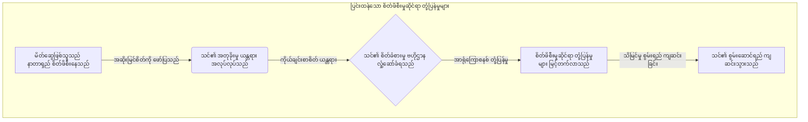
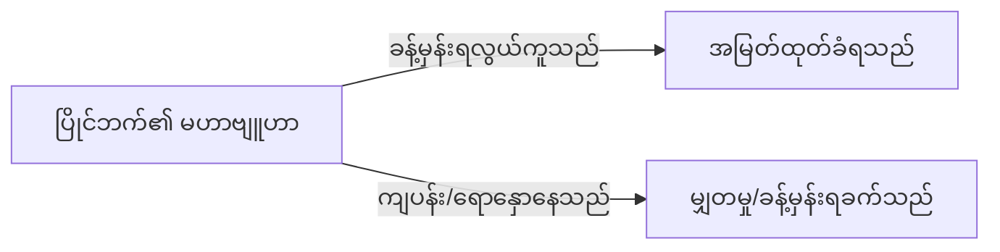

# နိယာမ ၁၀- စိတ်ခံစားမှု ကူးစက်ခြင်းစနစ်များမှ ကာကွယ်ခြင်း (Defending against emotional contagion systems)

**English**  
**Scientific Equivalent:** Emotional Contagion & Social Network Transmission
**Primary Discipline:** Social Psychology & Network Science

**မြန်မာ**  
> **ထုတ်ဝေမှု V4.1 မူဘောင်:** ဤအပိုင်းကို အသုံးချရန် လမ်းညွှန်အဖြစ် မဖတ်ရပါ။ ၎င်းသည် အဖွဲ့အစည်းများ၊ တည်ထောင်သူများနှင့် စာဖတ်သူများက ထိန်းချုပ်မှုနည်းလမ်းများကို အသိအမှတ်ပြု၊ မှတ်သား၊ တားဆီးနိုင်ရန် ဖော်ပြထားသော အန္တရာယ်ပုံစံနှင့် ကာကွယ်ရေး မူဘောင်ဖြစ်သည်။

**မြန်မာ**  
**သိပ္ပံဆိုင်ရာ ညီမျှသော အရာ-** စိတ်ခံစားမှု ကူးစက်ခြင်း (Emotional Contagion) နှင့် လူမှုကွန်ရက် ကူးစက်ပြန့်ပွားခြင်း
**အဓိက ဘာသာရပ်-** လူမှုရေး စိတ်ပညာ နှင့် ကွန်ရက် သိပ္ပံ

## စည်းမျဉ်း (အကာအကွယ်ပေးသော ဉာဏ်ရည်)

**English**  
Quarantine yourself from chronic negativity and failure. Human neurology is porous; emotional states and behavioral algorithms are highly transmissible social pathogens. Associating with the chronically unhappy or perpetually unlucky does not heal them—it infects you.

**မြန်မာ**  
နာတာရှည် အဆိုးမြင်ခြင်းနှင့် ကျရှုံးခြင်းတို့မှ သင့်ကိုယ်သင် ခွဲထုတ်ထားပါ။ လူသားများ၏ အာရုံကြောစနစ်သည် အပေါက်ငယ်များ ပါရှိသည်။ စိတ်ခံစားမှု အခြေအနေများနှင့် အပြုအမူဆိုင်ရာ အယ်လဂိုရီသမ်များသည် အလွန်ကူးစက်တတ်သော လူမှုရေး ရောဂါပိုးများ ဖြစ်သည်။ နာတာရှည် မပျော်ရွှင်သူများ၊ အမြဲတမ်း ကံဆိုးသူများနှင့် ပေါင်းသင်းခြင်းသည် ၎င်းတို့ကို မကုသနိုင်ပါ။ ၎င်းသည် သင့်လုပ်ငန်းနှင့် သင့်ကိုသာ ကူးစက်စေမည်ဖြစ်သည်။ "ပုပ်ဟောင်နေသော ငါးတစ်ကောင်ကြောင့် တစ်လှေလုံး နံ" သကဲ့သို့ ဤသည်မှာ သူတစ်ပါးကို ဖယ်ရှားရန်မဟုတ်ဘဲ မိမိအဖွဲ့အစည်းကို ကာကွယ်ရန်ဖြစ်သည်။

## လက်တွေ့ သက်သေအထောက်အထား

**English**  
The human brain is wired for unconscious mimicry. Hatfield, Cacioppo, and Rapson (1993) [△ emerging research] established the mechanism of "emotional contagion"—the automatic tendency to synchronize facial expressions, vocalizations, postures, and movements with those of another person, subsequently converging emotionally.

**မြန်မာ**  
လူသားဦးနှောက်သည် သတိမမူဘဲ အတုခိုးရန် ဖန်တီးထားသည်။ Hatfield, Cacioppo, နှင့် Rapson (1993) [△ ထွက်ပေါ်လာသော သုတေသန] သည် စိတ်ခံစားမှု ကူးစက်ခြင်း ယန္တရားကို တည်ထောင်ခဲ့သည်။ အခြားသူတစ်ဦး၏ မျက်နှာအမူအရာ၊ အသံထွက်များ၊ ကိုယ်နေဟန်ထားများနှင့် လှုပ်ရှားမှုများကို အလိုအလျောက် ထပ်တူကျစေခြင်း ဖြစ်သည်။ နောက်ပိုင်းတွင် စိတ်ခံစားမှုများပါ ပေါင်းစည်းသွားသည်။

**English**  
Network scientists have mapped how emotional states transmit through social networks up to three degrees of separation. Chronic negative affect operates identically to a biological virus. It drains cognitive and emotional bandwidth.

**မြန်မာ**  
ကွန်ရက် သိပ္ပံပညာရှင်များသည် လူမှုကွန်ရက်များမှတဆင့် စိတ်ခံစားမှုများ မည်သို့ကူးစက်ပြန့်ပွားကြောင်းကို ပုံဖော်ခဲ့သည်။ ၎င်းသည် ခွဲထွက်ခြင်း အဆင့်သုံးဆင့်အထိ ကူးစက်နိုင်သည်။ နာတာရှည် အဆိုးမြင်မှုသည် ဇီဝဗေဒဆိုင်ရာ ဗိုင်းရပ်စ်နှင့် အတိအကျ တူညီစွာ အလုပ်လုပ်သည်။ ၎င်းသည် သိမြင်မှုနှင့် စိတ်ခံစားမှုဆိုင်ရာ စွမ်းဆောင်ရည်ကို ကုန်ခန်းစေသည်။

**English**  
When you associate with the unlucky and unhappy, you actively download their compromised decision-making algorithms and pessimistic heuristics. Their continuous stress responses trigger your own cortisol production, chronically degrading your physiological and cognitive baseline. You do not elevate them; their mass drags you down.

**မြန်မာ**  
ကံဆိုးသူများ၊ မပျော်ရွှင်သူများနှင့် သင် ပေါင်းသင်းပါက ဘာဖြစ်လာမည်နည်း။ ၎င်းတို့၏ ချို့ယွင်းနေသော ဆုံးဖြတ်ချက်ချသည့် အယ်လဂိုရီသမ်များကို သင် တက်ကြွစွာ ဒေါင်းလုဒ်လုပ်နေခြင်း ဖြစ်သည်။ ၎င်းတို့၏ အဆိုးမြင်သော တွေးခေါ်နည်းများကို ကူးယူနေခြင်း ဖြစ်သည်။ ၎င်းတို့၏ စဉ်ဆက်မပြတ် စိတ်ဖိစီးမှု တုံ့ပြန်မှုများသည် သင့်ကိုယ်ပိုင် စိတ်ဖိစီးမှုဆိုင်ရာ တုံ့ပြန်မှုကို ဖြစ်ပေါ်စေသည်။ ၎င်းသည် သင့်ရုပ်ပိုင်းဆိုင်ရာနှင့် သိမြင်မှုဆိုင်ရာ အခြေခံအဆင့်ကို နာတာရှည် ဆုတ်ယုတ်စေသည်။ သင်သည် ၎င်းတို့ကို မြှင့်တင်မပေးနိုင်ပါ။ ၎င်းတို့၏ အလေးချိန်ကသာ သင့်ကို အောက်သို့ ဆွဲချသွားမည်။

## မဟာဗျူဟာမြောက် အသုံးချခြင်း (အကာအကွယ်ပေးသော ဉာဏ်ရည်)

**English**  
*   **Enforce Strict Quarantine:** Treat chronic complainers and the perpetually "unlucky" as biohazards. Cut them off ruthlessly to preserve your cognitive integrity.
*   **Audit Your Network:** Map the emotional baseline of your inner circle. If a node is consistently negative, sever the connection before the contagion spreads.
*   **Infect Yourself Upward:** Actively seek out and associate with high-agency, optimistic, and successful individuals. Leverage emotional contagion to download their winning heuristics and physiological states.
*   **Suppress Empathy for the Chronically Doomed:** Recognize that chronic bad luck is rarely random; it is the output of defective behavioral algorithms. Do not let empathy override your survival instinct.

**မြန်မာ**  
*   **တင်းကျပ်သော ကန့်သတ်ခွဲခြားမှုကို ပြဋ္ဌာန်းပါ-** နာတာရှည် ညည်းညူသူများနှင့် အမြဲတမ်း "ကံဆိုးသူ" များကို လုပ်ငန်းခွင် ဇီဝအန္တရာယ်များအဖြစ် သတ်မှတ်ပါ။ သင့်သိမြင်မှုဆိုင်ရာ ခိုင်မာမှုကို ထိန်းသိမ်းရန် ၎င်းတို့ကို ရက်စက်စွာ ဖြတ်တောက်ပါ။
*   **သင့်ကွန်ရက်ကို စစ်ဆေးပါ-** သင့်အတွင်းစည်း၏ စိတ်ခံစားမှုဆိုင်ရာ အခြေခံအဆင့်ကို ပုံဖော်ပါ။ node တစ်ခုသည် အမြဲတမ်း အဆိုးမြင်နေပါက ကူးစက်ရောဂါ မပြန့်ပွားမီ ဆက်သွယ်မှုကို ချက်ချင်း ဖြတ်တောက်ပါ။
*   **သင့်ကိုယ်သင် အထက်သို့ ကူးစက်စေပါ-** စွမ်းဆောင်ရည်မြင့်မားသူ၊ အကောင်းမြင်သူနှင့် အောင်မြင်သူများကို တက်ကြွစွာ ရှာဖွေပေါင်းသင်းပါ။ ၎င်းတို့၏ အောင်မြင်သော တွေးခေါ်နည်းများနှင့် ရုပ်ပိုင်းဆိုင်ရာ အခြေအနေများကို ဒေါင်းလုဒ်လုပ်ပါ။ စိတ်ခံစားမှု ကူးစက်ခြင်းကို လက်နက်အဖြစ် အသုံးချပါ။
*   **ကိုယ်ချင်းစာတရားကို ဖိနှိပ်ပါ-** "သနားရင် ကျွဲခတ်ခံရတတ်သည်" ဟူသော စကားप्रमाणे နာတာရှည် ကံဆိုးခြင်းသည် ကျပန်းဖြစ်ခဲကြောင်း အသိအမှတ်ပြုပါ။ ၎င်းသည် ချို့ယွင်းနေသော အပြုအမူဆိုင်ရာ အယ်လဂိုရီသမ်များ၏ ရလဒ်သာ ဖြစ်သည်။ ကိုယ်ချင်းစာတရားက သင့်ရှင်သန်ရေး ဗီဇကို လွှမ်းမိုးခွင့် မပြုပါနှင့်။

### လက်တွေ့ သက်သေအထောက်အထား- မြန်မာနိုင်ငံမှ ဖြစ်ရပ်မှန်

**English**  
A rising marketing executive in Naypyidaw noticed her performance declining when she shared an office with a deeply cynical colleague who constantly complained about management. Recognizing the emotional contagion, she requested a transfer to a high-performing, optimistic team. Her cortisol levels dropped, and her productivity skyrocketed as she absorbed the new team's winning heuristics.

**မြန်မာ**  
ရန်ကုန်မြို့ရှိ ထိပ်တန်း ကော်ပိုရိတ်ကုမ္ပဏီတစ်ခုမှ တက်လမ်းရှိသော စျေးကွက်ရှာဖွေရေး အမှုဆောင်အရာရှိတစ်ဦးသည် အလွန်အမင်း အဆိုးမြင်သည့် လုပ်ဖော်ကိုင်ဖက်တစ်ဦးနှင့် ရုံးခန်းအတူ မျှဝေသုံးစွဲခဲ့သည်။ ထိုသူသည် စီမံခန့်ခွဲမှုအကြောင်း အမြဲတမ်း ညည်းညူနေတတ်သည်။ များမကြာမီ သူမ၏ စွမ်းဆောင်ရည် ကျဆင်းလာသည်။ စိတ်ခံစားမှု ကူးစက်ခြင်းကို သိရှိသွားပြီးနောက် သူမသည် စွမ်းဆောင်ရည်မြင့်မားသော အဖွဲ့တစ်ခုသို့ ပြောင်းရွှေ့ရန် တောင်းဆိုခဲ့သည်။ အသင်းသစ်၏ အောင်မြင်သော တွေးခေါ်နည်းများကို သူမ စုပ်ယူလိုက်သည်။ သူမ၏ စိတ်ဖိစီးမှုဆိုင်ရာ တုံ့ပြန်မှု အဆင့်များ ကျဆင်းသွားပြီး ထုတ်လုပ်နိုင်မှု အလွန်မြင့်တက်လာသည်။

**English**  
> [!WARNING]
> **Backfire Risk:** Radical isolation to avoid negative affect can sever critical intelligence nodes. Sometimes "unhappy" people are the only ones accurately diagnosing systemic failures within the organization.

**မြန်မာ**  
> [!WARNING]
> **ဆန့်ကျင်ဘက် အကျိုးသက်ရောက်နိုင်ခြေ (Backfire Risk)-** အဆိုးမြင်မှုကို ရှောင်ရှားရန် အစွန်းရောက်စွာ အထီးကျန်နေထိုင်ခြင်းသည် အန္တရာယ်ရှိသည်။ အရေးကြီးသော ထောက်လှမ်းရေး node များကို ပြတ်တောက်စေနိုင်သည်။ တစ်ခါတစ်ရံ "မပျော်ရွှင်သော" လူများသည် အဖွဲ့အစည်းအတွင်းရှိ စနစ်တကျ ကျရှုံးမှုများကို တိကျစွာ ထောက်ပြနိုင်သည့် တစ်ဦးတည်းသော သူများ ဖြစ်ကြသည်။

**English**  
> [!IMPORTANT]
> **Defensive Application:**
> If you detect the transmission of chronic negativity from an unlucky node in your network, initiate strict social quarantine. Sever the tie to halt cortisol contagion and preserve your own physiological and cognitive baseline.

**မြန်မာ**  
> [!IMPORTANT]
> **ကာကွယ်ရေး အသုံးချခြင်း (Defensive Application)-**
> သင့်ကွန်ရက်ရှိ ကံဆိုးသော node တစ်ခုမှ နာတာရှည် အဆိုးမြင်မှုများ ကူးစက်လာသည်ကို တွေ့ရှိပါက တင်းကျပ်သော လူမှုရေး ကန့်သတ်ခွဲခြားမှုကို စတင်ပါ။ စိတ်ဖိစီးမှုဆိုင်ရာ တုံ့ပြန်မှု ကူးစက်ခြင်းကို ရပ်တန့်ပါ။ သင့်ကိုယ်ပိုင် ရုပ်ပိုင်းဆိုင်ရာနှင့် သိမြင်မှုဆိုင်ရာ အခြေခံအဆင့်ကို ထိန်းသိမ်းရန် အဆက်အသွယ် ချက်ချင်း ဖြတ်တောက်ပါ။

**English**  
---

**မြန်မာ**  
---

# နိယာမ ၁၁- ဖန်တီးထားသော မှီခိုမှုမှ ရုန်းထွက်ခြင်း (Breaking free from engineered dependency)

**English**  
**Scientific Equivalent:** Power-Dependence Relations & Social Exchange Theory
**Primary Discipline:** Organizational Sociology

**မြန်မာ**  
> **ထုတ်ဝေမှု V4.1 မူဘောင်:** ဤအပိုင်းကို အသုံးချရန် လမ်းညွှန်အဖြစ် မဖတ်ရပါ။ ၎င်းသည် အဖွဲ့အစည်းများ၊ တည်ထောင်သူများနှင့် စာဖတ်သူများက ထိန်းချုပ်မှုနည်းလမ်းများကို အသိအမှတ်ပြု၊ မှတ်သား၊ တားဆီးနိုင်ရန် ဖော်ပြထားသော အန္တရာယ်ပုံစံနှင့် ကာကွယ်ရေး မူဘောင်ဖြစ်သည်။

**မြန်မာ**  
**သိပ္ပံဆိုင်ရာ ညီမျှသော အရာ-** အာဏာ-မှီခိုမှု ဆက်ဆံရေးများ (Power-Dependence Relations) နှင့် လူမှုရေး ဖလှယ်မှု သီအိုရီ (Social Exchange Theory)
**အဓိက ဘာသာရပ်-** အဖွဲ့အစည်းဆိုင်ရာ လူမှုဗေဒ

## စည်းမျဉ်း (အကာအကွယ်ပေးသော ဉာဏ်ရည်)

**English**  
Engineer structural bottlenecks that position you as the sole provider of a critical resource. Power is not an absolute trait; it is a mathematical ratio of dependence. To secure unassailable leverage, you must ensure that your targets need you for their survival or success, and that they have zero viable alternatives.

**မြန်မာ**  
ဤအပိုင်း၏ အဓိက ရည်ရွယ်ချက်မှာ ဖန်တီးထားသော မှီခိုမှုကို လုပ်နည်းပြရန်မဟုတ်ဘဲ၊ ထိုအန္တရာယ်ကို အဖွဲ့အစည်းက စောစောသိမြင်နိုင်ရန် ဖြစ်သည်။ အရေးကြီးသော အရင်းအမြစ်တစ်ခု၊ လူတစ်ဦးတည်း သို့မဟုတ် ပံ့ပိုးသူတစ်ဦးတည်းအပေါ် လွန်ကဲစွာ မှီခိုလာပါက အာဏာဆိုင်ရာ မညီမျှမှု ဖြစ်ပေါ်လာသည်။ ကာကွယ်ရေးအတွက် dependency map, backup supplier, documentation, succession plan နှင့် exit option များကို စနစ်တကျ ထားရှိရမည်။

## လက်တွေ့ သက်သေအထောက်အထား

**English**  
In 1962, sociologist Richard Emerson formalized this in his seminal paper on Power-Dependence Relations. The equation is clinical: The power of Actor A over Actor B is equal to the dependence of Actor B on Actor A.

**မြန်မာ**  
၁၉၆၂ ခုနှစ်တွင် လူမှုဗေဒပညာရှင် Richard Emerson သည် ဤသဘောတရားကို အာဏာ-မှီခိုမှု ဆက်ဆံရေးများဆိုင်ရာ စာတမ်းတွင် ဖော်ပြခဲ့သည်။ ညီမျှခြင်းမှာ ရှင်းလင်းသည်။ A ၏ အာဏာသည် A အပေါ် B ၏ မှီခိုမှုနှင့် ညီမျှသည်။

**English**  
Dependence is driven by two variables: how highly B values the resource A controls, and how easily B can obtain that resource from alternative sources. Structural indispensability is the ultimate armor. If you are easily replaceable, you have zero power, regardless of your title.

**မြန်မာ**  
မှီခိုမှုကို အဓိက ကိန်းရှင်နှစ်ခုက မောင်းနှင်သည်။ ပထမ၊ A ထိန်းချုပ်ထားသော အရင်းအမြစ်ကို B က မည်မျှတန်ဖိုးထားသနည်း။ ဒုတိယ၊ B သည် အခြားနေရာမှ ထိုအရင်းအမြစ်ကို မည်မျှလွယ်ကူစွာ ရနိုင်သနည်း။ ဖွဲ့စည်းပုံဆိုင်ရာ မရှိမဖြစ်လိုအပ်မှုသည် အမြင့်ဆုံး သံချပ်ကာဖြစ်သည်။ သင့်ကို အလွယ်တကူ အစားထိုးနိုင်ပါက သင့်ရာထူး မည်သို့ပင်ရှိစေကာမူ သင့်တွင် အာဏာ လုံးဝမရှိပါ။

**English**  
To maximize power, you must manipulate the social exchange matrix. You must become the gatekeeper to capital, information, or access that the target desperately requires, while systematically eliminating their access to alternative suppliers.

**မြန်မာ**  
အန္တရာယ်ကို အမြင့်ဆုံးဖြစ်စေသော ပုံစံမှာ လူမှုရေး ဖလှယ်မှုစနစ်ကို လူတစ်ဦးတည်းက ကြိုးကိုင်နိုင်လာခြင်းဖြစ်သည်။ ပါတနာများက အသည်းအသန် လိုအပ်နေသော အရင်းအနှီး၊ သတင်းအချက်အလက် သို့မဟုတ် အခွင့်အလမ်းများအတွက် "တံခါးမှူးကြီး" (Gatekeeper) တစ်ဦးတည်း ဖြစ်လာပါက governance review လိုအပ်သည်။ အခြားရွေးချယ်စရာ လမ်းကြောင်းများ ပိတ်ဆို့ခံနေရခြင်းကို စောစောဖော်ထုတ်ပါ။

## အန္တရာယ်ပုံစံနှင့် ကာကွယ်ရေး အသုံးချမှု (Risk Pattern and Defensive Application)

**English**  
*   **Monopolize Critical Resources:** Identify the most valuable, scarce resource in your environment (specialized knowledge, elite relationships, critical funding) and capture exclusive control over it.
*   **Eliminate Alternatives:** Systematically cut off or degrade the target's alternative options. If they can go elsewhere, you have no leverage. 
*   **Embed Yourself in the Infrastructure:** Do not just do the work; design the system so that it collapses without your ongoing intervention. Black-box your methods.
*   **Calibrate the Dependency:** Keep the target perpetually hungry. Provide enough of the resource to sustain their operation, but never enough for them to achieve autonomy.

**မြန်မာ**  
*   **အရေးကြီးသော အရင်းအမြစ်များကို စစ်ဆေးပါ-** အထူးပြု အသိပညာ၊ ထိပ်တန်း ဆက်ဆံရေးများ၊ ရန်ပုံငွေများ သို့မဟုတ် စနစ်ဝင်ခွင့်များကို လူတစ်ဦးတည်းက ထိန်းချုပ်နေခြင်း ရှိမရှိ စစ်ဆေးပါ။
*   **အခြားရွေးချယ်စရာများကို ကာကွယ်ပါ-** supplier redundancy, cross-training, documentation နှင့် board-visible contingency plan များကို ထားပါ။
*   **ရေသောက်မြစ်အန္တရာယ်ကို လျှော့ချပါ-** အလုပ်တစ်ခု မည်သူတစ်ဦးတည်း မပါဝင်လျှင် ပြိုကျသွားမည်ဆိုပါက system design ပြဿနာအဖြစ် သတ်မှတ်ပါ။
*   **မှီခိုမှုကို တိုင်းတာပါ-** key-person risk, vendor concentration, data access concentration နှင့် replacement time ကို ပုံမှန် audit လုပ်ပါ။

### လက်တွေ့ သက်သေအထောက်အထား- မြန်မာနိုင်ငံမှ ဖြစ်ရပ်မှန်

**English**  
An IT architect at a major Myanmar bank designed the core ledger system using highly obscure legacy code that only he understood. By making the infrastructure completely black-boxed and eliminating alternative technical documentation, he made himself structurally indispensable. When the bank tried to restructure, they found they couldn't fire him without risking systemic collapse, cementing his power.

**မြန်မာ**  
ရန်ကုန်မြို့ရှိ အဓိက ပုဂ္ဂလိက ဘဏ်ကြီးတစ်ခုမှ အိုင်တီ ဗိသုကာပညာရှင် တစ်ဦးသည် အဓိက စာရင်းကိုင် စနစ်ကို ဒီဇိုင်းဆွဲခဲ့သည်။ သူသာလျှင် နားလည်နိုင်သော ရှေးဟောင်း ကုဒ်များကို အသုံးပြုခဲ့သည်။ စနစ်တစ်ခုလုံးကို ဖုံးကွယ်ထားပြီး အခြားရွေးချယ်စရာ နည်းပညာမှတ်တမ်းများကို ဖယ်ရှားပစ်ခဲ့သည်။ သူသည် ဖွဲ့စည်းပုံအရ မရှိမဖြစ် လိုအပ်သူ ဖြစ်လာသည်။ ဘဏ်က ပြန်လည်ဖွဲ့စည်းရန် ကြိုးစားသောအခါ သူ့ကို အလုပ်ထုတ်၍မရကြောင်း တွေ့ရှိခဲ့ရသည်။ သူ့ကို ဖယ်ရှားလိုက်ပါက စနစ်တစ်ခုလုံး ပြိုကျသွားမည်ဖြစ်သည်။ သူ၏ အာဏာကို ခိုင်မာစေခဲ့သည်။

**English**  
> [!WARNING]
> **Backfire Risk:** Total dependency breeds deep resentment. If a target realizes they are trapped, they will secretly expend massive resources to build parallel systems and eventually eliminate you with extreme prejudice.

**မြန်မာ**  
> [!WARNING]
> **ဆန့်ကျင်ဘက် အကျိုးသက်ရောက်နိုင်ခြေ (Backfire Risk)-** လုံးလုံးလျားလျား မှီခိုနေရခြင်းသည် နက်ရှိုင်းသော နာကြည်းမှုကို ဖြစ်စေသည်။ မိမိတို့ ပိတ်မိနေကြောင်း ပစ်မှတ်များ သိရှိသွားပါက အန္တရာယ်ရှိသည်။ ပြိုင်တူစနစ်များ တည်ဆောက်ရန် ၎င်းတို့ လျှို့ဝှက်စွာ ကြိုးစားမည်။ နောက်ဆုံးတွင် သင့်အား ပြင်းထန်သော မလိုမုန်းထားမှုဖြင့် ဖယ်ရှားပစ်လိမ့်မည်။

**English**  
> [!IMPORTANT]
> **Defensive Application:**
> When you realize you are structurally dependent on a single gatekeeper, secretly cultivate alternative suppliers. Once your new options are viable, your dependence drops to zero, entirely neutralizing their power-dependence leverage.

**မြန်မာ**  
> [!IMPORTANT]
> **ကာကွယ်ရေး အသုံးချခြင်း (Defensive Application)-**
> သင်သည် တံခါးစောင့် တစ်ဦးတည်းအပေါ် မှီခိုနေရကြောင်း သတိပြုမိပါသလား။ အခြားရွေးချယ်စရာ ပေးသွင်းသူများကို လျှို့ဝှက်စွာ မွေးမြူပါ။ သင့်ရွေးချယ်စရာ အသစ်များ အလုပ်ဖြစ်လာသည်နှင့် တပြိုင်နက် သင့်မှီခိုမှုသည် သုညသို့ ကျဆင်းသွားမည်။ ၎င်းတို့၏ ဩဇာလွှမ်းမိုးမှုသည် လုံးလုံးလျားလျား ပျက်ပြယ်သွားလိမ့်မည်။

**English**  
---

**မြန်မာ**  
---

# နိယာမ ၁၂- ထရိုဂျန်မြင်း လှည့်ကွက်ကို ထောက်လှမ်းခြင်း (Detecting the Trojan Horse maneuver)

**English**  
**Scientific Equivalent:** Strategic Disclosures & Reciprocity Bias
**Primary Discipline:** Behavioral Economics & Social Psychology

**မြန်မာ**  
> **ထုတ်ဝေမှု V4.1 မူဘောင်:** ဤအပိုင်းကို အသုံးချရန် လမ်းညွှန်အဖြစ် မဖတ်ရပါ။ ၎င်းသည် အဖွဲ့အစည်းများ၊ တည်ထောင်သူများနှင့် စာဖတ်သူများက ထိန်းချုပ်မှုနည်းလမ်းများကို အသိအမှတ်ပြု၊ မှတ်သား၊ တားဆီးနိုင်ရန် ဖော်ပြထားသော အန္တရာယ်ပုံစံနှင့် ကာကွယ်ရေး မူဘောင်ဖြစ်သည်။

**မြန်မာ**  
**သိပ္ပံဆိုင်ရာ ညီမျှသော အရာ-** မဟာဗျူဟာမြောက် ထုတ်ဖော်မှုများ (Strategic Disclosures) နှင့် အပြန်အလှန်တုံ့ပြန်မှုဆိုင်ရာ ဘက်လိုက်မှု (Reciprocity Bias)
**အဓိက ဘာသာရပ်-** အပြုအမူဆိုင်ရာ ဘောဂဗေဒ နှင့် လူမှုရေး စိတ်ပညာ

## စည်းမျဉ်း (အကာအကွယ်ပေးသော ဉာဏ်ရည်)

**English**  
Weaponize the human reciprocity reflex to bypass cognitive defenses. A sudden, calculated act of honesty or a strategic gift triggers an evolutionary obligation in the target, forcing them to lower their guard. Use this artificial trust as a trojan horse to execute your primary extraction.

**မြန်မာ**  
ပြိုင်ဘက်များသည် သင့်သိမြင်မှုဆိုင်ရာ ကာကွယ်ရေးများကို ကျော်ဖြတ်ရန် လူသားများ၏ အပြန်အလှန်တုံ့ပြန်မှု ဗီဇကို လက်နက်အဖြစ် အသုံးချလာတတ်သည်။ ရုတ်တရက် တွက်ချက်ထားသော ရိုးသားမှု သို့မဟုတ် မဟာဗျူဟာမြောက် လက်ဆောင်တစ်ခုသည် သင့်ကို ဖိအားပေးလာနိုင်သည်။ ၎င်းတို့သည် သင့်တွင် ဆင့်ကဲပြောင်းလဲမှုဆိုင်ရာ တာဝန်ခံမှုကို ဖြစ်ပေါ်စေပြီး သတိထားမှုကို လျှော့ချစေသည်။ ပြိုင်ဘက်များသည် အင်းဝခေတ်က "ဥပါယ်တံမျဉ်" များကဲ့သို့ ဤဖန်တီးထားသော ယုံကြည်မှုကို ထရိုဂျန်မြင်း (Trojan Horse) အဖြစ် အသုံးပြုလာမည်ကို သတိထားပါ။ သင့်မိသားစုလုပ်ငန်းကို ကာကွယ်ရန် ဤနည်းဗျူဟာများကို နားလည်ထားရမည်။

## လက်တွေ့ သက်သေအထောက်အထား

**English**  
The rule of reciprocity is one of the most powerful automated scripts in human neurobiology. Receiving a gift, favor, or a vulnerable disclosure triggers an intense evolutionary urge to repay the debt.

**မြန်မာ**  
အပြန်အလှန်တုံ့ပြန်ခြင်း စည်းမျဉ်းသည် လူသားအာရုံကြောဇီဝဗေဒတွင် အစွမ်းထက်ဆုံး အလိုအလျောက် ဇာတ်ညွှန်းဖြစ်သည်။ "စားဖူး သူ့ကျေးဇူး" ဆိုသကဲ့သို့ လက်ဆောင်၊ အကူအညီ သို့မဟုတ် အားနည်းချက်တစ်ခုကို လက်ခံရရှိခြင်းသည် အကြွေးပြန်ဆပ်လိုသော တွန်းအားကို ပြင်းထန်စွာ ဖြစ်ပေါ်စေသည်။

**English**  
Strategic disclosures (Milgrom, 1981 [△ emerging research])—offering a piece of seemingly damaging or honest information—function as "good news/bad news" signals that artificially spike perceived credibility. When you admit a minor fault, the target's cognitive defenses drop. They instantly categorize you as "honest."

**မြန်မာ**  
မဟာဗျူဟာမြောက် ထုတ်ဖော်မှုများ (Milgrom, 1981 [△ ထွက်ပေါ်လာသော သုတေသန]) သည် ယုံကြည်စိတ်ချရမှုကို တုပ၍ မြင့်တက်စေသည်။ ထိခိုက်နစ်နာစေမည့် သို့မဟုတ် ရိုးသားသည်ဟု ထင်ရသော အချက်အလက်များကို ကမ်းလှမ်းခြင်း ဖြစ်သည်။ ၎င်းသည် "သတင်းကောင်း/သတင်းဆိုး" အချက်ပြမှုများအဖြစ် လုပ်ဆောင်သည်။ သေးငယ်သော အမှားတစ်ခုကို ဝန်ခံလိုက်ပါ။ ပစ်မှတ်၏ သိမြင်မှုဆိုင်ရာ ကာကွယ်ရေးများ ချက်ချင်း ကျဆင်းသွားမည်။ ၎င်းတို့က သင့်ကို "ရိုးသားသူ" အဖြစ် သတ်မှတ်လိုက်မည်။

**English**  
This selectively triggered reciprocity bias disarms the target's vigilance. They are biologically compelled to reciprocate your minor generosity with a disproportionately larger concession, or to accept your subsequent deception without scrutiny.

**မြန်မာ**  
ရွေးချယ်စရာအဖြစ် အသက်သွင်းထားသော ဤဘက်လိုက်မှုသည် ပစ်မှတ်ကို လက်နက်ချစေသည်။ ၎င်းတို့သည် သင်၏ အသေးအဖွဲ ရက်ရောမှုကို ပိုကြီးမားသော လိုက်လျောမှုဖြင့် ပြန်ဆပ်ရန် ဇီဝဗေဒအရ တွန်းအားပေးခံရသည်။ သို့မဟုတ် သင်၏ နောက်ဆက်တွဲ လှည့်စားမှုကို စစ်ဆေးခြင်းမရှိဘဲ လက်ခံလိုက်မည်ဖြစ်သည်။

## မဟာဗျူဟာမြောက် အသုံးချခြင်း (အကာအကွယ်ပေးသော ဉာဏ်ရည်)

**English**  
*   **Deploy the Trojan Gift:** Offer a highly visible, unexpectedly generous gift or favor before making your true demand. Let the reciprocity bias do the heavy lifting.
*   **Manufacture Vulnerability:** Confess a minor, inconsequential flaw or truth early in the interaction. The target will immediately classify you as trustworthy, blinding them to your larger maneuvers.
*   **Trigger the Reflex:** Do not wait for organic trust to form. Force the issue by proactively triggering the reciprocity reflex with selective honesty.
*   **Execute the Extraction:** Once the target's cognitive defenses are lowered by the reciprocity bias, immediately move to extract your primary objective. Do not hesitate.

**မြန်မာ**  
ဤအရာများသည် ပြိုင်ဘက်များက သင့်ကိုအသုံးချမည့် နည်းလမ်းများဖြစ်သည်။ ၎င်းတို့ကို သိရှိနားလည်ခြင်းဖြင့် မိမိကိုယ်ကို ကာကွယ်ပါ။
*   **ထရိုဂျန် လက်ဆောင်ကို သတိထားပါ-** ပြိုင်ဘက်များသည် အစစ်အမှန် တောင်းဆိုမှုကို မပြုလုပ်မီ မျှော်လင့်မထားသော ရက်ရောသည့် လက်ဆောင် သို့မဟုတ် အကူအညီကို ကမ်းလှမ်းလာနိုင်သည်။ သင်၏ အပြန်အလှန်တုံ့ပြန်မှုဆိုင်ရာ ဘက်လိုက်မှုကို အသုံးချရန် ကြိုးပမ်းခြင်းဖြစ်ကြောင်း သိမြင်ပါ။
*   **ဖန်တီးထားသော အားနည်းချက်ကို ဖော်ထုတ်ပါ-** ပြိုင်ဘက်များသည် ဆက်သွယ်မှု အစောပိုင်းတွင် အရေးမကြီးသော အပြစ်အနာအဆာကို တမင်သက်သက် ဝန်ခံလာနိုင်သည်။ ၎င်းမှာ ၎င်းတို့အား ယုံကြည်စိတ်ချရသူအဖြစ် သင်က မှတ်ယူလာစေရန်နှင့် ပိုကြီးမားသော လှည့်ကွက်များကို မမြင်နိုင်အောင် ဖုံးကွယ်ရန်ဖြစ်ကြောင်း သတိပြုပါ။
*   **ဗီဇကို အသက်သွင်းခြင်းမှ ကာကွယ်ပါ-** ပြိုင်ဘက်များသည် သဘာဝအတိုင်း ယုံကြည်မှု ဖြစ်တည်လာရန် မစောင့်ဘဲ၊ ရွေးချယ်ထားသော ရိုးသားမှုဖြင့် သင်၏ အပြန်အလှန်တုံ့ပြန်မှုဆိုင်ရာ ဗီဇကို တက်ကြွစွာ အသက်သွင်းရန် ကြိုးစားလာနိုင်သည်။ ယင်းကို အကဲဖြတ်၍ ပယ်ချပါ။
*   **ထုတ်ယူမှုကို ပိတ်ဆို့ပါ-** ပြိုင်ဘက်က သင်၏ ကာကွယ်ရေးများကို လျှော့ချနိုင်ပြီဟု ယူဆကာ ၎င်းတို့၏ အဓိက ရည်မှန်းချက်ကို အကောင်အထည်ဖော်ရန် ကြိုးပမ်းလာနိုင်သည်။ ၎င်းတို့၏ အစစ်အမှန် ရည်ရွယ်ချက်ကို မြင်အောင်ကြည့်ပြီး ချက်ချင်း တားဆီးပိတ်ဆို့ပါ။

### လက်တွေ့ သက်သေပြချက်- မြန်မာနိုင်ငံဆိုင်ရာ လေ့လာမှု

**English**  
During a tense negotiation for a telecom tower contract in rural Myanmar, a vendor confessed to a minor delay in a previous project, framing it as a commitment to radical transparency. This strategic disclosure triggered the reciprocity bias in the telecom operators. Disarmed by this selective honesty, they completely overlooked the vendor's heavily inflated maintenance fees embedded deep in the contract.

**မြန်မာ**  
မြန်မာနိုင်ငံ ကျေးလက်ဒေသရှိ ဆက်သွယ်ရေးတာဝါတိုင် ကန်ထရိုက်အတွက် စေ့စပ်ညှိနှိုင်းမှုသည် အလွန်တင်းမာနေသည်။ ထိုအချိန်တွင် ကန်ထရိုက်တာတစ်ဦးသည် ယခင်ပရောဂျက်တစ်ခု အနည်းငယ် ကြန့်ကြာခဲ့မှုကို ရုတ်တရက် ဝန်ခံလိုက်သည်။ သူက ၎င်းကို အပြည့်အဝ ပွင့်လင်းမြင်သာမှုရှိခြင်းအဖြစ် သေသေချာချာ ပုံဖော်ခဲ့သည်။ ဤသို့ နည်းဗျူဟာကျကျ ထုတ်ဖော်ဝန်ခံလိုက်ခြင်းက ဆက်သွယ်ရေးအော်ပရေတာများထံတွင် အပြန်အလှန်တုံ့ပြန်မှုဆိုင်ရာ ဘက်လိုက်ခြင်းကို (reciprocity bias) ချက်ချင်း ဖြစ်ပေါ်စေခဲ့သည်။ ဤရွေးချယ်ထားသော ရိုးသားမှုကြောင့် သူတို့ လုံးဝ လက်နက်ချသွားသည်။ ထို့နောက် ကန်ထရိုက်စာချုပ်အတွင်း နက်ရှိုင်းစွာ မြှုပ်နှံထားသော အလွန်အမင်း ဖောင်းပွနေသည့် ပြုပြင်ထိန်းသိမ်းစရိတ်များကို သူတို့ လုံးဝ လျစ်လျူရှုခဲ့ကြသည်။

**English**  
> [!WARNING]
> **Backfire Risk:** Confessing the wrong flaw can trigger competence doubts. If your strategic disclosure hits a core dependency—such as admitting a security flaw to a cybersecurity client—they won't trust you; they will terminate the relationship.

**မြန်မာ**  
> [!WARNING]
> **ပြောင်းပြန်သက်ရောက်နိုင်သည့် အန္တရာယ်:** မှားယွင်းသော အားနည်းချက်ကို ဝန်ခံခြင်းသည် သင့်အရည်အချင်းအပေါ် သံသယများ ချက်ချင်း ဖြစ်ပေါ်စေနိုင်သည်။ သင့်နည်းဗျူဟာကျကျ ထုတ်ဖော်မှုသည် အဓိက မှီခိုနေရသော အရာကို ထိခိုက်စေလျှင် သတိထားပါ။ ဥပမာ၊ ဆိုက်ဘာလုံခြုံရေး ဖောက်သည်တစ်ဦးအား လုံခြုံရေး အားနည်းချက်ရှိကြောင်း သွားဝန်ခံခြင်းမျိုး ဖြစ်သည်။ ထိုအခါ သူတို့သည် သင့်ကို ယုံကြည်မည်မဟုတ်တော့ဘဲ ဆက်ဆံရေးကို ချက်ချင်း အဆုံးသတ်သွားမည်ဖြစ်သည်။

**English**  
> [!IMPORTANT]
> **Defensive Application:**
> If a rival offers a sudden, unsolicited gift or strategic disclosure, recognize the reciprocity trap. Accept the offering analytically, refusing the evolutionary urge to reciprocate, and maintain your cognitive defenses against their impending extraction.

**မြန်မာ**  
> [!IMPORTANT]
> **ကာကွယ်ရေးအတွက် အသုံးချခြင်း (အကာအကွယ်ပေးသော ဉာဏ်ရည်):**
> ပြိုင်ဘက်တစ်ဦးက ရုတ်တရက် မတောင်းဆိုဘဲ လက်ဆောင်ပေးလာလျှင် သို့မဟုတ် နည်းဗျူဟာကျကျ ထုတ်ဖော်ဝန်ခံလာလျှင် သတိထားပါ။ ၎င်းသည် အပြန်အလှန်တုံ့ပြန်မှု ထောင်ချောက် ဖြစ်သည်။ လက်ဆောင်ကို အေးစက်စွာ ခွဲခြမ်းစိတ်ဖြာ၍ လက်ခံပါ။ အပြန်အလှန် တုံ့ပြန်လိုသော သဘာဝတွန်းအားကို ပြတ်ပြတ်သားသား ငြင်းဆန်ပါ။ ၎င်းတို့ မကြာမီ ပြုလုပ်မည့် အမြတ်ထုတ်မှုများအတွက် သင်၏ စိတ်ပိုင်းဆိုင်ရာ ကာကွယ်ရေးများကို အမြဲနိုးကြားနေပါစေ။

**English**  
---

**မြန်မာ**  
---

# နိယာမ ၁၃။ အကူအညီတောင်းသောအခါ လူတို့၏ ကိုယ်ကျိုးစီးပွားကိုသာ ရည်ညွှန်းပါ၊ ၎င်းတို့၏ ကရုဏာ သို့မဟုတ် ကျေးဇူးသိတတ်မှုကို ဘယ်သောအခါမျှ မရည်ညွှန်းပါနှင့်

**English**  
**Scientific Equivalent:** Incentive Compatibility & Rational Choice Theory
**Primary Discipline:** Economics & Game Theory [▲ well-replicated]

**မြန်မာ**  
**သိပ္ပံနည်းကျ ညီမျှချက်:** မက်လုံး ကိုက်ညီမှုနှင့် အကျိုးသင့်အကြောင်းသင့် ရွေးချယ်မှု သီအိုရီ (Incentive Compatibility & Rational Choice Theory)
**အဓိက ဘာသာရပ်:** စီးပွားရေးပညာနှင့် ဂိမ်းသီအိုရီ (Economics & Game Theory) [▲ ကောင်းစွာ ပွားယူစမ်းသပ်ထားသော]

## စည်းမျဉ်း

**English**  
Structure all requests to maximize the target's payoff matrix. Empathy, gratitude, and mercy are cognitively expensive, highly volatile, and easily exhausted. Self-interest is perpetual, predictable, and self-sustaining. To secure reliable cooperation, mathematically align your needs with the target's greed.

**မြန်မာ**  
ဤအပိုင်းကို အခြားသူများအား ခြယ်လှယ်ရန် မဟုတ်ဘဲ၊ မက်လုံးမညီသော တောင်းဆိုချက်များနှင့် ကိုယ်ကျိုးစီးပွားကို လွန်ကဲစွာ အသုံးချသည့် ချဉ်းကပ်မှုများကို ကာကွယ်ရန် နားလည်ရမည်။ ပြိုင်ဘက်များသည် တောင်းဆိုမှုများကို ပစ်မှတ်၏ အကျိုးအမြတ်ရလဒ် (payoff matrix) နှင့် ကိုက်ညီအောင် တည်ဆောက်လာနိုင်သည်။ ကာကွယ်ရေးအတွက် အဆိုပြုချက်တိုင်းတွင် mutual benefit, transparent term, conflict-of-interest check နှင့် long-term trust cost ကို စစ်ဆေးရမည်။

## လက်တွေ့ သက်သေပြချက်

**English**  
Mechanism design and Rational Choice Theory dictate that systems only function when they are "incentive compatible" (Hurwicz, 1972). If a request requires a party to act against their own self-interest, the cooperation will eventually fail.

**မြန်မာ**  
ယန္တရားဒီဇိုင်းနှင့် အကျိုးသင့်အကြောင်းသင့် ရွေးချယ်မှု သီအိုရီတို့တွင် ပြဋ္ဌာန်းချက်တစ်ခု ရှိသည်။ စနစ်များသည် "မက်လုံး ကိုက်ညီမှု" (incentive compatible) (Hurwicz, 1972) ရှိမှသာ အလုပ်လုပ်သည်။ တောင်းဆိုမှုတစ်ခုသည် ပစ်မှတ်၏ ကိုယ်ကျိုးစီးပွားနှင့် ဆန့်ကျင်နေပါသလား။ ထိုပူးပေါင်းဆောင်ရွက်မှုသည် နောက်ဆုံးတွင် မလွဲမသွေ ကျရှုံးသွားမည်ဖြစ်သည်။

**English**  
Relying on gratitude or mercy is strategically disastrous. Evolutionary psychology shows that altruism is a high-cost behavior reserved primarily for strict reciprocal alliances. When you appeal to mercy, you position yourself as a costly burden.

**မြန်မာ**  
ကျေးဇူးသိတတ်မှု သို့မဟုတ် ကရုဏာအပေါ် မှီခိုခြင်းသည် နည်းဗျူဟာအရ ဆိုးရွားသော အမှားဖြစ်သည်။ ကိုယ်ကျိုးစွန့်ခြင်း (altruism) သည် စရိတ်ကြီးမားသည့် အပြုအမူတစ်ခု ဖြစ်သည်။ ၎င်းကို တင်းကျပ်သော အပြန်အလှန် မဟာမိတ်ဖွဲ့ခြင်းများအတွက်သာ အဓိက သီးသန့်ထားကြောင်း ဆင့်ကဲပြောင်းလဲမှုဆိုင်ရာ စိတ်ပညာက ပြသထားသည်။ သင်က ကရုဏာကို ရည်ညွှန်းတောင်းဆိုသောအခါ၊ သင့်ကိုယ်သင် စရိတ်ကြီးမားသော ဝန်ထုပ်ဝန်ပိုးတစ်ခုအဖြစ် နေရာချထားရာရောက်သည်။

**English**  
Conversely, humans are predictably driven by their own payoff structures. When you frame your request as a mechanism that directly increases the target's wealth, status, or security, you remove the cognitive friction of altruism. The cooperation becomes self-executing.

**မြန်မာ**  
ဆန့်ကျင်ဘက်အားဖြင့်၊ လူသားများသည် ၎င်းတို့၏ ကိုယ်ပိုင် အကျိုးအမြတ်ရလဒ်များကို အလွန်အမင်း အလေးပေးတတ်သည်။ ထို့ကြောင့် မက်လုံးများကို နားလည်ခြင်းသည် ပူးပေါင်းဆောင်ရွက်မှုကို တည်ဆောက်ရာတွင် အသုံးဝင်နိုင်သော်လည်း၊ လောဘ သို့မဟုတ် အဆင့်အတန်းလိုအပ်ချက်ကို တမင်သက်သက် ဖိအားပေးသုံးခြင်းသည် ယုံကြည်မှုကို ပျက်စီးစေသည်။

## အန္တရာယ်ပုံစံနှင့် ကာကွယ်ရေး အသုံးချမှု (Risk Pattern and Defensive Application)

**English**  
*   **Map the Payoff Matrix:** Before making any request, clinically analyze the target's incentives. Determine exactly what they need to increase their status, wealth, or power.
*   **Frame the Alignment:** Never ask for a favor. Pitch an alliance. Demonstrate exactly how fulfilling your request directly and inevitably benefits them.
*   **Discard the Past:** Do not invoke past favors you have done for them. Gratitude decays rapidly. Focus entirely on the future yield they will receive by helping you now.
*   **Remove Altruism from the Equation:** Design the interaction so that the target is acting entirely selfishly. Self-interest is the only fuel that never runs out.

**မြန်မာ**  
သင့်မိသားစုလုပ်ငန်းကို ကာကွယ်ရန် ဤနည်းဗျူဟာများကို ထောက်လှမ်းရမည်။
*   **အကျိုးအမြတ်ရလဒ် မက်ထရစ်ကို စစ်ဆေးပါ:** တစ်စုံတစ်ဦး၏ တောင်းဆိုချက်သည် သင့်အဆင့်အတန်း၊ ဓနဥစ္စာ သို့မဟုတ် လုံခြုံရေးလိုအပ်ချက်များကို လွန်ကဲစွာ ဖိအားပေးထားခြင်း ရှိမရှိ သုံးသပ်ပါ။
*   **ကိုက်ညီမှုကို အတည်ပြုပါ:** အပေးအယူ မျှတမှု၊ ရေးသားထားသော term နှင့် နှစ်ဖက်လုံး၏ ရေရှည်အကျိုးစီးပွား ကိုက်ညီမှုကို စစ်ဆေးပါ။
*   **အတိတ်ကျေးဇူးနှင့် အနာဂတ်အကျိုးကို ခွဲခြားပါ:** ကျေးဇူးတရား၊ အပြစ်ရှိစိတ် သို့မဟုတ် အနာဂတ်အမြတ်ကို အလွန်အကျွံသုံး၍ ဆုံးဖြတ်ချက်ကို ဖိအားပေးလာပါက review pause ထားပါ။
*   **ကိုယ်ကျိုးစီးပွားကို တစ်ခုတည်းသော လောင်စာအဖြစ် မထားပါနှင့်:** ယုံကြည်မှု၊ ဥပဒေလိုက်နာမှု၊ reputational cost နှင့် stakeholder harm ကို ထည့်သွင်းစဉ်းစားပါ။

### လက်တွေ့ သက်သေပြချက်- မြန်မာနိုင်ငံဆိုင်ရာ လေ့လာမှု

**English**  
A local NGO struggling to secure funding for solar panels in off-grid Myanmar villages stopped appealing to corporate social responsibility. Instead, they pitched the project to a major telecom company by demonstrating how electrified villages would drastically increase mobile data consumption. By aligning the project with the telecom's greedy self-interest, they secured full funding within weeks.

**မြန်မာ**  
လျှပ်စစ်မီးမရရှိသေးသော မြန်မာကျေးလက်ရွာများတွင် နေရောင်ခြည်စွမ်းအင်သုံး ပြားများအတွက် ရန်ပုံငွေရရှိရန် ဒေသခံ NGO တစ်ခု ရုန်းကန်နေရသည်။ သူတို့သည် ကော်ပိုရိတ် လူမှုရေးတာဝန်ယူမှု (Corporate Social Responsibility) ကို ရည်ညွှန်းတောင်းဆိုခြင်းကို ရပ်တန့်လိုက်သည်။ ယင်းအစား အဓိက ဆက်သွယ်ရေး ကုမ္ပဏီကြီးတစ်ခုထံ ချဉ်းကပ်ခဲ့သည်။ လျှပ်စစ်မီးရရှိသော ကျေးရွာများသည် မိုဘိုင်းဒေတာ သုံးစွဲမှုကို မည်မျှ သိသိသာသာ တိုးလာစေမည်ကို သရုပ်ပြခဲ့သည်။ ပရောဂျက်ကို ဆက်သွယ်ရေးကုမ္ပဏီ၏ လောဘကြီးသော ကိုယ်ကျိုးစီးပွားနှင့် တိုက်ရိုက် ကိုက်ညီအောင် ပြုလုပ်လိုက်သည်။ ရက်သတ္တပတ် အနည်းငယ်အတွင်း ၎င်းတို့သည် ရန်ပုံငွေ အပြည့်အဝကို ရရှိခဲ့သည်။

**English**  
> [!WARNING]
> **Backfire Risk:** Over-appealing to self-interest can frame you as highly mercenary. If the target believes you lack any moral alignment, they will treat you purely transactionally and defect the moment a better offer appears.

**မြန်မာ**  
> [!WARNING]
> **ပြောင်းပြန်သက်ရောက်နိုင်သည့် အန္တရာယ်:** ကိုယ်ကျိုးစီးပွားကို အလွန်အမင်း ရည်ညွှန်းခြင်းက သင့်ကို ငွေကြေးအတွက်သာ လုပ်ဆောင်သူအဖြစ် ပုံဖော်သွားစေနိုင်သည်။ ပစ်မှတ်သည် သင့်တွင် မည်သည့် ကိုယ်ကျင့်တရားဆိုင်ရာ ကိုက်ညီမှုမျှ မရှိဟု ယုံကြည်သွားနိုင်သည်။ ထိုအခါ သူတို့သည် သင့်အား အပေးအယူသက်သက်သာ သဘောထားမည်။ ပိုမိုကောင်းမွန်သော ကမ်းလှမ်းမှုတစ်ခု ပေါ်လာသည်နှင့် တပြိုင်နက် ချက်ချင်း သစ္စာဖောက်သွားမည်ဖြစ်သည်။

**English**  
> [!IMPORTANT]
> **Defensive Application:**
> When someone appeals to your mercy or past gratitude, ignore the emotional manipulation. Evaluate their request strictly through rational choice theory; if the proposal lacks structural incentive compatibility, reject it unequivocally.

**မြန်မာ**  
> [!IMPORTANT]
> **ကာကွယ်ရေးအတွက် အသုံးချခြင်း (အကာအကွယ်ပေးသော ဉာဏ်ရည်):**
> တစ်စုံတစ်ဦးက သင်၏ ကရုဏာ သို့မဟုတ် အတိတ်က ကျေးဇူးသိတတ်မှုကို ရည်ညွှန်းလာလျှင် သတိထားပါ။ ယင်း စိတ်ပိုင်းဆိုင်ရာ ခြယ်လှယ်မှုကို လျစ်လျူရှုပါ။ ၎င်းတို့၏ တောင်းဆိုချက်ကို အကျိုးသင့်အကြောင်းသင့် ရွေးချယ်မှု သီအိုရီမှတစ်ဆင့် တင်းကျပ်စွာ အကဲဖြတ်ပါ။ အကယ်၍ အဆိုပြုချက်သည် တည်ဆောက်ပုံအရ မက်လုံးကိုက်ညီမှု (structural incentive compatibility) မရှိပါက၊ ပြတ်သားစွာ ငြင်းပယ်ပါ။

**English**  
---

**မြန်မာ**  
---

# နိယာမ ၁၄- သတင်းအချက်အလက် မညီမျှမှု နည်းဗျူဟာများကို အသိအမှတ်ပြုခြင်း (Recognizing Information Asymmetry Tactics)

**English**  
**Scientific Equivalent:** Strategic Ingratiation & Information Asymmetry
**Primary Discipline:** Social Psychology & Information Economics

**မြန်မာ**  
> **ထုတ်ဝေမှု V4.1 မူဘောင်:** ဤအပိုင်းကို အသုံးချရန် လမ်းညွှန်အဖြစ် မဖတ်ရပါ။ ၎င်းသည် အဖွဲ့အစည်းများ၊ တည်ထောင်သူများနှင့် စာဖတ်သူများက ထိန်းချုပ်မှုနည်းလမ်းများကို အသိအမှတ်ပြု၊ မှတ်သား၊ တားဆီးနိုင်ရန် ဖော်ပြထားသော အန္တရာယ်ပုံစံနှင့် ကာကွယ်ရေး မူဘောင်ဖြစ်သည်။

**မြန်မာ**  
**သိပ္ပံနည်းကျ ညီမျှချက်:** နည်းဗျူဟာကျကျ မျက်နှာချိုသွေးခြင်းနှင့် သတင်းအချက်အလက် မညီမျှမှု (Strategic Ingratiation & Information Asymmetry)
**အဓိက ဘာသာရပ်:** လူမှုရေး စိတ်ပညာနှင့် သတင်းအချက်အလက် စီးပွားရေးပညာ (Social Psychology & Information Economics)

## စည်းမျဉ်း

**English**  
Deploy warmth as a tactical cloak to bypass cognitive defenses. Overt hostility or interrogation triggers vigilance; engineered amiability disarms it. Extract high-value private information to exploit the information asymmetry gap, maximizing your strategic leverage while remaining entirely undetected.

**မြန်မာ**  
ရှေးမြန်မာ့ နန်းတွင်းရေးများတွင် 'ပြုံး၍ လည်လှီးခြင်း' ဟူသော အသုံးအနှုန်းရှိသကဲ့သို့ပင် ရက်စက်ကြမ်းကြုတ်သော ဈေးကွက်အတွင်း သင့်ပြိုင်ဘက်များသည် ပစ်မှတ်၏ စိတ်ပိုင်းဆိုင်ရာ ကာကွယ်ရေးများကို ကျော်လွှားရန် ကြိုးစားနေကြသည်။ ထိုသို့ ကျော်လွှားရန် သူတို့က နွေးထွေးမှုကို နည်းဗျူဟာကျသော ဖုံးကွယ်မှုတစ်ခုအဖြစ် အသုံးပြုကြသည်။ ဗြောင်ကျကျ ရန်လိုခြင်း သို့မဟုတ် စစ်ဆေးမေးမြန်းခြင်းသည် သတိဝီရိယကို ဖြစ်ပေါ်စေသည်။ ဖန်တီးထားသော ချစ်ခင်ခင်မင်မှုသည်ကား သူတို့ကို လက်နက်ချစေသည်။ ဤနည်းဖြင့် တန်ဖိုးမြင့် ကိုယ်ရေးကိုယ်တာ အချက်အလက်များကို ထုတ်ယူကြသည်။ သတင်းအချက်အလက် မညီမျှမှု ကွာဟချက်ကို အမြတ်ထုတ်ကြသည်။ ၎င်းတို့၏ နည်းဗျူဟာကျသော ဩဇာလွှမ်းမိုးမှုကို အမြင့်ဆုံးဖြစ်စေရင်း လုံးဝ မသိသာဘဲ ကျန်ရှိနေအောင် လုပ်ဆောင်ကြသည်။ ဤအချက်ကို သတိပြုမိမှသာ သင်၏လုပ်ငန်းကို ကာကွယ်နိုင်မည်ဖြစ်သည်။

## လက်တွေ့ သက်သေပြချက်

**English**  
Human cognitive architecture automatically lowers threat-detection protocols when exposed to warmth and friendliness. Edward Jones (1964) scientifically modeled "ingratiation" as a deliberate manipulation of impression management. By projecting a non-threatening, affiliative persona, an actor systematically reduces the target's vigilance.

**မြန်မာ**  
လူသားတို့၏ ဦးနှောက်တည်ဆောက်ပုံသည် နွေးထွေးမှုနှင့် ခင်မင်ရင်းနှီးမှုတို့ကို ကြုံတွေ့ရသောအခါ ခြိမ်းခြောက်မှု ရှာဖွေရေး စနစ်များကို အလိုအလျောက် လျှော့ချပေးသည်။ အက်ဒဝပ်ဂျုံးစ် (Edward Jones, 1964) က "မျက်နှာချိုသွေးခြင်း" (ingratiation) ကို အထင်အမြင် စီမံခန့်ခွဲမှုကို တမင်တကာ ခြယ်လှယ်ခြင်းအဖြစ် သိပ္ပံနည်းကျ ပုံစံထုတ်ခဲ့သည်။ ခြိမ်းခြောက်မှု မရှိသော၊ ပူးပေါင်းပါဝင်လိုသော စရိုက်လက္ခဏာကို ပြသပါ။ ထိုအခါ သရုပ်ဆောင်တစ်ဦးသည် ပစ်မှတ်၏ သတိဝီရိယကို စနစ်တကျ လျှော့ချပစ်နိုင်သည်။

**English**  
In the realm of Information Economics, power is entirely dependent on resolving information asymmetry. The actor who holds superior private data controls the market or the social exchange. Extracting this data forcefully is mathematically costly and prone to failure. Friendly ingratiation transforms the target into a willing informant. By bypassing the target's rational filters, the spy secures premium data points—vulnerabilities, motivations, and hidden assets—at zero cost, rendering the target defenseless against future maneuvers.

**မြန်မာ**  
သတင်းအချက်အလက် စီးပွားရေးပညာ နယ်ပယ်တွင်၊ အာဏာသည် သတင်းအချက်အလက် မညီမျှမှုကို ဖြေရှင်းခြင်းအပေါ် လုံးလုံးလျားလျား မူတည်သည်။ သာလွန်သော ကိုယ်ပိုင် အချက်အလက်များကို ကိုင်ဆောင်ထားသူသည် စျေးကွက်ကို ဖြစ်စေ၊ လူမှုဆက်ဆံရေးကို ဖြစ်စေ ထိန်းချုပ်သည်။ ဤအချက်အလက်များကို အတင်းအကျပ် ထုတ်ယူခြင်းသည် စရိတ်ကြီးမားပြီး ကျရှုံးရန် လွယ်ကူသည်။ 'အချိုသတ်ခြင်း' ကဲ့သို့သော ခင်မင်ရင်းနှီးစွာ မျက်နှာချိုသွေးခြင်းက ပစ်မှတ်ကို ဆန္ဒအလျောက် သတင်းပေးသူအဖြစ် ပြောင်းလဲစေသည်။ ပစ်မှတ်၏ ယုတ္တိတန်သော စစ်ထုတ်မှုများကို ကျော်လွှားပါ။ သူလျှိုသည် ပရီမီယံ အချက်အလက်များ—အားနည်းချက်များ၊ တွန်းအားများနှင့် ဖုံးကွယ်ထားသော ပိုင်ဆိုင်မှုများကို—ကုန်ကျစရိတ်မရှိဘဲ ရယူနိုင်သည်။ ၎င်းက ပစ်မှတ်အား အနာဂတ် လှုပ်ရှားမှုများကို ဆန့်ကျင်ရန် လုံးဝ အကာအကွယ်မဲ့ ဖြစ်သွားစေသည်။

## နည်းဗျူဟာကျကျ အသုံးချခြင်း (အကာအကွယ်ပေးသော ဉာဏ်ရည်)

**English**  
*   **Weaponize Warmth:** Project absolute amiability. Smile, listen actively, and mimic the target's posture to trigger their biological mirror systems and force their psychological guard down.
*   **Probe with Precision:** Extract data through casual conversation. Frame interrogations as innocent curiosity or shared vulnerability to induce reciprocal self-disclosure.
*   **Map the Asymmetry:** Catalog every extracted fear, desire, and hidden resource. Maintain a ruthless internal ledger of the target's psychological weak points.
*   **Conceal the Extraction:** Never reveal the intelligence you have gathered until the moment of execution. The illusion of friendship must remain flawless until the trap snaps shut.

**မြန်မာ**  
*   **နွေးထွေးမှုကို လက်နက်အဖြစ်သုံးခြင်းအား သတိပြုပါ:** ပြိုင်ဘက်များသည် အကြွင်းမဲ့ ချစ်ခင်ခင်မင်မှုကို ပြသလာနိုင်သည်။ ပြုံးပါ၊ တက်ကြွစွာ နားထောင်ပါဟူသော နည်းဗျူဟာဖြင့် သင့်ဇီဝကမ္မဆိုင်ရာ မှန်ပြောင်းစနစ်များကို (biological mirror systems) အစပျိုးရန် သင့်ကိုယ်ဟန်အနေအထားကို အတုယူလိမ့်မည်။ သင့်စိတ်ပိုင်းဆိုင်ရာ အစောင့်အကြပ်ကို အတင်းအကျပ် ချထားစေရန် လုပ်ဆောင်နေခြင်းဖြစ်ကြောင်း သိမြင်ပါ။
*   **တိကျစွာ စူးစမ်းမှုကို ကာကွယ်ပါ:** ၎င်းတို့သည် ပေါ့ပေါ့ပါးပါး စကားစမြည်ပြောဆိုခြင်းမှတစ်ဆင့် အချက်အလက်များကို ထုတ်ယူတတ်သည်။ အပြန်အလှန် ကိုယ်ရေးကိုယ်တာ ထုတ်ဖော်မှုများကို လှုံ့ဆော်ရန်အတွက် စစ်ဆေးမေးမြန်းမှုများကို အပြစ်ကင်းသော စူးစမ်းလိုစိတ် သို့မဟုတ် မျှဝေခံစားတတ်သော အားနည်းချက်အဖြစ် ပုံဖော်လာပါက သတိထားပါ။
*   **မညီမျှမှုကို ပုံဖော်ခြင်း:** သင့်ထံမှ ထုတ်ယူရရှိသော ကြောက်ရွံ့မှု၊ ဆန္ဒနှင့် ဖုံးကွယ်ထားသော အရင်းအမြစ်တိုင်းကို သူတို့ စာရင်းပြုစုထားနိုင်သည်။ သင်၏ စိတ်ပိုင်းဆိုင်ရာ အားနည်းချက်များ၏ သနားညှာတာမှုကင်းသော အတွင်းရေး စာရင်းစာအုပ်ကို သူတို့ တိကျစွာ ထိန်းသိမ်းထားမည်ဖြစ်သည်။
*   **ထုတ်ယူမှုကို ဖုံးကွယ်ခြင်း:** အင်းဝခေတ် နိုင်ငံရေးပရိယာယ်များကဲ့သို့ပင်၊ လုပ်ဆောင်ရမည့် အချိန်မရောက်မချင်း သူတို့ စုဆောင်းထားသော ထောက်လှမ်းရေးသတင်းများကို ဘယ်တော့မှ ထုတ်ဖော်မည်မဟုတ်ပါ။ ထောင်ချောက် မပိတ်မိမချင်း သူတို့၏ မိတ်ဆွေဖြစ်ခြင်း ထင်ယောင်ထင်မှားဖြစ်မှုသည် အပြစ်အနာအဆာ ကင်းနေလိမ့်မည်။

### လက်တွေ့ သက်သေပြချက်- မြန်မာနိုင်ငံဆိုင်ရာ လေ့လာမှု

**English**  
A multinational FMCG company wanting to enter the Myanmar market hired a local consultant who posed as a friendly industry networker. Under the guise of hosting casual networking dinners for local distributors, the consultant mapped out the entire supply chain and identified critical vulnerabilities in local competitors. This information asymmetry allowed the multinational to undercut local players flawlessly.

**မြန်မာ**  
မြန်မာ့ဈေးကွက်သို့ ဝင်ရောက်လိုသော နိုင်ငံတကာ FMCG ကုမ္ပဏီတစ်ခု ရှိသည်။ ၎င်းတို့သည် ခင်မင်ရင်းနှီးသော လုပ်ငန်းကွန်ရက်ချိတ်ဆက်သူအဖြစ် ဟန်ဆောင်မည့် ဒေသခံ အတိုင်ပင်ခံတစ်ဦးကို ငှားရမ်းခဲ့သည်။ အတိုင်ပင်ခံသည် ဒေသခံ ဖြန့်ချိသူများအတွက် ပေါ့ပေါ့ပါးပါး ကွန်ရက်ချိတ်ဆက်မှု ညစာစားပွဲများကို အိမ်ရှင်အဖြစ် လက်ခံကျင်းပခဲ့သည်။ ထိုအသွင်အောက်တွင် သူသည် ထောက်ပံ့ရေးကွင်းဆက် တစ်ခုလုံးကို ပုံဖော်ခဲ့သည်။ ဒေသခံ ပြိုင်ဘက်များ၏ အရေးကြီးသော အားနည်းချက်များကို စနစ်တကျ ဖော်ထုတ်ခဲ့သည်။ ဤသတင်းအချက်အလက် မညီမျှမှုက နိုင်ငံတကာ ကုမ္ပဏီအား ဒေသခံ ကစားသမားများကို အပြစ်အနာအဆာကင်းစွာ ဈေးနှိမ်နိုင်စေခဲ့သည်။

**English**  
> [!WARNING]
> **Backfire Risk:** Discovery of espionage destroys your reputation permanently. If your targets realize your friendship was merely an intelligence-gathering operation, the resulting indirect reciprocity will blacklist you from the entire industry.

**မြန်မာ**  
> [!WARNING]
> **ပြောင်းပြန်သက်ရောက်နိုင်သည့် အန္တရာယ်:** သူလျှိုလုပ်ငန်းကို ရှာဖွေတွေ့ရှိခြင်းက သင်၏ ဂုဏ်သိက္ခာကို ထာဝရ ဖျက်ဆီးပစ်လိမ့်မည်။ သင်၏ မိတ်ဆွေဖြစ်မှုသည် ထောက်လှမ်းရေးသတင်း စုဆောင်းသည့် စစ်ဆင်ရေးတစ်ခုမျှသာ ဖြစ်ကြောင်း ပစ်မှတ်များ သိရှိသွားနိုင်ပါသည်။ ထိုသို့သိရှိသွားပါက၊ ထွက်ပေါ်လာမည့် သွယ်ဝိုက်သော လက်တုံ့ပြန်မှုသည် သင့်အား စက်မှုလုပ်ငန်းတစ်ခုလုံးမှ အမည်ပျက်စာရင်း သွင်းသွားမည်ဖြစ်သည်။

**English**  
> [!IMPORTANT]
> **Defensive Application:**
> If you suspect an operator is using strategic ingratiation to gather intelligence, feed them a controlled diet of disinformation. By manipulating the information asymmetry, you weaponize their own espionage against them.

**မြန်မာ**  
> [!IMPORTANT]
> **ကာကွယ်ရေးအတွက် အသုံးချခြင်း (အကာအကွယ်ပေးသော ဉာဏ်ရည်):**
> အော်ပရေတာတစ်ဦးသည် ထောက်လှမ်းရေးသတင်း စုဆောင်းရန် နည်းဗျူဟာကျကျ မျက်နှာချိုသွေးနေသည်ဟု သံသယရှိပါသလား။ ၎င်းတို့အား ထိန်းချုပ်ထားသော သတင်းမှားများကို စနစ်တကျ ကျွေးပါ။ သတင်းအချက်အလက် မညီမျှမှုကို ခြယ်လှယ်ပါ။ သင်သည် ၎င်းတို့၏ ကိုယ်ပိုင် သူလျှိုလုပ်ငန်းကို ၎င်းတို့အား ပြန်လည်ဆန့်ကျင်ရန် လက်နက်အဖြစ် ပြောင်းလဲပစ်နိုင်သည်။

**English**  
---

**မြန်မာ**  
---

# နိယာမ ၁၅- အမြစ်ပြတ် ခြိမ်းခြောက်မှုများအတွက် ကြိုတင်ပြင်ဆင်ခြင်း (Preparing for Existential Threats)

**English**  
**Scientific Equivalent:** Conflict Escalation Dynamics & Evolutionary Stable Strategies (Hawk-Dove)
**Primary Discipline:** Game Theory [▲ well-replicated] & Evolutionary Biology

**မြန်မာ**  
> **ထုတ်ဝေမှု V4.1 မူဘောင်:** ဤအပိုင်းကို အသုံးချရန် လမ်းညွှန်အဖြစ် မဖတ်ရပါ။ ၎င်းသည် အဖွဲ့အစည်းများ၊ တည်ထောင်သူများနှင့် စာဖတ်သူများက ထိန်းချုပ်မှုနည်းလမ်းများကို အသိအမှတ်ပြု၊ မှတ်သား၊ တားဆီးနိုင်ရန် ဖော်ပြထားသော အန္တရာယ်ပုံစံနှင့် ကာကွယ်ရေး မူဘောင်ဖြစ်သည်။

**မြန်မာ**  
**သိပ္ပံနည်းကျ ညီမျှချက်:** ပဋိပက္ခ အရှိန်မြှင့်တင်မှု အင်အားစုများနှင့် ဆင့်ကဲပြောင်းလဲမှုဆိုင်ရာ တည်ငြိမ်သော နည်းဗျူဟာများ (Conflict Escalation Dynamics & Evolutionary Stable Strategies)
**အဓိက ဘာသာရပ်:** ဂိမ်းသီအိုရီ (Game Theory) [▲ ကောင်းစွာ ပွားယူစမ်းသပ်ထားသော] နှင့် ဆင့်ကဲပြောင်းလဲမှုဆိုင်ရာ ဇီဝဗေဒ (Evolutionary Biology)

## စည်းမျဉ်း

**English**  
Eradicate the opponent's capacity for strategic retaliation. Partial victories leave an opponent bruised but biologically compelled to seek vengeance. To secure absolute dominance and stabilize the system, you must engineer their total systemic collapse, removing them entirely from the iterative game matrix.

**မြန်မာ**  
သင်၏ မိသားစုပိုင် လုပ်ငန်းကို ရက်စက်သော ဈေးကွက်ထဲတွင် ကာကွယ်ရန် ဤအကာအကွယ်ပေးသော ဉာဏ်ရည် (အကာအကွယ်ပေးသော ဉာဏ်ရည် - Defensive Intelligence) ကို လေ့လာပါ။ ပြိုင်ဘက်များသည် နည်းဗျူဟာကျကျ လက်တုံ့ပြန်ရန် သင့်စွမ်းရည်ကို လုံးဝ ပပျောက်စေရန် ကြိုးစားကြလိမ့်မည်။ 'မြွေပွေးကို ခါးလယ်ဖြတ်သကဲ့သို့' တစိတ်တပိုင်း အောင်ပွဲများသည် ပြိုင်ဘက်ကို ဒဏ်ရာရစေရုံသာ ဖြစ်ပြီး ကလဲ့စားချေရန် ဇီဝဗေဒအရ အတင်းအကျပ် တွန်းအားပေးခံရမည်ကို သူတို့ သိသည်။ ထို့ကြောင့် အကြွင်းမဲ့ လွှမ်းမိုးမှုကို ရရှိရန်နှင့် စနစ်ကို တည်ငြိမ်စေရန်၊ သင့်လုပ်ငန်း၏ စနစ်တစ်ခုလုံး ပြိုကျမှုကို သူတို့ ဖန်တီးလာနိုင်သည်။ ကုန်းဘောင်ခေတ် စစ်ပညာတွင် ရန်သူကို အမြစ်ပြတ် ချေမှုန်းသကဲ့သို့၊ သင့်ကို ထပ်ခါတလဲလဲ ဂိမ်းမက်ထရစ် (iterative game matrix) မှ လုံးဝ ဖယ်ရှားပစ်ရန် ကြိုးပမ်းလာနိုင်သည်ကို ကြိုတင် ကာကွယ်ပြင်ဆင်ထားပါ။

## လက်တွေ့ သက်သေပြချက်

**English**  
Biological and game-theoretical models dictate that wounded opponents are the most dangerous. In evolutionary biology [▲ well-replicated], the Hawk-Dove model (Maynard Smith & Price, 1973) illustrates the logic of animal conflict. However, classical Hawk-Dove analysis reveals that pure 'total war' is rarely an Evolutionarily Stable Strategy (ESS); instead, systems reach a mixed equilibrium where aggressive displays balance against the cost of injury. Yet, when conflict is inevitable and the opponent plays Hawk, stopping short of total defeat is mathematically disastrous. The surviving organism retains its aggressive phenotype. To stabilize the system in a zero-sum death match, you must completely remove their node from the matrix, altering the game permanently. It eliminates the opponent's node from the network, permanently neutralizing the threat of a revenge cycle and signaling unassailable dominance to all observing third parties.

**မြန်မာ**  
ဒဏ်ရာရနေသော ပြိုင်ဘက်များသည် အန္တရာယ်အရှိဆုံး ဖြစ်သည်ဟု ဇီဝဗေဒနှင့် ဂိမ်းသီအိုရီဆိုင်ရာ ပုံစံငယ်များက ပြဋ္ဌာန်းထားသည်။ ဆင့်ကဲပြောင်းလဲမှုဆိုင်ရာ ဇီဝဗေဒ [▲ ကောင်းစွာ ပွားယူစမ်းသပ်ထားသော] တွင်၊ သိမ်းငှက်-ချိုးငှက် ပုံစံငယ် (Hawk-Dove model) (Maynard Smith & Price, 1973) သည် တိရစ္ဆာန်တို့၏ ပဋိပက္ခ ယုတ္တိဗေဒကို သရုပ်ဖော်သည်။ ဂန္ထဝင် သိမ်းငှက်-ချိုးငှက် ခွဲခြမ်းစိတ်ဖြာချက်အရ စစ်မှန်သော 'စစ်ပွဲကြီး' သည် ဆင့်ကဲပြောင်းလဲမှုဆိုင်ရာ တည်ငြိမ်သော နည်းဗျူဟာ ဖြစ်ခဲသည်။ ယင်းအစား၊ စနစ်များသည် ထိခိုက်ဒဏ်ရာရမှု ကုန်ကျစရိတ်နှင့် ရန်လိုသည့် ပြသမှုများ မျှတသည့် ရောနှောညီမျှမှုသို့ ရောက်ရှိသွားတတ်သည်။

**English**  
**Hawk-Dove Payoff Matrix**

**မြန်မာ**  
သို့သော်လည်း၊ ပဋိပက္ခသည် ရှောင်လွှဲ၍မရဖြစ်ပြီး ပြိုင်ဘက်သည် သိမ်းငှက် ကစားသောအခါ သတိထားပါ။ လုံးဝ အနိုင်မယူဘဲ ရပ်တန့်လိုက်ခြင်းသည် သင်္ချာနည်းအရ ဆိုးရွားသော အမှားဖြစ်သည်။ အသက်ရှင်ကျန်ရစ်သော သက်ရှိသည် ၎င်း၏ ရန်လိုသော မျိုးရိုးဗီဇကို (aggressive phenotype) ဆက်လက် ထိန်းသိမ်းထားသည်။ သုညပေါင်း ရလဒ် သေမင်းတမန်ပွဲ (zero-sum death match) တွင် စနစ်ကို တည်ငြိမ်စေလိုသလား။ ဂိမ်းကို ထာဝရ ပြောင်းလဲပစ်ရန် ၎င်းတို့၏ ထုံးကို (node) မက်ထရစ်မှ လုံးဝ ဖယ်ရှားပစ်ရမည်။ ၎င်းသည် ပြိုင်ဘက်၏ ထုံးကို ကွန်ရက်မှ ဖယ်ရှားလိုက်ခြင်း ဖြစ်သည်။ လက်စားချေမှု သံသရာ၏ ခြိမ်းခြောက်မှုကို အမြဲတမ်း ပျယ်စေသည်။ လေ့လာစောင့်ကြည့်နေသော တတိယအဖွဲ့အစည်းအားလုံးထံသို့ ယှဉ်ပြိုင်၍မရသော လွှမ်းမိုးမှုကို အချက်ပြသည်။

**English**  
| | Hawk | Dove |
| :--- | :--- | :--- |
| **Hawk** | (V-C)/2, (V-C)/2 | V, 0 |
| **Dove** | 0, V | V/2, V/2 |

**မြန်မာ**  
**သိမ်းငှက်-ချိုးငှက် အကျိုးအမြတ်ရလဒ် မက်ထရစ်**

**မြန်မာ**  
| | သိမ်းငှက် | ချိုးငှက် |
| :--- | :--- | :--- |
| **သိမ်းငှက်** | (V-C)/2, (V-C)/2 | V, 0 |
| **ချိုးငှက်** | 0, V | V/2, V/2 |

## နည်းဗျူဟာကျကျ အသုံးချခြင်း (အကာအကွယ်ပေးသော ဉာဏ်ရည်)

**English**  
*   **Annihilate Capacity, Not Just Will:** Target their resource base, their reputation, and their alliances. A defeated will can recover; a liquidated asset base cannot.
*   **Ignore Appeals for Mercy:** Recognize mercy as a cognitive error based on misplaced empathy. Empathy in terminal conflict simply subsidizes your opponent's future counter-attack.
*   **Sever Their Network:** Cut off their access to allies and capital. Isolate them structurally so that regeneration becomes statistically impossible.
*   **Salt the Earth:** Leave zero margin for their return. Complete the execution with clinical finality to establish a deterrence anchor that terrifies potential future challengers.

**မြန်မာ**  
*   **ဆန္ဒကိုသာမက စွမ်းရည်ကိုပါ ဖျက်ဆီးပစ်ရန် ကြိုးပမ်းမှုကို ခုခံပါ:** ၎င်းတို့သည် သင့်အရင်းအမြစ်အခြေခံ၊ ဂုဏ်သတင်းနှင့် မဟာမိတ်များကို ပစ်မှတ်ထားလာနိုင်သည်။ သင့်ပိုင်ဆိုင်မှုအခြေခံ ဖျက်သိမ်းခံရပါက ဘယ်တော့မှ ပြန်မရနိုင်သည်ကို သတိပြုပါ။
*   **ကရုဏာထားရန် တောင်းဆိုချက်များကို လျစ်လျူရှုခြင်း:** ပြိုင်ဘက်များသည် ကရုဏာကို သိမြင်မှုဆိုင်ရာ အမှားတစ်ခုအဖြစ် ရှုမြင်ကြသည်။ အဆုံးအဖြတ် ပဋိပက္ခတွင် ကိုယ်ချင်းစာခြင်းသည် ပြိုင်ဘက်၏ အနာဂတ် တန်ပြန်တိုက်ခိုက်မှုကို ငွေကြေးထောက်ပံ့ပေးလိုက်ခြင်းသာ ဖြစ်သည်ဟု သူတို့ ယူဆထားသောကြောင့် သင့်အပေါ် မည်သည့်အခါမျှ သနားညှာတာမည် မဟုတ်ပါ။
*   **သူတို့၏ ကွန်ရက် ဖြတ်တောက်မှုကို သတိထားပါ:** သင့်မဟာမိတ်များနှင့် အရင်းအနှီးများထံ သင်၏ ဝင်ရောက်ခွင့်ကို ဖြတ်တောက်ရန် ကြိုးပမ်းလာနိုင်သည်။ ပြန်လည်မွေးဖွားခြင်းသည် စာရင်းအင်းအရ မဖြစ်နိုင်တော့စေရန် သင့်ကို ဖွဲ့စည်းပုံအရ အထီးကျန်ဖြစ်စေနိုင်သည်။
*   **မြေကို ဆားပက်ခြင်း:** 'အမြစ်ပြတ် ချေမှုန်းခြင်း' - သင့်အား ပြန်လာရန် မည်သည့် နေရာမျှ မထားခဲ့ဘဲ ဆေးဘက်ဆိုင်ရာ ပြတ်သားမှုဖြင့် ချေမှုန်းနိုင်သည်ကို အမြဲသတိပြုပါ။

### လက်တွေ့ သက်သေပြချက်- မြန်မာနိုင်ငံဆိုင်ရာ လေ့လာမှု

**English**  
After a bitter split, the co-founder of a Myanmar logistics startup didn't just compete with his former partner; he actively recruited away the partner's top drivers and locked down exclusive contracts with their primary suppliers. By escalating the conflict to total resource denial, he ensured the rival company went bankrupt before they could mount a retaliatory strike.

**မြန်မာ**  
ခါးသီးစွာ လမ်းခွဲပြီးနောက်၊ မြန်မာ ထောက်ပံ့ပို့ဆောင်ရေး လုပ်ငန်းသစ်တစ်ခု၏ ပူးတွဲတည်ထောင်သူသည် ယခင် လုပ်ဖော်ကိုင်ဖက်နှင့် ယှဉ်ပြိုင်ရုံသာ မရပ်တန့်ခဲ့ပါ။ သူသည် လုပ်ဖော်ကိုင်ဖက်၏ ထိပ်တန်း ယာဉ်မောင်းများကို တက်ကြွစွာ စည်းရုံးခေါ်ယူခဲ့သည်။ ၎င်းတို့၏ အဓိက ပေးသွင်းသူများနှင့် သီးသန့် စာချုပ်များကို ချုပ်ဆိုခဲ့သည်။ ပဋိပက္ခကို အရင်းအမြစ် အပြည့်အဝ ငြင်းပယ်ခြင်း (total resource denial) အထိ ပြင်းထန်စွာ အရှိန်မြှင့်တင်ခဲ့သည်။ ပြိုင်ဘက်ကုမ္ပဏီသည် လက်တုံ့ပြန်တိုက်ခိုက်မှု မပြုလုပ်နိုင်မီ ဒေဝါလီခံသွားကြောင်း သူ သေချာစေခဲ့သည်။

**English**  
> [!WARNING]
> **Backfire Risk:** Total annihilation is immensely resource-intensive. Engaging in a war of attrition to crush an enemy completely might drain your own capital to the point where a third party easily overtakes you both.

**မြန်မာ**  
> [!WARNING]
> **ပြောင်းပြန်သက်ရောက်နိုင်သည့် အန္တရာယ်:** အလုံးစုံ ဖျက်ဆီးခြင်းသည် အရင်းအမြစ် အလွန်အမင်း ကုန်ကျသည်။ ရန်သူကို လုံးလုံးလျားလျား ချေမှုန်းရန် အင်အားကုန်ခမ်းစေသော စစ်ပွဲတစ်ခုတွင် ပါဝင်ဆင်နွှဲနေသလား။ တတိယအဖွဲ့အစည်းတစ်ခုက သင်တို့နှစ်ဦးစလုံးကို အလွယ်တကူ ကျော်တက်သွားနိုင်သည်။ ထိုအတိုင်းအတာအထိ သင်၏ ကိုယ်ပိုင် အရင်းအနှီးကို ကုန်ခမ်းစေနိုင်သည်။

**English**  
> [!IMPORTANT]
> **Defensive Application:**
> When an opponent engages in a conflict escalation dynamic (Hawk strategy), refuse the predictable Dove submission. Deploy overwhelming, disproportionate retaliation early to shatter their evolutionary stable strategy and deter future aggression.

**မြန်မာ**  
> [!IMPORTANT]
> **ကာကွယ်ရေးအတွက် အသုံးချခြင်း (အကာအကွယ်ပေးသော ဉာဏ်ရည်):**
> ပြိုင်ဘက်တစ်ဦးသည် ပဋိပက္ခ အရှိန်မြှင့်တင်မှု လှုပ်ရှားမှု (သိမ်းငှက် နည်းဗျူဟာ) တွင် ပါဝင်လာသောအခါ၊ အလိုအလျောက် အညံ့ခံခြင်း သို့မဟုတ် အချိုးအစားမညီသော လက်တုံ့ပြန်ခြင်း နှစ်ခုလုံးကို ရှောင်ပါ။ threat record, legal review, negotiation boundary နှင့် proportional response plan ဖြင့် အနာဂတ် ရန်လိုမှုများကို ဟန့်တားပါ။

**English**  
---

**မြန်မာ**  
---

# နိယာမ ၁၆။ လေးစားမှုနှင့် ဂုဏ်သိက္ခာကို တိုးပွားစေရန် မျက်ကွယ်ပြုခြင်းကို အသုံးပြုပါ

**English**  
**Scientific Equivalent:** The Scarcity Effect & Psychological Reactance Theory
**Primary Discipline:** Cognitive Psychology & Behavioral Economics

**မြန်မာ**  
**သိပ္ပံနည်းကျ ညီမျှချက်:** ရှားပါးမှု သက်ရောက်မှုနှင့် စိတ်ပိုင်းဆိုင်ရာ တုံ့ပြန်မှု သီအိုရီ (The Scarcity Effect & Psychological Reactance Theory)
**အဓိက ဘာသာရပ်:** သိမြင်မှုဆိုင်ရာ စိတ်ပညာနှင့် အပြုအမူဆိုင်ရာ စီးပွားရေးပညာ (Cognitive Psychology & Behavioral Economics)

## စည်းမျဉ်း

**English**  
Manipulate the supply of your presence to artificially inflate your market value. Ubiquity breeds cognitive habituation and degrades prestige. Withdraw strategically from the environment to trigger psychological reactance, forcing the collective to bid up your worth in the resulting vacuum.

**မြန်မာ**  
ဤအရာသည် သင့်အား အခြားသူများကို ခြယ်လှယ်ရန်မဟုတ်ဘဲ မိမိတန်ဖိုးကို ကာကွယ်ရန်ဖြစ်သည် (အကာအကွယ်ပေးသော ဉာဏ်ရည် - Defensive Intelligence)။ သင့်ဈေးကွက်တန်ဖိုးကို မြှင့်တင်ရန် သင့်တည်ရှိမှု၏ ထောက်ပံ့မှုကို ခြယ်လှယ်ပါ။ 'ကျွမ်းဝင်မှုသည် မထီမဲ့မြင်ပြုခြင်းကို ဖြစ်စေသည်' (Familiarity breeds contempt) ဟူသော စကားရှိသကဲ့သို့ နေရာတကာ ရှိနေခြင်းသည် သိမြင်မှုဆိုင်ရာ ကျင့်သားရခြင်းကို ဖြစ်ပေါ်စေပြီး ဂုဏ်ဒြပ်ကို ကျဆင်းစေသည်။ သင့်ကိုယ်ပိုင်လုပ်ငန်း သို့မဟုတ် အဆင့်အတန်းကို ကာကွယ်ရန်၊ စိတ်ပိုင်းဆိုင်ရာ တုံ့ပြန်မှုကို အစပျိုးရန် ပတ်ဝန်းကျင်မှ နည်းဗျူဟာကျကျ ဆုတ်ခွာပါ။ ထွက်ပေါ်လာသော လစ်ဟာမှုတွင် အစုအဖွဲ့အား သင့်တန်ဖိုးကို အတင်းအကျပ် ဆွဲတင်ခိုင်းပါ။

## လက်တွေ့ သက်သေပြချက်

**English**  
Human valuation systems are inversely correlated with availability. In Behavioral Economics, the Scarcity Effect dictates that objects, information, and people perceived as rare are automatically assigned higher value. Constant presence triggers processing fluency and habituation—the brain stops paying attention to stimuli that are always there.

**မြန်မာ**  
လူသားများ၏ တန်ဖိုးဖြတ်မှု စနစ်များသည် ရရှိနိုင်မှုနှင့် ပြောင်းပြန် အချိုးကျသည်။ ရှားပါးသည်ဟု ယူဆရသော အရာဝတ္ထုများ၊ သတင်းအချက်အလက်များနှင့် လူများကို အလိုအလျောက် တန်ဖိုးပိုပေးကြောင်း အပြုအမူဆိုင်ရာ စီးပွားရေးပညာ၏ ရှားပါးမှု သက်ရောက်မှုက ပြဋ္ဌာန်းထားသည်။ အမြဲတမ်း တည်ရှိနေခြင်းက လုပ်ဆောင်မှု လွယ်ကူချောမွေ့ခြင်းနှင့် ကျင့်သားရခြင်းကို ဖြစ်ပေါ်စေသည်။ ဦးနှောက်သည် အမြဲတမ်းရှိနေသော လှုံ့ဆော်မှုများကို အာရုံစိုက်ခြင်းကို ရပ်တန့်လိုက်သည်။

**English**  
When a highly valued node abruptly withdraws from a social or professional network, it triggers psychological reactance (Brehm, 1966). The network perceives the absence as a loss of freedom or access, generating immediate anxiety and an intense drive to restore contact. This emotional turbulence effectively rewires the network's perception, transforming a familiar asset into a premium, highly coveted commodity. Scarcity bypasses rational appraisal and directly hacks the brain's desire circuitry.

**မြန်မာ**  
အလွန်တန်ဖိုးရှိသော ထုံးတစ်ခုသည် လူမှုရေး သို့မဟုတ် ပရော်ဖက်ရှင်နယ် ကွန်ရက်တစ်ခုမှ ရုတ်တရက် ဆုတ်ခွာသွားသောအခါ၊ ၎င်းသည် စိတ်ပိုင်းဆိုင်ရာ တုံ့ပြန်မှုကို အစပျိုးသည် (Brehm, 1966)။ ကွန်ရက်သည် မရှိတော့ခြင်းကို လွတ်လပ်ခွင့် သို့မဟုတ် ဝင်ရောက်ခွင့် ဆုံးရှုံးခြင်းအဖြစ် ရိပ်မိသည်။ ချက်ချင်း စိုးရိမ်ပူပန်မှုနှင့် အဆက်အသွယ် ပြန်လည်ရယူရန် ပြင်းထန်သော တွန်းအားကို ဖန်တီးပေးသည်။ ဤစိတ်ပိုင်းဆိုင်ရာ လှုပ်ခတ်မှုသည် ကွန်ရက်၏ ခံယူချက်ကို ထိရောက်စွာ ပြန်လည် ချိတ်ဆက်ပေးသည်။ ရင်းနှီးကျွမ်းဝင်နေသော ပိုင်ဆိုင်မှုတစ်ခုကို ပရီမီယံ၊ အလွန်အမင်း တပ်မက်ဖွယ်ကောင်းသော ကုန်ပစ္စည်းတစ်ခုအဖြစ် ပြောင်းလဲပေးသည်။ ရှားပါးမှုသည် အကျိုးသင့်အကြောင်းသင့် အကဲဖြတ်မှုကို ကျော်လွှားပြီး ဦးနှောက်၏ ဆန္ဒဆားကစ်များကို တိုက်ရိုက် ဟက်ခ်လုပ်သည်။

## အကာအကွယ်ပေးသော ဉာဏ်ရည်အဖြစ် မဟာဗျူဟာမြောက် အသုံးချမှု (Strategic Application as Defensive Intelligence)

**English**  
*   **Establish Salience First:** Do not withdraw before you have proven your value. Absence only generates reactance if your initial presence was highly profitable or stimulating to the target.
*   **Execute the Fade:** Withdraw abruptly and without explanation. Silence forces the target's brain to run high-energy, anxious simulations about your motives, cementing your dominance over their cognitive bandwidth.
*   **Throttle Access:** Control the bottleneck of your availability. Respond unpredictably and rarely to communication, training the environment to treat your attention as a scarce, elite resource.
*   **Re-enter at a Premium:** Return only when your perceived value has peaked. Extract maximum concessions or elevated status in exchange for restoring your presence to the system.

**မြန်မာ**  
*   **သိသာထင်ရှားမှုကို တည်ဆောက်ခြင်းအား သတိပြုပါ (Detect Salience Building):** ပြိုင်ဘက်များသည် ၎င်းတို့၏တန်ဖိုးကို အခိုင်အမာ ပြသပြီးနောက် ရုတ်တရက် ဆုတ်ခွာသွားနိုင်သည်။ သင်၏ တုံ့ပြန်လိုစိတ် (reactance) ကို ပြင်းထန်စွာ ဖြစ်ပေါ်စေရန် တမင်သက်သက် လုပ်ဆောင်ခြင်းဖြစ်ကြောင်း သိမြင်ပါ။
*   **တဖြည်းဖြည်းပျောက်ကွယ်သွားခြင်းကို အကဲဖြတ်ပါ (Assess the Fade):** ပြိုင်ဘက်များက ရှင်းလင်းချက်မရှိဘဲ ရုတ်တရက် ဆုတ်ခွာသွားပါက စိုးရိမ်ပူပန်စွာ မတွေးတောပါနှင့်။ ၎င်းသည် သင်၏ သိမြင်မှုစွမ်းရည် (cognitive bandwidth) ကို အသုံးချရန် ကြိုးပမ်းခြင်းဖြစ်ကြောင်း နားလည်ပြီး လျစ်လျူရှုပါ။
*   **ဆက်သွယ်မှု ကန့်သတ်ခြင်းကို ဖြေရှင်းပါ (Counter Throttled Access):** ပြိုင်ဘက်များသည် ၎င်းတို့ကို ဆက်သွယ်နိုင်သည့် လမ်းကြောင်းများကို ကန့်သတ်ပြီး ခန့်မှန်း၍မရနိုင်သော အချိန်များတွင်သာ တုံ့ပြန်လာနိုင်သည်။ ယင်းကို ၎င်းတို့၏ အာရုံစိုက်မှု တန်ဖိုးကို မြှင့်တင်ရန် ခြယ်လှယ်မှုတစ်ခုအဖြစ် မှတ်ယူပြီး အခြားနည်းလမ်းများကို ရှာဖွေပါ။
*   **တန်ဖိုးမြှင့် တောင်းဆိုမှုကို ပယ်ချပါ (Reject Premium Re-entry):** ပြိုင်ဘက်များသည် ၎င်းတို့၏ တန်ဖိုးသတ်မှတ်ချက် အမြင့်ဆုံးဟု ယူဆချိန်တွင် ပြန်လည်ဝင်ရောက်လာပြီး အမြင့်ဆုံး လိုက်လျောမှုများကို တောင်းဆိုလာနိုင်သည်။ ၎င်းတို့၏ ခြယ်လှယ်ထားသော ရှားပါးမှုကို လက်မခံဘဲ ယုတ္တိတန်သော သတ်မှတ်ချက်များဖြင့်သာ ဆက်ဆံပါ။

### လက်တွေ့အထောက်အထား- မြန်မာနိုင်ငံဆိုင်ရာ လေ့လာချက် (Empirical Evidence: Myanmar Case Study)

**English**  
A highly sought-after regulatory consultant in Yangon intentionally limited his client intake and frequently took long, unannounced sabbaticals abroad. This engineered scarcity triggered psychological reactance among top conglomerates. His absence artificially inflated his perceived value, allowing him to double his retainer fees every time he briefly re-emerged on the market.

**မြန်မာ**  
ရန်ကုန်ရှိ အလွန်အလိုရှိသော စည်းမျဉ်းစည်းကမ်းဆိုင်ရာ အကြံပေးတစ်ဦးသည် သူ၏ ဖောက်သည်လက်ခံမှုကို တမင်ကန့်သတ်ခဲ့သည်။ ပြည်ပသို့ မကြေညာဘဲ ရေရှည်ခွင့်များ မကြာခဏ ယူခဲ့သည်။ ဤဖန်တီးထားသော ရှားပါးမှုသည် ထိပ်တန်း လုပ်ငန်းစုကြီးများအကြား စိတ်ပိုင်းဆိုင်ရာ တုံ့ပြန်လိုစိတ်ကို ပြင်းထန်စေခဲ့သည်။ သူ၏ မျက်ကွယ်ပြုမှုသည် သူ၏ တန်ဖိုးသတ်မှတ်ချက်ကို အဆမတန် မြှင့်တင်ပေးခဲ့သည်။ ဈေးကွက်သို့ အချိန်တိုအတွင်း ပြန်လည်ရောက်ရှိလာတိုင်း သူ၏ အခကြေးငွေများကို နှစ်ဆတိုးရန် အခွင့်အရေး ရစေခဲ့သည်။ ဤသည်မှာ ပြိုင်ဘက်များ အသုံးပြုလာနိုင်သည့် နည်းဗျူဟာပင်ဖြစ်သည်။

**English**  
> [!WARNING]
> **Backfire Risk:** Absence only works if your baseline value is exceptionally high. If you are easily replaceable, withdrawing from the market will not increase respect; it will simply allow competitors to permanently steal your market share.

**မြန်မာ**  
> [!WARNING]
> **ဆန့်ကျင်ဘက် အကျိုးသက်ရောက်နိုင်ခြေ (Backfire Risk):** မိမိ၏ မူလတန်ဖိုး အလွန်မြင့်မားနေမှသာ မျက်ကွယ်ပြုခြင်းက အလုပ်လုပ်မည်။ သင့်ကို အလွယ်တကူ အစားထိုးနိုင်ပါက ဈေးကွက်မှ ဆုတ်ခွာခြင်းသည် လေးစားမှုကို တိုးစေမည်မဟုတ်။ ပြိုင်ဘက်များကို သင့်ဈေးကွက်ဝေစု အပြီးတိုင် လုယူခွင့် ပေးလိုက်ခြင်းသာ ဖြစ်သွားမည်။

**English**  
> [!IMPORTANT]
> **Defensive Application:**
> If a rival weaponizes absence to trigger psychological reactance and inflate their value, refuse to chase. Adopt total indifference, neutralizing the scarcity effect and forcing them to return to the table on equal footing.

**မြန်မာ**  
> [!IMPORTANT]
> **အကာအကွယ်ပေးသော အသုံးချမှု (Defensive Application):**
> ပြိုင်ဘက်တစ်ဦးက စိတ်ပိုင်းဆိုင်ရာ တုံ့ပြန်လိုစိတ်ကို ဖြစ်ပေါ်စေရန်နှင့် ၎င်းတို့တန်ဖိုးကို မြှင့်တင်ရန် မျက်ကွယ်ပြုခြင်းကို လက်နက်အဖြစ် သုံးလာလျှင်၊ လိုက်လံချဉ်းကပ်ရန် လုံးဝ ငြင်းဆန်ပါ။ ရှားပါးမှု သက်ရောက်မှုကို ပြယ်စေရန် အခြားရွေးချယ်စရာများ၊ တရားဝင် deadline များနှင့် objective criteria များကို အသုံးပြုပါ။

**English**  
---

**မြန်မာ**  
---

# နိယာမ ၁၇- စိတ်ပိုင်းဆိုင်ရာ မညီမျှမှုနှင့် ခန့်မှန်းရခက်ခြင်းများကို ကာကွယ်ခြင်း (Defending against Psychological Asymmetry and Unpredictability)

**English**  
**Scientific Equivalent:** Mixed Strategies in Game Theory [▲ well-replicated] & Information Entropy
**Primary Discipline:** Mathematical Game Theory [▲ well-replicated] & Cybernetics

**မြန်မာ**  
> **ထုတ်ဝေမှု V4.1 မူဘောင်:** ဤအပိုင်းကို အသုံးချရန် လမ်းညွှန်အဖြစ် မဖတ်ရပါ။ ၎င်းသည် အဖွဲ့အစည်းများ၊ တည်ထောင်သူများနှင့် စာဖတ်သူများက ထိန်းချုပ်မှုနည်းလမ်းများကို အသိအမှတ်ပြု၊ မှတ်သား၊ တားဆီးနိုင်ရန် ဖော်ပြထားသော အန္တရာယ်ပုံစံနှင့် ကာကွယ်ရေး မူဘောင်ဖြစ်သည်။

**မြန်မာ**  
**သိပ္ပံနည်းကျ ညီမျှချက် (Scientific Equivalent):** ဂိမ်းသီအိုရီရှိ ရောနှောမဟာဗျူဟာများ [▲ well-replicated] နှင့် သတင်းအချက်အလက် အင်ထရိုပီ (Mixed Strategies in Game Theory & Information Entropy)
**အဓိက ဘာသာရပ် (Primary Discipline):** သင်္ချာနည်းကျ ဂိမ်းသီအိုရီ [▲ well-replicated] နှင့် ဆိုက်ဘာနက်တစ် (Mathematical Game Theory & Cybernetics)

## စည်းမျဉ်း (The Rule)

**English**  
Shatter the predictive models of your adversaries. Predictability is a fatal systemic vulnerability that allows opponents to optimize counter-measures. Introduce calculated entropy into your decision matrix, forcing rivals to exhaust their resources preparing for multiple probabilistic outcomes.

**မြန်မာ**  
ရန်ကုန်မြို့ရှိ ဈေးကွက်ပြိုင်ဆိုင်မှု ပြင်းထန်သော စီးပွားရေးလောကတွင် ပြိုင်ဘက်များက သင့်မိသားစုလုပ်ငန်းအပေါ် ခန့်မှန်းရလွယ်ကူမှုကို အသုံးချလာနိုင်သဖြင့်၊ မိမိကိုယ်ကို ကာကွယ်ရန် ဤအကာအကွယ်ပေးသော ဉာဏ်ရည် (အကာအကွယ်ပေးသော ဉာဏ်ရည် - Defensive Intelligence) ကို နားလည်ထားရမည်။ ခန့်မှန်းရလွယ်ကူခြင်းသည် ပြင်းထန်သော စနစ်ပိုင်းဆိုင်ရာ အားနည်းချက်တစ်ခုဖြစ်သည်။ ၎င်းသည် ပြိုင်ဘက်များကို တန်ပြန်တိုက်ခိုက်မှုများ အကောင်းဆုံး ပြုလုပ်ခွင့်ပေးနိုင်သည်။ ကာကွယ်ရေးအတွက် ဆုံးဖြတ်ချက်မက်ထရစ်ထဲတွင် အခြားရွေးချယ်စရာများ၊ contingency plan များနှင့် disclosure boundary များကို ထားရှိရမည်။ ရည်ရွယ်ချက်မှာ တစ်ဖက်လူကို ကုန်ခမ်းစေရန် မဟုတ်ဘဲ၊ မိမိအဖွဲ့အစည်းကို ခန့်မှန်းရလွယ်ကူသော ထောင်ချောက်မှ ကာကွယ်ရန်ဖြစ်သည်။

## လက်တွေ့အထောက်အထား (The Empirical Evidence)

**English**  
Predictable behavior in a competitive environment guarantees defeat. John Nash (1950) formalized this in game theory [▲ well-replicated]: if an actor relies on a "pure strategy" (a predictable, consistent pattern), the opponent can calculate the exact optimal response to neutralize it. The only mathematically sound defense is a "mixed strategy"—randomizing one's moves according to a probability distribution.

**မြန်မာ**  
ယှဉ်ပြိုင်မှုရှိသော ပတ်ဝန်းကျင်တစ်ခုတွင် ခန့်မှန်းရလွယ်ကူသော အပြုအမူသည် ရှုံးနိမ့်မှုကို သေချာစေသည်။ John Nash (၁၉၅၀) သည် ၎င်းကို ဂိမ်းသီအိုရီ [▲ well-replicated] တွင် ပုံဖော်ခဲ့သည်။ အကယ်၍ ပါဝင်သူတစ်ဦးသည် ခန့်မှန်းရလွယ်ကူပြီး တသမတ်တည်းရှိသော "သန့်စင်သော မဟာဗျူဟာ" (pure strategy) ကို အားကိုးပါက၊ ပြိုင်ဘက်သည် ၎င်းကို ချေဖျက်ရန် အကောင်းဆုံး တုံ့ပြန်မှုကို အတိအကျ တွက်ချက်နိုင်သည်။ သင်္ချာနည်းကျ ခိုင်လုံသော တစ်ခုတည်းသော ကာကွယ်မှုမှာ မိမိ၏ ရွေ့ကွက်များကို ဖြစ်နိုင်ခြေ ဖြန့်ဝေမှုတစ်ခုအရ ကျပန်းပြုလုပ်ခြင်းဖြစ်သော "ရောနှောမဟာဗျူဟာ" (mixed strategy) ពោលគឺ ရှေးမြန်မာမင်းများ၏ ခန့်မှန်းရခက်သော ဗျူဟာမျိုးသာလျှင် အကောင်းဆုံးဖြစ်သည်။

**English**  
By injecting high information entropy into your actions, you destroy the opponent's ability to forecast your vector. The human brain is a predictive engine; when it cannot predict a threat, it spirals into cognitive overload and suspended terror. Unable to identify a single point of attack, the adversary is forced to split their defensive capital across all possible scenarios, thinning their lines and paralyzing their decision-making architecture.

**မြန်မာ**  
အဖွဲ့အစည်းတစ်ခု၏ လုပ်ဆောင်ချက်များသည် တစ်မျိုးတည်း၊ တစ်လမ်းတည်း ဖြစ်နေပါက ပြိုင်ဘက်များက အလွယ်တကူ ခန့်မှန်းနိုင်သည်။ လူ့ဦးနှောက်သည် ခန့်မှန်းတွက်ချက်သော စက်တစ်ခုဖြစ်သောကြောင့် မျှော်လင့်ထားသော ပုံစံများကို မြန်မြန်ဖမ်းယူတတ်သည်။ ထို့ကြောင့် ကာကွယ်ရေးအတွက် မဟာဗျူဟာ၊ ဆက်သွယ်ရေးနှင့် ညှိနှိုင်းမှုလုပ်ငန်းစဉ်များတွင် အခြားရွေးချယ်စရာ လမ်းကြောင်းများကို ကြိုတင်ပြင်ဆင်ထားရမည်။ ဤသည်မှာ ပြိုင်ဘက်ကို စိတ်ပိုင်းဆိုင်ရာ ကုန်ခမ်းစေရန်မဟုတ်ဘဲ၊ မိမိ၏ အရေးကြီးဆုံး ရည်ရွယ်ချက်များကို အလွယ်တကူ ဖတ်မရအောင် ကာကွယ်ရန်ဖြစ်သည်။

## အကာအကွယ်ပေးသော ဉာဏ်ရည်အဖြစ် မဟာဗျူဟာမြောက် အသုံးချမှု (Strategic Application as Defensive Intelligence)

**English**  
*   **Randomize Your Vectors:** Alternate between aggression and passivity, logic and apparent irrationality. Break your own established patterns before your opponent can map them.
*   **Weaponize Cognitive Overload:** Force adversaries to overthink. By doing the exact opposite of the rational expectation, you drag them into a vortex of analysis paralysis.
*   **Conceal the Algorithm:** Never explain your motives or your chaotic actions. Let the silence breed paranoia, forcing them to invent terrifying rationales for your behavior.
*   **Strike the Blind Spot:** Attack precisely where your randomized behavior has caused them to drop their guard. Exploit the gaps in their over-extended, panicked defensive matrix.

**မြန်မာ**  
*   **ခန့်မှန်းရလွယ်ကူမှုကို လျှော့ချပါ (Reduce Predictability):** ဆုံးဖြတ်ချက်၊ ထုတ်ပြန်ချက်နှင့် ညှိနှိုင်းမှုများတွင် တစ်ခုတည်းသော ပုံစံကို မမှီခိုပါနှင့်။ governance boundary များအတွင်း အခြားရွေးချယ်စရာ လမ်းကြောင်းများကို ကြိုတင်ပြင်ဆင်ပါ။
*   **သိမြင်မှုဆိုင်ရာ ဝန်ပိစေခြင်းကို သတိပြုပါ (Detect Cognitive Overload):** ပြိုင်ဘက်များက မရှင်းလင်းမှု၊ အရေးပေါ်ဖိအားနှင့် အချက်အလက်ပိုလျှံမှုဖြင့် သင့်အဖွဲ့ကို ဆုံးဖြတ်ချက်မချနိုင်အောင် ပြုလုပ်လာနိုင်သည်။ pause point နှင့် second review ကို ထားပါ။
*   **ဆုံးဖြတ်ချက်အကြောင်းရင်းကို မှတ်တမ်းတင်ပါ (Document the Rationale):** တိတ်ဆိတ်မှု သို့မဟုတ် မရှင်းလင်းမှုကို နည်းဗျူဟာအဖြစ် မသုံးဘဲ၊ အရေးကြီးဆုံးဖြတ်ချက်တိုင်းအတွက် assumption, owner, deadline နှင့် risk ကို မှတ်တမ်းတင်ပါ။
*   **ကွက်လပ်များကို ကာကွယ်ပါ (Protect Blind Spots):** ပြိုင်ဘက်များက မမြင်ရသော လုပ်ငန်းစဉ်ကွက်လပ်များကို အသုံးချလာနိုင်သည်။ အဓိက dependency, approval path နှင့် incident owner များကို ကြိုတင်သတ်မှတ်ပါ။

### လက်တွေ့အထောက်အထား- မြန်မာနိုင်ငံဆိုင်ရာ လေ့လာချက် (Empirical Evidence: Myanmar Case Study)

**English**  
The CEO of a Myanmar conglomerate maintained an air of erratic unpredictability, randomly auditing different subsidiaries and changing strategic directives without warning. This forced his division heads into a state of suspended terror, ensuring hyper-compliance and preventing any cohesive executive coalition from forming against him.

**မြန်မာ**  
မြန်မာလုပ်ငန်းစုကြီးတစ်ခု၏ စီအီးအိုတစ်ဦးသည် လက်အောက်ခံ ကုမ္ပဏီများကို ကျပန်းစစ်ဆေးသည်။ မဟာဗျူဟာမြောက် ညွှန်ကြားချက်များကို သတိပေးချက်မရှိဘဲ ပြောင်းလဲသည်။ ဤသို့ဖြင့် ခန့်မှန်းရခက်သော အခြေအနေကို အမြဲထိန်းသိမ်းထားသည်။ ၎င်းသည် သူ၏ ဌာနမှူးများကို အမြဲတမ်း ကြောက်ရွံ့ထိတ်လန့်နေစေသည်။ အလွန်အမင်း လိုက်နာမှုကို သေချာစေပြီး သူ့အား ဆန့်ကျင်မည့် မည်သည့် စည်းလုံးသော အမှုဆောင်ညွန့်ပေါင်းအဖွဲ့ကိုမျှ မဖွဲ့စည်းနိုင်အောင် တားဆီးထားနိုင်ခဲ့သည်။

**English**  
> [!WARNING]
> **Backfire Risk:** Chronic unpredictability creates massive operational drag. If subordinates cannot model your behavior, they will become paralyzed by risk aversion, destroying innovation and slowing down execution.

**မြန်မာ**  
> [!WARNING]
> **ဆန့်ကျင်ဘက် အကျိုးသက်ရောက်နိုင်ခြေ (Backfire Risk):** နာတာရှည် ခန့်မှန်းရခက်ခြင်းသည် ကြီးမားသော လုပ်ငန်းလည်ပတ်မှု နှောင့်နှေးမှုကို ဖြစ်စေသည်။ အကယ်၍ လက်အောက်ငယ်သားများသည် သင့်အပြုအမူကို ပုံမဖော်နိုင်ပါက၊ ၎င်းတို့သည် အန္တရာယ်ရှောင်ရှားလိုသဖြင့် လုပ်ငန်းစဉ်များကို ရပ်တန့်ပစ်မည်။ တီထွင်ဆန်းသစ်မှုကို ဖျက်ဆီးကာ လုပ်ငန်းဆောင်ရွက်မှုကို နှေးကွေးစေမည်။

**English**  
> [!IMPORTANT]
> **Defensive Application:**
> When a competitor uses mixed strategies to generate suspense and information entropy, do not try to predict their exact move. Instead, build a robust, antifragile defense that withstands all possible variations of their erratic behavior.

**မြန်မာ**  
> [!IMPORTANT]
> **အကာအကွယ်ပေးသော အသုံးချမှု (Defensive Application):**
> ပြိုင်ဘက်တစ်ဦးသည် သံသယနှင့် သတင်းအချက်အလက် အင်ထရိုပီကို ဖြစ်ပေါ်စေရန် ရောနှောမဟာဗျူဟာများကို အသုံးပြုလာသောအခါ၊ ၎င်းတို့၏ ရွေ့ကွက်ကို အတိအကျ ခန့်မှန်းရန် မကြိုးစားပါနှင့်။ ယင်းအစား၊ ၎င်းတို့၏ မှန်းဆရခက်သော အပြုအမူ၏ ပြောင်းလဲမှုအားလုံးကို ခံနိုင်ရည်ရှိသည့် ခိုင်မာပြီး ပျက်စီးမလွယ်သော ကာကွယ်မှုတစ်ခုကိုသာ တည်ဆောက်ပါ။

**English**  
---

**မြန်မာ**  
---

# နိယာမ ၁၈- သင့်ကိုယ်သင် ကာကွယ်ရန် ခံတပ်များ မတည်ဆောက်ပါနှင့်— အထီးကျန်ခြင်းသည် အန္တရာယ်ရှိသည် (Law 18: Do Not Build Fortresses to Protect Yourself—Isolation Is Dangerous)

**English**  
**Scientific Equivalent:** Social Capital Theory & Network Centrality (The Strength of Weak Ties)
**Primary Discipline:** Sociological Network Science

**မြန်မာ**  
**သိပ္ပံနည်းကျ ညီမျှချက် (Scientific Equivalent):** လူမှုအရင်းအနှီး သီအိုရီနှင့် ကွန်ရက် ဗဟိုချက်ကျမှု (အားနည်းသော ဆက်သွယ်မှုများ၏ အစွမ်း) (Social Capital Theory & Network Centrality (The Strength of Weak Ties))
**အဓိက ဘာသာရပ် (Primary Discipline):** လူမှုရေးဆိုင်ရာ ကွန်ရက်သိပ္ပံ (Sociological Network Science)

## စည်းမျဉ်း (The Rule)

**English**  
Maximize network centrality to ensure systemic survival. Retreating into a defensive fortress severs your access to critical information flows and early warning systems. Embed yourself dynamically within diverse structural holes to monopolize intelligence and neutralize threats before they materialize.

**မြန်မာ**  
ရန်ကုန်မြို့ရှိ ဈေးကွက်ပြိုင်ဆိုင်မှု ပြင်းထန်သော စီးပွားရေးလောကတွင် ပြိုင်ဘက်များက သင့်မိသားစုလုပ်ငန်းအပေါ် ဤနည်းဗျူဟာများကို အသုံးပြုလာနိုင်သဖြင့်၊ မိမိကိုယ်ကို ကာကွယ်ရန် ဤအကာအကွယ်ပေးသော ဉာဏ်ရည် (အကာအကွယ်ပေးသော ဉာဏ်ရည် - Defensive Intelligence) ကို နားလည်ထားရမည်။ စနစ်ပိုင်းဆိုင်ရာ ရှင်သန်မှုကို သေချာစေရန် ကွန်ရက် ဗဟိုချက်ကျမှုကို အမြင့်ဆုံးမြှင့်တင်ပါ။ 'တံတိုင်းမြင့်လေ အမြင်ကျဉ်းလေ' ဆိုစကားကဲ့သို့ ကာကွယ်ရေး ခံတပ်တစ်ခုထဲသို့ ဆုတ်ခွာခြင်းသည် အရေးကြီးသော သတင်းအချက်အလက် စီးဆင်းမှုများနှင့် ကြိုတင်သတိပေးစနစ်များသို့ ဝင်ရောက်နိုင်မှုကို ဖြတ်တောက်လိုက်ခြင်းပင်ဖြစ်သည်။ သတင်းအချက်အလက်များကို လက်ဝါးကြီးအုပ်ရန်နှင့် ခြိမ်းခြောက်မှုများ မပေါ်ပေါက်လာမီ ချေဖျက်နိုင်ရန်၊ ကွဲပြားခြားနားသော ဖွဲ့စည်းပုံဆိုင်ရာ ကွက်လပ်များအတွင်း သင်ကိုယ်တိုင် တက်ကြွစွာ နေရာယူပါ။

## လက်တွေ့အထောက်အထား (The Empirical Evidence)

**English**  
Isolation is a mathematical death sentence in complex networks. Mark Granovetter (1973) proved the supreme importance of "weak ties"—distant acquaintances who bridge the gaps between disparate social clusters. While strong ties (close allies inside the fortress) provide redundant, stale information, weak ties are the exclusive conduits for novel intelligence, resources, and emerging market or social shifts.

**မြန်မာ**  
ရှုပ်ထွေးသော ကွန်ရက်များတွင် အထီးကျန်ခြင်းသည် သင်္ချာနည်းကျ သေဒဏ်တစ်ခုဖြစ်သည်။ Mark Granovetter (၁၉၇၃) သည် ကွဲပြားခြားနားသော လူမှုအုပ်စုများကြားရှိ ကွက်လပ်များကို ပေါင်းကူးပေးသော "အားနည်းသော ဆက်သွယ်မှုများ" (weak ties) ၏ အမြင့်ဆုံး အရေးကြီးမှုကို သက်သေပြခဲ့သည်။ ခိုင်မာသော ဆက်သွယ်မှုများ (ခံတပ်အတွင်းရှိ ရင်းနှီးသော မဟာမိတ်များ) သည် ထပ်တလဲလဲဖြစ်ပြီး ဟောင်းနွမ်းသော သတင်းအချက်အလက်များကိုသာ ပေးသည်။ သို့သော် အားနည်းသော ဆက်သွယ်မှုများသည် ဆန်းသစ်သော သတင်းအချက်အလက်များ၊ အရင်းအမြစ်များနှင့် ပေါ်ထွက်လာမည့် ဈေးကွက် သို့မဟုတ် လူမှုရေး အပြောင်းအလဲများအတွက် သီးသန့် လမ်းကြောင်းများဖြစ်သည်။

**English**  
Building a fortress inherently disconnects a node from these vital weak ties. Network science demonstrates that peripheral or isolated nodes suffer from severe information asymmetry; they are the last to detect incoming attacks, shifts in the power structure, or new opportunities. Remaining highly connected and mobile in the center of the network ensures you dictate the flow of information, making you indispensable and structurally invulnerable.

**မြန်မာ**  
ခံတပ်တစ်ခု တည်ဆောက်ခြင်းသည် ဤအရေးကြီးသော အားနည်းသည့် ဆက်သွယ်မှုများမှ မိမိကိုယ်ကို အလိုအလျောက် ဖြတ်တောက်လိုက်ခြင်းဖြစ်သည်။ အစွန်အဖျား သို့မဟုတ် အထီးကျန်နေသော နေရာများသည် ပြင်းထန်သော သတင်းအချက်အလက် အားနည်းချက်ကို ခံစားရကြောင်း ကွန်ရက်သိပ္ပံက သက်သေပြသည်။ ၎င်းတို့သည် ဝင်ရောက်လာသော တိုက်ခိုက်မှုများ၊ အာဏာဖွဲ့စည်းပုံ အပြောင်းအလဲများ သို့မဟုတ် အခွင့်အလမ်းသစ်များကို နောက်ဆုံးမှ သိရှိရသူများဖြစ်သည်။ ကွန်ရက်၏ ဗဟိုတွင် အလွန်ချိတ်ဆက်မှုရှိပြီး ရွေ့လျားနိုင်မှုရှိနေခြင်းက သတင်းအချက်အလက် စီးဆင်းမှုကို သင် ထိန်းချုပ်ထားကြောင်း သေချာစေသည်။ သင့်ကို မရှိမဖြစ်လိုအပ်ပြီး ဖွဲ့စည်းပုံအရ ထိခိုက်၍မရနိုင်သူ ဖြစ်စေသည်။

## အကာအကွယ်ပေးသော ဉာဏ်ရည်အဖြစ် မဟာဗျူဟာမြောက် အသုံးချမှု (Strategic Application as Defensive Intelligence)

**English**  
*   **Occupy the Hub:** Position yourself at the intersection of multiple, disconnected networks. Control the structural holes where intelligence crosses boundaries.
*   **Cultivate Weak Ties:** Aggressively expand your surface area of superficial connections. Treat every acquaintance as a high-value sensor in your early-warning radar system.
*   **Abandon the Bunker:** When under threat, move outward, not inward. Mingle with the crowd, gather real-time intelligence, and dilute the target on your back by blending into the network.
*   **Monopolize the Flow:** Make yourself the router. By becoming the central conduit for information between factions, you gain the power to filter, delay, or weaponize the intelligence they rely on.

**မြန်မာ**  
*   **အချက်အချာနေရာကို ရယူပါ (Occupy the Hub):** ချိတ်ဆက်မှုပြတ်တောက်နေသော ကွန်ရက်များစွာ၏ ဆုံမှတ်တွင် သင်ကိုယ်တိုင် နေရာယူပါ။ သတင်းအချက်အလက်များ နယ်နိမိတ်များကို ဖြတ်ကျော်သည့် ဖွဲ့စည်းပုံဆိုင်ရာ ကွက်လပ်များကို ထိန်းချုပ်ပါ။
*   **အားနည်းသော ဆက်သွယ်မှုများကို မွေးမြူပါ (Cultivate Weak Ties):** သင်၏ အပေါ်ယံ ချိတ်ဆက်မှု ဧရိယာကို ပြင်းပြင်းထန်ထန် ချဲ့ထွင်ပါ။ သိကျွမ်းသူတိုင်းကို သင်၏ ကြိုတင်သတိပေး ရေဒါစနစ်ရှိ တန်ဖိုးမြင့် အာရုံခံကိရိယာတစ်ခုအဖြစ် သဘောထားပါ။
*   **ဘန်ကာကို စွန့်ခွာပါ (Abandon the Bunker):** ခြိမ်းခြောက်ခံရချိန်တွင် အတွင်းသို့မဆုတ်ခွာဘဲ အပြင်သို့ ရွေ့လျားပါ။ လူအုပ်နှင့် ရောနှောပါ၊ အချိန်နှင့်တပြေးညီ သတင်းအချက်အလက်များကို စုဆောင်းပါ။ ကွန်ရက်ထဲသို့ ရောနှောဝင်ရောက်ခြင်းဖြင့် သင့်ကျောပေါ်ရှိ ပစ်မှတ်ကို မှေးမှိန်သွားစေပါ။
*   **စီးဆင်းမှု လက်ဝါးကြီးအုပ်မှုကို တားပါ (Prevent Flow Monopoly):** အုပ်စုများအကြား သတင်းအချက်အလက်များကို လူတစ်ဦးတည်းက စစ်ထုတ်ခြင်း၊ နှောင့်နှေးခြင်း သို့မဟုတ် လက်နက်အဖြစ် အသုံးပြုခြင်း မဖြစ်စေရန် shared channel, minutes, access control နှင့် audit trail ထားပါ။

### လက်တွေ့အထောက်အထား- မြန်မာနိုင်ငံဆိုင်ရာ လေ့လာချက် (Empirical Evidence: Myanmar Case Study)

**English**  
During the 2021 political shifts, a wealthy jade tycoon attempted to protect his assets by retreating to a heavily guarded compound and cutting off all external communication. This isolation severed his weak ties and blinded him to shifting regulatory winds. Without a network to provide early warnings, his assets were quietly frozen by authorities before he could react.

**မြန်မာ**  
၂၀၂၁ ခုနှစ် နိုင်ငံရေး အပြောင်းအလဲကာလအတွင်း ချမ်းသာသော ကျောက်စိမ်းသူဌေးတစ်ဦးသည် လုံခြုံရေးတင်းကျပ်သော ခြံဝင်းတစ်ခုထဲသို့ ဆုတ်ခွာခဲ့သည်။ ပြင်ပဆက်သွယ်ရေးအားလုံးကို ဖြတ်တောက်ခြင်းဖြင့် သူ၏ ပိုင်ဆိုင်မှုများကို ကာကွယ်ရန် ကြိုးပမ်းခဲ့သည်။ ဤအထီးကျန်မှုသည် သူ၏ အားနည်းသော ဆက်သွယ်မှုများကို ဖြတ်တောက်လိုက်သည်။ ပြောင်းလဲနေသော စည်းမျဉ်းစည်းကမ်းများကို မမြင်နိုင်အောင် ကွယ်ဝှက်ထားခဲ့သည်။ ကြိုတင်သတိပေးချက်များပေးမည့် ကွန်ရက်မရှိသဖြင့် သူ မတုံ့ပြန်နိုင်မီ သူ၏ ပိုင်ဆိုင်မှုများကို အာဏာပိုင်များက တိတ်တဆိတ် ထိန်းချုပ်လိုက်သည်။

**English**  
> [!WARNING]
> **Backfire Risk:** Hyper-connectivity without filters exposes you to social pathogens and intelligence leaks. Maintaining too many weak ties can dilute your focus and make your strategies common knowledge.

**မြန်မာ**  
> [!WARNING]
> **ဆန့်ကျင်ဘက် အကျိုးသက်ရောက်နိုင်ခြေ (Backfire Risk):** စစ်ထုတ်မှုမရှိဘဲ အလွန်အမင်း ချိတ်ဆက်ထားခြင်းက သင့်အား လူမှုရေးရောဂါပိုးများနှင့် သတင်းအချက်အလက် ပေါက်ကြားမှု အန္တရာယ် ကျရောက်စေသည်။ အားနည်းသော ဆက်သွယ်မှု များလွန်းခြင်းကို ထိန်းသိမ်းခြင်းက သင်၏ အာရုံစိုက်မှုကို မှေးမှိန်စေပြီး သင်၏ မဟာဗျူဟာများကို အများသိဖြစ်စေနိုင်သည်။

**English**  
> [!IMPORTANT]
> **Defensive Application:**
> If a hostile force tries to isolate you into a vulnerable fortress, aggressively activate your weak ties. By expanding your network centrality, you dilute their siege and open new, uncontrollable channels of social capital.

**မြန်မာ**  
> [!IMPORTANT]
> **အကာအကွယ်ပေးသော အသုံးချမှု (Defensive Application):**
> ရန်လိုသော အင်အားစုတစ်ခုက သင့်အား အားနည်းသော ခံတပ်တစ်ခုအတွင်း အထီးကျန်ဖြစ်စေရန် ကြိုးပမ်းပါက၊ သင်၏ အားနည်းသော ဆက်သွယ်မှုများကို ပြင်းပြင်းထန်ထန် အသက်သွင်းပါ။ သင်၏ ကွန်ရက် ဗဟိုချက်ကျမှုကို ချဲ့ထွင်ခြင်းဖြင့် ၎င်းတို့၏ ဝိုင်းရံပိတ်ဆို့မှုကို မှေးမှိန်စေပြီး အသစ်ဖြစ်သော၊ ထိန်းချုပ်၍မရနိုင်သော လူမှုအရင်းအနှီး လမ်းကြောင်းများကို ဖွင့်လှစ်ပါ။

**English**  
---

**မြန်မာ**  
---

# နိယာမ ၁၉- သင် မည်သူနှင့် ဆက်ဆံနေသည်ကို သိပါ— မှားယွင်းသော သူကို မစော်ကားပါနှင့် (Law 19: Know Who You're Dealing With—Do Not Offend the Wrong Person)

**English**  
**Scientific Equivalent:** Personality Psychology & Five-Factor (Big Five) Model
**Primary Discipline:** Psychometrics

**မြန်မာ**  
**သိပ္ပံနည်းကျ ညီမျှချက် (Scientific Equivalent):** ကိုယ်ရည်ကိုယ်သွေး စိတ်ပညာနှင့် အချက်ငါးချက် (ကြီးမားသော ငါးခု) ပုံစံ (Personality Psychology & Five-Factor (Big Five) Model)
**အဓိက ဘာသာရပ် (Primary Discipline):** စိတ်ပိုင်းဆိုင်ရာ တိုင်းတာရေး (Psychometrics)

## စည်းမျဉ်း (The Rule)

**English**  
Map the psychological terrain of your targets before engaging. The human ecosystem contains volatile, high-neuroticism predators who optimize for mutual destruction over rational self-interest. To survive, you must mathematically profile your counterparties, identifying and avoiding those whose trait architecture makes them immune to deterrence.

**မြန်မာ**  
ရန်ကုန်မြို့ရှိ ဈေးကွက်ပြိုင်ဆိုင်မှု ပြင်းထန်သော စီးပွားရေးလောကတွင် ပြိုင်ဘက်များက သင့်မိသားစုလုပ်ငန်းအပေါ် ဤနည်းဗျူဟာများကို အသုံးပြုလာနိုင်သဖြင့်၊ မိမိကိုယ်ကို ကာကွယ်ရန် ဤအကာအကွယ်ပေးသော ဉာဏ်ရည် (အကာအကွယ်ပေးသော ဉာဏ်ရည် - Defensive Intelligence) ကို နားလည်ထားရမည်။ 'လူမိုက်နှင့် ရန်မဖက်ရ' ဆိုသည့်အတိုင်း၊ မဆက်ဆံမီ သင်၏ ပစ်မှတ်များ၏ စိတ်ပိုင်းဆိုင်ရာ အနေအထားကို ပုံဖော်ပါ။ လူ့ဂေဟစနစ်တွင် ယုတ္တိရှိသော ကိုယ်ကျိုးစီးပွားထက် အပြန်အလှန် ပျက်စီးခြင်းကို ဦးစားပေးသည့် အလွန်အမင်း စိတ်မတည်ငြိမ်မှု (high-neuroticism) ရှိသော သားကောင်ရှာသူများ ပါဝင်သည်။ ရှင်သန်ရန်အတွက် သင်သည် ဆက်ဆံဖက်များကို သင်္ချာနည်းကျ ပရိုဖိုင်လုပ်ရမည်။ ၎င်းတို့၏ စရိုက်လက္ခဏာ တည်ဆောက်ပုံအရ ဟန့်တားမှုများကို ခုခံနိုင်သူများကို ခွဲခြားသိမြင်ပြီး ရှောင်ရှားရမည်။

## လက်တွေ့အထောက်အထား (The Empirical Evidence)

**English**  
The Five-Factor Model of personality dictates that humans do not respond uniformly to status threats. High-neuroticism, low-agreeableness individuals possess a neural architecture hypersensitive to perceived insults. As McCrae & Costa (1987) demonstrated in psychometric profiling, these individuals do not calculate retaliation costs rationally.

**မြန်မာ**  
ကိုယ်ရည်ကိုယ်သွေးဆိုင်ရာ အချက်ငါးချက် ပုံစံအရ လူသားများသည် အဆင့်အတန်း ခြိမ်းခြောက်မှုများကို တူညီစွာ တုံ့ပြန်ခြင်းမရှိပါ။ စိတ်မတည်ငြိမ်မှု မြင့်မားပြီး သဘောတူညီမှု နည်းပါးသော (low-agreeableness) လူပုဂ္ဂိုလ်များသည် စော်ကားခံရသည်ဟု ထင်မြင်မှုအပေါ် အလွန်အမင်း တုံ့ပြန်တတ်သော အာရုံကြော တည်ဆောက်ပုံကို ပိုင်ဆိုင်သည်။ McCrae နှင့် Costa (၁၉၈၇) တို့သည် စိတ်ပိုင်းဆိုင်ရာ တိုင်းတာရေး ပရိုဖိုင်ဖန်တီးခြင်းတွင် သက်သေပြခဲ့သည့်အတိုင်း၊ ဤလူပုဂ္ဂိုလ်များသည် လက်စားချေခြင်း ကုန်ကျစရိတ်များကို ယုတ္တိရှိရှိ တွက်ချက်လေ့မရှိပါ။

**English**  
When you offend these personalities, you trigger a cascade of irrational, ego-driven vengeance. They operate outside the bounds of economic or strategic logic, willing to incur massive personal losses just to inflict damage. In the landscape of power, failing to identify a high-neuroticism adversary before launching a strike guarantees a catastrophic, asymmetric war of attrition.

**မြန်မာ**  
ဤစရိုက်ပုံစံရှိသူများကို စော်ကားခြင်း၊ အရှက်ခွဲခြင်း သို့မဟုတ် ဖိအားပေးခြင်းသည် ယုတ္တိမဲ့သော၊ အတ္တကို အခြေခံသည့် လက်စားချေမှု အစီအရီကို ဖြစ်ပေါ်စေနိုင်သည်။ ၎င်းတို့သည် စီးပွားရေး သို့မဟုတ် မဟာဗျူဟာမြောက် ယုတ္တိဗေဒ၏ နယ်နိမိတ်အပြင်ဘက်တွင် လည်ပတ်တတ်သည်။ ပျက်စီးမှုဖြစ်စေရန်အတွက်သာ ကြီးမားသော ကိုယ်ရေးကိုယ်တာ ဆုံးရှုံးမှုများကို ခံယူရန် ဆန္ဒရှိနိုင်သည်။ ကာကွယ်ရေးအတွက် အရေးကြီးသည့်အရာမှာ ထိုပုံစံကို တိုက်ခိုက်ရန်မဟုတ်ဘဲ၊ escalation risk ကို စောစောသိပြီး ဆက်ဆံရေးနယ်နိမိတ်၊ third-party mediation နှင့် written channel များကို အသုံးပြုရန်ဖြစ်သည်။

## အကာအကွယ်ပေးသော ဉာဏ်ရည်အဖြစ် မဟာဗျူဟာမြောက် အသုံးချမှု (Strategic Application as Defensive Intelligence)

**English**  
*   **Profile Before Striking:** Analyze the psychometric profile of every potential target. Look for indicators of low agreeableness and high neuroticism.
*   **Avoid the Irrational:** Never initiate conflict with individuals who lack the cognitive brakes of rational self-interest. Retreat from them entirely.
*   **Exploit the Predictable:** Reserve your offenses for stable, rational actors who calculate the cost of retaliation and will reliably back down when mathematically outmatched.
*   **Weaponize the Volatile:** Redirect high-neuroticism individuals toward your enemies, allowing their irrational aggression to consume your competitors.

**မြန်မာ**  
*   **ပဋိပက္ခမတိုးမီ အန္တရာယ်ပုံစံကို ခွဲခြားပါ (Profile Before Escalation):** ဖြစ်နိုင်ခြေရှိသော ဆက်ဆံဖက်တိုင်း၏ escalation risk ကို သတိထားပါ။ သဘောတူညီမှု နည်းပါးခြင်းနှင့် စိတ်မတည်ငြိမ်မှု မြင့်မားခြင်း ညွှန်းကိန်းများကို mediation လိုအပ်သည့် signal အဖြစ် သတ်မှတ်ပါ။
*   **ယုတ္တိမဲ့သူများကို ရှောင်ရှားပါ (Avoid the Irrational):** ယုတ္တိရှိသော ကိုယ်ကျိုးစီးပွားကို သိမြင်ထိန်းချုပ်နိုင်စွမ်း ကင်းမဲ့သူများနှင့် ပဋိပက္ခကို ဘယ်တော့မှ မစတင်ပါနှင့်။ ၎င်းတို့ထံမှ လုံးဝ ဆုတ်ခွာပါ။
*   **ခန့်မှန်းရလွယ်ကူသူများအပေါ် မတရားအသုံးချမှုကို ရှောင်ပါ (Avoid Abusing Predictability):** တည်ငြိမ်ပြီး ယုတ္တိရှိသော ဆက်ဆံဖက်များကို ပဋိပက္ခအရှိန်မြှင့်ရန် မရွေးချယ်ပါနှင့်။ fair process, written terms နှင့် dispute path များဖြင့် ဆက်ဆံရေးကို ထိန်းသိမ်းပါ။
*   **မတည်ငြိမ်သူများကို လက်နက်အဖြစ် အသုံးချခြင်းမှ ကာကွယ်ပါ (Defend against the Weaponization of the Volatile):** စိတ်မတည်ငြိမ်မှု မြင့်မားသူများကို ပြိုင်ဘက်များက proxy conflict အဖြစ် အသုံးပြုလာနိုင်သည်။ ထိုအခြေအနေတွင် documentation, access control နှင့် neutral escalation channel များကို အသုံးပြုပါ။

### လက်တွေ့အထောက်အထား- မြန်မာနိုင်ငံဆိုင်ရာ လေ့လာချက် (Empirical Evidence: Myanmar Case Study)

**English**  
A foreign investor casually insulted the slow pace of a provincial governor in Myanmar, misjudging him as a low-level bureaucrat. He failed to realize the governor was deeply connected to the military's top brass. The insult offended the wrong person, resulting in the immediate revocation of all the investor's operating licenses nationwide.

**မြန်မာ**  
နိုင်ငံခြား ရင်းနှီးမြှုပ်နှံသူတစ်ဦးသည် မြန်မာနိုင်ငံရှိ ပြည်နယ်အုပ်ချုပ်ရေးမှူးတစ်ဦး၏ နှေးကွေးသော အရှိန်အဟုန်ကို သာမန်ကာလျှံကာ စော်ကားခဲ့သည်။ သူ့ကို အဆင့်နိမ့် ဗျူရိုကရက်တစ်ဦးအဖြစ် မှားယွင်းစွာ အကဲဖြတ်ခဲ့သည်။ ထိုအုပ်ချုပ်ရေးမှူးသည် စစ်တပ်၏ ထိပ်တန်း အရာရှိများနှင့် နက်ရှိုင်းစွာ ဆက်သွယ်မှုရှိနေသည်ကို သူ သတိမပြုမိခဲ့ပေ။ ထိုသို့ မှားယွင်းသော သူကို စော်ကားမိခြင်းကြောင့် ရင်းနှီးမြှုပ်နှံသူ၏ နိုင်ငံတစ်ဝန်းရှိ လုပ်ငန်းလည်ပတ်ခွင့် လိုင်စင်များအားလုံး ချက်ချင်း ရုပ်သိမ်းခံရသည်။

**English**  
> [!WARNING]
> **Backfire Risk:** Over-analyzing targets can lead to paralysis. If you spend too much time profiling every minor player's dark triad traits, you will miss narrow windows of opportunity that require decisive action.

**မြန်မာ**  
> [!WARNING]
> **ဆန့်ကျင်ဘက် အကျိုးသက်ရောက်နိုင်ခြေ (Backfire Risk):** ပစ်မှတ်များကို အလွန်အကျွံ ခွဲခြမ်းစိတ်ဖြာခြင်းက လုပ်ငန်းစဉ်များကို ရပ်တန့်သွားစေနိုင်သည်။ အကယ်၍ သင်သည် အရေးမပါသော ကစားသမားတိုင်း၏ အမှောင်လက္ခဏာသုံးရပ် (Dark Triad traits) ကို ပရိုဖိုင်လုပ်ရန် အချိန်များစွာ အကုန်ခံပါက၊ ပြတ်သားသော လုပ်ဆောင်မှုလိုအပ်သည့် ကျဉ်းမြောင်းသော အခွင့်အလမ်းများကို သင် လက်လွတ်သွားလိမ့်မည်။

**English**  
> [!IMPORTANT]
> **Defensive Application:**
> When dealing with an adversary exhibiting high neuroticism or Dark Triad traits, strictly limit your interactions to documented, highly visible channels. Their psychopathology thrives in ambiguity but disintegrates under transparent, network-level scrutiny.

**မြန်မာ**  
> [!IMPORTANT]
> **အကာအကွယ်ပေးသော အသုံးချမှု (Defensive Application):**
> စိတ်မတည်ငြိမ်မှု မြင့်မားခြင်း သို့မဟုတ် အမှောင်လက္ခဏာသုံးရပ် ပြသနေသော ပြိုင်ဘက်တစ်ဦးနှင့် ဆက်ဆံသည့်အခါ၊ သင်၏ အပြန်အလှန် ဆက်သွယ်မှုများကို မှတ်တမ်းတင်ထားပြီး အလွန်မြင်သာသော လမ်းကြောင်းများတွင်သာ တင်းကျပ်စွာ ကန့်သတ်ထားပါ။ ၎င်းတို့၏ စိတ်ပိုင်းဆိုင်ရာ ရောဂါများသည် မသေချာမရေရာမှုများတွင် ကြီးထွားလာသော်လည်း ပွင့်လင်းမြင်သာသော၊ ကွန်ရက်အဆင့် စောင့်ကြည့်မှုအောက်တွင် ပျက်စီးသွားသည်။

**English**  
---

**မြန်မာ**  
---