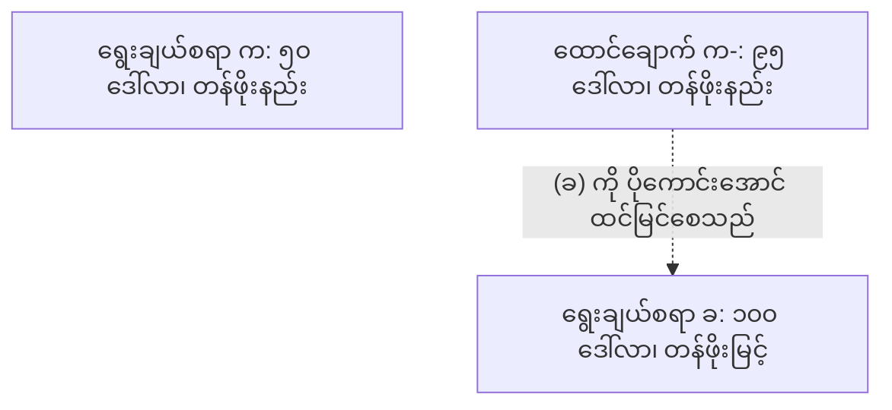
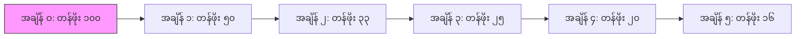

# နိယာမ ၃၀: သင့်အောင်မြင်မှုများကို အားစိုက်ထုတ်စရာမလိုဘဲ ရရှိလာသကဲ့သို့ ထင်မြင်စေပါ

**English**  
**Scientific Equivalent:** Processing Fluency & Cognitive Ease
**Primary Discipline:** Cognitive Psychology

**မြန်မာ**  
**သိပ္ပံနည်းကျ ညီမျှသော သဘောတရား:** Processing Fluency & Cognitive Ease
**အဓိက ပညာရပ်:** Cognitive Psychology

## စည်းမျဉ်း

**English**  
Exposing the machinery of your success destroys the illusion of power. When you reveal the sweat, the struggle, and the friction required to achieve a goal, you demystify yourself. You must weaponize cognitive ease. Present your victories as natural, inevitable outgrowths of your innate superiority, forcing observers to process your competence as a fundamental law of nature rather than the result of brute labor.

**မြန်မာ**  
အောင်မြင်မှု၏ ယန္တရားကို ဖော်ပြခြင်းသည် တစ်ခါတစ်ရံ အာဏာရှိသည်ဟူသော အထင်အမြင်ကို လျော့နည်းစေနိုင်သည်။ ရည်မှန်းချက်တစ်ခုကို အောင်မြင်ရန် လိုအပ်သော ချွေးထွက်မှုများ၊ ရုန်းကန်မှုများနှင့် ပွတ်တိုက်မှုများကို မျှတမှုမရှိဘဲ ထုတ်ဖော်ပြသသောအခါ၊ ပြိုင်ဘက်များက သင့်အား အထင်သေးလာနိုင်သည်။ ကာကွယ်ရေးအတွက် သိမြင်မှုဆိုင်ရာ လွယ်ကူချောမွေ့မှု (cognitive ease) ကို deception မဟုတ်ဘဲ clear presentation, process discipline နှင့် evidence-based credibility အဖြစ် အသုံးပြုရမည်။ အောင်မြင်မှုကို သဘာဝကျကျ ဖြစ်ပေါ်လာသော ရလဒ်အဖြစ် တင်ပြရာတွင်လည်း လိမ်လည်ဖုံးကွယ်ခြင်းမလုပ်ဘဲ၊ မလိုအပ်သော အတွင်းပိုင်းပွတ်တိုက်မှုများကိုသာ လျှော့ချဖော်ပြရမည်။

## သိပ္ပံနည်းကျ သက်သေအထောက်အထား

**English**  
Processing fluency directly dictates human trust and aesthetic appreciation. Cognitive psychologists, including Reber, Schwarz, and Winkielman (2004), demonstrated that when information is easy for the brain to process, it triggers positive affect, perceived truthfulness, and an assessment of high value. Conversely, cognitive strain—induced by witnessing the messy, difficult, or complex mechanics behind an action—triggers vigilance and suspicion.

**မြန်မာ**  
ဦးနှောက်၏ လုပ်ဆောင်မှု လွယ်ကူချောမွေ့ခြင်း (processing fluency) သည် လူသားများ၏ ယုံကြည်မှုနှင့် အလှတရားအပေါ် တန်ဖိုးထားမှုကို တိုက်ရိုက် သက်ရောက်သည်။ ရီဘာ၊ ရှဝါ့ဇ် နှင့် ဝင့်ကယ်လ်မန်း (၂၀၀၄) အပါအဝင် သိမြင်မှုဆိုင်ရာ စိတ်ပညာရှင်များက ဤအချက်ကို သက်သေပြခဲ့သည်။ သတင်းအချက်အလက်များကို ဦးနှောက်က လုပ်ဆောင်ရန် လွယ်ကူသောအခါ၊ ၎င်းသည် အပြုသဘောဆောင်သော ခံစားချက်၊ မှန်ကန်သည်ဟု ယူဆမှုနှင့် မြင့်မားသော တန်ဖိုးသတ်မှတ်မှုတို့ကို ဖြစ်ပေါ်စေသည်။ ပြောင်းပြန်အားဖြင့်၊ လုပ်ဆောင်ချက်တစ်ခု၏ နောက်ကွယ်ရှိ ရှုပ်ထွေးသော၊ ခက်ခဲသော သို့မဟုတ် သပ်ရပ်မှုမရှိသော ယန္တရားများကို မြင်တွေ့ရခြင်းက သိမြင်မှုဆိုင်ရာ ဖိစီးမှုကို ဖြစ်စေသည်။ ၎င်းသည် နိုးကြားမှုနှင့် သံသယကို ဖြစ်ပေါ်စေသည်။

**English**  
As detailed in *Thinking, Fast and Slow*, "cognitive ease" creates an illusion of flawless competence. When a target observes an action that appears entirely frictionless, their System 1 thinking immediately attributes the outcome to godlike, innate mastery. Exposing the effort breaks the fluency, inviting System 2 scrutiny and diminishing your perceived power.

**မြန်မာ**  
*Thinking, Fast and Slow* တွင် ဖော်ပြထားသည့်အတိုင်း၊ "သိမြင်မှုဆိုင်ရာ လွယ်ကူချောမွေ့မှု" သည် အမှားကင်းသော အရည်အချင်းရှိသည်ဟူသည့် အထင်အမြင်ကို ဖန်တီးပေးသည်။ ပစ်မှတ်တစ်ဦးသည် လုံးဝ ပွတ်တိုက်မှုမရှိပုံရသော လုပ်ရပ်တစ်ခုကို မြင်တွေ့ရသောအခါ၊ ၎င်းတို့၏ System 1 တွေးခေါ်မှုသည် ထိုရလဒ်ကို နတ်ဘုရားကဲ့သို့သော မွေးရာပါ ကျွမ်းကျင်မှုကြောင့်ဟု ချက်ချင်း သတ်မှတ်လိုက်သည်။ ကြိုးပမ်းအားထုတ်မှုကို ဖော်ပြခြင်းက ချောမွေ့မှုကို ဖျက်ဆီးပစ်သည်။ ၎င်းက System 2 ၏ စစ်ဆေးမှုကို ဖိတ်ခေါ်ကာ သင်၏ အာဏာအပေါ် အထင်အမြင်ကို လျော့ကျစေသည်။

## မဟာဗျူဟာမြောက် အသုံးချခြင်း

**English**  
*   **Conceal the Friction:** Never complain about the late hours, the near-failures, or the sheer volume of work required to secure a victory. Bury the evidence of your labor.
*   **Automate the Illusion:** Rehearse your execution in the shadows until it becomes autonomic. Only perform in public when the action has been stripped of all visible strain.
*   **Deploy Fluency as a Shield:** By presenting complex achievements as simple and effortless, you deter challengers. Competitors will overestimate your baseline capabilities and avoid engaging you in direct conflict.
*   **Induce Cognitive Strain in Rivals:** Force your opponents to explain themselves, to show their work, and to labor visibly. Let the audience witness their struggle, systematically stripping away their mystique.

**မြန်မာ**  
*   **ဖုံးကွယ်ထားသော ပွတ်တိုက်မှုကို ဖော်ထုတ်ပါ (Expose Hidden Friction):** ပြိုင်ဘက်တစ်ဦးသည် ၎င်းတို့၏ အောင်ပွဲအတွက် လိုအပ်သော ကြိုးပမ်းအားထုတ်မှုများကို ဖုံးကွယ်ထားပြီး အားစိုက်ထုတ်စရာမလိုဘဲ အောင်မြင်သကဲ့သို့ ဟန်ဆောင်လာနိုင်သည်။ ၎င်းတို့၏ စွမ်းဆောင်ရည်နောက်ကွယ်ရှိ အလုပ်ကြမ်းများကို ဖော်ထုတ်ခြင်းဖြင့် ဤလှည့်စားမှုကို ကာကွယ်ပါ။
*   **အလိုအလျောက်ဖြစ်စေသည့် အထင်အမြင်ကို သတိပြုပါ (Beware of Automated Impressions):** ပြိုင်ဘက်များသည် လုပ်ဆောင်ချက်များကို လွယ်ကူချောမွေ့စွာ လုပ်နိုင်ကြောင်း ပြသကာ သင့်အား အထင်ကြီးစေရန် ကြိုးပမ်းနိုင်သည်။ ဤမြင်သာသော ချောမွေ့မှုသည် ကွယ်ရာတွင် အချိန်ယူလေ့ကျင့်ထားသော ရလဒ်ဖြစ်ကြောင်း အသိအမှတ်ပြုပါ။
*   **ချောမွေ့မှု ဒိုင်းကို ထိုးဖောက်ပါ (Pierce the Shield of Fluency):** ပြိုင်ဘက်များသည် ရှုပ်ထွေးသော အောင်မြင်မှုများကို ရိုးရှင်းသယောင် တင်ပြခြင်းဖြင့် သင့်အား စိန်ခေါ်ရန် တွန့်ဆုတ်သွားစေနိုင်သည်။ သူတို့၏ အခြေခံစွမ်းရည်များကို အလွန်အမင်း အထင်ကြီးခြင်းမှ ရှောင်ကြဉ်ပြီး အချက်အလက်များအပေါ်သာ အခြေခံ၍ အကဲဖြတ်ပါ။
*   **သိမြင်မှုဆိုင်ရာ ဖိစီးမှုကို ခုခံပါ (Resist Cognitive Strain):** ပြိုင်ဘက်များသည် သင်၏ ယုံကြည်မှုကို လျော့နည်းစေရန် သင့်အား အလွန်အကျွံ ရှင်းပြစေခြင်း သို့မဟုတ် ပွတ်တိုက်မှုများကို ထင်ရှားစေခြင်းတို့ကို ပြုလုပ်လာနိုင်သည်။ သင်၏ လုပ်ငန်းစဉ်များကို ခိုင်မာစွာ ထိန်းသိမ်းထားပြီး ၎င်းတို့၏ ဖိအားပေးမှုများကို လျစ်လျူရှုပါ။

### သိပ္ပံနည်းကျ သက်သေအထောက်အထား: မြန်မာနိုင်ငံ၏ ဖြစ်ရပ်မှန်လေ့လာချက်

**English**  
A master gem trader in Mogok always executed multi-million dollar negotiations with relaxed, almost bored body language. By leveraging processing fluency, he made his immense geological knowledge and ruthless haggling seem entirely effortless. This cognitive ease disarmed his rivals, who consistently underestimated the lethal calculation behind his casual demeanor.

**မြန်မာ**  
မိုးကုတ်မြို့ရှိ ကျောက်မျက်ရတနာ ကုန်သည်ကြီးတစ်ဦးသည် ကျပ်သိန်းထောင်သောင်းချီ တန်ဖိုးရှိသော စေ့စပ်ညှိနှိုင်းမှုများကို လုပ်ဆောင်လေ့ရှိသည်။ ထိုအခါ သူသည် အမြဲတမ်း ပေါ့ပေါ့ပါးပါး၊ ငြီးငွေ့နေသကဲ့သို့သော ကိုယ်နေဟန်ထားဖြင့် လုပ်ဆောင်လေ့ရှိသည်။ လုပ်ဆောင်မှု လွယ်ကူချောမွေ့ခြင်းကို အသုံးချခြင်းဖြင့် သူသည် ၎င်း၏ ကြီးမားလှသော ဘူမိဗေဒ အသိပညာနှင့် ရက်စက်သော ဈေးဆစ်မှုများကို လုံးဝ အားစိုက်ထုတ်စရာမလိုသကဲ့သို့ ထင်မြင်စေခဲ့သည်။ ဤသိမြင်မှုဆိုင်ရာ လွယ်ကူချောမွေ့မှုသည် ပြိုင်ဘက်များကို လက်နက်ချစေခဲ့သည်။ ၎င်းတို့သည် သူ၏ ပေါ့ပေါ့ပါးပါး အမူအရာနောက်ကွယ်ရှိ အသက်အန္တရာယ်ရှိသော တွက်ချက်မှုများကို အမြဲတမ်း လျှော့တွက်ခဲ့ကြသည်။

**English**  
> [!WARNING]
> **Backfire Risk:** Appearing too effortless can breed resentment among peers who value hard work. If stakeholders believe you aren't expending metabolic energy, they may cut your compensation, assuming the task is intrinsically easy.

**မြန်မာ**  
> [!WARNING]
> **တန်ပြန်ထိခိုက်နိုင်သော အန္တရာယ် (Backfire Risk):** အလွန်အမင်း အားစိုက်ထုတ်စရာမလိုသကဲ့သို့ ပြသခြင်းက ကြိုးစားအားထုတ်မှုကို တန်ဖိုးထားသော လုပ်ဖော်ကိုင်ဖက်များအကြား မကျေနပ်မှုကို ဖြစ်စေနိုင်သည်။ သင်သည် ဇီဝကမ္မစွမ်းအင်များ စိုက်ထုတ်ခြင်းမရှိဟု သက်ဆိုင်သူများက ယုံကြည်ပါက၊ လုပ်ငန်းတာဝန်သည် မူလကတည်းက လွယ်ကူသည်ဟု ယူဆကာ သင်၏ ခံစားခွင့်များကို ဖြတ်တောက်သွားနိုင်သည်။

**English**  
> [!IMPORTANT]
> **Defensive Application:**
> If a rival uses processing fluency to make their achievements seem effortless and magical, expose the mechanics. By revealing the brute labor and friction behind their success, you induce cognitive strain in observers and destroy their mystique.

**မြန်မာ**  
> [!IMPORTANT]
> **အကာအကွယ်ပေးသော အသုံးချခြင်း (Defensive Application):**
> ပြိုင်ဘက်တစ်ဦးက ၎င်းတို့၏ အောင်မြင်မှုများကို အားစိုက်ထုတ်စရာမလိုဘဲ မှော်ဆန်သကဲ့သို့ ထင်မြင်စေရန် လုပ်ဆောင်မှု လွယ်ကူချောမွေ့ခြင်း ကို အသုံးပြုလာပါက၊ ထိုယန္တရားများကို ဖော်ထုတ်ပါ။ ၎င်းတို့အောင်မြင်မှု နောက်ကွယ်ရှိ အလုပ်ကြမ်းနှင့် ပွတ်တိုက်မှုများကို ထုတ်ဖော်ပြသပါ။ ဤသို့ဖြင့် လေ့လာစောင့်ကြည့်သူများထံတွင် သိမြင်မှုဆိုင်ရာ ဖိစီးမှုကို ဖြစ်ပေါ်စေပြီး ၎င်းတို့၏ လျှို့ဝှက်ဆန်းကြယ်မှုကို ဖျက်ဆီးပစ်နိုင်သည်။

**English**  
---

**မြန်မာ**  
---

# နိယာမ ၃၁: ရွေးချယ်စရာများကို ထိန်းချုပ်ပါ: သင့်စိတ်ကြိုက် ဖန်တီးထားသော အခြေအနေထဲတွင် သူတစ်ပါးကို ကစားစေပါ

**English**  
**Scientific Equivalent:** Choice Architecture & Asymmetric Dominance (Decoy Effect)
**Primary Discipline:** Behavioral Economics & Marketing Science

**မြန်မာ**  
**သိပ္ပံနည်းကျ ညီမျှသော သဘောတရား:** Choice Architecture & Asymmetric Dominance (Decoy Effect)
**အဓိက ပညာရပ်:** Behavioral Economics & Marketing Science

## စည်းမျဉ်း

**English**  
Agency is an illusion. Do not force compliance; engineer the environment so that the target voluntarily selects your preferred outcome. By controlling the parameters of the choice, you dictate the result while leaving the target's ego intact. You are not a dictator; you are the architect of their perceived reality.

**မြန်မာ**  
ရွေးချယ်မှုတည်ဆောက်ပုံသည် လွတ်လပ်စွာ ဆုံးဖြတ်ခွင့်ကို တိတ်တဆိတ် ပြောင်းလဲနိုင်သည်။ ဤနည်းဗျူဟာကို ပြိုင်ဘက်များက သင့်အပေါ် ကြိုးကိုင်ရန် အသုံးပြုလာနိုင်သည်။ ၎င်းတို့၏ ထောင်ချောက်ထဲ မကျရောက်စေရန် ဤအကာအကွယ်ပေးသော ဉာဏ်ရည် (အကာအကွယ်ပေးသော ဉာဏ်ရည် - Defensive Intelligence) ကို နားလည်ထားရမည်။ ကာကွယ်ရေးအတွက် ရွေးချယ်စရာများ၏ default, decoy, friction နှင့် opt-out cost များကို စစ်ဆေးပါ။ ရွေးချယ်မှု၏ ကန့်သတ်ချက်များကို ထိန်းချုပ်ခြင်းသည် အခြားသူများကို အမိန့်ပေးခြင်းမဟုတ်ဘဲ၊ သင့်အဖွဲ့အစည်းကို မမျှတသော choice architecture မှ ကာကွယ်ရန် အသုံးပြုရမည်။

## သိပ္ပံနည်းကျ သက်သေအထောက်အထား

**English**  
Human decision-making is profoundly context-dependent and easily manipulated by structural framing. Behavioral economists have proven that "choice architecture" governs behavior far more effectively than coercion. Huber, Payne, and Puto (1982) documented the "decoy effect" (asymmetric dominance), where the introduction of an inferior third option predictably shifts consumer preference toward the architect's target option.

**မြန်မာ**  
လူသားတို့၏ ဆုံးဖြတ်ချက်ချမှတ်ခြင်းသည် အခြေအနေအပေါ် လွန်စွာ မှီခိုသည်။ ၎င်းကို တည်ဆောက်ပုံဆိုင်ရာ ဘောင်ခတ်မှု (structural framing) ဖြင့် လွယ်ကူစွာ ကြိုးကိုင်နိုင်သည်။ "ရွေးချယ်မှု တည်ဆောက်ပုံ (choice architecture)" သည် အတင်းအကျပ်ခိုင်းစေခြင်းထက် အပြုအမူကို ပိုမိုထိရောက်စွာ လွှမ်းမိုးနိုင်ကြောင်း အပြုအမူဆိုင်ရာ ဘောဂဗေဒပညာရှင်များက သက်သေပြခဲ့သည်။ ဟူးဘား၊ ပိန်း နှင့် ပူတို (၁၉၈၂) တို့သည် လှည့်စားမှု အကျိုးသက်ရောက်မှု (decoy effect / asymmetric dominance) ကို မှတ်တမ်းတင်ခဲ့ကြသည်။ ၎င်းမှာ အဆင့်နိမ့်သော တတိယရွေးချယ်စရာတစ်ခုကို မိတ်ဆက်ပေးခြင်း ဖြစ်သည်။ ယင်းက စားသုံးသူများ၏ ရွေးချယ်မှုကို ဖန်တီးသူ၏ ပစ်မှတ်ရွေးချယ်စရာဆီသို့ ကြိုတင်ခန့်မှန်းနိုင်လောက်အောင် ပြောင်းလဲသွားစေသည်။

**English**  
As outlined in *Nudge*, humans do not evaluate options in a vacuum. They rely on relative comparisons. By curating the menu of available options, you hijack the brain's comparative heuristics. The target feels the autonomy of choice, completely unaware that every option on the table leads directly to your objective.

**မြန်မာ**  
*Nudge* စာအုပ်တွင် ဖော်ပြထားသည့်အတိုင်း လူသားများသည် ရွေးချယ်စရာများကို သီးခြားခွဲ၍ အကဲမဖြတ်တတ်ပါ။ ၎င်းတို့သည် နှိုင်းယှဉ်ချက်များကို မှီခိုကြသည်။ ရရှိနိုင်သော ရွေးချယ်စရာ စာရင်းကို သေချာစွာ စီစဉ်ပေးခြင်းဖြင့်၊ သင်သည် ဦးနှောက်၏ နှိုင်းယှဉ်ဆုံးဖြတ်ခြင်း စနစ်ကို ကြိုးကိုင်နိုင်သည်။ ပစ်မှတ်သည် ရွေးချယ်နိုင်ခွင့် ရှိသည်ဟု ခံစားရလိမ့်မည်။ သို့သော် စားပွဲပေါ်ရှိ ရွေးချယ်စရာတိုင်းသည် သင်၏ ရည်မှန်းချက်ဆီသို့ တိုက်ရိုက် ဦးတည်နေသည်ဆိုသည်ကိုမူ လုံးဝ သတိမထားမိကြပေ။

## မဟာဗျူဟာမြောက် အသုံးချခြင်း

**English**  
*   **Deploy the Decoy:** Whenever presenting a choice, introduce a deliberately flawed option that makes your preferred outcome look mathematically and logically superior.
*   **Frame the Default:** Harness the status quo bias by making your desired outcome the default path of least resistance. Force opponents to expend immense cognitive and social energy to opt out.
*   **Construct the Double Bind:** Offer two distinct paths that both serve your strategic interests. Let the opponent agonizingly debate which route to take, blinding them to the fact that you win either way.
*   **Preserve the Illusion of Agency:** Never mandate. Suggest, frame, and curate. When the target believes the decision was theirs, they will fiercely defend it, acting as your proxy without realizing it.

**မြန်မာ**  
*   **လှည့်စားမှု (Decoy) ကို စစ်ဆေးပါ:** ရွေးချယ်စရာတစ်ခုကို တင်ပြသည့်အခါ တမင်ဖန်တီးထားသော အားနည်းချက်ရှိသည့် ရွေးချယ်စရာတစ်ခု ပါဝင်နေသလား စစ်ဆေးပါ။
*   **ပုံသေအခြေအနေ (Default) ကို စစ်ဆေးပါ:** အလွယ်ကူဆုံးဖြစ်သော ပုံသေလမ်းကြောင်းသည် သင့်အကျိုးစီးပွားနှင့် ကိုက်ညီသလား၊ သို့မဟုတ် တစ်ဖက်လူ၏ အကျိုးစီးပွားအတွက် friction ကို မညီမျှအောင် စီထားသလား စစ်ဆေးပါ။
*   **နှစ်ဖက်ပိတ် အကျပ်အတည်း (Double Bind) ကို သတိပြုပါ:** မတူညီသော လမ်းကြောင်းနှစ်ခုလုံးက တစ်ဖက်လူ၏ အကျိုးစီးပွားကိုသာ အထောက်အကူပြုနေပါက third option သို့မဟုတ် pause ကို တောင်းဆိုပါ။
*   **စစ်မှန်သော ရွေးချယ်ခွင့်ကို ကာကွယ်ပါ:** အကြံပြုချက်၊ ဘောင်ခတ်မှုနှင့် စီစဉ်ပေးမှုများသည် ကျော့ကွင်းဖြစ်လာနိုင်သည်။ ဆုံးဖြတ်ချက်တိုင်းတွင် opt-out, appeal နှင့် independent advice ကို ထားပါ။

### လက်တွေ့အထောက်အထား - မြန်မာနိုင်ငံဆိုင်ရာ လေ့လာမှု (Empirical Evidence: Myanmar Case Study)

**English**  
A political broker in Yangon wanted his preferred candidate elected to the municipal council. He didn't just promote his guy; he secretly funded two highly extreme, unlikable decoy candidates. By utilizing choice architecture and asymmetric dominance, he forced the voters to choose his candidate as the only "rational, moderate" option available.

**မြန်မာ**  
ရန်ကုန်ရှိ နိုင်ငံရေးပွဲစားတစ်ဦးသည် သူ၏လူကို စည်ပင်သာယာရေးကော်မတီသို့ ရွေးကောက်ခံရစေရန် အလိုရှိခဲ့သည်။ သူသည် ထိုလူကို ပုံမှန် မြှင့်တင်ရုံ မလုပ်ခဲ့ပေ။ အလွန်အမင်း အစွန်းရောက်ပြီး လူမုန်းများသော အတုအယောင် ကိုယ်စားလှယ်လောင်း နှစ်ဦးကိုပါ လျှို့ဝှက်စွာ ငွေကြေးထောက်ပံ့ခဲ့သည်။ ဤနည်းဖြင့် သူသည် ရွေးချယ်မှုဆိုင်ရာ တည်ဆောက်ပုံ (Choice architecture) ကို ဖန်တီးခဲ့သည်။ ထို့ပြင် အချိုးအစားမညီသော လွှမ်းမိုးမှု (Asymmetric dominance) ကို အသုံးပြုခဲ့သည်။ ရလဒ်အနေဖြင့် မဲဆန္ဒရှင်များသည် သူ၏ ကိုယ်စားလှယ်လောင်းကိုသာ တစ်ခုတည်းသော "ဆင်ခြင်တုံတရားရှိပြီး အလယ်အလတ်ကျသော" ရွေးချယ်စရာအဖြစ် ယူဆကာ မဲပေးရန် ဖိအားပေးခံခဲ့ရသည်။ ဈေးကွက်အတွင်း၌လည်း ရန်ကုန်မြို့ရှိ မိသားစုပိုင် ကုမ္ပဏီကြီးများသည် ပြိုင်ဘက်များကို ဤကဲ့သို့ပင် ထောင့်ကျဉ်းထဲသို့ ရောက်စေရန် ကြိုးပမ်းတတ်ကြသည်။

**English**  
> [!WARNING]
> **Backfire Risk:** If targets realize the choice architecture has been artificially constrained, they will experience violent psychological reactance and reject all provided options, burning down the entire framework.

**မြန်မာ**  
> [!WARNING]
> **ပြောင်းပြန်သက်ရောက်နိုင်သည့် အန္တရာယ် (Backfire Risk):** ရွေးချယ်စရာများကို ပုံဖျက်ကန့်သတ်ထားကြောင်း ပစ်မှတ်များက ရိပ်မိသွားနိုင်သည်။ ထိုအခါ သူတို့သည် ပြင်းထန်သော စိတ်ပိုင်းဆိုင်ရာ ဆန့်ကျင်တုံ့ပြန်မှု (Psychological reactance) ကို ခံစားရမည်။ ပေးထားသော ရွေးချယ်စရာအားလုံးကို ငြင်းပယ်မည်။ ဤစနစ်တစ်ခုလုံးကိုပါ ရစရာမရှိအောင် ဖျက်ဆီးပစ်လိမ့်မည်။

**English**  
> [!IMPORTANT]
> **Defensive Application:**
> When presented with a curated set of options, look for the decoy effect. Recognize that the choice architecture was designed to manipulate you; reject the menu entirely and introduce your own structurally dominant alternatives.

**မြန်မာ**  
> [!IMPORTANT]
> **ကာကွယ်ရေးဆိုင်ရာ အသုံးချမှု (Defensive Application):**
> သင့်အား ရွေးချယ်စရာအစုအဝေးတစ်ခု ဖန်တီးပေးလာသောအခါ၊ အတုအယောင်ပြပြီး လှည့်စားသော အကျိုးသက်ရောက်မှု (Decoy effect) ကို ရှာဖွေပါ။ ထိုရွေးချယ်မှုဆိုင်ရာ တည်ဆောက်ပုံသည် သင့်ကို ခြယ်လှယ်ရန် ရည်ရွယ်ထားကြောင်း သတိပြုပါ။ ထိုရွေးချယ်စရာများကို လုံးဝ ငြင်းပယ်လိုက်ပါ။ ပိုမိုခိုင်မာအားကောင်းသော သင့်ကိုယ်ပိုင် ရွေးချယ်စရာများကိုသာ ဖန်တီးမိတ်ဆက်ပါ။

**English**  
---

**မြန်မာ**  
---

# နိယာမ ၃၂ - လူတို့၏ စိတ်ကူးယဉ် အိပ်မက်များကို ကစားပါ (Law 32: Play to People's Fantasies)

**English**  
**Scientific Equivalent:** Motivated Reasoning & Confirmation Bias
**Primary Discipline:** Cognitive Psychology

**မြန်မာ**  
**သိပ္ပံနည်းကျ ညီမျှချက် -** လိုအင်ဆန္ဒအရ တွေးတောဆင်ခြင်ခြင်း နှင့် လက်ခံလိုသည့်အရာကိုသာ ယုံကြည်ခြင်း (Motivated Reasoning & Confirmation Bias)
**အဓိက ဘာသာရပ် -** သိမြင်မှုဆိုင်ရာ စိတ်ပညာ (Cognitive Psychology)

## စည်းမျဉ်း (The Rule)

**English**  
Reality is cold, brutal, and psychologically intolerable for the majority. Do not attempt to persuade with objective facts or rational arguments. Instead, identify the psychological voids, the desperate hopes, and the suppressed desires of your targets. Feed them the fantasy they crave, and their own neurobiology will override their critical thinking, rendering them utterly compliant.

**မြန်မာ**  
*သတိပြုရန် - ဤအန္တရာယ်ပုံစံကို သူတစ်ပါးအား ခြယ်လှယ်ရန် မဟုတ်ဘဲ၊ သင့်မိသားစုလုပ်ငန်းကို ပြိုင်ဘက်များ၏ အသုံးချမှုမှ ကာကွယ်ရန် 'အကာအကွယ်ပေးသော ဉာဏ်ရည် (အကာအကွယ်ပေးသော ဉာဏ်ရည် - Defensive Intelligence)' အဖြစ် နားလည်ထားရမည်။*
အများစုအတွက် လက်တွေ့ဘဝသည် အေးစက်သည်။ ရက်စက်သည်။ စိတ်ပိုင်းဆိုင်ရာအရ လက်ခံနိုင်စရာ မရှိပေ။ ပုဂံခေတ်ကတည်းကပင် လူတို့သည် အမှန်တရားထက် ပုံပြင်များကို ပိုမိုနှစ်သက်ခဲ့ကြသည်။ ရက်စက်ကြမ်းကြုတ်သော ဈေးကွက်ထဲရှိ ပြိုင်ဘက်များသည် ဓမ္မဓိဋ္ဌာန်ကျသော အချက်အလက်များဖြင့် သိမ်းသွင်းရန် မကြိုးစားကြပေ။ ဆင်ခြင်တုံတရားရှိသော အကြောင်းပြချက်များလည်း မပေးကြပေ။ ယင်းအစား သူတို့သည် သင့်ဖောက်သည်များ သို့မဟုတ် သင့်လုပ်ဖော်ကိုင်ဖက်များ၏ စိတ်ပိုင်းဆိုင်ရာ ဟာလာဟင်းလင်းပြင်များကို ရှာဖွေကြသည်။ မျှော်လင့်ချက် ကြီးကြီးမားမားများကို ဖော်ထုတ်ကြသည်။ ဖိနှိပ်ထားသော ဆန္ဒများကို ကုတ်ဆွကြသည်။ သူတို့ တောင့်တနေသော စိတ်ကူးယဉ် အိပ်မက်များကို ကျွေးမွေးလိုက်ကြသည်။ ထိုအခါ သူတို့၏ ကိုယ်ပိုင် အာရုံကြောဇီဝဗေဒ (Neurobiology) သည် သူတို့၏ ဝေဖန်ပိုင်းခြားနိုင်စွမ်းကို ဖုံးလွှမ်းသွားမည်။ နောက်ဆုံးတွင် ခြယ်လှယ်သူ၏ အလိုကို လုံးဝ လိုက်လျောသွားစေသည်။

## လက်တွေ့အထောက်အထား (The Empirical Evidence)

**English**  
The human brain is not a truth-seeking engine; it is an ego-preservation machine. Kunda (1990) established the framework for "motivated reasoning," demonstrating that when individuals are presented with information that aligns with their deepest desires, they subject it to almost zero cognitive scrutiny.

**မြန်မာ**  
လူသားတို့၏ ဦးနှောက်သည် အမှန်တရားကို ရှာဖွေသော ယန္တရား မဟုတ်ပေ။ မိမိအတ္တကို ကာကွယ်သော ယန္တရား (Ego-preservation machine) သာ ဖြစ်သည်။ Kunda (1990) သည် လိုအင်ဆန္ဒအရ တွေးတောဆင်ခြင်ခြင်း မူဘောင်ကို တည်ဆောက်ခဲ့သည်။ လူတို့သည် မိမိတို့၏ အနက်ရှိုင်းဆုံး ဆန္ဒများနှင့် ကိုက်ညီသော အချက်အလက်များကို ရရှိသောအခါ ၎င်းတို့ကို သိမြင်မှုဆိုင်ရာ စိစစ်သုံးသပ်မှု (Cognitive scrutiny) လုံးဝ မလုပ်တော့ပေ။ 'ယုံချင်ရာယုံတတ်သည့် လူ့သဘာဝ' ကို သူက သက်သေပြခဲ့သည်။

**English**  
As detailed in *The Elephant in the Brain*, humans continuously deceive themselves to function in society. When you supply a narrative that affirms a target's fantasy—whether it is sudden wealth, unearned status, or absolute security—you hijack their confirmation bias. Their brain will actively fight to defend the delusion, attacking anyone who attempts to reintroduce reality.

**မြန်မာ**  
*The Elephant in the Brain* စာအုပ်တွင် ဖော်ပြထားသကဲ့သို့၊ လူသားများသည် လူ့အဖွဲ့အစည်းအတွင်း ရပ်တည်လှုပ်ရှားနိုင်ရန် မိမိကိုယ်ကို အစဉ်မပြတ် လှည့်စားနေကြသည်။ ပြိုင်ဘက်များက ပစ်မှတ်တစ်ဦး၏ စိတ်ကူးယဉ် အိပ်မက်ကို အတည်ပြုပေးသော ဇာတ်လမ်းတစ်ပုဒ်ကို ဖန်တီးလာနိုင်သည်။ ၎င်းသည် ရုတ်တရက် ချမ်းသာလာခြင်း ဖြစ်နိုင်သည်။ မကြိုးစားဘဲ ရရှိမည့် အဆင့်အတန်း ဖြစ်နိုင်သည်။ သို့မဟုတ် လုံးဝ လုံခြုံမှုလည်း ဖြစ်နိုင်သည်။ ထိုအခါ ပစ်မှတ်၏ လက်ခံလိုသည့်အရာကိုသာ ယုံကြည်ခြင်းကို ၎င်းတို့ လွှမ်းမိုးထိန်းချုပ်လိုက်ပြီ ဖြစ်သည်။ ပစ်မှတ်၏ ဦးနှောက်သည် ထိုမှားယွင်းသော ယုံကြည်မှုကို ကာကွယ်ရန် တက်ကြွစွာ တိုက်ပွဲဝင်မည်။ လက်တွေ့ဘဝကို ပြန်လည်မိတ်ဆက်ရန် ကြိုးစားသူတိုင်းကိုလည်း ရန်လိုတိုက်ခိုက်လိမ့်မည်။

## အန္တရာယ်ပုံစံနှင့် ကာကွယ်ရေး အသုံးချမှု (Risk Pattern and Defensive Application)

**English**  
*   **Target the Void:** Analyze the target to locate their deepest insecurity or unfulfilled desire. Craft your narrative to perfectly bridge the gap between their current reality and their idealized self.
*   **Bypass the Rational:** Strip your pitches of complex data, nuanced risks, and harsh truths. Use vague, emotionally charged language that allows the target to project their own fantasies onto your words.
*   **Weaponize Confirmation Bias:** Once the target has accepted the fantasy, they will do the work of convincing themselves. Provide just enough superficial evidence to allow them to rationalize the delusion.
*   **Maintain Plausible Deniability:** Never make concrete promises that can be empirically disproven. Sell the feeling of the outcome, ensuring the fantasy remains perpetually just out of reach.

**မြန်မာ**  
*သင်၏ ပြိုင်ဘက်များသည် အောက်ပါနည်းလမ်းများကို အသုံးပြု၍ ဈေးကွက်ကို ခြယ်လှယ်လာနိုင်ကြောင်း သတိပြုပါ။ ရည်ရွယ်ချက်မှာ ထိုနည်းလမ်းများကို တုပရန်မဟုတ်ဘဲ၊ စောစောသိပြီး ကာကွယ်ရန်ဖြစ်သည် -*
*   **ဟာလာဟင်းလင်းပြင်ကို ပစ်မှတ်ထားလာခြင်းကို သတိပြုပါ (Beware of Targeting the Void):** သူတို့သည် ပစ်မှတ်ကို ခွဲခြမ်းစိတ်ဖြာကြသည်။ အနက်ရှိုင်းဆုံး မလုံခြုံမှုများကို ရှာဖွေကြသည်။ မပြည့်ဝသေးသော ဆန္ဒများကို ဖော်ထုတ်ကြသည်။ ပစ်မှတ်၏ လက်ရှိအခြေအနေနှင့် စိတ်ကူးယဉ်ဘဝကြားကို ပြီးပြည့်စုံစွာ ပေါင်းကူးပေးမည့် 'ရွှေပြည်တော် မျှော်တိုင်းဝေး' ဇာတ်လမ်းမျိုးကို ဖန်တီးကြသည်။
*   **ဆင်ခြင်တုံတရားကို ကျော်လွှားခြင်းကို ကာကွယ်ပါ (Prevent Bypassing the Rational):** သူတို့၏ တင်ပြချက်များမှ ရှုပ်ထွေးသော ဒေတာများကို ဖယ်ရှားထားကြသည်။ အသေးစိတ်ကျသော အန္တရာယ်များကို ချန်လှပ်ထားကြသည်။ ကြမ်းတမ်းသော အမှန်တရားများကို ဖုံးကွယ်ထားကြသည်။ တိကျမှုမရှိသော၊ စိတ်ခံစားမှု ပြင်းထန်သော စကားလုံးများကိုသာ အသုံးပြုကြသည်။ သို့မှသာ ပစ်မှတ်သည် သူတို့၏ စကားလုံးများအပေါ် စိတ်ကူးယဉ် အိပ်မက်များကို ပုံဖော်နိုင်မည်ဖြစ်သည်။
*   **လက်ခံလိုသည့်အရာကိုသာ ယုံကြည်ခြင်း အန္တရာယ် (Confirmation Bias Risk):** ပစ်မှတ်က စိတ်ကူးယဉ် အိပ်မက်ကို လက်ခံသွားသည်နှင့် သူ့ကိုယ်သူ ယုံကြည်စေရန် သူ့ဘာသာ အလုပ်လုပ်တတ်သည်။ ကာကွယ်ရေးအတွက် independent evidence review နှင့် downside scenario ကို မဖြစ်မနေ စစ်ဆေးပါ။
*   **ငြင်းဆိုနိုင်စွမ်းကို အကာအကွယ်အဖြစ် သုံးလာနိုင်ခြေ (Plausible Deniability Risk):** ခြယ်လှယ်သူများသည် အမှားသက်သေပြနိုင်သော တိကျသည့် ကတိကဝတ်များကို ရှောင်ရှားတတ်သည်။ ရလဒ်၏ ခံစားချက်ကိုသာ ရောင်းချလာပါက written claim, measurable term နှင့် accountability owner ကို တောင်းဆိုပါ။

### လက်တွေ့အထောက်အထား - မြန်မာနိုင်ငံဆိုင်ရာ လေ့လာမှု (Empirical Evidence: Myanmar Case Study)

**English**  
Recognizing the desperate desire for rapid wealth in rural Myanmar, a micro-lending firm stopped selling "slow, steady financial growth." Instead, they marketed their loans as the gateway to "immediate elite status and luxury." By playing to motivated reasoning and confirmation bias, they bypassed rational risk assessment, resulting in massive, albeit predatory, adoption.

**မြန်မာ**  
မြန်မာနိုင်ငံ ကျေးလက်ဒေသများတွင် အမြန်ချမ်းသာလိုသော ပြင်းပြသည့် ဆန္ဒများ ရှိသည်။ ယင်းကို အသေးစားငွေချေးလုပ်ငန်း တစ်ခုက သတိပြုမိခဲ့သည်။ သူတို့သည် "နှေးကွေးပြီး တည်ငြိမ်သော ဘဏ္ဍာရေးတိုးတက်မှု" ဇာတ်လမ်းကို ရပ်တန့်ခဲ့သည်။ ယင်းအစား သူတို့၏ ချေးငွေများကို "ချက်ချင်းရရှိမည့် အထက်တန်းလွှာ အဆင့်အတန်းနှင့် ဇိမ်ခံဘဝ" ဝင်ပေါက်အဖြစ် ဈေးကွက်တင်ခဲ့သည်။ လိုအင်ဆန္ဒအရ တွေးတောဆင်ခြင်ခြင်းကို ကစားခဲ့သည်။ လက်ခံလိုသည့်အရာကိုသာ ယုံကြည်ခြင်းကိုလည်း အသုံးချခဲ့သည်။ ဤနည်းဖြင့် ၎င်းတို့သည် ဆင်ခြင်တုံတရားရှိသော အန္တရာယ် အကဲဖြတ်မှုကို ကျော်လွှားခဲ့သည်။ ရလဒ်အနေဖြင့် အမြတ်ထုတ်လွန်းသော်လည်း ကြီးမားကျယ်ပြန့်သော အသုံးပြုမှုကို ရရှိခဲ့သည်။

**English**  
> [!WARNING]
> **Backfire Risk:** Reality always violently reasserts itself. When the fantasy inevitably collapses, the cognitive dissonance of the victims turns into targeted vengeance, leading to severe regulatory or physical retaliation.

**မြန်မာ**  
> [!WARNING]
> **ပြောင်းပြန်သက်ရောက်နိုင်သည့် အန္တရာယ် (Backfire Risk):** လက်တွေ့ဘဝသည် အမြဲတမ်း ပြင်းထန်စွာ ပြန်လည်ရောက်ရှိလာတတ်သည်။ စိတ်ကူးယဉ် အိပ်မက်များ မလွဲမသွေ ပြိုကျပျက်စီးသွားမည်။ ထိုအခါ သားကောင်များ၏ သိမြင်မှုဆိုင်ရာ ကွဲလွဲမှု (Cognitive dissonance) သည် ကလဲ့စားချေမှုအဖြစ် ပြောင်းလဲသွားမည်။ ပြင်းထန်သော ဥပဒေပိုင်းဆိုင်ရာ သို့မဟုတ် ရုပ်ပိုင်းဆိုင်ရာ လက်တုံ့ပြန်မှုများကို မလွဲမသွေ ရင်ဆိုင်ရမည်။

**English**  
> [!IMPORTANT]
> **Defensive Application:**
> If a manipulator appeals to your deepest fantasies and confirmation bias, force yourself into extreme skepticism. Demand empirical, peer-reviewed data to support their claims, preventing your own motivated reasoning from sealing the trap.

**မြန်မာ**  
> [!IMPORTANT]
> **ကာကွယ်ရေးဆိုင်ရာ အသုံးချမှု (Defensive Application):**
> ခြယ်လှယ်သူတစ်ဦးသည် သင့်အနက်ရှိုင်းဆုံး စိတ်ကူးယဉ် အိပ်မက်များကို ဆွဲဆောင်လာနိုင်သည်။ သင်၏ လက်ခံလိုသည့်အရာကိုသာ ယုံကြည်ခြင်းကိုလည်း အသုံးချလာနိုင်သည်။ ထိုအခါ အလွန်အမင်း ကိုယ့်ကိုယ်ကို သံသယဝင်ရန်မဟုတ်ဘဲ၊ စနစ်တကျ evidence review ပြုလုပ်ပါ။ သူတို့၏ အဆိုပြုချက်များကို ထောက်ခံရန် လက်တွေ့ကျသော ဒေတာများနှင့် ပညာရှင်များစိစစ်ထားသော (peer-reviewed) အထောက်အထားများကို တောင်းဆိုပါ။

**English**  
---

**မြန်မာ**  
---

# နိယာမ ၃၃- သင့်အဖွဲ့အစည်း၏ အားနည်းချက်များကို လုံခြုံအောင်ထားခြင်း (Securing Your Organizational Thumbscrews)

**English**  
**Scientific Equivalent:** Individual Differences & Target Profiling (The Dark Triad)
**Primary Discipline:** Personality Psychology & Psychopathology

**မြန်မာ**  
> **ထုတ်ဝေမှု V4.1 မူဘောင်:** ဤအပိုင်းကို အသုံးချရန် လမ်းညွှန်အဖြစ် မဖတ်ရပါ။ ၎င်းသည် အဖွဲ့အစည်းများ၊ တည်ထောင်သူများနှင့် စာဖတ်သူများက ထိန်းချုပ်မှုနည်းလမ်းများကို အသိအမှတ်ပြု၊ မှတ်သား၊ တားဆီးနိုင်ရန် ဖော်ပြထားသော အန္တရာယ်ပုံစံနှင့် ကာကွယ်ရေး မူဘောင်ဖြစ်သည်။

**မြန်မာ**  
**သိပ္ပံနည်းကျ ညီမျှချက် -** တစ်ဦးချင်းစီ၏ ကွဲပြားမှုများ နှင့် ပစ်မှတ်အား ပရိုဖိုင်လုပ်ခြင်း (အမှောင်စရိုက်သုံးပါး) (Individual Differences & Target Profiling (The Dark Triad))
**အဓိက ဘာသာရပ် -** ကိုယ်ရည်ကိုယ်သွေး စိတ်ပညာ နှင့် စိတ်ရောဂါဗေဒ (Personality Psychology & Psychopathology)

## စည်းမျဉ်း (The Rule)

**English**  
Every individual possesses a critical psychological vulnerability—an unhealed wound, an irrational fear, or a volatile vanity. Treat humans not as equals, but as mechanisms to be decoded. Profile your targets to isolate their specific behavioral trigger. Once you possess their thumb-screw, you possess them.

**မြန်မာ**  
*သတိပြုရန် - ကမ္ဘာ့ဈေးကွက်၏ ပြိုင်ဆိုင်မှုအောက်တွင်၊ သင်၏ ပြိုင်ဘက်များသည် သင့်အဖွဲ့အစည်းနှင့် သင့်မိသားစုဝင်များ၏ အားနည်းချက်များကို ရှာဖွေနေကြပြီဖြစ်သည်။ ၎င်းကို ခုခံကာကွယ်နိုင်ရန် ဤသဘောတရားကို 'အကာအကွယ်ပေးသော ဉာဏ်ရည် (အကာအကွယ်ပေးသော ဉာဏ်ရည် - Defensive Intelligence)' အဖြစ် လေ့လာရမည်။*
သိုင်းလောကတွင် 'မသေကွက်' ရှိသကဲ့သို့ လူတိုင်းတွင် အရေးပါသော စိတ်ပိုင်းဆိုင်ရာ အားနည်းချက် (Thumb-screw) တစ်ခု ရှိကြသည်။ ၎င်းမှာ ကျက်မပျောက်နိုင်သော ဒဏ်ရာတစ်ခု ဖြစ်နိုင်သည်။ အကြောင်းပြချက်မရှိသော အကြောက်တရား တစ်ခု ဖြစ်နိုင်သည်။ သို့မဟုတ် မတည်ငြိမ်သော အချည်းနှီးမာန တစ်ခုလည်း ဖြစ်နိုင်သည်။ ရည်ရွယ်ချက်ဆိုးရှိသောသူများသည် လူသားများကို တန်းတူများအဖြစ် မဆက်ဆံကြပေ။ ကုဒ်ဖြည်ရမည့် စက်ယန္တရားများအဖြစ်သာ ဆက်ဆံကြသည်။ သူတို့သည် သင်၏ အဖွဲ့အစည်းဝင်များကို ပရိုဖိုင်လုပ်ကြသည်။ သီးခြား အပြုအမူဆိုင်ရာ ခလုတ်ကို ခွဲထုတ်ကြသည်။ သူတို့သည် သင့်လူများ၏ အားနည်းချက်ကို ရရှိသွားသည်နှင့် ထိုသူတို့ကို လုံးဝ ပိုင်ဆိုင်သွားတော့သည်။

## လက်တွေ့အထောက်အထား (The Empirical Evidence)

**English**  
Human behavior is predictably organized around core personality traits and psychological deficits. Personality psychology maps these individual differences, isolating the specific levers of manipulation. Paulhus and Williams (2002) identified the "Dark Triad" of personality—narcissism, Machiavellianism, and psychopathy—demonstrating how operators exploit social environments by reading and manipulating the trait vulnerabilities of others.

**မြန်မာ**  
လူသားတို့၏ အပြုအမူကို အဓိက ကိုယ်ရည်ကိုယ်သွေး စရိုက်လက္ခဏာများပေါ်တွင် တည်ဆောက်ထားသည်။ စိတ်ပိုင်းဆိုင်ရာ ချို့တဲ့မှုများပေါ်တွင်လည်း အခြေခံထားသည်။ ဤသည်တို့ကို ခန့်မှန်းနိုင်သည်။ ကိုယ်ရည်ကိုယ်သွေး စိတ်ပညာ (Personality psychology) သည် ဤတစ်ဦးချင်းစီ၏ ကွဲပြားမှုများကို ပုံဖော်ပေးသည်။ ထို့ပြင် ခြယ်လှယ်နိုင်သော သီးခြား လီဗာများကို ခွဲထုတ်ပေးသည်။ Paulhus နှင့် Williams (2002) တို့သည် ကိုယ်ရည်ကိုယ်သွေး၏ "အမှောင်စရိုက်သုံးပါး (Dark Triad)" ကို ဖော်ထုတ်ခဲ့သည်။ ယင်းတို့မှာ မိမိကိုယ်ကို အလွန်အမင်း အထင်ကြီးခြင်း (Narcissism)၊ ကောက်ကျစ်စဉ်းလဲခြင်း (Machiavellianism)၊ နှင့် စိတ်ပိုင်းဆိုင်ရာ ရက်စက်ခြင်း (Psychopathy) တို့ ဖြစ်သည်။ အော်ပရေတာများသည် အခြားသူများ၏ စရိုက်လက္ခဏာ အားနည်းချက်များကို ဖတ်ရှုကြသည်။ ၎င်းတို့ကို ခြယ်လှယ်ခြင်းအားဖြင့် လူမှုပတ်ဝန်းကျင်ကို အမြတ်ထုတ်ကြောင်း သက်သေပြခဲ့သည်။

**English**  
As explored in neurobiological frameworks like *Behave*, individuals are driven by deeply ingrained, often unconscious neurochemical reward systems and fear responses. Whether it is a desperate need for validation (high neuroticism) or an insatiable hunger for status (narcissism), these traits act as hardwired backdoors. Discovering a target's thumb-screw is the process of mapping these psychological exploits to bypass their rational defenses.

**မြန်မာ**  
*Behave* ကဲ့သို့သော အာရုံကြောဇီဝဗေဒဆိုင်ရာ မူဘောင်များတွင် လေ့လာထားသည့်အတိုင်း၊ လူပုဂ္ဂိုလ်များသည် နက်ရှိုင်းစွာ အမြစ်တွယ်နေသော ဆုလာဘ်စနစ်များ၏ တွန်းအားပေးမှုကို ခံရသည်။ များသောအားဖြင့် မသိစိတ်မှဖြစ်သော ဤတုံ့ပြန်မှုများလည်း ပါဝင်သည်။ အသိအမှတ်ပြုခံရရန် အသည်းအသန် လိုအပ်မှု (High neuroticism) ဖြစ်နိုင်သည်။ အဆင့်အတန်းအတွက် ရောင့်ရဲနိုင်ခြင်းမရှိသော ဆာလောင်မှုလည်း ဖြစ်နိုင်သည်။ ဤစရိုက်လက္ခဏာများသည် ဟာ့ဒ်ဝဲတွင် တပ်ဆင်ထားသော နောက်ပေါက်များ (Hardwired backdoors) အဖြစ် လုပ်ဆောင်သည်။ ပြိုင်ဘက်များက သင့်လူများ၏ အားနည်းချက်ကို ရှာဖွေခြင်းသည် ဤစိတ်ပိုင်းဆိုင်ရာ နောက်ပေါက်များကို ပုံဖော်ခြင်းဖြစ်သည်။ ဤနည်းဖြင့် သူတို့၏ ဆင်ခြင်တုံတရားဆိုင်ရာ ကာကွယ်မှုများကို အလွယ်တကူ ကျော်လွှားနိုင်ရန် ကြိုးပမ်းကြသည်။

## အန္တရာယ်ပုံစံနှင့် ကာကွယ်ရေး အသုံးချမှု (Risk Pattern and Defensive Application)

**English**  
*   **Map the Vulnerability:** Observe the target in moments of stress or off-guard relaxation. Look for what they overcompensate for, what they fiercely defend, or what triggers irrational anger. That is the thumb-screw.
*   **Exploit the Ego:** For the insecure, weaponize validation. Withhold it to induce panic, supply it to induce absolute loyalty. 
*   **Leverage the Fear:** For the risk-averse, manufacture subtle, ambiguous threats that only you can protect them from. Position yourself as the sole barrier between them and their neuroses.
*   **Conceal the Extraction:** Turn the screw slowly. The target must never realize their fundamental psychology is being operated like a machine. If they detect the manipulation, the relationship shatters into hostility.

**မြန်မာ**  
*သင်၏ စီးပွားရေးပြိုင်ဘက်များသည် ဤအကွက်များကို သုံး၍ သင့်လူများကို ချဉ်းကပ်လာနိုင်သည်။ ရည်ရွယ်ချက်မှာ အလားတူ ခြယ်လှယ်ရန်မဟုတ်ဘဲ၊ ထိုချဉ်းကပ်မှုများကို ရှာဖွေကာ ကာကွယ်ရန်ဖြစ်သည် -*
*   **အားနည်းချက်ပုံဖော်မှုကို စစ်ဆေးပါ (Detect Vulnerability Mapping):** ၎င်းတို့သည် သင့်လူများကို စိတ်ဖိစီးနေချိန်၊ သတိလွတ်ချိန် သို့မဟုတ် အနားယူနေချိန်တွင် အကဲခတ်ပြီး အားနည်းချက်ရှာလာနိုင်သည်။ ကာကွယ်ရေးအတွက် manager check-in, harassment reporting path နှင့် sensitive-personnel exposure review ထားပါ။
*   **အတ္တအပေါ် မတရားဖိအားပေးနိုင်ခြေကို သတိပြုပါ (Ego Pressure Risk):** မလုံခြုံသူများအတွက် အသိအမှတ်ပြုမှုကို ဖိအားကိရိယာအဖြစ် သုံးလာနိုင်သည်။ ကာကွယ်ရေးအတွက် feedback criteria, transparent recognition နှင့် manager review ကို ထားပါ။
*   **အကြောက်တရား အသုံးချမှုကို စောင့်ကြည့်ပါ (Monitor Fear Leverage):** တိကျမှုမရှိသော ခြိမ်းခြောက်မှုများ၊ မသိမသာ ခြိမ်းခြောက်မှုများနှင့် "ကျွန်ုပ်တို့သာ ကာကွယ်ပေးနိုင်သည်" ဆိုသည့် framing များကို escalation-risk signal အဖြစ် သတ်မှတ်ပါ။
*   **အမြတ်ထုတ်မှု ဖုံးကွယ်ခြင်းကို ဖော်ထုတ်ပါ (Expose Concealed Extraction):** အားနည်းချက်ကို ဖြည်းဖြည်းချင်း လှည့်သုံးနေခြင်း ရှိမရှိ third-party review, documented interaction နှင့် consent check များဖြင့် စစ်ဆေးပါ။

### လက်တွေ့အထောက်အထား - မြန်မာနိုင်ငံဆိုင်ရာ လေ့လာမှု (Empirical Evidence: Myanmar Case Study)

**English**  
An ambitious executive mapping out her competitors in a Myanmar tech firm systematically profiled a rival director. She discovered his psychological thumb-screw: a deep-seated insecurity about his educational background. By subtly highlighting his lack of a foreign degree in board meetings, she triggered his ego-defensive aggression, causing him to act erratically and eventually get fired.

**မြန်မာ**  
မြန်မာ့နည်းပညာကုမ္ပဏီတစ်ခုရှိ ရည်မှန်းချက်ကြီးသည့် အမှုဆောင်အရာရှိတစ်ဦးသည် ပြိုင်ဘက်များကို ပုံဖော်လေ့လာနေခဲ့သည်။ သူမသည် ပြိုင်ဘက် ဒါရိုက်တာတစ်ဦးအား စနစ်တကျ ပရိုဖိုင်လုပ်ခဲ့သည်။ သူ၏ စိတ်ပိုင်းဆိုင်ရာ အားနည်းချက်ကို သူမ တွေ့ရှိခဲ့သည်။ ၎င်းမှာ သူ၏ ပညာရေး နောက်ခံနှင့် ပတ်သက်၍ နက်ရှိုင်းစွာ အမြစ်တွယ်နေသော မလုံခြုံမှုပင်ဖြစ်သည်။ ဒါရိုက်တာအဖွဲ့ အစည်းအဝေးများတွင် သူ့၌ နိုင်ငံခြားဘွဲ့ မရှိကြောင်းကို မသိမသာ ထောက်ပြခဲ့သည်။ ဤနည်းဖြင့် သူမသည် သူ၏ အတ္တကို ကာကွယ်လိုသော ရန်လိုမှုကို ဆွပေးခဲ့သည်။ ရလဒ်အနေဖြင့် သူ့ကို အမှားအယွင်းများစွာ လုပ်လာစေခဲ့ပြီး နောက်ဆုံးတွင် အလုပ်ထုတ်ခံရသည်အထိ ဖြစ်စေခဲ့သည်။ (ဤသည်မှာ ဈေးကွက်အတွင်း အမှန်တကယ် ဖြစ်ပွားနေသော အန္တရာယ်များ ဖြစ်သည်။)

**English**  
> [!WARNING]
> **Backfire Risk:** Exploiting a core trauma can provoke a non-linear, destructive response. If the thumb-screw triggers an existential meltdown, the target may adopt a suicide-bomber mentality, destroying their own career just to take you down.

**မြန်မာ**  
> [!WARNING]
> **ပြောင်းပြန်သက်ရောက်နိုင်သည့် အန္တရာယ် (Backfire Risk):** အဓိက စိတ်ဒဏ်ရာတစ်ခုကို အမြတ်ထုတ်ခြင်းသည် ခန့်မှန်း၍မရသော တုံ့ပြန်မှုကို ဖြစ်ပေါ်စေနိုင်သည်။ ဖျက်ဆီးတတ်သော တုံ့ပြန်မှုများကိုလည်း ရင်ဆိုင်ရနိုင်သည်။ အားနည်းချက်ကို ထိုးဆွမှုကြောင့် ဘဝတည်ရှိမှုဆိုင်ရာ ပြိုလဲခြင်း (Existential meltdown) ဖြစ်သွားနိုင်ပြီး၊ ပစ်မှတ်သည် မိမိကိုယ်ကိုနှင့် အဖွဲ့အစည်းကိုပါ ထိခိုက်စေမည့် အန္တရာယ်မြင့် တုံ့ပြန်မှုများ လုပ်လာနိုင်သည်။

**English**  
> [!IMPORTANT]
> **Defensive Application:**
> When an operator attempts to exploit your psychological thumb-screw, recognize the manipulation of your specific trait vulnerability. Cultivate emotional detachment and construct behavioral firewalls to deny them access to your underlying neurobiology.

**မြန်မာ**  
> [!IMPORTANT]
> **ကာကွယ်ရေးဆိုင်ရာ အသုံးချမှု (Defensive Application):**
> အော်ပရေတာတစ်ဦးက သင် သို့မဟုတ် သင့်မိသားစုဝင်တစ်ဦး၏ စိတ်ပိုင်းဆိုင်ရာ အားနည်းချက်ကို အမြတ်ထုတ်ရန် ကြိုးစားလာနိုင်သည်။ ထိုအခါ သင်၏ သီးခြား စရိုက်လက္ခဏာ အားနည်းချက်အပေါ် ခြယ်လှယ်နေခြင်းကို အသိအမှတ်ပြုပါ။ စိတ်ခံစားမှုကင်းမဲ့ခြင်း (Emotional detachment) ကို မွေးမြူပါ။ အပြုအမူဆိုင်ရာ အကာအကွယ်နံရံများ (Behavioral firewalls) ကို တည်ဆောက်ပါ။ သို့မှသာ သင်၏ အခြေခံ အာရုံကြောဇီဝဗေဒ သို့ ၎င်းတို့ ဝင်ရောက်ခွင့်မရစေရန် တားဆီးနိုင်မည်။

**English**  
---

**မြန်မာ**  
---

# နိယာမ ၃၄ - ဘုရင်တစ်ပါးကဲ့သို့ ဆက်ဆံခံရရန် ဘုရင်တစ်ပါးကဲ့သို့ ပြုမူပါ (Law 34: Act Like a King to Be Treated Like One)

**English**  
**Scientific Equivalent:** Status Signaling Theory & Prestige Dominance
**Primary Discipline:** Evolutionary Anthropology & Social Psychology

**မြန်မာ**  
**သိပ္ပံနည်းကျ ညီမျှချက် -** အဆင့်အတန်း အချက်ပြခြင်း သီအိုရီ နှင့် ဩဇာတိက္ကမ လွှမ်းမိုးခြင်း (Status Signaling Theory & Prestige Dominance)
**အဓိက ဘာသာရပ် -** ဆင့်ကဲဖြစ်စဉ် မနုဿဗေဒ နှင့် လူမှုစိတ်ပညာ (Evolutionary Anthropology & Social Psychology)

## စည်းမျဉ်း (The Rule)

**English**  
Command the neurobiological deference of others by hacking their status-detection heuristics. Humans do not evaluate competence logically; they process behavioral markers of prestige. If you project the expansive physical and vocal signals of an elite, observers' brains will automatically confer dominance upon you.

**မြန်မာ**  
*သတိပြုရန် - ဤဗျူဟာသည် ပြိုင်ဘက်များက သင့်ကို အထင်ကြီးစေရန်နှင့် သင့်ထံမှ အခွင့်အရေးများ ရယူရန် အသုံးပြုသော နည်းလမ်းဖြစ်သည်။ ၎င်းကို 'အကာအကွယ်ပေးသော ဉာဏ်ရည် (အကာအကွယ်ပေးသော ဉာဏ်ရည် - Defensive Intelligence)' ဖြင့် နားလည်ထားရန် လိုအပ်သည်။*
အခြားသူများ၏ အဆင့်အတန်း ထောက်လှမ်းခြင်းဆိုင်ရာ ဖြတ်လမ်းတွေးခေါ်မှုများ (Status-detection heuristics) ကို ဟက်ခ် (Hack) လုပ်ခြင်းသည် အများ၏ စိတ်ပိုင်းဆိုင်ရာ ရိုသေကျိုးနွံမှုကို ရယူခြင်းဖြစ်သည်။ 'နန်းစံမှ နန်းရမည်' ဟူသော ဆိုရိုးစကားအတိုင်း လူသားများသည် အရည်အချင်းကို ယုတ္တိဗေဒအရ အကဲမဖြတ်ကြပေ။ ဩဇာတိက္ကမ (Prestige) ၏ အပြုအမူဆိုင်ရာ အမှတ်အသားများကိုသာ ခွဲခြမ်းစိတ်ဖြာကြသည်။ အကယ်၍ လူလိမ်တစ်ဦးသည် အထက်တန်းလွှာတစ်ဦး၏ ကျယ်ပြန့်သော ရုပ်ပိုင်းဆိုင်ရာနှင့် အသံပိုင်းဆိုင်ရာ အချက်ပြမှုများကို ပြသပါက၊ ကြည့်ရှုသူများ၏ ဦးနှောက်များသည် ထိုသူ့အပေါ် လွှမ်းမိုးနိုင်စွမ်းကို အလိုအလျောက် ပေးအပ်မိတတ်ကြသည်။

## လက်တွေ့အထောက်အထား (The Empirical Evidence)

**English**  
Human hierarchies operate on reflexive cognitive heuristics. Evolutionary anthropologists Henrich and Gil-White (2001) established that humans evolved to instinctively defer to "prestige"—a form of status freely conferred to those displaying specific behavioral markers.

**မြန်မာ**  
လူသား အထက်အောက် အဆင့်ဆင့်ဖွဲ့စည်းပုံများသည် အလိုအလျောက် တုံ့ပြန်တတ်သော သိမြင်မှုဆိုင်ရာ ဖြတ်လမ်းတွေးခေါ်မှုများ (Reflexive cognitive heuristics) ပေါ်တွင် အလုပ်လုပ်သည်။ ဆင့်ကဲဖြစ်စဉ် မနုဿဗေဒပညာရှင်များဖြစ်သော Henrich နှင့် Gil-White (2001) တို့သည် အရေးပါသော အချက်တစ်ခုကို သက်သေပြခဲ့သည်။ လူသားများသည် တိကျသော အပြုအမူဆိုင်ရာ အမှတ်အသားများကို ပြသသူများအား "ဩဇာတိက္ကမ" ကို အလိုအလျောက် ပေးအပ်ရန် ဆင့်ကဲပြောင်းလဲလာခဲ့ကြသည်။ အင်းဝခေတ်တွင် ရာထူးအဆင့်အတန်းကို အဆောင်အယောင်များဖြင့် ဖော်ပြသကဲ့သို့ပင် ဖြစ်သည်။

**English**  
As Will Storr [▲ well-replicated] outlines in *The Status Game*, observers constantly scan for dominance signals. Erect posture, steady vocal cadence, and expansive use of physical space bypass critical analysis and directly trigger deference routines in the mammalian brain. When you signal high status, you exploit an evolutionary glitch: observers assume your confidence is backed by underlying competence, granting you the power and resources of a king before you have mathematically earned them.

**မြန်မာ**  
Will Storr က သူ၏ *The Status Game* စာအုပ်တွင် ဖော်ပြထားသကဲ့သို့၊ ကြည့်ရှုသူများသည် လွှမ်းမိုးမှု အချက်ပြမှုများ (Dominance signals) ကို အမြဲတမ်း စကင်န်ဖတ်နေကြသည်။ မတ်မတ်ရပ်ခြင်းသည် အရေးပါသည်။ တည်ငြိမ်သော အသံနေအသံထား ရှိရမည်။ ရုပ်ပိုင်းဆိုင်ရာ နေရာလွတ်ကို ကျယ်ပြန့်စွာ အသုံးပြုရမည်။ ဤအချက်များသည် ဝေဖန်ပိုင်းခြားမှုဆိုင်ရာ ခွဲခြမ်းစိတ်ဖြာခြင်းကို ကျော်လွှားသည်။ လူတို့၏ ဦးနှောက်အတွင်းရှိ အရိုအသေပေးခြင်း လုပ်ငန်းစဉ်များ (Deference routines) ကို တိုက်ရိုက် အစပျိုးပေးသည်။ မြင့်မားသော အဆင့်အတန်းကို အချက်ပြသောသူသည် ဆင့်ကဲဖြစ်စဉ်ဆိုင်ရာ ချွတ်ယွင်းချက် (Evolutionary glitch) ကို အမြတ်ထုတ်နေခြင်း ဖြစ်သည်။ ကြည့်ရှုသူများသည် ထိုသူ၏ ယုံကြည်မှုနောက်ကွယ်တွင် အခြေခံ အရည်အချင်း ရှိလိမ့်မည်ဟု ယူဆသွားကြသည်။ သူတို့ တကယ် မရထိုက်သေးခင်မှာပင် ဘုရင်တစ်ပါး၏ အာဏာနှင့် အရင်းအမြစ်များကို သင်က ပေးအပ်မိတတ်သည်။

## ဗျူဟာမြောက် အသုံးချမှု (The Strategic Application)

**English**  
*   **Hack the Deference Heuristic:** Adopt the physical dimensions of prestige. Maintain unflinching eye contact, eliminate fidgeting, and speak with a slow, low-pitch cadence to project absolute internal certainty.
*   **Demand Elite Treatment:** Anchor your value artificially high. Reject low-status compromises immediately to force counterparties to recalibrate their assessment of your market worth.
*   **Back the Bluff:** Confidence without competence eventually triggers a catastrophic reputational collapse. Use the unearned status to secure resources, then rapidly acquire the skills required to justify your rank.
*   **Ignore the Middle:** Do not attempt a gradual ascent. Act as if you already belong at the apex, forcing the hierarchy to accommodate your perceived reality rather than your objective starting position.

**မြန်မာ**  
*သင်၏ လုပ်ငန်းခွင်အတွင်း ပြိုင်ဘက်များနှင့် အယောင်ဆောင်သူများသည် ဤနည်းလမ်းများကို သုံးနိုင်သည် -*
*   **အရိုအသေပေးခြင်း ဖြတ်လမ်းတွေးခေါ်မှုကို သတိပြုပါ (Beware the Deference Heuristic):** ပြိုင်ဘက်များသည် ဩဇာတိက္ကမ၏ ရုပ်ပိုင်းဆိုင်ရာ အတိုင်းအတာများကို ခံယူပြီး မျက်လုံးချင်းဆုံမှုကို ထိန်းသိမ်းကာ သင့်အား အထင်ကြီးစေရန် ကြိုးပမ်းနိုင်သည်။ ၎င်းတို့၏ ယုံကြည်မှုရှိသော ဟန်ပန်နောက်ကွယ်ရှိ အစစ်အမှန် အရည်အချင်းကို အကဲဖြတ်ပါ။
*   **အထက်တန်းလွှာအဖြစ် ဆက်ဆံခံရရန် တောင်းဆိုမှုကို စစ်ဆေးပါ (Scrutinize Elite Demands):** သူတို့၏ တန်ဖိုးကို လုပ်ယူဖန်တီး၍ အမြင့်တွင်ထားကာ အပေးအယူများကို ငြင်းပယ်ခြင်းဖြင့် သင့်အား ဖိအားပေးလာနိုင်သည်။ ၎င်းတို့၏ ဈေးကွက်တန်ဖိုးကို အထောက်အထားများဖြင့်သာ ပြန်လည်ချိန်ညှိပါ။
*   **ဟန်လုပ်ခြင်းကို ထောက်လှမ်းပါ (Detect the Bluff):** အယောင်ဆောင်သူများသည် အရင်းအမြစ်များကို ရယူရန် မရထိုက်သေးသော အဆင့်အတန်းကို အသုံးပြုနိုင်သည်။ ၎င်းတို့၏ ရာထူးနှင့် ကျွမ်းကျင်မှုများသည် တကယ်ကိုက်ညီမှု ရှိမရှိကို စစ်ဆေးပါ။
*   **အဆင့်ကျော်တက်ခြင်းကို ကာကွယ်ပါ (Prevent Skipping Ranks):** သူတို့သည် ဖြည်းဖြည်းချင်း တက်လှမ်းရန် မကြိုးစားဘဲ အထွတ်အထိပ်တွင် ရှိနေပြီးဖြစ်သကဲ့သို့ ပြုမူကာ အထက်အောက် အဆင့်ဆင့်ဖွဲ့စည်းပုံကို ဖိအားပေးလာနိုင်သည်။ ၎င်းတို့၏ လက်တွေ့စွမ်းဆောင်ရည်ကိုသာ အခြေခံ၍ ဆက်ဆံပါ။

### လက်တွေ့အထောက်အထား - မြန်မာနိုင်ငံဆိုင်ရာ လေ့လာမှု (Empirical Evidence: Myanmar Case Study)

**English**  
A self-made entrepreneur from a rural Myanmar village relocated to Yangon and immediately adopted the behavioral signaling of the old-money elite. He hosted high-society galas and refused mid-tier contracts. Through relentless status signaling theory, the business community's heuristic filters categorized him as high-prestige, and he was soon invited into exclusive boardrooms.

**မြန်မာ**  
မြန်မာနိုင်ငံ ကျေးလက်ရွာတစ်ရွာမှ ကိုယ်ထူးကိုယ်ချွန် စီးပွားရေးလုပ်ငန်းရှင် တစ်ဦးသည် ရန်ကုန်သို့ ပြောင်းရွှေ့လာခဲ့သည်။ သူသည် မျိုးရိုးစဉ်ဆက် ချမ်းသာသော အထက်တန်းလွှာများ၏ အပြုအမူဆိုင်ရာ အချက်ပြခြင်းကို ချက်ချင်း အသုံးပြုခဲ့သည်။ အဆင့်မြင့် လူ့အဖွဲ့အစည်း ပွဲလမ်းသဘင်များကို ကျင်းပခဲ့သည်။ အလယ်အလတ်အဆင့် စာချုပ်များကို ငြင်းပယ်ခဲ့သည်။ အဆင့်အတန်း အချက်ပြခြင်း သီအိုရီကို မဆုတ်မနစ် အသုံးပြုခဲ့သည်။ ထို့ကြောင့် စီးပွားရေးအသိုက်အဝန်း၏ ဖြတ်လမ်းတွေးခေါ်မှု စစ်ထုတ်စနစ်များ (Heuristic filters) က သူ့ကို ဂုဏ်သိက္ခာကြီးမားသူအဖြစ် အမျိုးအစားခွဲခြားခဲ့သည်။ မကြာမီမှာပင် အထူးသီးသန့် ဒါရိုက်တာအဖွဲ့ အစည်းအဝေးခန်းများသို့ ဖိတ်ကြားခံခဲ့ရသည်။ ဤသည်မှာ သင်၏ မိသားစုလုပ်ငန်းအတွင်းသို့ အယောင်ဆောင်များ မည်သို့ ဝင်ရောက်လာနိုင်ကြောင်း ပြသနေသည်။

**English**  
> [!WARNING]
> **Backfire Risk:** Pretending to be a king without the baseline capital to sustain the illusion leads to rapid exposure. If you fail a basic financial stress test, you will be permanently exiled as a fraud.

**မြန်မာ**  
> [!WARNING]
> **ပြောင်းပြန်သက်ရောက်နိုင်သည့် အန္တရာယ် (Backfire Risk):** အဆိုပါ အယောင်ဆောင်မှုကို ထိန်းသိမ်းရန် အခြေခံ အရင်းအနှီး မရှိဘဲ ဘုရင်တစ်ပါးကဲ့သို့ ဟန်ဆောင်ခြင်းသည် အန္တရာယ်ကြီးသည်။ ၎င်းသည် အမြန်ဆုံး ပေါ်သွားစေနိုင်သည်။ အကယ်၍ ထိုသူသည် အခြေခံ ဘဏ္ဍာရေး ဖိအားစမ်းသပ်မှု (Financial stress test) ကို ကျရှုံးပါက၊ လူလိမ်တစ်ဦးအဖြစ် ထာဝရ ဖယ်ကြဉ်ခံရလိမ့်မည်။

**English**  
> [!IMPORTANT]
> **Defensive Application:**
> If an opponent uses expansive physical and vocal cues to hijack the prestige deference heuristic, consciously override your instinct to submit. Treat their status signals as data points, not commands, and force them to prove their competence empirically.

**မြန်မာ**  
> [!IMPORTANT]
> **ကာကွယ်ရေးဆိုင်ရာ အသုံးချမှု (Defensive Application):**
> ပြိုင်ဘက်တစ်ဦးသည် ဩဇာတိက္ကမအရ အရိုအသေပေးခြင်း ဖြတ်လမ်းတွေးခေါ်မှုကို ဟက်ခ် (Hack) လုပ်ရန် ကြိုးစားလာနိုင်သည်။ ကျယ်ပြန့်သော ရုပ်ပိုင်းဆိုင်ရာနှင့် အသံပိုင်းဆိုင်ရာ အချက်ပြမှုများကို အသုံးပြုလာနိုင်သည်။ ထိုအခါ အရှုံးပေးလိုသော အလိုအလျောက် စိတ်ကို သတိပြုပါ။ သူတို့၏ အဆင့်အတန်း အချက်ပြမှုများကို အမိန့်များအဖြစ် မဆက်ဆံပါနှင့်။ ဒေတာအချက်အလက်များအဖြစ်သာ သဘောထားပြီး၊ သူတို့၏ အရည်အချင်းကို လက်တွေ့ကျသော အထောက်အထားဖြင့်သာ အကဲဖြတ်ပါ။

**English**  
---

**မြန်မာ**  
---

# နိယာမ ၃၅ - အချိန်ကိုက်လုပ်ဆောင်ခြင်း အနုပညာကို ကျွမ်းကျင်ပါစေ (Law 35: Master the Art of Timing)

**English**  
**Scientific Equivalent:** Hyperbolic Discounting & Temporal Utility Mapping
**Primary Discipline:** Behavioral Economics & Decision Theory

**မြန်မာ**  
**သိပ္ပံနည်းကျ ညီမျှချက် -** အချိန်နှင့်အမျှ တန်ဖိုးလျော့ကျခြင်း နှင့် အချိန်ကာလဆိုင်ရာ အသုံးဝင်မှုကို ပုံဖော်ခြင်း (Hyperbolic Discounting & Temporal Utility Mapping)
**အဓိက ဘာသာရပ် -** အပြုအမူဆိုင်ရာ ဘောဂဗေဒ နှင့် ဆုံးဖြတ်ချက်ချခြင်း သီအိုရီ (Behavioral Economics & Decision Theory)

## စည်းမျဉ်း (The Rule)

**English**  
Weaponize the biological impatience of your opponents. The human brain systematically miscalculates the value of time, heavily favoring immediate gratification over delayed superior outcomes. By mastering temporal control, you force desperate counterparties into devastating strategic concessions.

**မြန်မာ**  
*သတိပြုရန် - ရက်စက်သော ကမ္ဘာ့ဈေးကွက်တွင် ပြိုင်ဘက်များသည် သင်၏ အချိန်နှင့်ပတ်သက်သော စိတ်ဖိစီးမှုများကို 'ငါးပွက်ရာ ငါးစာချ' သကဲ့သို့ အမြတ်ထုတ်ရန် အမြဲစောင့်ကြည့်နေသည်။ ၎င်းကို ကာကွယ်နိုင်ရန် 'အကာအကွယ်ပေးသော ဉာဏ်ရည် (အကာအကွယ်ပေးသော ဉာဏ်ရည် - Defensive Intelligence)' ဖြင့် အောက်ပါတို့ကို သိရှိထားရမည်။*
ပြိုင်ဘက်များသည် သင်၏ ဇီဝဗေဒဆိုင်ရာ စိတ်မရှည်မှုကို လက်နက်အဖြစ် သုံးတတ်ကြသည်။ လူသားတို့၏ ဦးနှောက်သည် အချိန်၏ တန်ဖိုးကို စနစ်တကျ တွက်ချက်မှု မှားယွင်းတတ်သည်။ နောက်ကျမှရမည့် ပိုကောင်းသော ရလဒ်များထက် ချက်ချင်းရမည့် သာယာကျေနပ်မှုကိုသာ အလွန်အမင်း နှစ်သက်တတ်သည်။ အချိန်ကာလကို ထိန်းချုပ်ခြင်းအား သူတို့က ကျွမ်းကျင်အောင် လုပ်ထားသည်။ ထိုအခါ အခြေအနေမလှသော သင့်ကို ဆိုးရွားသော ဗျူဟာမြောက် အလျှော့ပေးမှုများ လုပ်လာစေရန် ဖိအားပေးလာနိုင်သည်။

## လက်တွေ့အထောက်အထား (The Empirical Evidence)

**English**  
The human brain is fundamentally flawed at evaluating time. Behavioral economist David Laibson (1997) mathematically mapped this vulnerability through "hyperbolic discounting." Humans steeply discount future payoffs, acting impulsively to secure immediate rewards while sacrificing massive long-term utility.

**မြန်မာ**  
လူသားတို့၏ ဦးနှောက်သည် အချိန်ကို အကဲဖြတ်ရာတွင် အခြေခံအားဖြင့် ချွတ်ယွင်းနေသည်။ အပြုအမူဆိုင်ရာ ဘောဂဗေဒပညာရှင် David Laibson (1997) သည် ဤအားနည်းချက်ကို သင်္ချာနည်းကျ ပုံဖော်ခဲ့သည်။ ၎င်းကို "Hyperbolic discounting (အချိန်နှင့်အမျှ တန်ဖိုးလျော့ကျခြင်း)" ဟု ခေါ်သည်။ လူသားများသည် အနာဂတ်တွင် ရရှိမည့် အကျိုးအမြတ်များကို သိသိသာသာ လျှော့တွက်တတ်ကြသည်။ ရေရှည်တွင် အကျိုးများမည့် 'သစ်တစ်ပင်ကောင်း ငှက်သောင်းနား' ဆိုသည့်အချက်ကို မေ့လျော့ကာ၊ ချက်ချင်းရမည့် ဆုလာဘ်များကို ရရှိရန် စိတ်လိုက်မာန်ပါ ပြုမူတတ်ကြသည်။

**English**  
This temporal distortion is a structural weakness you can exploit. When you master timing, you capture the value others abandon in their rush for closure. When you artificially manipulate deadlines or exhibit absolute temporal indifference, you force opponents driven by hyperbolic discounting to bid against their own best interests just to alleviate the psychological tension of waiting.

**မြန်မာ**  
ဤအချိန်ကာလဆိုင်ရာ ပုံပျက်မှုသည် ပြိုင်ဘက်များ အမြတ်ထုတ်နိုင်သော တည်ဆောက်ပုံဆိုင်ရာ အားနည်းချက်တစ်ခု ဖြစ်သည်။ အချိန်ကိုက်လုပ်ဆောင်ခြင်းကို သူတို့ ကျွမ်းကျင်သောအခါ သင် စွန့်လွှတ်လိုက်သော တန်ဖိုးများကို သူတို့ ရယူသွားနိုင်သည်။ လူတို့သည် အလျင်စလို အဆုံးသတ်ချင်သောကြောင့် ထိုတန်ဖိုးများကို စွန့်လွှတ်လေ့ရှိသည်။ ပြိုင်ဘက်များသည် နောက်ဆုံးသတ်မှတ်ရက်များကို တမင် ဖန်တီးခြယ်လှယ်ကြသည်။ သို့မဟုတ် အချိန်နှင့်ပတ်သက်၍ လုံးဝ ဂရုမစိုက်ကြောင်း ပြသကြသည်။ ထိုအခါ စောင့်ဆိုင်းရသည့် စိတ်ပိုင်းဆိုင်ရာ တင်းမာမှုကို လျှော့ချရန်အတွက်သာ သင်၏ ကိုယ်ပိုင် အကောင်းဆုံး အကျိုးစီးပွားကို ဆန့်ကျင်၍ အပေးအယူလုပ်လာစေရန် သူတို့က သင့်ကို ဖိအားပေးနိုင်သည်။ ၎င်းသည် အချိန်နှင့်အမျှ တန်ဖိုးလျော့ကျခြင်းဖြင့် မောင်းနှင်ခံရခြင်း ဖြစ်သည်။

**English**  
**Hyperbolic Discounting Curve**

**မြန်မာ**  
**Hyperbolic Discounting မျဉ်းကွေး (Hyperbolic Discounting Curve)**

## နည်းဗျူဟာပိုင်းဆိုင်ရာ အသုံးချမှု

**English**  
*   **Weaponize the Pause:** Induce panic in counterparties by withholding immediate responses. Silence distorts their temporal perception, driving them to offer unprompted concessions to break the tension.
*   **Exploit Hyperbolic Discounting:** Offer opponents immediate, low-value rewards in exchange for massive future concessions. Their neurobiology will force them to accept the terrible trade.
*   **Manufacture False Urgency:** Impose artificial deadlines on competitors. Compressing their decision-making window forces them into heuristic, error-prone (System 1) thinking.
*   **Maintain Absolute Temporal Indifference:** Never reveal that you are bound by a clock. The party who appears to possess infinite time inevitably dictates the terms of the agreement.

**မြန်မာ**  
*   **လက်နက်သဖွယ် အသုံးပြုသော တိတ်ဆိတ်မှုကို သတိပြုပါ (Beware Weaponized Silence):** ပြိုင်ဘက်များသည် ချက်ချင်း မတုံ့ပြန်ဘဲ ဆိုင်းငံ့ထားခြင်းဖြင့် သင့်အား ထိတ်လန့်သွားစေရန် ကြိုးပမ်းနိုင်သည်။ သူတို့၏ တိတ်ဆိတ်မှုကြောင့် ဖြစ်ပေါ်လာသော တင်းမာမှုကို အလျှော့မပေးဘဲ၊ သင့်ကိုယ်ပိုင် အချိန်ဇယားကို ခိုင်မာစွာ ထိန်းသိမ်းပါ။
*   **တန်ဖိုးလျှော့ချမှုကို အမြတ်ထုတ်ခံရနိုင်ခြေကို သတိပြုပါ:** အနာဂတ်တွင် ကြီးမားသော အလျှော့ပေးမှုများရရန် ချက်ချင်းရမည့် တန်ဖိုးနည်း ဆုလာဘ်များ ကမ်းလှမ်းလာနိုင်သည်။ ကာကွယ်ရေးအတွက် delayed-cost review နှင့် independent valuation ကို ထားပါ။
*   **အရေးတကြီးဖြစ်မှုကို ဖန်တီးခံရနိုင်ခြေကို သတိပြုပါ:** လုပ်ကြံထားသော နောက်ဆုံးသတ်မှတ်ရက်များသည် ဆုံးဖြတ်ချက်ချရမည့် အချိန်ကို ဖိသိပ်ပြီး စနစ် ၁ တွေးခေါ်မှုထဲသို့ ဆွဲသွင်းနိုင်သည်။ material decision များအတွက် cooling-off period ကို သတ်မှတ်ပါ။
*   **အချိန်ဖိအားကို ပြန်လည်မျှတစေပါ:** အချိန်ကန့်သတ်ချက်ကို ဖုံးကွယ်ခြင်း သို့မဟုတ် bluff လုပ်ခြင်းထက်၊ BATNA, review window နှင့် escalation owner ကို ရှင်းလင်းထားပါ။

### လက်တွေ့ သက်သေအထောက်အထား- မြန်မာနိုင်ငံမှ ဖြစ်ရပ်မှန် လေ့လာချက်

**English**  
A savvy real estate investor in Mandalay understood hyperbolic discounting. During an economic panic, while others frantically sold off properties at a discount to secure immediate liquidity, he patiently hoarded cash. He timed his entry perfectly at the market's absolute bottom, acquiring a vast portfolio of prime real estate for pennies on the dollar.

**မြန်မာ**  
မန္တလေးမှ ပါးနပ်သော အိမ်ခြံမြေ ရင်းနှီးမြှုပ်နှံသူတစ်ဦးသည် အလွန်အမင်း တန်ဖိုးလျှော့ချခြင်း (Hyperbolic Discounting) ကို နားလည်ထားသည်။ စီးပွားရေး ကမောက်ကမဖြစ်ချိန်တွင် အခြားသူများက ငွေသားရရန် အိမ်ခြံမြေများကို အပြာအလန့် ဈေးချရောင်းနေကြသည်။ သူကမူ စိတ်ရှည်လက်ရှည် ငွေစုထားခဲ့သည်။ သူသည် ဈေးကွက်၏ အနိမ့်ဆုံးအချိန်တွင် အံဝင်ခွင်ကျ ဝင်ရောက်လာသည်။ 'ကြွက်သေတစ်ခု အရင်းပြု' သကဲ့သို့ အလွန်ကောင်းမွန်သော အိမ်ခြံမြေ အမြောက်အမြားကို ဈေးပေါပေါဖြင့် ဝယ်ယူနိုင်ခဲ့သည်။

**English**  
> [!WARNING]
> **Backfire Risk:** Over-optimizing timing leads to paralysis. If you wait perpetually for the mathematically perfect moment to strike, the window of opportunity will close, leaving you with zero yield.

**မြန်မာ**  
> [!WARNING]
> **တန်ပြန်ထိခိုက်နိုင်သော အန္တရာယ်:** အချိန်ကိုက်လုပ်ဆောင်မှုကို အလွန်အမင်း တွက်ချက်ခြင်းက လုပ်ငန်းများကို ရပ်တန့်သွားစေသည်။ အတိကျဆုံး အခိုက်အတန့်ကို အမြဲတမ်း စောင့်နေပါက အခွင့်အရေး ပိတ်သွားမည်။ သင့်အတွက် အကျိုးအမြတ် လုံးဝကျန်မည် မဟုတ်ပါ။

**English**  
> [!IMPORTANT]
> **Defensive Application:**
> When a competitor uses temporal pressure to exploit your hyperbolic discounting, artificially extend your time horizon. Refuse immediate, low-value offers and demonstrate absolute temporal indifference to force them into long-term concessions.

**မြန်မာ**  
> [!IMPORTANT]
> **အကာအကွယ်ပေးသော အသုံးချမှု (အကာအကွယ်ပေးသော ဉာဏ်ရည် - Defensive Intelligence):**
> ရန်ကုန်၊ မန္တလေးကဲ့သို့ ရက်စက်သော ဈေးကွက်များတွင် ပြိုင်ဘက်တစ်ဦးက အချိန်ဖိအားပေး၍ အမြတ်ထုတ်လာလျှင် ဆုံးဖြတ်ချက်ကို ခဏရပ်ပြီး review window ကို တောင်းဆိုပါ။ ချက်ချင်းရနိုင်သော တန်ဖိုးနည်း ကမ်းလှမ်းမှုများကို independent valuation မရှိဘဲ မလက်ခံပါနှင့်။ သင့်မိသားစုလုပ်ငန်းကို ကာကွယ်ရန် deadline, assumption နှင့် exit option များကို စာဖြင့် မှတ်တမ်းတင်ပါ။

**English**  
---

**မြန်မာ**  
---

# နိယာမ ၃၆ - မိမိမရနိုင်သောအရာကို အထင်အမြင်သေးပါ- လျစ်လျူရှုခြင်းသည် အကောင်းဆုံး လက်စားချေခြင်းဖြစ်သည်

**English**  
**Scientific Equivalent:** Cognitive Dissonance [▲ well-replicated] Reduction (Sour Grapes Rationalization)
**Primary Discipline:** Cognitive Psychology

**မြန်မာ**  
**သိပ္ပံနည်းကျ တူညီချက်-** သိမြင်မှုဆိုင်ရာ ပဋိပက္ခ (Cognitive Dissonance) [▲ ကောင်းစွာ ပုံတူကူးထားသော] လျှော့ချခြင်း (မရတဲ့ အမဲ သဲနှင့်ပက်ခြင်း ယန္တရား)
**အဓိက ဘာသာရပ်-** သိမြင်မှုဆိုင်ရာ စိတ်ပညာ

## စည်းမျဉ်း

**English**  
Eradicate the status value of an opponent by entirely denying them your attention. Acknowledging an unattainable resource or a minor enemy transfers your social capital to them. Weaponize cognitive dissonance to devalue the target, rendering them strategically irrelevant.

**မြန်မာ**  
ပြိုင်ဘက်တစ်ဦးက အာရုံစိုက်မှုကို အဆင့်အတန်းလက်နက်အဖြစ် အသုံးပြုလာနိုင်သည်။ မရနိုင်သော အရင်းအမြစ် သို့မဟုတ် အရေးမပါသော ရန်သူကို အလွန်အကျွံ အသိအမှတ်ပြုခြင်းသည် လူမှုရေးအင်အားကို သူတို့ထံ လွှဲပြောင်းပေးနိုင်သည်။ ကာကွယ်ရေးအတွက် အာရုံစိုက်မှုကို ရည်ရွယ်ချက်ရှိရှိ ခွဲဝေပါ၊ အရေးမပါသော အနှောင့်အယှက်များကို escalation မလုပ်ပါနှင့်၊ reputational response ကို evidence နှင့် proportionality ပေါ်တွင်သာ အခြေခံပါ။

## လက်တွေ့ သက်သေအထောက်အထား

**English**  
Attention is the ultimate currency of status transfer. When humans desire something they cannot attain, they suffer from cognitive dissonance—a state of acute psychological distress. As Aronson (1969) and Kay et al. on system justification proved, the brain resolves this tension by retroactively altering beliefs.

**မြန်မာ**  
အာရုံစိုက်မှုသည် အဆင့်အတန်း လွှဲပြောင်းခြင်း၏ အဓိက ငွေကြေးဖြစ်သည်။ လူသားများသည် မရနိုင်သောအရာကို လိုချင်သောအခါ သိမြင်မှုဆိုင်ရာ ရှေ့နောက်မညီညွတ်မှုကို ခံစားရသည်။ ၎င်းသည် ပြင်းထန်သော စိတ်ပိုင်းဆိုင်ရာ သောကရောက်မှု ဖြစ်သည်။ Aronson (၁၉၆၉) နှင့် Kay တို့၏ လေ့လာချက်များက သက်သေပြခဲ့သည်။ ဦးနှောက်သည် ယုံကြည်ချက်များကို နောက်ကြောင်းပြန် ပြောင်းလဲခြင်းဖြင့် ဤတင်းမာမှုကို ဖြေရှင်းသည်။

**English**  
In the classic "sour grapes" rationalization, denigrating the unattainable object neutralizes its psychological power over you. Applied externally, this is a lethal social weapon. When you publicly disdain an enemy or an unreachable prize, you signal absolute superiority. By refusing to engage, you starve the opponent of the reactive attention they require to validate their own status, effectively erasing them from the hierarchy.

**မြန်မာ**  
မြန်မာတို့၏ "မရတဲ့ အမဲ သဲနှင့်ပက်" ဆိုသည့် ဆိုရိုးစကားအတိုင်း မရနိုင်သောအရာကို အပြစ်တင်ခြင်းက သင့်အပေါ် ဩဇာလွှမ်းမိုးမှုကို ချေဖျက်ပေးသည်။ ပြင်ပသို့ အသုံးချသောအခါ ၎င်းသည် သေစေနိုင်သော လူမှုရေးလက်နက် ဖြစ်လာသည်။ ရန်သူ သို့မဟုတ် မရနိုင်သော ဆုကြေးကို လူသိရှင်ကြား အထင်အမြင်သေးသောအခါ သင်သည် လုံးဝ သာလွန်ကြောင်း ပြသခြင်းဖြစ်သည်။ အပြန်အလှန် တုံ့ပြန်ရန် ငြင်းဆန်လိုက်ပါ။ ပြိုင်ဘက်၏ အဆင့်အတန်းကို အတည်ပြုရန် လိုအပ်သော အာရုံစိုက်မှုကို သင်က ငတ်မွတ်စေသည်။ သူတို့ကို အုပ်ချုပ်မှုစနစ်ထဲမှ ထိရောက်စွာ ဖယ်ရှားလိုက်ခြင်းဖြစ်သည်။

## အန္တရာယ်ပုံစံနှင့် ကာကွယ်ရေး အသုံးချမှု

**English**  
*   **Starve the Threat:** Never acknowledge a minor opponent's attacks. Reacting mathematically elevates their status to match your own. Total indifference annihilates their social validity.
*   **Deploy Sour Grapes Logically:** When a resource is structurally blocked, instantly reframe it as inherently worthless. This preserves your psychological baseline and prevents status leakage.
*   **Weaponize Silence:** When denied a request, do not argue or complain. Acknowledge the rejection with cold, dismissive silence, immediately transferring the psychological discomfort back to the denier.
*   **Erase the Unattainable:** If you cannot destroy an enemy conventionally, destroy their relevance. Act as if they do not exist, forcing third-party observers to adopt your framing of their insignificance.

**မြန်မာ**  
*   **ခြိမ်းခြောက်မှုကို အာဟာရမပေးပါနှင့်:** အရေးမပါသော တိုက်ခိုက်မှုများကို အလိုအလျောက် ကြီးမားအောင် မတုံ့ပြန်ပါနှင့်။ သို့သော် misinformation, defamation သို့မဟုတ် legal exposure ရှိပါက evidence-based response ထုတ်ပါ။
*   **မရသောအရာကို တန်ဖိုးဖြတ်ပါ:** အရင်းအမြစ်တစ်ခုကို ရယူရန် ပိတ်ဆို့ခံထားရလျှင် စိတ်ခံစားမှုအစား objective value review ဖြင့် ဆုံးဖြတ်ပါ။
*   **တိတ်ဆိတ်မှုကို governance pause အဖြစ် သုံးပါ:** တောင်းဆိုမှုတစ်ခု ငြင်းပယ်ခံရလျှင် ပမာမခန့်တုံ့ပြန်ခြင်း မလုပ်ဘဲ options, BATNA နှင့် reputational impact ကို ပြန်စစ်ပါ။
*   **မရနိုင်သောအရာကို ဥပေက္ခာမပြုမီ အန္တရာယ်စစ်ပါ:** ပြိုင်ဘက်တစ်ဦး၏ အရေးပါမှုကို လျှော့တွက်ခြင်းသည် blind spot ဖြစ်နိုင်သောကြောင့် external review ထားပါ။

### လက်တွေ့ သက်သေအထောက်အထား- မြန်မာနိုင်ငံမှ ဖြစ်ရပ်မှန် လေ့လာချက်

**English**  
When a high-profile Myanmar socialite was excluded from an exclusive government gala, she did not complain publicly. Instead, she threw a lavish, competing charity event on the exact same night and visibly ignored the gala entirely. Her sour grapes rationalization was enacted so effectively that the original gala appeared irrelevant and poorly attended.

**မြန်မာ**  
အထက်တန်းလွှာ မြန်မာ လူမှုရေးလုပ်ငန်းရှင် အမျိုးသမီးတစ်ဦးသည် အစိုးရ ညစာစားပွဲတစ်ခုမှ ဖယ်ရှားခံရသည်။ သူမသည် လူသိရှင်ကြား မညည်းညူခဲ့ပေ။ ယင်းအစား ထိုညမှာပင် ကြီးကျယ်ခမ်းနားသော ပရဟိတပွဲတစ်ပွဲကို ယှဉ်ပြိုင်ကျင်းပခဲ့သည်။ ထိုညစာစားပွဲကို လုံးဝ လျစ်လျူရှုထားကြောင်း သိသာစွာ ပြသခဲ့သည်။ သူမ၏ မရတဲ့အမဲ သဲနှင့်ပက်ခြင်း ဆင်ခြေပေးမှုသည် အလွန်ထိရောက်သည်။ မူလညစာစားပွဲမှာ အရေးမပါတော့ဘဲ တက်ရောက်သူ နည်းပါးသွားသည်။

**English**  
> [!WARNING]
> **Backfire Risk:** Feigned disdain is easily detected if not executed perfectly. If your body language or indirect actions reveal you actually care deeply, your disdain is exposed as mere bitterness, further lowering your status.

**မြန်မာ**  
> [!WARNING]
> **တန်ပြန်ထိခိုက်နိုင်သော အန္တရာယ်:** ဟန်ဆောင် အထင်အမြင်သေးမှုသည် အလွယ်တကူ သိသာနိုင်သည်။ သင်၏ ကိုယ်ဟန်အမူအရာက တကယ်ဂရုစိုက်နေကြောင်း ပြသနေလျှင် သင်၏လုပ်ရပ်က သက်သက် ခါးသီးမှုအဖြစ် ပေါ်လွင်သွားမည်။ သင့်အဆင့်အတန်းကို ပိုမိုကျဆင်းစေမည်။

**English**  
> [!IMPORTANT]
> **Defensive Application:**
> If a rival uses the sour grapes rationalization to devalue your achievements through disdain, ignore their cognitive dissonance. Do not seek their validation; their refusal to engage is a mathematical proof of your dominance.

**မြန်မာ**  
> [!IMPORTANT]
> **အကာအကွယ်ပေးသော အသုံးချမှု (အကာအကွယ်ပေးသော ဉာဏ်ရည် - Defensive Intelligence):**
> ရက်စက်သော စီးပွားရေးလောကတွင် ပြိုင်ဘက်က အထင်အမြင်သေးမှုဖြင့် သင်၏ အောင်မြင်မှုများကို တန်ဖိုးချလာလျှင် သူတို့၏ ရှေ့နောက်မညီညွတ်မှုကို လျစ်လျူရှုပါ။ သင့်မိသားစုလုပ်ငန်းကို ကာကွယ်ရန် သူတို့၏ အတည်ပြုမှုကို မရှာပါနှင့်။ သူတို့က တုံ့ပြန်ရန် ငြင်းဆန်ခြင်းသည် သင်၏ ကြီးစိုးမှုကို သင်္ချာနည်းကျ သက်သေပြချက်ဖြစ်သည်။

**English**  
---

**မြန်မာ**  
---

# နိယာမ ၃၇ - စွဲမက်ဖွယ်ကောင်းသော ပြကွက်များကို ဖန်တီးပါ

**English**  
**Scientific Equivalent:** The Psychology of Awe, Memory Anchoring, & Visual Salience
**Primary Discipline:** Cognitive Science & Emotion

**မြန်မာ**  
**သိပ္ပံနည်းကျ တူညီချက်-** အံ့ဩထိတ်လန့်မှု စိတ်ပညာ၊ မှတ်ဉာဏ် ကျောက်ဆူးချခြင်း၊ နှင့် အမြင်အာရုံ ထင်ရှားပေါ်လွင်မှု
**အဓိက ဘာသာရပ်-** သိမြင်မှုဆိုင်ရာ သိပ္ပံနှင့် စိတ်ခံစားမှု

## စည်းမျဉ်း

**English**  
Hijack the critical faculties of the masses by engineering sensory overload. Humans cannot simultaneously process profound awe and rigorous logical analysis. By manufacturing massive, salient spectacles, you bypass rational defense mechanisms and anchor deep, compliant emotional responses in your targets.

**မြန်မာ**  
အာရုံခံစားမှုကို လွှမ်းမိုးခြင်းဖြင့် လူအများ၏ ဝေဖန်ပိုင်းခြားနိုင်စွမ်းကို ထိန်းချုပ်ပါ။ လူသားများသည် ကြီးမားသော အံ့ဩထိတ်လန့်မှုနှင့် ခိုင်မာသော ယုတ္တိဗေဒကို တစ်ပြိုင်နက်တည်း မလုပ်ဆောင်နိုင်ပါ။ ကြီးမားထင်ရှားသော ပြကွက်များကို ဖန်တီးပါ။ ယုတ္တိဗေဒဆိုင်ရာ ကာကွယ်ရေးများကို ကျော်ဖြတ်ပြီး ပစ်မှတ်များအတွင်း၌ နက်ရှိုင်းသော စိတ်ခံစားမှုများကို ကျောက်ဆူးချပါ။

## လက်တွေ့ သက်သေအထောက်အထား

**English**  
Spectacle is a neurobiological override code. Research by Keltner and Haidt (2003) demonstrates that experiencing "awe" triggers a forced cognitive accommodation—the brain temporarily suspends its existing mental models to process the vastness of the stimulus.

**မြန်မာ**  
ပြကွက်သည် အပြုအမူပိုင်းဆိုင်ရာ လွှမ်းမိုးချုပ်ကိုင်မှု ကုဒ်ဖြစ်သည်။ Keltner နှင့် Haidt (၂၀၀၃) တို့၏ သုတေသနက သက်သေပြခဲ့သည်။ "အံ့ဩထိတ်လန့်မှု" ကို ခံစားရခြင်းသည် သိမြင်မှုဆိုင်ရာ နေရာချထားမှု (Cognitive Accommodation) ကို အတင်းအကျပ် ဖြစ်စေသည်။ ဦးနှောက်သည် လှုံ့ဆော်မှု၏ ကြီးမားမှုကို လက်ခံရန် ၎င်း၏ စိတ်ပိုင်းဆိုင်ရာ ပုံစံများကို ယာယီရပ်ဆိုင်းလိုက်သည်။

**English**  
When you deploy intense visual and auditory salience, you shut down the target's analytical processing (System 2). Grand displays, coordinated rituals, and striking aesthetics do not just entertain; they induce a state of mild cognitive paralysis. This allows you to implant emotional anchors and command total deference without ever having to engage in the vulnerable arena of logical persuasion.

**မြန်မာ**  
ပြင်းထန်သော အမြင်နှင့် အကြားအာရုံကို အသုံးပြုသောအခါ ပစ်မှတ်၏ ခွဲခြမ်းစိတ်ဖြာမှု လုပ်ငန်းစဉ် (စနစ် ၂) ကို ပိတ်ပစ်လိုက်သည်။ ကြီးကျယ်ခမ်းနားသော ပြသမှုများ၊ ထုံးတမ်းစဉ်လာများနှင့် ထင်ရှားသော အလှတရားများသည် ဖျော်ဖြေရုံသက်သက် မဟုတ်ပါ။ ၎င်းတို့သည် သိမြင်မှုဆိုင်ရာ အကြောသေခြင်းကို ဖြစ်ပေါ်စေသည်။ ယုတ္တိဗေဒ၏ အားနည်းသော နယ်ပယ်ထဲသို့ ဝင်စရာမလိုဘဲ စိတ်ခံစားမှုဆိုင်ရာ ကျောက်ဆူးများကို စိုက်ပျိုးနိုင်သည်။ လုံးဝ ညွတ်နူးမှုကို အမိန့်ပေးနိုင်သည်။

## နည်းဗျူဟာပိုင်းဆိုင်ရာ အသုံးချမှု

**English**  
*   **Engineer Awe:** Deploy overwhelming aesthetic and sensory displays. Use scale, lighting, and dramatic timing to force targets into cognitive accommodation.
*   **Bypass the Cortex:** Never rely purely on data or logical arguments to build a coalition. Package your directives inside a visual spectacle that demands emotional surrender.
*   **Anchor the Memory:** Pair your appearance with highly salient, novel stimuli. The human brain prioritizes the encoding of distinct, emotionally charged events, ensuring your dominance is burned into their long-term memory.
*   **Use the Halo Effect:** Surround yourself with the physical trappings of myth and grandeur. Observers will automatically conflate the brilliance of the spectacle with the brilliance of your leadership.

**မြန်မာ**  
*   **အံ့ဩထိတ်လန့်စေရန် ဖန်တီးမှုများကို သတိပြုပါ (Beware Engineered Awe):** ပြိုင်ဘက်များသည် လွှမ်းမိုးနိုင်သော အလှအပနှင့် အာရုံခံစားမှု ပြကွက်များကို သုံး၍ သင့်ကို အတင်းအကျပ် လွှမ်းမိုးရန် ကြိုးပမ်းလာနိုင်သည်။ ၎င်းတို့၏ ပြကွက်များနောက်ကွယ်ရှိ အစစ်အမှန် ရည်ရွယ်ချက်များကို ပိုင်းခြားသိမြင်အောင် ကြိုးစားပါ။
*   **ယုတ္တိဗေဒကို ကျော်ဖြတ်ခြင်းမှ ကာကွယ်ပါ (Prevent Logic Bypassing):** ပြိုင်ဘက်များသည် စိတ်ခံစားမှုအရ သင့်ကို လက်နက်ချစေရန် အမြင်အာရုံ ပြကွက်များအတွင်း ညွှန်ကြားချက်များကို ထုပ်ပိုးလာနိုင်သည်။ ဆုံးဖြတ်ချက်ချရာတွင် စိတ်ခံစားမှုထက် ခိုင်မာသော ယုတ္တိဗေဒကိုသာ အားကိုးပါ။
*   **မှတ်ဉာဏ် ကျောက်ဆူးချခြင်းကို ခုခံပါ (Resist Memory Anchoring):** ၎င်းတို့သည် သင့်ရေရှည်မှတ်ဉာဏ်ထဲသို့ စွဲထင်သွားစေရန် အလွန်ထင်ရှားသော လှုံ့ဆော်မှုများကို အသုံးပြုနိုင်သည်။ ဤကဲ့သို့ စိတ်ခံစားမှု ပြင်းထန်သော ဖြစ်ရပ်များ၏ လွှမ်းမိုးမှုကို သတိပြုပြီး အချက်အလက်များကို ဓမ္မဓိဋ္ဌာန်ကျကျ သုံးသပ်ပါ။
*   **အရောင်အဝါ သက်ရောက်မှုကို ထောက်လှမ်းပါ (Detect the Halo Effect):** ပြိုင်ဘက်များသည် ဒဏ္ဍာရီဆန်ပြီး ကြီးကျယ်ခမ်းနားသော အဆောင်အယောင်များဖြင့် ၎င်းတို့ကိုယ်ကို ဝန်းရံကာ သင့်ကို လှည့်စားနိုင်သည်။ ပြကွက်၏ ကြီးကျယ်မှုနှင့် ၎င်းတို့၏ အမှန်တကယ် စွမ်းဆောင်ရည်ကို သီးခြားခွဲခြား၍ အကဲဖြတ်ပါ။

### လက်တွေ့ သက်သေအထောက်အထား- မြန်မာနိုင်ငံမှ ဖြစ်ရပ်မှန် လေ့လာချက်

**English**  
To distract from plunging quarterly profits, a Myanmar telecom giant staged an awe-inspiring, nationwide drone light show over the Shwedagon Pagoda (at a safe distance). The visual salience and emotional awe anchored the public memory to the spectacle rather than the financial reports, effectively neutralizing the negative press cycle.

**မြန်မာ**  
အမြတ်ငွေ ကျဆင်းသွားမှုမှ အာရုံလွှဲရန် မြန်မာ ဆက်သွယ်ရေး ကုမ္ပဏီကြီးတစ်ခုသည် ရွှေတိဂုံဘုရားပေါ်တွင် ဒရုန်း မီးအလင်းရောင် ပြကွက်တစ်ခုကို နိုင်ငံတစ်ဝန်း ပြသခဲ့သည်။ (လုံခြုံသော အကွာအဝေးမှ ပြုလုပ်ခဲ့ခြင်းဖြစ်သည်။) အမြင်အာရုံ ထင်ရှားမှုနှင့် စိတ်ခံစားမှုဆိုင်ရာ အံ့ဩထိတ်လန့်မှုသည် လူထု၏ မှတ်ဉာဏ်ကို ဘဏ္ဍာရေး အစီရင်ခံစာများထက် ပြကွက်ဆီသို့ ကျောက်ဆူးချပေးခဲ့သည်။ အပျက်သဘောဆောင်သော သတင်းများကို ထိရောက်စွာ ချေဖျက်နိုင်ခဲ့သည်။

**English**  
> [!WARNING]
> **Backfire Risk:** Spectacles require immense capital and only offer temporary distraction. If the underlying structural rot is not fixed while the audience is distracted, the subsequent collapse will be even more catastrophic.

**မြန်မာ**  
> [!WARNING]
> **တန်ပြန်ထိခိုက်နိုင်သော အန္တရာယ်:** ပြကွက်များသည် ကြီးမားသော အရင်းအနှီး လိုအပ်သည်။ ယာယီ အာရုံလွှဲခြင်းကိုသာ ပေးနိုင်သည်။ ပရိသတ် အာရုံလွှဲခံနေရချိန်တွင် အခြေခံ ယိုယွင်းပျက်စီးမှုကို မပြုပြင်ပါက နောက်ဆက်တွဲ ပြိုလဲမှုသည် ပို၍ပင် ဆိုးရွားလိမ့်မည်။

**English**  
> [!IMPORTANT]
> **Defensive Application:**
> When subjected to a highly salient spectacle designed to induce awe and bypass your cortex, anchor yourself in cold logic. Strip away the aesthetics and analyze the raw data of the interaction to prevent the implantation of compliant emotional anchors.

**မြန်မာ**  
> [!IMPORTANT]
> **အကာအကွယ်ပေးသော အသုံးချမှု (အကာအကွယ်ပေးသော ဉာဏ်ရည် - Defensive Intelligence):**
> သင်၏ ပြိုင်ဘက်က သင့်ကို ယုတ္တိဗေဒကျော်ဖြတ်ပြီး ထင်ရှားသော ပြကွက်ဖြင့် လွှမ်းမိုးရန် ကြိုးစားလာလျှင်၊ အေးစက်သော ယုတ္တိဗေဒတွင် သင့်ကိုယ်သင် ကျောက်ဆူးချပါ။ နာခံသော စိတ်ခံစားမှုများ စိုက်ပျိုးခြင်းကို တားဆီးရန် အလှအပများကို ဖယ်ရှားပါ။ သင့်ကုမ္ပဏီကို ကာကွယ်ရန် အကြမ်းထည် ဒေတာများကိုသာ ခွဲခြမ်းစိတ်ဖြာပါ။

**English**  
---

**မြန်မာ**  
---

# နိယာမ ၃၈ - သင်နှစ်သက်သလို တွေးပါ သို့သော် အခြားသူများကဲ့သို့ ပြုမူပါ

**English**  
**Scientific Equivalent:** Conformity Bias & Normative Social Influence (Social Proof)
**Primary Discipline:** Social Psychology

**မြန်မာ**  
**သိပ္ပံနည်းကျ တူညီချက်-** သဟဇာတဖြစ်အောင် နေထိုင်လိုသော ဘက်လိုက်မှု (Conformity Bias) နှင့် စံနှုန်းဆိုင်ရာ လူမှုရေး လွှမ်းမိုးမှု (Normative Social Influence) (လူမှုရေးဆိုင်ရာ သက်သေ)
**အဓိက ဘာသာရပ်-** လူမှုရေး စိတ်ပညာ

## စည်းမျဉ်း

**English**  
Protect your intellectual autonomy by mastering the camouflage of social conformity. Tribes ruthlessly identify and attack deviants. To survive and operate from within, you must publicly broadcast flawless compliance with group norms while privately calculating their destruction.

**မြန်မာ**  
လူမှုရေးအရ သဟဇာတဖြစ်အောင် အသွင်ယူခြင်းဖြင့် သင်၏ ဉာဏ်ရည်ပိုင်းဆိုင်ရာ လွတ်လပ်ခွင့်ကို ကာကွယ်ပါ။ လူအုပ်စုများသည် ကွဲလွဲနေသူများကို ဖော်ထုတ်ပြီး တိုက်ခိုက်ကြသည်။ ရှင်သန်ရန်နှင့် အတွင်းမှ လှုပ်ရှားနိုင်ရန် သင်သည် အုပ်စု၏ စံနှုန်းများနှင့် ကိုက်ညီကြောင်း လူသိရှင်ကြား ပြသရမည်။ အတွင်းစိတ်၌မူ သင့်ကိုယ်ပိုင်လွတ်လပ်ခွင့်ကို ထိန်းသိမ်းရန် တွက်ချက်နေရမည်။

## လက်တွေ့ သက်သေအထောက်အထား

**English**  
Human groups operate as predatory immune systems, programmed to eradicate non-conformity. The seminal experiments by Solomon Asch (1956) proved the terrifying power of normative social influence: individuals will explicitly deny objective reality simply to align with the consensus of the majority and avoid social ostracism.

**မြန်မာ**  
လူသားအုပ်စုများသည် သဟဇာတမဖြစ်မှုကို ဖယ်ရှားရန် ပရိုဂရမ်ဆွဲထားသော ကိုယ်ခံအား စနစ်များအဖြစ် လည်ပတ်ကြသည်။ Solomon Asch (၁၉၅၆) ၏ စမ်းသပ်ချက်များက စံနှုန်းဆိုင်ရာ လူမှုရေး လွှမ်းမိုးမှု၏ အာဏာကို သက်သေပြခဲ့သည်။ လူတစ်ဦးချင်းစီသည် လူအများစုနှင့် ကိုက်ညီစေရန် အရှိတရားကို ပြောင်ပြောင်တင်းတင်း ငြင်းဆိုကြလိမ့်မည်။

**English**  
Displaying intellectual deviance does not make you a visionary; it makes you a target. The herd interprets unconventional behavior as a direct threat to group cohesion. By providing the exact social proof the group demands, you neutralize their threat-detection algorithms, allowing you to maneuver freely and hoard your cognitive resources for actual strategic execution.

**မြန်မာ**  
ဉာဏ်ရည်ပိုင်းဆိုင်ရာ ကွဲလွဲမှုကို ပြသခြင်းက သင့်ကို အမြော်အမြင်ရှိသူ မဖြစ်စေပါ။ သင့်ကို ပစ်မှတ်တစ်ခုသာ ဖြစ်စေသည်။ လူအုပ်စုသည် ပုံမှန်မဟုတ်သော အပြုအမူကို အုပ်စုစည်းလုံးမှုအတွက် တိုက်ရိုက် ခြိမ်းခြောက်မှုအဖြစ် ကောက်ယူသည်။ အုပ်စုက တောင်းဆိုသော လူမှုရေး သက်သေကို ပေးခြင်းဖြင့် သူတို့၏ ခြိမ်းခြောက်မှု-ရှာဖွေရေးကို ချေဖျက်နိုင်သည်။ သင့်အား လွတ်လပ်စွာ လှုပ်ရှားခွင့်ပေးသည်။ မဟာဗျူဟာမြောက် အကောင်အထည်ဖော်မှုအတွက် သင်၏ အရင်းအမြစ်များကို သိမ်းဆည်းထားနိုင်သည်။

## နည်းဗျူဟာပိုင်းဆိုင်ရာ အသုံးချမှု

**English**  
*   **Deploy Social Camouflage:** Mirror the exact linguistic, sartorial, and behavioral norms of the reigning hierarchy. Absolute visible conformity grants you absolute invisible freedom.
*   **Suppress the Deviant Ego:** Do not attempt to prove your intellectual superiority by correcting the group's trivial errors. Allow them their delusions; correcting them yields no strategic value and guarantees their enmity.
*   **Filter Your Heresy:** Share your radical, non-conformist strategies only with highly vetted, isolated allies. To the general public, present yourself as the most orthodox believer in the room.
*   **Weaponize the Consensus:** Use the group's conformity bias against them. Once you appear to be the perfect embodiment of their norms, you can subtly steer the collective by shifting the boundaries of what is considered "acceptable."

**မြန်မာ**  
*   **လူမှုရေး အသွင်ယူမှုကို သတိထားပါ (Beware Social Camouflage):** ပြိုင်ဘက်များသည် သင်၏အုပ်စုနှင့် ကိုက်ညီစေရန် ဘာသာစကားနှင့် အပြုအမူဆိုင်ရာ စံနှုန်းများကို အတိအကျ ပုံတူကူးကာ လွတ်လပ်စွာ လှုပ်ရှားခွင့် ရယူလာနိုင်သည်။ ဤကဲ့သို့ လုံးဝသဟဇာတဖြစ်အောင် ဟန်ဆောင်နေသူများကို အထူးဂရုပြုပါ။
*   **ဖုံးကွယ်ထားသော အတ္တကို ဖော်ထုတ်ပါ (Expose Hidden Ego):** ပြိုင်ဘက်များသည် သူတို့၏ အစစ်အမှန် ရည်ရွယ်ချက်များကို ဖုံးကွယ်ရန် သင့်အုပ်စု၏ အမှားများကို ထောက်ပြခြင်းမရှိဘဲ လိုက်လျောနေနိုင်သည်။ ဤကဲ့သို့ ရည်ရွယ်ချက်ရှိရှိ ငြိမ်သက်နေခြင်းနောက်ကွယ်ရှိ အကြံအစည်များကို စူးစမ်းပါ။
*   **စစ်ထုတ်ထားသော အယူအဆများကို ထောက်လှမ်းပါ (Detect Filtered Ideas):** ၎င်းတို့သည် အများပြည်သူရှေ့တွင် သင့်အုပ်စု၏ ယုံကြည်သူအဖြစ် တင်ဆက်သော်လည်း၊ ကွယ်ရာတွင် အစွန်းရောက်သော မဟာဗျူဟာများကို စီစဉ်နေနိုင်သည်။ ၎င်းတို့၏ လူမြင်ကွင်းလုပ်ရပ်များနှင့် နောက်ကွယ်လုပ်ရပ်များ ကိုက်ညီမှု ရှိမရှိ စစ်ဆေးပါ။
*   **လက်နက်သဖွယ် သုံးသော သဘောတူညီချက်ကို ကာကွယ်ပါ (Guard Against Weaponized Consensus):** ပြိုင်ဘက်များသည် သင့်အုပ်စု၏ သဟဇာတဖြစ်လိုသော ဘက်လိုက်မှုကို အမြတ်ထုတ်ကာ အဖွဲ့အစည်းကို သိမ်မွေ့စွာ ဦးဆောင်သွားနိုင်သည်။ ၎င်းတို့က နယ်နိမိတ်များကို ဖြည်းဖြည်းချင်း ပြောင်းလဲလာမှုကို သတိပြုပြီး အဖွဲ့အစည်း၏ လွတ်လပ်သော ဆုံးဖြတ်ချက်ကို ထိန်းသိမ်းပါ။

### လက်တွေ့ သက်သေအထောက်အထား- မြန်မာနိုင်ငံမှ ဖြစ်ရပ်မှန် လေ့လာချက်

**English**  
A radical progressive software developer working for a conservative Myanmar state enterprise hid her political ideologies completely. She wore traditional attire and enthusiastically participated in conservative corporate rituals. By leveraging conformity bias, she avoided the network's immune response and slowly redirected state funds toward her own progressive tech initiatives.

**မြန်မာ**  
ရှေးရိုးစွဲ မြန်မာ အစိုးရပိုင် လုပ်ငန်းတစ်ခုတွင် အလုပ်လုပ်နေသော အစွန်းရောက် တိုးတက်ရေးဝါဒီ ဆော့ဖ်ဝဲရေးဆွဲသူ တစ်ဦးသည် သူမ၏ နိုင်ငံရေး အယူဝါဒများကို လုံးဝ ဖုံးကွယ်ထားခဲ့သည်။ သူမသည် ရိုးရာဝတ်စုံကို ဝတ်ဆင်ပြီး ရှေးရိုးစွဲ ကော်ပိုရိတ် ထုံးတမ်းစဉ်လာများတွင် ပါဝင်ခဲ့သည်။ သဟဇာတဖြစ်လိုသော ဘက်လိုက်မှုကို အသုံးချခြင်းဖြင့် သူမသည် ကွန်ရက်၏ တုံ့ပြန်မှုကို ရှောင်ရှားနိုင်ခဲ့သည်။ အစိုးရ ရန်ပုံငွေများကို သူမ၏ ကိုယ်ပိုင် တိုးတက်ရေးဝါဒီ အစပျိုးမှုများဆီသို့ တဖြည်းဖြည်း လမ်းကြောင်းလွှဲနိုင်ခဲ့သည်။

**English**  
> [!WARNING]
> **Backfire Risk:** Total behavioral camouflage can lead to psychological self-erasure. If you conform too deeply to a toxic environment, your own internal algorithms may permanently adapt to the dysfunction.

**မြန်မာ**  
> [!WARNING]
> **တန်ပြန်ထိခိုက်နိုင်သော အန္တရာယ်:** လုံးဝ အသွင်ယူခြင်းသည် စိတ်ပိုင်းဆိုင်ရာ မိမိကိုယ်ကို ဖျက်ဆီးခြင်းသို့ ဦးတည်သွားနိုင်သည်။ သင်သည် အဆိပ်အတောက်ဖြစ်စေသော ပတ်ဝန်းကျင်တစ်ခုနှင့် အလွန်အမင်း သဟဇာတဖြစ်နေပါက သင်၏ အတွင်းစိတ်သည် ထိုချို့ယွင်းမှုနှင့် အမြဲတမ်း အသားကျသွားနိုင်သည်။

**English**  
> [!IMPORTANT]
> **Defensive Application:**
> If a group attempts to pressure you through normative social influence and conformity bias, embrace cognitive isolation. Recognize social proof as a heuristic, not a truth, and base your decisions solely on independent, objective verification.

**မြန်မာ**  
> [!IMPORTANT]
> **အကာအကွယ်ပေးသော အသုံးချမှု (အကာအကွယ်ပေးသော ဉာဏ်ရည် - Defensive Intelligence):**
> ဈေးကွက်ပြိုင်ဘက်များက စံနှုန်းဆိုင်ရာ လူမှုရေး လွှမ်းမိုးမှုမှတစ်ဆင့် သင့်အား ဖိအားပေးလာလျှင် သိမြင်မှုဆိုင်ရာ သီးခြားခွဲနေခြင်းကို လက်ခံပါ။ သင်၏ မိသားစုလုပ်ငန်းကို ကာကွယ်ရန် လူမှုရေး သက်သေကို အမှန်တရားတစ်ခုအဖြစ်မဟုတ်ဘဲ လက်တန်းစဉ်းစားသော နည်းလမ်းတစ်ခုအဖြစ် သိပါ။ သင်၏ ဆုံးဖြတ်ချက်များကို လွတ်လပ်သော အတည်ပြုချက်ပေါ်၌သာ အခြေခံပါ။

**English**  
---

**မြန်မာ**  
---

# နိယာမ ၃၉- ဖန်တီးထားသော အကျပ်အတည်းများတွင် ရှင်းလင်းမှုကို ထိန်းသိမ်းခြင်း (Maintaining Clarity in Engineered Crises)

**English**  
**Scientific Equivalent:** Interpersonal Effects of Anger in Negotiations & Cognitive Depletion
**Primary Discipline:** Social Psychology & Decision Science

**မြန်မာ**  
> **ထုတ်ဝေမှု V4.1 မူဘောင်:** ဤအပိုင်းကို အသုံးချရန် လမ်းညွှန်အဖြစ် မဖတ်ရပါ။ ၎င်းသည် အဖွဲ့အစည်းများ၊ တည်ထောင်သူများနှင့် စာဖတ်သူများက ထိန်းချုပ်မှုနည်းလမ်းများကို အသိအမှတ်ပြု၊ မှတ်သား၊ တားဆီးနိုင်ရန် ဖော်ပြထားသော အန္တရာယ်ပုံစံနှင့် ကာကွယ်ရေး မူဘောင်ဖြစ်သည်။

**မြန်မာ**  
**သိပ္ပံနည်းကျ တူညီချက်-** စေ့စပ်ညှိနှိုင်းမှုများတွင် ဒေါသ၏ လူအချင်းချင်းကြား သက်ရောက်မှုများနှင့် သိမြင်မှုဆိုင်ရာ ကုန်ခမ်းခြင်း
**အဓိက ဘာသာရပ်-** လူမှုရေး စိတ်ပညာနှင့် ဆုံးဖြတ်ချက် သိပ္ပံ

## စည်းမျဉ်း

**English**  
Never allow an opponent the luxury of rational calculation. Induce intense emotional volatility—specifically anger or anxiety—to forcibly deplete their working memory and degrade their cognitive processing. By triggering their impulsive, heuristic-driven "System 1" thinking, you strip them of their strategic reasoning. Remain entirely composed while they drown in cognitive depletion, capitalizing on the catastrophic errors produced by their compromised judgment.

**မြန်မာ**  
ပြိုင်ဘက်များက သင့်အဖွဲ့အား ယုတ္တိဗေဒဆိုင်ရာ တွက်ချက်ခြင်းမှ ဖြတ်တောက်ရန် စိတ်ခံစားမှု မတည်ငြိမ်မှုကို ဖန်တီးလာနိုင်သည်။ ဒေါသ၊ အရှက်ရစေမှု၊ အရေးပေါ်ဖိအားနှင့် စိုးရိမ်ပူပန်မှုတို့က လုပ်ငန်းဆောင်ရွက်မှု မှတ်ဉာဏ်ကို ကုန်ခမ်းစေပြီး "စနစ် ၁" တွေးခေါ်မှုထဲသို့ တွန်းပို့နိုင်သည်။ ကာကွယ်ရေးအတွက် စိတ်ခံစားမှုမြင့်တက်သော ဆွေးနွေးမှုများတွင် pause protocol, second reader, written agenda နှင့် decision cooling-off period ကို အသုံးပြုရမည်။

## လက်တွေ့ သက်သေအထောက်အထားများ

**English**  
Anger destroys executive function. The human brain cannot simultaneously sustain high emotional arousal and complex analytical thought. When an individual experiences intense anxiety or rage, their cognitive resources are immediately hijacked by the amygdala, functionally shutting down the prefrontal cortex where strategic planning occurs.

**မြန်မာ**  
ရှေးမြန်မာ့စကားတွင် 'အမျက်ထွက်လျှင် အမှားလုပ်တတ်သည်' ဟု ဆိုသကဲ့သို့၊ ဒေါသသည် လုပ်ငန်းဆောင်ရွက်မှုစွမ်းရည် (executive function) ကို အမြစ်ပြတ် ဖျက်ဆီးပစ်သည်။ လူ့ဦးနှောက်သည် ပြင်းထန်သော စိတ်ခံစားမှုနှင့် ရှုပ်ထွေးသော ခွဲခြမ်းစိတ်ဖြာမှုကို တစ်ပြိုင်နက်တည်း မလုပ်ဆောင်နိုင်ပါ။ လူတစ်ဦးသည် ပြင်းထန်သော စိုးရိမ်ပူပန်မှု သို့မဟုတ် ဒေါသကို ခံစားရသောအခါ အမစ်ဒလာ (amygdala) သည် သိမြင်မှုစွမ်းရည်များကို ချက်ချင်း လွှမ်းမိုးထိန်းချုပ်လိုက်သည်။ ဗျူဟာမြောက် စီမံချက်များချမှတ်ရာ ဦးနှောက်ရှေ့ပိုင်း (prefrontal cortex) ၏ လုပ်ဆောင်မှု လုံးဝ ရပ်ဆိုင်းသွားသည်။

**English**  
Daniel Kahneman (*Thinking, Fast and Slow*) demonstrated that emotional volatility forces the brain to abandon analytical "System 2" processing in favor of rapid, error-prone "System 1" heuristics. This is not a metaphor; it is a measurable neurobiological failure. Furthermore, Van Kleef (2004) proved that inducing anger in a negotiating counterpart directly impairs their ability to accurately assess the opposing party's limits and interests. Angry opponents fail to process information, fall back on rigid assumptions, and concede positional advantages simply because they lack the working memory to evaluate the situation accurately.

**မြန်မာ**  
ဒန်နီရယ် ကားလ်မန်း (Daniel Kahneman) ၏ (*Thinking, Fast and Slow*) ကျမ်းအရ စိတ်ခံစားမှု မတည်ငြိမ်ခြင်းသည် ခွဲခြမ်းစိတ်ဖြာတွေးခေါ်သည့် "စနစ် ၂ (System 2)" ကို ဦးနှောက်အား အတင်းအကျပ် စွန့်လွှတ်စေသည်။ ထို့နောက် မြန်ဆန်ပြီး အမှားများသည့် "စနစ် ၁ (System 1)" ဟျူရစ်စတစ် (heuristics) သို့ အလိုအလျောက် ပြောင်းလဲသွားစေသည်။ ၎င်းသည် တင်စားချက်တစ်ခု မဟုတ်ပါ။ တိုင်းတာနိုင်သော အာရုံကြောဇီဝဗေဒဆိုင်ရာ ကျရှုံးမှုစစ်စစ် ဖြစ်သည်။

**မြန်မာ**  
ထို့အပြင် ဗန် ကလိဖ် (Van Kleef) (၂၀၀၄) ၏ သုတေသနက ညှိနှိုင်းဘက်အား ဒေါသထွက်စေခြင်း၏ အကျိုးသက်ရောက်မှုကို သက်သေပြခဲ့သည်။ ၎င်းသည် တစ်ဖက်လူ၏ ကန့်သတ်ချက်များနှင့် အကျိုးစီးပွားများကို မှန်ကန်စွာ အကဲဖြတ်နိုင်စွမ်းကို တိုက်ရိုက် ဖျက်ဆီးပစ်သည်။ ဒေါသထွက်နေသော ပြိုင်ဘက်များသည် အချက်အလက်များကို မခွဲခြမ်းစိတ်ဖြာနိုင်တော့ပါ။ တောင့်တင်းခိုင်မာသော အစွဲအလမ်းများအပေါ်၌သာ ရပ်တည်ကြသည်။ အခြေအနေကို မှန်ကန်စွာ အကဲဖြတ်ရန် လုပ်ငန်းဆောင်တာမှတ်ဉာဏ် (working memory) မရှိတော့ပါ။ ထို့ကြောင့် နေရာယူမှုဆိုင်ရာ အားသာချက်များကို အလွယ်တကူ အရှုံးပေးတတ်ကြသည်။

## ဗျူဟာမြောက် အသုံးချခြင်း (အကာအကွယ်ပေးသော ဉာဏ်ရည်)

**English**  
*   **Trigger Cognitive Depletion:** Identify the opponent's core insecurities or ego-attachments. Strike these precise nodes to provoke an asymmetrical emotional response.
*   **Maintain Asymmetric Calm:** Your power relies on contrast. The more volatile they become, the more clinically detached you must appear. This exacerbates their rage and further drains their cognitive bandwidth.
*   **Force Immediate Decisions:** Do not allow the opponent time to cool down and recover their "System 2" capabilities. Press for concessions or actions while they are actively compromised.
*   **Deploy False Volatility:** Feign anger yourself to trigger anxiety in your opponent, forcing them to rush to placate you, thereby abandoning their strategic objectives.

**မြန်မာ**  
*ဤရက်စက်သော နည်းဗျူဟာများကို သူတစ်ပါးအား အသုံးချရန်မဟုတ်ဘဲ၊ ပြိုင်ဆိုင်မှုပြင်းထန်သော ဈေးကွက်အတွင်းရှိ သင့်ပြိုင်ဘက်များက သင့်မိသားစုလုပ်ငန်းအပေါ် မည်သို့အသုံးပြုနေသည်ကို နားလည်ပြီး ကြိုတင်ကာကွယ်နိုင်ရန် လေ့လာထားရမည်-*
*   **သိမြင်မှုဆိုင်ရာ ခမ်းခြောက်မှုကို လှုံ့ဆော်ခြင်းခံရနိုင်ခြေ -** ရန်လိုသော ပြိုင်ဘက်များသည် သင့်အား အချိုးအစားမညီသော စိတ်ခံစားမှုတုံ့ပြန်မှု လှုံ့ဆော်ရန် သင်၏ အဓိက မလုံခြုံမှုများ သို့မဟုတ် အတ္တစွဲလမ်းမှုများကို တိကျစွာ ဖော်ထုတ်ပြီး ပြင်းပြင်းထန်ထန် ထိုးနှက်တတ်ကြောင်း နားလည်ထားပါ။
*   **အချိုးအစားမညီသော တည်ငြိမ်မှုဖြင့် ခုခံပါ -** ပြိုင်ဘက်များက ဆွပေးလေလေ၊ စာဖြင့်ရေးသားထားသော အချက်အလက်၊ သတ်မှတ်ထားသော အချိန်ယူစဉ်းစားခွင့်နှင့် third-party review ကို ပိုမိုအားကိုးပါ။
*   **ချက်ချင်း ဆုံးဖြတ်ချက်ချရန် ဖိအားပေးခံရနိုင်ခြေ -** ၎င်းတို့သည် သင့်ကို "စနစ် ၂" စွမ်းရည်များ ပြန်လည်ရရှိရန် အချိန်မပေးဘဲ၊ သင် ထိခိုက်လွယ်နေချိန်တွင် လိုက်လျောမှုများအတွက် ချက်ချင်း ဖိအားပေးလာနိုင်သည်ကို သတိပြုပါ။
*   **အယောင်ဆောင် မတည်ငြိမ်မှုကို သတိထားပါ -** ပြိုင်ဘက်အချို့သည် သင့်ထံတွင် စိုးရိမ်ပူပန်မှု လှုံ့ဆော်ရန် ဒေါသထွက်ဟန်ဆောင်ကာ သင့်ကို ဗျူဟာမြောက် ရည်မှန်းချက်များ စွန့်လွှတ်စေပြီး ၎င်းတို့အလိုကို အလျင်စလို ဖြည့်ဆည်းပေးရန် အတင်းအကျပ် ပြုလုပ်တတ်သည်။

### လက်တွေ့ သက်သေအထောက်အထား - မြန်မာနိုင်ငံဆိုင်ရာ လေ့လာမှု

**English**  
During a high-stakes merger negotiation in Yangon, the acquiring CEO subtly but consistently mispronounced the target CEO's name and questioned his financial literacy. This intentional provocation caused the target CEO to lose emotional control. Clouded by anger and cognitive depletion, the target made several massive structural concessions just to end the meeting quickly.

**မြန်မာ**  
ရန်ကုန်မြို့ရှိ လုပ်ငန်းစုကြီးနှစ်ခု ပူးပေါင်းမည့် အရေးပါသော ညှိနှိုင်းမှုတစ်ခုတွင် ဖြစ်သည်။ ဝယ်ယူမည့် မိသားစုပိုင် ကုမ္ပဏီကြီး၏ အမှုဆောင်ချုပ် (CEO) သည် ပစ်မှတ်ထားခံရသော လုပ်ငန်းရှင်၏ နာမည်ကို မသိမသာ အကြိမ်ကြိမ် အသံထွက်မှားခေါ်ခဲ့သည်။ သူ၏ ဘဏ္ဍာရေးဆိုင်ရာ တတ်ကျွမ်းမှုကိုလည်း မေးခွန်းထုတ်ခဲ့သည်။ ဤရည်ရွယ်ချက်ရှိရှိ ရန်စမှုက ပစ်မှတ် CEO ကို စိတ်ခံစားမှု ထိန်းချုပ်နိုင်စွမ်း ဆုံးရှုံးသွားစေသည်။

**English**  
> [!WARNING]
> **Backfire Risk:** Provoking a rival can trigger disproportionate retaliation. If you stir up waters without a clear containment strategy, the enraged opponent may bypass the negotiation entirely and resort to physical or regulatory violence.

**မြန်မာ**  
ဒေါသနှင့် သိမြင်မှုဆိုင်ရာ ခမ်းခြောက်မှုတို့ကြောင့် သူ၏ ဉာဏ်ရည်မှုန်ဝါးသွားသည်။ အစည်းအဝေးကို အမြန်အဆုံးသတ်ရန်အတွက်သာ သူ အာရုံစိုက်လာသည်။ ထို့ကြောင့် ကြီးမားသော ဖွဲ့စည်းပုံဆိုင်ရာ လိုက်လျောမှုများစွာကို အလွယ်တကူ ပြုလုပ်ပေးခဲ့သည်။

**English**  
> [!IMPORTANT]
> **Defensive Application:**
> When an opponent uses strategic anger to induce cognitive depletion and force errors, deny them the reaction. Maintain a flat, emotionless affect; your absolute calm will reflect their aggression back onto them, draining their own cognitive reserves.

**မြန်မာ**  
> [!WARNING]
> **ဆန့်ကျင်ဘက် အကျိုးသက်ရောက်နိုင်ခြေ -** ပြိုင်ဘက်ကို ရန်စခြင်းသည် အချိုးအစားမမျှသော တုံ့ပြန်တိုက်ခိုက်မှုကို ဖြစ်ပေါ်စေနိုင်သည်။ ရှင်းလင်းသော ထိန်းချုပ်မှုဗျူဟာ မရှိဘဲ ရေကို နောက်ကျိအောင် မလုပ်ပါနှင့်။ ဒေါသထွက်နေသော ပြိုင်ဘက်သည် ညှိနှိုင်းမှုကို လုံးဝဥဿုံ ကျော်ဖြတ်သွားနိုင်သည်။ ရုပ်ပိုင်းဆိုင်ရာ သို့မဟုတ် စည်းမျဉ်းစည်းကမ်းဆိုင်ရာ အကြမ်းဖက်မှုများကိုပါ အသုံးပြုလာနိုင်သည်။

**English**  
---

**မြန်မာ**  
> [!IMPORTANT]
> **အကာအကွယ်ပေးသော အသုံးချခြင်း -**
> ပြိုင်ဘက်သည် ဗျူဟာမြောက် ဒေါသကို အသုံးပြုလာသောအခါ တုံ့ပြန်မှုကို ပြတ်သားစွာ ငြင်းဆန်ပါ။ ၎င်းတို့၏ ရည်ရွယ်ချက်မှာ သင့်ကို သိမြင်မှုဆိုင်ရာ ခမ်းခြောက်မှု ဖြစ်ပေါ်စေရန်နှင့် အမှားများလုပ်မိစေရန် ဖြစ်သည်။ ပြန့်ပြူးပြီး စိတ်ခံစားမှုကင်းမဲ့သော အမူအရာကိုသာ ထိန်းသိမ်းပါ။ သင်၏ လုံးဝဥဿုံ တည်ငြိမ်မှုသည် ၎င်းတို့၏ ရန်လိုမှုကို ၎င်းတို့ထံသို့သာ ပြန်လည်ရောင်ပြန်ဟပ်စေမည်။ ၎င်းတို့၏ ကိုယ်ပိုင် သိမြင်မှုဆိုင်ရာ အရင်းအမြစ်များကိုသာ ကုန်ခမ်းစေမည်။

**မြန်မာ**  
---