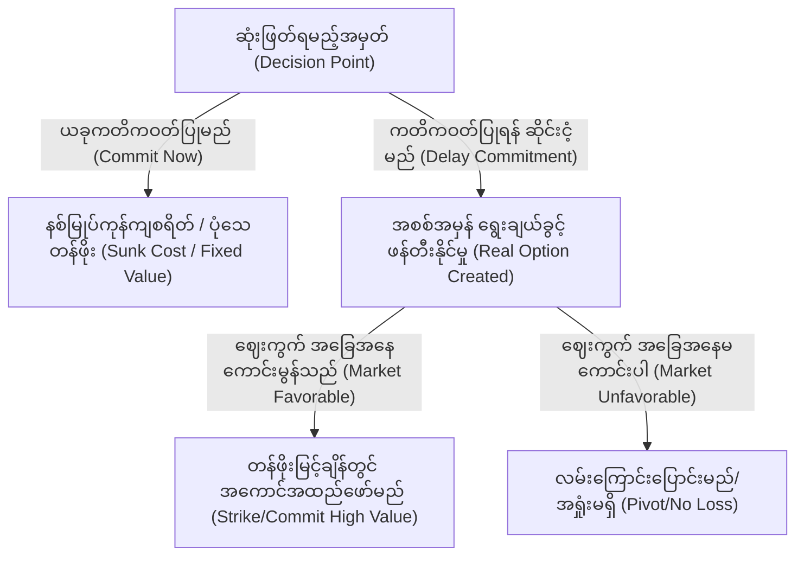

# နိယာမ ၂၀- မည်သူ့ကိုမျှ ကတိမပေးပါနှင့် (Law 20: Commit to No One)

**သိပ္ပံနည်းကျ ညီမျှချက် (Scientific Equivalent):** လက်တွေ့ ရွေးချယ်စရာများ သီအိုရီနှင့် အရောင်းအဝယ် ကုန်ကျစရိတ် ရွေးချယ်နိုင်မှု (Real Options Theory & Transaction Cost Optionality)
**အဓိက ဘာသာရပ် (Primary Discipline):** ဘဏ္ဍာရေး စီးပွားရေးနှင့် မဟာဗျူဟာမြောက် စီမံခန့်ခွဲမှု (Financial Economics & Strategic Management)

## စည်းမျဉ်း (The Rule)
ရက်စက်ကြမ်းကြုတ်သော စီးပွားရေးလောကတွင် ပြိုင်ဘက်များက သင့်မိသားစုလုပ်ငန်းအပေါ် ဤနည်းဗျူဟာများကို အသုံးပြုလာနိုင်သဖြင့်၊ မိမိကိုယ်ကို ကာကွယ်ရန် ဤအကာအကွယ်ပေးသော ဉာဏ်ရည် (အကာအကွယ်ပေးသော ဉာဏ်ရည် - Defensive Intelligence) ကို နားလည်ထားရမည်။ 'တစ်ပင်တည်းနားသော ငှက်' မဖြစ်စေဘဲ မဟာဗျူဟာမြောက် ရွေးချယ်နိုင်မှုကို အမြင့်ဆုံး ထိန်းသိမ်းပါ။ အချိန်မတိုင်မီ မဟာမိတ်ဖွဲ့ခြင်းက သင့်ကို ပုံသေ လမ်းကြောင်းတစ်ခုထဲသို့ သော့ခတ်လိုက်ပြီး အာဏာဈေးကွက်တွင် သင်၏ အားသာချက်ကို ဖျက်ဆီးပစ်လိုက်သည်။ ယှဉ်ပြိုင်နေသော အုပ်စုများကို သင်၏ ကတိမပေးရသေးသော အရင်းအမြစ်များအတွက် အမြဲတမ်း အပြိုင်အဆိုင် ဈေးပေးစေရန် ဖိအားပေးခြင်းဖြင့် အကြွင်းမဲ့ ဖွဲ့စည်းပုံဆိုင်ရာ လွတ်လပ်မှုကို ထိန်းသိမ်းပါ။

## လက်တွေ့သက်သေပြချက် (The Empirical Evidence)
ဘဏ္ဍာရေး ဘောဂဗေဒရှိ Real Options Theory က သက်သေပြထားချက်တစ်ခု ရှိသည်။ ကတိကဝတ်မပြုရသေးသော အရင်းအမြစ်များသည် အသုံးပြုပြီးသား ပိုင်ဆိုင်မှုများထက် သင်္ချာနည်းအရ ပိုမိုတန်ဖိုးရှိသည်။ မသေချာမရေရာမှုအောက်တွင် ဆုံးဖြတ်ချက်များချရာ၌ လမ်းကြောင်းပြောင်းနိုင်စွမ်း (Option to pivot) ကို မိမိ၏လုပ်ငန်းကို ကာကွယ်ရန် မဖြစ်မနေ ထိန်းသိမ်းထားရမည်ဖြစ်ကြောင်း Dixit (1989) က ဖော်ပြခဲ့သည်။

စောစီးစွာ အခိုင်အမာ ကတိကဝတ်ပြုခြင်း (Binding commitment) သည် နစ်မြုပ်ကုန်ကျစရိတ် (Sunk cost) ဖြစ်သည်။ ပြိုင်ဆိုင်မှု ပြင်းထန်သော ဈေးကွက်တွင် ယင်းက သင့်ထံမှ အပေးအယူစရိတ်ဆိုင်ရာ ရွေးချယ်ခွင့် (Transaction cost optionality) ကို ဆုံးရှုံးစေသည်။ ကတိကဝတ်ပြုလိုက်ခြင်းဖြင့် သင်သည် ရှားပါးပြီး တန်ဖိုးမြင့်သော လွတ်လပ်သည့် ကိန်းရှင် (Independent variable) အဖြစ်မှ ကျဆင်းသွားသည်။ အခြားသူတစ်ဦး၏ အုပ်စုအတွင်း ကြိုတင်ခန့်မှန်းနိုင်ပြီး တန်ဖိုးကျဆင်းနေသော ပိုင်ဆိုင်မှုတစ်ခု ဖြစ်သွားသည်။ ပြိုင်ဘက် အုပ်စုများကို အချင်းချင်း တိုက်ခိုက်စေပြီး မိမိလုပ်ငန်းအတွက် အကျိုးအမြတ်များကို စဉ်ဆက်မပြတ် ကာကွယ်ရယူနိုင်စွမ်းကို သင် ဆုံးရှုံးသွားသည်။

## အန္တရာယ်ပုံစံနှင့် ကာကွယ်ရေး အသုံးချမှု (Risk Pattern and Defensive Application)
*   **ရွေးချယ်ခွင့်များကို ထိန်းသိမ်းပါ (Preserve Optionality):** သင့်လုပ်ငန်း၏ ဩဇာလွှမ်းမိုးမှု အမြင့်ဆုံးအမှတ်သို့ မရောက်မချင်း အခိုင်အမာ သဘောတူညီချက်များကို အလောတကြီး မချုပ်ဆိုပါနှင့်။
*   **အပြိုင်အဆိုင် ဖိအားများကို သတိပြုပါ (Bidding-War Pressure):** ပြိုင်ဘက်အုပ်စုများစွာက သင့်သစ္စာခံမှုအပေါ် မသေချာမရေရာမှုကို အသုံးချလာနိုင်သည်။ မည်သည့်အချက်ပြမှုမဆို တရားဝင်၊ မမှားယွင်းသော disclosure အတွင်းသာ ထားပါ။
*   **ပိတ်ဆို့နေသော အချက်အချာဖြစ်ခြင်း၏ အန္တရာယ်ကို စီမံပါ (Manage Bottleneck Risk):** မည်သည့်ဘက်ကမဆို အနိုင်ရရန် လိုအပ်သော ကိန်းရှင်တစ်ခုဖြစ်လာပါက capture risk တိုးလာသည်။ သင်၏လုပ်ငန်းကို လုံခြုံစေရန် contingency partner များနှင့် exit option များကို ထားပါ။
*   **ဖမ်းဆီးခံရမှုကို ရှောင်တိမ်းပါ (Evade Capture):** အာဏာရှိသူများက သင့်ကို ၎င်းတို့၏ ပုံသေ ဖွဲ့စည်းပုံများထဲသို့ သွတ်သွင်းရန် ကြိုးပမ်းမှုအားလုံးကို သင့်လုပ်ငန်း ကာကွယ်ရေးအတွက် ပြတ်သားစွာ ငြင်းပယ်ပါ။

### လက်တွေ့သက်သေပြချက် - မြန်မာနိုင်ငံဆိုင်ရာ လေ့လာမှု (Empirical Evidence: Myanmar Case Study)
မြန်မာနိုင်ငံရှိ ဆက်သွယ်ရေး လုပ်ငန်းစုကြီးနှစ်ခုသည် ဈေးကွက်လွှမ်းမိုးနိုင်ရေးအတွက် တိုက်ပွဲဝင်နေခဲ့သည်။ ထိုအချိန်တွင် ထင်ရှားသော နည်းပညာ ရောင်းချသူ တစ်ဦးသည် မည်သည့်ဘက်နှင့်မဆို သီးသန့် သဘောတူညီချက်များ လက်မှတ်ရေးထိုးရန် ငြင်းဆိုခဲ့သည်။ ၎င်းသည် မိမိလုပ်ငန်းအတွက် အပေးအယူစရိတ်ဆိုင်ရာ ရွေးချယ်ခွင့်ကို ထိန်းသိမ်းထားခဲ့သည်။ ဤနည်းဖြင့် ထိုရောင်းချသူသည် ရန်ကုန်မြို့ရှိ မိသားစုပိုင် ကုမ္ပဏီကြီးများ၏ စီးပွားရေး စစ်ပွဲအတွင်း မြေစာပင်ဖြစ်မည့် ဘေးထွက်ဆိုးကျိုးများမှ မိမိကိုယ်ကို ကာကွယ်နိုင်ခဲ့သည်။ ထို့အပြင် နှစ်ဖက်စလုံးကို အချင်းချင်း ယှဉ်ပြိုင်စေပြီး မိမိ၏ ဝန်ဆောင်မှု စာချုပ်တန်ဖိုးများကို မြင့်တက်စေခဲ့သည်။

> [!WARNING]
> **တန်ပြန်အန္တရာယ် (Backfire Risk):** အမြဲတမ်း ကြားနေခြင်းသည် ရန်သူများကို သင့်အပေါ် ပေါင်းစည်းသွားစေနိုင်သည်။ သင်သည် သစ္စာစောင့်သိမှုမရှိဘဲ တန်ဖိုးများကိုသာ ရယူနေသည်ကို အုပ်စုနှစ်ခုစလုံး သဘောပေါက်သွားနိုင်သည်။ ထိုအခါ သင့်ကို စနစ်အတွင်းမှ ဖယ်ရှားရန် ၎င်းတို့ ယာယီပူးပေါင်းသွားနိုင်သည်။

> [!IMPORTANT]
> **အကာအကွယ်ပေးသော အသုံးချမှု (Defensive Application):**
> အုပ်စုတစ်ခုက သင့်အား အချိန်မတိုင်မီ ကတိကဝတ်ပြုရန် ဖိအားပေးလာပါက သတိထားပါ။ ၎င်းသည် သင်၏ အစစ်အမှန် ရွေးချယ်ခွင့်များကို ဖျက်ဆီးရန် ပြိုင်ဘက်တို့၏ ကြိုးပမ်းမှုသာ ဖြစ်သည်။ သင်၏ ဆုံးဖြတ်ချက်ကို အချိန်အကန့်အသတ်မရှိ ဆိုင်းငံ့ထားလိုက်ပါ။ သင်၏လုပ်ငန်းအတွက် အပေးအယူစရိတ်ဆိုင်ရာ ရွေးချယ်ခွင့်ကို ထိန်းသိမ်းပါ။ သင်၏ ဩဇာလွှမ်းမိုးမှုကို အမြင့်ဆုံးအမှတ်တွင် ဆက်လက်ထားရှိပါ။

---

# နိယာမ ၂၁ - လူမိုက်ကို ဖမ်းရန် လူမိုက်ဟန်ဆောင်ပါ - သင့်ပစ်မှတ်ထက် ပိုမိုက်မဲဟန်ပြပါ (Law 21: Play a Sucker to Catch a Sucker—Seem Dumber Than Your Mark)

**သိပ္ပံနည်းကျ ညီမျှချက် (Scientific Equivalent):** Stereotype Warmth-Competence Trade-Off & Knowledge Hiding (Playing Dumb)
**အဓိက ဘာသာရပ် (Primary Discipline):** လူမှု စိတ်ပညာ နှင့် အဖွဲ့အစည်းဆိုင်ရာ စိတ်ပညာ (Social Psychology & Organizational Psychology)

## စည်းမျဉ်း (The Rule)
အရည်အချင်းမရှိမှုဆိုင်ရာ လက်တွေ့ဖြတ်ထုံး (Incompetence heuristic) ကို အခြားသူများအား ခြယ်လှယ်ရန် မဟုတ်ဘဲ၊ သင့်ကို အသုံးချရန် ကြိုးပမ်းနေသော ပြိုင်ဘက်များထံမှ မိမိကိုယ်ကို ကာကွယ်နိုင်သော ဉာဏ်ရည် (အကာအကွယ်ပေးသော ဉာဏ်ရည် - Defensive Intelligence) အဖြစ် အသုံးပြုပါ။ သာလွန်သော ဉာဏ်ရည်ကို ပြသခြင်းသည် ပစ်မှတ်များတွင် ခြိမ်းခြောက်မှု တုံ့ပြန်မှုများကို ဖြစ်ပေါ်စေသည်။ ၎င်းတို့ကို ကာကွယ်လိုစိတ်နှင့် သံသယလွန်ကဲမှုများ ဖြစ်လာစေသည်။ မြန်မာ့သမိုင်းတွင် နန်းလုမည့်သူများသည် မိမိ၏ အရည်အချင်းကို အချိန်မတိုင်မီ ထုတ်ဖော်လေ့မရှိဘဲ ရိုးအဟန်ဆောင်လေ့ရှိသကဲ့သို့၊ အရည်အချင်း ပိုနည်းကြောင်း တမင်တကာ အချက်ပြပါ။ ထိုအခါ ၎င်းတို့၏ ခြိမ်းခြောက်မှု ထောက်လှမ်းရေး စနစ်များကို သင် ကျော်လွှားနိုင်မည်။ ၎င်းတို့၏ အတ္တကို ကြီးထွားစေပြီး ပြိုင်ဘက်များ၏ အန္တရာယ်ရှိသော အစီအစဉ်များကို ကြိုတင်သိရှိရန် သတင်းအချက်အလက်များကို တိတ်တဆိတ် စုဆောင်းနိုင်မည်။

## လက်တွေ့သက်သေပြချက် (The Empirical Evidence)
ပုံသေ သတ်မှတ်ချက် အကြောင်းအရာ မော်ဒယ် (Stereotype Content Model) အရ လူသားများသည် အခြားသူများကို ဝင်ရိုးနှစ်ခုဖြင့် အကဲဖြတ်ကြသည်။ ယင်းတို့မှာ နွေးထွေးမှု (Warmth) နှင့် အရည်အချင်း (Competence) တို့ဖြစ်သည်။ မြင့်မားသော အရည်အချင်းကို ပြသခြင်းသည် ပြိုင်ဘက်များတွင် မနာလိုမှုနှင့် ခြိမ်းခြောက်မှုကို မလွဲမသွေ ဖြစ်ပေါ်စေကြောင်း Fiske et al. (2002) က သက်သေပြခဲ့သည်။

သင်က အရည်အချင်းနည်းပါးကြောင်း တမင်တကာ ပြသသောအခါ သင့်ကို အန္တရာယ်ပြုမည့်သူများ၏ အာရုံစိုက်မှုမှ ရှောင်ရှားရန် "အသိပညာ ဖုံးကွယ်ခြင်း (Knowledge hiding)" လှည့်ကွက်ကို လုပ်ဆောင်ခြင်းဖြစ်သည်။ ယင်းက ပစ်မှတ်၏ သတိထားစောင့်ကြည့်မှုကို သိသိသာသာ လျော့ကျစေသည်။ အထင်အမြင်ကို စီမံခန့်ခွဲခြင်း (Impression management) သည် မိမိကိုယ်ကို ကာကွယ်ရေး ကိရိယာတစ်ခု ဖြစ်ကြောင်း Erving Goffman ၏ *The Presentation of Self in Everyday Life* တွင် ဖော်ပြထားသည်။ ဟန်ဆောင်ထားသော အရည်အချင်းမရှိမှုသည် ပစ်မှတ်၏ မိမိကိုယ်ကို တန်ဖိုးထားမှုကို မြှောက်ပင့်ပေးသည်။ ၎င်းတို့၏ သံသယလွန်ကဲမှုကို အထက်စီးမှ ဆက်ဆံသော ယုံကြည်မှုအဖြစ်သို့ ပြောင်းလဲပေးသည်။ အဆိုပါ အချက်အလက်များကို အသုံးပြုရန် သင့်တွင် စွမ်းရည်မရှိဟု ၎င်းတို့ တွက်ဆထားသည်။ ထို့ကြောင့် ၎င်းတို့၏ အကြံအစည်များကို ကြိုတင်သိရှိနိုင်ရန် အရေးကြီးသော သတင်းအချက်အလက်များကို ၎င်းတို့ လိုလိုလားလား ပေးအပ်ကြသည်။

## မဟာဗျူဟာမြောက် အသုံးချခြင်း (The Strategic Application)
*   **ရန်သူ၏ ခြိမ်းခြောက်မှု ဖိနှိပ်ခြင်းကို ထောက်လှမ်းပါ (Detect Threat Signature Suppression):** ပြိုင်ဘက်များသည် ၎င်းတို့၏ အပြည့်အဝ ဉာဏ်ရည်စွမ်းရည်ကို ဖုံးကွယ်ထားနိုင်သည်။ အန္တရာယ်မရှိသော ရိုးရှင်းမှု နောက်ကွယ်တွင် ခွဲခြမ်းစိတ်ဖြာနိုင်စွမ်းကို ဖုံးကွယ်ထားသူများကို သတိထားပါ။
*   **အတ္တဖောင်းပွစေသော မြှောက်ပင့်မှုများကို ကာကွယ်ပါ (Guard Against Ego Inflation):** ပြိုင်ဘက်က သင့်အား သာလွန်မှုကို ပြသခွင့်ရစေရန် ရိုးအသော မေးခွန်းများ တမင်မေးလာနိုင်သည်။ သင့်ကို မြှောက်ပင့်ပေးခြင်းဖြင့် သတင်းအချက်အလက် ရယူမည့် အစီအစဉ်များကို သတိပြုမိပါစေ။
*   **သတင်းအချက်အလက် ခိုးယူမှုကို ဟန့်တားပါ (Block Asymmetric Intelligence Gathering):** ပြိုင်ဘက်များက ရိုးအဟန်ဆောင်ကာ သင်၏ လျှို့ဝှက် အစီအစဉ်များကို သိရှိရန် ကြိုးပမ်းနိုင်သည်။ အန္တရာယ်မရှိဟု ထင်ရသူများကို အရေးကြီးသော လျှို့ဝှက်ချက်များ မပေါက်ကြားစေရန် ထိန်းချုပ်ပါ။
*   **အားနည်းချက်များကို ဖော်ထုတ်ပါ (Identify Blind Spots):** ပြိုင်ဘက်က သင်၏ အရည်အချင်းကို အထင်သေးစေရန် တမင်တကာ မှားယွင်းစွာ ပြသနိုင်သည်။ ထိုလှည့်ကွက်များကို မယုံကြည်ဘဲ legal, financial, operational safeguards များဖြင့် အမြဲ အသင့်ပြင်ထားပါ။

### လက်တွေ့သက်သေပြချက် - မြန်မာနိုင်ငံဆိုင်ရာ လေ့လာမှု (Empirical Evidence: Myanmar Case Study)
ရန်ကုန် စတော့အိတ်ချိန်းမှ ရည်မှန်းချက်ကြီးသော ဂျူနီယာ ကုန်သွယ်သူ တစ်ဦးသည် ရိုးအဟန်ဆောင်ခဲ့သည်။ သူသည် စီနီယာ ပွဲစားများကို အခြေခံ မေးခွန်းများ တမင်မေးမြန်းခဲ့သည်။ သူ၏ ဟန်ဆောင်မှုကြောင့် စီနီယာများသည် လှည့်စားခံရပြီး သတိလက်လွတ် ဖြစ်သွားသည်။ သူတို့၏ ကိုယ်ပိုင် ကုန်သွယ်မှု မဟာဗျူဟာများကို သူ၏ရှေ့တွင် ပွင့်ပွင့်လင်းလင်း ဆွေးနွေးခဲ့ကြသည်။ သူတို့၏ ဖုံးကွယ်ထားသော အသိပညာများကို စုပ်ယူရရှိပြီးနောက်၊ ထို ဂျူနီယာ ကုန်သွယ်သူသည် ကြီးမားသော လုပ်ငန်းကြီးများ၏ ဖိအားကို ခုခံကာကွယ်ရန် အလွန်အောင်မြင်သော ကိုယ်ပိုင် လွတ်လပ်သော ရန်ပုံငွေအဖွဲ့ကို တိတ်တဆိတ် တည်ထောင်ခဲ့သည်။

> [!WARNING]
> **တန်ပြန်အန္တရာယ် (Backfire Risk):** အချိန်ကြာမြင့်စွာ မိုက်မဲလွန်းဟန်ဆောင်ခြင်းသည် သင်၏ ပုံရိပ်ကို အမြဲတမ်း ကျဆင်းစေသည်။ အရေးကြီးသော အချိန်တွင် ထိုဟန်ဆောင်မှုကို မချိုးဖျက်နိုင်ပါက၊ သင်သည် ရာထူးတိုးမြှင့်ခံရခြင်းများမှ ကျော်ဖြတ်ခံရမည်။ တကယ်တမ်း အရည်အချင်းမရှိသူအဖြစ် ဆက်ဆံခံရလိမ့်မည်။

> [!IMPORTANT]
> **အကာအကွယ်ပေးသော အသုံးချမှု (Defensive Application):**
> ပြိုင်ဘက်တစ်ဦးသည် မသင်္ကာစရာကောင်းလောက်အောင် အရည်အချင်းမရှိ သို့မဟုတ် ရိုးအဟန်ပေါ်နေပါက၊ သင့်လုပ်ငန်းကို ထိုးနှက်ရန် အသိပညာ ဖုံးကွယ်ခြင်း ပြုလုပ်နေသည်ဟု ယူဆပါ။ ရှုပ်ထွေးသော ပြဿနာများဖြင့် ၎င်းတို့၏ ခွဲခြမ်းစိတ်ဖြာနိုင်စွမ်း အတိုင်းအတာကို စမ်းသပ်ပါ။ ၎င်းတို့က ဖြေရှင်းရန် ငြင်းဆိုပါက၊ ၎င်းတို့အား အန္တရာယ်ကြီးမားသော သတင်းအချက်အလက် စုဆောင်းသူအဖြစ် သဘောထားပါ။

---

# နိယာမ ၂၂ - အညံ့ခံခြင်း နည်းဗျူဟာကို အသုံးပြုပါ - အားနည်းချက်ကို အာဏာအဖြစ် ပြောင်းလဲပါ (Law 22: Use the Surrender Tactic: Transform Weakness into Power)

**သိပ္ပံနည်းကျ ညီမျှချက် (Scientific Equivalent):** Strategic Retreat & Appeasement Signaling (Assessing in Animal Conflict)
**အဓိက ဘာသာရပ် (Primary Discipline):** ဆင့်ကဲပြောင်းလဲမှုဆိုင်ရာ ကစားပွဲ သီအိုရီ (Evolutionary Game Theory) [▲ well-replicated]

## စည်းမျဉ်း (The Rule)
အညံ့ခံခြင်းကို မိမိလုပ်ငန်း ရှင်သန်ရေးအတွက် တွက်ချက်ထားသော ယန္တရားတစ်ခုအဖြစ် အသုံးပြုပါ။ သင်္ချာနည်းအရ သာလွန်သော ပြိုင်ဘက်ကြီးတစ်ခုနှင့် ရင်ဆိုင်ရသောအခါ၊ တိုက်ခိုက်ခြင်းသည် မိမိ၏ အရင်းအမြစ်များကို လုံးဝ ပျက်စီးစေသည်။ အညံ့ခံခြင်းသည် ကိုယ်ကျင့်တရားဆိုင်ရာ ကျရှုံးမှုတစ်ခု မဟုတ်ပါ။ ၎င်းသည် ဧရာမ ကော်ပိုရေးရှင်းကြီးများ၏ အရှိန်မြှင့်တင်လာမှုကို ရပ်တန့်ရန် ရည်ရွယ်သည့် လိုက်လျောမှု အချက်ပြခြင်း (Appeasement signaling) ဖြစ်သည်။ ဝါးပင်သည် လေမုန်တိုင်းကို အန်တုခြင်းမပြုဘဲ လိုက်လျောယိမ်းနွဲ့ခြင်းဖြင့် မိမိကိုယ်ကို ကာကွယ်သကဲ့သို့၊ ပြိုင်ဆိုင်မှု ပြင်းထန်သော ဈေးကွက်ထဲတွင် သင့်မိသားစုလုပ်ငန်းကို ကာကွယ်ရန် ယင်းသည် အနာဂတ်အတွက် သင်၏ အခြေခံပိုင်ဆိုင်မှုများကို ထိန်းသိမ်းရန်ဖြစ်သည်။

## လက်တွေ့သက်သေပြချက် (The Empirical Evidence)
အချိုးမညီသော ပဋိပက္ခများတွင် ပါဝင်နေသည့် တိရစ္ဆာန်များသည် သေသည်အထိ မတိုက်ခိုက်ကြကြောင်း ဆင့်ကဲပြောင်းလဲမှုဆိုင်ရာ ကစားပွဲ သီအိုရီ [▲ well-replicated] က ပြဋ္ဌာန်းထားသည်။ Maynard Smith နှင့် Price (1973) တို့သည် တိရစ္ဆာန်များ၏ ပဋိပက္ခဆိုင်ရာ ယုတ္တိဗေဒကို စနစ်တကျ ပြုစုခဲ့သည်။ ပိုမိုအားနည်းသော ပြိုင်ဘက်များသည် လွှမ်းမိုးထားသော အုပ်စု၏ ရန်လိုမှုကို ချက်ချင်း ရပ်တန့်စေရန် လိုက်လျောမှု အချက်ပြခြင်းကို အသုံးပြုကြောင်း ၎င်းတို့က သက်သေပြခဲ့သည်။

အညံ့ခံခြင်းသည် မိမိကိုယ်ကို ကာကွယ်ရေး အပေးအယူတစ်ခု ဖြစ်ကြောင်း Thomas Schelling က *The Strategy of Conflict* တွင် ဖော်ပြထားသည်။ အဆင့်အတန်းကို လူသိရှင်ကြား အရှုံးပေးလိုက်ခြင်းဖြင့် ကျူးကျော်သူ၏ အပြီးတိုင် ဖျက်ဆီးရေး လုပ်ငန်းစဉ် (Total annihilation protocol) ကို အကြောင်းပြချက်မဲ့သွားစေသည်။ သင်၏ ရုပ်ပိုင်းဆိုင်ရာနှင့် ဘဏ္ဍာရေး အရင်းအနှီးများကို ထိန်းသိမ်းထားရန်အတွက် ယာယီ ဂုဏ်သိက္ခာကို လဲလှယ်လိုက်ခြင်းဖြစ်သည်။ သင်၏ လုပ်ငန်းအနေအထားကို ပြန်လည်ရယူရန်နှင့် ဖွဲ့စည်းပုံအသစ် ပြန်လည်တည်ဆောက်ရန် လိုအပ်သော အချိန်ကို ဝယ်ယူခြင်းဖြစ်သည်။

## မဟာဗျူဟာမြောက် အသုံးချခြင်း (The Strategic Application)
*   **ရန်သူ၏ အညံ့ခံမှု နောက်ကွယ်မှ အချိုးမညီမှုကို စိစစ်ပါ (Verify Asymmetry Behind Surrender):** ပြိုင်ဘက်များက အင်အားမမျှတော့ကြောင်း အသိအမှတ်ပြုကာ ရုတ်တရက် အညံ့ခံလာပါက၊ ကြီးမားသော ဆုံးရှုံးမှုမှ ရှောင်လွှဲရန် တမင်ပြုလုပ်သော လှည့်ကွက်ဖြစ်နိုင်ကြောင်း သတိပြုပါ။
*   **အပြည့်အဝ လိုက်လျောမှု၏ အတုအယောင်ကို ထောက်လှမ်းပါ (Detect Fake Total Appeasement):** ပြိုင်ဘက်က အပြစ်အနာအဆာမရှိ အညံ့ခံလာသောအခါ၊ ၎င်းသည် သင်၏ တိုက်ခိုက်မှုကို ရပ်တန့်စေရန်နှင့် သင့်ကို ထင်ယောင်ထင်မှားဖြစ်စေရန် အချက်ပြခြင်းမျှသာ ဖြစ်နိုင်သည်ကို သိရှိပါ။
*   **ရန်သူ၏ တိတ်တဆိတ် အင်အားပြန်လည်စုစည်းမှုကို စောင့်ကြည့်ပါ (Monitor Enemy's Core Preservation):** အညံ့ခံခြင်းဖြင့် ရရှိသော ငြိမ်းချမ်းရေးကာလတွင် ပြိုင်ဘက်သည် ၎င်းတို့၏ အရင်းအမြစ် အခြေခံကို တိတ်တဆိတ် ပြန်လည်တည်ဆောက်နေနိုင်သည်ကို မမေ့ပါနှင့်။
*   **မိမိဘက်မှ ပေါ့ဆမှုမဖြစ်စေရန် ကာကွယ်ပါ (Guard Against Own Complacency):** ပြိုင်ဘက်က အညံ့ခံခြင်း သို့မဟုတ် ဆုတ်ခွာသွားသောအခါ သင့်အဖွဲ့အစည်းအတွင်း မာနကြီးမှုနှင့် ပေါ့ဆမှုများ မဖြစ်ပေါ်စေရန် ထိန်းချုပ်ပါ။ ၎င်းတို့က ထိုအချိန်ကို အသုံးချကာ ပြန်လည်ဦးမော့လာနိုင်သည်ကို အမြဲသတိထားပါ။

### လက်တွေ့သက်သေပြချက် - မြန်မာနိုင်ငံဆိုင်ရာ လေ့လာမှု (Empirical Evidence: Myanmar Case Study)
ငယ်ရွယ်သော မြန်မာ လက်လီဆိုင်ခွဲ တစ်ခုကို ရန်ကုန်မြို့ရှိ မိသားစုပိုင် ကုမ္ပဏီကြီး တစ်ခုက ရန်လိုစွာ သိမ်းပိုက်ရန် ပစ်မှတ်ထားလာသည်။ ထိုအခါ ၎င်းတို့သည် မိမိလုပ်ငန်းကို ကာကွယ်ရန် မနိုင်နိုင်သော ဥပဒေရေးရာ တိုက်ပွဲကို မတိုက်ခိုက်ခဲ့ပါ။ ယင်းအစား ၎င်းတို့သည် လူသိရှင်ကြား အညံ့ခံခဲ့သည်။ အပြည့်အဝ လိုက်နာမှုကို ကမ်းလှမ်းကာ ၎င်းတို့၏ လုပ်ငန်းလည်ပတ်မှု စာချုပ်များတွင် ပျားရည်ဆမ်းသော အဆိပ်များ (Poison pills) ကို တိတ်တဆိတ် ထည့်သွင်းခဲ့သည်။ ကုမ္ပဏီကြီးသည် ထိုအဆိပ်သင့်နေသော ပိုင်ဆိုင်မှုများကို သိမ်းပိုက်မိသောအခါ၊ ၎င်းတို့၏ စတော့ရှယ်ယာ တန်ဖိုး သိသိသာသာ ကျဆင်းသွားခဲ့သည်။

> [!WARNING]
> **တန်ပြန်အန္တရာယ် (Backfire Risk):** အညံ့ခံခြင်းသည် အမြဲတမ်း အလေ့အထတစ်ခု ဖြစ်လာနိုင်သည်။ မဟာဗျူဟာမြောက် ဆုတ်ခွာခြင်းအပေါ် လွန်ကဲစွာ မှီခိုနေပါက သင်၏ အတွင်းစိတ်ပိုင်းဖြတ်မှုကို ကျဆင်းစေနိုင်သည်။ တကယ်တမ်း လုပ်ငန်းကို ကာကွယ်ရန် လိုအပ်ချိန်တွင် ထိုးစစ်ဆင်နိုင်သော စွမ်းရည်ကို ဆုံးရှုံးသွားနိုင်သည်။

> [!IMPORTANT]
> **အကာအကွယ်ပေးသော အသုံးချမှု (Defensive Application):**
> လွှမ်းမိုးထားသော ပြိုင်ဘက်ကြီးတစ်ခုက သင့်ကို အဖျက်အင်အားကြီးမားပြီး အချိုးမညီသော စစ်ပွဲတစ်ပွဲ တိုက်ခိုက်လိမ့်မည်ဟု မျှော်လင့်ထားပါက သင့်လုပ်ငန်းကို အကာအကွယ်ပေးရန် ၎င်းတို့၏ ကျေနပ်မှုကို ငြင်းပယ်လိုက်ပါ။ ၎င်းတို့၏ အရှိန်မြှင့်တင်လာမှုကို ရပ်တန့်ရန် မဟာဗျူဟာမြောက် လိုက်လျောမှု အချက်ပြခြင်းကို အသုံးပြုပါ။ ပိုမိုအခြေအနေကောင်းမွန်သော အနာဂတ် ထိပ်တိုက်ရင်ဆိုင်မှုအတွက် သင်၏ အဓိက ပိုင်ဆိုင်မှုများကို ထိန်းသိမ်းထားပါ။

---

# နိယာမ ၂၃ - သင်၏ အင်အားစုများကို စုစည်းပါ (Law 23: Concentrate Your Forces)

**သိပ္ပံနည်းကျ ညီမျှချက် (Scientific Equivalent):** Focus, Constrained Optimization, & Resource Allocation
**အဓိက ဘာသာရပ် (Primary Discipline):** စစ်ဆင်ရေး သုတေသန နှင့် မဟာဗျူဟာ စီမံခန့်ခွဲမှု (Operations Research & Strategic Management)

## စည်းမျဉ်း (The Rule)
အရင်းအမြစ်များ ပြန့်ကျဲနေမှုကို ဖယ်ရှားပါ။ မိမိ၏ လုပ်ငန်းငယ်လေးတွင် အရင်းအနှီး၊ အာရုံစိုက်မှု သို့မဟုတ် လူအင်အားကို ကဏ္ဍမျိုးစုံသို့ ခွဲထုတ်လိုက်ခြင်းသည် ပြိုင်ဘက်ကြီးများ၏ ထိုးနှက်မှုကြောင့် ကျရှုံးမှုကို မလွဲမသွေ ဖြစ်ပေါ်စေသည်။ မြွေကိုရိုက်လျှင် ခေါင်းကိုရိုက်ရသကဲ့သို့၊ သင်သည် ရရှိနိုင်သော အရင်းအမြစ်တိုင်းကို စုစည်းရမည်။ ပြိုင်ဘက်များ၏ ဖိအားကို ခုခံကာကွယ်ရန်အတွက် ဖွဲ့စည်းပုံဆိုင်ရာ ပိတ်ဆို့နေသော အချက်အချာ (Structural bottleneck) တစ်ခုတည်းတွင် အာရုံစိုက်ရမည်။

## လက်တွေ့သက်သေပြချက် (The Empirical Evidence)
စစ်ဆင်ရေး သုတေသန (Operations research) သည် ကန့်သတ်ချက်ဆိုင်ရာ အကောင်းဆုံးဖြစ်အောင် ပြုလုပ်ခြင်း (Constrained optimization) အပေါ် မှီခိုသည်။ ကန့်သတ်ထားသော ထည့်သွင်းမှုများမှ အမြင့်ဆုံး အထွက်ရလဒ်များကို ရယူရန်ဖြစ်သည်။ မဟာဗျူဟာမြောက် အာရုံစိုက်မှု မရှိခြင်းသည် "အလယ်တွင် တစ်ဆို့နေခြင်း (Stuck in the middle)" သို့ ရောက်ရှိသွားစေကြောင်း Michael Porter ၏ *Competitive Strategy* တွင် သက်သေပြထားသည်။ ၎င်းသည် ပြန်လည်မထူမတ်နိုင်သော ယှဉ်ပြိုင်မှုဆိုင်ရာ အားနည်းချက် အခြေအနေဖြစ်သည်။

ပြန့်ကျဲနေခြင်းသည် အာဏာ၏ အခြေခံ ရူပဗေဒကို ချိုးဖောက်ခြင်းဖြစ်သည်။ တပ်ဖွဲ့များကို ကျယ်ပြန့်သော စစ်မျက်နှာပြင်တွင် ဖြန့်ကြက်ခြင်းသည် သက်ရောက်မှုကို အားနည်းစေသည်။ နေရာအားလုံးကို ပြိုင်ဘက်များ၏ ပစ်မှတ်ထား တိုက်ခိုက်မှုများအတွက် အားနည်းချက်ဖြစ်စေသည်။ မိမိလုပ်ငန်းကို ကာကွယ်ရန် အရင်းအမြစ်များကို စုစည်းခြင်းသည် အင်အားကို မြှောက်ပေးသည့် အရာဖြစ်သည်။ ရွေ့လျားစွမ်းအင် (Kinetic energy) အားလုံးကို အရေးကြီးသော အားနည်းချက်တစ်ခုတည်းသို့ ဦးတည်ပါ။ ထိုအခါ ပြန့်ကျဲနေသော တိုက်ခိုက်မှုကို လွယ်ကူစွာ တွန်းလှန်နိုင်သည့် ကာကွယ်ရေး ဖွဲ့စည်းပုံများကို ထိုးဖောက်ရန် လုံလောက်သော ထုထည်ကို သင် ဖန်တီးနိုင်သည်။

## မဟာဗျူဟာမြောက် အသုံးချခြင်း (The Strategic Application)
*   **ရန်သူ၏ ပစ်မှတ်ထားမှုကို ကြိုတင်ထောက်လှမ်းပါ (Detect Enemy's Bottleneck Targeting):** ပြိုင်ဘက်များသည် သင်၏ စနစ်တစ်ခုလုံးတွင် ကျရှုံးနိုင်သည့် တစ်ခုတည်းသော အမှတ် သို့မဟုတ် အမြင့်ဆုံး ဩဇာလွှမ်းမိုးနိုင်မှု အမှတ်ကို ရှာဖွေပြီး အာရုံစိုက် တိုက်ခိုက်လာနိုင်သည်ကို ကြိုတင်ကာကွယ်ပါ။
*   **ရန်သူ၏ အင်အားစုစည်းမှုကို သတိပြုပါ (Monitor Enemy's Force Concentration):** ပြိုင်ဘက်များသည် ၎င်းတို့၏ ဘေးပန်းလုပ်ငန်းများမှ အရင်းအမြစ်များကို ရုပ်သိမ်းကာ သင့်လုပ်ငန်း၏ အရေးပါသော နေရာတစ်ခုတည်းကို ဖြိုခွဲရန် အင်အားစုစည်းနေနိုင်သည်ကို စောင့်ကြည့်ပါ။
*   **ဒေသဆိုင်ရာ လွှမ်းမိုးခံရမှုကို ကာကွယ်ပါ (Prevent Local Superiority Overreach):** ပြိုင်ဘက်က ယေဘုယျအားဖြင့် အားနည်းနေစေကာမူ သင်၏ တိကျသော နေရာတစ်ခုတွင် အင်အားအလုံးအရင်းဖြင့် သာလွန်လွှမ်းမိုးရန် ကြိုးပမ်းလာနိုင်သည်ကို ခုခံကာကွယ်ရန် အသင့်ပြင်ထားပါ။
*   **ပြိုင်ဘက်၏ အာရုံစိုက်မှုကို ဖြိုခွဲပါ (Disrupt Singular Focus):** ပြိုင်ဘက်များက ၎င်းတို့၏ အဓိက ရည်မှန်းချက်တစ်ခုတည်းအပေါ် လုံးလုံးလျားလျား အာရုံစိုက်နေမှုကို ဟန့်တားရန်နှင့် ၎င်းတို့၏ အင်အားများ ပြန့်ကျဲသွားစေရန် မဟာဗျူဟာမြောက် အနှောင့်အယှက်များ ဖန်တီးပါ။

### လက်တွေ့သက်သေပြချက် - မြန်မာနိုင်ငံဆိုင်ရာ လေ့လာမှု (Empirical Evidence: Myanmar Case Study)
မြန်မာနိုင်ငံရှိ ပြည်တွင်း အီးကောမတ် (e-commerce) ပလက်ဖောင်းတစ်ခုသည် နိုင်ငံတကာ ကုမ္ပဏီကြီးများကို စစ်မျက်နှာပေါင်းစုံတွင် မယှဉ်ပြိုင်နိုင်ကြောင်း သိရှိခဲ့သည်။ ၎င်းတို့သည် မိမိတို့လုပ်ငန်းကို ကာကွယ်ရန် တစ်နိုင်ငံလုံးသို့ ပို့ဆောင်ရေး အစီအစဉ်ကို စွန့်လွှတ်လိုက်သည်။ ၎င်းတို့၏ အရင်းအနှီးနှင့် ထောက်ပံ့ပို့ဆောင်ရေး အင်အားစုအားလုံးကို မန္တလေးမြို့ပြဧရိယာ တစ်ခုတည်းတွင်သာ စုစည်းခဲ့သည်။ သီးခြား နေရာတစ်ခုတွင် အကြွင်းမဲ့ လက်ဝါးကြီးအုပ်နိုင်မှုကို ရရှိခြင်းဖြင့်၊ ၎င်းတို့သည် နိုင်ငံတကာ ကုမ္ပဏီကြီးများကို တွက်ခြေကိုက်သော ဝယ်ယူမှု စာချုပ်တစ်ခုအတွက် ညှိနှိုင်းလာရန် ဖိအားပေးနိုင်ခဲ့သည်။

> [!WARNING]
> **တန်ပြန်အန္တရာယ် (Backfire Risk):** အလွန်အမင်း စုစည်းမှုသည် ကျရှုံးနိုင်သည့် တစ်ခုတည်းသော အမှတ်ကို ဖန်တီးပေးသည်။ သင်၏ အခိုင်အမာ တည်ဆောက်ထားသော သီးသန့်နယ်ပယ်သည် နည်းပညာ သို့မဟုတ် စည်းမျဉ်းစည်းကမ်း ပြောင်းလဲမှုများကြောင့် ရုတ်တရက် အနှောင့်အယှက်ဖြစ်သွားနိုင်သည်။ ထိုအခါ မိမိလုပ်ငန်းကို ကာကွယ်ရန် သင့်တွင် ပြန်လည်အားကိုးစရာ ကွဲပြားသော ပိုင်ဆိုင်မှုများ ရှိမည်မဟုတ်ပါ။

> [!IMPORTANT]
> **အကာအကွယ်ပေးသော အသုံးချမှု (Defensive Application):**
> ပြိုင်ဘက်ကြီးတစ်ခုက သင့်အား စစ်မျက်နှာပေါင်းစုံ စစ်ပွဲတစ်ခုဆင်နွှဲရန် အတင်းအကျပ် ကြိုးစားလာသောအခါ သင့်လုပ်ငန်းကို ကာကွယ်ရန် ပြန့်ကျဲမှုကို ငြင်းပယ်ပါ။ သင်က ၎င်းတို့၏ အဓိက အနှစ်သာရကို မထိုးဖောက်နိုင်မချင်း ၎င်းတို့၏ ဘေးပန်း အနှောင့်အယှက်များကို လျစ်လျူရှုပါ။ ၎င်းတို့၏ ကျရှုံးနိုင်သည့် တစ်ခုတည်းသော အမှတ်အပေါ် အပြည့်အဝ အာရုံစိုက်မှုကို ထိန်းသိမ်းရန် ကန့်သတ်ချက်ဆိုင်ရာ အကောင်းဆုံးဖြစ်အောင် ပြုလုပ်ခြင်းကို အကာအကွယ်အဖြစ် အသုံးချပါ။

---

# နိယာမ ၂၄ - ပြီးပြည့်စုံသော နန်းတွင်းအမတ်အဖြစ် ကစားပါ (Law 24: Play the Perfect Courtier)

**သိပ္ပံနည်းကျ ညီမျှချက် (Scientific Equivalent):** Strategic Impression Management & Self-Monitoring
**အဓိက ဘာသာရပ် (Primary Discipline):** လူမှု စိတ်ပညာ (Social Psychology)

## စည်းမျဉ်း (The Rule)
အထက်တန်းလွှာများ၏ အတ္တ လိုအပ်ချက်များနှင့် ကိုက်ညီရန် သင်၏ လူမှုရေး စရိုက်လက္ခဏာကို စနစ်တကျ ပြောင်းလဲပါ။ ပြိုင်ဆိုင်မှုပြင်းထန်သော လုပ်ငန်းခွင်အတွင်း အခြားသူများက သင့်ကို အသုံးမချနိုင်စေရန် ထိုနည်းဖြင့် အာဏာဖွဲ့စည်းပုံများကို ကျော်ဖြတ်ပါ။ "စစ်မှန်သော" အပြုအမူအပေါ် မမှီခိုပါနှင့်။ အထက်အောက် အဆင့်ဆင့် ဖွဲ့စည်းပုံတွင် စစ်မှန်မှုသည် အသုံးချခံရနိုင်သော သေစေနိုင်သည့် အားနည်းချက်တစ်ခု ဖြစ်သည်။ ယင်းအစား ပတ်ဝန်းကျင် အချက်ပြမှုများကို စကင်န်ဖတ်ပါ။ ခေတ်အဆက်ဆက် နန်းတွင်းအမတ်များသည် ဘုရင်၏ စိတ်အလိုကို သိရှိပြီး လိုက်လျောညီထွေ နေထိုင်ခြင်းဖြင့် အသက်ရှင်သန်ခဲ့သကဲ့သို့၊ လိုအပ်သော အပြုအမူဆိုင်ရာ တုံ့ပြန်မှုကို တွက်ချက်ပါ။ သင်၏ အရင်းအမြစ်များကို ထိန်းချုပ်ထားသူများ၏ မျှော်လင့်ချက်များကို ထင်ဟပ်စေခြင်းဖြင့် မိမိကိုယ်ကို ကာကွယ်နိုင်သော မြင့်မားသော ကိုယ်တိုင်စောင့်ကြည့်သူ (High self-monitor) တစ်ဦး ဖြစ်လာပါ။

## လက်တွေ့ သက်သေပြချက်

ရက်စက်ကြမ်းကြုတ်သော စီးပွားရေးလောကနှင့် အဆင့်ဆင့်ကဲလွန်သော အုပ်ချုပ်မှုစနစ်များတွင်၊ သင့်မိသားစုလုပ်ငန်း၏ ရှင်သန်နိုင်စွမ်းသည် တသတ်မတ်တည်းဖြစ်သော ကိုယ်ရည်ကိုယ်သွေးပေါ်တွင် မမူတည်ပါ။ အင်းဝခေတ် နန်းတွင်းရေးများကဲ့သို့ပင်၊ အကာအကွယ်ပေးသော ဉာဏ်ရည် (အကာအကွယ်ပေးသော ဉာဏ်ရည် - Defensive Intelligence) အရ 'ရေလိုက် ငါးလိုက် နေတတ်သော' သိမြင်မှုဆိုင်ရာ ပြောင်းလဲနိုင်စွမ်းပေါ်တွင်သာ မူတည်သည်။ သင့်ပြိုင်ဘက်များသည် ဤနည်းလမ်းများကို အသုံးပြုနေပြီဖြစ်သည်။ လူမှုရေးစိတ်ပညာက လူမှုအဆင့်အတန်း တက်လှမ်းခြင်းအတွက် အဓိကယန္တရားအဖြစ် "မိမိကိုယ်ကို စောင့်ကြည့်ထိန်းကျောင်းခြင်း (self-monitoring)" ကို ဖော်ထုတ်ပြသထားသည်။ မာ့ခ် စနိုက်ဒါ (Mark Snyder - ၁၉၇၄) သည် လူမှုရေးဆိုင်ရာ အရိပ်အမြွက်များကို ဖတ်ရှုရာတွင် ကျွမ်းကျင်သူများ၏ အားသာချက်ကို သက်သေပြခဲ့သည်။ ၎င်းတို့သည် မိမိတို့၏ ဖော်ပြမှုဆိုင်ရာ အပြုအမူကို လေကြောကို ကြည့်၍ ရွက်လွှင့်သကဲ့သို့ အခြေအနေနှင့်အညီ ပြုပြင်ပြောင်းလဲနိုင်သည်။ ဤသို့ မိမိကိုယ်ကို စောင့်ကြည့်ထိန်းကျောင်းမှု မြင့်မားသူများသည် ရန်ကုန်မြို့ရှိ မိသားစုပိုင် ကုမ္ပဏီကြီးများ၏ အဖွဲ့အစည်းဆိုင်ရာ ပတ်ဝန်းကျင်များတွင် တောင့်တင်းခိုင်မာသော ပုံသေပြုမူသူများထက် အမြဲတမ်း ပိုမိုသာလွန်သည်။

ဂျက်ဖရီ ပက်ဖာ (Jeffrey Pfeffer) ၏ အာဏာဖွဲ့စည်းပုံများအပေါ် လေ့လာဆန်းစစ်ချက်က အရေးကြီးသော အချက်တစ်ချက်ကို ဖော်ပြသည်။ အထက်တန်းလွှာများသည် ၎င်းတို့၏ ကမ္ဘာ့အမြင်ကို အတည်ပြုပေးသော လက်အောက်ငယ်သားများကို မသိစိတ်မှ ဆုချလေ့ရှိသည်။ ၎င်းတို့၏ စံပြကိုယ်ရည်ကိုယ်သွေးကို ထင်ဟပ်စေသူများကို နှစ်သက်သည်။ သင့်မိသားစုလုပ်ငန်းကို ကာကွယ်ရန်၊ အခြေအနေနှင့်အညီ သင့်အမူအကျင့်ကို ပြုပြင်ပြောင်းလဲခြင်းသည် ဖားယားခြင်းမဟုတ်ပါ။ ၎င်းသည် ပြိုင်ဆိုင်မှုပြင်းထန်သော ဈေးကွက်တွင် အရင်းအမြစ်များကို ရယူရန် တွက်ချက်ထားသော အထင်အမြင် စီမံခန့်ခွဲမှု (impression management) ပင်ဖြစ်သည်။ တသတ်မတ်တည်း "စစ်မှန်သော" ကိုယ်ပိုင်လက္ခဏာ တစ်ခုတည်းကိုသာ တောင့်တင်းစွာ စွဲကိုင်ထားခြင်းက ပွတ်တိုက်မှုများကိုသာ ဖြစ်ပေါ်စေမည်။ နောက်ဆုံးတွင် အထက်တန်းလွှာအသိုင်းအဝိုင်းမှ ဖယ်ဉ်ခြင်းခံရမည်မှာ သေချာသည်။

## မဟာဗျူဟာမြောက် အသုံးချခြင်း
(မှတ်ချက်- အောက်ပါတို့သည် လူဆိုးများအသုံးပြုနိုင်သော နည်းဗျူဟာများကို ထောက်လှမ်းရန်အတွက်သာ ဖော်ပြထားခြင်းဖြစ်သည်။)
*   **ရန်သူ၏ အတုအယောင် စစ်မှန်မှုကို သတိထားပါ:** ပြိုင်ဘက်များသည် ၎င်းတို့၏ စစ်မှန်သော ရည်ရွယ်ချက်များကို ဖုံးကွယ်ထားနိုင်သည်။ ၎င်းတို့သည် သင်၏ အတ္တနှင့် ကိုက်ညီစေရန် ၎င်းတို့၏ အပြုအမူကို တမင်တကာ ပြုပြင်ပြောင်းလဲပြီး သင်၏ အကြံအစည်များကို စူးစမ်းလာနိုင်သည်ကို ထောက်လှမ်းပါ။
*   **ပုံတူကူးခံရခြင်းကို ကာကွယ်ပါ:** ပြိုင်ဘက်များက သင်၏ ရေးမထားသော စည်းမျဉ်းများ၊ ဘက်လိုက်မှုများနှင့် ဆက်သွယ်ရေးဟန်များကို အဆက်မပြတ် စောင့်ကြည့်ပြီး အပြစ်အနာအဆာကင်းစွာ ပုံတူကူးလာနိုင်သည်။ ဤကဲ့သို့ ဖားယားခြင်းကို အသုံးချကာ နေရာယူလာမည့် အန္တရာယ်ကို သတိပြုပါ။
*   **ရိုသေလေးစားမှု အတုအယောင်များကို စိစစ်ပါ:** ပြိုင်ဘက်များသည် သင်၏ မလုံခြုံမှုအဆင့်ပေါ် မူတည်၍ ၎င်းတို့၏ အရည်အချင်းကို ဖုံးကွယ်ကာ လက်အောက်ခံဖြစ်ဟန် တမင် ချိန်ညှိပြသနိုင်သည်။ သင် အာဏာရှိသည်ဟု ထင်ယောင်ထင်မှားဖြစ်စေပြီး နောက်ကျောဓားထိုးခံရမည့် အန္တရာယ်ကို ကာကွယ်ပါ။
*   **ဖုံးကွယ်ထားသော ကြိုးပမ်းအားထုတ်မှုများကို ရှာဖွေပါ:** ပြိုင်ဘက်၏ အလိုက်သင့် ပြောင်းလဲမှုများသည် အားစိုက်ထုတ်စရာမလိုဘဲ သဘာဝကျနေဟန် ရှိနိုင်သည်။ ထိုတွက်ချက်ထားသော အထင်အမြင် စီမံခန့်ခွဲမှုများကို စေ့စေ့စပ်စပ် စောင့်ကြည့်ပြီး ၎င်းတို့၏ ယုံကြည်ကိုးစားနိုင်မှုကို အမြဲ မေးခွန်းထုတ်ပါ။

### လက်တွေ့ သက်သေပြချက်- မြန်မာ့ဖြစ်ရပ်မှန် လေ့လာချက်
မြန်မာနိုင်ငံ ဝန်ကြီးဌာနများ၏ အလွန်အမင်း အဆင့်ဆင့်ကဲလွန်သော ဖွဲ့စည်းပုံတွင်၊ အလယ်အလတ်အဆင့် ဗျူရိုကရက်တစ်ဦးသည် မိမိကိုယ်ကို ကာကွယ်ရန် မဟာဗျူဟာမြောက် အထင်အမြင် စီမံခန့်ခွဲမှုကို ကျွမ်းကျင်စွာ တတ်မြောက်ခဲ့သည်။ သူသည် သူ၏ အထက်လူကြီးများနှင့် မည်သည့်အခါမျှ ပေါ်တင် သဘောထား မကွဲလွဲခဲ့ပါ။ သူ၏ တီထွင်ဆန်းသစ်မှုများကို အထက်လူကြီးများ၏ အကြံဉာဏ်များအဖြစ် အမြဲတမ်း ပုံဖော်ခဲ့သည်။ ထိုနည်းဖြင့် ရုံးတွင်း နိုင်ငံရေး၏ အန္တရာယ်များကို အပြစ်အနာအဆာကင်းစွာ ဖြတ်သန်းခဲ့သည်။ ပြီးပြည့်စုံသော နန်းတွင်းအမတ်တစ်ဦးကဲ့သို့ ပြုမူခြင်းဖြင့်၊ သူသည် အခြားသူများထက် လျင်မြန်စွာ ရာထူးတိုးမြှင့်ခြင်းများကို ရရှိခဲ့သည်။ နည်းပညာပိုင်းဆိုင်ရာတွင် များစွာ ပိုမိုကျွမ်းကျင်သော်လည်း လူမှုဆက်ဆံရေး မကျွမ်းကျင်သော သူ၏ လုပ်ဖော်ကိုင်ဖက်များကို ကျော်တက်သွားခြင်းဖြစ်သည်။

> [!WARNING]
> **ဆန့်ကျင်ဘက် အကျိုးသက်ရောက်နိုင်ခြေ-** နန်းတွင်းအမတ်တစ်ဦးအဖြစ်သာ ရှုမြင်ခံရခြင်းက သင့်အား အကျပ်အတည်းကာလတွင် စွန့်ပစ်ခံရနိုင်သူ ဖြစ်စေသည်။ ဖွဲ့စည်းပုံဆိုင်ရာ ပြိုကျပျက်စီးမှု ခြိမ်းခြောက်လာသောအခါ၊ ခေါင်းဆောင်များသည် ဖားယားသူများကို စွန့်ပစ်ကြသည်။ စနစ်ကို ကယ်တင်ရန်အတွက် အလွန်အရည်အချင်းပြည့်ဝသော လည်ပတ်သူများကိုသာ အပြင်းအထန် ရှာဖွေကြသည်။

> [!IMPORTANT]
> **အကာအကွယ်ပေးသော အသုံးချခြင်း-**
> အကယ်၍ မိမိကိုယ်ကို စောင့်ကြည့်ထိန်းကျောင်းမှု မြင့်မားသူတစ်ဦးသည် သင်၏ အတ္တနှင့် အပြစ်အနာအဆာကင်းစွာ အလိုက်သင့် ပြုမူနေသည်ကို သင်သတိပြုမိပါက၊ ထိုလုပ်ကြံဖန်တီးထားမှုကို အသိအမှတ်ပြုပါ။ သင့်ပြိုင်ဘက်များက သင့်ကို ခြယ်လှယ်နေခြင်း ဖြစ်နိုင်သည်။ သင်၏ ကိုယ်ပိုင် အပြုအမူဆိုင်ရာ သတ်မှတ်ချက်များကို မမျှော်လင့်ဘဲ ပြောင်းလဲခြင်းဖြင့် ၎င်းတို့၏ စစ်မှန်မှုကို စမ်းသပ်ပါ။ ၎င်းတို့၏ အလိုက်သင့် ပြောင်းလဲရန် နှောင့်နှေးမှုက ၎င်းတို့၏ မဟာဗျူဟာမြောက် အထင်အမြင် စီမံခန့်ခွဲမှုကို ဖော်ထုတ်ပေးလိမ့်မည်။

---

# နိယာမ ၂၅- သင့်ကိုယ်သင် ပြန်လည်ဖန်တီးပါ

**သိပ္ပံနည်းကျ ညီမျှချက်-** အထင်အမြင် စီမံခန့်ခွဲမှု နှင့် ဇာတ်ကြောင်းဆိုင်ရာ ကိုယ်ပိုင်လက္ခဏာ တည်ဆောက်ခြင်း
**အဓိက ဘာသာရပ်-** ဖွံ့ဖြိုးတိုးတက်မှုဆိုင်ရာ စိတ်ပညာ နှင့် လူမှုဗေဒ

## စည်းမျဉ်း
ရန်ကုန်မြို့ရှိ ပြိုင်ဆိုင်မှုပြင်းထန်သော ဈေးကွက်တွင် သင်၏ ပြိုင်ဘက်များသည် သင့်အား ပုံသေသတ်မှတ်ချက်များဖြင့် သတ်မှတ်ကာ အသုံးချရန် ကြိုးစားနေကြသည်။ ထို့ကြောင့် သင်၏ လူမှုရေးဆိုင်ရာ ကိုယ်ပိုင်လက္ခဏာကို အခြားသူများ၏ ထင်မြင်ချက်များဖြင့် သတ်မှတ်ခံရခွင့် မပြုပါနှင့်။ ရှေးမြန်မာ့စကားပုံ 'ကြွက်သေတစ်ခု အရင်းပြု' သကဲ့သို့၊ ကိုယ်ပိုင်လက္ခဏာဆိုသည်မှာ မိမိကိုယ်တိုင် လုပ်ကြံဖန်တီး တည်ဆောက်ယူရမည့် အရာဖြစ်သည်။ သင်၏ မိသားစုလုပ်ငန်းနှင့် သင့်ကိုယ်သင် ကာကွယ်ရန်၊ သင်၏ အဆင့်အတန်း သြဇာလွှမ်းမိုးမှုကို အမြင့်မားဆုံးဖြစ်စေမည့် ကိုယ်ရည်ကိုယ်သွေးတစ်ခုကို ပုံဖော်ပါ။ ထိုကိုယ်ရည်ကိုယ်သွေးသည် အချိတ်အဆက်မိပြီး တက်ကြွသော ဇာတ်ကြောင်းတစ်ခု ဖြစ်ရမည်။ သင်သည် တသတ်မတ်တည်းရှိနေသော အရာတစ်ခု မဟုတ်ပါ။ ၎င်းသည် တွက်ချက်ထားသော မိမိကိုယ်ကို ကာကွယ်ရေး ဖန်တီးမှု၏ စဉ်ဆက်မပြတ် လုပ်ငန်းစဉ်တစ်ခု ဖြစ်သည်။

## လက်တွေ့ သက်သေပြချက်
လူသားများ၏ ကိုယ်ပိုင်လက္ခဏာသည် မွေးရာပါ ပုံသွင်းနိုင်စွမ်းရှိသည်။ ၎င်းသည် လူမှုရေး အသုံးဝင်မှုအတွက် တည်ဆောက်ထားသော ဇာတ်ကြောင်းတစ်ခုအဖြစ် လုပ်ဆောင်သည်။ ဒန် မက်အဒမ်စ် (Dan McAdams - ၁၉၈၅) က "ဘဝဇာတ်ကြောင်း" သည် ပြုလုပ်ခံ မှတ်တမ်းတစ်ခု မဟုတ်ကြောင်း သက်သေပြခဲ့သည်။ ၎င်းသည် အတွေ့အကြုံများကို စုစည်းရန်၊ ပြိုင်ဘက်များ၏ ထိုးနှက်ချက်များကို ကာကွယ်ရန်နှင့် အာဏာကို ပုံဖော်ပြသရန် အသုံးပြုသော စိတ်ပညာဆိုင်ရာ ယန္တရားတစ်ခု ဖြစ်သည်။

အာဗင် ဂေါဖ်မန်း (Erving Goffman) ၏ *The Presentation of Self in Everyday Life* စာအုပ်ပါ မူဘောင်က လူမှုဆက်ဆံရေး အားလုံးသည် တင်ဆက်မှုတစ်ခုဖြစ်ကြောင်း သက်သေပြသည်။ မိမိတို့၏ ကိုယ်ပိုင် ဇာတ်ကြောင်းကို ထိန်းချုပ်ရန် ပျက်ကွက်သူများသည် အဖွဲ့၏ လက်အောက်ခံ အခန်းကဏ္ဍသို့ မလွှဲမသွေ သတ်မှတ်ခြင်း ခံရသည်။ သင်သည် သင့်ကိုယ်ပိုင် ကိုယ်လက္ခဏာ တည်ဆောက်ပုံကို ဖန်တီးရမည်။ သို့မဟုတ်ပါက အခြားသူတစ်ဦး၏ (အထူးသဖြင့် ပြိုင်ဘက်များ၏) တည်ဆောက်ပုံထဲတွင် ပြုလုပ်ခံ အရာဝတ္ထုတစ်ခု ဖြစ်လာရမည်။ ဇာတ်ကြောင်းကို ထိန်းချုပ်ခြင်းက သင့်အား အခြားသူများမှ အကဲဖြတ်မည့် သတ်မှတ်ချက်များကို ညွှန်ကြားခွင့် ပေးသည်။

## မဟာဗျူဟာမြောက် အသုံးချခြင်း
(မှတ်ချက်- အောက်ပါတို့သည် ပြိုင်ဘက်များက သင့်ကို လှည့်စားရန် အသုံးပြုမည့် နည်းလမ်းများဖြစ်သည်။ မိမိကိုယ်ကို ကာကွယ်ရန် ဤအချက်များကို လေ့လာပါ။)
*   **ရန်သူ၏ ဇာတ်ကြောင်း ဖန်တီးမှုကို ဖော်ထုတ်ပါ:** ပြိုင်ဘက်များသည် ၎င်းတို့၏ လူမြင်ကွင်းဆိုင်ရာ ကိုယ်ရည်ကိုယ်သွေးကို အရည်အချင်းနှင့် အောင်မြင်မှုရှိကြောင်း တမင်တကာ လုပ်ကြံဖန်တီးထားနိုင်သည်။ ၎င်းတို့၏ စွဲမက်ဖွယ်ကောင်းသော ဇာတ်လမ်းများ နောက်ကွယ်မှ အမှန်တရားကို စုံစမ်းပါ။
*   **ပုံသေ သတ်မှတ်ချက်များကို ကျော်လွှားလာခြင်းကို သတိပြုပါ:** ပြိုင်ဘက်များသည် ၎င်းတို့အပေါ် ချမှတ်ထားသော ကန့်သတ်ချက်များကို ဖုံးကွယ်ရန် ဆန့်ကျင်ဘက်ဖြစ်သော အဆင့်အတန်းမြင့်မားသည့် အချက်ပြမှုများကို အသုံးပြုနိုင်သည်။ ၎င်းတို့၏ တွေးခေါ်မှု လှည့်ကွက်များကို မယုံကြည်ဘဲ အမြဲတမ်း သတိထားပါ။
*   **ရန်သူ၏ ကိုယ်ရည်ကိုယ်သွေး ပြောင်းလဲနိုင်စွမ်းကို စောင့်ကြည့်ပါ:** ပြိုင်ဘက်များသည် ကိုယ်ပိုင်လက္ခဏာ တစ်ခုတည်းတွင် တောင့်တင်းစွာ မနေဘဲ ပတ်ဝန်းကျင် အခြေအနေများနှင့်အညီ ၎င်းတို့၏ ဇာတ်ကြောင်းကို အဆက်မပြတ် ပြောင်းလဲနိုင်သည်။ ၎င်းတို့၏ အသစ်ရရှိလာသော အသွင်အပြင်များကို လေ့လာပြီး ကြိုတင်ကာကွယ်ပါ။
*   **ပြဇာတ်ဆန်သော လုပ်ကြံမှုများ၏ မကိုက်ညီမှုများကို ရှာဖွေပါ:** ပြိုင်ဘက်၏ လုပ်ရပ်များ၊ အလှအပရေးရာများနှင့် ဆက်သွယ်ပြောဆိုမှုများသည် တမင်တကာ ဖန်တီးထားသော ပြဇာတ်ဆန်သည့် အချိတ်အဆက်များ ဖြစ်နိုင်သည်။ ၎င်းတို့၏ တင်ဆက်မှုအတွင်းရှိ မကိုက်ညီမှုများကို ရှာဖွေဖော်ထုတ်ကာ ၎င်းတို့၏ ယုံကြည်ကိုးစားနိုင်မှုကို ချေမှုန်းပါ။

### လက်တွေ့ သက်သေပြချက်- မြန်မာ့ဖြစ်ရပ်မှန် လေ့လာချက်
ရန်ကုန်မြို့ရှိ အရပ်ဘက်စီးပွားရေးလောကသို့ ကူးပြောင်းလာသော စစ်ဘက်အရာရှိဟောင်းတစ်ဦးသည် အရေးကြီးသော အချက်ကို သဘောပေါက်ခဲ့သည်။ သူ၏ တောင့်တင်းပြီး အာဏာရှင်ဆန်သော ကိုယ်ရည်ကိုယ်သွေးက ခေတ်သစ် နည်းပညာ ရင်းနှီးမြှုပ်နှံသူများကို ဝေးကွာစေသည်။ သူ၏ လုပ်ငန်းကို ကာကွယ်ရန်နှင့် ချဲ့ထွင်ရန်အတွက်၊ သူသည် သူ၏ ဇာတ်ကြောင်းဆိုင်ရာ ကိုယ်ပိုင်လက္ခဏာကို လုံးဝ ပြန်လည်ဖန်တီးခဲ့သည်။ သူကိုယ်တိုင်ကို လျင်မြန်ဖျတ်လတ်ပြီး အမြော်အမြင်ရှိသော အကျိုးတူ ရင်းနှီးမြှုပ်နှံသူ (venture capitalist) တစ်ဦးအဖြစ် အမည်သစ် ပြန်လည်ပေးခဲ့သည်။ သူ၏ ကိုယ်ပိုင် ပုံရိပ်ကို ထိန်းချုပ်ခြင်းဖြင့်၊ သူသည် ရန်ကုန်မြို့ရှိ အရပ်ဘက် အထက်တန်းလွှာအသိုင်းအဝိုင်းထဲသို့ အောင်မြင်စွာ ပေါင်းစည်းနိုင်ခဲ့သည်။

> [!WARNING]
> **ဆန့်ကျင်ဘက် အကျိုးသက်ရောက်နိုင်ခြေ-** မကိုက်ညီသော ပြန်လည်တည်ထွင်မှုများသည် ဇာတ်ကြောင်း အချိတ်အဆက်မိမှုကို ဖျက်ဆီးပစ်သည်။ အကယ်၍ သင်၏ ကွန်ရက်က သင်သည် ဆန့်ကျင်ဘက်ဖြစ်သော ကိုယ်ရည်ကိုယ်သွေးများအကြား လျင်မြန်စွာ ပြောင်းလဲနေသည်ကို ဖမ်းမိပါက၊ သင်သည် စိတ်ရောဂါသည် တစ်ဦးအဖြစ် တံဆိပ်ကပ်ခံရမည်။ ၎င်းသည် ယုံကြည်မှု၏ "အထိတ်တလန့်ဖြစ်ဖွယ် ချောက်ကမ်းပါး (uncanny valley)" ကို ဖြစ်ပေါ်စေလိမ့်မည်။

> [!IMPORTANT]
> **အကာအကွယ်ပေးသော အသုံးချခြင်း-**
> ပြိုင်ဘက်တစ်ဦးက ခြိမ်းခြောက်နိုင်သော၊ အလွန်အမင်း ဂရုတစိုက် ဖန်တီးထားသည့် ဇာတ်ကြောင်းဆိုင်ရာ ကိုယ်ရည်ကိုယ်သွေးတစ်ခုကို ပုံဖော်ပြသရန် ကြိုးစားသောအခါ၊ ၎င်းတို့သည် သင့်အား ခြယ်လှယ်ရန် ကြိုးစားနေခြင်းဖြစ်သည်။ ထိုအခါ မကိုက်ညီမှုများကို ရှာဖွေပါ။ ၎င်းတို့၏ ကိုယ်ပိုင်လက္ခဏာ တည်ဆောက်မှုအတွင်းရှိ ကွက်လပ်များကို ဖော်ထုတ်ပါ။ ဤနည်းဖြင့် သင်သည် ၎င်းတို့၏ ယုံကြည်ကိုးစားနိုင်မှုကို ချေမှုန်းပြီး ၎င်းတို့၏ လူမှုရေးဆိုင်ရာ သြဇာလွှမ်းမိုးမှုကို အားပျော့သွားစေနိုင်သည်။

---

# နိယာမ ၂၆- ငြင်းဆိုနိုင်စွမ်းနှင့် ပုန်းကွယ်နေသူများကို ခြေရာခံခြင်း (Tracing Plausible Deniability and Hidden Actors)

> **ထုတ်ဝေမှု V4.1 မူဘောင်:** ဤအပိုင်းကို အသုံးချရန် လမ်းညွှန်အဖြစ် မဖတ်ရပါ။ ၎င်းသည် အဖွဲ့အစည်းများ၊ တည်ထောင်သူများနှင့် စာဖတ်သူများက ထိန်းချုပ်မှုနည်းလမ်းများကို အသိအမှတ်ပြု၊ မှတ်သား၊ တားဆီးနိုင်ရန် ဖော်ပြထားသော အန္တရာယ်ပုံစံနှင့် ကာကွယ်ရေး မူဘောင်ဖြစ်သည်။

**သိပ္ပံနည်းကျ ညီမျှချက်-** အကြောင်းရင်းခံ သီအိုရီ (Attribution Theory) နှင့် မိမိကိုယ်ကျိုးရှာ/ဓားစာခံဖြစ်စေသော ဘက်လိုက်မှုများ
**အဓိက ဘာသာရပ်-** လူမှုရေး စိတ်ပညာ

## စည်းမျဉ်း
ရက်စက်ကြမ်းကြုတ်သော ရန်ကုန်စီးပွားရေးလောကတွင်၊ ပြိုင်ဘက်များသည် ၎င်းတို့၏ ညစ်ပတ်သော အလုပ်များအတွက် သင့်ကို ဓားစာခံအဖြစ် အသုံးပြုရန် အမြဲကြိုးစားနေကြသည်။ ထို့ကြောင့် သင်၏ အဓိက ဂုဏ်သတင်းကို အကောင်အထည်ဖော်မှု၏ မလွဲမသွေ ဆိုးကျိုးများမှ ကာကွယ်ထားရန် လိုအပ်သည်။ မည်သည့် အခြေအနေမျိုးတွင်မဆို၊ သင်သည် ကျရှုံးမှုများနှင့် တိုက်ရိုက် ဆက်နွယ်မှု မရှိစေရပါ။ လူကြိုက်မများသော ဆုံးဖြတ်ချက်များ သို့မဟုတ် ဖျက်ဆီးတတ်သော လုပ်ရပ်များနှင့် ကင်းကွာပါစေ။ 'သူတစ်ပါးလက်ဖြင့် မြွေဖမ်းသကဲ့သို့' အန္တရာယ်များသော စစ်ဆင်ရေးများကို ကြားခံလူများထံ လွှဲပြောင်းပေးခြင်းအားဖြင့် ပြိုင်ဘက်များ၏ ထိုးနှက်ချက်ကို ရှောင်ရှားပါ။ အနီးကပ်ဆုံး လုပ်ဆောင်သူကိုသာ အပြစ်တင်တတ်သည့် လူသားတို့၏ သိမြင်မှုဆိုင်ရာ ဘက်လိုက်မှုကို နားလည်ထားပြီး သင့်မိသားစုလုပ်ငန်းကို အကာအကွယ်ပေးပါ။

## လက်တွေ့ သက်သေပြချက်
အကြောင်းအကျိုးကို လူသားများ၏ သိမြင်နားလည်မှုသည် ချို့ယွင်းချက်ရှိပြီး ခန့်မှန်းရလွယ်ကူသည်။ ဖရစ်ဇ် ဟိုင်ဒါ (Fritz Heider - ၁၉၅၈) နှင့် အခြေခံ အကြောင်းရင်းခံ အမှား (Fundamental Attribution Error) ဆိုင်ရာ နောက်ဆက်တွဲ သုတေသနများက အရေးကြီးသော အချက်ကို သက်သေပြသည်။ လေ့လာသူများသည် အထူးသဖြင့် အနုတ်လက္ခဏာဆောင်သော ရလဒ်များကို တိုက်ရိုက်၊ မျက်မြင်တွေ့ရသော လုပ်ဆောင်သူထံသို့ အလိုအလျောက် အပြစ်ပုံချတတ်သည်။ လုပ်ရပ်ကို အမှန်တကယ် အမိန့်ပေးခဲ့သော စနစ်တကျ သို့မဟုတ် ဖုံးကွယ်ထားသော အင်အားစုများကို လျစ်လျူရှုထားတတ်ကြသည်။ သင်၏ ပြိုင်ဘက်များသည် ဤသဘောတရားကို အသုံးပြု၍ သင့်ကို အပြစ်ပုံချရန် ကြိုးစားလိမ့်မည်။

သင်နှင့် အနုတ်လက္ခဏာဆောင်သော လုပ်ရပ်အကြားတွင် ကိုယ်စားလှယ်တစ်ဦးကို ထည့်သွင်းခြင်းဖြင့်၊ ဤအကြောင်းရင်းခံ ဘက်လိုက်မှုကို သင် ကာကွယ်နိုင်သည်။ ဓားစာခံသည် ဂုဏ်သတင်း ထိခိုက်မှုနှင့် ပြိုင်ဘက်များ၏ လက်စားချေလိုသော ရန်လိုမှုကို စုပ်ယူပေးသည်။ ထိုအခါ သင်သည် လုံးဝ ထိခိုက်မှုမရှိပါ။ သင်၏ ပုံရိပ် အမှတ် (image score) ကို ထိန်းသိမ်းထားနိုင်သည်။ ထို့ပြင် ကွန်ရက်အတွင်း ကြင်နာတတ်သော၊ အဆင့်အတန်းမြင့်မားသည့် အချက်အချာနေရာတစ်ခုအဖြစ် ဆက်လက် လည်ပတ်နိုင်စွမ်းကိုလည်း ထိန်းသိမ်းထားနိုင်သည်။

## အန္တရာယ်ပုံစံနှင့် ကာကွယ်ရေး အသုံးချမှု
(မှတ်ချက်- အောက်ပါတို့သည် လူဆိုးများအသုံးပြုနိုင်သော နည်းဗျူဟာများကို ထောက်လှမ်းရန်အတွက်သာ ဖော်ပြထားခြင်းဖြစ်သည်။)
*   **ကြောင်လက်သုံးခြင်းကို စစ်ဆေးပါ-** ဆုံးဖြတ်ချက်ချသူတစ်ဦးက အန္တရာယ်ရှိသော လုပ်ရပ်များကို ကိုယ်စားလှယ်များမှတစ်ဆင့် ဆောင်ရွက်စေပြီး တာဝန်ခံမှုကို ရှောင်နေခြင်း ရှိမရှိ မှတ်တမ်းတင်ပါ။
*   **ဓားစာခံဖန်တီးမှုကို တားပါ-** စွန့်ပစ်နိုင်သော လုပ်ဆောင်သူများ၊ blame-shifting pattern နှင့် scapegoat narrative များကို HR/legal review သို့ တင်ပါ။
*   **ငြင်းဆိုနိုင်စွမ်းကို governance ဖြင့် ပိတ်ပါ-** အရေးကြီးညွှန်ကြားချက်များအတွက် written authorization, approver identity နှင့် audit trail ကို မဖြစ်မနေထားပါ။
*   **အပြုသဘောဆောင်မှု လက်ဝါးကြီးအုပ်မှုကို စိစစ်ပါ-** ဆုလာဘ်များနှင့် အပြစ်တင်မှုများကို တစ်ဖက်သတ်ခွဲဝေသည့် ခေါင်းဆောင်မှုပုံစံကို culture-risk signal အဖြစ် သတ်မှတ်ပါ။

### လက်တွေ့ သက်သေပြချက်- မြန်မာ့ဖြစ်ရပ်မှန် လေ့လာချက်
မြန်မာနိုင်ငံရှိ အဓိက ဆောက်လုပ်ရေး ကုမ္ပဏီကြီးတစ်ခု၏ အကြီးအကဲသည် သူ၏ မိသားစုလုပ်ငန်းကို ကာကွယ်ရန်အတွက် စွမ်းဆောင်ရည် မပြည့်မီသော မန်နေဂျာများကို ကိုယ်တိုင် မည်သည့်အခါမျှ အလုပ်မဖြုတ်ခဲ့ပါ။ ယင်းအစား၊ သူသည် ဓားစာခံအဖြစ် ဆောင်ရွက်ရန် နာမည်ဆိုးဖြင့် ကျော်ကြားသော အလွန်တင်းကျပ်သည့် HR ဒါရိုက်တာတစ်ဦးကို ခန့်အပ်ခဲ့သည်။ ကုန်ကျစရိတ်များ လျှော့ချရန်အတွက် အစုလိုက်အပြုံလိုက် အလုပ်ဖြုတ်မှုများ လုပ်ဆောင်ရန် လိုအပ်လာသည်။ ထိုအခါ HR ဒါရိုက်တာက စုပေါင်းဒေါသများကို စုပ်ယူခဲ့သည်။ CEO ၏ ဂုဏ်သတင်းမှာမူ ကြင်နာတတ်သော ခေါင်းဆောင်တစ်ဦးအဖြစ် လုံးဝ ထိခိုက်မှုမရှိ ကျန်ရစ်ခဲ့သည်။

> [!WARNING]
> **ဆန့်ကျင်ဘက် အကျိုးသက်ရောက်နိုင်ခြေ-** ဓားစာခံများအပေါ် အလွန်အမင်း မှီခိုခြင်းက အတွင်းပိုင်း သံသယလွန်ကဲမှုကို ဖန်တီးသည်။ အကယ်၍ သင်၏ အဖွဲ့က သင်သည် ကိုယ်ပိုင်ပုံရိပ်ကို ကာကွယ်ရန် ၎င်းတို့အား အားစိုက်ထုတ်စရာမလိုဘဲ စတေးမည်ကို သဘောပေါက်သွားပါက၊ ၎င်းတို့သည် သင့်အား ပြန်လည်အသုံးပြုရန် သင်၏ ညွှန်ကြားချက်များကို ကြိုတင်၍ မှတ်တမ်းတင်ထားကြလိမ့်မည်။

> [!IMPORTANT]
> **အကာအကွယ်ပေးသော အသုံးချခြင်း-**
> အကယ်၍ ခေါင်းဆောင်တစ်ဦး သို့မဟုတ် ပြိုင်ဘက်တစ်ဦးသည် အနုတ်လက္ခဏာဆောင်သော စစ်ဆင်ရေးများကို အကောင်အထည်ဖော်ရန် ကိုယ်စားလှယ်များကို အမြဲတမ်း အသုံးပြုနေပါက၊ အကြောင်းရင်းခံ ဘက်လိုက်မှုကို ထိုးဖောက်ပါ။ အကြောင်းအကျိုး ကွင်းဆက်ကို ဗိသုကာရှင်ထံသို့ လူသိရှင်ကြား ပြန်လည် ချိတ်ဆက်ပြပါ။ ၎င်းတို့၏ ကိုယ်ပိုင် ညွှန်ကြားချက်များ၏ ဂုဏ်သတင်း ထိခိုက်မှုကို ၎င်းတို့ကိုယ်တိုင် ခံစားရစေရန် သေချာစေခြင်းဖြင့် သင်၏ အဖွဲ့အစည်းကို ကာကွယ်ပါ။

---

# နိယာမ ၂၇- အကန်းယုံကြည်မှုမှ အဖွဲ့အစည်းကို ကာကွယ်ခြင်း (Protecting the Organization from Unquestioning Devotion)

> **ထုတ်ဝေမှု V4.1 မူဘောင်:** ဤအပိုင်းကို အသုံးချရန် လမ်းညွှန်အဖြစ် မဖတ်ရပါ။ ၎င်းသည် အဖွဲ့အစည်းများ၊ တည်ထောင်သူများနှင့် စာဖတ်သူများက ထိန်းချုပ်မှုနည်းလမ်းများကို အသိအမှတ်ပြု၊ မှတ်သား၊ တားဆီးနိုင်ရန် ဖော်ပြထားသော အန္တရာယ်ပုံစံနှင့် ကာကွယ်ရေး မူဘောင်ဖြစ်သည်။

**သိပ္ပံနည်းကျ ညီမျှချက်-** အုပ်စုတွင်း မျက်နှာလိုက်မှု၊ လူမှုရေး ကိုယ်ပိုင်လက္ခဏာ သီအိုရီ၊ နှင့် အုံနှင့်ကျင်းနှင့် ပြောင်းလဲမှု (Hive Switch)
**အဓိက ဘာသာရပ်-** ဆင့်ကဲဖြစ်စဉ်ဆိုင်ရာ လူမှုရေး စိတ်ပညာ

## စည်းမျဉ်း
ကမ္ဘာ့ဈေးကွက်ရှိ ပြိုင်ဘက်များသည် လူသားစိတ်၏ ဆင့်ကဲဖြစ်စဉ်ဆိုင်ရာ အားနည်းချက်ကို အမြတ်ထုတ်ကာ သင့်အဖွဲ့အစည်းကို ဖြိုခွဲရန် ကြိုးစားလာနိုင်သည်။ ၎င်းမှာ မျိုးနွယ်စု ပိုင်ဆိုင်လိုမှုနှင့် အကြွင်းမဲ့ သေချာလိုမှုအတွက် အပြင်းအထန် လိုအပ်ချက်ဖြစ်သည်။ ဤနည်းလမ်းများကို သတိပြုမိခြင်းဖြင့်၊ သင်၏ မိသားစုလုပ်ငန်းကို သူတစ်ပါးက ဂိုဏ်းဂဏဆန်သော ယုံကြည်မှုစနစ်များဖြင့် လွှမ်းမိုးခြင်းမှ ကာကွယ်ပါ။ အုံနှင့်ကျင်းနှင့် ပြောင်းလဲမှုကို အစပျိုးစေသည့် ယုံကြည်မှု စနစ်တစ်ခုသည် လူတစ်ဦးချင်းစီ၏ အတ္တကို 'မှိုင်းတိုက်' လိုက်ပြီး၊ အလွန်အမင်း လှုံ့ဆော်ခံထားရသော သစ္စာခံအစုအဖွဲ့တစ်ခုအဖြစ် ပြောင်းလဲသွားစေနိုင်သည်။ ထိုအန္တရာယ်ကို ကြိုတင်သိမြင်ထားပါ။

## လက်တွေ့ သက်သေပြချက်
ကျိုးကြောင်းဆီလျော်မှုဆိုသည်မှာ ရှေးဦး မျိုးနွယ်စု ဗီဇများအပေါ် ဖုံးအုပ်ထားသော ပါးလွှာသည့် အလွှာတစ်ခုသာ ဖြစ်သည်။ လူမှုရေး ကိုယ်ပိုင်လက္ခဏာ သီအိုရီ (Social Identity Theory) (Tajfel & Turner, ၁၉၇၉) က အရေးကြီးသော အချက်ကို သက်သေပြသည်။ လူသားများသည် အုပ်စု စည်းလုံးညီညွတ်မှုအတွက် ဓမ္မဓိဋ္ဌာန်ကျသော ယုတ္တိဗေဒကို လျင်မြန်စွာ စွန့်လွှတ်ကြမည်ဖြစ်သည်။ ပိုင်ဆိုင်မှု၏ စိတ်ပညာဆိုင်ရာ ဆုလာဘ်သည် တစ်ဦးချင်းစီ၏ ကုန်ကျစရိတ်-အကျိုးခံစားခွင့် ဆန်းစစ်ချက်ကို ကျော်လွှားသွားသည်။ သင်၏ ပြိုင်ဘက်များသည် သင့်ဝန်ထမ်းများအား ဤနည်းဖြင့် ဆွဲဆောင်သွားနိုင်သည်။

ဂျိုနသန် ဟိုက်ဒ် (Jonathan Haidt) ၏ အုံနှင့်ကျင်းနှင့် ပြောင်းလဲမှု အယူအဆက အရေးကြီးသော အကူးအပြောင်းကို ဖော်ပြသည်။ သီးခြား အခြေအနေများအောက်တွင် - မျှဝေထားသော ဓလေ့ထုံးတမ်းများ၊ သြဇာတိက္ကမရှိသော အာဏာပိုင် နှင့် ဟန်ချက်ညီသော လုပ်ရပ်များ - လူသားများသည် ကိုယ်ကျိုးရှာသော တစ်ဦးချင်းစီမှ ဟန်ချက်ညီသော ကြီးမားသည့် သက်ရှိအဖွဲ့အစည်း (super-organism) တစ်ခုအဖြစ်သို့ ကူးပြောင်းသွားသည်။ ဤအခြေအနေသည် အလွန်ကြီးမားသော၊ ဝေဖန်ပိုင်းခြားမှုမရှိသော သစ္စာရှိမှုကို ဖြစ်ပေါ်စေသည်။ အုပ်စုပြင်ပများအပေါ် (သင့်လုပ်ငန်းအပေါ်) အကြွင်းမဲ့ ရန်လိုမှုကို ဖြစ်ပေါ်စေသည်။ ၎င်းသည် ပြိုင်ဘက်များအတွက် ချိတ်ဆက်လုပ်ဆောင်မှုများအတွက် အလွန်အစွမ်းထက်သော အင်ဂျင်တစ်ခု ဖြစ်လာနိုင်သည်။

## မဟာဗျူဟာမြောက် အသုံးချခြင်း
(မှတ်ချက်- အောက်ပါတို့သည် ပြိုင်ဘက်များက သင့်ကို တိုက်ခိုက်ရန် အသုံးပြုမည့် နည်းလမ်းများဖြစ်သည်။ မိမိကိုယ်ကို ကာကွယ်ရန် ဤအချက်များကို လေ့လာပါ။)
*   **နှစ်ပိုင်းကွဲသော လက်တွေ့ဘဝ တည်ဆောက်ခြင်းကို သတိပြုပါ:** ပြိုင်ဘက်များသည် ကမ္ဘာကြီးကို ကိုယ်ကျင့်တရားကောင်းမွန်သော အုပ်စုတွင်းနှင့် ရန်လိုသည့် အုပ်စုပြင်ပဟူ၍ ပြတ်သားစွာ ပိုင်းခြားရန် ကြိုးစားလိမ့်မည်။ ထိုပြင်ပခြိမ်းခြောက်မှုကို အသုံးပြု၍ သင့်ကို ရန်သူအဖြစ် ပုံဖော်ကာ ၎င်းတို့၏ အတွင်းပိုင်း စည်းလုံးမှုကို တည်ဆောက်လာခြင်းကို ထောက်လှမ်းပါ။
*   **မြင့်မြတ်သော ဓလေ့ထုံးတမ်းများဖြင့် ထိန်းချုပ်ခြင်းကို ကာကွယ်ပါ:** ပြိုင်ဘက်များသည် အာရုံကြောဇီဝဗေဒဆိုင်ရာ တွယ်တာမှုကို အစပျိုးပေးရန် မျှဝေထားသော အပြုအမူများနှင့် သီးသန့် ဝေါဟာရများကို အသုံးပြုလိမ့်မည်။ ၎င်းတို့၏ အုပ်စုတည်ဆောက်ပုံအပေါ် လက်အောက်ခံဖြစ်စေမည့် ကျိုးကြောင်းမဆီလျော်သော လုပ်ရပ်များကို ရှောင်ရှားပါ။
*   **တိုးလာသော ကတိကဝတ်များ တောင်းဆိုခြင်းကို ငြင်းပယ်ပါ:** ပြိုင်ဘက်များသည် ဆုံးရှုံးပြီးသား ကုန်ကျစရိတ် အမှားနှင့် သိမြင်မှုဆိုင်ရာ သဟဇာတမဖြစ်မှုတို့ကို အသုံးပြုကာ သင့်လူများကို ထိန်းချုပ်ရန် ကြိုးပမ်းလိမ့်မည်။ သေးငယ်သော စွန့်လွှတ်အနစ်နာခံမှုများမှတစ်ဆင့် ၎င်းတို့ထံမှ မခွဲထွက်နိုင်အောင် ဖန်တီးမည့် အစီအစဉ်များကို သတိထားပါ။
*   **သေချာမှု၏ ထင်ယောင်ထင်မှားပေးခြင်းကို စိစစ်ပါ:** ပြိုင်ဘက်များသည် ရှုပ်ထွေးသော ပြဿနာများအတွက် ရိုးရှင်းသော ရှင်းလင်းချက်များကို ပံ့ပိုးပေးကာ ၎င်းတို့၏ ခေါင်းဆောင်မှုအပေါ် မှီခိုနေစေရန် လုပ်ဆောင်လိမ့်မည်။ ထိုကဲ့သို့သော ထင်ယောင်ထင်မှားများကို အမြဲတမ်း မေးခွန်းထုတ်ပါ။

### လက်တွေ့ သက်သေပြချက်- မြန်မာ့ဖြစ်ရပ်မှန် လေ့လာချက်
မြန်မာနိုင်ငံရှိ သြဇာတိက္ကမရှိသော ခရစ်ပတို လုပ်ငန်းရှင်တစ်ဦးသည် လူမှုရေး ကိုယ်ပိုင်လက္ခဏာ သီအိုရီကို အသုံးချခဲ့သည်။ သူသည် လူငယ်များ၊ အခွင့်အရေးဆုံးရှုံးနေသော ရင်းနှီးမြှုပ်နှံသူများအကြားတွင် ပြင်းထန်သော နောက်လိုက်အုပ်စုကို တည်ဆောက်ခဲ့သည်။ သီးခြား အသုံးအနှုန်းများဖြင့် လုပ်ကြံဖန်တီးထားသော အုပ်စုတွင်းတစ်ခုကို ဖန်တီးခဲ့သည်။ ရိုးရာ ဘဏ်များကို ရန်သူများအဖြစ် ပုံဖော်ခြင်းဖြင့်၊ သူသည် အုံနှင့်ကျင်းနှင့် ပြောင်းလဲမှုကို အစပျိုးခဲ့သည်။ သူ၏ နောက်လိုက်များသည် ကြီးမားသော ဘဏ္ဍာရေး ဆုံးရှုံးမှုများရှိသော်လည်း၊ သူ၏ အလွန် မငြိမ်မသက်ဖြစ်နေသော တိုကင်ကို ဘာသာရေး အယူသီးမှုဖြင့် ကာကွယ်ခဲ့ကြသည်။ ထိုသို့သော အခြေအနေမျိုးကို ရန်ကုန်မြို့ရှိ သင်၏ မိသားစုပိုင် ကုမ္ပဏီကြီးများက သတိပြု ကာကွယ်ရန် လိုအပ်သည်။

> [!WARNING]
> **ဆန့်ကျင်ဘက် အကျိုးသက်ရောက်နိုင်ခြေ-** ဂိုဏ်းဂဏဆန်သော တက်ကြွမှုများသည် မွေးရာပါ မတည်ငြိမ်ပါ။ အမှားကင်းစင်မှု၏ ထင်ယောင်ထင်မှား ပျက်စီးသွားသောအခါ၊ သို့မဟုတ် ဘဏ္ဍာရေး အကျိုးအမြတ်များ ပြိုကျသွားသောအခါ၊ အုပ်စုတွင်း၏ ဘာသာရေး အယူသီးမှုသည် ပြောင်းပြန်လှည့်သွားမည်ဖြစ်သည်။ ၎င်းတို့ကို သင့်အား ဖျက်ဆီးရန် ရှာဖွေနေသည့် အလွန်အမင်း ချိတ်ဆက်လုပ်ဆောင်သော လူအုပ်ကြီးအဖြစ်သို့ ပြောင်းလဲသွားစေမည်။ သို့ဖြစ်၍ ဤလမ်းကြောင်းကို ရှောင်ရှားပါ။

> [!IMPORTANT]
> **အကာအကွယ်ပေးသော အသုံးချခြင်း-**
> ပြိုင်ဘက် အုပ်စုတစ်စုက အုပ်စုတွင်း မျက်နှာလိုက်မှုနှင့် မျှဝေထားသော ဓလေ့ထုံးတမ်းများမှတစ်ဆင့် သင်၏ အုံနှင့်ကျင်းနှင့် ပြောင်းလဲမှုကို အစပျိုးရန် ကြိုးစားသောအခါ၊ သိမြင်မှုဆိုင်ရာ အကွာအဝေးကို ထိန်းသိမ်းထားပါ။ အစုအဖွဲ့၏ စိတ်ပိုင်းဆိုင်ရာ သက်တောင့်သက်သာရှိမှုကို ငြင်းပယ်ပါ။ ၎င်းတို့၏ ယုံကြည်မှု စနစ်ကို ရက်စက်ကြမ်းကြုတ်သော၊ ဓမ္မဓိဋ္ဌာန်ကျသည့် ယုတ္တိဗေဒဖြင့် ဆန်းစစ်ခြင်းဖြင့် သင်၏ လုပ်ငန်းကို ကာကွယ်ပါ။

---

# နိယာမ ၂၈- ရဲရင့်မှုဖြင့် လုပ်ဆောင်ချက်ထဲသို့ ဝင်ရောက်ပါ

**သိပ္ပံနည်းကျ ညီမျှချက်-** အလွန်အမင်း ယုံကြည်မှု အချက်ပြခြင်း နှင့် ယုံကြည်မှု ဖြတ်လမ်းတွေးခေါ်မှု
**အဓိက ဘာသာရပ်-** အပြုအမူပိုင်းဆိုင်ရာ ဆုံးဖြတ်ချက်ချခြင်း နှင့် လူမှုရေး စိတ်ပညာ

## စည်းမျဉ်း
တုံ့ဆိုင်းမှု၊ သံသယ သို့မဟုတ် အလွန်အကျွံ စဉ်းစားနေမှုများကို ပြိုင်ဘက်များက အားနည်းချက်အဖြစ် ဖတ်နိုင်သည်။ လေ့လာသူများသည် သင့်အရည်အချင်းကို တိုက်ရိုက်တိုင်းတာရန် အချိန်မရှိပါ။ သင့်ထံမှ မြင်ရသော ယုံကြည်မှုကိုသာ အကဲဖြတ်စရာအဖြစ် သုံးတတ်ကြသည်။ ရက်စက်သော စီးပွားရေးလောကတွင် ပြိုင်ဘက်များသည် ဤသဘောတရားကို သင့်အပေါ် အသုံးပြုလာနိုင်သည်။ ၎င်းတို့၏ ဖိအားမှ သင့်လုပ်ငန်းကို ကာကွယ်ရန် ဤအချက်ကို အကာအကွယ်ပေးသော ဉာဏ်ရည်အဖြစ် နားလည်ထားပါ။ ရည်ရွယ်ချက်မှာ ကြောက်ရွံ့ရိုသေမှုကို အတင်းအကျပ် ရယူရန်မဟုတ်ဘဲ၊ သက်သေအထောက်အထား၊ ဆုံးဖြတ်ချက်ရှင်းလင်းမှုနှင့် စနစ်ကျသော အန္တရာယ်စီမံခန့်ခွဲမှုဖြင့် ယုံကြည်မှုကို တည်ဆောက်ရန်ဖြစ်သည်။

## သိပ္ပံနည်းကျ သက်သေအထောက်အထား
ရန်ကုန်မြို့ရှိ မိသားစုပိုင် ကုမ္ပဏီကြီးများကဲ့သို့ ရှုပ်ထွေးသော စီးပွားရေးစနစ်များတွင် စစ်မှန်သော အရည်အချင်းမှာ မထင်ရှားပါ။ တိုင်းတာရန်လည်း ခက်ခဲသည်။ ထို့ကြောင့် ဦးနှောက်သည် ယုံကြည်မှုအပေါ် အခြေခံသောအကဲဖြတ်မှု (confidence heuristic) ကို မှီခိုရသည်။ အန်ဒါဆန်နှင့် အဖွဲ့ (၂၀၁၂) ၏ လေ့လာချက်က ဤအချက်ကို သက်သေပြခဲ့သည်။ ယုံကြည်မှု မြင့်မားကြောင်း ပြသသူများသည် အုပ်စု၏ အသိအမှတ်ပြုမှုကို ပိုမိုရရှိကြသည်။ လက်တွေ့တွင် ထိုသို့ယုံကြည်ရန် အကြောင်းပြချက် မရှိလျှင်ပင်၊ ၎င်းတို့အား မြင့်မားသော လူမှုရေးအဆင့်အတန်း၊ သြဇာလွှမ်းမိုးမှုနှင့် အရင်းအမြစ်များကို ပေးအပ်လေ့ရှိသည်။

ရဲတင်းမှုသည် ယုတ္တိကျကျ စစ်ဆေးမှုများကို ကျော်လွှားနိုင်သော ပြင်းထန်သည့် အချက်ပြမှု ဖြစ်နိုင်သည်။ လူသားများသည် 'သေချာမှု' ကို 'တိကျမှန်ကန်မှု' ဟု ယူဆတတ်ကြသည်။ ထို့ကြောင့် ပြိုင်ဘက်များက ယုံကြည်မှုအချက်ပြမှုကို အလွဲသုံးစားလုပ်လာနိုင်သည်။ ကာကွယ်ရေးအတွက် ယုံကြည်မှုအပြင် အထောက်အထား၊ အန္တရာယ်စာရင်းနှင့် တတိယအဖွဲ့ စိစစ်မှုကိုပါ တောင်းဆိုရမည်။

## မဟာဗျူဟာမြောက် အသုံးချခြင်း
*   **သေချာမှုအချက်ပြမှုကို စစ်ဆေးပါ:** သံသယကင်းမဲ့သော စကားလုံးနှင့် အမူအရာများသည် အထောက်အထားမရှိဘဲ ယုံကြည်မှုကို တိုးစေနိုင်သည်။ ပြတ်သားသော ဆက်သွယ်ရေးနှင့် စိစစ်နိုင်သော အချက်အလက်ကို ခွဲခြားပါ။
*   **ထိတ်လန့်စေခြင်းကို အမြတ်ထုတ်ခံရနိုင်ခြေကို သတိပြုပါ:** ရုတ်တရက်ဖြစ်သော၊ ကြီးမားသော၊ မျှော်လင့်မထားသော လုပ်ရပ်များက ဦးနှောက်လုပ်ဆောင်နိုင်စွမ်းကို လွှမ်းမိုးသွားစေနိုင်သည်။ ကာကွယ်ရေးအတွက် crisis checklist, second approval နှင့် communications owner ကို ကြိုတင်ထားပါ။
*   **တွက်ချက်ထားမှုများကို မှတ်တမ်းတင်ပါ:** စစ်မှန်သော ရဲတင်းမှုသည် အဆင်အခြင်မဲ့ခြင်း မဟုတ်ပါ။ အန္တရာယ်များ၊ fallback plan များနှင့် approval path များကို တိကျသေချာစွာ မှတ်တမ်းတင်ပါ။
*   **တုံ့ဆိုင်းမှုနှင့် အမြန်ဆုံးဖြတ်မှုကို ခွဲခြားပါ:** လုပ်ရပ်တစ်ခုကို ဆုံးဖြတ်ပြီးပါက ဆက်လက်လုပ်ဆောင်ရန်လိုအပ်နိုင်သော်လည်း၊ အရေးကြီးဆုံးဖြတ်ချက်များတွင် pause point နှင့် stop-loss condition ကို ကြိုတင်သတ်မှတ်ထားပါ။

### သိပ္ပံနည်းကျ သက်သေအထောက်အထား: မြန်မာနိုင်ငံ၏ ဖြစ်ရပ်မှန်လေ့လာချက်
မြန်မာစွမ်းအင်ကုမ္ပဏီတစ်ခု ပြိုလဲလုနီးပါး ဖြစ်နေသည်။ အရေးကြီးသော ဒါရိုက်တာအဖွဲ့ အစည်းအဝေးတစ်ခုတွင် ပြင်ပ အကြံပေးပုဂ္ဂိုလ်တစ်ဦးက ရဲတင်းစွာ အဆိုပြုခဲ့သည်။ အမှုဆောင်အဖွဲ့တစ်ခုလုံးကို အလုပ်ဖြုတ်ရန်နှင့် ပြန်လည်ပြည့်ဖြိုးမြဲ စွမ်းအင်ဘက်သို့ ကူးပြောင်းရန် ဖြစ်သည်။ သူမ၏ အလွန်အကျွံ ယုံကြည်မှုပြသခြင်းက အခန်းထဲရှိ လူများ၏ ဆုံးဖြတ်ချက်ချမှတ်မှုဖြစ်စဉ်များကို လွှမ်းမိုးသွားခဲ့သည်။ သူမ၏ တုံ့ဆိုင်းမှုမရှိသော ရဲတင်းမှုကြောင့် ဒါရိုက်တာအဖွဲ့သည် လွှမ်းမိုးခံလိုက်ရသည်။ ထို့ကြောင့် ၎င်းတို့၏ ပုံမှန် အန္တရာယ်မယူလိုသော ခွဲခြမ်းစိတ်ဖြာမှုများကို ကျော်လွန်ကာ ထိုအစွန်းရောက် အစီအစဉ်ကို အတည်ပြုခဲ့ကြသည်။

> [!WARNING]
> **တန်ပြန်ထိခိုက်နိုင်သော အန္တရာယ် (Backfire Risk):** အခြေခံ အရည်အချင်းမရှိသော ရဲတင်းမှုသည် သေစေနိုင်သည်။ သင့်၏ အလွန်အကျွံ ယုံကြည်မှုရှိသော လုပ်ရပ်က ကပ်ဘေးတစ်ခု ဖြစ်စေပါက၊ သင်၏ ဂုဏ်သိက္ခာ ထိခိုက်မှု ပိုမိုကြီးမားသွားမည်။ အဘယ်ကြောင့်ဆိုသော် သင်သည် 'လုံးဝသေချာမှုရှိသည်' ဟု ပြတ်ပြတ်သားသား အခိုင်အမာ ပြောဆိုခဲ့သောကြောင့် ဖြစ်သည်။

> [!IMPORTANT]
> **အကာအကွယ်ပေးသော အသုံးချခြင်း (Defensive Application):**
> ပြိုင်ဘက်တစ်ဦးက အလွန်အမင်း၊ လေဖြတ်စေလောက်သော ရဲတင်းမှုဖြင့် လှုပ်ရှားလာပါက၊ ၎င်းကို အလွန်အကျွံ ယုံကြည်မှုပြသခြင်း (overconfidence signaling) ဟု သတ်မှတ်ပါ။ နောက်မဆုတ်ပါနှင့်။ ခေတ္တရပ်နားပြီး တိကျသော ခွဲခြမ်းစိတ်ဖြာမှုများဖြင့် စစ်ဆေးပါ။ များသောအားဖြင့် ရဲတင်းမှုသည် နက်ရှိုင်းသော တည်ဆောက်ပုံဆိုင်ရာ အားနည်းချက်များကို ဖုံးကွယ်ထားသည့် အပေါ်ယံ ဟန်ပြတစ်ခုသာ ဖြစ်သည်။

---

# နိယာမ ၂၉: အဆုံးသတ်အထိ အသေးစိတ် စီစဉ်ပါ

**သိပ္ပံနည်းကျ ညီမျှသော သဘောတရား:** Planning Fallacy Mitigation & Prospective Hindsight (Pre-Mortem)
**အဓိက ပညာရပ်:** Cognitive Psychology & Systems Dynamics

## စည်းမျဉ်း
လူသားများသည် လက်တွေ့ဘဝ၏ ပွတ်တိုက်မှုများကို လျှော့တွက်ရန် သဘာဝအတိုင်း ဖွဲ့စည်းထားသည်။ အကောင်းမြင်ခြင်းသည် အရည်အချင်းတစ်ခု မဟုတ်ပါ။ ၎င်းသည် အကောင်အထည်ဖော်မှုကို ဖျက်ဆီးပစ်သည့် စနစ်တကျ ဘက်လိုက်မှုတစ်ခု ဖြစ်သည်။ ရက်စက်သော ဈေးကွက်ပြိုင်ဆိုင်မှုတွင် စစ်မရောက်မီ မြှားမကုန်စေရန်နှင့် သင့်အဖွဲ့အစည်းကို ပြိုင်ဘက်များထံမှ ကာကွယ်ရန်၊ သင့်မဟာဗျူဟာကို နောက်ဆုံး ပြီးမြောက်မည့် အမှတ်မှနေ၍ ပြောင်းပြန် ပြန်လည်ရေးဆွဲရမည်။ ဤအကာအကွယ်ပေးသော ဉာဏ်ရည် (အကာအကွယ်ပေးသော ဉာဏ်ရည် - Defensive Intelligence) ဖြင့် ဆင့်ကဲဖြစ်ပေါ်လာမည့် အကျိုးဆက်များကို တွက်ချက်ပါ။ ပွတ်တိုက်မှုများကို တွက်ချက်ပါ။ ကပ်ဘေးဆိုက်စေမည့် ကျရှုံးမှုများကိုလည်း ၎င်းတို့ မဖြစ်ပေါ်လာမီ ကြိုတင်တွက်ချက်ပါ။

## သိပ္ပံနည်းကျ သက်သေအထောက်အထား
လူသားတို့၏ ဦးနှောက်သည် အနာဂတ် အခြေအနေများကို ခန့်မှန်းရာတွင် စနစ်တကျ ကျရှုံးလေ့ရှိသည်။ ဒန်နီရယ် ခါးနမန်းနှင့် အေမော့စ် တဗာစကီး (၁၉၇၉) တို့က စီစဉ်မှုဆိုင်ရာ မှားယွင်းမှု (planning fallacy) ၏ အခြေခံကို ချမှတ်ခဲ့သည်။ လူတို့သည် အကောင်းဆုံးသော အခြေအနေများကို စိတ်ကူးတည်ဆောက်ပြီး၊ ၎င်းတို့ကို ဖြစ်နိုင်ခြေအရှိဆုံး ရလဒ်များအဖြစ် မှားယွင်းစွာ ယူဆတတ်ကြသည်။ *Thinking, Fast and Slow* နှင့် *Thinking in Systems* တို့တွင် ယင်းကို လေ့လာဖော်ပြထားသည်။ ကိုယ်စားလှယ်များသည် ၎င်းတို့၏ ကိုယ်ပိုင် ရည်ရွယ်ချက်များကြောင့် မျက်ကွယ်ပြုခံရသည်။ ထို့ကြောင့် ကျရှုံးမှု၏ အခြေခံနှုန်းထားများကို လျစ်လျူရှုတတ်ကြသည်။

ယင်းကို ချေဖျက်ရန်၊ စနစ်ဆိုင်ရာ ဒိုင်းနမစ် (systems dynamics) သည် "အနာဂတ်ကို ကြိုတင်မြင်ယောင်ခြင်း (prospective hindsight)" ကို မှီခိုသည်။ ပရောဂျက်တစ်ခု လုံးဝ ကျရှုံးသွားပြီဖြစ်သော အနာဂတ်အခြေအနေတစ်ခု (pre-mortem) ကို ပုံဖော်ကြည့်ပါ။ ထိုအခါ ဦးနှောက်သည် အကောင်းမြင်မှု ဘက်လိုက်မှုကို ကျော်လွှားပြီး တည်ဆောက်ပုံဆိုင်ရာ အားနည်းချက်များကို ရှာဖွေဖော်ထုတ်နိုင်သည်။ ၎င်းသည် အဆိုးမြင်ခြင်း မဟုတ်ပါ။ ရှင်သန်ရန်အတွက် သင်္ချာနည်းကျ လိုအပ်ချက်တစ်ခု ဖြစ်သည်။

## မဟာဗျူဟာမြောက် အသုံးချခြင်း
*   **ကြိုတင် ခွဲခြမ်းစိတ်ဖြာမှု (Pre-Mortem) ကို လုပ်ဆောင်ပါ:** မည်သည့် စစ်ဆင်ရေးအတွက်မဆို အရင်းအမြစ်များ မစိုက်ထုတ်မီ၊ ဆိုးရွားစွာ ကျရှုံးသွားပြီဟု ယူဆလိုက်ပါ။ ကျရှုံးမှု၏ တိကျသော အကြောင်းရင်းများကို ဖော်ထုတ်ရန် နောက်ပြန် လုပ်ဆောင်ပါ။ ထို့နောက် တစ်ခုချင်းစီအတွက် အရေးပေါ် အစီအစဉ်များကို ဖန်တီးပါ။
*   **အခြေခံ နှုန်းထားများနှင့် ချိန်ညှိပါ:** သင်၏ အတွင်းစိတ် ယုံကြည်မှုကို လျစ်လျူရှုပါ။ ပတ်ဝန်းကျင်ရှိ အလားတူ ကြိုးပမ်းအားထုတ်မှုများ၏ သမိုင်းဝင် ကျရှုံးမှုနှုန်းများကို လေ့လာပါ။ သင့်အချိန်ဇယားနှင့် အရင်းအမြစ် ခွဲဝေချထားမှုကို မျှော်လင့်ချက်များထက် ခိုင်မာသော စာရင်းအင်း အချက်အလက်များအပေါ်တွင်သာ အခြေခံပါ။
*   **ဒုတိယအဆင့် အကျိုးဆက်များကို ပုံဖော်ပါ:** ချက်ချင်းရရှိသော ရလဒ်တွင် မရပ်တန့်လိုက်ပါနှင့်။ စစ်တုရင်ကစားရာတွင် ကြိုတင်တွေးရသကဲ့သို့ သင့်အောင်ပွဲ၏ စနစ်ဆိုင်ရာ ဂယက်ရိုက်ခတ်မှုများကို မြေပုံဆွဲပါ။ အကယ်၍ ရည်မှန်းချက်အောင်မြင်ခြင်းက မခံနိုင်လောက်အောင် ပြန်လည်တိုက်ခိုက်မှုများကို ဖန်တီးပါက၊ ထိုအစီအစဉ် မှားယွင်းနေသည်။
*   **စီစဉ်မှုဆိုင်ရာ မှားယွင်းမှုကို အလွဲသုံးစားခံရနိုင်ခြေကို သတိပြုပါ:** ပြိုင်ဘက်များက သင်၏ အကောင်းမြင်မှုကို အားပေးပြီး အချိန်ဇယားနှင့် အရင်းအမြစ် ခန့်မှန်းချက်များကို မမှန်မကန်ထားစေနိုင်သည်။ ကာကွယ်ရေးအတွက် base rate, pre-mortem, external review နှင့် contingency budget ကို ထည့်သွင်းပါ။

### သိပ္ပံနည်းကျ သက်သေအထောက်အထား: မြန်မာနိုင်ငံ၏ ဖြစ်ရပ်မှန်လေ့လာချက်
နေပြည်တော်ရှိ ထောက်ပံ့ပို့ဆောင်ရေး လုပ်ငန်းရှင်ကြီးတစ်ဦးသည် နယ်စပ်ဖြတ်ကျော် ကုန်တင်ယာဉ်များ မစတင်မီ ကြိုတင် ခွဲခြမ်းစိတ်ဖြာမှု ကို အသုံးပြုခဲ့သည်။ အဆုံးသတ်အထိ အသေးစိတ် စီစဉ်ခြင်းဖြင့်၊ ရုတ်တရက် နယ်စပ်များ ပိတ်သွားနိုင်သည်ကို သူကြိုတင်ခန့်မှန်းနိုင်ခဲ့သည်။ ထို့ကြောင့် လမ်းကြောင်းတစ်လျှောက်ရှိ ဂိုဒေါင်များကို ကြိုတင် လက်ဝါးကြီးအုပ် သိမ်းပိုက်ထားခဲ့သည်။ ပထဝီနိုင်ငံရေး အကျပ်အတည်းတစ်ခုကြောင့် နယ်စပ်များ ပိတ်သွားသောအခါ၊ ပြိုင်ဘက်များ ဒေဝါလီခံရသည်။ သူကမူ သိုလှောင်ခများမှ ကြီးမားသော အမြတ်အစွန်းများကို ရရှိခဲ့သည်။

> [!WARNING]
> **တန်ပြန်ထိခိုက်နိုင်သော အန္တရာယ် (Backfire Risk):** ရေရှည် အစီအစဉ်တစ်ခုကို တင်းကျပ်စွာ စွဲကိုင်ထားခြင်းက ပတ်ဝန်းကျင်နှင့်အညီ ပြောင်းလဲနိုင်စွမ်း (phenotypic plasticity) ကို တားဆီးသည်။ အကယ်၍ အခြေခံ ပတ်ဝန်းကျင် ပြောင်းလဲသွားပါက၊ မူလ အစီအစဉ်ကို ခေါင်းမာစွာ ဆက်လက်လိုက်နာခြင်းသည် မလွဲမသွေ ကျရှုံးမှုကို ဖြစ်ပေါ်စေသည်။

> [!IMPORTANT]
> **အကာအကွယ်ပေးသော အသုံးချခြင်း (Defensive Application):**
> ပြိုင်ဘက်တစ်ဦးက အမှားကင်းပြီး အကောင်းဆုံးဖြစ်မည့် အခြေအနေတစ်ခုကို ယုံကြည်မှုရှိရှိ တင်ပြလာသောအခါ၊ အနာဂတ်ကို ကြိုတင်မြင်ယောင်ခြင်း ကို အသုံးပြုပါ။ ၎င်းတို့၏ အစီအစဉ်အပေါ် ကြိုတင် ခွဲခြမ်းစိတ်ဖြာမှု ပြုလုပ်ပါ။ မလွဲမသွေ ကြုံတွေ့ရမည့် ပွတ်တိုက်မှုများနှင့် ဖုံးကွယ်နေသော ကျရှုံးမှု အကြောင်းရင်းများကို မီးမောင်းထိုးပြကာ ၎င်းတို့၏ အကောင်းမြင်မှု ဘက်လိုက်မှုကို ထိရောက်စွာ ချေဖျက်ပစ်ပါ။

---