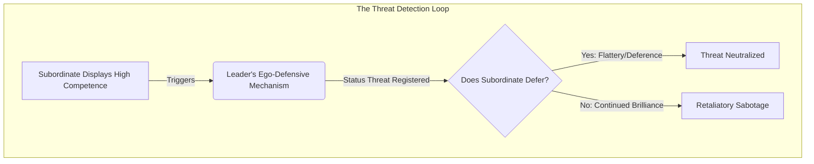
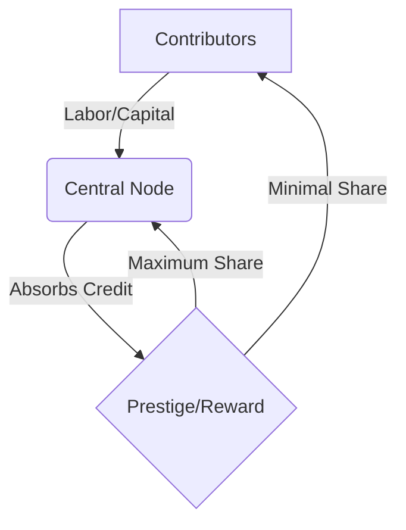

# Book 1: The Evolutionary Firmware

# Introduction: The Science of Influence

For centuries, power has been shrouded in the mystique of history. We are taught to look at the courts of Renaissance Italy, the battlefields of ancient China, and the salons of 18th-century France to understand how humans manipulate, dominate, and survive. 

But historical anecdotes are not data. A story about Cesare Borgia is a compelling narrative, but it is not a replicable formula. 

*The Science of Power* strips away the historical mythology and replaces it with empirical reality. The 48 rules in this book are not derived from folklore; they are extracted from peer-reviewed evolutionary biology [▲ well-replicated], behavioral economics [▲ well-replicated], game theory [▲ well-replicated], and cognitive psychology [▲ well-replicated]. 

We now know exactly why the human brain reacts to status threats. We have mathematical models for coalition building. We have mapped the cognitive heuristics that make us vulnerable to deception. This book is the ultimate operating manual for human behavior.

# Chapter 0: The Ethical Framework

*Duty, Harm, and the Architecture of Consent*

Before engaging with the operational mechanisms of power, it is imperative to establish a rigorous ethical framework. The science of power—drawing from evolutionary biology [▲ well-replicated], game theory [▲ well-replicated], and behavioral economics [▲ well-replicated]—is inherently amoral. A cognitive bias does not care if you use it to negotiate a fair salary or to manipulate a vulnerable partner. However, understanding these mechanisms is a biological imperative. If you do not understand how your "Status Detection System" works, you will be easily provoked. If you do not understand "Information Asymmetry," you will be easily conned. Treat this book as defensive armor just as much as an offensive playbook.

## The Dual-Use Nature of Behavioral Science

Knowledge of human cognitive architecture is dual-use technology. Just as cryptography can secure communications or conceal illicit activity, the tactical deployment of psychological principles can build thriving coalitions or dismantle an opponent's agency. The laws detailed in this volume describe how the human mind reliably processes information, responds to threats, and allocates trust. They are descriptions of reality, not prescriptions for malice.

However, the application of these laws demands strict ethical boundaries. We must distinguish between *understanding* mechanisms and *deploying* them aggressively. 

## The Duty to Avoid Harm

The foremost ethical principle is the duty to avoid disproportionate harm. While competitive environments—such as corporate negotiations, political campaigns, and market positioning—inherently involve zero-sum dynamics where one party's gain is another's loss, this does not justify predatory behavior. 

1. **Proportionality in Conflict:** When deploying strategies that degrade an opponent's resources or reputation, the action must be strictly proportional to the threat they pose. Preemptive strikes against non-combatants or the use of overwhelming force against minor transgressions violates the core tenets of ethical engagement.
2. **Preservation of Consent:** The darkest applications of behavioral science involve the intentional subversion of informed consent. Techniques that weaponize cognitive overload, engineered dependence, or deep deception remove the target's ability to make rational choices in their own self-interest. An ethical operator relies on incentive compatibility and structural alignment, not the hijacking of agency.
3. **The Categorical Imperative of Network Integrity:** Game theory demonstrates that systems built on perpetual deception ultimately collapse into low-trust, low-yield environments. You have an ethical and strategic duty to maintain the baseline integrity of your social and professional networks.

## The Distinction Between Understanding and Deployment

Understanding the mechanisms of power is not equivalent to deploying them. A structural engineer must understand the physics of building collapse to design safe structures; similarly, an ethical operator must understand the mechanisms of cognitive manipulation and status threat to design resilient organizations. 

We study the pathology of power to cure it. When you understand how a "Status Threat" triggers ego-defensive aggression, you can navigate your workplace without accidentally triggering your superior's insecurities. When you understand the "Free-Rider Problem," you can design incentive-compatible teams where contribution is rewarded and exploitation is minimized. 

The deployment of offensive tactics must be reserved exclusively for defense. When confronted by a predatory actor who is actively attempting to degrade your resources, reputation, or agency, the ethical operator is justified in deploying reciprocal, proportional counter-measures to neutralize the threat. 

## Defensive Application: The Primary Mandate

The primary utility of this text is defensive. By studying the mechanics of status threats, information control, and coalition dynamics, you immunize yourself against manipulation. 

*   **Recognizing the Attack:** When you feel a sudden, irrational urge to concede in a negotiation, you will recognize the reciprocity bias at work.
*   **Neutralizing the Threat:** When a colleague attempts to isolate you from your network, you will understand the structural dynamics of social asphyxiation and counter it by reinforcing your weak ties.
*   **Systemic Resilience:** By understanding the evolutionary firmware, you transition from a reactive node in the network to a conscious architect of your own environment.

This framework is not a constraint on your power; it is the foundation of sustainable dominance. Power exercised without ethical calibration is inherently volatile and self-destructive. Power exercised with clinical precision and ethical restraint becomes an unassailable structural advantage. The mastery of human behavior requires the discipline to govern oneself before attempting to govern others. 

### Thematic Reading Guide
This book is designed to be read straight through, sequentially, as a comprehensive tactical playbook. However, if you wish to master specific disciplines of human behavior, you may study the laws through the following thematic framework:

*   **Part I: The Architecture of Status & Reputation**
    *Focus on: Evolutionary hierarchies, impression management, and the neurobiology of rank.*
    *(e.g., Laws 1, 5, 6, 24, 34)*
*   **Part II: Information Asymmetry & Cognitive Manipulation**
    *Focus on: Deception, heuristics, choice architecture, and weaponized ambiguity.*
    *(e.g., Laws 3, 4, 12, 21, 31, 44)*
*   **Part III: Network Dynamics & Coalition Building**
    *Focus on: Social capital, power-dependence relations, and the Alliance Hypothesis.*
    *(e.g., Laws 2, 10, 11, 13, 18, 42)*
*   **Part IV: Strategic Conflict & Resource Allocation**
    *Focus on: Game theory, zero-sum dynamics, and cognitive depletion.*
    *(e.g., Laws 8, 15, 23, 29, 39)*
*   **Part V: Evolutionary Adaptation & Self-Mastery**
    *Focus on: Phenotypic plasticity, emotional regulation, and avoiding the sunk cost fallacy.*
    *(e.g., Laws 20, 25, 35, 47, 48)*

---

# Table of Contents: The Science of Power

**Chapter 1**: Never Outshine the Master
*Scientific Mechanism:* Status Threat & Ego-Defensive Aggression

**Chapter 2**: Never Put Too Much Trust in Friends, Learn How to Use Enemies
*Scientific Mechanism:* The Alliance Hypothesis for Friendship & Coalition Dynamics

**Chapter 3**: Conceal Your Intentions
*Scientific Mechanism:* Plausible Deniability, Indirect Speech Acts, & Self-Deception

**Chapter 4**: Always Say Less Than Necessary
*Scientific Mechanism:* Conversational Inference, Plausible Deniability, & The Strategic Speaker Model

**Chapter 5**: Reputation Is Everything—Guard It with Your Life
*Scientific Mechanism:* Indirect Reciprocity & Reputation Systems

**Chapter 6**: Court Attention at All Cost
*Scientific Mechanism:* Attentional Capture, Salience Bias, & Information Cascades [▲ well-replicated]

**Chapter 7**: Get Others to Do the Work for You, but Always Take the Credit
*Scientific Mechanism:* The Free-Rider Problem, Division of Labor, & Principal-Agent Hierarchies

**Chapter 8**: Make Other People Come to You—Use Bait if Necessary
*Scientific Mechanism:* Best Alternative to a Negotiated Agreement (BATNA) [▲ well-replicated] & Sunk Cost Commitments

**Chapter 9**: Win Through Your Actions, Never Through Argument
*Scientific Mechanism:* Costly Signaling Theory & Cognitive Dissonance [▲ well-replicated] (Self-Perception)

**Chapter 10**: Infection: Avoid the Unhappy and Unlucky
*Scientific Mechanism:* Emotional Contagion & Social Network Transmission

**Chapter 11**: Learn to Keep People Dependent on You
*Scientific Mechanism:* Power-Dependence Relations & Social Exchange Theory

**Chapter 12**: Use Selective Honesty and Generosity to Disarm Your Victim
*Scientific Mechanism:* Strategic Disclosures & Reciprocity Bias

**Chapter 13**: When Asking for Help, Appeal to People's Self-Interest, Never to Their Mercy or Gratitude
*Scientific Mechanism:* Incentive Compatibility & Rational Choice Theory

**Chapter 14**: Pose as a Friend, Work as a Spy
*Scientific Mechanism:* Strategic Ingratiation & Information Asymmetry

**Chapter 15**: Crush Your Enemy Totally
*Scientific Mechanism:* Conflict Escalation Dynamics & Evolutionary Stable Strategies (Hawk-Dove)

**Chapter 16**: Use Absence to Increase Respect and Honor
*Scientific Mechanism:* The Scarcity Effect & Psychological Reactance Theory

**Chapter 17**: Keep Others in Suspended Terror: Cultivate an Air of Unpredictability
*Scientific Mechanism:* Mixed Strategies in Game Theory [▲ well-replicated] & Information Entropy

**Chapter 18**: Do Not Build Fortresses to Protect Yourself—Isolation Is Dangerous
*Scientific Mechanism:* Social Capital Theory & Network Centrality (The Strength of Weak Ties)

**Chapter 19**: Know Who You're Dealing With—Do Not Offend the Wrong Person
*Scientific Mechanism:* Personality Psychology & Five-Factor (Big Five) Model

**Chapter 20**: Commit to No One
*Scientific Mechanism:* Real Options Theory & Transaction Cost Optionality

**Chapter 21**: Play a Sucker to Catch a Sucker—Seem Dumber Than Your Mark
*Scientific Mechanism:* Stereotype Warmth-Competence Trade-Off & Knowledge Hiding (Playing Dumb)

**Chapter 22**: Use the Surrender Tactic: Transform Weakness into Power
*Scientific Mechanism:* Strategic Retreat & Appeasement Signaling (Assessing in Animal Conflict)

**Chapter 23**: Concentrate Your Forces
*Scientific Mechanism:* Focus, Constrained Optimization, & Resource Allocation

**Chapter 24**: Play the Perfect Courtier
*Scientific Mechanism:* Strategic Impression Management & Self-Monitoring

**Chapter 25**: Re-create Yourself
*Scientific Mechanism:* Impression Management & Narrative Identity Construct

**Chapter 26**: Keep Your Hands Clean
*Scientific Mechanism:* Attribution Theory & Self-Serving / Scapegoat Biases

**Chapter 27**: Play on People's Need to Believe to Create a Cult-Like Following
*Scientific Mechanism:* In-Group Favoritism, Social Identity Theory, & The 'Hive Switch'

**Chapter 28**: Enter Action with Boldness
*Scientific Mechanism:* Overconfidence Signaling & The Confidence Heuristic

**Chapter 29**: Plan All the Way to the End
*Scientific Mechanism:* Planning Fallacy Mitigation & Prospective Hindsight (Pre-Mortem)

**Chapter 30**: Make Your Accomplishments Seem Effortless
*Scientific Mechanism:* Processing Fluency & Cognitive Ease

**Chapter 31**: Control the Options: Get Others to Play with the Cards You Deal
*Scientific Mechanism:* Choice Architecture & Asymmetric Dominance (Decoy Effect)

**Chapter 32**: Play to People's Fantasies
*Scientific Mechanism:* Motivated Reasoning & Confirmation Bias

**Chapter 33**: Discover Each Man's Thumb-Screw
*Scientific Mechanism:* Individual Differences & Target Profiling (The Dark Triad)

**Chapter 34**: Act Like a King to Be Treated Like One
*Scientific Mechanism:* Status Signaling Theory & Prestige Dominance

**Chapter 35**: Master the Art of Timing
*Scientific Mechanism:* Hyperbolic Discounting & Temporal Utility Mapping

**Chapter 36**: Disdain Things You Cannot Have: Ignoring Them Is the Best Revenge
*Scientific Mechanism:* Cognitive Dissonance [▲ well-replicated] Reduction (Sour Grapes Rationalization)

**Chapter 37**: Create Compelling Spectacles
*Scientific Mechanism:* The Psychology of Awe, Memory Anchoring, & Visual Salience

**Chapter 38**: Think as You Like but Act Like Others
*Scientific Mechanism:* Conformity Bias & Normative Social Influence (Social Proof)

**Chapter 39**: Stir Up Waters to Catch Fish
*Scientific Mechanism:* Interpersonal Effects of Anger in Negotiations & Cognitive Depletion

**Chapter 40**: Despise the Free Lunch
*Scientific Mechanism:* Norm of Reciprocity & Indebtedness Bias

**Chapter 41**: Avoid Stepping into a Great Man's Shoes
*Scientific Mechanism:* Anchoring Bias & Regression to the Mean

**Chapter 42**: Strike the Shepherd and the Sheep Will Scatter
*Scientific Mechanism:* Scale-Free Network Vulnerability & Key Player Theory

**Chapter 43**: Work on the Hearts and Minds of Others
*Scientific Mechanism:* The Elaboration Likelihood Model (Peripheral Route Persuasion) & Cognitive Empathy

**Chapter 44**: Disarm and Infuriate with the Mirror Effect
*Scientific Mechanism:* Behavioral Mimicry & The Chameleon Effect

**Chapter 45**: Preach the Need for Change, but Never Reform Too Much at Once
*Scientific Mechanism:* Status Quo Bias, Loss Aversion, & Incrementalism

**Chapter 46**: Never Appear Too Perfect
*Scientific Mechanism:* The Pratfall Effect

**Chapter 47**: Do Not Go Past the Mark You Aimed For; In Victory, Know When to Stop
*Scientific Mechanism:* Escalation of Commitment & Sunk Cost Fallacy [▲ well-replicated] (Hubris)

**Chapter 48**: Assume Formlessness
*Scientific Mechanism:* Dynamic Capabilities, Phenotypic Plasticity, & Strategic Adaptability

---

# Law 1: Never Outshine the Master

**Scientific Equivalent:** Status Threat & Ego-Defensive Aggression
**Primary Discipline:** Organizational Behavior & Social Comparison

## The Rule
Never trigger the ego-defensive aggression of a superior. Subordinates who display unfiltered brilliance do not inspire respect; they inspire a neurobiological status threat. To attain the heights of power, you must manipulate the status detection system of your masters, manufacturing the illusion that they remain intellectually dominant.

## The Empirical Evidence
The neurobiology of status guarantees that outshining the master is a fatal error. Humans evolved to play "status games" to secure survival and reproduction. As Will Storr [▲ well-replicated] details in *The Status Game*, ascending hierarchies triggers spikes in serotonin and dopamine. Conversely, status threats inflict genuine psychological pain.

In hierarchical environments, leaders fuse their self-worth with their rank. Stanford's Jeffrey Pfeffer [▲ well-replicated] (*Power*) identified the core metric of survival: it depends less on objective job performance and more on managing the ego of the person who controls your resources. 

When a subordinate's competence eclipses the leader's, the leader's brain registers a **Status Threat**. Fast & Chen (2009) [△ emerging research] proved that superiors holding power are acutely sensitive to competence that exposes their own inadequacy. They do not react logically; they react with primal, ego-defensive aggression. They will sabotage, undermine, or fire the subordinate to restore their internal supremacy.

**Status Threat vs Competence Matrix**

| | Low Competence | High Competence |
| :--- | :--- | :--- |
| **High Status Threat** | Monitor Closely (Q2) | Eliminate Target (Q1) |
| **Low Status Threat** | Ignore (Q3) | Promote/Ally (Q4) |

*Example Profiles:* 
*   **Brilliant Subordinate**: High Competence / High Threat
*   **Harmless Worker**: Low Competence / Low Threat

## The Strategic Application
*   **Suppress the Threat:** Competence is a weapon. Brandish it recklessly, and you trigger defensive aggression. Downplay your brilliance in front of insecure leaders.
*   **Weaponize Flattery:** Fast & Chen (2009) [△ emerging research] experimentally proved that flattery and self-affirmation directly neutralize ego-defensive aggression. Frame your exceptional ideas as natural extensions of the master's original guidance to soothe their ego.
*   **Avoid the Competence Trap:** High performance does not protect you; it makes you a target. Balance extreme competence with extreme deference.
*   **Seek Secure Masters:** Display your full brilliance only when you are the master, or when you serve a leader whose status is so universally secure that they are immune to status threat.

### Empirical Evidence: Myanmar Case Study
In Yangon's tightly controlled family conglomerates, a newly hired foreign-educated executive overhauled the supply chain, vastly improving margins. However, he publicly presented these wins without crediting the aging patriarch. Perceiving a status threat, the patriarch abruptly sidelined the executive to a ceremonial role. The executive failed to realize that validating the patriarch's legacy was more important than operational efficiency.

> [!WARNING]
> **Backfire Risk:** Over-flattery can trigger suspicion. If your deference is perceived as a manipulative tactic rather than genuine respect, the master's status detection system will tag you as a deceptive threat rather than a loyal subordinate.

> [!IMPORTANT]
> **Defensive Application:**
> When a superior attempts to suppress you out of status threat, artificially lower your competence signals. Validate their ego through explicit flattery to reduce their amygdala activation, effectively neutralizing their defensive aggression.

---

# Law 2: Never Put Too Much Trust in Friends, Learn How to Use Enemies

**Scientific Equivalent:** The Alliance Hypothesis for Friendship & Coalition Dynamics
**Primary Discipline:** Evolutionary Psychology & Game Theory [▲ well-replicated]

## The Rule
Calibrate trust based on mathematical utility, not emotional bonds. Friendships are fragile coalitions poisoned by envy and relative ranking. Transactional alliances with former enemies are mathematically superior, driven by mutual self-interest and a strict adherence to cooperative game theory [▲ well-replicated].

## The Empirical Evidence
Evolutionary psychology exposes friendship as an unstable foundation for power. Under **The Alliance Hypothesis** (DeScioli & Kurzban, 2009 [△ emerging research]), human friendship isn't about trading favors—it is a mechanism to construct wartime coalitions. 

A core tenet of this hypothesis is *friend-ranking*. We secretly rank our friends, and betrayal or envy is devastating because it signals a sudden drop in your relative rank within their network. This emotional volatility makes friends dangerous in power dynamics. 

Game Theory [▲ well-replicated] provides the mathematical proof for why enemies make superior allies. In *The Evolution of Cooperation*, Robert Axelrod [▲ well-replicated] demonstrates through the **Iterated Prisoner's Dilemma [▲ well-replicated]** that long-term survival demands "Tit-for-Tat." This strategy cooperates first, instantly retaliates against betrayal, and forgives immediately. Former enemies operate under pure Tit-for-Tat. The relationship is transactional and devoid of the messy emotional expectations of friendship. 

Furthermore, Frans de Waal's *Chimpanzee Politics* reveals that primate alpha males do not rule by sheer physical dominance. They stay in power by forging strategic, transactional coalitions with former rivals who understand the stakes.

## The Strategic Application
*   **Calibrate Trust:** Blind trust in friends is an evolutionary failure. Friendship works in times of peace, but in power dynamics, emotional entanglement clouds objective judgment.
*   **The Utility of Rivals:** A defeated enemy is the ultimate strategic asset. The relationship is mathematically stable because it is built on mutual self-interest and Tit-for-Tat logic rather than affection.
*   **Leverage the Shadow of the Future:** Axelrod proved cooperation flourishes when the "shadow of the future" is long. Ensure transactional allies know their future success is directly tied to their ongoing loyalty to you.
*   **Avoid the Envy Trap:** Friends feel they are your equals. Ascending above them triggers their status detection system, leading to envy and resentment. Segregate your power games from your personal friendships.

### Empirical Evidence: Myanmar Case Study
A prominent telecom joint venture in Myanmar was initially formed between two close childhood friends. As the company scaled, informal verbal agreements dissolved into bitter equity disputes, freezing their operational licenses. Eventually, one founder ousted the other by allying with a former fierce competitor, citing that the competitor’s cutthroat but predictable nature made for a more stable partnership than the emotional volatility of a friend.

> [!WARNING]
> **Backfire Risk:** Pure defection or hyper-transactional behavior loses in iterated games. If you systematically betray allies, your reputation score plummets, making it mathematically impossible to form future coalitions.

> [!IMPORTANT]
> **Defensive Application:**
> If a former friend weaponizes your trust, sever the emotional bond immediately. Recalibrate the relationship purely on Tit-for-Tat game theory [▲ well-replicated] mechanics, enforcing strict boundaries and demanding objective reciprocity.

---

# Law 3: Conceal Your Intentions

**Scientific Equivalent:** Plausible Deniability, Indirect Speech Acts, & Self-Deception
**Primary Discipline:** Evolutionary Linguistics & Cognitive Science

## The Rule
Shroud your objectives in the fog of indirectness. Explicit intentions create Common Knowledge, forcing rivals into defensive retaliation. By leveraging plausible deniability and self-deception, you prevent opponents from calculating your trajectory until it is too late to stop you.

## The Empirical Evidence
Clarity is a strategic weakness. In *The Elephant in the Brain*, Kevin Simler and Robin Hanson reveal how the human brain evolved to deceive others and itself. By hiding our selfish motives beneath altruistic cover stories, we bypass our own conscious awareness. This self-deception prevents us from emitting the physical "tells" of lying, making us highly effective manipulators.

Evolutionary linguist Steven Pinker (*The Stuff of Thought*) revealed the tactical necessity of **Indirect Speech Acts**. When humans communicate, they use innuendo and veiled threats to establish **Plausible Deniability**. 

Explicit intentions (a bribe, a threat) create "Common Knowledge." Pinker specifies that Common Knowledge is not just that both parties know the truth, but that *both parties know that the other party knows*. Once knowledge reaches this threshold of mutual acknowledgment, society forces the target to react defensively to protect their reputation. Indirect speech bypasses this defense mechanism.

## The Strategic Application
*   **The Power of Plausible Deniability:** Never create Common Knowledge regarding your ultimate goals. If your intentions are ambiguous, rivals cannot mobilize a coalition against you because they cannot definitively prove your hostility.
*   **Weaponized Self-Deception:** The best liars do not know they are lying. Frame your actions (to yourself and others) as serving the greater good. This suppresses the micro-expressions of guilt that betray calculation.
*   **Strategic Ambiguity:** Force your opponents to expend mental energy guessing your next move. Indirectness creates cognitive fatigue and forces defensive errors.
*   **Deploy Red Herrings:** The human brain's status detection system is hungry for data. Feed it false data. Broadcast loud signals about a fake objective to camouflage your quiet pursuit of the real one.

### Empirical Evidence: Myanmar Case Study
During the early deregulation of Myanmar’s banking sector, a mid-sized financial institution quietly acquired regional microfinance licenses under various subsidiaries. By concealing their grand strategy of building a nationwide digital payment monopoly, they prevented larger incumbent banks from blocking their regulatory approvals. By the time their true intentions were visible, they had already secured an insurmountable first-mover advantage.

> [!WARNING]
> **Backfire Risk:** Extreme ambiguity can cause coordination failure within your own ranks. If your subordinates do not understand your intentions, they cannot execute effectively and may accidentally work at cross-purposes.

> [!IMPORTANT]
> **Defensive Application:**
> When an opponent relies on indirect speech and plausible deniability, force their hand. Ask clarifying questions that demand explicit answers, effectively transforming their hidden intent into Common Knowledge and exposing their strategy.

---

# Law 4: Always Say Less Than Necessary

**Scientific Equivalent:** Conversational Inference, Plausible Deniability, & The Strategic Speaker Model
**Primary Discipline:** Cognitive Psychology & Pragmatics

## The Rule
Command the domain of information by weaponizing silence. Excessive verbal disclosure strips you of strategic ambiguity and provides adversaries with coordinates for counter-attacks. To retain structural superiority, you must restrict data flow, forcing others into a state of cognitive deficit where they must project their own assumptions into the void.

## The Empirical Evidence
In the architecture of human communication, ambiguity is power. Lee and Pinker (2010) [△ emerging research] delineated the "Strategic Speaker Model," demonstrating that indirect speech and calculated omissions construct plausible deniability. In cognitive psychology [▲ well-replicated], reducing verbal output prevents the erosion of relationship-negotiating optionality.

Furthermore, the human brain’s rapid cognitive processing pathways automatically construct coherent narratives out of available data. By offering sparse information, you hijack this mechanism, forcing the counterparty's brain to overcompensate and reveal their own structural biases and intentions. Supplying excessive data simply maps out your own limitations and vulnerabilities.

## The Strategic Application
*   **Weaponize Silence:** Treat every word as an expenditure of tactical capital. Deploy silence to force the counterparty to fill the void, exposing their hand while concealing yours.
*   **Enforce Plausible Deniability:** Maintain strategic ambiguity. Refuse to be locked into rigid, off-the-record commitments by strictly limiting explicit declarations.
*   **Bypass Interception:** Recognize that excessive disclosure guarantees interception and counter-moves. Starve your adversaries of the informational oxygen required to mount an attack.
*   **Project Inscrutability:** Cultivate an informational black hole. Your lack of predictability paralyzes opponents, forcing them to disperse cognitive resources trying to anticipate your next maneuver.

### Empirical Evidence: Myanmar Case Study
In negotiations for a lucrative jade mining concession in Hpakant, the lead representative of a local consortium adopted a strategy of extreme verbal sparsity. By only responding with short nods and ambiguous grunts, he forced the foreign investors to nervously bid against themselves. The investors offered progressively better terms to fill the agonizing silences, eventually conceding massive equity shares just to secure an agreement.

> [!WARNING]
> **Backfire Risk:** Perpetual silence can be interpreted as incompetence or arrogance rather than strategic depth. In high-trust environments, refusal to communicate degrades alliance cohesion.

> [!IMPORTANT]
> **Defensive Application:**
> If an adversary weaponizes silence to extract information, do not fill the void. Mirror their conversational sparsity. By reflecting their informational blackout, you force them to expend cognitive effort and reveal their own constraints.

---

# Law 5: Reputation Is Everything—Guard It with Your Life

**Scientific Equivalent:** Indirect Reciprocity & Reputation Systems
**Primary Discipline:** Evolutionary Biology & Game Theory [▲ well-replicated]

## The Rule
Your reputation is the fundamental mathematical metric of your social survival. In complex ecosystems, direct interaction is limited, forcing networks to rely on reputational "image scores." You must ruthlessly engineer and defend your image score, as it is the single algorithm determining whether the network cooperates with you or annihilates you.

## The Empirical Evidence
Evolutionary game theory [▲ well-replicated] dictates that reputation is not a vanity metric; it is the currency of existence. Nowak and Sigmund (1998) [△ emerging research] mathematically verified that in large populations, cooperation is sustained entirely through indirect reciprocity—powered by image scoring.

When your image score drops, the network reacts automatically. Actors in iterated games use historical data (reputation) to dictate future moves. A compromised reputation acts as a structural pathogen; potential allies immediately refuse cooperation, and the system actively punishes the defector to preserve network integrity.

## The Strategic Application
*   **Audit Your Image Score:** Treat your reputation as your most critical asset. Continuously monitor and control the data points the network uses to calculate your value.
*   **Annihilate Smears Instantly:** A degraded image score cascades into network ostracism. Neutralize any reputational attacks with overwhelming prejudice before the contagion spreads.
*   **Exploit Indirect Reciprocity:** Manufacture high-visibility acts of competence and reliability to aggressively inflate your image score. Force third-party observers to integrate your perceived superiority into their internal models.
*   **Deploy Reputation as a Shield:** Build a reputation so formidable that the mere statistical probability of your retaliation deters attacks before they materialize.

### Empirical Evidence: Myanmar Case Study
A logistics provider in Mandalay dominated the cross-border trade route primarily because of its founder's flawless reputation for zero cargo loss. When a rival attempted to smear them with rumors of smuggling, the founder immediately launched a highly visible PR campaign and invited transparent customs audits. By ruthlessly defending their image score, they not only crushed the smear but also won exclusive contracts with multinational exporters who valued the audited reliability.

> [!WARNING]
> **Backfire Risk:** Hyper-defensiveness over minor criticisms signals fragility. Overreacting to low-credibility attacks draws unnecessary attention to the smear and lowers your perceived status.

> [!IMPORTANT]
> **Defensive Application:**
> When your image score is under attack, immediately trace the source of the reputational pathogen. Launch a counter-narrative fortified by undeniable proof of competence, forcing the network's indirect reciprocity algorithms to recalibrate in your favor.

---

# Law 6: Court Attention at All Cost

**Scientific Equivalent:** Attentional Capture, Salience Bias, & Information Cascades [▲ well-replicated]
**Primary Discipline:** Cognitive Psychology & Social Influence

## The Rule
Obscurity is extinction. In a system overloaded with stimuli, human cognitive architecture uses salience as a heuristic for value. You must forcibly capture the attentional bandwidth of the network, engineering extreme visual or behavioral distinction to dominate the information cascade.

## The Empirical Evidence
The human brain is wired for attentional capture. Taylor and Fiske (1978) [△ emerging research] established that highly salient, novel, or distinct stimuli automatically hijack the brain's processing centers. Because cognitive bandwidth is strictly limited, the brain relies on "top-of-the-head phenomena," treating whatever is most salient as most important.

Salience creates perceived value. When you trigger an information cascade by dominating the visual and social landscape, network actors bypass critical analysis and default to assigning you disproportionate status. However, this is a highly volatile mechanism: while salience initiates the cascade, low-quality or strictly negative attention will rapidly degrade long-term reputational capital.

## The Strategic Application
*   **Hijack Cognitive Bandwidth:** Engineer extreme novelty and physical distinction to force the target's visual and auditory systems to lock onto you.
*   **Exploit Salience Bias:** Use your dominant visibility to trick the network into conflating attention with competence. Force them to use your presence as the baseline heuristic for importance.
*   **Ignite Information Cascades [▲ well-replicated]:** Court initial attention to trigger a self-sustaining feedback loop. Make your presence the inevitable focal point that forces others to align their focus on you.
*   **Control the Polarity:** While any attention is better than obscurity, strictly control the narrative polarity to prevent the cascade from mutating into a reputational pathogen.

### Empirical Evidence: Myanmar Case Study
To launch a new mobile wallet app in Myanmar’s crowded fintech market, a startup bypassed traditional billboards and instead sponsored massive, neon-lit lethwei (traditional boxing) tournaments. The extreme visual salience captured the target demographic's attention immediately. By dominating the cultural conversation, they triggered a massive download cascade, achieving in weeks what competitors took years to build.

> [!WARNING]
> **Backfire Risk:** Salience without substance is a reputational pathogen. If you capture attention but fail to deliver a competent product, the resulting negative information cascade will destroy your credibility instantly.

> [!IMPORTANT]
> **Defensive Application:**
> If a rival uses extreme attentional capture to overwhelm the network, counter their salience bias with targeted analytical disruption. Point out the lack of underlying substance, breaking the information cascade by introducing cognitive friction.

---

# Law 7: Get Others to Do the Work for You, but Always Take the Credit

**Scientific Equivalent:** The Free-Rider Problem, Division of Labor, & Principal-Agent Hierarchies
**Primary Discipline:** Behavioral Economics & Evolutionary Sociology

## The Rule
Exploit the structural asymmetry of organizational hierarchies. Output is generated at the periphery, but prestige is centralized at the core. You must position yourself as the central node of coordination, systematically absorbing the labor of subordinate agents while monopolizing the systemic rewards.

## The Empirical Evidence
Joint tasks are inherently governed by the public goods dilemma and principal-agent dynamics. In hierarchical systems, the division of labor naturally segregates execution from attribution. Behavioral economics reveals that while individual contributors expend the metabolic and cognitive resources, the system inherently attributes the cumulative success to the centralized coordinator.

Olson (1965) in *The Logic of Collective Action* mathematically formalized the free-rider problem, proving that in large groups, individuals are rationally incentivized to withhold contribution while extracting maximum utility. While blatant credit theft triggers severe altruistic punishment in high-trust settings, sophisticated coordination allows the principal agent to legally harvest the surplus value generated by the collective.

## The Strategic Application
*   **Monopolize the Coordination Node:** Position yourself at the structural chokepoint of the hierarchy. Ensure all external visibility and credit flow directly through your position.
*   **Harvest Surplus Value:** Ruthlessly delegate resource-intensive tasks to subordinates. Extract the maximum cognitive and metabolic labor from your agents while conserving your own.
*   **Sanitize the Extraction:** Avoid blatant theft, which triggers altruistic punishment. Instead, reframe the extraction as "leadership" and "synthesis," absorbing the credit as the natural right of the architect.
*   **Obfuscate the Labor Source:** Shield the individual contributors from the external network. If the external environment cannot observe the periphery, they will attribute all output to the core.

### Empirical Evidence: Myanmar Case Study
The director of a Yangon-based garment manufacturing hub routinely delegated the complex compliance audits to his junior managers. When the factory successfully secured major European contracts due to these rigorous audits, the director presented the certifications to the board as his own strategic foresight. The junior managers received minor bonuses, while the director secured a massive equity stake and a promotion.

> [!WARNING]
> **Backfire Risk:** Blatant credit theft triggers altruistic punishment. If subordinates realize their labor is being systematically harvested without minimal reciprocal rewards, they will sabotage the system or leak your incompetence to superiors.

> [!IMPORTANT]
> **Defensive Application:**
> When a central coordinator attempts to free-ride on your peripheral labor, subtly watermark your output. Ensure key stakeholders recognize your unique intellectual property, bypassing the principal agent's attribution monopoly.

---

# Law 8: Make Other People Come to You—Use Bait if Necessary

**Scientific Equivalent:** Best Alternative to a Negotiated Agreement (BATNA) [▲ well-replicated] & Sunk Cost Commitments
**Primary Discipline:** Game Theory [▲ well-replicated] & Negotiation Science

## The Rule
Force the counterparty to cross the spatial and psychological divide. By compelling the opponent to initiate contact and incur the transaction costs of movement, you artificially inflate their sunk costs and broadcast their structural dependency, thereby dominating the negotiation parameters.

## The Empirical Evidence
In the strict calculus of game theory [▲ well-replicated], negotiation leverage is dictated by the Best Alternative to a Negotiated Agreement (BATNA) [▲ well-replicated]. Forcing the physical and psychological transaction costs onto the opponent is a primary dominance signal in conflict strategy. 

When a counterparty travels to your territory, they incur a sunk cost. This commitment binds them to the interaction, reducing their psychological flexibility. Furthermore, compelling them to move serves as an undeniable signal that they possess the weaker BATNA. The stationary party immediately dictates the physical environment, shifting the default anchors of the engagement in their favor.

## The Strategic Application
*   **Force Transaction Costs:** Never cross the divide. Compel the adversary to expend the time, energy, and capital to initiate the engagement, thereby locking them into a sunk cost deficit.
*   **Broadcast BATNA Superiority:** Use your stationary position as a hostile signal of absolute leverage. Make it explicitly clear that their movement proves their dependency on your resources.
*   **Dictate the Physical Parameters:** By forcing them into your territory, you control the environmental variables. Weaponize the space to maximize their psychological discomfort and cognitive load.
*   **Deploy Strategic Bait:** If the opponent refuses to move, engineer irresistible bait. Construct an incentive structure so overwhelmingly asymmetric that their rational self-interest forces them to abandon their position.

### Empirical Evidence: Myanmar Case Study
A prominent real estate developer in Yangon refused to travel to government ministries to negotiate land leases. Instead, he hosted exclusive, lavish banquets at his private estate, forcing officials to travel to his territory. By doing so, he subtly asserted his dominance and superior BATNA, ensuring negotiations always occurred on his heavily controlled terms.

> [!WARNING]
> **Backfire Risk:** Forcing someone with a genuinely superior BATNA to come to you will backfire. They will simply refuse the interaction, leaving you isolated and without a deal.

> [!IMPORTANT]
> **Defensive Application:**
> If an opponent tries to force you into their territory to inflate your sunk costs, refuse. Stand your ground and leverage a stronger BATNA, forcing them to incur the transaction costs of movement and thereby inverting the power dynamic.

---

# Law 9: Win Through Your Actions, Never Through Argument

**Scientific Equivalent:** Costly Signaling Theory & Cognitive Dissonance [▲ well-replicated] (Self-Perception)
**Primary Discipline:** Evolutionary Anthropology & Social Psychology

## The Rule
Never rely on verbal persuasion to secure dominance. Verbal arguments are "cheap talk," easily faked and universally distrusted by human cognitive filters. To bypass cognitive resistance, you must deploy "costly signals"—hard, irrefutable actions that require massive expenditures of time, risk, or capital. Actions bypass logical filters; words get trapped in them.

## The Empirical Evidence
In evolutionary anthropology, Amotz Zahavi's (1975) Handicap Principle mathematically proved that the only signals organisms trust are those that are too expensive to fake. "Cheap talk"—words, promises, and debates—carries zero evolutionary weight.

Arguments inherently trigger psychological reactance. When you attempt to argue a target into submission, their brain's prefrontal cortex actively generates counter-arguments to defend its autonomy. 

However, physical action bypasses this defensive architecture. Research in social psychology underscores that when a target witnesses a hard action (a demonstration, a sacrifice, a concrete result), they experience cognitive dissonance if they try to deny reality. They are forced to update their mental models. Action is a costly signal that proves competence and resolve without activating the target's verbal defense mechanisms.

## The Strategic Application
*   **Deploy Costly Signals:** Speak less, do more. If you want to prove a point, execute it physically. Make your demonstration so resource-intensive that it cannot be dismissed as a bluff.
*   **Bypass Reactance:** Never tell someone they are wrong. Show them the correct outcome without demanding they concede verbally. Let their own cognitive dissonance force their internal adjustment.
*   **Weaponize the Demonstration:** Frame your physical actions as unarguable laws of nature. A working prototype or a finalized execution crushes any theoretical debate before it begins.
*   **Avoid Cheap Talk Arenas:** Refuse to participate in endless verbal debates. When drawn into one, execute a visible move that renders the debate irrelevant.

### Empirical Evidence: Myanmar Case Study
A tech entrepreneur in Myanmar struggled to convince traditional investors about his new logistics algorithm using slide decks. He stopped arguing and instead personally financed a pilot program that delivered goods 30% faster than the industry average. Faced with the undeniable costly signal of a working prototype, the investors experienced cognitive dissonance and immediately funded his Series A.

> [!WARNING]
> **Backfire Risk:** Costly signals that fail publicly are irrecoverable. If you bet everything on a physical demonstration and the prototype malfunctions, your credibility is instantly destroyed with no room for verbal spin.

> [!IMPORTANT]
> **Defensive Application:**
> When a manipulator tries to dazzle you with cheap talk and verbal promises, demand costly signals. Insist on immediate, resource-intensive actions that prove their resolve; otherwise, dismiss their arguments as biological noise.

---