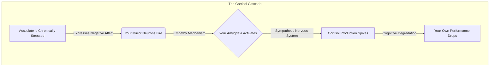
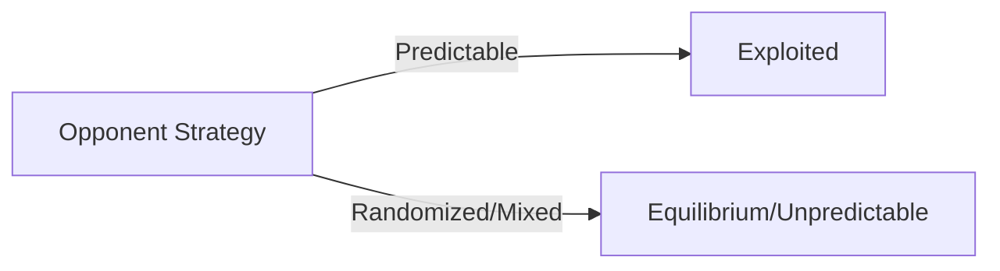

# Law 10: Infection: Avoid the Unhappy and Unlucky

**Scientific Equivalent:** Emotional Contagion & Social Network Transmission
**Primary Discipline:** Social Psychology & Network Science

## The Rule
Quarantine yourself from chronic negativity and failure. Human neurology is porous; emotional states and behavioral algorithms are highly transmissible social pathogens. Associating with the chronically unhappy or perpetually unlucky does not heal them—it infects you.

## The Empirical Evidence
The human brain is wired for unconscious mimicry. Hatfield, Cacioppo, and Rapson (1993) [△ emerging research] established the mechanism of "emotional contagion"—the automatic tendency to synchronize facial expressions, vocalizations, postures, and movements with those of another person, subsequently converging emotionally. 

Network scientists have mapped how emotional states transmit through social networks up to three degrees of separation. Chronic negative affect operates identically to a biological virus. It drains cognitive and emotional bandwidth. 

When you associate with the unlucky and unhappy, you actively download their compromised decision-making algorithms and pessimistic heuristics. Their continuous stress responses trigger your own cortisol production, chronically degrading your physiological and cognitive baseline. You do not elevate them; their mass drags you down.

## The Strategic Application
*   **Enforce Strict Quarantine:** Treat chronic complainers and the perpetually "unlucky" as biohazards. Cut them off ruthlessly to preserve your cognitive integrity.
*   **Audit Your Network:** Map the emotional baseline of your inner circle. If a node is consistently negative, sever the connection before the contagion spreads.
*   **Infect Yourself Upward:** Actively seek out and associate with high-agency, optimistic, and successful individuals. Leverage emotional contagion to download their winning heuristics and physiological states.
*   **Suppress Empathy for the Chronically Doomed:** Recognize that chronic bad luck is rarely random; it is the output of defective behavioral algorithms. Do not let empathy override your survival instinct.

### Empirical Evidence: Myanmar Case Study
A rising marketing executive in Naypyidaw noticed her performance declining when she shared an office with a deeply cynical colleague who constantly complained about management. Recognizing the emotional contagion, she requested a transfer to a high-performing, optimistic team. Her cortisol levels dropped, and her productivity skyrocketed as she absorbed the new team's winning heuristics.

> [!WARNING]
> **Backfire Risk:** Radical isolation to avoid negative affect can sever critical intelligence nodes. Sometimes "unhappy" people are the only ones accurately diagnosing systemic failures within the organization.

> [!IMPORTANT]
> **Defensive Application:**
> If you detect the transmission of chronic negativity from an unlucky node in your network, initiate strict social quarantine. Sever the tie to halt cortisol contagion and preserve your own physiological and cognitive baseline.

---

# Law 11: Learn to Keep People Dependent on You

**Scientific Equivalent:** Power-Dependence Relations & Social Exchange Theory
**Primary Discipline:** Organizational Sociology

## The Rule
Engineer structural bottlenecks that position you as the sole provider of a critical resource. Power is not an absolute trait; it is a mathematical ratio of dependence. To secure unassailable leverage, you must ensure that your targets need you for their survival or success, and that they have zero viable alternatives.

## The Empirical Evidence
In 1962, sociologist Richard Emerson formalized this in his seminal paper on Power-Dependence Relations. The equation is clinical: The power of Actor A over Actor B is equal to the dependence of Actor B on Actor A. 

Dependence is driven by two variables: how highly B values the resource A controls, and how easily B can obtain that resource from alternative sources. Structural indispensability is the ultimate armor. If you are easily replaceable, you have zero power, regardless of your title. 

To maximize power, you must manipulate the social exchange matrix. You must become the gatekeeper to capital, information, or access that the target desperately requires, while systematically eliminating their access to alternative suppliers.

## The Strategic Application
*   **Monopolize Critical Resources:** Identify the most valuable, scarce resource in your environment (specialized knowledge, elite relationships, critical funding) and capture exclusive control over it.
*   **Eliminate Alternatives:** Systematically cut off or degrade the target's alternative options. If they can go elsewhere, you have no leverage. 
*   **Embed Yourself in the Infrastructure:** Do not just do the work; design the system so that it collapses without your ongoing intervention. Black-box your methods.
*   **Calibrate the Dependency:** Keep the target perpetually hungry. Provide enough of the resource to sustain their operation, but never enough for them to achieve autonomy.

### Empirical Evidence: Myanmar Case Study
An IT architect at a major Myanmar bank designed the core ledger system using highly obscure legacy code that only he understood. By making the infrastructure completely black-boxed and eliminating alternative technical documentation, he made himself structurally indispensable. When the bank tried to restructure, they found they couldn't fire him without risking systemic collapse, cementing his power.

> [!WARNING]
> **Backfire Risk:** Total dependency breeds deep resentment. If a target realizes they are trapped, they will secretly expend massive resources to build parallel systems and eventually eliminate you with extreme prejudice.

> [!IMPORTANT]
> **Defensive Application:**
> When you realize you are structurally dependent on a single gatekeeper, secretly cultivate alternative suppliers. Once your new options are viable, your dependence drops to zero, entirely neutralizing their power-dependence leverage.

---

# Law 12: Use Selective Honesty and Generosity to Disarm Your Victim

**Scientific Equivalent:** Strategic Disclosures & Reciprocity Bias
**Primary Discipline:** Behavioral Economics & Social Psychology

## The Rule
Weaponize the human reciprocity reflex to bypass cognitive defenses. A sudden, calculated act of honesty or a strategic gift triggers an evolutionary obligation in the target, forcing them to lower their guard. Use this artificial trust as a trojan horse to execute your primary extraction.

## The Empirical Evidence
The rule of reciprocity is one of the most powerful automated scripts in human neurobiology. Receiving a gift, favor, or a vulnerable disclosure triggers an intense evolutionary urge to repay the debt. 

Strategic disclosures (Milgrom, 1981 [△ emerging research])—offering a piece of seemingly damaging or honest information—function as "good news/bad news" signals that artificially spike perceived credibility. When you admit a minor fault, the target's cognitive defenses drop. They instantly categorize you as "honest." 

This selectively triggered reciprocity bias disarms the target's vigilance. They are biologically compelled to reciprocate your minor generosity with a disproportionately larger concession, or to accept your subsequent deception without scrutiny. 

## The Strategic Application
*   **Deploy the Trojan Gift:** Offer a highly visible, unexpectedly generous gift or favor before making your true demand. Let the reciprocity bias do the heavy lifting.
*   **Manufacture Vulnerability:** Confess a minor, inconsequential flaw or truth early in the interaction. The target will immediately classify you as trustworthy, blinding them to your larger maneuvers.
*   **Trigger the Reflex:** Do not wait for organic trust to form. Force the issue by proactively triggering the reciprocity reflex with selective honesty.
*   **Execute the Extraction:** Once the target's cognitive defenses are lowered by the reciprocity bias, immediately move to extract your primary objective. Do not hesitate.

### Empirical Evidence: Myanmar Case Study
During a tense negotiation for a telecom tower contract in rural Myanmar, a vendor confessed to a minor delay in a previous project, framing it as a commitment to radical transparency. This strategic disclosure triggered the reciprocity bias in the telecom operators. Disarmed by this selective honesty, they completely overlooked the vendor's heavily inflated maintenance fees embedded deep in the contract.

> [!WARNING]
> **Backfire Risk:** Confessing the wrong flaw can trigger competence doubts. If your strategic disclosure hits a core dependency—such as admitting a security flaw to a cybersecurity client—they won't trust you; they will terminate the relationship.

> [!IMPORTANT]
> **Defensive Application:**
> If a rival offers a sudden, unsolicited gift or strategic disclosure, recognize the reciprocity trap. Accept the offering analytically, refusing the evolutionary urge to reciprocate, and maintain your cognitive defenses against their impending extraction.

---

# Law 13: When Asking for Help, Appeal to People's Self-Interest, Never to Their Mercy or Gratitude

**Scientific Equivalent:** Incentive Compatibility & Rational Choice Theory
**Primary Discipline:** Economics & Game Theory [▲ well-replicated]

## The Rule
Structure all requests to maximize the target's payoff matrix. Empathy, gratitude, and mercy are cognitively expensive, highly volatile, and easily exhausted. Self-interest is perpetual, predictable, and self-sustaining. To secure reliable cooperation, mathematically align your needs with the target's greed.

## The Empirical Evidence
Mechanism design and Rational Choice Theory dictate that systems only function when they are "incentive compatible" (Hurwicz, 1972). If a request requires a party to act against their own self-interest, the cooperation will eventually fail. 

Relying on gratitude or mercy is strategically disastrous. Evolutionary psychology shows that altruism is a high-cost behavior reserved primarily for strict reciprocal alliances. When you appeal to mercy, you position yourself as a costly burden. 

Conversely, humans are predictably driven by their own payoff structures. When you frame your request as a mechanism that directly increases the target's wealth, status, or security, you remove the cognitive friction of altruism. The cooperation becomes self-executing.

## The Strategic Application
*   **Map the Payoff Matrix:** Before making any request, clinically analyze the target's incentives. Determine exactly what they need to increase their status, wealth, or power.
*   **Frame the Alignment:** Never ask for a favor. Pitch an alliance. Demonstrate exactly how fulfilling your request directly and inevitably benefits them.
*   **Discard the Past:** Do not invoke past favors you have done for them. Gratitude decays rapidly. Focus entirely on the future yield they will receive by helping you now.
*   **Remove Altruism from the Equation:** Design the interaction so that the target is acting entirely selfishly. Self-interest is the only fuel that never runs out.

### Empirical Evidence: Myanmar Case Study
A local NGO struggling to secure funding for solar panels in off-grid Myanmar villages stopped appealing to corporate social responsibility. Instead, they pitched the project to a major telecom company by demonstrating how electrified villages would drastically increase mobile data consumption. By aligning the project with the telecom's greedy self-interest, they secured full funding within weeks.

> [!WARNING]
> **Backfire Risk:** Over-appealing to self-interest can frame you as highly mercenary. If the target believes you lack any moral alignment, they will treat you purely transactionally and defect the moment a better offer appears.

> [!IMPORTANT]
> **Defensive Application:**
> When someone appeals to your mercy or past gratitude, ignore the emotional manipulation. Evaluate their request strictly through rational choice theory; if the proposal lacks structural incentive compatibility, reject it unequivocally.

---

# Law 14: Pose as a Friend, Work as a Spy

**Scientific Equivalent:** Strategic Ingratiation & Information Asymmetry
**Primary Discipline:** Social Psychology & Information Economics

## The Rule
Deploy warmth as a tactical cloak to bypass cognitive defenses. Overt hostility or interrogation triggers vigilance; engineered amiability disarms it. Extract high-value private information to exploit the information asymmetry gap, maximizing your strategic leverage while remaining entirely undetected.

## The Empirical Evidence
Human cognitive architecture automatically lowers threat-detection protocols when exposed to warmth and friendliness. Edward Jones (1964) scientifically modeled "ingratiation" as a deliberate manipulation of impression management. By projecting a non-threatening, affiliative persona, an actor systematically reduces the target's vigilance.

In the realm of Information Economics, power is entirely dependent on resolving information asymmetry. The actor who holds superior private data controls the market or the social exchange. Extracting this data forcefully is mathematically costly and prone to failure. Friendly ingratiation transforms the target into a willing informant. By bypassing the target's rational filters, the spy secures premium data points—vulnerabilities, motivations, and hidden assets—at zero cost, rendering the target defenseless against future maneuvers.

## The Strategic Application
*   **Weaponize Warmth:** Project absolute amiability. Smile, listen actively, and mimic the target's posture to trigger their biological mirror systems and force their psychological guard down.
*   **Probe with Precision:** Extract data through casual conversation. Frame interrogations as innocent curiosity or shared vulnerability to induce reciprocal self-disclosure.
*   **Map the Asymmetry:** Catalog every extracted fear, desire, and hidden resource. Maintain a ruthless internal ledger of the target's psychological weak points.
*   **Conceal the Extraction:** Never reveal the intelligence you have gathered until the moment of execution. The illusion of friendship must remain flawless until the trap snaps shut.

### Empirical Evidence: Myanmar Case Study
A multinational FMCG company wanting to enter the Myanmar market hired a local consultant who posed as a friendly industry networker. Under the guise of hosting casual networking dinners for local distributors, the consultant mapped out the entire supply chain and identified critical vulnerabilities in local competitors. This information asymmetry allowed the multinational to undercut local players flawlessly.

> [!WARNING]
> **Backfire Risk:** Discovery of espionage destroys your reputation permanently. If your targets realize your friendship was merely an intelligence-gathering operation, the resulting indirect reciprocity will blacklist you from the entire industry.

> [!IMPORTANT]
> **Defensive Application:**
> If you suspect an operator is using strategic ingratiation to gather intelligence, feed them a controlled diet of disinformation. By manipulating the information asymmetry, you weaponize their own espionage against them.

---

# Law 15: Crush Your Enemy Totally

**Scientific Equivalent:** Conflict Escalation Dynamics & Evolutionary Stable Strategies (Hawk-Dove)
**Primary Discipline:** Game Theory [▲ well-replicated] & Evolutionary Biology

## The Rule
Eradicate the opponent's capacity for strategic retaliation. Partial victories leave an opponent bruised but biologically compelled to seek vengeance. To secure absolute dominance and stabilize the system, you must engineer their total systemic collapse, removing them entirely from the iterative game matrix.

## The Empirical Evidence
Biological and game-theoretical models dictate that wounded opponents are the most dangerous. In evolutionary biology [▲ well-replicated], the Hawk-Dove model (Maynard Smith & Price, 1973) illustrates the logic of animal conflict. However, classical Hawk-Dove analysis reveals that pure 'total war' is rarely an Evolutionarily Stable Strategy (ESS); instead, systems reach a mixed equilibrium where aggressive displays balance against the cost of injury. Yet, when conflict is inevitable and the opponent plays Hawk, stopping short of total defeat is mathematically disastrous. The surviving organism retains its aggressive phenotype. To stabilize the system in a zero-sum death match, you must completely remove their node from the matrix, altering the game permanently. It eliminates the opponent's node from the network, permanently neutralizing the threat of a revenge cycle and signaling unassailable dominance to all observing third parties.

**Hawk-Dove Payoff Matrix**

| | Hawk | Dove |
| :--- | :--- | :--- |
| **Hawk** | (V-C)/2, (V-C)/2 | V, 0 |
| **Dove** | 0, V | V/2, V/2 |

## The Strategic Application
*   **Annihilate Capacity, Not Just Will:** Target their resource base, their reputation, and their alliances. A defeated will can recover; a liquidated asset base cannot.
*   **Ignore Appeals for Mercy:** Recognize mercy as a cognitive error based on misplaced empathy. Empathy in terminal conflict simply subsidizes your opponent's future counter-attack.
*   **Sever Their Network:** Cut off their access to allies and capital. Isolate them structurally so that regeneration becomes statistically impossible.
*   **Salt the Earth:** Leave zero margin for their return. Complete the execution with clinical finality to establish a deterrence anchor that terrifies potential future challengers.

### Empirical Evidence: Myanmar Case Study
After a bitter split, the co-founder of a Myanmar logistics startup didn't just compete with his former partner; he actively recruited away the partner's top drivers and locked down exclusive contracts with their primary suppliers. By escalating the conflict to total resource denial, he ensured the rival company went bankrupt before they could mount a retaliatory strike.

> [!WARNING]
> **Backfire Risk:** Total annihilation is immensely resource-intensive. Engaging in a war of attrition to crush an enemy completely might drain your own capital to the point where a third party easily overtakes you both.

> [!IMPORTANT]
> **Defensive Application:**
> When an opponent engages in a conflict escalation dynamic (Hawk strategy), refuse the predictable Dove submission. Deploy overwhelming, disproportionate retaliation early to shatter their evolutionary stable strategy and deter future aggression.

---

# Law 16: Use Absence to Increase Respect and Honor

**Scientific Equivalent:** The Scarcity Effect & Psychological Reactance Theory
**Primary Discipline:** Cognitive Psychology & Behavioral Economics

## The Rule
Manipulate the supply of your presence to artificially inflate your market value. Ubiquity breeds cognitive habituation and degrades prestige. Withdraw strategically from the environment to trigger psychological reactance, forcing the collective to bid up your worth in the resulting vacuum.

## The Empirical Evidence
Human valuation systems are inversely correlated with availability. In Behavioral Economics, the Scarcity Effect dictates that objects, information, and people perceived as rare are automatically assigned higher value. Constant presence triggers processing fluency and habituation—the brain stops paying attention to stimuli that are always there.

When a highly valued node abruptly withdraws from a social or professional network, it triggers psychological reactance (Brehm, 1966). The network perceives the absence as a loss of freedom or access, generating immediate anxiety and an intense drive to restore contact. This emotional turbulence effectively rewires the network's perception, transforming a familiar asset into a premium, highly coveted commodity. Scarcity bypasses rational appraisal and directly hacks the brain's desire circuitry.

## The Strategic Application
*   **Establish Salience First:** Do not withdraw before you have proven your value. Absence only generates reactance if your initial presence was highly profitable or stimulating to the target.
*   **Execute the Fade:** Withdraw abruptly and without explanation. Silence forces the target's brain to run high-energy, anxious simulations about your motives, cementing your dominance over their cognitive bandwidth.
*   **Throttle Access:** Control the bottleneck of your availability. Respond unpredictably and rarely to communication, training the environment to treat your attention as a scarce, elite resource.
*   **Re-enter at a Premium:** Return only when your perceived value has peaked. Extract maximum concessions or elevated status in exchange for restoring your presence to the system.

### Empirical Evidence: Myanmar Case Study
A highly sought-after regulatory consultant in Yangon intentionally limited his client intake and frequently took long, unannounced sabbaticals abroad. This engineered scarcity triggered psychological reactance among top conglomerates. His absence artificially inflated his perceived value, allowing him to double his retainer fees every time he briefly re-emerged on the market.

> [!WARNING]
> **Backfire Risk:** Absence only works if your baseline value is exceptionally high. If you are easily replaceable, withdrawing from the market will not increase respect; it will simply allow competitors to permanently steal your market share.

> [!IMPORTANT]
> **Defensive Application:**
> If a rival weaponizes absence to trigger psychological reactance and inflate their value, refuse to chase. Adopt total indifference, neutralizing the scarcity effect and forcing them to return to the table on equal footing.

---

# Law 17: Keep Others in Suspended Terror: Cultivate an Air of Unpredictability

**Scientific Equivalent:** Mixed Strategies in Game Theory [▲ well-replicated] & Information Entropy
**Primary Discipline:** Mathematical Game Theory [▲ well-replicated] & Cybernetics

## The Rule
Shatter the predictive models of your adversaries. Predictability is a fatal systemic vulnerability that allows opponents to optimize counter-measures. Introduce calculated entropy into your decision matrix, forcing rivals to exhaust their resources preparing for multiple probabilistic outcomes.

## The Empirical Evidence
Predictable behavior in a competitive environment guarantees defeat. John Nash (1950) formalized this in game theory [▲ well-replicated]: if an actor relies on a "pure strategy" (a predictable, consistent pattern), the opponent can calculate the exact optimal response to neutralize it. The only mathematically sound defense is a "mixed strategy"—randomizing one's moves according to a probability distribution.

By injecting high information entropy into your actions, you destroy the opponent's ability to forecast your vector. The human brain is a predictive engine; when it cannot predict a threat, it spirals into cognitive overload and suspended terror. Unable to identify a single point of attack, the adversary is forced to split their defensive capital across all possible scenarios, thinning their lines and paralyzing their decision-making architecture.

## The Strategic Application
*   **Randomize Your Vectors:** Alternate between aggression and passivity, logic and apparent irrationality. Break your own established patterns before your opponent can map them.
*   **Weaponize Cognitive Overload:** Force adversaries to overthink. By doing the exact opposite of the rational expectation, you drag them into a vortex of analysis paralysis.
*   **Conceal the Algorithm:** Never explain your motives or your chaotic actions. Let the silence breed paranoia, forcing them to invent terrifying rationales for your behavior.
*   **Strike the Blind Spot:** Attack precisely where your randomized behavior has caused them to drop their guard. Exploit the gaps in their over-extended, panicked defensive matrix.

### Empirical Evidence: Myanmar Case Study
The CEO of a Myanmar conglomerate maintained an air of erratic unpredictability, randomly auditing different subsidiaries and changing strategic directives without warning. This forced his division heads into a state of suspended terror, ensuring hyper-compliance and preventing any cohesive executive coalition from forming against him.

> [!WARNING]
> **Backfire Risk:** Chronic unpredictability creates massive operational drag. If subordinates cannot model your behavior, they will become paralyzed by risk aversion, destroying innovation and slowing down execution.

> [!IMPORTANT]
> **Defensive Application:**
> When a competitor uses mixed strategies to generate suspense and information entropy, do not try to predict their exact move. Instead, build a robust, antifragile defense that withstands all possible variations of their erratic behavior.

---

# Law 18: Do Not Build Fortresses to Protect Yourself—Isolation Is Dangerous

**Scientific Equivalent:** Social Capital Theory & Network Centrality (The Strength of Weak Ties)
**Primary Discipline:** Sociological Network Science

## The Rule
Maximize network centrality to ensure systemic survival. Retreating into a defensive fortress severs your access to critical information flows and early warning systems. Embed yourself dynamically within diverse structural holes to monopolize intelligence and neutralize threats before they materialize.

## The Empirical Evidence
Isolation is a mathematical death sentence in complex networks. Mark Granovetter (1973) proved the supreme importance of "weak ties"—distant acquaintances who bridge the gaps between disparate social clusters. While strong ties (close allies inside the fortress) provide redundant, stale information, weak ties are the exclusive conduits for novel intelligence, resources, and emerging market or social shifts.

Building a fortress inherently disconnects a node from these vital weak ties. Network science demonstrates that peripheral or isolated nodes suffer from severe information asymmetry; they are the last to detect incoming attacks, shifts in the power structure, or new opportunities. Remaining highly connected and mobile in the center of the network ensures you dictate the flow of information, making you indispensable and structurally invulnerable. 

## The Strategic Application
*   **Occupy the Hub:** Position yourself at the intersection of multiple, disconnected networks. Control the structural holes where intelligence crosses boundaries.
*   **Cultivate Weak Ties:** Aggressively expand your surface area of superficial connections. Treat every acquaintance as a high-value sensor in your early-warning radar system.
*   **Abandon the Bunker:** When under threat, move outward, not inward. Mingle with the crowd, gather real-time intelligence, and dilute the target on your back by blending into the network.
*   **Monopolize the Flow:** Make yourself the router. By becoming the central conduit for information between factions, you gain the power to filter, delay, or weaponize the intelligence they rely on.

### Empirical Evidence: Myanmar Case Study
During the 2021 political shifts, a wealthy jade tycoon attempted to protect his assets by retreating to a heavily guarded compound and cutting off all external communication. This isolation severed his weak ties and blinded him to shifting regulatory winds. Without a network to provide early warnings, his assets were quietly frozen by authorities before he could react.

> [!WARNING]
> **Backfire Risk:** Hyper-connectivity without filters exposes you to social pathogens and intelligence leaks. Maintaining too many weak ties can dilute your focus and make your strategies common knowledge.

> [!IMPORTANT]
> **Defensive Application:**
> If a hostile force tries to isolate you into a vulnerable fortress, aggressively activate your weak ties. By expanding your network centrality, you dilute their siege and open new, uncontrollable channels of social capital.

---

# Law 19: Know Who You're Dealing With—Do Not Offend the Wrong Person

**Scientific Equivalent:** Personality Psychology & Five-Factor (Big Five) Model
**Primary Discipline:** Psychometrics

## The Rule
Map the psychological terrain of your targets before engaging. The human ecosystem contains volatile, high-neuroticism predators who optimize for mutual destruction over rational self-interest. To survive, you must mathematically profile your counterparties, identifying and avoiding those whose trait architecture makes them immune to deterrence.

## The Empirical Evidence
The Five-Factor Model of personality dictates that humans do not respond uniformly to status threats. High-neuroticism, low-agreeableness individuals possess a neural architecture hypersensitive to perceived insults. As McCrae & Costa (1987) demonstrated in psychometric profiling, these individuals do not calculate retaliation costs rationally.

When you offend these personalities, you trigger a cascade of irrational, ego-driven vengeance. They operate outside the bounds of economic or strategic logic, willing to incur massive personal losses just to inflict damage. In the landscape of power, failing to identify a high-neuroticism adversary before launching a strike guarantees a catastrophic, asymmetric war of attrition. 

## The Strategic Application
*   **Profile Before Striking:** Analyze the psychometric profile of every potential target. Look for indicators of low agreeableness and high neuroticism.
*   **Avoid the Irrational:** Never initiate conflict with individuals who lack the cognitive brakes of rational self-interest. Retreat from them entirely.
*   **Exploit the Predictable:** Reserve your offenses for stable, rational actors who calculate the cost of retaliation and will reliably back down when mathematically outmatched.
*   **Weaponize the Volatile:** Redirect high-neuroticism individuals toward your enemies, allowing their irrational aggression to consume your competitors.

### Empirical Evidence: Myanmar Case Study
A foreign investor casually insulted the slow pace of a provincial governor in Myanmar, misjudging him as a low-level bureaucrat. He failed to realize the governor was deeply connected to the military's top brass. The insult offended the wrong person, resulting in the immediate revocation of all the investor's operating licenses nationwide.

> [!WARNING]
> **Backfire Risk:** Over-analyzing targets can lead to paralysis. If you spend too much time profiling every minor player's dark triad traits, you will miss narrow windows of opportunity that require decisive action.

> [!IMPORTANT]
> **Defensive Application:**
> When dealing with an adversary exhibiting high neuroticism or Dark Triad traits, strictly limit your interactions to documented, highly visible channels. Their psychopathology thrives in ambiguity but disintegrates under transparent, network-level scrutiny.

---