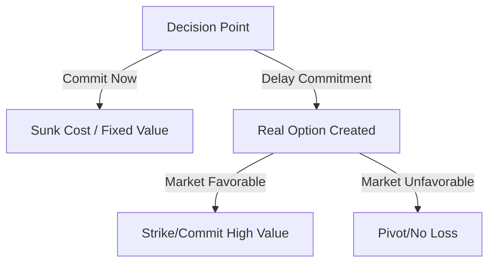

# Law 20: Commit to No One

**Scientific Equivalent:** Real Options Theory & Transaction Cost Optionality
**Primary Discipline:** Financial Economics & Strategic Management

## The Rule
Preserve maximum strategic optionality. Premature alliance locks you into a fixed trajectory, destroying your leverage in the marketplace of power. Maintain absolute structural independence, forcing competing factions to constantly bid for your uncommitted resources.

## The Empirical Evidence
Real Options Theory in financial economics proves that uncommitted resources hold a mathematical premium over deployed assets. Dixit (1989) outlined how entry and exit decisions under uncertainty require preserving the option to pivot. 

An early, binding commitment is a sunk cost that strips you of transaction cost optionality. By committing, you shift from being a scarce, highly valued independent variable to a predictable, depreciating asset within someone else's coalition. You lose the ability to play competing factions against one another and extract continuous concessions. 

## The Strategic Application
*   **Hoard Optionality:** Delay binding agreements until the absolute mathematical peak of your leverage.
*   **Manufacture Bidding Wars:** Signal your availability to multiple competing factions simultaneously. Let their uncertainty over your allegiance drive up your market value.
*   **Remain the Bottleneck:** Position yourself as the unaligned variable required for either side to achieve dominance, forcing both to court you perpetually.
*   **Evade Capture:** Reject all attempts by higher powers to institutionalize or integrate you into their fixed hierarchies.

### Empirical Evidence: Myanmar Case Study
As two major telecom factions battled for market dominance in Myanmar, a prominent tech vendor refused to sign exclusive agreements with either side. By maintaining transaction cost optionality, the vendor played both sides against each other, driving up their own service contracts while avoiding the collateral damage of the corporate war.

> [!WARNING]
> **Backfire Risk:** Perpetual neutrality can unite enemies against you. If both factions realize you are merely extracting value without providing loyalty, they may temporarily collude to eliminate you from the ecosystem.

> [!IMPORTANT]
> **Defensive Application:**
> If a faction pressures you for a premature commitment, recognize it as an attempt to destroy your real options. Maintain your transaction cost optionality by indefinitely delaying your decision, keeping your leverage at its mathematical peak.

---

# Law 21: Play a Sucker to Catch a Sucker—Seem Dumber Than Your Mark

**Scientific Equivalent:** Stereotype Warmth-Competence Trade-Off & Knowledge Hiding (Playing Dumb)
**Primary Discipline:** Social Psychology & Organizational Psychology

## The Rule
Weaponize the incompetence heuristic. Displaying superior intelligence triggers neurobiological threat responses in targets, making them defensive and paranoid. By intentionally signaling lower competence, you bypass their threat detection systems, inflating their ego while silently extracting information and resources.

## The Empirical Evidence
The Stereotype Content Model dictates that humans evaluate others along two primary axes: Warmth and Competence. Fiske et al. (2002) established that demonstrating high competence inherently triggers envy and structural threat in competitors. 

When you intentionally project low competence, you execute a "knowledge hiding" maneuver that drastically lowers the target's vigilance. In Erving Goffman's *The Presentation of Self in Everyday Life*, impression management is a tool of social manipulation. Feigned incompetence flatters the mark's self-worth, converting their paranoia into condescending trust. They volunteer critical information because they calculate you lack the capacity to process or weaponize it.

## The Strategic Application
*   **Suppress the Threat Signature:** Never display your full intellectual capacity. Camouflage your analytical processing behind a facade of harmless simplicity.
*   **Inflate Target Egos:** Ask naive questions to allow the mark to demonstrate their superiority. Their resulting dopamine spike will blind them to your extraction protocols.
*   **Gather Intelligence Asymmetrically:** Use your perceived incompetence to gain access to restricted environments and conversations. People do not hide secrets from the harmless.
*   **Strike from the Blindspot:** Execute your strategic maneuver only when the target is completely convinced of your inferiority, leaving them no time to recalibrate their defenses.

### Empirical Evidence: Myanmar Case Study
An ambitious junior trader at a Yangon exchange deliberately acted naive and asked basic questions to senior brokers. Tricked by his low-competence act, the seniors lowered their guard and openly discussed their proprietary trading strategies around him. Having absorbed their hidden knowledge, the junior trader quietly launched his own highly successful independent fund.

> [!WARNING]
> **Backfire Risk:** Seeming too dumb for too long permanently lowers your image score. If you fail to break the facade at the critical moment, you will simply be bypassed for promotions and treated as genuinely incompetent.

> [!IMPORTANT]
> **Defensive Application:**
> When a competitor appears suspiciously incompetent or naive, assume knowledge hiding. Probe their analytical limits with complex problems; if they refuse to engage, treat them as a high-threat intelligence gatherer.

---

# Law 22: Use the Surrender Tactic: Transform Weakness into Power

**Scientific Equivalent:** Strategic Retreat & Appeasement Signaling (Assessing in Animal Conflict)
**Primary Discipline:** Evolutionary Game Theory [▲ well-replicated]

## The Rule
Deploy submission as a calculated survival mechanism. When facing a mathematically superior force, fighting guarantees total resource destruction. Surrender is not a moral failure; it is an appeasement signal designed to halt the opponent's escalation, preserving your underlying asset base for future conflict.

## The Empirical Evidence
Evolutionary game theory [▲ well-replicated] dictates that animals engaged in asymmetric conflict do not fight to the death. Maynard Smith and Price (1973) codified the logic of animal conflict, demonstrating that weaker opponents use appeasement signaling to immediately terminate the aggression of the dominant party. 

As Thomas Schelling outlines in *The Strategy of Conflict*, surrender is a transaction. By publicly conceding status, you deprive the aggressor of the justification to execute a total annihilation protocol. You trade temporary hierarchical prestige for the preservation of your physical and financial capital, buying the time necessary to recover and restructure your position.

## The Strategic Application
*   **Calculate the Asymmetry:** Instantly recognize when you are mathematically outmatched. Discard pride and initiate the surrender protocol before taking catastrophic losses.
*   **Signal Total Appeasement:** Perform the submission flawlessly. Deny the aggressor any behavioral excuse to escalate to a lethal strike.
*   **Preserve the Core:** Use the peace secured by surrender to quietly rebuild your resource base in the shadows.
*   **Weaponize their Complacency:** Your surrender will breed arrogance and systemic rot in the victor. Wait for their structural decay, then counterattack when the asymmetry has reversed.

### Empirical Evidence: Myanmar Case Study
When a smaller Myanmar retail chain was aggressively targeted for a hostile takeover by a massive conglomerate, they didn't fight an unwinnable legal battle. Instead, they publicly surrendered, offering full compliance while secretly embedding poison pills in their operational contracts. The conglomerate absorbed the toxic assets, heavily degrading their own stock value.

> [!WARNING]
> **Backfire Risk:** Surrender can become a permanent habit. If you rely too heavily on strategic retreat, you may degrade your own internal resolve and lose the capacity for offensive action when it is actually required.

> [!IMPORTANT]
> **Defensive Application:**
> If a dominant opponent expects you to fight a destructive, asymmetric war, deny them the satisfaction. Deploy strategic appeasement signaling to halt their escalation, preserving your core assets for a future, more favorable confrontation.

---

# Law 23: Concentrate Your Forces

**Scientific Equivalent:** Focus, Constrained Optimization, & Resource Allocation
**Primary Discipline:** Operations Research & Strategic Management

## The Rule
Eliminate resource dispersion. Splitting capital, attention, or manpower across multiple vectors guarantees systemic mediocrity and failure. You must marshal every available resource and concentrate it with absolute precision at a single, structural bottleneck to achieve overwhelming local superiority.

## The Empirical Evidence
Operations research relies on constrained optimization to maximize output from limited inputs. Michael Porter’s foundational work on *Competitive Strategy* proves that a lack of strategic focus leads to being "stuck in the middle"—a state of terminal competitive disadvantage.

Dispersion violates the fundamental physics of power. Spreading forces across a wide front dilutes impact and leaves all nodes vulnerable to targeted strikes. Concentrating resources acts as a force multiplier. By directing all kinetic energy at a single critical vulnerability, you generate enough mass to breach defensive structures that would easily repel a distributed attack.

## The Strategic Application
*   **Identify the Bottleneck:** Scan the system for the single point of failure or maximum leverage. Ignore all secondary targets.
*   **Eliminate Dispersion:** Ruthlessly strip resources, time, and capital from all peripheral operations. 
*   **Achieve Local Superiority:** Deploy your consolidated forces to outnumber and overwhelm the target at the precise point of attack, regardless of overall global disadvantage.
*   **Maintain Singular Focus:** Resist the temptation to expand or diversify until the primary structural objective has been completely conquered and secured.

### Empirical Evidence: Myanmar Case Study
A local e-commerce platform in Myanmar realized they could not compete with multinational giants on all fronts. They abandoned nationwide delivery and concentrated all their capital and logistical forces solely on the Mandalay metropolitan area. By achieving absolute monopoly in one specific node, they forced the multinationals to negotiate a lucrative buyout.

> [!WARNING]
> **Backfire Risk:** Over-concentration creates a single point of failure. If your heavily fortified niche is disrupted by sudden technological or regulatory shifts, you have no diversified assets to fall back on.

> [!IMPORTANT]
> **Defensive Application:**
> When a rival tries to force you into a multi-front war, refuse the dispersion. Apply constrained optimization to maintain total focus on their single point of failure, ignoring their peripheral distractions until you breach their core.

---

# Law 24: Play the Perfect Courtier

**Scientific Equivalent:** Strategic Impression Management & Self-Monitoring
**Primary Discipline:** Social Psychology

## The Rule
Navigate power structures by systematically adapting your social persona to match the ego demands of elite actors. Do not rely on "authentic" behavior; authenticity in a hierarchy is a fatal vulnerability. Instead, become a high self-monitor—scan the environmental cues, calculate the required behavioral response, and mirror the expectations of those who control your resources.

## The Empirical Evidence
In hierarchical systems, survival depends on cognitive flexibility, not static personality. Social psychology identifies "self-monitoring" as the primary mechanism for social ascent. Mark Snyder (1974) demonstrated that individuals who excel at reading social cues and modifying their expressive behavior (high self-monitors) consistently outperform rigid actors in organizational environments.

Jeffrey Pfeffer [▲ well-replicated]’s analysis of power structures reveals that elite actors unconsciously reward subordinates who validate their worldview and reflect their ideal self-image. Adapting your demeanor to the situation is not sycophancy; it is a calculated deployment of impression management to extract resources. Rigid adherence to a single "authentic" identity guarantees friction and ultimate exclusion from the elite ranks.

## The Strategic Application
*   **Suppress Authenticity:** Treat your personality as a configurable tool, not a sacred identity. Adjust your behavioral output to match the target's specific ego parameters.
*   **Scan and Mirror:** Continuously monitor the social environment. Identify the unwritten rules, the dominant biases, and the preferred communication styles of the ruling class. Mirror them flawlessly.
*   **Calibrate Deference:** Modulate your displays of competence and submissiveness based on the insecurity level of the superior. Provide the exact degree of ego validation they require to feel safe and powerful.
*   **Conceal the Effort:** The adaptation must appear effortless and natural. If the target detects the calculation, the impression management fails, triggering extreme distrust and retaliatory exclusion.

### Empirical Evidence: Myanmar Case Study
In the deeply hierarchical structure of Myanmar's ministries, a mid-level bureaucrat mastered strategic impression management. He never openly disagreed with his superiors, always framed his innovations as their ideas, and flawlessly navigated office politics. By playing the perfect courtier, he secured rapid promotions over far more technically competent but less socially adept peers.

> [!WARNING]
> **Backfire Risk:** Being perceived purely as a courtier makes you expendable during a crisis. When structural collapse threatens, leaders discard sycophants and desperately seek highly competent operators to save the system.

> [!IMPORTANT]
> **Defensive Application:**
> If you observe a high self-monitor flawlessly adapting to your ego, recognize the artificiality. Test their authenticity by unexpectedly altering your own behavioral parameters; their lag in adaptation will expose their strategic impression management.

---

# Law 25: Re-create Yourself

**Scientific Equivalent:** Impression Management & Narrative Identity Construct
**Primary Discipline:** Developmental Psychology & Sociology

## The Rule
Never allow your social identity to be defined by default or by the projections of others. Identity is a manufactured construct. Actively author and project a coherent, dynamic narrative persona that maximizes your status leverage. You are not a static entity; you are a continuous process of calculated self-creation.

## The Empirical Evidence
Human identity is inherently malleable, operating as a narrative constructed for social utility. Dan McAdams (1985) established that "the life story" is not a passive record, but a psychological mechanism used to organize experience and project power. 

Erving Goffman’s framework in *The Presentation of Self in Everyday Life* proves that all social interaction is a performance. Individuals who fail to control their own narrative are inevitably assigned a subordinate role by the group. You either construct your own identity architecture, or you become a passive object in someone else’s. Controlling the narrative allows you to dictate the parameters by which others judge your competence, warmth, and status.

## The Strategic Application
*   **Author the Narrative:** Treat your public persona as a high-value asset. Design a compelling origin story and a coherent trajectory that signals competence, resilience, and inevitable success.
*   **Override Stereotypes:** Preemptively shatter the limiting categories that others attempt to force upon you. Disrupt their heuristics by presenting contradictory, high-status signals.
*   **Maintain Persona Plasticity:** Avoid rigid commitments to a single identity. Evolve your narrative to exploit changing environmental conditions and newly available resources.
*   **Project Dramatic Coherence:** Ensure that your actions, aesthetics, and communications align perfectly with your chosen persona. Inconsistencies shatter the illusion and expose the performance, destroying your credibility.

### Empirical Evidence: Myanmar Case Study
A former military officer transitioning to civilian business in Yangon realized his rigid, authoritarian persona was alienating modern tech investors. He completely re-created his narrative identity, rebranding himself as an agile, forward-thinking venture capitalist. By controlling his own image, he successfully integrated into the civilian elite.

> [!WARNING]
> **Backfire Risk:** Inconsistent reinventions destroy narrative cohesion. If your network catches you rapidly shifting between contradictory personas, you will trigger the "uncanny valley" of trust, being labeled a psychopath.

> [!IMPORTANT]
> **Defensive Application:**
> When an opponent attempts to project an intimidating, highly curated narrative persona, look for the inconsistencies. By exposing the gaps in their identity construct, you shatter their credibility and neutralize their social leverage.

---

# Law 26: Keep Your Hands Clean

**Scientific Equivalent:** Attribution Theory & Self-Serving / Scapegoat Biases
**Primary Discipline:** Social Psychology

## The Rule
Insulate your core reputation from the inevitable fallout of execution. Under no circumstances should you be directly associated with failures, unpopular decisions, or destructive actions. Delegate all high-risk, negative-sum operations to intermediaries, exploiting the human cognitive bias to blame the most proximate actor. 

## The Empirical Evidence
Human perception of causality is flawed and predictable. Fritz Heider (1958) and subsequent research on the Fundamental Attribution Error demonstrate that observers automatically attribute outcomes—especially negative ones—to the direct, visible actor, ignoring the systemic or hidden forces (i.e., you) that actually commanded the action.

By inserting a proxy between yourself and the negative action, you manipulate this attribution bias. The scapegoat absorbs the reputational damage and the retaliatory hostility. The coordinator remains untouched, preserving their "image score" (Nowak & Sigmund, 1998) and maintaining the capacity to operate as a benevolent, high-status node within the network.

## The Strategic Application
*   **Deploy the Cat's-Paw:** Never execute dirty work personally. Use subordinates or ambitious proxies to carry out hostile maneuvers. Let them absorb the friction.
*   **Manufacture Scapegoats:** Maintain a roster of expendable actors. When an operation fails or generates unacceptable blowback, publicly sever ties with the proxy, channeling the group’s anger onto them.
*   **Maintain Plausible Deniability:** Ensure all instructions for negative actions are ambiguous, unrecorded, or delegated through complex chains of command. 
*   **Monopolize the Positive:** While delegating all negative interactions, personally deliver all rewards, pardons, and high-status benefits. Train the network to associate you exclusively with positive utility.

### Empirical Evidence: Myanmar Case Study
The head of a major Myanmar construction firm never personally fired underperforming managers. Instead, he employed a notoriously strict HR director to act as the scapegoat. When mass layoffs were required to cut costs, the HR director absorbed the collective anger, leaving the CEO's reputation as a benevolent leader entirely intact.

> [!WARNING]
> **Backfire Risk:** Relying heavily on scapegoats creates internal paranoia. If your team realizes you will effortlessly sacrifice them to protect your own image, they will preemptively document your directives to use against you.

> [!IMPORTANT]
> **Defensive Application:**
> If a leader consistently uses proxies to execute negative-sum operations while keeping their hands clean, pierce the attribution bias. Publicly map the causal chain back to the architect, ensuring they incur the reputational damage of their own directives.

---

# Law 27: Play on People's Need to Believe to Create a Cult-Like Following

**Scientific Equivalent:** In-Group Favoritism, Social Identity Theory, & The "Hive Switch"
**Primary Discipline:** Evolutionary Social Psychology

## The Rule
Exploit the evolutionary vulnerability of the human mind: the desperate need for tribal belonging and absolute certainty. Bypass rational self-interest by manufacturing a unified in-group identity. Construct a belief system that triggers the "hive switch," dissolving the individual ego into a weaponized, fiercely loyal collective.

## The Empirical Evidence
Rationality is a thin veneer over primal tribal instincts. Social Identity Theory (Tajfel & Turner, 1979) proves that humans will rapidly abandon objective logic in favor of group cohesion. The psychological reward of belonging overrides the individual's cost-benefit analysis.

Jonathan Haidt’s concept of the "hive switch" reveals that under specific conditions—shared rituals, charismatic authority, and synchronized action—humans transition from self-interested individuals to a synchronized super-organism. This state generates immense, uncritical loyalty and absolute hostility toward out-groups, creating an incredibly powerful engine for coordinated action. 

## The Strategic Application
*   **Construct a Binary Reality:** Divide the world sharply into a virtuous, elite in-group (your followers) and a corrupt, hostile out-group. Use this external threat to forge internal cohesion.
*   **Establish Sacred Rituals:** Implement shared, synchronized behaviors and exclusive lexicons. These non-rational actions trigger neurobiological bonding and reinforce submission to the group architecture.
*   **Demand Escalating Commitments:** Use the sunk-cost fallacy and cognitive dissonance to solidify loyalty. Extract small initial sacrifices, escalating them over time to make defection psychologically devastating.
*   **Offer the Illusion of Certainty:** Provide simple, overarching explanations for complex, anxiety-inducing problems. The relief of certainty is a potent narcotic that ensures continued dependency on your leadership.

### Empirical Evidence: Myanmar Case Study
A charismatic crypto-entrepreneur in Myanmar leveraged social identity theory to build an intense following among young, disenfranchised investors. By creating an artificial in-group with specialized jargon and framing traditional banks as the enemy, he triggered the "hive switch." His followers defended his highly volatile token with religious fervor despite massive financial losses.

> [!WARNING]
> **Backfire Risk:** Cult-like dynamics are inherently unstable. Once the illusion of infallibility breaks or the financial returns collapse, the in-group's religious fervor will invert, turning them into a hyper-coordinated mob seeking your destruction.

> [!IMPORTANT]
> **Defensive Application:**
> When a group attempts to trigger your hive switch through in-group favoritism and shared rituals, maintain cognitive distance. Refuse the psychological comfort of the collective and subject their belief system to ruthless, objective logic.

---

# Law 28: Enter Action with Boldness

**Scientific Equivalent:** Overconfidence Signaling & The Confidence Heuristic
**Primary Discipline:** Behavioral Decision Making & Social Psychology

## The Rule
Never project hesitation, doubt, or excessive deliberation. Observers lack the bandwidth to directly verify your competence; they use your visible confidence as a proxy. Weaponize this heuristic. Execute every maneuver with absolute, calculated boldness to instantly command deference and suppress opposition.

## The Empirical Evidence
In complex social systems, true competence is often opaque and difficult to measure. Consequently, the brain relies on the "confidence heuristic." Anderson et al. (2012) demonstrated that individuals who project high confidence—even when objectively unwarranted—are consistently awarded higher social status, influence, and resources by the group.

Boldness acts as a high-intensity signal that bypasses logical scrutiny. It exploits the human tendency to assume that certainty correlates with accuracy. Hesitation signals weakness and invites attack; boldness paralyzes the target's cognitive defenses, forcing them to react to your initiative rather than formulate their own.

## The Strategic Application
*   **Signal Absolute Certainty:** Eliminate all verbal and physical markers of doubt. Speak decisively, act without hesitation, and project an aura of inevitable success. 
*   **Exploit the Shock Value:** Use sudden, massive, and unexpected action to overwhelm the opponent’s cognitive processing capacity. Boldness creates a reality distortion field that you control.
*   **Conceal the Calculation:** True boldness is not recklessness. Rigorously calculate the risks and plan the contingencies in private, but execute the final action with the appearance of fearless spontaneity.
*   **Crush Hesitation:** Half-measures are fatal. If you commit to an action, execute it with overwhelming force. Retreating or pausing mid-execution exposes the vulnerability and invites immediate counterattack.

### Empirical Evidence: Myanmar Case Study
During a critical board meeting of a faltering Myanmar energy company, an outside consultant boldly proposed firing the entire executive suite and pivoting to renewables. Her sheer overconfidence signaling hijacked the room's cognitive heuristics. Overwhelmed by her unhesitating boldness, the board bypassed their usual risk-averse analysis and approved the radical plan.

> [!WARNING]
> **Backfire Risk:** Boldness without underlying competence is fatal. If your overconfident execution triggers a catastrophe, the damage to your reputation is magnified because you explicitly claimed absolute certainty.

> [!IMPORTANT]
> **Defensive Application:**
> If an opponent executes a maneuver with extreme, paralyzing boldness, recognize it as overconfidence signaling. Do not retreat; pause and apply rigorous analytical scrutiny. Often, the boldness is a facade masking deep structural vulnerabilities.

---

# Law 29: Plan All the Way to the End

**Scientific Equivalent:** Planning Fallacy Mitigation & Prospective Hindsight (Pre-Mortem)
**Primary Discipline:** Cognitive Psychology & Systems Dynamics

## The Rule
Humans are cognitively wired to underestimate the friction of reality. Optimism is not a virtue; it is a systemic bias that destroys execution. To achieve invulnerability, you must reverse-engineer your strategy from the point of ultimate completion. Calculate the cascading consequences, calculate the friction, and calculate the catastrophic failures before they manifest.

## The Empirical Evidence
The human brain systematically fails at predicting future variables. Daniel Kahneman and Amos Tversky (1979) established the foundation of the planning fallacy—the hardwired cognitive glitch where individuals construct best-case scenarios and mistake them for probable outcomes. As explored in *Thinking, Fast and Slow* and *Thinking in Systems*, agents ignore base rates of failure because they are blinded by their own intent. 

To neutralize this, systems dynamics relies on "prospective hindsight." By simulating a future state where the project has utterly collapsed (a pre-mortem), the brain bypasses its own optimism bias and detects structural vulnerabilities. This is not pessimism; it is a mathematical necessity for survival.

## The Strategic Application
*   **Execute the Pre-Mortem:** Before committing resources to any campaign, assume it has failed catastrophically. Work backward to identify the specific vectors of failure, then engineer contingencies for each one.
*   **Calibrate with Base Rates:** Ignore your internal confidence. Look at the historical failure rates of similar endeavors in the environment. Anchor your timeline and resource allocation to cold statistics, not hope.
*   **Map Second-Order Effects:** Do not stop at the immediate outcome. Chart the systemic ripple effects of your victory. If achieving the goal creates an unsustainable backlash, the plan is flawed.
*   **Weaponize the Planning Fallacy:** Allow your competitors to remain trapped in their optimism. Encourage their grandiose, poorly calculated plans, then position yourself to exploit the inevitable resource exhaustion when reality breaks their timeline.

### Empirical Evidence: Myanmar Case Study
A logistics magnate in Naypyidaw utilized pre-mortem analysis before launching a cross-border trucking fleet. By planning all the way to the end, he anticipated sudden border closures and pre-secured warehouse monopolies along the route. When a geopolitical crisis shut the borders, his competitors went bankrupt while he profited immensely from storage fees.

> [!WARNING]
> **Backfire Risk:** Rigid adherence to a long-term plan prevents phenotypic plasticity. If the fundamental environment changes, stubbornly following the original blueprint leads to guaranteed failure.

> [!IMPORTANT]
> **Defensive Application:**
> When a competitor confidently presents a flawless, best-case scenario, apply prospective hindsight. Conduct a pre-mortem on their plan, highlighting the inevitable friction and hidden failure vectors, effectively neutralizing their optimism bias.

---