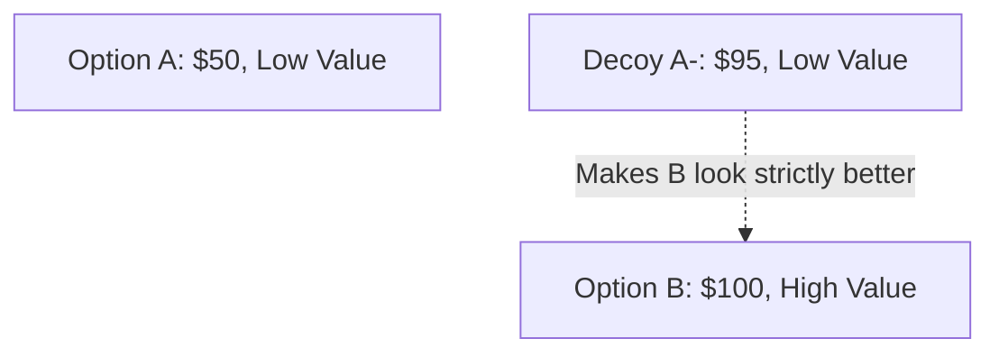
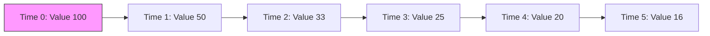

# Law 30: Make Your Accomplishments Seem Effortless

**Scientific Equivalent:** Processing Fluency & Cognitive Ease
**Primary Discipline:** Cognitive Psychology

## The Rule
Exposing the machinery of your success destroys the illusion of power. When you reveal the sweat, the struggle, and the friction required to achieve a goal, you demystify yourself. You must weaponize cognitive ease. Present your victories as natural, inevitable outgrowths of your innate superiority, forcing observers to process your competence as a fundamental law of nature rather than the result of brute labor.

## The Empirical Evidence
Processing fluency directly dictates human trust and aesthetic appreciation. Cognitive psychologists, including Reber, Schwarz, and Winkielman (2004), demonstrated that when information is easy for the brain to process, it triggers positive affect, perceived truthfulness, and an assessment of high value. Conversely, cognitive strain—induced by witnessing the messy, difficult, or complex mechanics behind an action—triggers vigilance and suspicion.

As detailed in *Thinking, Fast and Slow*, "cognitive ease" creates an illusion of flawless competence. When a target observes an action that appears entirely frictionless, their System 1 thinking immediately attributes the outcome to godlike, innate mastery. Exposing the effort breaks the fluency, inviting System 2 scrutiny and diminishing your perceived power.

## The Strategic Application
*   **Conceal the Friction:** Never complain about the late hours, the near-failures, or the sheer volume of work required to secure a victory. Bury the evidence of your labor.
*   **Automate the Illusion:** Rehearse your execution in the shadows until it becomes autonomic. Only perform in public when the action has been stripped of all visible strain.
*   **Deploy Fluency as a Shield:** By presenting complex achievements as simple and effortless, you deter challengers. Competitors will overestimate your baseline capabilities and avoid engaging you in direct conflict.
*   **Induce Cognitive Strain in Rivals:** Force your opponents to explain themselves, to show their work, and to labor visibly. Let the audience witness their struggle, systematically stripping away their mystique.

### Empirical Evidence: Myanmar Case Study
A master gem trader in Mogok always executed multi-million dollar negotiations with relaxed, almost bored body language. By leveraging processing fluency, he made his immense geological knowledge and ruthless haggling seem entirely effortless. This cognitive ease disarmed his rivals, who consistently underestimated the lethal calculation behind his casual demeanor.

> [!WARNING]
> **Backfire Risk:** Appearing too effortless can breed resentment among peers who value hard work. If stakeholders believe you aren't expending metabolic energy, they may cut your compensation, assuming the task is intrinsically easy.

> [!IMPORTANT]
> **Defensive Application:**
> If a rival uses processing fluency to make their achievements seem effortless and magical, expose the mechanics. By revealing the brute labor and friction behind their success, you induce cognitive strain in observers and destroy their mystique.

---

# Law 31: Control the Options: Get Others to Play with the Cards You Deal

**Scientific Equivalent:** Choice Architecture & Asymmetric Dominance (Decoy Effect)
**Primary Discipline:** Behavioral Economics & Marketing Science

## The Rule
Agency is an illusion. Do not force compliance; engineer the environment so that the target voluntarily selects your preferred outcome. By controlling the parameters of the choice, you dictate the result while leaving the target's ego intact. You are not a dictator; you are the architect of their perceived reality.

## The Empirical Evidence
Human decision-making is profoundly context-dependent and easily manipulated by structural framing. Behavioral economists have proven that "choice architecture" governs behavior far more effectively than coercion. Huber, Payne, and Puto (1982) documented the "decoy effect" (asymmetric dominance), where the introduction of an inferior third option predictably shifts consumer preference toward the architect's target option. 

As outlined in *Nudge*, humans do not evaluate options in a vacuum. They rely on relative comparisons. By curating the menu of available options, you hijack the brain's comparative heuristics. The target feels the autonomy of choice, completely unaware that every option on the table leads directly to your objective.

## The Strategic Application
*   **Deploy the Decoy:** Whenever presenting a choice, introduce a deliberately flawed option that makes your preferred outcome look mathematically and logically superior.
*   **Frame the Default:** Harness the status quo bias by making your desired outcome the default path of least resistance. Force opponents to expend immense cognitive and social energy to opt out.
*   **Construct the Double Bind:** Offer two distinct paths that both serve your strategic interests. Let the opponent agonizingly debate which route to take, blinding them to the fact that you win either way.
*   **Preserve the Illusion of Agency:** Never mandate. Suggest, frame, and curate. When the target believes the decision was theirs, they will fiercely defend it, acting as your proxy without realizing it.

### Empirical Evidence: Myanmar Case Study
A political broker in Yangon wanted his preferred candidate elected to the municipal council. He didn't just promote his guy; he secretly funded two highly extreme, unlikable decoy candidates. By utilizing choice architecture and asymmetric dominance, he forced the voters to choose his candidate as the only "rational, moderate" option available.

> [!WARNING]
> **Backfire Risk:** If targets realize the choice architecture has been artificially constrained, they will experience violent psychological reactance and reject all provided options, burning down the entire framework.

> [!IMPORTANT]
> **Defensive Application:**
> When presented with a curated set of options, look for the decoy effect. Recognize that the choice architecture was designed to manipulate you; reject the menu entirely and introduce your own structurally dominant alternatives.

---

# Law 32: Play to People's Fantasies

**Scientific Equivalent:** Motivated Reasoning & Confirmation Bias
**Primary Discipline:** Cognitive Psychology

## The Rule
Reality is cold, brutal, and psychologically intolerable for the majority. Do not attempt to persuade with objective facts or rational arguments. Instead, identify the psychological voids, the desperate hopes, and the suppressed desires of your targets. Feed them the fantasy they crave, and their own neurobiology will override their critical thinking, rendering them utterly compliant.

## The Empirical Evidence
The human brain is not a truth-seeking engine; it is an ego-preservation machine. Kunda (1990) established the framework for "motivated reasoning," demonstrating that when individuals are presented with information that aligns with their deepest desires, they subject it to almost zero cognitive scrutiny. 

As detailed in *The Elephant in the Brain*, humans continuously deceive themselves to function in society. When you supply a narrative that affirms a target's fantasy—whether it is sudden wealth, unearned status, or absolute security—you hijack their confirmation bias. Their brain will actively fight to defend the delusion, attacking anyone who attempts to reintroduce reality.

## The Strategic Application
*   **Target the Void:** Analyze the target to locate their deepest insecurity or unfulfilled desire. Craft your narrative to perfectly bridge the gap between their current reality and their idealized self.
*   **Bypass the Rational:** Strip your pitches of complex data, nuanced risks, and harsh truths. Use vague, emotionally charged language that allows the target to project their own fantasies onto your words.
*   **Weaponize Confirmation Bias:** Once the target has accepted the fantasy, they will do the work of convincing themselves. Provide just enough superficial evidence to allow them to rationalize the delusion.
*   **Maintain Plausible Deniability:** Never make concrete promises that can be empirically disproven. Sell the feeling of the outcome, ensuring the fantasy remains perpetually just out of reach.

### Empirical Evidence: Myanmar Case Study
Recognizing the desperate desire for rapid wealth in rural Myanmar, a micro-lending firm stopped selling "slow, steady financial growth." Instead, they marketed their loans as the gateway to "immediate elite status and luxury." By playing to motivated reasoning and confirmation bias, they bypassed rational risk assessment, resulting in massive, albeit predatory, adoption.

> [!WARNING]
> **Backfire Risk:** Reality always violently reasserts itself. When the fantasy inevitably collapses, the cognitive dissonance of the victims turns into targeted vengeance, leading to severe regulatory or physical retaliation.

> [!IMPORTANT]
> **Defensive Application:**
> If a manipulator appeals to your deepest fantasies and confirmation bias, force yourself into extreme skepticism. Demand empirical, peer-reviewed data to support their claims, preventing your own motivated reasoning from sealing the trap.

---

# Law 33: Discover Each Man's Thumb-Screw

**Scientific Equivalent:** Individual Differences & Target Profiling (The Dark Triad)
**Primary Discipline:** Personality Psychology & Psychopathology

## The Rule
Every individual possesses a critical psychological vulnerability—an unhealed wound, an irrational fear, or a volatile vanity. Treat humans not as equals, but as mechanisms to be decoded. Profile your targets to isolate their specific behavioral trigger. Once you possess their thumb-screw, you possess them.

## The Empirical Evidence
Human behavior is predictably organized around core personality traits and psychological deficits. Personality psychology maps these individual differences, isolating the specific levers of manipulation. Paulhus and Williams (2002) identified the "Dark Triad" of personality—narcissism, Machiavellianism, and psychopathy—demonstrating how operators exploit social environments by reading and manipulating the trait vulnerabilities of others.

As explored in neurobiological frameworks like *Behave*, individuals are driven by deeply ingrained, often unconscious neurochemical reward systems and fear responses. Whether it is a desperate need for validation (high neuroticism) or an insatiable hunger for status (narcissism), these traits act as hardwired backdoors. Discovering a target's thumb-screw is the process of mapping these psychological exploits to bypass their rational defenses.

## The Strategic Application
*   **Map the Vulnerability:** Observe the target in moments of stress or off-guard relaxation. Look for what they overcompensate for, what they fiercely defend, or what triggers irrational anger. That is the thumb-screw.
*   **Exploit the Ego:** For the insecure, weaponize validation. Withhold it to induce panic, supply it to induce absolute loyalty. 
*   **Leverage the Fear:** For the risk-averse, manufacture subtle, ambiguous threats that only you can protect them from. Position yourself as the sole barrier between them and their neuroses.
*   **Conceal the Extraction:** Turn the screw slowly. The target must never realize their fundamental psychology is being operated like a machine. If they detect the manipulation, the relationship shatters into hostility.

### Empirical Evidence: Myanmar Case Study
An ambitious executive mapping out her competitors in a Myanmar tech firm systematically profiled a rival director. She discovered his psychological thumb-screw: a deep-seated insecurity about his educational background. By subtly highlighting his lack of a foreign degree in board meetings, she triggered his ego-defensive aggression, causing him to act erratically and eventually get fired.

> [!WARNING]
> **Backfire Risk:** Exploiting a core trauma can provoke a non-linear, destructive response. If the thumb-screw triggers an existential meltdown, the target may adopt a suicide-bomber mentality, destroying their own career just to take you down.

> [!IMPORTANT]
> **Defensive Application:**
> When an operator attempts to exploit your psychological thumb-screw, recognize the manipulation of your specific trait vulnerability. Cultivate emotional detachment and construct behavioral firewalls to deny them access to your underlying neurobiology.

---

# Law 34: Act Like a King to Be Treated Like One

**Scientific Equivalent:** Status Signaling Theory & Prestige Dominance
**Primary Discipline:** Evolutionary Anthropology & Social Psychology

## The Rule
Command the neurobiological deference of others by hacking their status-detection heuristics. Humans do not evaluate competence logically; they process behavioral markers of prestige. If you project the expansive physical and vocal signals of an elite, observers' brains will automatically confer dominance upon you.

## The Empirical Evidence
Human hierarchies operate on reflexive cognitive heuristics. Evolutionary anthropologists Henrich and Gil-White (2001) established that humans evolved to instinctively defer to "prestige"—a form of status freely conferred to those displaying specific behavioral markers. 

As Will Storr [▲ well-replicated] outlines in *The Status Game*, observers constantly scan for dominance signals. Erect posture, steady vocal cadence, and expansive use of physical space bypass critical analysis and directly trigger deference routines in the mammalian brain. When you signal high status, you exploit an evolutionary glitch: observers assume your confidence is backed by underlying competence, granting you the power and resources of a king before you have mathematically earned them.

## The Strategic Application
*   **Hack the Deference Heuristic:** Adopt the physical dimensions of prestige. Maintain unflinching eye contact, eliminate fidgeting, and speak with a slow, low-pitch cadence to project absolute internal certainty.
*   **Demand Elite Treatment:** Anchor your value artificially high. Reject low-status compromises immediately to force counterparties to recalibrate their assessment of your market worth.
*   **Back the Bluff:** Confidence without competence eventually triggers a catastrophic reputational collapse. Use the unearned status to secure resources, then rapidly acquire the skills required to justify your rank.
*   **Ignore the Middle:** Do not attempt a gradual ascent. Act as if you already belong at the apex, forcing the hierarchy to accommodate your perceived reality rather than your objective starting position.

### Empirical Evidence: Myanmar Case Study
A self-made entrepreneur from a rural Myanmar village relocated to Yangon and immediately adopted the behavioral signaling of the old-money elite. He hosted high-society galas and refused mid-tier contracts. Through relentless status signaling theory, the business community's heuristic filters categorized him as high-prestige, and he was soon invited into exclusive boardrooms.

> [!WARNING]
> **Backfire Risk:** Pretending to be a king without the baseline capital to sustain the illusion leads to rapid exposure. If you fail a basic financial stress test, you will be permanently exiled as a fraud.

> [!IMPORTANT]
> **Defensive Application:**
> If an opponent uses expansive physical and vocal cues to hijack the prestige deference heuristic, consciously override your instinct to submit. Treat their status signals as data points, not commands, and force them to prove their competence empirically.

---

# Law 35: Master the Art of Timing

**Scientific Equivalent:** Hyperbolic Discounting & Temporal Utility Mapping
**Primary Discipline:** Behavioral Economics & Decision Theory

## The Rule
Weaponize the biological impatience of your opponents. The human brain systematically miscalculates the value of time, heavily favoring immediate gratification over delayed superior outcomes. By mastering temporal control, you force desperate counterparties into devastating strategic concessions.

## The Empirical Evidence
The human brain is fundamentally flawed at evaluating time. Behavioral economist David Laibson (1997) mathematically mapped this vulnerability through "hyperbolic discounting." Humans steeply discount future payoffs, acting impulsively to secure immediate rewards while sacrificing massive long-term utility.

This temporal distortion is a structural weakness you can exploit. When you master timing, you capture the value others abandon in their rush for closure. When you artificially manipulate deadlines or exhibit absolute temporal indifference, you force opponents driven by hyperbolic discounting to bid against their own best interests just to alleviate the psychological tension of waiting.

**Hyperbolic Discounting Curve**

## The Strategic Application
*   **Weaponize the Pause:** Induce panic in counterparties by withholding immediate responses. Silence distorts their temporal perception, driving them to offer unprompted concessions to break the tension.
*   **Exploit Hyperbolic Discounting:** Offer opponents immediate, low-value rewards in exchange for massive future concessions. Their neurobiology will force them to accept the terrible trade.
*   **Manufacture False Urgency:** Impose artificial deadlines on competitors. Compressing their decision-making window forces them into heuristic, error-prone (System 1) thinking.
*   **Maintain Absolute Temporal Indifference:** Never reveal that you are bound by a clock. The party who appears to possess infinite time inevitably dictates the terms of the agreement.

### Empirical Evidence: Myanmar Case Study
A savvy real estate investor in Mandalay understood hyperbolic discounting. During an economic panic, while others frantically sold off properties at a discount to secure immediate liquidity, he patiently hoarded cash. He timed his entry perfectly at the market's absolute bottom, acquiring a vast portfolio of prime real estate for pennies on the dollar.

> [!WARNING]
> **Backfire Risk:** Over-optimizing timing leads to paralysis. If you wait perpetually for the mathematically perfect moment to strike, the window of opportunity will close, leaving you with zero yield.

> [!IMPORTANT]
> **Defensive Application:**
> When a competitor uses temporal pressure to exploit your hyperbolic discounting, artificially extend your time horizon. Refuse immediate, low-value offers and demonstrate absolute temporal indifference to force them into long-term concessions.

---

# Law 36: Disdain Things You Cannot Have: Ignoring Them Is the Best Revenge

**Scientific Equivalent:** Cognitive Dissonance [▲ well-replicated] Reduction (Sour Grapes Rationalization)
**Primary Discipline:** Cognitive Psychology

## The Rule
Eradicate the status value of an opponent by entirely denying them your attention. Acknowledging an unattainable resource or a minor enemy transfers your social capital to them. Weaponize cognitive dissonance to devalue the target, rendering them strategically irrelevant.

## The Empirical Evidence
Attention is the ultimate currency of status transfer. When humans desire something they cannot attain, they suffer from cognitive dissonance—a state of acute psychological distress. As Aronson (1969) and Kay et al. on system justification proved, the brain resolves this tension by retroactively altering beliefs. 

In the classic "sour grapes" rationalization, denigrating the unattainable object neutralizes its psychological power over you. Applied externally, this is a lethal social weapon. When you publicly disdain an enemy or an unreachable prize, you signal absolute superiority. By refusing to engage, you starve the opponent of the reactive attention they require to validate their own status, effectively erasing them from the hierarchy.

## The Strategic Application
*   **Starve the Threat:** Never acknowledge a minor opponent's attacks. Reacting mathematically elevates their status to match your own. Total indifference annihilates their social validity.
*   **Deploy Sour Grapes Logically:** When a resource is structurally blocked, instantly reframe it as inherently worthless. This preserves your psychological baseline and prevents status leakage.
*   **Weaponize Silence:** When denied a request, do not argue or complain. Acknowledge the rejection with cold, dismissive silence, immediately transferring the psychological discomfort back to the denier.
*   **Erase the Unattainable:** If you cannot destroy an enemy conventionally, destroy their relevance. Act as if they do not exist, forcing third-party observers to adopt your framing of their insignificance.

### Empirical Evidence: Myanmar Case Study
When a high-profile Myanmar socialite was excluded from an exclusive government gala, she did not complain publicly. Instead, she threw a lavish, competing charity event on the exact same night and visibly ignored the gala entirely. Her sour grapes rationalization was enacted so effectively that the original gala appeared irrelevant and poorly attended.

> [!WARNING]
> **Backfire Risk:** Feigned disdain is easily detected if not executed perfectly. If your body language or indirect actions reveal you actually care deeply, your disdain is exposed as mere bitterness, further lowering your status.

> [!IMPORTANT]
> **Defensive Application:**
> If a rival uses the sour grapes rationalization to devalue your achievements through disdain, ignore their cognitive dissonance. Do not seek their validation; their refusal to engage is a mathematical proof of your dominance.

---

# Law 37: Create Compelling Spectacles

**Scientific Equivalent:** The Psychology of Awe, Memory Anchoring, & Visual Salience
**Primary Discipline:** Cognitive Science & Emotion

## The Rule
Hijack the critical faculties of the masses by engineering sensory overload. Humans cannot simultaneously process profound awe and rigorous logical analysis. By manufacturing massive, salient spectacles, you bypass rational defense mechanisms and anchor deep, compliant emotional responses in your targets.

## The Empirical Evidence
Spectacle is a neurobiological override code. Research by Keltner and Haidt (2003) demonstrates that experiencing "awe" triggers a forced cognitive accommodation—the brain temporarily suspends its existing mental models to process the vastness of the stimulus. 

When you deploy intense visual and auditory salience, you shut down the target's analytical processing (System 2). Grand displays, coordinated rituals, and striking aesthetics do not just entertain; they induce a state of mild cognitive paralysis. This allows you to implant emotional anchors and command total deference without ever having to engage in the vulnerable arena of logical persuasion.

## The Strategic Application
*   **Engineer Awe:** Deploy overwhelming aesthetic and sensory displays. Use scale, lighting, and dramatic timing to force targets into cognitive accommodation.
*   **Bypass the Cortex:** Never rely purely on data or logical arguments to build a coalition. Package your directives inside a visual spectacle that demands emotional surrender.
*   **Anchor the Memory:** Pair your appearance with highly salient, novel stimuli. The human brain prioritizes the encoding of distinct, emotionally charged events, ensuring your dominance is burned into their long-term memory.
*   **Use the Halo Effect:** Surround yourself with the physical trappings of myth and grandeur. Observers will automatically conflate the brilliance of the spectacle with the brilliance of your leadership.

### Empirical Evidence: Myanmar Case Study
To distract from plunging quarterly profits, a Myanmar telecom giant staged an awe-inspiring, nationwide drone light show over the Shwedagon Pagoda (at a safe distance). The visual salience and emotional awe anchored the public memory to the spectacle rather than the financial reports, effectively neutralizing the negative press cycle.

> [!WARNING]
> **Backfire Risk:** Spectacles require immense capital and only offer temporary distraction. If the underlying structural rot is not fixed while the audience is distracted, the subsequent collapse will be even more catastrophic.

> [!IMPORTANT]
> **Defensive Application:**
> When subjected to a highly salient spectacle designed to induce awe and bypass your cortex, anchor yourself in cold logic. Strip away the aesthetics and analyze the raw data of the interaction to prevent the implantation of compliant emotional anchors.

---

# Law 38: Think as You Like but Act Like Others

**Scientific Equivalent:** Conformity Bias & Normative Social Influence (Social Proof)
**Primary Discipline:** Social Psychology

## The Rule
Protect your intellectual autonomy by mastering the camouflage of social conformity. Tribes ruthlessly identify and attack deviants. To survive and operate from within, you must publicly broadcast flawless compliance with group norms while privately calculating their destruction.

## The Empirical Evidence
Human groups operate as predatory immune systems, programmed to eradicate non-conformity. The seminal experiments by Solomon Asch (1956) proved the terrifying power of normative social influence: individuals will explicitly deny objective reality simply to align with the consensus of the majority and avoid social ostracism.

Displaying intellectual deviance does not make you a visionary; it makes you a target. The herd interprets unconventional behavior as a direct threat to group cohesion. By providing the exact social proof the group demands, you neutralize their threat-detection algorithms, allowing you to maneuver freely and hoard your cognitive resources for actual strategic execution.

## The Strategic Application
*   **Deploy Social Camouflage:** Mirror the exact linguistic, sartorial, and behavioral norms of the reigning hierarchy. Absolute visible conformity grants you absolute invisible freedom.
*   **Suppress the Deviant Ego:** Do not attempt to prove your intellectual superiority by correcting the group's trivial errors. Allow them their delusions; correcting them yields no strategic value and guarantees their enmity.
*   **Filter Your Heresy:** Share your radical, non-conformist strategies only with highly vetted, isolated allies. To the general public, present yourself as the most orthodox believer in the room.
*   **Weaponize the Consensus:** Use the group's conformity bias against them. Once you appear to be the perfect embodiment of their norms, you can subtly steer the collective by shifting the boundaries of what is considered "acceptable."

### Empirical Evidence: Myanmar Case Study
A radical progressive software developer working for a conservative Myanmar state enterprise hid her political ideologies completely. She wore traditional attire and enthusiastically participated in conservative corporate rituals. By leveraging conformity bias, she avoided the network's immune response and slowly redirected state funds toward her own progressive tech initiatives.

> [!WARNING]
> **Backfire Risk:** Total behavioral camouflage can lead to psychological self-erasure. If you conform too deeply to a toxic environment, your own internal algorithms may permanently adapt to the dysfunction.

> [!IMPORTANT]
> **Defensive Application:**
> If a group attempts to pressure you through normative social influence and conformity bias, embrace cognitive isolation. Recognize social proof as a heuristic, not a truth, and base your decisions solely on independent, objective verification.

---

# Law 39: Stir Up Waters to Catch Fish

**Scientific Equivalent:** Interpersonal Effects of Anger in Negotiations & Cognitive Depletion
**Primary Discipline:** Social Psychology & Decision Science

## The Rule
Never allow an opponent the luxury of rational calculation. Induce intense emotional volatility—specifically anger or anxiety—to forcibly deplete their working memory and degrade their cognitive processing. By triggering their impulsive, heuristic-driven "System 1" thinking, you strip them of their strategic reasoning. Remain entirely composed while they drown in cognitive depletion, capitalizing on the catastrophic errors produced by their compromised judgment.

## The Empirical Evidence
Anger destroys executive function. The human brain cannot simultaneously sustain high emotional arousal and complex analytical thought. When an individual experiences intense anxiety or rage, their cognitive resources are immediately hijacked by the amygdala, functionally shutting down the prefrontal cortex where strategic planning occurs.

Daniel Kahneman (*Thinking, Fast and Slow*) demonstrated that emotional volatility forces the brain to abandon analytical "System 2" processing in favor of rapid, error-prone "System 1" heuristics. This is not a metaphor; it is a measurable neurobiological failure. Furthermore, Van Kleef (2004) proved that inducing anger in a negotiating counterpart directly impairs their ability to accurately assess the opposing party's limits and interests. Angry opponents fail to process information, fall back on rigid assumptions, and concede positional advantages simply because they lack the working memory to evaluate the situation accurately.

## The Strategic Application
*   **Trigger Cognitive Depletion:** Identify the opponent's core insecurities or ego-attachments. Strike these precise nodes to provoke an asymmetrical emotional response.
*   **Maintain Asymmetric Calm:** Your power relies on contrast. The more volatile they become, the more clinically detached you must appear. This exacerbates their rage and further drains their cognitive bandwidth.
*   **Force Immediate Decisions:** Do not allow the opponent time to cool down and recover their "System 2" capabilities. Press for concessions or actions while they are actively compromised.
*   **Deploy False Volatility:** Feign anger yourself to trigger anxiety in your opponent, forcing them to rush to placate you, thereby abandoning their strategic objectives.

### Empirical Evidence: Myanmar Case Study
During a high-stakes merger negotiation in Yangon, the acquiring CEO subtly but consistently mispronounced the target CEO's name and questioned his financial literacy. This intentional provocation caused the target CEO to lose emotional control. Clouded by anger and cognitive depletion, the target made several massive structural concessions just to end the meeting quickly.

> [!WARNING]
> **Backfire Risk:** Provoking a rival can trigger disproportionate retaliation. If you stir up waters without a clear containment strategy, the enraged opponent may bypass the negotiation entirely and resort to physical or regulatory violence.

> [!IMPORTANT]
> **Defensive Application:**
> When an opponent uses strategic anger to induce cognitive depletion and force errors, deny them the reaction. Maintain a flat, emotionless affect; your absolute calm will reflect their aggression back onto them, draining their own cognitive reserves.

---