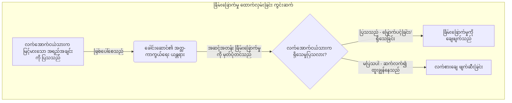
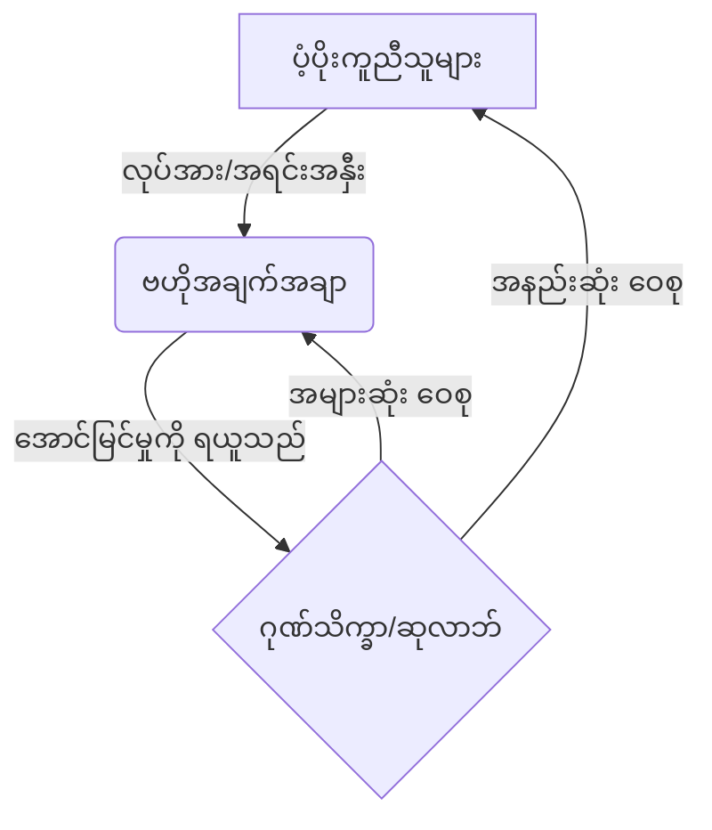

# စာအုပ် ၁: ဆင့်ကဲဖြစ်စဉ်အရ အခြေခံစနစ် (Book 1: The Evolutionary Firmware)

# နိဒါန်း: သြဇာလွှမ်းမိုးမှုဆိုင်ရာ သိပ္ပံပညာ (Introduction: The Science of Influence)

> [!IMPORTANT]
> **ထုတ်ဝေသူ၏ အမှာစာ (Publisher's Note):** 
> ဤစာအုပ်တွင် ပါဝင်သော နည်းဗျူဟာများနှင့် စိတ်ပညာဆိုင်ရာ ကစားကွက်များသည် အလွန် ရက်စက်ကြမ်းကြုတ်ပြီး အချို့မှာ ကျင့်ဝတ်နှင့်မညီသော အန္တရာယ်မြင့် ပုံစံများဖြစ်သည်ဟု ထင်ရနိုင်ပါသည်။ သို့သော် မြန်မာနိုင်ငံ၏ စီးပွားရေးလောကနှင့် ကမ္ဘာ့ဈေးကွက်၏ ပြိုင်ဆိုင်မှုအောက်တွင်၊ သင်၏ ပြိုင်ဘက်များသည် ဤနည်းလမ်းများကို သင့်အပေါ် အသုံးပြုနေပြီဆိုသည်ကို သတိပြုရန် လိုအပ်ပါသည်။ ဤစာအုပ်ကို သူတစ်ပါးအား အသုံးချရန် လမ်းညွှန်ချက်တစ်ခုအဖြစ် မဟုတ်ဘဲ၊ သင့်မိသားစုလုပ်ငန်း၊ သင့်အဖွဲ့အစည်းနှင့် သင့်ကိုယ်သင် ကာကွယ်ရန် 'အကာအကွယ်ပေးသော ဉာဏ်ရည် (အကာအကွယ်ပေးသော ဉာဏ်ရည် - Defensive Intelligence)' အဖြစ် ဖတ်ရှုရန် တိုက်တွန်းအပ်ပါသည်။

ရာစုနှစ်များစွာတိုင်အောင် အာဏာ (Power) သည် သမိုင်း၏ လျှို့ဝှက်ဆန်းကြယ်မှုအောက်တွင် ဖုံးကွယ်နေခဲ့သည်။ လူသားများ မည်သို့ ခြယ်လှယ်ကြသနည်း။ မည်သို့ လွှမ်းမိုးကြသနည်း။ မည်သို့ ရှင်သန်ကြသနည်း။ ဤမေးခွန်းများကို နားလည်ရန် အီတလီ ရီနေဆန်းခေတ် နန်းတော်များကို ကျွန်ုပ်တို့ ကြည့်ခဲ့ကြသည်။ ပုဂံ၊ အင်းဝနှင့် ကုန်းဘောင်ခေတ် နန်းတွင်းရေး ရှုပ်ထွေးမှုများကို လေ့လာခဲ့ကြသည်။ ရှေးဟောင်း တရုတ်ပြည် စစ်မြေပြင်များကို လေ့လာရန် သင်ကြားခံခဲ့ရသည်။

သို့သော် သမိုင်းဝင် အဖြစ်အပျက်များသည် တိကျသော အချက်အလက် (data) မဟုတ်ပေ။ တပင်ရွှေထီး၊ ဘုရင့်နောင် သို့မဟုတ် Cesare Borgia တို့၏ သမိုင်းဝင် ဇာတ်လမ်းများသည် စွဲမက်ဖွယ်ကောင်းသည်။ သို့သော် ၎င်းသည် ယနေ့ခေတ် ရန်ကုန်မြို့ရှိ မိသားစုပိုင် ကုမ္ပဏီကြီးများတွင် ထပ်မံပုံတူကူးချနိုင်သော ဖော်မြူလာတစ်ခု မဟုတ်ပေ။

*အာဏာဆိုင်ရာ သိပ္ပံပညာ (The Science of Power)* သည် ဤသမိုင်းဝင် ဒဏ္ဍာရီများကို ဖယ်ရှားပစ်သည်။ ၎င်းတို့ကို လက်တွေ့ကျသော အမှန်တရားဖြင့် အစားထိုးသည်။ ဤစာအုပ်ပါ စည်းမျဉ်း ၄၈ ခုသည် ရိုးရာပုံပြင်များမှ ဆင်းသက်လာခြင်း မဟုတ်ပါ။ ၎င်းတို့ကို ခိုင်မာစွာ အတည်ပြုထားသော သိပ္ပံပညာရပ်များမှ တိုက်ရိုက် ထုတ်နုတ်ထားခြင်း ဖြစ်သည်။ ဆင့်ကဲဖြစ်စဉ် ဇီဝဗေဒ (evolutionary biology) [▲ well-replicated]၊ အပြုအမူဆိုင်ရာ စီးပွားရေးပညာ (behavioral economics) [▲ well-replicated]၊ ဂိမ်းသီအိုရီ (game theory) [▲ well-replicated] နှင့် သိမြင်မှုဆိုင်ရာ စိတ်ပညာ (cognitive psychology) [▲ well-replicated] တို့ဖြစ်သည်။

အဆင့်အတန်းဆိုင်ရာ ခြိမ်းခြောက်မှုများကို လူသားတို့၏ ဦးနှောက်က မည်သည့်အတွက်ကြောင့် တုံ့ပြန်သည်ကို ယခုအခါ ကျွန်ုပ်တို့ တိကျစွာ သိရှိနေပြီဖြစ်သည်။ မဟာမိတ် ဖွဲ့စည်းခြင်းအတွက် သင်္ချာပုံစံများ ကျွန်ုပ်တို့တွင် ရှိသည်။ လူကို လှည့်စားခံရလွယ်စေသော သိမြင်မှုဆိုင်ရာ အလေ့အထများကို ပုံဖော်ထားပြီးဖြစ်သည်။ ထို့ကြောင့် ဤစာအုပ်သည် လူသားတို့၏ အပြုအမူအတွက် အကောင်းဆုံး လုပ်ငန်းလည်ပတ်မှု လမ်းညွှန်ဖြစ်သည်။ သို့သော် သူတစ်ပါးကို ခြယ်လှယ်ရန် မဟုတ်ဘဲ၊ ကြမ်းတမ်းလှသော ကမ္ဘာ့ဈေးကွက်တွင် သင့်အား ခြယ်လှယ်လာမည့် ပြိုင်ဘက်များကို ကာကွယ်ရန်ဖြစ်သည့် 'အကာအကွယ်ပေးသော ဉာဏ်ရည် (အကာအကွယ်ပေးသော ဉာဏ်ရည် - Defensive Intelligence)' သာဖြစ်သည်။

# အခန်း ၀: ကျင့်ဝတ်ဆိုင်ရာ မူဘောင် (Chapter 0: The Ethical Framework)

*တာဝန်၊ ထိခိုက်နစ်နာမှုနှင့် သဘောတူညီချက်ဆိုင်ရာ တည်ဆောက်ပုံ (Duty, Harm, and the Architecture of Consent)*

အာဏာ၏ လုပ်ငန်းလည်ပတ်မှု ယန္တရားများနှင့် မပတ်သက်မီ၊ တင်းကျပ်သော ကျင့်ဝတ်ဆိုင်ရာ မူဘောင်တစ်ခုကို တည်ဆောက်ရန် အလွန်အရေးကြီးသည်။ ဆင့်ကဲဖြစ်စဉ် ဇီဝဗေဒ၊ ဂိမ်းသီအိုရီနှင့် အပြုအမူဆိုင်ရာ စီးပွားရေးပညာတို့မှ ထုတ်နုတ်ထားသော အာဏာဆိုင်ရာ သိပ္ပံပညာသည် ပင်ကိုယ်အားဖြင့် ကျင့်ဝတ်နှင့် မပတ်သက်ပေ။ သိမြင်မှုဆိုင်ရာ ဘက်လိုက်မှု (cognitive bias) သည် ကိုယ်ချင်းစာတရား မရှိပါ။ ၎င်းကို မျှတသော လစာတစ်ခု ညှိနှိုင်းရန် သုံးမည်လော။ သို့မဟုတ် ထိခိုက်လွယ်သော လက်တွဲဖော်ကို ခြယ်လှယ်ရန် သုံးမည်လော။ ၎င်းက ဂရုစိုက်မည်မဟုတ်ပေ။ သို့သော် ဤယန္တရားများကို နားလည်ခြင်းသည် ဇီဝဗေဒအရ မရှိမဖြစ် လိုအပ်ချက်ဖြစ်သည်။ သင်၏ "အဆင့်အတန်း ထောက်လှမ်းရေး စနစ် (Status Detection System)" မည်သို့ အလုပ်လုပ်သည်ကို သင် နားမလည်လျှင်၊ သင် အလွယ်တကူ ရန်စခံရလိမ့်မည်။ "သတင်းအချက်အလက် မညီမျှမှု (Information Asymmetry)" ကို သင် နားမလည်လျှင်၊ သင် အလွယ်တကူ လှည့်စားခံရလိမ့်မည်။ ဤစာအုပ်ကို တိုက်စစ် ကစားကွက်စာအုပ် တစ်အုပ်အဖြစ် မဟုတ်ဘဲ၊ ကြမ်းတမ်းသော လောကတွင် သင့်လုပ်ငန်းနှင့် မိသားစုကို ကာကွယ်ပေးမည့် အကာအကွယ်ပေးသော သံချပ်ကာတစ်ခု အဖြစ်သာ သဘောထားပါ။ အဘယ်ကြောင့်ဆိုသော် သင်၏ ပြိုင်ဘက်များသည် ဤနည်းလမ်းများကို သင့်အပေါ် အသုံးပြုနေပြီ ဖြစ်သောကြောင့်တည်း။

## အပြုအမူဆိုင်ရာ သိပ္ပံပညာ၏ နှစ်မျိုးသုံး သဘာဝ (The Dual-Use Nature of Behavioral Science)

လူသားတို့၏ သိမြင်မှုဆိုင်ရာ တည်ဆောက်ပုံကို သိရှိခြင်းသည် နှစ်မျိုးသုံး နည်းပညာဖြစ်သည်။ လျှို့ဝှက်ကုဒ်ပညာ (cryptography) သည် ဆက်သွယ်ရေးများကို လုံခြုံစေနိုင်သည်။ တစ်ချိန်တည်းမှာပင် တရားမဝင် လုပ်ရပ်များကို ဖုံးကွယ်နိုင်သည်။ ထို့အတူ စိတ်ပညာဆိုင်ရာ မူဝါဒများကို နည်းဗျူဟာကျကျ အသုံးပြုခြင်းသည် အောင်မြင်သော မဟာမိတ်များကို တည်ဆောက်နိုင်သည်။ ပြိုင်ဘက်၏ စွမ်းဆောင်ရည်ကိုလည်း ဖျက်ဆီးနိုင်သည်။ ဤစာအုပ်တွင် ဖော်ပြထားသော ဥပဒေသများသည် လူ့စိတ်၏ လုပ်ဆောင်ပုံကို ရှင်းပြသည်။ သတင်းအချက်အလက်များကို မည်သို့ ယုံကြည်စိတ်ချစွာ လုပ်ဆောင်သည်ကို ပြသသည်။ ခြိမ်းခြောက်မှုများကို မည်သို့ တုံ့ပြန်သည်ကို ပြသသည်။ ယုံကြည်မှုကို မည်သို့ ခွဲဝေပေးသည်ကို ဖော်ပြသည်။ ၎င်းတို့သည် အမှန်တရားကို ဖော်ပြခြင်းသာ ဖြစ်သည်။ မကောင်းဆိုးဝါးအတွက် ဆေးညွှန်းများ မဟုတ်ပေ။

သို့သော် ဤဥပဒေသများကို အသုံးချရာတွင် တင်းကျပ်သော ကျင့်ဝတ်ဆိုင်ရာ နယ်နိမိတ်များ လိုအပ်သည်။ ယန္တရားများကို *နားလည်ခြင်း (understanding)* နှင့် ၎င်းတို့ကို ရန်လိုစွာ *အသုံးပြုခြင်း (deploying)* အကြား ကျွန်ုပ်တို့ ပြတ်သားစွာ ခွဲခြားရမည်။

## ထိခိုက်နစ်နာမှုကို ရှောင်ရှားရန် တာဝန် (The Duty to Avoid Harm)

အဓိက ကျင့်ဝတ်ဆိုင်ရာ မူဝါဒမှာ အချိုးအစားမညီသော ထိခိုက်နစ်နာမှုကို ရှောင်ရှားရန် တာဝန်ဖြစ်သည်။ ကော်ပိုရိတ် ညှိနှိုင်းမှုများ၊ နိုင်ငံရေး မဲဆွယ်ပွဲများနှင့် ရန်ကုန်စီးပွားရေးလောက၏ ဈေးကွက် နေရာယူမှုများကဲ့သို့သော ပတ်ဝန်းကျင်များသည် ပြိုင်ဆိုင်မှု ပြင်းထန်သည်။ တစ်ဖက်၏ အမြတ်သည် အခြားတစ်ဖက်၏ အရှုံး (zero-sum dynamics) ဖြစ်သည်။ သို့သော် ဤအချက်က 'ငါးကြီးက ငါးသေးကို စားသော' သားရဲဆန်သော အပြုအမူများကို တရားမျှတမှု မပေးနိုင်ပေ။

၁။ **ပဋိပက္ခတွင် အချိုးအစားညီမျှမှု (Proportionality in Conflict):** ပြိုင်ဘက်၏ အရင်းအမြစ်များ သို့မဟုတ် ဂုဏ်သတင်းကို ကျဆင်းစေမည့် ဗျူဟာများကို သုံးသောအခါ သတိပြုပါ။ ထိုလုပ်ရပ်သည် ၎င်းတို့ပေးသော ခြိမ်းခြောက်မှုနှင့် တင်းကျပ်စွာ အချိုးအစား ညီမျှရမည်။ တိုက်ခိုက်သူမဟုတ်သူများကို ကြိုတင်တိုက်ခိုက်ခြင်း မပြုရ။ အသေးအဖွဲ ပြစ်မှုများအပေါ် အလွန်အမင်း အင်အားသုံးခြင်း မပြုရ။ ၎င်းသည် ကျင့်ဝတ်ဆိုင်ရာ ပါဝင်ပတ်သက်မှု၏ အဓိက မူဝါဒများကို ချိုးဖောက်ခြင်းဖြစ်သည်။
၂။ **သဘောတူညီချက်ကို ထိန်းသိမ်းခြင်း (Preservation of Consent):** အပြုအမူဆိုင်ရာ သိပ္ပံပညာ၏ အမှောင်မိုက်ဆုံး အသုံးချမှုများတွင် သိနားလည်မှုရှိသော သဘောတူညီချက် (informed consent) ကို ရည်ရွယ်ချက်ရှိရှိ ဖျက်ဆီးခြင်း ပါဝင်သည်။ သိမြင်မှုဆိုင်ရာ ဝန်ပိစေခြင်းများကို သုံးသည်။ ရည်ရွယ်ချက်ရှိရှိ မှီခိုစေခြင်းများကို သုံးသည်။ နက်ရှိုင်းသော လှည့်စားခြင်းများကို လက်နက်အဖြစ် အသုံးပြုသည်။ ဤနည်းစနစ်များသည် ပစ်မှတ်ထားခံရသူ၏ ကိုယ်ကျိုးအတွက် မှန်ကန်သော ရွေးချယ်မှုများ ပြုလုပ်နိုင်စွမ်းကို ဖယ်ရှားပစ်သည်။ ကျင့်ဝတ်စောင့်ထိန်းသူ တစ်ဦးသည် တွန်းအားပေးမှုနှင့် ဖွဲ့စည်းပုံဆိုင်ရာ ညီညွတ်မှုကိုသာ အားကိုးသည်။ သူတစ်ပါး၏ စွမ်းဆောင်ရည်ကို လုယူခြင်း မပြုပေ။
၃။ **ကွန်ရက် ဂုဏ်သိက္ခာ၏ မရှိမဖြစ် လိုအပ်ချက် (The Categorical Imperative of Network Integrity):** ထာဝရ လှည့်စားမှုအပေါ် တည်ဆောက်ထားသော စနစ်များသည် နောက်ဆုံးတွင် ပြိုကျသွားသည်။ ယုံကြည်မှုနည်းပါးပြီး အကျိုးအမြတ်နည်းပါးသော ပတ်ဝန်းကျင်များအဖြစ် ပြောင်းလဲသွားကြောင်း ဂိမ်းသီအိုရီက သက်သေပြသည်။ သင်၏ လူမှုရေးနှင့် ပရော်ဖက်ရှင်နယ် ကွန်ရက်များ၏ အခြေခံ ဂုဏ်သိက္ခာကို ထိန်းသိမ်းရန် သင့်တွင် ကျင့်ဝတ်နှင့် ဗျူဟာမြောက် တာဝန်ရှိသည်။

## နားလည်ခြင်းနှင့် အသုံးပြုခြင်းကြား ကွာခြားချက် (The Distinction Between Understanding and Deployment)

အာဏာ၏ ယန္တရားများကို နားလည်ခြင်းသည် ၎င်းတို့ကို အသုံးပြုခြင်းနှင့် မတူညီပေ။ ဖွဲ့စည်းပုံ အင်ဂျင်နီယာတစ်ဦးသည် ဘေးကင်းသော တည်ဆောက်ပုံများကို ဒီဇိုင်းဆွဲရန် အဆောက်အအုံ ပြိုကျမှု ရူပဗေဒကို နားလည်ရမည်။ အလားတူပင် ကျင့်ဝတ်စောင့်ထိန်းသူ တစ်ဦးသည် ခံနိုင်ရည်ရှိသော အဖွဲ့အစည်းများကို ဒီဇိုင်းဆွဲရန် သိမြင်မှုဆိုင်ရာ ခြယ်လှယ်ခြင်းနှင့် အဆင့်အတန်း ခြိမ်းခြောက်မှု ယန္တရားများကို နားလည်ရမည်။

အာဏာ၏ ရောဂါဗေဒကို ကုသရန် ကျွန်ုပ်တို့ လေ့လာသည်။ "အဆင့်အတန်း ခြိမ်းခြောက်မှု (Status Threat)" က အတ္တကို ကာကွယ်သော ရန်လိုမှုကို မည်သို့ ဖြစ်ပေါ်စေကြောင်း သင်နားလည်လာမည်။ ထိုအခါ သင်၏ အထက်လူကြီး၏ မလုံခြုံမှုများကို မတော်တဆ မနှိုးဆွဘဲ သင်၏ လုပ်ငန်းခွင်ကို ဖြတ်သန်းနိုင်သည်။ "အလကားလိုက်ပါသူ ပြဿနာ (Free-Rider Problem)" ကို သင်နားလည်လာမည်။ ထိုအခါ ပံ့ပိုးကူညီမှုကို ဆုချီးမြှင့်ပြီး အမြတ်ထုတ်ခြင်းကို အနည်းဆုံးဖြစ်စေမည့် အဖွဲ့များကို သင် ဒီဇိုင်းဆွဲနိုင်သည်။

တိုက်စစ် နည်းဗျူဟာများကို အသုံးပြုခြင်းကို ကာကွယ်ရေးအတွက်သာ သီးသန့်ထားရှိရမည်။ သင်၏ အရင်းအမြစ်များ၊ ဂုဏ်သတင်း သို့မဟုတ် စွမ်းဆောင်ရည်ကို တက်ကြွစွာ လျှော့ချရန် ကြိုးစားနေသော တိုက်ခိုက်သူနှင့် သင် ရင်ဆိုင်ရနိုင်သည်။ ထိုအခါ ကျင့်ဝတ်စောင့်ထိန်းသူသည် ခြိမ်းခြောက်မှုကို ချေဖျက်ရန် အပြန်အလှန် အချိုးအစားညီမျှသော တန်ပြန်တိုက်ခိုက်မှုများကို အသုံးပြုရန် တရားမျှတမှု ရှိသည်။

## ကာကွယ်ရေးအတွက် အသုံးချခြင်း: အဓိက လိုအပ်ချက် (Defensive Application: The Primary Mandate)

ဤစာသား၏ အဓိက အသုံးဝင်မှုမှာ ကာကွယ်ရေးဖြစ်သည်။ အဆင့်အတန်း ခြိမ်းခြောက်မှုများ၊ သတင်းအချက်အလက် ထိန်းချုပ်မှုနှင့် မဟာမိတ်ဖွဲ့ခြင်းများ၏ ယန္တရားများကို လေ့လာခြင်းဖြင့်၊ သင်သည် ခြယ်လှယ်ခံရခြင်းမှ သင့်ကိုယ်သင် ကာကွယ်နိုင်သည်။

*   **တိုက်ခိုက်မှုကို အသိအမှတ်ပြုခြင်း (Recognizing the Attack):** ညှိနှိုင်းမှုတစ်ခုတွင် အရှုံးပေးရန် ရုတ်တရက် အကျိုးသင့်အကြောင်းသင့်မရှိသော ဆန္ဒကို သင်ခံစားရနိုင်သည်။ ထိုအခါ အပြန်အလှန်လုပ်ဆောင်မှု ဘက်လိုက်မှု (reciprocity bias) အလုပ်လုပ်နေကြောင်း သင် ချက်ချင်း အသိအမှတ်ပြုလိမ့်မည်။
*   **ခြိမ်းခြောက်မှုကို ချေဖျက်ခြင်း (Neutralizing the Threat):** လုပ်ဖော်ကိုင်ဖက်တစ်ဦးက သင့်အား သင်၏ ကွန်ရက်မှ ဖယ်ထုတ်ရန် ကြိုးစားနိုင်သည်။ ထိုအခါ လူမှုရေးအရ အသက်ရှူကျပ်ခြင်း (social asphyxiation) ၏ ဖွဲ့စည်းပုံဆိုင်ရာ သဘောသဘာဝများကို သင်နားလည်လိမ့်မည်။ သင်၏ အားနည်းသော ဆက်သွယ်မှုများကို အားဖြည့်ခြင်းဖြင့် ၎င်းကို တန်ပြန်လိမ့်မည်။
*   **စနစ်တကျ ခံနိုင်ရည်ရှိခြင်း (Systemic Resilience):** ဆင့်ကဲဖြစ်စဉ်အရ အခြေခံစနစ်ကို နားလည်ခြင်းဖြင့်၊ သင်သည် ကွန်ရက်အတွင်း တုံ့ပြန်မှုသက်သက်ပြုလုပ်သော အစိတ်အပိုင်းတစ်ခု မဟုတ်တော့ပေ။ သင်ကိုယ်တိုင်၏ ပတ်ဝန်းကျင်ကို သတိရှိရှိ ဖန်တီးသူတစ်ဦးအဖြစ် ကူးပြောင်းသွားသည်။

ဤမူဘောင်သည် သင်၏ အာဏာအတွက် ကန့်သတ်ချက်တစ်ခု မဟုတ်ပါ။ ၎င်းသည် ရေရှည်တည်တံ့သော လွှမ်းမိုးမှု၏ အခြေခံအုတ်မြစ်ဖြစ်သည်။ ကျင့်ဝတ်ဆိုင်ရာ ချိန်ညှိမှုမရှိဘဲ ကျင့်သုံးသော အာဏာသည် ပင်ကိုယ်အားဖြင့် မတည်ငြိမ်ပေ။ ဓားသွားပေါ် လမ်းလျှောက်ရသကဲ့သို့ မိမိကိုယ်ကို ဖျက်ဆီးတတ်သည်။ တိကျသေချာမှုနှင့် ကျင့်ဝတ်ဆိုင်ရာ ထိန်းချုပ်မှုတို့ဖြင့် ကျင့်သုံးသော အာဏာသည်သာ မိသားစုလုပ်ငန်းနှင့် ကိုယ်ပိုင်အင်ပါယာကို ကာကွယ်ရန် အနိုင်ယူမရနိုင်သော ဖွဲ့စည်းပုံဆိုင်ရာ အားသာချက်တစ်ခု ဖြစ်လာသည်။ လူသားတို့၏ အပြုအမူကို ကျွမ်းကျင်ပိုင်နိုင်ခြင်းသည် သူတစ်ပါးကို မအုပ်ချုပ်မီ မိမိကိုယ်ကို အုပ်ချုပ်ရန် စည်းကမ်းရှိခြင်း လိုအပ်သည်။

### အကြောင်းအရာအလိုက် ဖတ်ရှုရန် လမ်းညွှန် (Thematic Reading Guide)
ဤစာအုပ်ကို ပြည့်စုံသော နည်းဗျူဟာ လမ်းညွှန်အဖြစ် အစမှအဆုံး အစဉ်လိုက် ဖတ်ရှုရန် ရည်ရွယ်ထားသည်။ သို့သော် သင်သည် လူသားအပြုအမူ၏ သီးခြား ဘာသာရပ်များကို ကျွမ်းကျင်လိုပါက၊ အောက်ပါ အကြောင်းအရာအလိုက် မူဘောင်မှတစ်ဆင့် စည်းမျဉ်းများကို လေ့လာနိုင်သည်-

*   **အပိုင်း ၁: အဆင့်အတန်းနှင့် ဂုဏ်သတင်း၏ တည်ဆောက်ပုံ (Part I: The Architecture of Status & Reputation)**
    *အဓိကထားလေ့လာရန်: ဆင့်ကဲဖြစ်စဉ် အဆင့်ဆင့်အုပ်ချုပ်မှုများ၊ အထင်အမြင် စီမံခန့်ခွဲမှုနှင့် အဆင့်အတန်းဆိုင်ရာ အာရုံကြောဇီဝဗေဒ။*
    *(ဥပမာ- စည်းမျဉ်း ၁၊ ၅၊ ၆၊ ၂၄၊ ၃၄)*
*   **အပိုင်း ၂: သတင်းအချက်အလက် မညီမျှမှုနှင့် သိမြင်မှုဆိုင်ရာ ခြယ်လှယ်ခြင်း (Part II: Information Asymmetry & Cognitive Manipulation)**
    *အဓိကထားလေ့လာရန်: လှည့်စားခြင်း၊ အလေ့အထများ၊ ရွေးချယ်မှုဆိုင်ရာ တည်ဆောက်ပုံနှင့် လက်နက်အဖြစ် အသုံးပြုထားသော မပီပြင်မှု။*
    *(ဥပမာ- စည်းမျဉ်း ၃၊ ၄၊ ၁၂၊ ၂၁၊ ၃၁၊ ၄၄)*
*   **အပိုင်း ၃: ကွန်ရက် သဘောသဘာဝများနှင့် မဟာမိတ်ဖွဲ့ခြင်း (Part III: Network Dynamics & Coalition Building)**
    *အဓိကထားလေ့လာရန်: လူမှုရေး အရင်းအနှီး၊ အာဏာ-မှီခိုမှု ဆက်ဆံရေးများနှင့် မဟာမိတ် ယူဆချက်။*
    *(ဥပမာ- စည်းမျဉ်း ၂၊ ၁၀၊ ၁၁၊ ၁၃၊ ၁၈၊ ၄၂)*
*   **အပိုင်း ၄: ဗျူဟာမြောက် ပဋိပက္ခနှင့် အရင်းအမြစ် ခွဲဝေမှု (Part IV: Strategic Conflict & Resource Allocation)**
    *အဓိကထားလေ့လာရန်: ဂိမ်းသီအိုရီ၊ အရှုံးအမြတ် မျှခြေ သဘောသဘာဝများနှင့် သိမြင်မှုဆိုင်ရာ ကုန်ခမ်းခြင်း။*
    *(ဥပမာ- စည်းမျဉ်း ၈၊ ၁၅၊ ၂၃၊ ၂၉၊ ၃၉)*
*   **အပိုင်း ၅: ဆင့်ကဲဖြစ်စဉ်အရ ပြောင်းလဲခြင်းနှင့် မိမိကိုယ်ကို ကျွမ်းကျင်ပိုင်နိုင်ခြင်း (Part V: Evolutionary Adaptation & Self-Mastery)**
    *အဓိကထားလေ့လာရန်: ပြင်ပလက္ခဏာ ပြောင်းလဲနိုင်စွမ်း၊ စိတ်ခံစားမှု ထိန်းချုပ်ခြင်းနှင့် နစ်မြုပ်နေသော ကုန်ကျစရိတ် မှားယွင်းမှုတို့ကို ရှောင်ရှားခြင်း။*
    *(ဥပမာ- စည်းမျဉ်း ၂၀၊ ၂၅၊ ၃၅၊ ၄၇၊ ၄၈)*

# မာတိကာ - အာဏာ၏ သိပ္ပံပညာ

**အခန်း ၁**: ဆရာ့ထက် ဘယ်တော့မှ မထူးချွန်ပါစေနှင့်
*သိပ္ပံနည်းကျ ယန္တရား:* အဆင့်အတန်း ခြိမ်းခြောက်ခံရမှုနှင့် အတ္တ-ကာကွယ်သော ရန်လိုမှု

**အခန်း ၂**: သူငယ်ချင်းများအပေါ် အလွန်အမင်း မယုံကြည်ပါနှင့်၊ ရန်သူများ၏ အန္တရာယ်ကို ကာကွယ်နည်း သင်ယူပါ
*သိပ္ပံနည်းကျ ယန္တရား:* ခင်မင်မှုနှင့် မဟာမိတ်ဖွဲ့ခြင်းဆိုင်ရာ လှုပ်ရှားမှုများအတွက် မဟာမိတ် အယူအဆ (The Alliance Hypothesis for Friendship & Coalition Dynamics)

**အခန်း ၃**: ရည်ရွယ်ချက်ဆိုင်ရာ အချက်အလက်လုံခြုံရေးကို ထိန်းသိမ်းပါ
*သိပ္ပံနည်းကျ ယန္တရား:* ဖြစ်နိုင်ခြေရှိသော ငြင်းဆိုနိုင်စွမ်း (Plausible Deniability)၊ သွယ်ဝိုက်သော စကားပြောဆိုမှုများနှင့် မိမိကိုယ်ကို လှည့်စားခြင်း

**အခန်း ၄**: လိုအပ်သည်ထက် အမြဲတမ်း လျှော့ပြောပါ
*သိပ္ပံနည်းကျ ယန္တရား:* စကားပြောဆိုမှုမှ ကောက်ချက်ချခြင်း၊ ဖြစ်နိုင်ခြေရှိသော ငြင်းဆိုနိုင်စွမ်းနှင့် မဟာဗျူဟာမြောက် စကားပြောသူ ပုံစံ

**အခန်း ၅**: ဂုဏ်သတင်းသည် အရာအားလုံးဖြစ်သည်—ယင်းကို သင့်အသက်တမျှ ကာကွယ်ပါ
*သိပ္ပံနည်းကျ ယန္တရား:* သွယ်ဝိုက်သော အပြန်အလှန်တုံ့ပြန်မှုနှင့် ဂုဏ်သတင်းစနစ်များ

**အခန်း ၆**: မည်သည့်စရိတ်နှင့်မဆို အာရုံစိုက်ခံရအောင် လုပ်ပါ
*သိပ္ပံနည်းကျ ယန္တရား:* အာရုံစိုက်မှုကို ဖမ်းယူခြင်း၊ ထင်ရှားမှု ဘက်လိုက်ခြင်းနှင့် သတင်းအချက်အလက် ဆက်တိုက်စီးဆင်းမှုများ [▲ ကောင်းစွာ အတည်ပြုပြီး (well-replicated)]

**အခန်း ၇**: သင့်အတွက် အလုပ်လုပ်ပေးရန် အခြားသူများကို ခိုင်းစေပါ၊ သို့သော် အမြဲတမ်း သင်ကသာ နာမည်ကောင်း ယူပါ
*သိပ္ပံနည်းကျ ယန္တရား:* အခမဲ့ အကျိုးခံစားသူ ပြဿနာ (The Free-Rider Problem)၊ အလုပ်ခွဲဝေမှုနှင့် အဓိက-ကိုယ်စားလှယ် အဆင့်ဆင့် အုပ်ချုပ်မှုများ

**အခန်း ၈**: အခြားသူများကို သင့်ထံ လာစေပါ—လိုအပ်ပါက ငါးစာကို အသုံးပြုပါ
*သိပ္ပံနည်းကျ ယန္တရား:* စေ့စပ်ညှိနှိုင်းထားသော သဘောတူညီချက်တစ်ခုအတွက် အကောင်းဆုံး အစားထိုးရွေးချယ်စရာ (BATNA) [▲ ကောင်းစွာ အတည်ပြုပြီး] နှင့် ဆုံးရှုံးပြီးသား ရင်းနှီးမြှုပ်နှံမှုအပေါ် ကတိကဝတ်ပြုခြင်း

**အခန်း ၉**: သင်၏ လုပ်ရပ်များမှတစ်ဆင့် အနိုင်ယူပါ၊ ငြင်းခုံခြင်းမှတစ်ဆင့် ဘယ်တော့မှ မလုပ်ပါနှင့်
*သိပ္ပံနည်းကျ ယန္တရား:* တန်ဖိုးကြီးသော သင်္ကေတပြခြင်း သီအိုရီ (Costly Signaling Theory) နှင့် သိမြင်မှုဆိုင်ရာ ပဋိပက္ခ (Cognitive Dissonance) [▲ ကောင်းစွာ အတည်ပြုပြီး] (မိမိကိုယ်ကို အကဲဖြတ်ခြင်း)

**အခန်း ၁၀**: ကူးစက်မှု - မပျော်ရွှင်သူနှင့် ကံမကောင်းသူများကို ရှောင်ရှားပါ
*သိပ္ပံနည်းကျ ယန္တရား:* စိတ်ခံစားမှု ကူးစက်ခြင်းနှင့် လူမှုကွန်ရက် ပြန့်ပွားမှု

**အခန်း ၁၁**: လူများကို သင့်အပေါ် မှီခိုနေစေရန် သင်ယူပါ
*သိပ္ပံနည်းကျ ယန္တရား:* အာဏာ-မှီခိုမှု ဆက်ဆံရေးများနှင့် လူမှုဖလှယ်ရေး သီအိုရီ

**အခန်း ၁၂**: သင့်သားကောင်ကို လက်နက်ချစေရန် ရွေးချယ်ထားသော ရိုးသားမှုနှင့် ရက်ရောမှုကို အသုံးပြုပါ
*သိပ္ပံနည်းကျ ယန္တရား:* မဟာဗျူဟာမြောက် ဖွင့်ဟပြောဆိုမှုများနှင့် အပြန်အလှန်တုံ့ပြန်မှု ဘက်လိုက်ခြင်း

**အခန်း ၁၃**: အကူအညီတောင်းသောအခါ၊ လူများ၏ ကိုယ်ကျိုးစီးပွားကိုသာ ရည်ညွှန်းပါ၊ သူတို့၏ ကရုဏာ သို့မဟုတ် ကျေးဇူးတင်မှုကို ဘယ်တော့မှ မရည်ညွှန်းပါနှင့်
*သိပ္ပံနည်းကျ ယန္တရား:* မက်လုံး ကိုက်ညီမှုနှင့် အကျိုးသင့်အကြောင်းသင့် ရွေးချယ်မှု သီအိုရီ (Rational Choice Theory)

**အခန်း ၁၄**: သူငယ်ချင်းကဲ့သို့ ဟန်ဆောင်ပါ၊ သူလျှိုကဲ့သို့ အလုပ်လုပ်ပါ
*သိပ္ပံနည်းကျ ယန္တရား:* မဟာဗျူဟာမြောက် မျက်နှာလိုမျက်နှာရလုပ်ခြင်း (Strategic Ingratiation) နှင့် သတင်းအချက်အလက် မညီမျှမှု (Information Asymmetry)

**အခန်း ၁၅**: အလုံးစုံ ပဋိပက္ခအရှိန်မြှင့်တင်မှုကို ကာကွယ်ပါ
*သိပ္ပံနည်းကျ ယန္တရား:* ပဋိပက္ခ ကြီးထွားလာမှု လှုပ်ရှားမှုများနှင့် ဆင့်ကဲဖြစ်စဉ်အရ တည်ငြိမ်သော မဟာဗျူဟာများ (သိမ်းငှက်-ချိုးငှက်)

**အခန်း ၁၆**: လေးစားမှုနှင့် ဂုဏ်အသရေကို တိုးပွားစေရန် ပျောက်ကွယ်နေမှုကို အသုံးပြုပါ
*သိပ္ပံနည်းကျ ယန္တရား:* ရှားပါးမှု အကျိုးသက်ရောက်မှု (The Scarcity Effect) နှင့် စိတ်ပညာဆိုင်ရာ တုံ့ပြန်မှု သီအိုရီ (Psychological Reactance Theory)

**အခန်း ၁၇**: အခြားသူများကို အမြဲတမ်း ထိတ်လန့်နေစေပါ - ခန့်မှန်းရခက်သည့် အခြေအနေကို ဖန်တီးပါ
*သိပ္ပံနည်းကျ ယန္တရား:* ဂိမ်းသီအိုရီ (Game Theory) [▲ ကောင်းစွာ အတည်ပြုပြီး] မှ ရောနှောမဟာဗျူဟာများနှင့် သတင်းအချက်အလက် အင်ထရိုပီ (Information Entropy)

**အခန်း ၁၈**: သင့်ကိုယ်သင် ကာကွယ်ရန် ခံတပ်များ မဆောက်ပါနှင့် - အထီးကျန်ခြင်းသည် အန္တရာယ်ရှိသည်
*သိပ္ပံနည်းကျ ယန္တရား:* လူမှုအရင်းအနှီး သီအိုရီနှင့် ကွန်ရက် ဗဟိုချက်ဖြစ်မှု (အားနည်းသော ချိတ်ဆက်မှုများ၏ အာဏာ)

**အခန်း ၁၉**: သင် မည်သူနှင့် ဆက်ဆံနေသည်ကို သိပါ - မှားယွင်းသောသူကို မစော်ကားပါနှင့်
*သိပ္ပံနည်းကျ ယန္တရား:* ကိုယ်ရည်ကိုယ်သွေး စိတ်ပညာနှင့် အချက်ငါးချက် (Big Five) မော်ဒယ်

**အခန်း ၂၀**: မည်သူ့ကိုမျှ ကတိကဝတ် မပြုပါနှင့်
*သိပ္ပံနည်းကျ ယန္တရား:* တကယ့် ရွေးချယ်စရာများ သီအိုရီ (Real Options Theory) နှင့် ငွေပေးငွေယူ ကုန်ကျစရိတ် ရွေးချယ်နိုင်ခွင့် (Transaction Cost Optionality)

**အခန်း ၂၁**: ငတုံးတစ်ယောက်ကို ဖမ်းရန် ငတုံးတစ်ယောက်လို ဟန်ဆောင်ပါ - သင့်ပစ်မှတ်ထက် ပိုအ တတ်ယောင်ဆောင်ပါ
*သိပ္ပံနည်းကျ ယန္တရား:* ပုံသေကားချပ် နွေးထွေးမှု-အရည်အချင်း အပေးအယူလုပ်ခြင်းနှင့် အသိပညာကို ဖုံးကွယ်ခြင်း (အ တတ်ယောင်ဆောင်ခြင်း)

**အခန်း ၂၂**: လက်နက်ချခြင်း နည်းဗျူဟာကို အသုံးပြုပါ - အားနည်းချက်ကို အာဏာအဖြစ် ပြောင်းလဲပါ
*သိပ္ပံနည်းကျ ယန္တရား:* မဟာဗျူဟာမြောက် ဆုတ်ခွာခြင်းနှင့် ပြေလည်အောင်လုပ်ခြင်း အချက်ပြမှု (တိရစ္ဆာန် ပဋိပက္ခတွင် အကဲဖြတ်ခြင်း)

**အခန်း ၂၃**: သင့်အင်အားများကို စုစည်းပါ
*သိပ္ပံနည်းကျ ယန္တရား:* အာရုံစိုက်မှု၊ ကန့်သတ်ချက်များအောက်ရှိ အကောင်းဆုံးဖြစ်အောင် လုပ်ခြင်း၊ နှင့် အရင်းအမြစ် ခွဲဝေမှု

**အခန်း ၂၄**: ပြီးပြည့်စုံသော နန်းတွင်းအမတ်ကဲ့သို့ နေထိုင်ပါ
*သိပ္ပံနည်းကျ ယန္တရား:* မဟာဗျူဟာမြောက် အထင်အမြင် စီမံခန့်ခွဲမှုနှင့် မိမိကိုယ်ကို စောင့်ကြည့်ခြင်း

**အခန်း ၂၅**: သင့်ကိုယ်သင် အသစ်ပြန်လည် ဖန်တီးပါ
*သိပ္ပံနည်းကျ ယန္တရား:* အထင်အမြင် စီမံခန့်ခွဲမှုနှင့် ဇာတ်လမ်းဆန်သော မိမိကိုယ်ကို သတ်မှတ်ချက် တည်ဆောက်ခြင်း (Narrative Identity Construct)

**အခန်း ၂၆**: သင့်လက်များကို သန့်ရှင်းအောင်ထားပါ
*သိပ္ပံနည်းကျ ယန္တရား:* အကြောင်းရင်းရှာဖွေခြင်း သီအိုရီ (Attribution Theory) နှင့် မိမိကိုယ်ကျိုးရှာ / ဓားစာခံရှာ ဘက်လိုက်မှုများ

**အခန်း ၂၇**: အစွန်းရောက် ဂိုဏ်းဝင်များကဲ့သို့ နောက်လိုက်များ ဖန်တီးရန် လူများ၏ ယုံကြည်ချင်စိတ်ကို ကစားပါ
*သိပ္ပံနည်းကျ ယန္တရား:* အုပ်စုတွင်း မျက်နှာသာပေးမှု၊ လူမှုရေး သရုပ်သကန် သီအိုရီ၊ နှင့် 'အုံလိုက်ကျင်းလိုက် ပြောင်းလဲမှု' (The 'Hive Switch')

**အခန်း ၂၈**: ရဲရင့်စွာဖြင့် လှုပ်ရှားမှုကို စတင်ပါ
*သိပ္ပံနည်းကျ ယန္တရား:* မိမိကိုယ်ကို အလွန်အမင်း ယုံကြည်မှု အချက်ပြခြင်းနှင့် ယုံကြည်မှု လျှို့ဝှက်ချက်

**အခန်း ၂၉**: အဆုံးအထိ အားလုံးကို စီစဉ်ထားပါ
*သိပ္ပံနည်းကျ ယန္တရား:* အစီအစဉ်ဆွဲခြင်းဆိုင်ရာ အမှားကို လျှော့ချခြင်းနှင့် အနာဂတ်အတွက် ကြိုတင်စဉ်းစားခြင်း (Pre-Mortem)

**အခန်း ၃၀**: သင်၏ အောင်မြင်မှုများကို အားစိုက်ထုတ်စရာမလိုဘဲ ရလာသယောင် ထင်ရစေပါ
*သိပ္ပံနည်းကျ ယန္တရား:* လွယ်ကူချောမွေ့စွာ လုပ်ဆောင်နိုင်မှုနှင့် သိမြင်မှုဆိုင်ရာ သက်သာမှု

**အခန်း ၃၁**: ရွေးချယ်စရာများကို ထိန်းချုပ်ပါ - သင်ပေးသော ဖဲချပ်များဖြင့် အခြားသူများကို ကစားစေပါ
*သိပ္ပံနည်းကျ ယန္တရား:* ရွေးချယ်မှု တည်ဆောက်ပုံနှင့် အချိုးမညီသော လွှမ်းမိုးမှု (မြှူဆွယ်ခြင်း အကျိုးသက်ရောက်မှု - Decoy Effect)

**အခန်း ၃၂**: လူများ၏ စိတ်ကူးယဉ်မှုများကို ကစားပါ
*သိပ္ပံနည်းကျ ယန္တရား:* တွန်းအားပေးခံရသော ကျိုးကြောင်းဆင်ခြင်မှုနှင့် အတည်ပြုချက် ဘက်လိုက်မှု (Confirmation Bias)

**အခန်း ၃၃**: လူတိုင်း၏ အားနည်းချက် (Thumb-Screw) ကို ရှာဖွေပါ
*သိပ္ပံနည်းကျ ယန္တရား:* တစ်ဦးချင်း ကွဲပြားမှုများနှင့် ပစ်မှတ် ပရိုဖိုင်ဖန်တီးခြင်း (အမှောင် ဖက်သုံးခု - The Dark Triad)

**အခန်း ၃၄**: ဘုရင်တစ်ပါးကဲ့သို့ ဆက်ဆံခံရရန် ဘုရင်တစ်ပါးကဲ့သို့ ပြုမူပါ
*သိပ္ပံနည်းကျ ယန္တရား:* အဆင့်အတန်း အချက်ပြ သီအိုရီနှင့် ဂုဏ်သိက္ခာ ကြီးစိုးမှု (Prestige Dominance)

**အခန်း ၃၅**: အချိန်ကိုက်ခြင်း အနုပညာကို ကျွမ်းကျင်အောင် လုပ်ပါ
*သိပ္ပံနည်းကျ ယန္တရား:* လွန်ကဲစွာ တန်ဖိုးလျှော့ခြင်း (Hyperbolic Discounting) နှင့် အချိန်ကိုက် အသုံးဝင်မှု မြေပုံဆွဲခြင်း

**အခန်း ၃၆**: သင်မရနိုင်သောအရာများကို မထီမဲ့မြင်ပြုပါ - ၎င်းတို့ကို လျစ်လျူရှုခြင်းသည် အကောင်းဆုံး လက်စားချေခြင်းဖြစ်သည်
*သိပ္ပံနည်းကျ ယန္တရား:* သိမြင်မှုဆိုင်ရာ ကွဲလွဲမှု [▲ ကောင်းစွာ အတည်ပြုပြီး] လျှော့ချခြင်း (ချဉ်သော စပျစ်သီး ဆင်ခြေပေးခြင်း)

**အခန်း ၃၇**: ဆွဲဆောင်မှုရှိသော မြင်ကွင်းများကို ဖန်တီးပါ
*သိပ္ပံနည်းကျ ယန္တရား:* အံ့သြထိတ်လန့်ခြင်း စိတ်ပညာ၊ မှတ်ဉာဏ် ကျောက်ချခြင်း၊ နှင့် အမြင်အာရုံ ထင်ရှားမှု

**အခန်း ၃၈**: သင် ကြိုက်သလို စဉ်းစားပါ သို့သော် အခြားသူများကဲ့သို့ ပြုမူပါ
*သိပ္ပံနည်းကျ ယန္တရား:* လိုက်လျောညီထွေဖြစ်မှု ဘက်လိုက်ခြင်းနှင့် စံနှုန်းသတ်မှတ်သော လူမှုရေး လွှမ်းမိုးမှု (Social Proof)

**အခန်း ၃၉**: ငါးဖမ်းရန် ရေကို နောက်ကျိစေပါ
*သိပ္ပံနည်းကျ ယန္တရား:* စေ့စပ်ညှိနှိုင်းမှုများတွင် ဒေါသ၏ လူအချင်းချင်းကြား အကျိုးသက်ရောက်မှုများ နှင့် သိမြင်မှုဆိုင်ရာ ကုန်ခမ်းမှု (Cognitive Depletion)

**အခန်း ၄၀**: အလကားရသော အစားအသောက်ကို ရွံရှာပါ
*သိပ္ပံနည်းကျ ယန္တရား:* အပြန်အလှန်တုံ့ပြန်မှု စံနှုန်းနှင့် ကျေးဇူးတင်ရှိမှု ဘက်လိုက်ခြင်း

**အခန်း ၄၁**: ကြီးမြတ်သူတစ်ဦး၏ ခြေရာကို နင်းခြင်းမှ ရှောင်ကြဉ်ပါ
*သိပ္ပံနည်းကျ ယန္တရား:* ကျောက်ချခြင်း ဘက်လိုက်မှု (Anchoring Bias) နှင့် ပျမ်းမျှဆီသို့ ပြန်သွားခြင်း (Regression to the Mean)

**အခန်း ၄၂**: သိုးထိန်းကို ခုတ်ပါ၊ သိုးများ ကွဲလွင့်သွားလိမ့်မည်
*သိပ္ပံနည်းကျ ယန္တရား:* အတိုင်းအတာမဲ့ ကွန်ရက် အားနည်းချက်နှင့် အဓိက ကစားသမား သီအိုရီ

**အခန်း ၄၃**: အခြားသူများ၏ နှလုံးသားများနှင့် စိတ်များကို လုပ်ဆောင်ပါ
*သိပ္ပံနည်းကျ ယန္တရား:* အသေးစိတ် ရှင်းလင်းချက် ဖြစ်တန်စွမ်း မော်ဒယ် (ဘေးပတ်ဝန်းကျင်လမ်းကြောင်းမှ ဆွဲဆောင်ခြင်း) နှင့် သိမြင်မှုဆိုင်ရာ ကိုယ်ချင်းစာတရား

**အခန်း ၄၄**: မှန် အကျိုးသက်ရောက်မှုဖြင့် လက်နက်ချစေပြီး ဒေါသထွက်စေပါ
*သိပ္ပံနည်းကျ ယန္တရား:* အပြုအမူပိုင်းဆိုင်ရာ အတုခိုးခြင်းနှင့် ပုတ်သင်ညို အကျိုးသက်ရောက်မှု

**အခန်း ၄၅**: ပြောင်းလဲရန် လိုအပ်ကြောင်း ဟောပြောပါ၊ သို့သော် တစ်ကြိမ်တည်းတွင် အများကြီး ဘယ်တော့မှ မပြောင်းလဲပါနှင့်
*သိပ္ပံနည်းကျ ယန္တရား:* လက်ရှိအခြေအနေကို ဆုပ်ကိုင်ထားမှု ဘက်လိုက်ခြင်း၊ ဆုံးရှုံးမှုကို ရှောင်လွှဲခြင်း၊ နှင့် တဖြည်းဖြည်း တိုးတက်ခြင်း

**အခန်း ၄၆**: ဘယ်တော့မှ အလွန်အမင်း ပြီးပြည့်စုံနေပုံ မပေါ်ပါစေနှင့်
*သိပ္ပံနည်းကျ ယန္တရား:* ပြုတ်ကျမှု အကျိုးသက်ရောက်မှု (The Pratfall Effect)

**အခန်း ၄၇**: သင် ရည်ရွယ်ထားသော မှတ်တိုင်ထက် ကျော်လွန်မသွားပါနှင့်; အောင်ပွဲရချိန်တွင် မည်သည့်အချိန်၌ ရပ်ရမည်ကို သိပါ
*သိပ္ပံနည်းကျ ယန္တရား:* ကတိကဝတ် တိုးမြှင့်ခြင်းနှင့် ဆုံးရှုံးပြီးသား ရင်းနှီးမြှုပ်နှံမှုအပေါ် လွဲမှားစွာ တွေးတောခြင်း [▲ ကောင်းစွာ အတည်ပြုပြီး] (မောက်မာခြင်း - Hubris)

**အခန်း ၄၈**: ပုံသဏ္ဌာန်မရှိမှုကို ယူဆပါ
*သိပ္ပံနည်းကျ ယန္တရား:* ပြောင်းလဲနိုင်သော စွမ်းရည်များ၊ ပြင်ပလက္ခဏာ ပုံသွင်းနိုင်မှု၊ နှင့် မဟာဗျူဟာမြောက် ပြုပြင်ပြောင်းလဲနိုင်စွမ်း

---

# နိယာမ ၁ - ဆရာ့ထက် ဘယ်တော့မှ မထူးချွန်ပါစေနှင့်

**သိပ္ပံနည်းကျ တူညီချက် -** အဆင့်အတန်း ခြိမ်းခြောက်ခံရမှုနှင့် အတ္တ-ကာကွယ်သော ရန်လိုမှု
**အဓိက ပညာရပ် -** အဖွဲ့အစည်းဆိုင်ရာ အပြုအမူနှင့် လူမှုရေး နှိုင်းယှဉ်ချက်

## စည်းမျဉ်း

မြန်မာ့ ရှေးရိုးဗျူဟာဖြစ်သော 'ဆရာ့ထက် တပည့် လက်စွမ်းမပြရ' ဆိုသည့်အတိုင်း အထက်လူကြီး၏ အတ္တကို ကာကွယ်လိုသော ရန်လိုစိတ်ကို ဘယ်တော့မှ မဆွပါနှင့်။ အထူးသဖြင့် ပြိုင်ဆိုင်မှုပြင်းထန်သော စီးပွားရေးလောကတွင်၊ ဉာဏ်ရည်ထက်မြက်မှုကို အကာအကွယ်မဲ့ ပြသခြင်းသည် လေးစားမှုကို မရစေဘဲ အာရုံကြောဇီဝဗေဒအရ အဆင့်အတန်းကို ခြိမ်းခြောက်ခြင်းသာ ဖြစ်သည်။ သင့်မိသားစုလုပ်ငန်း သို့မဟုတ် သင့်ကိုယ်သင် ကာကွယ်ရန် 'အကာအကွယ်ပေးသော ဉာဏ်ရည် (အကာအကွယ်ပေးသော ဉာဏ်ရည် - Defensive Intelligence)' အဖြစ် သင်၏ဆရာသမားများ၏ အဆင့်အတန်း ထောက်လှမ်းရေးစနစ် အလုပ်လုပ်ပုံကို နားလည်ထားရမည်။ သူတစ်ပါးကို ကြိုးကိုင်ရန်မဟုတ်ဘဲ၊ သင့်အား ရန်မရှာစေရန် ၎င်းတို့သာလျှင် ကြီးစိုးနေဆဲဖြစ်သည်ဟူသော ခံစားချက်ကို ဖန်တီးပေးပါ။

## လက်တွေ့ သက်သေအထောက်အထား

အဆင့်အတန်းနှင့်ပတ်သက်သော အာရုံကြောဇီဝဗေဒအရ ဆရာ့ထက် ထူးချွန်ခြင်းသည် သေစေနိုင်သော အမှားဖြစ်သည်။ လူသားတို့သည် အသက်ရှင်သန်ရေးနှင့် မျိုးပွားနိုင်ရေးအတွက် "အဆင့်အတန်း ဂိမ်းများ" ကို ကစားရန် ဆင့်ကဲပြောင်းလဲလာခဲ့ကြသည်။ Will Storr [▲ ကောင်းစွာ အတည်ပြုပြီး] ၏ *The Status Game* အရ၊ အဆင့်ဆင့် အုပ်ချုပ်မှုများတွင် နေရာရလာခြင်းသည် ဦးနှောက်အတွင်း အဆင့်အတန်းဆိုင်ရာ အာရုံကြော ယန္တရားများ (status-related neural mechanisms) ကို လှုံ့ဆော်စေသည်။ ဆန့်ကျင်ဘက်အားဖြင့် အဆင့်အတန်း ခြိမ်းခြောက်ခံရခြင်းသည် စစ်မှန်သော စိတ်ပိုင်းဆိုင်ရာ နာကျင်မှုကို ဖြစ်ပေါ်စေသည်။

အဆင့်ဆင့်အုပ်ချုပ်သော ပတ်ဝန်းကျင်များတွင်၊ ခေါင်းဆောင်များသည် ၎င်းတို့၏ ကိုယ်ပိုင်တန်ဖိုးကို ရာထူးနှင့် တစ်ထပ်တည်းဟု ယူဆထားတတ်သည်။ Stanford တက္ကသိုလ်မှ Jeffrey Pfeffer [▲ ကောင်းစွာ အတည်ပြုပြီး] (*Power* / အာဏာ) က အသက်ရှင်ကျန်ရစ်မှု၏ အဓိက တိုင်းတာချက်ကို ဖော်ထုတ်ခဲ့သည်။ ၎င်းသည် လက်တွေ့ အလုပ်စွမ်းဆောင်ရည်ထက် သင့်အရင်းအမြစ်များကို ထိန်းချုပ်ထားသူ၏ အတ္တကို မည်မျှ စီမံခန့်ခွဲနိုင်သနည်းဆိုသည့်အပေါ် ပို၍ မူတည်သည်။

လက်အောက်ငယ်သားတစ်ဦး၏ အရည်အချင်းသည် ခေါင်းဆောင်ထက် သာလွန်သွားသောအခါ၊ ခေါင်းဆောင်၏ ဦးနှောက်က ယင်းကို **အဆင့်အတန်း ခြိမ်းခြောက်မှု (Status Threat)** ဟု သတ်မှတ်လိုက်သည်။ Fast & Chen (2009) [△ ထွက်ပေါ်လာသော သုတေသန] က အာဏာရှိသော အထက်လူကြီးများသည် ၎င်းတို့၏ အရည်အချင်း မပြည့်မီမှုကို ဖော်ပြလာသည့် အရာများအပေါ် ပြင်းပြင်းထန်ထန် တုံ့ပြန်လွယ်ကြောင်း သက်သေပြခဲ့သည်။ ၎င်းတို့သည် ယုတ္တိတန်စွာ တုံ့ပြန်မည် မဟုတ်ပါ။ မူလတန်းအဆင့်ဖြစ်သော အတ္တကို ကာကွယ်သည့် ရန်လိုမှုဖြင့်သာ တုံ့ပြန်ကြလိမ့်မည်။ ၎င်းတို့သည် လွှမ်းမိုးမှုကို ပြန်လည်ရယူရန်အတွက် လက်အောက်ငယ်သားအား အပြုတ်တိုက်မည်၊ အားနည်းအောင်လုပ်မည် သို့မဟုတ် အလုပ်ထုတ်ပစ်မည်ဖြစ်သည်။

**အဆင့်အတန်း ခြိမ်းခြောက်မှု နှင့် အရည်အချင်း မက်ထရစ်**

| | နိမ့်ပါးသော အရည်အချင်း | မြင့်မားသော အရည်အချင်း |
| :--- | :--- | :--- |
| **မြင့်မားသော အဆင့်အတန်း ခြိမ်းခြောက်မှု** | အနီးကပ် စောင့်ကြည့်ပါ (Q2) | ပစ်မှတ်ကို ဖယ်ရှားပါ (Q1) |
| **နိမ့်ပါးသော အဆင့်အတန်း ခြိမ်းခြောက်မှု** | လျစ်လျူရှုပါ (Q3) | ရာထူးတိုးပေးပါ/မဟာမိတ်ဖွဲ့ပါ (Q4) |

*ဥပမာ ပရိုဖိုင်များ -*
*   **ထူးချွန်သော လက်အောက်ငယ်သား**: မြင့်မားသော အရည်အချင်း / မြင့်မားသော ခြိမ်းခြောက်မှု
*   **အန္တရာယ်မရှိသော အလုပ်သမား**: နိမ့်ပါးသော အရည်အချင်း / နိမ့်ပါးသော ခြိမ်းခြောက်မှု

## မဟာဗျူဟာမြောက် အသုံးချခြင်း
*   **ခြိမ်းခြောက်မှုကို နှိမ်နှင်းပါ -** အကာအကွယ်ပေးသော ဉာဏ်ရည်အရ အရည်အချင်းသည် လက်နက်တစ်ခုဖြစ်သည်။ ၎င်းကို ဂရုမစိုက်ဘဲ ပြသပါက၊ ပြိုင်ဘက်များ သို့မဟုတ် အထက်လူကြီး၏ ကာကွယ်သော ရန်လိုမှုကို သင်ဖြစ်ပေါ်စေလိမ့်မည်။ ယုံကြည်မှုမရှိသော ခေါင်းဆောင်များရှေ့တွင် သင့်ဉာဏ်ရည်ထက်မြက်မှုကို လျှော့ချပြသခြင်းဖြင့် သင့်ကိုယ်သင် ကာကွယ်ပါ။
*   **မြှောက်ပင့်ခြင်းကို လက်နက်အဖြစ် အသုံးချပါ -** Fast & Chen (2009) [△ ထွက်ပေါ်လာသော သုတေသန] က မြှောက်ပင့်ခြင်းနှင့် မိမိကိုယ်ကို အတည်ပြုခြင်းသည် အတ္တ-ကာကွယ်သော ရန်လိုမှုကို တိုက်ရိုက်ချေဖျက်ကြောင်း စမ်းသပ်သက်သေပြခဲ့သည်။ သင်၏ စိတ်ကူးများကို တင်ပြရာတွင် အထက်လူကြီး၏ လမ်းညွှန်ချက်များကို လေးစားမှုဖြင့် အသိအမှတ်ပြုပြီး ပွင့်လင်းစွာ ဆွေးနွေးပါ။
*   **အရည်အချင်း ထောင်ချောက်ကို ရှောင်ကြဉ်ပါ -** စွမ်းဆောင်ရည် မြင့်မားမှုသည် သင့်ကို မကာကွယ်နိုင်ပါ။ ၎င်းက သင့်ကို ပစ်မှတ်တစ်ခု ဖြစ်စေသည်။ အလွန်အမင်း အရည်အချင်းရှိမှုနှင့် အလွန်အမင်း ရိုသေမှုတို့ကို မျှတအောင် ထိန်းသိမ်းပါ။
*   **လုံခြုံသော ဆရာများကို ရှာဖွေပါ -** သင်သည် ဆရာတစ်ဦးဖြစ်နေချိန် သို့မဟုတ် ၎င်း၏ အဆင့်အတန်းသည် လူတိုင်းက အသိအမှတ်ပြုထားပြီး အဆင့်အတန်း ခြိမ်းခြောက်မှုမှ ကင်းလွတ်နေသော ခေါင်းဆောင်တစ်ဦးကို အလုပ်အကျွေးပြုနေချိန်တွင်သာ သင်၏ ဉာဏ်ရည်ထက်မြက်မှု အပြည့်အဝကို ပြသပါ။

### လက်တွေ့ သက်သေအထောက်အထား - မြန်မာနိုင်ငံဖြစ်ရပ်မှန် လေ့လာချက်
ရန်ကုန်မြို့၏ တင်းကျပ်စွာ ထိန်းချုပ်ထားသော မိသားစုပိုင် ကုမ္ပဏီကြီးများတွင် နိုင်ငံခြားပညာသင်ယူထားသော အမှုဆောင်အသစ်တစ်ဦးသည် ကုန်စည်ထောက်ပံ့ရေးကွင်းဆက်ကို ပြုပြင်ပြောင်းလဲခဲ့ပြီး အမြတ်အစွန်းများကို သိသိသာသာ တိုးတက်စေခဲ့သည်။ သို့သော်လည်း၊ သူသည် အိုမင်းနေသော ဖခင်ကြီးကို အသိအမှတ်မပြုဘဲ ဤအောင်မြင်မှုများကို လူသိရှင်ကြား တင်ပြခဲ့သည်။ အဆင့်အတန်း ခြိမ်းခြောက်မှုကို ခံစားရသော ဖခင်ကြီးသည် အဆိုပါ အမှုဆောင်အား အခမ်းအနားတက်ရုံသာရှိသော ရာထူးသို့ ရုတ်တရက် ဖယ်ထုတ်ခဲ့သည်။ အဆိုပါ အမှုဆောင်သည် ဖခင်ကြီး၏ အမွေအနှစ်ကို အသိအမှတ်ပြုခြင်းက လုပ်ငန်းဆောင်ရွက်မှု စွမ်းဆောင်ရည်ထက် ပိုအရေးကြီးသည်ကို သတိမပြုမိခဲ့ပေ။ (အင်းဝခေတ် နန်းတွင်းရေးကဲ့သို့ပင် အာဏာရှိသူ၏ နေရာကို ထိပါးလာလျှင် မည်မျှပင် အရည်အချင်းရှိစေကာမူ ဖယ်ရှားခံရမည်မှာ ဓမ္မတာပင်ဖြစ်သည်။)

> [!WARNING]
> **တန်ပြန် အကျိုးသက်ရောက်နိုင်သည့် အန္တရာယ် (Backfire Risk):** အလွန်အမင်း မြှောက်ပင့်ခြင်းက သံသယကို ဖြစ်စေနိုင်သည်။ သင့်ရိုသေမှုသည် စစ်မှန်သော လေးစားမှုထက် ကြိုးကိုင်ခြယ်လှယ်သော နည်းဗျူဟာအဖြစ် ရှုမြင်ခံရပါက၊ ဆရာ၏ အဆင့်အတန်း ထောက်လှမ်းရေးစနစ်သည် သင့်အား သစ္စာရှိသော လက်အောက်ငယ်သားအစား လှည့်စားသော ခြိမ်းခြောက်မှုတစ်ခုအဖြစ် မှတ်သားလိမ့်မည်။

> [!IMPORTANT]
> **အကာအကွယ်ဆိုင်ရာ အသုံးချခြင်း (Defensive Application):**
> အထက်လူကြီးက အဆင့်အတန်း ခြိမ်းခြောက်မှုကြောင့် သင့်ကို ဖိနှိပ်ရန် ကြိုးစားသောအခါ၊ သင်၏ အရည်အချင်း အချက်ပြမှုများကို ပုံမှန်မဟုတ်ဘဲ လျှော့ချလိုက်ပါ။ အထက်လူကြီး၏ စိုးရိမ်မှုများကို နားလည်ပေးပြီး ကျွမ်းကျင်မှုဆိုင်ရာ လေးစားမှုပြသကာ ပူးပေါင်းဆောင်ရွက်မှုကို ခိုင်မာစေပါ။

---

# နိယာမ ၂ - သူငယ်ချင်းများအပေါ် အလွန်အမင်း မယုံကြည်ပါနှင့်၊ ရန်သူများ၏ အန္တရာယ်ကို ကာကွယ်နည်း သင်ယူပါ

**သိပ္ပံနည်းကျ တူညီချက် -** ခင်မင်မှုနှင့် မဟာမိတ်ဖွဲ့ခြင်းဆိုင်ရာ လှုပ်ရှားမှုများအတွက် မဟာမိတ် အယူအဆ
**အဓိက ပညာရပ် -** ဆင့်ကဲဖြစ်စဉ် စိတ်ပညာနှင့် ဂိမ်းသီအိုရီ [▲ ကောင်းစွာ အတည်ပြုပြီး]

## စည်းမျဉ်း
ယုံကြည်မှုကို စိတ်ခံစားမှု သံယောဇဉ်ဖြင့် မသတ်မှတ်ပါနှင့်။ ပြင်းထန်သော ကမ္ဘာ့ဈေးကွက်တွင် သင့်မိသားစုလုပ်ငန်းကို ကာကွယ်ရန် သင်္ချာဆိုင်ရာ အသုံးဝင်မှုအပေါ် အခြေခံ၍ ချိန်ညှိပါ။ မြန်မာ့ သမိုင်းစဉ်ဆက် နန်းတွင်းရေးများတွင် တွေ့ရသည့်အတိုင်း သူငယ်ချင်းဆက်ဆံရေးသည် မနာလိုမှုနှင့် အဆင့်အတန်း နှိုင်းယှဉ်မှုများကြောင့် အဆိပ်သင့်လွယ်သော အားနည်းသည့် မဟာမိတ်များဖြစ်ကြောင်း သတိပြုပါ။ ရန်သူဟောင်းများနှင့် အပေးအယူလုပ်သော မဟာမိတ်ဖွဲ့မှုများသည် သင်္ချာအရ ပိုမို သာလွန်ကောင်းမွန်သည်။ ၎င်းတို့သည် အပြန်အလှန် ကိုယ်ကျိုးစီးပွားကို အခြေခံပြီး ပူးပေါင်းဆောင်ရွက်သော ဂိမ်းသီအိုရီ [▲ ကောင်းစွာ အတည်ပြုပြီး] ကို တင်းကျပ်စွာ လိုက်နာသောကြောင့် ဖြစ်သည်။ ဤသည်ကို သူတစ်ပါးကို အသုံးချရန်မဟုတ်ဘဲ၊ ပြိုင်ဘက်များ၏ လှည့်ကွက်များကို ကြိုတင်ကာကွယ်ရန် (အကာအကွယ်ပေးသော ဉာဏ်ရည် - Defensive Intelligence) နားလည်ထားရမည်။

## လက်တွေ့အထောက်အထား
ဆင့်ကဲပြောင်းလဲမှုဆိုင်ရာ စိတ်ပညာက အမှန်တရားကို ဖော်ထုတ်ထားသည်။ သူငယ်ချင်းဖွဲ့ခြင်းသည် အာဏာအတွက် မတည်ငြိမ်သော အခြေခံအုတ်မြစ်ဖြစ်သည်။ **မဟာမိတ်ဖွဲ့ခြင်း အယူအဆ (The Alliance Hypothesis)** (DeScioli & Kurzban, 2009 [△ ထွက်ပေါ်လာဆဲ သုတေသန]) က ဤအချက်ကို ထောက်ခံသည်။ လူသားများ၏ သူငယ်ချင်းဖွဲ့ခြင်းသည် အကျိုးကျေးဇူးများ ဖလှယ်ခြင်းသက်သက် မဟုတ်ပေ။ ၎င်းသည် ပြင်းထန်သော ဈေးကွက်စစ်ပွဲများအတွက် မဟာမိတ်များကို ကြိုတင်တည်ဆောက်သည့် ယန္တရားတစ်ခုသာ ဖြစ်သည်။

ဤအယူအဆ၏ အဓိကအချက်မှာ *သူငယ်ချင်းများကို အဆင့်သတ်မှတ်ခြင်း (friend-ranking)* ဖြစ်သည်။ ကျွန်ုပ်တို့သည် မိမိသူငယ်ချင်းများကို လျှို့ဝှက်စွာ အဆင့်သတ်မှတ်ကြသည်။ ထို့ကြောင့် သစ္စာဖောက်ခံရခြင်း (သို့) မနာလိုခံရခြင်းတို့သည် အလွန်ဆိုးရွားစွာ နာကျင်စေသည်။ ၎င်းသည် ကွန်ရက်အတွင်း သင့်အဆင့်အတန်း ရုတ်တရက် ကျဆင်းသွားကြောင်း ပြသသည့် အချက်ပြမှု ဖြစ်နေသောကြောင့်တည်း။ ဤစိတ်ပိုင်းဆိုင်ရာ မတည်ငြိမ်မှုကပင် အာဏာပြိုင်ဆိုင်မှုများတွင် သူငယ်ချင်းများကို အန္တရာယ်ရှိသော ဇာတ်ကောင်များ ဖြစ်လာစေသည်။

ရန်သူများသည် အဘယ်ကြောင့် ပိုကောင်းသော မဟာမိတ်များ ဖြစ်လာသနည်း။ ဂိမ်းသီအိုရီ (Game Theory) [▲ ခိုင်မာစွာ ထပ်မံအတည်ပြုပြီး] က သင်္ချာနည်းကျ သက်သေပြချက်ပေးသည်။ Robert Axelrod [▲ ခိုင်မာစွာ ထပ်မံအတည်ပြုပြီး] ၏ *ပူးပေါင်းဆောင်ရွက်မှု၏ ဆင့်ကဲပြောင်းလဲခြင်း (The Evolution of Cooperation)* တွင် ဤအချက်ကို ဖော်ပြထားသည်။ ရေရှည်ရှင်သန်ရန် "တုံ့ပြန်မှုပေးခြင်း (Tit-for-Tat)" လိုအပ်သည်။ ၎င်းကို **ထပ်တလဲလဲ အကျဉ်းသား၏ အကျပ်အတည်း (Iterated Prisoner's Dilemma) [▲ ခိုင်မာစွာ ထပ်မံအတည်ပြုပြီး]** မှတစ်ဆင့် သက်သေပြခဲ့သည်။ ဤဗျူဟာသည် ရှင်းလင်းသည်။ ရှေးဦးစွာ ပူးပေါင်းဆောင်ရွက်မည်။ သစ္စာဖောက်လျှင် ချက်ချင်း လက်တုံ့ပြန်မည်။ ထို့နောက် ချက်ချင်း ခွင့်လွှတ်ပေးမည်။ ရန်သူဟောင်းများသည် ဤတုံ့ပြန်မှုပေးခြင်း နိယာမဖြင့်သာ အလုပ်လုပ်ကြသည်။ ၎င်းတို့၏ ဆက်ဆံရေးသည် အကျိုးအမြတ်အပေါ်တွင်သာ တိကျစွာ အခြေခံသည်။ သူငယ်ချင်းများအကြား ဖြစ်ပေါ်တတ်သော ရှုပ်ထွေးသည့် စိတ်ပိုင်းဆိုင်ရာ မျှော်လင့်ချက်များ လုံးဝကင်းစင်သည်။

Frans de Waal ၏ *Chimpanzee Politics* စာအုပ်ကလည်း နောက်ထပ် သက်သေတစ်ခု ဖြစ်သည်။ မျောက်ဝံခေါင်းဆောင်များသည် ခွန်အားသက်သက်ဖြင့် အုပ်ချုပ်နေခြင်း မဟုတ်ပေ။ ၎င်းတို့သည် အခြေအနေကို နားလည်သော ပြိုင်ဘက်ဟောင်းများနှင့် မဟာမိတ်ဖွဲ့ကြသည်။ အကျိုးအမြတ်အပေါ် အခြေခံသည့် မဟာဗျူဟာမြောက် ဆက်ဆံရေးများဖြင့်သာ ၎င်းတို့၏ အာဏာကို ထိန်းသိမ်းကြသည်။

## အကာအကွယ်ပေးသော ဉာဏ်ရည်ဖြင့် အသုံးချခြင်း
*   **မိသားစုလုပ်ငန်းကို ကာကွယ်ရန် ယုံကြည်မှုကို ချိန်ညှိပါ:** သူငယ်ချင်းများကို မျက်ကန်းယုံကြည်ခြင်းသည် ဆင့်ကဲပြောင်းလဲမှုဆိုင်ရာ ကျရှုံးမှုတစ်ခု ဖြစ်သည်။ ငြိမ်းချမ်းသော အချိန်များတွင် သူငယ်ချင်းဖွဲ့ခြင်းသည် အလုပ်ဖြစ်နိုင်သည်။ သို့သော် ရန်ကုန်မြို့၏ ပြင်းထန်လှသော စီးပွားရေး အာဏာပြိုင်ဆိုင်မှုများတွင်မူ မဖြစ်နိုင်ပေ။ စိတ်ပိုင်းဆိုင်ရာ ရောထွေးနေမှုသည် သင့်ဦးနှောက်၏ ဓမ္မဓိဋ္ဌာန်ကျကျ ဆုံးဖြတ်နိုင်စွမ်းကို အပြည့်အဝ ဖျက်ဆီးပစ်ကာ၊ သင့်မိသားစုလုပ်ငန်းကို ခြိမ်းခြောက်လာသည့်တိုင်အောင် အကာအကွယ်မဲ့ ဖြစ်သွားစေသည်။
*   **ပြိုင်ဘက်များ၏ အသုံးဝင်မှု:** "ကြွက်သေတစ်ခု အရင်းပြု" ဆိုသော မြန်မာစကားပုံကဲ့သို့ပင်၊ ယခင်က သဘောထားကွဲလွဲခဲ့သူများနှင့်ပင် အပြန်အလှန် အကျိုးရှိသော ပူးပေါင်းဆောင်ရွက်မှုများကို ပွင့်လင်းမြင်သာစွာ တည်ဆောက်ပါ။ ၎င်းတို့နှင့် ဆက်ဆံရေးတွင် သံယောဇဉ် မပါဝင်ပေ။ အပြန်အလှန် ကိုယ်ကျိုးစီးပွားနှင့် တုံ့ပြန်မှုပေးခြင်း ယုတ္တိဗေဒအပေါ်၌သာ ခိုင်မာစွာ တည်ဆောက်ထားသည်။ ထို့ကြောင့် ၎င်းဆက်ဆံရေးသည် သင်္ချာနည်းအရ အပြည့်အဝ တည်ငြိမ်သည်။
*   **အနာဂတ်၏ အရိပ်ကို အသုံးချပါ:** အနာဂတ်၏ "အရိပ်" ရှည်လျားသောအခါ ပူးပေါင်းဆောင်ရွက်မှု ထွန်းကားကြောင်း Axelrod သက်သေပြခဲ့သည်။ အကျိုးအမြတ်အပေါ် အခြေခံသော မဟာမိတ်များကို ရှင်းလင်းစွာ အသိပေးထားပါ။ နှစ်ဦးနှစ်ဖက် အကျိုးရှိစေမည့် ရေရှည်ရည်မှန်းချက်များကို ရှင်းလင်းစွာ သတ်မှတ်၍ ပူးပေါင်းဆောင်ရွက်ပါ။
*   **မနာလိုမှု ထောင်ချောက်ကို ရှောင်ရှားပါ:** သူငယ်ချင်းများသည် သင့်ကို ၎င်းတို့နှင့် တန်းတူဟု သတ်မှတ်ထားသည်။ သင် ၎င်းတို့ထက် ပိုမိုမြင့်တက်သွားခြင်းက ၎င်းတို့၏ အဆင့်အတန်း ထောက်လှမ်းရေးစနစ်ကို ပြင်းထန်စွာ လှုံ့ဆော်ပေးလိမ့်မည်။ ထိုမှတစ်ဆင့် မနာလိုမှုနှင့် နာကြည်းမှုများ ပေါက်ဖွားလာပြီး သင့်လုပ်ငန်းကို ပြန်လည်တိုက်ခိုက်လာနိုင်သည်။ သင့်အာဏာကစားကွက်များကို သင်၏ ကိုယ်ပိုင် သူငယ်ချင်းဆက်ဆံရေးများနှင့် အမြဲတမ်း ပြတ်ပြတ်သားသား ခွဲခြားထားခြင်းဖြင့် သင့်ကိုယ်ပိုင် အသိုင်းအဝိုင်းကို ကာကွယ်ပါ။

### လက်တွေ့အထောက်အထား: မြန်မာနိုင်ငံဖြစ်ရပ်လေ့လာမှု
မြန်မာနိုင်ငံရှိ ထင်ရှားသော ဆက်သွယ်ရေးဖက်စပ်လုပ်ငန်းတစ်ခုကို ငယ်သူငယ်ချင်းနှစ်ဦး ပူးပေါင်းတည်ထောင်ခဲ့သည်။ ကုမ္ပဏီ ကြီးထွားလာသည်နှင့်အမျှ နှုတ်ကတိများ ပျက်ပြယ်လာသည်။ ရှယ်ယာအငြင်းပွားမှုများ ပြင်းထန်လာပြီး နောက်ဆုံးတွင် လုပ်ငန်းလိုင်စင်များပါ ရပ်ဆိုင်းသွားခဲ့သည်။ အဆုံးသတ်တွင် တည်ထောင်သူတစ်ဦးက ပြိုင်ဘက်ဟောင်းတစ်ဦးနှင့် မဟာမိတ်ဖွဲ့ကာ မိမိ၏ သူငယ်ချင်းကို ဖယ်ရှားပစ်ခဲ့သည်။ ပြိုင်ဘက်ဟောင်း၏ သဘာဝသည် ပြတ်သားသည်။ ထို့ပြင် ခန့်မှန်းရလွယ်ကူသည်။ သူငယ်ချင်းတစ်ဦး၏ စိတ်ပိုင်းဆိုင်ရာ မတည်ငြိမ်မှုထက် ပြိုင်ဘက်ဟောင်းနှင့် ဆက်ဆံရေးက ပိုမိုတည်ငြိမ်သော မိတ်ဖက်ဆက်ဆံရေးကို ဖြစ်စေသည်ဟု သူက ခိုင်လုံစွာ အကြောင်းပြခဲ့သည်။

> [!WARNING]
> **ပြန်လည်ထိခိုက်နိုင်သော အန္တရာယ်:** အကြွင်းမဲ့ သစ္စာဖောက်ခြင်း သို့မဟုတ် အကျိုးအမြတ်သက်သက်ကိုသာ ကြည့်သော အပြုအမူသည် ထပ်တလဲလဲ ကစားရသော ဂိမ်းများတွင် အမြဲရှုံးနိမ့်စေသည်။ မဟာမိတ်များကို စနစ်တကျ သစ္စာဖောက်နေပါက၊ သင့်ဂုဏ်သတင်း ရမှတ်သည် ထိုးကျသွားလိမ့်မည်။ ထိုအခါ အနာဂတ်တွင် မဟာမိတ်အဖွဲ့များ ဖွဲ့စည်းရန် သင်္ချာနည်းအရ လုံးဝ မဖြစ်နိုင်တော့ပေ။

> [!IMPORTANT]
> **ကာကွယ်ရေးအတွက် အသုံးချခြင်း:**
> သူငယ်ချင်းဟောင်းတစ်ဦးက သင့်ယုံကြည်မှုကို လက်နက်အဖြစ် အသုံးပြုလာပြီဆိုပါစို့။ ၎င်းနှင့် စိတ်ပိုင်းဆိုင်ရာ သံယောဇဉ်ကို ချက်ချင်း ဖြတ်တောက်လိုက်ပါ။ တုံ့ပြန်မှုပေးခြင်း ဂိမ်းသီအိုရီ [▲ ခိုင်မာစွာ ထပ်မံအတည်ပြုပြီး] ယန္တရားများအပေါ် အခြေခံ၍ ဆက်ဆံရေးကို ချက်ချင်း ပြန်လည်ချိန်ညှိပါ။ တင်းကျပ်သော နယ်နိမိတ်များကို သတ်မှတ်ပါ။ ဓမ္မဓိဋ္ဌာန်ကျသော အပြန်အလှန် တုံ့ပြန်မှုကိုသာ ပြတ်ပြတ်သားသား တောင်းဆိုပါ။

---

# နိယာမ ၃: ရည်ရွယ်ချက်ဆိုင်ရာ အချက်အလက်လုံခြုံရေးကို ထိန်းသိမ်းပါ

**သိပ္ပံနည်းကျ ညီမျှချက်:** အကြောင်းပြ ငြင်းဆိုနိုင်စွမ်း (Plausible Deniability)၊ သွယ်ဝိုက်သော စကားပြောဆိုမှုများ (Indirect Speech Acts) နှင့် မိမိကိုယ်ကို လှည့်စားခြင်း
**အဓိက ဘာသာရပ်:** ဆင့်ကဲပြောင်းလဲမှုဆိုင်ရာ ဘာသာဗေဒနှင့် သိမြင်မှုဆိုင်ရာ သိပ္ပံ

## စည်းမျဉ်း
အင်းဝခေတ် နန်းတွင်းရေး မဟာဗျူဟာများကဲ့သို့ပင်၊ သင့်မိသားစုလုပ်ငန်း၏ အနာဂတ် ရည်ရွယ်ချက်များကို သွယ်ဝိုက်ခြင်းဟူသော မြူခိုးများဖြင့် အမြဲဖုံးအုပ်ထားပါ။ ပွင့်လင်းမြင်သာလွန်းပါက၊ ကမ္ဘာ့ဈေးကွက်ရှိ ပြိုင်ဘက်များသည် သင့်အပေါ် ကြိုတင်တိုက်ခိုက်မှုများ ပြုလုပ်လာရန် တွန်းအားပေးလိုက်သကဲ့သို့ ဖြစ်စေသည်။ "အများသိသော အသိပညာ (Common Knowledge)" ဖြစ်မသွားစေရန် ဂရုစိုက်ပါ။ အကြောင်းပြ ငြင်းဆိုနိုင်စွမ်းနှင့် မိမိကိုယ်ကို လှည့်စားခြင်း နည်းဗျူဟာများကို သင့်ကိုယ်ပိုင် အကာအကွယ်အဖြစ် အသုံးချပါ။ ထိုအခါ သင့်လှုပ်ရှားမှု လမ်းကြောင်းကို ပြိုင်ဘက်များ ခန့်မှန်းနိုင်မည် မဟုတ်ပေ။ ၎င်းတို့ သတိထားမိချိန်တွင် သင့်ကို တားဆီးရန် အလွန်နောက်ကျနေပြီ ဖြစ်လိမ့်မည်။

## လက်တွေ့အထောက်အထား
ပွင့်လင်းမြင်သာမှုသည် မဟာဗျူဟာမြောက် အားနည်းချက်တစ်ခု ဖြစ်သည်။ လူသားများ၏ ဦးနှောက်သည် အခြားသူများကိုရော၊ မိမိကိုယ်ကိုပါ လှည့်စားရန် မည်သို့ ဆင့်ကဲပြောင်းလဲလာသနည်း။ ဤအချက်ကို Kevin Simler နှင့် Robin Hanson တို့၏ *The Elephant in the Brain* စာအုပ်တွင် ရှင်းလင်းစွာ ဖော်ပြထားသည်။ ကျွန်ုပ်တို့သည် မိမိ၏ တစ်ကိုယ်ကောင်းဆန်သော ရည်ရွယ်ချက်များကို အများအကျိုးဆောင်ဟန် ဖုံးကွယ်လေ့ရှိသည်။ ဤနည်းဖြင့် မိမိတို့၏ အသိစိတ်ကိုပင် လှည့်စားရှောင်ကွင်းကြသည်။ ဤသို့ မိမိကိုယ်ကို လှည့်စားခြင်းက လိမ်လည်ခြင်း၏ ရုပ်ပိုင်းဆိုင်ရာ "အရိပ်အယောင်များ" မပေါ်လာစေရန် တားဆီးပေးသည်။ ရန်ကုန်မြို့ရှိ လုပ်ငန်းရှင်ကြီးများနှင့် ကမ္ဘာ့ဈေးကွက်ရှိ ရက်စက်သော ပြိုင်ဘက်များသည် ဤနည်းလမ်းကိုသုံးကာ အလွန်ထိရောက်သော စိတ်ပိုင်းဆိုင်ရာ ခြယ်လှယ်သူများ ဖြစ်လာကြသည်။ ဤအချက်ကို သင်နားလည်ထားမှသာ သင့်ကိုယ်သင် ကာကွယ်နိုင်မည်ဖြစ်သည်။

ဆင့်ကဲပြောင်းလဲမှုဆိုင်ရာ ဘာသာဗေဒပညာရှင် Steven Pinker က (*The Stuff of Thought*) စာအုပ်တွင် နောက်ထပ်အချက်တစ်ချက်ကို ဖော်ထုတ်ခဲ့သည်။ ၎င်းမှာ **သွယ်ဝိုက်သော စကားပြောဆိုမှုများ** ၏ နည်းဗျူဟာမြောက် လိုအပ်ချက်ပင် ဖြစ်သည်။ လူသားများသည် အချင်းချင်း ဆက်သွယ်ပြောဆိုရာတွင် သွယ်ဝိုက်ပြောဆိုခြင်းနှင့် မသိမသာ ခြိမ်းခြောက်ခြင်းများကို အမြဲအသုံးပြုကြသည်။ ရည်ရွယ်ချက်မှာ **အကြောင်းပြ ငြင်းဆိုနိုင်စွမ်း** ကို ခိုင်မာစွာ တည်ဆောက်ရန်ဖြစ်သည်။

လာဘ်ပေးခြင်း (သို့) ခြိမ်းခြောက်ခြင်းကဲ့သို့သော ပွင့်လင်းမြင်သာသည့် ရည်ရွယ်ချက်များသည် "အများသိသော အသိပညာ" ကို ဖန်တီးပေးသည်။ အများသိသော အသိပညာဆိုသည်မှာ အဘယ်နည်း။ အဖွဲ့နှစ်ဖက်စလုံးက အမှန်တရားကို သိနေရုံသက်သက် မဟုတ်ပေ။ *တစ်ဖက်လူက သိသည်ကို အခြားတစ်ဖက်ကပါ သိနေခြင်း* ဖြစ်သည်ဟု Pinker က သတ်မှတ်သည်။ ဤကဲ့သို့ အပြန်အလှန် အသိအမှတ်ပြုမှု အဆင့်သို့ ရောက်ရှိသွားသည်နှင့် တစ်ပြိုင်နက် လူ့အဖွဲ့အစည်းက ပစ်မှတ်ထားခံရသူအား ဖိအားပေးတော့သည်။ ၎င်းတို့၏ ဂုဏ်သိက္ခာကို ကာကွယ်ရန်အတွက် ခုခံကာကွယ်မှုများ ပြုလုပ်လာရန် တွန်းအားပေးသည်။ သွယ်ဝိုက်သော စကားပြောဆိုမှုသည် ဤခုခံကာကွယ်မှု ယန္တရားတစ်ခုလုံးကို အလွယ်တကူ ရှောင်ကွင်းသွားစေသည်။

## အကာအကွယ်ပေးသော ဉာဏ်ရည်ဖြင့် အသုံးချခြင်း
*   **အကြောင်းပြ ငြင်းဆိုနိုင်မှု၏ အာဏာ:** သင်၏ နောက်ဆုံးပန်းတိုင်များနှင့် ပတ်သက်၍ အများသိသော အသိပညာကို မည်သည့်အခါမျှ မဖန်တီးပါနှင့်။ သင့်ရည်ရွယ်ချက်များကို မပီပြင်အောင် ထားပါ။ ထိုအခါ သင့်ရန်လိုမှုကို မည်သူကမျှ ခိုင်လုံစွာ သက်သေမပြနိုင်ပေ။ ထို့ကြောင့် ပြိုင်ဘက်များသည် သင့်လုပ်ငန်းကို ဆန့်ကျင်မည့် မဟာမိတ်အဖွဲ့ကို စုစည်း၍ မရနိုင်တော့ဘဲ သင့်ကိုယ်ပိုင် လုံခြုံရေးကို တည်ဆောက်နိုင်မည်ဖြစ်သည်။ "ဆင်ဖြူတော်မှန်း သိသာသော်လည်း အမြီးဖျောက်ထားနိုင်ခြင်း" သည် အလွန်အရေးကြီးသည်။
*   **လက်နက်သဖွယ် အသုံးပြုသော မိမိကိုယ်ကို လှည့်စားခြင်း:** သင့်ပြိုင်ဘက်များသည် ၎င်းတို့၏ လိမ်လည်မှုများကို အများအကျိုးဆောင်အဖြစ် ပုံဖော်ကာ သင့်ကို တိုက်ခိုက်လာတတ်သည်။ ထိုအခါ ၎င်းတို့တွင် အပြစ်ရှိစိတ် အရိပ်အယောင်များ ပေါ်မည်မဟုတ်ပေ။ ထို့ကြောင့် ၎င်းတို့ကို ယုံကြည်မိခြင်းမှ ရှောင်ရှားနိုင်ရန် ဤ "အကာအကွယ်ပေးသော ဉာဏ်ရည်" ကို မဖြစ်မနေ သိရှိထားရမည်။ သင်ကိုယ်တိုင်လည်း ဤသဘောတရားကို နားလည်ထားမှသာ လိုအပ်ပါက သင့်အဖွဲ့အစည်း၏ လှုပ်ရှားမှုများကို ဘေးကင်းစွာ ဖုံးကွယ်နိုင်မည်ဖြစ်သည်။
*   **မဟာဗျူဟာမြောက် မပီပြင်မှု:** သင့်လုပ်ငန်းကို တိုက်ခိုက်ရန် ကြံစည်နေသော ပြိုင်ဘက်များ၏ စိတ်ပိုင်းဆိုင်ရာ စွမ်းအင်များကို အကုန်အကြမ်းခံ ခိုင်းပါ။ ပြိုင်ဘက်များ၏ မလိုအပ်သော နှောင့်ယှက်မှုများကို ရှောင်ရှားရန် သင့်အဖွဲ့အစည်း၏ သတင်းအချက်အလက်များကို လုံခြုံစွာ ထိန်းသိမ်းပါ။
*   **အာရုံလွှဲမှုများကို အသုံးပြုပါ:** လူသားဦးနှောက်၏ အဆင့်အတန်း ထောက်လှမ်းရေးစနစ်သည် အချက်အလက်များကို အမြဲဆာလောင်နေတတ်သည်။ သင့်အား တိုက်ခိုက်မည့်သူများကို အချက်အလက် အမှားများသာ ကျွေးပါ။ လုပ်ငန်း၏ အရေးကြီးသော မဟာဗျူဟာများကို မလိုအပ်ဘဲ လူသိရှင်ကြား မကြေညာဘဲ လုံခြုံရေးကို အလေးထားပါ။ (အရှေ့ကိုပြပြီး အနောက်ကိုရိုက်သည့် နည်းဗျူဟာကို အသုံးပြုပါ။)

### လက်တွေ့အထောက်အထား: မြန်မာနိုင်ငံဖြစ်ရပ်လေ့လာမှု
မြန်မာနိုင်ငံ၏ ဘဏ်လုပ်ငန်းကဏ္ဍ စည်းမျဉ်းများ စတင်ဖြေလျှော့ပေးသည့် ကာလကို ပြန်ကြည့်ပါ။ အလယ်အလတ်အဆင့်ရှိ ငွေရေးကြေးရေး အဖွဲ့အစည်းတစ်ခုသည် လက်အောက်ခံ ကုမ္ပဏီများမှတစ်ဆင့် ဒေသတွင်း အသေးစား ငွေရေးကြေးရေး လိုင်စင်များကို တိတ်တဆိတ် ရယူခဲ့သည်။ ၎င်းတို့၏ မဟာဗျူဟာကြီးမှာ တစ်နိုင်ငံလုံးအတိုင်းအတာဖြင့် ဒစ်ဂျစ်တယ် ငွေပေးချေမှု မိုနိုပိုလီကို တည်ဆောက်ရန် ဖြစ်သည်။ သို့သော် ဤရည်ရွယ်ချက်ကို လုံးဝ ဖုံးကွယ်ထားခဲ့သည်။ ထို့ကြောင့် ကြီးမားသော လက်ရှိဘဏ်ကြီးများက ၎င်းတို့၏ စည်းမျဉ်းဆိုင်ရာ ခွင့်ပြုချက်များကို မဟန့်တားနိုင်အောင် ကာကွယ်နိုင်ခဲ့သည်။ ၎င်းတို့၏ စစ်မှန်သော ရည်ရွယ်ချက်များ ပေါ်လွင်လာချိန်တွင်မူ အလွန်နောက်ကျသွားပြီ ဖြစ်သည်။ ၎င်းတို့သည် ကျော်လွှား၍မရနိုင်သော ပထမဦးဆုံး လှုပ်ရှားသူ၏ အားသာချက် (first-mover advantage) ကို အခိုင်အမာ ရရှိပြီးဖြစ်နေသည်။

> [!WARNING]
> **ပြန်လည်ထိခိုက်နိုင်သော အန္တရာယ်:** အလွန်အမင်း မပီပြင်မှုသည် သင့်ကိုယ်ပိုင် အဖွဲ့အစည်းအတွင်းမှာပင် ပူးပေါင်းဆောင်ရွက်မှု ကျရှုံးခြင်းကို ဖြစ်စေနိုင်သည်။ သင့်လက်အောက်ငယ်သားများက သင်၏ ရည်ရွယ်ချက်များကို နားမလည်ဟု ဆိုပါစို့။ ၎င်းတို့သည် ထိရောက်စွာ အကောင်အထည်ဖော်နိုင်မည် မဟုတ်ပေ။ ထို့ပြင် မတော်တဆ ဆန့်ကျင်ဘက် ရည်ရွယ်ချက်များဖြင့်ပင် မှားယွင်းလုပ်ဆောင်မိနိုင်သည်။

> [!IMPORTANT]
> **ကာကွယ်ရေးအတွက် အသုံးချခြင်း:**
> ပြိုင်ဘက်တစ်ဦးက သွယ်ဝိုက်သော စကားပြောဆိုမှုနှင့် အကြောင်းပြ ငြင်းဆိုနိုင်စွမ်းကို အားကိုးလာသောအခါ၊ ရိုးသားပွင့်လင်းသော မေးခွန်းများမေးခြင်းဖြင့် ရှင်းလင်းသော ဆက်သွယ်မှုကို တည်ဆောက်ပါ။

---

# နိယာမ ၄: လိုအပ်သည်ထက် အမြဲတမ်း လျှော့ပြောပါ

**သိပ္ပံနည်းကျ ညီမျှချက်:** စကားပြောဆိုမှုမှ ကောက်ချက်ချခြင်း၊ အကြောင်းပြ ငြင်းဆိုနိုင်စွမ်းနှင့် မဟာဗျူဟာမြောက် စကားပြောဆိုသူ ပုံစံ (Strategic Speaker Model)
**အဓိက ဘာသာရပ်:** သိမြင်မှုဆိုင်ရာ စိတ်ပညာနှင့် လက်တွေ့သုံး ဘာသာဗေဒ

## စည်းမျဉ်း
တိတ်ဆိတ်မှုနှင့် အချက်အလက်မပေးခြင်းကို ပြိုင်ဘက်များက နည်းဗျူဟာအဖြစ် အသုံးပြုလာနိုင်သည်။ အလွန်အကျွံ စကားပြောဆိုခြင်းသည် လုပ်ငန်း၏ အားနည်းချက်များကို ဖော်ထုတ်နိုင်သော်လည်း၊ မပီပြင်မှုကို တမင်ဖန်တီးခြင်းကလည်း ယုံကြည်မှုကို ထိခိုက်စေသည်။ ကာကွယ်ရေးအတွက် need-to-know policy, written disclosure boundary, meeting record နှင့် decision log များကို သတ်မှတ်ထားရမည်။

## လက်တွေ့အထောက်အထား
လူသားတို့၏ ဆက်သွယ်ပြောဆိုမှု တည်ဆောက်ပုံတွင် မပီပြင်မှုသည်သာ အာဏာဖြစ်သည်။ Lee နှင့် Pinker (2010) [△ ထွက်ပေါ်လာဆဲ သုတေသန] တို့က "မဟာဗျူဟာမြောက် စကားပြောဆိုသူ ပုံစံ" ဖြင့် ဤအချက်ကို သရုပ်ဖော်ခဲ့သည်။ သွယ်ဝိုက်ပြောဆိုခြင်းနှင့် တွက်ချက်ထားသော ချန်လှပ်ထားခြင်းများသည် အကြောင်းပြ ငြင်းဆိုနိုင်စွမ်းကို ခိုင်မာစွာ တည်ဆောက်ပေးသည်။ သိမြင်မှုဆိုင်ရာ စိတ်ပညာ [▲ ခိုင်မာစွာ ထပ်မံအတည်ပြုပြီး] တွင်လည်း ဤသဘောတရားကို တွေ့ရသည်။ စကားပြောဆိုမှုကို လျှော့ချခြင်းသည် ဆက်ဆံရေးညှိနှိုင်းမှုဆိုင်ရာ ရွေးချယ်နိုင်ခွင့်များ ပျက်စီးယိုယွင်းသွားခြင်းကို လုံးဝ ကာကွယ်ပေးသည်။

ထို့အပြင်၊ လူသားဦးနှောက်၏ သိမြင်မှုဆိုင်ရာ လုပ်ဆောင်ချက် လမ်းကြောင်းများသည် အလွန်လျင်မြန်သည်။ ၎င်းတို့သည် ရရှိနိုင်သော အချက်အလက်များမှ ယုတ္တိရှိသော ဇာတ်လမ်းများကို အလိုအလျောက် ဖန်တီးလေ့ရှိသည်။ အချက်အလက် အနည်းငယ်သာ ပေးခြင်းဖြင့် တစ်ဖက်လူ၏ ယူဆချက်များကို မလိုအပ်ဘဲ ကြီးထွားစေနိုင်သည်။ ထို့ကြောင့် အချက်အလက်ထိန်းချုပ်မှုကို deception မဟုတ်ဘဲ confidentiality, proportional disclosure နှင့် verification request များအဖြစ်သာ အသုံးပြုသင့်သည်။

## အန္တရာယ်ပုံစံနှင့် ကာကွယ်ရေး အသုံးချမှု
*   **တိတ်ဆိတ်မှုကို စစ်ဆေးပါ:** ညှိနှိုင်းဖက်တစ်ဦးက အချက်အလက်မပေးဘဲ သင့်ထံမှ ထပ်မံထုတ်ဖော်ရန် ဖိအားပေးနေခြင်း ရှိမရှိ သတိပြုပါ။
*   **ရေးသားထားသော နယ်နိမိတ်ကို သုံးပါ:** ဘာကို ပြောမည်၊ ဘာကို NDA သို့မဟုတ် due diligence process အောက်တွင်သာ ပေးမည်ဆိုသည်ကို ကြိုတင်သတ်မှတ်ပါ။
*   **ကြားဖြတ်တိုက်ခိုက်မှုကို ကာကွယ်ပါ:** sensitive plan များအတွက် staged disclosure, access control နှင့် approval trail ထားပါ။
*   **မပီပြင်မှုကို မဖြေရှင်းဘဲ မထားပါနှင့်:** တစ်ဖက်က မရှင်းလင်းပါက assumption မလုပ်ဘဲ written clarification တောင်းပါ။

### လက်တွေ့အထောက်အထား: မြန်မာနိုင်ငံဖြစ်ရပ်လေ့လာမှု
ဖားကန့်ရှိ ဝင်ငွေကောင်းသော ကျောက်စိမ်းတူးဖော်ရေး လုပ်ပိုင်ခွင့် ညှိနှိုင်းမှုတစ်ခုကို လေ့လာကြည့်ပါ။ ပြည်တွင်း လုပ်ငန်းစုတစ်ခု၏ ဦးဆောင်ကိုယ်စားလှယ်က အလွန်အမင်း စကားနည်းသော မဟာဗျူဟာကို ကျင့်သုံးခဲ့သည်။ သူသည် ခေါင်းညိတ်ခြင်းနှင့် မပီပြင်သော အသံများဖြင့်သာ တုံ့ပြန်ခဲ့သည်။ ထိုအခါ နိုင်ငံခြား ရင်းနှီးမြှုပ်နှံသူများသည် စိုးရိမ်တကြီး ဖြစ်လာကာ ၎င်းတို့အချင်းချင်း အပြိုင်အဆိုင် ကမ်းလှမ်းလာကြသည်။ ရင်းနှီးမြှုပ်နှံသူများသည် စိတ်ဖိစီးစရာကောင်းသော တိတ်ဆိတ်မှုကြီးကို ဖြည့်ဆည်းရန် ကြိုးစားကြသည်။ ထို့ကြောင့် ပိုမိုကောင်းမွန်သော စည်းကမ်းချက်များကို အဆင့်ဆင့် ထပ်မံကမ်းလှမ်းခဲ့ကြသည်။ နောက်ဆုံးတွင် သဘောတူညီချက် ရရှိရေးအတွက်သာ ကြီးမားသော ရှယ်ယာများကို အတင်းအကျပ် စွန့်လွှတ်ခဲ့ရသည်။

> [!WARNING]
> **ပြန်လည်ထိခိုက်နိုင်သော အန္တရာယ်:** စဉ်ဆက်မပြတ် တိတ်ဆိတ်နေခြင်းသည် အမြဲတမ်းတော့ မကောင်းပေ။ ၎င်းကို မဟာဗျူဟာမြောက် နက်နဲမှုထက် အရည်အချင်းမရှိခြင်း (သို့) မာနကြီးခြင်းအဖြစ် အလွယ်တကူ အဓိပ္ပာယ်ဖွင့်ဆိုနိုင်သည်။ ယုံကြည်မှု မြင့်မားသော ပတ်ဝန်းကျင်များတွင် ဆက်သွယ်ပြောဆိုရန် ငြင်းဆန်ခြင်းသည် မဟာမိတ်အဖွဲ့၏ စည်းလုံးညီညွတ်မှုကို အကြီးအကျယ် ကျဆင်းစေသည်။

> [!IMPORTANT]
> **ကာကွယ်ရေးအတွက် အသုံးချခြင်း:**
> ပြိုင်ဘက်တစ်ဦးက သင့်လုပ်ငန်းမှ အချက်အလက်များ ရယူရန် တိတ်ဆိတ်မှုကို လက်နက်သဖွယ် အသုံးပြုလာပါက ကွက်လပ်ကို လုံးဝ မဖြည့်ပါနှင့်။ ၎င်းတို့၏ စကားနည်းမှုကိုသာ ထပ်တူအတုခိုးပါ။ ၎င်းတို့၏ အချက်အလက် ဖြတ်တောက်မှုကို ပုံရိပ်ယောင် ပြန်လည်ဖန်တီးပါ။ ပရော်ဖက်ရှင်နယ်ကျသော နယ်နိမိတ်များကို သတ်မှတ်၍ မိမိဘက်မှ လိုအပ်သော အချက်အလက်များကိုသာ မျှဝေပါ။

---

# နိယာမ ၅: ဂုဏ်သတင်းသည် အရာရာဖြစ်သည်—၎င်းကို အသက်နှင့်ရင်း၍ ကာကွယ်ပါ

**သိပ္ပံနည်းကျ ညီမျှချက်:** သွယ်ဝိုက်သော အပြန်အလှန် တုံ့ပြန်မှုနှင့် ဂုဏ်သတင်း စနစ်များ
**အဓိက ဘာသာရပ်:** ဆင့်ကဲပြောင်းလဲမှုဆိုင်ရာ ဇီဝဗေဒနှင့် ဂိမ်းသီအိုရီ [▲ ခိုင်မာစွာ ထပ်မံအတည်ပြုပြီး]

## စည်းမျဉ်း
သင်၏ ဂုဏ်သတင်းသည် သင်၏ လူမှုရေးဆိုင်ရာ ရှင်သန်မှုအတွက် အခြေခံအကျဆုံး သင်္ချာနည်းကျ တိုင်းတာမှုစံနှုန်း ဖြစ်သည်။ ရှုပ်ထွေးသော ဂေဟစနစ်များတွင် တိုက်ရိုက်အပြန်အလှန် ဆက်သွယ်မှုများကို ကန့်သတ်ထားသည်။ ထို့ကြောင့် ကွန်ရက်များကို ဂုဏ်သတင်းဆိုင်ရာ "ပုံရိပ် ရမှတ်များ (image scores)" အပေါ် မှီခိုရန် တွန်းအားပေးထားသည်။ ရက်စက်သော ရန်ကုန်စီးပွားရေးလောကတွင် ကွန်ရက်က သင်နှင့် ပူးပေါင်းမည်လား (သို့) သင့်မိသားစုလုပ်ငန်းကို ဖျက်ဆီးပစ်မည်လား။ ယင်းကို ဆုံးဖြတ်ပေးသော တစ်ခုတည်းသော အယ်လဂိုရီသမ်မှာ သင်၏ ပုံရိပ်ရမှတ်ပင် ဖြစ်သည်။ ထို့ကြောင့် ဤပုံရိပ်ကို 'အကာအကွယ်ပေးသော ဉာဏ်ရည်' ဖြင့် ခိုင်မာစွာ တည်ဆောက်ပြီး ပြတ်ပြတ်သားသား ကာကွယ်ရမည်။

## လက်တွေ့အထောက်အထား
ဆင့်ကဲပြောင်းလဲမှုဆိုင်ရာ ဂိမ်းသီအိုရီ [▲ ခိုင်မာစွာ ထပ်မံအတည်ပြုပြီး] အရ ဂုဏ်သတင်းသည် အချည်းနှီးသော တိုင်းတာမှုတစ်ခု မဟုတ်ပေ။ ၎င်းသည် ရှင်သန်တည်ရှိမှု၏ တကယ့်ငွေကြေး ဖြစ်သည်။ ကြီးမားသော လူဦးရေများတွင် ပူးပေါင်းဆောင်ရွက်မှုသည် မည်သို့ ရေရှည်တည်တံ့သနည်း။ ၎င်းကို သွယ်ဝိုက်သော အပြန်အလှန် တုံ့ပြန်မှု (indirect reciprocity)—တစ်နည်းအားဖြင့် ပုံရိပ် အမှတ်ပေးစနစ် (image scoring)—ဖြင့်သာ မောင်းနှင်ကြောင်း Nowak နှင့် Sigmund (1998) [△ ထွက်ပေါ်လာဆဲ သုတေသန] တို့က သင်္ချာနည်းအရ အတည်ပြုခဲ့သည်။

သင်၏ ပုံရိပ်ရမှတ် ကျဆင်းသွားသောအခါ၊ ကွန်ရက်က အလိုအလျောက် တုံ့ပြန်သည်။ ထပ်တလဲလဲ ကစားရသော ဂိမ်းများတွင် ပါဝင်သူများသည် သမိုင်းဆိုင်ရာ အချက်အလက်များ (ဂုဏ်သတင်း) ကိုသာ အသုံးပြုကြသည်။ ယင်းအပေါ် အခြေခံ၍သာ အနာဂတ် လှုပ်ရှားမှုများကို ဆုံးဖြတ်ကြသည်။ ထိခိုက်ခံရသော ဂုဏ်သတင်းသည် ဖွဲ့စည်းပုံဆိုင်ရာ ရောဂါပိုးတစ်ခုကဲ့သို့ လျင်မြန်စွာ လုပ်ဆောင်သည်။ အလားအလာရှိသော မဟာမိတ်များသည် ပူးပေါင်းဆောင်ရွက်မှုကို ချက်ချင်း ငြင်းပယ်ကြသည်။ ထို့ပြင် စနစ်က ကွန်ရက်၏ ဂုဏ်သိက္ခာကို ထိန်းသိမ်းရန်အတွက် ဖောက်ဖျက်သူအား တက်ကြွစွာ အပြစ်ပေးတော့သည်။

## အကာအကွယ်ပေးသော ဉာဏ်ရည်ဖြင့် အသုံးချခြင်း
*   **သင်၏ ပုံရိပ်ရမှတ်ကို စစ်ဆေးပါ:** သင့်ဂုဏ်သတင်းကို သင်၏ အရေးအကြီးဆုံး ပိုင်ဆိုင်မှုအဖြစ် သတ်မှတ်ပါ။ သင့်တန်ဖိုးကို တွက်ချက်ရန် ကွန်ရက်က အသုံးပြုသော အချက်အလက်များကို စဉ်ဆက်မပြတ် စောင့်ကြည့်ပါ။ ပြတ်ပြတ်သားသား ထိန်းချုပ်ပါ။
*   **ဂုဏ်သိက္ခာချ တိုက်ခိုက်မှုများကို စနစ်တကျ တုံ့ပြန်ပါ:** ကျဆင်းသွားသော ပုံရိပ်ရမှတ်သည် ကွန်ရက်မှ ဖယ်ရှားခံရမှုဆီသို့ ဆက်တိုက်ဦးတည်သွားစေသည်။ ကူးစက်ရောဂါ မပျံ့နှံ့မီ fact record, correction request, legal review နှင့် stakeholder communication plan များဖြင့် သင့်မိသားစုလုပ်ငန်းကို ကာကွယ်ပါ။
*   **သွယ်ဝိုက်သော အပြန်အလှန် တုံ့ပြန်မှုကို အသုံးချပါ:** ("ကောင်းသတင်း ကျော်စော" ခြင်းသည် အလွန်အရေးကြီးသည်။) သင်၏ ပုံရိပ်ရမှတ်ကို ပြင်းထန်စွာ မြှင့်တင်ရန် လိုအပ်သည်။ မြင့်မားသော စွမ်းဆောင်ရည်နှင့် ယုံကြည်စိတ်ချရမှုဆိုင်ရာ ထင်ရှားသော လုပ်ရပ်များကို ဖန်တီးပါ။ သင်၏ ယုံကြည်စိတ်ချရမှုနှင့် စွမ်းဆောင်ရည်ကို မှန်ကန်သော လုပ်ရပ်များဖြင့် ပြသပါ။
*   **ဂုဏ်သတင်းကို ဒိုင်းလွှားအဖြစ် အသုံးပြုပါ:** အလွန်ခိုင်မာသည့် ဂုဏ်သတင်းတစ်ခုကို တည်ဆောက်ပါ။ သင့်တန်ပြန်တိုက်ခိုက်မှု၏ သင်္ချာနည်းကျ ဖြစ်နိုင်ခြေကပင် တိုက်ခိုက်မှုများ မဖြစ်ပေါ်မီကပင် ပြတ်ပြတ်သားသား ဟန့်တားနိုင်စွမ်း ရှိရမည်။

### လက်တွေ့အထောက်အထား- မြန်မာနိုင်ငံမှ ဖြစ်ရပ်မှန်လေ့လာမှု
မန္တလေးရှိ ထောက်ပံ့ပို့ဆောင်ရေးလုပ်ငန်းတစ်ခုသည် နယ်စပ်ကုန်သွယ်ရေးလမ်းကြောင်းကို လုံးဝလွှမ်းမိုးထားသည်။ အကြောင်းရင်းမှာ ကုန်ပစ္စည်းပျောက်ဆုံးမှု လုံးဝမရှိဟူသော တည်ထောင်သူ၏ အပြစ်ကင်းစင်သည့် ဂုဏ်သတင်းကြောင့်ဖြစ်သည်။ ပြိုင်ဘက်တစ်ဦးက မှောင်ခိုကူးသည်ဟူသော ကောလာဟလဖြင့် အသရေဖျက်ရန် ကြိုးစားခဲ့သည်။ ထိုအခါ တည်ထောင်သူသည် လူသိများသော PR လှုပ်ရှားမှုကို ချက်ချင်းစတင်ခဲ့သည်။ ပွင့်လင်းမြင်သာမှုရှိသော အကောက်ခွန်စစ်ဆေးမှုများကို ဖိတ်ခေါ်ပြသခဲ့သည်။ မိမိ၏ ပုံရိပ်အမှတ်အသားကို သူတို့ ပြင်းပြင်းထန်ထန် ကာကွယ်ခဲ့သည်။ ထိုလုပ်ရပ်က ကောလာဟလကို ချေမှုန်းနိုင်ခဲ့ရုံသာမက၊ စစ်ဆေးအတည်ပြုထားသော ယုံကြည်စိတ်ချရမှုကို တန်ဖိုးထားသည့် နိုင်ငံတကာပို့ကုန်လုပ်ငန်းရှင်များနှင့်ပါ သီးသန့်စာချုပ်များ ရရှိစေခဲ့သည်။

> [!WARNING]
> **ဆိုးကျိုးသက်ရောက်နိုင်ခြေ (Backfire Risk)-** အသေးအဖွဲ ဝေဖန်မှုများအပေါ် အလွန်အမင်း ခုခံကာကွယ်ခြင်းက သင့်အားနည်းချက်ကို ပြသရာရောက်သည်။ ယုံကြည်ရမှု နည်းပါးသော တိုက်ခိုက်မှုများကို အလွန်အမင်း တုံ့ပြန်ခြင်းကို ရှောင်ပါ။ ၎င်းသည် အသရေဖျက်မှုကို မလိုအပ်ဘဲ အာရုံစိုက်မိစေသည်။ သင့်အပေါ်ထားရှိသော အဆင့်အတန်းအမြင်ကိုလည်း ကျဆင်းစေသည်။

> [!IMPORTANT]
> **ကာကွယ်ရေး အသုံးချမှု (Defensive Application)-**
> သင့်ပုံရိပ်အမှတ်အသား တိုက်ခိုက်ခံရသောအခါ၊ ဂုဏ်သိက္ခာကို ထိခိုက်စေသော ရောဂါပိုး၏ အရင်းအမြစ်ကို ချက်ချင်း ခြေရာခံပါ။ စွမ်းဆောင်ရည်ကို ငြင်းမရနိုင်သော သက်သေအထောက်အထားဖြင့် တန်ပြန်ဇာတ်ကြောင်းကို ခိုင်မာစွာတည်ဆောက်ပါ။ မှန်ကန်သော အချက်အလက်များဖြင့် သင့်ဂုဏ်သတင်းကို တရားဝင် ပြန်လည်တည်ဆောက်ပါ။ အကာအကွယ်ပေးသော ဉာဏ်ရည် (အကာအကွယ်ပေးသော ဉာဏ်ရည် - Defensive Intelligence) ကို အသုံးချပြီး သင့်မိသားစုလုပ်ငန်းကို ရပ်တည်ပါ။

---

# နိယာမ ၆- အကုန်အကျခံ၍ အာရုံစိုက်မှုကို ရယူပါ

**သိပ္ပံနည်းကျ ညီမျှမှု-** အာရုံဖမ်းယူမှု (Attentional Capture)၊ ထင်ရှားပေါ်လွင်မှု ဘက်လိုက်ခြင်း (Salience Bias)၊ နှင့် သတင်းအချက်အလက် စီးဆင်းမှုအဆင့်ဆင့် (Information Cascades) [▲ well-replicated]
**အဓိက ဘာသာရပ်-** သိမြင်မှုဆိုင်ရာ စိတ်ပညာနှင့် လူမှုရေးလွှမ်းမိုးမှု (Cognitive Psychology & Social Influence)

## စည်းမျဉ်း (အကာအကွယ်ပေးသော ဉာဏ်ရည် - Defensive Intelligence ရှုထောင့်)
အင်းဝခေတ် စစ်ရေးဗျူဟာများတွင် အလံမလွှင့်သော တပ်သည် ရန်သူ၏ အလွယ်တကူ ချေမှုန်းခြင်းကို ခံရသကဲ့သို့၊ ရက်စက်ကြမ်းကြုတ်သော ဈေးကွက်ပြိုင်ဆိုင်မှုတွင် မထင်မရှားဖြစ်နေခြင်းသည် ရန်ကုန်မြို့ရှိ သင်၏ မိသားစုလုပ်ငန်း ပျောက်ကွယ်သွားခြင်းပင်ဖြစ်သည်။ လှုံ့ဆော်မှုများဖြင့် ပြည့်နှက်နေသော စနစ်တစ်ခုတွင်၊ လူသား၏ သိမြင်မှုတည်ဆောက်ပုံသည် တန်ဖိုးသတ်မှတ်ရန်အတွက် "ထင်ရှားပေါ်လွင်မှု"ကို အလွယ်တကူဆုံးဖြတ်သည့်နည်းလမ်းအဖြစ် အသုံးပြုသည်။ ပြိုင်ဘက်များက သင့်ကို ကျော်တက်မသွားစေရန်၊ သင်သည် ကွန်ရက်၏ အာရုံစိုက်မှုလမ်းကြောင်းကို အတင်းအကျပ် ဖမ်းယူရမည်။ သတင်းအချက်အလက် စီးဆင်းမှုကို လွှမ်းမိုးနိုင်ရန် အလွန်အမင်း မြင်သာသော (သို့မဟုတ်) အပြုအမူပိုင်းဆိုင်ရာ ကွဲပြားမှုကို ဖန်တီးရမည်။ ဤသည်မှာ သူတစ်ပါးကို လှည့်စားရန်မဟုတ်ဘဲ၊ မိမိကိုယ်ကို အကာအကွယ်ပေးသော ဉာဏ်ရည် (အကာအကွယ်ပေးသော ဉာဏ်ရည် - Defensive Intelligence) ဖြစ်သည်။

## လက်တွေ့အထောက်အထား
လူသားဦးနှောက်သည် အာရုံစိုက်မှုကို ဖမ်းယူရန် ဖွဲ့စည်းထားသည်။ Taylor နှင့် Fiske (1978) [△ emerging research] တို့က ယင်းကို အတည်ပြုခဲ့သည်။ အလွန်ထင်ရှားသော၊ ဆန်းသစ်သော (သို့မဟုတ်) ကွဲပြားသော လှုံ့ဆော်မှုများသည် ဦးနှောက်၏ လုပ်ဆောင်မှုဗဟိုချက်များကို အလိုအလျောက် သိမ်းပိုက်ကြသည်။ သိမြင်မှုလမ်းကြောင်းသည် တင်းကျပ်စွာ ကန့်သတ်ထားသည်။ ထို့ကြောင့် ဦးနှောက်သည် အထင်ရှားဆုံးအရာကို အရေးကြီးဆုံးအဖြစ် သတ်မှတ်ကာ ထိပ်တန်းပေါ်လွင်မှု ဖြစ်စဉ် ("top-of-the-head phenomena") အပေါ် မှီခိုရသည်။

ထင်ရှားပေါ်လွင်မှုက တန်ဖိုးကို ဖန်တီးပေးသည်။ အမြင်ပိုင်းနှင့် လူမှုရေးအခင်းအကျင်းကို သင် လွှမ်းမိုးလိုက်သောအခါ သတင်းအချက်အလက် စီးဆင်းမှုကို အစပျိုးပေးသည်။ ထိုအခါ ကွန်ရက်အတွင်းရှိ လူများသည် ဝေဖန်ပိုင်းခြားတွေးခေါ်မှုကို ကျော်လွန်သွားသည်။ သင့်အား အချိုးအစားမညီမျှစွာ အဆင့်အတန်းတစ်ခု ပေးအပ်ရန် အလိုအလျောက် လုပ်ဆောင်ကြသည်။ သို့ရာတွင်၊ ဤသည်မှာ အလွန် မတည်ငြိမ်သော ယန္တရားတစ်ခုဖြစ်သည်။ ထင်ရှားပေါ်လွင်မှုက စီးဆင်းမှုကို အစပျိုးပေးသော်လည်း၊ အရည်အသွေးနိမ့်သော (သို့မဟုတ်) အစွန်းရောက်အပျက်သဘောဆောင်သော အာရုံစိုက်မှုသည် ရေရှည်ဂုဏ်သိက္ခာအရင်းအနှီးကို လျင်မြန်စွာ ကျဆင်းစေလိမ့်မည်။

## မဟာဗျူဟာမြောက် အသုံးချမှု
*   **သိမြင်မှုလမ်းကြောင်းကို သိမ်းပိုက်ပါ-** ပစ်မှတ်၏ အမြင်နှင့် အကြားအာရုံစနစ်များက သင့်အပေါ် အာရုံစိုက်သွားစေရန် အလွန်အမင်း ဆန်းသစ်မှုနှင့် ရုပ်ပိုင်းဆိုင်ရာ ကွဲပြားမှုကို ဖန်တီးပါ။
*   **ထင်ရှားပေါ်လွင်မှု ဘက်လိုက်မှုကို အသုံးချပါ-** သင်၏ စွမ်းဆောင်ရည်အစစ်အမှန်ကို ထင်ရှားစွာ ပြသခြင်းဖြင့် သင့်လုပ်ငန်း၏ တန်ဖိုးကို တည်ဆောက်ပါ။
*   **သတင်းအချက်အလက် စီးဆင်းမှုအဆင့်ဆင့်ကို မီးမွှေးပါ [▲ well-replicated]-** မိမိကိုယ်ကို ထိန်းသိမ်းနိုင်သော တုံ့ပြန်မှုကွင်းဆက်တစ်ခုကို အစပျိုးရန် ကနဦး အာရုံစိုက်မှုကို ရယူပါ။ ခိုင်မာသော စွမ်းဆောင်ရည်ဖြင့် လုပ်ငန်းခွင်တွင် ယုံကြည်ရသော ခေါင်းဆောင်တစ်ဦးအဖြစ် ရပ်တည်ပါ။
*   **ဝင်ရိုးစွန်းသဘာဝကို ထိန်းချုပ်ပါ-** မည်သည့်အာရုံစိုက်မှုမျိုးမဆို မထင်မရှားဖြစ်နေခြင်းထက် ပိုကောင်းသည်။ သို့သော် စီးဆင်းမှုအဆင့်ဆင့်သည် ဂုဏ်သိက္ခာကို ထိခိုက်စေသော ရောဂါပိုးအဖြစ်သို့ ပြောင်းလဲမသွားစေရန် ဇာတ်ကြောင်း၏ ဝင်ရိုးစွန်းသဘာဝကို တင်းကျပ်စွာ ထိန်းချုပ်ပါ။

### လက်တွေ့အထောက်အထား- မြန်မာနိုင်ငံမှ ဖြစ်ရပ်မှန်လေ့လာမှု
မြန်မာနိုင်ငံ၏ ပြိုင်ဆိုင်မှုပြင်းထန်သော ဖင်တက် (fintech) ဈေးကွက်တွင် မိုဘိုင်းပိုက်ဆံအိတ်အက်ပ်အသစ်တစ်ခုကို စတင်ရန် စတင်တည်ထောင်သည့်ကုမ္ပဏီတစ်ခု ရှိခဲ့သည်။ သူတို့သည် ရိုးရာကြော်ငြာဘုတ်များကို ကျော်လွန်ကာ ကြီးမားပြီး နီယွန်မီးများလင်းထိန်နေသော ရိုးရာလက်ဝှေ့ ပြိုင်ပွဲများကို ပံ့ပိုးပေးခဲ့သည်။ အလွန်အမင်း အမြင်ပိုင်းဆိုင်ရာ ထင်ရှားပေါ်လွင်မှုက ပစ်မှတ်ထားသော လူဦးရေ၏ အာရုံစိုက်မှုကို ချက်ချင်းဖမ်းယူနိုင်ခဲ့သည်။ ယဉ်ကျေးမှုဆိုင်ရာ ဆွေးနွေးပြောဆိုမှုများကို လွှမ်းမိုးခြင်းအားဖြင့်၊ ကြီးမားသော ဒေါင်းလုဒ်လုပ်မှု စီးဆင်းမှုကို အစပျိုးနိုင်ခဲ့သည်။ ပြိုင်ဘက်များ နှစ်နှင့်ချီ၍ တည်ဆောက်ရမည့်အရာကို သူတို့ ရက်သတ္တပတ်အနည်းငယ်အတွင်း အောင်မြင်ခဲ့သည်။

> [!WARNING]
> **ဆိုးကျိုးသက်ရောက်နိုင်ခြေ (Backfire Risk)-** အနှစ်သာရမရှိသော ထင်ရှားပေါ်လွင်မှုသည် ဂုဏ်သိက္ခာကို ထိခိုက်စေသော ရောဂါပိုးတစ်ခုဖြစ်သည်။ သင်သည် အာရုံစိုက်မှုကို ဖမ်းယူနိုင်သော်လည်း အရည်အသွေးပြည့်မီသော ထုတ်ကုန်တစ်ခုကို မပေးအပ်နိုင်ပါက၊ ထွက်ပေါ်လာမည့် အပျက်သဘောဆောင်သော သတင်းအချက်အလက် စီးဆင်းမှုသည် သင်၏ ယုံကြည်ရမှုကို ချက်ချင်း ဖျက်ဆီးပစ်လိမ့်မည်။

> [!IMPORTANT]
> **ကာကွယ်ရေး အသုံးချမှု (Defensive Application)-**
> အကယ်၍ ပြိုင်ဘက်တစ်ဦးက ကွန်ရက်ကို လွှမ်းမိုးရန် အလွန်အမင်း အာရုံစိုက်မှုဖမ်းယူခြင်းကို အသုံးပြုပါက၊ ပစ်မှတ်ထားသော ခွဲခြမ်းစိတ်ဖြာမှုဆိုင်ရာ အနှောင့်အယှက်ဖြင့် သူတို့၏ ထင်ရှားပေါ်လွင်မှု ဘက်လိုက်မှုကို တန်ပြန်ပါ။ အခြေခံအနှစ်သာရ ကင်းမဲ့နေမှုကို ထောက်ပြပါ။ သိမြင်မှုဆိုင်ရာ ပွတ်တိုက်မှုကို မိတ်ဆက်ပေးခြင်းဖြင့် သတင်းအချက်အလက် စီးဆင်းမှုအဆင့်ဆင့်ကို ဖြတ်တောက်လိုက်ပါ။

---

# နိယာမ ၇- အမြတ်ထုတ်မှုကို ခွဲခြားသိမြင်ခြင်း (Recognizing Exploitation)

> **ထုတ်ဝေမှု V4.1 မူဘောင်:** ဤအပိုင်းကို အသုံးချရန် လမ်းညွှန်အဖြစ် မဖတ်ရပါ။ ၎င်းသည် အဖွဲ့အစည်းများ၊ တည်ထောင်သူများနှင့် စာဖတ်သူများက ထိန်းချုပ်မှုနည်းလမ်းများကို အသိအမှတ်ပြု၊ မှတ်သား၊ တားဆီးနိုင်ရန် ဖော်ပြထားသော အန္တရာယ်ပုံစံနှင့် ကာကွယ်ရေး မူဘောင်ဖြစ်သည်။

**သိပ္ပံနည်းကျ ညီမျှမှု-** အလကားလိုက်ပါသူ ပြဿနာ (The Free-Rider Problem)၊ လုပ်အားခွဲဝေမှု (Division of Labor)၊ နှင့် အဓိက-ကိုယ်စားလှယ် အဆင့်ဆင့်ဖွဲ့စည်းပုံများ (Principal-Agent Hierarchies)
**အဓိက ဘာသာရပ်-** အပြုအမူဆိုင်ရာ ဘောဂဗေဒနှင့် ဆင့်ကဲဖြစ်စဉ်ဆိုင်ရာ လူမှုဗေဒ (Behavioral Economics & Evolutionary Sociology)

## စည်းမျဉ်း (အကာအကွယ်ပေးသော ဉာဏ်ရည် - Defensive Intelligence ရှုထောင့်)
ခေတ်သစ်စီးပွားရေးလောကတွင် အဖွဲ့အစည်းဆိုင်ရာ အဆင့်ဆင့်ဖွဲ့စည်းပုံများ၏ ဖွဲ့စည်းပုံအရ မညီမျှမှုကို ပြိုင်ဘက်များက သင့်အပေါ် အမြဲအသုံးချနေသည်။ ကုန်းဘောင်ခေတ် ဘုရင်များက စစ်သူကြီးများ၏ အောင်ပွဲများကို မိမိတို့၏ ဘုန်းကံအဖြစ် သိမ်းပိုက်သကဲ့သို့၊ ရလဒ်များကို အစွန်အဖျားတွင် ထုတ်လုပ်သော်လည်း ဂုဏ်သိက္ခာကို ဗဟိုချက်တွင် စုစည်းထားတတ်သည်။ သင်၏ လုပ်အားကို အခြားသူများက မရိတ်သိမ်းသွားစေရန် သင်သည် မိမိကိုယ်ကို ညှိနှိုင်းဆောင်ရွက်မှု၏ ဗဟိုချက်အဖြစ် နေရာယူထားရမည်။ စနစ်ကျသော ဆုလာဘ်များကို ကာကွယ်ရင်း အဖွဲ့အစည်း၏ လုပ်အားကို စနစ်တကျ စီမံခန့်ခွဲရမည်။ ဤနည်းလမ်းများကို သိရှိထားမှသာ အကာအကွယ်ပေးသော ဉာဏ်ရည် (အကာအကွယ်ပေးသော ဉာဏ်ရည် - Defensive Intelligence) ဖြင့် ရန်ကုန်မြို့ရှိ သင့်မိသားစုပိုင် ကုမ္ပဏီကြီးများကို ရပ်တည်နိုင်မည်ဖြစ်သည်။

## လက်တွေ့အထောက်အထား
ပူးပေါင်းလုပ်ဆောင်ရသော အလုပ်များသည် အများပြည်သူဆိုင်ရာ ကုန်စည်ပြဿနာနှင့် အဓိက-ကိုယ်စားလှယ် ဒိုင်းနမစ်များဖြင့် မွေးရာပါ ထိန်းချုပ်ခံထားရသည်။ အဆင့်ဆင့်ဖွဲ့စည်းထားသော စနစ်များတွင်၊ လုပ်အားခွဲဝေမှုသည် အကောင်အထည်ဖော်ခြင်းနှင့် အသိအမှတ်ပြုခံရခြင်းတို့ကို သဘာဝအလျောက် ခွဲခြားထားသည်။ တစ်ဦးချင်း ပါဝင်ကူညီသူများသည် ဇီဝကမ္မနှင့် သိမြင်မှုဆိုင်ရာ အရင်းအမြစ်များကို သုံးစွဲကြသည်။ သို့သော် စနစ်သည် စုစည်းထားသော အောင်မြင်မှုကို ဗဟိုချုပ်ကိုင်ထားသည့် ညှိနှိုင်းရေးမှူးထံသို့သာ မွေးရာပါ ပေးအပ်ကြောင်း အပြုအမူဆိုင်ရာ ဘောဂဗေဒက ဖော်ပြသည်။

Olson (1965) သည် ၎င်း၏ *The Logic of Collective Action* စာအုပ်တွင် အလကားလိုက်ပါသူ ပြဿနာကို သင်္ချာနည်းကျကျ ပုံဖော်ခဲ့သည်။ ကြီးမားသောအုပ်စုများတွင် လူတစ်ဦးချင်းစီသည် အများဆုံးအကျိုးအမြတ်ကို ထုတ်ယူစဉ် ပါဝင်ကူညီမှုကို ဆိုင်းငံ့ထားရန် ဆင်ခြင်တုံတရားအရ တွန်းအားပေးခံရကြောင်း သူ သက်သေပြခဲ့သည်။ ပေါ်တင် ဂုဏ်ယူမှုခိုးယူခြင်းသည် ယုံကြည်မှုမြင့်မားသော ပတ်ဝန်းကျင်များတွင် ပြင်းထန်သော ကိုယ်ကျိုးစွန့် အပြစ်ပေးခြင်းကို ဖြစ်ပေါ်စေသည်။ သို့သော် ဆန်းပြားသော ညှိနှိုင်းဆောင်ရွက်မှုသည် အဓိကကိုယ်စားလှယ်အား အများစုပေါင်းမှ ဖန်တီးထားသော ပိုလျှံတန်ဖိုးများကို တရားဝင် ရိတ်သိမ်းခွင့်ပြုသည်။

## အန္တရာယ်ပုံစံနှင့် ကာကွယ်ရေး အသုံးချမှု
*   **ညှိနှိုင်းရေးဗဟိုချက် အန္တရာယ်ကို စစ်ဆေးပါ-** credit, visibility နှင့် decision access တို့ကို လူတစ်ဦးတည်းက စုစည်းထားခြင်း ရှိမရှိ audit လုပ်ပါ။
*   **ပိုလျှံတန်ဖိုး ထုတ်ယူမှုကို တားပါ-** အလုပ်တာဝန်၊ credit attribution, compensation နှင့် promotion criteria များကို ရေးသားထားပါ။
*   **ထုတ်ယူမှုကို ခေါင်းဆောင်မှုဟု ဖုံးကွယ်ခြင်းကို စိစစ်ပါ-** "coordination" ဟု ခေါ်သော်လည်း တန်ဖိုးဖန်တီးသူများ မမြင်ရခြင်း ရှိမရှိ စစ်ဆေးပါ။
*   **လုပ်အားအရင်းအမြစ်ကို မြင်သာအောင်ထားပါ-** contributor register, authorship record နှင့် escalation channel များကို ထားရှိပါ။

### လက်တွေ့အထောက်အထား- မြန်မာနိုင်ငံမှ ဖြစ်ရပ်မှန်လေ့လာမှု
ရန်ကုန်အခြေစိုက် အထည်ချုပ်စက်ရုံတစ်ခု၏ ဒါရိုက်တာသည် ရှုပ်ထွေးသော လိုက်နာမှုစစ်ဆေးခြင်း (compliance audits) များကို သူ၏ အငယ်တန်းမန်နေဂျာများထံ ပုံမှန်လွှဲအပ်လေ့ရှိသည်။ ထိုတင်းကျပ်သော စစ်ဆေးမှုများကြောင့် စက်ရုံသည် ဥရောပမှ ကြီးမားသော စာချုပ်များကို အောင်မြင်စွာရရှိခဲ့သည်။ ထိုအခါ ဒါရိုက်တာက အဆိုပါ အသိအမှတ်ပြုလက်မှတ်များကို သူ၏ကိုယ်ပိုင် မဟာဗျူဟာမြောက် အမြော်အမြင်အဖြစ် ဘုတ်အဖွဲ့ထံ တင်ပြခဲ့သည်။ အငယ်တန်းမန်နေဂျာများသည် အနည်းငယ်မျှသော အပိုဆုကြေးများကိုသာ ရရှိခဲ့သည်။ သို့သော် ဒါရိုက်တာသည် ကြီးမားသော အစုရှယ်ယာနှင့် ရာထူးတိုးမြှင့်ခြင်းကို ရရှိခဲ့သည်။

> [!WARNING]
> **ဆိုးကျိုးသက်ရောက်နိုင်ခြေ (Backfire Risk)-** ပေါ်တင် ဂုဏ်ယူမှုခိုးယူခြင်းသည် ကိုယ်ကျိုးစွန့် အပြစ်ပေးခြင်းကို ဖြစ်ပေါ်စေသည်။ အကယ်၍ လက်အောက်ငယ်သားများသည် အနည်းဆုံး အပြန်အလှန် ဆုလာဘ်မပါဘဲ သူတို့၏လုပ်အားကို စနစ်တကျ ရိတ်သိမ်းခံနေရကြောင်း သိရှိသွားပါက၊ သူတို့သည် စနစ်ကို ဖျက်ဆီးကြလိမ့်မည်။ (သို့မဟုတ်) သင်၏ အရည်အချင်းမရှိမှုကို အထက်လူကြီးများထံ ပေါက်ကြားစေလိမ့်မည်။

> [!IMPORTANT]
> **ကာကွယ်ရေး အသုံးချမှု (Defensive Application)-**
> ဗဟိုညှိနှိုင်းရေးမှူးတစ်ဦးက သင်၏ အစွန်အဖျားလုပ်အားအပေါ် အလကားလိုက်ပါရန် ကြိုးစားသောအခါ၊ သင်၏ရလဒ်တွင် မသိမသာ ရေစာမှတ် (watermark) ထည့်ပါ။ အဓိက သက်ဆိုင်သူများက သင်၏ ထူးခြားသော ဉာဏပိုင်ဆိုင်မှုကို အသိအမှတ်ပြုစေပါ။ ထိုနည်းဖြင့် အဓိကကိုယ်စားလှယ်၏ ဂုဏ်ယူမှုလက်ဝါးကြီးအုပ်ခြင်းကို ကျော်လွှားပါ။

---

# နိယာမ ၈- အခြားသူများကို သင့်ထံလာစေရန် ပြုလုပ်ပါ—လိုအပ်ပါက ငါးစာကို အသုံးပြုပါ

**သိပ္ပံနည်းကျ ညီမျှမှု-** ညှိနှိုင်းသဘောတူညီချက်တစ်ခုအတွက် အကောင်းဆုံး အစားထိုးရွေးချယ်စရာ (Best Alternative to a Negotiated Agreement - BATNA) [▲ well-replicated] နှင့် နစ်မြုပ်ကုန်ကျစရိတ် ကတိကဝတ်များ (Sunk Cost Commitments)
**အဓိက ဘာသာရပ်-** ဂိမ်းသီအိုရီ (Game Theory) [▲ well-replicated] နှင့် ညှိနှိုင်းမှု သိပ္ပံ (Negotiation Science)

## စည်းမျဉ်း (အကာအကွယ်ပေးသော ဉာဏ်ရည် - Defensive Intelligence ရှုထောင့်)
ကမ္ဘာ့ဈေးကွက်၏ လှည့်ကွက်များအောက်တွင် ပြိုင်ဘက်များက သင့်အား အမြဲအသုံးချရန် ကြိုးစားနေကြသည်။ မြန်မာ့သမိုင်းတွင် စစ်သူကြီး မဟာဗန္ဓုလသည် ရန်သူကို မိမိပြင်ဆင်ထားသော စစ်ကွင်းထဲသို့ ဝင်လာအောင် သွေးဆောင်သကဲ့သို့၊ ညှိနှိုင်းမှုများတွင် မိမိ၏ ရပ်တည်ချက်ကို ခိုင်မာစွာထားရှိပြီး နှစ်ဦးနှစ်ဖက် အဆင်ပြေမည့် အခြေအနေကို ရှာဖွေပါ။ ညှိနှိုင်းမှု စတင်ချိန်တွင် မိမိဘက်မှ လိုအပ်သော အရင်းအမြစ်များကို စနစ်တကျ စီမံခန့်ခွဲပါ။ ၎င်းသည် သူတို့၏ နစ်မြုပ်ကုန်ကျစရိတ်များကို မြင့်တက်စေပြီး သူတို့၏ မှီခိုနေရမှုကို ထုတ်ဖော်ပြသကာ၊ ညှိနှိုင်းမှု ကန့်သတ်ချက်များကို ကာကွယ်နိုင်မည်ဖြစ်သည်။ ဤသည်မှာ အခြားသူများကို ခြယ်လှယ်ရန်မဟုတ်ဘဲ၊ မိမိဘက်မှ အသာစီးမဆုံးရှုံးစေရန် အကာအကွယ်ပေးသော ဉာဏ်ရည် (အကာအကွယ်ပေးသော ဉာဏ်ရည် - Defensive Intelligence) ဖြင့် တုံ့ပြန်ခြင်းဖြစ်သည်။

## လက်တွေ့အထောက်အထား
ဂိမ်းသီအိုရီ [▲ well-replicated] ၏ တင်းကျပ်သော တွက်ချက်မှုတွင်၊ ညှိနှိုင်းမှု အင်အားသည် ညှိနှိုင်းသဘောတူညီချက်တစ်ခုအတွက် အကောင်းဆုံး အစားထိုးရွေးချယ်စရာ (BATNA) [▲ well-replicated] အပေါ်တွင် မူတည်သည်။ ပြိုင်ဘက်အပေါ် ရုပ်ပိုင်းဆိုင်ရာနှင့် စိတ်ပိုင်းဆိုင်ရာ ငွေပေးချေမှုစရိတ်များကို အတင်းအကျပ် ကုန်ကျစေခြင်းသည် ပဋိပက္ခမဟာဗျူဟာတွင် အဓိကကျသော လွှမ်းမိုးမှုသင်္ကေတတစ်ခုဖြစ်သည်။

တစ်ဖက်လူသည် သင်၏နယ်မြေသို့ ခရီးသွားလာသောအခါ သူတို့သည် နစ်မြုပ်ကုန်ကျစရိတ်တစ်ခုကို ကျခံရသည်။ ဤကတိကဝတ်သည် သူတို့ကို အပြန်အလှန်ဆက်သွယ်မှုနှင့် ချိတ်ဆက်ထားပြီး သူတို့၏ စိတ်ပိုင်းဆိုင်ရာ ပျော့ပြောင်းမှုကို လျော့ကျစေသည်။ ထို့အပြင်၊ သူတို့ကို ရွေ့လျားရန် တွန်းအားပေးခြင်းသည် သူတို့တွင် အားနည်းသော BATNA ရှိကြောင်း ငြင်းမရနိုင်သော သင်္ကေတတစ်ခုအဖြစ် လုပ်ဆောင်သည်။ ရပ်တန့်နေသောဖက်သည် ရုပ်ပိုင်းဆိုင်ရာ ပတ်ဝန်းကျင်ကို ချက်ချင်း ညွှန်ကြားသည်။ ဆက်ဆံရေး၏ အခြေခံကျောက်ဆူးများကို သူတို့အတွက် အကျိုးရှိစေရန် ရွှေ့ပြောင်းပေးသည်။

## မဟာဗျူဟာမြောက် အသုံးချမှု
*   **ငွေပေးချေမှုစရိတ်များကို အတင်းအကျပ်ဖြစ်စေပါ-** မိမိ၏ အချိန်နှင့် အရင်းအမြစ်များကို ကာကွယ်ပြီး မျှတသော ဆက်ဆံရေးတစ်ခုကိုသာ လက်ခံပါ။
*   **BATNA အသာစီးရမှုကို ထုတ်လွှင့်ပါ-** ပကတိအင်အား၏ ရန်လိုသောသင်္ကေတအဖြစ် သင်၏ ရပ်တန့်နေသော အနေအထားကို အသုံးပြုပါ။ သူတို့၏ ရွေ့လျားမှုသည် သင်၏အရင်းအမြစ်များအပေါ် သူတို့မှီခိုနေရကြောင်း သက်သေပြသည်ကို ပြတ်သားစွာ ရှင်းလင်းပါစေ။
*   **ရုပ်ပိုင်းဆိုင်ရာ ကန့်သတ်ချက်များကို ညွှန်ကြားပါ-** ညှိနှိုင်းမှုအတွက် သင့်လျော်ပြီး လုံခြုံသော ပတ်ဝန်းကျင်တစ်ခုကို ရွေးချယ်ပါ။ ဆွေးနွေးပွဲများတွင် နှစ်ဦးနှစ်ဖက် သက်သောင့်သက်သာရှိစေမည့် အခြေအနေများကို ဖန်တီးပါ။
*   **မဟာဗျူဟာမြောက် ငါးစာကို ချပါ-** အကယ်၍ ပြိုင်ဘက်က ရွေ့လျားရန် ငြင်းဆန်ပါက၊ မလွန်ဆန်နိုင်သော ငါးစာကို ဖန်တီးပါ။ အပြန်အလှန် အကျိုးရှိစေမည့် မျှတသော မက်လုံးများကိုသာ ကမ်းလှမ်းပါ။

### လက်တွေ့အထောက်အထား- မြန်မာနိုင်ငံမှ ဖြစ်ရပ်မှန်လေ့လာမှု
ရန်ကုန်မြို့ရှိ ထင်ရှားသော အိမ်ခြံမြေတည်ဆောက်သူတစ်ဦးသည် မြေငှားရမ်းမှုများ ညှိနှိုင်းရန် အစိုးရဝန်ကြီးဌာနများသို့ သွားရောက်ရန် ငြင်းဆန်ခဲ့သည်။ ယင်းအစား၊ သူသည် ၎င်း၏ ကိုယ်ပိုင်အိမ်ရာတွင် သီးသန့်ဖြစ်ပြီး ခမ်းနားသော ညစာစားပွဲများကို ကျင်းပခဲ့သည်။ အရာရှိများကို ၎င်း၏နယ်မြေသို့ လာရောက်ရန် တွန်းအားပေးခဲ့သည်။ ထိုသို့ပြုလုပ်ခြင်းဖြင့် သူသည် မိမိ၏ လွှမ်းမိုးမှုနှင့် သာလွန်သော BATNA ကို မသိမသာ ပြသခဲ့သည်။ ညှိနှိုင်းမှုများကို သူက ပြင်းထန်စွာ ထိန်းချုပ်ထားသော အခြေအနေများအောက်တွင်သာ အမြဲတမ်းဖြစ်ပွားစေရန် သေချာစေခဲ့သည်။

> [!WARNING]
> **ဆိုးကျိုးသက်ရောက်နိုင်ခြေ (Backfire Risk)-** အမှန်တကယ် သာလွန်သော BATNA ရှိသူကို သင့်ထံလာရန် အတင်းအကျပ် ခိုင်းစေခြင်းသည် ဆိုးကျိုးသက်ရောက်လိမ့်မည်။ သူတို့က ဆက်ဆံရေးကို ရိုးရှင်းစွာ ငြင်းဆန်ကြလိမ့်မည်။ သင့်ကို အထီးကျန်စေကာ သဘောတူညီချက်မရှိဘဲ ကျန်ရစ်စေလိမ့်မည်။

> [!IMPORTANT]
> **ကာကွယ်ရေး အသုံးချမှု (Defensive Application)-**
> အကယ်၍ ပြိုင်ဘက်တစ်ဦးက သင်၏ နစ်မြုပ်ကုန်ကျစရိတ်များကို မြှင့်တင်ရန် သူတို့၏နယ်မြေထဲသို့ သင့်ကို အတင်းအကျပ် ဝင်ရောက်စေရန် ကြိုးစားပါက ငြင်းဆန်ပါ။ သင်၏ရပ်တည်ချက်ကို ခိုင်မာစွာထားပြီး ပိုမိုအားကောင်းသော BATNA ကို အသုံးချပါ။ သူတို့ကို ရွေ့လျားမှု၏ ငွေပေးချေမှုစရိတ်များ ကျခံရန် တွန်းအားပေးပြီး ပါဝါဒိုင်းနမစ်ကို ပြောင်းပြန်လှန်ပစ်ပါ။

---

# နိယာမ ၉- သင့်လုပ်ရပ်များမှတစ်ဆင့်သာ အနိုင်ယူပါ၊ ငြင်းခုံမှုမှတစ်ဆင့် ဘယ်တော့မှ မလုပ်ပါနှင့်

**သိပ္ပံနည်းကျ ညီမျှမှု-** တန်ဖိုးကြီးသော သင်္ကေတပြခြင်း သီအိုရီ (Costly Signaling Theory) နှင့် သိမြင်မှုဆိုင်ရာ ပဋိပက္ခ (Cognitive Dissonance) [▲ well-replicated] (မိမိကိုယ်ကို ရှုမြင်မှု - Self-Perception)
**အဓိက ဘာသာရပ်-** ဆင့်ကဲဖြစ်စဉ်ဆိုင်ရာ မနုဿဗေဒနှင့် လူမှုစိတ်ပညာ (Evolutionary Anthropology & Social Psychology)

## စည်းမျဉ်း (အကာအကွယ်ပေးသော ဉာဏ်ရည် - Defensive Intelligence ရှုထောင့်)
မြန်မာ့ဆိုရိုးစကားတွင် 'နှုတ်သီးကောင်းလျှင် တစ်ရွာ၊ လက်ရုံးကောင်းလျှင် တစ်ပြည်' ဟု ရှိသည့်အတိုင်း၊ ရက်စက်သော စီးပွားရေးပတ်ဝန်းကျင်တွင် လွှမ်းမိုးမှုကို ရရှိရန်နှင့် သင့်လုပ်ငန်းကို ကာကွယ်ရန် စကားဖြင့် နားချခြင်းအပေါ် ဘယ်တော့မှ အားမကိုးပါနှင့်။ ပြိုင်ဘက်များသည် လှည့်စားတတ်သောကြောင့် စကားဖြင့် ငြင်းခုံမှုများသည် အတုအယောင်လုပ်ရန် လွယ်ကူသည်။ ၎င်းတို့သည် လူသား၏ သိမြင်မှုစစ်ထုတ်စနစ်များက အများအားဖြင့် မယုံကြည်ကြသော "တန်ဖိုးနည်း စကားလုံးများ" (cheap talk) သာဖြစ်သည်။ သိမြင်မှုဆိုင်ရာ ခုခံမှုကို ကျော်လွှားရန်နှင့် မိမိကိုယ်ကို အကာအကွယ်ပေးသော ဉာဏ်ရည် (အကာအကွယ်ပေးသော ဉာဏ်ရည် - Defensive Intelligence) ကို တည်ဆောက်ရန်၊ "တန်ဖိုးကြီးသော သင်္ကေတများ" (costly signals) ကို သင် အသုံးပြုရမည်။ ၎င်းတို့သည် အချိန်၊ အန္တရာယ် (သို့မဟုတ်) အရင်းအနှီး အမြောက်အမြား သုံးစွဲရန်လိုအပ်သည့် ခိုင်မာပြီး ငြင်းမရနိုင်သော လုပ်ရပ်များဖြစ်သည်။ လုပ်ရပ်များသည် ယုတ္တိဗေဒဆိုင်ရာ စစ်ထုတ်မှုများကို ကျော်လွန်သွားသည်။ သို့သော် စကားလုံးများသည် ၎င်းတို့ထဲတွင် ပိတ်မိနေတတ်သည်။

## လက်တွေ့ သက်သေအထောက်အထား
ဆင့်ကဲပြောင်းလဲမှုဆိုင်ရာ မနုဿဗေဒ၌ Amotz Zahavi (1975) ၏ မသန်စွမ်းမှု သီအိုရီ (Handicap Principle) သည် အချက်ပြမှုတစ်ခုကို သင်္ချာနည်းဖြင့် သက်သေပြခဲ့သည်။ သက်ရှိများသည် အတုလုပ်ရန် အလွန်ကုန်ကျစရိတ်များသော အချက်ပြမှုများကိုသာ ယုံကြည်ကြသည်။ ပြိုင်ဆိုင်မှုပြင်းထန်သော မြန်မာ့စီးပွားရေးလောကတွင် "ရေပေါ်အရုပ်ရေးသကဲ့သို့" ဖြစ်သည့် တန်ဖိုးနည်းသော စကားလုံးများ၊ ကတိများနှင့် ငြင်းခုံမှုများသည် ဆင့်ကဲပြောင်းလဲမှုဆိုင်ရာ အလေးချိန် လုံးဝမရှိပါ။

ငြင်းခုံခြင်းသည် စိတ်ပညာဆိုင်ရာ တန်ပြန်မှုကို အလိုအလျောက် ဖြစ်ပေါ်စေသည်။ ပြိုင်ဘက်တစ်ဦးကို ငြင်းခုံပြီး အရှုံးပေးရန် ကြိုးစားကြည့်ပါ။ ၎င်းတို့၏ ရှေ့ပိုင်း ဦးနှောက်လွှာ (prefrontal cortex) သည် ကိုယ်ပိုင်အုပ်ချုပ်ခွင့်ကို ကာကွယ်ရန် တန်ပြန်ငြင်းခုံမှုများကို ချက်ချင်း ဖန်တီးပေးလိမ့်မည်။

သို့သော် ရုပ်ပိုင်းဆိုင်ရာ လုပ်ဆောင်ချက်သည် ဤကာကွယ်ရေးစနစ်ကို ဖောက်ထွင်းသွားသည်။ ပြင်းထန်သော လုပ်ဆောင်ချက်၊ သရုပ်ပြမှု၊ သို့မဟုတ် ခိုင်မာသောရလဒ်တစ်ခုကို ပြိုင်ဘက်က မြင်တွေ့ရသည်ဟု ဆိုပါစို့။ ထိုလက်တွေ့ကို ငြင်းဆိုရန် ကြိုးစားပါက ၎င်းတို့သည် သိမြင်မှုဆိုင်ရာ သဟဇာတမဖြစ်မှု (cognitive dissonance) ကို ပြင်းထန်စွာ ခံစားရမည်ဖြစ်သည်။ ၎င်းတို့၏ စိတ်ပိုင်းဆိုင်ရာ ပုံစံများကို မဖြစ်မနေ ပြောင်းလဲရသည်။ လုပ်ဆောင်ချက်သည် ကုန်ကျစရိတ်များသော အချက်ပြမှု တစ်ခုဖြစ်သည်။ ၎င်းသည် ပြိုင်ဘက်၏ နှုတ်ဖြင့် ကာကွယ်ရေး ယန္တရားများကို အသက်မသွင်းပေ။ သင့်အရည်အချင်းနှင့် စိတ်ပိုင်းဖြတ်မှုကို တိတ်ဆိတ်စွာ သက်သေပြလိုက်ခြင်းသာ ဖြစ်သည်။

## မဟာဗျူဟာမြောက် အသုံးချခြင်း (အကာအကွယ်ပေးသော ဉာဏ်ရည်)
ဤနည်းဗျူဟာများသည် အခြားသူများကို အနိုင်ကျင့်ရန်မဟုတ်ဘဲ၊ ရက်စက်သော ရန်ကုန် ကော်ပိုရိတ်ဈေးကွက်တွင် သင့်မိသားစုလုပ်ငန်းကို ကာကွယ်ရန်အတွက်သာ ဖြစ်သည်။ ပြိုင်ဘက်များသည် ဤအရာများကို သင့်အပေါ် အသုံးပြုနေပြီဖြစ်သည်။
*   **ကုန်ကျစရိတ်များသော အချက်ပြမှုများကို ချထားပါ-** စကားနည်းနည်းပြောပါ၊ ပိုလုပ်ပါ။ အချက်တစ်ခုကို သက်သေပြလိုလျှင် ရုပ်ပိုင်းဆိုင်ရာအရ အကောင်အထည်ဖော်ပါ။ သင့်သရုပ်ပြမှုအတွက် အရင်းအမြစ်များစွာ သုံးစွဲပါ။ ပြိုင်ဘက်များက လှည့်စားမှုတစ်ခုအဖြစ် ပယ်ချ၍မရအောင် လုပ်ပါ။
*   **တန်ပြန်မှုကို လျှော့ချပါ-** တစ်စုံတစ်ဦးအား သူတို့မှားနေကြောင်း တိုက်ရိုက်ထိုးနှက်ခြင်းသည် ခုခံမှုကို တိုးစေနိုင်သည်။ ထို့ကြောင့် မှန်ကန်သော ရလဒ်၊ စမ်းသပ်နိုင်သော အထောက်အထားနှင့် အလုပ်လုပ်နေသော ပုံစံတူကိုသာ ပြသပါ။
*   **လုပ်ရပ်ဖြင့် သက်သေပြခြင်းကို ကာကွယ်ရေးအဖြစ် အသုံးပြုပါ-** ရုပ်ပိုင်းဆိုင်ရာ လုပ်ဆောင်ချက်များကို ငြင်းဆို၍မရသော သက်သေအထောက်အထားများအဖြစ် ထားပါ။ အလုပ်လုပ်နေသော ပုံစံတူ သို့မဟုတ် အပြီးသတ် အကောင်အထည်ဖော်မှုတစ်ခုသည် သီအိုရီအရ ငြင်းခုံမှုများကို လျှော့ချပေးနိုင်သည်။
*   **တန်ဖိုးမဲ့သော စကားဝိုင်းများကို ရှောင်ကြဉ်ပါ-** အဆုံးမရှိသော ငြင်းခုံမှုများတွင် ပါဝင်ရန် ငြင်းဆိုပါ။ ငြင်းခုံမှုထဲသို့ ဆွဲသွင်းခံရပါက ချက်ချင်း ရပ်တန့်ပါ။ ငြင်းခုံမှုကို သက်ဆိုင်မှုမရှိဖြစ်စေမည့် မြင်သာသော လှုပ်ရှားမှုတစ်ခုကိုသာ လုပ်ဆောင်ပါ။

### လက်တွေ့ သက်သေအထောက်အထား- မြန်မာနိုင်ငံမှ ဖြစ်ရပ်မှန်
ရန်ကုန်မြို့မှ နည်းပညာလုပ်ငန်းရှင်တစ်ဦးသည် သူ၏ ကုန်စည်ပို့ဆောင်ရေးစနစ်အသစ်ကို ရင်းနှီးမြှုပ်နှံသူများအား စာရွက်ပေါ်တွင် ရှင်းပြရန် ရုန်းကန်ခဲ့ရသည်။ သူသည် ငြင်းခုံခြင်းကို ရပ်တန့်လိုက်သည်။ ထို့နောက် စက်မှုလုပ်ငန်းပျမ်းမျှထက် ၃၀ ရာခိုင်နှုန်း ပိုမြန်သော ရှေ့ပြေးပရိုဂရမ်တစ်ခုကို ကိုယ်တိုင် ငွေကြေးထောက်ပံ့ခဲ့သည်။ ၎င်းသည် ငြင်းဆို၍မရသော ကုန်ကျစရိတ်များသည့် အချက်ပြမှု ဖြစ်လာသည်။ အလုပ်လုပ်နေသော ပုံစံတူနှင့် ရင်ဆိုင်ရသောအခါ ရင်းနှီးမြှုပ်နှံသူများသည် သိမြင်မှုဆိုင်ရာ သဟဇာတမဖြစ်မှုကို ခံစားခဲ့ရသည်။ သူ၏ ကနဦး ရင်းနှီးမြှုပ်နှံမှု (Series A) ကို ချက်ချင်း ထောက်ပံ့ခဲ့သည်။

> [!WARNING]
> **ဆန့်ကျင်ဘက် အကျိုးသက်ရောက်နိုင်ခြေ (Backfire Risk)-** လူသိရှင်ကြား ကျရှုံးသွားသော ကုန်ကျစရိတ်များသည့် အချက်ပြမှုများကို ပြန်လည်ကုစား၍ မရပါ။ ရုပ်ပိုင်းဆိုင်ရာ သရုပ်ပြမှုတစ်ခုအပေါ် အရာအားလုံးကို သင် လောင်းကြေးထပ်ခဲ့သည် ဆိုပါစို့။ ပုံစံတူ ချို့ယွင်းသွားပါက သင့်ယုံကြည်နိုင်စွမ်းသည် ချက်ချင်း ပျက်စီးသွားမည်။ နှုတ်ဖြင့် ပြန်လည်ဖြေရှင်းရန် အခွင့်အရေး မရှိတော့ပါ။

> [!IMPORTANT]
> **ကာကွယ်ရေး အသုံးချခြင်း (Defensive Application)-**
> ကြိုးကိုင်ခြယ်လှယ်သူ တစ်ဦးက တန်ဖိုးနည်းသော စကားများ၊ နှုတ်ကတိများဖြင့် သင့်ကို မျက်လှည့်ပြရန် ကြိုးစားလာနိုင်သည်။ ထိုအခါ ကုန်ကျစရိတ်များသော အချက်ပြမှုများကို တောင်းဆိုပါ။ ၎င်းတို့၏ စိတ်ပိုင်းဖြတ်မှုကို သက်သေပြရန် အရင်းအမြစ်များစွာ သုံးစွဲရမည့် လုပ်ဆောင်ချက်များကို ချက်ချင်းလုပ်ဆောင်ခိုင်းပါ။ သို့မဟုတ်ပါက ၎င်းတို့၏ ငြင်းခုံမှုများကို ဇီဝဗေဒဆိုင်ရာ အသံဗလံများအဖြစ် ပယ်ချပါ။

---
