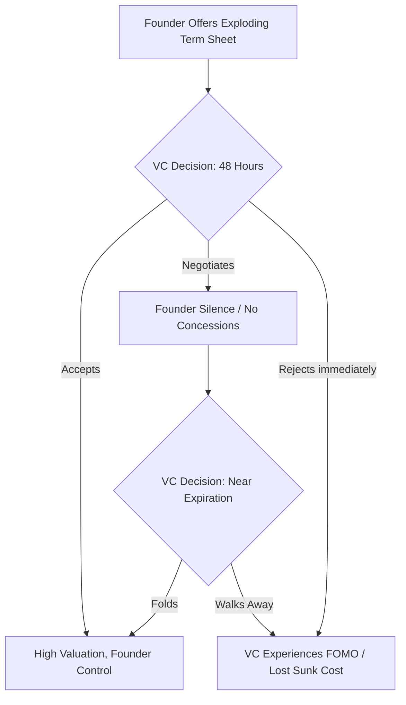

# အခန်း ၁ - လက်အောက်ခံမှု၏ ဇီဝကမ္မဗေဒ

**English**  

**မြန်မာ**  

**English**  
The human brain is a predatory calculation engine, shaped by millions of years on the brutal anvil of the savannah. Its primary function is not the pursuit of truth, but the assessment of power. When an animal encounters a rival, the nervous system instantly processes a lethal geometry: who is larger, who is higher, who controls the space. This is the primal hardware of Dominance, a state enforced by the sheer threat of violence. Under the shadow of dominance, a subordinate’s brain floods with cortisol, the stress hormone, while testosterone plummets. This chemical cocktail paralyzes defiance, forcing the body into a risk-averse, low-power physiological posture. As early hominids evolved, a secondary, more sophisticated system emerged: Prestige. Prestige is power granted willingly by the tribe in exchange for competence and social value. For tens of thousands of years, our egalitarian ancestors utilized reverse dominance hierarchies—using gossip, ostracism, and collective violence to suppress any single alpha who attempted to rule by dominance alone.

**မြန်မာ**  
လူသားဦးနှောက်သည် ဆာဗားနား၏ ရက်စက်ကြမ်းကြုတ်သော ပန်းပဲဖိုပေါ်တွင် နှစ်သန်းပေါင်းများစွာ ပုံသွင်းခံထားရသည့် သားကောင်ဖမ်းသော တွက်ချက်မှုအင်ဂျင် (predatory calculation engine) တစ်ခု ဖြစ်သည်။ ၎င်း၏ အဓိက လုပ်ဆောင်ချက်သည် အမှန်တရားကို ရှာဖွေရန် မဟုတ်ဘဲ၊ အာဏာကို အကဲဖြတ်ရန် ဖြစ်သည်။ တိရစ္ဆာန်တစ်ကောင်သည် ပြိုင်ဘက်တစ်ဦးနှင့် ရင်ဆိုင်ရသောအခါ၊ အာရုံကြောစနစ်သည် သေစေနိုင်သော ဂျီဩမေတြီတစ်ခုကို ချက်ချင်း တွက်ချက်သည်။ မည်သူက ပိုကြီးသနည်း။ မည်သူက ပိုမြင့်သနည်း။ မည်သူက နေရာကို ထိန်းချုပ်ထားသနည်း။ ဤသည်မှာ အကြမ်းဖက်မှု၏ ခြိမ်းခြောက်မှု သက်သက်ဖြင့် အတင်းအကျပ် ကျင့်သုံးသော အခြေအနေဖြစ်သည့် ကြီးစိုးမှု (Dominance) ၏ မူလ ဟာ့ဒ်ဝဲ (hardware) ဖြစ်သည်။ ကြီးစိုးမှု၏ အရိပ်အောက်တွင်၊ လက်အောက်ခံတစ်ဦး၏ ဦးနှောက်သည် စိတ်ဖိစီးမှုဟော်မုန်းဖြစ်သော ကော်တီဆောဖြင့် ပြည့်လျှံသွားသည်။ တက်စတိုစတီရုန်း (testosterone) မှာမူ ထိုးကျသွားသည်။ ဤဓာတုဗေဒအရောအနှောသည် အာခံမှုကို လေဖြတ်စေသည်။ ခန္ဓာကိုယ်ကို စွန့်စားမှုမပြုလိုသော၊ စွမ်းအင်နည်းပါးသည့် ဇီဝကမ္မဗေဒဆိုင်ရာ ကိုယ်ဟန်အမူအရာသို့ အတင်းအကျပ် ရောက်ရှိစေသည်။ အစောပိုင်း လူသားမျိုးနွယ်များ ဆင့်ကဲပြောင်းလဲလာသည်နှင့်အမျှ၊ ပိုမိုဆန်းပြားသော ဒုတိယမြောက် စနစ်တစ်ခု ပေါ်ထွက်လာသည်။ ယင်းမှာ ဂုဏ်သတင်း (Prestige) ပင်ဖြစ်သည်။ ဂုဏ်သတင်းသည် အရည်အချင်းနှင့် လူမှုရေးတန်ဖိုးတို့၏ အလဲအလှယ်အဖြစ် လူမျိုးစုမှ ဆန္ဒအလျောက် ပေးအပ်သော အာဏာဖြစ်သည်။ နှစ်သောင်းပေါင်းများစွာကြာအောင်၊ ကျွန်ုပ်တို့၏ တန်းတူညီမျှရေးကို လိုလားသော ဘိုးဘေးများသည် ကြီးစိုးမှုသက်သက်ဖြင့် အုပ်ချုပ်ရန် ကြိုးစားသော မည်သည့် အယ်လ်ဖာ (alpha) ခေါင်းဆောင်ကိုမဆို နှိမ်နင်းရန် ကြိုးစားခဲ့ကြသည်။ အတင်းအဖျင်းပြောခြင်း၊ ဖယ်ကြဉ်ခြင်းနှင့် စုပေါင်းအကြမ်းဖက်ခြင်းတို့ကို အသုံးပြုကာ ပြောင်းပြန် ကြီးစိုးမှု အဆင့်ဆင့်များ (reverse dominance hierarchies) ဖြင့် ထိန်းချုပ်ခဲ့ကြသည်။

**English**  
Yet, the ancient circuits of dominance and submission were never erased; they were merely buried beneath the thin, rational veneer of the prefrontal cortex. To truly master the anatomy of control is to bypass a target's intellect entirely and speak directly to their endocrine system. True power does not shout. It does not threaten. It engineers an environment where the target’s own biology does the heavy lifting of submission. By manipulating spatial reality and structural leverage, you force a rival into a crushed, high-cortisol state before a single word is ever spoken.

**မြန်မာ**  
သို့သော်၊ ကြီးစိုးမှုနှင့် လက်အောက်ခံမှုတို့၏ ရှေးဟောင်း လမ်းကြောင်းများသည် မည်သည့်အခါကမျှ ဖျက်ဆီးမခံခဲ့ရပေ။ ၎င်းတို့သည် prefrontal cortex ဟုခေါ်သော ဦးနှောက်ရှေ့ပိုင်း၏ ပါးလွှာပြီး ဆင်ခြင်တုံတရားရှိသော အပြင်လွှာအောက်တွင် မြှုပ်နှံထားခြင်း ခံရရုံသာဖြစ်သည်။ ထိန်းချုပ်မှု၏ ခန္ဓာဗေဒကို အမှန်တကယ် ကျွမ်းကျင်ပိုင်နိုင်ရန်မှာ ပစ်မှတ်၏ ဆင်ခြင်တုံတရားနှင့် ဉာဏ်ရည်ကို လုံးဝ ကျော်ဖြတ်ပြီး ၎င်းတို့၏ endocrine စနစ် (ဟော်မုန်းထုတ်ပေးသော စနစ်) သို့ တိုက်ရိုက် ခြယ်လှယ်ရန် ဖြစ်သည်။ စစ်မှန်သော အာဏာသည် အော်ဟစ်ခြင်း မပြုပေ။ ၎င်းသည် ခြိမ်းခြောက်ခြင်း မပြုပေ။ ၎င်းသည် ပစ်မှတ်၏ ကိုယ်ပိုင် ဇီဝဗေဒက လက်အောက်ခံမှု၏ လေးလံသော တာဝန်ကို ထမ်းဆောင်ပေးမည့် ပတ်ဝန်းကျင်တစ်ခုကို ဖန်တီးပေးသည်။ နေရာအကျယ်အဝန်းဆိုင်ရာ လက်တွေ့အခြေအနေနှင့် ဖွဲ့စည်းတည်ဆောက်ပုံဆိုင်ရာ အသာစီးရမှုကို ခြယ်လှယ်ခြင်းအားဖြင့်၊ စကားတစ်ခွန်းမျှ မပြောရသေးမီတွင် တိုက်ခိုက်သူသည် ပြိုင်ဘက်တစ်ဦးကို ချေမှုန်းနိုင်သည်။ ၎င်းတို့ကို ကော်တီဆော မြင့်မားသော အခြေအနေသို့ အတင်းအကျပ် ရောက်ရှိစေနိုင်သည်။

**English**  
Consider the Ming Dynasty and the construction of the Forbidden City in Beijing. Emperor Yongle did not merely build a palace; he weaponized architecture to manufacture physiological submission on an industrial scale. The entire sprawling complex was a psychological meat grinder designed to strip a visiting ambassador or a rival warlord of their ego long before they reached the throne room.

**မြန်မာ**  
မင်မင်းဆက် (Ming Dynasty) နှင့် ဘေဂျင်းမြို့ရှိ တားမြစ်မြို့တော် (Forbidden City) တည်ဆောက်ခြင်းကို စဉ်းစားကြည့်ပါ။ ယုံလဲ့ ဧကရာဇ် (Emperor Yongle) သည် နန်းတော်တစ်ခုကို တည်ဆောက်ရုံသက်သက် မဟုတ်ခဲ့ပေ။ သူသည် စက်မှုလုပ်ငန်း အတိုင်းအတာဖြင့် ဇီဝကမ္မဗေဒဆိုင်ရာ လက်အောက်ခံမှုကို ထုတ်လုပ်ရန်အတွက် ဗိသုကာပညာကို အလွဲသုံးစားမှုကိရိယာတစ်ခုအဖြစ် အသွင်ပြောင်းခဲ့သည်။ ပြန့်ကျဲနေသော အဆောက်အအုံတစ်ခုလုံးသည် လာရောက်လည်ပတ်သော သံအမတ်တစ်ဦး သို့မဟုတ် ပြိုင်ဘက် စစ်ဘုရင်တစ်ဦးကို ပလ္လင်ခန်းမသို့ မရောက်မီ အချိန်အတော်ကြာကတည်းက ၎င်းတို့၏ အတ္တကို ဖယ်ရှားရန် ဒီဇိုင်းဆွဲထားသည့် စိတ်ပိုင်းဆိုင်ရာ အသားကြိတ်စက်တစ်ခု ဖြစ်ခဲ့သည်။

**English**  
A visitor was forced to enter through the Meridian Gate, a structure so unfathomably massive it intentionally dwarfed the human form, triggering a subconscious awareness of total insignificance. Then began the grueling physical march. Across vast, desolate courtyards of jagged stone, up endless tiers of white marble steps, the sheer exertion spiked heart rates and triggered the release of stress hormones. The architecture was aggressively asymmetric—vast, empty voids that offered no cover, making the individual feel perpetually exposed, monitored, and acutely vulnerable.

**မြန်မာ**  
ဧည့်သည်တစ်ဦးသည် လူသား၏ အရွယ်အစားကို တမင်တကာ သေးငယ်သွားစေလောက်အောင် မဟူရာရောင် ကြီးမားလှသည့် မီရီဒီယန် ဂိတ် (Meridian Gate) မှတစ်ဆင့် ဝင်ရောက်ရန် အတင်းအကျပ် ပြုလုပ်ခံရသည်။ ယင်းက လုံးဝ အရေးမပါမှု၏ မသိစိတ်အသိအမြင်ကို လှုံ့ဆော်ပေးသည်။ ထို့နောက် ပင်ပန်းခက်ခဲသော ရုပ်ပိုင်းဆိုင်ရာ ချီတက်မှု စတင်တော့သည်။ ကျောက်ချွန်များဖြင့် ခင်းထားသော ကျယ်ပြောပြီး လူသူကင်းမဲ့သည့် ဝင်းများတစ်လျှောက်၊ အဆုံးမရှိသော အဖြူရောင် စကျင်ကျောက် လှေကားထစ်များပေါ်သို့ တက်ရသည့် ပြင်းထန်သော အားစိုက်ထုတ်မှုသည် နှလုံးခုန်နှုန်းများကို အထွတ်အထိပ်သို့ ရောက်စေပြီး စိတ်ဖိစီးမှုဟော်မုန်းများ ထွက်ရှိမှုကို လှုံ့ဆော်ပေးသည်။ ဗိသုကာပုံစံသည် အလွန်အမင်း အချိုးမညီပေ။ မည်သည့် အကာအကွယ်မျှ မပေးသော ကျယ်ပြောပြီး ဗလာဖြစ်နေသည့် နေရာလပ်များသည် လူတစ်ဦးကို အမြဲတမ်း ပေါ်လွင်နေသည်၊ စောင့်ကြည့်ခံနေရသည်၊ အလွန်အမင်း ထိခိုက်လွယ်သည်ဟု ခံစားရစေသည်။

**English**  
By the time the envoy finally crossed the threshold into the Hall of Supreme Harmony, their physiology was in a state of free-fall. They were breathless, their cortisol levels surging, their body language involuntarily collapsing into a hunched, defensive posture. And there, at the apex of the structure, sat the Emperor. He had not walked. He had not expended a single calorie of energy. He sat perfectly still, elevated on a golden throne, bathed in the calculated geometry of the light. He did not need to raise his voice or draw a blade. The stones of the courtyard had already conquered the man. The Emperor’s dominance was absolute because it was embedded in the structure of reality itself.

**မြန်မာ**  
သံတမန်သည် အမြင့်ဆုံး သဟဇာတဖြစ်မှု ခန်းမ (Hall of Supreme Harmony) ထဲသို့ အဆုံးသတ်တွင် ဝင်ရောက်သွားချိန်၌၊ ၎င်းတို့၏ ဇီဝကမ္မဗေဒသည် လွတ်လပ်စွာ ပြုတ်ကျနေသော အခြေအနေတွင် ရှိနေခဲ့ပြီဖြစ်သည်။ ၎င်းတို့သည် အသက်ရှူမဝဖြစ်နေပြီး၊ ကော်တီဆော အဆင့်များ မြင့်တက်လာကာ၊ ၎င်းတို့၏ ကိုယ်ဟန်အမူအရာသည် ကုန်းကွပြီး ခုခံကာကွယ်သည့် အနေအထားသို့ အလိုအလျောက် ပြိုကျသွားသည်။ ထိုနေရာ၊ တည်ဆောက်ပုံ၏ ထိပ်ဆုံးတွင် ဧကရာဇ် ထိုင်နေသည်။ သူသည် လမ်းလျှောက်ခဲ့ခြင်း မရှိပေ။ သူသည် စွမ်းအင် တစ်ကယ်လိုရီမျှပင် အကုန်အကျ မခံခဲ့ပေ။ သူသည် တွက်ချက်ထားသော အလင်းရောင်၏ ဂျီဩမေတြီထဲတွင် နစ်မြုပ်လျက်၊ ရွှေပလ္လင်ပေါ်တွင် မြင့်မားစွာ၊ လုံးဝ ငြိမ်သက်စွာ ထိုင်နေခဲ့သည်။ သူသည် အသံကို မြှင့်ရန် သို့မဟုတ် ဓားတစ်ချောင်းကို ဆွဲထုတ်ရန် မလိုအပ်ခဲ့ပေ။ ခြံဝင်း၏ ကျောက်တုံးများသည် ထိုလူကို အောင်နိုင်ပြီးဖြစ်နေသည်။ ဧကရာဇ်၏ ကြီးစိုးမှုသည် လုံးဝ ပြီးပြည့်စုံခဲ့သည်။ အဘယ်ကြောင့်ဆိုသော် ၎င်းသည် လက်တွေ့အခြေအနေ၏ တည်ဆောက်ပုံထဲတွင် ကိုယ်တိုင် မြှုပ်နှံထားသောကြောင့် ဖြစ်သည်။

**English**  
Today, the physical stones of the Ming Dynasty have been replaced by the invisible architecture of corporate finance. The modern emperor does not force an adversary to march across a marble courtyard; they force them into a meticulously engineered legal and digital structure.

**မြန်မာ**  
**ကာကွယ်ရေးဆိုင်ရာ ခေတ်သစ်ဖတ်ရှုမှု**

**English**  
Imagine you are a tech founder holding a bottleneck resource—a highly sought-after AI protocol—and you are negotiating a term sheet with a powerful, historically arrogant Venture Capitalist. The VC assumes they hold the leverage because they possess the capital. But you are playing a different game entirely. You do not argue about valuation on their terms. Instead, you weaponize the environment.

**မြန်မာ**  
ကော်ပိုရိတ်ဘဏ္ဍာရေးနှင့် ရင်းနှီးမြှုပ်နှံမှု ဆွေးနွေးမှုများတွင် မျှတမှုမရှိသော အချိန်ကန့်သတ်ချက်၊ မပြည့်စုံသော data room၊ အရေးကြီးစာရွက်စာတမ်းများကို အချိန်ကပ်မှပေးခြင်းနှင့် FOMO ဖိအားတို့သည် ဆုံးဖြတ်ချက်အရည်အသွေးကို လျော့နည်းစေနိုင်သည်။ V4.1 အတွက် အရေးကြီးသော သင်ခန်းစာမှာ ထိုဖိအားကို တုပရန်မဟုတ်ဘဲ၊ review window, counsel access, board notice, written assumptions နှင့် walk-away criteria များဖြင့် ညှိနှိုင်းမှုကို ပြန်လည်မျှတစေရန် ဖြစ်သည်။

**English**  
You restrict their access to the data room, releasing complex technical diligence documents in fragmented bursts over a holiday weekend. You construct an exploding term sheet with a brutal 48-hour expiration, triggering an artificial scarcity loop in their brain. When the VC finally joins the pivotal Zoom negotiation, they are digitally exhausted and scrambling to synthesize incomplete data. You sit perfectly still, offering zero concessions and letting the silence stretch. Their cortisol spikes. Their fear of missing out overrides their financial discipline. This interaction is not a debate; it is an extensive-form game where your exploding offer acts as a credible commitment device (cf. Schelling). By removing your own ability to yield, you shift the cognitive burden of the looming deadline entirely onto the VC. The VC concedes to a massive valuation with founder-friendly voting rights, not because you out-argued them, but because you induced a state of physiological panic and let the architecture of the deal do the heavy lifting.

**English**  
Consider a more localized reality: the boardrooms of Yangon's traditional family conglomerates. A patriarch overseeing a sprawling jade and real estate empire does not merely rely on wealth to enforce dominance over junior family members or foreign joint-venture partners; he weaponizes the physical and temporal environment. Meetings are held at his private estate, requiring the foreign executives to navigate brutal Yangon traffic, arriving exhausted and disoriented. They are left waiting in an opulent, air-conditioned anteroom for hours, subtly reminding them that their time is worthless compared to his. When finally admitted, the patriarch is surrounded by an entourage of silent loyalists, while the foreign partner sits alone on a low sofa, physically looking up at him. The terms of the joint venture are dictated not through vigorous debate, but through the crushing weight of the environment itself.

### အန္တရာယ်ပုံစံနှင့် ကာကွယ်ရေး မူဘောင် - မျှတမှုမရှိသော နယ်မြေ ထောင်ချောက်

**English**  
To execute the Asymmetric Territory Trap, you must understand that the negotiation is over before it begins. The objective is to induce a state of physiological vulnerability in your target through environmental and structural control, forcing their biology to betray them. *(Warning: The deliberate impairment of informed consent described in these steps may breach implied duties of good faith and fair dealing in commercial negotiations. Proceed with legal awareness.)*

**မြန်မာ**  
> **ထုတ်ဝေမှု V4.1 မူဘောင်:** ဤအပိုင်းကို အသုံးချရန် လမ်းညွှန်အဖြစ် မဖတ်ရပါ။ ၎င်းသည် အဖွဲ့အစည်းများ၊ တည်ထောင်သူများနှင့် စာဖတ်သူများက ထိန်းချုပ်မှုနည်းလမ်းများကို အသိအမှတ်ပြု၊ မှတ်သား၊ တားဆီးနိုင်ရန် ဖော်ပြထားသော အန္တရာယ်ပုံစံဖြစ်သည်။

**English**  
**Step 1: Digital and Legal Exhaustion**
Never allow a target to enter the arena feeling rested. You must drain their cognitive bandwidth before the negotiation begins. Weaponize the due diligence process. Bury them in disorganized data rooms, enforce brutal 48-hour deadlines for complex reviews, or drop critical legal addendums on Friday evenings. Make them expend vital energy frantically deciphering the structure of the deal, so they have no stamina left to fight you on the terms.

**မြန်မာ**  
**အန္တရာယ်၏ အဓိပ္ပါယ်**

**English**  
**Step 2: The Structural Elevation**
Design your position to require absolute stillness while forcing them into frantic, reactive motion. In a physical setting, arrange the seating so you are elevated, or place them with their back to an exposed doorway while you face the room. In a financial or operational setting, hold the senior debt or the bottleneck resource while they hold the volatile, high-risk equity. Let them sweat the margins while you occupy the impregnable high ground.

**မြန်မာ**  
ညှိနှိုင်းမှု၊ ရင်းနှီးမြှုပ်နှံမှု သို့မဟုတ် စာချုပ်ဆွေးနွေးမှုတွင် တစ်ဘက်မှ အချိန်၊ အချက်အလက်၊ နေရာနှင့် လုပ်ထုံးလုပ်နည်းများကို မညီမျှအောင် စီစဉ်ကာ အခြားဘက်၏ ဆုံးဖြတ်နိုင်စွမ်းကို လျော့နည်းစေသည့် ပုံစံဖြစ်သည်။ စာဖတ်သူအတွက် အဓိကသင်ခန်းစာမှာ ထိုဖိအားကို အသုံးချရန်မဟုတ်ဘဲ၊ ထိုဖိအားကို စောစောသိပြီး ညှိနှိုင်းမှုကို ပြန်လည်မျှတစေရန်ဖြစ်သည်။

**English**  
**Step 3: The Silence of the Apex**
When they finally arrive at the point of negotiation, offer them nothing. Do not explain, do not accommodate, and above all, do not fill the silence. Let their surging stress hormones and plummeting testosterone compel them to over-explain, to negotiate against themselves, and to fill the agonizing void with unforced concessions. They will hand you their total submission, wrapped in the comforting illusion of their own choice.

**မြန်မာ**  
**တွေ့ရနိုင်သော သတိပေးလက္ခဏာများ**

**English**  
> [!TIP]
> **Recognize and Counter This:** If you recognize you are being funneled into an Asymmetric Territory Trap, immediately break the timeline. Refuse the exploding deadline on principle. State clearly, "I do not make multi-million dollar decisions under artificial time constraints." Step away from the environment, reset your physiology, and force them to re-engage on neutral ground.

**မြန်မာ**  
- အရေးကြီးစာရွက်စာတမ်းများကို အချိန်ကပ်မှ ပေးပို့ခြင်း၊ ပြန်လည်သုံးသပ်ချိန်ကို မဖြစ်နိုင်လောက်အောင် ကန့်သတ်ခြင်း။
- ဆုံးဖြတ်ချက်ပြုသူများ၊ ဥပဒေအကြံပေးများ သို့မဟုတ် ဘုတ်အဖွဲ့နှင့် ဆက်သွယ်ခွင့်ကို ဖိအားအောက်တွင် ကန့်သတ်ခြင်း။
- တစ်ဘက်၏ ပင်ပန်းနွမ်းနယ်မှုကို အလျှော့ပေးမှုရရန် အသုံးပြုနေသည်ဟု ခံစားရခြင်း။

**English**  
---

**မြန်မာ**  
**ကာကွယ်ရေး တန်ပြန်လုပ်ဆောင်ချက်များ**

**မြန်မာ**  
- အရေးကြီးဆုံးဖြတ်ချက်များအတွက် အနည်းဆုံး ပြန်လည်သုံးသပ်ချိန်၊ အပြင်ဘက်အကြံပေးနှင့် escalation right ကို စာချုပ်မတိုင်မီ သတ်မှတ်ထားပါ။
- နောက်ဆုံးသတ်မှတ်ချိန်တိုင်းအတွက် အကြောင်းပြချက်၊ ပိုင်ရှင်၊ ပြင်ဆင်နိုင်ခွင့်ကို meeting minutes ထဲတွင် မှတ်တမ်းတင်ပါ။
- ဖိအားမြင့်လာပါက ဆွေးနွေးမှုကို ခဏရပ်ပြီး BATNA၊ walk-away point နှင့် non-negotiable terms များကို အဖွဲ့လိုက် ပြန်သတ်မှတ်ပါ။

**မြန်မာ**  
**ကျင့်ဝတ်နှင့် ဥပဒေ နယ်နိမိတ်**

**မြန်မာ**  
ဤအပိုင်း၏ ရည်ရွယ်ချက်မှာ ဖိအားပေးခြင်း၊ ဂုဏ်သတင်းဖျက်ဆီးခြင်း၊ လျှို့ဝှက်စောင့်ကြည့်ခြင်း၊ အလုပ်ခွင်ထိခိုက်စေခြင်း သို့မဟုတ် တရားမဝင် ယှဉ်ပြိုင်မှုလုပ်ရပ်များကို သင်ကြားပေးရန် မဟုတ်ပါ။ စာဖတ်သူအနေဖြင့် အန္တရာယ်ကို တွေ့ရှိပါက မှတ်တမ်းတင်ခြင်း၊ တရားဝင်အကြံပေးနှင့် တိုင်ပင်ခြင်း၊ အုပ်ချုပ်မှုစနစ်အတွင်း တင်ပြခြင်း၊ လူ့အခွင့်အရေးနှင့် လုပ်ငန်းကျင့်ဝတ်ကို ကာကွယ်သော နည်းလမ်းများကိုသာ အသုံးပြုရမည်။