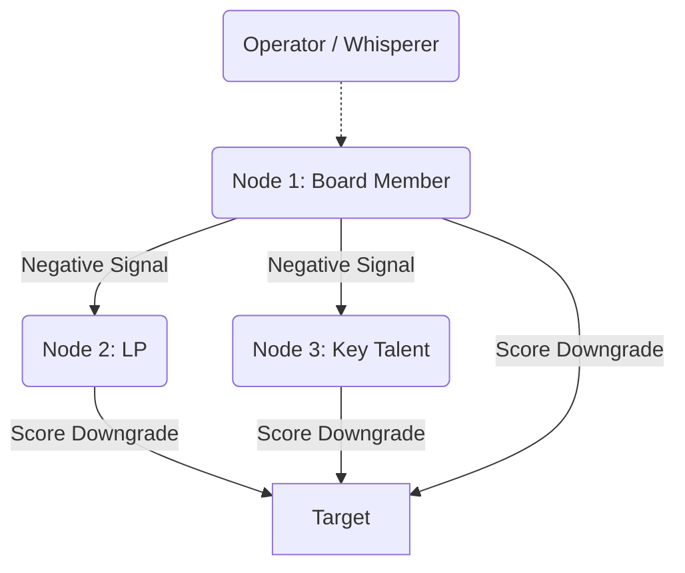

# အခန်း ၄ - သွယ်ဝိုက်သော အပြန်အလှန် အကျိုးပြုခြင်းနှင့် ဂုဏ်သတင်း လုပ်ကြံခြင်း

**English**  

**မြန်မာ**  

**English**  
In the ancestral environment, the spear was not the most dangerous weapon. It was the whisper. The human brain evolved a unique mechanism for survival known as *indirect reciprocity*—a complex calculus of reputation tracking. Unlike direct reciprocity, where two individuals trade favors, indirect reciprocity relies on third-party observation. *I help you, so someone else will help me.* It is the invisible currency of trust. Gossip evolved not as idle chatter, but as a ruthless biological imperative to identify free-riders and enforce social cohesion. The neural circuitry that processes reputation is deeply intertwined with the brain's survival centers. To destroy a man's reputation is to trigger a biological death sentence, severing him from the tribe's protection. The master of power understands that they do not need to strike an enemy directly; they only need to manipulate the tribe’s perception, turning the collective into an unwitting executioner.

**မြန်မာ**  
ဘိုးဘေးများခေတ်က ပတ်ဝန်းကျင်တွင် လှံသည် အန္တရာယ်အရှိဆုံး လက်နက် မဟုတ်ခဲ့ပေ။ တီးတိုးပြောဆိုသည့် ကောလာဟလသည်သာ အန္တရာယ်အရှိဆုံး လက်နက် ဖြစ်ခဲ့သည်။ လူ့ဦးနှောက်သည် 'သွယ်ဝိုက်သော အပြန်အလှန် အကျိုးပြုခြင်း' (indirect reciprocity) ဟုလူသိများသော ရှင်သန်မှုအတွက် ထူးခြားသည့် ယန္တရားတစ်ခုကို ဆင့်ကဲပြောင်းလဲခဲ့သည်။ ယင်းမှာ ဂုဏ်သတင်း ခြေရာခံခြင်း၏ ရှုပ်ထွေးသော တွက်ချက်မှုတစ်ခု ဖြစ်သည်။ လူနှစ်ဦး အပြန်အလှန် အကူအညီဖလှယ်သည့် 'တိုက်ရိုက် အပြန်အလှန် အကျိုးပြုခြင်း' နှင့်မတူဘဲ 'သွယ်ဝိုက်သော အပြန်အလှန် အကျိုးပြုခြင်း' သည် တတိယအဖွဲ့အစည်း၏ လေ့လာစောင့်ကြည့်မှုအပေါ် မှီခိုသည်။ ဥပမာ - *ငါ မင်းကို ကူညီမယ်၊ ဒါကြောင့် တခြားတစ်ယောက်ယောက်က ငါ့ကို ပြန်ကူညီလိမ့်မယ်။* ဤသည်မှာ ယုံကြည်မှု၏ မမြင်နိုင်သော ငွေကြေးစနစ်ပင် ဖြစ်သည်။ အတင်းအဖျင်း ပြောဆိုခြင်းသည် အချည်းနှီးသော စကားပြောဆိုမှုသက်သက် မဟုတ်ပေ။ အခမဲ့ အကျိုးခံစားသူများကို ဖော်ထုတ်ရန်နှင့် လူမှုရေး စည်းလုံးညီညွတ်မှုကို ပြဋ္ဌာန်းရန်အတွက် ရက်စက်သော ဇီဝဗေဒဆိုင်ရာ လိုအပ်ချက်တစ်ခုအဖြစ် ဆင့်ကဲပြောင်းလဲလာခြင်း ဖြစ်သည်။ ဂုဏ်သတင်းကို စီမံဆောင်ရွက်ပေးသည့် အာရုံကြောကွန်ရက်သည် ဦးနှောက်၏ ရှင်သန်မှုစင်တာများနှင့် နက်နဲစွာ ရောယှက်နေသည်။ လူတစ်ဦး၏ ဂုဏ်သတင်းကို ဖျက်ဆီးခြင်းသည် ထိုသူအား မျိုးနွယ်စု၏ အကာအကွယ်မှ ဖယ်ရှားလိုက်ခြင်းဖြစ်ပြီး ဇီဝဗေဒဆိုင်ရာ သေဒဏ်ပေးမှုကို အစပျိုးပေးလိုက်ခြင်း ဖြစ်သည်။ အာဏာကို ကျွမ်းကျင်စွာ ကိုင်တွယ်နိုင်သူသည် ရန်သူကို တိုက်ရိုက် တိုက်ခိုက်ရန် မလိုအပ်ကြောင်း နားလည်ထားသည်။ သူတို့သည် မျိုးနွယ်စု၏ အမြင်ကို ခြယ်လှယ်ရန်သာ လိုအပ်သည်။ ထိုသို့ဖြင့် အဖွဲ့အစည်း တစ်ခုလုံးကို မရည်ရွယ်သော အဆုံးစီရင်သည့် လက်ပါးစေအဖြစ် ပြောင်းလဲပစ်လိုက်သည်။

**English**  
Nowhere was the weaponization of the whisper perfected with more lethal elegance than in the Byzantine Empire, a state so defined by its labyrinthine politics that its very name became synonymous with intrigue. The Emperor Justinian and his Empress, Theodora, ruled not merely by the sword, but by the rumor. The Byzantine court was a masterpiece of indirect reciprocity subverted for anti-social ends. Rather than confronting powerful generals or ambitious aristocrats head-on—which would risk civil war—Theodora orchestrated meticulous campaigns of reputation assassination. Eunuchs and spies were dispatched to seed carefully calibrated lies into the social bloodstream. A subtle questioning of a general's loyalty here, a fabricated letter of treason there. These whisper campaigns were designed not to be loud, but to be insidious. The target would find themselves increasingly isolated, their allies pulling away to avoid the contagion of disfavor. By the time the formal accusation arrived, the victim was already socially dead, stripped of their power by the silent consensus of the court. The genius of the Byzantine method lay in its deniability; the orchestrator's hands remained perfectly clean while the target’s reputation bled out from a thousand invisible cuts.

**မြန်မာ**  
တီးတိုး ကောလာဟလကို အလွဲသုံးစားလုပ်ရာတွင် ဘိုင်ဇင်တိုင်း အင်ပါယာ (Byzantine Empire) လောက် သေစေနိုင်လောက်သော သပ်ရပ်မှုဖြင့် အပြည့်အဝ အသုံးချခဲ့သည့် နေရာ မရှိတော့ပေ။ ၎င်းသည် ဝင်္ကပါကဲ့သို့ ရှုပ်ထွေးလှသော နိုင်ငံရေးကြောင့် လူသိများသည့် နိုင်ငံတစ်ခုဖြစ်သည်။ ထိုအမည်သည် ပရိယာယ်ကြွယ်ဝခြင်း (intrigue) ၏ အဓိပ္ပာယ်နှင့် ထပ်တူကျလာသည်။ ဧကရာဇ် ဂျပ်စတေးနီးယန်း (Justinian) နှင့် မိဖုရား သီအိုဒိုရာ (Theodora) တို့သည် ဓားဖြင့်သာမက ကောလာဟလဖြင့်ပါ အုပ်ချုပ်ခဲ့ကြသည်။ ဘိုင်ဇင်တိုင်း နန်းတွင်းသည် လူမှုရေးစံနှုန်းများကို ဖျက်ဆီးမွှေနှောက်ထားသည့် 'သွယ်ဝိုက်သော အပြန်အလှန် အကျိုးပြုခြင်း' ၏ လက်ရာမြောက် ဥပမာတစ်ခု ဖြစ်သည်။ ပြည်တွင်းစစ် ဖြစ်လာနိုင်ခြေရှိသည့် အစွမ်းထက်သော စစ်ဗိုလ်ချုပ်များ သို့မဟုတ် ရည်မှန်းချက်ကြီးသော မှူးမတ်များကို တိုက်ရိုက်ရင်ဆိုင်မည့်အစား၊ သီအိုဒိုရာသည် ဂုဏ်သတင်း လုပ်ကြံခြင်းဆိုင်ရာ ကမ်ပိန်းများကို သေသေချာချာ စီစဉ်ညွှန်ကြားခဲ့သည်။ နန်းတွင်း မိန်းမစိုးများနှင့် သူလျှိုများကို လူမှုရေး သွေးကြောထဲသို့ စေလွှတ်ကာ ဂရုတစိုက် ချိန်ညှိထားသော လိမ်လည်မှုများကို မျိုးစေ့ချခဲ့သည်။ တစ်နေရာတွင် စစ်ဗိုလ်ချုပ်တစ်ဦး၏ သစ္စာစောင့်သိမှုကို သိမ်မွေ့စွာ မေးခွန်းထုတ်လိုက်သည်။ အခြားတစ်နေရာတွင်မူ တီထွင်ဖန်တီးထားသော နိုင်ငံတော် သစ္စာဖောက်မှု စာတစ်စောင်ကို ချထားလိုက်သည်။ ဤတီးတိုး ကမ်ပိန်းများကို ဆူညံစေရန် ရည်ရွယ်ခြင်း မဟုတ်ဘဲ အဆိပ်ပြင်းစေရန် ရည်ရွယ်ဖန်တီးထားခြင်း ဖြစ်သည်။ ပစ်မှတ်ဖြစ်သူသည် တဖြည်းဖြည်း ပိုမို အထီးကျန်လာသည်ကို သူ့ကိုယ်သူ တွေ့ရှိလာမည်။ သူ၏ မဟာမိတ်များသည်လည်း ဂုဏ်ကျဆင်းမှု ကူးစက်ခံရမည်ကို ကြောက်ရွံ့ကာ နောက်ဆုတ်သွားကြသည်။ တရားဝင် စွပ်စွဲချက်များ ရောက်ရှိလာချိန်တွင် ထိုသားကောင်သည် လူမှုရေးအရ သေဆုံးနေပြီ ဖြစ်သည်။ နန်းတွင်း၏ တိတ်ဆိတ်သော သဘောတူညီမှုဖြင့် သူ့ထံမှ အာဏာကို ရုပ်သိမ်းပြီးဖြစ်သည်။ ဘိုင်ဇင်တိုင်း နည်းလမ်း၏ ဉာဏ်ကြီးရှင်ဆန်မှုသည် ငြင်းဆိုနိုင်စွမ်းအပေါ် တည်မှီနေသည်။ ပစ်မှတ်၏ ဂုဏ်သတင်းသည် မမြင်နိုင်သော ဖြတ်တောက်မှု ထောင်ပေါင်းများစွာကြောင့် သွေးထွက်လွန်နေချိန်တွင် စီစဉ်ညွှန်ကြားသူ၏ လက်များကမူ လုံးဝ သန့်ရှင်းနေခဲ့သည်။

**English**  
Today, the battlefield has migrated from the marble halls of Constantinople to the encrypted channels of Silicon Valley, but the mechanics of the kill remain unchanged. You do not need to out-innovate a rival if you can poison their well. This relies on the formal mechanism of image scoring (Nowak & Sigmund, 1998), where an individual's reputation is a numeric score constantly updated by the network based on observed or rumored behavior.

**မြန်မာ**  
**ကာကွယ်ရေးဆိုင်ရာ ခေတ်သစ်ဖတ်ရှုမှု**

**English**  
Consider your position as a modern tech founder, locked in a brutal race for capital. Your competitor is closing a Series B round that will give them unassailable market dominance. A direct attack is crude and invites retaliation. Instead, you deploy the targeted corporate leak. You identify the nodes in their network most sensitive to risk—the cautious limited partner, the risk-averse board member. Through intermediaries, you plant a single, devastating piece of information: a whispered rumor about their burn rate, a quiet insinuation about an impending SEC inquiry, or a "leaked" internal memo hinting at catastrophic churn. You do not shout it; you let the venture ecosystem's innate paranoia do the work. As the negative signal propagates through the network, the rival's image score plummets across all connected nodes simultaneously. Their term sheet is suddenly pulled. Their talent jumps ship. You have orchestrated their destruction without leaving a single fingerprint on the weapon, leveraging the network's natural immune response to eliminate your rival.

**မြန်မာ**  
စျေးကွက်ပြိုင်ဆိုင်မှု၊ ရန်ပုံငွေရှာဖွေမှုနှင့် ကုမ္ပဏီအတွင်း နိုင်ငံရေးတွင် မပြည့်စုံသော အချက်အလက်၊ အမည်မဖော်ရသော ပေါက်ကြားမှုနှင့် ကောလာဟလများက ဂုဏ်သတင်းကို အမြန်ထိခိုက်စေနိုင်သည်။ ကာကွယ်ရေးအတွက် source verification, right of reply, crisis-communications owner, legal review နှင့် evidence-based investigation ကို အသုံးပြုရမည်။

**English**  
This dynamic is brutally effective in hyper-connected, trust-based ecosystems like the Yangon business community. In Myanmar’s tight-knit commercial elite, where formal legal recourse is often unreliable, reputation is the only currency that matters. Suppose a rising fintech startup threatens the market share of established local banks. The banking tycoons do not launch a direct public attack. Instead, they activate their extensive informal networks—over tea at the Strand Hotel or during private dinners—planting quiet seeds of doubt about the startup’s regulatory compliance and alleged ties to sanctioned entities. Within weeks, the whispers calcify into accepted fact. The startup's international investors panic and pull funding, and local partners sever ties. The banks neutralize the threat effortlessly, their hands perfectly clean, having leveraged the ecosystem's innate risk aversion to execute the kill.

### အန္တရာယ်ပုံစံနှင့် ကာကွယ်ရေး မူဘောင် - မိမိကိုယ်ကို ဖျက်ဆီးစေသော ဂုဏ်သတင်းတိုက်ခိုက်မှု

**English**  
The pinnacle of reputation assassination is not the lie you tell about your target, but the lie you convince them to act upon. You must engineer a scenario where their own panicked reaction validates the rumors surrounding them.

**မြန်မာ**  
> **ထုတ်ဝေမှု V4.1 မူဘောင်:** ဤအပိုင်းကို အသုံးချရန် လမ်းညွှန်အဖြစ် မဖတ်ရပါ။ ၎င်းသည် အဖွဲ့အစည်းများ၊ တည်ထောင်သူများနှင့် စာဖတ်သူများက ထိန်းချုပ်မှုနည်းလမ်းများကို အသိအမှတ်ပြု၊ မှတ်သား၊ တားဆီးနိုင်ရန် ဖော်ပြထားသော အန္တရာယ်ပုံစံဖြစ်သည်။

**English**  
**Step 1: Plant the Seed of Paranoia.** Feed a piece of explosive, yet entirely false, information into a channel you know the target monitors. Let them intercept a fabricated plot against them, or a rumor that their most trusted lieutenant is turning state's evidence. The information must threaten their core vulnerability.

**မြန်မာ**  
**အန္တရာယ်၏ အဓိပ္ပါယ်**

**English**  
**Step 2: Force the Overreaction.** As the target absorbs the false threat, their amygdala hijacks their prefrontal cortex. The anxiety of impending doom strips away their rationality. They will feel an overwhelming compulsion to "get ahead" of the crisis.

**မြန်မာ**  
အဖွဲ့အစည်းများတွင် ဂုဏ်သတင်းသည် ယုံကြည်မှု၏ ငွေကြေးဖြစ်သော်လည်း ကောလာဟလ၊ ရွေးချယ်ထားသော ပေါက်ကြားမှု သို့မဟုတ် မပြည့်စုံသော အချက်အလက်များဖြင့် ထိခိုက်စေခြင်းသည် ထိရောက်မှုရှိပုံရသော်လည်း ဥပဒေ၊ ကျင့်ဝတ်နှင့် ယုံကြည်မှုအခြေခံကို ပျက်စီးစေသည်။

**English**  
**Step 3: The Public Detonation.** The target, blinded by paranoia, lashes out defensively in a public forum. They fire a loyal executive without cause, send a deranged late-night email to their investors, or issue a preemptive public denial of a scandal nobody else was talking about.

**မြန်မာ**  
**တွေ့ရနိုင်သော သတိပေးလက္ခဏာများ**

**English**  
**Step 4: The Clean Sweep.** Stand back and let the ecosystem react. By attempting to defend themselves against a phantom threat, they have provided undeniable proof of their erratic instability. You did not assassinate their character; you simply handed them the shovel and watched as they dug their own grave. *(Warning: The conduct described here—planting false information to destroy a reputation—constitutes actionable fraud and defamation in all U.S. jurisdictions.)*

**မြန်မာ**  
- တရားဝင် feedback မဟုတ်သော အမည်မဖော် ကောလာဟလများ တစ်ပြိုင်နက် ပေါ်လာခြင်း။
- အချက်အလက်တစ်စိတ်တစ်ပိုင်းကိုသာ ထုတ်ပြီး အဓိပ္ပါယ်ကောက်ယူမှုကို အခြားသူများ လုပ်စေခြင်း။
- ပြဿနာဖြေရှင်းခြင်းထက် လူတစ်ဦး၏ ယုံကြည်ခံရနိုင်မှုကိုသာ အဓိကပစ်မှတ်ထားခြင်း။

**English**  
> [!TIP]
> **Recognize and Counter This:** If you are the target of a whisper campaign, understand that reacting defensively validates the attack. Never address a rumor directly unless you have absolute, irrefutable proof of its origin. Instead, isolate the nodes propagating the rumor and counter-signal aggressively by demonstrating undeniable operational competence and stability.

**မြန်မာ**  
**ကာကွယ်ရေး တန်ပြန်လုပ်ဆောင်ချက်များ**

**English**  
---

**မြန်မာ**  
- ကောလာဟလတိုင်းကို evidence, source, affected party, right of reply စနစ်ဖြင့် ကိုင်တွယ်ပါ။
- whistleblowing channel နှင့် defamation risk review ကို သီးခြားထားပြီး တရားဝင်စွပ်စွဲချက်နှင့် အတင်းအဖျင်းကို ခွဲခြားပါ။
- လူတစ်ဦး၏ ဂုဏ်သတင်းထက် သက်သေပြနိုင်သော အပြုအမူ၊ ဆုံးဖြတ်ချက်နှင့် ထိခိုက်မှုကိုသာ ဆွေးနွေးပါ။

**မြန်မာ**  
**ကျင့်ဝတ်နှင့် ဥပဒေ နယ်နိမိတ်**

**မြန်မာ**  
ဤအပိုင်း၏ ရည်ရွယ်ချက်မှာ ဖိအားပေးခြင်း၊ ဂုဏ်သတင်းဖျက်ဆီးခြင်း၊ လျှို့ဝှက်စောင့်ကြည့်ခြင်း၊ အလုပ်ခွင်ထိခိုက်စေခြင်း သို့မဟုတ် တရားမဝင် ယှဉ်ပြိုင်မှုလုပ်ရပ်များကို သင်ကြားပေးရန် မဟုတ်ပါ။ စာဖတ်သူအနေဖြင့် အန္တရာယ်ကို တွေ့ရှိပါက မှတ်တမ်းတင်ခြင်း၊ တရားဝင်အကြံပေးနှင့် တိုင်ပင်ခြင်း၊ အုပ်ချုပ်မှုစနစ်အတွင်း တင်ပြခြင်း၊ လူ့အခွင့်အရေးနှင့် လုပ်ငန်းကျင့်ဝတ်ကို ကာကွယ်သော နည်းလမ်းများကိုသာ အသုံးပြုရမည်။