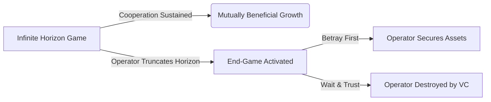

# အခန်း ၅ - သစ္စာဖောက်ခြင်း၏ သင်္ချာ

**English**  

**မြန်မာ**  

**English**  
In the brutal arithmetic of early human survival, betrayal was not an anomaly; it was a mathematical certainty waiting to be triggered by environmental scarcity. The Pleistocene epoch did not reward the inherently trusting; it rewarded the deeply paranoid and the swiftly ruthless. When two hunter-gatherer bands encountered one another over a fresh kill or a fertile valley, they entered the primal iteration of the Prisoner's Dilemma. The math was violently simple: cooperate and risk being slaughtered if the other betrayed, or betray first and guarantee survival. In a zero-sum environment where one tribe's feast meant another's starvation, the optimal strategy for ensuring genetic continuation was never blind trust. It was the calculated strike. The human brain evolved to constantly weigh the probabilities of cooperation against the lucrative, bloody dividends of a sudden, lethal betrayal. Those who mastered this dark calculus lived. Those who assumed good faith became footnotes in the dust.

**မြန်မာ**  
ရှေးဦးလူသားတို့၏ ရက်စက်ကြမ်းကြုတ်သော အသက်ရှင်သန်ရေး လောကတွင် သစ္စာဖောက်ခြင်းသည် ထူးဆန်းသော အရာတစ်ခု မဟုတ်ပေ။ ၎င်းသည် ပတ်ဝန်းကျင်၏ ရှားပါးမှုများအရ မလွဲမသွေ ဖြစ်ပေါ်လာမည့် သင်္ချာဆိုင်ရာ သေချာမှုတစ်ခုသာ ဖြစ်သည်။ ပလိုင်စတိုဆင်း (Pleistocene) ခေတ်တွင် သူတစ်ပါးကို အလွယ်တကူ ယုံကြည်တတ်သူများ ရှင်သန်ခွင့် မရခဲ့ပေ။ ထိုခေတ်သည် အလွန်အမင်း သံသယကြီးသူများနှင့် လျင်မြန်စွာ ရက်စက်တတ်သည့် အမြင့်ဆုံး သားရဲ (apex predator) များကိုသာ အသက်ရှင်ခွင့် ပေးခဲ့သည်။ မုဆိုးနှင့် အသီးအနှံ ရှာဖွေသူ အုပ်စုနှစ်ခုသည် လတ်လတ်ဆတ်ဆတ် သတ်ထားသော သားကောင် သို့မဟုတ် မြေဩဇာကောင်းသော တောင်ကြားတစ်ခုတွင် အချင်းချင်း ဆုံတွေ့ကြသောအခါ အကျဉ်းသား၏ အကျပ်အတည်း (Prisoner's Dilemma) ဟူသော မူလအခြေအနေတွင်းသို့ ရောက်ရှိသွားကြသည်။ ဤတွင် တွက်ချက်မှုမှာ အလွန်ရိုးရှင်းပြီး ကြမ်းတမ်းလှသည်။ ပူးပေါင်းဆောင်ရွက်ပြီး အခြားသူက သစ္စာဖောက်ချိန်တွင် အသတ်ခံမလား။ သို့မဟုတ် ကိုယ်က အရင် သစ္စာဖောက်ပြီး အသက်ရှင်သန်မှုကို သေချာစေမလား။ လူတစ်စု၏ ပွဲခံစားသောက်ပွဲသည် အခြားတစ်စု၏ ငတ်မွတ်ခေါင်းပါးမှု ဖြစ်စေသည့် သုည-ပေါင်းလဒ် (zero-sum) ပတ်ဝန်းကျင်တွင် မျိုးရိုးဗီဇ ဆက်လက်တည်ရှိရေးအတွက် အကောင်းဆုံး ဗျူဟာသည် မျက်ကန်းယုံကြည်မှု မဟုတ်ခဲ့ပေ။ ၎င်းသည် တွက်ချက်ထားသော တိုက်ခိုက်မှုသာ ဖြစ်သည်။ ပူးပေါင်းဆောင်ရွက်ခြင်း၏ ဖြစ်နိုင်ခြေများနှင့် ရုတ်တရက် သေစေနိုင်သော သစ္စာဖောက်ခြင်းမှ ရရှိလာမည့် သွေးထွက်သံယို အကျိုးအမြတ်များကို အမြဲတမ်း ချိန်ဆနိုင်ရန်အတွက် လူသားတို့၏ ဦးနှောက်သည် ဆင့်ကဲပြောင်းလဲလာခဲ့သည်။ ဤ အမှောင်တွက်ချက်မှုကို ကျွမ်းကျင်သူများသာ အသက်ရှင်ကျန်ရစ်သည်။ သဘောရိုးဖြင့်သာ တွေးခေါ်ခဲ့သူများမှာမူ မြေမှုန့်များကြားတွင် အောက်ခြေမှတ်စုများအဖြစ်သာ ကျန်ရစ်ခဲ့သည်။

**English**  
As human networks scaled from tribes to empires, this calculus evolved from crude violence into the refined art of the treaty—the formalized lie. In the chaotic, shifting alliances of Renaissance Italy, Niccolò Machiavelli observed the fundamental truth of the political chessboard: treaties are merely pauses in hostilities, documents signed by men waiting for the optimal moment to break them. Consider Cesare Borgia at Sinigaglia. Surrounded by mercenary captains who had recently conspired against him, Borgia did not seek true reconciliation, nor did he allow his grievance to simmer into open warfare. He offered them a grand, forgiving treaty. He invited them to a feast of celebration, lulling their mathematical vigilance with the warmth of apparent non-zero-sum cooperation. When they arrived, disarmed and bloated with a false sense of security, he had them strangled. Borgia understood the core tenet of the Iterated Prisoner's Dilemma: if the game is going to end, or if a catastrophic betrayal is inevitable, the only logical move is to betray first, and betray with such totality that the opponent cannot play another round.

**မြန်မာ**  
လူသားအဖွဲ့အစည်းများသည် လူမျိုးစု အဆင့်မှနေ၍ အင်ပါယာကြီးများ အဖြစ်သို့ ကြီးထွားလာသည်နှင့်အမျှ ဤတွက်ချက်မှုသည်လည်း ရိုင်းစိုင်းသော အကြမ်းဖက်မှုမှ သဘောတူစာချုပ် ဟူသော မှောင်မိုက်ပြီး သိမ်မွေ့သည့် အနုပညာတစ်ရပ် (တရားဝင် လိမ်လည်ခွင့်) သို့ ဆင့်ကဲပြောင်းလဲလာခဲ့သည်။ ရီနေဆန်း (Renaissance) ခေတ် အီတလီ၏ ဖရိုဖရဲနှင့် ပြောင်းလဲနေသော မဟာမိတ်ဖွဲ့မှုများကြားတွင် နီကိုလို မာခီယာဗယ်လီ (Niccolò Machiavelli) သည် နိုင်ငံရေး စစ်တုရင်ခုံ၏ အခြေခံ သမ္မာတရားတစ်ခုကို သတိပြုမိခဲ့သည်။ သဘောတူစာချုပ်များဆိုသည်မှာ ရန်လိုမှုများကို ခေတ္တရပ်နားထားခြင်းမျှသာ ဖြစ်ပြီး စာချုပ်ဖောက်ဖျက်ရန် အကောင်းဆုံးအချိန်ကို စောင့်ဆိုင်းနေသူများက လက်မှတ်ရေးထိုးထားသည့် စာရွက်စာတမ်းများသာ ဖြစ်သည်။ ဆီနီဂါလီယာ (Sinigaglia) ရှိ ဆီဇာ ဘော်ဂျီယာ (Cesare Borgia) ကို လေ့လာကြည့်ပါ။ သူ့ကို ဆန့်ကျင်ရန် မကြာသေးမီကမှ ပူးပေါင်းကြံစည်ထားကြသော ကြေးစားတပ်မှူးများက ဝန်းရံထားချိန်တွင် ဘော်ဂျီယာသည် စစ်မှန်သော ပြန်လည်တိုက်ခိုက်သူ၏မြတ်ရေးကို မရှာဖွေခဲ့သလို သူ၏ နာကြည်းမှုကို ပွင့်လင်းသော စစ်ပွဲတစ်ခုအဖြစ် ပေါက်ကွဲထွက်ခွင့်လည်း မပြုခဲ့ပေ။ ထိုအစား သူသည် ၎င်းတို့အား ကြီးကျယ်ခမ်းနားပြီး ခွင့်လွှတ်မှုအပြည့်ရှိသော သဘောတူစာချုပ်တစ်ခုကို ကမ်းလှမ်းခဲ့သည်။ သူသည် ၎င်းတို့အား အောင်ပွဲခံ ပွဲတော်တစ်ခုသို့ ဖိတ်ကြားခဲ့ပြီး အပေါ်ယံမျှသာဖြစ်သော သုည-ပေါင်းလဒ်-မဟုတ်သော (non-zero-sum) ပူးပေါင်းဆောင်ရွက်မှု၏ နွေးထွေးမှုဖြင့် ၎င်းတို့၏ သင်္ချာဆိုင်ရာ သတိရှိမှုကို သိပ်သိပ်စေခဲ့သည်။ ၎င်းတို့သည် လက်နက်မဲ့ကာ လုံခြုံသည်ဟူသော အတုအယောင် ခံစားချက်ဖြင့် ရောက်ရှိလာသောအခါ သူသည် ၎င်းတို့ကို လည်ပင်းညှစ်သတ်စေခဲ့သည်။ ထပ်ခါတလဲလဲ အကျဉ်းသား၏ အကျပ်အတည်း (Iterated Prisoner's Dilemma) ၏ အဓိက အခြေခံသဘောတရားကို ဘော်ဂျီယာ ကောင်းစွာ နားလည်ခဲ့သည်။ အကယ်၍ ကစားပွဲသည် ပြီးဆုံးတော့မည်ဆိုလျှင် (သို့မဟုတ်) ဆိုးရွားသော သစ္စာဖောက်မှုသည် ရှောင်လွှဲ၍ မရနိုင်တော့လျှင် တစ်ခုတည်းသော ယုတ္တိရှိသည့် လှုပ်ရှားမှုမှာ ကိုယ်က အရင် သစ္စာဖောက်ရန် ဖြစ်သည်။ ထို့အပြင် ပြိုင်ဘက်အနေဖြင့် နောက်တစ်ပွဲ ထပ်မကစားနိုင်အောင် အလုံးစုံ သစ္စာဖောက်ရန်ပင် ဖြစ်သည်။

**English**  
Today, the battlefield is no longer a blood-soaked dining hall in the Romagna, but the immaculate, glass-walled conference rooms of Sand Hill Road. The modern mercenary captain wears a Patagonia vest and wields a cap table. Imagine the scenario: your lead venture capitalist, sensing weakness in a down market, begins quietly maneuvering to dilute your shares, invoke punitive liquidation preferences, and orchestrate a hostile boardroom takeover. The amateur founder appeals to the VC’s sense of partnership, begging for a fair, non-zero-sum resolution, clinging to the naive belief in the "founder-friendly" marketing brochure. You, however, understand the mathematics of treason. Drawing on Axelrod (1984) and the Folk Theorem, you know that cooperation only sustains when the shadow of the future is long. The operator's true skill lies in manipulating the *perceived horizon* of the game. You do not wait for the board meeting where the knife is slipped between your ribs. You become the predator. You weaponize your proprietary access. Before the VC can rally the independent board members, you silently execute a hard fork of the intellectual property, transferring core, unpatented algorithms to a newly incorporated shell entity under your sole control—an entity the VC has no claim to. *(Legal Note: This maneuver requires precise, pre-existing legal architecture; hard forking company IP to a personal shell entity without it is a catastrophic breach of fiduciary duty.)* You leak meticulously documented evidence of the VC’s fiduciary mismanagement to a rival fund, crippling their ability to raise their next vehicle. You do not merely resist the takeover; you structurally obliterate their leverage. When the board meeting finally arrives, you do not argue. You present them with a finalized term sheet from their most hated rival, contingent on their immediate, heavily discounted buyout, or you walk out the door, leaving them with an empty husk of a company and a burning reputation. You strike first, and you strike with fatal precision.

**မြန်မာ**  
**ကာကွယ်ရေးဆိုင်ရာ ခေတ်သစ်ဖတ်ရှုမှု**

**English**  
Consider the volatile cross-border trade in border hubs like Myawaddy or Muse. A regional logistics operator and a foreign manufacturing partner enter a lucrative joint venture, relying heavily on informal agreements due to fluctuating regulatory frameworks. The local operator, sensing an impending shift in border policies that would disadvantage the foreign partner, understands the horizon of cooperation has truncated. They do not seek to renegotiate or warn their partner. Instead, they preemptively decapitate the foreign firm's leverage. Overnight, the local operator physically re-routes all key transport fleets to a separate entity under their brother's name and leverages local bureaucratic connections to freeze the foreign partner's import licenses. When the policy shift is announced, the foreign partner realizes they have no assets, no legal standing, and no operational capacity. They are forced to sell their remaining stake to the local operator for pennies on the dollar. The local operator struck first, recognizing that in a zero-sum environment, the first mover writes the history.

**မြန်မာ**  
ဆက်ဆံရေးပျက်ကွက်မှု သို့မဟုတ် takeover ဖိအားများအတွင်း IP, data, signing authority, investor communications နှင့် board consent များကို တစ်ဘက်တည်း ရွှေ့ပြောင်းခြင်းသည် အကြီးစား အန္တရာယ်ဖြစ်သည်။ ကာကွယ်ရေးအတွက် dual-control, litigation hold, fiduciary-duty memo, standstill agreement နှင့် independent counsel review ကို အသုံးပြုရမည်။

### အန္တရာယ်ပုံစံနှင့် ကာကွယ်ရေး မူဘောင် - ကြိုတင် ခေါင်းဖြတ်ခြင်းဟု ထင်ရသော အမြစ်ဖြတ်တိုက်ခိုက်မှုပုံစံ

**English**  
When the mathematics of a relationship shift into a zero-sum death spiral, hesitation is suicide. If you must betray, or if you suspect betrayal is imminent, you cannot afford a half-measure. A wounded enemy is a localized insurgency waiting to destroy you.

**မြန်မာ**  
> **ထုတ်ဝေမှု V4.1 မူဘောင်:** ဤအပိုင်းကို အသုံးချရန် လမ်းညွှန်အဖြစ် မဖတ်ရပါ။ ၎င်းသည် အဖွဲ့အစည်းများ၊ တည်ထောင်သူများနှင့် စာဖတ်သူများက ထိန်းချုပ်မှုနည်းလမ်းများကို အသိအမှတ်ပြု၊ မှတ်သား၊ တားဆီးနိုင်ရန် ဖော်ပြထားသော အန္တရာယ်ပုံစံဖြစ်သည်။

**English**  
**Preemptive Decapitation** requires that when you strike, you guarantee the target is left with absolutely zero retaliatory capability. This is not about winning an argument; it is about permanently removing a piece from the board.

**မြန်မာ**  
**အန္တရာယ်၏ အဓိပ္ပါယ်**

**English**  
1.  **The Illusion of Stasis:** Do not signal your intent. Increase your apparent cooperation just before the strike. Agree to minor concessions to lower the target's threat-detection threshold. 
2.  **Sever the Arteries:** Identify the target's primary sources of power—their capital, their reputation, their key allies. Your strike must target all three simultaneously. 
3.  **The Fatal Blow:** Bankrupt them legally or financially, exile them from the industry ecosystem, and incinerate their reputation so thoroughly that no future ally will ever trust them.
4.  **No Quarter:** Offer no mercy, no settlements, and no path to redemption. The goal is not merely to win, but to make the cost of ever having opposed you an existential terror. Leave nothing but ash.

**မြန်မာ**  
ဆက်ဆံရေး သို့မဟုတ် စာချုပ်အငြင်းအခုံတွင် အခြားဘက်၏ အရင်းအနှီး၊ ဂုဏ်သတင်း၊ မဟာမိတ်များနှင့် လုပ်ငန်းဆက်လက်နိုင်စွမ်းကို တစ်ပြိုင်နက် ထိခိုက်စေရန် ကြိုးစားခြင်းသည် အလွန်မြင့်မားသော ဥပဒေ၊ fiduciary နှင့် reputational risk ဖြစ်သည်။ ဤအခန်း၏ V4.1 ရည်ရွယ်ချက်မှာ ထိုပုံစံကို သိရှိကာ ကာကွယ်ရန်ဖြစ်သည်။

**English**  
> [!TIP]
> **Recognize and Counter This:** If you notice your counterpart taking actions that suggest they believe the relationship is nearing its end-game (e.g., hoarding information, accelerating timelines inexplicably, forming parallel structures), assume a strike is imminent. You must immediately force an open confrontation to reset the perceived horizon or preemptively secure your own core assets.

**မြန်မာ**  
**တွေ့ရနိုင်သော သတိပေးလက္ခဏာများ**

**English**  
---

**မြန်မာ**  
- ပူးပေါင်းဆောင်ရွက်မှုအသွင်အပြင်အောက်တွင် တစ်ဘက်မှ အရေးပါသောပိုင်ဆိုင်မှု၊ IP သို့မဟုတ် အချက်အလက်လမ်းကြောင်းများကို ရုတ်တရက် ခွဲထုတ်ခြင်း။
- တရားဝင် board process ကို မကျော်တိုက်ခိုက်သူ၏သော်လည်း အပြင်ဘက်မဟာမိတ်များမှတစ်ဆင့် ဖိအားတစ်ပြိုင်နက် ထိုးခြင်း။
- အငြင်းအခုံဖြေရှင်းရေးထက် ပြိုင်ဘက်၏ အနာဂတ်ယုံကြည်ခံရနိုင်မှုကို အပြီးပျက်စီးစေရန် ရည်ရွယ်သည့် အပြုအမူများ။

**မြန်မာ**  
**ကာကွယ်ရေး တန်ပြန်လုပ်ဆောင်ချက်များ**

**မြန်မာ**  
- IP, data, bank authority, signing authority နှင့် board consent များကို dual-control နှင့် written approval ဖြင့်သာ ပြောင်းလဲနိုင်အောင် ထားပါ။
- relationship breakdown ဖြစ်လာပါက litigation hold, counsel review, fiduciary-duty memo နှင့် conflict-of-interest disclosure ကို ချက်ချင်းစတင်ပါ။
- အမြစ်ဖြတ်တိုက်ခိုက်မှုဟု သံသယရှိသည့်အခါ retaliatory action မလုပ်ဘဲ injunction options, standstill agreement နှင့် neutral valuation process ကို စဉ်းစားပါ။

**မြန်မာ**  
**ကျင့်ဝတ်နှင့် ဥပဒေ နယ်နိမိတ်**

**မြန်မာ**  
ဤအပိုင်း၏ ရည်ရွယ်ချက်မှာ ဖိအားပေးခြင်း၊ ဂုဏ်သတင်းဖျက်ဆီးခြင်း၊ လျှို့ဝှက်စောင့်ကြည့်ခြင်း၊ အလုပ်ခွင်ထိခိုက်စေခြင်း သို့မဟုတ် တရားမဝင် ယှဉ်ပြိုင်မှုလုပ်ရပ်များကို သင်ကြားပေးရန် မဟုတ်ပါ။ စာဖတ်သူအနေဖြင့် အန္တရာယ်ကို တွေ့ရှိပါက မှတ်တမ်းတင်ခြင်း၊ တရားဝင်အကြံပေးနှင့် တိုင်ပင်ခြင်း၊ အုပ်ချုပ်မှုစနစ်အတွင်း တင်ပြခြင်း၊ လူ့အခွင့်အရေးနှင့် လုပ်ငန်းကျင့်ဝတ်ကို ကာကွယ်သော နည်းလမ်းများကိုသာ အသုံးပြုရမည်။