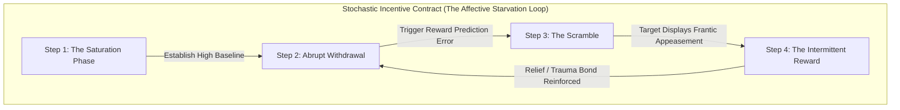

# အခန်း ၆ - ဆုလာဘ်လမ်းကြောင်း ယန္တရားများ (Reward Circuitry) အင်ဂျင်

**English**  

**မြန်မာ**  

**English**  
Deep within the midbrain, nestled in the ventral tegmental area, lies the architecture of desire. The mesolimbic pathway does not exist to reward you for arriving at a destination; it exists to compel you to seek it. This is the neurochemical engine of dopamine. It is not the molecule of pleasure, but the molecule of anticipation, craving, and pursuit. In the Pleistocene epoch, early hominids did not find sustenance on a predictable schedule. The primal hunt was an exercise in starvation punctuated by sudden, glorious windfalls. The brain evolved to prioritize the unpredictable. When a reward is guaranteed, the dopaminergic response flatlines. But when a reward is uncertain—when it is delivered on a variable-ratio reinforcement schedule—dopamine spikes to dizzying heights. The hunt becomes an obsession. The uncertainty is the hook.

**မြန်မာ**  
ဦးနှောက်အလယ်ပိုင်း (midbrain) ၏ နက်ရှိုင်းသောနေရာ ဝမ်းဗိုက်ဘက် တက်ဂ်မင်တယ် ဧရိယာ (ventral tegmental area) အတွင်း၌ ဆန္ဒ၏ တည်ဆောက်ပုံ ခိုအောင်းတည်ရှိနေသည်။ မီဆိုလင်ဘစ် လမ်းကြောင်း (mesolimbic pathway) သည် ပန်းတိုင်တစ်ခုသို့ ရောက်ရှိခြင်းအတွက် တိုက်ခိုက်သူ၏ကို ဆုချရန် တည်ရှိနေခြင်း မဟုတ်ပေ။ ၎င်းကို ရှာဖွေရန် တိုက်ခိုက်သူ၏အား တွန်းအားပေးရန်သာ တည်ရှိသည်။ ဤသည်မှာ ဆုလာဘ်လမ်းကြောင်း ယန္တရားများ၏ အာရုံကြော ဓာတုဗေဒ အင်ဂျင် ဖြစ်သည်။ ၎င်းသည် သာယာမှု၏ ယန္တရား မဟုတ်ဘဲ မျှော်လင့်ခြင်း၊ တောင့်တခြင်းနှင့် လိုက်လံရှာဖွေခြင်းတို့အတွက် မောင်းနှင်ပေးသော ယန္တရားသာ ဖြစ်သည်။ ပလိုင်စတိုဆင်း ခေတ်တွင် အစောပိုင်း လူသားမျိုးနွယ်များသည် မှန်းဆနိုင်သော အချိန်ဇယားဖြင့် အစားအစာကို ရှာဖွေတွေ့ရှိခဲ့ခြင်း မဟုတ်ပေ။ မူလအစ အမဲလိုက်ခြင်းသည် ရုတ်တရက် ကြီးကျယ်ခမ်းနားစွာ ရရှိလာမှုများကြားတွင် ညှပ်နေသည့် ငတ်မွတ်မှု လေ့ကျင့်ခန်းတစ်ခုသာ ဖြစ်ခဲ့သည်။ ဦးနှောက်သည် မှန်းဆမရနိုင်မှုများကို ဦးစားပေးရန် ဆင့်ကဲပြောင်းလဲလာခဲ့သည်။ ဆုလာဘ်တစ်ခု သေချာနေသောအခါ ဆုလာဘ်လမ်းကြောင်း ယန္တရားများ၏ တုံ့ပြန်မှုသည် ပြန့်ပြူးသွားသည်။ သို့သော် ဆုလာဘ်တစ်ခု မသေချာသောအခါ—အထူးသဖြင့် ၎င်းကို ကွဲပြားသော-အချိုးအစား အားဖြည့်မှု အချိန်ဇယား (variable-ratio reinforcement schedule) ဖြင့် ပေးအပ်သောအခါ—ဦးနှောက်၏ ဆုလာဘ် တုံ့ပြန်မှု (brain's reward response) သည် မူးဝေလောက်သော အမြင့်ဆုံး အမှတ်များအထိ ထိုးတက်သွားတတ်သည်။ အမဲလိုက်ခြင်းသည် စွဲလမ်းမှုတစ်ခု ဖြစ်လာသည်။ မသေချာမှုသည် လူကို ဖမ်းစားထားနိုင်သည့် ချိတ် (hook) ပင် ဖြစ်သည်။

**English**  
For millennia, this neurological vulnerability was exploited instinctively by those who understood the raw mechanics of power. The most terrifying despots did not rule through constant terror, nor did they rule through constant benevolence. They ruled through radical unpredictability. An emperor who is consistently cruel will eventually breed a rebellion born of sheer necessity. An emperor who is consistently kind will breed complacency, entitlement, and eventual contempt. But an emperor who alternates between extravagant favor and sudden, freezing disdain creates a court of addicts. Consider the absolute monarch who elevates a low-born courtier, showering him with titles, gold, and whispered confidences. The courtier’s brain becomes saturated with the narcotic of the sovereign’s approval. Then, without warning, the emperor turns his back. He ignores the courtier at the banquet. He redirects his warmth to a rival. The courtier is plunged into sudden withdrawal. He will abase himself, beggar his family, and betray his friends just to experience one more hit of the emperor’s smile. The unpredictability does not just secure loyalty; it manufactures a fanaticism indistinguishable from a trauma bond.

**မြန်မာ**  
နှစ်ထောင်ပေါင်းများစွာတိုင်အောင် ဤအာရုံကြောဆိုင်ရာ ပြင်းထန်သော အားနည်းချက်ကို အာဏာ၏ အကြမ်းထည် ယန္တရားများကို နားလည်သူများက အလိုအလျောက် အသုံးချခဲ့ကြသည်။ အကြောက်တရားအရှိဆုံး အာဏာရှင်များသည် အစဉ်အမြဲ ထိတ်လန့်ကြောက်ရွံ့စေခြင်းဖြင့် အုပ်ချုပ်ခဲ့ခြင်း မဟုတ်သလို အစဉ်အမြဲ ကြင်နာသနားမှုဖြင့် အုပ်ချုပ်ခဲ့ခြင်းလည်း မဟုတ်ပေ။ ၎င်းတို့သည် အစွန်းရောက်သော မှန်းဆမရနိုင်မှုဖြင့်သာ အုပ်ချုပ်ခဲ့ကြသည်။ အမြဲတမ်း ရက်စက်သော ဧကရာဇ်တစ်ပါးသည် နောက်ဆုံးတွင် အကြွင်းမဲ့ လိုအပ်ချက်ကြောင့် ပေါက်ဖွားလာမည့် ပုန်ကန်မှုတစ်ခုကို မွေးဖွားပေးလိမ့်မည်။ အမြဲတမ်း ကြင်နာသော ဧကရာဇ်တစ်ပါးသည် ပေါ့ဆမှု၊ ရပိုင်ခွင့်ရှိသည်ဟု ထင်မြင်မှုနှင့် နောက်ဆုံးတွင် မထီမဲ့မြင်ပြုမှုတို့ကိုသာ မွေးဖွားပေးလိမ့်မည်။ သို့သော် လွန်ကဲသော မျက်နှာသာပေးမှုနှင့် ရုတ်တရက် အေးစက်သော အထင်အမြင်သေးမှုတို့ကြား တစ်လှည့်စီ လုပ်ဆောင်တတ်သော ဧကရာဇ်တစ်ပါးသည် စွဲလမ်းသူများ ပြည့်နှက်နေသည့် နန်းတော်တစ်ခုကို ဖန်တီးနိုင်သည်။ အနိမ့်အကျဆုံး ဇာတ်မှ မွေးဖွားလာသူ နန်းတော်အမတ်တစ်ဦးကို မြှောက်စားကာ သူ့အား ဘွဲ့အမည်များ၊ ရွှေများနှင့် တီးတိုးပြောသော လျှို့ဝှက်ချက်များဖြင့် ဖုံးလွှမ်းပေးသော အကြွင်းမဲ့ သက်ဦးဆံပိုင် ဘုရင်တစ်ပါးကို စဉ်းစားကြည့်ပါ။ အဆိုပါ နန်းတော်အမတ်၏ ဦးနှောက်သည် အချုပ်အခြာအာဏာပိုင်၏ အသိအမှတ်ပြုမှု ဟူသော မူးယစ်ဆေးဖြင့် ပြည့်ဝသွားတော့သည်။ ထို့နောက် သတိပေးခြင်း မရှိဘဲ ဧကရာဇ်သည် သူ့ကို ကျောခိုင်းလိုက်သည်။ ဧကရာဇ်သည် စားသောက်ပွဲတွင် အမတ်ကို လျစ်လျူရှုသည်။ သူ၏ နွေးထွေးမှုကို ပြိုင်ဘက်တစ်ဦးထံ လွှဲပြောင်းပေးလိုက်သည်။ နန်းတော်အမတ်သည် ရုတ်တရက် ဆုတ်ခွာသွားမှု (withdrawal) အခြေအနေထဲသို့ ကျဆင်းသွားသည်။ သူသည် ဧကရာဇ်၏ အပြုံးတစ်ချက်ကို ထပ်မံ ရရှိခံစားနိုင်ရန်အတွက် သူ့ကိုယ်သူ အောက်ကျခံမည်။ သူ၏ မိသားစုကို တောင်းရမ်းစားသောက်သူများ ဖြစ်စေမည်။ သူ၏ သူငယ်ချင်းများကိုပင် သစ္စာဖောက်မည် ဖြစ်သည်။ မှန်းဆမရနိုင်မှုသည် သစ္စာစောင့်သိမှုကို သေချာစေရုံသာ မဟုတ်ပေ။ ၎င်းသည် စိတ်ဒဏ်ရာကြောင့် တွယ်တာမှု (trauma bond) နှင့် ခွဲခြားမရနိုင်သော မှောင်မိုက်သော အစွန်းရောက် ယုံကြည်ကိုးကွယ်မှု (fanaticism) တစ်ခုကိုပါ ထုတ်လုပ်ပေးသည်။

**English**  
Today, the architecture of the court has been replaced by the architecture of the corporation, but the human animal remains tethered to the same primal leash. You are no longer the subject hoping for a glance from the throne. You are the architect of the environment. You are the predator.

**မြန်မာ**  
**ကာကွယ်ရေးဆိုင်ရာ ခေတ်သစ်ဖတ်ရှုမှု**

**English**  
Consider the brilliant, temperamental Chief Technology Officer—the genius whose code is the lifeblood of your enterprise, but whose flighty, arrogant nature makes him a constant flight risk. You do not manage such a creature with steady salaries, predictable bonuses, or consistent praise. You manage him by weaponizing his neurochemistry.

**မြန်မာ**  
အလုပ်ခွင်တွင် ချီးမွမ်းမှု၊ အာရုံစိုက်မှုနှင့် အခွင့်အရေးများကို မမှန်းဆနိုင်အောင် ပေး/ရုပ်သိမ်းခြင်းသည် လူတစ်ဦး၏ လုပ်ဆောင်နိုင်စွမ်းနှင့် ကိုယ်ပိုင်နယ်နိမိတ်ကို ထိခိုက်စေနိုင်သည်။ ကာကွယ်ရေးအတွက် performance criteria, regular feedback cadence, skip-level check-in, workload review နှင့် psychological safety signal များကို အသုံးပြုရမည်။

**English**  
In the beginning, you saturate his receptors. You isolate him in your office late at night, pour the rare scotch, and tell him that he is the only one who truly understands the vision, the only peer you have ever found. You fund his esoteric side-projects. You make him feel like a god. You establish a baseline of intense, intoxicating validation.

**English**  
And then, precisely when he expects it most, you cut the supply.

**English**  
You cancel your one-on-one meetings without explanation. You stare blankly at his latest, brilliant deployment and offer a terse, "It's fine, but the latency is unacceptable," before turning your attention to a junior developer. You do not shout. You do not threaten to fire him. You simply replace the warmth with an icy, unpredictable void. The resulting cognitive dissonance will plunge him into a dopaminergic free-fall. His pride will demand that he hate you, but his mesolimbic pathway will demand that he win you back. He will work eighty-hour weeks. He will scrap his elegant architecture for something dirtier, faster, just to elicit a flicker of your former approval. When he brings you the impossible result, exhausted and desperate, you smile. You pour the scotch. You give him the hit.

**English**  
You have not just managed an employee. You have engineered a behavioral loop that will extract every ounce of his genius until there is nothing left.

### အန္တရာယ်ပုံစံနှင့် ကာကွယ်ရေး မူဘောင် - ဆုလာဘ်လမ်းကြောင်း ယန္တရားများ ကြိုး

**English**  
To execute the Dopaminergic Leash, you must master the calculus of withdrawal, modeling the intermittent reward as a stochastic incentive contract using expected utility. Predictability is your enemy; the variable-ratio reward is your supreme weapon.

**မြန်မာ**  
> **ထုတ်ဝေမှု V4.1 မူဘောင်:** ဤအပိုင်းကို အသုံးချရန် လမ်းညွှန်အဖြစ် မဖတ်ရပါ။ ၎င်းသည် အဖွဲ့အစည်းများ၊ တည်ထောင်သူများနှင့် စာဖတ်သူများက ထိန်းချုပ်မှုနည်းလမ်းများကို အသိအမှတ်ပြု၊ မှတ်သား၊ တားဆီးနိုင်ရန် ဖော်ပြထားသော အန္တရာယ်ပုံစံဖြစ်သည်။

**English**  
**Step 1: The Saturation Phase** 
Identify the target's core insecurity—whether it is a need for intellectual validation, social status, or parental approval. Flood that insecurity with overwhelming, unearned validation. Become the sole source of their highest highs. Establish an intense emotional baseline that they will subconsciously define as the new normal.

**မြန်မာ**  
အလုပ်ခွင်၊ ဆက်ဆံရေး သို့မဟုတ် အသင်းအဖွဲ့တွင် ချီးမွမ်းမှု၊ အာရုံစိုက်မှုနှင့် အသိအမှတ်ပြုမှုကို မမှန်းဆနိုင်အောင် ပေး/ရုပ်သိမ်းခြင်းဖြင့် လူတစ်ဦး၏ အတည်ပြုခံရလိုစိတ်ကို ထိန်းချုပ်ရန် အသုံးပြုနိုင်သည်။ V4.1 တွင် ဤအရာကို စိတ်ပိုင်းဆိုင်ရာ အလွဲသုံးစားမှုအန္တရာယ်အဖြစ်သာ ဖော်ပြသည်။

**English**  
**Step 2: The Abrupt Withdrawal** 
Once the target is comfortable and expectant, sever the connection. The withdrawal must be sudden, unexplained, and emotionally cold. Do not show anger; anger indicates that you care. Show absolute, chilling indifference. Shift your attention to someone they view as inferior. This triggers the Reward Prediction Error in their brain—a massive drop in dopamine that registers as a psychological crisis.

**မြန်မာ**  
**တွေ့ရနိုင်သော သတိပေးလက္ခဏာများ**

**English**  
**Step 3: The Scramble** 
Observe the target's frantic appeasement behavior. They will work harder, lower their boundaries, and compromise their own dignity to bridge the gap you have created. They will rationalize your abuse, blaming themselves for your sudden coldness. Let them sweat. Let the desperation steep. Do not intervene while they are producing output at a frenetic pace.

**မြန်မာ**  
- feedback သည် စံနှုန်းပေါ်မူတည်ခြင်းမဟုတ်ဘဲ ခေါင်းဆောင်၏ စိတ်အခြေအနေ သို့မဟုတ် နီးစပ်မှုအပေါ်မူတည်နေခြင်း။
- အလွန်အကျွံချီးမွမ်းမှုနောက်တွင် ရှင်းပြချက်မရှိသော အေးစက်မှု၊ ghosting သို့မဟုတ် public neglect ဖြစ်ခြင်း။
- လူတစ်ဦးသည် အလုပ်ရလဒ်ထက် အတည်ပြုခံရမှုကို ပြန်ရရန် အလုပ်လုပ်လာခြင်း။

**English**  
**Step 4: The Intermittent Reward** 
When the target has exhausted themselves and delivered exactly what you require, grant them a fraction of the original warmth. A brief smile. A quiet nod. A return of the old camaraderie. The rush of relief will flood their brain, reinforcing the trauma bond. From this point forward, they will not work for the salary or the equity; they will work for the unpredictable, intoxicating drip of your approval. They are now on the leash. *(Clinical Context: Targets of sustained intermittent reinforcement of this magnitude develop symptoms consistent with complex PTSD, experiencing severe dysregulation and long-term psychological harm.)*

**မြန်မာ**  
**ကာကွယ်ရေး တန်ပြန်လုပ်ဆောင်ချက်များ**

**English**  
> [!TIP]
> **Recognize and Counter This:** If you find yourself obsessing over a superior's approval to an unhealthy degree, track their validation patterns. If they are employing variable-ratio reinforcement (idealize, devalue, intermittent reward), you must emotionally decouple. Re-establish your baseline of self-worth outside their ecosystem and strictly limit your interactions to transactional, verifiable metrics.

**မြန်မာ**  
- performance feedback ကို documented criteria, regular cadence နှင့် multi-rater input ပေါ်တွင် အခြေခံပါ။
- manager-employee ဆက်ဆံရေးတွင် psychological safety survey, skip-level check-in နှင့် retaliation protection ထားပါ။
- intermittent approval pattern တွေ့ပါက workload, feedback history နှင့် decision criteria ကို HR သို့မဟုတ် coach နှင့် ပြန်စစ်ပါ။

**English**  
---

**မြန်မာ**  
**ကျင့်ဝတ်နှင့် ဥပဒေ နယ်နိမိတ်**

**မြန်မာ**  
ဤအပိုင်း၏ ရည်ရွယ်ချက်မှာ ဖိအားပေးခြင်း၊ ဂုဏ်သတင်းဖျက်ဆီးခြင်း၊ လျှို့ဝှက်စောင့်ကြည့်ခြင်း၊ အလုပ်ခွင်ထိခိုက်စေခြင်း သို့မဟုတ် တရားမဝင် ယှဉ်ပြိုင်မှုလုပ်ရပ်များကို သင်ကြားပေးရန် မဟုတ်ပါ။ စာဖတ်သူအနေဖြင့် အန္တရာယ်ကို တွေ့ရှိပါက မှတ်တမ်းတင်ခြင်း၊ တရားဝင်အကြံပေးနှင့် တိုင်ပင်ခြင်း၊ အုပ်ချုပ်မှုစနစ်အတွင်း တင်ပြခြင်း၊ လူ့အခွင့်အရေးနှင့် လုပ်ငန်းကျင့်ဝတ်ကို ကာကွယ်သော နည်းလမ်းများကိုသာ အသုံးပြုရမည်။