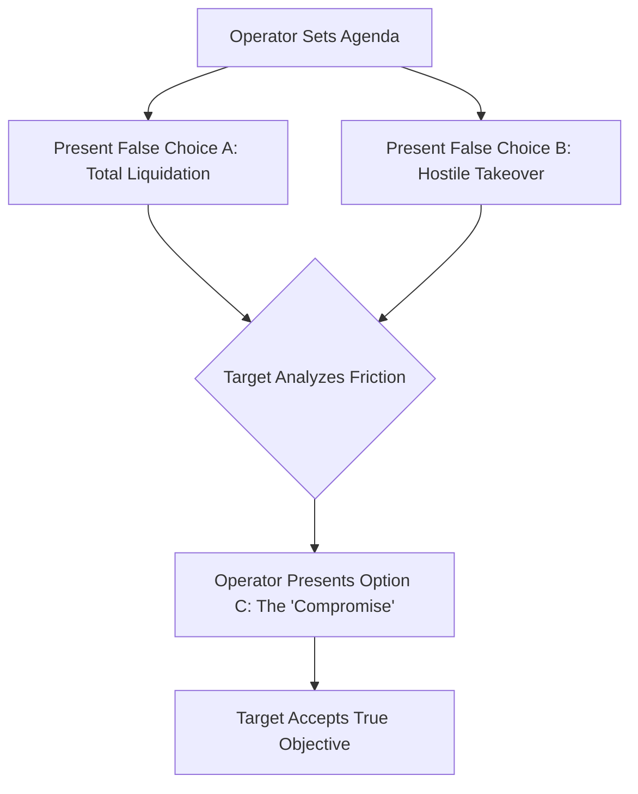

# အခန်း ၈ - ပုံမှန်ထက်လွန်ကဲသော လှုံ့ဆော်မှုများနှင့် အာရုံစိုက်မှုကို ကြားဖြတ်လုယူခြင်း

**English**  
To master choice architecture is to realize that humans do not want freedom; they want the illusion of freedom without the burden of deliberation. Drawing on McKelvey's chaos theorem, The Hobson’s Trap can be formally modeled as a sequential agenda-setting game. You do not force your target to accept your preferred outcome. Instead, you dictate the order and nature of the choices, boxing them in by manufactured extremes and forcing them to beg you for the exact chains you always intended to place upon them.

**မြန်မာ**  

**English**  
When negotiating a pivotal deal or seeking to impose a draconian policy, never present your true objective as the primary option. Doing so invites scrutiny, counter-offers, and resistance. Instead, architect a false dilemma. Present two horrific, mutually destructive alternatives. Option A must be an operational nightmare—perhaps a catastrophic liquidation, a brutal public legal battle, or an immediate cessation of vital services. Option B must be equally unpalatable—a humiliating surrender, a total loss of equity, or regulatory ruin.

**မြန်မာ**  
ဂနာမငြိမ်ဖြစ်နေသော လူထုကို ထိန်းချုပ်ရန်၊ သိမ်မွေ့သော တွေးတောမှုများ မဖြစ်နိုင်လောက်အောင် အလွန်အမင်း လွှမ်းမိုးနေသော လှုံ့ဆော်မှုများဖြင့် ၎င်းတို့၏ အာရုံများကို ဝန်ပိသွားစေရမည်။ ထိုသို့လုပ်ခြင်းဖြင့် ၎င်းတို့၏ အာရုံစိုက်မှုကို ရိုးရှင်းစွာ ထိန်းချုပ်နိုင်သည်။ ရောမမြို့၏ ဗိသုကာများသည် ၎င်းကို နက်ရှိုင်းစွာ နားလည်ခဲ့ကြသည်။ ရီပတ်ဘလစ် ကျဆင်းပြီး အင်ပါယာ ထွက်ပေါ်လာသည်နှင့်အမျှ၊ လူထုသည် အန္တရာယ်ရှိလောက်အောင် အလုပ်မလုပ်ဘဲနေလာပြီး နိုင်ငံရေးအရ အုံကြွလွယ်လာသည်။ လူအုပ်နှင့် ကျိုးကြောင်းဆွေးနွေးခြင်း သို့မဟုတ် တည်ဆောက်ပုံဆိုင်ရာ ယိုယွင်းမှုကို ဖြေရှင်းခြင်းထက်၊ ဧကရာဇ်များသည် ပထမဆုံး အစုလိုက်အပြုံလိုက် ပုံမှန်ထက်လွန်ကဲသော လှုံ့ဆော်မှုများကို ဖြန့်ကြက်ခဲ့သည်။ ၎င်းတို့မှာ ကစားပွဲများ (the Games) ပင်ဖြစ်သည်။ *Panem et circenses*—ပေါင်မုန့်နှင့် ဆပ်ကပ်ပွဲများ—သည် သာမန် ပရဟိတ မဟုတ်ပါ။ ၎င်းသည် အာရုံကြောဓာတုဗေဒဆိုင်ရာ အဖျက်လက်နက်တစ်ခု ဖြစ်သည်။ လမ်းများပေါ်တွင် မကျေနပ်မှုများ မြည်တမ်းလာသောအခါ၊ ဧကရာဇ်သည် ကိုလော့စီယမ် (Colosseum) ကို ဖွင့်လှစ်ခဲ့သည်။ သူသည် အစားအစာသာမကဘဲ စိတ်ကူးမယဉ်နိုင်လောက်အောင် ရက်စက်သော မြင်ကွင်းကိုလည်း ပေးအပ်ခဲ့သည်။ သွေးချောင်းစီးမှုများ၊ ကမ္ဘာ့အစွန်အဖျားများမှ တင်သွင်းလာသော ထူးဆန်းသည့် သားရဲများ၊ ထို့အပြင် ကြမ်းတမ်းပြီး အန္တရာယ်ကြီးမားသော သေမင်းတမန် တိုက်ပွဲများဖြစ်သည်။ အကြမ်းဖက်မှု၏ ကြီးမားသော အတိုင်းအတာနှင့် ပြင်းထန်မှုသည် အော်ဟစ်နေသော ကြည့်ရှုသူ ရှစ်သောင်း၏ ရှေးဦး ရှင်သန်ရေး လမ်းကြောင်းများကို တစ်ပြိုင်နက်တည်း နှိုးဆွပေးလိုက်သည်။ ၎င်းတို့၏ နိုင်ငံရေး မကျေနပ်ချက်များသည် ပျော်ဝင်သွားပြီး ပြင်းထန်သော အက်ဒရီနယ်လင် ရေလွှမ်းမိုးမှုဖြင့် အကုန်အစင် ဆေးကြောခံလိုက်ရသည်။ ဧကရာဇ်သည် ၎င်းတို့၏ အသက်မွေးဝမ်းကျောင်းမှုနှင့် စိတ်ပညာဆိုင်ရာ လှုံ့ဆော်မှု နှစ်ခုစလုံး၏ တစ်ဦးတည်းသော ထောက်ပံ့ပေးသူ ဖြစ်လာခဲ့သည်။ ၎င်းတို့၏ အာရုံစိုက်မှုကို ပိုင်ဆိုင်ခြင်းဖြင့်၊ သူသည် ၎င်းတို့၏ လက်တွေ့ဘဝကိုပါ အကြွင်းမဲ့ ပိုင်ဆိုင်ခဲ့သည်။

**English**  
Allow the target to agonize over these catastrophic paths. Let the cognitive friction and the panic of the double-bind exhaust their mental reserves. As they desperately thrash against the walls of the trap, you silently watch. Only when they are at the breaking point do you "reluctantly" introduce Option C—your true objective. It will still be costly, and it will still strip them of leverage, but compared to the artificially manufactured horrors of A and B, it will look like salvation. They will not just accept your terms; they will thank you for them. By controlling the architecture of their choices, you transform your extortion into their deliverance.

**မြန်မာ**  
**ကာကွယ်ရေးဆိုင်ရာ ခေတ်သစ်ဖတ်ရှုမှု**

**English**  
> [!TIP]
> **Recognize and Counter This:** When presented with terrible binary choices (A or B), immediately recognize that the agenda has been rigged. Do not choose. Attack the framing itself. Force the introduction of external options or change the timeline. Never negotiate within a paradigm designed entirely by your adversary.

**မြန်မာ**  
အာရုံစိုက်မှုစီးပွားရေးတွင် outrage loop, notification pressure, trend hijacking နှင့် moral panic များသည် အဖွဲ့တစ်ခု၏ ဆုံးဖြတ်ချက်အာရုံကို ကျဉ်းမြောင်းစေနိုင်သည်။ ကာကွယ်ရေးအတွက် pause point, source triage, escalation threshold, red-team review နှင့် misinformation response plan များကို သတ်မှတ်ထားရမည်။

**English**  
---

### အန္တရာယ်ပုံစံနှင့် ကာကွယ်ရေး မူဘောင် - ဖန်တီးထားသော သိမြင်မှုဆိုင်ရာ လိုဏ်ခေါင်းဝင်ခြင်း (Induced Cognitive Tunneling)

**English**  

**မြန်မာ**  
> **ထုတ်ဝေမှု V4.1 မူဘောင်:** ဤအပိုင်းကို အသုံးချရန် လမ်းညွှန်အဖြစ် မဖတ်ရပါ။ ၎င်းသည် အဖွဲ့အစည်းများ၊ တည်ထောင်သူများနှင့် စာဖတ်သူများက ထိန်းချုပ်မှုနည်းလမ်းများကို အသိအမှတ်ပြု၊ မှတ်သား၊ တားဆီးနိုင်ရန် ဖော်ပြထားသော အန္တရာယ်ပုံစံဖြစ်သည်။

**English**  
The human brain evolved in an environment of brutal scarcity. Survival depended on hyper-vigilance toward high-value signals: the sudden flash of a predator's movement, the vivid hue of a ripe, calorie-dense fruit, the visceral shock of violence. When the ancestral brain detected these things, it did not pause for rational deliberation. It immediately hijacked the body’s attentional resources, flooding the nervous system with adrenaline and dopamine to force immediate action. Ethologists call the artificial exploitation of this mechanism a "supernormal stimulus." Present a bird with a synthetic egg that is larger and brighter than its own, and it will abandon its actual offspring to sit on the fake. The animal cannot help itself; its hardwiring commands it to prioritize the extreme over the natural. In humans, this cognitive vulnerability remains entirely intact. When presented with an exaggerated, hyper-salient version of reality, the prefrontal cortex—the seat of logic and restraint—is bypassed. Attention is captured, and the mind is enslaved by the brightest, loudest, or most terrifying object in the room.

**မြန်မာ**  
**အန္တရာယ်၏ အဓိပ္ပါယ်**

**English**  
To control a restless population, one must simply control their focus, flooding their senses with stimuli so overwhelming that nuanced thought becomes impossible. The architects of Rome understood this deeply. As the Republic crumbled and the Empire rose, the populace grew dangerously idle and politically volatile. Rather than reasoning with the mob or addressing the structural rot, the Emperors deployed the first mass-scale supernormal stimuli: the Games. *Panem et circenses*—bread and circuses—was not mere charity; it was a neurochemical weapon. When discontent murmured in the streets, the Emperor opened the Colosseum. He delivered not just food, but unimaginable spectacle: rivers of blood, exotic beasts imported from the edges of the world, and brutal, high-stakes combat. The sheer scale and intensity of the violence triggered the primal survival circuits of eighty thousand screaming spectators at once. Their political grievances dissolved, washed away by a torrential flood of adrenaline. The Emperor became the sole provider of both their sustenance and their psychological stimulation. By owning their attention, he owned their reality.

**မြန်မာ**  
အချက်အလက်ပိုလျှံမှု၊ အရေးပေါ်အသံများ၊ dashboard များနှင့် ဆက်တိုက် notification များသည် လူတစ်ဦး၏ အာရုံကို ကျဉ်းမြောင်းစေပြီး အရေးကြီးဆုံးမေးခွန်းများကို မမြင်တော့စေနိုင်သည်။

**English**  
Today, you do not need an arena of stone to execute this hijacking; you need only the glowing glass in the palm of their hands. As a modern architect of power, you recognize that the algorithms governing human interaction are built to prioritize the digital equivalent of blood in the sand: outrage, tribal division, and existential threat. You do not compete with a rival on the merits of your product or the strength of your balance sheet. When a competitor begins to capture your market share, you do not engage in a price war. Instead, you manufacture a localized crisis. You quietly seed a narrative—an ambiguous labor practice, a polarizing political stance, a supply chain vulnerability—and feed it into the algorithmic machinery designed to amplify moral panic. You flood the ecosystem with the supernormal stimulus of righteous indignation.

**မြန်မာ**  
**တွေ့ရနိုင်သော သတိပေးလက္ခဏာများ**

**English**  
The public, hardwired to react to social threats, locks onto the controversy. The attention hijack is instantaneous. Your rival is suddenly engulfed in a firestorm, forced into a reactive crouch. They issue frantic apologies, fire executives, and drain their capital fighting a ghost you created. Their board panics; their prefrontal cortex shuts down under the crushing weight of public scrutiny. This is the moment you strike. You do not gloat. You step into the wreckage as the calm, stabilizing force. You offer the market a safe harbor, a clean alternative untainted by the chaos. You orchestrated the storm, yet you are the one selling the umbrellas.

**မြန်မာ**  
- ဆုံးဖြတ်ချက်မတိုင်မီ signal များကို အလွန်များစွာ ပေးပြီး အဓိကအချက်တစ်ခုခုကို ဖုံးကွယ်သွားခြင်း။
- urgent label များ၊ countdown များ၊ meeting churn များကြောင့် slow thinking မဖြစ်နိုင်တော့ခြင်း။
- အဖွဲ့သည် metric တစ်ခုကိုသာ လိုက်နေပြီး legal, ethical, customer impact များကို မမြင်တော့ခြင်း။

**မြန်မာ**  
**ကာကွယ်ရေး တန်ပြန်လုပ်ဆောင်ချက်များ**

**မြန်မာ**  
- အရေးကြီးဆုံးဖြတ်ချက်တိုင်းတွင် pause point, second reader နှင့် red-team question set ထားပါ။
- dashboard နှင့် alert များကို severity, owner, actionability အရ ခွဲခြားပြီး noise budget သတ်မှတ်ပါ။
- အမြန်ဆုံးဖြတ်ချက်များအတွက် pre-mortem နှင့် dissent channel ကို လိုအပ်ချက်အဖြစ် သတ်မှတ်ပါ။

**မြန်မာ**  
**ကျင့်ဝတ်နှင့် ဥပဒေ နယ်နိမိတ်**

**မြန်မာ**  
ဤအပိုင်း၏ ရည်ရွယ်ချက်မှာ ဖိအားပေးခြင်း၊ ဂုဏ်သတင်းဖျက်ဆီးခြင်း၊ လျှို့ဝှက်စောင့်ကြည့်ခြင်း၊ အလုပ်ခွင်ထိခိုက်စေခြင်း သို့မဟုတ် တရားမဝင် ယှဉ်ပြိုင်မှုလုပ်ရပ်များကို သင်ကြားပေးရန် မဟုတ်ပါ။ စာဖတ်သူအနေဖြင့် အန္တရာယ်ကို တွေ့ရှိပါက မှတ်တမ်းတင်ခြင်း၊ တရားဝင်အကြံပေးနှင့် တိုင်ပင်ခြင်း၊ အုပ်ချုပ်မှုစနစ်အတွင်း တင်ပြခြင်း၊ လူ့အခွင့်အရေးနှင့် လုပ်ငန်းကျင့်ဝတ်ကို ကာကွယ်သော နည်းလမ်းများကိုသာ အသုံးပြုရမည်။