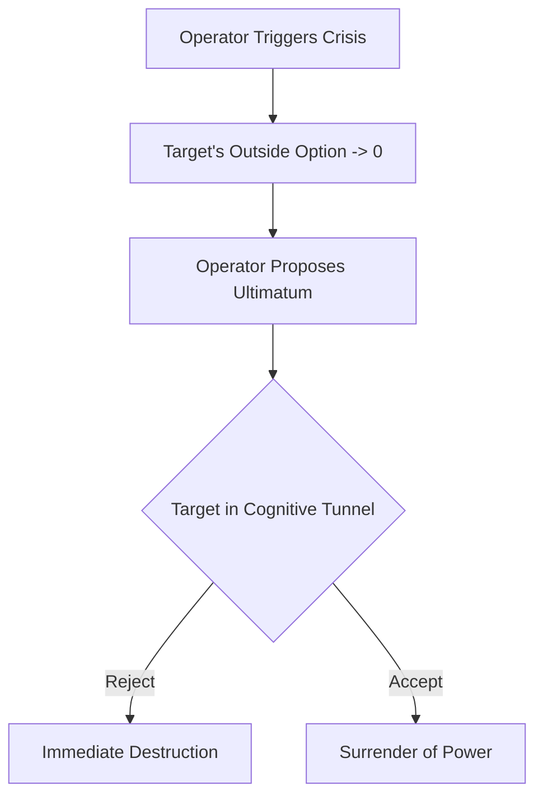

# အခန်း ၉- ကြိုတင်ခန့်မှန်း၍ အစွမ်းသတ္တိမဲ့စေခြင်း (တိတ်ဆိတ်သော ပန်နော့ပ်တစ်ကွန် (The Silent Panopticon))

**English**  
To weaponize attention and break a target’s psychological defenses, you must force them into a state of "cognitive tunneling"—a psychological phenomenon where acute stress causes the brain to focus exclusively on the immediate threat, blinding it to the broader context and all peripheral solutions.

**မြန်မာ**  

**English**  
**1. The Incubation of Threat**
Identify an area where your target is heavily leveraged or reputationally exposed. It does not require a genuine scandal; it only requires the *implication* of a systemic failure. The threat must trigger primal social fears: ostracism, financial ruin, or physical danger.

**မြန်မာ**  
လူသားတို့၏ ဦးနှောက်သည် အညှာအတာကင်းမဲ့သော ခန့်မှန်းရေးစက်ယန္တရားကြီးတစ်ခုသာ ဖြစ်သည်။ နီအိုကောတက် (neocortex) သည် ပကတိအမှန်တရားကို မြင်နိုင်ရန် ဆင့်ကဲပြောင်းလဲလာခဲ့ခြင်း မဟုတ်ပေ။ အတိတ်က ပုံစံများကို အခြေခံ၍ အနာဂတ်တွင် ဖြစ်လာနိုင်ခြေရှိသည်များကို ကြိုတင်ခန့်မှန်းနိုင်ရန်သာ ဆင့်ကဲပြောင်းလဲလာခဲ့ခြင်းဖြစ်သည်။ ရှေးဘိုးဘေးတို့ ရှင်သန်ခဲ့ရသော ပတ်ဝန်းကျင်တွင် ဤစွမ်းရည်က အသက်ဆက်နိုင်ရန် များစွာ အထောက်အကူပြုခဲ့သည်။ မုတ်သုံမဝင်မီ လေထုဖိအား အနည်းငယ် ကျဆင်းသွားခြင်း သို့မဟုတ် သားရဲတိရစ္ဆာန် မတိုက်ခိုက်မီ မြက်ပင်ရှည်များ ပြားကပ်သွားခြင်းတို့ကို အာရုံခံနိုင်စွမ်းရှိသော သက်ရှိများသာလျှင် ပို၍ ရှင်သန်ခွင့်ရခဲ့ကြသည်။ ဇီဝဗေဒအရကြည့်လျှင် မသေချာမရေရာမှုဟူသည် ဆုံးရှုံးမှုကြီးတစ်ခုဖြစ်သည်။ ကြိုတင်သိမြင်ခြင်းကသာ အသက်ရှင်သန်ရေးအတွက် အဓိကသော့ချက်ဖြစ်သည်။ ထို့ကြောင့် အနာဂတ်ကို ကြိုသိခြင်းသည် အခြေခံအကျဆုံးနှင့် ရှေးအကျဆုံး လိုအပ်ချက်ဖြစ်သည်။ သို့သော် ဤကြိုတင်ခန့်မှန်းနိုင်စွမ်းကို လက်နက်သဖွယ် အသုံးပြုခြင်းကား အမြင့်မားဆုံးသော ဆင့်ကဲပြောင်းလဲမှု၏ အထွတ်အထိပ်သို့ ရောက်ရှိသွားခြင်းပင်ဖြစ်သည်။ ယင်းမှာ ရန်သူကို ကြိုတင်သိမြင်ရုံမျှမက၊ ရန်သူကိုယ်တိုင် ဆာလောင်နေမှန်း မသိမီကတည်းက ၎င်းတို့အား ငတ်မွတ်သွားစေရန် ဖန်တီးစီစဉ်ခြင်းမျိုး ဖြစ်သည်။ ယခုအခါ လွှမ်းမိုးချုပ်ကိုင်မှု ဆိုသည်မှာ ခြိမ်းခြောက်မှုများကို တုံ့ပြန်ရုံမျှသာ မဟုတ်တော့ပေ။ စစ်မှန်၍ အကြွင်းမဲ့ဖြစ်သော အာဏာသည် ထိုခြိမ်းခြောက်မှုများ ဖြစ်တည်လာမည့် အချိန်ကာလ (timeline) ကိုပါ တိတ်တဆိတ် လုပ်ကြံဖျက်ဆီးပစ်ခြင်းအပေါ်၌သာ မူတည်နေသည်။

**English**  
**2. The Injection of the Supernormal Stimulus**
Deploy the crisis publicly, utilizing the mechanics of viral escalation. Use proxy voices to amplify the threat, ensuring it appears organic and overwhelming. The goal is to make the crisis appear exponentially larger and more immediate than it actually is. Overload their sensory inputs with negative feedback, plummeting metrics, and coordinated outrage.

**မြန်မာ**  
ရာစုနှစ်ပေါင်းများစွာတိုင်အောင် ကြိုတင်သိမြင်နိုင်စွမ်းကို အပြည့်အဝရယူလိုသည့် ပြင်းပြသောဆန္ဒသည် ကြမ်းတမ်းသော အင်အားသုံးမှု၊ ထင်ရှားသော စောင့်ကြည့်မှုတို့ဖြင့်သာ ထွက်ပေါ်လာခဲ့သည်။ ခေတ်ဟောင်း အင်ပါယာများနှင့် လျှို့ဝှက်ရဲနိုင်ငံများသည်—ပရီတိုရီယန် ကိုယ်ရံတော်တပ် (Praetorian Guard) မှသည် အရှေ့ဂျာမနီ စတာဆီ (East German Stasi) အထိ—ပန်နော့ပ်တစ်ကွန် (Panopticon) ၏ စိတ်ပညာအပေါ်၌သာ မှီခိုခဲ့ကြသည်။ ၎င်းတို့သည် အမှန်တကယ်ဖြစ်စေ၊ တင်စားချက်အရဖြစ်စေ စောင့်ကြည့်ရေး မျှော်စင်များကို တည်ဆောက်ခဲ့ကြသည်။ ထိုမျှော်စင်များမှ အစဉ်အမြဲ စောင့်ကြည့်နေသည့် အခြေအနေမျိုးကို ဖန်တီးခဲ့ကြသည်။ သို့ဖြစ်ရာ လက်အောက်ခံတို့သည် မိမိတို့ကို အချိန်မရွေး စောင့်ကြည့်နေ*နိုင်သည်*ဟူသော အသိကြောင့်ပင် အထူးသတိထားကာ လိမ္မာစွာ နေထိုင်ခဲ့ကြသည်။ သို့သော် ဤစနစ်၌ သေစေနိုင်လောက်သော အားနည်းချက် (fatal vulnerability) တစ်ခု ရှိနေသည်။ ယင်းမှာ ထိန်းချုပ်ရေးစနစ်၏ တည်ဆောက်ပုံသည် ရုပ်ပိုင်းဆိုင်ရာအရ အထင်းသား ပေါ်လွင်နေခြင်းပင် ဖြစ်သည်။ လက်အောက်ခံများသည် မိမိတို့ကိုယ်တိုင် အကျဉ်းကျနေသူများဖြစ်ကြောင်း သိရှိနေကြသည်။ ထိုသို့ အမြဲတမ်း စောင့်ကြည့်ခံနေရခြင်းကြောင့် လူအများစု၌ စုပေါင်းထိတ်လန့်ကြောက်ရွံ့မှု (collective paranoia) ပေါက်ဖွားလာကာ၊ နောက်ဆုံးတွင် မလွဲမသွေ ပုန်ကန်ထကြွမှုအဖြစ်သို့ ပြောင်းလဲသွားစေခဲ့သည်။ အာဏာရှင်တို့သည် မိမိတို့ ကြောက်ရွံ့သော အနာဂတ်မဖြစ်လာစေရန် အကြမ်းဖက် ဖိနှိပ်ခဲ့ကြရာ၌ ကြီးမားလှသော စွမ်းအင်များကို သုံးစွဲခဲ့ရပြီး ယင်းသည် ရေရှည်ခံနိုင်သော နည်းလမ်းမဟုတ်ပေ။ ၎င်းသည် အကျိုးသက်ရောက်မှုနည်းပါးပြီး သွေးထွက်သံယိုမှုများကိုသာ ဖြစ်စေသော ကြမ်းတမ်းသည့် အတင်းအကျပ်ခိုင်းစေခြင်း ယန္တရားသက်သက်သာ ဖြစ်ခဲ့သည်။

**English**  
**3. The Constriction of Options**
As the target’s cortisol levels spike, their ability to process complex information degrades. They will stop looking for strategic maneuvers and begin searching desperately for an immediate escape hatch. Their vision narrows. They will ignore their advisors and make rash, impulsive decisions to stop the bleeding, invariably damaging their own position further.

**မြန်မာ**  
**ကာကွယ်ရေးဆိုင်ရာ ခေတ်သစ်ဖတ်ရှုမှု**

**English**  
**4. The Savior’s Entry**
Once the target is fully trapped in the cognitive tunnel, exhausted and stripped of their leverage, you introduce yourself as the solution. You offer the escape hatch: an acquisition at a fraction of their prior valuation, a punitive settlement, or a total surrender of market territory. Because they are blinded by panic, they will not see you as the architect of their destruction. They will see you only as their salvation, eagerly signing away their power just to make the pain stop.

**မြန်မာ**  
ဒေတာအချိုးမညီမှု၊ vendor telemetry, hiring signal, compute usage နှင့် internal leak များကို မတရားအသုံးပြုပါက ပြိုင်ဆိုင်မှုနှင့် privacy risk များ တိုးလာသည်။ ကာကွယ်ရေးအတွက် lawful intelligence boundary, access logging, vendor-data review, insider-risk procedure, incident response နှင့် communications discipline ကို အစောပိုင်းကတည်းက တည်ဆောက်ရမည်။

**English**  
This maneuver models exactly as an asymmetric information ultimatum game, where the proposer has successfully manipulated the responder's outside option to zero.

**English**  
> [!TIP]
> **Recognize and Counter This:** If you find your options suddenly and artificially constricted during a crisis, assume you are being funneled. Before accepting a "savior's" ultimatum, you must forcefully widen your cognitive aperture. Bring in an outside advisor who is completely unaffected by the localized panic to evaluate the true state of your outside options.

**English**  
---

### အန္တရာယ်ပုံစံနှင့် ကာကွယ်ရေး မူဘောင် - ထိတ်လန့်ကြောက်ရွံ့မှု အင်ဂျင်နီယာပညာ (Paranoia Engineering)

**English**  

**မြန်မာ**  
> **ထုတ်ဝေမှု V4.1 မူဘောင်:** ဤအပိုင်းကို အသုံးချရန် လမ်းညွှန်အဖြစ် မဖတ်ရပါ။ ၎င်းသည် အဖွဲ့အစည်းများ၊ တည်ထောင်သူများနှင့် စာဖတ်သူများက ထိန်းချုပ်မှုနည်းလမ်းများကို အသိအမှတ်ပြု၊ မှတ်သား၊ တားဆီးနိုင်ရန် ဖော်ပြထားသော အန္တရာယ်ပုံစံဖြစ်သည်။

**English**  
The human brain is, at its core, a ruthless prediction engine. The neocortex did not evolve to perceive reality objectively; it evolved to probabilistically anticipate the immediate future based on historical patterns. Survival in the ancestral environment heavily favored the organism that could sense the subtle drop in barometric pressure before the monsoon, or the flattening of tall grass before the predator struck. Uncertainty was biologically expensive; anticipation was life. To know the future is the oldest, most primal imperative. But to weaponize that prediction—to not just anticipate the enemy, but to engineer their starvation before they even realize they are hungry—is the ultimate evolutionary apex. Dominance is no longer about reacting to threats. True, absolute power lies in quietly assassinating the timeline in which the threat ever existed.

**မြန်မာ**  
**အန္တရာယ်၏ အဓိပ္ပါယ်**

**English**  
For centuries, the aspiration of absolute foresight manifested through blunt force and visible surveillance. The archaic empires and secret police states—from the Praetorian Guard to the East German Stasi—relied on the psychology of the Panopticon. They erected literal and metaphorical watchtowers, creating a state of permanent visibility. The subjects behaved because they *might* be watched. But this system possessed a fatal vulnerability: the architecture of control was explicitly physical. The subjects knew they were prisoners. The friction of constant observation bred a collective paranoia that inevitably curdled into rebellion. The tyrant had to expend immense, unsustainable energy violently suppressing the futures they feared. It was an inefficient, bloody mathematics of coercion.

**မြန်မာ**  
ဒေတာ၊ စောင့်ကြည့်မှု သို့မဟုတ် အတွင်းရေးအချက်အလက်များ ရရှိထားသည်ဟု အရိပ်ပြခြင်းဖြင့် အခြားဘက်ကို စိတ်ပိုင်းဆိုင်ရာအရ လေဖြတ်သွားစေရန် ကြိုးစားခြင်းသည် ကိုယ်ရေးကိုယ်တာ၊ လျှို့ဝှက်ချက်၊ ယှဉ်ပြိုင်မှုဥပဒေနှင့် အလုပ်ခွင်ကျင့်ဝတ်တို့အတွက် မြင့်မားသောအန္တရာယ်ဖြစ်သည်။

**English**  
You do not build watchtowers. You are not a warden relying on the crude tool of fear. You are the architect of a digital ecosystem where the inmates pay for the privilege of building their own cells. The modern Panopticon is inverted and entirely silent. Your users, your competitors, and your targets do not fear being watched; they enthusiastically demand it, bleeding their neuroses, desires, and supply-chain logistics into your data lakes under the guise of convenience and connectivity.

**မြန်မာ**  
**တွေ့ရနိုင်သော သတိပေးလက္ခဏာများ**

**English**  
As a sovereign of this landscape, you do not wait for a rival to announce their intentions. You do not rely on industry rumors or clumsy corporate espionage. When a competing tech firm is quietly gearing up to launch a disruptive product that threatens your market share, you ingest their digital exhaust. You track the sudden, localized spike in their compute usage. You observe the anomalous recruitment patterns as they aggressively poach a hyper-specific class of machine-learning engineers. You monitor the obscure, third-party API calls originating from their staging environments and the subtle, seemingly disconnected shifts in their corporate expenditure.

**မြန်မာ**  
- လျှို့ဝှက်အစည်းအဝေး၊ internal memo သို့မဟုတ် restricted data အကြောင်းကို တစ်ဘက်မှ အရိပ်ပြောဆိုခြင်း။
- တိကျသောအချက်အလက်ရင်းမြစ်ကို မဖော်ပြဘဲ အရာအားလုံးသိနေသကဲ့သို့ ဖိအားပေးခြင်း။
- အဖွဲ့သည် အမှန်တကယ်အလုပ်ထက် leak-hunting, self-censorship နှင့် internal mistrust ထဲသို့ ကျသွားခြင်း။

**English**  
Long before their CEO drafts a press release, you have already mapped the DNA of their initiative. You do not react; you preemptively sterilize the environment. You quietly acquire the exclusive rights to the crucial third-party dataset their new model relies on. You leverage your capital to strangle their hardware supply chain. And then, you launch a heavily subsidized, superior version of their core feature within your own ecosystem three weeks before their targeted launch date, turning their defining innovation into a commoditized afterthought. When they finally reveal their product to the world, they are screaming into a vacuum. You have not just defeated them in the marketplace; you have eradicated the reality in which they could even compete. They die without ever seeing the blade, utterly convinced that the market simply evolved away from them.

**မြန်မာ**  
**ကာကွယ်ရေး တန်ပြန်လုပ်ဆောင်ချက်များ**

**မြန်မာ**  
- incident-response process ဖြင့် access log, data handling, vendor exposure နှင့် insider-risk controls ကို စစ်ဆေးပါ။
- အကြောင်းရင်းမသေချာမီ လူများကို စွပ်စွဲခြင်းမပြုဘဲ legal, security, communications owner များကို သတ်မှတ်ပါ။
- ပြိုင်ဘက်နှင့် ဈေးကွက်ဆိုင်ရာ intelligence ကို public, lawful, documented sources များနှင့်သာ ကန့်သတ်ပါ။

**မြန်မာ**  
**ကျင့်ဝတ်နှင့် ဥပဒေ နယ်နိမိတ်**

**မြန်မာ**  
ဤအပိုင်း၏ ရည်ရွယ်ချက်မှာ ဖိအားပေးခြင်း၊ ဂုဏ်သတင်းဖျက်ဆီးခြင်း၊ လျှို့ဝှက်စောင့်ကြည့်ခြင်း၊ အလုပ်ခွင်ထိခိုက်စေခြင်း သို့မဟုတ် တရားမဝင် ယှဉ်ပြိုင်မှုလုပ်ရပ်များကို သင်ကြားပေးရန် မဟုတ်ပါ။ စာဖတ်သူအနေဖြင့် အန္တရာယ်ကို တွေ့ရှိပါက မှတ်တမ်းတင်ခြင်း၊ တရားဝင်အကြံပေးနှင့် တိုင်ပင်ခြင်း၊ အုပ်ချုပ်မှုစနစ်အတွင်း တင်ပြခြင်း၊ လူ့အခွင့်အရေးနှင့် လုပ်ငန်းကျင့်ဝတ်ကို ကာကွယ်သော နည်းလမ်းများကိုသာ အသုံးပြုရမည်။