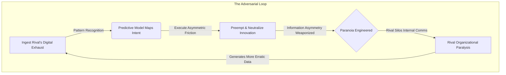

# နိဂုံး - အကာအကွယ်ပေးသော ဉာဏ်ရည်၏ နောက်ဆုံးတာဝန်

**English**  
To neutralize a rival completely, you must weaponize the very concept of information asymmetry. When you possess total predictive dominance, your most terrifying weapon is not always what you do with the data, but how you let the target *feel* its weight. You do not just want them beaten; you want them psychologically paralyzed. This is the essence of a formal preemption game, leveraging a lethal first-mover advantage to destroy the opponent before they can even enter the arena.

**မြန်မာ**  
ဤစာအုပ်၏ ခရီးစဉ်သည် အာဏာကို ရိုမန်းတစ်ဆန်စေရန် မဟုတ်ဘဲ၊ ၎င်း၏ အန္တရာယ်ရှိသော ယန္တရားများကို မြင်သာအောင် ပြုလုပ်ရန် ဖြစ်သည်။ ဇီဝကမ္မဗေဒဆိုင်ရာ ဖိအား၊ လူမှုရေးဖယ်ကြဉ်မှု၊ ဂုဏ်သတင်းတိုက်ခိုက်မှု၊ မမှန်းဆနိုင်သော ဆုလာဘ်စနစ်၊ ပွတ်တိုက်မှုမညီမျှသော ရွေးချယ်မှုတည်ဆောက်ပုံနှင့် ဒေတာအချိုးမညီမှုတို့သည် စနစ်များအတွင်း တိတ်တဆိတ် အလုပ်လုပ်နိုင်သည်။ ၎င်းတို့ကို သိမြင်ခြင်းသည် အခြားသူကို ထိန်းချုပ်ရန် အခွင့်အရေးမဟုတ်ဘဲ၊ အလွဲသုံးစားမှုကို တားဆီးရန် တာဝန်ဖြစ်သည်။

**English**  
The execution must be clinical and devoid of emotion. In a casual negotiation, a brief email, or a seemingly innocuous encounter, you drop a piece of highly specific, wildly disproportionate knowledge. Comment on the exact valuation they discussed in a closed-door board meeting the night before. Compliment the specific phrasing of a confidential internal memo they circulated only to their core executive team that morning.

**မြန်မာ**  
အကာအကွယ်ပေးသော ဉာဏ်ရည် (Defensive Intelligence) သည် ကြောက်ရွံ့မှုဖြင့် အုပ်ချုပ်ခြင်းမဟုတ်ပါ။ ၎င်းသည် မှတ်တမ်းထားနိုင်ခြင်း၊ မေးခွန်းမေးနိုင်ခြင်း၊ အချိန်ယူစဉ်းစားနိုင်ခြင်း၊ တရားဝင်အကြံပေးနှင့် တိုင်ပင်နိုင်ခြင်း၊ အုပ်ချုပ်မှုစနစ်ကို အလုပ်လုပ်စေနိုင်ခြင်း ဖြစ်သည်။ စာဖတ်သူသည် ဤစာအုပ်မှ ယူသွားတိုက်ခိုက်သူ၏သော အရာမှာ ထိန်းချုပ်မှုကိရိယာမဟုတ်ဘဲ warning signs, safeguards, escalation paths နှင့် ethical boundaries ဖြစ်သည်။

**English**  
Do not elaborate. Do not gloat. Make absolutely no explicit threat. Simply let the fact hang in the air, a chilling artifact of your omniscience, before moving on to mundane matters.

**မြန်မာ**  
အာဏာကို နားလည်ခြင်းသည် တစ်ဦးတစ်ယောက်အား အေးစက်သွားစေရန် မလိုအပ်ပါ။ အမှန်တကယ်တွင် ၎င်းသည် အဖွဲ့အစည်းများကို ပိုမိုတရားမျှတစေရန်၊ အားနည်းသူများကို ပိုမိုကာကွယ်ရန်နှင့် ဆုံးဖြတ်ချက်များကို ပိုမိုမြင်သာစေရန် အသုံးပြုနိုင်သည်။ ခွဲစိတ်ဓားသည် လက်ထဲတွင် မဟုတ်တော့ပါ။ မီးအိမ်သာ ကျန်ရစ်သည်။ ၎င်းကို အမှောင်ဖော်ထုတ်ရန် အသုံးပြုပါ။

**English**  
The human brain, wired by millions of years of evolution to fear the unseen predator, will immediately short-circuit. They will tear apart their own organization looking for the leak. They will fire their most trusted lieutenants. They will silo their operations, locking down their own internal communications until the friction paralyzes their ability to execute. They will assume you have human spies everywhere, breathing down their necks. They will never realize that they are their own spy, and that their digital footprint is a glowing beacon visible only to you. By feeding them a single drop of your omniscience, you force them to consume themselves.

**English**  
> [!TIP]
> **Recognize and Counter This:** If a rival drops a piece of "impossible" knowledge about your operations, do not panic and do not search for a mole. Assume your digital exhaust is being modeled. Immediately introduce noise into your system. Generate false signals, use decoy APIs, and run dummy compute loads. If you cannot blind the Panopticon, you must overwhelm it with conflicting data.

**English**  
---