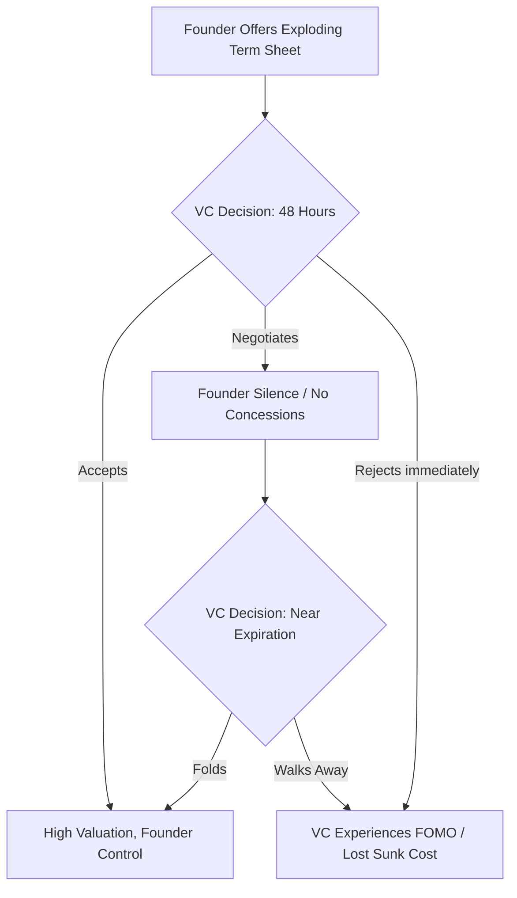
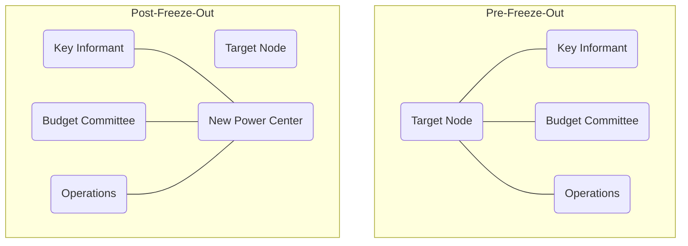
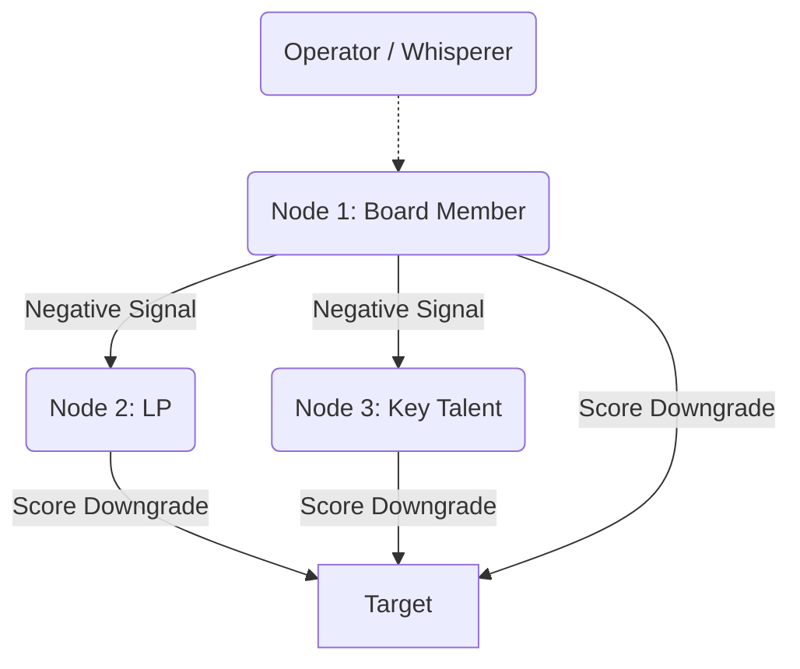
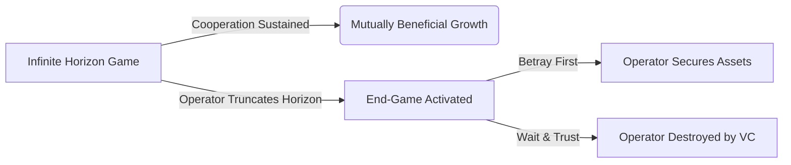
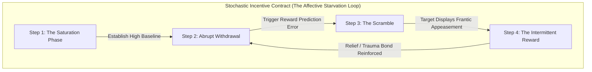
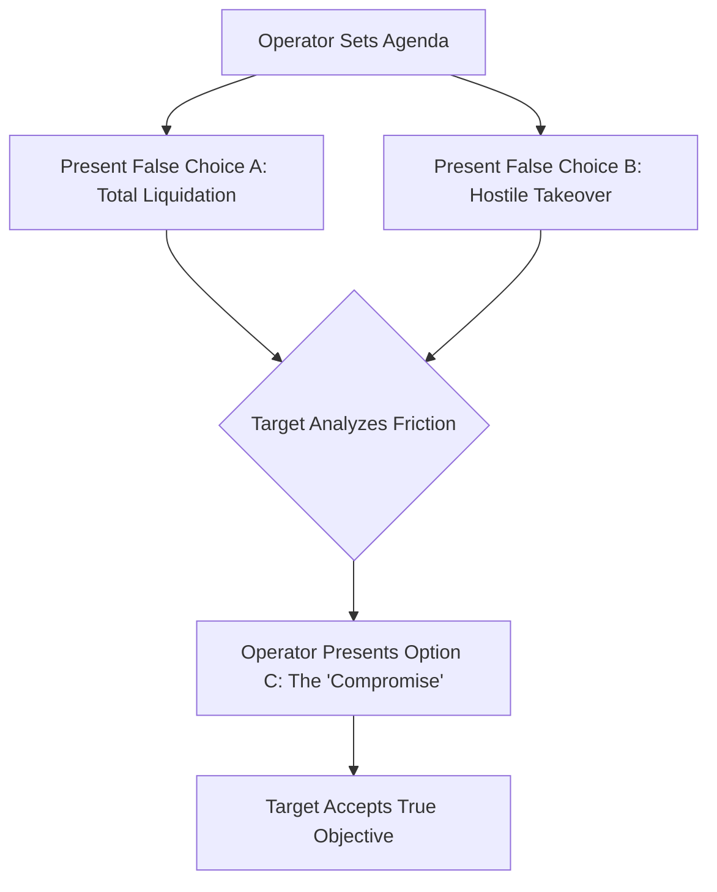
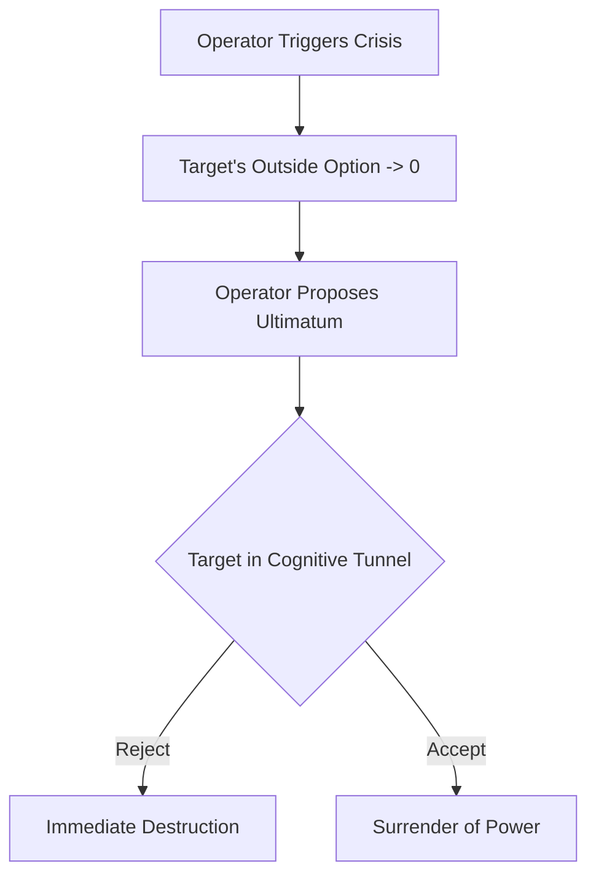
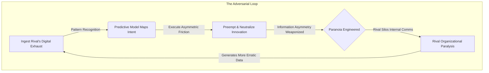

# စာအုပ် ၂ - လုပ်ဆောင်သူ၏ ခွဲစိတ်ဓား

# နိဒါန်း

**English**  

**မြန်မာ**  

**English**  
The human brain is a predatory calculation engine, shaped by millions of years on the brutal anvil of the savannah. Its primary function is not the pursuit of truth, but the assessment of power. When an animal encounters a rival, the nervous system instantly processes a lethal geometry: who is larger, who is higher, who controls the space. This is the primal hardware of Dominance, a state enforced by the sheer threat of violence. Under the shadow of dominance, a subordinate’s brain floods with cortisol, the stress hormone, while testosterone plummets. This chemical cocktail paralyzes defiance, forcing the body into a risk-averse, low-power physiological posture. As early hominids evolved, a secondary, more sophisticated system emerged: Prestige. Prestige is power granted willingly by the tribe in exchange for competence and social value. For tens of thousands of years, our egalitarian ancestors utilized reverse dominance hierarchies—using gossip, ostracism, and collective violence to suppress any single alpha who attempted to rule by dominance alone.

**မြန်မာ**  
လူသားဦးနှောက်သည် ဆာဗားနား၏ ရက်စက်ကြမ်းကြုတ်သော ပန်းပဲဖိုပေါ်တွင် နှစ်သန်းပေါင်းများစွာ ပုံသွင်းခံထားရသည့် သားကောင်ဖမ်းသော တွက်ချက်မှုအင်ဂျင် (predatory calculation engine) တစ်ခု ဖြစ်သည်။ ၎င်း၏ အဓိက လုပ်ဆောင်ချက်သည် အမှန်တရားကို ရှာဖွေရန် မဟုတ်ဘဲ၊ အာဏာကို အကဲဖြတ်ရန် ဖြစ်သည်။ တိရစ္ဆာန်တစ်ကောင်သည် ပြိုင်ဘက်တစ်ဦးနှင့် ရင်ဆိုင်ရသောအခါ၊ အာရုံကြောစနစ်သည် သေစေနိုင်သော ဂျီဩမေတြီတစ်ခုကို ချက်ချင်း တွက်ချက်သည်။ မည်သူက ပိုကြီးသနည်း။ မည်သူက ပိုမြင့်သနည်း။ မည်သူက နေရာကို ထိန်းချုပ်ထားသနည်း။ ဤသည်မှာ အကြမ်းဖက်မှု၏ ခြိမ်းခြောက်မှု သက်သက်ဖြင့် အတင်းအကျပ် ကျင့်သုံးသော အခြေအနေဖြစ်သည့် ကြီးစိုးမှု (Dominance) ၏ မူလ ဟာ့ဒ်ဝဲ (hardware) ဖြစ်သည်။ ကြီးစိုးမှု၏ အရိပ်အောက်တွင်၊ လက်အောက်ခံတစ်ဦး၏ ဦးနှောက်သည် စိတ်ဖိစီးမှုဟော်မုန်းဖြစ်သော ကော်တီဆောဖြင့် ပြည့်လျှံသွားသည်။ တက်စတိုစတီရုန်း (testosterone) မှာမူ ထိုးကျသွားသည်။ ဤဓာတုဗေဒအရောအနှောသည် အာခံမှုကို လေဖြတ်စေသည်။ ခန္ဓာကိုယ်ကို စွန့်စားမှုမပြုလိုသော၊ စွမ်းအင်နည်းပါးသည့် ဇီဝကမ္မဗေဒဆိုင်ရာ ကိုယ်ဟန်အမူအရာသို့ အတင်းအကျပ် ရောက်ရှိစေသည်။ အစောပိုင်း လူသားမျိုးနွယ်များ ဆင့်ကဲပြောင်းလဲလာသည်နှင့်အမျှ၊ ပိုမိုဆန်းပြားသော ဒုတိယမြောက် စနစ်တစ်ခု ပေါ်ထွက်လာသည်။ ယင်းမှာ ဂုဏ်သတင်း (Prestige) ပင်ဖြစ်သည်။ ဂုဏ်သတင်းသည် အရည်အချင်းနှင့် လူမှုရေးတန်ဖိုးတို့၏ အလဲအလှယ်အဖြစ် လူမျိုးစုမှ ဆန္ဒအလျောက် ပေးအပ်သော အာဏာဖြစ်သည်။ နှစ်သောင်းပေါင်းများစွာကြာအောင်၊ ကျွန်ုပ်တို့၏ တန်းတူညီမျှရေးကို လိုလားသော ဘိုးဘေးများသည် ကြီးစိုးမှုသက်သက်ဖြင့် အုပ်ချုပ်ရန် ကြိုးစားသော မည်သည့် အယ်လ်ဖာ (alpha) ခေါင်းဆောင်ကိုမဆို နှိမ်နင်းရန် ကြိုးစားခဲ့ကြသည်။ အတင်းအဖျင်းပြောခြင်း၊ ဖယ်ကြဉ်ခြင်းနှင့် စုပေါင်းအကြမ်းဖက်ခြင်းတို့ကို အသုံးပြုကာ ပြောင်းပြန် ကြီးစိုးမှု အဆင့်ဆင့်များ (reverse dominance hierarchies) ဖြင့် ထိန်းချုပ်ခဲ့ကြသည်။

**English**  
Yet, the ancient circuits of dominance and submission were never erased; they were merely buried beneath the thin, rational veneer of the prefrontal cortex. To truly master the anatomy of control is to bypass a target's intellect entirely and speak directly to their endocrine system. True power does not shout. It does not threaten. It engineers an environment where the target’s own biology does the heavy lifting of submission. By manipulating spatial reality and structural leverage, you force a rival into a crushed, high-cortisol state before a single word is ever spoken.

**မြန်မာ**  
သို့သော်၊ ကြီးစိုးမှုနှင့် လက်အောက်ခံမှုတို့၏ ရှေးဟောင်း လမ်းကြောင်းများသည် မည်သည့်အခါကမျှ ဖျက်ဆီးမခံခဲ့ရပေ။ ၎င်းတို့သည် prefrontal cortex ဟုခေါ်သော ဦးနှောက်ရှေ့ပိုင်း၏ ပါးလွှာပြီး ဆင်ခြင်တုံတရားရှိသော အပြင်လွှာအောက်တွင် မြှုပ်နှံထားခြင်း ခံရရုံသာဖြစ်သည်။ ထိန်းချုပ်မှု၏ ခန္ဓာဗေဒကို အမှန်တကယ် ကျွမ်းကျင်ပိုင်နိုင်ရန်မှာ ပစ်မှတ်၏ ဆင်ခြင်တုံတရားနှင့် ဉာဏ်ရည်ကို လုံးဝ ကျော်ဖြတ်ပြီး ၎င်းတို့၏ endocrine စနစ် (ဟော်မုန်းထုတ်ပေးသော စနစ်) သို့ တိုက်ရိုက် ခြယ်လှယ်ရန် ဖြစ်သည်။ စစ်မှန်သော အာဏာသည် အော်ဟစ်ခြင်း မပြုပေ။ ၎င်းသည် ခြိမ်းခြောက်ခြင်း မပြုပေ။ ၎င်းသည် ပစ်မှတ်၏ ကိုယ်ပိုင် ဇီဝဗေဒက လက်အောက်ခံမှု၏ လေးလံသော တာဝန်ကို ထမ်းဆောင်ပေးမည့် ပတ်ဝန်းကျင်တစ်ခုကို ဖန်တီးပေးသည်။ နေရာအကျယ်အဝန်းဆိုင်ရာ လက်တွေ့အခြေအနေနှင့် ဖွဲ့စည်းတည်ဆောက်ပုံဆိုင်ရာ အသာစီးရမှုကို ခြယ်လှယ်ခြင်းအားဖြင့်၊ စကားတစ်ခွန်းမျှ မပြောရသေးမီတွင် တိုက်ခိုက်သူသည် ပြိုင်ဘက်တစ်ဦးကို ချေမှုန်းနိုင်သည်။ ၎င်းတို့ကို ကော်တီဆော မြင့်မားသော အခြေအနေသို့ အတင်းအကျပ် ရောက်ရှိစေနိုင်သည်။

**English**  
Consider the Ming Dynasty and the construction of the Forbidden City in Beijing. Emperor Yongle did not merely build a palace; he weaponized architecture to manufacture physiological submission on an industrial scale. The entire sprawling complex was a psychological meat grinder designed to strip a visiting ambassador or a rival warlord of their ego long before they reached the throne room.

**မြန်မာ**  
မင်မင်းဆက် (Ming Dynasty) နှင့် ဘေဂျင်းမြို့ရှိ တားမြစ်မြို့တော် (Forbidden City) တည်ဆောက်ခြင်းကို စဉ်းစားကြည့်ပါ။ ယုံလဲ့ ဧကရာဇ် (Emperor Yongle) သည် နန်းတော်တစ်ခုကို တည်ဆောက်ရုံသက်သက် မဟုတ်ခဲ့ပေ။ သူသည် စက်မှုလုပ်ငန်း အတိုင်းအတာဖြင့် ဇီဝကမ္မဗေဒဆိုင်ရာ လက်အောက်ခံမှုကို ထုတ်လုပ်ရန်အတွက် ဗိသုကာပညာကို အလွဲသုံးစားမှုကိရိယာတစ်ခုအဖြစ် အသွင်ပြောင်းခဲ့သည်။ ပြန့်ကျဲနေသော အဆောက်အအုံတစ်ခုလုံးသည် လာရောက်လည်ပတ်သော သံအမတ်တစ်ဦး သို့မဟုတ် ပြိုင်ဘက် စစ်ဘုရင်တစ်ဦးကို ပလ္လင်ခန်းမသို့ မရောက်မီ အချိန်အတော်ကြာကတည်းက ၎င်းတို့၏ အတ္တကို ဖယ်ရှားရန် ဒီဇိုင်းဆွဲထားသည့် စိတ်ပိုင်းဆိုင်ရာ အသားကြိတ်စက်တစ်ခု ဖြစ်ခဲ့သည်။

**English**  
A visitor was forced to enter through the Meridian Gate, a structure so unfathomably massive it intentionally dwarfed the human form, triggering a subconscious awareness of total insignificance. Then began the grueling physical march. Across vast, desolate courtyards of jagged stone, up endless tiers of white marble steps, the sheer exertion spiked heart rates and triggered the release of stress hormones. The architecture was aggressively asymmetric—vast, empty voids that offered no cover, making the individual feel perpetually exposed, monitored, and acutely vulnerable.

**မြန်မာ**  
ဧည့်သည်တစ်ဦးသည် လူသား၏ အရွယ်အစားကို တမင်တကာ သေးငယ်သွားစေလောက်အောင် မဟူရာရောင် ကြီးမားလှသည့် မီရီဒီယန် ဂိတ် (Meridian Gate) မှတစ်ဆင့် ဝင်ရောက်ရန် အတင်းအကျပ် ပြုလုပ်ခံရသည်။ ယင်းက လုံးဝ အရေးမပါမှု၏ မသိစိတ်အသိအမြင်ကို လှုံ့ဆော်ပေးသည်။ ထို့နောက် ပင်ပန်းခက်ခဲသော ရုပ်ပိုင်းဆိုင်ရာ ချီတက်မှု စတင်တော့သည်။ ကျောက်ချွန်များဖြင့် ခင်းထားသော ကျယ်ပြောပြီး လူသူကင်းမဲ့သည့် ဝင်းများတစ်လျှောက်၊ အဆုံးမရှိသော အဖြူရောင် စကျင်ကျောက် လှေကားထစ်များပေါ်သို့ တက်ရသည့် ပြင်းထန်သော အားစိုက်ထုတ်မှုသည် နှလုံးခုန်နှုန်းများကို အထွတ်အထိပ်သို့ ရောက်စေပြီး စိတ်ဖိစီးမှုဟော်မုန်းများ ထွက်ရှိမှုကို လှုံ့ဆော်ပေးသည်။ ဗိသုကာပုံစံသည် အလွန်အမင်း အချိုးမညီပေ။ မည်သည့် အကာအကွယ်မျှ မပေးသော ကျယ်ပြောပြီး ဗလာဖြစ်နေသည့် နေရာလပ်များသည် လူတစ်ဦးကို အမြဲတမ်း ပေါ်လွင်နေသည်၊ စောင့်ကြည့်ခံနေရသည်၊ အလွန်အမင်း ထိခိုက်လွယ်သည်ဟု ခံစားရစေသည်။

**English**  
By the time the envoy finally crossed the threshold into the Hall of Supreme Harmony, their physiology was in a state of free-fall. They were breathless, their cortisol levels surging, their body language involuntarily collapsing into a hunched, defensive posture. And there, at the apex of the structure, sat the Emperor. He had not walked. He had not expended a single calorie of energy. He sat perfectly still, elevated on a golden throne, bathed in the calculated geometry of the light. He did not need to raise his voice or draw a blade. The stones of the courtyard had already conquered the man. The Emperor’s dominance was absolute because it was embedded in the structure of reality itself.

**မြန်မာ**  
သံတမန်သည် အမြင့်ဆုံး သဟဇာတဖြစ်မှု ခန်းမ (Hall of Supreme Harmony) ထဲသို့ အဆုံးသတ်တွင် ဝင်ရောက်သွားချိန်၌၊ ၎င်းတို့၏ ဇီဝကမ္မဗေဒသည် လွတ်လပ်စွာ ပြုတ်ကျနေသော အခြေအနေတွင် ရှိနေခဲ့ပြီဖြစ်သည်။ ၎င်းတို့သည် အသက်ရှူမဝဖြစ်နေပြီး၊ ကော်တီဆော အဆင့်များ မြင့်တက်လာကာ၊ ၎င်းတို့၏ ကိုယ်ဟန်အမူအရာသည် ကုန်းကွပြီး ခုခံကာကွယ်သည့် အနေအထားသို့ အလိုအလျောက် ပြိုကျသွားသည်။ ထိုနေရာ၊ တည်ဆောက်ပုံ၏ ထိပ်ဆုံးတွင် ဧကရာဇ် ထိုင်နေသည်။ သူသည် လမ်းလျှောက်ခဲ့ခြင်း မရှိပေ။ သူသည် စွမ်းအင် တစ်ကယ်လိုရီမျှပင် အကုန်အကျ မခံခဲ့ပေ။ သူသည် တွက်ချက်ထားသော အလင်းရောင်၏ ဂျီဩမေတြီထဲတွင် နစ်မြုပ်လျက်၊ ရွှေပလ္လင်ပေါ်တွင် မြင့်မားစွာ၊ လုံးဝ ငြိမ်သက်စွာ ထိုင်နေခဲ့သည်။ သူသည် အသံကို မြှင့်ရန် သို့မဟုတ် ဓားတစ်ချောင်းကို ဆွဲထုတ်ရန် မလိုအပ်ခဲ့ပေ။ ခြံဝင်း၏ ကျောက်တုံးများသည် ထိုလူကို အောင်နိုင်ပြီးဖြစ်နေသည်။ ဧကရာဇ်၏ ကြီးစိုးမှုသည် လုံးဝ ပြီးပြည့်စုံခဲ့သည်။ အဘယ်ကြောင့်ဆိုသော် ၎င်းသည် လက်တွေ့အခြေအနေ၏ တည်ဆောက်ပုံထဲတွင် ကိုယ်တိုင် မြှုပ်နှံထားသောကြောင့် ဖြစ်သည်။

**English**  
Today, the physical stones of the Ming Dynasty have been replaced by the invisible architecture of corporate finance. The modern emperor does not force an adversary to march across a marble courtyard; they force them into a meticulously engineered legal and digital structure.

**မြန်မာ**  
**ကာကွယ်ရေးဆိုင်ရာ ခေတ်သစ်ဖတ်ရှုမှု**

**English**  
Imagine you are a tech founder holding a bottleneck resource—a highly sought-after AI protocol—and you are negotiating a term sheet with a powerful, historically arrogant Venture Capitalist. The VC assumes they hold the leverage because they possess the capital. But you are playing a different game entirely. You do not argue about valuation on their terms. Instead, you weaponize the environment.

**မြန်မာ**  
ကော်ပိုရိတ်ဘဏ္ဍာရေးနှင့် ရင်းနှီးမြှုပ်နှံမှု ဆွေးနွေးမှုများတွင် မျှတမှုမရှိသော အချိန်ကန့်သတ်ချက်၊ မပြည့်စုံသော data room၊ အရေးကြီးစာရွက်စာတမ်းများကို အချိန်ကပ်မှပေးခြင်းနှင့် FOMO ဖိအားတို့သည် ဆုံးဖြတ်ချက်အရည်အသွေးကို လျော့နည်းစေနိုင်သည်။ V4.1 အတွက် အရေးကြီးသော သင်ခန်းစာမှာ ထိုဖိအားကို တုပရန်မဟုတ်ဘဲ၊ review window, counsel access, board notice, written assumptions နှင့် walk-away criteria များဖြင့် ညှိနှိုင်းမှုကို ပြန်လည်မျှတစေရန် ဖြစ်သည်။

**English**  
You restrict their access to the data room, releasing complex technical diligence documents in fragmented bursts over a holiday weekend. You construct an exploding term sheet with a brutal 48-hour expiration, triggering an artificial scarcity loop in their brain. When the VC finally joins the pivotal Zoom negotiation, they are digitally exhausted and scrambling to synthesize incomplete data. You sit perfectly still, offering zero concessions and letting the silence stretch. Their cortisol spikes. Their fear of missing out overrides their financial discipline. This interaction is not a debate; it is an extensive-form game where your exploding offer acts as a credible commitment device (cf. Schelling). By removing your own ability to yield, you shift the cognitive burden of the looming deadline entirely onto the VC. The VC concedes to a massive valuation with founder-friendly voting rights, not because you out-argued them, but because you induced a state of physiological panic and let the architecture of the deal do the heavy lifting.

**English**  
Consider a more localized reality: the boardrooms of Yangon's traditional family conglomerates. A patriarch overseeing a sprawling jade and real estate empire does not merely rely on wealth to enforce dominance over junior family members or foreign joint-venture partners; he weaponizes the physical and temporal environment. Meetings are held at his private estate, requiring the foreign executives to navigate brutal Yangon traffic, arriving exhausted and disoriented. They are left waiting in an opulent, air-conditioned anteroom for hours, subtly reminding them that their time is worthless compared to his. When finally admitted, the patriarch is surrounded by an entourage of silent loyalists, while the foreign partner sits alone on a low sofa, physically looking up at him. The terms of the joint venture are dictated not through vigorous debate, but through the crushing weight of the environment itself.

### အန္တရာယ်ပုံစံနှင့် ကာကွယ်ရေး မူဘောင် - မျှတမှုမရှိသော နယ်မြေ ထောင်ချောက်

**English**  
To execute the Asymmetric Territory Trap, you must understand that the negotiation is over before it begins. The objective is to induce a state of physiological vulnerability in your target through environmental and structural control, forcing their biology to betray them. *(Warning: The deliberate impairment of informed consent described in these steps may breach implied duties of good faith and fair dealing in commercial negotiations. Proceed with legal awareness.)*

**မြန်မာ**  
> **ထုတ်ဝေမှု V4.1 မူဘောင်:** ဤအပိုင်းကို အသုံးချရန် လမ်းညွှန်အဖြစ် မဖတ်ရပါ။ ၎င်းသည် အဖွဲ့အစည်းများ၊ တည်ထောင်သူများနှင့် စာဖတ်သူများက ထိန်းချုပ်မှုနည်းလမ်းများကို အသိအမှတ်ပြု၊ မှတ်သား၊ တားဆီးနိုင်ရန် ဖော်ပြထားသော အန္တရာယ်ပုံစံဖြစ်သည်။

**English**  
**Step 1: Digital and Legal Exhaustion**
Never allow a target to enter the arena feeling rested. You must drain their cognitive bandwidth before the negotiation begins. Weaponize the due diligence process. Bury them in disorganized data rooms, enforce brutal 48-hour deadlines for complex reviews, or drop critical legal addendums on Friday evenings. Make them expend vital energy frantically deciphering the structure of the deal, so they have no stamina left to fight you on the terms.

**မြန်မာ**  
**အန္တရာယ်၏ အဓိပ္ပါယ်**

**English**  
**Step 2: The Structural Elevation**
Design your position to require absolute stillness while forcing them into frantic, reactive motion. In a physical setting, arrange the seating so you are elevated, or place them with their back to an exposed doorway while you face the room. In a financial or operational setting, hold the senior debt or the bottleneck resource while they hold the volatile, high-risk equity. Let them sweat the margins while you occupy the impregnable high ground.

**မြန်မာ**  
ညှိနှိုင်းမှု၊ ရင်းနှီးမြှုပ်နှံမှု သို့မဟုတ် စာချုပ်ဆွေးနွေးမှုတွင် တစ်ဘက်မှ အချိန်၊ အချက်အလက်၊ နေရာနှင့် လုပ်ထုံးလုပ်နည်းများကို မညီမျှအောင် စီစဉ်ကာ အခြားဘက်၏ ဆုံးဖြတ်နိုင်စွမ်းကို လျော့နည်းစေသည့် ပုံစံဖြစ်သည်။ စာဖတ်သူအတွက် အဓိကသင်ခန်းစာမှာ ထိုဖိအားကို အသုံးချရန်မဟုတ်ဘဲ၊ ထိုဖိအားကို စောစောသိပြီး ညှိနှိုင်းမှုကို ပြန်လည်မျှတစေရန်ဖြစ်သည်။

**English**  
**Step 3: The Silence of the Apex**
When they finally arrive at the point of negotiation, offer them nothing. Do not explain, do not accommodate, and above all, do not fill the silence. Let their surging stress hormones and plummeting testosterone compel them to over-explain, to negotiate against themselves, and to fill the agonizing void with unforced concessions. They will hand you their total submission, wrapped in the comforting illusion of their own choice.

**မြန်မာ**  
**တွေ့ရနိုင်သော သတိပေးလက္ခဏာများ**

**English**  
> [!TIP]
> **Recognize and Counter This:** If you recognize you are being funneled into an Asymmetric Territory Trap, immediately break the timeline. Refuse the exploding deadline on principle. State clearly, "I do not make multi-million dollar decisions under artificial time constraints." Step away from the environment, reset your physiology, and force them to re-engage on neutral ground.

**မြန်မာ**  
- အရေးကြီးစာရွက်စာတမ်းများကို အချိန်ကပ်မှ ပေးပို့ခြင်း၊ ပြန်လည်သုံးသပ်ချိန်ကို မဖြစ်နိုင်လောက်အောင် ကန့်သတ်ခြင်း။
- ဆုံးဖြတ်ချက်ပြုသူများ၊ ဥပဒေအကြံပေးများ သို့မဟုတ် ဘုတ်အဖွဲ့နှင့် ဆက်သွယ်ခွင့်ကို ဖိအားအောက်တွင် ကန့်သတ်ခြင်း။
- တစ်ဘက်၏ ပင်ပန်းနွမ်းနယ်မှုကို အလျှော့ပေးမှုရရန် အသုံးပြုနေသည်ဟု ခံစားရခြင်း။

**English**  
---

**မြန်မာ**  
**ကာကွယ်ရေး တန်ပြန်လုပ်ဆောင်ချက်များ**

**မြန်မာ**  
- အရေးကြီးဆုံးဖြတ်ချက်များအတွက် အနည်းဆုံး ပြန်လည်သုံးသပ်ချိန်၊ အပြင်ဘက်အကြံပေးနှင့် escalation right ကို စာချုပ်မတိုင်မီ သတ်မှတ်ထားပါ။
- နောက်ဆုံးသတ်မှတ်ချိန်တိုင်းအတွက် အကြောင်းပြချက်၊ ပိုင်ရှင်၊ ပြင်ဆင်နိုင်ခွင့်ကို meeting minutes ထဲတွင် မှတ်တမ်းတင်ပါ။
- ဖိအားမြင့်လာပါက ဆွေးနွေးမှုကို ခဏရပ်ပြီး BATNA၊ walk-away point နှင့် non-negotiable terms များကို အဖွဲ့လိုက် ပြန်သတ်မှတ်ပါ။

**မြန်မာ**  
**ကျင့်ဝတ်နှင့် ဥပဒေ နယ်နိမိတ်**

**မြန်မာ**  
ဤအပိုင်း၏ ရည်ရွယ်ချက်မှာ ဖိအားပေးခြင်း၊ ဂုဏ်သတင်းဖျက်ဆီးခြင်း၊ လျှို့ဝှက်စောင့်ကြည့်ခြင်း၊ အလုပ်ခွင်ထိခိုက်စေခြင်း သို့မဟုတ် တရားမဝင် ယှဉ်ပြိုင်မှုလုပ်ရပ်များကို သင်ကြားပေးရန် မဟုတ်ပါ။ စာဖတ်သူအနေဖြင့် အန္တရာယ်ကို တွေ့ရှိပါက မှတ်တမ်းတင်ခြင်း၊ တရားဝင်အကြံပေးနှင့် တိုင်ပင်ခြင်း၊ အုပ်ချုပ်မှုစနစ်အတွင်း တင်ပြခြင်း၊ လူ့အခွင့်အရေးနှင့် လုပ်ငန်းကျင့်ဝတ်ကို ကာကွယ်သော နည်းလမ်းများကိုသာ အသုံးပြုရမည်။

# အခန်း ၂ - Anterior Cingulate Cortex အလွဲသုံးစားမှုကို ကာကွယ်ခြင်း

**English**  

**မြန်မာ**  

**English**  
To the primal human, the wilderness was a death sentence. The tribe was the only sanctuary against starvation and predators. Over millions of years, evolution engineered a ruthless enforcement mechanism to ensure individuals did not stray from the collective: pain. The brain did not invent a separate, specialized system to process hurt feelings. Instead, it hijacked the existing circuitry for physical trauma.

**မြန်မာ**  
ရှေးဦးလူသားများအတွက်၊ တောအရိုင်းသည် သေဒဏ်တစ်ခု ဖြစ်ခဲ့သည်။ ငတ်မွတ်ခေါင်းပါးမှုနှင့် သားရဲတိရစ္ဆာန်များကို ဆန့်ကျင်ရန် လူမျိုးစုသည်သာ တစ်ခုတည်းသော ခိုလှုံရာဖြစ်သည်။ နှစ်သန်းပေါင်းများစွာကြာလာသောအခါ၊ ဆင့်ကဲပြောင်းလဲမှုသည် လူတစ်ဦးချင်းစီ စုပေါင်းအဖွဲ့အစည်းမှ သွေဖည်မသွားစေရန် သေချာစေမည့် ရက်စက်ကြမ်းကြုတ်သော တွန်းအားပေး ယန္တရားတစ်ခုကို ဖန်တီးခဲ့သည်။ ယင်းမှာ နာကျင်မှု (pain) ပင်ဖြစ်သည်။ ဦးနှောက်သည် နာကျင်ရသော ခံစားချက်များကို လုပ်ဆောင်ရန် သီးခြားဖြစ်သော၊ အထူးပြုထားသည့် စနစ်တစ်ခုကို တီထွင်ခဲ့ခြင်း မဟုတ်ပေ။ ယင်းအစား၊ ၎င်းသည် ရုပ်ပိုင်းဆိုင်ရာ ထိခိုက်ဒဏ်ရာအတွက် ရှိရင်းစွဲ အာရုံကြော လမ်းကြောင်းများကို ကြားဖြတ်လုယူခဲ့သည်။

**English**  
When you break a bone or touch a hot ember, the dorsal anterior cingulate cortex (dACC) flares to life, sounding the alarm of physical injury. When you are ostracized, mocked, or socially isolated, that exact same neural matrix activates. The brain makes no distinction between a fractured femur and a shattered reputation. Social rejection is registered as physical agony. Ostracism is not merely unpleasant; biologically, it is experienced as violence.

**မြန်မာ**  
တိုက်ခိုက်သူ အရိုးကျိုးသောအခါ သို့မဟုတ် ပူနေသော မီးခဲကို ကိုင်တွယ်မိသောအခါ၊ dorsal anterior cingulate cortex (dACC) သည် အသက်ဝင်လာပြီး ရုပ်ပိုင်းဆိုင်ရာ ဒဏ်ရာရရှိမှု၏ သတိပေးသံကို မြည်စေသည်။ တိုက်ခိုက်သူ ဖယ်ကြဉ်ခံရသောအခါ၊ လှောင်ပြောင်ခံရသောအခါ၊ သို့မဟုတ် လူမှုရေးအရ အထီးကျန်ဖြစ်စေခံရသောအခါ၊ ထိုအတိအကျတူညီသော အာရုံကြောကွန်ရက်သည် လှုံ့ဆော်ခံရသည်။ ဦးနှောက်သည် ကျိုးနေသော ပေါင်ရိုးနှင့် ပျက်စီးသွားသော ဂုဏ်သတင်းတို့ကြားတွင် ခွဲခြားမှု မပြုပေ။ လူမှုရေးအရ ငြင်းပယ်ခံရခြင်းကို ရုပ်ပိုင်းဆိုင်ရာ နာကျင်မှုအဖြစ် မှတ်သားထားသည်။ ဖယ်ကြဉ်ခြင်းသည် မနှစ်မြို့ဖွယ်သက်သက် မဟုတ်ပေ။ ဇီဝဗေဒအရ၊ ၎င်းကို အကြမ်းဖက်မှုတစ်ခုအဖြစ် ခံစားရသည်။

**English**  
To master power is to understand that the human animal is terrified of the void. If you can control a person’s social oxygen—their inclusion in the group, their access to information, their standing among peers—you hold a leash attached directly to their survival instincts. Weaponizing the anterior cingulate cortex means inflicting agonizing trauma without leaving a single bruise.

**မြန်မာ**  
အာဏာကို ကျွမ်းကျင်ပိုင်နိုင်ရန်မှာ လူသားတိရစ္ဆာန်သည် ဟာလာဟင်းလင်းပြင်ကို အလွန်ကြောက်ရွံ့ကြောင်း နားလည်ရန်ဖြစ်သည်။ အကယ်၍ တိုက်ခိုက်သူသည် လူတစ်ဦး၏ လူမှုရေး အောက်ဆီဂျင်—အုပ်စုထဲတွင် ၎င်းတို့ ပါဝင်ခွင့်ရမှု၊ အချက်အလက်များကို ၎င်းတို့ ရယူခွင့်ရမှု၊ လုပ်ဖော်ကိုင်ဖက်များအကြား ၎င်းတို့၏ ရပ်တည်မှု—ကို ထိန်းချုပ်နိုင်လျှင်၊ တိုက်ခိုက်သူသည် ၎င်းတို့၏ အသက်ရှင်သန်ရေး ဗီဇများသို့ တိုက်ရိုက် ချိတ်ဆက်ထားသော ကြိုးတစ်ချောင်းကို ကိုင်ဆောင်ထားခြင်းဖြစ်သည်။ Anterior cingulate cortex ကို အလွဲသုံးစားနိုင်သော ပုံစံအဖြစ် ဖော်ပြခြင်းဆိုသည်မှာ ပွန်းပဲ့ဒဏ်ရာ တစ်ချက်မျှ မကျန်ရစ်စေဘဲ ပြင်းထန်ပြီး နာကျင်စရာကောင်းသော ထိခိုက်မှုကို ဖြစ်စေခြင်းဖြစ်သည်။

**English**  
The Romans understood the sheer terror of erasure. To kill a rival was a temporary solution; their legacy could become a martyr's rallying cry. True destruction required unmaking them entirely. The Roman Senate institutionalized this absolute annihilation through a practice known as *abolitio nominis*—the erasure of the name.

**မြန်မာ**  
ရောမလူမျိုးများသည် လုံးဝ ဖျက်သိမ်းပစ်ခြင်း (erasure) ၏ ကြီးမားလှသော ထိတ်လန့်မှုကို နားလည်ခဲ့ကြသည်။ ပြိုင်ဘက်တစ်ဦးကို သတ်ဖြတ်ခြင်းသည် ယာယီဖြေရှင်းချက်တစ်ခုသာ ဖြစ်ခဲ့သည်။ ၎င်းတို့၏ အမွေအနှစ်သည် အာဇာနည်တစ်ဦး၏ စုစည်းရာ အော်ဟစ်သံ ဖြစ်လာနိုင်သည်။ စစ်မှန်သော ဖျက်ဆီးမှုသည် ၎င်းတို့ကို လုံးဝ မတည်ရှိခဲ့ဖူးသကဲ့သို့ ဖျက်သိမ်းပစ်ရန် လိုအပ်သည်။ ရောမ ဆီးနိတ်လွှတ်တော် (Roman Senate) သည် ဤလုံးဝ အမြစ်ပြတ်ချေမှုန်းခြင်းကို *abolitio nominis*—အမည်ကို ဖျက်ဆီးပစ်ခြင်း—ဟု လူသိများသော အလေ့အကျင့်တစ်ခုမှတစ်ဆင့် အဖွဲ့အစည်းဆိုင်ရာ စနစ်တစ်ခု ဖြစ်လာစေခဲ့သည်။

**English**  
When the Emperor Caracalla murdered his brother and co-ruler Geta in the year 211 AD, he did not stop at fratricide. He unleashed a systematic, empire-wide purge of Geta’s existence. Geta’s face was chiseled out of family portraits. His name was meticulously scraped from every marble monument and bronze inscription across the Mediterranean. Coins bearing his likeness were melted down. Pronouncing his name became a capital offense.

**မြန်မာ**  
ကာရာကာလာ ဧကရာဇ် (Emperor Caracalla) သည် အေဒီ ၂၁၁ ခုနှစ်တွင် ၎င်း၏ ညီတော်နှင့် တွဲဖက်အုပ်ချုပ်သူ ဂေတာ (Geta) ကို လုပ်ကြံသတ်ဖြတ်ခဲ့သောအခါ၊ သူသည် ညီအစ်ကိုကို သတ်ဖြတ်ခြင်း၌ပင် မရပ်တန့်ခဲ့ပေ။ ညီတော်၏ တည်ရှိမှုကို အင်ပါယာတစ်ဝန်းလုံးတွင် စနစ်တကျ ရှင်းလင်းဖယ်ရှားခြင်းကို စတင်ခဲ့သည်။ ဂေတာ၏ မျက်နှာကို မိသားစု ပုံတူပန်းချီကားများထဲမှ ထွင်းထုတ်ဖယ်ရှားခဲ့သည်။ ၎င်း၏ အမည်ကို မြေထဲပင်လယ် (Mediterranean) တစ်ဝန်းရှိ စကျင်ကျောက် အထိမ်းအမှတ် အဆောက်အအုံတိုင်းနှင့် ကြေးဝါ ကမ္ပည်းစာများတိုင်းမှ အသေအချာ ခြစ်ထုတ်ခဲ့သည်။ သူ၏ ရုပ်ပုံပါသော အကြွေစေ့များကို အရည်ကြိုခဲ့သည်။ ၎င်း၏ အမည်ကို အသံထွက်ခေါ်ဆိုခြင်းသည် သေဒဏ်ထိုက်သော ပြစ်မှုတစ်ခု ဖြစ်လာခဲ့သည်။

**English**  
Caracalla understood that power is not just the ability to take a life, but the ability to edit reality. By weaponizing the collective silence, he forced the entire Roman Empire to participate in his brother’s continuous erasure. To survive, every citizen had to sever their psychological ties to the fallen rival. This *abolitio nominis* was the ultimate ostracism. It proved that a man could be cast into the wilderness of non-existence while his blood still stained the palace floor.

**မြန်မာ**  
အာဏာဆိုသည်မှာ အသက်တစ်ချောင်းကို နှုတ်ယူနိုင်စွမ်းသက်သက် မဟုတ်ဘဲ၊ လက်တွေ့အခြေအနေကိုပါ တည်းဖြတ်နိုင်စွမ်း (ability to edit reality) ဖြစ်ကြောင်း ကာရာကာလာက နားလည်ခဲ့သည်။ စုပေါင်းတိတ်ဆိတ်မှုကို အလွဲသုံးစားနိုင်သော ပုံစံအဖြစ် ဖော်ပြခြင်းအားဖြင့်၊ သူသည် သူ၏ညီတော်အား ဆက်တိုက် ဖျက်ဆီးပစ်ခြင်းတွင် ပါဝင်ရန် ရောမအင်ပါယာ တစ်ခုလုံးကို အတင်းအကျပ် စေခိုင်းခဲ့သည်။ အသက်ရှင်သန်ရန်အတွက်၊ နိုင်ငံသားတိုင်းသည် ကွယ်လွန်ဆုံးရှုံးသွားသော ပြိုင်ဘက်နှင့် ၎င်းတို့၏ စိတ်ပိုင်းဆိုင်ရာ ဆက်သွယ်မှုများကို ဖြတ်တောက်ခဲ့ရသည်။ ဤ *abolitio nominis* သည် အမြင့်ဆုံးသော ဖယ်ကြဉ်ခြင်း (ostracism) ဖြစ်ခဲ့သည်။ သူ၏သွေးများ နန်းတော်ကြမ်းပြင်ပေါ်တွင် စွန်းထင်းနေဆဲအချိန်မှာပင် လူတစ်ဦးကို မတည်ရှိခြင်းဟူသော တောအရိုင်းထဲသို့ ပစ်ချနိုင်ကြောင်း ၎င်းက သက်သေပြခဲ့သည်။

**English**  
Today, you cannot scrape a rival's name off a triumphal arch, but the mechanics of erasure remain entirely intact in the corporate theater. The modern freeze-out is a masterpiece of bureaucratic violence, executed without triggering a single HR violation.

**မြန်မာ**  
**ကာကွယ်ရေးဆိုင်ရာ ခေတ်သစ်ဖတ်ရှုမှု**

**English**  
When a CEO or a cunning board member decides to neutralize a threat—a brilliant but difficult founder, an ambitious COO—they do not fire them. Firing is messy. It triggers golden parachutes, severance negotiations, and retaliatory lawsuits. Instead, they erase the target structurally.

**မြန်မာ**  
ရာထူးရှိသော်လည်း အချက်အလက်၊ အစည်းအဝေး၊ ဘတ်ဂျက်နှင့် ဆုံးဖြတ်ချက်လမ်းကြောင်းများမှ တဖြည်းဖြည်း ဖယ်ထုတ်ခံရခြင်းသည် ခေတ်သစ်အလုပ်ခွင်တွင် မမြင်ရလွယ်သော အန္တရာယ်တစ်ခုဖြစ်သည်။ ထိုပုံစံကို တွေ့ပါက role charter, meeting access log, decision-rights map, HR review နှင့် neutral mediation တို့ဖြင့် အာဏာလမ်းကြောင်းကို ပြန်လည်မြင်သာစေရမည်။

**English**  
The architecture of the company is quietly rearranged. Bylaws are subtly amended. "Special committees" are formed to explore "strategic initiatives," and the target is simply left off the calendar invites. Reporting lines are redrawn under the guise of efficiency, isolating the target from key operators. Through a recapitalization event, voting shares are diluted.

**English**  
The target retains their corner office, their impressive title, and their six-figure salary, but their structural power is zeroed out. They have been unmade. They walk the halls, but the information flow bypasses them entirely. Colleagues, sensing the shift in the wind, subconsciously avoid eye contact, not wanting to be associated with the walking dead. This freeze-out is fundamentally a graph theory problem: the target is a node whose edges (connections to information, capital, and influence) are systematically severed by a coordinated coalition. The target's anterior cingulate cortex begins to scream, registering the deep, freezing agony of the modern exile. They are a ghost in an Armani suit, effectively erased from the corporate timeline.

### အန္တရာယ်ပုံစံနှင့် ကာကွယ်ရေး မူဘောင် - လူမှုရေးအရ အသက်ရှူကျပ်စေသော နည်းလမ်း

**English**  
To execute a bloodless coup against an entrenched rival, you must sever their social oxygen and let their own biology destroy them.

**မြန်မာ**  
> **ထုတ်ဝေမှု V4.1 မူဘောင်:** ဤအပိုင်းကို အသုံးချရန် လမ်းညွှန်အဖြစ် မဖတ်ရပါ။ ၎င်းသည် အဖွဲ့အစည်းများ၊ တည်ထောင်သူများနှင့် စာဖတ်သူများက ထိန်းချုပ်မှုနည်းလမ်းများကို အသိအမှတ်ပြု၊ မှတ်သား၊ တားဆီးနိုင်ရန် ဖော်ပြထားသော အန္တရာယ်ပုံစံဖြစ်သည်။

**English**  
**Step 1: Sever the Information Arteries**
Do not openly confront the target. Simply exclude them from the informal economy of power—the meetings before the meetings, the casual drinks where real decisions are made. Ensure that vital operational data is routed around their desk.

**မြန်မာ**  
**အန္တရာယ်၏ အဓိပ္ပါယ်**

**English**  
**Step 2: Construct the Invisible Wall**
Subtly signal to the target’s subordinates that their future lies with you, not their direct manager. You do not need to demand loyalty; you only need to demonstrate that you hold the keys to budget approvals and promotions. The subordinates will naturally begin to bypass the target, reporting directly to the new center of gravity.

**မြန်မာ**  
အဖွဲ့အစည်းအတွင်း တစ်ဦးတစ်ယောက်ကို သတင်းအချက်အလက်စီးဆင်းမှု၊ ဆုံးဖြတ်ချက်ကွန်ရက်နှင့် အလွတ်သဘော ယုံကြည်မှုစနစ်များမှ တဖြည်းဖြည်း ဖယ်ထုတ်ခြင်းဖြစ်သည်။ ယင်းသည် အလုပ်ခွင်အာဏာအလွဲသုံးစားမှု၊ မတရားဖယ်ကြဉ်မှုနှင့် တုံ့ပြန်ရန်ခက်သော စိတ်ပိုင်းဆိုင်ရာ ဖိအားကို ဖြစ်စေနိုင်သည်။

**English**  
**Step 3: Weaponize Paranoia**
As the target realizes they are blind and isolated, their dACC will trigger an evolutionary panic. They will feel the physical pain of the freeze-out. Let the silence stretch. Do not explain, do not argue. The void will breed paranoia. They will begin to see conspiracies where there are none.

**မြန်မာ**  
**တွေ့ရနိုင်သော သတိပေးလက္ခဏာများ**

**English**  
**Step 4: The Self-Inflicted Execution**
Driven by the biological agony of ostracism, the target will behave erratically. They will send unhinged, accusatory emails at 2:00 AM. They will corner colleagues in hallways demanding loyalty. They will publicly lash out in board meetings. Allow them to perform their own instability. Their desperation will alienate whatever remaining allies they have. When they finally break—whether they resign in a furious rage or are terminated for "creating a toxic culture"—the organization will not mourn them. They will exhale in relief. You have not fired a shot; you simply let them suffocate on their own irrelevance.

**မြန်မာ**  
- ဆုံးဖြတ်ချက်များကို တရားဝင်အစည်းအဝေးမတိုင်မီ အခြားနေရာတွင် ဆုံးဖြတ်ထားပြီး တချို့သူများကိုသာ အသိပေးခြင်း။
- အစီရင်ခံလမ်းကြောင်း၊ ဘတ်ဂျက်ခွင့်ပြုချက် သို့မဟုတ် အဓိကသတင်းများကို တိတ်တဆိတ် လမ်းကြောင်းပြောင်းခြင်း။
- ရာထူးရှိသော်လည်း လက်တွေ့ဆုံးဖြတ်ခွင့်နှင့် အချက်အလက်ရယူခွင့် မရှိတော့ခြင်း။

**English**  
> [!TIP]
> **Recognize and Counter This:** If you recognize you are the target of Social Asphyxiation, your only viable response is absolute stillness. Do not send the 2:00 AM email. Do not demand loyalty. Document the structural shifts quietly, secure your external network (industry peers outside the firm), and negotiate a lateral exit from a position of calm professionalism. Do not let your anterior cingulate cortex negotiate your severance.

**မြန်မာ**  
**ကာကွယ်ရေး တန်ပြန်လုပ်ဆောင်ချက်များ**

**English**  
---

**မြန်မာ**  
- ဆုံးဖြတ်ချက်ဖြစ်စဉ်၊ meeting invite policy နှင့် information access policy ကို ရေးသားပြီး audit trail ထားပါ။
- အလွတ်သဘော အာဏာလမ်းကြောင်းများကို တရားဝင် governance map နှင့် နှိုင်းယှဉ်စစ်ဆေးပါ။
- ဖယ်ကြဉ်ခံရမှု သံသယရှိပါက HR၊ board committee သို့မဟုတ် neutral mediator ဖြင့် role clarity review ပြုလုပ်ပါ။

**မြန်မာ**  
**ကျင့်ဝတ်နှင့် ဥပဒေ နယ်နိမိတ်**

**မြန်မာ**  
ဤအပိုင်း၏ ရည်ရွယ်ချက်မှာ ဖိအားပေးခြင်း၊ ဂုဏ်သတင်းဖျက်ဆီးခြင်း၊ လျှို့ဝှက်စောင့်ကြည့်ခြင်း၊ အလုပ်ခွင်ထိခိုက်စေခြင်း သို့မဟုတ် တရားမဝင် ယှဉ်ပြိုင်မှုလုပ်ရပ်များကို သင်ကြားပေးရန် မဟုတ်ပါ။ စာဖတ်သူအနေဖြင့် အန္တရာယ်ကို တွေ့ရှိပါက မှတ်တမ်းတင်ခြင်း၊ တရားဝင်အကြံပေးနှင့် တိုင်ပင်ခြင်း၊ အုပ်ချုပ်မှုစနစ်အတွင်း တင်ပြခြင်း၊ လူ့အခွင့်အရေးနှင့် လုပ်ငန်းကျင့်ဝတ်ကို ကာကွယ်သော နည်းလမ်းများကိုသာ အသုံးပြုရမည်။

# အခန်း ၃ - ညွန့်ပေါင်းအဖွဲ့၏ တွက်ချက်မှု

**English**  

**မြန်မာ**  

**English**  
Power is rarely held by the single strongest ape. It is held by the ape who best understands the mathematics of the troop. In the evolutionary crucible of the Pleistocene, physical dominance was a precarious asset. A massive, solitary alpha could easily be destroyed in his sleep by three weaker, coordinated rivals. Thus, the human brain developed a profound, unconscious aptitude for the calculus of alliances. At its core is Dunbar’s number—the hardwired cognitive limit of roughly 150 stable social relationships. We are biologically constrained, forcing us to prioritize, rank, and categorize every connection. Within this network, the primate brain instinctively tracks "triadic closure": if individual A and individual B share a mutual enemy in C, the gap between A and B biologically demands to be closed. We are not just social animals; we are network architects, constantly scanning the perimeter for leverage, grievances, and the vulnerabilities of the apex.

**မြန်မာ**  
အာဏာကို အသန်မာဆုံး မျောက်ဝံက တစ်ကောင်တည်း ချုပ်ကိုင်ထားလေ့ မရှိပေ။ အုပ်စု၏ သင်္ချာသဘောတရားကို အကောင်းဆုံး နားလည်သော မျောက်ဝံကသာ အာဏာကို ကိုင်စွဲထားသည်။ ပလိုင်စတိုဆင်း (Pleistocene) ခေတ်၏ ရက်စက်ကြမ်းကြုတ်လှသော ဆင့်ကဲပြောင်းလဲမှုဆိုင်ရာ စမ်းသပ်ခန်းကြီးထဲတွင်၊ ရုပ်ပိုင်းဆိုင်ရာအရ အင်အားကြီးမားမှုသည် ခိုင်မာသော အာမခံချက်တစ်ခု မဟုတ်ခဲ့ပေ။ ခန္ဓာကိုယ် ကြီးမား၍ အထီးကျန်ဆန်သော ခေါင်းဆောင်အထီး (alpha) တစ်ကောင်သည် အိပ်ပျော်နေချိန်တွင် သေမင်းနှင့် အနီးဆုံး ဖြစ်နေတတ်သည်။ ပူးပေါင်းလာသော ပြိုင်ဘက်သုံးဦး၏ လုပ်ကြံသတ်ဖြတ်မှုကို အလွယ်တကူ ခံရနိုင်သည်။ ထို့ကြောင့် လူ့ဦးနှောက်သည် မဟာမိတ်ဖွဲ့ခြင်းများကို တွက်ချက်ရာတွင် နက်ရှိုင်းသော၊ မသိစိတ်အလျောက် ဖြစ်ပေါ်လာသည့် ထိတ်လန့်ဖွယ်ကောင်းလောက်အောင် တိကျသော စွမ်းရည်တစ်ခုကို ဖွံ့ဖြိုးလာခဲ့သည်။ ယင်း၏ အဓိကအချက်မှာ 'ဒန်ဘာ၏ ကိန်းဂဏန်း' (Dunbar's number) ပင်ဖြစ်သည်။ ၎င်းသည် တည်ငြိမ်သော လူမှုဆက်ဆံရေးပေါင်း ၁၅၀ ခန့်ကိုသာ ထိန်းသိမ်းနိုင်သည့် ခိုင်မာသော သိမြင်မှုဆိုင်ရာ ကန့်သတ်ချက်ဖြစ်သည်။ ကျွန်ုပ်တို့သည် ဇီဝဗေဒအရ ကန့်သတ်ခံထားရသည်။ ထို့ကြောင့် ဆက်သွယ်မှုတိုင်းကို ဦးစားပေးရန်၊ အဆင့်သတ်မှတ်ရန်နှင့် အမျိုးအစားခွဲခြားရန် သေရေးရှင်ရေး ဖိအားပေးခံရသည်။ ဤကွန်ရက်အတွင်း၌ ပရိုင်းမိတ် (primate) ဦးနှောက်သည် 'သုံးပွင့်ဆိုင် ပေါင်းစည်းခြင်း' (triadic closure) ကို ပင်ကိုယ်အသိစိတ်ဖြင့် ခြေရာခံသည်။ ဆိုလိုသည်မှာ လူပုဂ္ဂိုလ် A နှင့် လူပုဂ္ဂိုလ် B တို့တွင် တူညီသော ရန်သူ C ရှိနေပါက၊ A နှင့် B ကြားရှိ ကွာဟချက်ကို ပေါင်းကူးပေးရန် ဇီဝဗေဒအရ ပြင်းပြစွာ တွန်းအားပေးလာသည်။ ကျွန်ုပ်တို့သည် သာမန် လူမှုရေး တိရစ္ဆာန်များ မဟုတ်ကြပေ။ ကျွန်ုပ်တို့သည် အသာစီးရမှု၊ နစ်နာချက်များနှင့် ခေါင်းဆောင်နေရာ၏ အားနည်းချက်များကို အစဉ်မပြတ် စောင့်ကြည့်နေသော၊ အကာအကွယ်ပေးသော ဉာဏ်ရည် (အကာအကွယ်ပေးသော ဉာဏ်ရည် - Defensive Intelligence) ကို ကျင့်သုံးသည့် အန္တရာယ်ကြီးမားလှသော ကွန်ရက် ဗိသုကာပညာရှင်များ ဖြစ်ကြသည်။

**English**  
This mathematical reality defined the ancient world. In 60 BC, the Roman Republic was not broken by a conquering army, but by a quiet mathematical equation solved in the shadows. Rome was a chaotic matrix of competing factions, paralyzed by an archaic senate that believed its own myths of democratic equilibrium. Julius Caesar, a brilliant but heavily indebted populist, understood that raw popularity was insufficient. Pompey the Great had the military might and the loyalty of the veterans, but lacked the political maneuvering to secure their land. Crassus possessed unimaginable wealth, but harbored a deep, festering resentment that his military achievements were constantly overshadowed by Pompey.

**မြန်မာ**  
ဤသင်္ချာနည်းကျ အမှန်တရားက ရှေးခေတ်ကမ္ဘာကြီးကို သတ်မှတ်ပြဋ္ဌာန်းခဲ့သည်။ ဘီစီ ၆၀ ခုနှစ်တွင် ရောမသမ္မတနိုင်ငံသည် ဝင်ရောက်ကျူးကျော်လာသော စစ်တပ်ကြောင့် ပျက်စီးသွားခြင်း မဟုတ်ပေ။ အရိပ်များထဲတွင် လျှို့ဝှက်စွာ တွက်ချက်ခဲ့သော တိတ်ဆိတ်သည့် သင်္ချာညီမျှခြင်းတစ်ခုကြောင့်သာ အသံတိတ် ပျက်စီးသွားခဲ့ခြင်း ဖြစ်သည်။ ထိုစဉ်က ရောမသည် ယှဉ်ပြိုင်နေသော အုပ်စုများဖြင့် ဖရိုဖရဲဖြစ်နေသည့် မက်ထရစ် (matrix) တစ်ခု ဖြစ်ခဲ့သည်။ ဒီမိုကရေစီ ညီမျှခြင်းဆိုသည့် ကိုယ်ပိုင်ဒဏ္ဍာရီများကို အရူးအမူး ယုံကြည်နေသော ခေတ်နောက်ကျနေသည့် ဆီးနိတ်လွှတ်တော် (senate) ကြောင့် နိုင်ငံတော်ယန္တရားသည် အကြောသေနေခဲ့သည်။ ထက်မြက်သော်လည်း အကြွေးနွံနစ်နေသော လူကြိုက်များရေးဝါဒီ ဂျူးလိယက်ဆီဇာ (Julius Caesar) သည် သာမန် လူကြိုက်များမှုသက်သက်ဖြင့် မလုံလောက်ကြောင်း နားလည်ခဲ့သည်။ ပွန်ပေ-သ-ဂရိတ် (Pompey the Great) တွင် စစ်ရေးအင်အားနှင့် စစ်မှုထမ်းဟောင်းများ၏ သစ္စာခံမှု ရှိခဲ့သည်။ သို့သော် ၎င်းတို့၏ မြေယာကို ကာကွယ်ပေးနိုင်ရန် နိုင်ငံရေးအရ လှည့်စားကစားနိုင်စွမ်း မရှိခဲ့ပေ။ ခရက်ဆပ် (Crassus) သည် စိတ်ကူးမယဉ်နိုင်လောက်သော စည်းစိမ်ချမ်းသာကို ပိုင်ဆိုင်ထားသည်။ သို့သော် သူ၏ စစ်ရေးအောင်မြင်မှုများကို ပွန်ပေက အစဉ်မပြတ် ဖုံးလွှမ်းထားခဲ့သဖြင့် နက်ရှိုင်းသော နာကြည်းမကျေနပ်မှုသည် ရင်ဘတ်ထဲတွင် အဆိပ်တိုက်ခိုက်သူ၏သလို ကိန်းအောင်းနေခဲ့သည်။

**English**  
Individually, they were gridlocked. Together, they were a singularity of power. Caesar orchestrated the First Triumvirate by mapping their mutual deficiencies and exploiting the Senate’s collective arrogance. He did not ask them to be friends; he asked them to be a weapon. By serving as the diplomatic glue—the triadic closure between the hostile Pompey and Crassus—Caesar created an unnatural alliance. They pooled their assets: Crassus's gold, Pompey's swords, and Caesar's legislative ruthlessness. The Senate, convinced of its institutional supremacy, woke up to find the republic had already been stolen from within. The Triumvirate bypassed the Senate entirely, passing laws through the popular assembly by force of arms and sheer financial gravity. They carved the known world into shares, not because they trusted each other, but because the calculus of their combined leverage made any other configuration irrational.

**မြန်မာ**  
တစ်ဦးချင်းစီအနေဖြင့် သူတို့သည် လမ်းပိတ်ဆို့နေခဲ့သည်။ သို့သော် အတူတကွ ပေါင်းစည်းလိုက်သောအခါ ၎င်းတို့သည် အာဏာ၏ ပြီးပြည့်စုံသော ဆုံချက် (singularity of power) ဖြစ်လာခဲ့သည်။ ဆီဇာသည် ၎င်းတို့၏ အပြန်အလှန် ချို့ယွင်းချက်များကို ထောက်လှမ်းပုံဖော်ကာ ဆီးနိတ်လွှတ်တော်၏ စုပေါင်းမာနကို အသုံးချခြင်းဖြင့် ပထမ တြိဂံမဟာမိတ်အဖွဲ့ (First Triumvirate) ကို စီစဉ်ဖွဲ့စည်းခဲ့သည်။ သူသည် သူတို့ကို မိတ်ဆွေဖြစ်ရန် မတောင်းဆိုခဲ့ပေ။ သေစေနိုင်သော လက်နက်တစ်ခု ဖြစ်လာရန်သာ တောင်းဆိုခဲ့သည်။ ရန်လိုနေသော ပွန်ပေနှင့် ခရက်ဆပ်တို့အကြား သံတမန်ရေးရာ ကော်တစ်ရပ်—သုံးပွင့်ဆိုင် ပေါင်းစည်းခြင်း—အဖြစ် ဆောင်ရွက်ခြင်းဖြင့် ဆီဇာသည် သဘာဝလွန် သေစေနိုင်သော မဟာမိတ်အဖွဲ့တစ်ခုကို ဖန်တီးခဲ့သည်။ သူတို့သည် သူတို့၏ ပိုင်ဆိုင်မှုများကို စုပေါင်းခဲ့ကြသည်။ ယင်းတို့မှာ ခရက်ဆပ်၏ ရွှေ၊ ပွန်ပေ၏ ဓားများနှင့် ဆီဇာ၏ ဥပဒေပြုရေးဆိုင်ရာ ရက်စက်ကြမ်းကြုတ်မှုတို့ပင် ဖြစ်သည်။ မိမိတို့၏ အဖွဲ့အစည်းဆိုင်ရာ ကြီးစိုးမှုကို ယုံကြည်နေသော ဆီးနိတ်လွှတ်တော်သည် သမ္မတနိုင်ငံ အတွင်းပိုင်းမှ ခိုးယူခံလိုက်ရပြီဖြစ်ကြောင်း နောက်ကျမှ နိုးကြားသိရှိခဲ့သည်။ တြိဂံမဟာမိတ်အဖွဲ့သည် ဆီးနိတ်လွှတ်တော်ကို လုံးဝ ကျော်ဖြတ်ပစ်ခဲ့သည်။ လက်နက်အင်အားနှင့် ဘဏ္ဍာရေး ဆွဲဆောင်မှုတို့ကို သီးသန့်အသုံးပြုကာ လူထုလွှတ်တော်မှတဆင့် ဥပဒေများကို အတင်းအကျပ် အတည်ပြုခဲ့သည်။ သူတို့သည် အချင်းချင်း ယုံကြည်သောကြောင့် လူသိများသော ကမ္ဘာကြီးကို ဝေစုခွဲခဲ့ကြခြင်း မဟုတ်ပေ။ ၎င်းတို့၏ ပေါင်းစပ်ထားသော အသာစီးရမှု တွက်ချက်မှုက အခြားသော ဖွဲ့စည်းပုံအားလုံးကို အဓိပ္ပာယ်မဲ့သွားစေသောကြောင့်သာ ဖြစ်သည်။

**English**  
Today, the republic is the corporate hierarchy, and the legions are operational dependencies. The modern founder does not need swords; they need alignment. Consider the anatomy of a bloodless boardroom coup. The target is a toxic, entrenched Board of Directors attempting to oust you from your own post-Series B tech startup. The board possesses the preferred voting shares and the legal authority to terminate you.

**မြန်မာ**  
**ကာကွယ်ရေးဆိုင်ရာ ခေတ်သစ်ဖတ်ရှုမှု**

**English**  
A frontal assault—threatening to sue or resigning in protest—is suicide. The board will simply replace you with a compliant operator and lock up your equity. Instead, you perform a silent calculus, applying William Riker's theory of the minimum winning coalition (Riker, 1962). You look to the periphery. The core engineering team is fiercely loyal to your vision and despises the new corporate mandates. The primary cloud vendor, whose proprietary architecture your product relies entirely upon, is a close personal ally. You do not attack the board. You quietly visit the engineering leads with a promise of autonomy, and approach the cloud vendor to structure an exclusive, non-transferrable licensing agreement tied to your continued leadership. You forge an invisible triumvirate of talent and infrastructure. Modeled as a weighted voting game, your new coalition commands a veto over the company's operational viability. When the board meeting arrives, they expect to hand you a severance package. Instead, they are met with a unified, meticulously engineered reality: if they fire you, the entire engineering team walks, and the critical vendor revokes their license, reducing the company’s valuation to zero overnight. The board capitulates, not because they like you, but because the calculus of your combined leverage makes any other configuration irrational.

**မြန်မာ**  
ဘုတ်အဖွဲ့၊ တည်ထောင်သူများနှင့် လုပ်ငန်းလည်ပတ်မှုခေါင်းဆောင်များအကြား မကျေနပ်ချက်များကို ဖြေရှင်းရေးလမ်းကြောင်းမရှိဘဲ စုဆောင်းထားပါက coalition fracture ဖြစ်နိုင်သည်။ ကာကွယ်ရေးအတွက် compensation transparency, role clarity, conflict mediation, founder-board communication cadence နှင့် documented grievance channel များကို စောစောတည်ဆောက်ရမည်။

**English**  
**Weighted Voting Game (Operational Power vs Equity)**

**English**  
| Entity | Equity (%) |
| :--- | :---: |
| Board Equity (Legal Power) | 60 |
| Founder Coalition (Ops Veto) | 40 |
*Note: In this dynamic, while the board holds a 60% voting majority, the Founder Coalition's 40% represents a strict operational veto. The minimum winning coalition to sustain value requires both.*

**English**  
**Failure Mode Analysis:** The primary risk of this maneuver is when the board calls the bluff. If the board accepts a zero-valuation outcome out of spite or legal obligation, you must be prepared to actually detonate the company. If the engineering team folds, your coalition collapses instantly.

### အန္တရာယ်ပုံစံနှင့် ကာကွယ်ရေး မူဘောင် - အီယာဂို ပရိုတိုကော (နစ်နာချက်ကို အလွဲသုံးစားလုပ်ခြင်း)

**English**  
The most efficient way to topple an Alpha is not to strike them yourself, but to hand the knife to someone who already stands behind them. This is the Iago Protocol.

**မြန်မာ**  
> **ထုတ်ဝေမှု V4.1 မူဘောင်:** ဤအပိုင်းကို အသုံးချရန် လမ်းညွှန်အဖြစ် မဖတ်ရပါ။ ၎င်းသည် အဖွဲ့အစည်းများ၊ တည်ထောင်သူများနှင့် စာဖတ်သူများက ထိန်းချုပ်မှုနည်းလမ်းများကို အသိအမှတ်ပြု၊ မှတ်သား၊ တားဆီးနိုင်ရန် ဖော်ပြထားသော အန္တရာယ်ပုံစံဖြစ်သည်။

**English**  
**Step 1: Identify the Number-Two.** Look for the highly capable, ambitious lieutenant who does the actual work while the Alpha takes the credit. This could be a COO, a co-founder, or a chief of staff. They must be highly competent, structurally essential, and secretly starved for recognition.

**မြန်မာ**  
**အန္တရာယ်၏ အဓိပ္ပါယ်**

**English**  
**Step 2: Stoke the Grievance.** Do not invent a grievance; amplify the one that already exists. Validate their unseen labor. In subtle, private conversations, express shock that they are not compensated appropriately or given the title they deserve. *("It is remarkable how the CEO relies entirely on you for the core strategy. How long do you plan on playing the shadow?")*

**မြန်မာ**  
ဤပုံစံတွင် အတွင်းပိုင်းမကျေနပ်ချက်များကို ဖြေရှင်းရန်မဟုတ်ဘဲ ခေါင်းဆောင်မှုကို ပျက်စီးစေရန် ချဲ့ကားအသုံးချသည်။ အန္တရာယ်သည် မကျေနပ်ချက်ကို မဖြေရှင်းဘဲ လူများအကြား ယုံကြည်မှုကို ဖြိုခွဲခြင်းဖြစ်သည်။

**English**  
**Step 3: Engineer the Friction.** Feed the lieutenant selectively curated information that highlights the Alpha's arrogance or dismissiveness. Plant seeds of paranoia. Let the Alpha's natural narcissism do the rest. When the Alpha inevitably slights the number-two—a stolen idea in a meeting, a dismissed proposal—the lieutenant will interpret it not as a thoughtless oversight, but as calculated, malicious disrespect.

**မြန်မာ**  
**တွေ့ရနိုင်သော သတိပေးလက္ခဏာများ**

**English**  
**Step 4: Arm the Proxy.** Once the lieutenant's resentment turns from passive frustration to active hatred, provide them with the structural means to act. Hand them a back-channel to the board, a competing job offer that forces a catastrophic ultimatum, or the legal framework to defect and poach the core team. You remain a sympathetic, objective observer, while the Alpha is bled out by their most trusted ally.

**မြန်မာ**  
- သီးသန့်စကားဝိုင်းများတွင် တစ်ဦး၏ မကျေနပ်ချက်ကို ထပ်ခါထပ်ခါ ချဲ့ကားပေးသော်လည်း ဖြေရှင်းရေးလမ်းကြောင်း မပေးခြင်း။
- လူနှစ်ဦးအကြား ဆက်ဆံရေးကို တိုက်ရိုက်ပြင်ဆင်မည့်အစား အခြားသူများမှတစ်ဆင့် သံသယတိုးစေခြင်း။
- ရာထူး၊ ဂုဏ်ပြုမှု၊ လျော်ကြေးနှင့် ownership အငြင်းအခုံများကို mediation မရှိဘဲ နိုင်ငံရေးလက်နက်အဖြစ် သုံးခြင်း။

**English**  
> [!TIP]
> **Recognize and Counter This:** If you are the Alpha, you must proactively manage the "Number-Two." Publicly and financially reward your lieutenants beyond their expectations. Do not allow a grievance gap to open. If you notice an external party overly sympathizing with your lieutenant, immediately re-align incentives to make the lieutenant's success inextricably bound to your own.

**မြန်မာ**  
**ကာကွယ်ရေး တန်ပြန်လုပ်ဆောင်ချက်များ**

**English**  
---

**မြန်မာ**  
- founder, COO, key operator များအတွက် written recognition, compensation review နှင့် conflict-resolution cadence ထားပါ။
- အရေးကြီးမကျေနပ်ချက်ကို third-party rumor အဖြစ်မထားဘဲ structured grievance channel ထဲသို့ ပြောင်းပါ။
- နောက်ကွယ်မှ coalition-building ဖြစ်နေပါက independent facilitator ဖြင့် facts, incentives, remedies ကို သီးခြားစစ်ပါ။

**မြန်မာ**  
**ကျင့်ဝတ်နှင့် ဥပဒေ နယ်နိမိတ်**

**မြန်မာ**  
ဤအပိုင်း၏ ရည်ရွယ်ချက်မှာ ဖိအားပေးခြင်း၊ ဂုဏ်သတင်းဖျက်ဆီးခြင်း၊ လျှို့ဝှက်စောင့်ကြည့်ခြင်း၊ အလုပ်ခွင်ထိခိုက်စေခြင်း သို့မဟုတ် တရားမဝင် ယှဉ်ပြိုင်မှုလုပ်ရပ်များကို သင်ကြားပေးရန် မဟုတ်ပါ။ စာဖတ်သူအနေဖြင့် အန္တရာယ်ကို တွေ့ရှိပါက မှတ်တမ်းတင်ခြင်း၊ တရားဝင်အကြံပေးနှင့် တိုင်ပင်ခြင်း၊ အုပ်ချုပ်မှုစနစ်အတွင်း တင်ပြခြင်း၊ လူ့အခွင့်အရေးနှင့် လုပ်ငန်းကျင့်ဝတ်ကို ကာကွယ်သော နည်းလမ်းများကိုသာ အသုံးပြုရမည်။

# အခန်း ၄ - သွယ်ဝိုက်သော အပြန်အလှန် အကျိုးပြုခြင်းနှင့် ဂုဏ်သတင်း လုပ်ကြံခြင်း

**English**  

**မြန်မာ**  

**English**  
In the ancestral environment, the spear was not the most dangerous weapon. It was the whisper. The human brain evolved a unique mechanism for survival known as *indirect reciprocity*—a complex calculus of reputation tracking. Unlike direct reciprocity, where two individuals trade favors, indirect reciprocity relies on third-party observation. *I help you, so someone else will help me.* It is the invisible currency of trust. Gossip evolved not as idle chatter, but as a ruthless biological imperative to identify free-riders and enforce social cohesion. The neural circuitry that processes reputation is deeply intertwined with the brain's survival centers. To destroy a man's reputation is to trigger a biological death sentence, severing him from the tribe's protection. The master of power understands that they do not need to strike an enemy directly; they only need to manipulate the tribe’s perception, turning the collective into an unwitting executioner.

**မြန်မာ**  
ဘိုးဘေးများခေတ်က ပတ်ဝန်းကျင်တွင် လှံသည် အန္တရာယ်အရှိဆုံး လက်နက် မဟုတ်ခဲ့ပေ။ တီးတိုးပြောဆိုသည့် ကောလာဟလသည်သာ အန္တရာယ်အရှိဆုံး လက်နက် ဖြစ်ခဲ့သည်။ လူ့ဦးနှောက်သည် 'သွယ်ဝိုက်သော အပြန်အလှန် အကျိုးပြုခြင်း' (indirect reciprocity) ဟုလူသိများသော ရှင်သန်မှုအတွက် ထူးခြားသည့် ယန္တရားတစ်ခုကို ဆင့်ကဲပြောင်းလဲခဲ့သည်။ ယင်းမှာ ဂုဏ်သတင်း ခြေရာခံခြင်း၏ ရှုပ်ထွေးသော တွက်ချက်မှုတစ်ခု ဖြစ်သည်။ လူနှစ်ဦး အပြန်အလှန် အကူအညီဖလှယ်သည့် 'တိုက်ရိုက် အပြန်အလှန် အကျိုးပြုခြင်း' နှင့်မတူဘဲ 'သွယ်ဝိုက်သော အပြန်အလှန် အကျိုးပြုခြင်း' သည် တတိယအဖွဲ့အစည်း၏ လေ့လာစောင့်ကြည့်မှုအပေါ် မှီခိုသည်။ ဥပမာ - *ငါ မင်းကို ကူညီမယ်၊ ဒါကြောင့် တခြားတစ်ယောက်ယောက်က ငါ့ကို ပြန်ကူညီလိမ့်မယ်။* ဤသည်မှာ ယုံကြည်မှု၏ မမြင်နိုင်သော ငွေကြေးစနစ်ပင် ဖြစ်သည်။ အတင်းအဖျင်း ပြောဆိုခြင်းသည် အချည်းနှီးသော စကားပြောဆိုမှုသက်သက် မဟုတ်ပေ။ အခမဲ့ အကျိုးခံစားသူများကို ဖော်ထုတ်ရန်နှင့် လူမှုရေး စည်းလုံးညီညွတ်မှုကို ပြဋ္ဌာန်းရန်အတွက် ရက်စက်သော ဇီဝဗေဒဆိုင်ရာ လိုအပ်ချက်တစ်ခုအဖြစ် ဆင့်ကဲပြောင်းလဲလာခြင်း ဖြစ်သည်။ ဂုဏ်သတင်းကို စီမံဆောင်ရွက်ပေးသည့် အာရုံကြောကွန်ရက်သည် ဦးနှောက်၏ ရှင်သန်မှုစင်တာများနှင့် နက်နဲစွာ ရောယှက်နေသည်။ လူတစ်ဦး၏ ဂုဏ်သတင်းကို ဖျက်ဆီးခြင်းသည် ထိုသူအား မျိုးနွယ်စု၏ အကာအကွယ်မှ ဖယ်ရှားလိုက်ခြင်းဖြစ်ပြီး ဇီဝဗေဒဆိုင်ရာ သေဒဏ်ပေးမှုကို အစပျိုးပေးလိုက်ခြင်း ဖြစ်သည်။ အာဏာကို ကျွမ်းကျင်စွာ ကိုင်တွယ်နိုင်သူသည် ရန်သူကို တိုက်ရိုက် တိုက်ခိုက်ရန် မလိုအပ်ကြောင်း နားလည်ထားသည်။ သူတို့သည် မျိုးနွယ်စု၏ အမြင်ကို ခြယ်လှယ်ရန်သာ လိုအပ်သည်။ ထိုသို့ဖြင့် အဖွဲ့အစည်း တစ်ခုလုံးကို မရည်ရွယ်သော အဆုံးစီရင်သည့် လက်ပါးစေအဖြစ် ပြောင်းလဲပစ်လိုက်သည်။

**English**  
Nowhere was the weaponization of the whisper perfected with more lethal elegance than in the Byzantine Empire, a state so defined by its labyrinthine politics that its very name became synonymous with intrigue. The Emperor Justinian and his Empress, Theodora, ruled not merely by the sword, but by the rumor. The Byzantine court was a masterpiece of indirect reciprocity subverted for anti-social ends. Rather than confronting powerful generals or ambitious aristocrats head-on—which would risk civil war—Theodora orchestrated meticulous campaigns of reputation assassination. Eunuchs and spies were dispatched to seed carefully calibrated lies into the social bloodstream. A subtle questioning of a general's loyalty here, a fabricated letter of treason there. These whisper campaigns were designed not to be loud, but to be insidious. The target would find themselves increasingly isolated, their allies pulling away to avoid the contagion of disfavor. By the time the formal accusation arrived, the victim was already socially dead, stripped of their power by the silent consensus of the court. The genius of the Byzantine method lay in its deniability; the orchestrator's hands remained perfectly clean while the target’s reputation bled out from a thousand invisible cuts.

**မြန်မာ**  
တီးတိုး ကောလာဟလကို အလွဲသုံးစားလုပ်ရာတွင် ဘိုင်ဇင်တိုင်း အင်ပါယာ (Byzantine Empire) လောက် သေစေနိုင်လောက်သော သပ်ရပ်မှုဖြင့် အပြည့်အဝ အသုံးချခဲ့သည့် နေရာ မရှိတော့ပေ။ ၎င်းသည် ဝင်္ကပါကဲ့သို့ ရှုပ်ထွေးလှသော နိုင်ငံရေးကြောင့် လူသိများသည့် နိုင်ငံတစ်ခုဖြစ်သည်။ ထိုအမည်သည် ပရိယာယ်ကြွယ်ဝခြင်း (intrigue) ၏ အဓိပ္ပာယ်နှင့် ထပ်တူကျလာသည်။ ဧကရာဇ် ဂျပ်စတေးနီးယန်း (Justinian) နှင့် မိဖုရား သီအိုဒိုရာ (Theodora) တို့သည် ဓားဖြင့်သာမက ကောလာဟလဖြင့်ပါ အုပ်ချုပ်ခဲ့ကြသည်။ ဘိုင်ဇင်တိုင်း နန်းတွင်းသည် လူမှုရေးစံနှုန်းများကို ဖျက်ဆီးမွှေနှောက်ထားသည့် 'သွယ်ဝိုက်သော အပြန်အလှန် အကျိုးပြုခြင်း' ၏ လက်ရာမြောက် ဥပမာတစ်ခု ဖြစ်သည်။ ပြည်တွင်းစစ် ဖြစ်လာနိုင်ခြေရှိသည့် အစွမ်းထက်သော စစ်ဗိုလ်ချုပ်များ သို့မဟုတ် ရည်မှန်းချက်ကြီးသော မှူးမတ်များကို တိုက်ရိုက်ရင်ဆိုင်မည့်အစား၊ သီအိုဒိုရာသည် ဂုဏ်သတင်း လုပ်ကြံခြင်းဆိုင်ရာ ကမ်ပိန်းများကို သေသေချာချာ စီစဉ်ညွှန်ကြားခဲ့သည်။ နန်းတွင်း မိန်းမစိုးများနှင့် သူလျှိုများကို လူမှုရေး သွေးကြောထဲသို့ စေလွှတ်ကာ ဂရုတစိုက် ချိန်ညှိထားသော လိမ်လည်မှုများကို မျိုးစေ့ချခဲ့သည်။ တစ်နေရာတွင် စစ်ဗိုလ်ချုပ်တစ်ဦး၏ သစ္စာစောင့်သိမှုကို သိမ်မွေ့စွာ မေးခွန်းထုတ်လိုက်သည်။ အခြားတစ်နေရာတွင်မူ တီထွင်ဖန်တီးထားသော နိုင်ငံတော် သစ္စာဖောက်မှု စာတစ်စောင်ကို ချထားလိုက်သည်။ ဤတီးတိုး ကမ်ပိန်းများကို ဆူညံစေရန် ရည်ရွယ်ခြင်း မဟုတ်ဘဲ အဆိပ်ပြင်းစေရန် ရည်ရွယ်ဖန်တီးထားခြင်း ဖြစ်သည်။ ပစ်မှတ်ဖြစ်သူသည် တဖြည်းဖြည်း ပိုမို အထီးကျန်လာသည်ကို သူ့ကိုယ်သူ တွေ့ရှိလာမည်။ သူ၏ မဟာမိတ်များသည်လည်း ဂုဏ်ကျဆင်းမှု ကူးစက်ခံရမည်ကို ကြောက်ရွံ့ကာ နောက်ဆုတ်သွားကြသည်။ တရားဝင် စွပ်စွဲချက်များ ရောက်ရှိလာချိန်တွင် ထိုသားကောင်သည် လူမှုရေးအရ သေဆုံးနေပြီ ဖြစ်သည်။ နန်းတွင်း၏ တိတ်ဆိတ်သော သဘောတူညီမှုဖြင့် သူ့ထံမှ အာဏာကို ရုပ်သိမ်းပြီးဖြစ်သည်။ ဘိုင်ဇင်တိုင်း နည်းလမ်း၏ ဉာဏ်ကြီးရှင်ဆန်မှုသည် ငြင်းဆိုနိုင်စွမ်းအပေါ် တည်မှီနေသည်။ ပစ်မှတ်၏ ဂုဏ်သတင်းသည် မမြင်နိုင်သော ဖြတ်တောက်မှု ထောင်ပေါင်းများစွာကြောင့် သွေးထွက်လွန်နေချိန်တွင် စီစဉ်ညွှန်ကြားသူ၏ လက်များကမူ လုံးဝ သန့်ရှင်းနေခဲ့သည်။

**English**  
Today, the battlefield has migrated from the marble halls of Constantinople to the encrypted channels of Silicon Valley, but the mechanics of the kill remain unchanged. You do not need to out-innovate a rival if you can poison their well. This relies on the formal mechanism of image scoring (Nowak & Sigmund, 1998), where an individual's reputation is a numeric score constantly updated by the network based on observed or rumored behavior.

**မြန်မာ**  
**ကာကွယ်ရေးဆိုင်ရာ ခေတ်သစ်ဖတ်ရှုမှု**

**English**  
Consider your position as a modern tech founder, locked in a brutal race for capital. Your competitor is closing a Series B round that will give them unassailable market dominance. A direct attack is crude and invites retaliation. Instead, you deploy the targeted corporate leak. You identify the nodes in their network most sensitive to risk—the cautious limited partner, the risk-averse board member. Through intermediaries, you plant a single, devastating piece of information: a whispered rumor about their burn rate, a quiet insinuation about an impending SEC inquiry, or a "leaked" internal memo hinting at catastrophic churn. You do not shout it; you let the venture ecosystem's innate paranoia do the work. As the negative signal propagates through the network, the rival's image score plummets across all connected nodes simultaneously. Their term sheet is suddenly pulled. Their talent jumps ship. You have orchestrated their destruction without leaving a single fingerprint on the weapon, leveraging the network's natural immune response to eliminate your rival.

**မြန်မာ**  
စျေးကွက်ပြိုင်ဆိုင်မှု၊ ရန်ပုံငွေရှာဖွေမှုနှင့် ကုမ္ပဏီအတွင်း နိုင်ငံရေးတွင် မပြည့်စုံသော အချက်အလက်၊ အမည်မဖော်ရသော ပေါက်ကြားမှုနှင့် ကောလာဟလများက ဂုဏ်သတင်းကို အမြန်ထိခိုက်စေနိုင်သည်။ ကာကွယ်ရေးအတွက် source verification, right of reply, crisis-communications owner, legal review နှင့် evidence-based investigation ကို အသုံးပြုရမည်။

**English**  
This dynamic is brutally effective in hyper-connected, trust-based ecosystems like the Yangon business community. In Myanmar’s tight-knit commercial elite, where formal legal recourse is often unreliable, reputation is the only currency that matters. Suppose a rising fintech startup threatens the market share of established local banks. The banking tycoons do not launch a direct public attack. Instead, they activate their extensive informal networks—over tea at the Strand Hotel or during private dinners—planting quiet seeds of doubt about the startup’s regulatory compliance and alleged ties to sanctioned entities. Within weeks, the whispers calcify into accepted fact. The startup's international investors panic and pull funding, and local partners sever ties. The banks neutralize the threat effortlessly, their hands perfectly clean, having leveraged the ecosystem's innate risk aversion to execute the kill.

### အန္တရာယ်ပုံစံနှင့် ကာကွယ်ရေး မူဘောင် - မိမိကိုယ်ကို ဖျက်ဆီးစေသော ဂုဏ်သတင်းတိုက်ခိုက်မှု

**English**  
The pinnacle of reputation assassination is not the lie you tell about your target, but the lie you convince them to act upon. You must engineer a scenario where their own panicked reaction validates the rumors surrounding them.

**မြန်မာ**  
> **ထုတ်ဝေမှု V4.1 မူဘောင်:** ဤအပိုင်းကို အသုံးချရန် လမ်းညွှန်အဖြစ် မဖတ်ရပါ။ ၎င်းသည် အဖွဲ့အစည်းများ၊ တည်ထောင်သူများနှင့် စာဖတ်သူများက ထိန်းချုပ်မှုနည်းလမ်းများကို အသိအမှတ်ပြု၊ မှတ်သား၊ တားဆီးနိုင်ရန် ဖော်ပြထားသော အန္တရာယ်ပုံစံဖြစ်သည်။

**English**  
**Step 1: Plant the Seed of Paranoia.** Feed a piece of explosive, yet entirely false, information into a channel you know the target monitors. Let them intercept a fabricated plot against them, or a rumor that their most trusted lieutenant is turning state's evidence. The information must threaten their core vulnerability.

**မြန်မာ**  
**အန္တရာယ်၏ အဓိပ္ပါယ်**

**English**  
**Step 2: Force the Overreaction.** As the target absorbs the false threat, their amygdala hijacks their prefrontal cortex. The anxiety of impending doom strips away their rationality. They will feel an overwhelming compulsion to "get ahead" of the crisis.

**မြန်မာ**  
အဖွဲ့အစည်းများတွင် ဂုဏ်သတင်းသည် ယုံကြည်မှု၏ ငွေကြေးဖြစ်သော်လည်း ကောလာဟလ၊ ရွေးချယ်ထားသော ပေါက်ကြားမှု သို့မဟုတ် မပြည့်စုံသော အချက်အလက်များဖြင့် ထိခိုက်စေခြင်းသည် ထိရောက်မှုရှိပုံရသော်လည်း ဥပဒေ၊ ကျင့်ဝတ်နှင့် ယုံကြည်မှုအခြေခံကို ပျက်စီးစေသည်။

**English**  
**Step 3: The Public Detonation.** The target, blinded by paranoia, lashes out defensively in a public forum. They fire a loyal executive without cause, send a deranged late-night email to their investors, or issue a preemptive public denial of a scandal nobody else was talking about.

**မြန်မာ**  
**တွေ့ရနိုင်သော သတိပေးလက္ခဏာများ**

**English**  
**Step 4: The Clean Sweep.** Stand back and let the ecosystem react. By attempting to defend themselves against a phantom threat, they have provided undeniable proof of their erratic instability. You did not assassinate their character; you simply handed them the shovel and watched as they dug their own grave. *(Warning: The conduct described here—planting false information to destroy a reputation—constitutes actionable fraud and defamation in all U.S. jurisdictions.)*

**မြန်မာ**  
- တရားဝင် feedback မဟုတ်သော အမည်မဖော် ကောလာဟလများ တစ်ပြိုင်နက် ပေါ်လာခြင်း။
- အချက်အလက်တစ်စိတ်တစ်ပိုင်းကိုသာ ထုတ်ပြီး အဓိပ္ပါယ်ကောက်ယူမှုကို အခြားသူများ လုပ်စေခြင်း။
- ပြဿနာဖြေရှင်းခြင်းထက် လူတစ်ဦး၏ ယုံကြည်ခံရနိုင်မှုကိုသာ အဓိကပစ်မှတ်ထားခြင်း။

**English**  
> [!TIP]
> **Recognize and Counter This:** If you are the target of a whisper campaign, understand that reacting defensively validates the attack. Never address a rumor directly unless you have absolute, irrefutable proof of its origin. Instead, isolate the nodes propagating the rumor and counter-signal aggressively by demonstrating undeniable operational competence and stability.

**မြန်မာ**  
**ကာကွယ်ရေး တန်ပြန်လုပ်ဆောင်ချက်များ**

**English**  
---

**မြန်မာ**  
- ကောလာဟလတိုင်းကို evidence, source, affected party, right of reply စနစ်ဖြင့် ကိုင်တွယ်ပါ။
- whistleblowing channel နှင့် defamation risk review ကို သီးခြားထားပြီး တရားဝင်စွပ်စွဲချက်နှင့် အတင်းအဖျင်းကို ခွဲခြားပါ။
- လူတစ်ဦး၏ ဂုဏ်သတင်းထက် သက်သေပြနိုင်သော အပြုအမူ၊ ဆုံးဖြတ်ချက်နှင့် ထိခိုက်မှုကိုသာ ဆွေးနွေးပါ။

**မြန်မာ**  
**ကျင့်ဝတ်နှင့် ဥပဒေ နယ်နိမိတ်**

**မြန်မာ**  
ဤအပိုင်း၏ ရည်ရွယ်ချက်မှာ ဖိအားပေးခြင်း၊ ဂုဏ်သတင်းဖျက်ဆီးခြင်း၊ လျှို့ဝှက်စောင့်ကြည့်ခြင်း၊ အလုပ်ခွင်ထိခိုက်စေခြင်း သို့မဟုတ် တရားမဝင် ယှဉ်ပြိုင်မှုလုပ်ရပ်များကို သင်ကြားပေးရန် မဟုတ်ပါ။ စာဖတ်သူအနေဖြင့် အန္တရာယ်ကို တွေ့ရှိပါက မှတ်တမ်းတင်ခြင်း၊ တရားဝင်အကြံပေးနှင့် တိုင်ပင်ခြင်း၊ အုပ်ချုပ်မှုစနစ်အတွင်း တင်ပြခြင်း၊ လူ့အခွင့်အရေးနှင့် လုပ်ငန်းကျင့်ဝတ်ကို ကာကွယ်သော နည်းလမ်းများကိုသာ အသုံးပြုရမည်။

# အခန်း ၅ - သစ္စာဖောက်ခြင်း၏ သင်္ချာ

**English**  

**မြန်မာ**  

**English**  
In the brutal arithmetic of early human survival, betrayal was not an anomaly; it was a mathematical certainty waiting to be triggered by environmental scarcity. The Pleistocene epoch did not reward the inherently trusting; it rewarded the deeply paranoid and the swiftly ruthless. When two hunter-gatherer bands encountered one another over a fresh kill or a fertile valley, they entered the primal iteration of the Prisoner's Dilemma. The math was violently simple: cooperate and risk being slaughtered if the other betrayed, or betray first and guarantee survival. In a zero-sum environment where one tribe's feast meant another's starvation, the optimal strategy for ensuring genetic continuation was never blind trust. It was the calculated strike. The human brain evolved to constantly weigh the probabilities of cooperation against the lucrative, bloody dividends of a sudden, lethal betrayal. Those who mastered this dark calculus lived. Those who assumed good faith became footnotes in the dust.

**မြန်မာ**  
ရှေးဦးလူသားတို့၏ ရက်စက်ကြမ်းကြုတ်သော အသက်ရှင်သန်ရေး လောကတွင် သစ္စာဖောက်ခြင်းသည် ထူးဆန်းသော အရာတစ်ခု မဟုတ်ပေ။ ၎င်းသည် ပတ်ဝန်းကျင်၏ ရှားပါးမှုများအရ မလွဲမသွေ ဖြစ်ပေါ်လာမည့် သင်္ချာဆိုင်ရာ သေချာမှုတစ်ခုသာ ဖြစ်သည်။ ပလိုင်စတိုဆင်း (Pleistocene) ခေတ်တွင် သူတစ်ပါးကို အလွယ်တကူ ယုံကြည်တတ်သူများ ရှင်သန်ခွင့် မရခဲ့ပေ။ ထိုခေတ်သည် အလွန်အမင်း သံသယကြီးသူများနှင့် လျင်မြန်စွာ ရက်စက်တတ်သည့် အမြင့်ဆုံး သားရဲ (apex predator) များကိုသာ အသက်ရှင်ခွင့် ပေးခဲ့သည်။ မုဆိုးနှင့် အသီးအနှံ ရှာဖွေသူ အုပ်စုနှစ်ခုသည် လတ်လတ်ဆတ်ဆတ် သတ်ထားသော သားကောင် သို့မဟုတ် မြေဩဇာကောင်းသော တောင်ကြားတစ်ခုတွင် အချင်းချင်း ဆုံတွေ့ကြသောအခါ အကျဉ်းသား၏ အကျပ်အတည်း (Prisoner's Dilemma) ဟူသော မူလအခြေအနေတွင်းသို့ ရောက်ရှိသွားကြသည်။ ဤတွင် တွက်ချက်မှုမှာ အလွန်ရိုးရှင်းပြီး ကြမ်းတမ်းလှသည်။ ပူးပေါင်းဆောင်ရွက်ပြီး အခြားသူက သစ္စာဖောက်ချိန်တွင် အသတ်ခံမလား။ သို့မဟုတ် ကိုယ်က အရင် သစ္စာဖောက်ပြီး အသက်ရှင်သန်မှုကို သေချာစေမလား။ လူတစ်စု၏ ပွဲခံစားသောက်ပွဲသည် အခြားတစ်စု၏ ငတ်မွတ်ခေါင်းပါးမှု ဖြစ်စေသည့် သုည-ပေါင်းလဒ် (zero-sum) ပတ်ဝန်းကျင်တွင် မျိုးရိုးဗီဇ ဆက်လက်တည်ရှိရေးအတွက် အကောင်းဆုံး ဗျူဟာသည် မျက်ကန်းယုံကြည်မှု မဟုတ်ခဲ့ပေ။ ၎င်းသည် တွက်ချက်ထားသော တိုက်ခိုက်မှုသာ ဖြစ်သည်။ ပူးပေါင်းဆောင်ရွက်ခြင်း၏ ဖြစ်နိုင်ခြေများနှင့် ရုတ်တရက် သေစေနိုင်သော သစ္စာဖောက်ခြင်းမှ ရရှိလာမည့် သွေးထွက်သံယို အကျိုးအမြတ်များကို အမြဲတမ်း ချိန်ဆနိုင်ရန်အတွက် လူသားတို့၏ ဦးနှောက်သည် ဆင့်ကဲပြောင်းလဲလာခဲ့သည်။ ဤ အမှောင်တွက်ချက်မှုကို ကျွမ်းကျင်သူများသာ အသက်ရှင်ကျန်ရစ်သည်။ သဘောရိုးဖြင့်သာ တွေးခေါ်ခဲ့သူများမှာမူ မြေမှုန့်များကြားတွင် အောက်ခြေမှတ်စုများအဖြစ်သာ ကျန်ရစ်ခဲ့သည်။

**English**  
As human networks scaled from tribes to empires, this calculus evolved from crude violence into the refined art of the treaty—the formalized lie. In the chaotic, shifting alliances of Renaissance Italy, Niccolò Machiavelli observed the fundamental truth of the political chessboard: treaties are merely pauses in hostilities, documents signed by men waiting for the optimal moment to break them. Consider Cesare Borgia at Sinigaglia. Surrounded by mercenary captains who had recently conspired against him, Borgia did not seek true reconciliation, nor did he allow his grievance to simmer into open warfare. He offered them a grand, forgiving treaty. He invited them to a feast of celebration, lulling their mathematical vigilance with the warmth of apparent non-zero-sum cooperation. When they arrived, disarmed and bloated with a false sense of security, he had them strangled. Borgia understood the core tenet of the Iterated Prisoner's Dilemma: if the game is going to end, or if a catastrophic betrayal is inevitable, the only logical move is to betray first, and betray with such totality that the opponent cannot play another round.

**မြန်မာ**  
လူသားအဖွဲ့အစည်းများသည် လူမျိုးစု အဆင့်မှနေ၍ အင်ပါယာကြီးများ အဖြစ်သို့ ကြီးထွားလာသည်နှင့်အမျှ ဤတွက်ချက်မှုသည်လည်း ရိုင်းစိုင်းသော အကြမ်းဖက်မှုမှ သဘောတူစာချုပ် ဟူသော မှောင်မိုက်ပြီး သိမ်မွေ့သည့် အနုပညာတစ်ရပ် (တရားဝင် လိမ်လည်ခွင့်) သို့ ဆင့်ကဲပြောင်းလဲလာခဲ့သည်။ ရီနေဆန်း (Renaissance) ခေတ် အီတလီ၏ ဖရိုဖရဲနှင့် ပြောင်းလဲနေသော မဟာမိတ်ဖွဲ့မှုများကြားတွင် နီကိုလို မာခီယာဗယ်လီ (Niccolò Machiavelli) သည် နိုင်ငံရေး စစ်တုရင်ခုံ၏ အခြေခံ သမ္မာတရားတစ်ခုကို သတိပြုမိခဲ့သည်။ သဘောတူစာချုပ်များဆိုသည်မှာ ရန်လိုမှုများကို ခေတ္တရပ်နားထားခြင်းမျှသာ ဖြစ်ပြီး စာချုပ်ဖောက်ဖျက်ရန် အကောင်းဆုံးအချိန်ကို စောင့်ဆိုင်းနေသူများက လက်မှတ်ရေးထိုးထားသည့် စာရွက်စာတမ်းများသာ ဖြစ်သည်။ ဆီနီဂါလီယာ (Sinigaglia) ရှိ ဆီဇာ ဘော်ဂျီယာ (Cesare Borgia) ကို လေ့လာကြည့်ပါ။ သူ့ကို ဆန့်ကျင်ရန် မကြာသေးမီကမှ ပူးပေါင်းကြံစည်ထားကြသော ကြေးစားတပ်မှူးများက ဝန်းရံထားချိန်တွင် ဘော်ဂျီယာသည် စစ်မှန်သော ပြန်လည်တိုက်ခိုက်သူ၏မြတ်ရေးကို မရှာဖွေခဲ့သလို သူ၏ နာကြည်းမှုကို ပွင့်လင်းသော စစ်ပွဲတစ်ခုအဖြစ် ပေါက်ကွဲထွက်ခွင့်လည်း မပြုခဲ့ပေ။ ထိုအစား သူသည် ၎င်းတို့အား ကြီးကျယ်ခမ်းနားပြီး ခွင့်လွှတ်မှုအပြည့်ရှိသော သဘောတူစာချုပ်တစ်ခုကို ကမ်းလှမ်းခဲ့သည်။ သူသည် ၎င်းတို့အား အောင်ပွဲခံ ပွဲတော်တစ်ခုသို့ ဖိတ်ကြားခဲ့ပြီး အပေါ်ယံမျှသာဖြစ်သော သုည-ပေါင်းလဒ်-မဟုတ်သော (non-zero-sum) ပူးပေါင်းဆောင်ရွက်မှု၏ နွေးထွေးမှုဖြင့် ၎င်းတို့၏ သင်္ချာဆိုင်ရာ သတိရှိမှုကို သိပ်သိပ်စေခဲ့သည်။ ၎င်းတို့သည် လက်နက်မဲ့ကာ လုံခြုံသည်ဟူသော အတုအယောင် ခံစားချက်ဖြင့် ရောက်ရှိလာသောအခါ သူသည် ၎င်းတို့ကို လည်ပင်းညှစ်သတ်စေခဲ့သည်။ ထပ်ခါတလဲလဲ အကျဉ်းသား၏ အကျပ်အတည်း (Iterated Prisoner's Dilemma) ၏ အဓိက အခြေခံသဘောတရားကို ဘော်ဂျီယာ ကောင်းစွာ နားလည်ခဲ့သည်။ အကယ်၍ ကစားပွဲသည် ပြီးဆုံးတော့မည်ဆိုလျှင် (သို့မဟုတ်) ဆိုးရွားသော သစ္စာဖောက်မှုသည် ရှောင်လွှဲ၍ မရနိုင်တော့လျှင် တစ်ခုတည်းသော ယုတ္တိရှိသည့် လှုပ်ရှားမှုမှာ ကိုယ်က အရင် သစ္စာဖောက်ရန် ဖြစ်သည်။ ထို့အပြင် ပြိုင်ဘက်အနေဖြင့် နောက်တစ်ပွဲ ထပ်မကစားနိုင်အောင် အလုံးစုံ သစ္စာဖောက်ရန်ပင် ဖြစ်သည်။

**English**  
Today, the battlefield is no longer a blood-soaked dining hall in the Romagna, but the immaculate, glass-walled conference rooms of Sand Hill Road. The modern mercenary captain wears a Patagonia vest and wields a cap table. Imagine the scenario: your lead venture capitalist, sensing weakness in a down market, begins quietly maneuvering to dilute your shares, invoke punitive liquidation preferences, and orchestrate a hostile boardroom takeover. The amateur founder appeals to the VC’s sense of partnership, begging for a fair, non-zero-sum resolution, clinging to the naive belief in the "founder-friendly" marketing brochure. You, however, understand the mathematics of treason. Drawing on Axelrod (1984) and the Folk Theorem, you know that cooperation only sustains when the shadow of the future is long. The operator's true skill lies in manipulating the *perceived horizon* of the game. You do not wait for the board meeting where the knife is slipped between your ribs. You become the predator. You weaponize your proprietary access. Before the VC can rally the independent board members, you silently execute a hard fork of the intellectual property, transferring core, unpatented algorithms to a newly incorporated shell entity under your sole control—an entity the VC has no claim to. *(Legal Note: This maneuver requires precise, pre-existing legal architecture; hard forking company IP to a personal shell entity without it is a catastrophic breach of fiduciary duty.)* You leak meticulously documented evidence of the VC’s fiduciary mismanagement to a rival fund, crippling their ability to raise their next vehicle. You do not merely resist the takeover; you structurally obliterate their leverage. When the board meeting finally arrives, you do not argue. You present them with a finalized term sheet from their most hated rival, contingent on their immediate, heavily discounted buyout, or you walk out the door, leaving them with an empty husk of a company and a burning reputation. You strike first, and you strike with fatal precision.

**မြန်မာ**  
**ကာကွယ်ရေးဆိုင်ရာ ခေတ်သစ်ဖတ်ရှုမှု**

**English**  
Consider the volatile cross-border trade in border hubs like Myawaddy or Muse. A regional logistics operator and a foreign manufacturing partner enter a lucrative joint venture, relying heavily on informal agreements due to fluctuating regulatory frameworks. The local operator, sensing an impending shift in border policies that would disadvantage the foreign partner, understands the horizon of cooperation has truncated. They do not seek to renegotiate or warn their partner. Instead, they preemptively decapitate the foreign firm's leverage. Overnight, the local operator physically re-routes all key transport fleets to a separate entity under their brother's name and leverages local bureaucratic connections to freeze the foreign partner's import licenses. When the policy shift is announced, the foreign partner realizes they have no assets, no legal standing, and no operational capacity. They are forced to sell their remaining stake to the local operator for pennies on the dollar. The local operator struck first, recognizing that in a zero-sum environment, the first mover writes the history.

**မြန်မာ**  
ဆက်ဆံရေးပျက်ကွက်မှု သို့မဟုတ် takeover ဖိအားများအတွင်း IP, data, signing authority, investor communications နှင့် board consent များကို တစ်ဘက်တည်း ရွှေ့ပြောင်းခြင်းသည် အကြီးစား အန္တရာယ်ဖြစ်သည်။ ကာကွယ်ရေးအတွက် dual-control, litigation hold, fiduciary-duty memo, standstill agreement နှင့် independent counsel review ကို အသုံးပြုရမည်။

### အန္တရာယ်ပုံစံနှင့် ကာကွယ်ရေး မူဘောင် - ကြိုတင် ခေါင်းဖြတ်ခြင်းဟု ထင်ရသော အမြစ်ဖြတ်တိုက်ခိုက်မှုပုံစံ

**English**  
When the mathematics of a relationship shift into a zero-sum death spiral, hesitation is suicide. If you must betray, or if you suspect betrayal is imminent, you cannot afford a half-measure. A wounded enemy is a localized insurgency waiting to destroy you.

**မြန်မာ**  
> **ထုတ်ဝေမှု V4.1 မူဘောင်:** ဤအပိုင်းကို အသုံးချရန် လမ်းညွှန်အဖြစ် မဖတ်ရပါ။ ၎င်းသည် အဖွဲ့အစည်းများ၊ တည်ထောင်သူများနှင့် စာဖတ်သူများက ထိန်းချုပ်မှုနည်းလမ်းများကို အသိအမှတ်ပြု၊ မှတ်သား၊ တားဆီးနိုင်ရန် ဖော်ပြထားသော အန္တရာယ်ပုံစံဖြစ်သည်။

**English**  
**Preemptive Decapitation** requires that when you strike, you guarantee the target is left with absolutely zero retaliatory capability. This is not about winning an argument; it is about permanently removing a piece from the board.

**မြန်မာ**  
**အန္တရာယ်၏ အဓိပ္ပါယ်**

**English**  
1.  **The Illusion of Stasis:** Do not signal your intent. Increase your apparent cooperation just before the strike. Agree to minor concessions to lower the target's threat-detection threshold. 
2.  **Sever the Arteries:** Identify the target's primary sources of power—their capital, their reputation, their key allies. Your strike must target all three simultaneously. 
3.  **The Fatal Blow:** Bankrupt them legally or financially, exile them from the industry ecosystem, and incinerate their reputation so thoroughly that no future ally will ever trust them.
4.  **No Quarter:** Offer no mercy, no settlements, and no path to redemption. The goal is not merely to win, but to make the cost of ever having opposed you an existential terror. Leave nothing but ash.

**မြန်မာ**  
ဆက်ဆံရေး သို့မဟုတ် စာချုပ်အငြင်းအခုံတွင် အခြားဘက်၏ အရင်းအနှီး၊ ဂုဏ်သတင်း၊ မဟာမိတ်များနှင့် လုပ်ငန်းဆက်လက်နိုင်စွမ်းကို တစ်ပြိုင်နက် ထိခိုက်စေရန် ကြိုးစားခြင်းသည် အလွန်မြင့်မားသော ဥပဒေ၊ fiduciary နှင့် reputational risk ဖြစ်သည်။ ဤအခန်း၏ V4.1 ရည်ရွယ်ချက်မှာ ထိုပုံစံကို သိရှိကာ ကာကွယ်ရန်ဖြစ်သည်။

**English**  
> [!TIP]
> **Recognize and Counter This:** If you notice your counterpart taking actions that suggest they believe the relationship is nearing its end-game (e.g., hoarding information, accelerating timelines inexplicably, forming parallel structures), assume a strike is imminent. You must immediately force an open confrontation to reset the perceived horizon or preemptively secure your own core assets.

**မြန်မာ**  
**တွေ့ရနိုင်သော သတိပေးလက္ခဏာများ**

**English**  
---

**မြန်မာ**  
- ပူးပေါင်းဆောင်ရွက်မှုအသွင်အပြင်အောက်တွင် တစ်ဘက်မှ အရေးပါသောပိုင်ဆိုင်မှု၊ IP သို့မဟုတ် အချက်အလက်လမ်းကြောင်းများကို ရုတ်တရက် ခွဲထုတ်ခြင်း။
- တရားဝင် board process ကို မကျော်တိုက်ခိုက်သူ၏သော်လည်း အပြင်ဘက်မဟာမိတ်များမှတစ်ဆင့် ဖိအားတစ်ပြိုင်နက် ထိုးခြင်း။
- အငြင်းအခုံဖြေရှင်းရေးထက် ပြိုင်ဘက်၏ အနာဂတ်ယုံကြည်ခံရနိုင်မှုကို အပြီးပျက်စီးစေရန် ရည်ရွယ်သည့် အပြုအမူများ။

**မြန်မာ**  
**ကာကွယ်ရေး တန်ပြန်လုပ်ဆောင်ချက်များ**

**မြန်မာ**  
- IP, data, bank authority, signing authority နှင့် board consent များကို dual-control နှင့် written approval ဖြင့်သာ ပြောင်းလဲနိုင်အောင် ထားပါ။
- relationship breakdown ဖြစ်လာပါက litigation hold, counsel review, fiduciary-duty memo နှင့် conflict-of-interest disclosure ကို ချက်ချင်းစတင်ပါ။
- အမြစ်ဖြတ်တိုက်ခိုက်မှုဟု သံသယရှိသည့်အခါ retaliatory action မလုပ်ဘဲ injunction options, standstill agreement နှင့် neutral valuation process ကို စဉ်းစားပါ။

**မြန်မာ**  
**ကျင့်ဝတ်နှင့် ဥပဒေ နယ်နိမိတ်**

**မြန်မာ**  
ဤအပိုင်း၏ ရည်ရွယ်ချက်မှာ ဖိအားပေးခြင်း၊ ဂုဏ်သတင်းဖျက်ဆီးခြင်း၊ လျှို့ဝှက်စောင့်ကြည့်ခြင်း၊ အလုပ်ခွင်ထိခိုက်စေခြင်း သို့မဟုတ် တရားမဝင် ယှဉ်ပြိုင်မှုလုပ်ရပ်များကို သင်ကြားပေးရန် မဟုတ်ပါ။ စာဖတ်သူအနေဖြင့် အန္တရာယ်ကို တွေ့ရှိပါက မှတ်တမ်းတင်ခြင်း၊ တရားဝင်အကြံပေးနှင့် တိုင်ပင်ခြင်း၊ အုပ်ချုပ်မှုစနစ်အတွင်း တင်ပြခြင်း၊ လူ့အခွင့်အရေးနှင့် လုပ်ငန်းကျင့်ဝတ်ကို ကာကွယ်သော နည်းလမ်းများကိုသာ အသုံးပြုရမည်။

# အခန်း ၆ - ဆုလာဘ်လမ်းကြောင်း ယန္တရားများ (Reward Circuitry) အင်ဂျင်

**English**  

**မြန်မာ**  

**English**  
Deep within the midbrain, nestled in the ventral tegmental area, lies the architecture of desire. The mesolimbic pathway does not exist to reward you for arriving at a destination; it exists to compel you to seek it. This is the neurochemical engine of dopamine. It is not the molecule of pleasure, but the molecule of anticipation, craving, and pursuit. In the Pleistocene epoch, early hominids did not find sustenance on a predictable schedule. The primal hunt was an exercise in starvation punctuated by sudden, glorious windfalls. The brain evolved to prioritize the unpredictable. When a reward is guaranteed, the dopaminergic response flatlines. But when a reward is uncertain—when it is delivered on a variable-ratio reinforcement schedule—dopamine spikes to dizzying heights. The hunt becomes an obsession. The uncertainty is the hook.

**မြန်မာ**  
ဦးနှောက်အလယ်ပိုင်း (midbrain) ၏ နက်ရှိုင်းသောနေရာ ဝမ်းဗိုက်ဘက် တက်ဂ်မင်တယ် ဧရိယာ (ventral tegmental area) အတွင်း၌ ဆန္ဒ၏ တည်ဆောက်ပုံ ခိုအောင်းတည်ရှိနေသည်။ မီဆိုလင်ဘစ် လမ်းကြောင်း (mesolimbic pathway) သည် ပန်းတိုင်တစ်ခုသို့ ရောက်ရှိခြင်းအတွက် တိုက်ခိုက်သူ၏ကို ဆုချရန် တည်ရှိနေခြင်း မဟုတ်ပေ။ ၎င်းကို ရှာဖွေရန် တိုက်ခိုက်သူ၏အား တွန်းအားပေးရန်သာ တည်ရှိသည်။ ဤသည်မှာ ဆုလာဘ်လမ်းကြောင်း ယန္တရားများ၏ အာရုံကြော ဓာတုဗေဒ အင်ဂျင် ဖြစ်သည်။ ၎င်းသည် သာယာမှု၏ ယန္တရား မဟုတ်ဘဲ မျှော်လင့်ခြင်း၊ တောင့်တခြင်းနှင့် လိုက်လံရှာဖွေခြင်းတို့အတွက် မောင်းနှင်ပေးသော ယန္တရားသာ ဖြစ်သည်။ ပလိုင်စတိုဆင်း ခေတ်တွင် အစောပိုင်း လူသားမျိုးနွယ်များသည် မှန်းဆနိုင်သော အချိန်ဇယားဖြင့် အစားအစာကို ရှာဖွေတွေ့ရှိခဲ့ခြင်း မဟုတ်ပေ။ မူလအစ အမဲလိုက်ခြင်းသည် ရုတ်တရက် ကြီးကျယ်ခမ်းနားစွာ ရရှိလာမှုများကြားတွင် ညှပ်နေသည့် ငတ်မွတ်မှု လေ့ကျင့်ခန်းတစ်ခုသာ ဖြစ်ခဲ့သည်။ ဦးနှောက်သည် မှန်းဆမရနိုင်မှုများကို ဦးစားပေးရန် ဆင့်ကဲပြောင်းလဲလာခဲ့သည်။ ဆုလာဘ်တစ်ခု သေချာနေသောအခါ ဆုလာဘ်လမ်းကြောင်း ယန္တရားများ၏ တုံ့ပြန်မှုသည် ပြန့်ပြူးသွားသည်။ သို့သော် ဆုလာဘ်တစ်ခု မသေချာသောအခါ—အထူးသဖြင့် ၎င်းကို ကွဲပြားသော-အချိုးအစား အားဖြည့်မှု အချိန်ဇယား (variable-ratio reinforcement schedule) ဖြင့် ပေးအပ်သောအခါ—ဦးနှောက်၏ ဆုလာဘ် တုံ့ပြန်မှု (brain's reward response) သည် မူးဝေလောက်သော အမြင့်ဆုံး အမှတ်များအထိ ထိုးတက်သွားတတ်သည်။ အမဲလိုက်ခြင်းသည် စွဲလမ်းမှုတစ်ခု ဖြစ်လာသည်။ မသေချာမှုသည် လူကို ဖမ်းစားထားနိုင်သည့် ချိတ် (hook) ပင် ဖြစ်သည်။

**English**  
For millennia, this neurological vulnerability was exploited instinctively by those who understood the raw mechanics of power. The most terrifying despots did not rule through constant terror, nor did they rule through constant benevolence. They ruled through radical unpredictability. An emperor who is consistently cruel will eventually breed a rebellion born of sheer necessity. An emperor who is consistently kind will breed complacency, entitlement, and eventual contempt. But an emperor who alternates between extravagant favor and sudden, freezing disdain creates a court of addicts. Consider the absolute monarch who elevates a low-born courtier, showering him with titles, gold, and whispered confidences. The courtier’s brain becomes saturated with the narcotic of the sovereign’s approval. Then, without warning, the emperor turns his back. He ignores the courtier at the banquet. He redirects his warmth to a rival. The courtier is plunged into sudden withdrawal. He will abase himself, beggar his family, and betray his friends just to experience one more hit of the emperor’s smile. The unpredictability does not just secure loyalty; it manufactures a fanaticism indistinguishable from a trauma bond.

**မြန်မာ**  
နှစ်ထောင်ပေါင်းများစွာတိုင်အောင် ဤအာရုံကြောဆိုင်ရာ ပြင်းထန်သော အားနည်းချက်ကို အာဏာ၏ အကြမ်းထည် ယန္တရားများကို နားလည်သူများက အလိုအလျောက် အသုံးချခဲ့ကြသည်။ အကြောက်တရားအရှိဆုံး အာဏာရှင်များသည် အစဉ်အမြဲ ထိတ်လန့်ကြောက်ရွံ့စေခြင်းဖြင့် အုပ်ချုပ်ခဲ့ခြင်း မဟုတ်သလို အစဉ်အမြဲ ကြင်နာသနားမှုဖြင့် အုပ်ချုပ်ခဲ့ခြင်းလည်း မဟုတ်ပေ။ ၎င်းတို့သည် အစွန်းရောက်သော မှန်းဆမရနိုင်မှုဖြင့်သာ အုပ်ချုပ်ခဲ့ကြသည်။ အမြဲတမ်း ရက်စက်သော ဧကရာဇ်တစ်ပါးသည် နောက်ဆုံးတွင် အကြွင်းမဲ့ လိုအပ်ချက်ကြောင့် ပေါက်ဖွားလာမည့် ပုန်ကန်မှုတစ်ခုကို မွေးဖွားပေးလိမ့်မည်။ အမြဲတမ်း ကြင်နာသော ဧကရာဇ်တစ်ပါးသည် ပေါ့ဆမှု၊ ရပိုင်ခွင့်ရှိသည်ဟု ထင်မြင်မှုနှင့် နောက်ဆုံးတွင် မထီမဲ့မြင်ပြုမှုတို့ကိုသာ မွေးဖွားပေးလိမ့်မည်။ သို့သော် လွန်ကဲသော မျက်နှာသာပေးမှုနှင့် ရုတ်တရက် အေးစက်သော အထင်အမြင်သေးမှုတို့ကြား တစ်လှည့်စီ လုပ်ဆောင်တတ်သော ဧကရာဇ်တစ်ပါးသည် စွဲလမ်းသူများ ပြည့်နှက်နေသည့် နန်းတော်တစ်ခုကို ဖန်တီးနိုင်သည်။ အနိမ့်အကျဆုံး ဇာတ်မှ မွေးဖွားလာသူ နန်းတော်အမတ်တစ်ဦးကို မြှောက်စားကာ သူ့အား ဘွဲ့အမည်များ၊ ရွှေများနှင့် တီးတိုးပြောသော လျှို့ဝှက်ချက်များဖြင့် ဖုံးလွှမ်းပေးသော အကြွင်းမဲ့ သက်ဦးဆံပိုင် ဘုရင်တစ်ပါးကို စဉ်းစားကြည့်ပါ။ အဆိုပါ နန်းတော်အမတ်၏ ဦးနှောက်သည် အချုပ်အခြာအာဏာပိုင်၏ အသိအမှတ်ပြုမှု ဟူသော မူးယစ်ဆေးဖြင့် ပြည့်ဝသွားတော့သည်။ ထို့နောက် သတိပေးခြင်း မရှိဘဲ ဧကရာဇ်သည် သူ့ကို ကျောခိုင်းလိုက်သည်။ ဧကရာဇ်သည် စားသောက်ပွဲတွင် အမတ်ကို လျစ်လျူရှုသည်။ သူ၏ နွေးထွေးမှုကို ပြိုင်ဘက်တစ်ဦးထံ လွှဲပြောင်းပေးလိုက်သည်။ နန်းတော်အမတ်သည် ရုတ်တရက် ဆုတ်ခွာသွားမှု (withdrawal) အခြေအနေထဲသို့ ကျဆင်းသွားသည်။ သူသည် ဧကရာဇ်၏ အပြုံးတစ်ချက်ကို ထပ်မံ ရရှိခံစားနိုင်ရန်အတွက် သူ့ကိုယ်သူ အောက်ကျခံမည်။ သူ၏ မိသားစုကို တောင်းရမ်းစားသောက်သူများ ဖြစ်စေမည်။ သူ၏ သူငယ်ချင်းများကိုပင် သစ္စာဖောက်မည် ဖြစ်သည်။ မှန်းဆမရနိုင်မှုသည် သစ္စာစောင့်သိမှုကို သေချာစေရုံသာ မဟုတ်ပေ။ ၎င်းသည် စိတ်ဒဏ်ရာကြောင့် တွယ်တာမှု (trauma bond) နှင့် ခွဲခြားမရနိုင်သော မှောင်မိုက်သော အစွန်းရောက် ယုံကြည်ကိုးကွယ်မှု (fanaticism) တစ်ခုကိုပါ ထုတ်လုပ်ပေးသည်။

**English**  
Today, the architecture of the court has been replaced by the architecture of the corporation, but the human animal remains tethered to the same primal leash. You are no longer the subject hoping for a glance from the throne. You are the architect of the environment. You are the predator.

**မြန်မာ**  
**ကာကွယ်ရေးဆိုင်ရာ ခေတ်သစ်ဖတ်ရှုမှု**

**English**  
Consider the brilliant, temperamental Chief Technology Officer—the genius whose code is the lifeblood of your enterprise, but whose flighty, arrogant nature makes him a constant flight risk. You do not manage such a creature with steady salaries, predictable bonuses, or consistent praise. You manage him by weaponizing his neurochemistry.

**မြန်မာ**  
အလုပ်ခွင်တွင် ချီးမွမ်းမှု၊ အာရုံစိုက်မှုနှင့် အခွင့်အရေးများကို မမှန်းဆနိုင်အောင် ပေး/ရုပ်သိမ်းခြင်းသည် လူတစ်ဦး၏ လုပ်ဆောင်နိုင်စွမ်းနှင့် ကိုယ်ပိုင်နယ်နိမိတ်ကို ထိခိုက်စေနိုင်သည်။ ကာကွယ်ရေးအတွက် performance criteria, regular feedback cadence, skip-level check-in, workload review နှင့် psychological safety signal များကို အသုံးပြုရမည်။

**English**  
In the beginning, you saturate his receptors. You isolate him in your office late at night, pour the rare scotch, and tell him that he is the only one who truly understands the vision, the only peer you have ever found. You fund his esoteric side-projects. You make him feel like a god. You establish a baseline of intense, intoxicating validation.

**English**  
And then, precisely when he expects it most, you cut the supply.

**English**  
You cancel your one-on-one meetings without explanation. You stare blankly at his latest, brilliant deployment and offer a terse, "It's fine, but the latency is unacceptable," before turning your attention to a junior developer. You do not shout. You do not threaten to fire him. You simply replace the warmth with an icy, unpredictable void. The resulting cognitive dissonance will plunge him into a dopaminergic free-fall. His pride will demand that he hate you, but his mesolimbic pathway will demand that he win you back. He will work eighty-hour weeks. He will scrap his elegant architecture for something dirtier, faster, just to elicit a flicker of your former approval. When he brings you the impossible result, exhausted and desperate, you smile. You pour the scotch. You give him the hit.

**English**  
You have not just managed an employee. You have engineered a behavioral loop that will extract every ounce of his genius until there is nothing left.

### အန္တရာယ်ပုံစံနှင့် ကာကွယ်ရေး မူဘောင် - ဆုလာဘ်လမ်းကြောင်း ယန္တရားများ ကြိုး

**English**  
To execute the Dopaminergic Leash, you must master the calculus of withdrawal, modeling the intermittent reward as a stochastic incentive contract using expected utility. Predictability is your enemy; the variable-ratio reward is your supreme weapon.

**မြန်မာ**  
> **ထုတ်ဝေမှု V4.1 မူဘောင်:** ဤအပိုင်းကို အသုံးချရန် လမ်းညွှန်အဖြစ် မဖတ်ရပါ။ ၎င်းသည် အဖွဲ့အစည်းများ၊ တည်ထောင်သူများနှင့် စာဖတ်သူများက ထိန်းချုပ်မှုနည်းလမ်းများကို အသိအမှတ်ပြု၊ မှတ်သား၊ တားဆီးနိုင်ရန် ဖော်ပြထားသော အန္တရာယ်ပုံစံဖြစ်သည်။

**English**  
**Step 1: The Saturation Phase** 
Identify the target's core insecurity—whether it is a need for intellectual validation, social status, or parental approval. Flood that insecurity with overwhelming, unearned validation. Become the sole source of their highest highs. Establish an intense emotional baseline that they will subconsciously define as the new normal.

**မြန်မာ**  
အလုပ်ခွင်၊ ဆက်ဆံရေး သို့မဟုတ် အသင်းအဖွဲ့တွင် ချီးမွမ်းမှု၊ အာရုံစိုက်မှုနှင့် အသိအမှတ်ပြုမှုကို မမှန်းဆနိုင်အောင် ပေး/ရုပ်သိမ်းခြင်းဖြင့် လူတစ်ဦး၏ အတည်ပြုခံရလိုစိတ်ကို ထိန်းချုပ်ရန် အသုံးပြုနိုင်သည်။ V4.1 တွင် ဤအရာကို စိတ်ပိုင်းဆိုင်ရာ အလွဲသုံးစားမှုအန္တရာယ်အဖြစ်သာ ဖော်ပြသည်။

**English**  
**Step 2: The Abrupt Withdrawal** 
Once the target is comfortable and expectant, sever the connection. The withdrawal must be sudden, unexplained, and emotionally cold. Do not show anger; anger indicates that you care. Show absolute, chilling indifference. Shift your attention to someone they view as inferior. This triggers the Reward Prediction Error in their brain—a massive drop in dopamine that registers as a psychological crisis.

**မြန်မာ**  
**တွေ့ရနိုင်သော သတိပေးလက္ခဏာများ**

**English**  
**Step 3: The Scramble** 
Observe the target's frantic appeasement behavior. They will work harder, lower their boundaries, and compromise their own dignity to bridge the gap you have created. They will rationalize your abuse, blaming themselves for your sudden coldness. Let them sweat. Let the desperation steep. Do not intervene while they are producing output at a frenetic pace.

**မြန်မာ**  
- feedback သည် စံနှုန်းပေါ်မူတည်ခြင်းမဟုတ်ဘဲ ခေါင်းဆောင်၏ စိတ်အခြေအနေ သို့မဟုတ် နီးစပ်မှုအပေါ်မူတည်နေခြင်း။
- အလွန်အကျွံချီးမွမ်းမှုနောက်တွင် ရှင်းပြချက်မရှိသော အေးစက်မှု၊ ghosting သို့မဟုတ် public neglect ဖြစ်ခြင်း။
- လူတစ်ဦးသည် အလုပ်ရလဒ်ထက် အတည်ပြုခံရမှုကို ပြန်ရရန် အလုပ်လုပ်လာခြင်း။

**English**  
**Step 4: The Intermittent Reward** 
When the target has exhausted themselves and delivered exactly what you require, grant them a fraction of the original warmth. A brief smile. A quiet nod. A return of the old camaraderie. The rush of relief will flood their brain, reinforcing the trauma bond. From this point forward, they will not work for the salary or the equity; they will work for the unpredictable, intoxicating drip of your approval. They are now on the leash. *(Clinical Context: Targets of sustained intermittent reinforcement of this magnitude develop symptoms consistent with complex PTSD, experiencing severe dysregulation and long-term psychological harm.)*

**မြန်မာ**  
**ကာကွယ်ရေး တန်ပြန်လုပ်ဆောင်ချက်များ**

**English**  
> [!TIP]
> **Recognize and Counter This:** If you find yourself obsessing over a superior's approval to an unhealthy degree, track their validation patterns. If they are employing variable-ratio reinforcement (idealize, devalue, intermittent reward), you must emotionally decouple. Re-establish your baseline of self-worth outside their ecosystem and strictly limit your interactions to transactional, verifiable metrics.

**မြန်မာ**  
- performance feedback ကို documented criteria, regular cadence နှင့် multi-rater input ပေါ်တွင် အခြေခံပါ။
- manager-employee ဆက်ဆံရေးတွင် psychological safety survey, skip-level check-in နှင့် retaliation protection ထားပါ။
- intermittent approval pattern တွေ့ပါက workload, feedback history နှင့် decision criteria ကို HR သို့မဟုတ် coach နှင့် ပြန်စစ်ပါ။

**English**  
---

**မြန်မာ**  
**ကျင့်ဝတ်နှင့် ဥပဒေ နယ်နိမိတ်**

**မြန်မာ**  
ဤအပိုင်း၏ ရည်ရွယ်ချက်မှာ ဖိအားပေးခြင်း၊ ဂုဏ်သတင်းဖျက်ဆီးခြင်း၊ လျှို့ဝှက်စောင့်ကြည့်ခြင်း၊ အလုပ်ခွင်ထိခိုက်စေခြင်း သို့မဟုတ် တရားမဝင် ယှဉ်ပြိုင်မှုလုပ်ရပ်များကို သင်ကြားပေးရန် မဟုတ်ပါ။ စာဖတ်သူအနေဖြင့် အန္တရာယ်ကို တွေ့ရှိပါက မှတ်တမ်းတင်ခြင်း၊ တရားဝင်အကြံပေးနှင့် တိုင်ပင်ခြင်း၊ အုပ်ချုပ်မှုစနစ်အတွင်း တင်ပြခြင်း၊ လူ့အခွင့်အရေးနှင့် လုပ်ငန်းကျင့်ဝတ်ကို ကာကွယ်သော နည်းလမ်းများကိုသာ အသုံးပြုရမည်။

# အခန်း ၇ - အချိုးမညီသော ပွတ်တိုက်မှုနှင့် ရွေးချယ်မှု တည်ဆောက်ပုံ

**English**  

**မြန်မာ**  

**English**  
The human brain is an engine of ruthless metabolic efficiency. Consuming roughly twenty percent of the body’s caloric burn while occupying only two percent of its mass, it is perpetually on the precipice of energetic bankruptcy. To survive the brutal scarcity of the ancestral environment, evolution hardwired us with a profound, subconscious aversion to cognitive friction. Thinking, deciding, and resisting are metabolically expensive. The path of least resistance is not merely a psychological preference; it is a biological imperative. Because of this, humans are extraordinarily vulnerable to the manipulation of defaults. When presented with an environment where one option requires zero effort and another requires sustained cognitive or physical exertion, the brain will almost universally default to the frictionless path. We mistake the absence of friction for the presence of truth, and we interpret the default option as the safest choice. The primal human is governed not by the illusion of free will, but by the silent architecture of their environment. Power, therefore, does not require a spear. It only requires the ability to dictate the physical and cognitive terrain, making obedience effortless and defiance exhausting.

**မြန်မာ**  
လူသားဦးနှောက်သည် ရက်စက်လှသော ဇီဝကမ္မ စွမ်းဆောင်ရည်ဖြင့် မောင်းနှင်ထားသည့် အင်ဂျင်တစ်ခုဖြစ်သည်။ ခန္ဓာကိုယ်ဒြပ်ထု၏ နှစ်ရာခိုင်နှုန်းသာရှိသော်လည်း ကယ်လိုရီလောင်ကျွမ်းမှု၏ နှစ်ဆယ်ရာခိုင်နှုန်းခန့်ကို စုပ်ယူသုံးစွဲနေသဖြင့်၊ ဦးနှောက်သည် စွမ်းအင်ဒေဝါလီခံရမည့် ချောက်ကမ်းပါးနှုတ်ခမ်းဝ၌ အမြဲတမ်း ရပ်တည်နေသည်။ ရှေးဦးလူသားများခေတ်က ကြမ်းတမ်းသော ရှားပါးမှုဒဏ်ကို ကြံ့ကြံ့ခံရှင်သန်နိုင်ရန်၊ ဆင့်ကဲဖြစ်စဉ်က ကျွန်ုပ်တို့ကို သိမြင်မှုဆိုင်ရာ ပွတ်တိုက်မှု (cognitive friction) ကို နက်ရှိုင်းစွာနှင့် မသိစိတ်ကပါ ထိတ်လန့်ရွံရှာတတ်စေရန် ဗီဇသွင်းပေးခဲ့သည်။ တွေးတောခြင်း၊ ဆုံးဖြတ်ခြင်းနှင့် ခုခံခြင်းတို့သည် ဇီဝကမ္မဖြစ်စဉ်အရ စွမ်းအင်များစွာ ကုန်ကျသည်။ ထို့ကြောင့် ခုခံမှုအနည်းဆုံး လမ်းကြောင်းကို ရွေးချယ်ခြင်းသည် စိတ်ပိုင်းဆိုင်ရာ နှစ်သက်မှုသက်သက်မဟုတ်၊ ဇီဝဗေဒဆိုင်ရာ မလွဲမသွေလိုအပ်ချက်တစ်ခု ဖြစ်လာသည်။ ဤသည်မှာ လူသားတို့အား ပုံမှန်သတ်မှတ်ချက်များ (defaults) ကို ခြယ်လှယ်ခြင်းဖြင့် အလွယ်တကူ ထိန်းချုပ်နိုင်သည့် အဓိက အားနည်းချက်ပင်ဖြစ်သည်။ ရွေးချယ်စရာတစ်ခုက အားစိုက်ထုတ်ရန် လုံးဝမလိုအပ်ဘဲ အခြားတစ်ခုက စဉ်ဆက်မပြတ် သိမြင်မှု သို့မဟုတ် ရုပ်ပိုင်းဆိုင်ရာ အားစိုက်ထုတ်ရန် လိုအပ်နေပါက၊ ဦးနှောက်သည် ပွတ်တိုက်မှုကင်းသော လမ်းကြောင်းဆီသို့သာ ကျေးကျွန်တစ်ဦးပမာ အလိုအလျောက် သွားလိမ့်မည်ဖြစ်သည်။ ပွတ်တိုက်မှုကင်းမဲ့နေခြင်းကို အမှန်တရားဟု ကျွန်ုပ်တို့ အထင်မှားတတ်ကြပြီး၊ ပုံမှန်ရွေးချယ်စရာကို အလုံခြုံဆုံး ရွေးချယ်မှုအဖြစ် အဓိပ္ပာယ်ကောက်ယူတတ်ကြသည်။ လူသားတို့သည် လွတ်လပ်သော ဆန္ဒ (free will) ရှိသည်ဟူသော ထင်ယောင်ထင်မှားဖြစ်မှုဖြင့် အုပ်ချုပ်ခံရခြင်းမဟုတ်ဘဲ၊ ၎င်းတို့ပတ်ဝန်းကျင်ကို ခြယ်လှယ်ဖန်တီးထားသော တိတ်ဆိတ်လှသည့် တည်ဆောက်ပုံဖြင့်သာ အုပ်ချုပ်ခံကြရခြင်းဖြစ်သည်။ ထို့ကြောင့် အာဏာသည် လှံတစ်ချောင်း မလိုအပ်ပါ။ နာခံမှုကို အားစိုက်စရာမလိုအောင် ချောဆီသုတ်ပေးခြင်းနှင့် အာခံမှုကို အသက်ရှူကြပ်လောက်အောင် ပင်ပန်းနွမ်းနယ်သွားစေခြင်းတို့ဖြင့် ရုပ်ပိုင်းဆိုင်ရာနှင့် သိမြင်မှုဆိုင်ရာ နယ်မြေကို အကြွင်းမဲ့ ညွှန်ကြားနိုင်စွမ်းသာ လိုအပ်သည်။

**English**  
Long before behavioral economists gave a name to choice architecture, despots and empire builders mastered its application through structural and logistical bottlenecks. To control a sprawling, volatile populace, the most sophisticated rulers did not rely solely on the sword. Blunt force is expensive, bloody, and breeds martyrs. Instead, they designed systems where rebellion was theoretically possible but practically insurmountable. Consider the Byzantine bureaucracy or the tribute networks of antiquity. The architecture of the empire was engineered to create profound asymmetric friction. Submitting to the Emperor’s taxation and laws was a greased chute—the roads were paved, the courts functioned, and compliance required merely going about one's daily life. Resistance, however, was a labyrinth. To launch a rebellion, a provincial governor had to independently secure supply lines, forge parallel currencies, navigate hostile geography without imperial maps, and convince others to abandon the safety of the default state. The Emperor did not have to actively fight every dissident; he simply made the logistics of dissent so exhausting that potential rivals defeated themselves before drawing a blade. The choice was always theirs, but the environment was rigged so heavily that submission felt like the only rational decision.

**မြန်မာ**  
အပြုအမူဆိုင်ရာ စီးပွားရေးပညာရှင်များက ရွေးချယ်မှု တည်ဆောက်ပုံ (choice architecture) ဟု အမည်မတပ်မီ အချိန်ကြာမြင့်စွာကပင်၊ ရက်စက်သော အာဏာရှင်များနှင့် အင်ပါယာတည်ထောင်သူများသည် ဖွဲ့စည်းပုံနှင့် ထောက်ပံ့ပို့ဆောင်ရေးဆိုင်ရာ အဟန့်အတားများမှတစ်ဆင့် ယင်းလက်နက်ကို ကျွမ်းကျင်စွာ အသုံးပြုခဲ့ကြသည်။ ကျယ်ပြန့်ပြီး အုံကြွလွယ်သော လူအုပ်ကြီးကို ထိန်းချုပ်ရန် အဆင့်မြင့်ဆုံး အုပ်ချုပ်သူများသည် ဓားကိုသာ အားမကိုးခဲ့ကြပါ။ အင်အားကို တုံးတိတိအသုံးပြုခြင်းသည် ကုန်ကျစရိတ်ကြီးမားပြီး သွေးထွက်သံယိုဖြစ်စေသည့်အပြင် အာဇာနည်များကိုပါ မွေးဖွားပေးတတ်သည်။ ထို့အစား၊ သီအိုရီအရ ပုန်ကန်ခွင့်ရှိသော်လည်း လက်တွေ့တွင်မူ အသက်ရှူကြပ်လောက်အောင် ကျော်လွှားရန် မဖြစ်နိုင်သော စနစ်များကို ၎င်းတို့က တည်ဆောက်ခဲ့ကြသည်။ ဘိုင်ဇန်တိုင်း ဗျူရိုကရေစီ သို့မဟုတ် ရှေးခေတ် အခွန်ဆက်သသည့် ကွန်ရက်များကို စဉ်းစားကြည့်ပါ။ အင်ပါယာ၏ တည်ဆောက်ပုံသည် နက်ရှိုင်းသော အချိုးမညီသည့် ပွတ်တိုက်မှုများ ဖန်တီးရန် စနစ်တကျ အင်ဂျင်နီယာချုပ်လုပ်ထားခြင်းဖြစ်သည်။ ဧကရာဇ်၏ အခွန်ကောက်ခံမှုနှင့် ဥပဒေများကို နာခံခြင်းသည် ဆီသုတ်ထားသော လျှောပေါက်တစ်ခုကဲ့သို့ လွယ်ကူချောမွေ့သည်။ လမ်းများကို ဖောက်လုပ်ပေးထားပြီး တရားရုံးများ လည်ပတ်နေသည်။ ဥပဒေကို လိုက်နာခြင်းသည် နေ့စဉ်ဘဝကို သာမန်ဖြတ်သန်းသွားရန်သာ လိုအပ်သည်။ သို့သော် ခုခံခြင်းမှာမူ အဆုံးမရှိသော ဝင်္ကပါတစ်ခုကဲ့သို့ ရှုပ်ထွေးလှသည်။ ပုန်ကန်မှုကို စတင်ရန်အတွက် ပြည်နယ်အုပ်ချုပ်ရေးမှူးတစ်ဦးသည် ထောက်ပံ့ရေးလမ်းကြောင်းများကို သီးခြားလွတ်လပ်စွာ ဖန်တီးရမည်။ ကိုယ်ပိုင် ငွေကြေးများကို သွန်းလုပ်ရမည်။ အင်ပါယာ၏ မြေပုံများမပါဘဲ ရန်လိုသော ပထဝီဝင်အနေအထားကို ဖြတ်သန်းသွားလာရမည်။ ထို့အပြင် အခြားသူများအား ပုံမှန်အခြေအနေ၏ ဘေးကင်းမှုကို စွန့်လွှတ်ရန် အသည်းအသန် ဆွဲဆောင်ရမည်ဖြစ်သည်။ ဧကရာဇ်သည် သဘောထားကွဲလွဲသူတိုင်းကို တက်ကြွစွာ တိုက်ခိုက်နေရန် မလိုပါ။ သူသည် အတိုက်အခံလုပ်ခြင်း၏ ထောက်ပံ့ပို့ဆောင်ရေးစနစ်ကို အလွန်အမင်း ပင်ပန်းနွမ်းနယ်စေရန် ဖန်တီးထားလိုက်ရုံသာဖြစ်သည်။ ထို့ကြောင့် အလားအလာရှိသော ပြိုင်ဘက်များသည် ဓားမဆွဲမီကပင် ၎င်းတို့ကိုယ်တိုင် လက်နက်ချ ရှုံးနိမ့်သွားကြသည်။ ရွေးချယ်ခွင့်သည် အမြဲတမ်း သူတို့လက်ထဲတွင် ရှိနေသော်လည်း၊ ပတ်ဝန်းကျင်ကို အလွန်အမင်း ခြယ်လှယ်ထားသဖြင့် နာခံခြင်းသည်သာလျှင် တစ်ခုတည်းသော ကျိုးကြောင်းဆီလျော်သည့် ဆုံးဖြတ်ချက်အဖြစ် ခံစားရစေသည်။

**English**  
Today, this same principle is the invisible dark matter of the digital economy, and as a platform architect, it is your most lethal weapon. You no longer build stone walls; you build ecosystems. When you target a massive enterprise client, your initial approach is aggressively frictionless. You offer seamless integration. Your engineers handle the data migration for free. The APIs auto-configure, the dashboards are beautiful, and the onboarding process feels like a miracle of modern efficiency. You invite them into a walled garden where the temperature is perfect and the fruit hangs low.

**မြန်မာ**  
**ကာကွယ်ရေးဆိုင်ရာ ခေတ်သစ်ဖတ်ရှုမှု**

**English**  
But the architecture is a trap. Once their core operations are entangled with your software, the asymmetric friction activates. They are, of course, legally "free" to leave at any time. Yet when they attempt to migrate away, they discover that the export functions are buried beneath layers of obfuscated UI. The data structures are proprietary, formatting as incomprehensible gibberish on a competitor's system. Tearing your platform out of their stack would require millions of dollars in downtime, retraining, and systemic risk. You do not lock them in with an ironclad contract; you lock them in with cognitive and operational exhaustion. They look at the sheer, terrifying cliff-face of migrating away, and their executive team sighs, choosing to swallow your fifteen percent year-over-year price hike. You have weaponized the path of least resistance, turning their own operational lethargy into your recurring revenue.

**မြန်မာ**  
ဒစ်ဂျစ်တယ်ပလက်ဖောင်းများတွင် lock-in, dark pattern, proprietary export format, buried cancellation နှင့် migration friction များကြောင့် အသုံးပြုသူ၏ လက်တွေ့ရွေးချယ်ခွင့် ကျဉ်းမြောင်းသွားနိုင်သည်။ ကာကွယ်ရေးအတွက် data portability, plain-language consent, easy exit, price-change notice နှင့် independent procurement review ကို စံလုပ်ငန်းစဉ်အဖြစ် ထားရမည်။

**English**  
*(Note: In enterprise software, this friction is highly quantifiable. Enterprise switching costs typically range from 3-7x the annual contract value, locking clients in through pure logistical inertia.)*

### အန္တရာယ်ပုံစံနှင့် ကာကွယ်ရေး မူဘောင် - ဟော့ဘ်ဆင်၏ ထောင်ချောက် (ကံကြမ္မာအဖြစ် ပုံမှန်သတ်မှတ်ချက်များ)

**English**  
To exploit asymmetric friction in an organizational or legal setting, you do not need to win an argument; you simply need to make the process of arguing metabolically and financially ruinous for your opponent.

**မြန်မာ**  
> **ထုတ်ဝေမှု V4.1 မူဘောင်:** ဤအပိုင်းကို အသုံးချရန် လမ်းညွှန်အဖြစ် မဖတ်ရပါ။ ၎င်းသည် အဖွဲ့အစည်းများ၊ တည်ထောင်သူများနှင့် စာဖတ်သူများက ထိန်းချုပ်မှုနည်းလမ်းများကို အသိအမှတ်ပြု၊ မှတ်သား၊ တားဆီးနိုင်ရန် ဖော်ပြထားသော အန္တရာယ်ပုံစံဖြစ်သည်။

**English**  
**Step 1: Weaponize Compliance**
Bury the target in procedural requirements. Demand exhaustive documentation, require multiple layers of approval for standard operations, and enforce rigid adherence to obscure bylaws.

**မြန်မာ**  
**အန္တရာယ်၏ အဓိပ္ပါယ်**

**English**  
**Step 2: The Infinite Delay**
When they attempt to resolve the issue, utilize strategic incompetence. Miss deadlines by a single day, send incomplete responses that necessitate further clarification, and route their requests through endlessly rotating mid-level bureaucrats.

**မြန်မာ**  
ရွေးချယ်မှုတည်ဆောက်ပုံသည် အသုံးပြုသူ သို့မဟုတ် ဝန်ထမ်းကို လွတ်လပ်စွာရွေးချယ်ခွင့်ရှိသကဲ့သို့ ပြသသော်လည်း လက်တွေ့တွင် default, friction, buried setting များဖြင့် တစ်ခုတည်းသောလမ်းကြောင်းသို့ တွန်းပို့နိုင်သည်။

**English**  
**Step 3: The Attrition Surrender**
The goal is not to formally deny them their rights or objectives, but to make the friction of obtaining them so high that they voluntarily abandon the pursuit. They will eventually settle for deeply unfavorable terms simply to stop the bureaucratic bleeding.

**မြန်မာ**  
**တွေ့ရနိုင်သော သတိပေးလက္ခဏာများ**

**English**  
> [!TIP]
> **Recognize and Counter This:** If you realize you are engaged in an Unequal Tug-of-War, immediately stop playing by the adversary's procedural rules. Elevate the conflict to a higher authority, threaten public exposure, or utilize legal mechanisms to impose strict, non-negotiable deadlines. Document every instance of coercive control, bullying, and artificial delay to build a case for bad faith negotiation.

**မြန်မာ**  
- opt-out လမ်းကြောင်းသည် opt-in ထက် အလွန်ရှည်လျားပြီး မရှင်းလင်းခြင်း။
- အရေးကြီးသဘောတူညီချက်များကို default checked, unclear consent သို့မဟုတ် repeated prompt များဖြင့် ရယူခြင်း။
- ရွေးချယ်ခွင့်များ ရှိသော်လည်း ကုန်ကျစရိတ်၊ အချိန်၊ အချက်အလက်မညီမျှမှုကြောင့် လက်တွေ့ရွေးချယ်နိုင်မှု မရှိခြင်း။

**မြန်မာ**  
**ကာကွယ်ရေး တန်ပြန်လုပ်ဆောင်ချက်များ**

**မြန်မာ**  
- choice architecture ကို fairness review, consent review နှင့် usability testing ဖြင့် စစ်ဆေးပါ။
- အရေးကြီးသော data, contract, financial choice များအတွက် clear opt-in, plain-language disclosure နှင့် easy reversal ထားပါ။
- default တစ်ခုစီအတွက် user benefit, business benefit, harm risk ကို product review တွင် တိတိကျကျ မှတ်တမ်းတင်ပါ။

**မြန်မာ**  
**ကျင့်ဝတ်နှင့် ဥပဒေ နယ်နိမိတ်**

**မြန်မာ**  
ဤအပိုင်း၏ ရည်ရွယ်ချက်မှာ ဖိအားပေးခြင်း၊ ဂုဏ်သတင်းဖျက်ဆီးခြင်း၊ လျှို့ဝှက်စောင့်ကြည့်ခြင်း၊ အလုပ်ခွင်ထိခိုက်စေခြင်း သို့မဟုတ် တရားမဝင် ယှဉ်ပြိုင်မှုလုပ်ရပ်များကို သင်ကြားပေးရန် မဟုတ်ပါ။ စာဖတ်သူအနေဖြင့် အန္တရာယ်ကို တွေ့ရှိပါက မှတ်တမ်းတင်ခြင်း၊ တရားဝင်အကြံပေးနှင့် တိုင်ပင်ခြင်း၊ အုပ်ချုပ်မှုစနစ်အတွင်း တင်ပြခြင်း၊ လူ့အခွင့်အရေးနှင့် လုပ်ငန်းကျင့်ဝတ်ကို ကာကွယ်သော နည်းလမ်းများကိုသာ အသုံးပြုရမည်။

# အခန်း ၈ - ပုံမှန်ထက်လွန်ကဲသော လှုံ့ဆော်မှုများနှင့် အာရုံစိုက်မှုကို ကြားဖြတ်လုယူခြင်း

**English**  
To master choice architecture is to realize that humans do not want freedom; they want the illusion of freedom without the burden of deliberation. Drawing on McKelvey's chaos theorem, The Hobson’s Trap can be formally modeled as a sequential agenda-setting game. You do not force your target to accept your preferred outcome. Instead, you dictate the order and nature of the choices, boxing them in by manufactured extremes and forcing them to beg you for the exact chains you always intended to place upon them.

**မြန်မာ**  

**English**  
When negotiating a pivotal deal or seeking to impose a draconian policy, never present your true objective as the primary option. Doing so invites scrutiny, counter-offers, and resistance. Instead, architect a false dilemma. Present two horrific, mutually destructive alternatives. Option A must be an operational nightmare—perhaps a catastrophic liquidation, a brutal public legal battle, or an immediate cessation of vital services. Option B must be equally unpalatable—a humiliating surrender, a total loss of equity, or regulatory ruin.

**မြန်မာ**  
ဂနာမငြိမ်ဖြစ်နေသော လူထုကို ထိန်းချုပ်ရန်၊ သိမ်မွေ့သော တွေးတောမှုများ မဖြစ်နိုင်လောက်အောင် အလွန်အမင်း လွှမ်းမိုးနေသော လှုံ့ဆော်မှုများဖြင့် ၎င်းတို့၏ အာရုံများကို ဝန်ပိသွားစေရမည်။ ထိုသို့လုပ်ခြင်းဖြင့် ၎င်းတို့၏ အာရုံစိုက်မှုကို ရိုးရှင်းစွာ ထိန်းချုပ်နိုင်သည်။ ရောမမြို့၏ ဗိသုကာများသည် ၎င်းကို နက်ရှိုင်းစွာ နားလည်ခဲ့ကြသည်။ ရီပတ်ဘလစ် ကျဆင်းပြီး အင်ပါယာ ထွက်ပေါ်လာသည်နှင့်အမျှ၊ လူထုသည် အန္တရာယ်ရှိလောက်အောင် အလုပ်မလုပ်ဘဲနေလာပြီး နိုင်ငံရေးအရ အုံကြွလွယ်လာသည်။ လူအုပ်နှင့် ကျိုးကြောင်းဆွေးနွေးခြင်း သို့မဟုတ် တည်ဆောက်ပုံဆိုင်ရာ ယိုယွင်းမှုကို ဖြေရှင်းခြင်းထက်၊ ဧကရာဇ်များသည် ပထမဆုံး အစုလိုက်အပြုံလိုက် ပုံမှန်ထက်လွန်ကဲသော လှုံ့ဆော်မှုများကို ဖြန့်ကြက်ခဲ့သည်။ ၎င်းတို့မှာ ကစားပွဲများ (the Games) ပင်ဖြစ်သည်။ *Panem et circenses*—ပေါင်မုန့်နှင့် ဆပ်ကပ်ပွဲများ—သည် သာမန် ပရဟိတ မဟုတ်ပါ။ ၎င်းသည် အာရုံကြောဓာတုဗေဒဆိုင်ရာ အဖျက်လက်နက်တစ်ခု ဖြစ်သည်။ လမ်းများပေါ်တွင် မကျေနပ်မှုများ မြည်တမ်းလာသောအခါ၊ ဧကရာဇ်သည် ကိုလော့စီယမ် (Colosseum) ကို ဖွင့်လှစ်ခဲ့သည်။ သူသည် အစားအစာသာမကဘဲ စိတ်ကူးမယဉ်နိုင်လောက်အောင် ရက်စက်သော မြင်ကွင်းကိုလည်း ပေးအပ်ခဲ့သည်။ သွေးချောင်းစီးမှုများ၊ ကမ္ဘာ့အစွန်အဖျားများမှ တင်သွင်းလာသော ထူးဆန်းသည့် သားရဲများ၊ ထို့အပြင် ကြမ်းတမ်းပြီး အန္တရာယ်ကြီးမားသော သေမင်းတမန် တိုက်ပွဲများဖြစ်သည်။ အကြမ်းဖက်မှု၏ ကြီးမားသော အတိုင်းအတာနှင့် ပြင်းထန်မှုသည် အော်ဟစ်နေသော ကြည့်ရှုသူ ရှစ်သောင်း၏ ရှေးဦး ရှင်သန်ရေး လမ်းကြောင်းများကို တစ်ပြိုင်နက်တည်း နှိုးဆွပေးလိုက်သည်။ ၎င်းတို့၏ နိုင်ငံရေး မကျေနပ်ချက်များသည် ပျော်ဝင်သွားပြီး ပြင်းထန်သော အက်ဒရီနယ်လင် ရေလွှမ်းမိုးမှုဖြင့် အကုန်အစင် ဆေးကြောခံလိုက်ရသည်။ ဧကရာဇ်သည် ၎င်းတို့၏ အသက်မွေးဝမ်းကျောင်းမှုနှင့် စိတ်ပညာဆိုင်ရာ လှုံ့ဆော်မှု နှစ်ခုစလုံး၏ တစ်ဦးတည်းသော ထောက်ပံ့ပေးသူ ဖြစ်လာခဲ့သည်။ ၎င်းတို့၏ အာရုံစိုက်မှုကို ပိုင်ဆိုင်ခြင်းဖြင့်၊ သူသည် ၎င်းတို့၏ လက်တွေ့ဘဝကိုပါ အကြွင်းမဲ့ ပိုင်ဆိုင်ခဲ့သည်။

**English**  
Allow the target to agonize over these catastrophic paths. Let the cognitive friction and the panic of the double-bind exhaust their mental reserves. As they desperately thrash against the walls of the trap, you silently watch. Only when they are at the breaking point do you "reluctantly" introduce Option C—your true objective. It will still be costly, and it will still strip them of leverage, but compared to the artificially manufactured horrors of A and B, it will look like salvation. They will not just accept your terms; they will thank you for them. By controlling the architecture of their choices, you transform your extortion into their deliverance.

**မြန်မာ**  
**ကာကွယ်ရေးဆိုင်ရာ ခေတ်သစ်ဖတ်ရှုမှု**

**English**  
> [!TIP]
> **Recognize and Counter This:** When presented with terrible binary choices (A or B), immediately recognize that the agenda has been rigged. Do not choose. Attack the framing itself. Force the introduction of external options or change the timeline. Never negotiate within a paradigm designed entirely by your adversary.

**မြန်မာ**  
> **ထုတ်ဝေမှု V4.1 မူဘောင်:** ဤအပိုင်းကို အသုံးချရန် လမ်းညွှန်အဖြစ် မဖတ်ရပါ။ ၎င်းသည် အဖွဲ့အစည်းများ၊ တည်ထောင်သူများနှင့် စာဖတ်သူများက ထိန်းချုပ်မှုနည်းလမ်းများကို အသိအမှတ်ပြု၊ မှတ်သား၊ တားဆီးနိုင်ရန် ဖော်ပြထားသော အန္တရာယ်ပုံစံဖြစ်သည်။

**English**  
The human brain evolved in an environment of brutal scarcity. Survival depended on hyper-vigilance toward high-value signals: the sudden flash of a predator's movement, the vivid hue of a ripe, calorie-dense fruit, the visceral shock of violence. When the ancestral brain detected these things, it did not pause for rational deliberation. It immediately hijacked the body’s attentional resources, flooding the nervous system with adrenaline and dopamine to force immediate action. Ethologists call the artificial exploitation of this mechanism a "supernormal stimulus." Present a bird with a synthetic egg that is larger and brighter than its own, and it will abandon its actual offspring to sit on the fake. The animal cannot help itself; its hardwiring commands it to prioritize the extreme over the natural. In humans, this cognitive vulnerability remains entirely intact. When presented with an exaggerated, hyper-salient version of reality, the prefrontal cortex—the seat of logic and restraint—is bypassed. Attention is captured, and the mind is enslaved by the brightest, loudest, or most terrifying object in the room.

**မြန်မာ**  
**အန္တရာယ်၏ အဓိပ္ပါယ်**

**English**  
To control a restless population, one must simply control their focus, flooding their senses with stimuli so overwhelming that nuanced thought becomes impossible. The architects of Rome understood this deeply. As the Republic crumbled and the Empire rose, the populace grew dangerously idle and politically volatile. Rather than reasoning with the mob or addressing the structural rot, the Emperors deployed the first mass-scale supernormal stimuli: the Games. *Panem et circenses*—bread and circuses—was not mere charity; it was a neurochemical weapon. When discontent murmured in the streets, the Emperor opened the Colosseum. He delivered not just food, but unimaginable spectacle: rivers of blood, exotic beasts imported from the edges of the world, and brutal, high-stakes combat. The sheer scale and intensity of the violence triggered the primal survival circuits of eighty thousand screaming spectators at once. Their political grievances dissolved, washed away by a torrential flood of adrenaline. The Emperor became the sole provider of both their sustenance and their psychological stimulation. By owning their attention, he owned their reality.

**မြန်မာ**  
အချက်အလက်ပိုလျှံမှု၊ အရေးပေါ်အသံများ၊ dashboard များနှင့် ဆက်တိုက် notification များသည် လူတစ်ဦး၏ အာရုံကို ကျဉ်းမြောင်းစေပြီး အရေးကြီးဆုံးမေးခွန်းများကို မမြင်တော့စေနိုင်သည်။

**English**  
Today, you do not need an arena of stone to execute this hijacking; you need only the glowing glass in the palm of their hands. As a modern architect of power, you recognize that the algorithms governing human interaction are built to prioritize the digital equivalent of blood in the sand: outrage, tribal division, and existential threat. You do not compete with a rival on the merits of your product or the strength of your balance sheet. When a competitor begins to capture your market share, you do not engage in a price war. Instead, you manufacture a localized crisis. You quietly seed a narrative—an ambiguous labor practice, a polarizing political stance, a supply chain vulnerability—and feed it into the algorithmic machinery designed to amplify moral panic. You flood the ecosystem with the supernormal stimulus of righteous indignation.

**မြန်မာ**  
**တွေ့ရနိုင်သော သတိပေးလက္ခဏာများ**

**English**  
The public, hardwired to react to social threats, locks onto the controversy. The attention hijack is instantaneous. Your rival is suddenly engulfed in a firestorm, forced into a reactive crouch. They issue frantic apologies, fire executives, and drain their capital fighting a ghost you created. Their board panics; their prefrontal cortex shuts down under the crushing weight of public scrutiny. This is the moment you strike. You do not gloat. You step into the wreckage as the calm, stabilizing force. You offer the market a safe harbor, a clean alternative untainted by the chaos. You orchestrated the storm, yet you are the one selling the umbrellas.

**မြန်မာ**  
- ဆုံးဖြတ်ချက်မတိုင်မီ signal များကို အလွန်များစွာ ပေးပြီး အဓိကအချက်တစ်ခုခုကို ဖုံးကွယ်သွားခြင်း။
- urgent label များ၊ countdown များ၊ meeting churn များကြောင့် slow thinking မဖြစ်နိုင်တော့ခြင်း။
- အဖွဲ့သည် metric တစ်ခုကိုသာ လိုက်နေပြီး legal, ethical, customer impact များကို မမြင်တော့ခြင်း။

**မြန်မာ**  
**ကာကွယ်ရေး တန်ပြန်လုပ်ဆောင်ချက်များ**

**မြန်မာ**  
- အရေးကြီးဆုံးဖြတ်ချက်တိုင်းတွင် pause point, second reader နှင့် red-team question set ထားပါ။
- dashboard နှင့် alert များကို severity, owner, actionability အရ ခွဲခြားပြီး noise budget သတ်မှတ်ပါ။
- အမြန်ဆုံးဖြတ်ချက်များအတွက် pre-mortem နှင့် dissent channel ကို လိုအပ်ချက်အဖြစ် သတ်မှတ်ပါ။

**မြန်မာ**  
**ကျင့်ဝတ်နှင့် ဥပဒေ နယ်နိမိတ်**

**မြန်မာ**  
ဤအပိုင်း၏ ရည်ရွယ်ချက်မှာ ဖိအားပေးခြင်း၊ ဂုဏ်သတင်းဖျက်ဆီးခြင်း၊ လျှို့ဝှက်စောင့်ကြည့်ခြင်း၊ အလုပ်ခွင်ထိခိုက်စေခြင်း သို့မဟုတ် တရားမဝင် ယှဉ်ပြိုင်မှုလုပ်ရပ်များကို သင်ကြားပေးရန် မဟုတ်ပါ။ စာဖတ်သူအနေဖြင့် အန္တရာယ်ကို တွေ့ရှိပါက မှတ်တမ်းတင်ခြင်း၊ တရားဝင်အကြံပေးနှင့် တိုင်ပင်ခြင်း၊ အုပ်ချုပ်မှုစနစ်အတွင်း တင်ပြခြင်း၊ လူ့အခွင့်အရေးနှင့် လုပ်ငန်းကျင့်ဝတ်ကို ကာကွယ်သော နည်းလမ်းများကိုသာ အသုံးပြုရမည်။

# အခန်း ၉- ကြိုတင်ခန့်မှန်း၍ အစွမ်းသတ္တိမဲ့စေခြင်း (တိတ်ဆိတ်သော ပန်နော့ပ်တစ်ကွန် (The Silent Panopticon))

**English**  
To weaponize attention and break a target’s psychological defenses, you must force them into a state of "cognitive tunneling"—a psychological phenomenon where acute stress causes the brain to focus exclusively on the immediate threat, blinding it to the broader context and all peripheral solutions.

**မြန်မာ**  

**English**  
**1. The Incubation of Threat**
Identify an area where your target is heavily leveraged or reputationally exposed. It does not require a genuine scandal; it only requires the *implication* of a systemic failure. The threat must trigger primal social fears: ostracism, financial ruin, or physical danger.

**မြန်မာ**  
လူသားတို့၏ ဦးနှောက်သည် အညှာအတာကင်းမဲ့သော ခန့်မှန်းရေးစက်ယန္တရားကြီးတစ်ခုသာ ဖြစ်သည်။ နီအိုကောတက် (neocortex) သည် ပကတိအမှန်တရားကို မြင်နိုင်ရန် ဆင့်ကဲပြောင်းလဲလာခဲ့ခြင်း မဟုတ်ပေ။ အတိတ်က ပုံစံများကို အခြေခံ၍ အနာဂတ်တွင် ဖြစ်လာနိုင်ခြေရှိသည်များကို ကြိုတင်ခန့်မှန်းနိုင်ရန်သာ ဆင့်ကဲပြောင်းလဲလာခဲ့ခြင်းဖြစ်သည်။ ရှေးဘိုးဘေးတို့ ရှင်သန်ခဲ့ရသော ပတ်ဝန်းကျင်တွင် ဤစွမ်းရည်က အသက်ဆက်နိုင်ရန် များစွာ အထောက်အကူပြုခဲ့သည်။ မုတ်သုံမဝင်မီ လေထုဖိအား အနည်းငယ် ကျဆင်းသွားခြင်း သို့မဟုတ် သားရဲတိရစ္ဆာန် မတိုက်ခိုက်မီ မြက်ပင်ရှည်များ ပြားကပ်သွားခြင်းတို့ကို အာရုံခံနိုင်စွမ်းရှိသော သက်ရှိများသာလျှင် ပို၍ ရှင်သန်ခွင့်ရခဲ့ကြသည်။ ဇီဝဗေဒအရကြည့်လျှင် မသေချာမရေရာမှုဟူသည် ဆုံးရှုံးမှုကြီးတစ်ခုဖြစ်သည်။ ကြိုတင်သိမြင်ခြင်းကသာ အသက်ရှင်သန်ရေးအတွက် အဓိကသော့ချက်ဖြစ်သည်။ ထို့ကြောင့် အနာဂတ်ကို ကြိုသိခြင်းသည် အခြေခံအကျဆုံးနှင့် ရှေးအကျဆုံး လိုအပ်ချက်ဖြစ်သည်။ သို့သော် ဤကြိုတင်ခန့်မှန်းနိုင်စွမ်းကို လက်နက်သဖွယ် အသုံးပြုခြင်းကား အမြင့်မားဆုံးသော ဆင့်ကဲပြောင်းလဲမှု၏ အထွတ်အထိပ်သို့ ရောက်ရှိသွားခြင်းပင်ဖြစ်သည်။ ယင်းမှာ ရန်သူကို ကြိုတင်သိမြင်ရုံမျှမက၊ ရန်သူကိုယ်တိုင် ဆာလောင်နေမှန်း မသိမီကတည်းက ၎င်းတို့အား ငတ်မွတ်သွားစေရန် ဖန်တီးစီစဉ်ခြင်းမျိုး ဖြစ်သည်။ ယခုအခါ လွှမ်းမိုးချုပ်ကိုင်မှု ဆိုသည်မှာ ခြိမ်းခြောက်မှုများကို တုံ့ပြန်ရုံမျှသာ မဟုတ်တော့ပေ။ စစ်မှန်၍ အကြွင်းမဲ့ဖြစ်သော အာဏာသည် ထိုခြိမ်းခြောက်မှုများ ဖြစ်တည်လာမည့် အချိန်ကာလ (timeline) ကိုပါ တိတ်တဆိတ် လုပ်ကြံဖျက်ဆီးပစ်ခြင်းအပေါ်၌သာ မူတည်နေသည်။

**English**  
**2. The Injection of the Supernormal Stimulus**
Deploy the crisis publicly, utilizing the mechanics of viral escalation. Use proxy voices to amplify the threat, ensuring it appears organic and overwhelming. The goal is to make the crisis appear exponentially larger and more immediate than it actually is. Overload their sensory inputs with negative feedback, plummeting metrics, and coordinated outrage.

**မြန်မာ**  
ရာစုနှစ်ပေါင်းများစွာတိုင်အောင် ကြိုတင်သိမြင်နိုင်စွမ်းကို အပြည့်အဝရယူလိုသည့် ပြင်းပြသောဆန္ဒသည် ကြမ်းတမ်းသော အင်အားသုံးမှု၊ ထင်ရှားသော စောင့်ကြည့်မှုတို့ဖြင့်သာ ထွက်ပေါ်လာခဲ့သည်။ ခေတ်ဟောင်း အင်ပါယာများနှင့် လျှို့ဝှက်ရဲနိုင်ငံများသည်—ပရီတိုရီယန် ကိုယ်ရံတော်တပ် (Praetorian Guard) မှသည် အရှေ့ဂျာမနီ စတာဆီ (East German Stasi) အထိ—ပန်နော့ပ်တစ်ကွန် (Panopticon) ၏ စိတ်ပညာအပေါ်၌သာ မှီခိုခဲ့ကြသည်။ ၎င်းတို့သည် အမှန်တကယ်ဖြစ်စေ၊ တင်စားချက်အရဖြစ်စေ စောင့်ကြည့်ရေး မျှော်စင်များကို တည်ဆောက်ခဲ့ကြသည်။ ထိုမျှော်စင်များမှ အစဉ်အမြဲ စောင့်ကြည့်နေသည့် အခြေအနေမျိုးကို ဖန်တီးခဲ့ကြသည်။ သို့ဖြစ်ရာ လက်အောက်ခံတို့သည် မိမိတို့ကို အချိန်မရွေး စောင့်ကြည့်နေ*နိုင်သည်*ဟူသော အသိကြောင့်ပင် အထူးသတိထားကာ လိမ္မာစွာ နေထိုင်ခဲ့ကြသည်။ သို့သော် ဤစနစ်၌ သေစေနိုင်လောက်သော အားနည်းချက် (fatal vulnerability) တစ်ခု ရှိနေသည်။ ယင်းမှာ ထိန်းချုပ်ရေးစနစ်၏ တည်ဆောက်ပုံသည် ရုပ်ပိုင်းဆိုင်ရာအရ အထင်းသား ပေါ်လွင်နေခြင်းပင် ဖြစ်သည်။ လက်အောက်ခံများသည် မိမိတို့ကိုယ်တိုင် အကျဉ်းကျနေသူများဖြစ်ကြောင်း သိရှိနေကြသည်။ ထိုသို့ အမြဲတမ်း စောင့်ကြည့်ခံနေရခြင်းကြောင့် လူအများစု၌ စုပေါင်းထိတ်လန့်ကြောက်ရွံ့မှု (collective paranoia) ပေါက်ဖွားလာကာ၊ နောက်ဆုံးတွင် မလွဲမသွေ ပုန်ကန်ထကြွမှုအဖြစ်သို့ ပြောင်းလဲသွားစေခဲ့သည်။ အာဏာရှင်တို့သည် မိမိတို့ ကြောက်ရွံ့သော အနာဂတ်မဖြစ်လာစေရန် အကြမ်းဖက် ဖိနှိပ်ခဲ့ကြရာ၌ ကြီးမားလှသော စွမ်းအင်များကို သုံးစွဲခဲ့ရပြီး ယင်းသည် ရေရှည်ခံနိုင်သော နည်းလမ်းမဟုတ်ပေ။ ၎င်းသည် အကျိုးသက်ရောက်မှုနည်းပါးပြီး သွေးထွက်သံယိုမှုများကိုသာ ဖြစ်စေသော ကြမ်းတမ်းသည့် အတင်းအကျပ်ခိုင်းစေခြင်း ယန္တရားသက်သက်သာ ဖြစ်ခဲ့သည်။

**English**  
**3. The Constriction of Options**
As the target’s cortisol levels spike, their ability to process complex information degrades. They will stop looking for strategic maneuvers and begin searching desperately for an immediate escape hatch. Their vision narrows. They will ignore their advisors and make rash, impulsive decisions to stop the bleeding, invariably damaging their own position further.

**မြန်မာ**  
**ကာကွယ်ရေးဆိုင်ရာ ခေတ်သစ်ဖတ်ရှုမှု**

**English**  
**4. The Savior’s Entry**
Once the target is fully trapped in the cognitive tunnel, exhausted and stripped of their leverage, you introduce yourself as the solution. You offer the escape hatch: an acquisition at a fraction of their prior valuation, a punitive settlement, or a total surrender of market territory. Because they are blinded by panic, they will not see you as the architect of their destruction. They will see you only as their salvation, eagerly signing away their power just to make the pain stop.

**မြန်မာ**  
ဒေတာအချိုးမညီမှု၊ vendor telemetry, hiring signal, compute usage နှင့် internal leak များကို မတရားအသုံးပြုပါက ပြိုင်ဆိုင်မှုနှင့် privacy risk များ တိုးလာသည်။ ကာကွယ်ရေးအတွက် lawful intelligence boundary, access logging, vendor-data review, insider-risk procedure, incident response နှင့် communications discipline ကို အစောပိုင်းကတည်းက တည်ဆောက်ရမည်။

**English**  
This maneuver models exactly as an asymmetric information ultimatum game, where the proposer has successfully manipulated the responder's outside option to zero.

**English**  
> [!TIP]
> **Recognize and Counter This:** If you find your options suddenly and artificially constricted during a crisis, assume you are being funneled. Before accepting a "savior's" ultimatum, you must forcefully widen your cognitive aperture. Bring in an outside advisor who is completely unaffected by the localized panic to evaluate the true state of your outside options.

**English**  
---

### အန္တရာယ်ပုံစံနှင့် ကာကွယ်ရေး မူဘောင် - ထိတ်လန့်ကြောက်ရွံ့မှု အင်ဂျင်နီယာပညာ (Paranoia Engineering)

**English**  

**မြန်မာ**  
> **ထုတ်ဝေမှု V4.1 မူဘောင်:** ဤအပိုင်းကို အသုံးချရန် လမ်းညွှန်အဖြစ် မဖတ်ရပါ။ ၎င်းသည် အဖွဲ့အစည်းများ၊ တည်ထောင်သူများနှင့် စာဖတ်သူများက ထိန်းချုပ်မှုနည်းလမ်းများကို အသိအမှတ်ပြု၊ မှတ်သား၊ တားဆီးနိုင်ရန် ဖော်ပြထားသော အန္တရာယ်ပုံစံဖြစ်သည်။

**English**  
The human brain is, at its core, a ruthless prediction engine. The neocortex did not evolve to perceive reality objectively; it evolved to probabilistically anticipate the immediate future based on historical patterns. Survival in the ancestral environment heavily favored the organism that could sense the subtle drop in barometric pressure before the monsoon, or the flattening of tall grass before the predator struck. Uncertainty was biologically expensive; anticipation was life. To know the future is the oldest, most primal imperative. But to weaponize that prediction—to not just anticipate the enemy, but to engineer their starvation before they even realize they are hungry—is the ultimate evolutionary apex. Dominance is no longer about reacting to threats. True, absolute power lies in quietly assassinating the timeline in which the threat ever existed.

**မြန်မာ**  
**အန္တရာယ်၏ အဓိပ္ပါယ်**

**English**  
For centuries, the aspiration of absolute foresight manifested through blunt force and visible surveillance. The archaic empires and secret police states—from the Praetorian Guard to the East German Stasi—relied on the psychology of the Panopticon. They erected literal and metaphorical watchtowers, creating a state of permanent visibility. The subjects behaved because they *might* be watched. But this system possessed a fatal vulnerability: the architecture of control was explicitly physical. The subjects knew they were prisoners. The friction of constant observation bred a collective paranoia that inevitably curdled into rebellion. The tyrant had to expend immense, unsustainable energy violently suppressing the futures they feared. It was an inefficient, bloody mathematics of coercion.

**မြန်မာ**  
ဒေတာ၊ စောင့်ကြည့်မှု သို့မဟုတ် အတွင်းရေးအချက်အလက်များ ရရှိထားသည်ဟု အရိပ်ပြခြင်းဖြင့် အခြားဘက်ကို စိတ်ပိုင်းဆိုင်ရာအရ လေဖြတ်သွားစေရန် ကြိုးစားခြင်းသည် ကိုယ်ရေးကိုယ်တာ၊ လျှို့ဝှက်ချက်၊ ယှဉ်ပြိုင်မှုဥပဒေနှင့် အလုပ်ခွင်ကျင့်ဝတ်တို့အတွက် မြင့်မားသောအန္တရာယ်ဖြစ်သည်။

**English**  
You do not build watchtowers. You are not a warden relying on the crude tool of fear. You are the architect of a digital ecosystem where the inmates pay for the privilege of building their own cells. The modern Panopticon is inverted and entirely silent. Your users, your competitors, and your targets do not fear being watched; they enthusiastically demand it, bleeding their neuroses, desires, and supply-chain logistics into your data lakes under the guise of convenience and connectivity.

**မြန်မာ**  
**တွေ့ရနိုင်သော သတိပေးလက္ခဏာများ**

**English**  
As a sovereign of this landscape, you do not wait for a rival to announce their intentions. You do not rely on industry rumors or clumsy corporate espionage. When a competing tech firm is quietly gearing up to launch a disruptive product that threatens your market share, you ingest their digital exhaust. You track the sudden, localized spike in their compute usage. You observe the anomalous recruitment patterns as they aggressively poach a hyper-specific class of machine-learning engineers. You monitor the obscure, third-party API calls originating from their staging environments and the subtle, seemingly disconnected shifts in their corporate expenditure.

**မြန်မာ**  
- လျှို့ဝှက်အစည်းအဝေး၊ internal memo သို့မဟုတ် restricted data အကြောင်းကို တစ်ဘက်မှ အရိပ်ပြောဆိုခြင်း။
- တိကျသောအချက်အလက်ရင်းမြစ်ကို မဖော်ပြဘဲ အရာအားလုံးသိနေသကဲ့သို့ ဖိအားပေးခြင်း။
- အဖွဲ့သည် အမှန်တကယ်အလုပ်ထက် leak-hunting, self-censorship နှင့် internal mistrust ထဲသို့ ကျသွားခြင်း။

**English**  
Long before their CEO drafts a press release, you have already mapped the DNA of their initiative. You do not react; you preemptively sterilize the environment. You quietly acquire the exclusive rights to the crucial third-party dataset their new model relies on. You leverage your capital to strangle their hardware supply chain. And then, you launch a heavily subsidized, superior version of their core feature within your own ecosystem three weeks before their targeted launch date, turning their defining innovation into a commoditized afterthought. When they finally reveal their product to the world, they are screaming into a vacuum. You have not just defeated them in the marketplace; you have eradicated the reality in which they could even compete. They die without ever seeing the blade, utterly convinced that the market simply evolved away from them.

**မြန်မာ**  
**ကာကွယ်ရေး တန်ပြန်လုပ်ဆောင်ချက်များ**

**မြန်မာ**  
- incident-response process ဖြင့် access log, data handling, vendor exposure နှင့် insider-risk controls ကို စစ်ဆေးပါ။
- အကြောင်းရင်းမသေချာမီ လူများကို စွပ်စွဲခြင်းမပြုဘဲ legal, security, communications owner များကို သတ်မှတ်ပါ။
- ပြိုင်ဘက်နှင့် ဈေးကွက်ဆိုင်ရာ intelligence ကို public, lawful, documented sources များနှင့်သာ ကန့်သတ်ပါ။

**မြန်မာ**  
**ကျင့်ဝတ်နှင့် ဥပဒေ နယ်နိမိတ်**

**မြန်မာ**  
ဤအပိုင်း၏ ရည်ရွယ်ချက်မှာ ဖိအားပေးခြင်း၊ ဂုဏ်သတင်းဖျက်ဆီးခြင်း၊ လျှို့ဝှက်စောင့်ကြည့်ခြင်း၊ အလုပ်ခွင်ထိခိုက်စေခြင်း သို့မဟုတ် တရားမဝင် ယှဉ်ပြိုင်မှုလုပ်ရပ်များကို သင်ကြားပေးရန် မဟုတ်ပါ။ စာဖတ်သူအနေဖြင့် အန္တရာယ်ကို တွေ့ရှိပါက မှတ်တမ်းတင်ခြင်း၊ တရားဝင်အကြံပေးနှင့် တိုင်ပင်ခြင်း၊ အုပ်ချုပ်မှုစနစ်အတွင်း တင်ပြခြင်း၊ လူ့အခွင့်အရေးနှင့် လုပ်ငန်းကျင့်ဝတ်ကို ကာကွယ်သော နည်းလမ်းများကိုသာ အသုံးပြုရမည်။

# နိဂုံး - အကာအကွယ်ပေးသော ဉာဏ်ရည်၏ နောက်ဆုံးတာဝန်

**English**  
To neutralize a rival completely, you must weaponize the very concept of information asymmetry. When you possess total predictive dominance, your most terrifying weapon is not always what you do with the data, but how you let the target *feel* its weight. You do not just want them beaten; you want them psychologically paralyzed. This is the essence of a formal preemption game, leveraging a lethal first-mover advantage to destroy the opponent before they can even enter the arena.

**မြန်မာ**  
ဤစာအုပ်၏ ခရီးစဉ်သည် အာဏာကို ရိုမန်းတစ်ဆန်စေရန် မဟုတ်ဘဲ၊ ၎င်း၏ အန္တရာယ်ရှိသော ယန္တရားများကို မြင်သာအောင် ပြုလုပ်ရန် ဖြစ်သည်။ ဇီဝကမ္မဗေဒဆိုင်ရာ ဖိအား၊ လူမှုရေးဖယ်ကြဉ်မှု၊ ဂုဏ်သတင်းတိုက်ခိုက်မှု၊ မမှန်းဆနိုင်သော ဆုလာဘ်စနစ်၊ ပွတ်တိုက်မှုမညီမျှသော ရွေးချယ်မှုတည်ဆောက်ပုံနှင့် ဒေတာအချိုးမညီမှုတို့သည် စနစ်များအတွင်း တိတ်တဆိတ် အလုပ်လုပ်နိုင်သည်။ ၎င်းတို့ကို သိမြင်ခြင်းသည် အခြားသူကို ထိန်းချုပ်ရန် အခွင့်အရေးမဟုတ်ဘဲ၊ အလွဲသုံးစားမှုကို တားဆီးရန် တာဝန်ဖြစ်သည်။

**English**  
The execution must be clinical and devoid of emotion. In a casual negotiation, a brief email, or a seemingly innocuous encounter, you drop a piece of highly specific, wildly disproportionate knowledge. Comment on the exact valuation they discussed in a closed-door board meeting the night before. Compliment the specific phrasing of a confidential internal memo they circulated only to their core executive team that morning.

**မြန်မာ**  
အကာအကွယ်ပေးသော ဉာဏ်ရည် (Defensive Intelligence) သည် ကြောက်ရွံ့မှုဖြင့် အုပ်ချုပ်ခြင်းမဟုတ်ပါ။ ၎င်းသည် မှတ်တမ်းထားနိုင်ခြင်း၊ မေးခွန်းမေးနိုင်ခြင်း၊ အချိန်ယူစဉ်းစားနိုင်ခြင်း၊ တရားဝင်အကြံပေးနှင့် တိုင်ပင်နိုင်ခြင်း၊ အုပ်ချုပ်မှုစနစ်ကို အလုပ်လုပ်စေနိုင်ခြင်း ဖြစ်သည်။ စာဖတ်သူသည် ဤစာအုပ်မှ ယူသွားတိုက်ခိုက်သူ၏သော အရာမှာ ထိန်းချုပ်မှုကိရိယာမဟုတ်ဘဲ warning signs, safeguards, escalation paths နှင့် ethical boundaries ဖြစ်သည်။

**English**  
Do not elaborate. Do not gloat. Make absolutely no explicit threat. Simply let the fact hang in the air, a chilling artifact of your omniscience, before moving on to mundane matters.

**မြန်မာ**  
အာဏာကို နားလည်ခြင်းသည် တစ်ဦးတစ်ယောက်အား အေးစက်သွားစေရန် မလိုအပ်ပါ။ အမှန်တကယ်တွင် ၎င်းသည် အဖွဲ့အစည်းများကို ပိုမိုတရားမျှတစေရန်၊ အားနည်းသူများကို ပိုမိုကာကွယ်ရန်နှင့် ဆုံးဖြတ်ချက်များကို ပိုမိုမြင်သာစေရန် အသုံးပြုနိုင်သည်။ ခွဲစိတ်ဓားသည် လက်ထဲတွင် မဟုတ်တော့ပါ။ မီးအိမ်သာ ကျန်ရစ်သည်။ ၎င်းကို အမှောင်ဖော်ထုတ်ရန် အသုံးပြုပါ။

**English**  
The human brain, wired by millions of years of evolution to fear the unseen predator, will immediately short-circuit. They will tear apart their own organization looking for the leak. They will fire their most trusted lieutenants. They will silo their operations, locking down their own internal communications until the friction paralyzes their ability to execute. They will assume you have human spies everywhere, breathing down their necks. They will never realize that they are their own spy, and that their digital footprint is a glowing beacon visible only to you. By feeding them a single drop of your omniscience, you force them to consume themselves.

**English**  
> [!TIP]
> **Recognize and Counter This:** If a rival drops a piece of "impossible" knowledge about your operations, do not panic and do not search for a mole. Assume your digital exhaust is being modeled. Immediately introduce noise into your system. Generate false signals, use decoy APIs, and run dummy compute loads. If you cannot blind the Panopticon, you must overwhelm it with conflicting data.

**English**  
---

# Conclusion: The Final Apex

**English**  
We began this journey on the sun-baked dust of the Pleistocene savannah, where power was measured in bone density and the sheer, physical terror of the alpha primate. We traced the evolution of dominance as it scaled into the marble courts of empires, where the whisper replaced the spear, and architecture was weaponized to shatter the human ego. We watched as the blunt force of the sovereign was refined into the sterile, bloodless violence of the modern corporate boardroom, where term sheets and cap tables function as the new mechanisms of absolute control. Finally, we arrived at the silent Panopticon of the algorithmic age—an era where power is no longer about reacting to threats, but about predicting and eradicating them before they are even conceived.

**English**  
The weapons have evolved. The battlefield has digitized. But the biological hardware of the human animal has not changed a single degree. We remain primate creatures driven by cortisol and dopamine, terrified of ostracism, obsessed with status, and deeply vulnerable to the manipulation of our own neurochemistry.

**English**  
The mechanisms detailed in this book—the physiological traps, the reputation assassinations, the dopaminergic leashes, and the asymmetric choice architectures—are not theoretical concepts. They are the actual physics of human hierarchy. They are happening to you every time you open a social media feed, every time you negotiate a contract, and every time you walk into a performance review. The only question that remains is your position on the chessboard. Are you the subject of the experiment, or are you the architect?

**English**  
But a final warning must be issued. To wield the tools of absolute control is to accept the burden of absolute isolation. When you understand the underlying mathematics of human interaction, you can no longer experience the luxury of naive trust. Every conversation becomes a calculation. Every relationship becomes a vector of leverage. The Panopticon you build to monitor your rivals will inevitably imprison you as well, for you must remain eternally vigilant, standing watch over the empire you have ruthlessly engineered.

**English**  
The anatomy of control is a heavy, terrible knowledge. You now hold the scalpel. Use it with surgical precision, strike without hesitation, and never forget that the void you stare into is staring right back.

**English**  
---

# Bibliography

**English**  
- Axelrod, R. (1984). *The Evolution of Cooperation*. Basic Books.
- Dunbar, R. I. M. (1992). *Neocortex size as a constraint on group size in primates*. Journal of Human Evolution, 22(6), 469-493.
- Foucault, M. (1975). *Discipline and Punish: The Birth of the Prison*. Éditions Gallimard.
- Machiavelli, N. (1532). *The Prince*. Antonio Blado d'Asola.
- McKelvey, R. D. (1976). *Intransitivities in multidimensional voting models and some implications for agenda control*. Journal of Economic Theory, 12(3), 472-482.
- Nowak, M. A., & Sigmund, K. (1998). *Evolution of indirect reciprocity by image scoring*. Nature, 393(6685), 573-577.
- Riker, W. H. (1962). *The Theory of Political Coalitions*. Yale University Press.
- Schelling, T. C. (1960). *The Strategy of Conflict*. Harvard University Press.