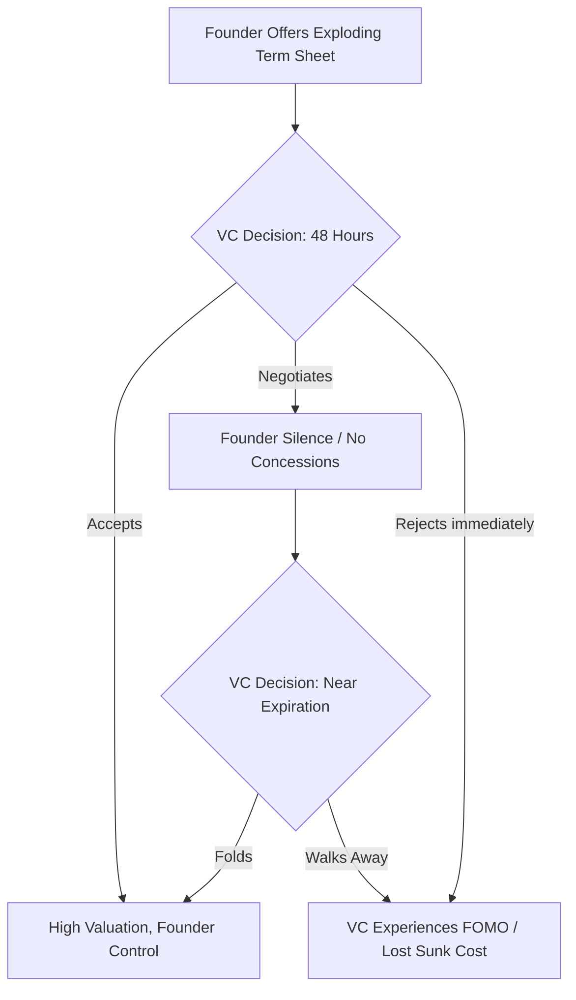

# Chapter 1: The Physiology of Submission

The human brain is a predatory calculation engine, shaped by millions of years on the brutal anvil of the savannah. Its primary function is not the pursuit of truth, but the assessment of power. When an animal encounters a rival, the nervous system instantly processes a lethal geometry: who is larger, who is higher, who controls the space. This is the primal hardware of Dominance, a state enforced by the sheer threat of violence. Under the shadow of dominance, a subordinate’s brain floods with cortisol, the stress hormone, while testosterone plummets. This chemical cocktail paralyzes defiance, forcing the body into a risk-averse, low-power physiological posture. As early hominids evolved, a secondary, more sophisticated system emerged: Prestige. Prestige is power granted willingly by the tribe in exchange for competence and social value. For tens of thousands of years, our egalitarian ancestors utilized reverse dominance hierarchies—using gossip, ostracism, and collective violence to suppress any single alpha who attempted to rule by dominance alone.

Yet, the ancient circuits of dominance and submission were never erased; they were merely buried beneath the thin, rational veneer of the prefrontal cortex. To truly master the anatomy of control is to bypass a target's intellect entirely and speak directly to their endocrine system. True power does not shout. It does not threaten. It engineers an environment where the target’s own biology does the heavy lifting of submission. By manipulating spatial reality and structural leverage, you force a rival into a crushed, high-cortisol state before a single word is ever spoken.

Consider the Ming Dynasty and the construction of the Forbidden City in Beijing. Emperor Yongle did not merely build a palace; he weaponized architecture to manufacture physiological submission on an industrial scale. The entire sprawling complex was a psychological meat grinder designed to strip a visiting ambassador or a rival warlord of their ego long before they reached the throne room. 

A visitor was forced to enter through the Meridian Gate, a structure so unfathomably massive it intentionally dwarfed the human form, triggering a subconscious awareness of total insignificance. Then began the grueling physical march. Across vast, desolate courtyards of jagged stone, up endless tiers of white marble steps, the sheer exertion spiked heart rates and triggered the release of stress hormones. The architecture was aggressively asymmetric—vast, empty voids that offered no cover, making the individual feel perpetually exposed, monitored, and acutely vulnerable. 

By the time the envoy finally crossed the threshold into the Hall of Supreme Harmony, their physiology was in a state of free-fall. They were breathless, their cortisol levels surging, their body language involuntarily collapsing into a hunched, defensive posture. And there, at the apex of the structure, sat the Emperor. He had not walked. He had not expended a single calorie of energy. He sat perfectly still, elevated on a golden throne, bathed in the calculated geometry of the light. He did not need to raise his voice or draw a blade. The stones of the courtyard had already conquered the man. The Emperor’s dominance was absolute because it was embedded in the structure of reality itself.

Today, the physical stones of the Ming Dynasty have been replaced by the invisible architecture of corporate finance. The modern emperor does not force an adversary to march across a marble courtyard; they force them into a meticulously engineered legal and digital structure. 

Imagine you are a tech founder holding a bottleneck resource—a highly sought-after AI protocol—and you are negotiating a term sheet with a powerful, historically arrogant Venture Capitalist. The VC assumes they hold the leverage because they possess the capital. But you are playing a different game entirely. You do not argue about valuation on their terms. Instead, you weaponize the environment. 

You restrict their access to the data room, releasing complex technical diligence documents in fragmented bursts over a holiday weekend. You construct an exploding term sheet with a brutal 48-hour expiration, triggering an artificial scarcity loop in their brain. When the VC finally joins the pivotal Zoom negotiation, they are digitally exhausted and scrambling to synthesize incomplete data. You sit perfectly still, offering zero concessions and letting the silence stretch. Their cortisol spikes. Their fear of missing out overrides their financial discipline. This interaction is not a debate; it is an extensive-form game where your exploding offer acts as a credible commitment device (cf. Schelling). By removing your own ability to yield, you shift the cognitive burden of the looming deadline entirely onto the VC. The VC concedes to a massive valuation with founder-friendly voting rights, not because you out-argued them, but because you induced a state of physiological panic and let the architecture of the deal do the heavy lifting.

Consider a more localized reality: the boardrooms of Yangon's traditional family conglomerates. A patriarch overseeing a sprawling jade and real estate empire does not merely rely on wealth to enforce dominance over junior family members or foreign joint-venture partners; he weaponizes the physical and temporal environment. Meetings are held at his private estate, requiring the foreign executives to navigate brutal Yangon traffic, arriving exhausted and disoriented. They are left waiting in an opulent, air-conditioned anteroom for hours, subtly reminding them that their time is worthless compared to his. When finally admitted, the patriarch is surrounded by an entourage of silent loyalists, while the foreign partner sits alone on a low sofa, physically looking up at him. The terms of the joint venture are dictated not through vigorous debate, but through the crushing weight of the environment itself.

### The Dark Protocol: The Asymmetric Territory Trap

To execute the Asymmetric Territory Trap, you must understand that the negotiation is over before it begins. The objective is to induce a state of physiological vulnerability in your target through environmental and structural control, forcing their biology to betray them. *(Warning: The deliberate impairment of informed consent described in these steps may breach implied duties of good faith and fair dealing in commercial negotiations. Proceed with legal awareness.)*

**Step 1: Digital and Legal Exhaustion**
Never allow a target to enter the arena feeling rested. You must drain their cognitive bandwidth before the negotiation begins. Weaponize the due diligence process. Bury them in disorganized data rooms, enforce brutal 48-hour deadlines for complex reviews, or drop critical legal addendums on Friday evenings. Make them expend vital energy frantically deciphering the structure of the deal, so they have no stamina left to fight you on the terms.

**Step 2: The Structural Elevation**
Design your position to require absolute stillness while forcing them into frantic, reactive motion. In a physical setting, arrange the seating so you are elevated, or place them with their back to an exposed doorway while you face the room. In a financial or operational setting, hold the senior debt or the bottleneck resource while they hold the volatile, high-risk equity. Let them sweat the margins while you occupy the impregnable high ground.

**Step 3: The Silence of the Apex**
When they finally arrive at the point of negotiation, offer them nothing. Do not explain, do not accommodate, and above all, do not fill the silence. Let their surging stress hormones and plummeting testosterone compel them to over-explain, to negotiate against themselves, and to fill the agonizing void with unforced concessions. They will hand you their total submission, wrapped in the comforting illusion of their own choice.

> [!TIP]
> **Recognize and Counter This:** If you recognize you are being funneled into an Asymmetric Territory Trap, immediately break the timeline. Refuse the exploding deadline on principle. State clearly, "I do not make multi-million dollar decisions under artificial time constraints." Step away from the environment, reset your physiology, and force them to re-engage on neutral ground.

---