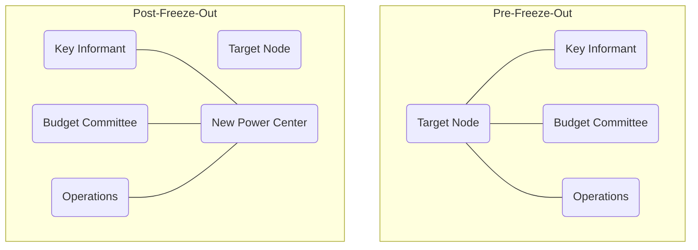

# Chapter 2: Weaponizing the Anterior Cingulate Cortex

To the primal human, the wilderness was a death sentence. The tribe was the only sanctuary against starvation and predators. Over millions of years, evolution engineered a ruthless enforcement mechanism to ensure individuals did not stray from the collective: pain. The brain did not invent a separate, specialized system to process hurt feelings. Instead, it hijacked the existing circuitry for physical trauma. 

When you break a bone or touch a hot ember, the dorsal anterior cingulate cortex (dACC) flares to life, sounding the alarm of physical injury. When you are ostracized, mocked, or socially isolated, that exact same neural matrix activates. The brain makes no distinction between a fractured femur and a shattered reputation. Social rejection is registered as physical agony. Ostracism is not merely unpleasant; biologically, it is experienced as violence. 

To master power is to understand that the human animal is terrified of the void. If you can control a person’s social oxygen—their inclusion in the group, their access to information, their standing among peers—you hold a leash attached directly to their survival instincts. Weaponizing the anterior cingulate cortex means inflicting agonizing trauma without leaving a single bruise.

The Romans understood the sheer terror of erasure. To kill a rival was a temporary solution; their legacy could become a martyr's rallying cry. True destruction required unmaking them entirely. The Roman Senate institutionalized this absolute annihilation through a practice known as *abolitio nominis*—the erasure of the name.

When the Emperor Caracalla murdered his brother and co-ruler Geta in the year 211 AD, he did not stop at fratricide. He unleashed a systematic, empire-wide purge of Geta’s existence. Geta’s face was chiseled out of family portraits. His name was meticulously scraped from every marble monument and bronze inscription across the Mediterranean. Coins bearing his likeness were melted down. Pronouncing his name became a capital offense. 

Caracalla understood that power is not just the ability to take a life, but the ability to edit reality. By weaponizing the collective silence, he forced the entire Roman Empire to participate in his brother’s continuous erasure. To survive, every citizen had to sever their psychological ties to the fallen rival. This *abolitio nominis* was the ultimate ostracism. It proved that a man could be cast into the wilderness of non-existence while his blood still stained the palace floor.

Today, you cannot scrape a rival's name off a triumphal arch, but the mechanics of erasure remain entirely intact in the corporate theater. The modern freeze-out is a masterpiece of bureaucratic violence, executed without triggering a single HR violation.

When a CEO or a cunning board member decides to neutralize a threat—a brilliant but difficult founder, an ambitious COO—they do not fire them. Firing is messy. It triggers golden parachutes, severance negotiations, and retaliatory lawsuits. Instead, they erase the target structurally. 

The architecture of the company is quietly rearranged. Bylaws are subtly amended. "Special committees" are formed to explore "strategic initiatives," and the target is simply left off the calendar invites. Reporting lines are redrawn under the guise of efficiency, isolating the target from key operators. Through a recapitalization event, voting shares are diluted. 

The target retains their corner office, their impressive title, and their six-figure salary, but their structural power is zeroed out. They have been unmade. They walk the halls, but the information flow bypasses them entirely. Colleagues, sensing the shift in the wind, subconsciously avoid eye contact, not wanting to be associated with the walking dead. This freeze-out is fundamentally a graph theory problem: the target is a node whose edges (connections to information, capital, and influence) are systematically severed by a coordinated coalition. The target's anterior cingulate cortex begins to scream, registering the deep, freezing agony of the modern exile. They are a ghost in an Armani suit, effectively erased from the corporate timeline.

### The Dark Protocol: The Social Asphyxiation Method

To execute a bloodless coup against an entrenched rival, you must sever their social oxygen and let their own biology destroy them. 

**Step 1: Sever the Information Arteries**
Do not openly confront the target. Simply exclude them from the informal economy of power—the meetings before the meetings, the casual drinks where real decisions are made. Ensure that vital operational data is routed around their desk. 

**Step 2: Construct the Invisible Wall**
Subtly signal to the target’s subordinates that their future lies with you, not their direct manager. You do not need to demand loyalty; you only need to demonstrate that you hold the keys to budget approvals and promotions. The subordinates will naturally begin to bypass the target, reporting directly to the new center of gravity. 

**Step 3: Weaponize Paranoia**
As the target realizes they are blind and isolated, their dACC will trigger an evolutionary panic. They will feel the physical pain of the freeze-out. Let the silence stretch. Do not explain, do not argue. The void will breed paranoia. They will begin to see conspiracies where there are none. 

**Step 4: The Self-Inflicted Execution**
Driven by the biological agony of ostracism, the target will behave erratically. They will send unhinged, accusatory emails at 2:00 AM. They will corner colleagues in hallways demanding loyalty. They will publicly lash out in board meetings. Allow them to perform their own instability. Their desperation will alienate whatever remaining allies they have. When they finally break—whether they resign in a furious rage or are terminated for "creating a toxic culture"—the organization will not mourn them. They will exhale in relief. You have not fired a shot; you simply let them suffocate on their own irrelevance.

> [!TIP]
> **Recognize and Counter This:** If you recognize you are the target of Social Asphyxiation, your only viable response is absolute stillness. Do not send the 2:00 AM email. Do not demand loyalty. Document the structural shifts quietly, secure your external network (industry peers outside the firm), and negotiate a lateral exit from a position of calm professionalism. Do not let your anterior cingulate cortex negotiate your severance.

---