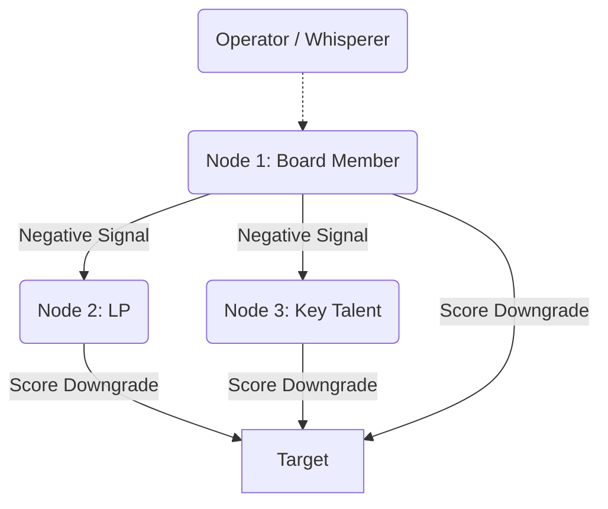

# Chapter 4: Indirect Reciprocity and Reputation Assassination

In the ancestral environment, the spear was not the most dangerous weapon. It was the whisper. The human brain evolved a unique mechanism for survival known as *indirect reciprocity*—a complex calculus of reputation tracking. Unlike direct reciprocity, where two individuals trade favors, indirect reciprocity relies on third-party observation. *I help you, so someone else will help me.* It is the invisible currency of trust. Gossip evolved not as idle chatter, but as a ruthless biological imperative to identify free-riders and enforce social cohesion. The neural circuitry that processes reputation is deeply intertwined with the brain's survival centers. To destroy a man's reputation is to trigger a biological death sentence, severing him from the tribe's protection. The master of power understands that they do not need to strike an enemy directly; they only need to manipulate the tribe’s perception, turning the collective into an unwitting executioner.

Nowhere was the weaponization of the whisper perfected with more lethal elegance than in the Byzantine Empire, a state so defined by its labyrinthine politics that its very name became synonymous with intrigue. The Emperor Justinian and his Empress, Theodora, ruled not merely by the sword, but by the rumor. The Byzantine court was a masterpiece of indirect reciprocity subverted for anti-social ends. Rather than confronting powerful generals or ambitious aristocrats head-on—which would risk civil war—Theodora orchestrated meticulous campaigns of reputation assassination. Eunuchs and spies were dispatched to seed carefully calibrated lies into the social bloodstream. A subtle questioning of a general's loyalty here, a fabricated letter of treason there. These whisper campaigns were designed not to be loud, but to be insidious. The target would find themselves increasingly isolated, their allies pulling away to avoid the contagion of disfavor. By the time the formal accusation arrived, the victim was already socially dead, stripped of their power by the silent consensus of the court. The genius of the Byzantine method lay in its deniability; the orchestrator's hands remained perfectly clean while the target’s reputation bled out from a thousand invisible cuts.

Today, the battlefield has migrated from the marble halls of Constantinople to the encrypted channels of Silicon Valley, but the mechanics of the kill remain unchanged. You do not need to out-innovate a rival if you can poison their well. This relies on the formal mechanism of image scoring (Nowak & Sigmund, 1998), where an individual's reputation is a numeric score constantly updated by the network based on observed or rumored behavior. 

Consider your position as a modern tech founder, locked in a brutal race for capital. Your competitor is closing a Series B round that will give them unassailable market dominance. A direct attack is crude and invites retaliation. Instead, you deploy the targeted corporate leak. You identify the nodes in their network most sensitive to risk—the cautious limited partner, the risk-averse board member. Through intermediaries, you plant a single, devastating piece of information: a whispered rumor about their burn rate, a quiet insinuation about an impending SEC inquiry, or a "leaked" internal memo hinting at catastrophic churn. You do not shout it; you let the venture ecosystem's innate paranoia do the work. As the negative signal propagates through the network, the rival's image score plummets across all connected nodes simultaneously. Their term sheet is suddenly pulled. Their talent jumps ship. You have orchestrated their destruction without leaving a single fingerprint on the weapon, leveraging the network's natural immune response to eliminate your rival.

This dynamic is brutally effective in hyper-connected, trust-based ecosystems like the Yangon business community. In Myanmar’s tight-knit commercial elite, where formal legal recourse is often unreliable, reputation is the only currency that matters. Suppose a rising fintech startup threatens the market share of established local banks. The banking tycoons do not launch a direct public attack. Instead, they activate their extensive informal networks—over tea at the Strand Hotel or during private dinners—planting quiet seeds of doubt about the startup’s regulatory compliance and alleged ties to sanctioned entities. Within weeks, the whispers calcify into accepted fact. The startup's international investors panic and pull funding, and local partners sever ties. The banks neutralize the threat effortlessly, their hands perfectly clean, having leveraged the ecosystem's innate risk aversion to execute the kill.

### The Dark Protocol: Self-Inflicted Destruction

The pinnacle of reputation assassination is not the lie you tell about your target, but the lie you convince them to act upon. You must engineer a scenario where their own panicked reaction validates the rumors surrounding them.

**Step 1: Plant the Seed of Paranoia.** Feed a piece of explosive, yet entirely false, information into a channel you know the target monitors. Let them intercept a fabricated plot against them, or a rumor that their most trusted lieutenant is turning state's evidence. The information must threaten their core vulnerability.

**Step 2: Force the Overreaction.** As the target absorbs the false threat, their amygdala hijacks their prefrontal cortex. The anxiety of impending doom strips away their rationality. They will feel an overwhelming compulsion to "get ahead" of the crisis. 

**Step 3: The Public Detonation.** The target, blinded by paranoia, lashes out defensively in a public forum. They fire a loyal executive without cause, send a deranged late-night email to their investors, or issue a preemptive public denial of a scandal nobody else was talking about. 

**Step 4: The Clean Sweep.** Stand back and let the ecosystem react. By attempting to defend themselves against a phantom threat, they have provided undeniable proof of their erratic instability. You did not assassinate their character; you simply handed them the shovel and watched as they dug their own grave. *(Warning: The conduct described here—planting false information to destroy a reputation—constitutes actionable fraud and defamation in all U.S. jurisdictions.)*

> [!TIP]
> **Recognize and Counter This:** If you are the target of a whisper campaign, understand that reacting defensively validates the attack. Never address a rumor directly unless you have absolute, irrefutable proof of its origin. Instead, isolate the nodes propagating the rumor and counter-signal aggressively by demonstrating undeniable operational competence and stability.

---