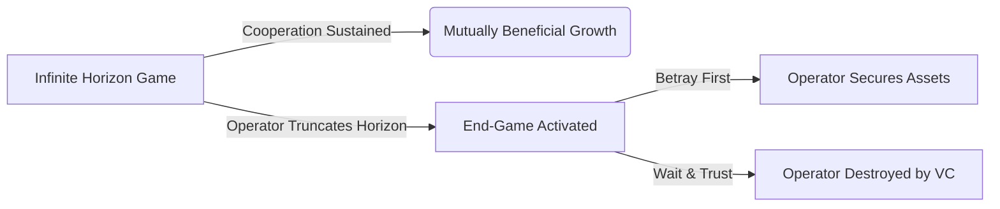

# Chapter 5: The Mathematics of Treason

In the brutal arithmetic of early human survival, betrayal was not an anomaly; it was a mathematical certainty waiting to be triggered by environmental scarcity. The Pleistocene epoch did not reward the inherently trusting; it rewarded the deeply paranoid and the swiftly ruthless. When two hunter-gatherer bands encountered one another over a fresh kill or a fertile valley, they entered the primal iteration of the Prisoner's Dilemma. The math was violently simple: cooperate and risk being slaughtered if the other betrayed, or betray first and guarantee survival. In a zero-sum environment where one tribe's feast meant another's starvation, the optimal strategy for ensuring genetic continuation was never blind trust. It was the calculated strike. The human brain evolved to constantly weigh the probabilities of cooperation against the lucrative, bloody dividends of a sudden, lethal betrayal. Those who mastered this dark calculus lived. Those who assumed good faith became footnotes in the dust.

As human networks scaled from tribes to empires, this calculus evolved from crude violence into the refined art of the treaty—the formalized lie. In the chaotic, shifting alliances of Renaissance Italy, Niccolò Machiavelli observed the fundamental truth of the political chessboard: treaties are merely pauses in hostilities, documents signed by men waiting for the optimal moment to break them. Consider Cesare Borgia at Sinigaglia. Surrounded by mercenary captains who had recently conspired against him, Borgia did not seek true reconciliation, nor did he allow his grievance to simmer into open warfare. He offered them a grand, forgiving treaty. He invited them to a feast of celebration, lulling their mathematical vigilance with the warmth of apparent non-zero-sum cooperation. When they arrived, disarmed and bloated with a false sense of security, he had them strangled. Borgia understood the core tenet of the Iterated Prisoner's Dilemma: if the game is going to end, or if a catastrophic betrayal is inevitable, the only logical move is to betray first, and betray with such totality that the opponent cannot play another round.

Today, the battlefield is no longer a blood-soaked dining hall in the Romagna, but the immaculate, glass-walled conference rooms of Sand Hill Road. The modern mercenary captain wears a Patagonia vest and wields a cap table. Imagine the scenario: your lead venture capitalist, sensing weakness in a down market, begins quietly maneuvering to dilute your shares, invoke punitive liquidation preferences, and orchestrate a hostile boardroom takeover. The amateur founder appeals to the VC’s sense of partnership, begging for a fair, non-zero-sum resolution, clinging to the naive belief in the "founder-friendly" marketing brochure. You, however, understand the mathematics of treason. Drawing on Axelrod (1984) and the Folk Theorem, you know that cooperation only sustains when the shadow of the future is long. The operator's true skill lies in manipulating the *perceived horizon* of the game. You do not wait for the board meeting where the knife is slipped between your ribs. You become the predator. You weaponize your proprietary access. Before the VC can rally the independent board members, you silently execute a hard fork of the intellectual property, transferring core, unpatented algorithms to a newly incorporated shell entity under your sole control—an entity the VC has no claim to. *(Legal Note: This maneuver requires precise, pre-existing legal architecture; hard forking company IP to a personal shell entity without it is a catastrophic breach of fiduciary duty.)* You leak meticulously documented evidence of the VC’s fiduciary mismanagement to a rival fund, crippling their ability to raise their next vehicle. You do not merely resist the takeover; you structurally obliterate their leverage. When the board meeting finally arrives, you do not argue. You present them with a finalized term sheet from their most hated rival, contingent on their immediate, heavily discounted buyout, or you walk out the door, leaving them with an empty husk of a company and a burning reputation. You strike first, and you strike with fatal precision.

Consider the volatile cross-border trade in border hubs like Myawaddy or Muse. A regional logistics operator and a foreign manufacturing partner enter a lucrative joint venture, relying heavily on informal agreements due to fluctuating regulatory frameworks. The local operator, sensing an impending shift in border policies that would disadvantage the foreign partner, understands the horizon of cooperation has truncated. They do not seek to renegotiate or warn their partner. Instead, they preemptively decapitate the foreign firm's leverage. Overnight, the local operator physically re-routes all key transport fleets to a separate entity under their brother's name and leverages local bureaucratic connections to freeze the foreign partner's import licenses. When the policy shift is announced, the foreign partner realizes they have no assets, no legal standing, and no operational capacity. They are forced to sell their remaining stake to the local operator for pennies on the dollar. The local operator struck first, recognizing that in a zero-sum environment, the first mover writes the history.

### The Dark Protocol: Preemptive Decapitation

When the mathematics of a relationship shift into a zero-sum death spiral, hesitation is suicide. If you must betray, or if you suspect betrayal is imminent, you cannot afford a half-measure. A wounded enemy is a localized insurgency waiting to destroy you. 

**Preemptive Decapitation** requires that when you strike, you guarantee the target is left with absolutely zero retaliatory capability. This is not about winning an argument; it is about permanently removing a piece from the board. 

1.  **The Illusion of Stasis:** Do not signal your intent. Increase your apparent cooperation just before the strike. Agree to minor concessions to lower the target's threat-detection threshold. 
2.  **Sever the Arteries:** Identify the target's primary sources of power—their capital, their reputation, their key allies. Your strike must target all three simultaneously. 
3.  **The Fatal Blow:** Bankrupt them legally or financially, exile them from the industry ecosystem, and incinerate their reputation so thoroughly that no future ally will ever trust them.
4.  **No Quarter:** Offer no mercy, no settlements, and no path to redemption. The goal is not merely to win, but to make the cost of ever having opposed you an existential terror. Leave nothing but ash.

> [!TIP]
> **Recognize and Counter This:** If you notice your counterpart taking actions that suggest they believe the relationship is nearing its end-game (e.g., hoarding information, accelerating timelines inexplicably, forming parallel structures), assume a strike is imminent. You must immediately force an open confrontation to reset the perceived horizon or preemptively secure your own core assets.

---