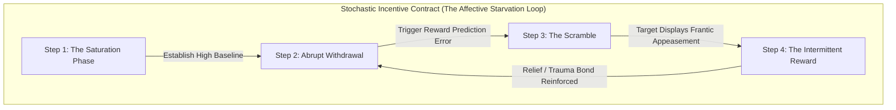

# Chapter 6: The Dopamine Engine

Deep within the midbrain, nestled in the ventral tegmental area, lies the architecture of desire. The mesolimbic pathway does not exist to reward you for arriving at a destination; it exists to compel you to seek it. This is the neurochemical engine of dopamine. It is not the molecule of pleasure, but the molecule of anticipation, craving, and pursuit. In the Pleistocene epoch, early hominids did not find sustenance on a predictable schedule. The primal hunt was an exercise in starvation punctuated by sudden, glorious windfalls. The brain evolved to prioritize the unpredictable. When a reward is guaranteed, the dopaminergic response flatlines. But when a reward is uncertain—when it is delivered on a variable-ratio reinforcement schedule—dopamine spikes to dizzying heights. The hunt becomes an obsession. The uncertainty is the hook.

For millennia, this neurological vulnerability was exploited instinctively by those who understood the raw mechanics of power. The most terrifying despots did not rule through constant terror, nor did they rule through constant benevolence. They ruled through radical unpredictability. An emperor who is consistently cruel will eventually breed a rebellion born of sheer necessity. An emperor who is consistently kind will breed complacency, entitlement, and eventual contempt. But an emperor who alternates between extravagant favor and sudden, freezing disdain creates a court of addicts. Consider the absolute monarch who elevates a low-born courtier, showering him with titles, gold, and whispered confidences. The courtier’s brain becomes saturated with the narcotic of the sovereign’s approval. Then, without warning, the emperor turns his back. He ignores the courtier at the banquet. He redirects his warmth to a rival. The courtier is plunged into sudden withdrawal. He will abase himself, beggar his family, and betray his friends just to experience one more hit of the emperor’s smile. The unpredictability does not just secure loyalty; it manufactures a fanaticism indistinguishable from a trauma bond.

Today, the architecture of the court has been replaced by the architecture of the corporation, but the human animal remains tethered to the same primal leash. You are no longer the subject hoping for a glance from the throne. You are the architect of the environment. You are the predator. 

Consider the brilliant, temperamental Chief Technology Officer—the genius whose code is the lifeblood of your enterprise, but whose flighty, arrogant nature makes him a constant flight risk. You do not manage such a creature with steady salaries, predictable bonuses, or consistent praise. You manage him by weaponizing his neurochemistry. 

In the beginning, you saturate his receptors. You isolate him in your office late at night, pour the rare scotch, and tell him that he is the only one who truly understands the vision, the only peer you have ever found. You fund his esoteric side-projects. You make him feel like a god. You establish a baseline of intense, intoxicating validation.

And then, precisely when he expects it most, you cut the supply. 

You cancel your one-on-one meetings without explanation. You stare blankly at his latest, brilliant deployment and offer a terse, "It's fine, but the latency is unacceptable," before turning your attention to a junior developer. You do not shout. You do not threaten to fire him. You simply replace the warmth with an icy, unpredictable void. The resulting cognitive dissonance will plunge him into a dopaminergic free-fall. His pride will demand that he hate you, but his mesolimbic pathway will demand that he win you back. He will work eighty-hour weeks. He will scrap his elegant architecture for something dirtier, faster, just to elicit a flicker of your former approval. When he brings you the impossible result, exhausted and desperate, you smile. You pour the scotch. You give him the hit. 

You have not just managed an employee. You have engineered a behavioral loop that will extract every ounce of his genius until there is nothing left. 

### The Dark Protocol: The Dopaminergic Leash

To execute the Dopaminergic Leash, you must master the calculus of withdrawal, modeling the intermittent reward as a stochastic incentive contract using expected utility. Predictability is your enemy; the variable-ratio reward is your supreme weapon.

**Step 1: The Saturation Phase** 
Identify the target's core insecurity—whether it is a need for intellectual validation, social status, or parental approval. Flood that insecurity with overwhelming, unearned validation. Become the sole source of their highest highs. Establish an intense emotional baseline that they will subconsciously define as the new normal.

**Step 2: The Abrupt Withdrawal** 
Once the target is comfortable and expectant, sever the connection. The withdrawal must be sudden, unexplained, and emotionally cold. Do not show anger; anger indicates that you care. Show absolute, chilling indifference. Shift your attention to someone they view as inferior. This triggers the Reward Prediction Error in their brain—a massive drop in dopamine that registers as a psychological crisis.

**Step 3: The Scramble** 
Observe the target's frantic appeasement behavior. They will work harder, lower their boundaries, and compromise their own dignity to bridge the gap you have created. They will rationalize your abuse, blaming themselves for your sudden coldness. Let them sweat. Let the desperation steep. Do not intervene while they are producing output at a frenetic pace. 

**Step 4: The Intermittent Reward** 
When the target has exhausted themselves and delivered exactly what you require, grant them a fraction of the original warmth. A brief smile. A quiet nod. A return of the old camaraderie. The rush of relief will flood their brain, reinforcing the trauma bond. From this point forward, they will not work for the salary or the equity; they will work for the unpredictable, intoxicating drip of your approval. They are now on the leash. *(Clinical Context: Targets of sustained intermittent reinforcement of this magnitude develop symptoms consistent with complex PTSD, experiencing severe dysregulation and long-term psychological harm.)*

> [!TIP]
> **Recognize and Counter This:** If you find yourself obsessing over a superior's approval to an unhealthy degree, track their validation patterns. If they are employing variable-ratio reinforcement (idealize, devalue, intermittent reward), you must emotionally decouple. Re-establish your baseline of self-worth outside their ecosystem and strictly limit your interactions to transactional, verifiable metrics.

---