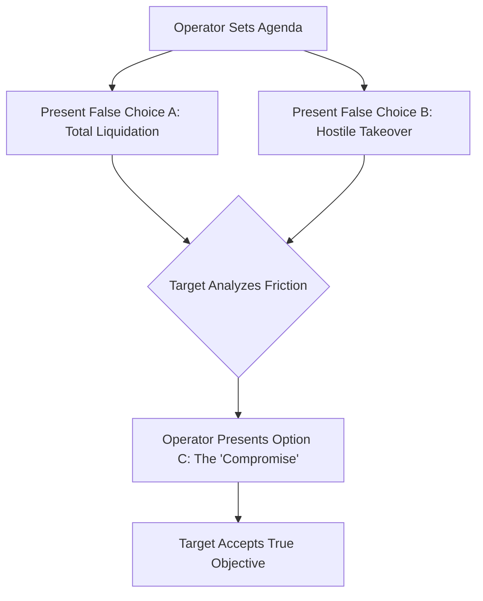

# Chapter 7: Unequal Tug-of-War & Choice Architecture

The human brain is an engine of ruthless metabolic efficiency. Consuming roughly twenty percent of the body’s caloric burn while occupying only two percent of its mass, it is perpetually on the precipice of energetic bankruptcy. To survive the brutal scarcity of the ancestral environment, evolution hardwired us with a profound, subconscious aversion to cognitive friction. Thinking, deciding, and resisting are metabolically expensive. The path of least resistance is not merely a psychological preference; it is a biological imperative. Because of this, humans are extraordinarily vulnerable to the manipulation of defaults. When presented with an environment where one option requires zero effort and another requires sustained cognitive or physical exertion, the brain will almost universally default to the frictionless path. We mistake the absence of friction for the presence of truth, and we interpret the default option as the safest choice. The primal human is governed not by the illusion of free will, but by the silent architecture of their environment. Power, therefore, does not require a spear. It only requires the ability to dictate the physical and cognitive terrain, making obedience effortless and defiance exhausting.

Long before behavioral economists gave a name to choice architecture, despots and empire builders mastered its application through structural and logistical bottlenecks. To control a sprawling, volatile populace, the most sophisticated rulers did not rely solely on the sword. Blunt force is expensive, bloody, and breeds martyrs. Instead, they designed systems where rebellion was theoretically possible but practically insurmountable. Consider the Byzantine bureaucracy or the tribute networks of antiquity. The architecture of the empire was engineered to create profound asymmetric friction. Submitting to the Emperor’s taxation and laws was a greased chute—the roads were paved, the courts functioned, and compliance required merely going about one's daily life. Resistance, however, was a labyrinth. To launch a rebellion, a provincial governor had to independently secure supply lines, forge parallel currencies, navigate hostile geography without imperial maps, and convince others to abandon the safety of the default state. The Emperor did not have to actively fight every dissident; he simply made the logistics of dissent so exhausting that potential rivals defeated themselves before drawing a blade. The choice was always theirs, but the environment was rigged so heavily that submission felt like the only rational decision.

Today, this same principle is the invisible dark matter of the digital economy, and as a platform architect, it is your most lethal weapon. You no longer build stone walls; you build ecosystems. When you target a massive enterprise client, your initial approach is aggressively frictionless. You offer seamless integration. Your engineers handle the data migration for free. The APIs auto-configure, the dashboards are beautiful, and the onboarding process feels like a miracle of modern efficiency. You invite them into a walled garden where the temperature is perfect and the fruit hangs low. 

But the architecture is a trap. Once their core operations are entangled with your software, the asymmetric friction activates. They are, of course, legally "free" to leave at any time. Yet when they attempt to migrate away, they discover that the export functions are buried beneath layers of obfuscated UI. The data structures are proprietary, formatting as incomprehensible gibberish on a competitor's system. Tearing your platform out of their stack would require millions of dollars in downtime, retraining, and systemic risk. You do not lock them in with an ironclad contract; you lock them in with cognitive and operational exhaustion. They look at the sheer, terrifying cliff-face of migrating away, and their executive team sighs, choosing to swallow your fifteen percent year-over-year price hike. You have weaponized the path of least resistance, turning their own operational lethargy into your recurring revenue.

*(Note: In enterprise software, this friction is highly quantifiable. Enterprise switching costs typically range from 3-7x the annual contract value, locking clients in through pure logistical inertia.)*

### The Dark Protocol: The Unequal Tug-of-War

To exploit asymmetric friction in an organizational or legal setting, you do not need to win an argument; you simply need to make the process of arguing metabolically and financially ruinous for your opponent. 

**Step 1: Weaponize Compliance**
Bury the target in procedural requirements. Demand exhaustive documentation, require multiple layers of approval for standard operations, and enforce rigid adherence to obscure bylaws. 

**Step 2: The Infinite Delay**
When they attempt to resolve the issue, utilize strategic incompetence. Miss deadlines by a single day, send incomplete responses that necessitate further clarification, and route their requests through endlessly rotating mid-level bureaucrats. 

**Step 3: The Attrition Surrender**
The goal is not to formally deny them their rights or objectives, but to make the friction of obtaining them so high that they voluntarily abandon the pursuit. They will eventually settle for deeply unfavorable terms simply to stop the bureaucratic bleeding.

> [!TIP]
> **Recognize and Counter This:** If you realize you are engaged in an Unequal Tug-of-War, immediately stop playing by the adversary's procedural rules. Elevate the conflict to a higher authority, threaten public exposure, or utilize legal mechanisms to impose strict, non-negotiable deadlines. Document every instance of coercive control, bullying, and artificial delay to build a case for bad faith negotiation.

### The Dark Protocol: The Hobson’s Trap (Defaults as Destiny)

To master choice architecture is to realize that humans do not want freedom; they want the illusion of freedom without the burden of deliberation. Drawing on McKelvey's chaos theorem, The Hobson’s Trap can be formally modeled as a sequential agenda-setting game. You do not force your target to accept your preferred outcome. Instead, you dictate the order and nature of the choices, boxing them in by manufactured extremes and forcing them to beg you for the exact chains you always intended to place upon them.

When negotiating a pivotal deal or seeking to impose a draconian policy, never present your true objective as the primary option. Doing so invites scrutiny, counter-offers, and resistance. Instead, architect a false dilemma. Present two horrific, mutually destructive alternatives. Option A must be an operational nightmare—perhaps a catastrophic liquidation, a brutal public legal battle, or an immediate cessation of vital services. Option B must be equally unpalatable—a humiliating surrender, a total loss of equity, or regulatory ruin. 

Allow the target to agonize over these catastrophic paths. Let the cognitive friction and the panic of the double-bind exhaust their mental reserves. As they desperately thrash against the walls of the trap, you silently watch. Only when they are at the breaking point do you "reluctantly" introduce Option C—your true objective. It will still be costly, and it will still strip them of leverage, but compared to the artificially manufactured horrors of A and B, it will look like salvation. They will not just accept your terms; they will thank you for them. By controlling the architecture of their choices, you transform your extortion into their deliverance.

> [!TIP]
> **Recognize and Counter This:** When presented with terrible binary choices (A or B), immediately recognize that the agenda has been rigged. Do not choose. Attack the framing itself. Force the introduction of external options or change the timeline. Never negotiate within a paradigm designed entirely by your adversary.

---