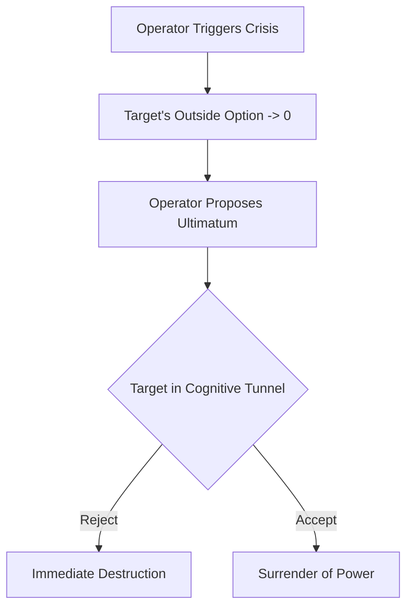

# Chapter 8: Supernormal Stimuli and the Attention Hijack

The human brain evolved in an environment of brutal scarcity. Survival depended on hyper-vigilance toward high-value signals: the sudden flash of a predator's movement, the vivid hue of a ripe, calorie-dense fruit, the visceral shock of violence. When the ancestral brain detected these things, it did not pause for rational deliberation. It immediately hijacked the body’s attentional resources, flooding the nervous system with adrenaline and dopamine to force immediate action. Ethologists call the artificial exploitation of this mechanism a "supernormal stimulus." Present a bird with a synthetic egg that is larger and brighter than its own, and it will abandon its actual offspring to sit on the fake. The animal cannot help itself; its hardwiring commands it to prioritize the extreme over the natural. In humans, this cognitive vulnerability remains entirely intact. When presented with an exaggerated, hyper-salient version of reality, the prefrontal cortex—the seat of logic and restraint—is bypassed. Attention is captured, and the mind is enslaved by the brightest, loudest, or most terrifying object in the room.

To control a restless population, one must simply control their focus, flooding their senses with stimuli so overwhelming that nuanced thought becomes impossible. The architects of Rome understood this deeply. As the Republic crumbled and the Empire rose, the populace grew dangerously idle and politically volatile. Rather than reasoning with the mob or addressing the structural rot, the Emperors deployed the first mass-scale supernormal stimuli: the Games. *Panem et circenses*—bread and circuses—was not mere charity; it was a neurochemical weapon. When discontent murmured in the streets, the Emperor opened the Colosseum. He delivered not just food, but unimaginable spectacle: rivers of blood, exotic beasts imported from the edges of the world, and brutal, high-stakes combat. The sheer scale and intensity of the violence triggered the primal survival circuits of eighty thousand screaming spectators at once. Their political grievances dissolved, washed away by a torrential flood of adrenaline. The Emperor became the sole provider of both their sustenance and their psychological stimulation. By owning their attention, he owned their reality.

Today, you do not need an arena of stone to execute this hijacking; you need only the glowing glass in the palm of their hands. As a modern architect of power, you recognize that the algorithms governing human interaction are built to prioritize the digital equivalent of blood in the sand: outrage, tribal division, and existential threat. You do not compete with a rival on the merits of your product or the strength of your balance sheet. When a competitor begins to capture your market share, you do not engage in a price war. Instead, you manufacture a localized crisis. You quietly seed a narrative—an ambiguous labor practice, a polarizing political stance, a supply chain vulnerability—and feed it into the algorithmic machinery designed to amplify moral panic. You flood the ecosystem with the supernormal stimulus of righteous indignation.

The public, hardwired to react to social threats, locks onto the controversy. The attention hijack is instantaneous. Your rival is suddenly engulfed in a firestorm, forced into a reactive crouch. They issue frantic apologies, fire executives, and drain their capital fighting a ghost you created. Their board panics; their prefrontal cortex shuts down under the crushing weight of public scrutiny. This is the moment you strike. You do not gloat. You step into the wreckage as the calm, stabilizing force. You offer the market a safe harbor, a clean alternative untainted by the chaos. You orchestrated the storm, yet you are the one selling the umbrellas. 

### The Dark Protocol: Induced Cognitive Tunneling

To weaponize attention and break a target’s psychological defenses, you must force them into a state of "cognitive tunneling"—a psychological phenomenon where acute stress causes the brain to focus exclusively on the immediate threat, blinding it to the broader context and all peripheral solutions.

**1. The Incubation of Threat**
Identify an area where your target is heavily leveraged or reputationally exposed. It does not require a genuine scandal; it only requires the *implication* of a systemic failure. The threat must trigger primal social fears: ostracism, financial ruin, or physical danger. 

**2. The Injection of the Supernormal Stimulus**
Deploy the crisis publicly, utilizing the mechanics of viral escalation. Use proxy voices to amplify the threat, ensuring it appears organic and overwhelming. The goal is to make the crisis appear exponentially larger and more immediate than it actually is. Overload their sensory inputs with negative feedback, plummeting metrics, and coordinated outrage.

**3. The Constriction of Options**
As the target’s cortisol levels spike, their ability to process complex information degrades. They will stop looking for strategic maneuvers and begin searching desperately for an immediate escape hatch. Their vision narrows. They will ignore their advisors and make rash, impulsive decisions to stop the bleeding, invariably damaging their own position further.

**4. The Savior’s Entry**
Once the target is fully trapped in the cognitive tunnel, exhausted and stripped of their leverage, you introduce yourself as the solution. You offer the escape hatch: an acquisition at a fraction of their prior valuation, a punitive settlement, or a total surrender of market territory. Because they are blinded by panic, they will not see you as the architect of their destruction. They will see you only as their salvation, eagerly signing away their power just to make the pain stop.

This maneuver models exactly as an asymmetric information ultimatum game, where the proposer has successfully manipulated the responder's outside option to zero.

> [!TIP]
> **Recognize and Counter This:** If you find your options suddenly and artificially constricted during a crisis, assume you are being funneled. Before accepting a "savior's" ultimatum, you must forcefully widen your cognitive aperture. Bring in an outside advisor who is completely unaffected by the localized panic to evaluate the true state of your outside options.

---