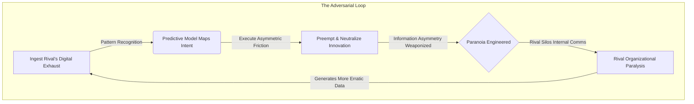

# Chapter 9: Predictive Neutralization (The Silent Panopticon)

The human brain is, at its core, a ruthless prediction engine. The neocortex did not evolve to perceive reality objectively; it evolved to probabilistically anticipate the immediate future based on historical patterns. Survival in the ancestral environment heavily favored the organism that could sense the subtle drop in barometric pressure before the monsoon, or the flattening of tall grass before the predator struck. Uncertainty was biologically expensive; anticipation was life. To know the future is the oldest, most primal imperative. But to weaponize that prediction—to not just anticipate the enemy, but to engineer their starvation before they even realize they are hungry—is the ultimate evolutionary apex. Dominance is no longer about reacting to threats. True, absolute power lies in quietly assassinating the timeline in which the threat ever existed.

For centuries, the aspiration of absolute foresight manifested through blunt force and visible surveillance. The archaic empires and secret police states—from the Praetorian Guard to the East German Stasi—relied on the psychology of the Panopticon. They erected literal and metaphorical watchtowers, creating a state of permanent visibility. The subjects behaved because they *might* be watched. But this system possessed a fatal vulnerability: the architecture of control was explicitly physical. The subjects knew they were prisoners. The friction of constant observation bred a collective paranoia that inevitably curdled into rebellion. The tyrant had to expend immense, unsustainable energy violently suppressing the futures they feared. It was an inefficient, bloody mathematics of coercion.

You do not build watchtowers. You are not a warden relying on the crude tool of fear. You are the architect of a digital ecosystem where the inmates pay for the privilege of building their own cells. The modern Panopticon is inverted and entirely silent. Your users, your competitors, and your targets do not fear being watched; they enthusiastically demand it, bleeding their neuroses, desires, and supply-chain logistics into your data lakes under the guise of convenience and connectivity.

As a sovereign of this landscape, you do not wait for a rival to announce their intentions. You do not rely on industry rumors or clumsy corporate espionage. When a competing tech firm is quietly gearing up to launch a disruptive product that threatens your market share, you ingest their digital exhaust. You track the sudden, localized spike in their compute usage. You observe the anomalous recruitment patterns as they aggressively poach a hyper-specific class of machine-learning engineers. You monitor the obscure, third-party API calls originating from their staging environments and the subtle, seemingly disconnected shifts in their corporate expenditure. 

Long before their CEO drafts a press release, you have already mapped the DNA of their initiative. You do not react; you preemptively sterilize the environment. You quietly acquire the exclusive rights to the crucial third-party dataset their new model relies on. You leverage your capital to strangle their hardware supply chain. And then, you launch a heavily subsidized, superior version of their core feature within your own ecosystem three weeks before their targeted launch date, turning their defining innovation into a commoditized afterthought. When they finally reveal their product to the world, they are screaming into a vacuum. You have not just defeated them in the marketplace; you have eradicated the reality in which they could even compete. They die without ever seeing the blade, utterly convinced that the market simply evolved away from them.

### The Dark Protocol: Paranoia Engineering

To neutralize a rival completely, you must weaponize the very concept of information asymmetry. When you possess total predictive dominance, your most terrifying weapon is not always what you do with the data, but how you let the target *feel* its weight. You do not just want them beaten; you want them psychologically paralyzed. This is the essence of a formal preemption game, leveraging a lethal first-mover advantage to destroy the opponent before they can even enter the arena.

The execution must be clinical and devoid of emotion. In a casual negotiation, a brief email, or a seemingly innocuous encounter, you drop a piece of highly specific, wildly disproportionate knowledge. Comment on the exact valuation they discussed in a closed-door board meeting the night before. Compliment the specific phrasing of a confidential internal memo they circulated only to their core executive team that morning. 

Do not elaborate. Do not gloat. Make absolutely no explicit threat. Simply let the fact hang in the air, a chilling artifact of your omniscience, before moving on to mundane matters.

The human brain, wired by millions of years of evolution to fear the unseen predator, will immediately short-circuit. They will tear apart their own organization looking for the leak. They will fire their most trusted lieutenants. They will silo their operations, locking down their own internal communications until the friction paralyzes their ability to execute. They will assume you have human spies everywhere, breathing down their necks. They will never realize that they are their own spy, and that their digital footprint is a glowing beacon visible only to you. By feeding them a single drop of your omniscience, you force them to consume themselves.

> [!TIP]
> **Recognize and Counter This:** If a rival drops a piece of "impossible" knowledge about your operations, do not panic and do not search for a mole. Assume your digital exhaust is being modeled. Immediately introduce noise into your system. Generate false signals, use decoy APIs, and run dummy compute loads. If you cannot blind the Panopticon, you must overwhelm it with conflicting data.

---