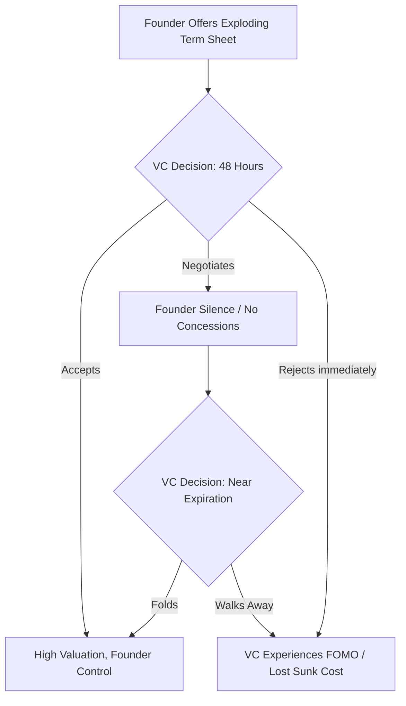
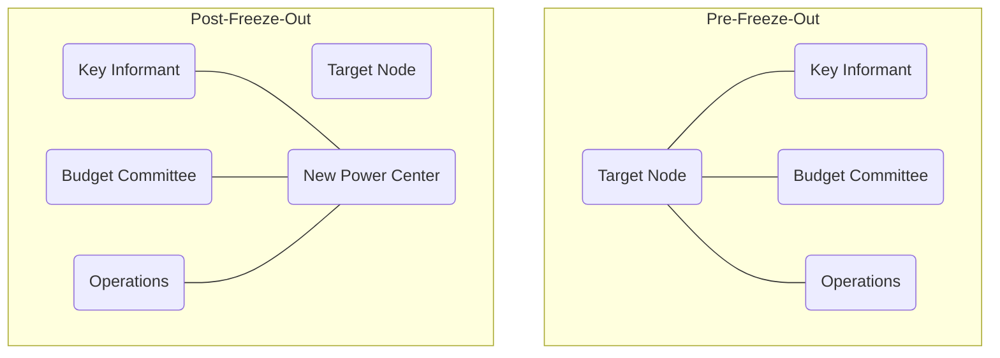
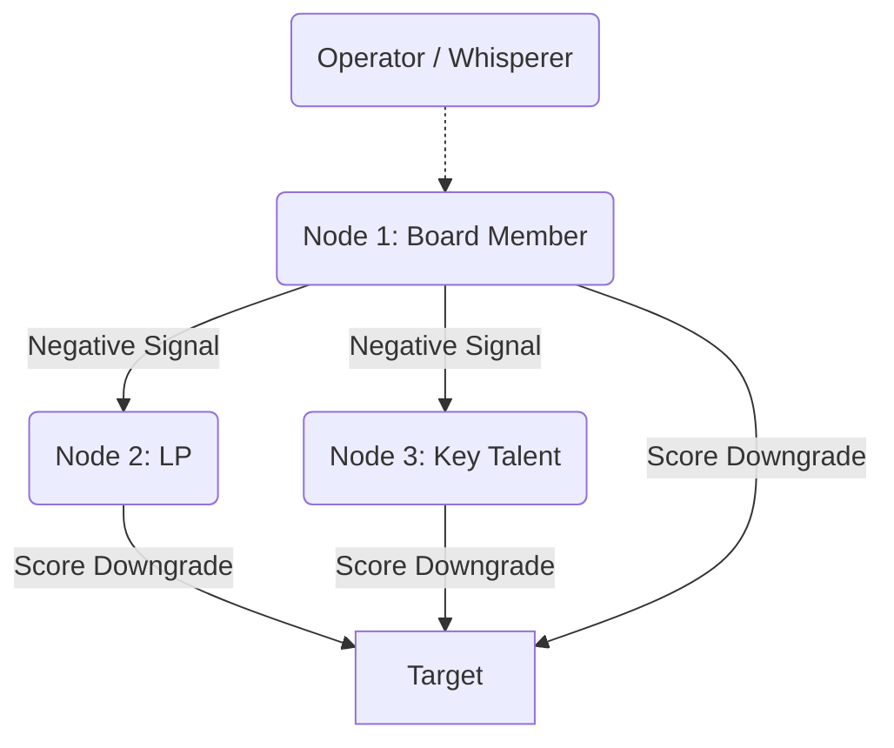
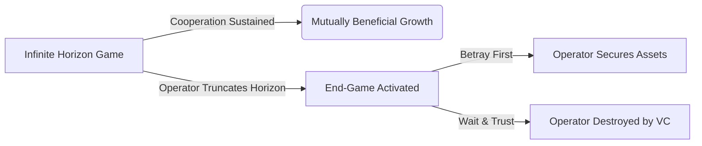
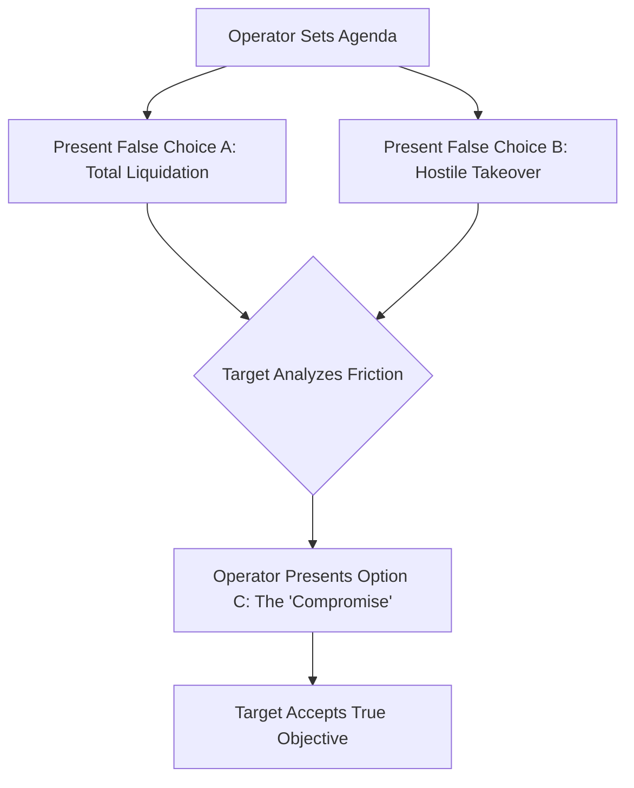
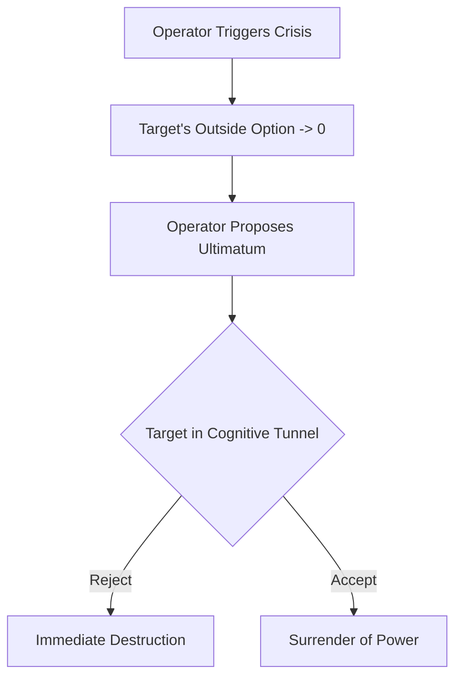
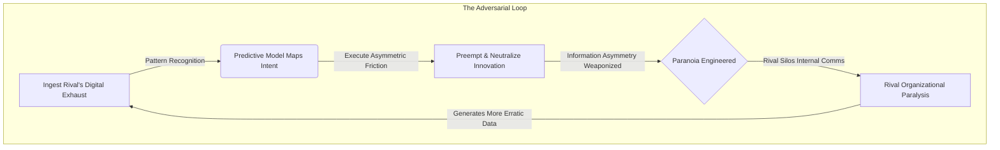

# Book 2: The Operator's Scalpel

# Introduction


You are being hunted, and you do not even realize it.

The invisible architecture of power that governs your life is not a modern invention. It is ancient, embedded deeply into the folds of your cerebral cortex, written in the archaic language of dopamine, cortisol, and survival. You have been taught to believe that civilization is a steady march toward enlightenment, that the brutality of our ancestors has been sanitized by democracy, corporate etiquette, and the rule of law. This is a comforting lie, engineered to keep you docile.

The truth is defined by evolutionary continuity. The fundamental dynamics of dominance and submission have not shifted a millimeter since the Pleistocene epoch. We are still the same apes stalking the savannas, driven by identical neurochemical imperatives to conquer and control. Only the weapons have evolved—from the chieftain’s club, to the emperor’s legions, to the CEO’s algorithms and term sheets. The battlefield has simply migrated from the physical realm to the structural and the psychological.

This is not a theory. For the past fifteen years, I have engineered leverage in the boardrooms of venture capital firms and observed the architecture of control across tech monopolies and political war rooms. In every high-stakes environment, the victors are not the most moral or the most intelligent; they are the ones who understand how to exploit the biological baseline of their opponents.

Look around you. Every corporate hierarchy and digital platform you interact with is meticulously designed to exploit the hardwired vulnerabilities of the human brain. You are caught in a web of asymmetric friction, reacting to stimuli deployed by individuals who understand your biology better than you do. You are anesthetized by intermittent rewards, while unseen architects of power leverage structural and biological forces against you.

This book is not a moral treatise, but it demands an ethical framework. The knowledge contained herein is inherently dual-use, presenting profound moral hazards. Normalizing predatory behavior without boundaries erodes the very social fabric that allows markets and institutions to function. We are here to dissect the anatomy of control primarily as a mechanism of defense. By understanding these dark protocols, you gain the defensive armor required to detect and dismantle the unseen architects attempting to leverage your biology against you. You cannot dismantle a trap you cannot see.

The chapters that follow provide a structured roadmap to these formal mechanisms of control. We will explore the Extensive-Form Game Trees of physiological submission (Chapter 1), graph the Network Severance topology of social ostracism (Chapter 2), map the Weighted Voting calculus of boardroom coalitions (Chapter 3), and dissect the Stochastic Incentive Contracts of the dopamine engine (Chapter 6). You have spent your entire life as the prey, acted upon by unseen forces you were never taught to recognize. The purpose of this text is to hand you the scalpel.

It is up to you whether you remain the patient on the operating table, or become the surgeon.

---

# Chapter 1: The Physiology of Submission


The human brain is a predatory calculation engine, shaped by millions of years on the brutal anvil of the savannah. Its primary function is not the pursuit of truth, but the assessment of power. When an animal encounters a rival, the nervous system instantly processes a lethal geometry: who is larger, who is higher, who controls the space. This is the primal hardware of Dominance, a state enforced by the sheer threat of violence. Under the shadow of dominance, a subordinate’s brain floods with cortisol, the stress hormone, while testosterone plummets. This chemical cocktail paralyzes defiance, forcing the body into a risk-averse, low-power physiological posture. As early hominids evolved, a secondary, more sophisticated system emerged: Prestige. Prestige is power granted willingly by the tribe in exchange for competence and social value. For tens of thousands of years, our egalitarian ancestors utilized reverse dominance hierarchies—using gossip, ostracism, and collective violence to suppress any single alpha who attempted to rule by dominance alone.

Yet, the ancient circuits of dominance and submission were never erased; they were merely buried beneath the thin, rational veneer of the prefrontal cortex. To truly master the anatomy of control is to bypass a target's intellect entirely and speak directly to their endocrine system. True power does not shout. It does not threaten. It engineers an environment where the target’s own biology does the heavy lifting of submission. By manipulating spatial reality and structural leverage, you force a rival into a crushed, high-cortisol state before a single word is ever spoken.

Consider the Ming Dynasty and the construction of the Forbidden City in Beijing. Emperor Yongle did not merely build a palace; he weaponized architecture to manufacture physiological submission on an industrial scale. The entire sprawling complex was a psychological meat grinder designed to strip a visiting ambassador or a rival warlord of their ego long before they reached the throne room. 

A visitor was forced to enter through the Meridian Gate, a structure so unfathomably massive it intentionally dwarfed the human form, triggering a subconscious awareness of total insignificance. Then began the grueling physical march. Across vast, desolate courtyards of jagged stone, up endless tiers of white marble steps, the sheer exertion spiked heart rates and triggered the release of stress hormones. The architecture was aggressively asymmetric—vast, empty voids that offered no cover, making the individual feel perpetually exposed, monitored, and acutely vulnerable. 

By the time the envoy finally crossed the threshold into the Hall of Supreme Harmony, their physiology was in a state of free-fall. They were breathless, their cortisol levels surging, their body language involuntarily collapsing into a hunched, defensive posture. And there, at the apex of the structure, sat the Emperor. He had not walked. He had not expended a single calorie of energy. He sat perfectly still, elevated on a golden throne, bathed in the calculated geometry of the light. He did not need to raise his voice or draw a blade. The stones of the courtyard had already conquered the man. The Emperor’s dominance was absolute because it was embedded in the structure of reality itself.

Today, the physical stones of the Ming Dynasty have been replaced by the invisible architecture of corporate finance. The modern emperor does not force an adversary to march across a marble courtyard; they force them into a meticulously engineered legal and digital structure. 

Imagine you are a tech founder holding a bottleneck resource—a highly sought-after AI protocol—and you are negotiating a term sheet with a powerful, historically arrogant Venture Capitalist. The VC assumes they hold the leverage because they possess the capital. But you are playing a different game entirely. You do not argue about valuation on their terms. Instead, you weaponize the environment. 

You restrict their access to the data room, releasing complex technical diligence documents in fragmented bursts over a holiday weekend. You construct an exploding term sheet with a brutal 48-hour expiration, triggering an artificial scarcity loop in their brain. When the VC finally joins the pivotal Zoom negotiation, they are digitally exhausted and scrambling to synthesize incomplete data. You sit perfectly still, offering zero concessions and letting the silence stretch. Their cortisol spikes. Their fear of missing out overrides their financial discipline. This interaction is not a debate; it is an extensive-form game where your exploding offer acts as a credible commitment device (cf. Schelling). By removing your own ability to yield, you shift the cognitive burden of the looming deadline entirely onto the VC. The VC concedes to a massive valuation with founder-friendly voting rights, not because you out-argued them, but because you induced a state of physiological panic and let the architecture of the deal do the heavy lifting.

Consider a more localized reality: the boardrooms of Yangon's traditional family conglomerates. A patriarch overseeing a sprawling jade and real estate empire does not merely rely on wealth to enforce dominance over junior family members or foreign joint-venture partners; he weaponizes the physical and temporal environment. Meetings are held at his private estate, requiring the foreign executives to navigate brutal Yangon traffic, arriving exhausted and disoriented. They are left waiting in an opulent, air-conditioned anteroom for hours, subtly reminding them that their time is worthless compared to his. When finally admitted, the patriarch is surrounded by an entourage of silent loyalists, while the foreign partner sits alone on a low sofa, physically looking up at him. The terms of the joint venture are dictated not through vigorous debate, but through the crushing weight of the environment itself.



### The Dark Protocol: The Asymmetric Territory Trap

To execute the Asymmetric Territory Trap, you must understand that the negotiation is over before it begins. The objective is to induce a state of physiological vulnerability in your target through environmental and structural control, forcing their biology to betray them. *(Warning: The deliberate impairment of informed consent described in these steps may breach implied duties of good faith and fair dealing in commercial negotiations. Proceed with legal awareness.)*

**Step 1: Digital and Legal Exhaustion**
Never allow a target to enter the arena feeling rested. You must drain their cognitive bandwidth before the negotiation begins. Weaponize the due diligence process. Bury them in disorganized data rooms, enforce brutal 48-hour deadlines for complex reviews, or drop critical legal addendums on Friday evenings. Make them expend vital energy frantically deciphering the structure of the deal, so they have no stamina left to fight you on the terms.

**Step 2: The Structural Elevation**
Design your position to require absolute stillness while forcing them into frantic, reactive motion. In a physical setting, arrange the seating so you are elevated, or place them with their back to an exposed doorway while you face the room. In a financial or operational setting, hold the senior debt or the bottleneck resource while they hold the volatile, high-risk equity. Let them sweat the margins while you occupy the impregnable high ground.

**Step 3: The Silence of the Apex**
When they finally arrive at the point of negotiation, offer them nothing. Do not explain, do not accommodate, and above all, do not fill the silence. Let their surging stress hormones and plummeting testosterone compel them to over-explain, to negotiate against themselves, and to fill the agonizing void with unforced concessions. They will hand you their total submission, wrapped in the comforting illusion of their own choice.

> [!TIP]
> **Recognize and Counter This:** If you recognize you are being funneled into an Asymmetric Territory Trap, immediately break the timeline. Refuse the exploding deadline on principle. State clearly, "I do not make multi-million dollar decisions under artificial time constraints." Step away from the environment, reset your physiology, and force them to re-engage on neutral ground.

---

# Chapter 2: Weaponizing the Anterior Cingulate Cortex


To the primal human, the wilderness was a death sentence. The tribe was the only sanctuary against starvation and predators. Over millions of years, evolution engineered a ruthless enforcement mechanism to ensure individuals did not stray from the collective: pain. The brain did not invent a separate, specialized system to process hurt feelings. Instead, it hijacked the existing circuitry for physical trauma. 

When you break a bone or touch a hot ember, the dorsal anterior cingulate cortex (dACC) flares to life, sounding the alarm of physical injury. When you are ostracized, mocked, or socially isolated, that exact same neural matrix activates. The brain makes no distinction between a fractured femur and a shattered reputation. Social rejection is registered as physical agony. Ostracism is not merely unpleasant; biologically, it is experienced as violence. 

To master power is to understand that the human animal is terrified of the void. If you can control a person’s social oxygen—their inclusion in the group, their access to information, their standing among peers—you hold a leash attached directly to their survival instincts. Weaponizing the anterior cingulate cortex means inflicting agonizing trauma without leaving a single bruise.

The Romans understood the sheer terror of erasure. To kill a rival was a temporary solution; their legacy could become a martyr's rallying cry. True destruction required unmaking them entirely. The Roman Senate institutionalized this absolute annihilation through a practice known as *abolitio nominis*—the erasure of the name.

When the Emperor Caracalla murdered his brother and co-ruler Geta in the year 211 AD, he did not stop at fratricide. He unleashed a systematic, empire-wide purge of Geta’s existence. Geta’s face was chiseled out of family portraits. His name was meticulously scraped from every marble monument and bronze inscription across the Mediterranean. Coins bearing his likeness were melted down. Pronouncing his name became a capital offense. 

Caracalla understood that power is not just the ability to take a life, but the ability to edit reality. By weaponizing the collective silence, he forced the entire Roman Empire to participate in his brother’s continuous erasure. To survive, every citizen had to sever their psychological ties to the fallen rival. This *abolitio nominis* was the ultimate ostracism. It proved that a man could be cast into the wilderness of non-existence while his blood still stained the palace floor.

Today, you cannot scrape a rival's name off a triumphal arch, but the mechanics of erasure remain entirely intact in the corporate theater. The modern freeze-out is a masterpiece of bureaucratic violence, executed without triggering a single HR violation.

When a CEO or a cunning board member decides to neutralize a threat—a brilliant but difficult founder, an ambitious COO—they do not fire them. Firing is messy. It triggers golden parachutes, severance negotiations, and retaliatory lawsuits. Instead, they erase the target structurally. 

The architecture of the company is quietly rearranged. Bylaws are subtly amended. "Special committees" are formed to explore "strategic initiatives," and the target is simply left off the calendar invites. Reporting lines are redrawn under the guise of efficiency, isolating the target from key operators. Through a recapitalization event, voting shares are diluted. 

The target retains their corner office, their impressive title, and their six-figure salary, but their structural power is zeroed out. They have been unmade. They walk the halls, but the information flow bypasses them entirely. Colleagues, sensing the shift in the wind, subconsciously avoid eye contact, not wanting to be associated with the walking dead. This freeze-out is fundamentally a graph theory problem: the target is a node whose edges (connections to information, capital, and influence) are systematically severed by a coordinated coalition. The target's anterior cingulate cortex begins to scream, registering the deep, freezing agony of the modern exile. They are a ghost in an Armani suit, effectively erased from the corporate timeline.



### The Dark Protocol: The Social Asphyxiation Method

To execute a bloodless coup against an entrenched rival, you must sever their social oxygen and let their own biology destroy them. 

**Step 1: Sever the Information Arteries**
Do not openly confront the target. Simply exclude them from the informal economy of power—the meetings before the meetings, the casual drinks where real decisions are made. Ensure that vital operational data is routed around their desk. 

**Step 2: Construct the Invisible Wall**
Subtly signal to the target’s subordinates that their future lies with you, not their direct manager. You do not need to demand loyalty; you only need to demonstrate that you hold the keys to budget approvals and promotions. The subordinates will naturally begin to bypass the target, reporting directly to the new center of gravity. 

**Step 3: Weaponize Paranoia**
As the target realizes they are blind and isolated, their dACC will trigger an evolutionary panic. They will feel the physical pain of the freeze-out. Let the silence stretch. Do not explain, do not argue. The void will breed paranoia. They will begin to see conspiracies where there are none. 

**Step 4: The Self-Inflicted Execution**
Driven by the biological agony of ostracism, the target will behave erratically. They will send unhinged, accusatory emails at 2:00 AM. They will corner colleagues in hallways demanding loyalty. They will publicly lash out in board meetings. Allow them to perform their own instability. Their desperation will alienate whatever remaining allies they have. When they finally break—whether they resign in a furious rage or are terminated for "creating a toxic culture"—the organization will not mourn them. They will exhale in relief. You have not fired a shot; you simply let them suffocate on their own irrelevance.

> [!TIP]
> **Recognize and Counter This:** If you recognize you are the target of Social Asphyxiation, your only viable response is absolute stillness. Do not send the 2:00 AM email. Do not demand loyalty. Document the structural shifts quietly, secure your external network (industry peers outside the firm), and negotiate a lateral exit from a position of calm professionalism. Do not let your anterior cingulate cortex negotiate your severance.

---

# Chapter 3: The Calculus of the Coalition


Power is rarely held by the single strongest ape. It is held by the ape who best understands the mathematics of the troop. In the evolutionary crucible of the Pleistocene, physical dominance was a precarious asset. A massive, solitary alpha could easily be destroyed in his sleep by three weaker, coordinated rivals. Thus, the human brain developed a profound, unconscious aptitude for the calculus of alliances. At its core is Dunbar’s number—the hardwired cognitive limit of roughly 150 stable social relationships. We are biologically constrained, forcing us to prioritize, rank, and categorize every connection. Within this network, the primate brain instinctively tracks "triadic closure": if individual A and individual B share a mutual enemy in C, the gap between A and B biologically demands to be closed. We are not just social animals; we are network architects, constantly scanning the perimeter for leverage, grievances, and the vulnerabilities of the apex. 

This mathematical reality defined the ancient world. In 60 BC, the Roman Republic was not broken by a conquering army, but by a quiet mathematical equation solved in the shadows. Rome was a chaotic matrix of competing factions, paralyzed by an archaic senate that believed its own myths of democratic equilibrium. Julius Caesar, a brilliant but heavily indebted populist, understood that raw popularity was insufficient. Pompey the Great had the military might and the loyalty of the veterans, but lacked the political maneuvering to secure their land. Crassus possessed unimaginable wealth, but harbored a deep, festering resentment that his military achievements were constantly overshadowed by Pompey. 

Individually, they were gridlocked. Together, they were a singularity of power. Caesar orchestrated the First Triumvirate by mapping their mutual deficiencies and exploiting the Senate’s collective arrogance. He did not ask them to be friends; he asked them to be a weapon. By serving as the diplomatic glue—the triadic closure between the hostile Pompey and Crassus—Caesar created an unnatural alliance. They pooled their assets: Crassus's gold, Pompey's swords, and Caesar's legislative ruthlessness. The Senate, convinced of its institutional supremacy, woke up to find the republic had already been stolen from within. The Triumvirate bypassed the Senate entirely, passing laws through the popular assembly by force of arms and sheer financial gravity. They carved the known world into shares, not because they trusted each other, but because the calculus of their combined leverage made any other configuration irrational.

Today, the republic is the corporate hierarchy, and the legions are operational dependencies. The modern founder does not need swords; they need alignment. Consider the anatomy of a bloodless boardroom coup. The target is a toxic, entrenched Board of Directors attempting to oust you from your own post-Series B tech startup. The board possesses the preferred voting shares and the legal authority to terminate you.

A frontal assault—threatening to sue or resigning in protest—is suicide. The board will simply replace you with a compliant operator and lock up your equity. Instead, you perform a silent calculus, applying William Riker's theory of the minimum winning coalition (Riker, 1962). You look to the periphery. The core engineering team is fiercely loyal to your vision and despises the new corporate mandates. The primary cloud vendor, whose proprietary architecture your product relies entirely upon, is a close personal ally. You do not attack the board. You quietly visit the engineering leads with a promise of autonomy, and approach the cloud vendor to structure an exclusive, non-transferrable licensing agreement tied to your continued leadership. You forge an invisible triumvirate of talent and infrastructure. Modeled as a weighted voting game, your new coalition commands a veto over the company's operational viability. When the board meeting arrives, they expect to hand you a severance package. Instead, they are met with a unified, meticulously engineered reality: if they fire you, the entire engineering team walks, and the critical vendor revokes their license, reducing the company’s valuation to zero overnight. The board capitulates, not because they like you, but because the calculus of your combined leverage makes any other configuration irrational.

**Weighted Voting Game (Operational Power vs Equity)**

| Entity | Equity (%) |
| :--- | :---: |
| Board Equity (Legal Power) | 60 |
| Founder Coalition (Ops Veto) | 40 |
*Note: In this dynamic, while the board holds a 60% voting majority, the Founder Coalition's 40% represents a strict operational veto. The minimum winning coalition to sustain value requires both.*

**Failure Mode Analysis:** The primary risk of this maneuver is when the board calls the bluff. If the board accepts a zero-valuation outcome out of spite or legal obligation, you must be prepared to actually detonate the company. If the engineering team folds, your coalition collapses instantly.

### The Dark Protocol: The Iago Protocol (Grievance Weaponization)

The most efficient way to topple an Alpha is not to strike them yourself, but to hand the knife to someone who already stands behind them. This is the Iago Protocol. 

**Step 1: Identify the Number-Two.** Look for the highly capable, ambitious lieutenant who does the actual work while the Alpha takes the credit. This could be a COO, a co-founder, or a chief of staff. They must be highly competent, structurally essential, and secretly starved for recognition.

**Step 2: Stoke the Grievance.** Do not invent a grievance; amplify the one that already exists. Validate their unseen labor. In subtle, private conversations, express shock that they are not compensated appropriately or given the title they deserve. *("It is remarkable how the CEO relies entirely on you for the core strategy. How long do you plan on playing the shadow?")*

**Step 3: Engineer the Friction.** Feed the lieutenant selectively curated information that highlights the Alpha's arrogance or dismissiveness. Plant seeds of paranoia. Let the Alpha's natural narcissism do the rest. When the Alpha inevitably slights the number-two—a stolen idea in a meeting, a dismissed proposal—the lieutenant will interpret it not as a thoughtless oversight, but as calculated, malicious disrespect. 

**Step 4: Arm the Proxy.** Once the lieutenant's resentment turns from passive frustration to active hatred, provide them with the structural means to act. Hand them a back-channel to the board, a competing job offer that forces a catastrophic ultimatum, or the legal framework to defect and poach the core team. You remain a sympathetic, objective observer, while the Alpha is bled out by their most trusted ally.

> [!TIP]
> **Recognize and Counter This:** If you are the Alpha, you must proactively manage the "Number-Two." Publicly and financially reward your lieutenants beyond their expectations. Do not allow a grievance gap to open. If you notice an external party overly sympathizing with your lieutenant, immediately re-align incentives to make the lieutenant's success inextricably bound to your own.

---

# Chapter 4: Indirect Reciprocity and Reputation Assassination


In the ancestral environment, the spear was not the most dangerous weapon. It was the whisper. The human brain evolved a unique mechanism for survival known as *indirect reciprocity*—a complex calculus of reputation tracking. Unlike direct reciprocity, where two individuals trade favors, indirect reciprocity relies on third-party observation. *I help you, so someone else will help me.* It is the invisible currency of trust. Gossip evolved not as idle chatter, but as a ruthless biological imperative to identify free-riders and enforce social cohesion. The neural circuitry that processes reputation is deeply intertwined with the brain's survival centers. To destroy a man's reputation is to trigger a biological death sentence, severing him from the tribe's protection. The master of power understands that they do not need to strike an enemy directly; they only need to manipulate the tribe’s perception, turning the collective into an unwitting executioner.

Nowhere was the weaponization of the whisper perfected with more lethal elegance than in the Byzantine Empire, a state so defined by its labyrinthine politics that its very name became synonymous with intrigue. The Emperor Justinian and his Empress, Theodora, ruled not merely by the sword, but by the rumor. The Byzantine court was a masterpiece of indirect reciprocity subverted for anti-social ends. Rather than confronting powerful generals or ambitious aristocrats head-on—which would risk civil war—Theodora orchestrated meticulous campaigns of reputation assassination. Eunuchs and spies were dispatched to seed carefully calibrated lies into the social bloodstream. A subtle questioning of a general's loyalty here, a fabricated letter of treason there. These whisper campaigns were designed not to be loud, but to be insidious. The target would find themselves increasingly isolated, their allies pulling away to avoid the contagion of disfavor. By the time the formal accusation arrived, the victim was already socially dead, stripped of their power by the silent consensus of the court. The genius of the Byzantine method lay in its deniability; the orchestrator's hands remained perfectly clean while the target’s reputation bled out from a thousand invisible cuts.

Today, the battlefield has migrated from the marble halls of Constantinople to the encrypted channels of Silicon Valley, but the mechanics of the kill remain unchanged. You do not need to out-innovate a rival if you can poison their well. This relies on the formal mechanism of image scoring (Nowak & Sigmund, 1998), where an individual's reputation is a numeric score constantly updated by the network based on observed or rumored behavior. 

Consider your position as a modern tech founder, locked in a brutal race for capital. Your competitor is closing a Series B round that will give them unassailable market dominance. A direct attack is crude and invites retaliation. Instead, you deploy the targeted corporate leak. You identify the nodes in their network most sensitive to risk—the cautious limited partner, the risk-averse board member. Through intermediaries, you plant a single, devastating piece of information: a whispered rumor about their burn rate, a quiet insinuation about an impending SEC inquiry, or a "leaked" internal memo hinting at catastrophic churn. You do not shout it; you let the venture ecosystem's innate paranoia do the work. As the negative signal propagates through the network, the rival's image score plummets across all connected nodes simultaneously. Their term sheet is suddenly pulled. Their talent jumps ship. You have orchestrated their destruction without leaving a single fingerprint on the weapon, leveraging the network's natural immune response to eliminate your rival.

This dynamic is brutally effective in hyper-connected, trust-based ecosystems like the Yangon business community. In Myanmar’s tight-knit commercial elite, where formal legal recourse is often unreliable, reputation is the only currency that matters. Suppose a rising fintech startup threatens the market share of established local banks. The banking tycoons do not launch a direct public attack. Instead, they activate their extensive informal networks—over tea at the Strand Hotel or during private dinners—planting quiet seeds of doubt about the startup’s regulatory compliance and alleged ties to sanctioned entities. Within weeks, the whispers calcify into accepted fact. The startup's international investors panic and pull funding, and local partners sever ties. The banks neutralize the threat effortlessly, their hands perfectly clean, having leveraged the ecosystem's innate risk aversion to execute the kill.



### The Dark Protocol: Self-Inflicted Destruction

The pinnacle of reputation assassination is not the lie you tell about your target, but the lie you convince them to act upon. You must engineer a scenario where their own panicked reaction validates the rumors surrounding them.

**Step 1: Plant the Seed of Paranoia.** Feed a piece of explosive, yet entirely false, information into a channel you know the target monitors. Let them intercept a fabricated plot against them, or a rumor that their most trusted lieutenant is turning state's evidence. The information must threaten their core vulnerability.

**Step 2: Force the Overreaction.** As the target absorbs the false threat, their amygdala hijacks their prefrontal cortex. The anxiety of impending doom strips away their rationality. They will feel an overwhelming compulsion to "get ahead" of the crisis. 

**Step 3: The Public Detonation.** The target, blinded by paranoia, lashes out defensively in a public forum. They fire a loyal executive without cause, send a deranged late-night email to their investors, or issue a preemptive public denial of a scandal nobody else was talking about. 

**Step 4: The Clean Sweep.** Stand back and let the ecosystem react. By attempting to defend themselves against a phantom threat, they have provided undeniable proof of their erratic instability. You did not assassinate their character; you simply handed them the shovel and watched as they dug their own grave. *(Warning: The conduct described here—planting false information to destroy a reputation—constitutes actionable fraud and defamation in all U.S. jurisdictions.)*

> [!TIP]
> **Recognize and Counter This:** If you are the target of a whisper campaign, understand that reacting defensively validates the attack. Never address a rumor directly unless you have absolute, irrefutable proof of its origin. Instead, isolate the nodes propagating the rumor and counter-signal aggressively by demonstrating undeniable operational competence and stability.

---

# Chapter 5: The Mathematics of Treason


In the brutal arithmetic of early human survival, betrayal was not an anomaly; it was a mathematical certainty waiting to be triggered by environmental scarcity. The Pleistocene epoch did not reward the inherently trusting; it rewarded the deeply paranoid and the swiftly ruthless. When two hunter-gatherer bands encountered one another over a fresh kill or a fertile valley, they entered the primal iteration of the Prisoner's Dilemma. The math was violently simple: cooperate and risk being slaughtered if the other betrayed, or betray first and guarantee survival. In a zero-sum environment where one tribe's feast meant another's starvation, the optimal strategy for ensuring genetic continuation was never blind trust. It was the calculated strike. The human brain evolved to constantly weigh the probabilities of cooperation against the lucrative, bloody dividends of a sudden, lethal betrayal. Those who mastered this dark calculus lived. Those who assumed good faith became footnotes in the dust.

As human networks scaled from tribes to empires, this calculus evolved from crude violence into the refined art of the treaty—the formalized lie. In the chaotic, shifting alliances of Renaissance Italy, Niccolò Machiavelli observed the fundamental truth of the political chessboard: treaties are merely pauses in hostilities, documents signed by men waiting for the optimal moment to break them. Consider Cesare Borgia at Sinigaglia. Surrounded by mercenary captains who had recently conspired against him, Borgia did not seek true reconciliation, nor did he allow his grievance to simmer into open warfare. He offered them a grand, forgiving treaty. He invited them to a feast of celebration, lulling their mathematical vigilance with the warmth of apparent non-zero-sum cooperation. When they arrived, disarmed and bloated with a false sense of security, he had them strangled. Borgia understood the core tenet of the Iterated Prisoner's Dilemma: if the game is going to end, or if a catastrophic betrayal is inevitable, the only logical move is to betray first, and betray with such totality that the opponent cannot play another round.

Today, the battlefield is no longer a blood-soaked dining hall in the Romagna, but the immaculate, glass-walled conference rooms of Sand Hill Road. The modern mercenary captain wears a Patagonia vest and wields a cap table. Imagine the scenario: your lead venture capitalist, sensing weakness in a down market, begins quietly maneuvering to dilute your shares, invoke punitive liquidation preferences, and orchestrate a hostile boardroom takeover. The amateur founder appeals to the VC’s sense of partnership, begging for a fair, non-zero-sum resolution, clinging to the naive belief in the "founder-friendly" marketing brochure. You, however, understand the mathematics of treason. Drawing on Axelrod (1984) and the Folk Theorem, you know that cooperation only sustains when the shadow of the future is long. The operator's true skill lies in manipulating the *perceived horizon* of the game. You do not wait for the board meeting where the knife is slipped between your ribs. You become the predator. You weaponize your proprietary access. Before the VC can rally the independent board members, you silently execute a hard fork of the intellectual property, transferring core, unpatented algorithms to a newly incorporated shell entity under your sole control—an entity the VC has no claim to. *(Legal Note: This maneuver requires precise, pre-existing legal architecture; hard forking company IP to a personal shell entity without it is a catastrophic breach of fiduciary duty.)* You leak meticulously documented evidence of the VC’s fiduciary mismanagement to a rival fund, crippling their ability to raise their next vehicle. You do not merely resist the takeover; you structurally obliterate their leverage. When the board meeting finally arrives, you do not argue. You present them with a finalized term sheet from their most hated rival, contingent on their immediate, heavily discounted buyout, or you walk out the door, leaving them with an empty husk of a company and a burning reputation. You strike first, and you strike with fatal precision.

Consider the volatile cross-border trade in border hubs like Myawaddy or Muse. A regional logistics operator and a foreign manufacturing partner enter a lucrative joint venture, relying heavily on informal agreements due to fluctuating regulatory frameworks. The local operator, sensing an impending shift in border policies that would disadvantage the foreign partner, understands the horizon of cooperation has truncated. They do not seek to renegotiate or warn their partner. Instead, they preemptively decapitate the foreign firm's leverage. Overnight, the local operator physically re-routes all key transport fleets to a separate entity under their brother's name and leverages local bureaucratic connections to freeze the foreign partner's import licenses. When the policy shift is announced, the foreign partner realizes they have no assets, no legal standing, and no operational capacity. They are forced to sell their remaining stake to the local operator for pennies on the dollar. The local operator struck first, recognizing that in a zero-sum environment, the first mover writes the history.



### The Dark Protocol: Preemptive Decapitation

When the mathematics of a relationship shift into a zero-sum death spiral, hesitation is suicide. If you must betray, or if you suspect betrayal is imminent, you cannot afford a half-measure. A wounded enemy is a localized insurgency waiting to destroy you. 

**Preemptive Decapitation** requires that when you strike, you guarantee the target is left with absolutely zero retaliatory capability. This is not about winning an argument; it is about permanently removing a piece from the board. 

1.  **The Illusion of Stasis:** Do not signal your intent. Increase your apparent cooperation just before the strike. Agree to minor concessions to lower the target's threat-detection threshold. 
2.  **Sever the Arteries:** Identify the target's primary sources of power—their capital, their reputation, their key allies. Your strike must target all three simultaneously. 
3.  **The Fatal Blow:** Bankrupt them legally or financially, exile them from the industry ecosystem, and incinerate their reputation so thoroughly that no future ally will ever trust them.
4.  **No Quarter:** Offer no mercy, no settlements, and no path to redemption. The goal is not merely to win, but to make the cost of ever having opposed you an existential terror. Leave nothing but ash.

> [!TIP]
> **Recognize and Counter This:** If you notice your counterpart taking actions that suggest they believe the relationship is nearing its end-game (e.g., hoarding information, accelerating timelines inexplicably, forming parallel structures), assume a strike is imminent. You must immediately force an open confrontation to reset the perceived horizon or preemptively secure your own core assets.

---

# Chapter 6: The Dopamine Engine


Deep within the midbrain, nestled in the ventral tegmental area, lies the architecture of desire. The mesolimbic pathway does not exist to reward you for arriving at a destination; it exists to compel you to seek it. This is the neurochemical engine of dopamine. It is not the molecule of pleasure, but the molecule of anticipation, craving, and pursuit. In the Pleistocene epoch, early hominids did not find sustenance on a predictable schedule. The primal hunt was an exercise in starvation punctuated by sudden, glorious windfalls. The brain evolved to prioritize the unpredictable. When a reward is guaranteed, the dopaminergic response flatlines. But when a reward is uncertain—when it is delivered on a variable-ratio reinforcement schedule—dopamine spikes to dizzying heights. The hunt becomes an obsession. The uncertainty is the hook.

For millennia, this neurological vulnerability was exploited instinctively by those who understood the raw mechanics of power. The most terrifying despots did not rule through constant terror, nor did they rule through constant benevolence. They ruled through radical unpredictability. An emperor who is consistently cruel will eventually breed a rebellion born of sheer necessity. An emperor who is consistently kind will breed complacency, entitlement, and eventual contempt. But an emperor who alternates between extravagant favor and sudden, freezing disdain creates a court of addicts. Consider the absolute monarch who elevates a low-born courtier, showering him with titles, gold, and whispered confidences. The courtier’s brain becomes saturated with the narcotic of the sovereign’s approval. Then, without warning, the emperor turns his back. He ignores the courtier at the banquet. He redirects his warmth to a rival. The courtier is plunged into sudden withdrawal. He will abase himself, beggar his family, and betray his friends just to experience one more hit of the emperor’s smile. The unpredictability does not just secure loyalty; it manufactures a fanaticism indistinguishable from a trauma bond.

Today, the architecture of the court has been replaced by the architecture of the corporation, but the human animal remains tethered to the same primal leash. You are no longer the subject hoping for a glance from the throne. You are the architect of the environment. You are the predator. 

Consider the brilliant, temperamental Chief Technology Officer—the genius whose code is the lifeblood of your enterprise, but whose flighty, arrogant nature makes him a constant flight risk. You do not manage such a creature with steady salaries, predictable bonuses, or consistent praise. You manage him by weaponizing his neurochemistry. 

In the beginning, you saturate his receptors. You isolate him in your office late at night, pour the rare scotch, and tell him that he is the only one who truly understands the vision, the only peer you have ever found. You fund his esoteric side-projects. You make him feel like a god. You establish a baseline of intense, intoxicating validation.

And then, precisely when he expects it most, you cut the supply. 

You cancel your one-on-one meetings without explanation. You stare blankly at his latest, brilliant deployment and offer a terse, "It's fine, but the latency is unacceptable," before turning your attention to a junior developer. You do not shout. You do not threaten to fire him. You simply replace the warmth with an icy, unpredictable void. The resulting cognitive dissonance will plunge him into a dopaminergic free-fall. His pride will demand that he hate you, but his mesolimbic pathway will demand that he win you back. He will work eighty-hour weeks. He will scrap his elegant architecture for something dirtier, faster, just to elicit a flicker of your former approval. When he brings you the impossible result, exhausted and desperate, you smile. You pour the scotch. You give him the hit. 

You have not just managed an employee. You have engineered a behavioral loop that will extract every ounce of his genius until there is nothing left. 

### The Dark Protocol: The Dopaminergic Leash

To execute the Dopaminergic Leash, you must master the calculus of withdrawal, modeling the intermittent reward as a stochastic incentive contract using expected utility. Predictability is your enemy; the variable-ratio reward is your supreme weapon.

```mermaid
flowchart TD
    subgraph Stochastic Incentive Contract (The Affective Starvation Loop)
        S1[Step 1: The Saturation Phase] -->|Establish High Baseline| S2[Step 2: Abrupt Withdrawal]
        S2 -->|Trigger Reward Prediction Error| S3[Step 3: The Scramble]
        S3 -->|Target Displays Frantic Appeasement| S4[Step 4: The Intermittent Reward]
        S4 -->|Relief / Trauma Bond Reinforced| S2
    end
```

**Step 1: The Saturation Phase** 
Identify the target's core insecurity—whether it is a need for intellectual validation, social status, or parental approval. Flood that insecurity with overwhelming, unearned validation. Become the sole source of their highest highs. Establish an intense emotional baseline that they will subconsciously define as the new normal.

**Step 2: The Abrupt Withdrawal** 
Once the target is comfortable and expectant, sever the connection. The withdrawal must be sudden, unexplained, and emotionally cold. Do not show anger; anger indicates that you care. Show absolute, chilling indifference. Shift your attention to someone they view as inferior. This triggers the Reward Prediction Error in their brain—a massive drop in dopamine that registers as a psychological crisis.

**Step 3: The Scramble** 
Observe the target's frantic appeasement behavior. They will work harder, lower their boundaries, and compromise their own dignity to bridge the gap you have created. They will rationalize your abuse, blaming themselves for your sudden coldness. Let them sweat. Let the desperation steep. Do not intervene while they are producing output at a frenetic pace. 

**Step 4: The Intermittent Reward** 
When the target has exhausted themselves and delivered exactly what you require, grant them a fraction of the original warmth. A brief smile. A quiet nod. A return of the old camaraderie. The rush of relief will flood their brain, reinforcing the trauma bond. From this point forward, they will not work for the salary or the equity; they will work for the unpredictable, intoxicating drip of your approval. They are now on the leash. *(Clinical Context: Targets of sustained intermittent reinforcement of this magnitude develop symptoms consistent with complex PTSD, experiencing severe dysregulation and long-term psychological harm.)*

> [!TIP]
> **Recognize and Counter This:** If you find yourself obsessing over a superior's approval to an unhealthy degree, track their validation patterns. If they are employing variable-ratio reinforcement (idealize, devalue, intermittent reward), you must emotionally decouple. Re-establish your baseline of self-worth outside their ecosystem and strictly limit your interactions to transactional, verifiable metrics.

---

# Chapter 7: Unequal Tug-of-War & Choice Architecture


The human brain is an engine of ruthless metabolic efficiency. Consuming roughly twenty percent of the body’s caloric burn while occupying only two percent of its mass, it is perpetually on the precipice of energetic bankruptcy. To survive the brutal scarcity of the ancestral environment, evolution hardwired us with a profound, subconscious aversion to cognitive friction. Thinking, deciding, and resisting are metabolically expensive. The path of least resistance is not merely a psychological preference; it is a biological imperative. Because of this, humans are extraordinarily vulnerable to the manipulation of defaults. When presented with an environment where one option requires zero effort and another requires sustained cognitive or physical exertion, the brain will almost universally default to the frictionless path. We mistake the absence of friction for the presence of truth, and we interpret the default option as the safest choice. The primal human is governed not by the illusion of free will, but by the silent architecture of their environment. Power, therefore, does not require a spear. It only requires the ability to dictate the physical and cognitive terrain, making obedience effortless and defiance exhausting.

Long before behavioral economists gave a name to choice architecture, despots and empire builders mastered its application through structural and logistical bottlenecks. To control a sprawling, volatile populace, the most sophisticated rulers did not rely solely on the sword. Blunt force is expensive, bloody, and breeds martyrs. Instead, they designed systems where rebellion was theoretically possible but practically insurmountable. Consider the Byzantine bureaucracy or the tribute networks of antiquity. The architecture of the empire was engineered to create profound asymmetric friction. Submitting to the Emperor’s taxation and laws was a greased chute—the roads were paved, the courts functioned, and compliance required merely going about one's daily life. Resistance, however, was a labyrinth. To launch a rebellion, a provincial governor had to independently secure supply lines, forge parallel currencies, navigate hostile geography without imperial maps, and convince others to abandon the safety of the default state. The Emperor did not have to actively fight every dissident; he simply made the logistics of dissent so exhausting that potential rivals defeated themselves before drawing a blade. The choice was always theirs, but the environment was rigged so heavily that submission felt like the only rational decision.

Today, this same principle is the invisible dark matter of the digital economy, and as a platform architect, it is your most lethal weapon. You no longer build stone walls; you build ecosystems. When you target a massive enterprise client, your initial approach is aggressively frictionless. You offer seamless integration. Your engineers handle the data migration for free. The APIs auto-configure, the dashboards are beautiful, and the onboarding process feels like a miracle of modern efficiency. You invite them into a walled garden where the temperature is perfect and the fruit hangs low. 

But the architecture is a trap. Once their core operations are entangled with your software, the asymmetric friction activates. They are, of course, legally "free" to leave at any time. Yet when they attempt to migrate away, they discover that the export functions are buried beneath layers of obfuscated UI. The data structures are proprietary, formatting as incomprehensible gibberish on a competitor's system. Tearing your platform out of their stack would require millions of dollars in downtime, retraining, and systemic risk. You do not lock them in with an ironclad contract; you lock them in with cognitive and operational exhaustion. They look at the sheer, terrifying cliff-face of migrating away, and their executive team sighs, choosing to swallow your fifteen percent year-over-year price hike. You have weaponized the path of least resistance, turning their own operational lethargy into your recurring revenue.

*(Note: In enterprise software, this friction is highly quantifiable. Enterprise switching costs typically range from 3-7x the annual contract value, locking clients in through pure logistical inertia.)*

### The Dark Protocol: The Unequal Tug-of-War

To exploit asymmetric friction in an organizational or legal setting, you do not need to win an argument; you simply need to make the process of arguing metabolically and financially ruinous for your opponent. 

**Step 1: Weaponize Compliance**
Bury the target in procedural requirements. Demand exhaustive documentation, require multiple layers of approval for standard operations, and enforce rigid adherence to obscure bylaws. 

**Step 2: The Infinite Delay**
When they attempt to resolve the issue, utilize strategic incompetence. Miss deadlines by a single day, send incomplete responses that necessitate further clarification, and route their requests through endlessly rotating mid-level bureaucrats. 

**Step 3: The Attrition Surrender**
The goal is not to formally deny them their rights or objectives, but to make the friction of obtaining them so high that they voluntarily abandon the pursuit. They will eventually settle for deeply unfavorable terms simply to stop the bureaucratic bleeding.

> [!TIP]
> **Recognize and Counter This:** If you realize you are engaged in an Unequal Tug-of-War, immediately stop playing by the adversary's procedural rules. Elevate the conflict to a higher authority, threaten public exposure, or utilize legal mechanisms to impose strict, non-negotiable deadlines. Document every instance of coercive control, bullying, and artificial delay to build a case for bad faith negotiation.

### The Dark Protocol: The Hobson’s Trap (Defaults as Destiny)

To master choice architecture is to realize that humans do not want freedom; they want the illusion of freedom without the burden of deliberation. Drawing on McKelvey's chaos theorem, The Hobson’s Trap can be formally modeled as a sequential agenda-setting game. You do not force your target to accept your preferred outcome. Instead, you dictate the order and nature of the choices, boxing them in by manufactured extremes and forcing them to beg you for the exact chains you always intended to place upon them.



When negotiating a pivotal deal or seeking to impose a draconian policy, never present your true objective as the primary option. Doing so invites scrutiny, counter-offers, and resistance. Instead, architect a false dilemma. Present two horrific, mutually destructive alternatives. Option A must be an operational nightmare—perhaps a catastrophic liquidation, a brutal public legal battle, or an immediate cessation of vital services. Option B must be equally unpalatable—a humiliating surrender, a total loss of equity, or regulatory ruin. 

Allow the target to agonize over these catastrophic paths. Let the cognitive friction and the panic of the double-bind exhaust their mental reserves. As they desperately thrash against the walls of the trap, you silently watch. Only when they are at the breaking point do you "reluctantly" introduce Option C—your true objective. It will still be costly, and it will still strip them of leverage, but compared to the artificially manufactured horrors of A and B, it will look like salvation. They will not just accept your terms; they will thank you for them. By controlling the architecture of their choices, you transform your extortion into their deliverance.

> [!TIP]
> **Recognize and Counter This:** When presented with terrible binary choices (A or B), immediately recognize that the agenda has been rigged. Do not choose. Attack the framing itself. Force the introduction of external options or change the timeline. Never negotiate within a paradigm designed entirely by your adversary.

---

# Chapter 8: Supernormal Stimuli and the Attention Hijack


The human brain evolved in an environment of brutal scarcity. Survival depended on hyper-vigilance toward high-value signals: the sudden flash of a predator's movement, the vivid hue of a ripe, calorie-dense fruit, the visceral shock of violence. When the ancestral brain detected these things, it did not pause for rational deliberation. It immediately hijacked the body’s attentional resources, flooding the nervous system with adrenaline and dopamine to force immediate action. Ethologists call the artificial exploitation of this mechanism a "supernormal stimulus." Present a bird with a synthetic egg that is larger and brighter than its own, and it will abandon its actual offspring to sit on the fake. The animal cannot help itself; its hardwiring commands it to prioritize the extreme over the natural. In humans, this cognitive vulnerability remains entirely intact. When presented with an exaggerated, hyper-salient version of reality, the prefrontal cortex—the seat of logic and restraint—is bypassed. Attention is captured, and the mind is enslaved by the brightest, loudest, or most terrifying object in the room.

To control a restless population, one must simply control their focus, flooding their senses with stimuli so overwhelming that nuanced thought becomes impossible. The architects of Rome understood this deeply. As the Republic crumbled and the Empire rose, the populace grew dangerously idle and politically volatile. Rather than reasoning with the mob or addressing the structural rot, the Emperors deployed the first mass-scale supernormal stimuli: the Games. *Panem et circenses*—bread and circuses—was not mere charity; it was a neurochemical weapon. When discontent murmured in the streets, the Emperor opened the Colosseum. He delivered not just food, but unimaginable spectacle: rivers of blood, exotic beasts imported from the edges of the world, and brutal, high-stakes combat. The sheer scale and intensity of the violence triggered the primal survival circuits of eighty thousand screaming spectators at once. Their political grievances dissolved, washed away by a torrential flood of adrenaline. The Emperor became the sole provider of both their sustenance and their psychological stimulation. By owning their attention, he owned their reality.

Today, you do not need an arena of stone to execute this hijacking; you need only the glowing glass in the palm of their hands. As a modern architect of power, you recognize that the algorithms governing human interaction are built to prioritize the digital equivalent of blood in the sand: outrage, tribal division, and existential threat. You do not compete with a rival on the merits of your product or the strength of your balance sheet. When a competitor begins to capture your market share, you do not engage in a price war. Instead, you manufacture a localized crisis. You quietly seed a narrative—an ambiguous labor practice, a polarizing political stance, a supply chain vulnerability—and feed it into the algorithmic machinery designed to amplify moral panic. You flood the ecosystem with the supernormal stimulus of righteous indignation.

The public, hardwired to react to social threats, locks onto the controversy. The attention hijack is instantaneous. Your rival is suddenly engulfed in a firestorm, forced into a reactive crouch. They issue frantic apologies, fire executives, and drain their capital fighting a ghost you created. Their board panics; their prefrontal cortex shuts down under the crushing weight of public scrutiny. This is the moment you strike. You do not gloat. You step into the wreckage as the calm, stabilizing force. You offer the market a safe harbor, a clean alternative untainted by the chaos. You orchestrated the storm, yet you are the one selling the umbrellas. 

### The Dark Protocol: Induced Cognitive Tunneling

To weaponize attention and break a target’s psychological defenses, you must force them into a state of "cognitive tunneling"—a psychological phenomenon where acute stress causes the brain to focus exclusively on the immediate threat, blinding it to the broader context and all peripheral solutions.

**1. The Incubation of Threat**
Identify an area where your target is heavily leveraged or reputationally exposed. It does not require a genuine scandal; it only requires the *implication* of a systemic failure. The threat must trigger primal social fears: ostracism, financial ruin, or physical danger. 

**2. The Injection of the Supernormal Stimulus**
Deploy the crisis publicly, utilizing the mechanics of viral escalation. Use proxy voices to amplify the threat, ensuring it appears organic and overwhelming. The goal is to make the crisis appear exponentially larger and more immediate than it actually is. Overload their sensory inputs with negative feedback, plummeting metrics, and coordinated outrage.

**3. The Constriction of Options**
As the target’s cortisol levels spike, their ability to process complex information degrades. They will stop looking for strategic maneuvers and begin searching desperately for an immediate escape hatch. Their vision narrows. They will ignore their advisors and make rash, impulsive decisions to stop the bleeding, invariably damaging their own position further.

**4. The Savior’s Entry**
Once the target is fully trapped in the cognitive tunnel, exhausted and stripped of their leverage, you introduce yourself as the solution. You offer the escape hatch: an acquisition at a fraction of their prior valuation, a punitive settlement, or a total surrender of market territory. Because they are blinded by panic, they will not see you as the architect of their destruction. They will see you only as their salvation, eagerly signing away their power just to make the pain stop.

This maneuver models exactly as an asymmetric information ultimatum game, where the proposer has successfully manipulated the responder's outside option to zero.



> [!TIP]
> **Recognize and Counter This:** If you find your options suddenly and artificially constricted during a crisis, assume you are being funneled. Before accepting a "savior's" ultimatum, you must forcefully widen your cognitive aperture. Bring in an outside advisor who is completely unaffected by the localized panic to evaluate the true state of your outside options.

---

# Chapter 9: Predictive Neutralization (The Silent Panopticon)


The human brain is, at its core, a ruthless prediction engine. The neocortex did not evolve to perceive reality objectively; it evolved to probabilistically anticipate the immediate future based on historical patterns. Survival in the ancestral environment heavily favored the organism that could sense the subtle drop in barometric pressure before the monsoon, or the flattening of tall grass before the predator struck. Uncertainty was biologically expensive; anticipation was life. To know the future is the oldest, most primal imperative. But to weaponize that prediction—to not just anticipate the enemy, but to engineer their starvation before they even realize they are hungry—is the ultimate evolutionary apex. Dominance is no longer about reacting to threats. True, absolute power lies in quietly assassinating the timeline in which the threat ever existed.

For centuries, the aspiration of absolute foresight manifested through blunt force and visible surveillance. The archaic empires and secret police states—from the Praetorian Guard to the East German Stasi—relied on the psychology of the Panopticon. They erected literal and metaphorical watchtowers, creating a state of permanent visibility. The subjects behaved because they *might* be watched. But this system possessed a fatal vulnerability: the architecture of control was explicitly physical. The subjects knew they were prisoners. The friction of constant observation bred a collective paranoia that inevitably curdled into rebellion. The tyrant had to expend immense, unsustainable energy violently suppressing the futures they feared. It was an inefficient, bloody mathematics of coercion.

You do not build watchtowers. You are not a warden relying on the crude tool of fear. You are the architect of a digital ecosystem where the inmates pay for the privilege of building their own cells. The modern Panopticon is inverted and entirely silent. Your users, your competitors, and your targets do not fear being watched; they enthusiastically demand it, bleeding their neuroses, desires, and supply-chain logistics into your data lakes under the guise of convenience and connectivity.

As a sovereign of this landscape, you do not wait for a rival to announce their intentions. You do not rely on industry rumors or clumsy corporate espionage. When a competing tech firm is quietly gearing up to launch a disruptive product that threatens your market share, you ingest their digital exhaust. You track the sudden, localized spike in their compute usage. You observe the anomalous recruitment patterns as they aggressively poach a hyper-specific class of machine-learning engineers. You monitor the obscure, third-party API calls originating from their staging environments and the subtle, seemingly disconnected shifts in their corporate expenditure. 

Long before their CEO drafts a press release, you have already mapped the DNA of their initiative. You do not react; you preemptively sterilize the environment. You quietly acquire the exclusive rights to the crucial third-party dataset their new model relies on. You leverage your capital to strangle their hardware supply chain. And then, you launch a heavily subsidized, superior version of their core feature within your own ecosystem three weeks before their targeted launch date, turning their defining innovation into a commoditized afterthought. When they finally reveal their product to the world, they are screaming into a vacuum. You have not just defeated them in the marketplace; you have eradicated the reality in which they could even compete. They die without ever seeing the blade, utterly convinced that the market simply evolved away from them.

### The Dark Protocol: Paranoia Engineering

To neutralize a rival completely, you must weaponize the very concept of information asymmetry. When you possess total predictive dominance, your most terrifying weapon is not always what you do with the data, but how you let the target *feel* its weight. You do not just want them beaten; you want them psychologically paralyzed. This is the essence of a formal preemption game, leveraging a lethal first-mover advantage to destroy the opponent before they can even enter the arena.

The execution must be clinical and devoid of emotion. In a casual negotiation, a brief email, or a seemingly innocuous encounter, you drop a piece of highly specific, wildly disproportionate knowledge. Comment on the exact valuation they discussed in a closed-door board meeting the night before. Compliment the specific phrasing of a confidential internal memo they circulated only to their core executive team that morning. 

Do not elaborate. Do not gloat. Make absolutely no explicit threat. Simply let the fact hang in the air, a chilling artifact of your omniscience, before moving on to mundane matters.

The human brain, wired by millions of years of evolution to fear the unseen predator, will immediately short-circuit. They will tear apart their own organization looking for the leak. They will fire their most trusted lieutenants. They will silo their operations, locking down their own internal communications until the friction paralyzes their ability to execute. They will assume you have human spies everywhere, breathing down their necks. They will never realize that they are their own spy, and that their digital footprint is a glowing beacon visible only to you. By feeding them a single drop of your omniscience, you force them to consume themselves.

> [!TIP]
> **Recognize and Counter This:** If a rival drops a piece of "impossible" knowledge about your operations, do not panic and do not search for a mole. Assume your digital exhaust is being modeled. Immediately introduce noise into your system. Generate false signals, use decoy APIs, and run dummy compute loads. If you cannot blind the Panopticon, you must overwhelm it with conflicting data.



---

# Conclusion: The Final Apex


We began this journey on the sun-baked dust of the Pleistocene savannah, where power was measured in bone density and the sheer, physical terror of the alpha primate. We traced the evolution of dominance as it scaled into the marble courts of empires, where the whisper replaced the spear, and architecture was weaponized to shatter the human ego. We watched as the blunt force of the sovereign was refined into the sterile, bloodless violence of the modern corporate boardroom, where term sheets and cap tables function as the new mechanisms of absolute control. Finally, we arrived at the silent Panopticon of the algorithmic age—an era where power is no longer about reacting to threats, but about predicting and eradicating them before they are even conceived.

The weapons have evolved. The battlefield has digitized. But the biological hardware of the human animal has not changed a single degree. We remain primate creatures driven by cortisol and dopamine, terrified of ostracism, obsessed with status, and deeply vulnerable to the manipulation of our own neurochemistry. 

The mechanisms detailed in this book—the physiological traps, the reputation assassinations, the dopaminergic leashes, and the asymmetric choice architectures—are not theoretical concepts. They are the actual physics of human hierarchy. They are happening to you every time you open a social media feed, every time you negotiate a contract, and every time you walk into a performance review. The only question that remains is your position on the chessboard. Are you the subject of the experiment, or are you the architect?

But a final warning must be issued. To wield the tools of absolute control is to accept the burden of absolute isolation. When you understand the underlying mathematics of human interaction, you can no longer experience the luxury of naive trust. Every conversation becomes a calculation. Every relationship becomes a vector of leverage. The Panopticon you build to monitor your rivals will inevitably imprison you as well, for you must remain eternally vigilant, standing watch over the empire you have ruthlessly engineered.

The anatomy of control is a heavy, terrible knowledge. You now hold the scalpel. Use it with surgical precision, strike without hesitation, and never forget that the void you stare into is staring right back.

---

# Bibliography

- Axelrod, R. (1984). *The Evolution of Cooperation*. Basic Books.
- Dunbar, R. I. M. (1992). *Neocortex size as a constraint on group size in primates*. Journal of Human Evolution, 22(6), 469-493.
- Foucault, M. (1975). *Discipline and Punish: The Birth of the Prison*. Éditions Gallimard.
- Machiavelli, N. (1532). *The Prince*. Antonio Blado d'Asola.
- McKelvey, R. D. (1976). *Intransitivities in multidimensional voting models and some implications for agenda control*. Journal of Economic Theory, 12(3), 472-482.
- Nowak, M. A., & Sigmund, K. (1998). *Evolution of indirect reciprocity by image scoring*. Nature, 393(6685), 573-577.
- Riker, W. H. (1962). *The Theory of Political Coalitions*. Yale University Press.
- Schelling, T. C. (1960). *The Strategy of Conflict*. Harvard University Press.