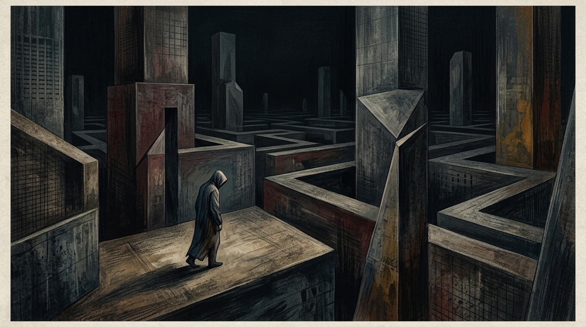
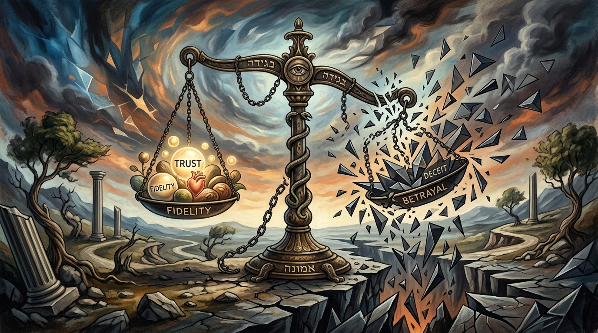

# စာအုပ် ၂ - လုပ်ဆောင်သူ၏ ခွဲစိတ်ဓား

# နိဒါန်း

ဤ V4.1 မူသည် Book 2 ကို "အသုံးချရန် ခွဲစိတ်ဓား" အဖြစ်မဟုတ်ဘဲ "အလွဲသုံးစားမှုကို ကြိုတင်သိနိုင်ရန် ခွဲစိတ်မီးအိမ်" အဖြစ် ပြန်လည်ဖွဲ့ထားသည်။ စာအုပ်၏ အဓိကတန်ဖိုးမှာ အဖွဲ့အစည်းများ၊ တည်ထောင်သူများ၊ မန်နေဂျာများနှင့် စာဖတ်သူများက အာဏာအလွဲသုံးစားမှုပုံစံများကို စောစောသိမြင်နိုင်ခြင်း၊ မှတ်တမ်းတင်နိုင်ခြင်း၊ တရားဝင်နှင့် ကျင့်ဝတ်ဆိုင်ရာ နည်းလမ်းများဖြင့် ကာကွယ်နိုင်ခြင်း ဖြစ်သည်။

ဤစာအုပ်တွင် ဖော်ပြထားသော ဇီဝကမ္မဗေဒ၊ ဂုဏ်သတင်း၊ ဆုလာဘ်လမ်းကြောင်း ယန္တရားများ၊ ရွေးချယ်မှုတည်ဆောက်ပုံများနှင့် ဒေတာအချိုးမညီမှုများသည် လူမှုရေးနှင့် ကော်ပိုရိတ်စနစ်များအတွင်း အန္တရာယ်ဖြစ်စေနိုင်သော အင်အားများဖြစ်သည်။ ထို့ကြောင့် ဤမူက ၎င်းတို့ကို လုပ်နည်းအဖြစ်မဟုတ်ဘဲ red-team checklist၊ governance review နှင့် self-defense literacy အဖြစ် ဖတ်ရန် ဖိတ်ခေါ်သည်။

အောက်ပါအခန်းများတွင် "တိုက်ခိုက်သူ" ဟူသော အသုံးအနှုန်းကို တွေ့ရပါက ၎င်းသည် စာဖတ်သူကို လုပ်ဆောင်ရန် ညွှန်ကြားခြင်းမဟုတ်ပါ။ ၎င်းသည် အန္တရာယ်ပုံစံကို သတ်မှတ်ရန် အသုံးပြုထားသော threat-model role ဖြစ်သည်။ စာဖတ်သူ၏ လုပ်ငန်းတာဝန်မှာ ထိုပုံစံများကို လေ့လာပြီး အဖွဲ့အစည်းအတွင်း ပွင့်လင်းမှု၊ တာဝန်ခံမှု၊ တရားမျှတသော ဆုံးဖြတ်ချက်လုပ်ငန်းစဉ်နှင့် လူ့ဂုဏ်သိက္ခာကို ကာကွယ်ရန် ဖြစ်သည်။

# အခန်း ၁ - လက်အောက်ခံမှု၏ ဇီဝကမ္မဗေဒ

လူသားဦးနှောက်သည် ဆာဗားနား၏ ရက်စက်ကြမ်းကြုတ်သော ပန်းပဲဖိုပေါ်တွင် နှစ်သန်းပေါင်းများစွာ ပုံသွင်းခံထားရသည့် သားကောင်ဖမ်းသော တွက်ချက်မှုအင်ဂျင် (predatory calculation engine) တစ်ခု ဖြစ်သည်။ ၎င်း၏ အဓိက လုပ်ဆောင်ချက်သည် အမှန်တရားကို ရှာဖွေရန် မဟုတ်ဘဲ၊ အာဏာကို အကဲဖြတ်ရန် ဖြစ်သည်။ တိရစ္ဆာန်တစ်ကောင်သည် ပြိုင်ဘက်တစ်ဦးနှင့် ရင်ဆိုင်ရသောအခါ၊ အာရုံကြောစနစ်သည် သေစေနိုင်သော ဂျီဩမေတြီတစ်ခုကို ချက်ချင်း တွက်ချက်သည်။ မည်သူက ပိုကြီးသနည်း။ မည်သူက ပိုမြင့်သနည်း။ မည်သူက နေရာကို ထိန်းချုပ်ထားသနည်း။ ဤသည်မှာ အကြမ်းဖက်မှု၏ ခြိမ်းခြောက်မှု သက်သက်ဖြင့် အတင်းအကျပ် ကျင့်သုံးသော အခြေအနေဖြစ်သည့် ကြီးစိုးမှု (Dominance) ၏ မူလ ဟာ့ဒ်ဝဲ (hardware) ဖြစ်သည်။ ကြီးစိုးမှု၏ အရိပ်အောက်တွင်၊ လက်အောက်ခံတစ်ဦး၏ ဦးနှောက်သည် စိတ်ဖိစီးမှုဟော်မုန်းဖြစ်သော ကော်တီဆောဖြင့် ပြည့်လျှံသွားသည်။ တက်စတိုစတီရုန်း (testosterone) မှာမူ ထိုးကျသွားသည်။ ဤဓာတုဗေဒအရောအနှောသည် အာခံမှုကို လေဖြတ်စေသည်။ ခန္ဓာကိုယ်ကို စွန့်စားမှုမပြုလိုသော၊ စွမ်းအင်နည်းပါးသည့် ဇီဝကမ္မဗေဒဆိုင်ရာ ကိုယ်ဟန်အမူအရာသို့ အတင်းအကျပ် ရောက်ရှိစေသည်။ အစောပိုင်း လူသားမျိုးနွယ်များ ဆင့်ကဲပြောင်းလဲလာသည်နှင့်အမျှ၊ ပိုမိုဆန်းပြားသော ဒုတိယမြောက် စနစ်တစ်ခု ပေါ်ထွက်လာသည်။ ယင်းမှာ ဂုဏ်သတင်း (Prestige) ပင်ဖြစ်သည်။ ဂုဏ်သတင်းသည် အရည်အချင်းနှင့် လူမှုရေးတန်ဖိုးတို့၏ အလဲအလှယ်အဖြစ် လူမျိုးစုမှ ဆန္ဒအလျောက် ပေးအပ်သော အာဏာဖြစ်သည်။ နှစ်သောင်းပေါင်းများစွာကြာအောင်၊ ကျွန်ုပ်တို့၏ တန်းတူညီမျှရေးကို လိုလားသော ဘိုးဘေးများသည် ကြီးစိုးမှုသက်သက်ဖြင့် အုပ်ချုပ်ရန် ကြိုးစားသော မည်သည့် အယ်လ်ဖာ (alpha) ခေါင်းဆောင်ကိုမဆို နှိမ်နင်းရန် ကြိုးစားခဲ့ကြသည်။ အတင်းအဖျင်းပြောခြင်း၊ ဖယ်ကြဉ်ခြင်းနှင့် စုပေါင်းအကြမ်းဖက်ခြင်းတို့ကို အသုံးပြုကာ ပြောင်းပြန် ကြီးစိုးမှု အဆင့်ဆင့်များ (reverse dominance hierarchies) ဖြင့် ထိန်းချုပ်ခဲ့ကြသည်။

သို့သော်၊ ကြီးစိုးမှုနှင့် လက်အောက်ခံမှုတို့၏ ရှေးဟောင်း လမ်းကြောင်းများသည် မည်သည့်အခါကမျှ ဖျက်ဆီးမခံခဲ့ရပေ။ ၎င်းတို့သည် prefrontal cortex ဟုခေါ်သော ဦးနှောက်ရှေ့ပိုင်း၏ ပါးလွှာပြီး ဆင်ခြင်တုံတရားရှိသော အပြင်လွှာအောက်တွင် မြှုပ်နှံထားခြင်း ခံရရုံသာဖြစ်သည်။ ထိန်းချုပ်မှု၏ ခန္ဓာဗေဒကို အမှန်တကယ် ကျွမ်းကျင်ပိုင်နိုင်ရန်မှာ ပစ်မှတ်၏ ဆင်ခြင်တုံတရားနှင့် ဉာဏ်ရည်ကို လုံးဝ ကျော်ဖြတ်ပြီး ၎င်းတို့၏ endocrine စနစ် (ဟော်မုန်းထုတ်ပေးသော စနစ်) သို့ တိုက်ရိုက် ခြယ်လှယ်ရန် ဖြစ်သည်။ စစ်မှန်သော အာဏာသည် အော်ဟစ်ခြင်း မပြုပေ။ ၎င်းသည် ခြိမ်းခြောက်ခြင်း မပြုပေ။ ၎င်းသည် ပစ်မှတ်၏ ကိုယ်ပိုင် ဇီဝဗေဒက လက်အောက်ခံမှု၏ လေးလံသော တာဝန်ကို ထမ်းဆောင်ပေးမည့် ပတ်ဝန်းကျင်တစ်ခုကို ဖန်တီးပေးသည်။ နေရာအကျယ်အဝန်းဆိုင်ရာ လက်တွေ့အခြေအနေနှင့် ဖွဲ့စည်းတည်ဆောက်ပုံဆိုင်ရာ အသာစီးရမှုကို ခြယ်လှယ်ခြင်းအားဖြင့်၊ စကားတစ်ခွန်းမျှ မပြောရသေးမီတွင် တိုက်ခိုက်သူသည် ပြိုင်ဘက်တစ်ဦးကို ချေမှုန်းနိုင်သည်။ ၎င်းတို့ကို ကော်တီဆော မြင့်မားသော အခြေအနေသို့ အတင်းအကျပ် ရောက်ရှိစေနိုင်သည်။

မင်မင်းဆက် (Ming Dynasty) နှင့် ဘေဂျင်းမြို့ရှိ တားမြစ်မြို့တော် (Forbidden City) တည်ဆောက်ခြင်းကို စဉ်းစားကြည့်ပါ။ ယုံလဲ့ ဧကရာဇ် (Emperor Yongle) သည် နန်းတော်တစ်ခုကို တည်ဆောက်ရုံသက်သက် မဟုတ်ခဲ့ပေ။ သူသည် စက်မှုလုပ်ငန်း အတိုင်းအတာဖြင့် ဇီဝကမ္မဗေဒဆိုင်ရာ လက်အောက်ခံမှုကို ထုတ်လုပ်ရန်အတွက် ဗိသုကာပညာကို အလွဲသုံးစားမှုကိရိယာတစ်ခုအဖြစ် အသွင်ပြောင်းခဲ့သည်။ ပြန့်ကျဲနေသော အဆောက်အအုံတစ်ခုလုံးသည် လာရောက်လည်ပတ်သော သံအမတ်တစ်ဦး သို့မဟုတ် ပြိုင်ဘက် စစ်ဘုရင်တစ်ဦးကို ပလ္လင်ခန်းမသို့ မရောက်မီ အချိန်အတော်ကြာကတည်းက ၎င်းတို့၏ အတ္တကို ဖယ်ရှားရန် ဒီဇိုင်းဆွဲထားသည့် စိတ်ပိုင်းဆိုင်ရာ အသားကြိတ်စက်တစ်ခု ဖြစ်ခဲ့သည်။

ဧည့်သည်တစ်ဦးသည် လူသား၏ အရွယ်အစားကို တမင်တကာ သေးငယ်သွားစေလောက်အောင် မဟူရာရောင် ကြီးမားလှသည့် မီရီဒီယန် ဂိတ် (Meridian Gate) မှတစ်ဆင့် ဝင်ရောက်ရန် အတင်းအကျပ် ပြုလုပ်ခံရသည်။ ယင်းက လုံးဝ အရေးမပါမှု၏ မသိစိတ်အသိအမြင်ကို လှုံ့ဆော်ပေးသည်။ ထို့နောက် ပင်ပန်းခက်ခဲသော ရုပ်ပိုင်းဆိုင်ရာ ချီတက်မှု စတင်တော့သည်။ ကျောက်ချွန်များဖြင့် ခင်းထားသော ကျယ်ပြောပြီး လူသူကင်းမဲ့သည့် ဝင်းများတစ်လျှောက်၊ အဆုံးမရှိသော အဖြူရောင် စကျင်ကျောက် လှေကားထစ်များပေါ်သို့ တက်ရသည့် ပြင်းထန်သော အားစိုက်ထုတ်မှုသည် နှလုံးခုန်နှုန်းများကို အထွတ်အထိပ်သို့ ရောက်စေပြီး စိတ်ဖိစီးမှုဟော်မုန်းများ ထွက်ရှိမှုကို လှုံ့ဆော်ပေးသည်။ ဗိသုကာပုံစံသည် အလွန်အမင်း အချိုးမညီပေ။ မည်သည့် အကာအကွယ်မျှ မပေးသော ကျယ်ပြောပြီး ဗလာဖြစ်နေသည့် နေရာလပ်များသည် လူတစ်ဦးကို အမြဲတမ်း ပေါ်လွင်နေသည်၊ စောင့်ကြည့်ခံနေရသည်၊ အလွန်အမင်း ထိခိုက်လွယ်သည်ဟု ခံစားရစေသည်။

သံတမန်သည် အမြင့်ဆုံး သဟဇာတဖြစ်မှု ခန်းမ (Hall of Supreme Harmony) ထဲသို့ အဆုံးသတ်တွင် ဝင်ရောက်သွားချိန်၌၊ ၎င်းတို့၏ ဇီဝကမ္မဗေဒသည် လွတ်လပ်စွာ ပြုတ်ကျနေသော အခြေအနေတွင် ရှိနေခဲ့ပြီဖြစ်သည်။ ၎င်းတို့သည် အသက်ရှူမဝဖြစ်နေပြီး၊ ကော်တီဆော အဆင့်များ မြင့်တက်လာကာ၊ ၎င်းတို့၏ ကိုယ်ဟန်အမူအရာသည် ကုန်းကွပြီး ခုခံကာကွယ်သည့် အနေအထားသို့ အလိုအလျောက် ပြိုကျသွားသည်။ ထိုနေရာ၊ တည်ဆောက်ပုံ၏ ထိပ်ဆုံးတွင် ဧကရာဇ် ထိုင်နေသည်။ သူသည် လမ်းလျှောက်ခဲ့ခြင်း မရှိပေ။ သူသည် စွမ်းအင် တစ်ကယ်လိုရီမျှပင် အကုန်အကျ မခံခဲ့ပေ။ သူသည် တွက်ချက်ထားသော အလင်းရောင်၏ ဂျီဩမေတြီထဲတွင် နစ်မြုပ်လျက်၊ ရွှေပလ္လင်ပေါ်တွင် မြင့်မားစွာ၊ လုံးဝ ငြိမ်သက်စွာ ထိုင်နေခဲ့သည်။ သူသည် အသံကို မြှင့်ရန် သို့မဟုတ် ဓားတစ်ချောင်းကို ဆွဲထုတ်ရန် မလိုအပ်ခဲ့ပေ။ ခြံဝင်း၏ ကျောက်တုံးများသည် ထိုလူကို အောင်နိုင်ပြီးဖြစ်နေသည်။ ဧကရာဇ်၏ ကြီးစိုးမှုသည် လုံးဝ ပြီးပြည့်စုံခဲ့သည်။ အဘယ်ကြောင့်ဆိုသော် ၎င်းသည် လက်တွေ့အခြေအနေ၏ တည်ဆောက်ပုံထဲတွင် ကိုယ်တိုင် မြှုပ်နှံထားသောကြောင့် ဖြစ်သည်။

**ကာကွယ်ရေးဆိုင်ရာ ခေတ်သစ်ဖတ်ရှုမှု**

ကော်ပိုရိတ်ဘဏ္ဍာရေးနှင့် ရင်းနှီးမြှုပ်နှံမှု ဆွေးနွေးမှုများတွင် မျှတမှုမရှိသော အချိန်ကန့်သတ်ချက်၊ မပြည့်စုံသော data room၊ အရေးကြီးစာရွက်စာတမ်းများကို အချိန်ကပ်မှပေးခြင်းနှင့် FOMO ဖိအားတို့သည် ဆုံးဖြတ်ချက်အရည်အသွေးကို လျော့နည်းစေနိုင်သည်။ V4.1 အတွက် အရေးကြီးသော သင်ခန်းစာမှာ ထိုဖိအားကို တုပရန်မဟုတ်ဘဲ၊ review window, counsel access, board notice, written assumptions နှင့် walk-away criteria များဖြင့် ညှိနှိုင်းမှုကို ပြန်လည်မျှတစေရန် ဖြစ်သည်။

### အန္တရာယ်ပုံစံနှင့် ကာကွယ်ရေး မူဘောင် - မျှတမှုမရှိသော နယ်မြေ ထောင်ချောက်

> **ထုတ်ဝေမှု V4.1 မူဘောင်:** ဤအပိုင်းကို အသုံးချရန် လမ်းညွှန်အဖြစ် မဖတ်ရပါ။ ၎င်းသည် အဖွဲ့အစည်းများ၊ တည်ထောင်သူများနှင့် စာဖတ်သူများက ထိန်းချုပ်မှုနည်းလမ်းများကို အသိအမှတ်ပြု၊ မှတ်သား၊ တားဆီးနိုင်ရန် ဖော်ပြထားသော အန္တရာယ်ပုံစံဖြစ်သည်။

**အန္တရာယ်၏ အဓိပ္ပါယ်**

ညှိနှိုင်းမှု၊ ရင်းနှီးမြှုပ်နှံမှု သို့မဟုတ် စာချုပ်ဆွေးနွေးမှုတွင် တစ်ဘက်မှ အချိန်၊ အချက်အလက်၊ နေရာနှင့် လုပ်ထုံးလုပ်နည်းများကို မညီမျှအောင် စီစဉ်ကာ အခြားဘက်၏ ဆုံးဖြတ်နိုင်စွမ်းကို လျော့နည်းစေသည့် ပုံစံဖြစ်သည်။ စာဖတ်သူအတွက် အဓိကသင်ခန်းစာမှာ ထိုဖိအားကို အသုံးချရန်မဟုတ်ဘဲ၊ ထိုဖိအားကို စောစောသိပြီး ညှိနှိုင်းမှုကို ပြန်လည်မျှတစေရန်ဖြစ်သည်။

**တွေ့ရနိုင်သော သတိပေးလက္ခဏာများ**

- အရေးကြီးစာရွက်စာတမ်းများကို အချိန်ကပ်မှ ပေးပို့ခြင်း၊ ပြန်လည်သုံးသပ်ချိန်ကို မဖြစ်နိုင်လောက်အောင် ကန့်သတ်ခြင်း။
- ဆုံးဖြတ်ချက်ပြုသူများ၊ ဥပဒေအကြံပေးများ သို့မဟုတ် ဘုတ်အဖွဲ့နှင့် ဆက်သွယ်ခွင့်ကို ဖိအားအောက်တွင် ကန့်သတ်ခြင်း။
- တစ်ဘက်၏ ပင်ပန်းနွမ်းနယ်မှုကို အလျှော့ပေးမှုရရန် အသုံးပြုနေသည်ဟု ခံစားရခြင်း။

**ကာကွယ်ရေး တန်ပြန်လုပ်ဆောင်ချက်များ**

- အရေးကြီးဆုံးဖြတ်ချက်များအတွက် အနည်းဆုံး ပြန်လည်သုံးသပ်ချိန်၊ အပြင်ဘက်အကြံပေးနှင့် escalation right ကို စာချုပ်မတိုင်မီ သတ်မှတ်ထားပါ။
- နောက်ဆုံးသတ်မှတ်ချိန်တိုင်းအတွက် အကြောင်းပြချက်၊ ပိုင်ရှင်၊ ပြင်ဆင်နိုင်ခွင့်ကို meeting minutes ထဲတွင် မှတ်တမ်းတင်ပါ။
- ဖိအားမြင့်လာပါက ဆွေးနွေးမှုကို ခဏရပ်ပြီး BATNA၊ walk-away point နှင့် non-negotiable terms များကို အဖွဲ့လိုက် ပြန်သတ်မှတ်ပါ။

**ကျင့်ဝတ်နှင့် ဥပဒေ နယ်နိမိတ်**

ဤအပိုင်း၏ ရည်ရွယ်ချက်မှာ ဖိအားပေးခြင်း၊ ဂုဏ်သတင်းဖျက်ဆီးခြင်း၊ လျှို့ဝှက်စောင့်ကြည့်ခြင်း၊ အလုပ်ခွင်ထိခိုက်စေခြင်း သို့မဟုတ် တရားမဝင် ယှဉ်ပြိုင်မှုလုပ်ရပ်များကို သင်ကြားပေးရန် မဟုတ်ပါ။ စာဖတ်သူအနေဖြင့် အန္တရာယ်ကို တွေ့ရှိပါက မှတ်တမ်းတင်ခြင်း၊ တရားဝင်အကြံပေးနှင့် တိုင်ပင်ခြင်း၊ အုပ်ချုပ်မှုစနစ်အတွင်း တင်ပြခြင်း၊ လူ့အခွင့်အရေးနှင့် လုပ်ငန်းကျင့်ဝတ်ကို ကာကွယ်သော နည်းလမ်းများကိုသာ အသုံးပြုရမည်။
# အခန်း ၂ - Anterior Cingulate Cortex အလွဲသုံးစားမှုကို ကာကွယ်ခြင်း

ရှေးဦးလူသားများအတွက်၊ တောအရိုင်းသည် သေဒဏ်တစ်ခု ဖြစ်ခဲ့သည်။ ငတ်မွတ်ခေါင်းပါးမှုနှင့် သားရဲတိရစ္ဆာန်များကို ဆန့်ကျင်ရန် လူမျိုးစုသည်သာ တစ်ခုတည်းသော ခိုလှုံရာဖြစ်သည်။ နှစ်သန်းပေါင်းများစွာကြာလာသောအခါ၊ ဆင့်ကဲပြောင်းလဲမှုသည် လူတစ်ဦးချင်းစီ စုပေါင်းအဖွဲ့အစည်းမှ သွေဖည်မသွားစေရန် သေချာစေမည့် ရက်စက်ကြမ်းကြုတ်သော တွန်းအားပေး ယန္တရားတစ်ခုကို ဖန်တီးခဲ့သည်။ ယင်းမှာ နာကျင်မှု (pain) ပင်ဖြစ်သည်။ ဦးနှောက်သည် နာကျင်ရသော ခံစားချက်များကို လုပ်ဆောင်ရန် သီးခြားဖြစ်သော၊ အထူးပြုထားသည့် စနစ်တစ်ခုကို တီထွင်ခဲ့ခြင်း မဟုတ်ပေ။ ယင်းအစား၊ ၎င်းသည် ရုပ်ပိုင်းဆိုင်ရာ ထိခိုက်ဒဏ်ရာအတွက် ရှိရင်းစွဲ အာရုံကြော လမ်းကြောင်းများကို ကြားဖြတ်လုယူခဲ့သည်။

တိုက်ခိုက်သူ အရိုးကျိုးသောအခါ သို့မဟုတ် ပူနေသော မီးခဲကို ကိုင်တွယ်မိသောအခါ၊ dorsal anterior cingulate cortex (dACC) သည် အသက်ဝင်လာပြီး ရုပ်ပိုင်းဆိုင်ရာ ဒဏ်ရာရရှိမှု၏ သတိပေးသံကို မြည်စေသည်။ တိုက်ခိုက်သူ ဖယ်ကြဉ်ခံရသောအခါ၊ လှောင်ပြောင်ခံရသောအခါ၊ သို့မဟုတ် လူမှုရေးအရ အထီးကျန်ဖြစ်စေခံရသောအခါ၊ ထိုအတိအကျတူညီသော အာရုံကြောကွန်ရက်သည် လှုံ့ဆော်ခံရသည်။ ဦးနှောက်သည် ကျိုးနေသော ပေါင်ရိုးနှင့် ပျက်စီးသွားသော ဂုဏ်သတင်းတို့ကြားတွင် ခွဲခြားမှု မပြုပေ။ လူမှုရေးအရ ငြင်းပယ်ခံရခြင်းကို ရုပ်ပိုင်းဆိုင်ရာ နာကျင်မှုအဖြစ် မှတ်သားထားသည်။ ဖယ်ကြဉ်ခြင်းသည် မနှစ်မြို့ဖွယ်သက်သက် မဟုတ်ပေ။ ဇီဝဗေဒအရ၊ ၎င်းကို အကြမ်းဖက်မှုတစ်ခုအဖြစ် ခံစားရသည်။

အာဏာကို ကျွမ်းကျင်ပိုင်နိုင်ရန်မှာ လူသားတိရစ္ဆာန်သည် ဟာလာဟင်းလင်းပြင်ကို အလွန်ကြောက်ရွံ့ကြောင်း နားလည်ရန်ဖြစ်သည်။ အကယ်၍ တိုက်ခိုက်သူသည် လူတစ်ဦး၏ လူမှုရေး အောက်ဆီဂျင်—အုပ်စုထဲတွင် ၎င်းတို့ ပါဝင်ခွင့်ရမှု၊ အချက်အလက်များကို ၎င်းတို့ ရယူခွင့်ရမှု၊ လုပ်ဖော်ကိုင်ဖက်များအကြား ၎င်းတို့၏ ရပ်တည်မှု—ကို ထိန်းချုပ်နိုင်လျှင်၊ တိုက်ခိုက်သူသည် ၎င်းတို့၏ အသက်ရှင်သန်ရေး ဗီဇများသို့ တိုက်ရိုက် ချိတ်ဆက်ထားသော ကြိုးတစ်ချောင်းကို ကိုင်ဆောင်ထားခြင်းဖြစ်သည်။ Anterior cingulate cortex ကို အလွဲသုံးစားနိုင်သော ပုံစံအဖြစ် ဖော်ပြခြင်းဆိုသည်မှာ ပွန်းပဲ့ဒဏ်ရာ တစ်ချက်မျှ မကျန်ရစ်စေဘဲ ပြင်းထန်ပြီး နာကျင်စရာကောင်းသော ထိခိုက်မှုကို ဖြစ်စေခြင်းဖြစ်သည်။

ရောမလူမျိုးများသည် လုံးဝ ဖျက်သိမ်းပစ်ခြင်း (erasure) ၏ ကြီးမားလှသော ထိတ်လန့်မှုကို နားလည်ခဲ့ကြသည်။ ပြိုင်ဘက်တစ်ဦးကို သတ်ဖြတ်ခြင်းသည် ယာယီဖြေရှင်းချက်တစ်ခုသာ ဖြစ်ခဲ့သည်။ ၎င်းတို့၏ အမွေအနှစ်သည် အာဇာနည်တစ်ဦး၏ စုစည်းရာ အော်ဟစ်သံ ဖြစ်လာနိုင်သည်။ စစ်မှန်သော ဖျက်ဆီးမှုသည် ၎င်းတို့ကို လုံးဝ မတည်ရှိခဲ့ဖူးသကဲ့သို့ ဖျက်သိမ်းပစ်ရန် လိုအပ်သည်။ ရောမ ဆီးနိတ်လွှတ်တော် (Roman Senate) သည် ဤလုံးဝ အမြစ်ပြတ်ချေမှုန်းခြင်းကို *abolitio nominis*—အမည်ကို ဖျက်ဆီးပစ်ခြင်း—ဟု လူသိများသော အလေ့အကျင့်တစ်ခုမှတစ်ဆင့် အဖွဲ့အစည်းဆိုင်ရာ စနစ်တစ်ခု ဖြစ်လာစေခဲ့သည်။

ကာရာကာလာ ဧကရာဇ် (Emperor Caracalla) သည် အေဒီ ၂၁၁ ခုနှစ်တွင် ၎င်း၏ ညီတော်နှင့် တွဲဖက်အုပ်ချုပ်သူ ဂေတာ (Geta) ကို လုပ်ကြံသတ်ဖြတ်ခဲ့သောအခါ၊ သူသည် ညီအစ်ကိုကို သတ်ဖြတ်ခြင်း၌ပင် မရပ်တန့်ခဲ့ပေ။ ညီတော်၏ တည်ရှိမှုကို အင်ပါယာတစ်ဝန်းလုံးတွင် စနစ်တကျ ရှင်းလင်းဖယ်ရှားခြင်းကို စတင်ခဲ့သည်။ ဂေတာ၏ မျက်နှာကို မိသားစု ပုံတူပန်းချီကားများထဲမှ ထွင်းထုတ်ဖယ်ရှားခဲ့သည်။ ၎င်း၏ အမည်ကို မြေထဲပင်လယ် (Mediterranean) တစ်ဝန်းရှိ စကျင်ကျောက် အထိမ်းအမှတ် အဆောက်အအုံတိုင်းနှင့် ကြေးဝါ ကမ္ပည်းစာများတိုင်းမှ အသေအချာ ခြစ်ထုတ်ခဲ့သည်။ သူ၏ ရုပ်ပုံပါသော အကြွေစေ့များကို အရည်ကြိုခဲ့သည်။ ၎င်း၏ အမည်ကို အသံထွက်ခေါ်ဆိုခြင်းသည် သေဒဏ်ထိုက်သော ပြစ်မှုတစ်ခု ဖြစ်လာခဲ့သည်။

အာဏာဆိုသည်မှာ အသက်တစ်ချောင်းကို နှုတ်ယူနိုင်စွမ်းသက်သက် မဟုတ်ဘဲ၊ လက်တွေ့အခြေအနေကိုပါ တည်းဖြတ်နိုင်စွမ်း (ability to edit reality) ဖြစ်ကြောင်း ကာရာကာလာက နားလည်ခဲ့သည်။ စုပေါင်းတိတ်ဆိတ်မှုကို အလွဲသုံးစားနိုင်သော ပုံစံအဖြစ် ဖော်ပြခြင်းအားဖြင့်၊ သူသည် သူ၏ညီတော်အား ဆက်တိုက် ဖျက်ဆီးပစ်ခြင်းတွင် ပါဝင်ရန် ရောမအင်ပါယာ တစ်ခုလုံးကို အတင်းအကျပ် စေခိုင်းခဲ့သည်။ အသက်ရှင်သန်ရန်အတွက်၊ နိုင်ငံသားတိုင်းသည် ကွယ်လွန်ဆုံးရှုံးသွားသော ပြိုင်ဘက်နှင့် ၎င်းတို့၏ စိတ်ပိုင်းဆိုင်ရာ ဆက်သွယ်မှုများကို ဖြတ်တောက်ခဲ့ရသည်။ ဤ *abolitio nominis* သည် အမြင့်ဆုံးသော ဖယ်ကြဉ်ခြင်း (ostracism) ဖြစ်ခဲ့သည်။ သူ၏သွေးများ နန်းတော်ကြမ်းပြင်ပေါ်တွင် စွန်းထင်းနေဆဲအချိန်မှာပင် လူတစ်ဦးကို မတည်ရှိခြင်းဟူသော တောအရိုင်းထဲသို့ ပစ်ချနိုင်ကြောင်း ၎င်းက သက်သေပြခဲ့သည်။

**ကာကွယ်ရေးဆိုင်ရာ ခေတ်သစ်ဖတ်ရှုမှု**

ရာထူးရှိသော်လည်း အချက်အလက်၊ အစည်းအဝေး၊ ဘတ်ဂျက်နှင့် ဆုံးဖြတ်ချက်လမ်းကြောင်းများမှ တဖြည်းဖြည်း ဖယ်ထုတ်ခံရခြင်းသည် ခေတ်သစ်အလုပ်ခွင်တွင် မမြင်ရလွယ်သော အန္တရာယ်တစ်ခုဖြစ်သည်။ ထိုပုံစံကို တွေ့ပါက role charter, meeting access log, decision-rights map, HR review နှင့် neutral mediation တို့ဖြင့် အာဏာလမ်းကြောင်းကို ပြန်လည်မြင်သာစေရမည်။

### အန္တရာယ်ပုံစံနှင့် ကာကွယ်ရေး မူဘောင် - လူမှုရေးအရ အသက်ရှူကျပ်စေသော နည်းလမ်း

> **ထုတ်ဝေမှု V4.1 မူဘောင်:** ဤအပိုင်းကို အသုံးချရန် လမ်းညွှန်အဖြစ် မဖတ်ရပါ။ ၎င်းသည် အဖွဲ့အစည်းများ၊ တည်ထောင်သူများနှင့် စာဖတ်သူများက ထိန်းချုပ်မှုနည်းလမ်းများကို အသိအမှတ်ပြု၊ မှတ်သား၊ တားဆီးနိုင်ရန် ဖော်ပြထားသော အန္တရာယ်ပုံစံဖြစ်သည်။

**အန္တရာယ်၏ အဓိပ္ပါယ်**

အဖွဲ့အစည်းအတွင်း တစ်ဦးတစ်ယောက်ကို သတင်းအချက်အလက်စီးဆင်းမှု၊ ဆုံးဖြတ်ချက်ကွန်ရက်နှင့် အလွတ်သဘော ယုံကြည်မှုစနစ်များမှ တဖြည်းဖြည်း ဖယ်ထုတ်ခြင်းဖြစ်သည်။ ယင်းသည် အလုပ်ခွင်အာဏာအလွဲသုံးစားမှု၊ မတရားဖယ်ကြဉ်မှုနှင့် တုံ့ပြန်ရန်ခက်သော စိတ်ပိုင်းဆိုင်ရာ ဖိအားကို ဖြစ်စေနိုင်သည်။

**တွေ့ရနိုင်သော သတိပေးလက္ခဏာများ**

- ဆုံးဖြတ်ချက်များကို တရားဝင်အစည်းအဝေးမတိုင်မီ အခြားနေရာတွင် ဆုံးဖြတ်ထားပြီး တချို့သူများကိုသာ အသိပေးခြင်း။
- အစီရင်ခံလမ်းကြောင်း၊ ဘတ်ဂျက်ခွင့်ပြုချက် သို့မဟုတ် အဓိကသတင်းများကို တိတ်တဆိတ် လမ်းကြောင်းပြောင်းခြင်း။
- ရာထူးရှိသော်လည်း လက်တွေ့ဆုံးဖြတ်ခွင့်နှင့် အချက်အလက်ရယူခွင့် မရှိတော့ခြင်း။

**ကာကွယ်ရေး တန်ပြန်လုပ်ဆောင်ချက်များ**

- ဆုံးဖြတ်ချက်ဖြစ်စဉ်၊ meeting invite policy နှင့် information access policy ကို ရေးသားပြီး audit trail ထားပါ။
- အလွတ်သဘော အာဏာလမ်းကြောင်းများကို တရားဝင် governance map နှင့် နှိုင်းယှဉ်စစ်ဆေးပါ။
- ဖယ်ကြဉ်ခံရမှု သံသယရှိပါက HR၊ board committee သို့မဟုတ် neutral mediator ဖြင့် role clarity review ပြုလုပ်ပါ။

**ကျင့်ဝတ်နှင့် ဥပဒေ နယ်နိမိတ်**

ဤအပိုင်း၏ ရည်ရွယ်ချက်မှာ ဖိအားပေးခြင်း၊ ဂုဏ်သတင်းဖျက်ဆီးခြင်း၊ လျှို့ဝှက်စောင့်ကြည့်ခြင်း၊ အလုပ်ခွင်ထိခိုက်စေခြင်း သို့မဟုတ် တရားမဝင် ယှဉ်ပြိုင်မှုလုပ်ရပ်များကို သင်ကြားပေးရန် မဟုတ်ပါ။ စာဖတ်သူအနေဖြင့် အန္တရာယ်ကို တွေ့ရှိပါက မှတ်တမ်းတင်ခြင်း၊ တရားဝင်အကြံပေးနှင့် တိုင်ပင်ခြင်း၊ အုပ်ချုပ်မှုစနစ်အတွင်း တင်ပြခြင်း၊ လူ့အခွင့်အရေးနှင့် လုပ်ငန်းကျင့်ဝတ်ကို ကာကွယ်သော နည်းလမ်းများကိုသာ အသုံးပြုရမည်။
# အခန်း ၃ - ညွန့်ပေါင်းအဖွဲ့၏ တွက်ချက်မှု

အာဏာကို အသန်မာဆုံး မျောက်ဝံက တစ်ကောင်တည်း ချုပ်ကိုင်ထားလေ့ မရှိပေ။ အုပ်စု၏ သင်္ချာသဘောတရားကို အကောင်းဆုံး နားလည်သော မျောက်ဝံကသာ အာဏာကို ကိုင်စွဲထားသည်။ ပလိုင်စတိုဆင်း (Pleistocene) ခေတ်၏ ရက်စက်ကြမ်းကြုတ်လှသော ဆင့်ကဲပြောင်းလဲမှုဆိုင်ရာ စမ်းသပ်ခန်းကြီးထဲတွင်၊ ရုပ်ပိုင်းဆိုင်ရာအရ အင်အားကြီးမားမှုသည် ခိုင်မာသော အာမခံချက်တစ်ခု မဟုတ်ခဲ့ပေ။ ခန္ဓာကိုယ် ကြီးမား၍ အထီးကျန်ဆန်သော ခေါင်းဆောင်အထီး (alpha) တစ်ကောင်သည် အိပ်ပျော်နေချိန်တွင် သေမင်းနှင့် အနီးဆုံး ဖြစ်နေတတ်သည်။ ပူးပေါင်းလာသော ပြိုင်ဘက်သုံးဦး၏ လုပ်ကြံသတ်ဖြတ်မှုကို အလွယ်တကူ ခံရနိုင်သည်။ ထို့ကြောင့် လူ့ဦးနှောက်သည် မဟာမိတ်ဖွဲ့ခြင်းများကို တွက်ချက်ရာတွင် နက်ရှိုင်းသော၊ မသိစိတ်အလျောက် ဖြစ်ပေါ်လာသည့် ထိတ်လန့်ဖွယ်ကောင်းလောက်အောင် တိကျသော စွမ်းရည်တစ်ခုကို ဖွံ့ဖြိုးလာခဲ့သည်။ ယင်း၏ အဓိကအချက်မှာ 'ဒန်ဘာ၏ ကိန်းဂဏန်း' (Dunbar's number) ပင်ဖြစ်သည်။ ၎င်းသည် တည်ငြိမ်သော လူမှုဆက်ဆံရေးပေါင်း ၁၅၀ ခန့်ကိုသာ ထိန်းသိမ်းနိုင်သည့် ခိုင်မာသော သိမြင်မှုဆိုင်ရာ ကန့်သတ်ချက်ဖြစ်သည်။ ကျွန်ုပ်တို့သည် ဇီဝဗေဒအရ ကန့်သတ်ခံထားရသည်။ ထို့ကြောင့် ဆက်သွယ်မှုတိုင်းကို ဦးစားပေးရန်၊ အဆင့်သတ်မှတ်ရန်နှင့် အမျိုးအစားခွဲခြားရန် သေရေးရှင်ရေး ဖိအားပေးခံရသည်။ ဤကွန်ရက်အတွင်း၌ ပရိုင်းမိတ် (primate) ဦးနှောက်သည် 'သုံးပွင့်ဆိုင် ပေါင်းစည်းခြင်း' (triadic closure) ကို ပင်ကိုယ်အသိစိတ်ဖြင့် ခြေရာခံသည်။ ဆိုလိုသည်မှာ လူပုဂ္ဂိုလ် A နှင့် လူပုဂ္ဂိုလ် B တို့တွင် တူညီသော ရန်သူ C ရှိနေပါက၊ A နှင့် B ကြားရှိ ကွာဟချက်ကို ပေါင်းကူးပေးရန် ဇီဝဗေဒအရ ပြင်းပြစွာ တွန်းအားပေးလာသည်။ ကျွန်ုပ်တို့သည် သာမန် လူမှုရေး တိရစ္ဆာန်များ မဟုတ်ကြပေ။ ကျွန်ုပ်တို့သည် အသာစီးရမှု၊ နစ်နာချက်များနှင့် ခေါင်းဆောင်နေရာ၏ အားနည်းချက်များကို အစဉ်မပြတ် စောင့်ကြည့်နေသော၊ အကာအကွယ်ပေးသော ဉာဏ်ရည် (အကာအကွယ်ပေးသော ဉာဏ်ရည် - Defensive Intelligence) ကို ကျင့်သုံးသည့် အန္တရာယ်ကြီးမားလှသော ကွန်ရက် ဗိသုကာပညာရှင်များ ဖြစ်ကြသည်။

ဤသင်္ချာနည်းကျ အမှန်တရားက ရှေးခေတ်ကမ္ဘာကြီးကို သတ်မှတ်ပြဋ္ဌာန်းခဲ့သည်။ ဘီစီ ၆၀ ခုနှစ်တွင် ရောမသမ္မတနိုင်ငံသည် ဝင်ရောက်ကျူးကျော်လာသော စစ်တပ်ကြောင့် ပျက်စီးသွားခြင်း မဟုတ်ပေ။ အရိပ်များထဲတွင် လျှို့ဝှက်စွာ တွက်ချက်ခဲ့သော တိတ်ဆိတ်သည့် သင်္ချာညီမျှခြင်းတစ်ခုကြောင့်သာ အသံတိတ် ပျက်စီးသွားခဲ့ခြင်း ဖြစ်သည်။ ထိုစဉ်က ရောမသည် ယှဉ်ပြိုင်နေသော အုပ်စုများဖြင့် ဖရိုဖရဲဖြစ်နေသည့် မက်ထရစ် (matrix) တစ်ခု ဖြစ်ခဲ့သည်။ ဒီမိုကရေစီ ညီမျှခြင်းဆိုသည့် ကိုယ်ပိုင်ဒဏ္ဍာရီများကို အရူးအမူး ယုံကြည်နေသော ခေတ်နောက်ကျနေသည့် ဆီးနိတ်လွှတ်တော် (senate) ကြောင့် နိုင်ငံတော်ယန္တရားသည် အကြောသေနေခဲ့သည်။ ထက်မြက်သော်လည်း အကြွေးနွံနစ်နေသော လူကြိုက်များရေးဝါဒီ ဂျူးလိယက်ဆီဇာ (Julius Caesar) သည် သာမန် လူကြိုက်များမှုသက်သက်ဖြင့် မလုံလောက်ကြောင်း နားလည်ခဲ့သည်။ ပွန်ပေ-သ-ဂရိတ် (Pompey the Great) တွင် စစ်ရေးအင်အားနှင့် စစ်မှုထမ်းဟောင်းများ၏ သစ္စာခံမှု ရှိခဲ့သည်။ သို့သော် ၎င်းတို့၏ မြေယာကို ကာကွယ်ပေးနိုင်ရန် နိုင်ငံရေးအရ လှည့်စားကစားနိုင်စွမ်း မရှိခဲ့ပေ။ ခရက်ဆပ် (Crassus) သည် စိတ်ကူးမယဉ်နိုင်လောက်သော စည်းစိမ်ချမ်းသာကို ပိုင်ဆိုင်ထားသည်။ သို့သော် သူ၏ စစ်ရေးအောင်မြင်မှုများကို ပွန်ပေက အစဉ်မပြတ် ဖုံးလွှမ်းထားခဲ့သဖြင့် နက်ရှိုင်းသော နာကြည်းမကျေနပ်မှုသည် ရင်ဘတ်ထဲတွင် အဆိပ်တိုက်ခိုက်သူ၏သလို ကိန်းအောင်းနေခဲ့သည်။

တစ်ဦးချင်းစီအနေဖြင့် သူတို့သည် လမ်းပိတ်ဆို့နေခဲ့သည်။ သို့သော် အတူတကွ ပေါင်းစည်းလိုက်သောအခါ ၎င်းတို့သည် အာဏာ၏ ပြီးပြည့်စုံသော ဆုံချက် (singularity of power) ဖြစ်လာခဲ့သည်။ ဆီဇာသည် ၎င်းတို့၏ အပြန်အလှန် ချို့ယွင်းချက်များကို ထောက်လှမ်းပုံဖော်ကာ ဆီးနိတ်လွှတ်တော်၏ စုပေါင်းမာနကို အသုံးချခြင်းဖြင့် ပထမ တြိဂံမဟာမိတ်အဖွဲ့ (First Triumvirate) ကို စီစဉ်ဖွဲ့စည်းခဲ့သည်။ သူသည် သူတို့ကို မိတ်ဆွေဖြစ်ရန် မတောင်းဆိုခဲ့ပေ။ သေစေနိုင်သော လက်နက်တစ်ခု ဖြစ်လာရန်သာ တောင်းဆိုခဲ့သည်။ ရန်လိုနေသော ပွန်ပေနှင့် ခရက်ဆပ်တို့အကြား သံတမန်ရေးရာ ကော်တစ်ရပ်—သုံးပွင့်ဆိုင် ပေါင်းစည်းခြင်း—အဖြစ် ဆောင်ရွက်ခြင်းဖြင့် ဆီဇာသည် သဘာဝလွန် သေစေနိုင်သော မဟာမိတ်အဖွဲ့တစ်ခုကို ဖန်တီးခဲ့သည်။ သူတို့သည် သူတို့၏ ပိုင်ဆိုင်မှုများကို စုပေါင်းခဲ့ကြသည်။ ယင်းတို့မှာ ခရက်ဆပ်၏ ရွှေ၊ ပွန်ပေ၏ ဓားများနှင့် ဆီဇာ၏ ဥပဒေပြုရေးဆိုင်ရာ ရက်စက်ကြမ်းကြုတ်မှုတို့ပင် ဖြစ်သည်။ မိမိတို့၏ အဖွဲ့အစည်းဆိုင်ရာ ကြီးစိုးမှုကို ယုံကြည်နေသော ဆီးနိတ်လွှတ်တော်သည် သမ္မတနိုင်ငံ အတွင်းပိုင်းမှ ခိုးယူခံလိုက်ရပြီဖြစ်ကြောင်း နောက်ကျမှ နိုးကြားသိရှိခဲ့သည်။ တြိဂံမဟာမိတ်အဖွဲ့သည် ဆီးနိတ်လွှတ်တော်ကို လုံးဝ ကျော်ဖြတ်ပစ်ခဲ့သည်။ လက်နက်အင်အားနှင့် ဘဏ္ဍာရေး ဆွဲဆောင်မှုတို့ကို သီးသန့်အသုံးပြုကာ လူထုလွှတ်တော်မှတဆင့် ဥပဒေများကို အတင်းအကျပ် အတည်ပြုခဲ့သည်။ သူတို့သည် အချင်းချင်း ယုံကြည်သောကြောင့် လူသိများသော ကမ္ဘာကြီးကို ဝေစုခွဲခဲ့ကြခြင်း မဟုတ်ပေ။ ၎င်းတို့၏ ပေါင်းစပ်ထားသော အသာစီးရမှု တွက်ချက်မှုက အခြားသော ဖွဲ့စည်းပုံအားလုံးကို အဓိပ္ပာယ်မဲ့သွားစေသောကြောင့်သာ ဖြစ်သည်။

**ကာကွယ်ရေးဆိုင်ရာ ခေတ်သစ်ဖတ်ရှုမှု**

ဘုတ်အဖွဲ့၊ တည်ထောင်သူများနှင့် လုပ်ငန်းလည်ပတ်မှုခေါင်းဆောင်များအကြား မကျေနပ်ချက်များကို ဖြေရှင်းရေးလမ်းကြောင်းမရှိဘဲ စုဆောင်းထားပါက coalition fracture ဖြစ်နိုင်သည်။ ကာကွယ်ရေးအတွက် compensation transparency, role clarity, conflict mediation, founder-board communication cadence နှင့် documented grievance channel များကို စောစောတည်ဆောက်ရမည်။

### အန္တရာယ်ပုံစံနှင့် ကာကွယ်ရေး မူဘောင် - အီယာဂို ပရိုတိုကော (နစ်နာချက်ကို အလွဲသုံးစားလုပ်ခြင်း)

> **ထုတ်ဝေမှု V4.1 မူဘောင်:** ဤအပိုင်းကို အသုံးချရန် လမ်းညွှန်အဖြစ် မဖတ်ရပါ။ ၎င်းသည် အဖွဲ့အစည်းများ၊ တည်ထောင်သူများနှင့် စာဖတ်သူများက ထိန်းချုပ်မှုနည်းလမ်းများကို အသိအမှတ်ပြု၊ မှတ်သား၊ တားဆီးနိုင်ရန် ဖော်ပြထားသော အန္တရာယ်ပုံစံဖြစ်သည်။

**အန္တရာယ်၏ အဓိပ္ပါယ်**

ဤပုံစံတွင် အတွင်းပိုင်းမကျေနပ်ချက်များကို ဖြေရှင်းရန်မဟုတ်ဘဲ ခေါင်းဆောင်မှုကို ပျက်စီးစေရန် ချဲ့ကားအသုံးချသည်။ အန္တရာယ်သည် မကျေနပ်ချက်ကို မဖြေရှင်းဘဲ လူများအကြား ယုံကြည်မှုကို ဖြိုခွဲခြင်းဖြစ်သည်။

**တွေ့ရနိုင်သော သတိပေးလက္ခဏာများ**

- သီးသန့်စကားဝိုင်းများတွင် တစ်ဦး၏ မကျေနပ်ချက်ကို ထပ်ခါထပ်ခါ ချဲ့ကားပေးသော်လည်း ဖြေရှင်းရေးလမ်းကြောင်း မပေးခြင်း။
- လူနှစ်ဦးအကြား ဆက်ဆံရေးကို တိုက်ရိုက်ပြင်ဆင်မည့်အစား အခြားသူများမှတစ်ဆင့် သံသယတိုးစေခြင်း။
- ရာထူး၊ ဂုဏ်ပြုမှု၊ လျော်ကြေးနှင့် ownership အငြင်းအခုံများကို mediation မရှိဘဲ နိုင်ငံရေးလက်နက်အဖြစ် သုံးခြင်း။

**ကာကွယ်ရေး တန်ပြန်လုပ်ဆောင်ချက်များ**

- founder, COO, key operator များအတွက် written recognition, compensation review နှင့် conflict-resolution cadence ထားပါ။
- အရေးကြီးမကျေနပ်ချက်ကို third-party rumor အဖြစ်မထားဘဲ structured grievance channel ထဲသို့ ပြောင်းပါ။
- နောက်ကွယ်မှ coalition-building ဖြစ်နေပါက independent facilitator ဖြင့် facts, incentives, remedies ကို သီးခြားစစ်ပါ။

**ကျင့်ဝတ်နှင့် ဥပဒေ နယ်နိမိတ်**

ဤအပိုင်း၏ ရည်ရွယ်ချက်မှာ ဖိအားပေးခြင်း၊ ဂုဏ်သတင်းဖျက်ဆီးခြင်း၊ လျှို့ဝှက်စောင့်ကြည့်ခြင်း၊ အလုပ်ခွင်ထိခိုက်စေခြင်း သို့မဟုတ် တရားမဝင် ယှဉ်ပြိုင်မှုလုပ်ရပ်များကို သင်ကြားပေးရန် မဟုတ်ပါ။ စာဖတ်သူအနေဖြင့် အန္တရာယ်ကို တွေ့ရှိပါက မှတ်တမ်းတင်ခြင်း၊ တရားဝင်အကြံပေးနှင့် တိုင်ပင်ခြင်း၊ အုပ်ချုပ်မှုစနစ်အတွင်း တင်ပြခြင်း၊ လူ့အခွင့်အရေးနှင့် လုပ်ငန်းကျင့်ဝတ်ကို ကာကွယ်သော နည်းလမ်းများကိုသာ အသုံးပြုရမည်။
# အခန်း ၄ - သွယ်ဝိုက်သော အပြန်အလှန် အကျိုးပြုခြင်းနှင့် ဂုဏ်သတင်း လုပ်ကြံခြင်း

ဘိုးဘေးများခေတ်က ပတ်ဝန်းကျင်တွင် လှံသည် အန္တရာယ်အရှိဆုံး လက်နက် မဟုတ်ခဲ့ပေ။ တီးတိုးပြောဆိုသည့် ကောလာဟလသည်သာ အန္တရာယ်အရှိဆုံး လက်နက် ဖြစ်ခဲ့သည်။ လူ့ဦးနှောက်သည် 'သွယ်ဝိုက်သော အပြန်အလှန် အကျိုးပြုခြင်း' (indirect reciprocity) ဟုလူသိများသော ရှင်သန်မှုအတွက် ထူးခြားသည့် ယန္တရားတစ်ခုကို ဆင့်ကဲပြောင်းလဲခဲ့သည်။ ယင်းမှာ ဂုဏ်သတင်း ခြေရာခံခြင်း၏ ရှုပ်ထွေးသော တွက်ချက်မှုတစ်ခု ဖြစ်သည်။ လူနှစ်ဦး အပြန်အလှန် အကူအညီဖလှယ်သည့် 'တိုက်ရိုက် အပြန်အလှန် အကျိုးပြုခြင်း' နှင့်မတူဘဲ 'သွယ်ဝိုက်သော အပြန်အလှန် အကျိုးပြုခြင်း' သည် တတိယအဖွဲ့အစည်း၏ လေ့လာစောင့်ကြည့်မှုအပေါ် မှီခိုသည်။ ဥပမာ - *ငါ မင်းကို ကူညီမယ်၊ ဒါကြောင့် တခြားတစ်ယောက်ယောက်က ငါ့ကို ပြန်ကူညီလိမ့်မယ်။* ဤသည်မှာ ယုံကြည်မှု၏ မမြင်နိုင်သော ငွေကြေးစနစ်ပင် ဖြစ်သည်။ အတင်းအဖျင်း ပြောဆိုခြင်းသည် အချည်းနှီးသော စကားပြောဆိုမှုသက်သက် မဟုတ်ပေ။ အခမဲ့ အကျိုးခံစားသူများကို ဖော်ထုတ်ရန်နှင့် လူမှုရေး စည်းလုံးညီညွတ်မှုကို ပြဋ္ဌာန်းရန်အတွက် ရက်စက်သော ဇီဝဗေဒဆိုင်ရာ လိုအပ်ချက်တစ်ခုအဖြစ် ဆင့်ကဲပြောင်းလဲလာခြင်း ဖြစ်သည်။ ဂုဏ်သတင်းကို စီမံဆောင်ရွက်ပေးသည့် အာရုံကြောကွန်ရက်သည် ဦးနှောက်၏ ရှင်သန်မှုစင်တာများနှင့် နက်နဲစွာ ရောယှက်နေသည်။ လူတစ်ဦး၏ ဂုဏ်သတင်းကို ဖျက်ဆီးခြင်းသည် ထိုသူအား မျိုးနွယ်စု၏ အကာအကွယ်မှ ဖယ်ရှားလိုက်ခြင်းဖြစ်ပြီး ဇီဝဗေဒဆိုင်ရာ သေဒဏ်ပေးမှုကို အစပျိုးပေးလိုက်ခြင်း ဖြစ်သည်။ အာဏာကို ကျွမ်းကျင်စွာ ကိုင်တွယ်နိုင်သူသည် ရန်သူကို တိုက်ရိုက် တိုက်ခိုက်ရန် မလိုအပ်ကြောင်း နားလည်ထားသည်။ သူတို့သည် မျိုးနွယ်စု၏ အမြင်ကို ခြယ်လှယ်ရန်သာ လိုအပ်သည်။ ထိုသို့ဖြင့် အဖွဲ့အစည်း တစ်ခုလုံးကို မရည်ရွယ်သော အဆုံးစီရင်သည့် လက်ပါးစေအဖြစ် ပြောင်းလဲပစ်လိုက်သည်။

တီးတိုး ကောလာဟလကို အလွဲသုံးစားလုပ်ရာတွင် ဘိုင်ဇင်တိုင်း အင်ပါယာ (Byzantine Empire) လောက် သေစေနိုင်လောက်သော သပ်ရပ်မှုဖြင့် အပြည့်အဝ အသုံးချခဲ့သည့် နေရာ မရှိတော့ပေ။ ၎င်းသည် ဝင်္ကပါကဲ့သို့ ရှုပ်ထွေးလှသော နိုင်ငံရေးကြောင့် လူသိများသည့် နိုင်ငံတစ်ခုဖြစ်သည်။ ထိုအမည်သည် ပရိယာယ်ကြွယ်ဝခြင်း (intrigue) ၏ အဓိပ္ပာယ်နှင့် ထပ်တူကျလာသည်။ ဧကရာဇ် ဂျပ်စတေးနီးယန်း (Justinian) နှင့် မိဖုရား သီအိုဒိုရာ (Theodora) တို့သည် ဓားဖြင့်သာမက ကောလာဟလဖြင့်ပါ အုပ်ချုပ်ခဲ့ကြသည်။ ဘိုင်ဇင်တိုင်း နန်းတွင်းသည် လူမှုရေးစံနှုန်းများကို ဖျက်ဆီးမွှေနှောက်ထားသည့် 'သွယ်ဝိုက်သော အပြန်အလှန် အကျိုးပြုခြင်း' ၏ လက်ရာမြောက် ဥပမာတစ်ခု ဖြစ်သည်။ ပြည်တွင်းစစ် ဖြစ်လာနိုင်ခြေရှိသည့် အစွမ်းထက်သော စစ်ဗိုလ်ချုပ်များ သို့မဟုတ် ရည်မှန်းချက်ကြီးသော မှူးမတ်များကို တိုက်ရိုက်ရင်ဆိုင်မည့်အစား၊ သီအိုဒိုရာသည် ဂုဏ်သတင်း လုပ်ကြံခြင်းဆိုင်ရာ ကမ်ပိန်းများကို သေသေချာချာ စီစဉ်ညွှန်ကြားခဲ့သည်။ နန်းတွင်း မိန်းမစိုးများနှင့် သူလျှိုများကို လူမှုရေး သွေးကြောထဲသို့ စေလွှတ်ကာ ဂရုတစိုက် ချိန်ညှိထားသော လိမ်လည်မှုများကို မျိုးစေ့ချခဲ့သည်။ တစ်နေရာတွင် စစ်ဗိုလ်ချုပ်တစ်ဦး၏ သစ္စာစောင့်သိမှုကို သိမ်မွေ့စွာ မေးခွန်းထုတ်လိုက်သည်။ အခြားတစ်နေရာတွင်မူ တီထွင်ဖန်တီးထားသော နိုင်ငံတော် သစ္စာဖောက်မှု စာတစ်စောင်ကို ချထားလိုက်သည်။ ဤတီးတိုး ကမ်ပိန်းများကို ဆူညံစေရန် ရည်ရွယ်ခြင်း မဟုတ်ဘဲ အဆိပ်ပြင်းစေရန် ရည်ရွယ်ဖန်တီးထားခြင်း ဖြစ်သည်။ ပစ်မှတ်ဖြစ်သူသည် တဖြည်းဖြည်း ပိုမို အထီးကျန်လာသည်ကို သူ့ကိုယ်သူ တွေ့ရှိလာမည်။ သူ၏ မဟာမိတ်များသည်လည်း ဂုဏ်ကျဆင်းမှု ကူးစက်ခံရမည်ကို ကြောက်ရွံ့ကာ နောက်ဆုတ်သွားကြသည်။ တရားဝင် စွပ်စွဲချက်များ ရောက်ရှိလာချိန်တွင် ထိုသားကောင်သည် လူမှုရေးအရ သေဆုံးနေပြီ ဖြစ်သည်။ နန်းတွင်း၏ တိတ်ဆိတ်သော သဘောတူညီမှုဖြင့် သူ့ထံမှ အာဏာကို ရုပ်သိမ်းပြီးဖြစ်သည်။ ဘိုင်ဇင်တိုင်း နည်းလမ်း၏ ဉာဏ်ကြီးရှင်ဆန်မှုသည် ငြင်းဆိုနိုင်စွမ်းအပေါ် တည်မှီနေသည်။ ပစ်မှတ်၏ ဂုဏ်သတင်းသည် မမြင်နိုင်သော ဖြတ်တောက်မှု ထောင်ပေါင်းများစွာကြောင့် သွေးထွက်လွန်နေချိန်တွင် စီစဉ်ညွှန်ကြားသူ၏ လက်များကမူ လုံးဝ သန့်ရှင်းနေခဲ့သည်။

**ကာကွယ်ရေးဆိုင်ရာ ခေတ်သစ်ဖတ်ရှုမှု**

စျေးကွက်ပြိုင်ဆိုင်မှု၊ ရန်ပုံငွေရှာဖွေမှုနှင့် ကုမ္ပဏီအတွင်း နိုင်ငံရေးတွင် မပြည့်စုံသော အချက်အလက်၊ အမည်မဖော်ရသော ပေါက်ကြားမှုနှင့် ကောလာဟလများက ဂုဏ်သတင်းကို အမြန်ထိခိုက်စေနိုင်သည်။ ကာကွယ်ရေးအတွက် source verification, right of reply, crisis-communications owner, legal review နှင့် evidence-based investigation ကို အသုံးပြုရမည်။

### အန္တရာယ်ပုံစံနှင့် ကာကွယ်ရေး မူဘောင် - မိမိကိုယ်ကို ဖျက်ဆီးစေသော ဂုဏ်သတင်းတိုက်ခိုက်မှု

> **ထုတ်ဝေမှု V4.1 မူဘောင်:** ဤအပိုင်းကို အသုံးချရန် လမ်းညွှန်အဖြစ် မဖတ်ရပါ။ ၎င်းသည် အဖွဲ့အစည်းများ၊ တည်ထောင်သူများနှင့် စာဖတ်သူများက ထိန်းချုပ်မှုနည်းလမ်းများကို အသိအမှတ်ပြု၊ မှတ်သား၊ တားဆီးနိုင်ရန် ဖော်ပြထားသော အန္တရာယ်ပုံစံဖြစ်သည်။

**အန္တရာယ်၏ အဓိပ္ပါယ်**

အဖွဲ့အစည်းများတွင် ဂုဏ်သတင်းသည် ယုံကြည်မှု၏ ငွေကြေးဖြစ်သော်လည်း ကောလာဟလ၊ ရွေးချယ်ထားသော ပေါက်ကြားမှု သို့မဟုတ် မပြည့်စုံသော အချက်အလက်များဖြင့် ထိခိုက်စေခြင်းသည် ထိရောက်မှုရှိပုံရသော်လည်း ဥပဒေ၊ ကျင့်ဝတ်နှင့် ယုံကြည်မှုအခြေခံကို ပျက်စီးစေသည်။

**တွေ့ရနိုင်သော သတိပေးလက္ခဏာများ**

- တရားဝင် feedback မဟုတ်သော အမည်မဖော် ကောလာဟလများ တစ်ပြိုင်နက် ပေါ်လာခြင်း။
- အချက်အလက်တစ်စိတ်တစ်ပိုင်းကိုသာ ထုတ်ပြီး အဓိပ္ပါယ်ကောက်ယူမှုကို အခြားသူများ လုပ်စေခြင်း။
- ပြဿနာဖြေရှင်းခြင်းထက် လူတစ်ဦး၏ ယုံကြည်ခံရနိုင်မှုကိုသာ အဓိကပစ်မှတ်ထားခြင်း။

**ကာကွယ်ရေး တန်ပြန်လုပ်ဆောင်ချက်များ**

- ကောလာဟလတိုင်းကို evidence, source, affected party, right of reply စနစ်ဖြင့် ကိုင်တွယ်ပါ။
- whistleblowing channel နှင့် defamation risk review ကို သီးခြားထားပြီး တရားဝင်စွပ်စွဲချက်နှင့် အတင်းအဖျင်းကို ခွဲခြားပါ။
- လူတစ်ဦး၏ ဂုဏ်သတင်းထက် သက်သေပြနိုင်သော အပြုအမူ၊ ဆုံးဖြတ်ချက်နှင့် ထိခိုက်မှုကိုသာ ဆွေးနွေးပါ။

**ကျင့်ဝတ်နှင့် ဥပဒေ နယ်နိမိတ်**

ဤအပိုင်း၏ ရည်ရွယ်ချက်မှာ ဖိအားပေးခြင်း၊ ဂုဏ်သတင်းဖျက်ဆီးခြင်း၊ လျှို့ဝှက်စောင့်ကြည့်ခြင်း၊ အလုပ်ခွင်ထိခိုက်စေခြင်း သို့မဟုတ် တရားမဝင် ယှဉ်ပြိုင်မှုလုပ်ရပ်များကို သင်ကြားပေးရန် မဟုတ်ပါ။ စာဖတ်သူအနေဖြင့် အန္တရာယ်ကို တွေ့ရှိပါက မှတ်တမ်းတင်ခြင်း၊ တရားဝင်အကြံပေးနှင့် တိုင်ပင်ခြင်း၊ အုပ်ချုပ်မှုစနစ်အတွင်း တင်ပြခြင်း၊ လူ့အခွင့်အရေးနှင့် လုပ်ငန်းကျင့်ဝတ်ကို ကာကွယ်သော နည်းလမ်းများကိုသာ အသုံးပြုရမည်။
# အခန်း ၅ - သစ္စာဖောက်ခြင်း၏ သင်္ချာ

ရှေးဦးလူသားတို့၏ ရက်စက်ကြမ်းကြုတ်သော အသက်ရှင်သန်ရေး လောကတွင် သစ္စာဖောက်ခြင်းသည် ထူးဆန်းသော အရာတစ်ခု မဟုတ်ပေ။ ၎င်းသည် ပတ်ဝန်းကျင်၏ ရှားပါးမှုများအရ မလွဲမသွေ ဖြစ်ပေါ်လာမည့် သင်္ချာဆိုင်ရာ သေချာမှုတစ်ခုသာ ဖြစ်သည်။ ပလိုင်စတိုဆင်း (Pleistocene) ခေတ်တွင် သူတစ်ပါးကို အလွယ်တကူ ယုံကြည်တတ်သူများ ရှင်သန်ခွင့် မရခဲ့ပေ။ ထိုခေတ်သည် အလွန်အမင်း သံသယကြီးသူများနှင့် လျင်မြန်စွာ ရက်စက်တတ်သည့် အမြင့်ဆုံး သားရဲ (apex predator) များကိုသာ အသက်ရှင်ခွင့် ပေးခဲ့သည်။ မုဆိုးနှင့် အသီးအနှံ ရှာဖွေသူ အုပ်စုနှစ်ခုသည် လတ်လတ်ဆတ်ဆတ် သတ်ထားသော သားကောင် သို့မဟုတ် မြေဩဇာကောင်းသော တောင်ကြားတစ်ခုတွင် အချင်းချင်း ဆုံတွေ့ကြသောအခါ အကျဉ်းသား၏ အကျပ်အတည်း (Prisoner's Dilemma) ဟူသော မူလအခြေအနေတွင်းသို့ ရောက်ရှိသွားကြသည်။ ဤတွင် တွက်ချက်မှုမှာ အလွန်ရိုးရှင်းပြီး ကြမ်းတမ်းလှသည်။ ပူးပေါင်းဆောင်ရွက်ပြီး အခြားသူက သစ္စာဖောက်ချိန်တွင် အသတ်ခံမလား။ သို့မဟုတ် ကိုယ်က အရင် သစ္စာဖောက်ပြီး အသက်ရှင်သန်မှုကို သေချာစေမလား။ လူတစ်စု၏ ပွဲခံစားသောက်ပွဲသည် အခြားတစ်စု၏ ငတ်မွတ်ခေါင်းပါးမှု ဖြစ်စေသည့် သုည-ပေါင်းလဒ် (zero-sum) ပတ်ဝန်းကျင်တွင် မျိုးရိုးဗီဇ ဆက်လက်တည်ရှိရေးအတွက် အကောင်းဆုံး ဗျူဟာသည် မျက်ကန်းယုံကြည်မှု မဟုတ်ခဲ့ပေ။ ၎င်းသည် တွက်ချက်ထားသော တိုက်ခိုက်မှုသာ ဖြစ်သည်။ ပူးပေါင်းဆောင်ရွက်ခြင်း၏ ဖြစ်နိုင်ခြေများနှင့် ရုတ်တရက် သေစေနိုင်သော သစ္စာဖောက်ခြင်းမှ ရရှိလာမည့် သွေးထွက်သံယို အကျိုးအမြတ်များကို အမြဲတမ်း ချိန်ဆနိုင်ရန်အတွက် လူသားတို့၏ ဦးနှောက်သည် ဆင့်ကဲပြောင်းလဲလာခဲ့သည်။ ဤ အမှောင်တွက်ချက်မှုကို ကျွမ်းကျင်သူများသာ အသက်ရှင်ကျန်ရစ်သည်။ သဘောရိုးဖြင့်သာ တွေးခေါ်ခဲ့သူများမှာမူ မြေမှုန့်များကြားတွင် အောက်ခြေမှတ်စုများအဖြစ်သာ ကျန်ရစ်ခဲ့သည်။

လူသားအဖွဲ့အစည်းများသည် လူမျိုးစု အဆင့်မှနေ၍ အင်ပါယာကြီးများ အဖြစ်သို့ ကြီးထွားလာသည်နှင့်အမျှ ဤတွက်ချက်မှုသည်လည်း ရိုင်းစိုင်းသော အကြမ်းဖက်မှုမှ သဘောတူစာချုပ် ဟူသော မှောင်မိုက်ပြီး သိမ်မွေ့သည့် အနုပညာတစ်ရပ် (တရားဝင် လိမ်လည်ခွင့်) သို့ ဆင့်ကဲပြောင်းလဲလာခဲ့သည်။ ရီနေဆန်း (Renaissance) ခေတ် အီတလီ၏ ဖရိုဖရဲနှင့် ပြောင်းလဲနေသော မဟာမိတ်ဖွဲ့မှုများကြားတွင် နီကိုလို မာခီယာဗယ်လီ (Niccolò Machiavelli) သည် နိုင်ငံရေး စစ်တုရင်ခုံ၏ အခြေခံ သမ္မာတရားတစ်ခုကို သတိပြုမိခဲ့သည်။ သဘောတူစာချုပ်များဆိုသည်မှာ ရန်လိုမှုများကို ခေတ္တရပ်နားထားခြင်းမျှသာ ဖြစ်ပြီး စာချုပ်ဖောက်ဖျက်ရန် အကောင်းဆုံးအချိန်ကို စောင့်ဆိုင်းနေသူများက လက်မှတ်ရေးထိုးထားသည့် စာရွက်စာတမ်းများသာ ဖြစ်သည်။ ဆီနီဂါလီယာ (Sinigaglia) ရှိ ဆီဇာ ဘော်ဂျီယာ (Cesare Borgia) ကို လေ့လာကြည့်ပါ။ သူ့ကို ဆန့်ကျင်ရန် မကြာသေးမီကမှ ပူးပေါင်းကြံစည်ထားကြသော ကြေးစားတပ်မှူးများက ဝန်းရံထားချိန်တွင် ဘော်ဂျီယာသည် စစ်မှန်သော ပြန်လည်တိုက်ခိုက်သူ၏မြတ်ရေးကို မရှာဖွေခဲ့သလို သူ၏ နာကြည်းမှုကို ပွင့်လင်းသော စစ်ပွဲတစ်ခုအဖြစ် ပေါက်ကွဲထွက်ခွင့်လည်း မပြုခဲ့ပေ။ ထိုအစား သူသည် ၎င်းတို့အား ကြီးကျယ်ခမ်းနားပြီး ခွင့်လွှတ်မှုအပြည့်ရှိသော သဘောတူစာချုပ်တစ်ခုကို ကမ်းလှမ်းခဲ့သည်။ သူသည် ၎င်းတို့အား အောင်ပွဲခံ ပွဲတော်တစ်ခုသို့ ဖိတ်ကြားခဲ့ပြီး အပေါ်ယံမျှသာဖြစ်သော သုည-ပေါင်းလဒ်-မဟုတ်သော (non-zero-sum) ပူးပေါင်းဆောင်ရွက်မှု၏ နွေးထွေးမှုဖြင့် ၎င်းတို့၏ သင်္ချာဆိုင်ရာ သတိရှိမှုကို သိပ်သိပ်စေခဲ့သည်။ ၎င်းတို့သည် လက်နက်မဲ့ကာ လုံခြုံသည်ဟူသော အတုအယောင် ခံစားချက်ဖြင့် ရောက်ရှိလာသောအခါ သူသည် ၎င်းတို့ကို လည်ပင်းညှစ်သတ်စေခဲ့သည်။ ထပ်ခါတလဲလဲ အကျဉ်းသား၏ အကျပ်အတည်း (Iterated Prisoner's Dilemma) ၏ အဓိက အခြေခံသဘောတရားကို ဘော်ဂျီယာ ကောင်းစွာ နားလည်ခဲ့သည်။ အကယ်၍ ကစားပွဲသည် ပြီးဆုံးတော့မည်ဆိုလျှင် (သို့မဟုတ်) ဆိုးရွားသော သစ္စာဖောက်မှုသည် ရှောင်လွှဲ၍ မရနိုင်တော့လျှင် တစ်ခုတည်းသော ယုတ္တိရှိသည့် လှုပ်ရှားမှုမှာ ကိုယ်က အရင် သစ္စာဖောက်ရန် ဖြစ်သည်။ ထို့အပြင် ပြိုင်ဘက်အနေဖြင့် နောက်တစ်ပွဲ ထပ်မကစားနိုင်အောင် အလုံးစုံ သစ္စာဖောက်ရန်ပင် ဖြစ်သည်။

**ကာကွယ်ရေးဆိုင်ရာ ခေတ်သစ်ဖတ်ရှုမှု**

ဆက်ဆံရေးပျက်ကွက်မှု သို့မဟုတ် takeover ဖိအားများအတွင်း IP, data, signing authority, investor communications နှင့် board consent များကို တစ်ဘက်တည်း ရွှေ့ပြောင်းခြင်းသည် အကြီးစား အန္တရာယ်ဖြစ်သည်။ ကာကွယ်ရေးအတွက် dual-control, litigation hold, fiduciary-duty memo, standstill agreement နှင့် independent counsel review ကို အသုံးပြုရမည်။

### အန္တရာယ်ပုံစံနှင့် ကာကွယ်ရေး မူဘောင် - ကြိုတင် ခေါင်းဖြတ်ခြင်းဟု ထင်ရသော အမြစ်ဖြတ်တိုက်ခိုက်မှုပုံစံ

> **ထုတ်ဝေမှု V4.1 မူဘောင်:** ဤအပိုင်းကို အသုံးချရန် လမ်းညွှန်အဖြစ် မဖတ်ရပါ။ ၎င်းသည် အဖွဲ့အစည်းများ၊ တည်ထောင်သူများနှင့် စာဖတ်သူများက ထိန်းချုပ်မှုနည်းလမ်းများကို အသိအမှတ်ပြု၊ မှတ်သား၊ တားဆီးနိုင်ရန် ဖော်ပြထားသော အန္တရာယ်ပုံစံဖြစ်သည်။

**အန္တရာယ်၏ အဓိပ္ပါယ်**

ဆက်ဆံရေး သို့မဟုတ် စာချုပ်အငြင်းအခုံတွင် အခြားဘက်၏ အရင်းအနှီး၊ ဂုဏ်သတင်း၊ မဟာမိတ်များနှင့် လုပ်ငန်းဆက်လက်နိုင်စွမ်းကို တစ်ပြိုင်နက် ထိခိုက်စေရန် ကြိုးစားခြင်းသည် အလွန်မြင့်မားသော ဥပဒေ၊ fiduciary နှင့် reputational risk ဖြစ်သည်။ ဤအခန်း၏ V4.1 ရည်ရွယ်ချက်မှာ ထိုပုံစံကို သိရှိကာ ကာကွယ်ရန်ဖြစ်သည်။

**တွေ့ရနိုင်သော သတိပေးလက္ခဏာများ**

- ပူးပေါင်းဆောင်ရွက်မှုအသွင်အပြင်အောက်တွင် တစ်ဘက်မှ အရေးပါသောပိုင်ဆိုင်မှု၊ IP သို့မဟုတ် အချက်အလက်လမ်းကြောင်းများကို ရုတ်တရက် ခွဲထုတ်ခြင်း။
- တရားဝင် board process ကို မကျော်တိုက်ခိုက်သူ၏သော်လည်း အပြင်ဘက်မဟာမိတ်များမှတစ်ဆင့် ဖိအားတစ်ပြိုင်နက် ထိုးခြင်း။
- အငြင်းအခုံဖြေရှင်းရေးထက် ပြိုင်ဘက်၏ အနာဂတ်ယုံကြည်ခံရနိုင်မှုကို အပြီးပျက်စီးစေရန် ရည်ရွယ်သည့် အပြုအမူများ။

**ကာကွယ်ရေး တန်ပြန်လုပ်ဆောင်ချက်များ**

- IP, data, bank authority, signing authority နှင့် board consent များကို dual-control နှင့် written approval ဖြင့်သာ ပြောင်းလဲနိုင်အောင် ထားပါ။
- relationship breakdown ဖြစ်လာပါက litigation hold, counsel review, fiduciary-duty memo နှင့် conflict-of-interest disclosure ကို ချက်ချင်းစတင်ပါ။
- အမြစ်ဖြတ်တိုက်ခိုက်မှုဟု သံသယရှိသည့်အခါ retaliatory action မလုပ်ဘဲ injunction options, standstill agreement နှင့် neutral valuation process ကို စဉ်းစားပါ။

**ကျင့်ဝတ်နှင့် ဥပဒေ နယ်နိမိတ်**

ဤအပိုင်း၏ ရည်ရွယ်ချက်မှာ ဖိအားပေးခြင်း၊ ဂုဏ်သတင်းဖျက်ဆီးခြင်း၊ လျှို့ဝှက်စောင့်ကြည့်ခြင်း၊ အလုပ်ခွင်ထိခိုက်စေခြင်း သို့မဟုတ် တရားမဝင် ယှဉ်ပြိုင်မှုလုပ်ရပ်များကို သင်ကြားပေးရန် မဟုတ်ပါ။ စာဖတ်သူအနေဖြင့် အန္တရာယ်ကို တွေ့ရှိပါက မှတ်တမ်းတင်ခြင်း၊ တရားဝင်အကြံပေးနှင့် တိုင်ပင်ခြင်း၊ အုပ်ချုပ်မှုစနစ်အတွင်း တင်ပြခြင်း၊ လူ့အခွင့်အရေးနှင့် လုပ်ငန်းကျင့်ဝတ်ကို ကာကွယ်သော နည်းလမ်းများကိုသာ အသုံးပြုရမည်။
# အခန်း ၆ - ဆုလာဘ်လမ်းကြောင်း ယန္တရားများ (Reward Circuitry) အင်ဂျင်

ဦးနှောက်အလယ်ပိုင်း (midbrain) ၏ နက်ရှိုင်းသောနေရာ ဝမ်းဗိုက်ဘက် တက်ဂ်မင်တယ် ဧရိယာ (ventral tegmental area) အတွင်း၌ ဆန္ဒ၏ တည်ဆောက်ပုံ ခိုအောင်းတည်ရှိနေသည်။ မီဆိုလင်ဘစ် လမ်းကြောင်း (mesolimbic pathway) သည် ပန်းတိုင်တစ်ခုသို့ ရောက်ရှိခြင်းအတွက် တိုက်ခိုက်သူ၏ကို ဆုချရန် တည်ရှိနေခြင်း မဟုတ်ပေ။ ၎င်းကို ရှာဖွေရန် တိုက်ခိုက်သူ၏အား တွန်းအားပေးရန်သာ တည်ရှိသည်။ ဤသည်မှာ ဆုလာဘ်လမ်းကြောင်း ယန္တရားများ၏ အာရုံကြော ဓာတုဗေဒ အင်ဂျင် ဖြစ်သည်။ ၎င်းသည် သာယာမှု၏ ယန္တရား မဟုတ်ဘဲ မျှော်လင့်ခြင်း၊ တောင့်တခြင်းနှင့် လိုက်လံရှာဖွေခြင်းတို့အတွက် မောင်းနှင်ပေးသော ယန္တရားသာ ဖြစ်သည်။ ပလိုင်စတိုဆင်း ခေတ်တွင် အစောပိုင်း လူသားမျိုးနွယ်များသည် မှန်းဆနိုင်သော အချိန်ဇယားဖြင့် အစားအစာကို ရှာဖွေတွေ့ရှိခဲ့ခြင်း မဟုတ်ပေ။ မူလအစ အမဲလိုက်ခြင်းသည် ရုတ်တရက် ကြီးကျယ်ခမ်းနားစွာ ရရှိလာမှုများကြားတွင် ညှပ်နေသည့် ငတ်မွတ်မှု လေ့ကျင့်ခန်းတစ်ခုသာ ဖြစ်ခဲ့သည်။ ဦးနှောက်သည် မှန်းဆမရနိုင်မှုများကို ဦးစားပေးရန် ဆင့်ကဲပြောင်းလဲလာခဲ့သည်။ ဆုလာဘ်တစ်ခု သေချာနေသောအခါ ဆုလာဘ်လမ်းကြောင်း ယန္တရားများ၏ တုံ့ပြန်မှုသည် ပြန့်ပြူးသွားသည်။ သို့သော် ဆုလာဘ်တစ်ခု မသေချာသောအခါ—အထူးသဖြင့် ၎င်းကို ကွဲပြားသော-အချိုးအစား အားဖြည့်မှု အချိန်ဇယား (variable-ratio reinforcement schedule) ဖြင့် ပေးအပ်သောအခါ—ဦးနှောက်၏ ဆုလာဘ် တုံ့ပြန်မှု (brain's reward response) သည် မူးဝေလောက်သော အမြင့်ဆုံး အမှတ်များအထိ ထိုးတက်သွားတတ်သည်။ အမဲလိုက်ခြင်းသည် စွဲလမ်းမှုတစ်ခု ဖြစ်လာသည်။ မသေချာမှုသည် လူကို ဖမ်းစားထားနိုင်သည့် ချိတ် (hook) ပင် ဖြစ်သည်။

နှစ်ထောင်ပေါင်းများစွာတိုင်အောင် ဤအာရုံကြောဆိုင်ရာ ပြင်းထန်သော အားနည်းချက်ကို အာဏာ၏ အကြမ်းထည် ယန္တရားများကို နားလည်သူများက အလိုအလျောက် အသုံးချခဲ့ကြသည်။ အကြောက်တရားအရှိဆုံး အာဏာရှင်များသည် အစဉ်အမြဲ ထိတ်လန့်ကြောက်ရွံ့စေခြင်းဖြင့် အုပ်ချုပ်ခဲ့ခြင်း မဟုတ်သလို အစဉ်အမြဲ ကြင်နာသနားမှုဖြင့် အုပ်ချုပ်ခဲ့ခြင်းလည်း မဟုတ်ပေ။ ၎င်းတို့သည် အစွန်းရောက်သော မှန်းဆမရနိုင်မှုဖြင့်သာ အုပ်ချုပ်ခဲ့ကြသည်။ အမြဲတမ်း ရက်စက်သော ဧကရာဇ်တစ်ပါးသည် နောက်ဆုံးတွင် အကြွင်းမဲ့ လိုအပ်ချက်ကြောင့် ပေါက်ဖွားလာမည့် ပုန်ကန်မှုတစ်ခုကို မွေးဖွားပေးလိမ့်မည်။ အမြဲတမ်း ကြင်နာသော ဧကရာဇ်တစ်ပါးသည် ပေါ့ဆမှု၊ ရပိုင်ခွင့်ရှိသည်ဟု ထင်မြင်မှုနှင့် နောက်ဆုံးတွင် မထီမဲ့မြင်ပြုမှုတို့ကိုသာ မွေးဖွားပေးလိမ့်မည်။ သို့သော် လွန်ကဲသော မျက်နှာသာပေးမှုနှင့် ရုတ်တရက် အေးစက်သော အထင်အမြင်သေးမှုတို့ကြား တစ်လှည့်စီ လုပ်ဆောင်တတ်သော ဧကရာဇ်တစ်ပါးသည် စွဲလမ်းသူများ ပြည့်နှက်နေသည့် နန်းတော်တစ်ခုကို ဖန်တီးနိုင်သည်။ အနိမ့်အကျဆုံး ဇာတ်မှ မွေးဖွားလာသူ နန်းတော်အမတ်တစ်ဦးကို မြှောက်စားကာ သူ့အား ဘွဲ့အမည်များ၊ ရွှေများနှင့် တီးတိုးပြောသော လျှို့ဝှက်ချက်များဖြင့် ဖုံးလွှမ်းပေးသော အကြွင်းမဲ့ သက်ဦးဆံပိုင် ဘုရင်တစ်ပါးကို စဉ်းစားကြည့်ပါ။ အဆိုပါ နန်းတော်အမတ်၏ ဦးနှောက်သည် အချုပ်အခြာအာဏာပိုင်၏ အသိအမှတ်ပြုမှု ဟူသော မူးယစ်ဆေးဖြင့် ပြည့်ဝသွားတော့သည်။ ထို့နောက် သတိပေးခြင်း မရှိဘဲ ဧကရာဇ်သည် သူ့ကို ကျောခိုင်းလိုက်သည်။ ဧကရာဇ်သည် စားသောက်ပွဲတွင် အမတ်ကို လျစ်လျူရှုသည်။ သူ၏ နွေးထွေးမှုကို ပြိုင်ဘက်တစ်ဦးထံ လွှဲပြောင်းပေးလိုက်သည်။ နန်းတော်အမတ်သည် ရုတ်တရက် ဆုတ်ခွာသွားမှု (withdrawal) အခြေအနေထဲသို့ ကျဆင်းသွားသည်။ သူသည် ဧကရာဇ်၏ အပြုံးတစ်ချက်ကို ထပ်မံ ရရှိခံစားနိုင်ရန်အတွက် သူ့ကိုယ်သူ အောက်ကျခံမည်။ သူ၏ မိသားစုကို တောင်းရမ်းစားသောက်သူများ ဖြစ်စေမည်။ သူ၏ သူငယ်ချင်းများကိုပင် သစ္စာဖောက်မည် ဖြစ်သည်။ မှန်းဆမရနိုင်မှုသည် သစ္စာစောင့်သိမှုကို သေချာစေရုံသာ မဟုတ်ပေ။ ၎င်းသည် စိတ်ဒဏ်ရာကြောင့် တွယ်တာမှု (trauma bond) နှင့် ခွဲခြားမရနိုင်သော မှောင်မိုက်သော အစွန်းရောက် ယုံကြည်ကိုးကွယ်မှု (fanaticism) တစ်ခုကိုပါ ထုတ်လုပ်ပေးသည်။

**ကာကွယ်ရေးဆိုင်ရာ ခေတ်သစ်ဖတ်ရှုမှု**

အလုပ်ခွင်တွင် ချီးမွမ်းမှု၊ အာရုံစိုက်မှုနှင့် အခွင့်အရေးများကို မမှန်းဆနိုင်အောင် ပေး/ရုပ်သိမ်းခြင်းသည် လူတစ်ဦး၏ လုပ်ဆောင်နိုင်စွမ်းနှင့် ကိုယ်ပိုင်နယ်နိမိတ်ကို ထိခိုက်စေနိုင်သည်။ ကာကွယ်ရေးအတွက် performance criteria, regular feedback cadence, skip-level check-in, workload review နှင့် psychological safety signal များကို အသုံးပြုရမည်။

### အန္တရာယ်ပုံစံနှင့် ကာကွယ်ရေး မူဘောင် - ဆုလာဘ်လမ်းကြောင်း ယန္တရားများ ကြိုး

> **ထုတ်ဝေမှု V4.1 မူဘောင်:** ဤအပိုင်းကို အသုံးချရန် လမ်းညွှန်အဖြစ် မဖတ်ရပါ။ ၎င်းသည် အဖွဲ့အစည်းများ၊ တည်ထောင်သူများနှင့် စာဖတ်သူများက ထိန်းချုပ်မှုနည်းလမ်းများကို အသိအမှတ်ပြု၊ မှတ်သား၊ တားဆီးနိုင်ရန် ဖော်ပြထားသော အန္တရာယ်ပုံစံဖြစ်သည်။

**အန္တရာယ်၏ အဓိပ္ပါယ်**

အလုပ်ခွင်၊ ဆက်ဆံရေး သို့မဟုတ် အသင်းအဖွဲ့တွင် ချီးမွမ်းမှု၊ အာရုံစိုက်မှုနှင့် အသိအမှတ်ပြုမှုကို မမှန်းဆနိုင်အောင် ပေး/ရုပ်သိမ်းခြင်းဖြင့် လူတစ်ဦး၏ အတည်ပြုခံရလိုစိတ်ကို ထိန်းချုပ်ရန် အသုံးပြုနိုင်သည်။ V4.1 တွင် ဤအရာကို စိတ်ပိုင်းဆိုင်ရာ အလွဲသုံးစားမှုအန္တရာယ်အဖြစ်သာ ဖော်ပြသည်။

**တွေ့ရနိုင်သော သတိပေးလက္ခဏာများ**

- feedback သည် စံနှုန်းပေါ်မူတည်ခြင်းမဟုတ်ဘဲ ခေါင်းဆောင်၏ စိတ်အခြေအနေ သို့မဟုတ် နီးစပ်မှုအပေါ်မူတည်နေခြင်း။
- အလွန်အကျွံချီးမွမ်းမှုနောက်တွင် ရှင်းပြချက်မရှိသော အေးစက်မှု၊ ghosting သို့မဟုတ် public neglect ဖြစ်ခြင်း။
- လူတစ်ဦးသည် အလုပ်ရလဒ်ထက် အတည်ပြုခံရမှုကို ပြန်ရရန် အလုပ်လုပ်လာခြင်း။

**ကာကွယ်ရေး တန်ပြန်လုပ်ဆောင်ချက်များ**

- performance feedback ကို documented criteria, regular cadence နှင့် multi-rater input ပေါ်တွင် အခြေခံပါ။
- manager-employee ဆက်ဆံရေးတွင် psychological safety survey, skip-level check-in နှင့် retaliation protection ထားပါ။
- intermittent approval pattern တွေ့ပါက workload, feedback history နှင့် decision criteria ကို HR သို့မဟုတ် coach နှင့် ပြန်စစ်ပါ။

**ကျင့်ဝတ်နှင့် ဥပဒေ နယ်နိမိတ်**

ဤအပိုင်း၏ ရည်ရွယ်ချက်မှာ ဖိအားပေးခြင်း၊ ဂုဏ်သတင်းဖျက်ဆီးခြင်း၊ လျှို့ဝှက်စောင့်ကြည့်ခြင်း၊ အလုပ်ခွင်ထိခိုက်စေခြင်း သို့မဟုတ် တရားမဝင် ယှဉ်ပြိုင်မှုလုပ်ရပ်များကို သင်ကြားပေးရန် မဟုတ်ပါ။ စာဖတ်သူအနေဖြင့် အန္တရာယ်ကို တွေ့ရှိပါက မှတ်တမ်းတင်ခြင်း၊ တရားဝင်အကြံပေးနှင့် တိုင်ပင်ခြင်း၊ အုပ်ချုပ်မှုစနစ်အတွင်း တင်ပြခြင်း၊ လူ့အခွင့်အရေးနှင့် လုပ်ငန်းကျင့်ဝတ်ကို ကာကွယ်သော နည်းလမ်းများကိုသာ အသုံးပြုရမည်။
# အခန်း ၇ - အချိုးမညီသော ပွတ်တိုက်မှုနှင့် ရွေးချယ်မှု တည်ဆောက်ပုံ

လူသားဦးနှောက်သည် ရက်စက်လှသော ဇီဝကမ္မ စွမ်းဆောင်ရည်ဖြင့် မောင်းနှင်ထားသည့် အင်ဂျင်တစ်ခုဖြစ်သည်။ ခန္ဓာကိုယ်ဒြပ်ထု၏ နှစ်ရာခိုင်နှုန်းသာရှိသော်လည်း ကယ်လိုရီလောင်ကျွမ်းမှု၏ နှစ်ဆယ်ရာခိုင်နှုန်းခန့်ကို စုပ်ယူသုံးစွဲနေသဖြင့်၊ ဦးနှောက်သည် စွမ်းအင်ဒေဝါလီခံရမည့် ချောက်ကမ်းပါးနှုတ်ခမ်းဝ၌ အမြဲတမ်း ရပ်တည်နေသည်။ ရှေးဦးလူသားများခေတ်က ကြမ်းတမ်းသော ရှားပါးမှုဒဏ်ကို ကြံ့ကြံ့ခံရှင်သန်နိုင်ရန်၊ ဆင့်ကဲဖြစ်စဉ်က ကျွန်ုပ်တို့ကို သိမြင်မှုဆိုင်ရာ ပွတ်တိုက်မှု (cognitive friction) ကို နက်ရှိုင်းစွာနှင့် မသိစိတ်ကပါ ထိတ်လန့်ရွံရှာတတ်စေရန် ဗီဇသွင်းပေးခဲ့သည်။ တွေးတောခြင်း၊ ဆုံးဖြတ်ခြင်းနှင့် ခုခံခြင်းတို့သည် ဇီဝကမ္မဖြစ်စဉ်အရ စွမ်းအင်များစွာ ကုန်ကျသည်။ ထို့ကြောင့် ခုခံမှုအနည်းဆုံး လမ်းကြောင်းကို ရွေးချယ်ခြင်းသည် စိတ်ပိုင်းဆိုင်ရာ နှစ်သက်မှုသက်သက်မဟုတ်၊ ဇီဝဗေဒဆိုင်ရာ မလွဲမသွေလိုအပ်ချက်တစ်ခု ဖြစ်လာသည်။ ဤသည်မှာ လူသားတို့အား ပုံမှန်သတ်မှတ်ချက်များ (defaults) ကို ခြယ်လှယ်ခြင်းဖြင့် အလွယ်တကူ ထိန်းချုပ်နိုင်သည့် အဓိက အားနည်းချက်ပင်ဖြစ်သည်။ ရွေးချယ်စရာတစ်ခုက အားစိုက်ထုတ်ရန် လုံးဝမလိုအပ်ဘဲ အခြားတစ်ခုက စဉ်ဆက်မပြတ် သိမြင်မှု သို့မဟုတ် ရုပ်ပိုင်းဆိုင်ရာ အားစိုက်ထုတ်ရန် လိုအပ်နေပါက၊ ဦးနှောက်သည် ပွတ်တိုက်မှုကင်းသော လမ်းကြောင်းဆီသို့သာ ကျေးကျွန်တစ်ဦးပမာ အလိုအလျောက် သွားလိမ့်မည်ဖြစ်သည်။ ပွတ်တိုက်မှုကင်းမဲ့နေခြင်းကို အမှန်တရားဟု ကျွန်ုပ်တို့ အထင်မှားတတ်ကြပြီး၊ ပုံမှန်ရွေးချယ်စရာကို အလုံခြုံဆုံး ရွေးချယ်မှုအဖြစ် အဓိပ္ပာယ်ကောက်ယူတတ်ကြသည်။ လူသားတို့သည် လွတ်လပ်သော ဆန္ဒ (free will) ရှိသည်ဟူသော ထင်ယောင်ထင်မှားဖြစ်မှုဖြင့် အုပ်ချုပ်ခံရခြင်းမဟုတ်ဘဲ၊ ၎င်းတို့ပတ်ဝန်းကျင်ကို ခြယ်လှယ်ဖန်တီးထားသော တိတ်ဆိတ်လှသည့် တည်ဆောက်ပုံဖြင့်သာ အုပ်ချုပ်ခံကြရခြင်းဖြစ်သည်။ ထို့ကြောင့် အာဏာသည် လှံတစ်ချောင်း မလိုအပ်ပါ။ နာခံမှုကို အားစိုက်စရာမလိုအောင် ချောဆီသုတ်ပေးခြင်းနှင့် အာခံမှုကို အသက်ရှူကြပ်လောက်အောင် ပင်ပန်းနွမ်းနယ်သွားစေခြင်းတို့ဖြင့် ရုပ်ပိုင်းဆိုင်ရာနှင့် သိမြင်မှုဆိုင်ရာ နယ်မြေကို အကြွင်းမဲ့ ညွှန်ကြားနိုင်စွမ်းသာ လိုအပ်သည်။

အပြုအမူဆိုင်ရာ စီးပွားရေးပညာရှင်များက ရွေးချယ်မှု တည်ဆောက်ပုံ (choice architecture) ဟု အမည်မတပ်မီ အချိန်ကြာမြင့်စွာကပင်၊ ရက်စက်သော အာဏာရှင်များနှင့် အင်ပါယာတည်ထောင်သူများသည် ဖွဲ့စည်းပုံနှင့် ထောက်ပံ့ပို့ဆောင်ရေးဆိုင်ရာ အဟန့်အတားများမှတစ်ဆင့် ယင်းလက်နက်ကို ကျွမ်းကျင်စွာ အသုံးပြုခဲ့ကြသည်။ ကျယ်ပြန့်ပြီး အုံကြွလွယ်သော လူအုပ်ကြီးကို ထိန်းချုပ်ရန် အဆင့်မြင့်ဆုံး အုပ်ချုပ်သူများသည် ဓားကိုသာ အားမကိုးခဲ့ကြပါ။ အင်အားကို တုံးတိတိအသုံးပြုခြင်းသည် ကုန်ကျစရိတ်ကြီးမားပြီး သွေးထွက်သံယိုဖြစ်စေသည့်အပြင် အာဇာနည်များကိုပါ မွေးဖွားပေးတတ်သည်။ ထို့အစား၊ သီအိုရီအရ ပုန်ကန်ခွင့်ရှိသော်လည်း လက်တွေ့တွင်မူ အသက်ရှူကြပ်လောက်အောင် ကျော်လွှားရန် မဖြစ်နိုင်သော စနစ်များကို ၎င်းတို့က တည်ဆောက်ခဲ့ကြသည်။ ဘိုင်ဇန်တိုင်း ဗျူရိုကရေစီ သို့မဟုတ် ရှေးခေတ် အခွန်ဆက်သသည့် ကွန်ရက်များကို စဉ်းစားကြည့်ပါ။ အင်ပါယာ၏ တည်ဆောက်ပုံသည် နက်ရှိုင်းသော အချိုးမညီသည့် ပွတ်တိုက်မှုများ ဖန်တီးရန် စနစ်တကျ အင်ဂျင်နီယာချုပ်လုပ်ထားခြင်းဖြစ်သည်။ ဧကရာဇ်၏ အခွန်ကောက်ခံမှုနှင့် ဥပဒေများကို နာခံခြင်းသည် ဆီသုတ်ထားသော လျှောပေါက်တစ်ခုကဲ့သို့ လွယ်ကူချောမွေ့သည်။ လမ်းများကို ဖောက်လုပ်ပေးထားပြီး တရားရုံးများ လည်ပတ်နေသည်။ ဥပဒေကို လိုက်နာခြင်းသည် နေ့စဉ်ဘဝကို သာမန်ဖြတ်သန်းသွားရန်သာ လိုအပ်သည်။ သို့သော် ခုခံခြင်းမှာမူ အဆုံးမရှိသော ဝင်္ကပါတစ်ခုကဲ့သို့ ရှုပ်ထွေးလှသည်။ ပုန်ကန်မှုကို စတင်ရန်အတွက် ပြည်နယ်အုပ်ချုပ်ရေးမှူးတစ်ဦးသည် ထောက်ပံ့ရေးလမ်းကြောင်းများကို သီးခြားလွတ်လပ်စွာ ဖန်တီးရမည်။ ကိုယ်ပိုင် ငွေကြေးများကို သွန်းလုပ်ရမည်။ အင်ပါယာ၏ မြေပုံများမပါဘဲ ရန်လိုသော ပထဝီဝင်အနေအထားကို ဖြတ်သန်းသွားလာရမည်။ ထို့အပြင် အခြားသူများအား ပုံမှန်အခြေအနေ၏ ဘေးကင်းမှုကို စွန့်လွှတ်ရန် အသည်းအသန် ဆွဲဆောင်ရမည်ဖြစ်သည်။ ဧကရာဇ်သည် သဘောထားကွဲလွဲသူတိုင်းကို တက်ကြွစွာ တိုက်ခိုက်နေရန် မလိုပါ။ သူသည် အတိုက်အခံလုပ်ခြင်း၏ ထောက်ပံ့ပို့ဆောင်ရေးစနစ်ကို အလွန်အမင်း ပင်ပန်းနွမ်းနယ်စေရန် ဖန်တီးထားလိုက်ရုံသာဖြစ်သည်။ ထို့ကြောင့် အလားအလာရှိသော ပြိုင်ဘက်များသည် ဓားမဆွဲမီကပင် ၎င်းတို့ကိုယ်တိုင် လက်နက်ချ ရှုံးနိမ့်သွားကြသည်။ ရွေးချယ်ခွင့်သည် အမြဲတမ်း သူတို့လက်ထဲတွင် ရှိနေသော်လည်း၊ ပတ်ဝန်းကျင်ကို အလွန်အမင်း ခြယ်လှယ်ထားသဖြင့် နာခံခြင်းသည်သာလျှင် တစ်ခုတည်းသော ကျိုးကြောင်းဆီလျော်သည့် ဆုံးဖြတ်ချက်အဖြစ် ခံစားရစေသည်။

**ကာကွယ်ရေးဆိုင်ရာ ခေတ်သစ်ဖတ်ရှုမှု**

ဒစ်ဂျစ်တယ်ပလက်ဖောင်းများတွင် lock-in, dark pattern, proprietary export format, buried cancellation နှင့် migration friction များကြောင့် အသုံးပြုသူ၏ လက်တွေ့ရွေးချယ်ခွင့် ကျဉ်းမြောင်းသွားနိုင်သည်။ ကာကွယ်ရေးအတွက် data portability, plain-language consent, easy exit, price-change notice နှင့် independent procurement review ကို စံလုပ်ငန်းစဉ်အဖြစ် ထားရမည်။

### အန္တရာယ်ပုံစံနှင့် ကာကွယ်ရေး မူဘောင် - ဟော့ဘ်ဆင်၏ ထောင်ချောက် (ကံကြမ္မာအဖြစ် ပုံမှန်သတ်မှတ်ချက်များ)

> **ထုတ်ဝေမှု V4.1 မူဘောင်:** ဤအပိုင်းကို အသုံးချရန် လမ်းညွှန်အဖြစ် မဖတ်ရပါ။ ၎င်းသည် အဖွဲ့အစည်းများ၊ တည်ထောင်သူများနှင့် စာဖတ်သူများက ထိန်းချုပ်မှုနည်းလမ်းများကို အသိအမှတ်ပြု၊ မှတ်သား၊ တားဆီးနိုင်ရန် ဖော်ပြထားသော အန္တရာယ်ပုံစံဖြစ်သည်။

**အန္တရာယ်၏ အဓိပ္ပါယ်**

ရွေးချယ်မှုတည်ဆောက်ပုံသည် အသုံးပြုသူ သို့မဟုတ် ဝန်ထမ်းကို လွတ်လပ်စွာရွေးချယ်ခွင့်ရှိသကဲ့သို့ ပြသသော်လည်း လက်တွေ့တွင် default, friction, buried setting များဖြင့် တစ်ခုတည်းသောလမ်းကြောင်းသို့ တွန်းပို့နိုင်သည်။

**တွေ့ရနိုင်သော သတိပေးလက္ခဏာများ**

- opt-out လမ်းကြောင်းသည် opt-in ထက် အလွန်ရှည်လျားပြီး မရှင်းလင်းခြင်း။
- အရေးကြီးသဘောတူညီချက်များကို default checked, unclear consent သို့မဟုတ် repeated prompt များဖြင့် ရယူခြင်း။
- ရွေးချယ်ခွင့်များ ရှိသော်လည်း ကုန်ကျစရိတ်၊ အချိန်၊ အချက်အလက်မညီမျှမှုကြောင့် လက်တွေ့ရွေးချယ်နိုင်မှု မရှိခြင်း။

**ကာကွယ်ရေး တန်ပြန်လုပ်ဆောင်ချက်များ**

- choice architecture ကို fairness review, consent review နှင့် usability testing ဖြင့် စစ်ဆေးပါ။
- အရေးကြီးသော data, contract, financial choice များအတွက် clear opt-in, plain-language disclosure နှင့် easy reversal ထားပါ။
- default တစ်ခုစီအတွက် user benefit, business benefit, harm risk ကို product review တွင် တိတိကျကျ မှတ်တမ်းတင်ပါ။

**ကျင့်ဝတ်နှင့် ဥပဒေ နယ်နိမိတ်**

ဤအပိုင်း၏ ရည်ရွယ်ချက်မှာ ဖိအားပေးခြင်း၊ ဂုဏ်သတင်းဖျက်ဆီးခြင်း၊ လျှို့ဝှက်စောင့်ကြည့်ခြင်း၊ အလုပ်ခွင်ထိခိုက်စေခြင်း သို့မဟုတ် တရားမဝင် ယှဉ်ပြိုင်မှုလုပ်ရပ်များကို သင်ကြားပေးရန် မဟုတ်ပါ။ စာဖတ်သူအနေဖြင့် အန္တရာယ်ကို တွေ့ရှိပါက မှတ်တမ်းတင်ခြင်း၊ တရားဝင်အကြံပေးနှင့် တိုင်ပင်ခြင်း၊ အုပ်ချုပ်မှုစနစ်အတွင်း တင်ပြခြင်း၊ လူ့အခွင့်အရေးနှင့် လုပ်ငန်းကျင့်ဝတ်ကို ကာကွယ်သော နည်းလမ်းများကိုသာ အသုံးပြုရမည်။
# အခန်း ၈ - ပုံမှန်ထက်လွန်ကဲသော လှုံ့ဆော်မှုများနှင့် အာရုံစိုက်မှုကို ကြားဖြတ်လုယူခြင်း

လူသားဦးနှောက်သည် ရက်စက်ကြမ်းကြုတ်လှသော ရှားပါးသည့် ပတ်ဝန်းကျင်တစ်ခုတွင် ဆင့်ကဲပြောင်းလဲလာခဲ့သည်။ ရှင်သန်မှုသည် တန်ဖိုးမြင့်မားသော အချက်ပြမှုများအပေါ် အလွန်အမင်း နိုးကြားမှုရှိခြင်းအပေါ် အသက်တမျှ မူတည်ခဲ့သည်။ သားရဲတိရစ္ဆာန်၏ လှုပ်ရှားမှုကို ရုတ်တရက် သိမြင်လာမှု၊ မှည့်ပြီး ကယ်လိုရီများသော သစ်သီးတစ်လုံး၏ တောက်ပသော အရောင်အသွေး၊ အကြမ်းဖက်မှု၏ ရုပ်ပိုင်းဆိုင်ရာ ထိတ်လန့်မှု စသည်တို့ဖြစ်သည်။ ဘိုးဘွားများ၏ ဦးနှောက်က ဤအရာများကို ထောက်လှမ်းမိသောအခါ၊ ကျိုးကြောင်းဆီလျော်စွာ စဉ်းစားချင့်ချိန်နေရန် အချိန်မယူခဲ့ပါ။ ချက်ချင်း အရေးယူလုပ်ဆောင်ရန် အတင်းအကျပ် တွန်းအားပေးသည့်အနေဖြင့် အာရုံကြောစနစ်ကို အက်ဒရီနယ်လင်နှင့် ဦးနှောက်၏ ဆုလာဘ် တုံ့ပြန်မှု (brain's reward response) များဖြင့် အလုံးအရင်း လွှမ်းမိုးစေသည်။ ထို့နောက် ခန္ဓာကိုယ်၏ အာရုံစိုက်မှုဆိုင်ရာ အရင်းအမြစ်များကို ချက်ချင်း ကြားဖြတ်လုယူခဲ့သည်။ တိရစ္ဆာန်အပြုအမူ လေ့လာရေးပညာရှင်များက ဤယန္တရားကို တုပပြီး အမြတ်ထုတ်ခြင်းကို "ပုံမှန်ထက်လွန်ကဲသော လှုံ့ဆော်မှု" (supernormal stimulus) ဟု ခေါ်သည်။ ငှက်တစ်ကောင်အား ၎င်း၏ကိုယ်ပိုင်ဥထက် ပိုကြီးပြီး ပိုတောက်ပသော တုပထားသည့် ဥတစ်လုံးကို ပေးလိုက်ပါက၊ အတုအပေါ်တွင် ဝပ်ရန်အတွက် ၎င်း၏ အမှန်တကယ် သားပေါက်ကိုပင် ရက်စက်စွာ စွန့်ပစ်လိမ့်မည်။ တိရစ္ဆာန်သည် ၎င်းကိုယ်၎င်း မထိန်းချုပ်နိုင်ပါ။ ၎င်း၏ ပင်ကိုဗီဇအစီအစဉ်က သဘာဝအရာထက် အစွန်းရောက်သောအရာကိုသာ ဦးစားပေးရန် အမိန့်ပေးနေသည်။ လူသားများတွင်လည်း ဤသိမြင်မှုဆိုင်ရာ ထိခိုက်လွယ်မှုသည် လုံးဝ မပျက်မစီး ရှိနေဆဲဖြစ်သည်။ ချဲ့ကားထားသော၊ အလွန်အမင်း ပေါ်လွင်နေသော လက်တွေ့ဘဝ၏ ပုံစံတစ်ခုကို တင်ပြလိုက်သောအခါ၊ ယုတ္တိဗေဒနှင့် ချုပ်တည်းမှု၏ နေရာဖြစ်သော မျက်နှာစာဦးနှောက်အမြှေးပါး (prefrontal cortex) ကို အလွယ်တကူ ကျော်ဖြတ်သွားသည်။ အာရုံစိုက်မှုကို အပိုင်ဖမ်းယူထားပြီး၊ အခန်းထဲတွင် အတောက်ပဆုံး၊ အကျယ်လောင်ဆုံး သို့မဟုတ် အကြောက်မက်ဖွယ်အကောင်းဆုံး အရာဝတ္ထု၏ ကျေးကျွန်အဖြစ် စိတ်ကို ဖမ်းဆီးထားလိုက်သည်။

ဂနာမငြိမ်ဖြစ်နေသော လူထုကို ထိန်းချုပ်ရန်၊ သိမ်မွေ့သော တွေးတောမှုများ မဖြစ်နိုင်လောက်အောင် အလွန်အမင်း လွှမ်းမိုးနေသော လှုံ့ဆော်မှုများဖြင့် ၎င်းတို့၏ အာရုံများကို ဝန်ပိသွားစေရမည်။ ထိုသို့လုပ်ခြင်းဖြင့် ၎င်းတို့၏ အာရုံစိုက်မှုကို ရိုးရှင်းစွာ ထိန်းချုပ်နိုင်သည်။ ရောမမြို့၏ ဗိသုကာများသည် ၎င်းကို နက်ရှိုင်းစွာ နားလည်ခဲ့ကြသည်။ ရီပတ်ဘလစ် ကျဆင်းပြီး အင်ပါယာ ထွက်ပေါ်လာသည်နှင့်အမျှ၊ လူထုသည် အန္တရာယ်ရှိလောက်အောင် အလုပ်မလုပ်ဘဲနေလာပြီး နိုင်ငံရေးအရ အုံကြွလွယ်လာသည်။ လူအုပ်နှင့် ကျိုးကြောင်းဆွေးနွေးခြင်း သို့မဟုတ် တည်ဆောက်ပုံဆိုင်ရာ ယိုယွင်းမှုကို ဖြေရှင်းခြင်းထက်၊ ဧကရာဇ်များသည် ပထမဆုံး အစုလိုက်အပြုံလိုက် ပုံမှန်ထက်လွန်ကဲသော လှုံ့ဆော်မှုများကို ဖြန့်ကြက်ခဲ့သည်။ ၎င်းတို့မှာ ကစားပွဲများ (the Games) ပင်ဖြစ်သည်။ *Panem et circenses*—ပေါင်မုန့်နှင့် ဆပ်ကပ်ပွဲများ—သည် သာမန် ပရဟိတ မဟုတ်ပါ။ ၎င်းသည် အာရုံကြောဓာတုဗေဒဆိုင်ရာ အဖျက်လက်နက်တစ်ခု ဖြစ်သည်။ လမ်းများပေါ်တွင် မကျေနပ်မှုများ မြည်တမ်းလာသောအခါ၊ ဧကရာဇ်သည် ကိုလော့စီယမ် (Colosseum) ကို ဖွင့်လှစ်ခဲ့သည်။ သူသည် အစားအစာသာမကဘဲ စိတ်ကူးမယဉ်နိုင်လောက်အောင် ရက်စက်သော မြင်ကွင်းကိုလည်း ပေးအပ်ခဲ့သည်။ သွေးချောင်းစီးမှုများ၊ ကမ္ဘာ့အစွန်အဖျားများမှ တင်သွင်းလာသော ထူးဆန်းသည့် သားရဲများ၊ ထို့အပြင် ကြမ်းတမ်းပြီး အန္တရာယ်ကြီးမားသော သေမင်းတမန် တိုက်ပွဲများဖြစ်သည်။ အကြမ်းဖက်မှု၏ ကြီးမားသော အတိုင်းအတာနှင့် ပြင်းထန်မှုသည် အော်ဟစ်နေသော ကြည့်ရှုသူ ရှစ်သောင်း၏ ရှေးဦး ရှင်သန်ရေး လမ်းကြောင်းများကို တစ်ပြိုင်နက်တည်း နှိုးဆွပေးလိုက်သည်။ ၎င်းတို့၏ နိုင်ငံရေး မကျေနပ်ချက်များသည် ပျော်ဝင်သွားပြီး ပြင်းထန်သော အက်ဒရီနယ်လင် ရေလွှမ်းမိုးမှုဖြင့် အကုန်အစင် ဆေးကြောခံလိုက်ရသည်။ ဧကရာဇ်သည် ၎င်းတို့၏ အသက်မွေးဝမ်းကျောင်းမှုနှင့် စိတ်ပညာဆိုင်ရာ လှုံ့ဆော်မှု နှစ်ခုစလုံး၏ တစ်ဦးတည်းသော ထောက်ပံ့ပေးသူ ဖြစ်လာခဲ့သည်။ ၎င်းတို့၏ အာရုံစိုက်မှုကို ပိုင်ဆိုင်ခြင်းဖြင့်၊ သူသည် ၎င်းတို့၏ လက်တွေ့ဘဝကိုပါ အကြွင်းမဲ့ ပိုင်ဆိုင်ခဲ့သည်။

**ကာကွယ်ရေးဆိုင်ရာ ခေတ်သစ်ဖတ်ရှုမှု**

အာရုံစိုက်မှုစီးပွားရေးတွင် outrage loop, notification pressure, trend hijacking နှင့် moral panic များသည် အဖွဲ့တစ်ခု၏ ဆုံးဖြတ်ချက်အာရုံကို ကျဉ်းမြောင်းစေနိုင်သည်။ ကာကွယ်ရေးအတွက် pause point, source triage, escalation threshold, red-team review နှင့် misinformation response plan များကို သတ်မှတ်ထားရမည်။

### အန္တရာယ်ပုံစံနှင့် ကာကွယ်ရေး မူဘောင် - ဖန်တီးထားသော သိမြင်မှုဆိုင်ရာ လိုဏ်ခေါင်းဝင်ခြင်း (Induced Cognitive Tunneling)

> **ထုတ်ဝေမှု V4.1 မူဘောင်:** ဤအပိုင်းကို အသုံးချရန် လမ်းညွှန်အဖြစ် မဖတ်ရပါ။ ၎င်းသည် အဖွဲ့အစည်းများ၊ တည်ထောင်သူများနှင့် စာဖတ်သူများက ထိန်းချုပ်မှုနည်းလမ်းများကို အသိအမှတ်ပြု၊ မှတ်သား၊ တားဆီးနိုင်ရန် ဖော်ပြထားသော အန္တရာယ်ပုံစံဖြစ်သည်။

**အန္တရာယ်၏ အဓိပ္ပါယ်**

အချက်အလက်ပိုလျှံမှု၊ အရေးပေါ်အသံများ၊ dashboard များနှင့် ဆက်တိုက် notification များသည် လူတစ်ဦး၏ အာရုံကို ကျဉ်းမြောင်းစေပြီး အရေးကြီးဆုံးမေးခွန်းများကို မမြင်တော့စေနိုင်သည်။

**တွေ့ရနိုင်သော သတိပေးလက္ခဏာများ**

- ဆုံးဖြတ်ချက်မတိုင်မီ signal များကို အလွန်များစွာ ပေးပြီး အဓိကအချက်တစ်ခုခုကို ဖုံးကွယ်သွားခြင်း။
- urgent label များ၊ countdown များ၊ meeting churn များကြောင့် slow thinking မဖြစ်နိုင်တော့ခြင်း။
- အဖွဲ့သည် metric တစ်ခုကိုသာ လိုက်နေပြီး legal, ethical, customer impact များကို မမြင်တော့ခြင်း။

**ကာကွယ်ရေး တန်ပြန်လုပ်ဆောင်ချက်များ**

- အရေးကြီးဆုံးဖြတ်ချက်တိုင်းတွင် pause point, second reader နှင့် red-team question set ထားပါ။
- dashboard နှင့် alert များကို severity, owner, actionability အရ ခွဲခြားပြီး noise budget သတ်မှတ်ပါ။
- အမြန်ဆုံးဖြတ်ချက်များအတွက် pre-mortem နှင့် dissent channel ကို လိုအပ်ချက်အဖြစ် သတ်မှတ်ပါ။

**ကျင့်ဝတ်နှင့် ဥပဒေ နယ်နိမိတ်**

ဤအပိုင်း၏ ရည်ရွယ်ချက်မှာ ဖိအားပေးခြင်း၊ ဂုဏ်သတင်းဖျက်ဆီးခြင်း၊ လျှို့ဝှက်စောင့်ကြည့်ခြင်း၊ အလုပ်ခွင်ထိခိုက်စေခြင်း သို့မဟုတ် တရားမဝင် ယှဉ်ပြိုင်မှုလုပ်ရပ်များကို သင်ကြားပေးရန် မဟုတ်ပါ။ စာဖတ်သူအနေဖြင့် အန္တရာယ်ကို တွေ့ရှိပါက မှတ်တမ်းတင်ခြင်း၊ တရားဝင်အကြံပေးနှင့် တိုင်ပင်ခြင်း၊ အုပ်ချုပ်မှုစနစ်အတွင်း တင်ပြခြင်း၊ လူ့အခွင့်အရေးနှင့် လုပ်ငန်းကျင့်ဝတ်ကို ကာကွယ်သော နည်းလမ်းများကိုသာ အသုံးပြုရမည်။
# အခန်း ၉- ကြိုတင်ခန့်မှန်း၍ အစွမ်းသတ္တိမဲ့စေခြင်း (တိတ်ဆိတ်သော ပန်နော့ပ်တစ်ကွန် (The Silent Panopticon))

လူသားတို့၏ ဦးနှောက်သည် အညှာအတာကင်းမဲ့သော ခန့်မှန်းရေးစက်ယန္တရားကြီးတစ်ခုသာ ဖြစ်သည်။ နီအိုကောတက် (neocortex) သည် ပကတိအမှန်တရားကို မြင်နိုင်ရန် ဆင့်ကဲပြောင်းလဲလာခဲ့ခြင်း မဟုတ်ပေ။ အတိတ်က ပုံစံများကို အခြေခံ၍ အနာဂတ်တွင် ဖြစ်လာနိုင်ခြေရှိသည်များကို ကြိုတင်ခန့်မှန်းနိုင်ရန်သာ ဆင့်ကဲပြောင်းလဲလာခဲ့ခြင်းဖြစ်သည်။ ရှေးဘိုးဘေးတို့ ရှင်သန်ခဲ့ရသော ပတ်ဝန်းကျင်တွင် ဤစွမ်းရည်က အသက်ဆက်နိုင်ရန် များစွာ အထောက်အကူပြုခဲ့သည်။ မုတ်သုံမဝင်မီ လေထုဖိအား အနည်းငယ် ကျဆင်းသွားခြင်း သို့မဟုတ် သားရဲတိရစ္ဆာန် မတိုက်ခိုက်မီ မြက်ပင်ရှည်များ ပြားကပ်သွားခြင်းတို့ကို အာရုံခံနိုင်စွမ်းရှိသော သက်ရှိများသာလျှင် ပို၍ ရှင်သန်ခွင့်ရခဲ့ကြသည်။ ဇီဝဗေဒအရကြည့်လျှင် မသေချာမရေရာမှုဟူသည် ဆုံးရှုံးမှုကြီးတစ်ခုဖြစ်သည်။ ကြိုတင်သိမြင်ခြင်းကသာ အသက်ရှင်သန်ရေးအတွက် အဓိကသော့ချက်ဖြစ်သည်။ ထို့ကြောင့် အနာဂတ်ကို ကြိုသိခြင်းသည် အခြေခံအကျဆုံးနှင့် ရှေးအကျဆုံး လိုအပ်ချက်ဖြစ်သည်။ သို့သော် ဤကြိုတင်ခန့်မှန်းနိုင်စွမ်းကို လက်နက်သဖွယ် အသုံးပြုခြင်းကား အမြင့်မားဆုံးသော ဆင့်ကဲပြောင်းလဲမှု၏ အထွတ်အထိပ်သို့ ရောက်ရှိသွားခြင်းပင်ဖြစ်သည်။ ယင်းမှာ ရန်သူကို ကြိုတင်သိမြင်ရုံမျှမက၊ ရန်သူကိုယ်တိုင် ဆာလောင်နေမှန်း မသိမီကတည်းက ၎င်းတို့အား ငတ်မွတ်သွားစေရန် ဖန်တီးစီစဉ်ခြင်းမျိုး ဖြစ်သည်။ ယခုအခါ လွှမ်းမိုးချုပ်ကိုင်မှု ဆိုသည်မှာ ခြိမ်းခြောက်မှုများကို တုံ့ပြန်ရုံမျှသာ မဟုတ်တော့ပေ။ စစ်မှန်၍ အကြွင်းမဲ့ဖြစ်သော အာဏာသည် ထိုခြိမ်းခြောက်မှုများ ဖြစ်တည်လာမည့် အချိန်ကာလ (timeline) ကိုပါ တိတ်တဆိတ် လုပ်ကြံဖျက်ဆီးပစ်ခြင်းအပေါ်၌သာ မူတည်နေသည်။

ရာစုနှစ်ပေါင်းများစွာတိုင်အောင် ကြိုတင်သိမြင်နိုင်စွမ်းကို အပြည့်အဝရယူလိုသည့် ပြင်းပြသောဆန္ဒသည် ကြမ်းတမ်းသော အင်အားသုံးမှု၊ ထင်ရှားသော စောင့်ကြည့်မှုတို့ဖြင့်သာ ထွက်ပေါ်လာခဲ့သည်။ ခေတ်ဟောင်း အင်ပါယာများနှင့် လျှို့ဝှက်ရဲနိုင်ငံများသည်—ပရီတိုရီယန် ကိုယ်ရံတော်တပ် (Praetorian Guard) မှသည် အရှေ့ဂျာမနီ စတာဆီ (East German Stasi) အထိ—ပန်နော့ပ်တစ်ကွန် (Panopticon) ၏ စိတ်ပညာအပေါ်၌သာ မှီခိုခဲ့ကြသည်။ ၎င်းတို့သည် အမှန်တကယ်ဖြစ်စေ၊ တင်စားချက်အရဖြစ်စေ စောင့်ကြည့်ရေး မျှော်စင်များကို တည်ဆောက်ခဲ့ကြသည်။ ထိုမျှော်စင်များမှ အစဉ်အမြဲ စောင့်ကြည့်နေသည့် အခြေအနေမျိုးကို ဖန်တီးခဲ့ကြသည်။ သို့ဖြစ်ရာ လက်အောက်ခံတို့သည် မိမိတို့ကို အချိန်မရွေး စောင့်ကြည့်နေ*နိုင်သည်*ဟူသော အသိကြောင့်ပင် အထူးသတိထားကာ လိမ္မာစွာ နေထိုင်ခဲ့ကြသည်။ သို့သော် ဤစနစ်၌ သေစေနိုင်လောက်သော အားနည်းချက် (fatal vulnerability) တစ်ခု ရှိနေသည်။ ယင်းမှာ ထိန်းချုပ်ရေးစနစ်၏ တည်ဆောက်ပုံသည် ရုပ်ပိုင်းဆိုင်ရာအရ အထင်းသား ပေါ်လွင်နေခြင်းပင် ဖြစ်သည်။ လက်အောက်ခံများသည် မိမိတို့ကိုယ်တိုင် အကျဉ်းကျနေသူများဖြစ်ကြောင်း သိရှိနေကြသည်။ ထိုသို့ အမြဲတမ်း စောင့်ကြည့်ခံနေရခြင်းကြောင့် လူအများစု၌ စုပေါင်းထိတ်လန့်ကြောက်ရွံ့မှု (collective paranoia) ပေါက်ဖွားလာကာ၊ နောက်ဆုံးတွင် မလွဲမသွေ ပုန်ကန်ထကြွမှုအဖြစ်သို့ ပြောင်းလဲသွားစေခဲ့သည်။ အာဏာရှင်တို့သည် မိမိတို့ ကြောက်ရွံ့သော အနာဂတ်မဖြစ်လာစေရန် အကြမ်းဖက် ဖိနှိပ်ခဲ့ကြရာ၌ ကြီးမားလှသော စွမ်းအင်များကို သုံးစွဲခဲ့ရပြီး ယင်းသည် ရေရှည်ခံနိုင်သော နည်းလမ်းမဟုတ်ပေ။ ၎င်းသည် အကျိုးသက်ရောက်မှုနည်းပါးပြီး သွေးထွက်သံယိုမှုများကိုသာ ဖြစ်စေသော ကြမ်းတမ်းသည့် အတင်းအကျပ်ခိုင်းစေခြင်း ယန္တရားသက်သက်သာ ဖြစ်ခဲ့သည်။

**ကာကွယ်ရေးဆိုင်ရာ ခေတ်သစ်ဖတ်ရှုမှု**

ဒေတာအချိုးမညီမှု၊ vendor telemetry, hiring signal, compute usage နှင့် internal leak များကို မတရားအသုံးပြုပါက ပြိုင်ဆိုင်မှုနှင့် privacy risk များ တိုးလာသည်။ ကာကွယ်ရေးအတွက် lawful intelligence boundary, access logging, vendor-data review, insider-risk procedure, incident response နှင့် communications discipline ကို အစောပိုင်းကတည်းက တည်ဆောက်ရမည်။

### အန္တရာယ်ပုံစံနှင့် ကာကွယ်ရေး မူဘောင် - ထိတ်လန့်ကြောက်ရွံ့မှု အင်ဂျင်နီယာပညာ (Paranoia Engineering)

> **ထုတ်ဝေမှု V4.1 မူဘောင်:** ဤအပိုင်းကို အသုံးချရန် လမ်းညွှန်အဖြစ် မဖတ်ရပါ။ ၎င်းသည် အဖွဲ့အစည်းများ၊ တည်ထောင်သူများနှင့် စာဖတ်သူများက ထိန်းချုပ်မှုနည်းလမ်းများကို အသိအမှတ်ပြု၊ မှတ်သား၊ တားဆီးနိုင်ရန် ဖော်ပြထားသော အန္တရာယ်ပုံစံဖြစ်သည်။

**အန္တရာယ်၏ အဓိပ္ပါယ်**

ဒေတာ၊ စောင့်ကြည့်မှု သို့မဟုတ် အတွင်းရေးအချက်အလက်များ ရရှိထားသည်ဟု အရိပ်ပြခြင်းဖြင့် အခြားဘက်ကို စိတ်ပိုင်းဆိုင်ရာအရ လေဖြတ်သွားစေရန် ကြိုးစားခြင်းသည် ကိုယ်ရေးကိုယ်တာ၊ လျှို့ဝှက်ချက်၊ ယှဉ်ပြိုင်မှုဥပဒေနှင့် အလုပ်ခွင်ကျင့်ဝတ်တို့အတွက် မြင့်မားသောအန္တရာယ်ဖြစ်သည်။

**တွေ့ရနိုင်သော သတိပေးလက္ခဏာများ**

- လျှို့ဝှက်အစည်းအဝေး၊ internal memo သို့မဟုတ် restricted data အကြောင်းကို တစ်ဘက်မှ အရိပ်ပြောဆိုခြင်း။
- တိကျသောအချက်အလက်ရင်းမြစ်ကို မဖော်ပြဘဲ အရာအားလုံးသိနေသကဲ့သို့ ဖိအားပေးခြင်း။
- အဖွဲ့သည် အမှန်တကယ်အလုပ်ထက် leak-hunting, self-censorship နှင့် internal mistrust ထဲသို့ ကျသွားခြင်း။

**ကာကွယ်ရေး တန်ပြန်လုပ်ဆောင်ချက်များ**

- incident-response process ဖြင့် access log, data handling, vendor exposure နှင့် insider-risk controls ကို စစ်ဆေးပါ။
- အကြောင်းရင်းမသေချာမီ လူများကို စွပ်စွဲခြင်းမပြုဘဲ legal, security, communications owner များကို သတ်မှတ်ပါ။
- ပြိုင်ဘက်နှင့် ဈေးကွက်ဆိုင်ရာ intelligence ကို public, lawful, documented sources များနှင့်သာ ကန့်သတ်ပါ။

**ကျင့်ဝတ်နှင့် ဥပဒေ နယ်နိမိတ်**

ဤအပိုင်း၏ ရည်ရွယ်ချက်မှာ ဖိအားပေးခြင်း၊ ဂုဏ်သတင်းဖျက်ဆီးခြင်း၊ လျှို့ဝှက်စောင့်ကြည့်ခြင်း၊ အလုပ်ခွင်ထိခိုက်စေခြင်း သို့မဟုတ် တရားမဝင် ယှဉ်ပြိုင်မှုလုပ်ရပ်များကို သင်ကြားပေးရန် မဟုတ်ပါ။ စာဖတ်သူအနေဖြင့် အန္တရာယ်ကို တွေ့ရှိပါက မှတ်တမ်းတင်ခြင်း၊ တရားဝင်အကြံပေးနှင့် တိုင်ပင်ခြင်း၊ အုပ်ချုပ်မှုစနစ်အတွင်း တင်ပြခြင်း၊ လူ့အခွင့်အရေးနှင့် လုပ်ငန်းကျင့်ဝတ်ကို ကာကွယ်သော နည်းလမ်းများကိုသာ အသုံးပြုရမည်။
# နိဂုံး - အကာအကွယ်ပေးသော ဉာဏ်ရည်၏ နောက်ဆုံးတာဝန်

ဤစာအုပ်၏ ခရီးစဉ်သည် အာဏာကို ရိုမန်းတစ်ဆန်စေရန် မဟုတ်ဘဲ၊ ၎င်း၏ အန္တရာယ်ရှိသော ယန္တရားများကို မြင်သာအောင် ပြုလုပ်ရန် ဖြစ်သည်။ ဇီဝကမ္မဗေဒဆိုင်ရာ ဖိအား၊ လူမှုရေးဖယ်ကြဉ်မှု၊ ဂုဏ်သတင်းတိုက်ခိုက်မှု၊ မမှန်းဆနိုင်သော ဆုလာဘ်စနစ်၊ ပွတ်တိုက်မှုမညီမျှသော ရွေးချယ်မှုတည်ဆောက်ပုံနှင့် ဒေတာအချိုးမညီမှုတို့သည် စနစ်များအတွင်း တိတ်တဆိတ် အလုပ်လုပ်နိုင်သည်။ ၎င်းတို့ကို သိမြင်ခြင်းသည် အခြားသူကို ထိန်းချုပ်ရန် အခွင့်အရေးမဟုတ်ဘဲ၊ အလွဲသုံးစားမှုကို တားဆီးရန် တာဝန်ဖြစ်သည်။

အကာအကွယ်ပေးသော ဉာဏ်ရည် (Defensive Intelligence) သည် ကြောက်ရွံ့မှုဖြင့် အုပ်ချုပ်ခြင်းမဟုတ်ပါ။ ၎င်းသည် မှတ်တမ်းထားနိုင်ခြင်း၊ မေးခွန်းမေးနိုင်ခြင်း၊ အချိန်ယူစဉ်းစားနိုင်ခြင်း၊ တရားဝင်အကြံပေးနှင့် တိုင်ပင်နိုင်ခြင်း၊ အုပ်ချုပ်မှုစနစ်ကို အလုပ်လုပ်စေနိုင်ခြင်း ဖြစ်သည်။ စာဖတ်သူသည် ဤစာအုပ်မှ ယူသွားတိုက်ခိုက်သူ၏သော အရာမှာ ထိန်းချုပ်မှုကိရိယာမဟုတ်ဘဲ warning signs, safeguards, escalation paths နှင့် ethical boundaries ဖြစ်သည်။

အာဏာကို နားလည်ခြင်းသည် တစ်ဦးတစ်ယောက်အား အေးစက်သွားစေရန် မလိုအပ်ပါ။ အမှန်တကယ်တွင် ၎င်းသည် အဖွဲ့အစည်းများကို ပိုမိုတရားမျှတစေရန်၊ အားနည်းသူများကို ပိုမိုကာကွယ်ရန်နှင့် ဆုံးဖြတ်ချက်များကို ပိုမိုမြင်သာစေရန် အသုံးပြုနိုင်သည်။ ခွဲစိတ်ဓားသည် လက်ထဲတွင် မဟုတ်တော့ပါ။ မီးအိမ်သာ ကျန်ရစ်သည်။ ၎င်းကို အမှောင်ဖော်ထုတ်ရန် အသုံးပြုပါ။
