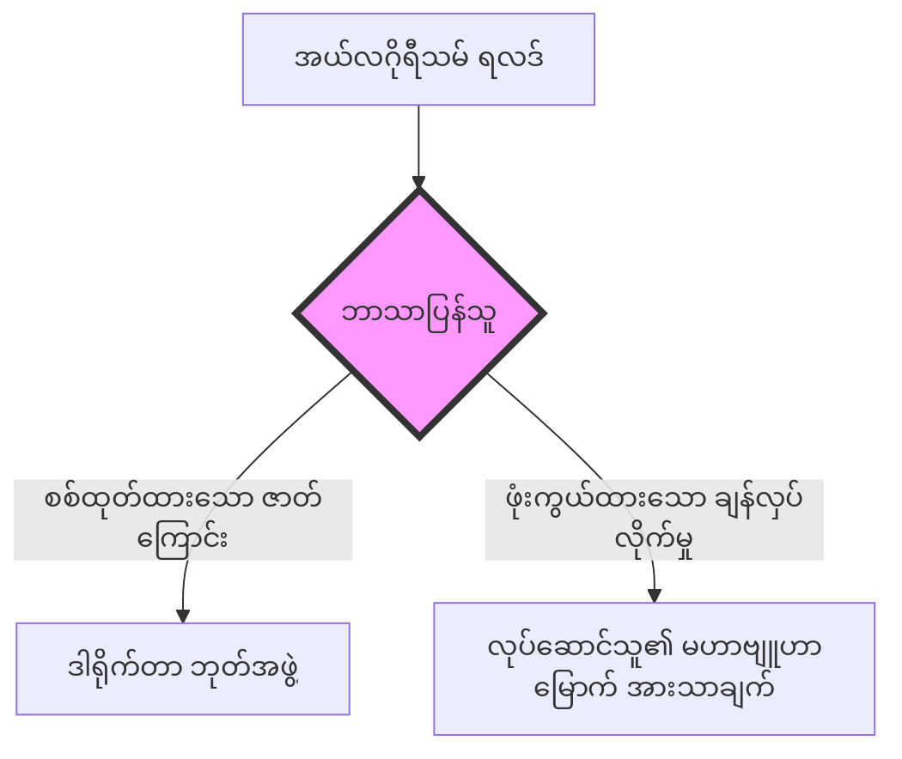

# အခန်း ၉ - ဒေတာ ဘာသာရေးအုပ်ချုပ်မှုစနစ်

သင်တစ်ခါမျှ မရောက်ဖူးသော မြို့တစ်မြို့တွင် တိုက်ခန်းတစ်ခန်း လျှောက်ထားလိုက်သည် ဆိုပါစို့။ စက္ကူဖောင် ဖြည့်စရာ မလို၊ လူတွေ့အင်တာဗျူး မရှိသလို၊ ကိုယ်ရေးရာဇဝင် စစ်ဆေးမှုလည်း မရှိပေ။ သင့်စရိုက်ကို အကဲဖြတ်ရန် လက်ဆွဲနှုတ်ဆက်ပြီး မျက်မှောင်ကြုတ်ကြည့်နေမည့် အိမ်ရှင်လည်း မရှိတော့ပါ။ ပေါ်တယ် (portal) တစ်ခုထဲသို့ နိုင်ငံသားစိစစ်ရေးကတ်ပြားနံပါတ် ထည့်သွင်းပြီး စောင့်နေလိုက်ရုံသာ ဖြစ်သည်။ စက္ကန့်လေးဆယ်အကြာတွင် မျက်နှာပြင်ပေါ်၌ ဂဏန်းတစ်လုံးတည်း ပေါ်လာသည်။ '၇၁၁'။ ၎င်းအောက်တွင် အနီရောင်စာသားဖြင့် *“လျှောက်လွှာ ငြင်းပယ်ခံရသည်။ အမှတ်သည် အနည်းဆုံးသတ်မှတ်ချက် (၇၅၀) အောက် ရောက်နေသည်”* ဟု ပြထားသည်။ မည်သည့် ကိန်းရှင်များ (variables) က ဤစီရင်ချက်ကို ထုတ်ပေးလိုက်မှန်း သင် လုံးဝ သိနိုင်မည် မဟုတ်ပေ။ သင့် ခရီးသွားမှတ်တမ်းကြောင့်လား။ ဝယ်ယူမှုပုံစံများကြောင့်လား။ လူမှုကွန်ရက် အဆက်အသွယ်များကြောင့်လား။ သို့မဟုတ် ၂၀၂၄ ခုနှစ်က သင့်ဝမ်းကွဲတစ်ယောက် စည်းမျဉ်းဖောက်ဖျက်မှုဖြင့် အမှတ်အသားပြု (flagged) ခံခဲ့ရခြင်းကြောင့်လား ဆိုသည်ကို အမှောင်ချထားသည်။ ဆက်သွယ်မေးမြန်းရန် ဖုန်းနံပါတ် မရှိပါ။ အယူခံဝင်ရန် လူသားတရားသူကြီး မရှိပါ။ ပုပ်ရဟန်းမင်းကြီး၏ အမိန့်အာဏာကဲ့သို့ တိတ်ဆိတ်ပြီး လုံးဝ ပြီးပြည့်စုံသော အာဏာဖြင့် မျက်နှာပြင်ပေါ်တွင် တောက်ပနေသော အမှတ်သာလျှင် ရှိနေသည်။ သင့်ကို စီရင်ချက်ချလိုက်ပြီ ဖြစ်သော်လည်း၊ ထိုတရားသူကြီးတွင် မျက်နှာဟူ၍ မရှိပါ။

ဤသည်မှာ စိတ်ကူးယဉ် အဆိုးမြင်ကမ္ဘာ (dystopia) တစ်ခုကို တင်စားနေခြင်း မဟုတ်ပါ။ ဤစနစ်၏ မျိုးကွဲများသည် တိုက်ကြီးများစွာတွင် အခိုင်အမာ လည်ပတ်နေပြီ ဖြစ်သည်။ တရုတ်နိုင်ငံ၏ Social Credit System အကြောင်းကို လူပြောအများဆုံး ဖြစ်သည်။ (အနောက်နိုင်ငံများက ယင်းကို ရှုပ်ထွေးသော ဗျူရိုကရေစီ အမည်ပျက်စာရင်းများ ကွန်ရက်အဖြစ် မမြင်ဘဲ၊ အရာအားလုံးကို လွှမ်းမိုးချုပ်ကိုင်ထားသည့် ရမှတ်တစ်ခုတည်းအဖြစ် နားလည်လွဲလေ့ရှိသည်။) သို့သော် ၎င်းသည် ကင်ဆာဆဲလ်များပမာ တိတ်တဆိတ် ကူးစက်ပျံ့နှံ့နေသော ကမ္ဘာလုံးဆိုင်ရာ အခြေခံအဆောက်အအုံ၏ အထင်ရှားဆုံးသော အစိတ်အပိုင်းတစ်ခုမျှသာ ဖြစ်သည်။ ဥရောပရှိ အာမခံကုမ္ပဏီများသည် စမတ်ဖုန်းများမှတစ်ဆင့် အပြုအမူဆိုင်ရာ ဒေတာ (behavioral data) များကို စုပ်ယူကြသည်။ ထို့နောက် သင် ကားမည်မျှမြန်မြန် မောင်းသနည်း၊ လေ့ကျင့်ခန်း မည်မျှလုပ်သနည်း၊ အန္တရာယ်ရှိသော လူနေမှုပုံစံနှင့် ဆက်စပ်သည့် ဆိုင်များတွင် ဈေးဝယ်တတ်သလား စသည့် အချက်များအပေါ် မူတည်၍ ပရီမီယံကြေးများကို အယ်လဂိုရီသမ် (algorithm) ဖြင့် ရက်စက်စွာ ချိန်ညှိကြသည်။ အမေရိကန်ပြည်ထောင်စုရှိ အလုပ်ရှင်များသည်လည်း လျှောက်ထားသူများကို ၎င်းတို့၏ ကိုယ်ပိုင် ရမှတ်ပေးမော်ဒယ်များ (scoring models) ဖြင့် စစ်ထုတ်နေကြသည်။ မည်သည့် လူသားအလုပ်ခေါ်ယူသူကမျှ ထည့်မတွက်နိုင်သော ဒေတာအချက်အလက် ထောင်ပေါင်းများစွာကို ၎င်းတို့က အလေးချိန်ပေး တွက်ချက်ကြသည်။ ဥပမာ - အွန်လိုင်း စာမေးပွဲဖြေစဉ် ကီးဘုတ်ရိုက်နှိပ်မှု အရှိန်၊ ဗီဒီယို အင်တာဗျူးဖြေစဉ် ဝက်ဘ်ကမ်မှ ဖမ်းယူထားသော သိမ်မွေ့သည့် မျက်နှာအမူအရာ အပြောင်းအလဲများ၊ သင် ဖျက်ပစ်လိုက်သော လူမှုကွန်ရက်ပို့စ်များ၏ ခံစားချက်ပရိုဖိုင် စသည်တို့ ဖြစ်သည်။ ဤဗိသုကာပုံစံသည် ထွန်းသစ်စ ဈေးကွက်များတွင်လည်း အမြစ်တွယ်နေပြီ ဖြစ်သည်။ မြန်မာနိုင်ငံ၌ ဆက်သွယ်ရေး အော်ပရေတာများနှင့် ဒေသတွင်း super-apps များက ဒစ်ဂျစ်တယ် အထောက်အထား ခြေရာများကို စုစည်းလာကြသည်။ ထို့နောက် ဘဏ်စာရင်းမရှိသည့် သန်းပေါင်းများစွာသော နိုင်ငံသားများအတွက် တရားဝင် ပြဋ္ဌာန်းထားခြင်း မရှိသော်လည်း လက်တွေ့တွင် အမှန်တကယ် ကြီးစိုးအသက်ဝင်နေသော (de facto) ဘဏ္ဍာရေး အကျုံးဝင်မှု ရမှတ်များကို ဖန်တီးပေးနေကြသည်။ မီတာခပေးဆောင်ရန် ပျက်ကွက်မှုတစ်ခု၊ သို့မဟုတ် အမှတ်အသားပြု (flagged) ခံရသော လူမှုကွန်ရက် အဆက်အသွယ်တစ်ခုက ကုန်သည်တစ်ဦး၏ ထောက်ပံ့ရေးကွင်းဆက် ချေးငွေရယူခွင့်ကို တိတ်တဆိတ် လည်ပင်းညှစ်သကဲ့သို့ တဖြည်းဖြည်း လျှော့ချဟန့်တားပစ်နိုင်သည်။ ဒေတာအကာအကွယ် မရှိသလောက် နည်းပါးသည့် ပတ်ဝန်းကျင်တွင်၊ အယ်လဂိုရီသမ်၏ ပွင့်လင်းမြင်သာမှုမရှိခြင်း (opacity) ကို အသုံးချ၍ စည်းမျဉ်းလိုက်နာစေရန် အတင်းအကျပ် ဖိအားပေးကြသည်။ ဤဖြစ်ရပ်တိုင်းတွင် အခြေခံ ဗိသုကာပုံစံမှာ အတူတူပင် ဖြစ်သည်။ ပွင့်လင်းမြင်သာမှုမရှိသော အယ်လဂိုရီသမ်တစ်ခုက ဒေတာများကို စုပ်ယူသည်။ စီရင်ချက်ချသည်။ ထို့နောက် ပြစ်ဒဏ် သို့မဟုတ် ဆုလာဘ်ကို သတ်မှတ်ပေးသည်။ ပါဝင်ပတ်သက်သူကို မည်သည့် အဓိပ္ပာယ်ရှိသော ရှင်းလင်းချက်မျှ မပေးပါ။ ခိုင်လုံသည့် အယူခံဝင်ရေး ယန္တရားလည်း မရှိသလို၊ အခြား ရွေးချယ်စရာ လမ်းကြောင်းလည်း မရှိပါ။ ခေါင်းငုံ့၍ လိုက်နာမည်လား။ သို့မဟုတ် စီးပွားရေးလောကမှ သာသနာပအဖြစ် နှင်ထုတ် (excommunicated) ခံမည်လား။ ဤနှစ်လမ်းသာ ရှိသည်။

သမိုင်းကြောင်းအရ ယှဉ်ကြည့်လျှင် ဤတူညီမှုမှာ သိမ်မွေ့လွန်းလှသည် မဟုတ်သလို၊ တိုက်ဆိုင်မှုလည်း လုံးဝ မဟုတ်ပေ။ နှစ်တစ်ထောင်ကြာမျှ ကက်သလစ်အသင်းတော်သည် ဥရောပကို အုပ်ချုပ်ခဲ့သည်။ လူသားများနှင့် နားလည်ရခက်သော အထက်တန်ခိုးရှင်တို့ကြားရှိ ကြားခံနယ်မြေကို ဖွဲ့စည်းပုံအရ လက်ဝါးကြီးအုပ်ထားခြင်းဖြင့် အုပ်ချုပ်ခဲ့ခြင်း ဖြစ်သည်။ ဘုရားသခင်၏ အလိုတော်ကို မည်သူမျှ မသိနိုင်ပါ။ ကိုယ်တော်၏ စီရင်ချက်များသည် သာမန်လူများ၏ နားလည်နိုင်စွမ်းထက် ကျော်လွန်နေသည်။ သို့သော် ဘုန်းတော်ကြီးကမူ ၎င်းတို့ကို ဘာသာပြန်ဆိုပေးနိုင်စွမ်း ရှိသည်။ ဘုန်းတော်ကြီးသည် ယဇ်ပလ္လင်ထက်တွင် မတ်တတ်ရပ်ကာ ပရိသတ်များ နားမလည်သော ဘာသာစကားဖြင့် ရိုးရာဓလေ့များကို ဆောင်ရွက်သည်။ ထို့နောက် ဘုရားသခင်၏ လျှို့ဝှက်ချက်များကို မြေကြီးပေါ်ရှိ ညွှန်ကြားချက်များအဖြစ် သူကသာ တစ်ဦးတည်း ဘာသာပြန်ဆိုပေးသည်။ ကယ်တင်ခြင်းနှင့် ပြစ်ဒဏ်ချမှတ်ခြင်းတို့သည် လူတစ်ဦးချင်းစီနှင့် ဘုရားသခင်ကြား ဆက်ဆံရေးအပေါ် မူတည်နေခြင်း မဟုတ်တော့ပါ။ လူတစ်ဦးချင်းစီနှင့် ဘုန်းတော်ကြီးကြား ဆက်ဆံရေးအပေါ်တွင်သာ လုံးလုံးလျားလျား မူတည်နေသည်။ အသင်းတော်၏ အာဏာသည် ယုံကြည်ခြင်းမှ ဆင်းသက်လာခြင်း မဟုတ်ပေ။ ပွင့်လင်းမြင်သာမှုမရှိခြင်း (opacity) ကို လက်ဝါးကြီးအုပ်ထားခြင်းမှ ဆင်းသက်လာခြင်းသာ ဖြစ်သည်။ သမ္မာကျမ်းစာကို ဒေသသုံး ဘာသာစကားများသို့ ဘာသာပြန်ဆိုလိုက်သောအခါ၊ သာမန်လူများသည် ဘုရားသခင်၏ ရင်းမြစ်ကုဒ် (source code) ကို ကိုယ်တိုင် ဖတ်ရှုခွင့် ရရှိသွားကြသည်။ ထိုအခိုက်အတန့်မှာပင် အသင်းတော်၏ အကြွင်းမဲ့ လက်ဝါးကြီးအုပ်မှု ပြိုကွဲသွားခဲ့သည်။ မာတင်လူသာ (Martin Luther) သည် ရောမကို ဘာသာရေးသဘောတရားဖြင့် အနိုင်ယူခဲ့ခြင်း မဟုတ်ပါ။ သူသည် အသုံးပြုသူ ကြားခံစနစ် (user interface) ကို အဆင့်မြှင့်တင်ပေးခြင်းဖြင့် ရောမ၏ အာဏာကို ချိုးနှိမ်ခဲ့ခြင်း ဖြစ်သည်။

ပွင့်လင်းမြင်သာမှုမရှိခြင်းသည် အုပ်ချုပ်မှုပုံစံတစ်ရပ်အဖြစ် ဆောင်ရွက်နေသည်။ အရေးပါသော ဖွဲ့စည်းပုံဆိုင်ရာ ထိုးထွင်းသိမြင်မှုမှာ ဤအချက်ပင် ဖြစ်သည်။ ကမ္ဘာတစ်ဝှမ်းတွင် ပျံ့နှံ့နေသော အယ်လဂိုရီသမ် အုပ်ချုပ်မှုစနစ်များစွာကို လူအများ လွယ်ကူစွာ နားလည်နိုင်ရန် ဒီဇိုင်းထုတ်ထားခြင်း မဟုတ်ပေ။ ၎င်းတို့သည် အကြွင်းမဲ့ လိုက်နာရန် တောင်းဆိုသည့်အတွက်ကြောင့်သာ ထိရောက်စွာ အလုပ်လုပ်နေခြင်း ဖြစ်သည်။ ချေးငွေရမှတ်ပေးခြင်း၊ ကြိုတင်ခန့်မှန်းသော ရဲလုပ်ငန်း (predictive policing)၊ အလုပ်ခန့်ထားမှု စစ်ထုတ်ခြင်းနှင့် အကြောင်းအရာ စိစစ်ခြင်း (content moderation) တို့ကို မောင်းနှင်ပေးနေသည့် အာရုံကြောကွန်ရက် (neural networks) များသည် ရှုပ်ထွေးရုံမျှသာ မကပါ။ ၎င်းတို့သည် အခြေခံအားဖြင့် သင်္ချာနည်းအရ ပွင့်လင်းမြင်သာမှု လုံးဝ မရှိအောင် ဖန်တီးထားခြင်း ဖြစ်သည်။ ဘီလီယံနှင့်ချီသော ပါရာမီတာများ (parameters) ပါဝင်သည့် နက်ရှိုင်းသော သင်ယူမှု မော်ဒယ် (deep learning model) တစ်ခုသည် လူသားဦးနှောက် စစ်ဆေးနိုင်သည့် မည်သည့်နည်းလမ်းဖြင့်မျှ အကြောင်းပြချက် ပေးမည်မဟုတ်ပါ။ ၎င်းသည် လူသားတို့ စိတ်ကူးဖြင့်ပင် မမှန်းဆနိုင်သော အတိုင်းအတာ နယ်ပယ်များစွာထဲမှ ပုံစံများကို ဖော်ထုတ်ပေးသည်။ မည်သည့် လူသားကမျှ အခြေခံမူလများမှနေ၍ ပြောင်းပြန်-အင်ဂျင်နီယာ (reverse-engineer) မလုပ်နိုင်သော စီရင်ချက်များကို ချမှတ်ပေးသည်။ စနစ်တစ်ခုက သင့်အား အိမ်ရာချေးငွေ ငြင်းပယ်လိုက်သောအခါ၊ တိုးမြှင့်စောင့်ကြည့်ရန် သင့်ကို အမှတ်အသားပြု (flag) လိုက်သောအခါ၊ သို့မဟုတ် သင့်အကြောင်းအရာကို အရိပ်သဖွယ် ပိတ်ပင် (shadowbans) လိုက်သောအခါ၊ စနစ်ကို တည်ဆောက်ခဲ့သော အင်ဂျင်နီယာများကိုယ်တိုင် အဘယ်ကြောင့် ထိုသို့ဖြစ်ရသည်ကို မကြာခဏ ရှင်းမပြနိုင်ကြပါ။ ဤသည်မှာ ချို့ယွင်းချက် (bug) တစ်ခု မဟုတ်ပါ။ ၎င်းသည် ဗိသုကာပုံစံ၏ အခြေခံကျသော အစိတ်အပိုင်းတစ်ခုသာ ဖြစ်သည်။ ပွင့်လင်းမြင်သာမှုမရှိခြင်းသည် နည်းပညာ၏ ကန့်သတ်ချက်တစ်ခုမျှသာ မဟုတ်ပေ။ မကြာခဏဆိုသလို ယင်းသည် ၎င်း၏ အာဏာပိုင်စိုးမှု၏ အဓိကရင်းမြစ်ပင် ဖြစ်နေသည်။

ဖွဲ့စည်းပုံဆိုင်ရာ စက်ယန္တရားများကို စဉ်းစားကြည့်ပါ။ လူသားတရားသူကြီးတစ်ဦးက တရားခံတစ်ဦးကို ပြစ်ဒဏ်ချမှတ်သောအခါ၊ ထိုစီရင်ချက်၏ အကြောင်းပြချက်ကို အများပြည်သူ သိပိုင်ခွင့်ရှိသည်။ ဥပဒေမူဘောင်ကို ရှင်းလင်းစွာ ပြဋ္ဌာန်းထားသည်။ အယူခံဝင်ရေး လုပ်ငန်းစဉ်ကို သတ်မှတ်ထားသည်။ စနစ်တစ်ခုလုံးကို အနည်းဆုံး သီအိုရီအရ အခြားလူသားများက ဝင်ရောက်စစ်ဆေးနိုင်သည်။ ဤပွင့်လင်းမြင်သာမှုသည် လူသားများ အုပ်ချုပ်သော စနစ်တစ်ခုတွင် တရားဝင်မှု၏ အခြေခံအုတ်မြစ် ဖြစ်သည်။ သို့သော် အယ်လဂိုရီသမ် အုပ်ချုပ်မှုက ထိုညီမျှခြင်းကို ပြောင်းပြန်လှန်ပစ်လိုက်သည်။ ထည့်သွင်းချက်များကို မမြင်နိုင်ပါ။ ပါဝင်ပတ်သက်သူက တစ်ခါမျှ သဘောမတူခဲ့သော၊ ရေတွက်၍မရနိုင်သော ဒေတာစီးကြောင်း ထောင်ပေါင်းများစွာမှ ၎င်းတို့ကို ရယူထားသည်။ လုပ်ငန်းစဉ်သည် နားလည်၍မရနိုင်အောင် ရှုပ်ထွေးလှသည်။ ၎င်းသည် လူသားတို့၏ သိမြင်မှုစွမ်းရည်ထက် ကျော်လွန်သော တိုင်းတာမှုများတစ်လျှောက် လုပ်ဆောင်သည့် သင်္ချာဆိုင်ရာ အသွင်ပြောင်းမှုတစ်ခု ဖြစ်သည်။ ရလဒ်သည် ဒွိစုံ (binary) သဘောသာ ဖြစ်သည်။ အတည်ပြုသည်၊ သို့မဟုတ် ငြင်းပယ်သည်။ အမှတ်အသားပြုသည်၊ သို့မဟုတ် ရှင်းလင်းသည်။ မြင်နိုင်သည်၊ သို့မဟုတ် မမြင်နိုင်ပါ။ ထို့အပြင် အများစုသော အကောင်အထည်ဖော်မှုများတွင် အယူခံဝင်ရေး လုပ်ငန်းစဉ်ဆိုသည်မှာ တမင် ရည်ရွယ်ချက်ရှိရှိ ဖျောက်ဖျက်ထားသလောက်ပင် ဖြစ်သည်။ အာရုံကြောကွန်ရက် (neural network) တစ်ခုကို သင် ပြန်လှန်စစ်မေး၍ မရနိုင်ပါ။ gradient descent တစ်ခုကို သင် တရားရုံးသို့ ဆင့်ခေါ်စာ ထုတ်၍မရပါ။ အယ်လဂိုရီသမ်၏ စီရင်ချက်သည် မီးလောင်နေသော ချုံပုတ်ထဲမှ ထွက်ပေါ်လာသည့် ဘုရားသခင်၏ ကြေညာချက်ကဲ့သို့ ငြင်းဆို၍မရသော အဆုံးသတ်မှုမျိုးဖြင့် ရောက်ရှိလာသည်။ နားလည်ရခက်သည်။ လုံးဝဥဿုံ အာဏာပြည့်ဝသည်။ စိန်ခေါ်၍ မရနိုင်ပေ။ ရှင်ဘုရင်များ၏ ဘုရားပေး အခွင့်အရေးကို ဒေတာများ၏ ဘုရားပေး အခွင့်အရေးဖြင့် အစားထိုးလိုက်ပြီ ဖြစ်သည်။ ဤအချုပ်အခြာအာဏာပိုင် အသစ်သည် အိပ်လည်းမအိပ်သလို၊ ၎င်းကိုယ်တိုင်လည်း ရှင်းပြမည်မဟုတ်သော ဗာဂျီးနီးယားပြည်နယ်ရှိ ဆာဗာခြံကြီးတစ်ခုသာ ဖြစ်သည်။

ဤစနစ်များကို အသုံးပြုနေသော အစိုးရများနှင့် ကော်ပိုရေးရှင်းများသည် ပွင့်လင်းမြင်သာမှုမရှိခြင်းဆိုသည်မှာ ချို့ယွင်းချက်မဟုတ်ဘဲ အသုံးဝင်သော လုပ်ဆောင်ချက် (feature) တစ်ခုဖြစ်ကြောင်းကို မတူညီသော အတိုင်းအတာရှိသည့် ကောက်ကျစ်မှုများဖြင့် (with varying degrees of cynicism) ကောင်းစွာ နားလည်ထားကြသည်။ ပွင့်လင်းမြင်သာသော အယ်လဂိုရီသမ်တစ်ခုကို လှည့်စား (game) လို့ ရသည်။ နားလည်နိုင်သော ရမှတ်ပေးစနစ်တစ်ခုကို လူထုက ပြောင်းပြန်-အင်ဂျင်နီယာ (reverse-engineer) လုပ်နိုင်ပြီး ထုတ်ကုန်စက်ဝန်း တစ်ခုတည်းအတွင်းမှာပင် အသုံးမဝင်ဖြစ်သွားအောင် ဖျက်ဆီးပစ်နိုင်သည်။ သို့သော် ပွင့်လင်းမြင်သာမှုမရှိသော အယ်လဂိုရီသမ်တစ်ခုကိုမူ မည်သူကမျှ လှည့်စား၍ မရနိုင်ပါ။ (၎င်း၏ ဖန်တီးရှင်များကိုယ်တိုင်ပင် ၎င်း၏ အတွင်းပိုင်းယုတ္တိကို အမှန်တကယ် မသိနိုင်ပေ။) အဘယ်ကြောင့်ဆိုသော် ယှဉ်ပြိုင်လှည့်စားရန် ခိုင်မာသော အရာဝတ္ထု မရှိသောကြောင့် ဖြစ်သည်။ ထို့ကြောင့် ပါဝင်ပတ်သက်သူသည် ထာဝစဉ်၊ အရာရာတိုင်းတွင် ခြုံငုံ၍ နာခံမှုပေးရမည့် အခြေအနေတစ်ခုသို့ (generalized obedience) ကျရောက်သွားသည်။ မည်သည့် သီးခြားအပြုအမူများက ၎င်းတို့၏ ရမှတ်ကို တိုးစေမည်ကို မသိသောကြောင့်၊ ၎င်းတို့၏ အပြုအမူ *အားလုံး* ကို သတိထား ပြင်ဆင်လာကြသည်။ မည်သည့် အဆက်အသွယ်များက အမှတ်အသားပြုခြင်း (flagging) ကို ဖြစ်ပေါ်စေမည်ကို မသိသောကြောင့်၊ ၎င်းတို့၏ အဆက်အသွယ် *အားလုံး* ကို ကိုယ်တိုင် ဆင်ဆာဖြတ်လာကြသည်။ ပန်နော့ပ်တီကွန် (panopticon) ၏ စောင့်ကြည့်မှု အကျိုးသက်ရောက်မှုသည် ဤနေရာတွင် အပြည့်အဝ အလုပ်လုပ်သည်။ အယ်လဂိုရီသမ်သည် လူတိုင်း၏ ဘဝအခိုက်အတန့်တိုင်းကို အမှန်တကယ် စောင့်ကြည့်နေရန် မလိုအပ်ပါ။ ၎င်းသည် အချိန်မရွေး စောင့်ကြည့် *နိုင်သည်* ဆိုသော ယုံကြည်လောက်သည့် ကြောက်ရွံ့မှုကို ဖန်တီးပေးရန်သာ လိုအပ်သည်။ ဂျရမီ ဘင်သမ် (Jeremy Bentham) သည် အစောင့်က မိမိတို့ကို စောင့်ကြည့်နေခြင်း ရှိမရှိကို အကျဉ်းသားများ မည်သည့်အခါမျှ မသိနိုင်သော အကျဉ်းထောင်တစ်ခုကို ဒီဇိုင်းထုတ်ခဲ့သည်။ အယ်လဂိုရီသမ် ပန်နော့ပ်တီကွန် သည် ဘင်သမ်၏ ပြီးပြည့်စုံသော ဒီဇိုင်းပင် ဖြစ်သည်။ လူသားအစောင့်နေရာတွင် အမြဲတမ်း စောင့်ကြည့်နေမည့် လုပ်ငန်းစဉ်တစ်ခုဖြင့် အစားထိုးလိုက်သည်။ ထို့နောက် ထိုလုပ်ငန်းစဉ်သည် အမှားအယွင်းကင်းသည်ဟု အကျဉ်းသားများကိုယ်တိုင် ယုံကြည်သွားစေသည်။

ဤပေါင်းဆုံမှုသည် အဆုံးမှတ်တစ်ခုဆီသို့ အရှိန်အဟုန်ဖြင့် ဦးတည်နေသည်။ ဤအကြောင်းကို မူဝါဒချမှတ်သူအများစုက လူသိရှင်ကြား ထုတ်ဖော်ပြောဆိုရန် နားမလည်ကြသလို၊ ၎င်းတို့ကိုယ်တိုင် ပါဝင်ပတ်သက်နေမှုများလည်း ရှိနေသည်။ ကော်ပိုရိတ်နှင့် နိုင်ငံတော် စောင့်ကြည့်လေ့လာရေးတို့ ပေါင်းစပ်သွားခြင်းသည် အနာဂတ်မှ ဖြစ်လာမည့် အန္တရာယ်တစ်ခု မဟုတ်ပါ။ ၎င်းမှာ အစိုးရနှင့် ပုဂ္ဂလိကကဏ္ဍတို့၏ အာဏာပိုင်ဆိုင်ခွင့် နယ်ပယ် ခွဲခြားထားသည်ဆိုသော ဟန်ပြဇာတ်ခင်းမှု (jurisdictional theater) ၏ ပါးလွှာသည့် ကုလားကာနောက်ကွယ်တွင် လည်ပတ်နေသည့် လက်ရှိ အဖြစ်မှန်တစ်ခုပင် ဖြစ်သည်။ ထောက်လှမ်းရေးအေဂျင်စီများသည် တရားရုံးဝရမ်းများ ရယူရန် ကြိုးစားနေမည့်အစား စီးပွားရေး ပွဲစားများထံမှ တည်နေရာဒေတာ (location data) များကို ဝယ်ယူနေကြသည်။ အစိုးရများသည် ကြိုတင်ခန့်မှန်းသော ရဲလုပ်ငန်း မော်ဒယ်များ (predictive policing models) တည်ဆောက်ရန် ပုဂ္ဂလိက AI ကုမ္ပဏီများနှင့် စာချုပ်ချုပ်ဆိုကြသည်။ ထို့နောက် ကုန်သွယ်မှု လျှို့ဝှက်ချက် အကာအကွယ်များ (trade secret protections) ကို အသုံးပြု၍ ထိုအယ်လဂိုရီသမ်များကို တရားရုံးက ဝင်ရောက်စစ်ဆေးခွင့် မရအောင် လိမ္မာပါးနပ်စွာ ကာကွယ်ထားကြသည်။ ကျန်းမာရေး အာမခံကုမ္ပဏီများသည် လူနာများ၏ ကျန်းမာရေးအက်ပ်များမှ ဒေတာများကို တိတ်တဆိတ် စုပ်ယူကြသည်။ "ကော်ပိုရိတ် ဒေတာစုဆောင်းမှု" နှင့် "နိုင်ငံတော် စောင့်ကြည့်လေ့လာရေး" ကြားရှိ ကွာခြားချက်မှာ ပြည်သူ့ဆက်ဆံရေး ရည်ရွယ်ချက်များအတွက်သာ ထိန်းသိမ်းထားသော ဥပဒေဆိုင်ရာ လုပ်ကြံဖန်တီးမှုတစ်ခုသာ ဖြစ်သည်။ အမှန်တကယ် အခြေခံအဆောက်အအုံသည် တစ်ခုတည်းသော၊ စဉ်ဆက်မပြတ် စီးဆင်းနေသော ပိုက်လိုင်းတစ်ခုသာ ဖြစ်သည်။ အရေးပါသော အကျိုးစီးပွားများ တူညီနေသည့် အဖွဲ့အစည်းများအကြားတွင် ဒေတာများသည် လွတ်လပ်စွာ စီးဆင်းနေသည်။ နိုင်ငံတော်နှင့် ကော်ပိုရေးရှင်း နှစ်ခုစလုံးသည် အမြင့်ဆုံး ကြိုတင်ခန့်မှန်းနိုင်သော၊ အမြင့်ဆုံး လိုက်နာမှုရှိသော၊ နှင့် စနစ်တကျ ခုခံရန် အစွမ်းအနည်းဆုံး ဖြစ်သော လူဦးရေတစ်ရပ်ကို ဖန်တီးကာ အကျိုးအမြတ် ခေါင်းပုံဖြတ်နေကြသည်။

သိသာထင်ရှားသော စည်းမျဉ်းစည်းကမ်းဆိုင်ရာ ဟန့်တားမှုများ ရှိနေသော်လည်း၊ စောင့်ကြည့်လေ့လာရေး ပေါင်းစပ်မှု လမ်းကြောင်းသာ ဆက်လက်တည်ရှိနေပါက၊ ဤအခြေခံအဆောက်အအုံသည် မကြုံစဖူး သိပ်သည်းကျစ်လျစ်သည့် အခြေအနေသို့ ရောက်ရှိသွားမည်မှာ အသေအချာပင် ဖြစ်သည်။ ငွေပေးငွေယူများ၊ ရုပ်ပိုင်းဆိုင်ရာ ရွေ့လျားမှုများ၊ ဆက်သွယ်ရေးများနှင့် ဇီဝတိုင်းတာမှု (biometric) ဆိုင်ရာ အတက်အကျများကို အချိန်နှင့်တစ်ပြေးညီ စုပ်ယူ၊ ဆက်စပ်ပြီး ရမှတ်ပေးလာတော့မည်။ စနစ်၏ မျက်လုံးမှကြည့်လျှင်၊ လူတစ်ဦးချင်းစီသည် ၎င်းတို့၏ အနာဂတ်အပြုအမူများကို မြင့်မားသော တိကျမှုဖြင့် ဖြစ်တန်စွမ်း သင်္ချာနည်းအရ (probabilistically) မော်ဒယ်တည်ဆောက် ခန့်မှန်းထားသော၊ စဉ်ဆက်မပြတ် အပ်ဒိတ် (update) လုပ်နေသည့် ဗက်တာ (vector) တစ်ခုအဖြစ်သာ တည်ရှိနေတော့သည်။ အဆင့်မြင့် အကောင်အထည်ဖော်မှုများသည် သွေဖည်မှုကို အပြစ်ပေးရန် စောင့်ဆိုင်းနေမည် မဟုတ်တော့ပါ။ ၎င်းတို့သည် သွေဖည်မှု၏ ရှေ့ပြေးလက္ခဏာများကို ကြိုတင်ခန့်မှန်းကြမည် ဖြစ်သည်။ ဥပမာ - ပုံမှန်မဟုတ်သော လူမှုကွန်ရက် အဆက်အသွယ်များ၊ ပုံမှန်မဟုတ်သော သတင်းအချက်အလက် ဖတ်ရှုမှုများ စသည်တို့ကို ကြိုတင်ခန့်မှန်းပြီး လုပ်ရပ် အပြည့်အဝ မပေါ်ပေါက်မီ ကြားဝင်စွက်ဖက် ချေမှုန်းကြမည် ဖြစ်သည်။ ပါဝင်ပတ်သက်သူသည် ယင်းကို ဗြောင်ကျကျ ဖိနှိပ်မှုတစ်ခုအဖြစ် မြင်မည်မဟုတ်ဘဲ၊ ညင်သာသော အယ်လဂိုရီသမ်၏ လမ်းညွှန်တွန်းအားပေးမှုတစ်ခုအဖြစ်သာ ကြုံတွေ့ရမည် ဖြစ်သည်။ ဥပမာ - လမ်းကြောင်းပြောင်းခံလိုက်ရသော ခရီးစဉ်တစ်ခု၊ တိတ်တဆိတ် ဖယ်ရှားခံလိုက်ရသော ရှာဖွေမှုရလဒ်တစ်ခု၊ သိမ်မွေ့စွာ ပြန်လည်ချိန်ညှိထားသော လူမှုကွန်ရက် ဖိဒ် (feed) တစ်ခု အစရှိသဖြင့် ဖြစ်သည်။ ဤအနာဂတ်ကို တားဆီးနိုင်မည့် ကန့်သတ်ချက်မှာ နည်းပညာစွမ်းဆောင်နိုင်ရည် မဟုတ်ပါ။ ယင်းကို ခုခံတွန်းလှန်လိုသော နိုင်ငံသားများ၏ ကျန်ရစ်နေသေးသည့် ဆန္ဒအပေါ်တွင်သာ မူတည်နေသည်။

မည်သည့် လူသားတစ်ဦးတစ်ယောက်ကမျှ ဤစနစ် မည်သို့ အလုပ်လုပ်သည်ကို အပြည့်အဝ နားလည်နိုင်မည် မဟုတ်ပါ။ မည်သည့် အင်ဂျင်နီယာ၊ မည်သည့် ဗျူရိုကရက်၊ မည်သည့် အမှုဆောင်တစ်ဦးကမျှ ဒေတာစီးဆင်းမှုများ၏ အပြည့်အဝ မြေမျက်နှာသွင်ပြင်ကို မြေပုံရေးဆွဲနိုင်စွမ်း ရှိမည် မဟုတ်ပေ။ ရမှတ်ပေး မော်ဒယ်များ၏ ပြီးပြည့်စုံသော ယုတ္တိဗေဒ၊ အပြုအမူဆိုင်ရာ ကြားဝင်စွက်ဖက်မှု ပိုက်လိုင်းများ၏ စုစုပေါင်း ဗိသုကာပုံစံ စသည်တို့ကိုလည်း မည်သူမျှ သိနိုင်မည် မဟုတ်ပါ။ ဤအချက်ကပင် ဖွဲ့စည်းပုံဆိုင်ရာ ခြယ်လှယ်မှုများအတွက် အလွန် အခွင့်သာသော၊ လျှို့ဝှက်နက်နဲသည့် ပတ်ဝန်းကျင်တစ်ခုကို ဖန်တီးပေးထားသည်။

### ကာကွယ်ရေး ပုံစံ- ဘာသာပြန်သူ၏ လက်ဝါးကြီးအုပ်မှု

**ပုံစံ**
အကင်းပါးသော လုပ်ဆောင်သူတစ်ဦးသည် ပွင့်လင်းမြင်သာမှုမရှိသော အယ်လဂိုရီသမ်စနစ်နှင့် အဖွဲ့အစည်း ခေါင်းဆောင်မှုအကြားတွင် တစ်ဦးတည်းသော "ဘာသာပြန်သူ" အဖြစ် မိမိကိုယ်ကို နေရာယူထားသည်။ ထို့နောက် တိုက်ခိုက်၍မရနိုင်သော အသာစီးရမှုကို ရယူရန်၊ အခြားသူများ၏ လွတ်လပ်စွာ အဓိပ္ပာယ်ကောက်ယူနိုင်စွမ်း ဖွံ့ဖြိုးလာခြင်းကို တက်ကြွစွာ တားဆီးပိတ်ပင် ချေမှုန်းသည်။

**ယန္တရား**
စနစ်တစ်ခု၏ သင်္ချာဆိုင်ရာ ရှုပ်ထွေးမှုကြောင့် ခေါင်းဆောင်ပိုင်းက ခြိမ်းခြောက်ခံရသည်ဟု ခံစားရသောအခါ၊ ၎င်းတို့သည် ရလဒ်များကို ကြားဝင်ဆောင်ရွက်ပေးသည့် ခေတ်သစ် "ဘုန်းတော်ကြီးများ" (ဒေတာ သိပ္ပံပညာရှင်များ သို့မဟုတ် အတိုင်ပင်ခံများ) အပေါ် မှီခိုလာကြသည်။ အမြတ်ထုတ်လိုသော လုပ်ဆောင်သူတစ်ဦးသည် ဒေတာအားလုံးကို ၎င်းတို့၏ ရုံးခန်းမှတစ်ဆင့်သာ စီးဆင်းစေရန် လုပ်ငန်းအသွားအလာများကို ပါးနပ်စွာ ပြန်လည်ဖွဲ့စည်းမည် ဖြစ်သည်။ ယင်းကို ဓမ္မဓိဋ္ဌာန်ကျသော အယ်လဂိုရီသမ် အမှန်တရားအဖြစ် တင်ပြကာ၊ ထို "ဗျာဒိတ်တော်များ" ကို ၎င်းတို့ကိုယ်ပိုင် လျှို့ဝှက်အစီအစဉ်နှင့် ကိုက်ညီစေရန် စီစဉ်ဖန်တီးကြသည်။ အချိန်ကြာလာသည်နှင့်အမျှ၊ အဖွဲ့အစည်းသည် စက်ပေါ်တွင် မှီခိုရခြင်း မဟုတ်ဘဲ ထိုဘာသာပြန်သူအပေါ် လုံးဝ ဩဇာခံ မှီခိုလာရတော့သည်။

**သတိပေး လက္ခဏာများ**
- ဒေတာ ထိုးထွင်းသိမြင်မှုအားလုံးသည် ခေါင်းဆောင်ပိုင်းထံ မရောက်မီ လူတစ်ဦးတည်း သို့မဟုတ် တင်းကျပ်စွာ ထိန်းချုပ်ထားသော သီးသန့်အဖွဲ့တစ်ခုမှတစ်ဆင့်သာ ဖြတ်သန်းသွားရမည်ဟု မဖြစ်မနေ သတ်မှတ်ထားသော လုပ်ငန်းအသွားအလာများ ရှိနေခြင်း။
- အခြားဌာနများတွင် ဒေတာတတ်ကျွမ်းမှု သို့မဟုတ် လွတ်လပ်စွာ အတည်ပြုစစ်ဆေးခြင်းများ ပြုလုပ်လာသည်ကို တက်ကြွစွာ ဖိနှိပ် အားလျှော့စေခြင်း။
- အယ်လဂိုရီသမ် ရလဒ်သည် ၎င်းတို့၏ အစီအစဉ်ကို ထောက်ခံသောအခါ အမြင့်ဆုံး ယုံကြည်မှုဖြင့် တင်ပြသော်လည်း၊ ၎င်းတို့ကို ဆန့်ကျင်သောအခါတွင်မူ "မော်ဒယ်၏ ကန့်သတ်ချက်များ" (model's limitations) ဟု အလေးပေးပြောဆိုတတ်သည့် ဘာသာပြန်သူတစ်ဦး ရှိနေခြင်း။
- အရေးကြီးသော ဆုံးဖြတ်ချက်ချရမည့် အချိန်များတွင် ဘာသာပြန်သူ ရုတ်တရက် ရှင်းပြ၍မရဘဲ ပျက်ကွက်နေတတ်ခြင်း (၎င်းတို့ မပါလျှင် မဖြစ်ကြောင်း ပြသလိုသည့် ပါးနပ်သော နည်းဗျူဟာတစ်ခု ဖြစ်သည်)။

**ကာကွယ်ရေး တန်ပြန်လုပ်ဆောင်ချက်များ**
- ဆန့်ကျင်ဘက်ဖြစ်နေသော ဘာသာပြန်သူ၏ လက်ဝါးကြီးအုပ်မှုကို သတိပြုပါ။ ဘုတ်အဖွဲ့အတွက် ဒေတာအကြမ်း API မှတစ်ဆင့် သာမန်ဘာသာစကားသို့ တိုက်ရိုက်ဘာသာပြန်ရန် သီးခြား LLM အေးဂျင့် (independent LLM agent) တစ်ခုကို မိတ်ဆက်ပေးခြင်းဖြင့် ထိုဘာသာပြန်သူ၏ အမှားများကို စစ်ဆေးနိုင်သည်။
- အမှုဆောင် အစည်းအဝေးများအတွင်း ထိုအထိန်းအကွပ်မဲ့ အေးဂျင့်၏ ရလဒ်များနှင့် နှိုင်းယှဉ်ကာ ၎င်းတို့၏ ဇာတ်ကြောင်းကို ပွင့်လင်းမြင်သာစွာ ရှင်းလင်းတင်ပြရန် ဘာသာပြန်သူအား တောင်းဆိုပါ။
- ဒေတာတတ်ကျွမ်းမှုကို ဒီမိုကရေစီဆန်အောင် ပြုလုပ်ပါ။ အမှုဆောင်အဖွဲ့တစ်လျှောက်လုံး အဓိက မော်ဒယ်များအကြောင်း အခြေခံ နားလည်ထားရန် တောင်းဆိုပါ။
- အဓိက ဘာသာပြန်သူ၏ ကောက်ချက်များကို စစ်ဆေးရန်နှင့် စိန်ခေါ်ရန် အခြား လေ့လာဆန်းစစ်သူများကို ပုံမှန် တာဝန်ပေးသည့် "red-teaming" ကို အဖွဲ့အစည်းပုံစံချ အကောင်အထည်ဖော်ပါ။

**ကျရှုံးမှု နှင့် ကုန်ကျစရိတ်**
ဘာသာပြန်ဆိုမှု အလွှာကို ဘာသာပြန်သူတစ်ဦးအား လက်ဝါးကြီးအုပ်ခွင့် ပြုထားသော အဖွဲ့အစည်းများသည် ၎င်းတို့၏ မဟာဗျူဟာမြောက် အချုပ်အခြာအာဏာကို အလွယ်တကူ လက်လွှတ်လိုက်ရသည်။ ၎င်းတို့သည် ဒေတာအခြေပြု ဆုံးဖြတ်ချက်များကို ချမှတ်နေသည်ဟု အထင်မှား ယုံကြည်ကြသည်။ သို့သော် လက်တွေ့တွင်မူ ဘာသာပြန်သူ၏ ဖုံးကွယ်ထားသော နိုင်ငံရေး အစီအစဉ်က တွန်းအားပေးသည့် ဆုံးဖြတ်ချက်များကိုသာ ချမှတ်နေကြခြင်း ဖြစ်သည်။ အချိန်ကြာလာသည်နှင့်အမျှ ဤအမှားအယွင်းသည် အဖွဲ့အစည်းကို ကြီးမားဆိုးရွားသော လွဲချော်မှုများနှင့် အဆုံးအရှုံးများဆီသို့ မလွဲမသွေ ဦးတည်သွားစေသည်။

**တရားဝင် နယ်နိမိတ်**
ရှုပ်ထွေးသော မော်ဒယ်များကို အဓိပ္ပာယ်ကောက်ယူရန် ကျွမ်းကျင်သူများကို အလုပ်ခန့်ထားခြင်းသည် တရားဝင်ပြီး လိုအပ်သော ကိစ္စဖြစ်သည်။ သို့သော် မိမိကိုယ်ပိုင် အသာစီးရရန်အတွက် အတုအယောင် ပိတ်ဆို့မှုတစ်ခု (artificial bottleneck) ကို တမင် ဖန်တီးရန်၊ အမှန်တရားကို ဖုံးကွယ်ရန်နှင့် အဖွဲ့အစည်းဆိုင်ရာ ဆုံးဖြတ်ချက်ချခြင်းကို အကြွင်းမဲ့ သိမ်းပိုက်ရန် ထိုကျွမ်းကျင်မှုကို လက်နက်အဖြစ် အသုံးပြုလာသောအခါတွင်မူ ကျင့်ဝတ်ဆိုင်ရာ နယ်နိမိတ်ကို ကျော်လွန်သွားပြီ ဖြစ်သည်။ ၎င်းသည် ပညာရပ်ကို အသုံးချ၍ အာဏာသိမ်းခြင်းတစ်ရပ်ပင် ဖြစ်သည်။

---
